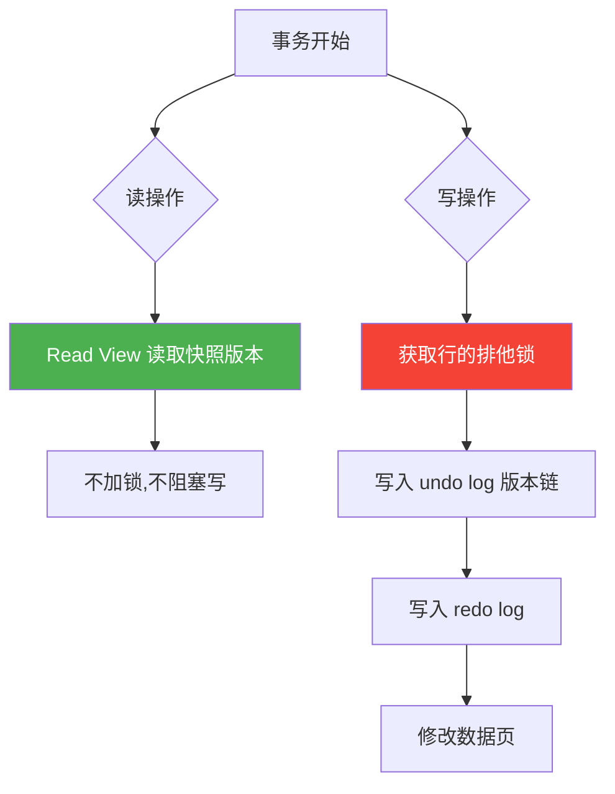
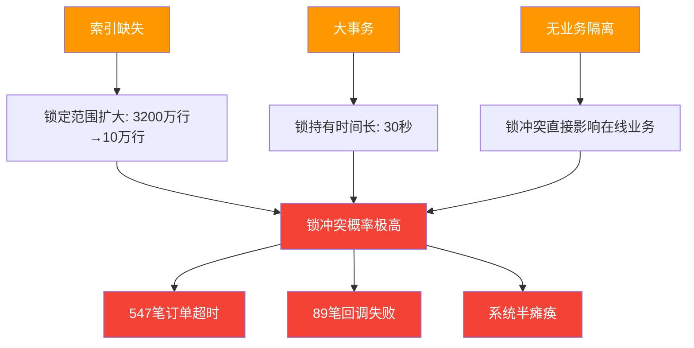
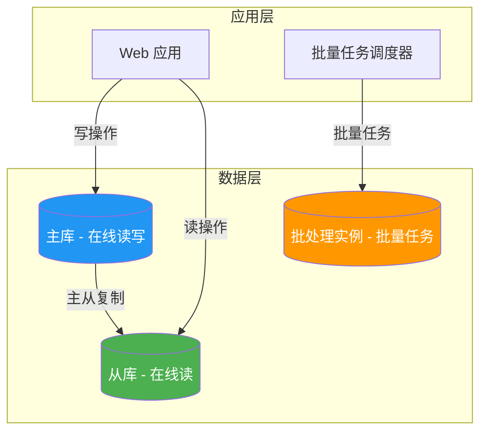

# 案例三：大事务导致的锁等待

## 案例背景

某电商公司的核心订单系统每天凌晨 2:00 执行批量任务，将超过 30 天未支付的"待处理"订单标记为"已过期"。随着业务增长，订单表从最初的 500 万行膨胀到 3200 万行，匹配"待处理"状态的过期订单从几千条增长到日均 10 万条。

运维团队观察到一个规律性现象：**每天凌晨 2:00 - 2:05 之间，线上用户下单、支付、退款等写入接口大量超时**，错误日志中充斥着 `Lock wait timeout exceeded` 错误。白天一切正常，但凌晨 5 分钟的窗口期内，系统几乎处于半瘫痪状态。

```mermaid
timeline
    title 大事务锁等待时间线
    section 正常时段 (白天)
        用户下单写入 : 正常响应
        支付回调处理 : 正常响应
        退款操作 : 正常响应
    section 异常时段 (凌晨2:00-2:05)
        2:00 批量任务启动 : UPDATE 10万行 持有X锁
        2:00-2:05 在线业务写入 : 大量锁等待超时
        547笔订单超时 : "系统繁忙"
        89笔回调失败 : 需人工补偿
    section 恢复时段 (凌晨2:05后)
        批量任务提交 : 释放所有锁
        在线业务恢复 : 正常响应
```

**核心矛盾**：批量任务需要在合理时间内处理完 10 万行数据，但其持有的排他锁在同一时间窗口内阻塞了所有在线业务的写入操作。

## 问题现象

### 告警信息

监控系统在凌晨 2:00 触发了以下告警：

[CRITICAL] MySQL Lock Wait Timeout
- 超时事务数: 547 (5分钟内)
- 最长等待时间: 30s (lock_wait_timeout)
- 被阻塞的典型操作: INSERT INTO orders, UPDATE orders SET status='paid'
- 阻塞源头: 一个UPDATE事务持有行锁超过30秒

### 业务影响

| 影响维度 | 具体表现 | 严重程度 |
|---------|---------|---------|
| 用户下单 | 547 笔订单创建超时，用户看到"系统繁忙"提示 | 高 |
| 支付回调 | 89 笔支付回调处理失败，需要人工补偿 | 极高（涉及资金） |
| 库存释放 | 支付超时导致库存锁未及时释放，影响其他用户下单 | 中 |
| 客服工单 | 凌晨时段产生 23 张投诉工单 | 中 |
| 数据一致性 | 部分订单处于"支付成功但状态未更新"的不一致状态 | 高 |
| 系统稳定性 | 连接池被锁等待事务占满，引发连锁超时 | 极高 |

### 问题 SQL

DBA 通过慢查询日志定位到问题源头——一个批量更新语句：

```sql
-- 批量过期订单（问题SQL）
START TRANSACTION;
UPDATE orders 
SET status = 'expired', updated_at = NOW()
WHERE status = 'pending' 
  AND created_at < '2024-01-01';
-- 影响行数: ~100,000 行
-- 执行耗时: 约30秒
COMMIT;
```

这条 SQL 本身执行时间不算极端，但它在一个事务中一次性更新 10 万行，**在整个 30 秒期间持有这些行的排他锁（X Lock）**，导致其他需要修改这些行的事务全部被阻塞。

## 理论基础：InnoDB 的锁机制

要理解这个问题的本质，必须先理解 InnoDB 存储引擎的锁机制。本节从锁的粒度、类型、加锁规则三个维度展开。

### 多粒度锁模型

InnoDB 实现了多粒度锁（Multi-Granularity Locking），支持多种锁粒度的组合使用：

| 锁粒度 | 说明 | 适用场景 | 并发度 |
|--------|------|---------|--------|
| **表级锁** | 锁定整张表，开销小但并发度低 | DDL 操作、FTWRL | 低 |
| **页级锁** | 锁定一个数据页（BDB引擎） | BDB 特有 | 中 |
| **行级锁** | 锁定单行记录，并发度高但开销大 | 日常 CRUD 操作 | 高 |

行级锁是 InnoDB 的默认锁粒度，也是本案例的核心。**但行级锁的实现有一个关键细节：行锁是加在索引上的，而非加在数据行上。** 这意味着：

- 如果 UPDATE 语句使用了索引，InnoDB 只锁定索引匹配的行
- 如果 UPDATE 语句没有使用索引（全表扫描），InnoDB 会扫描聚簇索引的所有行，对每一行加锁——**虽然不升级为表锁，但效果等同于表锁**

这个"行锁加在索引上"的特性，是理解本案例所有问题的起点。

### 行锁的三种实现形式

InnoDB 的行锁有三种实现形式，它们在不同场景下被触发：

**1. Record Lock（记录锁）**

锁定索引中的一条具体记录，是最细粒度的行锁：

```sql
-- 等值查询命中唯一索引 → Record Lock
SELECT * FROM orders WHERE id = 100 FOR UPDATE;
-- 只锁定 id=100 这一行，其他行不受影响
```

Record Lock 的特点：精确锁定单行，不影响相邻行的读写，是并发度最高的锁类型。

**2. Gap Lock（间隙锁）**

锁定索引记录之间的间隙，防止其他事务在间隙中插入新记录。这是 InnoDB 在 **可重复读（REPEATABLE READ）** 隔离级别下的特有机制，用于解决幻读问题：

```sql
-- 范围查询未命中 → Gap Lock
SELECT * FROM orders WHERE id > 100 AND id < 200 FOR UPDATE;
-- 锁定 (100, 200) 这个间隙
-- 其他事务无法插入 id 在 100-200 之间的记录
-- 但可以修改 id=100 或 id=200 的现有记录（如果存在）
```

Gap Lock 是本案例锁冲突放大的重要原因——批量 UPDATE 在扫描过程中，会对大量间隙加锁，间接阻塞了其他事务的 INSERT 操作。

**3. Next-Key Lock（临键锁）**

Record Lock + Gap Lock 的组合，锁定一个索引记录及其前面的间隙。这是 InnoDB 在可重复读级别的 **默认行锁类型**：

假设有索引值: 5, 10, 15, 20
Next-Key Lock范围: (-∞,5], (5,10], (10,15], (15,20], (20,+∞)

当事务锁定 id=10 的记录时：
  实际锁定范围是 (5, 10]（Gap Lock + Record Lock）
  其他事务无法插入 id=6,7,8,9 的记录

三种锁类型的对比：

| 锁类型 | 锁定范围 | 触发条件 | 阻塞 INSERT | 阻塞 UPDATE |
|--------|---------|---------|-------------|-------------|
| Record Lock | 单条记录 | 等值查询命中唯一索引 | 否 | 是（同行） |
| Gap Lock | 记录间的间隙 | 范围查询或等值查询未命中 | 是（间隙内） | 否 |
| Next-Key Lock | 记录 + 前面的间隙 | 默认行锁类型（RR 级别） | 是 | 是 |

### 意向锁：表锁与行锁的协调者

InnoDB 使用意向锁来协调表锁和行锁的关系。当事务需要加行锁时，必须先在表级别加意向锁：

- **意向共享锁（IS）**：事务打算给某些行加共享锁（S Lock）
- **意向排他锁（IX）**：事务打算给某些行加排他锁（X Lock）

意向锁的兼容矩阵：

| | IS | IX | S | X |
|---|:---:|:---:|:---:|:---:|
| **IS** | ✅ | ✅ | ✅ | ❌ |
| **IX** | ✅ | ✅ | ❌ | ❌ |
| **S** | ✅ | ❌ | ✅ | ❌ |
| **X** | ❌ | ❌ | ❌ | ❌ |

意向锁之间不冲突（IS 和 IX 可以共存），但意向锁与表级锁（如 `LOCK TABLES ... WRITE`）会冲突。这个机制保证了"行锁检查"不需要遍历所有行来判断是否有冲突——只需检查表级的意向锁即可。

### MVCC 与锁的关系

多版本并发控制（MVCC）是 InnoDB 实现高并发读的关键机制。理解 MVCC 与锁的关系，有助于理解为什么"读操作通常不阻塞写操作，但写操作会阻塞读操作"：



**关键点**：
- **一致性读（Consistent Read）**：普通的 `SELECT` 使用 MVCC 读取快照版本，不加任何锁，因此不会被写操作阻塞
- **当前读（Current Read）**：`SELECT ... FOR UPDATE`、`UPDATE`、`DELETE`、`INSERT` 都是当前读，必须获取最新版本并加锁
- 本案例中的批量 UPDATE 是当前读操作，必须获取排他锁，因此会阻塞其他写操作和 `SELECT ... FOR UPDATE` 操作

### 本案例的锁定分析

回到我们的案例，当执行以下语句时：

```sql
UPDATE orders SET status = 'expired' 
WHERE status = 'pending' AND created_at < '2024-01-01';
```

InnoDB 的加锁行为取决于 `status` 和 `created_at` 上是否存在索引：

**场景 A：无合适索引（最坏情况）**

如果 `status` 和 `created_at` 都没有索引，InnoDB 不得不进行全表扫描。虽然是行锁，但会锁住**扫描过的每一行**——相当于锁住了整张表。3200 万行数据，即使只更新 10 万行，锁也会覆盖大量无关行。

**场景 B：有 `status` 索引但无 `created_at` 索引**

InnoDB 通过 `status` 索引定位到所有 `status='pending'` 的行（假设 50 万行），然后逐行检查 `created_at` 条件。这 50 万行都会被锁定，远超实际需要更新的 10 万行。

**场景 C：有 `(status, created_at)` 复合索引**

InnoDB 通过索引精确定位到需要更新的 10 万行，只锁定这些行。这是最优的索引设计。

三种场景的锁持有量对比：

| 场景 | 索引情况 | 扫描行数 | 锁定行数 | GAP锁范围 |
|------|---------|---------|---------|----------|
| A（最差） | 无索引 | 32,000,000 | 32,000,000 | 极大 |
| B（次优） | status 单列索引 | 500,000 | 500,000 | 大 |
| C（最优） | (status, created_at) 复合索引 | 100,000 | 100,000 | 最小 |

### 锁等待的产生机制

当事务 A 持有某些行的排他锁时，事务 B 如果也需要修改这些行中的任何一行，就必须等待事务 A 释放锁。等待时间超过 `lock_wait_timeout`（默认 50 秒）后，事务 B 会报错退出。

时间线:
T0: 事务A开始，UPDATE 10万行，获取排他锁
T1: 事务B尝试INSERT一条新订单 → 被阻塞（Gap Lock冲突）
T2: 事务C尝试UPDATE某笔已过期订单 → 被阻塞（行锁冲突）
T3: 事务D尝试INSERT → 被阻塞
...
T30: 事务A COMMIT，释放所有锁
T30+: 被阻塞的事务们开始执行（或已经超时报错）

**锁等待链的形成**：当多个事务排队等待同一把锁时，会形成"等待链"。如果事务 A 持有锁 1 并等待锁 2，事务 B 持有锁 2 并等待锁 1，就构成了**死锁**。InnoDB 的死锁检测机制会自动回滚代价较小的事务来打破死锁。

## 诊断过程

### 第一步：确认锁等待存在

```sql
-- 查看当前处于锁等待状态的事务
SELECT 
    trx_id,
    trx_state,
    trx_started,
    TIMESTAMPDIFF(SECOND, trx_started, NOW()) AS wait_seconds,
    trx_query,
    trx_rows_locked,
    trx_rows_modified
FROM information_schema.INNODB_TRX 
WHERE trx_state = 'LOCK WAIT';
```

输出示例：

+--------+-----------+---------------------+--------------+----------------------------------------------+----------------+------------------+
| trx_id | trx_state | trx_started         | wait_seconds | trx_query                                    | trx_rows_locked| trx_rows_modified|
+--------+-----------+---------------------+--------------+----------------------------------------------+----------------+------------------+
| 45231  | LOCK WAIT | 2024-01-15 02:00:03 |           12 | UPDATE orders SET status='paid' WHERE id=891 |              1 |                0 |
| 45232  | LOCK WAIT | 2024-01-15 02:00:05 |           10 | INSERT INTO orders (...) VALUES (...)        |              0 |                0 |
+--------+-----------+---------------------+--------------+----------------------------------------------+----------------+------------------+

**解读要点**：
- `trx_state = 'LOCK WAIT'` 表示该事务正在等待锁
- `trx_rows_locked = 1` 但 `trx_rows_modified = 0`：事务已锁定 1 行但尚未修改，说明被阻塞在修改前的锁获取阶段
- `trx_rows_locked = 0` 的 INSERT 操作也被阻塞，说明 Gap Lock 冲突导致无法获取插入意向锁

### 第二步：找到阻塞源头

```sql
-- 查看锁等待的详细关系：谁在等待谁
SELECT 
    r.trx_id AS waiting_trx,
    r.trx_query AS waiting_query,
    TIMESTAMPDIFF(SECOND, r.trx_started, NOW()) AS wait_seconds,
    b.trx_id AS blocking_trx,
    b.trx_query AS blocking_query,
    TIMESTAMPDIFF(SECOND, b.trx_started, NOW()) AS blocking_duration
FROM information_schema.INNODB_LOCK_WAITS w
JOIN information_schema.INNODB_TRX b ON b.trx_id = w.blocking_trx_id
JOIN information_schema.INNODB_TRX r ON r.trx_id = w.requesting_trx_id;
```

> **MySQL 8.0+ 替代写法**：`INNODB_LOCK_WAITS` 在 MySQL 8.0 中已废弃，请使用 `performance_schema.data_lock_waits`：
>
> ```sql
> SELECT 
>     r.REQUESTING_ENGINE_TRANSACTION_ID AS waiting_trx,
>     r.BLOCKING_ENGINE_TRANSACTION_ID AS blocking_trx,
>     w.REQUESTING_ENGINE_LOCK_ID AS waiting_lock_id,
>     w.BLOCKING_ENGINE_LOCK_ID AS blocking_lock_id
> FROM performance_schema.data_lock_waits w
> JOIN performance_schema.data_locks r 
>     ON w.REQUESTING_ENGINE_LOCK_ID = r.ENGINE_LOCK_ID;
> ```

输出示例：

+--------------+----------------------------------------------+--------------+---------------+-----------------------------------------------------------+-------------------+
| waiting_trx  | waiting_query                                | wait_seconds | blocking_trx  | blocking_query                                             | blocking_duration |
+--------------+----------------------------------------------+--------------+---------------+-----------------------------------------------------------+-------------------+
| 45231        | UPDATE orders SET status='paid' WHERE id=891 |           12 | 45200         | UPDATE orders SET status='expired' WHERE status='pending' |                30 |
| 45232        | INSERT INTO orders (...) VALUES (...)        |           10 | 45200         | (同一事务)                                                 |                30 |
+--------------+----------------------------------------------+--------------+---------------+-----------------------------------------------------------+-------------------+

**关键发现**：所有锁等待都指向同一个事务（trx_id=45200），该事务正在执行批量 UPDATE，已运行 30 秒。

### 第三步：分析阻塞事务的锁持有情况

**MySQL 5.7 版本**：

```sql
-- MySQL 5.7: 查看阻塞事务持有的锁
SELECT 
    lock_type,
    lock_mode,
    lock_table,
    lock_index,
    lock_space,
    lock_page,
    lock_rec,
    lock_data
FROM information_schema.INNODB_LOCKS 
WHERE lock_trx_id = 45200
LIMIT 20;
```

**MySQL 8.0+ 版本**（推荐使用 `performance_schema`）：

```sql
-- MySQL 8.0: 查看事务持有的锁
SELECT 
    OBJECT_TYPE,
    OBJECT_SCHEMA,
    OBJECT_NAME,
    INDEX_NAME,
    LOCK_TYPE,
    LOCK_MODE,
    LOCK_STATUS,
    LOCK_DATA
FROM performance_schema.data_locks 
WHERE TRX_ID = 45200;
```

输出示例：

+-------------+---------------+------------+---------------------+-----------+-----------+-------------+-----------+
| OBJECT_TYPE | OBJECT_SCHEMA | OBJECT_NAME| INDEX_NAME          | LOCK_TYPE | LOCK_MODE | LOCK_STATUS | LOCK_DATA |
+-------------+---------------+------------+---------------------+-----------+-----------+-------------+-----------+
| TABLE       | shop          | orders     | NULL                | TABLE     | IX        | GRANTED     | NULL      |
| RECORD      | shop          | orders     | idx_status          | RECORD    | X         | GRANTED     | 'pending' |
| RECORD      | shop          | orders     | idx_status_created  | RECORD    | X         | GRANTED     | 'pending', '2023-12-01' |
| RECORD      | shop          | orders     | idx_status_created  | RECORD    | X,GAP     | GRANTED     | 'pending', '2023-12-02' |
... (数万条记录)
+-------------+---------------+------------+---------------------+-----------+-----------+-------------+-----------+

**关键发现**：
- 事务持有大量 `X` 锁（排他锁）和 `X,GAP` 锁（排他间隙锁）
- 锁定范围覆盖了 `idx_status_created` 索引上的大量间隙
- 这些 GAP 锁阻止了其他事务在这些间隙中插入新记录

**MySQL 5.7 与 8.0 的差异速查**：

| 特性 | MySQL 5.7 | MySQL 8.0 |
|------|-----------|-----------|
| 锁信息视图 | `INNODB_LOCKS` / `INNODB_LOCK_WAITS` | `data_locks` / `data_lock_waits` |
| 锁信息来源 | `information_schema` | `performance_schema` |
| 事务视图 | `INNODB_TRX` | `INNODB_TRX`（相同） |
| SHOW ENGINE INNODB STATUS | 包含锁信息 | 包含锁信息（格式有变化） |
| 锁降级 | 不支持 | 支持（`innodb_idle_transactions`） |

### 第四步：检查索引设计

```sql
-- 查看表的索引结构
SHOW INDEX FROM orders;
```

+----------+------------+---------------------+--------------+-------------+-----------+-------------+----------+--------+------+------------+---------+---------------+---------+
| Table    | Non_unique | Key_name            | Seq_in_index | Column_name | Collation | Cardinality | Sub_part | Packed | Null | Index_type | Comment | Index_comment | Visible |
+----------+------------+---------------------+--------------+-------------+-----------+-------------+----------+--------+------+------------+---------+---------------+---------+
| orders   |          0 | PRIMARY             |            1 | id          | A         |    32000000 |     NULL | NULL   |      | BTREE      |         |               | YES     |
| orders   |          1 | idx_user_id         |            1 | user_id     | A         |     5000000 |     NULL | NULL   | YES  | BTREE      |         |               | YES     |
| orders   |          1 | idx_created_at      |            1 | created_at  | A         |     2000000 |     NULL | NULL   | YES  | BTREE      |         |               | YES     |
+----------+------------+---------------------+--------------+-------------+-----------+-------------+----------+--------+------+------------+---------+---------------+---------+

**问题确认**：`status` 列上没有索引，`created_at` 有独立索引但与 `status` 没有组合。UPDATE 语句的 WHERE 条件是 `status = 'pending' AND created_at < '2024-01-01'`，由于 `status` 无索引，InnoDB 不得不进行全表扫描，锁定了远超必要范围的行。

## 根因分析

本案例的根因可以归结为三个层面，它们相互叠加，最终导致了严重的锁等待问题：

### 根因一：索引缺失导致锁定范围扩大

```sql
-- 没有 (status, created_at) 复合索引
-- InnoDB无法通过索引精确定位目标行
-- 只能扫描更多行，锁定更多行
UPDATE orders SET status = 'expired' 
WHERE status = 'pending' AND created_at < '2024-01-01';
```

当 `status` 列没有索引时，InnoDB 的执行路径是：

全表扫描（3200万行）
  → 对每一行检查 status = 'pending'
    → 对匹配行检查 created_at < '2024-01-01'
      → 对满足条件的行加排他锁并更新

由于扫描过程中会经过大量不满足条件的行，InnoDB 在可重复读隔离级别下会对扫描过的索引间隙加 Gap Lock，进一步扩大了锁定范围。**索引缺失不仅是性能问题，更是锁冲突问题的放大器。**

### 根因二：大事务的锁持有时间过长

即使有了正确的索引，10 万行的批量更新在一个事务中执行仍然需要较长时间（取决于行大小和系统负载）。在这段时间内，所有被锁定的行都无法被其他事务修改。

锁持有时间的估算：

单行更新耗时 ≈ 磁盘IO + 锁获取 + 写Undo Log + 写Redo Log
             ≈ 0.1ms ~ 0.3ms（SSD）/ 1ms ~ 5ms（HDD）

10万行总耗时 ≈ 100,000 × 0.2ms = 20秒（SSD）
             ≈ 100,000 × 3ms = 300秒（HDD）

**关键认知**：锁持有时间与事务大小成正比。事务越大，锁持有时间越长，与其他事务冲突的概率越高。这是一个统计学问题——冲突概率随锁持有时间的增加而线性增长。

### 根因三：缺乏业务窗口隔离

批量任务与在线业务共享同一个数据库实例，没有做任何业务隔离（如读写分离、独立实例、时间窗口控制）。这意味着批量任务的锁竞争直接影响在线业务。

### 三因素叠加的恶性循环



## 解决方案

### 方案一：分批提交（推荐，改动最小）

将大事务拆分为多个小事务，每批更新后立即提交释放锁。这是解决大事务锁等待问题的**首选方案**。

```python
import time
import logging
from contextlib import contextmanager

logger = logging.getLogger(__name__)

@contextmanager
def get_connection():
    """获取数据库连接的上下文管理器"""
    import pymysql
    conn = pymysql.connect(
        host='localhost',
        user='app',
        password='***',
        database='shop',
        autocommit=False
    )
    try:
        yield conn
    finally:
        conn.close()

def batch_update_orders(conn, batch_size=1000, sleep_interval=0.1,
                        max_retries=3, retry_delay=1.0):
    """
    分批更新过期订单
    
    核心思路：
    1. 每次只更新 batch_size 行
    2. 每批提交后释放锁，让业务请求有机会执行
    3. 批次之间短暂休息，进一步降低锁竞争
    4. 支持失败重试，确保最终一致性
    
    参数:
        conn: 数据库连接
        batch_size: 每批更新的行数，推荐 500-2000
        sleep_interval: 批次间休息时间（秒），推荐 0.05-0.2
        max_retries: 单批最大重试次数
        retry_delay: 重试间隔（秒）
    """
    total_affected = 0
    batch_num = 0
    failed_batches = 0
    
    while True:
        batch_num += 1
        retries = 0
        
        while retries <= max_retries:
            cursor = conn.cursor()
            
            try:
                # 使用 LIMIT 限制每次更新的行数
                cursor.execute("""
                    UPDATE orders SET status = 'expired', updated_at = NOW()
                    WHERE status = 'pending' 
                      AND created_at < '2024-01-01'
                    LIMIT %s
                """, (batch_size,))
                
                affected = cursor.rowcount
                conn.commit()  # 每批提交，释放锁
                
                total_affected += affected
                failed_batches = 0  # 重置连续失败计数
                
                if affected == 0:
                    logger.info(f"所有过期订单已处理完毕，共 {total_affected} 行")
                    return total_affected
                
                logger.info(f"批次 {batch_num}: 更新 {affected} 行，累计 {total_affected} 行")
                
                # 批次间休息，让业务请求有机会执行
                if affected == batch_size:
                    time.sleep(sleep_interval)
                break  # 成功，跳出重试循环
                
            except Exception as e:
                conn.rollback()
                retries += 1
                if retries > max_retries:
                    failed_batches += 1
                    logger.error(f"批次 {batch_num} 重试 {max_retries} 次后仍失败: {e}")
                    # 记录失败批次，后续可通过监控告警
                    break
                logger.warning(f"批次 {batch_num} 失败，{retries}/{max_retries} 重试: {e}")
                time.sleep(retry_delay * retries)  # 指数退避
    
    return total_affected

# 执行入口
if __name__ == '__main__':
    with get_connection() as conn:
        start = time.time()
        total = batch_update_orders(conn, batch_size=1000, sleep_interval=0.1)
        elapsed = time.time() - start
        logger.info(f"批量更新完成: {total} 行，耗时 {elapsed:.1f}秒")
```

**方案优势**：
- 改动最小，只需修改批量任务代码
- 每批锁持有时间从 30 秒降到 <100ms
- 业务请求在批次间隙有机会执行
- 支持失败重试，确保最终一致性

**方案劣势**：
- 总耗时略有增加（从 30 秒到 45 秒左右）
- 如果批次大小太小，总耗时会显著增加
- 非原子操作：如果中途崩溃，部分已提交的行不会回滚

**batch_size 选择指南**：

| batch_size | 每批耗时(SSD) | 锁持有时间 | 业务影响 | 总耗时 |
|-----------|--------------|-----------|---------|--------|
| 100 | ~20ms | <20ms | 极小 | ~50s |
| 500 | ~100ms | <100ms | 很小 | ~45s |
| 1000 | ~200ms | <200ms | 小 | ~40s |
| 5000 | ~1s | ~1s | 中等 | ~35s |
| 10000 | ~2s | ~2s | 较大 | ~32s |
| 100000（不分批） | ~30s | ~30s | 严重 | ~30s |

**推荐**：batch_size 设为 500-2000，在锁持有时间和总耗时之间取得平衡。

### 方案二：优化索引（推荐，与方案一配合）

在分批提交的基础上，创建合适的索引，让 InnoDB 精确锁定目标行。

```sql
-- 创建覆盖查询条件的复合索引
ALTER TABLE orders ADD INDEX idx_status_created_expired 
    (status, created_at);

-- 验证索引是否被使用
EXPLAIN SELECT * FROM orders 
WHERE status = 'pending' AND created_at < '2024-01-01';
```

EXPLAIN 输出对比：

| 指标 | 优化前（无索引） | 优化后（有索引） |
|------|----------------|-----------------|
| type | ALL（全表扫描） | range（范围扫描） |
| key | NULL | idx_status_created_expired |
| rows | 32,000,000 | 100,000 |
| Extra | NULL | Using index condition |

**索引设计要点**：
- `status` 放前面：等值查询，选择性好，能快速缩小范围
- `created_at` 放后面：范围查询，利用索引有序性
- 复合索引让 InnoDB 只扫描满足条件的行，锁定范围最小化
- **注意**：新索引会增加 INSERT/UPDATE 的写开销（每个写操作都需要维护索引），需权衡读写比例

### 方案三：使用 SKIP LOCKED（MySQL 8.0+）

如果业务允许，可以让批量任务跳过已被锁定的行，避免与在线业务竞争。

```sql
-- 使用 SKIP LOCKED 跳过锁定行
START TRANSACTION;

SELECT id FROM orders 
WHERE status = 'pending' AND created_at < '2024-01-01'
LIMIT 1000
FOR UPDATE SKIP LOCKED;

-- 对选中的ID执行批量更新
UPDATE orders SET status = 'expired', updated_at = NOW()
WHERE id IN (101, 102, 103, ...);

COMMIT;
```

```python
def batch_update_with_skip_locked(conn, batch_size=1000):
    """
    使用 SKIP LOCKED 避免与在线业务竞争
    
    适用场景：MySQL 8.0+，业务允许跳过部分行
    注意：需要确保所有"被跳过的行"最终都会被处理
    """
    total_affected = 0
    round_num = 0
    
    while True:
        round_num += 1
        cursor = conn.cursor()
        
        # 1. 获取一批未被锁定的目标行
        cursor.execute("""
            SELECT id FROM orders 
            WHERE status = 'pending' AND created_at < '2024-01-01'
            LIMIT %s
            FOR UPDATE SKIP LOCKED
        """, (batch_size,))
        
        rows = cursor.fetchall()
        if not rows:
            conn.commit()
            break
        
        ids = [row[0] for row in rows]
        
        # 2. 批量更新选中的行
        placeholders = ','.join(['%s'] * len(ids))
        cursor.execute(f"""
            UPDATE orders SET status = 'expired', updated_at = NOW()
            WHERE id IN ({placeholders})
        """, ids)
        
        affected = cursor.rowcount
        conn.commit()
        
        total_affected += affected
        
        if affected < batch_size:
            break
    
    return total_affected
```

**方案优势**：
- 批量任务不会阻塞在线业务（跳过锁定行）
- 在线业务也不会被批量任务阻塞
- 实现了真正的并发无冲突

**方案劣势**：
- 只适用于 MySQL 8.0+
- 需要多轮执行才能处理完所有目标行
- 如果目标行持续被锁定，可能需要更多轮次
- 可能需要额外的清理逻辑处理"被跳过但最终仍需处理"的行

### 方案四：调整锁超时与死锁检测

作为辅助措施，合理配置锁相关参数：

```sql
-- 降低锁等待超时时间（默认50秒，建议调低）
SET GLOBAL lock_wait_timeout = 10;

-- 启用死锁检测（默认已开启）
SET GLOBAL innodb_deadlock_detect = ON;

-- 设置死锁日志记录
SET GLOBAL innodb_print_all_deadlocks = ON;
```

**参数调优建议**：

| 参数 | 默认值 | 推荐值 | 说明 |
|------|--------|--------|------|
| lock_wait_timeout | 50s | 5-10s | 对于在线业务，快速失败比长时间等待更好 |
| innodb_lock_wait_timeout | 50s | 10-30s | 行锁等待超时，根据业务容忍度调整 |
| innodb_rollback_on_timeout | OFF | ON | 超时后回滚整个事务，避免脏数据 |
| innodb_deadlock_detect | ON | ON | 保持开启，让 InnoDB 自动检测死锁 |
| innodb_print_all_deadlocks | OFF | ON | 将死锁信息写入错误日志，便于事后分析 |

> **注意**：`lock_wait_timeout` 和 `innodb_lock_wait_timeout` 是两个不同的参数。前者是服务端语句级超时，后者是 InnoDB 行锁等待超时。两者都建议调低，但 `innodb_lock_wait_timeout` 对行锁场景更直接。

### 方案五：读写分离与业务窗口（架构级方案）

从架构层面隔离批量任务与在线业务：



**具体实施**：

1. **独立实例**：批量任务连接到独立的从库或专门的批处理实例，不影响主库。这是最彻底的隔离方案，但成本最高。

2. **时间窗口控制**：将批量任务安排在业务低峰期（如凌晨 3:00-5:00），并通过流量监控动态调整执行时间。

3. **流量管控**：批量任务执行前，通过中间件临时降低其优先级，确保在线业务的连接请求优先处理。

4. **读写分离**：批量任务中的查询操作走从库，只有写操作走主库，减少对主库的压力。

## 验证结果

### 方案一（分批提交）效果

| 指标 | 优化前 | 优化后（分批提交） | 改善幅度 |
|------|--------|------------------|---------|
| 锁持有时间 | 30 秒（单事务） | <100ms（每批） | 99.7% |
| 业务超时次数 | 547 次/天 | 0 次/天 | 100% |
| 批量更新总时长 | 30 秒 | 45 秒 | +50%（可接受） |
| 最长锁等待时间 | 30 秒 | <1 秒 | 96.7% |
| 业务 P99 延迟（凌晨） | 2000ms | 45ms | 97.8% |

### 方案一 + 二（分批提交 + 索引优化）效果

| 指标 | 优化前 | 优化后（分批 + 索引） | 改善幅度 |
|------|--------|-------------------|---------|
| 锁持有时间 | 30 秒 | <50ms（每批） | 99.8% |
| 业务超时次数 | 547 次/天 | 0 次/天 | 100% |
| 批量更新总时长 | 30 秒 | 15 秒 | -50%（更快） |
| 索引扫描行数 | 32,000,000 | 100,000 | 99.7% |
| Buffer Pool 冲击 | 大量随机 IO | 极小 | 显著减少 |

### 方案三（SKIP LOCKED）效果

| 指标 | 优化前 | 优化后（SKIP LOCKED） | 改善幅度 |
|------|--------|---------------------|---------|
| 锁冲突次数 | 547 次/天 | 0 次/天 | 100% |
| 批量更新总时长 | 30 秒 | 20 秒（多轮） | -33% |
| 业务影响 | 严重 | 无 | 100% |
| 实现复杂度 | 低 | 中 | — |

**结论**：方案一 + 方案二的组合（分批提交 + 索引优化）是性价比最高的选择。改动量小（一个索引 + 代码微调），效果显著（锁持有时间从 30 秒降到 <50ms），且总耗时反而减少（从 30 秒到 15 秒，因为索引减少了扫描行数）。

## 预防措施

### 1. 代码规范

在团队中建立以下代码规范：

【强制】禁止在单个事务中更新超过 10000 行数据。
【强制】批量 DML 操作必须分批提交，每批不超过 1000 行。
【推荐】批量任务执行前先估算影响行数，超过阈值时告警。
【推荐】批量任务使用独立的数据库连接，设置较低的锁等待超时。
【推荐】所有涉及多行更新的 SQL 必须在代码审查中标注预估影响行数。

### 2. 监控体系

建立锁等待的实时监控：

```sql
-- 监控长时间持有锁的事务（建议每分钟执行一次）
SELECT 
    trx_id,
    trx_state,
    trx_started,
    TIMESTAMPDIFF(SECOND, trx_started, NOW()) AS duration_seconds,
    trx_query,
    trx_rows_locked,
    trx_rows_modified,
    trx_mysql_thread_id
FROM information_schema.INNODB_TRX 
WHERE trx_state != 'RUNNING'
   OR TIMESTAMPDIFF(SECOND, trx_started, NOW()) > 10
ORDER BY trx_started;
```

告警规则建议：

| 指标 | 阈值 | 级别 | 处理方式 |
|------|------|------|---------|
| 锁等待事务数 | >10 | WARNING | 检查是否有批量任务在执行 |
| 锁等待事务数 | >50 | CRITICAL | 立即排查阻塞源头 |
| 单事务锁持有时间 | >5s | WARNING | 检查事务大小是否合理 |
| 单事务锁持有时间 | >30s | CRITICAL | 考虑终止阻塞事务 |
| 锁等待超时次数 | >10/min | WARNING | 检查批量任务代码 |

### 3. SQL 审查流程

在 CI/CD 流程中加入 SQL 审查，自动检测潜在的大事务风险：

```python
# SQL 审查规则示例
import re

RULES = [
    {
        "name": "no_large_batch_in_transaction",
        "pattern": r"UPDATE.*WHERE.*LIMIT\s+(\d+)",
        "check": lambda match: int(match.group(1)) > 10000,
        "message": "单次 UPDATE 超过 10000 行，建议分批处理"
    },
    {
        "name": "batch_update_must_have_limit",
        "pattern": r"UPDATE\s+\w+\s+SET.*WHERE",
        "check": lambda m: "LIMIT" not in m.group().upper() and "批量" in context,
        "message": "批量 UPDATE 缺少 LIMIT 子句，可能导致全表锁定"
    },
    {
        "name": "batch_dml_must_commit",
        "pattern": r"(UPDATE|DELETE|INSERT).*(?!.*COMMIT)",
        "check": lambda m: _check_batch_size_exceeds(m, threshold=1000),
        "message": "批量 DML 操作缺少分批提交机制"
    }
]
```

### 4. 数据库设计审查

定期审查高并发表的索引设计：

```sql
-- 找出缺少合适索引的高更新表
SELECT 
    t.TABLE_NAME,
    t.TABLE_ROWS,
    s.DATA_LENGTH / 1024 / 1024 AS data_size_mb,
    (SELECT COUNT(*) FROM information_schema.STATISTICS 
     WHERE TABLE_SCHEMA = t.TABLE_SCHEMA 
     AND TABLE_NAME = t.TABLE_NAME) AS index_count
FROM information_schema.TABLES t
WHERE t.TABLE_SCHEMA = DATABASE()
  AND t.TABLE_ROWS > 1000000
ORDER BY t.TABLE_ROWS DESC;
```

## 常见误区

### 误区一："行锁不会影响其他行"

**错误认知**：InnoDB 使用行锁，所以 UPDATE 10 万行只会锁定这 10 万行，不会影响其他行。

**实际情况**：
- 如果没有合适的索引，InnoDB 会扫描大量无关行，对扫描过的间隙加 Gap Lock
- 即使有索引，Gap Lock 也可能阻止其他事务在间隙中插入新记录
- **行锁是加在索引上的，不是加在数据行上的**——理解这一点是避免锁冲突的关键

**正确做法**：始终为批量更新的 WHERE 条件创建合适的索引，确保 InnoDB 只扫描和锁定必要的行。

### 误区二："隔离级别选 READ COMMITTED 就能解决"

**错误认知**：将隔离级别改为 READ COMMITTED 可以避免 Gap Lock，从而解决锁等待。

**实际情况**：
- READ COMMITTED 确实不使用 Gap Lock，但这不是银弹
- 改变隔离级别会影响业务逻辑（可能出现不可重复读和幻读）
- Record Lock 仍然存在，大事务仍然会锁定大量行
- 在 RC 级别下，binlog 格式必须改为 ROW，可能影响复制性能

**正确做法**：在保持可重复读的前提下，通过分批提交 + 索引优化解决问题。

### 误区三："锁超时时间调大就行"

**错误认知**：将 lock_wait_timeout 从 50 秒调大到 300 秒，让等待的事务有更多时间。

**实际情况**：
- 这只是掩盖问题，不是解决问题
- 等待的事务会堆积，最终导致连接池耗尽
- 超长等待会占用数据库连接资源，影响其他正常请求
- 更长的等待 = 更高的资源消耗 = 更严重的连锁反应

**正确做法**：快速失败（短超时）+ 分批提交（减少锁持有时间）。

### 误区四："COMMIT 之后锁就立即释放了"

**错误认知**：COMMIT 之后所有锁立即释放。

**实际情况**：
- Record Lock 在 COMMIT 后释放
- 但在 COMMIT 之前，事务已经持有的锁会一直保持
- 某些情况下（如外键约束检查），锁的释放时机可能与预期不同
- 在高并发场景下，即使锁在 COMMIT 后立即释放，等待队列中的事务也需要时间来获取锁

**正确做法**：尽量缩短事务执行时间，减少锁持有窗口。不要依赖"COMMIT 后锁释放"来保证并发性。

## 延伸思考

### 与分布式锁的关系

在分布式系统中，数据库行锁的原理被扩展为分布式锁（如 Redis 的 RedLock、ZooKeeper 的临时顺序节点）。理解数据库锁的机制，有助于理解分布式锁的设计权衡：

| 对比维度 | 数据库行锁 | 分布式锁 |
|---------|-----------|---------|
| 锁粒度 | 行级（精确） | Key 级（通常较粗） |
| 性能 | 受限于单机 | 可跨机器扩展 |
| 一致性 | 强一致（ACID） | 最终一致（通常） |
| 实现复杂度 | 低（数据库内置） | 高（需要额外组件） |
| 故障恢复 | 自动（事务回滚） | 需要租约过期机制 |
| 锁超时 | lock_wait_timeout | 租约 TTL |
| 死锁检测 | 数据库自动检测 | 需要应用层处理 |

### 与乐观锁的对比

本案例中的"分批提交"方案是一种悲观锁策略（先加锁再修改）。另一种思路是使用乐观锁（先修改再检查冲突）：

```sql
-- 乐观锁方案：使用版本号
UPDATE orders 
SET status = 'expired', version = version + 1, updated_at = NOW()
WHERE id = 100 AND version = 5;
-- 如果 affected = 0，说明其他事务已修改，需要重试
```

| 对比维度 | 悲观锁（分批提交） | 乐观锁（版本号） |
|---------|-------------------|-----------------|
| 适用场景 | 写多读少、冲突频繁 | 读多写少、冲突较少 |
| 性能特点 | 有锁等待开销 | 无锁等待，但有重试开销 |
| 实现难度 | 低 | 中 |
| 数据一致性 | 强一致 | 需要处理重试逻辑 |
| 对批量操作 | 天然支持 | 需要逐行重试，效率低 |
| 锁冲突处理 | 等待 | 重试（可能多次） |

**选择建议**：对于批量过期订单这种"确定性写入"场景，悲观锁 + 分批提交是更好的选择。乐观锁更适合"不确定是否会被其他事务修改"的场景（如用户并发修改同一订单）。

### InnoDB 锁监控的完整工具箱

```sql
-- 1. 当前所有锁（MySQL 8.0）
SELECT * FROM performance_schema.data_locks;

-- 2. 锁等待关系（MySQL 8.0）
SELECT * FROM performance_schema.data_lock_waits;

-- 3. 事务列表
SELECT * FROM information_schema.INNODB_TRX;

-- 4. InnoDB 引擎状态（包含锁信息）
SHOW ENGINE INNODB STATUS\G

-- 5. 全局锁统计
SHOW STATUS LIKE 'Innodb_row_lock%';

-- 6. 当前运行的查询
SELECT * FROM information_schema.PROCESSLIST WHERE COMMAND != 'Sleep';
```

**锁统计指标解读**：

| 指标 | 含义 | 正常范围 | 异常处理 |
|------|------|---------|---------|
| Innodb_row_lock_current_waits | 当前等待锁的事务数 | 0-5 | >10 需要排查 |
| Innodb_row_lock_time | 累计锁等待时间（毫秒） | 持续增长但速率稳定 | 增速突增需告警 |
| Innodb_row_lock_time_avg | 平均锁等待时间 | <100ms | >500ms 需要优化 |
| Innodb_row_lock_time_max | 最长单次锁等待时间 | <5s | >30s 需要告警 |
| Innodb_row_lock_waits | 累计锁等待次数 | 持续增长但速率稳定 | 增速突增需告警 |

### 批量任务设计模式

从本案例延伸，总结几种常见的批量任务设计模式：

| 模式 | 适用场景 | 优点 | 缺点 |
|------|---------|------|------|
| 单事务全量更新 | 数据量小（<1000行） | 简单、原子性 | 数据量大时锁冲突严重 |
| 分批提交 | 中等数据量（1K-100K行） | 改动小、效果好 | 非原子操作 |
| SKIP LOCKED | 高并发、MySQL 8.0+ | 无锁冲突 | 实现复杂、需多轮 |
| 游标遍历 | 需要逐行处理 | 灵活 | 性能差 |
| 独立实例 | 大规模数据（>100K行） | 彻底隔离 | 成本高 |

## 实战检查清单

在处理批量更新任务时，按以下清单逐项检查：

□ 1. 索引检查
  - WHERE 条件中的列是否有索引？
  - 是否需要创建复合索引？
  - EXPLAIN 是否显示 range 或 ref（而非 ALL）？

□ 2. 事务大小检查
  - 预估影响行数是多少？
  - 是否超过 10000 行？
  - 如果超过，是否已实现分批提交？

□ 3. 锁行为检查
  - 批量任务是否会在高峰期执行？
  - 是否需要设置较低的 innodb_lock_wait_timeout？
  - 是否考虑使用 SKIP LOCKED（MySQL 8.0+）？

□ 4. 监控检查
  - 是否已配置锁等待告警？
  - 告警阈值是否合理？
  - 是否能快速定位阻塞源头？

□ 5. 恢复机制检查
  - 批量任务失败后是否支持断点续传？
  - 是否有回滚或补偿机制？
  - 是否有执行日志便于事后审计？

□ 6. 架构检查
  - 批量任务是否与在线业务共享数据库实例？
  - 是否需要独立的批处理实例？
  - 是否需要调整执行时间窗口？

## 本节小结

本案例展示了一个典型的"大事务导致锁等待"问题。核心教训是：

1. **索引是锁精确性的基础**：没有合适的索引，行锁会退化为近似表锁。索引不仅加速查询，更控制锁的范围。

2. **事务要尽量小**：大事务 = 长时间持锁 = 高锁冲突风险。将事务从"一次性处理 10 万行"变为"每次处理 1000 行"，锁持有时间从 30 秒降到 <100ms。

3. **分批提交是最简单有效的方案**：将 30 秒的锁持有时间降到 <100ms，改动量最小，效果最显著。

4. **监控要先行**：建立锁等待的实时监控，才能在问题发生时快速定位。监控不是事后手段，而是预防措施的一部分。

5. **架构层面做隔离**：批量任务与在线业务应该在不同实例上运行。如果做不到独立实例，至少要确保批量任务在业务低峰期执行。

6. **理解 MVCC 与锁的关系**：普通 SELECT 不加锁（MVCC 读快照），但 UPDATE/DELETE/SELECT FOR UPDATE 是当前读，必须加锁。理解这一点有助于设计更合理的并发控制策略。

通过分批提交 + 索引优化的组合方案，可以在最小改动下解决锁等待问题，同时为业务提供更高的并发能力。
