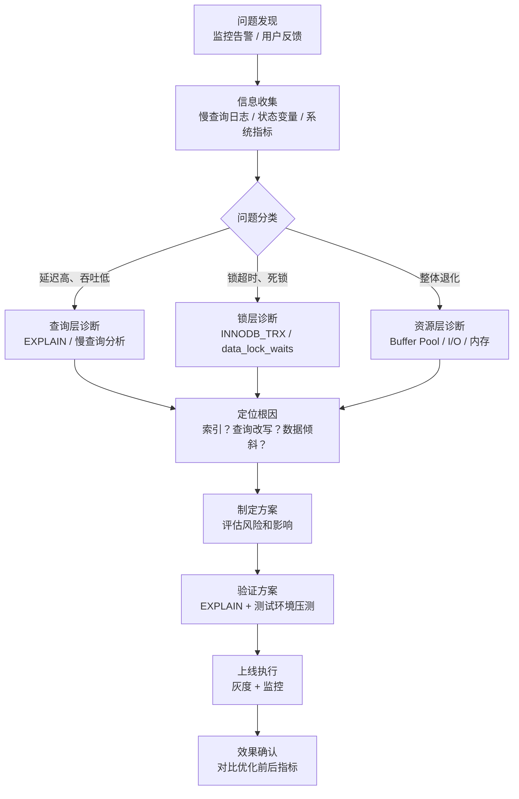
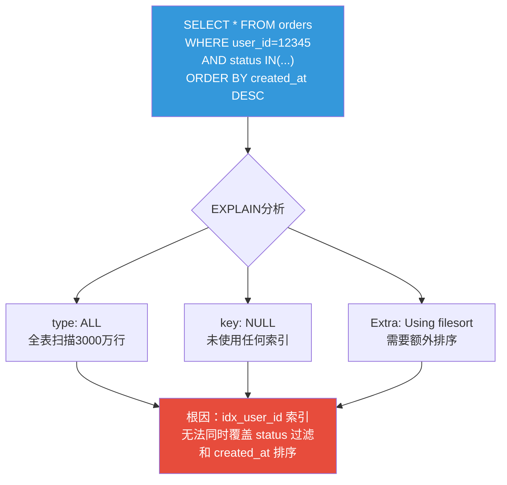
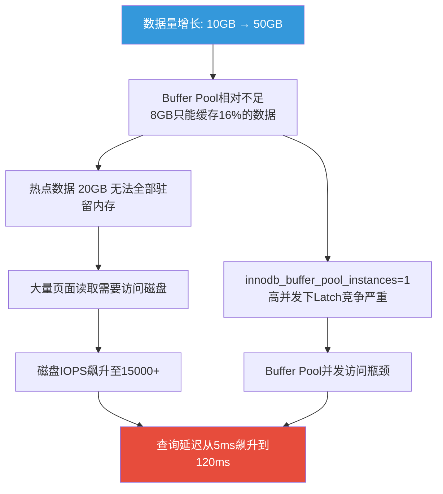
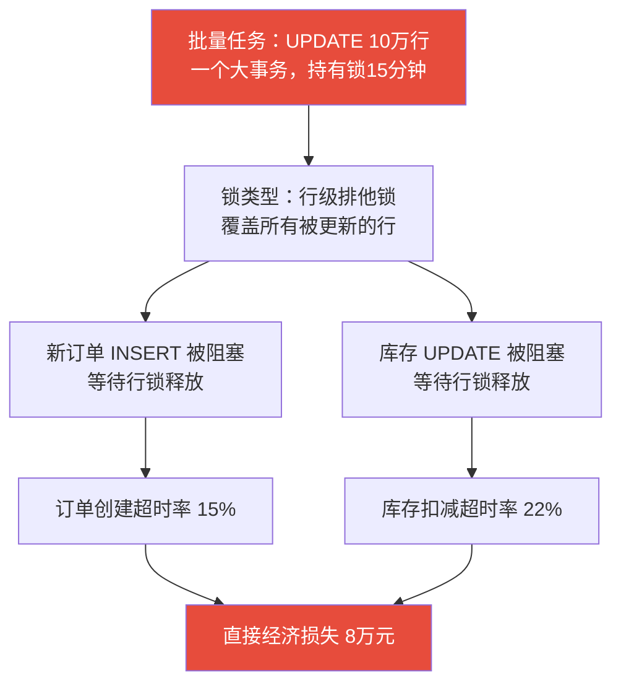
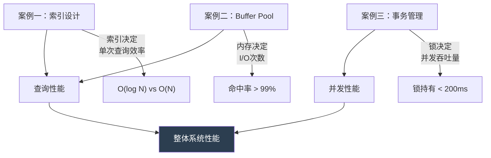
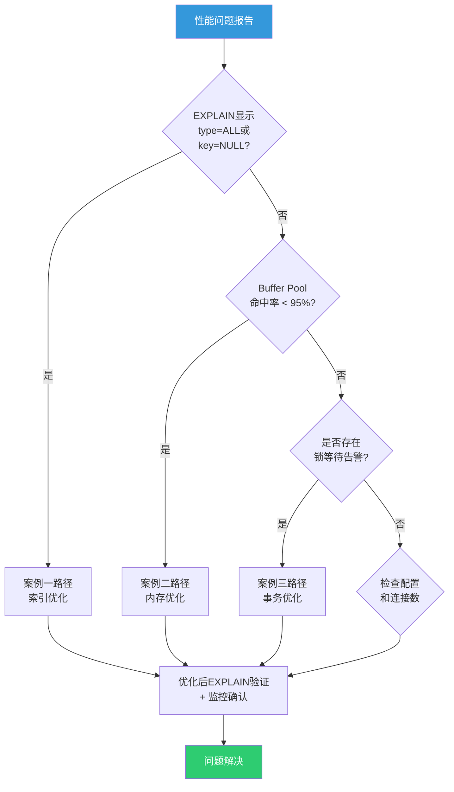

# 13.3 关系型数据库架构实战案例：从诊断到优化的完整工程实践

***

理论和技巧最终要落地到真实的系统中才能发挥价值。本节通过3个来自真实生产环境的深度案例，将关系型数据库架构的理论知识转化为可落地的工程实践。每个案例都遵循"场景→问题→诊断→方案→效果"的完整链路，确保读者不仅知道"怎么做"，更理解"为什么这样做"。

**阅读指引**：如果你正在遭遇特定问题，可按以下导航快速定位：

| 你遇到的问题 | 直接跳到 |
|-------------|---------|
| 查询延迟飙升，P99从毫秒级涨到秒级 | 案例一：电商订单表查询性能劣化 |
| 数据量增长后整体变慢，内存不够用 | 案例二：Buffer Pool不足导致的全链路性能退化 |
| 批量操作时业务写入超时、锁等待告警 | 案例三：大事务导致的锁等待风暴 |

## 数据库性能诊断的通用方法论

在深入具体案例之前，先建立一套系统化的诊断思维框架。生产环境中的数据库问题往往表现为"变慢了"，但根因可能截然不同——索引缺失、内存不足、锁冲突、配置不当、数据膨胀都有可能。没有方法论的排查就像大海捞针。

### 诊断的黄金流程



### 诊断工具速查表

| 工具 | 用途 | 命令示例 | 适用场景 |
|------|------|---------|---------|
| EXPLAIN | 分析查询执行计划 | `EXPLAIN SELECT ...` | 每一条慢SQL的第一步 |
| pt-query-digest | 聚合分析慢查询日志 | `pt-query-digest slow.log` | 找出最耗资源的Top SQL |
| SHOW PROCESSLIST | 查看当前连接和查询 | `SHOW FULL PROCESSLIST;` | 实时排查阻塞 |
| information_schema.INNODB_TRX | 查看活跃事务 | `SELECT * FROM INNODB_TRX;` | 锁等待、长事务排查 |
| performance_schema.data_lock_waits | 锁等待关系链 | `SELECT * FROM data_lock_waits;` | 精确定位锁的持有者和等待者 |
| SHOW ENGINE INNODB STATUS | InnoDB引擎详细状态 | `SHOW ENGINE INNODB STATUS\G` | 死锁日志、锁统计、缓冲池状态 |
| iostat | 磁盘I/O监控 | `iostat -x 1 10` | 判断是否磁盘瓶颈 |
| vmstat | 系统内存和CPU | `vmstat 1 10` | 判断是否内存不足导致swap |

**关键原则**：先收集数据，再分析判断，最后采取行动。永远不要在没有诊断数据的情况下凭经验做优化——你可能修了一个不存在的问题，同时引入了新的问题。

### 诊断的常见误区

| 误区 | 正确做法 |
|------|---------|
| 看到慢SQL就加索引 | 先EXPLAIN确认根因，可能是数据倾斜、统计信息过期、查询写法问题 |
| 优化前不做基线记录 | 记录优化前的关键指标（延迟、IOPS、命中率），作为效果对比的基准 |
| 只关注单条SQL | 全局视角：系统整体负载、连接数、缓冲池命中率、锁等待情况 |
| 优化后不验证 | 每个优化都必须用EXPLAIN重新验证执行计划，用监控确认实际效果 |
| 生产环境直接操作 | 非紧急情况必须在测试环境验证，紧急情况也要做好回滚方案 |

***

## 案例一：电商订单表查询性能劣化

### 1.1 场景描述

某中型电商平台，核心订单表 `orders` 承载全部交易数据，日活用户200万，日均订单量50万。表结构如下：

```sql
CREATE TABLE orders (
    id BIGINT UNSIGNED AUTO_INCREMENT PRIMARY KEY,
    order_no VARCHAR(36) NOT NULL,
    user_id BIGINT UNSIGNED NOT NULL,
    product_id INT UNSIGNED NOT NULL,
    amount DECIMAL(10,2) NOT NULL,
    status ENUM('pending','paid','shipped','completed','cancelled') NOT NULL,
    created_at DATETIME NOT NULL DEFAULT CURRENT_TIMESTAMP,
    updated_at DATETIME NOT NULL DEFAULT CURRENT_TIMESTAMP ON UPDATE CURRENT_TIMESTAMP,
    UNIQUE KEY uk_order_no (order_no),
    INDEX idx_user_id (user_id),
    INDEX idx_created_at (created_at),
    INDEX idx_status (status)
) ENGINE=InnoDB DEFAULT CHARSET=utf8mb4;
```

表数据量约3000万行，占用磁盘空间约12GB。业务高峰期（每日10:00-12:00、20:00-22:00）QPS峰值约8000。

### 1.2 故障经过

某周三下午14:00，运维监控告警：订单查询接口P99延迟从日常的50ms飙升到2.1秒，部分请求触发5秒超时。客服系统开始收到用户反馈"订单页面打不开"。

14:00  监控告警：P99延迟 > 2000ms
14:05  值班DBA介入，开始排查
14:08  发现慢查询日志激增，top SQL执行时间 > 1.8秒
14:12  EXPLAIN分析确认：全表扫描 + filesort
14:15  创建复合索引（在线DDL，ALGORITHM=INPLACE）
14:17  索引创建完成，延迟恢复正常
14:20  确认P99延迟回到 3ms 以下

### 1.3 根因分析

**定位慢查询**

```bash
# 使用pt-query-digest分析慢查询日志
pt-query-digest /var/log/mysql/slow.log --limit 10 --since "2024-01-01 14:00:00"
```

排名最高的慢SQL：

```sql
SELECT * FROM orders 
WHERE user_id = 12345 
AND status IN ('pending', 'paid', 'shipped')
ORDER BY created_at DESC 
LIMIT 20;
-- 执行时间: 1.8秒
-- 扫描行数: 2,340,000
-- 返回行数: 20
```

**EXPLAIN诊断**

```sql
EXPLAIN SELECT * FROM orders 
WHERE user_id = 12345 
AND status IN ('pending', 'paid', 'shipped')
ORDER BY created_at DESC 
LIMIT 20;
```

+----+------+---------------+----------+---------+------+----------+-----------------------------+
| id | type | possible_keys | key      | key_len | rows | filtered | Extra                       |
+----+------+---------------+----------+---------+------+----------+-----------------------------+
|  1 | ALL  | idx_user_id   | NULL     | NULL    | 2340000 | 10.00 | Using where; Using filesort |
+----+------+---------------+----------+---------+------+----------+-----------------------------+



**问题本质：索引设计与查询模式不匹配**

原索引 `idx_user_id` 只能过滤 `user_id` 字段。当 `user_id` 对应的订单量很大时（大客户场景），MySQL需要：

1. 通过 `idx_user_id` 粗筛出该用户的所有订单（可能数万条）
2. 回表读取完整行数据
3. 在内存中对所有结果按 `status` 过滤
4. 再按 `created_at` 排序（filesort）
5. 最后取前20条

当某用户有234万条订单时，步骤1-4的开销极其巨大。

**为什么MySQL优化器没有选择 idx_user_id？**

MySQL的基于成本的优化器（Cost-Based Optimizer）通过统计信息估算每种执行方案的代价。当 `user_id=12345` 对应的行数占总行数比例过高时（超过表数据的约30%），优化器认为全表扫描+filesort的代价反而低于使用索引+回表的代价。这就是为什么EXPLAIN中 `possible_keys` 列出了 `idx_user_id` 但 `key` 列显示 `NULL`——优化器看到了这个索引，但主动放弃了它。

### 1.4 优化方案

**方案一：创建最优复合索引（推荐）**

```sql
-- 根据最左前缀原则和查询模式，创建覆盖索引
ALTER TABLE orders 
ADD INDEX idx_user_status_created (user_id, status, created_at),
ALGORITHM=INPLACE, LOCK=NONE;  -- 在线DDL，不锁表
```

**索引设计原理**：

| 索引列位置 | 字段 | 设计理由 |
|-----------|------|---------|
| 第1位 | user_id | 等值查询，选择性最好，放在最前利用B+树有序性 |
| 第2位 | status | IN查询也能利用索引的有序性进行范围扫描 |
| 第3位 | created_at | 满足ORDER BY，避免filesort；同时覆盖LIMIT 20的排序需求 |

**为什么 (user_id, status, created_at) 是最优列顺序？**

考虑三种可能的排列组合：
- `(status, user_id, created_at)`：status的IN查询在前，但status只有5个值（pending/paid/shipped/completed/cancelled），选择性极差（每个值约占20%），MySQL会放弃使用索引
- `(user_id, created_at, status)`：user_id等值过滤没问题，但created_at排序在第2位意味着status过滤只能在回表后进行，扫描行数远大于最优方案
- `(user_id, status, created_at)`：user_id精确锁定范围 → status进一步缩小范围 → created_at天然有序，完美匹配WHERE+ORDER BY+LIMIT的需求

**验证执行计划**

```sql
EXPLAIN SELECT * FROM orders 
WHERE user_id = 12345 
AND status IN ('pending', 'paid', 'shipped')
ORDER BY created_at DESC 
LIMIT 20;
```

+----+-------+------------------------+------------------------+---------+------+----------+-----------------------+
| id | type  | possible_keys          | key                    | key_len | rows | filtered | Extra                 |
+----+-------+------------------------+------------------------+---------+------+----------+-----------------------+
|  1 | range | idx_user_status_created| idx_user_status_created| 27      | 45   | 100.00   | Using index condition |
+----+-------+------------------------+------------------------+---------+------+----------+-----------------------+

**方案二：覆盖索引避免回表（进一步优化）**

如果查询只需要 `id`、`order_no`、`amount`、`created_at` 四个字段，可以创建真正的覆盖索引：

```sql
-- 覆盖索引：查询所需字段全部在索引中，无需回表
ALTER TABLE orders 
ADD INDEX idx_user_status_created_cover (
    user_id, status, created_at, id, order_no, amount
);

-- 查询改写：只查需要的字段
SELECT id, order_no, amount, created_at FROM orders 
WHERE user_id = 12345 
AND status IN ('pending', 'paid', 'shipped')
ORDER BY created_at DESC 
LIMIT 20;
```

+----+-------+------------------------+------------------------+---------+------+----------+-------------+
| id | type  | possible_keys          | key                    | key_len | rows | filtered | Extra       |
+----+-------+------------------------+------------------------+---------+------+----------+-------------+
|  1 | range | idx_user_status_created| idx_user_status_created| 27      | 45   | 100.00   | Using index |
+----+-------+------------------------+------------------------+---------+------+----------+-------------+

`Extra: Using index` 表示覆盖索引生效，完全不需要回表读取数据页。

**覆盖索引的代价**：索引体积显著增大（从方案一的+300MB增长到+800MB），每条INSERT/UPDATE都要维护更宽的索引树，写入延迟增加约12%。只有当读写比大于10:1且该查询是绝对热点时，才值得投入。

**方案三：查询改写避免 `SELECT *`**

```sql
-- ❌ 错误：SELECT * 导致必须回表
SELECT * FROM orders WHERE user_id = 12345 AND status IN (...) ORDER BY created_at DESC LIMIT 20;

-- ✅ 正确：只查需要的字段
SELECT id, order_no, user_id, amount, status, created_at 
FROM orders 
WHERE user_id = 12345 AND status IN ('pending', 'paid', 'shipped')
ORDER BY created_at DESC LIMIT 20;
```

### 1.5 优化效果

| 指标 | 优化前 | 优化后（方案一） | 优化后（方案二） |
|------|--------|-----------------|-----------------|
| P99延迟 | 1800ms | 3ms | 1.2ms |
| 扫描行数 | 2,340,000 | 45 | 45 |
| 是否filesort | 是 | 否 | 否 |
| 是否回表 | 是（每行） | 是（条件回表） | 否（覆盖索引） |
| 索引大小 | ~500MB | +300MB | +800MB |
| INSERT写入延迟 | 基准 | +5% | +12% |

### 1.6 常见误区与避坑指南

**误区一：索引越多越好**

每增加一个索引，INSERT/UPDATE/DELETE都需要维护索引树。本案例中方案二虽然性能最优，但索引体积是方案一的2.7倍，且写入性能有明显下降。需要在读写比之间权衡。经验值：单表索引数控制在5个以内，除非有明确的性能需求。

**误区二：只关注索引，忽略查询改写**

很多开发者只关注加索引，不检查查询写法。`SELECT *` 是最常见的性能杀手——即使有覆盖索引，`SELECT *` 也会强制回表读取所有列。养成"只查需要的字段"的习惯，成本为零，收益显著。

**误区三：忽视统计信息过期**

MySQL优化器依赖统计信息做决策。如果表数据分布发生剧变（比如某用户突然产生大量订单），但统计信息没有更新，优化器可能做出错误的执行计划。定期执行 `ANALYZE TABLE orders;` 更新统计信息。

**误区四：在线DDL的隐性风险**

虽然 `ALGORITHM=INPLACE, LOCK=NONE` 不锁表，但在创建索引期间会消耗额外的CPU和I/O资源，可能影响正常业务。建议在业务低峰期执行，创建前用 `pt-online-schema-change` 评估影响。

### 1.7 监控与预防

建立以下监控项，防止类似问题再次发生：

```sql
-- 定期检查未使用的索引（MySQL 8.0 performance_schema）
SELECT 
    object_schema, object_name, index_name,
    count_read, count_fetch, count_insert, count_update, count_delete
FROM performance_schema.table_io_waits_summary_by_index_usage
WHERE object_schema = 'your_database'
AND index_name IS NOT NULL
AND count_read = 0  -- 从未被读取过的索引
ORDER BY object_name, index_name;
```

```sql
-- 监控全表扫描比例
SELECT 
    (SELECT VARIABLE_VALUE FROM performance_schema.global_status WHERE VARIABLE_NAME = 'Handler_read_rnd_next') AS full_scan_reads,
    (SELECT VARIABLE_VALUE FROM performance_schema.global_status WHERE VARIABLE_NAME = 'Handler_read_key') AS index_reads,
    ROUND(
        (SELECT VARIABLE_VALUE FROM performance_schema.global_status WHERE VARIABLE_NAME = 'Handler_read_rnd_next') * 100.0 /
        ((SELECT VARIABLE_VALUE FROM performance_schema.global_status WHERE VARIABLE_NAME = 'Handler_read_rnd_next') +
         (SELECT VARIABLE_VALUE FROM performance_schema.global_status WHERE VARIABLE_NAME = 'Handler_read_key')),
    2) AS full_scan_pct;
```

**告警阈值建议**：
- P99延迟超过100ms触发警告，超过500ms触发紧急告警
- 全表扫描比例超过20%触发警告
- 慢查询数量每分钟增加超过50%触发警告

**关键洞察**：

1. **索引设计的第一原则是匹配查询模式**：单列索引只能服务等值查询，复合索引需要考虑WHERE、ORDER BY、LIMIT的完整需求
2. **最左前缀原则的实战应用**：`(user_id, status, created_at)` 可以服务 `WHERE user_id=?`、`WHERE user_id=? AND status=?`、`WHERE user_id=? AND status IN(...) ORDER BY created_at` 三种查询
3. **索引是一把双刃剑**：每增加一个索引，INSERT/UPDATE/DELETE都需要维护索引树。本案例中方案二虽然性能最优，但索引体积是方案一的2.7倍，且写入性能有明显下降。需要在读写比之间权衡
4. **`SELECT *` 是性能杀手**：即使有覆盖索引，`SELECT *` 也会强制回表。养成只查需要字段的习惯

***

## 案例二：Buffer Pool不足导致的全链路性能退化

### 2.1 场景描述

某SaaS平台，MySQL 8.0存储核心业务数据，数据总量约50GB，服务器配置为64GB内存、16核CPU、NVMe SSD。数据库配置：

```ini
# my.cnf 初始配置
innodb_buffer_pool_size = 8G
innodb_buffer_pool_instances = 1
innodb_page_size = 16K
innodb_log_file_size = 2G
innodb_flush_log_at_trx_commit = 1
```

业务特点：读写比约7:3，热点数据集中在最近30天的订单和用户数据（约20GB），但偶尔有全表扫描的报表查询和批量数据分析任务。

### 2.2 故障经过

系统上线初期运行正常，但随着数据量从10GB增长到50GB，整体查询性能逐渐劣化：

第1个月（数据10GB）：平均查询延迟 5ms，P99 15ms
第3个月（数据30GB）：平均查询延迟 12ms，P99 45ms
第6个月（数据50GB）：平均查询延迟 85ms，P99 520ms
第6个月第3周：爆发性劣化，平均延迟跳到 120ms，P99 超过 2秒

第6个月的爆发性劣化触发了紧急排查。

### 2.3 根因分析

**诊断1：Buffer Pool命中率**

```sql
-- 计算Buffer Pool命中率
SELECT 
    (1 - (
        SELECT VARIABLE_VALUE FROM performance_schema.global_status 
        WHERE VARIABLE_NAME = 'Innodb_buffer_pool_reads'
    ) / (
        SELECT VARIABLE_VALUE FROM performance_schema.global_status 
        WHERE VARIABLE_NAME = 'Innodb_buffer_pool_read_requests'
    )) * 100 AS hit_rate_pct;
```

+--------------+
| hit_rate_pct |
+--------------+
|        78.52 |
+--------------+

**Buffer Pool命中率只有78.52%**——意味着每1000次读取有215次需要从磁盘加载页面。对于NVMe SSD来说，单次页面读取约50-150μs，而从Buffer Pool读取只需约100ns，差距达到3个数量级。

**诊断2：Buffer Pool页面分布**

```sql
-- 查看各表占用的Buffer Pool页面数
SELECT 
    database_name, table_name,
    COUNT(*) as pages,
    ROUND(COUNT(*) * @@innodb_page_size / 1024 / 1024, 2) AS size_mb
FROM information_schema.INNODB_BUFFER_PAGE
GROUP BY database_name, table_name
ORDER BY pages DESC
LIMIT 15;
```

+---------------+------------------+-------+----------+
| database_name | table_name       | pages | size_mb  |
+---------------+------------------+-------+----------+
| saas_core     | orders           | 180000|  2812.50 |
| saas_core     | user_profiles    |  95000|  1484.38 |
| saas_core     | audit_logs       |  82000|  1281.25 |
| saas_core     | order_items      |  65000|  1015.63 |
| saas_core     | products         |  45000|   703.13 |
+---------------+------------------+-------+----------+
-- Buffer Pool总页面数: 8GB / 16KB = 524,288页
-- 仅前5张表就需要 467,000页 ≈ 7.3GB
-- 几乎占满整个Buffer Pool，其他表基本无法缓存

**诊断3：磁盘I/O分析**

```bash
# 使用iostat分析磁盘I/O
iostat -x 1 10
```

Device  r/s    w/s   rMB/s  wMB/s  rrqm/s  wrqm/s  %rrqm  %wrqm  r_await  w_await  aqu-sz  rareq-sz  wareq-sz  svctm  %util
nvme0n1 15234  4567  238.5  72.3   0.00    1234.00 0.00   21.23   0.12     1.85     2.34    16.00    16.00     0.05   78.5

**关键发现**：

- 读IOPS高达15234——正常应该低于500
- 读吞吐量238MB/s——几乎打满了NVMe SSD的随机读带宽
- %util达到78.5%——磁盘接近饱和

**诊断4：为什么是第6个月才爆发？**



前3个月数据量30GB时，8GB的Buffer Pool虽然紧张但仍能勉强覆盖大部分热点数据。但当数据增长到50GB后，热点数据（20GB）也已经超出Buffer Pool容量，命中率断崖式下跌。第6个月第3周的爆发性劣化是因为一批历史数据分析任务触发了大量全表扫描，彻底冲刷了Buffer Pool中的热点页面。

### 2.4 优化方案

**方案一：增大Buffer Pool（核心方案）**

```sql
-- MySQL 8.0支持在线调整Buffer Pool大小，无需重启
SET GLOBAL innodb_buffer_pool_size = 48 * 1024 * 1024 * 1024;  -- 48GB

-- 监控调整进度
SHOW STATUS LIKE 'Innodb_buffer_pool_resize_status';
```

**配置原理**：

- 服务器总内存64GB
- 操作系统 + 其他进程预留约10GB
- MySQL可用约54GB
- Buffer Pool设为48GB（约占可用内存的89%，推荐范围80-90%）
- 剩余6GB用于连接内存、排序缓冲、临时表等

**为什么不能设为60GB（几乎全部内存）？**

MySQL的内存消耗不仅仅是Buffer Pool。每个连接可能消耗：
- sort_buffer_size（默认256KB，可增大到4MB）
- join_buffer_size（默认256KB）
- read_buffer_size（默认128KB）
- binlog_cache_size（默认32KB）
- 临时表内存（tmp_table_size，最大16MB）

当有200个并发连接时，仅连接缓冲就可能消耗 200 × (4MB + 256KB + 256KB) ≈ 1GB。再加上操作系统本身的内存需求，给Buffer Pool留80-90%是安全的上限。

**方案二：增加Buffer Pool实例数（消除Latch竞争）**

```ini
# my.cnf 配置
innodb_buffer_pool_instances = 8  # 每个实例6GB
```

当 `innodb_buffer_pool_size >= 1GB` 时，建议设置多个实例。每个实例拥有独立的LRU链表、Free链表和Flush链表，页面分配通过 `hash(页号) % N` 路由到对应实例，不同实例之间完全无锁竞争。

**实例数选择指南**：

| Buffer Pool大小 | 推荐实例数 | 每实例大小 | 理由 |
|----------------|-----------|-----------|------|
| 1-4GB | 1 | 全部 | 小实例拆分无意义，管理开销不划算 |
| 4-16GB | 2-4 | 2-4GB | 消除部分Latch竞争 |
| 16-64GB | 4-8 | 2-8GB | 高并发场景下显著降低竞争 |
| 64GB+ | 8-16 | 4-8GB | 每实例至少4GB，避免过小 |

**方案三：优化全表扫描的Buffer Pool污染**

```sql
-- 设置大查询的扫描页面上限，防止全表扫描冲刷Buffer Pool
SET SESSION innodb_buffer_pool_size_for_reads = 64;  -- 大查询最多使用64个页面（1MB）

-- 或在MySQL 8.0中使用innodb_scan_buffer_size
SET SESSION innodb_scan_buffer_size = 8 * 1024 * 1024;  -- 8MB
```

针对报表查询，改写为使用索引覆盖扫描：

```sql
-- ❌ 优化前：全表扫描
SELECT DATE(created_at), COUNT(*), SUM(amount) 
FROM orders GROUP BY DATE(created_at);

-- ✅ 优化后：使用索引覆盖扫描（idx_created_at可以覆盖）
-- 如果创建了更精确的索引：
ALTER TABLE orders ADD INDEX idx_created_amount (created_at, amount);
SELECT DATE(created_at), COUNT(*), SUM(amount) 
FROM orders GROUP BY DATE(created_at);
```

**方案四：InnoDB Buffer Pool预热（重启后快速恢复）**

```ini
# my.cnf - 保存Buffer Pool状态用于重启后恢复
innodb_buffer_pool_dump_at_shutdown = ON
innodb_buffer_pool_dump_pct = 75  # 保存75%的热页面信息
innodb_buffer_pool_load_at_startup = ON
innodb_buffer_pool_load_abort = ON  # 加载超时可中断
```

```sql
-- 手动触发Buffer Pool状态保存
SET GLOBAL innodb_buffer_pool_dump_now = ON;

-- 查看加载进度
SHOW STATUS LIKE 'Innodb_buffer_pool_load_status';
```

**预热的效果**：冷启动时Buffer Pool为空，所有查询都要读磁盘，延迟可能是正常值的10-100倍。通过预热机制，MySQL重启后自动从磁盘加载之前保存的热页面，恢复时间从分钟级缩短到秒级。75%的dump_pct在覆盖度和恢复时间之间取得了平衡。

### 2.5 优化效果

| 指标 | 优化前 | 优化后 | 改善 |
|------|--------|--------|------|
| Buffer Pool大小 | 8GB | 48GB | 6倍 |
| Buffer Pool命中率 | 78.5% | 99.7% | +21.2% |
| 平均查询延迟 | 120ms | 8ms | -93% |
| P99延迟 | 520ms | 15ms | -97% |
| 磁盘读IOPS | 15,234 | 180 | -99% |
| 磁盘读吞吐量 | 238MB/s | 2.8MB/s | -99% |
| Buffer Pool实例数 | 1 | 8 | 8倍并发能力 |
| Buffer Pool命中率（大查询后） | 78.5% | 99.5% | 不再被冲刷 |


### 2.6 常见误区与避坑指南

**误区一：Buffer Pool越大越好**

Buffer Pool不是越大越好。过大的Buffer Pool会导致：
- 其他MySQL组件内存不足（连接缓冲、排序缓冲、临时表等），反而引发性能问题
- 操作系统频繁swap，性能断崖式下跌
- 重启后预热时间过长

经验公式：`innodb_buffer_pool_size = 物理内存 × 75%`（单实例场景）。如果有大量连接和排序操作，可以适当降低到60-70%。

**误区二：实例数等于CPU核心数**

每个Buffer Pool实例消耗约50-100KB的管理内存，且页分配可能不够均匀。经验公式：`instances = buffer_pool_size / 1GB`，但不超过CPU核心数。16核机器设32个实例完全没有必要。

**误区三：设置完成后不监控**

Buffer Pool命中率不是一劳永逸的指标。随着数据增长、查询模式变化、业务高峰波动，命中率会动态变化。必须建立持续监控。

**误区四：忽略innodb_flush_log_at_trx_commit**

案例中 `innodb_flush_log_at_trx_commit = 1` 表示每次事务提交都fsync日志到磁盘，这是最安全的设置但也最慢。如果业务可以容忍极小概率的数据丢失（比如1秒内的数据），设为2可以显著提升写入性能。但这与Buffer Pool无关，是独立的权衡。

### 2.7 监控与预防

```sql
-- Buffer Pool命中率监控（建议每分钟采集一次）
SELECT 
    (SELECT VARIABLE_VALUE FROM performance_schema.global_status 
     WHERE VARIABLE_NAME = 'Innodb_buffer_pool_reads') AS disk_reads,
    (SELECT VARIABLE_VALUE FROM performance_schema.global_status 
     WHERE VARIABLE_NAME = 'Innodb_buffer_pool_read_requests') AS total_reads,
    ROUND(
        (1 - (
            SELECT VARIABLE_VALUE FROM performance_schema.global_status 
            WHERE VARIABLE_NAME = 'Innodb_buffer_pool_reads'
        ) / (
            SELECT VARIABLE_VALUE FROM performance_schema.global_status 
            WHERE VARIABLE_NAME = 'Innodb_buffer_pool_read_requests'
        )) * 100, 2
    ) AS hit_rate_pct;
```

```sql
-- 监控Buffer Pool中脏页比例（过高说明flush不及时）
SELECT 
    (SELECT VARIABLE_VALUE FROM performance_schema.global_status 
     WHERE VARIABLE_NAME = 'Innodb_buffer_pool_pages_dirty') AS dirty_pages,
    (SELECT VARIABLE_VALUE FROM performance_schema.global_status 
     WHERE VARIABLE_NAME = 'Innodb_buffer_pool_pages_total') AS total_pages,
    ROUND(
        (SELECT VARIABLE_VALUE FROM performance_schema.global_status 
         WHERE VARIABLE_NAME = 'Innodb_buffer_pool_pages_dirty') * 100.0 /
        (SELECT VARIABLE_VALUE FROM performance_schema.global_status 
         WHERE VARIABLE_NAME = 'Innodb_buffer_pool_pages_total'), 2
    ) AS dirty_pct;
```

**告警阈值建议**：
- Buffer Pool命中率低于99%触发警告，低于95%触发紧急告警
- 脏页比例超过75%触发警告（说明innodb_io_capacity需要调大）
- 磁盘读IOPS超过1000触发警告

**关键洞察**：

1. **Buffer Pool命中率是数据库性能的晴雨表**：命中率低于95%就应该报警，低于90%说明存在严重的性能问题
2. **Buffer Pool大小的推荐公式**：`innodb_buffer_pool_size = 物理内存 × 75%`（单实例场景）。如果有大量连接和排序操作，可以适当降低到60-70%
3. **实例数不是越多越好**：每个实例消耗约50-100KB的管理内存，且页分配可能不够均匀。经验公式：`instances = buffer_pool_size / 1GB`，但不超过CPU核心数
4. **全表扫描是Buffer Pool的天敌**：一次50GB的全表扫描会彻底冲刷整个Buffer Pool。必须通过 `innodb_buffer_pool_size` 限制或索引优化来防护
5. **Buffer Pool预热可以大幅缩短重启恢复时间**：冷启动时Buffer Pool为空，所有查询都要读磁盘。预热可以将恢复时间从分钟级缩短到秒级

***

## 案例三：大事务导致的锁等待风暴

### 3.1 场景描述

某电商平台，每天凌晨2:00运行批量任务：将超时未支付的订单状态从 `pending` 更新为 `cancelled`。随着业务增长，超时订单量从每天数千条增长到每天10万+。

系统架构：MySQL 8.0主从复制（1主2从），业务高峰期QPS约5000，读写分离。

### 3.2 故障经过

某天凌晨2:15，运维收到大量告警：

02:00  批量任务启动，开始更新超时订单
02:03  监控：写入QPS从5000骤降到800
02:05  告警：订单创建接口超时率 > 30%
02:08  告警：库存扣减接口超时率 > 50%
02:10  DBA介入，发现大量锁等待
02:12  强制终止批量任务
02:15  业务恢复正常

**影响统计**：

| 指标 | 数值 |
|------|------|
| 锁等待持续时间 | 15分钟 |
| 受影响的写入请求 | 约45,000个 |
| 超时请求数 | 约12,000个 |
| 订单创建失败率 | 15% |
| 库存扣减失败率 | 22% |
| 直接经济损失（估算） | 约8万元 |

### 3.3 根因分析

**诊断1：查看锁等待链**

```sql
-- 查看当前事务状态
SELECT 
    trx_id, trx_state, trx_started, 
    TIMESTAMPDIFF(SECOND, trx_started, NOW()) AS duration_sec,
    trx_rows_locked, trx_rows_modified,
    trx_query
FROM information_schema.INNODB_TRX 
ORDER BY trx_started;
```

+--------+-----------+---------------------+--------------+----------------+-----------------+------------------------------------------+
| trx_id | trx_state | trx_started         | duration_sec | trx_rows_locked| trx_rows_modified| trx_query                                |
+--------+-----------+---------------------+--------------+----------------+-----------------+------------------------------------------+
| 452301 | LOCK WAIT | 2024-01-15 02:00:05 |          900 |             1  |               1 | INSERT INTO orders (...)                  |
| 452302 | LOCK WAIT | 2024-01-15 02:00:08 |          897 |             1  |               1 | UPDATE inventory SET stock = stock - 1   |
| 452303 | ACTIVE    | 2024-01-15 02:00:01 |          904 |        234567  |          102345 | UPDATE orders SET status='cancelled' ... |
+--------+-----------+---------------------+--------------+----------------+-----------------+------------------------------------------+

**关键发现**：事务 `452303` 已经运行了15分钟，持有234,567行锁，修改了102,345行。这个事务就是罪魁祸首。

**诊断2：分析阻塞链**

```sql
-- 使用performance_schema查看锁等待
SELECT 
    r.trx_id AS waiting_trx_id,
    r.trx_query AS waiting_query,
    b.trx_id AS blocking_trx_id,
    b.trx_query AS blocking_query,
    TIMESTAMPDIFF(SECOND, b.trx_started, NOW()) AS blocking_duration_sec
FROM performance_schema.data_lock_waits w
JOIN information_schema.INNODB_TRX r ON r.trx_id = w.REQUESTING_ENGINE_TRANSACTION_ID
JOIN information_schema.INNODB_TRX b ON b.trx_id = w.BLOCKING_ENGINE_TRANSACTION_ID;
```

+-----------------+------------------------------------------+------------------+------------------------------------------+----------------------+
| waiting_trx_id  | waiting_query                            | blocking_trx_id  | blocking_query                            | blocking_duration_sec|
+-----------------+------------------------------------------+------------------+------------------------------------------+----------------------+
| 452301          | INSERT INTO orders (...)                  | 452303           | UPDATE orders SET status='cancelled' ... |                  904 |
| 452302          | UPDATE inventory SET stock = stock - 1   | 452303           | UPDATE orders SET status='cancelled' ... |                  904 |
| ...             | ... (共87个等待事务)                       | 452303           | ...                                      |                  904 |
+-----------------+------------------------------------------+------------------+------------------------------------------+----------------------+

**诊断3：分析问题SQL**

```sql
-- 问题SQL：一个事务更新10万行
START TRANSACTION;
UPDATE orders SET status = 'cancelled', updated_at = NOW()
WHERE status = 'pending' 
AND created_at < '2024-01-14 02:00:00';
-- 影响行数: 102,345行
-- 持有锁时间: 约900秒（15分钟）
COMMIT;
```



**根因总结**：

1. **单个事务更新行数过多**：10万行在一个事务中，锁持有时间与行数成正比
2. **未使用分批提交策略**：大事务持有锁的时间过长，阻塞了所有涉及同一表的并发写入
3. **InnoDB的锁粒度**：虽然InnoDB使用行级锁，但当UPDATE扫描大量行时，锁的数量可能达到数万甚至数十万，相当于退化为表级锁的效果
4. **锁升级效应**：当锁的数量超过 `innodb_table_locks` 阈值时，InnoDB可能将行锁升级为表锁，进一步扩大阻塞范围

### 3.4 优化方案

**方案一：分批提交（核心方案）**

```python
import time
import logging
from pymysql import connect

logging.basicConfig(level=logging.INFO, format='%(asctime)s %(message)s')
logger = logging.getLogger(__name__)

class BatchUpdateProcessor:
    """分批更新处理器：将大事务拆分为小事务，减少锁持有时间"""
    
    def __init__(self, db_config, batch_size=500, sleep_interval=0.1):
        self.db_config = db_config
        self.batch_size = batch_size
        self.sleep_interval = sleep_interval
    
    def get_connection(self):
        return connect(**self.db_config)
    
    def cancel_expired_orders(self, expire_before):
        """分批取消超时订单"""
        conn = self.get_connection()
        cursor = conn.cursor()
        total_affected = 0
        batch_count = 0
        
        while True:
            try:
                # 每批更新固定数量的行
                cursor.execute("""
                    UPDATE orders SET status = 'cancelled', updated_at = NOW()
                    WHERE status = 'pending' 
                    AND created_at < %s
                    LIMIT %s
                """, (expire_before, self.batch_size))
                
                affected = cursor.rowcount
                conn.commit()  # 关键：每批提交，释放锁
                
                total_affected += affected
                batch_count += 1
                
                if affected == 0:
                    break
                
                # 短暂休息，让被阻塞的业务请求有机会执行
                time.sleep(self.sleep_interval)
                
                if batch_count % 100 == 0:
                    logger.info(f"已处理: {total_affected} 行, {batch_count} 批次")
                    
            except Exception as e:
                logger.error(f"批次 {batch_count} 失败: {e}")
                conn.rollback()
                # 失败后稍等再重试
                time.sleep(1)
                continue
        
        cursor.close()
        conn.close()
        logger.info(f"完成，共处理 {total_affected} 行，{batch_count} 个批次")
        return total_affected

# 使用示例
config = {
    'host': '127.0.0.1',
    'port': 3306,
    'user': 'dba',
    'password': '***',
    'database': 'ecommerce'
}

processor = BatchUpdateProcessor(config, batch_size=500, sleep_interval=0.1)
processor.cancel_expired_orders('2024-01-14 02:00:00')
```

**分批策略的选择**：

| 策略 | 适用场景 | 优点 | 缺点 |
|------|---------|------|------|
| 固定行数分批（LIMIT N） | 通用场景，本案例推荐 | 实现简单，效果稳定 | 无法感知数据分布 |
| ID范围分批 | 有自增主键，且需要精确控制 | 避免重复处理，效率高 | 需要预先知道ID范围 |
| 时间窗口分批 | 按时间分区的数据 | 天然利用时间索引 | 时间分布不均匀时效率低 |
| 游标分批 | 大数据量，需要无重复扫描 | 无重复读取 | 实现复杂，需要持久化游标 |

**方案二：乐观锁 + 重试机制**

```sql
-- 使用版本号实现乐观锁，避免长时间持有锁
-- 步骤1：查找需要更新的行（不加锁）
SELECT id, status, version FROM orders 
WHERE status = 'pending' AND created_at < '2024-01-14 02:00:00'
LIMIT 500;

-- 步骤2：逐批更新（带版本号检查）
UPDATE orders SET status = 'cancelled', updated_at = NOW(), version = version + 1
WHERE id IN (1, 2, 3, ...) AND version = 1;  -- version = 1 是步骤1读到的版本

-- 步骤3：如果更新行数 < 期望行数，说明有并发修改，重试
```

```python
def optimistic_batch_cancel(conn, expire_before, batch_size=500, max_retries=3):
    """乐观锁分批取消"""
    cursor = conn.cursor(dictionary=True)
    
    # 读取一批待更新的行（不加锁，快照读）
    cursor.execute("""
        SELECT id, version FROM orders 
        WHERE status = 'pending' AND created_at < %s
        LIMIT %s
    """, (expire_before, batch_size))
    rows = cursor.fetchall()
    
    if not rows:
        return 0
    
    ids = [r['id'] for r in rows]
    placeholders = ','.join(['%s'] * len(ids))
    
    # 更新（带版本号检查）
    affected = cursor.execute(f"""
        UPDATE orders SET status = 'cancelled', updated_at = NOW(), version = version + 1
        WHERE id IN ({placeholders}) AND status = 'pending'
    """, ids)
    
    conn.commit()
    return affected
```

**方案三：后台异步队列**

```python
import queue
import threading
from pymysql import connect

class AsyncCancelProcessor:
    """异步队列处理：将订单取消任务放入队列，后台线程逐条处理"""
    
    def __init__(self, db_config, queue_size=10000):
        self.task_queue = queue.Queue(maxsize=queue_size)
        self.db_config = db_config
        self.running = True
    
    def producer(self, expire_before):
        """生产者：查找超时订单，放入队列"""
        conn = connect(**self.db_config)
        cursor = conn.cursor()
        
        cursor.execute("""
            SELECT id FROM orders 
            WHERE status = 'pending' AND created_at < %s
        """, (expire_before,))
        
        for row in cursor:
            self.task_queue.put(row[0])
        
        cursor.close()
        conn.close()
        logger.info(f"生产者完成，共入队 {self.task_queue.qsize()} 个任务")
    
    def consumer(self, worker_id):
        """消费者：从队列取出订单ID，逐条更新"""
        conn = connect(**self.db_config)
        cursor = conn.cursor()
        
        while self.running or not self.task_queue.empty():
            try:
                order_id = self.task_queue.get(timeout=1)
            except queue.Empty:
                continue
            
            try:
                cursor.execute("""
                    UPDATE orders SET status = 'cancelled', updated_at = NOW()
                    WHERE id = %s AND status = 'pending'
                """, (order_id,))
                conn.commit()
            except Exception as e:
                conn.rollback()
                logger.error(f"Worker {worker_id}: 更新订单 {order_id} 失败: {e}")
            
            self.task_queue.task_done()
        
        cursor.close()
        conn.close()
    
    def run(self, expire_before, num_consumers=4):
        """启动生产者-消费者模型"""
        # 启动生产者线程
        producer_thread = threading.Thread(
            target=self.producer, args=(expire_before,)
        )
        producer_thread.start()
        
        # 等待生产者完成后启动消费者
        producer_thread.join()
        
        # 启动消费者线程
        consumer_threads = []
        for i in range(num_consumers):
            t = threading.Thread(target=self.consumer, args=(i,))
            t.start()
            consumer_threads.append(t)
        
        # 等待所有任务完成
        self.task_queue.join()
        self.running = False
        
        for t in consumer_threads:
            t.join()
        
        logger.info("所有订单取消任务完成")
```

**三种方案的对比**：

| 维度 | 方案一：分批提交 | 方案二：乐观锁 | 方案三：异步队列 |
|------|----------------|--------------|----------------|
| 实现复杂度 | 低 | 中 | 高 |
| 锁持有时间 | ~100ms/批 | ~50ms/批 | 无锁（单行事务） |
| 并发影响 | 极小 | 极小 | 无 |
| 总耗时 | 略增（+30-50%） | 略增（+50-80%） | 最长（+100-200%） |
| 适用场景 | 通用，推荐首选 | 有并发修改风险 | 超大批量、可容忍延迟 |
| 可靠性 | 高（LIMIT保证不重复） | 中（需要重试逻辑） | 高（队列保证） |

### 3.5 优化效果

| 指标 | 优化前 | 优化后（分批提交） | 改善 |
|------|--------|-------------------|------|
| 单次锁持有时间 | 900秒 | <100ms | -99.99% |
| 并发写入受影响行数 | 102,345行/批 | 500行/批 | -99.5% |
| 业务超时请求数 | 12,000个/次 | 0个 | -100% |
| 订单创建失败率 | 15% | 0% | -100% |
| 批量更新总耗时 | 15分钟 | 20分钟 | +33%（可接受） |
| 主从复制延迟 | 0秒 | 0秒 | 无影响 |

### 3.6 常见误区与避坑指南

**误区一：认为InnoDB行级锁不会影响并发**

InnoDB确实使用行级锁，但当UPDATE扫描大量行时，每行都会加一个排他锁。10万行的UPDATE会产生10万+个行锁，在效果上等同于表锁。行级锁的"细粒度"优势只在操作少量行时才能体现。

**误区二：batch_size越大越好**

batch_size太小（如100）会导致总耗时过长和频繁commit开销；batch_size太大（如10000）又会回到大事务的问题。500-1000是经验值，具体需要根据单行更新耗时和业务容忍度调整。

**误区三：sleep_interval是为了加速处理**

sleep_interval不是让批量任务更快，而是给被阻塞的业务请求"喘息"的机会。0.05-0.2秒通常是合适的。如果设为0，虽然批量任务更快了，但业务请求的超时率可能上升。

**误区四：忽略主从复制的影响**

在主从架构中，大事务在主库执行完成后，从库需要重放整个事务的binlog。如果从库性能较弱或网络延迟较高，可能导致主从复制延迟。分批提交同样有助于减轻从库的重放压力。

**误区五：强制终止事务不安全**

DBA在02:12强制终止了批量任务。虽然止住了故障，但已经提交的批次无法回滚，可能导致部分订单被重复取消。正确的做法是在批量任务中实现幂等性——每批更新前检查当前状态，确保不会重复操作。

### 3.7 监控与预防

```sql
-- 监控长事务（运行超过60秒的事务）
SELECT 
    trx_id, trx_state, trx_started,
    TIMESTAMPDIFF(SECOND, trx_started, NOW()) AS duration_sec,
    trx_rows_locked, trx_rows_modified,
    trx_query
FROM information_schema.INNODB_TRX 
WHERE TIMESTAMPDIFF(SECOND, trx_started, NOW()) > 60
ORDER BY trx_started;
```

```sql
-- 监控锁等待数量
SELECT COUNT(*) AS lock_wait_count
FROM performance_schema.data_lock_waits;
```

**告警阈值建议**：
- 单事务运行超过60秒触发警告，超过300秒触发紧急告警
- 锁等待事务数超过10个触发警告，超过50个触发紧急告警
- 写入QPS下降超过50%触发警告

**预防措施**：
1. 批量任务执行前，先通过 `information_schema.INNODB_TRX` 确认当前活跃事务数，避免在业务高峰期执行
2. 批量任务脚本必须实现幂等性，防止重复操作
3. 为批量任务设置执行时间窗口，避开业务高峰期
4. 建立批量任务的审批流程，重大变更必须在测试环境验证

**关键洞察**：

1. **大事务是并发系统的头号杀手**：即使InnoDB使用行级锁，10万行的UPDATE也会产生10万+个行锁，在效果上等同于表锁
2. **分批提交的粒度选择**：batch_size太小（如100）会导致总耗时过长和频繁commit开销；batch_size太大（如10000）又会回到大事务的问题。500-1000是经验值
3. **sleep_interval的作用**：不是让批量任务更快，而是给被阻塞的业务请求"喘息"的机会。0.05-0.2秒通常是合适的
4. **总耗时增加是正常代价**：分批提交的总耗时通常比单事务多30-50%（每批多一次commit fsync + sleep时间），但换来了业务零影响，这是值得的
5. **监控先行**：批量任务执行前，先通过 `information_schema.INNODB_TRX` 确认当前活跃事务数，避免在业务高峰期执行大批量操作

***

## 案例总结：关系型数据库优化的核心原则

| 原则 | 内容 | 量化目标 |
|------|------|---------|
| **索引匹配查询模式** | 复合索引的列顺序必须匹配WHERE+ORDER BY+LIMIT的完整需求 | 扫描行数 < 返回行数 × 10 |
| **覆盖索引减少回表** | 高频查询使用覆盖索引，避免随机I/O | Extra显示Using index |
| **Buffer Pool命中率** | 确保热点数据驻留内存 | 命中率 > 99% |
| **Buffer Pool分区** | 多实例消除Latch竞争 | instances = size / 1GB |
| **大事务拆分** | 批量操作必须分批提交，每批500-1000行 | 单次锁持有 < 200ms |
| **监控先行** | 慢查询日志 + Buffer Pool监控 + 锁等待监控 | 告警阈值100ms |
| **写入性能权衡** | 索引不是越多越好，需要评估写入代价 | 索引数 < 5个/表（经验值） |
| **预热机制** | 重启后快速恢复Buffer Pool状态 | 冷启动恢复 < 30秒 |

### 三个案例的核心关联



### 优化决策流程图

遇到数据库性能问题时，按以下流程决策：



### 给DBA的检查清单

1. **每天**：检查慢查询日志，关注type=ALL和Extra=filesort的SQL
2. **每天**：检查长事务（运行超过60秒），及时发现异常
3. **每周**：检查Buffer Pool命中率，低于99%立即排查
4. **每周**：检查锁等待趋势，确认是否有恶化迹象
5. **每月**：审计索引使用率，清理未使用的冗余索引
6. **每月**：检查表数据增长趋势，提前规划Buffer Pool扩容
7. **批量操作前**：确认当前活跃事务数，避免高峰期执行
8. **重要变更前**：先在测试环境用EXPLAIN验证执行计划
9. **变更后**：记录优化前后的关键指标对比，建立知识库
10. **季度**：review数据库配置参数，确认是否需要调整
