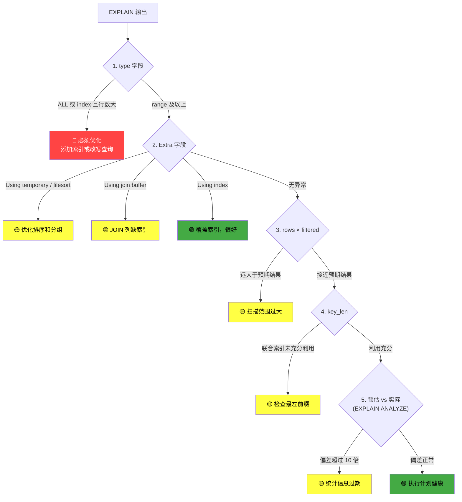
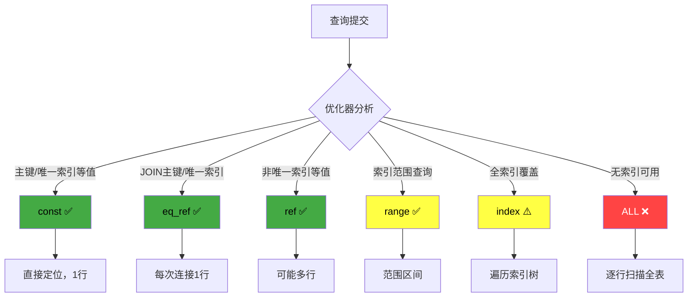
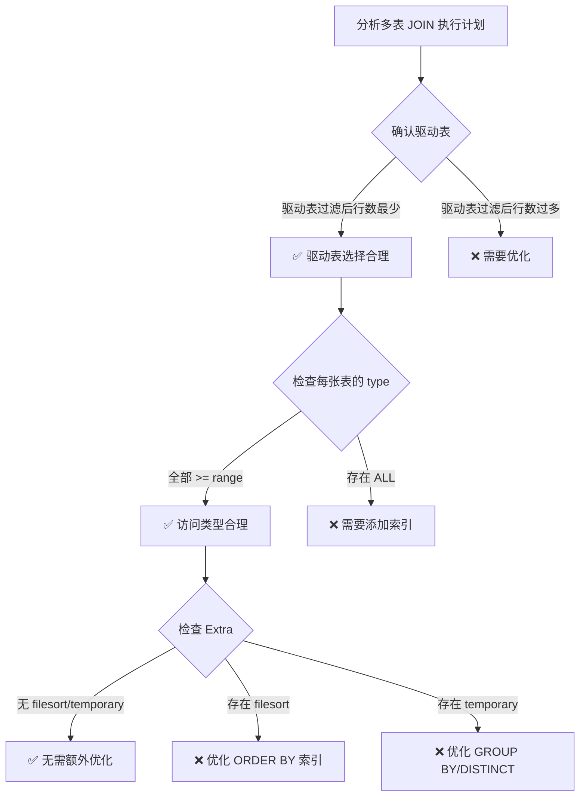

## 技巧一：EXPLAIN 执行计划解读

EXPLAIN 是 MySQL 提供的核心诊断工具，用于展示优化器为一条 SQL 选择的执行计划（Execution Plan）。在性能调优的实践中，EXPLAIN 是**第一个**也是**最重要**的工具——它让你从"猜测瓶颈"走向"看到瓶颈"。

一条 SQL 从提交到返回结果，MySQL 优化器可能生成数十种不同的执行计划。最终选择哪一种，取决于表的统计信息、索引结构、系统变量等多个因素。EXPLAIN 就是让你看到这个选择结果的窗口。

---

### 核心原理：EXPLAIN 在查询生命周期中的位置

要理解 EXPLAIN，首先需要理解 MySQL 处理一条 SQL 的完整流程：


EXPLAIN 展示的就是**优化器阶段**的产出——它告诉你优化器为这条查询选择了什么样的执行路径，但**不会真正执行查询**（EXPLAIN ANALYZE 除外）。

具体来说，优化器需要决定：

1. **表的读取顺序**：多表 JOIN 时，先扫描哪张表，后扫描哪张表（驱动表选择）
2. **访问路径**：对每张表，用全表扫描还是某个索引，用索引的哪种方式（range/ref/eq_ref 等）
3. **连接算法**：Nested Loop Join、Hash Join（MySQL 8.0.18+）还是 Sort-Merge Join
4. **临时表与排序**：是否需要临时表做 GROUP BY/DISTINCT，是否需要 filesort 排序
5. **索引下推**：哪些 WHERE 条件可以在存储引擎层通过 ICP（Index Condition Pushdown）提前过滤

这些决策直接影响查询性能，可能产生数量级的差异。

---

### 系统性阅读 EXPLAIN 的方法论

很多开发者看到 EXPLAIN 输出的一堆字段就懵了，不知道从哪里入手。下面给出一套**标准化的阅读流程**，按优先级从高到低逐步排查：



**五步排查法的核心逻辑：**

| 步骤 | 检查字段 | 关注点 | 判断标准 |
|------|---------|--------|---------|
| 第一步 | type | 访问类型是否可接受 | 至少 range 级别 |
| 第二步 | Extra | 是否有额外开销 | 避免 temporary/filesort/join buffer |
| 第三步 | rows × filtered | 实际过滤后行数 | 应接近预期结果集大小 |
| 第四步 | key_len | 联合索引利用率 | 越长说明索利用越充分 |
| 第五步 | ANLYZE 预估 vs 实际 | 统计信息准确性 | 偏差不超过 10 倍 |

> **经验法则**：日常 OLTP 查询至少应达到 range 级别。如果出现 ALL，除非表非常小（< 1000 行），否则应该考虑添加索引或改写查询。

---

### 基本用法

MySQL 提供了四种 EXPLAIN 格式，各有适用场景：

```sql
-- 1. 传统表格格式（最常用，适合日常分析）
EXPLAIN SELECT * FROM users WHERE age > 25;

-- 2. JSON 格式（包含最详细的信息，适合深度分析）
EXPLAIN FORMAT=JSON SELECT * FROM users WHERE age > 25;

-- 3. TREE 格式（MySQL 8.0.16+，展示执行树和预估代价）
EXPLAIN FORMAT=TREE SELECT * FROM users WHERE age > 25;

-- 4. ANALYZE（MySQL 8.0.18+，真正执行查询并显示实际运行统计）
EXPLAIN ANALYZE SELECT * FROM users WHERE age > 25;
```

**格式选择建议：**

| 场景 | 推荐格式 | 原因 |
|------|---------|------|
| 日常快速检查 | 传统表格 | 一目了然，覆盖核心字段 |
| 深度性能分析 | JSON | 包含代价估算、缓冲区使用、连接算法等细节 |
| 理解执行流程 | TREE | 树形展示数据流转路径，带预估行数和代价 |
| 验证预估准确性 | ANALYZE | 对比预估值与实际值，发现统计信息偏差 |

> **重要提示**：EXPLAIN ANALYZE 会**真正执行**查询。如果查询包含 INSERT/UPDATE/DELETE 等写操作，使用 `EXPLAIN ANALYZE SELECT ...` 形式，不要直接 EXPLAIN 写操作。

---

### 执行计划字段详解

EXPLAIN 输出的每一列都承载着关键信息。下面按重要程度排序逐一解析：

#### id —— 查询序号

`id` 表示 SELECT 在整个查询中的执行顺序。id 相同的行从上到下依次执行，id 不同的行（子查询）id 值大的先执行。

```sql
-- 子查询场景
EXPLAIN SELECT * FROM orders 
WHERE user_id IN (SELECT id FROM users WHERE age > 25);

-- UNION 场景
EXPLAIN SELECT name FROM users WHERE age > 25
UNION
SELECT name FROM users WHERE age < 18;

-- 派生表（Derived Table）场景
EXPLAIN SELECT * FROM (
    SELECT user_id, COUNT(*) AS order_count
    FROM orders GROUP BY user_id
) AS sub WHERE sub.order_count > 5;
```

id 的解读规则：
- id 相同：从上到下顺序执行（如简单 JOIN）
- id 不同：id 值大的先执行（如子查询优先于外查询）
- UNION 产生 id 为 NULL 的临时表行

#### select_type —— 查询类型

select_type 标识每个 SELECT 在查询中的角色：

| select_type | 含义 | 典型场景 |
|-------------|------|---------|
| SIMPLE | 简单查询，无子查询和 UNION | `SELECT * FROM users WHERE id = 1` |
| PRIMARY | 最外层查询 | 含子查询时的外层 SELECT |
| SUBQUERY | 非关联子查询（不在 FROM 子句中） | `WHERE x IN (SELECT ...)` |
| DEPENDENT SUBQUERY | 关联子查询，依赖外层查询 | `WHERE EXISTS (SELECT ... WHERE t.id = outer.id)` |
| DERIVED | FROM 子句中的派生表（子查询） | `SELECT * FROM (SELECT ...) AS sub` |
| UNION | UNION 中第二个及后续的 SELECT | `SELECT ... UNION SELECT ...` |
| UNION RESULT | UNION 的最终结果 | `id = NULL` 的临时表行 |
| DEPENDENT UNION | UNION 中依赖外层的 SELECT | UNION 在关联子查询中 |
| MATERIALIZED | 物化子查询（MySQL 5.7+） | 子查询结果被物化为临时表后参与 JOIN |
| UNCACHEABLE SUBQUERY | 不可缓存的子查询 | 子查询引用了用户变量 |
| DEPENDENT SUBQUERY + UNION | 嵌套关联子查询中的 UNION | 常见于复杂的 EXISTS 子查询 |

#### type —— 访问类型（最关键的字段）

`type` 表示 MySQL 如何在表中查找数据行，从**最好到最差**排列：

system > const > eq_ref > ref > fulltext > ref_or_null > 
index_merge > unique_subquery > index_subquery > range > 
index > ALL

日常关注的主要是前 7 种：

**system** —— 表只有一行记录（系统表），是 const 的特例。实际极少出现。

**const** —— 通过主键或唯一索引做等值查询，最多返回一行。效率最高。

```sql
-- 主键等值查询
EXPLAIN SELECT * FROM users WHERE id = 1;
-- type: const, rows: 1

-- 唯一索引等值查询
EXPLAIN SELECT * FROM users WHERE email = 'alice@example.com';
-- type: const（前提是 email 列有 UNIQUE 约束）
```

**eq_ref** —— 在 JOIN 查询中，被驱动表通过主键或唯一索引进行等值匹配。每次连接最多匹配一行。

```sql
-- orders 通过 user_id 连接 users 的主键
EXPLAIN SELECT o.id, u.name 
FROM orders o JOIN users u ON o.user_id = u.id;
-- orders 表 type: ALL（或 index）
-- users 表 type: eq_ref（用主键匹配）
```

**ref** —— 通过非唯一索引进行等值查询，可能返回多行。

```sql
-- email 列有普通索引（非 UNIQUE）
CREATE INDEX idx_email ON users(email);
EXPLAIN SELECT * FROM users WHERE email = 'test@example.com';
-- type: ref, rows: 1（如果 email 确实唯一）
```

**range** —— 索引范围扫描，常见于 BETWEEN、>、<、IN、LIKE 'abc%' 等。

```sql
EXPLAIN SELECT * FROM users WHERE age BETWEEN 20 AND 30;
-- type: range

EXPLAIN SELECT * FROM users WHERE created_at > '2024-01-01';
-- type: range

EXPLAIN SELECT * FROM users WHERE id IN (1, 2, 3);
-- type: range
```

**index** —— 全索引扫描。遍历整棵索引树，但不访问实际数据行（如果索引包含所有需要的列）。比 ALL 好，因为索引通常比整张表小。

```sql
-- 只查询索引包含的列
EXPLAIN SELECT id FROM users;
-- type: index（扫描主键索引）
```

**ALL** —— 全表扫描，逐行读取。**这是最差的访问类型**，通常意味着需要优化。

```sql
-- LIKE 以通配符开头，无法使用索引
EXPLAIN SELECT * FROM users WHERE name LIKE '%test%';
-- type: ALL

-- 没有索引的列做等值查询
EXPLAIN SELECT * FROM users WHERE remark = 'vip';
-- type: ALL（假设 remark 列没有索引）
```

#### key —— 实际使用的索引

`key` 显示 MySQL 实际选择的索引。可能为 NULL（未使用索引），也可能与 `possible_keys` 不同（优化器选择了代价更低的索引）。

#### possible_keys —— 可能使用的索引

列出查询中可能用到的所有索引。这是优化器的候选列表，但最终选择取决于代价估算。

```sql
-- 假设 users 表有 idx_age 和 idx_email 两个索引
EXPLAIN SELECT * FROM users WHERE age > 25 AND email = 'test@example.com';
-- possible_keys: idx_age, idx_email
-- key: idx_email（如果 email 等值查询的代价更低）
```

#### key_len —— 索引使用长度

`key_len` 表示索引中被使用的字节数，帮助判断联合索引有多少列被实际用到。

```sql
-- 联合索引 idx_name_age_email (name VARCHAR(50), age INT, email VARCHAR(100))
-- utf8mb4 下：name=50*4+2=202, age=4+1=5, email=100*4+2=402

-- 只用了 name 列
EXPLAIN SELECT * FROM users WHERE name = 'Alice';
-- key_len: 202

-- 用了 name + age 两列
EXPLAIN SELECT * FROM users WHERE name = 'Alice' AND age = 25;
-- key_len: 207 (202 + 5)

-- 用了全部三列
EXPLAIN SELECT * FROM users WHERE name = 'Alice' AND age = 25 AND email = 'a@b.com';
-- key_len: 609 (202 + 5 + 402)
```

key_len 的计算规则：

| 类型 | 字节数 | 备注 |
|------|-------|------|
| INT | 4 | NOT NULL |
| INT | 5 | 允许 NULL（+1） |
| BIGINT | 8 | NOT NULL |
| BIGINT | 9 | 允许 NULL（+1） |
| VARCHAR(N) utf8mb4 | N×4+2 | 变长字段长度标记 2 字节 |
| VARCHAR(N) utf8 | N×3+2 | |
| VARCHAR(N) ascii | N+1+2 | |
| CHAR(N) | N×字符集字节数 | 定长无长度标记 |
| DATE | 3 | |
| DATETIME | 5 | MySQL 5.6.4+ |
| TIMESTAMP | 4 | |

> **实战技巧**：通过对比 key_len 可以精确判断联合索引中哪些列被用到。如果预期用到 3 列但 key_len 只对应 1 列，说明索引设计或查询写法有问题。

#### ref —— 索引引用列

显示索引的哪一列或常量被用于与 `key` 列指定的索引进行比较。

```sql
-- 等值查询
EXPLAIN SELECT * FROM users WHERE age = 25;
-- ref: const

-- JOIN 查询
EXPLAIN SELECT * FROM orders o JOIN users u ON o.user_id = u.id;
-- ref: db.users.id（引用了 users 表的 id 列）
```

#### rows —— 预估扫描行数

MySQL 优化器基于统计信息估算的需要扫描的行数。这个值**不精确**，但对理解执行计划非常关键。如果 rows 值远大于预期结果行数，说明查询效率可能不高。

> **注意**：rows 是估算值，受统计信息准确性影响。如果表的统计信息过期（数据大量增删后未 ANALYZE），rows 可能严重偏离实际值。

#### filtered —— 过滤比例

表示在存储引擎层返回的行中，经过 WHERE 条件过滤后保留的行数百分比。

```sql
-- 假设 users 表有 10000 行
EXPLAIN SELECT * FROM users WHERE age > 25 AND name = 'Alice';
-- rows: 5000（引擎层预估返回 5000 行）
-- filtered: 10（Server 层过滤后保留 10%，即约 500 行）
-- 最终预估行数 = rows × filtered / 100 = 500 行
```

rows 和 filtered 的关系：
- rows 是存储引擎层的预估（不考虑其他 WHERE 条件）
- filtered 是 Server 层对 rows 结果的过滤比例
- 两者相乘得到最终预估结果行数

#### Extra —— 额外信息（极其重要）

Extra 字段包含大量性能诊断信息，是分析执行计划的核心之一：

**Using index（覆盖索引）** —— 查询所需的所有列都包含在索引中，无需回表（随机 I/O）。这是**非常好的信号**。

```sql
-- 联合索引 idx_age_name 包含 age 和 name 两列
EXPLAIN SELECT age, name FROM users WHERE age = 25;
-- Extra: Using index
-- 无需回表，直接从索引获取数据
```

**Using where** —— 存储引擎层返回的行需要在 Server 层进一步过滤。不一定有问题，但如果 rows 很大而 filtered 很低，说明索引过滤效率不高。

**Using temporary** —— 使用了临时表，通常出现在 GROUP BY、DISTINCT、UNION 等操作中。临时表可能写入磁盘，**通常是需要优化的信号**。

```sql
-- 不含覆盖索引的 GROUP BY
EXPLAIN SELECT DISTINCT city FROM users;
-- Extra: Using temporary
```

**Using filesort** —— 无法利用索引完成排序，需要额外的排序操作。MySQL 有两种排序算法：
- **双路排序（Two-pass）**：先按排序键取出数据，排序后再回表取完整行。两次磁盘 I/O。
- **单路排序（Single-pass）**：一次性取出所有需要的列在内存中排序。一次磁盘 I/O，但需要更多内存。

```sql
-- ORDER BY 的列不在索引中
EXPLAIN SELECT * FROM users ORDER BY city;
-- Extra: Using filesort
```

**Using index condition（索引下推 ICP）** —— MySQL 5.6+ 引入的优化。将部分 WHERE 条件下推到存储引擎层在索引遍历时过滤，减少回表次数。

```sql
-- 联合索引 idx_age_name (age, name)
EXPLAIN SELECT * FROM users WHERE age > 25 AND name LIKE 'test%';
-- Extra: Using index condition
-- age 条件用于索引范围扫描，name 条件在索引层过滤，减少回表
```

**Select tables optimized away** —— 在优化阶段就直接从索引或系统表中获取了结果，无需访问数据行。通常出现在对索引列做 MIN/MAX 聚合时。

```sql
EXPLAIN SELECT MIN(id) FROM users;
-- Extra: Select tables optimized away
```

**Using join buffer (Block Nested Loop) / Using join buffer (hash join)** —— 连接时没有可用索引，使用了 Join Buffer。MySQL 8.0.18+ 默认使用 Hash Join 替代 Block Nested Loop。

**Intersect filtered** —— MySQL 8.0.31+ 索引合并（Index Merge）交集操作的执行信息。

**LooseScan** —— MySQL 8.0+ 的松散索引扫描，用于 GROUP BY 或 DISTINCT 优化，在索引中跳过相同值的行。

**FirstMatch** —— 半连接（Semi-join）优化策略的一种，对每个外部行只查找第一个匹配行，避免重复扫描。

---

### Extra 字段完整对照表

| Extra 值 | 含义 | 是否需要优化 | 典型原因 |
|-----------|------|-------------|---------|
| Using index | 覆盖索引 | ✅ 好的信号 | 查询列全在索引中 |
| Using index condition | 索引下推 ICP | ✅ 好的信号 | 存储引擎层提前过滤 |
| Using where | Server 层过滤 | ⚠️ 视情况 | 索引未能完全覆盖 WHERE 条件 |
| Using temporary | 使用临时表 | ❌ 需要优化 | GROUP BY/DISTINCT 缺少合适索引 |
| Using filesort | 额外排序 | ❌ 需要优化 | ORDER BY 列不在索引中 |
| Using join buffer | 连接缓冲区 | ❌ 需要优化 | JOIN 列缺少索引 |
| Select tables optimized away | 优化阶段完成 | ✅ 好的信号 | 索引直接获取聚合结果 |
| Impossible WHERE | WHERE 条件矛盾 | ⚠️ 检查逻辑 | 优化器发现条件永假 |
| Distinct | 去重优化 | ✅ 好的信号 | 半连接去重优化 |
| LooseScan | 松散索引扫描 | ✅ 好的信号 | 索引跳过重复值 |
| FirstMatch | 首次匹配 | ✅ 好的信号 | 半连接首次匹配优化 |
| Using index for skip scan | 跳过扫描 | ✅ 好的信号 | 跳过联合索引前导列 |
| Start temporary | 临时表标记 | ⚠️ 视情况 | 半连接临时表 |
| End temporary | 临时表标记 | ⚠️ 视情况 | 半连接临时表 |

---

### type 字段完整性能光谱

下面用一个完整的示例来展示不同 type 值在实际场景中的表现：

```sql
-- 前置准备：创建测试表和索引
CREATE TABLE users (
    id BIGINT PRIMARY KEY AUTO_INCREMENT,
    name VARCHAR(50) NOT NULL,
    email VARCHAR(100) NOT NULL,
    age INT NOT NULL,
    city VARCHAR(50),
    created_at DATETIME DEFAULT CURRENT_TIMESTAMP,
    UNIQUE KEY uk_email (email),
    INDEX idx_age (age),
    INDEX idx_city_age (city, age)
) ENGINE=InnoDB;

-- 插入 100 万条测试数据（使用存储过程批量生成）
DELIMITER //
CREATE PROCEDURE generate_test_data(IN num_rows INT)
BEGIN
    DECLARE i INT DEFAULT 0;
    DECLARE batch_size INT DEFAULT 10000;
    WHILE i < num_rows DO
        INSERT INTO users (name, email, age, city, created_at)
        SELECT 
            CONCAT('user_', i + seq),
            CONCAT('user_', i + seq, '@test.com'),
            FLOOR(18 + RAND() * 50),
            ELT(FLOOR(1 + RAND() * 6), 'Beijing', 'Shanghai', 'Shenzhen', 'Guangzhou', 'Hangzhou', 'Chengdu'),
            DATE_ADD('2020-01-01', INTERVAL FLOOR(RAND() * 1800) DAY)
        FROM (
            SELECT @rownum := @rownum + 1 AS seq 
            FROM information_schema.columns a, information_schema.columns b, (SELECT @rownum := 0) r 
            LIMIT batch_size
        ) t;
        SET i = i + batch_size;
    END WHILE;
END //
DELIMITER ;

CALL generate_test_data(1000000);
ANALYZE TABLE users;

-- 1. const：主键等值
EXPLAIN SELECT * FROM users WHERE id = 42;
-- type: const | key: PRIMARY | rows: 1

-- 2. eq_ref：JOIN + 主键/唯一索引等值
EXPLAIN SELECT o.id, u.name 
FROM orders o INNER JOIN users u ON o.user_id = u.id;
-- users 表 type: eq_ref | key: PRIMARY | rows: 1

-- 3. ref：非唯一索引等值
EXPLAIN SELECT * FROM users WHERE email = 'alice@test.com';
-- type: ref | key: uk_email | rows: 1

-- 4. range：索引范围扫描
EXPLAIN SELECT * FROM users WHERE age BETWEEN 20 AND 30;
-- type: range | key: idx_age | rows: ~150000

-- 5. index_merge：合并多个索引
-- 需要两个独立索引条件 OR 连接
EXPLAIN SELECT * FROM users WHERE id = 1 OR age = 25;
-- type: index_merge | key: PRIMARY,idx_age

-- 6. index：全索引扫描
EXPLAIN SELECT id FROM users;
-- type: index | key: PRIMARY | rows: 1000000

-- 7. ALL：全表扫描
EXPLAIN SELECT * FROM users WHERE name LIKE '%test%';
-- type: ALL | key: NULL | rows: 1000000
```



---

### EXPLAIN FORMAT=TREE 深度解析

TREE 格式（MySQL 8.0.16+）以树形结构展示执行计划，比表格格式更直观地呈现数据流转路径和代价估算：

```sql
EXPLAIN FORMAT=TREE 
SELECT o.id, o.amount, u.name 
FROM orders o 
JOIN users u ON o.user_id = u.id 
WHERE o.status = 'paid' 
AND o.created_at > '2024-01-01';
```

输出示例：

Nested loop inner join  (cost=4.35 rows=30)
    -> Index range scan on o using idx_status_created  (cost=2.35 rows=15)
    -> Single-row index lookup on u using PRIMARY  (cost=0.0133 rows=1)

**TREE 格式关键输出解读：**

| 输出内容 | 含义 | 如何使用 |
|---------|------|---------|
| `cost=2.35` | 预估总代价 | 对比优化前后的 cost 值 |
| `rows=15` | 预估返回行数 | 与 EXPLAIN 表格的 rows 等价 |
| `Index range scan` | 索引范围扫描 | 等价于 type=range |
| `Single-row index lookup` | 单行索引查找 | 等价于 type=eq_ref/const |
| `Hash join` | 哈希连接 | MySQL 8.0.18+ 的新连接算法 |
| `Sort` | 排序操作 | 等价于 Extra 中的 Using filesort |
| `Group aggregate` | 分组聚合 | 对应 GROUP BY 操作 |

**TREE 格式的独特优势：**

```sql
-- 对比三种格式的可读性
-- 1. 传统格式：需要自己推断数据流
EXPLAIN SELECT * FROM orders o JOIN users u ON o.user_id = u.id;
-- 只能看到两行，需要自己理解 JOIN 方向

-- 2. TREE 格式：直观展示嵌套关系
EXPLAIN FORMAT=TREE SELECT * FROM orders o JOIN users u ON o.user_id = u.id;
-- 输出清晰展示：外层循环 → 内层查找，一目了然

-- 3. 对比优化前后的代价
-- 优化前
EXPLAIN FORMAT=TREE SELECT * FROM orders WHERE user_id = 42;
-- -> Filter: (o.user_id = 42)  (cost=10235.00 rows=500000)
--     -> Table scan on o  (cost=10235.00 rows=1000000)

-- 添加索引后
EXPLAIN FORMAT=TREE SELECT * FROM orders WHERE user_id = 42;
-- -> Index lookup on o using idx_user_id  (cost=2.35 rows=15)
```

> **TREE 格式的局限**：不显示 `possible_keys`、`key_len` 等字段。日常分析建议先用传统格式看全貌，再用 TREE 格式理解执行流程。

---

### EXPLAIN JSON 格式深度解析

JSON 格式包含表格格式没有的细节信息，适合深度性能分析：

```sql
EXPLAIN FORMAT=JSON SELECT * FROM users WHERE age > 25 AND city = 'Beijing';
```

返回的 JSON 中包含以下关键信息：

| JSON 字段 | 含义 | 关注点 |
|-----------|------|--------|
| query_block.cost_info.query_cost | 整条查询的总代价 | 越小越好，用于对比优化前后的效果 |
| table.cost_info.read_cost | 单表读取代价 | 主要由 I/O 代价 + CPU 代价组成 |
| table.cost_info.data_length | 数据长度（字节） | 反映实际读取的数据量 |
| table.cost_info.rows_per_scan | 每次扫描的行数 | 等价于 EXPLAIN 表格中的 rows |
| table.index_condition | 索引下推的条件 | 确认 ICP 是否生效 |
| table.join_type | 连接算法 | Nested Loop / Hash Join / Sort Merge |
| table.attached_condition | 附加的 WHERE 条件 | 在哪一层过滤 |
| table.skipped_keys_count | 跳过的索引数 | 优化器评估但放弃的索引数量 |
| table.cost_info.read_cost_from_handler | 存储引擎层读取代价 | 实际 I/O 相关代价 |
| query_block.cost_info.read_first_cost | 首次读取代价 | 反映初始定位的开销 |
| query_block.cost_info.read_rnd_cost | 随机读代价 | 反映回表的开销 |

**实际示例：对比优化前后的查询代价**

```sql
-- 优化前：无索引
EXPLAIN FORMAT=JSON SELECT * FROM orders WHERE user_id = 42;
-- query_cost: 12543.20, rows_per_scan: 500000

-- 添加索引后
ALTER TABLE orders ADD INDEX idx_user_id (user_id);
EXPLAIN FORMAT=JSON SELECT * FROM orders WHERE user_id = 42;
-- query_cost: 2.35, rows_per_scan: 15

-- 代价降低了 99.98%，这就是索引的力量
```

**JSON 格式中的代价模型详解：**

MySQL 优化器基于以下因素计算代价：
- **I/O 代价**：读取数据页的次数 × 每页代价（innodb_page_size）
- **CPU 代价**：比较索引键值、评估 WHERE 条件的开销
- **内存代价**：使用临时表或排序缓冲区的内存开销
- **网络代价**：传输结果集的开销（通常可忽略）

```sql
-- 从 JSON 中提取代价信息进行对比
-- 优化前
EXPLAIN FORMAT=JSON SELECT * FROM users WHERE status = 'active' AND age > 25\G
-- "query_cost": "2345.00"
-- "read_cost": "2340.00"  
-- "data_length": "32768"

-- 优化后（添加联合索引）
ALTER TABLE users ADD INDEX idx_status_age (status, age);
EXPLAIN FORMAT=JSON SELECT * FROM users WHERE status = 'active' AND age > 25\G
-- "query_cost": "12.50"
-- "read_cost": "10.00"
-- "data_length": "4096"
```

---

### EXPLAIN ANALYZE：真实执行统计

EXPLAIN ANALYZE 是 MySQL 8.0.18+ 引入的最强大的诊断工具。它**真正执行查询**并返回每个步骤的实际运行时间、实际行数等信息。

```sql
EXPLAIN ANALYZE 
SELECT o.id, o.amount, u.name 
FROM orders o 
JOIN users u ON o.user_id = u.id 
WHERE o.status = 'paid' 
AND o.created_at > '2024-01-01'
ORDER BY o.created_at DESC 
LIMIT 10;
```

输出示例（简化）：

-> Limit: 10 row(s) (actual time=12.3..12.4 rows=10 loops=1)
  -> Nested loop inner join  (cost=2.35 rows=15)
     (actual time=0.05..12.1 rows=10 loops=1)
    -> Index lookup on o using idx_status_created (actual time=0.03..8.2 rows=120 loops=1)
    -> Single-row index lookup on u using PRIMARY (actual time=0.003..0.003 rows=1 loops=120)

**关键输出指标解读：**

| 指标 | 含义 | 如何判断 |
|------|------|---------|
| actual time | 实际执行时间（毫秒） | 第一个值是开始处理该步骤的时间，第二个是完成时间 |
| rows（actual） | 实际返回行数 | 对比预估行数(rows)判断统计信息是否准确 |
| loops | 该步骤被执行的次数 | Nested Loop 中内层表的 loops 应等于外层表的 rows |
| cost | 预估代价 | 优化器在执行前计算的代价 |
| size | 预估返回数据大小 | 用于内存分配估算 |

**预估 vs 实际：发现问题**

-- 常见问题：预估行数严重偏离实际行数
-> Index lookup on users (actual time=0.1..50.2 rows=85000 loops=1)
   cost=2.35 rows=15    -- 预估 15 行
   actual rows=85000      -- 实际 85000 行！

-- 结论：统计信息严重过期，需要 ANALYZE TABLE 更新统计信息
ANALYZE TABLE users;

**EXPLAIN ANALYZE 输出中的关键模式识别：**

| 模式 | 含义 | 应对措施 |
|------|------|---------|
| `actual rows >> rows` | 统计信息过期 | `ANALYZE TABLE` 更新 |
| `loops > 1` 且内层扫描大 | 嵌套循环效率低 | 优化 JOIN 条件索引 |
| `actual time` 远大于 0 | 该步骤是瓶颈 | 重点优化此步骤 |
| `actual rows = 0` | 条件无匹配 | 检查 WHERE 逻辑 |
| `cost=0.00` | 优化阶段已完成 | 无需额外优化 |

---

### 多表 JOIN 执行计划分析

多表 JOIN 的执行计划分析是 EXPLAIN 使用中最复杂也最有价值的部分：

```sql
-- 电商场景：查询订单详情
EXPLAIN SELECT 
    o.id, o.amount, o.created_at,
    u.name, u.email,
    p.product_name, p.category
FROM orders o
INNER JOIN users u ON o.user_id = u.id
INNER JOIN products p ON o.product_id = p.id
WHERE o.status = 'paid'
AND o.created_at > '2024-01-01'
AND u.city = 'Shanghai'
ORDER BY o.created_at DESC
LIMIT 20;
```

**分析步骤：**

**第一步：确认驱动表**

EXPLAIN 输出的第一行是驱动表（最先扫描的表）。好的执行计划应该让**过滤后行数最少**的表作为驱动表。

```sql
-- 查看每张表的预估行数
-- orders: rows=200000, filtered=10 (status + created_at 过滤后 20000 行)
-- users: rows=100000, filtered=5 (city 过滤后 5000 行)
-- products: rows=5000, filtered=100

-- 如果优化器选择 users 作为驱动表（5000行），优于 orders（20000行），这是合理的
```

**第二步：检查每张表的 type**

```sql
-- users 表：city = 'Shanghai' 走联合索引
-- type: ref, key: idx_city_age, rows: 5000, filtered: 100

-- orders 表：user_id 走索引
-- type: ref, key: idx_user_id, rows: 3, filtered: 10

-- products 表：主键等值
-- type: eq_ref, key: PRIMARY, rows: 1, filtered: 100
```

**第三步：检查连接算法**

-- 如果是 MySQL 8.0.18 之前
-- type 列可能显示 ALL 但使用了 Using join buffer (Block Nested Loop)
-- 这意味着连接列没有索引，性能较差

-- MySQL 8.0.18+ 会自动使用 Hash Join
-- Using join buffer (hash join) 性能远好于 Block Nested Loop

**第四步：检查排序**

-- 如果 ORDER BY o.created_at DESC 无法利用索引
-- Extra: Using filesort
-- 优化方案：添加复合索引 (status, created_at DESC)
ALTER TABLE orders ADD INDEX idx_status_created (status, created_at DESC);



---

### DML 语句的 EXPLAIN

除了 SELECT，EXPLAIN 还可以用于分析 DML 语句的执行计划。这对优化批量写入至关重要：

**INSERT ... SELECT 优化**

```sql
-- 批量插入 + 子查询：EXPLAIN 可以展示子查询的执行计划
EXPLAIN INSERT INTO archived_orders (id, amount, created_at)
SELECT id, amount, created_at FROM orders 
WHERE created_at < '2023-01-01';

-- 优化点：确保 SELECT 部分高效，减少锁持有时间
-- 如果 SELECT 部分全表扫描，会持有源表的锁导致阻塞
```

**UPDATE ... JOIN 优化**

```sql
-- 关联更新：展示 JOIN 的执行计划
EXPLAIN UPDATE orders o
JOIN users u ON o.user_id = u.id
SET o.region = u.region
WHERE o.created_at > '2024-01-01';

-- 分析要点：
-- 1. JOIN 条件是否有索引（eq_ref 级别最优）
-- 2. WHERE 条件的扫描行数（rows 值）
-- 3. 是否有 Using filesort 或 Using temporary
```

**DELETE ... JOIN 优化**

```sql
-- 关联删除
EXPLAIN DELETE o FROM orders o
JOIN users u ON o.user_id = u.id
WHERE u.status = 'inactive';

-- 关键：确认删除范围可控，避免全表扫描导致长时间锁表
```

**REPLACE INTO 优化**

```sql
-- 基于主键的替换操作
EXPLAIN REPLACE INTO users (id, name, email)
SELECT id, name, email FROM staging_users;

-- 展示 SELECT 部分的执行计划，确保不会全表扫描
```

> **安全提示**：对 DML 语句执行 EXPLAIN 不会实际修改数据。但 EXPLAIN ANALYZE 会**真正执行** DML，务必在测试环境使用！

---

### EXPLAIN 与慢查询日志的配合

EXPLAIN 的最佳搭档是慢查询日志（Slow Query Log）。工作流程如下：

**第一步：开启慢查询日志**

```sql
-- 查看当前配置
SHOW VARIABLES LIKE 'slow_query%';
SHOW VARIABLES LIKE 'long_query_time';

-- 开启慢查询日志
SET GLOBAL slow_query_log = ON;
SET GLOBAL long_query_time = 1;  -- 超过 1 秒的查询记录
SET GLOBAL log_queries_not_using_indexes = ON;  -- 记录未使用索引的查询
```

**第二步：分析慢查询日志**

```bash
# 使用 mysqldumpslow 工具分析
mysqldumpslow -s t -t 10 /var/lib/mysql/slow-query.log

# 使用 pt-query-digest（Percona Toolkit，更强大）
pt-query-digest /var/lib/mysql/slow-query.log > slow_report.txt
```

**第三步：对慢查询执行 EXPLAIN**

```sql
-- 从慢查询日志中提取 SQL，加上 EXPLAIN
EXPLAIN SELECT o.id, u.name 
FROM orders o JOIN users u ON o.user_id = u.id 
WHERE o.status = 'paid' AND o.created_at > '2024-01-01' 
ORDER BY o.created_at DESC LIMIT 20;

-- 或者使用 EXPLAIN ANALYZE 查看真实执行时间
EXPLAIN ANALYZE SELECT o.id, u.name 
FROM orders o JOIN users u ON o.user_id = u.id 
WHERE o.status = 'paid' AND o.created_at > '2024-01-01' 
ORDER BY o.created_at DESC LIMIT 20;
```

---

### 可视化工具与图形化 EXPLAIN

除了命令行的 EXPLAIN 输出，MySQL 还提供了多种可视化工具来辅助理解执行计划：

**MySQL Workbench Visual Explain**

MySQL Workbench 内置的 Visual Explain 功能可以将执行计划渲染为图形化的流程图：

1. 在 Workbench 中打开 SQL 编辑器
2. 编写查询后点击 "Explain" 按钮（或按 Ctrl+Shift+E）
3. 切换到 "Visual Explain" 标签页
4. 图形化展示表之间的 JOIN 关系、访问类型、预估行数

**解读要点：**
- 圆形节点代表表操作，大小反映代价
- 连线粗细反映数据流量
- 颜色编码：绿色=索引操作，红色=全表扫描
- 悬浮查看每个节点的详细信息

**第三方工具推荐：**

| 工具 | 类型 | 特点 | 适用场景 |
|------|------|------|---------|
| MySQL Workbench | GUI | 官方工具，Visual Explain | 日常开发和分析 |
| Percona Toolkit | CLI | pt-query-digest 分析慢日志 | 生产环境批量分析 |
| EXPLAIN Ninja | Web | 在线 EXPLAIN 可视化 | 快速分享和协作 |
| pgAdmin (PostgreSQL) | GUI | 类似理念，支持 EXPLAIN ANALYZE | PostgreSQL 用户 |
| MySQL EXPLAIN Viewer | Web | JSON 格式可视化 | 深度分析 JSON 输出 |

**使用 EXPLAIN Ninja 分享执行计划：**

```bash
# 将 EXPLAIN JSON 输出保存到文件
EXPLAIN FORMAT=JSON SELECT ... > explain.json

# 上传到 EXPLAIN Ninja 获取可视化链接
# 可以方便地在团队中分享和讨论执行计划
```

---

### 统计信息与优化器代价模型

理解 EXPLAIN 输出的准确性，需要了解其背后的统计信息机制：

**MySQL 优化器使用的核心统计信息：**

| 统计信息 | 含义 | 获取方式 | 更新时机 |
|---------|------|---------|---------|
| 表的行数 | 粗略的总行数 | `SHOW TABLE STATUS` | 定期自动更新 |
| 索引基数（Cardinality） | 索引中不同值的数量 | `SHOW INDEX FROM table` | ANALYZE TABLE |
| 列的直方图（Histogram） | 列值的分布统计 | `ANALYZE TABLE table UPDATE HISTOGRAM ON col` | 手动触发 |
| 数据页数 | 表占用的数据页数量 | InnoDB 内部统计 | 定期自动更新 |
| 平均行长度 | 每行的平均字节数 | InnoDB 内部统计 | 定期自动更新 |
| 索引大小 | 索引占用的存储空间 | `information_schema.STATISTICS` | 定期自动更新 |

**统计信息不准确的常见表现：**

```sql
-- 症状：EXPLAIN 预估行数与实际行数严重不符
EXPLAIN ANALYZE SELECT * FROM users WHERE status = 'active';
-- 预估 rows: 100
-- 实际 rows: 850000（偏差 8500 倍！）

-- 原因：status 列数据分布不均匀（99% 是 active），但统计信息未反映

-- 解决方案：更新统计信息
ANALYZE TABLE users;

-- 或者创建直方图（MySQL 8.0+）
ANALYZE TABLE users UPDATE HISTOGRAM ON status WITH 100 BUCKETS;
```

**直方图的作用：**

直方图将列值分成多个桶（Bucket），记录每个桶的值分布。这比简单的基数（Cardinality）更精确，能帮助优化器更好地估算等值查询和范围查询的行数。

```sql
-- 查看直方图信息
SELECT * FROM information_schema.COLUMN_STATISTICS 
WHERE TABLE_NAME = 'users' AND COLUMN_NAME = 'status'\G

-- 查看某个桶的分布
SELECT histogram FROM information_schema.COLUMN_STATISTICS 
WHERE TABLE_NAME = 'users' AND COLUMN_NAME = 'status'\G

-- 直方图的最佳实践
-- 1. 对 WHERE 条件中高选择性的列创建直方图
-- 2. BUCKETS 数量一般 50-100 即可
-- 3. 数据分布变化后及时更新
-- 4. 直方图会占用存储空间，不要对所有列都创建
```

**索引基数（Cardinality）的重要性：**

```sql
-- 查看索引基数
SHOW INDEX FROM users;
-- Cardinality 列显示索引中不同值的数量

-- 基数选择性 = Cardinality / 表总行数
-- 选择性越高，索引过滤效果越好

-- 示例：
-- users 表 100 万行
-- idx_age 的 Cardinality = 50（只有 50 种年龄值）
-- 选择性 = 50 / 1000000 = 0.005%（极低，索引几乎无效）

-- idx_email 的 Cardinality = 999990（几乎每行不同）
-- 选择性 = 999990 / 1000000 = 99.999%（极高，索引非常有效）
```

---

### 分区表与 EXPLAIN

当表使用了分区（Partitioning），EXPLAIN 输出会额外展示分区相关信息：

```sql
-- 创建分区表
CREATE TABLE logs (
    id BIGINT AUTO_INCREMENT,
    created_at DATETIME NOT NULL,
    message TEXT,
    PRIMARY KEY (id, created_at)
) PARTITION BY RANGE (YEAR(created_at)) (
    PARTITION p2022 VALUES LESS THAN (2023),
    PARTITION p2023 VALUES LESS THAN (2024),
    PARTITION p2024 VALUES LESS THAN (2025),
    PARTITION p2025 VALUES LESS THAN (2026),
    PARTITION p_future VALUES LESS THAN MAXVALUE
);

-- EXPLAIN 会显示分区裁剪（Partition Pruning）
EXPLAIN SELECT * FROM logs WHERE created_at > '2024-01-01';
-- partitions 列显示：p2024,p2025,p_future（只扫描相关分区）

-- 如果不走分区裁剪
EXPLAIN SELECT * FROM logs WHERE YEAR(created_at) = 2024;
-- partitions 列显示：全部分区（函数导致分区裁剪失效）
```

**EXPLAIN 中分区相关字段：**

| 字段 | 含义 | 关注点 |
|------|------|--------|
| partitions | 访问的分区列表 | 应尽可能少，说明分区裁剪有效 |
| part | 分区键 | 分区裁剪的依据 |
| subpart | 二级分区 | 复合分区时才出现 |

**分区裁剪失效的常见原因：**

| 写法 | 是否走分区裁剪 | 原因 |
|------|-------------|------|
| `WHERE created_at > '2024-01-01'` | ✅ | 直接比较分区键 |
| `WHERE YEAR(created_at) = 2024` | ❌ | 函数操作导致无法裁剪 |
| `WHERE created_at IN ('2024-01-01', '2024-06-01')` | ✅ | IN 列表可以裁剪 |
| `WHERE DATE(created_at) = '2024-01-01'` | ❌ | 函数操作导致无法裁剪 |

---

### 常见优化场景与实战

#### 场景一：全表扫描 → 添加合适索引

```sql
-- 优化前
EXPLAIN SELECT * FROM users WHERE age > 25;
-- type: ALL, rows: 1000000, key: NULL
-- 执行时间：1.2 秒

-- 分析：age 列没有索引，只能全表扫描
-- 方案：添加 B-tree 索引
ALTER TABLE users ADD INDEX idx_age (age);

-- 优化后
EXPLAIN SELECT * FROM users WHERE age > 25;
-- type: range, rows: 350000, key: idx_age
-- 执行时间：0.08 秒（提升 15 倍）
```

#### 场景二：函数导致索引失效

```sql
-- 错误写法：对索引列使用函数
EXPLAIN SELECT * FROM users WHERE YEAR(created_at) = 2024;
-- type: ALL, rows: 1000000
-- 函数操作导致 B-tree 索引无法使用

-- 正确写法：改写为范围查询
EXPLAIN SELECT * FROM users 
WHERE created_at >= '2024-01-01' AND created_at < '2025-01-01';
-- type: range, rows: 280000, key: idx_created_at
```

**索引失效的常见原因：**

| 写法 | 是否使用索引 | 原因 |
|------|-------------|------|
| `WHERE YEAR(created_at) = 2024` | ❌ | 对索引列使用函数 |
| `WHERE age + 1 > 25` | ❌ | 对索引列进行计算 |
| `WHERE LEFT(name, 3) = 'Ali'` | ❌ | 函数操作 |
| `WHERE created_at >= '2024-01-01'` | ✅ | 范围查询 |
| `WHERE name LIKE 'Ali%'` | ✅ | 前缀匹配可以走索引 |
| `WHERE name LIKE '%Ali'` | ❌ | 前缀通配符无法走索引 |
| `WHERE email = 'a@b.com'` | ✅ | 等值查询 |
| `WHERE id IN (1,2,3)` | ✅ | IN 列表可以走索引 |
| `WHERE status = 'active'` | ⚠️ | 如果选择性太低，优化器可能放弃索引 |
| `WHERE a = 1 OR b = 2` | ⚠️ | 需要 index_merge，不一定比 ALL 快 |

#### 场景三：覆盖索引消除回表

```sql
-- 优化前：需要回表
EXPLAIN SELECT id, name, age FROM users WHERE age = 25;
-- type: ref, key: idx_age
-- Extra: NULL（没有 Using index，需要回表取 name 列）

-- 优化：创建覆盖索引
ALTER TABLE users ADD INDEX idx_age_name_id (age, name, id);

-- 优化后：覆盖索引
EXPLAIN SELECT id, name, age FROM users WHERE age = 25;
-- type: ref, key: idx_age_name_id
-- Extra: Using index（无需回表，直接从索引获取所有列）
-- 性能提升：减少随机 I/O，尤其在大表上效果显著
```

#### 场景四：排序优化

```sql
-- 优化前：Using filesort
EXPLAIN SELECT * FROM users ORDER BY age;
-- type: index, key: idx_age
-- Extra: Using filesort

-- 方案一：创建包含排序列的索引
ALTER TABLE users ADD INDEX idx_age (age);
EXPLAIN SELECT * FROM users ORDER BY age;
-- type: index, Extra: NULL（利用索引排序，无 filesort）

-- 方案二：使用覆盖索引避免回表
EXPLAIN SELECT id, name, age FROM users ORDER BY age;
-- type: index, Extra: Using index（最优方案）
```

#### 场景五：GROUP BY 与 DISTINCT 优化

```sql
-- 优化前：Using temporary + Using filesort
EXPLAIN SELECT city, COUNT(*) FROM users GROUP BY city;
-- Extra: Using temporary, Using filesort

-- 优化：添加 (city, ...) 联合索引
ALTER TABLE users ADD INDEX idx_city (city);
EXPLAIN SELECT city, COUNT(*) FROM users GROUP BY city;
-- Extra: Using index（覆盖索引，直接从索引获取分组和计数）
```

---

### Python 自动分析工具

以下是一个实用的 EXPLAIN 分析器，可以自动检测常见问题并给出优化建议：

```python
import mysql.connector
from typing import Dict, List, Optional
from dataclasses import dataclass, field
import re

@dataclass
class ExplainIssue:
    """执行计划问题"""
    severity: str          # critical / warning / info
    table: str             # 涉及的表
    message: str           # 问题描述
    suggestion: str        # 优化建议


class ExplainAnalyzer:
    """MySQL EXPLAIN 执行计划自动分析器"""
    
    # type 字段的性能等级（数值越小越好）
    TYPE_RANKS = {
        'system': 1, 'const': 2, 'eq_ref': 3, 'ref': 4,
        'range': 6, 'index': 7, 'ALL': 8
    }
    
    # 需要关注的 Extra 关键字
    EXTRA_WARNINGS = {
        'Using filesort': '需要额外排序，建议通过索引优化 ORDER BY',
        'Using temporary': '使用了临时表，建议通过索引优化 GROUP BY/DISTINCT',
        'Using join buffer': '连接列缺少索引，建议为 JOIN 条件添加索引',
    }
    
    def __init__(self, connection):
        self.conn = connection
    
    def analyze(self, sql: str) -> Dict:
        """分析 SQL 的 EXPLAIN 执行计划"""
        cursor = self.conn.cursor(dictionary=True)
        
        # 获取传统格式
        cursor.execute(f"EXPLAIN {sql}")
        plans = cursor.fetchall()
        
        # 获取 JSON 格式（更多细节）
        cursor.execute(f"EXPLAIN FORMAT=JSON {sql}")
        json_plan = cursor.fetchone()
        
        results = {
            'sql': sql,
            'plans': plans,
            'json_plan': json_plan,
            'issues': [],
            'total_rows': sum(p.get('rows', 0) for p in plans),
        }
        
        for plan in plans:
            self._check_type(plan, results)
            self._check_extra(plan, results)
            self._check_rows(plan, results)
            self._check_key(plan, results)
        
        # 按严重程度排序
        results['issues'].sort(key=lambda x: {'critical': 0, 'warning': 1, 'info': 2}[x.severity])
        
        return results
    
    def _check_type(self, plan: Dict, results: Dict):
        """检查访问类型"""
        access_type = plan.get('type')
        table = plan.get('table', 'unknown')
        
        if access_type == 'ALL':
            results['issues'].append(ExplainIssue(
                severity='critical',
                table=table,
                message=f"全表扫描（type=ALL），预估扫描 {plan.get('rows', '?')} 行",
                suggestion=f"检查 WHERE 条件中的列是否有索引，考虑添加合适的索引"
            ))
        elif access_type == 'index':
            results['issues'].append(ExplainIssue(
                severity='warning',
                table=table,
                message=f"全索引扫描（type=index），预估扫描 {plan.get('rows', '?')} 行",
                suggestion="虽然比 ALL 好，但如果行数过大仍需优化"
            ))
    
    def _check_extra(self, plan: Dict, results: Dict):
        """检查 Extra 字段"""
        extra = plan.get('Extra', '')
        table = plan.get('table', 'unknown')
        
        for keyword, suggestion in self.EXTRA_WARNINGS.items():
            if keyword in extra:
                severity = 'critical' if keyword in ('Using temporary', 'Using join buffer') else 'warning'
                results['issues'].append(ExplainIssue(
                    severity=severity,
                    table=table,
                    message=f"检测到: {keyword}",
                    suggestion=suggestion
                ))
        
        if 'Using index' in extra:
            results['issues'].append(ExplainIssue(
                severity='info',
                table=table,
                message="使用了覆盖索引（Using index），无需回表",
                suggestion="这是一个好的信号"
            ))
    
    def _check_rows(self, plan: Dict, results: Dict):
        """检查预估扫描行数"""
        rows = plan.get('rows', 0)
        table = plan.get('table', 'unknown')
        
        if rows > 100000:
            results['issues'].append(ExplainIssue(
                severity='critical',
                table=table,
                message=f"预估扫描 {rows:,} 行，数据量过大",
                suggestion="考虑添加索引减少扫描范围，或使用分区表"
            ))
        elif rows > 10000:
            results['issues'].append(ExplainIssue(
                severity='warning',
                table=table,
                message=f"预估扫描 {rows:,} 行",
                suggestion="建议检查索引是否合理使用"
            ))
    
    def _check_key(self, plan: Dict, results: Dict):
        """检查索引使用"""
        key = plan.get('key')
        possible = plan.get('possible_keys')
        table = plan.get('table', 'unknown')
        
        if not key and possible:
            results['issues'].append(ExplainIssue(
                severity='warning',
                table=table,
                message=f"存在可能使用的索引 ({possible}) 但优化器未选用",
                suggestion="可能因为选择性不够或全表扫描代价更低，检查数据分布"
            ))
        elif not key and not possible:
            rows = plan.get('rows', 0)
            if rows > 1000:
                results['issues'].append(ExplainIssue(
                    severity='critical',
                    table=table,
                    message="没有可用索引",
                    suggestion="为 WHERE/JOIN 条件中的列添加索引"
                ))
    
    def report(self, sql: str) -> str:
        """生成可读的分析报告"""
        result = self.analyze(sql)
        
        lines = [f"=== EXPLAIN 分析报告 ===", f"SQL: {sql}", ""]
        
        # 摘要
        lines.append(f"涉及表数: {len(result['plans'])}")
        lines.append(f"预估总扫描行数: {result['total_rows']:,}")
        lines.append(f"发现问题数: {len(result['issues'])}")
        lines.append("")
        
        # 问题列表
        if result['issues']:
            lines.append("--- 发现的问题 ---")
            for issue in result['issues']:
                icon = {'critical': '🔴', 'warning': '🟡', 'info': '🟢'}[issue.severity]
                lines.append(f"{icon} [{issue.severity.upper()}] 表: {issue.table}")
                lines.append(f"   问题: {issue.message}")
                lines.append(f"   建议: {issue.suggestion}")
                lines.append("")
        else:
            lines.append("✅ 未发现明显问题")
        
        return "\n".join(lines)


# 使用示例
if __name__ == "__main__":
    conn = mysql.connector.connect(
        host="localhost", user="root", password="password", database="testdb"
    )
    
    analyzer = ExplainAnalyzer(conn)
    
    # 分析查询
    print(analyzer.report(
        "SELECT o.id, u.name FROM orders o "
        "JOIN users u ON o.user_id = u.id "
        "WHERE o.status = 'paid' ORDER BY o.created_at DESC LIMIT 10"
    ))
    
    # 自动检测慢查询
    cursor = conn.cursor()
    cursor.execute("SHOW TABLES")
    tables = [row[0] for row in cursor.fetchall()]
    
    for table in tables:
        cursor.execute(f"EXPLAIN SELECT * FROM {table}")
        plans = cursor.fetchall()
        for plan in plans:
            if plan[3] == 'ALL':  # type 列
                print(f"⚠️ 表 {table} 存在全表扫描")
    
    conn.close()
```

---

### 实战案例：从 EXPLAIN 到问题解决

**案例：电商订单查询从 50ms 劣化到 3 秒**

```sql
-- 出问题的 SQL
EXPLAIN SELECT o.id, o.total, c.name, c.phone
FROM orders o
JOIN customers c ON o.customer_id = c.id
WHERE o.status = 'pending'
AND o.created_at > '2025-06-01'
ORDER BY o.created_at DESC
LIMIT 20;
```

**EXPLAIN 输出分析：**

| 表 | type | key | rows | filtered | Extra |
|----|------|-----|------|----------|-------|
| o (orders) | ALL | NULL | 2000000 | 10 | Using where; Using filesort |
| c (customers) | eq_ref | PRIMARY | 1 | 100 | NULL |

**诊断过程：**

1. **orders 表全表扫描（type=ALL）**：`status` 和 `created_at` 列没有合适的复合索引
2. **Using filesort**：ORDER BY `created_at` 无法利用索引排序
3. **rows=2000000**：扫描了全部 200 万行订单
4. **customers 表无问题**：eq_ref 级别，主键匹配

**优化方案：**

```sql
-- 方案一：添加复合索引（推荐）
-- 包含 WHERE 条件列 + ORDER BY 列 + LIMIT 优化
ALTER TABLE orders ADD INDEX idx_status_created (status, created_at DESC);
-- 注意：索引列顺序要匹配 WHERE 等值条件在前，范围/排序条件在后

-- 验证优化效果
EXPLAIN SELECT o.id, o.total, c.name, c.phone
FROM orders o
JOIN customers c ON o.customer_id = c.id
WHERE o.status = 'pending'
AND o.created_at > '2025-06-01'
ORDER BY o.created_at DESC
LIMIT 20;

-- 优化后输出：
-- orders: type=range, key=idx_status_created, rows=5000, Extra=NULL
-- customers: type=eq_ref, key=PRIMARY, rows=1, Extra=NULL
-- 执行时间：3ms（从 3 秒降到 3 毫秒，提升 1000 倍）
```

**进一步优化（覆盖索引）：**

```sql
-- 如果只需要 o.id, o.total, o.created_at 这几列
-- 可以创建覆盖索引避免回表
ALTER TABLE orders ADD INDEX idx_status_created_cover (
    status, created_at DESC, id, total
);

-- 此时 Extra 中会出现 Using index，进一步减少 I/O
```

---

### 常见误区与注意事项

**误区一：EXPLAIN 显示使用了索引就一定快**

EXPLAIN 只展示执行计划的结构，不展示实际执行时间。可能走了索引但因为回表次数过多、数据量过大等原因仍然很慢。需要结合 rows、filtered 和 EXPLAIN ANALYZE 综合判断。

**误区二：possible_keys 有值但 key 为 NULL 一定是坏事**

MySQL 优化器可能认为全表扫描比使用某个低选择性索引更快。比如 WHERE status = 'active' 如果 99% 的行都是 active，使用索引反而不如全表扫描（因为索引需要回表，而全表扫描可以顺序读取）。

**误区三：type=ALL 一定需要优化**

如果表很小（几百行），全表扫描完全合理。优化器选择 ALL 可能是正确的决定。关键是关注 rows 值——如果 rows 很大且查询频繁，才需要优化。

**误区四：只看 EXPLAIN 不看实际执行**

EXPLAIN 基于统计信息的预估值。如果统计信息过期或不准确，预估值可能严重偏离实际。重要查询应该用 EXPLAIN ANALYZE 验证。

**误区五：索引列顺序随意**

联合索引的列顺序至关重要。索引遵循最左前缀原则，WHERE 条件中等值查询的列应放在前面，范围查询和排序的列放在后面。

```sql
-- 错误：范围条件在前
ALTER TABLE orders ADD INDEX idx_bad (created_at, status);
-- WHERE status = 'paid' AND created_at > '2024-01-01'
-- 只能用到 created_at 的范围扫描，status 无法利用索引

-- 正确：等值条件在前
ALTER TABLE orders ADD INDEX idx_good (status, created_at);
-- WHERE status = 'paid' AND created_at > '2024-01-01'
-- status 等值定位 + created_at 范围扫描，完美利用联合索引
```

**误区六：过度索引**

索引不是越多越好。每个索引都会增加写入开销（INSERT/UPDATE/DELETE 需要维护索引），占用存储空间。索引设计应该围绕查询需求，避免为很少使用的查询创建索引。

**误区七：EXPLAIN 结果一成不变**

同一个查询在不同数据量、不同时间点的 EXPLAIN 结果可能不同。优化器会根据统计信息动态调整执行计划。定期监控关键查询的执行计划变化是必要的。

---

### EXPLAIN 速查表

当需要快速查阅时，以下速查表可帮助你快速定位问题：

┌─────────────────────────────────────────────────────────────────┐
│                    EXPLAIN 速查表                                │
├─────────────┬───────────────────────────────────────────────────┤
│ type 字段    │ system > const > eq_ref > ref > range >          │
│ (性能排序)   │ index > ALL                                      │
├─────────────┼───────────────────────────────────────────────────┤
│ 重点关注     │ type=ALL + rows 大 → 全表扫描需优化               │
│             │ Extra: Using temporary → 临时表需优化              │
│             │ Extra: Using filesort → 排序需优化                 │
│             │ Extra: Using join buffer → JOIN 列缺索引           │
├─────────────┼───────────────────────────────────────────────────┤
│ 好的信号     │ type=const/eq_ref → 最优访问类型                  │
│             │ Extra: Using index → 覆盖索引无需回表              │
│             │ Extra: Using index condition → ICP 索引下推        │
│             │ key_len 长 → 联合索引充分利用                      │
├─────────────┼───────────────────────────────────────────────────┤
│ key_len 计算 │ INT=4, BIGINT=8, VARCHAR(N)utf8mb4=N×4+2        │
│             │ NULL 列额外 +1 字节                                │
├─────────────┼───────────────────────────────────────────────────┤
│ 优化手段     │ 1. 添加索引（WHERE/JOIN/ORDER BY/GROUP BY 列）    │
│             │ 2. 改写查询避免函数操作索引列                      │
│             │ 3. 创建覆盖索引避免回表                            │
│             │ 4. 调整联合索引列顺序（等值在前，范围在后）         │
│             │ 5. ANALYZE TABLE 更新统计信息                      │
│             │ 6. 创建直方图优化数据分布估算                      │
└─────────────┴───────────────────────────────────────────────────┘

---

### 最佳实践清单

1. **日常开发必做**：任何新写的查询或变更的查询，先 EXPLAIN 再部署
2. **关注 type 字段**：至少达到 range 级别，ALL 出现频率应低于 1%
3. **关注 rows 预估值**：与预期结果集大小对比，偏差超过 10 倍需警惕
4. **避免 Using filesort**：通过联合索引让 ORDER BY 列在索引中
5. **避免 Using temporary**：通过联合索引让 GROUP BY/DISTINCT 列在索引中
6. **用 EXPLAIN ANALYZE 验证**：对比预估值和实际值，发现统计信息偏差
7. **定期 ANALYZE TABLE**：大批量数据变更后，更新表的统计信息
8. **关注 key_len**：验证联合索引有多少列被实际使用
9. **多表 JOIN 逐表分析**：确认每张表的访问类型和连接算法
10. **结合慢查询日志**：用 EXPLAIN 分析日志中的慢查询，形成闭环
11. **使用多种格式**：传统格式看全貌，JSON 格式看细节，TREE 格式看流程
12. **建立监控基线**：记录关键查询的 EXPLAIN 结果，定期对比变化
13. **利用可视化工具**：复杂查询使用 Workbench Visual Explain 辅助理解
14. **注意分区裁剪**：分区表的 WHERE 条件要直接比较分区键，避免函数操作

---

### 常见问题

**Q: EXPLAIN 显示使用了索引但查询还是很慢？**
A: 逐一排查以下原因：
- 索引选择性太低（如 status='active' 只过滤了 1% 的数据）
- 回表次数过多（Extra 中没有 Using index，需要多次随机 I/O）
- 数据量太大（rows 值很大，即使走索引也要扫描大量行）
- 锁等待（EXPLAIN 不显示锁信息，需用 `SHOW ENGINE INNODB STATUS` 检查）
- 网络延迟或应用层处理慢（不是数据库本身的问题）
- 事务隔离级别导致 MVCC 多版本读取额外开销

**Q: possible_keys 有值但 key 为 NULL？**
A: MySQL 优化器认为全表扫描更快。常见原因：
- WHERE 条件的选择性太低（如 status='active' 覆盖了 90% 以上的数据）
- 表太小（几百行以下），全表扫描的顺序 I/O 比索引的随机 I/O 更快
- 统计信息不准确，优化器做出了错误判断。执行 `ANALYZE TABLE` 更新统计信息
- 索引碎片化严重，索引树过高导致随机 I/O 过多

**Q: EXPLAIN 的 rows 值不准确怎么办？**
A: 更新统计信息：
```sql
-- 基本统计信息更新
ANALYZE TABLE table_name;

-- 创建直方图（MySQL 8.0+）
ANALYZE TABLE table_name UPDATE HISTOGRAM ON column_name WITH 100 BUCKETS;

-- 查看索引基数是否合理
SHOW INDEX FROM table_name;
-- 如果 Cardinality 值过小或为 0，说明统计信息有问题
```

**Q: EXPLAIN ANALYZE 会不会影响生产环境？**
A: EXPLAIN ANALYZE 会真正执行查询，但**不会修改数据**（SELECT 只读）。对于复杂查询，可能会消耗较多 CPU 和内存。建议：
- 在从库或测试环境使用
- 生产环境对影响范围小的简单查询可以直接使用
- 避免对涉及大表的复杂查询在高峰期执行 EXPLAIN ANALYZE
- 对于写操作，使用 `EXPLAIN ANALYZE SELECT ...` 形式替代直接 EXPLAIN 写操作

**Q: 如何对比优化前后的效果？**
A: 使用 EXPLAIN FORMAT=JSON 中的 `query_cost` 字段量化对比：
```sql
-- 优化前
EXPLAIN FORMAT=JSON SELECT ... ;
-- 找到 query_block.cost_info.query_cost 的值

-- 优化后
EXPLAIN FORMAT=JSON SELECT ... ;
-- 再次找到 query_cost 的值

-- 对比两个 cost 值，计算优化效果百分比
-- 例如：优化前 cost=12543，优化后 cost=2.35
-- 优化效果 = (12543 - 2.35) / 12543 × 100% = 99.98%
```

**Q: MySQL 8.0.18 之前的版本如何分析 JOIN 性能？**
A: 对于旧版本，可以使用以下替代方案：
- 传统 EXPLAIN 表格格式 + 手动分析每张表的 type 和 rows
- 使用 `SHOW STATUS LIKE 'Handler_read%'` 查看实际 I/O 操作次数
- 使用慢查询日志分析实际执行时间
- 考虑升级到 MySQL 8.0.18+ 以获得 EXPLAIN ANALYZE 和 Hash Join

**Q: EXPLAIN 输出中的 "Select tables optimized away" 是什么意思？**
A: 这是一个非常好的信号，表示优化器在优化阶段就直接从索引或系统表中获取了结果，无需访问数据行。常见场景：
- 对索引列做 MIN/MAX 聚合：`SELECT MIN(id) FROM users`
- 直接通过主键查询：`SELECT * FROM users WHERE id = 1`（const 优化）
- 查询常量：`SELECT 1 + 1`

**Q: 如何在应用层集成 EXPLAIN 分析？**
A: 推荐方案：
1. 开发阶段：使用 Python ExplainAnalyzer 自动检测问题
2. 测试阶段：将 EXPLAIN 结果纳入测试用例，确保执行计划符合预期
3. 生产阶段：定期通过慢查询日志 + EXPLAIN 分析进行巡检
4. 监控阶段：建立 EXPLAIN 结果基线，检测执行计划漂移
