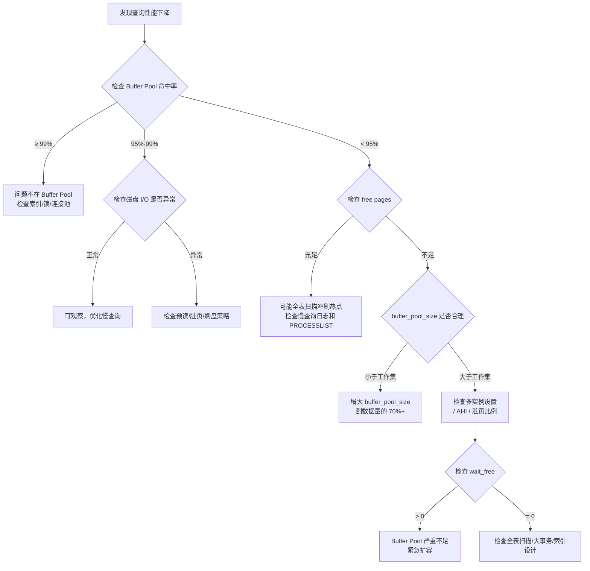

## 技巧 2：Buffer Pool 状态监控与调优

### 引子：一次凌晨的性能雪崩

某电商系统在某次大促后的凌晨 2 点，监控大屏突然告警：MySQL 主库 QPS 从 12,000 骤降到 3,000，P99 延迟从 8ms 飙升到 500ms。DBA 上线排查发现：Buffer Pool 命中率从 99.7% 暴跌到 71%，磁盘 I/O 利用率打满。根因是一次未经审核的运营报表查询 `SELECT * FROM orders WHERE create_time > '2024-01-01'` 扫描了 2 亿行记录，将 Buffer Pool 中的热点数据几乎全部冲刷。事后复盘，如果 Buffer Pool 有完善的监控和告警体系，这个问题可以在慢查询阶段就被拦截。

**Buffer Pool 是 InnoDB 存储引擎的核心内存结构**，承担着所有数据页和索引页的缓存职能。一次磁盘随机 I/O 的延迟约为 0.1ms（SSD）至 10ms（HDD），而一次内存访问仅需约 100ns——两者相差 6 个数量级。Buffer Pool 的状态直接决定了数据库的吞吐能力和响应延迟，是 DBA 日常工作中必须持续关注的首要指标。

本技巧从原理出发，系统讲解 Buffer Pool 的内部结构、核心监控指标的含义与采集方法、参数调优策略，以及生产环境中的常见陷阱和应对方案。

---

## 2.1 Buffer Pool 内部结构

### 2.1.1 数据页与链表管理

InnoDB 以**固定大小的页（Page）**为基本管理单元，默认页大小为 16KB（可通过 `innodb_page_size` 在初始化时设定为 4K/8K/16K/32K/64K）。Buffer Pool 本质上就是一个按页组织的哈希表，通过 `(space_id, page_no)` 作为 key 快速定位内存中的数据页。

Buffer Pool 内部由多个链表协同管理：

```mermaid
graph TD
    subgraph Buffer Pool 链表管理
        LRU-Free[Free List<br/>空闲页链表]
        LRU-Young[Young 区<br/>热数据 5/8]
        LRU-Old[Old 区<br/>冷数据 3/8]
        Flush[Flush List<br/>脏页链表]
        Zip[Zip List<br/>压缩页链表]
    end

    新读入页 -->|从 Free List 分配| LRU-Old
    LRU-Old -->|midpoint 位置插入|
    LRU-Old -->|首次访问后滞留>1s| LRU-Young
    LRU-Young -->|长时间未访问| 移至 Old 区
    写操作 --> Flush
    Flush -->|后台刷盘| 磁盘
```

| 链表 | 作用 | 关键参数 |
|------|------|----------|
| **Free List** | 记录尚未被使用的空闲页，新读入的数据页从此分配 | 空闲页越少，淘汰压力越大 |
| **LRU List** | 管理已被使用的数据页，采用改进的 LRU 算法 | 分为 Young 和 Old 两个区域 |
| **Flush List** | 记录已被修改但尚未写回磁盘的脏页 | 脏页占比影响刷盘策略 |
| **Zip List** | 存放使用 `KEY_BLOCK_SIZE` 压缩存储的数据页 | 仅在启用压缩表时存在 |

**页的生命周期：** 一个数据页在 Buffer Pool 中的完整生命周期为：

1. **分配**：从 Free List 获取一个空闲页
2. **初始化**：从磁盘读入数据，写入哈希表，插入 LRU List 的 Old 区头部
3. **晋升**：首次访问后经过 `innodb_old_blocks_time`（默认 1000ms）再次被访问，晋升到 Young 区
4. **淘汰**：当 Free List 不足时，从 LRU List 尾部（Old 区尾部）淘汰页
5. **写回**：如果被淘汰的页是脏页，先刷回磁盘，再回收到 Free List

### 2.1.2 改进的 LRU 算法：midpoint 机制

传统 LRU 算法在面对**全表扫描**等场景时存在致命缺陷：大量一次性读取的冷数据会将热点数据挤出缓存，导致命中率骤降。InnoDB 引入了 **midpoint 机制**来解决这个问题：

- **Young 区（热端）**：占 LRU 列表的 5/8，存放最近被频繁访问的热数据
- **Old 区（冷端）**：占 LRU 列表的 3/8，新读入的页先插入 Old 区头部
- **midpoint 位置**：默认为 LRU 列表尾部往上 3/8 处（由 `innodb_old_blocks_pct` 控制，默认 37）

一个数据页从 Old 区晋升到 Young 区需要满足：**首次访问后经过 `innodb_old_blocks_time`（默认 1000ms）后再次被访问**。这个延迟机制有效过滤了全表扫描等一次性访问模式，保护了真正的热数据。

**参数调优场景：**

| 场景 | 参数调整 | 原因 |
|------|---------|------|
| 大量短连接 + 小查询 | 增大 `innodb_old_blocks_pct`（如 50） | 扩大冷数据缓冲区，避免热数据被频繁挤出 |
| 纯 OLTP 高频等值查询 | 减小 `innodb_old_blocks_pct`（如 20） | 扩大热数据区，提高命中率 |
| 定期跑批报表 | 增大 `innodb_old_blocks_time`（如 3000） | 延长冷数据停留时间，防止报表数据污染热端 |
| 混合负载 | 保持默认值，通过 SQL 审核拦截全表扫描 | 从源头解决问题 |

### 2.1.3 Buffer Pool 内存布局与 Chunk 机制

MySQL 8.0 引入了 **Chunk** 内存管理机制，Buffer Pool 的内存被划分为大小相等的 Chunk（默认 128MB，由 `innodb_buffer_pool_chunk_size` 控制）：

Buffer Pool (例如 16GB)
├── Chunk 0 (128MB)
│   ├── 页实例 0-8191
│   ├── 哈希表条目
│   └── 元数据
├── Chunk 1 (128MB)
│   └── ...
└── Chunk 127 (128MB)
    └── ...

Chunk 机制的两个核心优势：
1. **在线调整大小**：MySQL 8.0 可以按 Chunk 粒度增减 Buffer Pool，无需重建整个内存结构
2. **内存对齐**：`innodb_buffer_pool_size` 必须是 `innodb_buffer_pool_chunk_size × innodb_buffer_pool_instances` 的整数倍，否则会被自动调整

**注意：** `innodb_buffer_pool_chunk_size` 在启动后不可修改，只有 `innodb_buffer_pool_size` 支持在线调整。

---

## 2.2 核心监控指标

### 2.2.1 Buffer Pool 命中率——最核心的健康指标

**命中率是 Buffer Pool 最核心的健康指标**，反映了请求中有多少比例在内存中得到满足而无需访问磁盘。

**计算公式：**

命中率 = 1 - (磁盘读次数 / 内存读请求次数) × 100%
       = 1 - (Innodb_buffer_pool_reads / Innodb_buffer_pool_read_requests) × 100%

- `Innodb_buffer_pool_read_requests`：逻辑读次数（内存中完成的读）
- `Innodb_buffer_pool_reads`：物理读次数（必须从磁盘读取的次数）

**健康阈值：**

| 命中率范围 | 健康状态 | 处理建议 |
|-----------|---------|---------|
| ≥ 99% | 优秀 | 无需调整 |
| 95% ~ 99% | 良好 | 可观察，考虑优化 SQL |
| 90% ~ 95% | 需关注 | 必须分析原因并调优 |
| < 90% | 严重告警 | 立即扩容或紧急优化 |

> **为什么 99% 是底线？** 假设 Buffer Pool 有 100 万次读请求，99% 命中率意味着仍有 1 万次磁盘 I/O。如果每次 I/O 耗时 0.1ms（SSD），仅这些未命中就累计消耗 1 秒。在高并发场景下，这些磁盘 I/O 会排队，导致延迟雪崩。

**采集 SQL：**

```sql
-- 一站式命中率诊断（推荐）
SELECT 
    CONCAT(ROUND(@@innodb_buffer_pool_size / 1024 / 1024 / 1024, 2), ' GB') AS pool_size,
    (SELECT VARIABLE_VALUE FROM performance_schema.global_status 
     WHERE VARIABLE_NAME = 'Innodb_buffer_pool_read_requests') AS total_reads,
    (SELECT VARIABLE_VALUE FROM performance_schema.global_status 
     WHERE VARIABLE_NAME = 'Innodb_buffer_pool_reads') AS disk_reads,
    CONCAT(ROUND(
        (1 - (
            (SELECT VARIABLE_VALUE FROM performance_schema.global_status 
             WHERE VARIABLE_NAME = 'Innodb_buffer_pool_reads') /
            (SELECT VARIABLE_VALUE FROM performance_schema.global_status 
             WHERE VARIABLE_NAME = 'Innodb_buffer_pool_read_requests')
        )) * 100, 2
    ), '%') AS hit_rate;
```

**增量命中率（更精确）：** 全局计数器从 MySQL 启动开始累计，无法反映近期波动。建议使用差值法计算增量命中率：

```sql
-- 方法：每次采集记录时间戳和计数器值，计算差值
-- delta_hit_rate = 1 - (delta_reads / delta_read_requests)
-- 这能真实反映过去 5 分钟内的命中率
```

### 2.2.2 脏页比例与刷盘健康度

脏页是已被修改但尚未刷回磁盘的数据页。脏页比例过高会触发强制刷盘，导致 I/O 尖峰；过低则说明刷盘过于频繁，浪费 I/O 带宽。

**关键阈值：**

| 参数 | 默认值 | 含义 |
|------|--------|------|
| `innodb_max_dirty_pages_pct_lwm` | 10% | 低水位，开始渐进式刷盘 |
| `innodb_max_dirty_pages_pct` | 90% | 高水位，触发强制同步刷盘 |

**推荐维持范围：** 脏页占比在 **10%~40%** 之间较为健康。超过 50% 需要警惕。

**采集 SQL：**

```sql
-- 脏页比例诊断
SELECT 
    dirty_v AS dirty_pages,
    total_v AS total_pages,
    CONCAT(ROUND(dirty_v / total_v * 100, 2), '%') AS dirty_ratio,
    CASE 
        WHEN dirty_v / total_v * 100 > 75 THEN '🔴 危险：即将触发强制刷盘'
        WHEN dirty_v / total_v * 100 > 50 THEN '🟡 警告：脏页偏高'
        WHEN dirty_v / total_v * 100 > 10 THEN '🟢 正常：渐进式刷盘中'
        ELSE '⚪ 偏低：刷盘可能过于频繁'
    END AS status
FROM (
    SELECT 
        (SELECT VARIABLE_VALUE FROM performance_schema.global_status 
         WHERE VARIABLE_NAME = 'Innodb_buffer_pool_pages_dirty') AS dirty_v,
        (SELECT VARIABLE_VALUE FROM performance_schema.global_status 
         WHERE VARIABLE_NAME = 'Innodb_buffer_pool_pages_total') AS total_v
) t;
```

### 2.2.3 页面分配状态全景

通过这些指标可以判断 Buffer Pool 的内存分配是否合理：

```sql
-- Buffer Pool 页面全景
SELECT 
    CONCAT(ROUND(@@innodb_buffer_pool_size / 1024 / 1024 / 1024, 2), ' GB') AS pool_configured,
    CONCAT(ROUND(APOOL.POOL_SIZE / 1024 / 1024 / 1024, 2), ' GB') AS pool_actual,
    APOOL.PAGES_TOTAL AS total_pages,
    APOOL.PAGES_FREE AS free_pages,
    APOOL.PAGES_DATA AS data_pages,
    APOOL.PAGES_DIRTY AS dirty_pages,
    CONCAT(ROUND(APOOL.PAGES_FREE / APOOL.PAGES_TOTAL * 100, 2), '%') AS free_pct,
    CONCAT(ROUND(APOOL.PAGES_DIRTY / APOOL.PAGES_DATA * 100, 2), '%') AS dirty_of_data,
    APOOL.READ_AHEAD_SEQ AS read_ahead_seq,
    APOOL.READ_AHEAD_RND AS read_ahead_rnd
FROM (
    SELECT 
        POOL_ID, POOL_SIZE, 
        TOTAL_PAGES AS PAGES_TOTAL,
        FREE_PAGES AS PAGES_FREE,
        DATABASE_PAGES AS PAGES_DATA,
        DIRTY_PAGES AS PAGES_DIRTY,
        READ_AHEAD_SEQ, READ_AHEAD_RND
    FROM information_schema.INNODB_BUFFER_POOL_STATS
) APOOL;
```

**关键判断：**
- `free_pct < 5%`：空闲页严重不足，淘汰压力极大
- `pool_actual` 远小于 `pool_configured`：可能因 Chunk 对齐导致实际分配不足
- `dirty_of_data` 持续 > 50%：脏页积累过快，刷盘速度跟不上

### 2.2.4 各实例命中率对比（多实例场景）

当 `innodb_buffer_pool_instances > 1` 时，需要逐实例检查，排除局部热点问题：

```sql
-- 按实例查看页面分布
SELECT 
    POOL_ID AS instance_id,
    CONCAT(ROUND(POOL_SIZE / 1024 / 1024 / 1024, 2), ' GB') AS pool_size,
    DATABASE_PAGES AS data_pages,
    FREE_PAGES AS free_pages,
    OLD_DATABASE_PAGES AS old_zone_pages,
    YOUNG_DATABASE_PAGES AS young_zone_pages,
    CONCAT(ROUND(FREE_PAGES / TOTAL_PAGES * 100, 2), '%') AS free_pct
FROM information_schema.INNODB_BUFFER_POOL_STATS;
```

> **注意：** `Innodb_buffer_pool_read_requests` 和 `Innodb_buffer_pool_reads` 是全局计数器，MySQL 8.0.18+ 可通过 `SHOW ENGINE INNODB STATUS` 的 `BUFFER POOL AND MEMORY` 段查看每个实例的详细统计。如果各实例的 `free_pct` 差异超过 10%，可能存在数据访问倾斜，需要考虑应用层分片。

### 2.2.5 SHOW ENGINE INNODB STATUS 输出解读

`SHOW ENGINE INNODB STATUS\G` 输出的 `BUFFER POOL AND MEMORY` 段包含以下关键信息：

BUFFER POOL AND MEMORY
----------------------
Total large memory allocated 8589934592   -- 实际分配的内存（字节）
Dictionary memory allocated 263424
Buffer pool hit rate 999 / 1000           -- 命中率（每千次）
Pages read ahead 1234, evicted without access 56, random read ahead 0
Young-making: 1234, Not young-making: 5678
Pages made young 345, not young 1234
1234567 pages modified, 0 pages flushed

**逐项解读：**

| 字段 | 含义 | 关注点 |
|------|------|--------|
| `Total large memory allocated` | 实际分配给 Buffer Pool 的内存 | 应与 `innodb_buffer_pool_size` 一致，差异超过 128MB 需排查 |
| `Buffer pool hit rate X / 1000` | 每千次读请求中命中内存的次数 | X < 950 需要关注 |
| `read ahead` | 预读操作次数 | 过高可能触发无用预读 |
| `evicted without access` | 预读进来但从未被访问就被淘汰的页数 | 过高说明预读策略不合理 |
| `Young-making` / `Not young-making` | Old→Young 区晋升统计 | Not 远大于 Young 说明访问模式分散，全表扫描可能在进行 |
| `pages modified` | 脏页数量 | 持续增长说明刷盘跟不上写入速度 |
| `pages flushed` | 被刷到磁盘的页数 | 配合 I/O 监控判断刷盘压力 |

---

## 2.3 持续监控方案

### 2.3.1 脚本化监控（生产级定时采集）

在生产环境中，推荐通过定时脚本持续采集 Buffer Pool 指标，以便后续分析趋势和发现异常：

```bash
#!/bin/bash
# buffer_pool_monitor.sh — 生产级 Buffer Pool 监控脚本
# 用法: */5 * * * * /path/to/buffer_pool_monitor.sh >> /var/log/bp_monitor.log 2>&amp;1
# 依赖: mysql client, bc, curl (可选告警)

set -euo pipefail

# ---- 配置 ----
MYSQL_USER="${MYSQL_USER:-monitor}"
MYSQL_PASS="${MYSQL_PASS:-monitor_pass}"
MYSQL_HOST="${MYSQL_HOST:-127.0.0.1}"
MYSQL_PORT="${MYSQL_PORT:-3306}"
LOG_FILE="${LOG_FILE:-/var/log/bp_monitor.log}"
ALERT_WEBHOOK="${ALERT_WEBHOOK:-}"  # 企业微信/钉钉 Webhook URL

# ---- 告警阈值 ----
HIT_RATE_WARN=95       # 命中率低于此值告警
HIT_RATE_CRIT=90       # 命中率低于此值严重告警
DIRTY_RATIO_WARN=50    # 脏页比例高于此值告警
FREE_PAGES_WARN_PCT=5  # 空闲页占比低于此值告警

TIMESTAMP=$(date '+%Y-%m-%d %H:%M:%S')

# ---- 采集数据 ----
RESULT=$(mysql -u"$MYSQL_USER" -p"$MYSQL_PASS" -h"$MYSQL_HOST" -P"$MYSQL_PORT" \
    --connect-timeout=5 -N -e "
SELECT 
    @@innodb_buffer_pool_size AS pool_size,
    s1.VARIABLE_VALUE AS read_requests,
    s2.VARIABLE_VALUE AS disk_reads,
    s3.VARIABLE_VALUE AS dirty_pages,
    s4.VARIABLE_VALUE AS total_pages,
    s5.VARIABLE_VALUE AS free_pages,
    s6.VARIABLE_VALUE AS write_requests,
    s7.VARIABLE_VALUE AS pages_flushed
FROM 
    performance_schema.global_status s1,
    performance_schema.global_status s2,
    performance_schema.global_status s3,
    performance_schema.global_status s4,
    performance_schema.global_status s5,
    performance_schema.global_status s6,
    performance_schema.global_status s7
WHERE s1.VARIABLE_NAME = 'Innodb_buffer_pool_read_requests'
  AND s2.VARIABLE_NAME = 'Innodb_buffer_pool_reads'
  AND s3.VARIABLE_NAME = 'Innodb_buffer_pool_pages_dirty'
  AND s4.VARIABLE_NAME = 'Innodb_buffer_pool_pages_total'
  AND s5.VARIABLE_NAME = 'Innodb_buffer_pool_pages_free'
  AND s6.VARIABLE_NAME = 'Innodb_buffer_pool_write_requests'
  AND s7.VARIABLE_NAME = 'Innodb_buffer_pool_pages_flushed';
" 2>/dev/null)

if [ $? -ne 0 ] || [ -z "$RESULT" ]; then
    echo "$TIMESTAMP ERROR: Failed to query MySQL at ${MYSQL_HOST}:${MYSQL_PORT}"
    exit 1
fi

# ---- 解析并计算指标 ----
POOL_SIZE=$(echo "$RESULT" | awk '{print $1}')
READ_REQ=$(echo "$RESULT" | awk '{print $2}')
DISK_READ=$(echo "$RESULT" | awk '{print $3}')
DIRTY_P=$(echo "$RESULT" | awk '{print $4}')
TOTAL_P=$(echo "$RESULT" | awk '{print $5}')
FREE_P=$(echo "$RESULT" | awk '{print $6}')
WRITE_REQ=$(echo "$RESULT" | awk '{print $7}')
PAGES_FLUSHED=$(echo "$RESULT" | awk '{print $8}')

POOL_SIZE_GB=$(echo "scale=2; $POOL_SIZE / 1024 / 1024 / 1024" | bc)
HIT_RATE=$(echo "scale=2; (1 - $DISK_READ / $READ_REQ) * 100" | bc)
DIRTY_RATIO=$(echo "scale=2; $DIRTY_P / $TOTAL_P * 100" | bc)
FREE_PCT=$(echo "scale=2; $FREE_P / $TOTAL_P * 100" | bc)

echo "$TIMESTAMP | Pool: ${POOL_SIZE_GB}GB | Hit: ${HIT_RATE}% | Dirty: ${DIRTY_RATIO}% | Free: ${FREE_PCT}% | Write: ${WRITE_REQ} | Flush: ${PAGES_FLUSHED}"

# ---- 告警判定 ----
ALERT_MSG=""
HIT_RATE_INT=$(echo "$HIT_RATE" | cut -d. -f1)
DIRTY_INT=$(echo "$DIRTY_RATIO" | cut -d. -f1)
FREE_INT=$(echo "$FREE_PCT" | cut -d. -f1)

if [ "${HIT_RATE_INT:-0}" -lt "$HIT_RATE_CRIT" ] 2>/dev/null; then
    ALERT_MSG="[CRITICAL] BP HitRate: ${HIT_RATE}% (threshold: ${HIT_RATE_CRIT}%)"
elif [ "${HIT_RATE_INT:-0}" -lt "$HIT_RATE_WARN" ] 2>/dev/null; then
    ALERT_MSG="[WARNING] BP HitRate: ${HIT_RATE}% (threshold: ${HIT_RATE_WARN}%)"
fi

if [ "${DIRTY_INT:-0}" -gt "$DIRTY_RATIO_WARN" ] 2>/dev/null; then
    ALERT_MSG="${ALERT_MSG:+${ALERT_MSG}\n}[WARNING] DirtyRatio: ${DIRTY_RATIO}% (threshold: ${DIRTY_RATIO_WARN}%)"
fi

if [ "${FREE_INT:-0}" -lt "$FREE_PAGES_WARN_PCT" ] 2>/dev/null; then
    ALERT_MSG="${ALERT_MSG:+${ALERT_MSG}\n}[WARNING] FreePages: ${FREE_PCT}% (threshold: ${FREE_PAGES_WARN_PCT}%)"
fi

if [ -n "$ALERT_MSG" ]; then
    echo "$TIMESTAMP ALERT: $ALERT_MSG"
    # 接入告警通道（取消注释对应的行）
    # 企业微信:
    # curl -s -X POST "$ALERT_WEBHOOK" \
    #   -H 'Content-Type: application/json' \
    #   -d "{\"msgtype\":\"text\",\"text\":{\"content\":\"[MySQL BP告警]\n主机: ${MYSQL_HOST}\n${ALERT_MSG}\"}}"
    # 钉钉:
    # curl -s -X POST "$ALERT_WEBHOOK" \
    #   -H 'Content-Type: application/json' \
    #   -d "{\"msgtype\":\"text\",\"text\":{\"title\":\"MySQL BP告警\",\"text\":\"主机: ${MYSQL_HOST}\n${ALERT_MSG}\"}}"
fi
```

### 2.3.2 Performance Schema 精确监控

Performance Schema 提供了更细粒度的 Buffer Pool 指标，适合需要精确归因的场景：

```sql
-- 启用 Buffer Pool I/O 事件监控（默认可能未启用）
UPDATE performance_schema.setup_instruments 
SET ENABLED = 'YES', TIMED = 'YES'
WHERE NAME LIKE 'wait/io/file/innodb/%';

-- 查看各类 I/O 事件的等待时间（Top 10）
SELECT 
    EVENT_NAME,
    COUNT_STAR AS total_ops,
    ROUND(SUM_TIMER_WAIT / 1000000000, 2) AS total_wait_ms,
    ROUND(AVG_TIMER_WAIT / 1000000000, 4) AS avg_wait_ms,
    ROUND(SUM_TIMER_WAIT / 1000000000 / COUNT_STAR, 4) AS avg_per_op_ms
FROM performance_schema.events_waits_summary_global_by_event_name
WHERE EVENT_NAME LIKE '%innodb%'
  AND COUNT_STAR > 0
ORDER BY SUM_TIMER_WAIT DESC
LIMIT 10;
```

**输出示例与解读：**

| EVENT_NAME | total_ops | avg_wait_ms | 含义 |
|------------|-----------|-------------|------|
| `wait/io/file/innodb/innodb_data_file` | 1523456 | 0.08 | 数据文件读写，avg > 0.5ms 需关注 |
| `wait/io/file/innodb/innodb_log_file` | 892341 | 0.02 | Redo log 写入，反映事务提交频率 |
| `wait/io/file/innodb/innodb_temp_file` | 0 | - | 临时文件 I/O，> 0 说明有磁盘临时表 |

### 2.3.3 sys Schema 便捷视图

MySQL 8.0 的 `sys` Schema 封装了常用的诊断视图，使用更简便：

```sql
-- 查看 Buffer Pool 相关的内存分配
SELECT * FROM sys.memory_global_by_current_bytes
WHERE event_name LIKE '%buf_buf_pool%'
LIMIT 5;

-- 按 schema（数据库）查看哪些数据占用了 Buffer Pool
-- 这是诊断"大表冲刷热点"最直接的手段
SELECT 
    object_schema AS `数据库`,
    object_name AS `表名`,
    CONCAT(ROUND(allocated / 1024 / 1024, 2), ' MB') AS `已分配内存`,
    CONCAT(ROUND(`data` / 1024 / 1024, 2), ' MB') AS `实际数据量`,
    pages AS `页数`,
    pages_hash AS `哈希索引页`
FROM sys.innodb_buffer_stats_by_table
ORDER BY allocated DESC
LIMIT 20;
```

这些视图可以快速回答"Buffer Pool 里到底装了哪些数据库的数据？"这个常见问题，对于诊断"某张大表是否冲刷了热点数据"非常有用。

### 2.3.4 Prometheus + Grafana 监控体系

对于生产环境，推荐将 Buffer Pool 指标接入 Prometheus + Grafana 进行可视化和告警：

```yaml
# prometheus.yml — MySQL Exporter 配置
scrape_configs:
  - job_name: 'mysql'
    static_configs:
      - targets: ['mysql-exporter:9104']
    # MySQL Exporter 自动暴露以下关键指标:
    # mysql_global_status_innodb_buffer_pool_read_requests
    # mysql_global_status_innodb_buffer_pool_reads
    # mysql_global_status_innodb_buffer_pool_pages_dirty
    # mysql_global_status_innodb_buffer_pool_pages_total
    # mysql_global_status_innodb_buffer_pool_pages_free
    # mysql_global_variables_innodb_buffer_pool_size
```

**推荐的 Grafana Dashboard 核心面板与告警规则：**

| 面板名称 | PromQL 表达式 | 告警阈值 | 告警级别 |
|----------|--------------|---------|---------|
| Buffer Pool Hit Rate | `1 - mysql_global_status_innodb_buffer_pool_reads / mysql_global_status_innodb_buffer_pool_read_requests` | < 95% 持续 5min | Warning |
| Dirty Page Ratio | `mysql_global_status_innodb_buffer_pool_pages_dirty / mysql_global_status_innodb_buffer_pool_pages_total` | > 50% 持续 3min | Warning |
| Free Pages | `mysql_global_status_innodb_buffer_pool_pages_free` | < total × 5% | Critical |
| Disk Reads/sec | `rate(mysql_global_status_innodb_buffer_pool_reads[5m])` | 突增 3 倍基线 | Warning |
| Buffer Pool Size vs Data Size | `pool_size` vs `data_size` | pool_size < data_size × 50% | Info |

**告警收敛策略：** 避免告警风暴，建议配置：
- 同一指标 5 分钟内不重复告警
- 凌晨 2:00-6:00 降低告警频率（聚合为日报）
- 告警自动恢复（指标恢复后发送恢复通知）

---

## 2.4 调优策略

### 2.4.1 innodb_buffer_pool_size：最重要的单一参数

`innodb_buffer_pool_size` 是 MySQL 最核心的内存参数。其理想值取决于**工作数据集（Working Set）**的大小，而非总数据量。

**设置原则：**

| 服务器角色 | 推荐 Buffer Pool 占比（相对物理内存） | 原因 |
|-----------|-------------------------------------|------|
| 专用 MySQL 服务器 | 70% ~ 80% | 留 20%-30% 给 OS page cache 和其他开销 |
| 共享服务器（MySQL + 应用） | 50% ~ 60% | 应用进程需要内存 |
| 虚拟机/容器环境 | 40% ~ 50% | 需预留宿主机开销和容器运行时开销 |

**示例计算：**

物理内存: 64 GB
操作系统 + 系统进程: 6 GB
MySQL 连接线程 + 排序缓冲等: 2 GB
可用内存: 56 GB
Buffer Pool (80%): 44.8 GB → 建议设为 44 GB（对齐到 chunk_size 的整数倍）

**动态调整（MySQL 8.0+）：**

MySQL 8.0 支持在线调整 Buffer Pool 大小，底层按 Chunk 增减内存，无需重建整个缓冲池：

```sql
-- 在线将 Buffer Pool 调整为 32GB
SET GLOBAL innodb_buffer_pool_size = 32 * 1024 * 1024 * 1024;

-- 查看调整进度
SHOW STATUS LIKE 'Innodb_buffer_pool_resize_status';

-- 输出示例:
-- Innodb_buffer_pool_resize_status | Completed resizing the buffer pool at 240626 14:30:00;
```

> **注意事项：**
> - 在线调整过程中会短暂锁住 LRU 链表，可能引起短暂的性能波动
> - 建议在低峰期执行，且每次调整幅度不超过当前大小的 25%
> - `innodb_buffer_pool_size` 必须是 `innodb_buffer_pool_chunk_size × innodb_buffer_pool_instances` 的整数倍

### 2.4.2 innodb_buffer_pool_instances：减少锁竞争

当 `innodb_buffer_pool_size` 超过 1GB 时，可以通过设置多个实例来减少内部互斥锁的竞争。每个实例拥有独立的 LRU、Free、Flush 链表和互斥锁。

innodb_buffer_pool_instances = innodb_buffer_pool_size / 1GB（每个实例至少 1GB）

| Buffer Pool 大小 | 推荐实例数 | 说明 |
|-----------------|-----------|------|
| ≤ 1 GB | 1 | 不需要多实例 |
| 1 ~ 8 GB | 2 ~ 4 | 适度拆分，每个实例 1~2GB |
| 8 ~ 32 GB | 4 ~ 8 | 每实例管理 2~4GB |
| > 32 GB | 8 ~ 16 | 每实例管理 2~4GB，不宜过多 |

> **注意：** MySQL 8.0.14+ 支持在线修改实例数量（通过 `SET GLOBAL innodb_buffer_pool_instances = N`），但建议在初始化时确定，避免运行时调整带来的不确定性。多实例设置后，哈希表查找时需要先定位到对应实例，过多实例反而会增加查找开销。

### 2.4.3 预读策略调优

InnoDB 支持两种预读（Read-Ahead）算法，用于提前将可能访问的页加载到 Buffer Pool：

**线性预读（Linear Read-Ahead）：**
- 当一个区（extent，64 个连续页，共 1MB）中被顺序访问的页数超过 `innodb_read_ahead_threshold`（默认 56）时，触发预读
- 适合顺序扫描场景（如范围查询、全表扫描）

**随机预读（Random Read-Ahead）：**
- 当某个区中已有 13 个页被读入内存后，自动预读该区的剩余页
- MySQL 8.0.18+ 已弃用此机制（因为线性预读已能覆盖大部分场景）

```sql
-- 查看当前预读设置
SHOW VARIABLES LIKE 'innodb_read_ahead%';

-- 调整线性预读阈值（值越小，预读越积极）
SET GLOBAL innodb_read_ahead_threshold = 32;

-- 查看预读效果
-- 通过 SHOW ENGINE INNODB STATUS 查看:
--   read ahead      : 预读触发次数
--   evicted without access : 预读后未访问就被淘汰的次数
```

**预读效果判断标准：**

预读浪费率 = evicted without access / read ahead × 100%

浪费率 < 20%  → 预读策略有效，保持当前设置
浪费率 20%~50% → 预读效果一般，考虑增大 threshold
浪费率 > 50%  → 预读浪费严重，增大 threshold 或关闭随机预读

### 2.4.4 脏页刷盘策略

脏页刷盘由后台线程（Page Cleaner）异步执行，主要受以下参数控制：

| 参数 | 默认值 | 作用 |
|------|--------|------|
| `innodb_io_capacity` | 200 | 刷盘速率基准（IOPS），根据磁盘性能设定 |
| `innodb_io_capacity_max` | 2000 | 紧急刷盘时的最大 IOPS |
| `innodb_max_dirty_pages_pct_lwm` | 10% | 低水位，开始渐进式刷盘 |
| `innodb_max_dirty_pages_pct` | 90% | 高水位，强制同步刷盘 |
| `innodb_flush_neighbors` | 0 (MySQL 8.0) | 是否合并相邻脏页一起刷 |
| `innodb_page_cleaners` | 4 | 并行刷盘线程数 |

**典型磁盘对应的 `innodb_io_capacity` 推荐值：**

| 磁盘类型 | `innodb_io_capacity` | `innodb_io_capacity_max` |
|---------|---------------------|-------------------------|
| 7200 RPM HDD | 200 | 400 |
| 15K RPM HDD | 400 | 800 |
| SATA SSD | 2000 | 4000 |
| NVMe SSD | 10000 ~ 20000 | 20000 ~ 40000 |
| RAID 阵列 | 根据实际 IOPS 基准测试结果设定 | |

**`innodb_page_cleaners` 调优：** 当 `innodb_buffer_pool_instances > 1` 时，Page Cleaner 线程数应与实例数一致或略少，避免刷盘线程争抢 I/O 带宽。

```sql
-- 设置并行刷盘线程数
SET GLOBAL innodb_page_cleaners = 8;
```

### 2.4.5 自适应哈希索引（AHI）

InnoDB 会自动监控索引搜索的模式，当某些索引值被频繁访问时，自动在内存中构建哈希索引以加速等值查询。

```sql
-- 查看 AHI 状态
SHOW STATUS LIKE 'Innodb_adaptive_hash%';
```

| 指标 | 含义 |
|------|------|
| `Innodb_adaptive_hash_hash_searches` | 哈希命中次数 |
| `Innodb_adaptive_hash_non_hash_searches` | 非哈希搜索次数 |

**调优建议：**
- 如果 `hash_searches` 远大于 `non_hash_searches`（10 倍以上），说明 AHI 效果显著，保持启用
- 在高并发、等值查询少的 OLAP 场景下，AHI 可能带来额外的锁开销，可通过 `SET GLOBAL innodb_adaptive_hash_index = OFF` 关闭
- MySQL 8.0 支持将 AHI 分为多个分区（`innodb_adaptive_hash_index_parts`，默认 8），降低单一 AHI 锁的竞争

```sql
-- 高并发场景下增加 AHI 分区数
SET GLOBAL innodb_adaptive_hash_index_parts = 16;
```

### 2.4.6 大页（Huge Pages）配置

当 Buffer Pool 超过 8GB 时，操作系统默认的 4KB 页面大小会导致大量的 TLB（Translation Lookaside Buffer）miss，影响虚拟地址到物理地址的转换效率。启用大页可以显著减少 TLB miss：

**Linux 大页配置：**

```bash
# 计算所需大页数量（Buffer Pool 48GB，大页 2MB）
# 48GB / 2MB = 24576 个大页

# 查看当前大页配置
cat /proc/meminfo | grep -i huge

# 设置大页数量（需要 root 权限，重启生效）
echo 24576 > /proc/sys/vm/nr_hugepages

# 永久生效（写入 sysctl.conf）
echo "vm.nr_hugepages = 24576" >> /etc/sysctl.conf
sysctl -p

# MySQL 中启用大页
# my.cnf
# innodb_use_native_aio = ON   # 启用原生 AIO（需要大页支持）
```

**注意事项：**
- 大页内存不可被 swap，分配后无法被其他进程使用
- 预留的大页内存应比 Buffer Pool 大 10%~20%（留余量给其他组件）
- 在虚拟化环境中，大页需要宿主机和客户机都支持
- 验证方式：`SHOW VARIABLES LIKE 'innodb_use_native_aio'` 应为 `ON`

### 2.4.7 Buffer Pool 与操作系统 Page Cache 的关系

InnoDB 使用 `O_DIRECT` 绕过操作系统的文件缓存直接读写磁盘（默认开启），这意味着 InnoDB 的数据读写不经过 OS page cache。但这并不意味着 OS page cache 没有作用：

| 文件类型 | 是否经过 OS page cache | 原因 |
|---------|----------------------|------|
| InnoDB 数据文件 (.ibd) | 否（O_DIRECT） | 避免双缓存 |
| InnoDB Redo Log | 是 | redo log 使用 fsync 保证持久性 |
| Binary Log | 是 | binlog 依赖 OS 缓存提高写入性能 |
| MyISAM 数据文件 | 是 | MyISAM 没有自己的缓存机制 |

因此，即使 Buffer Pool 设置为物理内存的 80%，剩余的 20% 仍应留给 OS page cache，用于缓存 binlog、redo log 和系统运行时文件。

---

## 2.5 常见误区与排查

### 误区一：Buffer Pool 命中率低 = 只需要增大 buffer_pool_size

**实际情况：** 命中率低可能由多种原因导致，盲目增大内存未必能解决根本问题。

**排查清单：**

命中率低的可能原因：
├── 1. Buffer Pool 确实太小，工作集放不下
│      → 检查 Innodb_buffer_pool_pages_total × 16KB 是否 > 热点数据量
│      → 使用 sys.innodb_buffer_stats_by_table 查看各表占用
├── 2. 全表扫描或大范围查询冲刷了热点数据
│      → 检查慢查询日志，关注 rows_examined 很大的查询
│      → 使用 SHOW PROCESSLIST 检查是否有全表扫描进行中
├── 3. 大事务持有大量页在内存中不释放
│      → 检查活跃事务列表: SELECT * FROM information_schema.INNODB_TRX
│      → 关注 trx_rows_modified 很大的事务
├── 4. 索引设计不当导致频繁回表读取非索引页
│      → 通过 EXPLAIN 分析查询执行计划
│      → 关注 type=ALL 或 rows 极大的查询
├── 5. innodb_old_blocks_pct 设置不当
│      → 调整 Old 区占比，或增加 old_blocks_time
├── 6. Buffer Pool 被大量非热点表占用
│      → 使用 sys.innodb_buffer_stats_by_schema 查看各库占用
│      → 对冷数据表使用分区表或归档
└── 7. 多实例设置不均导致局部热点
        → 逐实例检查 free_pages 和 hit_rate

### 误区二：脏页比例高 = 需要手动刷脏

**实际情况：** InnoDB 有完善的自适应刷脏机制。手动 `FLUSH TABLES` 或 `ALTER TABLE` 反而会导致更严重的 I/O 尖峰。

**正确做法：**
1. 先检查 `innodb_io_capacity` 是否匹配磁盘实际性能
2. 检查是否有未提交的大事务持有大量脏页
3. 适当降低 `innodb_max_dirty_pages_pct` 阈值让系统更积极地刷盘
4. 检查 `innodb_page_cleaners` 是否与实例数匹配
5. 仅在确认必要时使用 `SET GLOBAL innodb_max_dirty_pages_pct = 50` 临时调整

### 误区三：Buffer Pool 越大越好

**实际情况：** Buffer Pool 过大也会带来问题：

- **初始化和恢复时间增长**：MySQL 重启后需要重新预热 Buffer Pool，内存越大恢复越慢。32GB 的 Buffer Pool 预热可能需要 30 分钟，64GB 可能需要 1 小时以上
- **内存管理开销增加**：过多的页和链表管理本身消耗 CPU，哈希表查找的开销随页数线性增长
- **可能挤压操作系统缓存**：操作系统文件缓存减少，对非 InnoDB 文件（如 binlog）的读写可能变慢
- **在线调整时间增长**：调整 Buffer Pool 大小时，内存拷贝耗时与调整幅度成正比

**最佳实践：** Buffer Pool 大小 = 操作系统能稳定分配的内存的 70%~80%，而非物理内存的全部。

### 误区四：重启后性能恢复正常

**实际情况：** MySQL 重启后 Buffer Pool 是空的（冷启动），需要时间预热。对于大内存实例（如 32GB+），预热可能需要数小时才能达到稳定命中率。

**预热方案：**

```sql
-- MySQL 8.0: 自动保存和恢复 Buffer Pool 状态（默认开启）
SHOW VARIABLES LIKE 'innodb_buffer_pool_dump%';

-- 配置关闭时保存热点页列表
SET GLOBAL innodb_buffer_pool_dump_at_shutdown = ON;
SET GLOBAL innodb_buffer_pool_dump_pct = 75;  -- 保存最热的 75% 的页

-- 配置启动时自动加载
SET GLOBAL innodb_buffer_pool_load_at_startup = ON;

-- 运行时手动触发预热
SET GLOBAL innodb_buffer_pool_dump_now = ON;
SET GLOBAL innodb_buffer_pool_load_now = ON;

-- 查看预热进度
SHOW STATUS LIKE 'Innodb_buffer_pool_load_status';
-- 输出: Innodb_buffer_pool_load_status | Buffer pool(s) load completed at 240626 14:30:00
```

**预热加速技巧：**
1. 将 `innodb_buffer_pool_dump_pct` 设为 75（默认 25），保存更多热点页
2. 预热期间限制写入，避免脏页产生干扰
3. 对于 64GB+ 的 Buffer Pool，考虑分实例逐步预热
4. 监控预热进度，确认命中率恢复到 99% 以上再开放写入

---

## 2.6 进阶：Buffer Pool 诊断实战

### 2.6.1 定位哪张表占用了最多内存

```sql
-- 使用 sys schema 查看各表占用的 Buffer Pool 内存
SELECT 
    object_schema AS `数据库`,
    object_name AS `表名`,
    CONCAT(ROUND(allocated / 1024 / 1024, 2), ' MB') AS `已分配内存`,
    CONCAT(ROUND(`data` / 1024 / 1024, 2), ' MB') AS `实际数据量`,
    pages AS `页数`,
    pages_hash AS `哈希索引页`,
    CONCAT(ROUND(allocated / (SELECT SUM(allocated) FROM sys.innodb_buffer_stats_by_table) * 100, 2), '%') AS `占比`
FROM sys.innodb_buffer_stats_by_table
ORDER BY allocated DESC
LIMIT 20;
```

### 2.6.2 分析 Buffer Pool 的使用模式

```sql
-- 查看 Buffer Pool 的全景指标和异常信号
SELECT 
    VARIABLE_NAME,
    VARIABLE_VALUE
FROM performance_schema.global_status
WHERE VARIABLE_NAME IN (
    'Innodb_buffer_pool_read_requests',
    'Innodb_buffer_pool_reads',
    'Innodb_buffer_pool_pages_total',
    'Innodb_buffer_pool_pages_free',
    'Innodb_buffer_pool_pages_dirty',
    'Innodb_buffer_pool_pages_data',
    'Innodb_buffer_pool_pages_misc',
    'Innodb_buffer_pool_read_ahead',
    'Innodb_buffer_pool_read_ahead_evicted',
    'Innodb_buffer_pool_read_ahead_rnd',
    'Innodb_buffer_pool_write_requests',
    'Innodb_buffer_pool_pages_flushed',
    'Innodb_buffer_pool_wait_free',
    'Innodb_buffer_pool_resize_status_code'
);
```

**关键解读：**

| 指标 | 含义 | 异常信号 |
|------|------|---------|
| `wait_free` | 等待空闲页的次数 | > 0 说明 Buffer Pool 已满，应紧急扩容 |
| `read_ahead_evicted` | 预读后被淘汰的页数 | 远大于 `read_ahead` 说明预读浪费 |
| `write_requests` | 写入请求数 | 用于计算脏页生成速率 |
| `pages_flushed` | 被刷到磁盘的页数 | 配合 flush 频率分析 I/O 压力 |
| `pages_misc` | 非数据非空闲的页（如哈希索引、锁信息） | 占比 > 10% 可能异常 |

### 2.6.3 Buffer Pool 命中率趋势分析

在生产环境中，**瞬时命中率没有趋势重要**。建议每 5 分钟采集一次，持续观察：

```sql
-- 建立趋势表并定期采集
CREATE TABLE IF NOT EXISTS bp_metrics_history (
    id BIGINT AUTO_INCREMENT PRIMARY KEY,
    collected_at DATETIME NOT NULL DEFAULT CURRENT_TIMESTAMP,
    read_requests BIGINT,
    disk_reads BIGINT,
    dirty_pages INT,
    total_pages INT,
    free_pages INT,
    hit_rate DECIMAL(5,2),
    dirty_ratio DECIMAL(5,2)
) ENGINE=InnoDB;

-- 采集当前指标（配合 cron 每 5 分钟执行一次）
INSERT INTO bp_metrics_history (read_requests, disk_reads, dirty_pages, total_pages, free_pages, hit_rate, dirty_ratio)
SELECT 
    s1.VARIABLE_VALUE,
    s2.VARIABLE_VALUE,
    s3.VARIABLE_VALUE,
    s4.VARIABLE_VALUE,
    s5.VARIABLE_VALUE,
    ROUND((1 - s2.VARIABLE_VALUE / s1.VARIABLE_VALUE) * 100, 2),
    ROUND(s3.VARIABLE_VALUE / s4.VARIABLE_VALUE * 100, 2)
FROM 
    performance_schema.global_status s1,
    performance_schema.global_status s2,
    performance_schema.global_status s3,
    performance_schema.global_status s4,
    performance_schema.global_status s5
WHERE s1.VARIABLE_NAME = 'Innodb_buffer_pool_read_requests'
  AND s2.VARIABLE_NAME = 'Innodb_buffer_pool_reads'
  AND s3.VARIABLE_NAME = 'Innodb_buffer_pool_pages_dirty'
  AND s4.VARIABLE_NAME = 'Innodb_buffer_pool_pages_total'
  AND s5.VARIABLE_NAME = 'Innodb_buffer_pool_pages_free';

-- 查看最近 24 小时的命中率趋势（每 5 分钟一个采样点）
SELECT 
    DATE_FORMAT(collected_at, '%Y-%m-%d %H:%i') AS time_point,
    hit_rate,
    dirty_ratio,
    free_pages,
    total_pages
FROM bp_metrics_history
WHERE collected_at >= NOW() - INTERVAL 24 HOUR
ORDER BY collected_at;

-- 查找命中率最低的时段（用于定位问题发生时间）
SELECT 
    DATE_FORMAT(collected_at, '%Y-%m-%d %H:%i') AS worst_time,
    hit_rate,
    dirty_ratio
FROM bp_metrics_history
WHERE collected_at >= NOW() - INTERVAL 7 DAY
ORDER BY hit_rate ASC
LIMIT 10;
```

### 2.6.4 突发命中率下降的快速诊断流程

当监控告警命中率突然下降时，按以下步骤快速定位：

```sql
-- Step 1: 检查是否有大查询在运行
SELECT 
    id, user, host, db, command, time, state,
    LEFT(info, 100) AS query_preview
FROM information_schema.processlist 
WHERE command != 'Sleep' 
  AND time > 5
ORDER BY time DESC;

-- Step 2: 检查是否有大事务未提交
SELECT 
    trx_id, trx_state, trx_started,
    TIMESTAMPDIFF(SECOND, trx_started, NOW()) AS running_seconds,
    trx_rows_modified, trx_rows_locked,
    trx_query
FROM information_schema.INNODB_TRX
ORDER BY trx_started ASC;

-- Step 3: 检查 Buffer Pool 当前状态
SELECT 
    VARIABLE_NAME, VARIABLE_VALUE
FROM performance_schema.global_status
WHERE VARIABLE_NAME LIKE 'Innodb_buffer_pool_%'
  AND VARIABLE_NAME IN (
    'Innodb_buffer_pool_pages_free',
    'Innodb_buffer_pool_pages_dirty',
    'Innodb_buffer_pool_wait_free',
    'Innodb_buffer_pool_read_requests',
    'Innodb_buffer_pool_reads'
);

-- Step 4: 检查是否有正在进行的 DDL 操作
SELECT * FROM performance_schema.metadata_locks
WHERE OBJECT_TYPE = 'TABLE';
```

---

## 2.7 调优决策流程图

遇到 Buffer Pool 性能问题时，建议按以下流程排查：



---

## 2.8 速查表

| 场景 | 关键指标 | 调优动作 |
|------|---------|---------|
| 命中率持续低于 95% | `Innodb_buffer_pool_reads` 上升 | 增大 `innodb_buffer_pool_size`，优化全表扫描 |
| 脏页比例超过 50% | `Innodb_buffer_pool_pages_dirty` | 检查大事务，调整 `innodb_io_capacity`，增加 `innodb_page_cleaners` |
| `wait_free > 0` | Buffer Pool 等待空闲页 | 紧急扩容或减少并发写入 |
| 预读淘汰率 > 50% | `read_ahead_evicted / read_ahead` | 增大 `innodb_read_ahead_threshold` |
| 重启后长时间低命中率 | 预热进度慢 | 启用 `innodb_buffer_pool_dump/load`，增大 dump_pct |
| 某张大表独占 Buffer Pool | `sys.innodb_buffer_stats_by_table` | 对大表使用分区或归档，考虑独立表空间 |
| 多实例命中率不均 | 各实例 `free_pages` 差异大 | 评估数据访问模式，考虑应用层分片 |
| AHI 锁等待高 | `Innodb_adaptive_hash_searches` 波动大 | 增大 `innodb_adaptive_hash_index_parts` 或关闭 AHI |
| 大页未生效 | `innodb_use_native_aio = OFF` | 配置 OS 大页并重启 MySQL |

---

**核心要点回顾：**

1. **Buffer Pool 命中率 ≥ 99% 是底线**，低于 95% 必须介入，增量命中率比全局命中率更能反映近期问题
2. **脏页比例** 保持在 10%~40% 之间，过高触发 I/O 尖峰，过低说明刷盘过于频繁
3. **innodb_buffer_pool_size** 是最重要的单一参数，设为物理内存的 70%~80%，按 Chunk 对齐
4. **多实例** 拆分减少锁竞争，但每个实例至少 1GB，实例数不宜超过 16
5. **预热机制** 对大内存实例至关重要，务必启用 dump/load 并增大 dump_pct
6. **持续监控** 比瞬时诊断更重要，建立趋势表配合 Prometheus + Grafana 实现可视化告警
7. **命中率低不要只加内存**，先排查全表扫描、慢查询、大事务等根因
8. **大页配置** 在 Buffer Pool > 8GB 时应考虑启用，减少 TLB miss
9. **O_DIRECT** 让 InnoDB 绕过 OS cache，但仍需为 binlog/redo log 留出 OS 缓存空间
