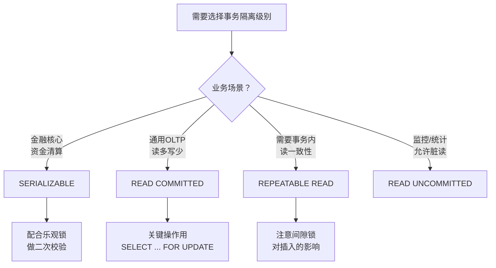

## 技巧4：事务隔离级别的选择

> **一句话理解**：事务隔离级别就像图书馆的借阅规则——允许多少人同时翻同一本书，以及他们看到的内容是否一致。规则太松，有人看到别人涂改中的草稿；规则太严，所有人都得排队等一个人看完。

事务隔离级别是关系型数据库并发控制的核心机制。选择不当，轻则数据不一致，重则资金损失、业务逻辑崩溃。本节系统讲解四种隔离级别的原理、适用场景、底层机制与实战调优。

**本节知识地图**：

事务隔离级别
├── 问题域：四种并发异常（脏读/不可重复读/幻读/序列化异常）
├── 解决方案：四种隔离级别（从低到高）
├── 底层机制
│   ├── MVCC（多版本并发控制）
│   │   ├── InnoDB：回滚段 + ReadView
│   │   └── PostgreSQL：堆内版本链 + VACUUM
│   ├── 锁机制（行锁/间隙锁/Next-Key Lock）
│   └── SSI（可序列化快照隔离）
├── 实战决策
│   ├── 决策树：按业务场景选择
│   ├── 陷阱：当前读 vs 快照读混用
│   └── 性能基准：sysbench 对比测试
└── 跨数据库对比（MySQL / PostgreSQL / Oracle / SQL Server）

### 1. 为什么事务隔离级别如此重要

并发场景下，多个事务同时读写同一份数据。如果数据库不加控制，会出现各种"幽灵"现象——读到还没提交的数据、同一行数据前后读到不同值、凭空出现或消失的行。事务隔离级别就是数据库用来**在并发性能和数据一致性之间做权衡**的旋钮。

一个真实案例：某电商系统在秒杀场景下使用了 `READ COMMITTED` 级别，库存扣减逻辑为"先查库存再扣减"。两个并发事务同时读到库存=1，各自扣减后库存变为-1，导致超卖。切换到 `REPEATABLE READ` 并配合悲观锁后问题解决。这个案例说明：**隔离级别的选择直接决定了业务逻辑的正确性**。

**为什么不能"选最高的就行"**？因为隔离级别每升一级，并发性能就下降一截。在高并发系统中，从 RC 升到 RR 可能导致吞吐量下降 10%-20%，升到 SERIALIZABLE 可能下降 50% 以上。选隔离级别的本质是**用最少的性能代价换取业务所需的最低一致性保证**。

### 2. 四种并发异常：理解问题的本质

在讨论隔离级别之前，必须先理解它要解决的问题。SQL 标准定义了三种经典的并发异常（PostgreSQL 文档还补充了第四种）：

| 异常类型 | 英文名称 | 含义 | 严重程度 | 生活类比 |
|---|---|---|---|---|
| 脏读 | Dirty Read | 读到其他事务**未提交**的数据 | 高——可能读到最终回滚的"幻影"数据 | 看到别人写了一半的草稿，以为是定稿 |
| 不可重复读 | Non-Repeatable Read | 同一事务内，两次读同一行得到**不同值**（被其他事务 UPDATE 了） | 中——同一查询结果不一致 | 第一次看到菜单价15元，回头点菜变成20元 |
| 幻读 | Phantom Read | 同一事务内，两次执行同一范围查询，结果集**行数不同**（被其他事务 INSERT/DELETE 了） | 中——范围查询结果不稳定 | 数货架上有10瓶，再数变成11瓶（有人刚补了货） |
| 序列化异常 | Serialization Anomaly | 两个事务各自成功提交，但合并后的结果在任何串行执行下都不可能出现 | 高——逻辑一致性被破坏 | 两人分别给对方转账100元，各自账户没变，但银行账本对不上 |

**为什么理解异常类型比记住隔离级别更重要**？因为异常类型是问题，隔离级别是方案。你只有先理解你的业务场景会出现哪些异常，才能选择恰好够用的隔离级别——不多不少，刚好解决问题。

### 3. 四种隔离级别详解

SQL 标准（ISO/IEC 9075）定义了四个隔离级别，从低到高依次为：

READ UNCOMMITTED  →  READ COMMITTED  →  REPEATABLE READ  →  SERIALIZABLE
    最低隔离（最强并发）                         最高隔离（最强一致）
    防止: 无          防止: 脏读      防止: 脏读+不可重复读   防止: 全部

#### 3.1 READ UNCOMMITTED（读未提交）

**机制**：事务可以读到其他事务尚未提交的修改。没有任何读锁，写操作也不加锁。

**能防止的异常**：无。

**典型行为**：

```sql
-- 会话A
BEGIN;
UPDATE accounts SET balance = balance - 500 WHERE id = 1;
-- 尚未 COMMIT

-- 会话B（READ UNCOMMITTED）
SET SESSION transaction_isolation = 'read-uncommitted';
BEGIN;
SELECT balance FROM accounts WHERE id = 1;  -- 读到扣减后的值（脏读）
ROLLBACK;  -- 会话A回滚了，但会话B已经读到了"不存在"的数据
```

**适用场景**：几乎不推荐在生产环境使用。仅在极少数对一致性要求极低的统计分析场景下考虑（如粗略的实时监控面板，允许读到"可能不存在"的中间值）。

**为什么有人用它**：某些 DBA 认为它比 `READ COMMITTED` 快一点点（省去了读一致性检查），但在现代 MVCC 引擎（InnoDB、PostgreSQL）中，这个差异可以忽略不计。

**特殊说明**：在 MySQL/InnoDB 中，`READ UNCOMMITTED` 实际上也会使用 MVCC，因此它**并不像人们想象的那样会真正读到未提交的数据**——大多数情况下它的行为与 `READ COMMITTED` 相同。只有在极少数非 MVCC 的存储引擎（如已废弃的 MyISAM）中才有真正的脏读。PostgreSQL 完全不支持这个级别，设置后会被强制降级为 `READ COMMITTED`。

#### 3.2 READ COMMITTED（读已提交）

**机制**：事务只能读到其他事务已经提交的数据。每次 SELECT 都生成一个新的**快照**（snapshot），所以同一事务内不同时间的 SELECT 可能看到不同数据。

**能防止的异常**：脏读。

**不能防止的异常**：不可重复读、幻读。

**典型行为**：

```sql
-- 会话A
BEGIN;
UPDATE accounts SET balance = balance - 500 WHERE id = 1;
COMMIT;

-- 会话B（READ COMMITTED）
SET SESSION transaction_isolation = 'read-committed';
BEGIN;
SELECT balance FROM accounts WHERE id = 1;  -- 读到旧值
-- ... 会话A提交了 ...
SELECT balance FROM accounts WHERE id = 1;  -- 读到新值（不可重复读）
```

**核心特点**：每次 SELECT 都是**独立的一次快照读**。这是 `READ COMMITTED` 与 `REPEATABLE READ` 最关键的区别。

**适用场景**：
- **大多数互联网应用的默认选择**（MySQL 的默认级别是 `REPEATABLE READ`，但很多互联网公司会改为 `READ COMMITTED`）
- 读多写少的业务（用户信息查询、商品浏览）
- 对同一行数据的前后一致性要求不高
- 需要避免长事务锁持有

**为什么很多公司选它**：在高并发 OLTP 场景下，`READ COMMITTED` 减少了锁持有时间和 MVCC 版本链的长度，能显著降低死锁概率和提升吞吐量。阿里、字节等大厂的 MySQL 实践普遍推荐 `READ COMMITTED`。

**RC 级别的一个隐藏优势**：由于没有间隙锁，RC 级别下的 INSERT 操作不会被其他事务的范围查询阻塞。在写入密集的场景（如日志表、消息队列表），RC 能显著减少写入延迟。

#### 3.3 REPEATABLE READ（可重复读）

**机制**：事务在整个生命周期内使用**同一个快照**。无论其他事务如何修改和提交，当前事务看到的数据始终一致。

**能防止的异常**：脏读、不可重复读。

**不能防止的异常**：幻读（SQL 标准定义）。但注意：**InnoDB 通过 Next-Key Locking 在很大程度上解决了幻读问题**（详见 5.2 节）。

**典型行为**：

```sql
-- 会话B（REPEATABLE READ）
BEGIN;
SELECT balance FROM accounts WHERE id = 1;  -- 快照A
-- ... 会话A修改并提交了 id=1 的记录 ...
SELECT balance FROM accounts WHERE id = 1;  -- 仍然是快照A的值（可重复读）
COMMIT;
```

**MySQL/InnoDB 的特殊行为**：

InnoDB 的 `REPEATABLE READ` 实际上比 SQL 标准更强——它通过 **MVCC（多版本并发控制）** + **Next-Key Lock（间隙锁 + 行锁）** 在很大程度上避免了幻读：

```sql
-- 会话B（REPEATABLE READ, InnoDB）
BEGIN;
SELECT * FROM orders WHERE amount > 100;  -- 返回3行
-- ... 会话A INSERT了一条 amount=200 的记录并提交 ...
SELECT * FROM orders WHERE amount > 100;  -- 仍然返回3行（MVCC快照保证）
-- 但如果会话B执行 UPDATE，就能"看到"那条新插入的行
UPDATE orders SET status = 'processed' WHERE amount = 200;  -- 影响1行！
-- 再次 SELECT 就能看到这行了——这就是"当前读"与"快照读"的区别
```

**适用场景**：
- **MySQL 的默认级别**，适合大多数需要数据一致性的场景
- 银行转账、库存管理等需要保证"读一致"的业务
- 需要同一事务内多次查询结果一致的报表类查询

#### 3.4 SERIALIZABLE（串行化）

**机制**：所有读操作加共享锁（`LOCK IN SHARE MODE`），所有写操作加排他锁。事务执行效果等同于完全串行。

**能防止的异常**：全部（脏读、不可重复读、幻读、序列化异常）。

**代价**：并发性能大幅下降。

```sql
-- 会话A（SERIALIZABLE）
BEGIN;
SELECT * FROM accounts WHERE id = 1 FOR SHARE;
-- ... 会话B尝试修改 id=1 时会被阻塞，直到会话A提交或回滚 ...
```

**适用场景**：
- 金融核心系统（资金清算、账务对账）
- 对数据一致性要求极高、并发量相对较低的场景
- 存在复杂多表关联写入，无法通过应用层逻辑保证一致性的场景

**为什么不推荐滥用**：锁持有时间长、死锁概率高、吞吐量低。在高并发系统中使用 `SERIALIZABLE` 往往会导致大量超时和排队。**能用应用层逻辑解决的并发问题，不要靠升隔离级别来解决**。

### 4. 隔离级别速查对比表

| 隔离级别 | 脏读 | 不可重复读 | 幽读 | 序列化异常 | 并发性能 | 典型应用 |
|---|---|---|---|---|---|---|
| READ UNCOMMITTED | ✅ 可能 | ✅ 可能 | ✅ 可能 | ✅ 可能 | 最高 | 几乎不用 |
| READ COMMITTED | ❌ 不会 | ✅ 可能 | ✅ 可能 | ✅ 可能 | 高 | 互联网OLTP |
| REPEATABLE READ | ❌ 不会 | ❌ 不会 | ⚠️ 大部分避免* | ✅ 可能 | 中 | 通用业务 |
| SERIALIZABLE | ❌ 不会 | ❌ 不会 | ❌ 不会 | ❌ 不会 | 低 | 金融核心 |

> \* InnoDB 的 REPEATABLE READ 通过 MVCC + Next-Key Lock 在大多数场景下避免了幻读，但在特定情况下（如快照读与当前读混用）仍然可能出现。

### 5. 深入原理：MVCC 与锁机制

要真正理解隔离级别的行为，必须理解底层的 MVCC 机制。

#### 5.1 MVCC 工作原理（以 InnoDB 为例）

InnoDB 为每行数据维护两个隐藏字段：

- `DB_TRX_ID`：最后修改该行的事务 ID
- `DB_ROLL_PTR`：指向回滚段中旧版本的指针（构成版本链）


**ReadView（读视图）** 是 MVCC 的核心。它记录了当前活跃事务列表：

- **READ COMMITTED**：每次 SELECT 都创建新的 ReadView
- **REPEATABLE READ**：事务内第一次 SELECT 创建 ReadView，后续复用

判断逻辑：遍历版本链，找到第一个 `trx_id` 对当前 ReadView **可见**的版本。可见性判断规则：

trx_id < min_trx_id       → 可见（该版本在快照创建前已提交）
trx_id > max_trx_id       → 不可见（该版本在快照创建后才出现）
min_trx_id ≤ trx_id ≤ max_trx_id
  ├─ trx_id 在 active_trx_ids 中 → 不可见（该事务尚未提交）
  └─ trx_id 不在 active_trx_ids 中 → 可见（该事务已提交）

这就是为什么 `READ COMMITTED` 和 `REPEATABLE READ` 的行为不同——ReadView 的创建频率决定了你能"看到"多大范围内的修改。

**一个关键细节**：InnoDB 在遍历版本链时，如果遇到 `trx_id` 在 ReadView 的 `m_ids`（活跃事务列表）中，会直接跳过该版本，继续沿 `DB_ROLL_PTR` 找更旧的版本。如果遍历完所有版本都找不到可见的，说明该行对当前事务**完全不可见**——等价于该行不存在。

#### 5.2 InnoDB 如何在 RR 级别下避免幻读

InnoDB 在 `REPEATABLE READ` 级别下通过 **Next-Key Lock** 来防止幻读。Next-Key Lock 是**记录锁（Record Lock）+ 间隙锁（Gap Lock）**的组合：

```sql
-- 表 orders 中 id 有值: 1, 5, 10, 15
-- 会话A（RR级别）
BEGIN;
SELECT * FROM orders WHERE id = 7 FOR UPDATE;
-- InnoDB 锁定的范围是 (5, 10) 的间隙 + id=7 的记录
-- 其他事务无法在这个范围内插入新行

-- 会话B
INSERT INTO orders (id, ...) VALUES (8, ...);  -- 被阻塞！
INSERT INTO orders (id, ...) VALUES(3, ...);   -- 不受影响，3不在锁定间隙内
```

**间隙锁只在 RR 级别下生效**，RC 级别下不会产生间隙锁——这也是 RC 级别并发更好的原因之一。

**间隙锁的代价**：间隙锁虽然防止了幻读，但也可能导致意想不到的阻塞。假设表中有 id=1,5,10 三条记录，会话A对 `WHERE id = 7` 加锁（锁定间隙 (5,10)），会话B尝试插入 id=8 的记录就会被阻塞——即使 id=7 本身并不存在。这种"锁定不存在的值"的行为是很多 RR 级别下死锁的根源。

#### 5.3 PostgreSQL 的 MVCC 差异

PostgreSQL 的 MVCC 实现与 InnoDB 有本质区别：

- PostgreSQL 不使用回滚段，而是将旧版本保留在**表本身**中（通过 `ctid` 指针串联版本链）
- 这导致 PostgreSQL 需要定期 **VACUUM** 清理死元组（dead tuples）
- PostgreSQL 的 `SERIALIZABLE` 使用 **SSI（Serializable Snapshot Isolation）** 算法，基于检测冲突而非加锁，性能比 InnoDB 的严格串行化更好

```sql
-- PostgreSQL SSI 的优势：检测到序列化冲突时才回滚，而非一开始就加锁
-- 会话A
BEGIN ISOLATION LEVEL SERIALIZABLE;
SELECT count(*) FROM orders WHERE status = 'pending';  -- 返回10
-- 会话B也同时提交了新的 pending 订单
UPDATE orders SET status = 'processing' WHERE status = 'pending';
COMMIT;  -- 可能成功，取决于 SSI 是否检测到冲突
```

**PostgreSQL 特有的问题——元组膨胀**：由于旧版本不删除而是保留在表中，长时间运行的事务会阻止 VACUUM 回收旧版本，导致表体积持续膨胀。可以通过 `pg_stat_user_tables` 中的 `n_dead_tup` 监控死元组数量，超过阈值时需要手动 `VACUUM FULL` 或调整 `autovacuum` 参数。

### 6. 当前读与快照读：最容易踩的坑

这是事务隔离级别中**最被低估也最容易导致 Bug** 的知识点。很多开发者以为设置了 RR 级别就能高枕无忧，却因为混淆了"快照读"和"当前读"而踩坑。

#### 6.1 两种读的本质区别

| 读类型 | 含义 | 受隔离级别影响 | 典型操作 |
|---|---|---|---|
| 快照读（Snapshot Read） | 读取数据的某个历史版本 | ✅ 完全受 ReadView 控制 | `SELECT`（不加锁） |
| 当前读（Current Read） | 读取数据的最新版本，并加锁 | ⚠️ 读到最新，但锁行为受隔离级别影响 | `SELECT ... FOR UPDATE`、`UPDATE`、`DELETE`、`INSERT` |

#### 6.2 经典陷阱：RR 级别下的幻读重现

```sql
-- 会话A（RR级别）
BEGIN;
SELECT * FROM users WHERE age > 25;  -- 快照读，返回3行
UPDATE users SET status = 'active' WHERE age > 30;  -- 当前读！影响了会话B刚插入的行
SELECT * FROM users WHERE age > 25;  -- 返回4行（快照读"看到"了被UPDATE的行）
COMMIT;

-- 会话B（在会话A开始后、UPDATE前）
BEGIN;
INSERT INTO users (name, age) VALUES ('小明', 30);
COMMIT;
```

**为什么会这样**？`UPDATE` 是当前读，它读到了会话B新插入的行（因为该行已提交）。UPDATE 修改了该行后，该行的 `DB_TRX_ID` 变成了会话A的事务ID，因此后续的快照读也能看到它——这不是标准意义的幻读，但效果上等价于幻读。

#### 6.3 如何彻底避免

**方案一：使用 SERIALIZABLE**——最简单但性能最差。

**方案二：全部用当前读**——如果业务逻辑要求严格一致，所有读操作都用 `SELECT ... FOR UPDATE`，让整个事务基于最新数据工作。

```sql
-- 方案二示例
BEGIN;
SELECT * FROM users WHERE age > 25 FOR UPDATE;  -- 当前读 + 加锁
-- 此时其他事务无法在这个范围内插入新行（Next-Key Lock生效）
UPDATE users SET status = 'active' WHERE age > 25;
COMMIT;
```

**方案三：应用层控制**——对关键操作加分布式锁（Redis SETNX），确保同一时刻只有一个事务在操作相关数据范围。

### 7. 实战决策框架

#### 7.1 选择决策树



#### 7.2 按业务场景推荐

**场景一：电商订单系统**

```python
# 推荐：READ COMMITTED + 乐观锁
from contextlib import contextmanager

@contextmanager
def get_connection():
    conn = mysql.connector.connect(
        host='localhost', user='root',
        database='shop',
        autocommit=False
    )
    conn.start_transaction(isolation_level='READ COMMITTED')
    try:
        yield conn
        conn.commit()
    except Exception:
        conn.rollback()
        raise
    finally:
        conn.close()

def create_order(user_id, items):
    with get_connection() as conn:
        cursor = conn.cursor(dictionary=True)
        # 1. 检查库存（当前读，加锁防止超卖）
        for item in items:
            cursor.execute(
                "SELECT stock FROM products WHERE id = %s FOR UPDATE",
                (item['product_id'],)
            )
            product = cursor.fetchone()
            if product['stock'] < item['quantity']:
                raise InsufficientStockError(item['product_id'])

        # 2. 扣减库存（当前读，FOR UPDATE 已加锁）
        for item in items:
            cursor.execute(
                "UPDATE products SET stock = stock - %s WHERE id = %s",
                (item['quantity'], item['product_id'])
            )

        # 3. 创建订单
        cursor.execute(
            "INSERT INTO orders (user_id, total) VALUES (%s, %s)",
            (user_id, sum(i['price'] * i['quantity'] for i in items))
        )
```

**场景二：财务报表（月度对账）**

```sql
-- 推荐：REPEATABLE READ，保证整个报表期间数据一致
SET SESSION transaction_isolation = 'REPEATABLE-READ';
BEGIN;

-- 生成月度报表：所有查询看到的都是事务开始时的快照
SELECT SUM(amount) FROM transactions WHERE type = 'income' AND month = 6;
SELECT SUM(amount) FROM transactions WHERE type = 'expense' AND month = 6;
SELECT balance FROM accounts WHERE id = 'main';

-- 即使此时有新的交易提交，上面的三个数字仍然自洽
COMMIT;
```

**场景三：实时监控仪表盘**

```sql
-- 推荐：READ COMMITTED，允许看到最新提交的数据
SET SESSION transaction_isolation = 'READ-COMMITTED';
BEGIN;

-- 每次 SELECT 都是最新的快照
SELECT count(*) FROM events WHERE created_at > NOW() - INTERVAL 5 MINUTE;
SELECT count(*) FROM orders WHERE status = 'pending';
SELECT avg(response_time) FROM api_logs WHERE created_at > NOW() - INTERVAL 1 MINUTE;

-- 不需要事务内一致性，只需要当前最新的真实数据
COMMIT;
```

**场景四：分布式订单系统（跨库一致性）**

在微服务架构中，隔离级别只能保证单个数据库内的事务一致性。跨库操作需要额外手段：

```python
# 方案：本地消息表 + 最终一致性
def create_order_distributed(user_id, items, payment_amount):
    with get_connection() as conn:
        cursor = conn.cursor(dictionary=True)
        
        # 1. 本地事务：创建订单 + 写入消息表
        cursor.execute(
            "INSERT INTO orders (user_id, total, status) VALUES (%s, %s, 'pending')",
            (user_id, payment_amount)
        )
        order_id = cursor.lastrowid
        
        cursor.execute(
            "INSERT INTO outbox_messages (order_id, type, payload, status) VALUES (%s, 'PAYMENT', %s, 'pending')",
            (order_id, json.dumps({'amount': payment_amount, 'order_id': order_id}))
        )
        conn.commit()
    
    # 2. 异步：由消息处理器调用支付服务（可重试、幂等）
    # 3. 支付完成后回调更新订单状态
```

### 8. MySQL 与 PostgreSQL 的隔离级别设置

#### 8.1 MySQL 中查看与设置

```sql
-- 查看全局隔离级别
SHOW VARIABLES LIKE 'transaction_isolation';
-- 或
SELECT @@global.transaction_isolation;

-- 查看当前会话隔离级别
SELECT @@session.transaction_isolation;

-- 设置全局（对所有新连接生效）
SET GLOBAL transaction_isolation = 'READ-COMMITTED';
SET GLOBAL transaction_isolation = 'REPEATABLE-READ';

-- 设置当前会话（仅对当前连接生效）
SET SESSION transaction_isolation = 'READ-COMMITTED';

-- 持久化到配置文件（my.cnf）
-- [mysqld]
-- transaction-isolation = REPEATABLE-READ
```

**注意事项**：
- MySQL 的隔离级别名称用连字符：`READ-COMMITTED`（不是 `READ COMMITTED`）
- `SET GLOBAL` 只影响新建立的连接，已有的连接不受影响
- 如果使用连接池（如 HikariCP），修改全局级别后需要重启应用或刷新连接池

#### 8.2 PostgreSQL 中的设置

```sql
-- 查看当前级别
SHOW transaction_isolation;

-- 设置（必须在事务开始前）
SET SESSION transaction_isolation = 'read committed';
SET SESSION transaction_isolation = 'repeatable read';
SET SESSION transaction_isolation = 'serializable';

-- 或在连接字符串中指定
-- postgresql://host/db?options=-c%20transaction_isolation=read%20committed
```

**注意事项**：
- PostgreSQL 的隔离级别名称用空格：`read committed`（不是 `READ-COMMITTED`）
- PostgreSQL 不支持 `READ UNCOMMITTED`，即使设置也会降级为 `READ COMMITTED`
- 修改隔离级别必须在事务外或事务开始前，事务内修改会报错

### 9. 跨数据库厂商对比

不同数据库对隔离级别的实现有显著差异，选型时需要了解这些区别：

| 特性 | MySQL/InnoDB | PostgreSQL | Oracle | SQL Server |
|---|---|---|---|---|
| 默认隔离级别 | REPEATABLE READ | READ COMMITTED | READ COMMITTED | READ COMMITTED |
| READ UNCOMMITTED | 支持（实际行为近似RC） | 不支持（降级为RC） | 支持（通过查询提示） | 支持 |
| 幻读防止机制 | MVCC + Next-Key Lock | MVCC（快照读防幻读） | MVCC + ITL 锁 | 锁 + MVCC |
| SERIALIZABLE 实现 | 基于锁（悲观） | SSI（乐观检测） | 锁 + ITL | 锁 |
| 死锁检测 | 等待图检测，超时回滚 | 等待图检测，超时回滚 | 依赖 OS | 锁监视器检测 |
| VACUUM 需求 | 无（回滚段） | 有（元组膨胀问题） | 无 | 无（行版本存储在 tempdb） |

**Oracle 的特殊之处**：Oracle 的多版本并发控制不使用锁来实现读一致性——读操作**永远不会阻塞写操作，写操作也永远不会阻塞读操作**。Oracle 使用回滚段中的 undo 数据来提供读一致性，这使得 Oracle 在读密集型场景下表现优异。

**SQL Server 的特殊之处**：SQL Server 支持五种隔离级别（在标准的四种之上增加了 `SNAPSHOT`）。`READ COMMITTED SNAPSHOT` 和 `SNAPSHOT` 使用 tempdb 中的行版本控制来实现无锁读，类似于 MVCC 的效果。在 SQL Server 中，要启用行版本控制需要设置数据库选项：

```sql
ALTER DATABASE MyDB SET READ_COMMITTED_SNAPSHOT ON;
ALTER DATABASE MyDB SET ALLOW_SNAPSHOT_ISOLATION ON;
```

### 10. 常见误区与纠正

#### 误区一：隔离级别越高越好

**错误认知**：用了 `SERIALIZABLE` 就万事大吉。

**真相**：隔离级别越高，并发性能越差。很多场景下，`READ COMMITTED` + 合理的锁策略就能解决问题，盲目使用 `SERIALIZABLE` 会带来严重的性能瓶颈。

**纠正方法**：优先考虑应用层并发控制（乐观锁、悲观锁、队列化），只在确实需要时才提高隔离级别。

#### 误区二：REPEATABLE READ 完全避免了幻读

**错误认知**：MySQL RR 级别下不可能出现幻读。

**真相**：MVCC 快照读不会幻读，但**当前读**（`SELECT ... FOR UPDATE`、`UPDATE`、`DELETE`）在 RR 级别下可能出现类似幻读的行为：

```sql
-- 会话A（RR级别）
BEGIN;
SELECT * FROM users WHERE age > 25;  -- 快照读，返回3行
UPDATE users SET status = 'active' WHERE age > 30;  -- 当前读，可能影响新插入的行
SELECT * FROM users WHERE age > 25;  -- 可能返回4行（新插入的行被"看到"了）
COMMIT;
```

**纠正方法**：如果业务逻辑严格要求幻读隔离，使用 `SERIALIZABLE` 或在应用层对范围操作加分布式锁。详见第 6 节"当前读与快照读"。

#### 误区三：设置了隔离级别就不用管锁了

**错误认知**：`REPEATABLE READ` 会自动处理所有并发问题。

**真相**：隔离级别只定义了**读操作的可见性规则**，写操作的冲突仍然需要通过锁机制来处理。例如，两个事务同时 `UPDATE` 同一行，即使在 `SERIALIZABLE` 级别下也会有一个事务等待。

**纠正方法**：始终关注写冲突。对热点行使用 `SELECT ... FOR UPDATE` 显式加锁，或者使用乐观锁（版本号/时间戳）在应用层检测冲突。

#### 误区四：READ COMMITTED 下不需要考虑锁

**错误认知**：RC 级别没有间隙锁，所以不用担心锁问题。

**真相**：RC 级别下行锁仍然存在，只是没有间隙锁。如果两个事务同时 UPDATE 同一行，仍然会冲突。而且 RC 级别下没有间隙锁意味着更容易出现**幻读**（其他事务可以在范围内自由插入）。

#### 误区五：修改隔离级别后所有连接立即生效

**错误认知**：`SET GLOBAL` 修改后当前连接也会切换。

**真相**：MySQL 的 `SET GLOBAL` 只影响**新建立的连接**，已有连接保持原级别不变。PostgreSQL 的 `SET SESSION` 只影响当前会话。

**纠正方法**：修改后需要验证——用 `SELECT @@session.transaction_isolation;` 确认当前连接的级别。如果是连接池场景，需要重启应用或刷新连接池。

### 11. 性能基准测试

在实际项目中，隔离级别的选择应该基于**基准测试**而非经验猜测。以下是测试方法论：

```python
# 使用 sysbench 测试不同隔离级别的性能差异
import subprocess

ISOLATION_LEVELS = ['READ-COMMITTED', 'REPEATABLE-READ', 'SERIALIZABLE']
RESULTS = {}

for level in ISOLATION_LEVELS:
    cmd = f"""
    sysbench oltp_read_write \
        --mysql-host=localhost \
        --mysql-user=root \
        --mysql-db=bench_test \
        --tables=10 \
        --table-size=100000 \
        --threads=16 \
        --time=60 \
        --db-ps-mode=auto \
        --tx-isolation={level} \
        run
    """
    result = subprocess.run(cmd, shell=True, capture_output=True, text=True)
    # 提取 TPS 和延迟数据
    for line in result.stdout.split('\n'):
        if 'transactions:' in line or 'latency' in line.lower():
            print(f"[{level}] {line.strip()}")

# 典型结果（参考值，实际取决于硬件和数据分布）：
# READ-COMMITTED:  TPS ~15000, avg latency ~1.0ms
# REPEATABLE-READ: TPS ~14000, avg latency ~1.1ms
# SERIALIZABLE:    TPS ~8000,  avg latency ~2.0ms
```

**关键指标**：关注 TPS（每秒事务数）、平均延迟、99 分位延迟、死锁次数。隔离级别升级后，如果 TPS 下降超过 20% 而业务没有明显收益，就应该考虑降级。

### 12. 故障排查：隔离级别相关问题的诊断流程

当怀疑隔离级别配置导致问题时，按以下流程排查：

问题：数据不一致 / 幻读 / 死锁 / 超时
│
├─ 1. 确认当前隔离级别
│   SELECT @@session.transaction_isolation;  -- MySQL
│   SHOW transaction_isolation;              -- PostgreSQL
│
├─ 2. 检查是否为"当前读 vs 快照读"问题
│   - 事务中是否混用了 SELECT 和 SELECT ... FOR UPDATE？
│   - UPDATE/DELETE 是否影响了意外的行？
│
├─ 3. 死锁分析
│   SHOW ENGINE INNODB STATUS;  -- MySQL
│   SELECT * FROM pg_stat_activity WHERE wait_event_type = 'Lock';  -- PostgreSQL
│   - 查看 LATEST DETECTED DEADLOCK 部分
│   - 确认涉及的表、索引、锁类型
│
├─ 4. 性能退化排查
│   - 是否从 RC 升到了 RR？（间隙锁可能是原因）
│   - 是否有长事务阻塞了其他事务？
│   SELECT * FROM information_schema.innodb_trx;  -- 查看活跃事务
│
└─ 5. 解决方案选择
    ├── 降低隔离级别 + 应用层锁 → 性能优先
    ├── 保持隔离级别 + 优化索引 → 减少锁粒度
    └── 升级隔离级别 + 接受性能损失 → 一致性优先

### 13. 最佳实践总结

1. **默认用 READ COMMITTED**：适合大多数互联网 OLTP 场景，兼顾性能和一致性
2. **需要事务内读一致时用 REPEATABLE READ**：报表、对账、批量数据导出
3. **金融核心用 SERIALIZABLE**：资金清算、账务处理，配合乐观锁做二次校验
4. **永远不要用 READ UNCOMMITTED**：除非你明确知道自己在做什么
5. **隔离级别不是万能药**：它管读的可见性，写冲突需要锁或乐观锁来解决
6. **区分快照读和当前读**：混用两者是 RR 级别下最隐蔽的 Bug 来源
7. **基于基准测试做决策**：不要猜测，用 sysbench 或真实流量压测验证
8. **关注死锁日志**：`SHOW ENGINE INNODB STATUS` 中的 LATEST DETECTED DEADLOCK 部分会告诉你锁冲突的细节
9. **应用层兜底**：无论选择哪个隔离级别，关键业务操作都应有重试机制和数据校验逻辑
10. **跨数据库要重新评估**：迁库时（如 MySQL → PostgreSQL），隔离级别行为差异可能导致隐性 Bug
