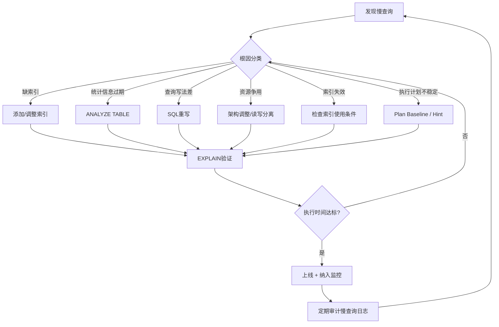

## 技巧五：慢查询分析与优化

慢查询是数据库性能劣化的"第一信号"。根据 Percona 的生产环境统计数据，一个典型的 OLTP 系统中，20% 的慢查询消耗了 80% 的数据库资源。一条执行时间从 50ms 退化到 5s 的 SQL，在高并发场景下可能拖垮整个数据库——连接池耗尽、线程堆积、最终导致服务雪崩。

能否系统性地发现、分析、优化慢查询，是区分普通开发者和资深 DBA 的关键能力。本节将建立一套完整的慢查询治理流程：从发现慢查询、定位根因、选择优化策略，到建立持续监控体系。


### 慢查询的本质：从现象到根因

一条 SQL 变慢，表面上是执行时间变长了，但根因可能完全不同：

| 现象 | 可能的根因 | 典型场景 |
|------|-----------|---------|
| 执行时间突然变长 | 统计信息过期导致优化器选错执行计划 | 大量数据变更后未 ANALYZE |
| 执行时间逐渐变长 | 数据量增长导致原有索引不再高效 | 业务增长但未调整索引策略 |
| 特定时段变慢 | 锁等待、资源争用、批量任务冲突 | 报表查询与在线事务冲突 |
| 某些用户查询慢 | 数据倾斜、参数不同导致的执行计划差异 | 分区热点、参数化查询失效 |
| 所有查询都变慢 | 硬件瓶颈、Buffer Pool 不足、连接数耗尽 | 服务器资源不足 |

理解"变慢的原因是什么"比"怎么让它变快"更重要。盲目优化可能暂时缓解症状，却留下更大的隐患。

**一个真实教训：** 某电商系统的订单查询从 200ms 恶化到 8s。DBA 第一反应是加索引，加了 5 个索引后写入性能暴跌 40%，但查询只改善到 6s。最终发现根因是统计信息过期——一条 `ANALYZE TABLE orders` 就把查询恢复到了 150ms，还顺带提升了写入性能。这说明：先诊断，再治疗。

### 识别慢查询的三种途径

#### 途径一：慢查询日志（Slow Query Log）

慢查询日志是 MySQL 内置的慢查询记录机制，开启后自动记录超过阈值的 SQL。

**MySQL 配置**

```sql
-- 查看当前配置
SHOW VARIABLES LIKE 'slow_query%';
SHOW VARIABLES LIKE 'long_query_time';

-- 开启慢查询日志（动态修改，重启失效）
SET GLOBAL slow_query_log = ON;
SET GLOBAL long_query_time = 1;          -- 超过1秒记录
SET GLOBAL log_queries_not_using_indexes = ON;  -- 记录未使用索引的查询
SET GLOBAL min_examined_row_limit = 100; -- 扫描行数超过100才记录

-- 持久化配置（my.cnf）
-- [mysqld]
-- slow_query_log = ON
-- slow_query_log_file = /var/log/mysql/slow.log
-- long_query_time = 1
-- log_queries_not_using_indexes = ON
-- min_examined_row_limit = 100
-- log_slow_admin_statements = ON        -- 记录管理语句（ALTER等）
-- log_slow_replica_statements = ON       -- 从库也记录
```

**如何选择 long_query_time 阈值：**

| 场景 | 建议阈值 | 理由 |
|------|---------|------|
| OLTP 电商/支付 | 0.5-1s | 用户体验敏感，毫秒级响应是基本要求 |
| 一般 Web 应用 | 1-2s | 兼顾日志量和问题发现率 |
| 报表/数据分析 | 5-10s | 报表查询天然耗时较长 |
| 开发/测试环境 | 0.1s | 低阈值帮助开发阶段发现潜在问题 |

> 生产环境不建议设低于 0.5s——过低的阈值会产生海量日志，不仅占用磁盘，还会因 `log_queries_not_using_indexes` 记录大量高频简单查询，反而干扰分析。

**PostgreSQL 配置**

```sql
-- PostgreSQL 使用 log_min_duration_statement
-- 记录执行时间超过阈值的查询

-- 当前设置
SHOW log_min_duration_statement;

-- 开启（动态修改，当前会话有效）
SET log_min_duration_statement = '1s';  -- 超过1秒记录

-- 持久化配置（postgresql.conf）
-- log_min_duration_statement = 1000    -- 单位：毫秒
-- log_statement = 'none'               -- 不记录所有语句，仅记录慢的
-- log_duration = off                   -- 避免重复记录
```

**查看慢查询日志的实际输出**

```bash
# MySQL：查看慢查询日志
tail -100 /var/log/mysql/slow.log

# 输出格式示例：
# Time: 2025-06-01T10:30:00.000000+08:00
# User@Host: app[app] @  [10.0.0.1]  Id:   1234
# Query_time: 2.345  Lock_time: 0.001  Rows_sent: 10  Rows_examined: 500000
# SET timestamp=1717231800;
# SELECT o.id, o.total, c.name FROM orders o JOIN customers c ON o.customer_id = c.id WHERE o.status = 'pending';

# PostgreSQL：日志通常在 data目录/pg_log/ 下
tail -100 /var/lib/postgresql/data/pg_log/postgresql-*.log

# MySQL 8.0+ 支持 JSON 格式的慢查询日志（更便于程序解析）
-- log_output = 'TABLE'  -- 写入 mysql.slow_log 表
-- 或保持 FILE 格式，用 pt-query-digest 解析
```

#### 途径二：Performance Schema（MySQL）/ pg_stat_statements（PostgreSQL）

慢查询日志只记录"慢"的查询，但无法告诉你"最消耗资源的 Top-N 查询"。Performance Schema 和 pg_stat_statements 解决的是这个问题——它们提供全量查询的统计信息。

**MySQL Performance Schema**

```sql
-- 确认 Performance Schema 已开启
SHOW VARIABLES LIKE 'performance_schema';

-- 启用 SQL 监控（如果未开启）
UPDATE performance_schema.setup_instruments
SET ENABLED = 'YES', TIMED = 'YES'
WHERE NAME LIKE 'statement/%';

UPDATE performance_schema.setup_consumers
SET ENABLED = 'YES'
WHERE NAME LIKE 'events_statements%';

-- Top 10 慢查询（按总执行时间排序）
SELECT
    DIGEST_TEXT AS query_pattern,
    COUNT_STAR AS exec_count,
    ROUND(SUM_TIMER_WAIT / 1e12, 3) AS total_time_sec,
    ROUND(AVG_TIMER_WAIT / 1e12, 3) AS avg_time_sec,
    SUM_ROWS_EXAMINED AS rows_examined,
    SUM_ROWS_SENT AS rows_sent,
    SUM_NO_INDEX_USED AS no_index_count
FROM performance_schema.events_statements_summary_by_digest
ORDER BY SUM_TIMER_WAIT DESC
LIMIT 10;

-- Top 10 最频繁查询
SELECT
    DIGEST_TEXT AS query_pattern,
    COUNT_STAR AS exec_count,
    ROUND(SUM_TIMER_WAIT / 1e12, 3) AS total_time_sec
FROM performance_schema.events_statements_summary_by_digest
ORDER BY COUNT_STAR DESC
LIMIT 10;

-- 查看特定查询的详细统计
SELECT
    DIGEST_TEXT,
    COUNT_STAR,
    SUM_TIMER_WAIT,
    SUM_LOCK_TIME,
    SUM_ROWS_EXAMINED,
    SUM_ROWS_SENT,
    SUM_CREATED_TMP_TABLES,
    SUM_CREATED_TMP_DISK_TABLES,
    SUM_NO_INDEX_USED,
    SUM_NO_GOOD_INDEX_USED
FROM performance_schema.events_statements_summary_by_digest
WHERE DIGEST_TEXT LIKE '%orders%'
ORDER BY SUM_TIMER_WAIT DESC;
```

**MySQL sys Schema 快捷视图**

`sys` schema 是 Performance Schema 的上层封装，提供更友好的查询界面：

```sql
-- 最耗时的 SQL（自动格式化，直接可用）
SELECT * FROM sys.statement_analysis
ORDER BY total_latency DESC
LIMIT 10;

-- 全表扫描的 SQL（重点关注的优化对象）
SELECT
    query,
    db,
    exec_count,
    total_latency,
    rows_examined,
    rows_sent
FROM sys.statements_with_full_table_scans
ORDER BY total_latency DESC
LIMIT 10;

-- 使用临时表的 SQL
SELECT * FROM sys.statements_with_temp_tables
ORDER BY total_latency DESC
LIMIT 10;

-- 使用文件排序的 SQL
SELECT * FROM sys.statements_with_sorting
ORDER BY total_latency DESC
LIMIT 10;

-- 索引冗余的表（可以安全删除的索引）
SELECT * FROM sys.schema_redundant_indexes;

-- 未使用的索引（占空间但从未被用到）
SELECT * FROM sys.schema_unused_indexes;

-- 用户连接统计
SELECT * FROM sys.host_summary ORDER BY total_latency DESC;
```

**PostgreSQL pg_stat_statements**

```sql
-- 安装扩展（需要 superuser）
CREATE EXTENSION IF NOT EXISTS pg_stat_statements;

-- 确认 postgresql.conf 配置
-- shared_preload_libraries = 'pg_stat_statements'
-- pg_stat_statements.max = 10000
-- pg_stat_statements.track = top

-- Top 10 最耗时查询
SELECT
    SUBSTRING(query, 1, 80) AS query_preview,
    calls,
    ROUND(total_exec_time::numeric, 2) AS total_ms,
    ROUND(mean_exec_time::numeric, 2) AS avg_ms,
    ROUND(stddev_exec_time::numeric, 2) AS stddev_ms,
    rows,
    shared_blks_hit,
    shared_blks_read
FROM pg_stat_statements
ORDER BY total_exec_time DESC
LIMIT 10;

-- Top 10 最频繁查询
SELECT
    SUBSTRING(query, 1, 80) AS query_preview,
    calls,
    ROUND(total_exec_time::numeric, 2) AS total_ms,
    ROUND(mean_exec_time::numeric, 2) AS avg_ms,
    rows
FROM pg_stat_statements
ORDER BY calls DESC
LIMIT 10;

-- 查找全表扫描倾向的查询（shared_blks_read / calls 比值很大）
SELECT
    SUBSTRING(query, 1, 80) AS query_preview,
    calls,
    rows,
    shared_blks_read,
    ROUND(shared_blks_read::numeric / GREATEST(calls, 1), 2) AS avg_blks_read
FROM pg_stat_statements
WHERE shared_blks_read > 10000
ORDER BY shared_blks_read DESC
LIMIT 10;

-- 重置统计（版本升级或大变更后建议重置）
SELECT pg_stat_statements_reset();
```

#### 途径三：实时监控抓取

对于偶发性慢查询，日志和统计可能捕捉不到。实时监控是最后的防线。

```sql
-- MySQL：实时查看当前正在执行的慢查询
-- 窗口1：持续监控
SELECT * FROM information_schema.processlist
WHERE command != 'Sleep'
  AND time > 5
ORDER BY time DESC;

-- 查看完整的 SQL 文本
SELECT
    t.id AS thread_id,
    t.user,
    t.host,
    t.db,
    t.time AS duration_sec,
    t.state,
    SUBSTRING(t.info, 1, 200) AS query_preview
FROM information_schema.processlist t
WHERE t.command != 'Sleep'
  AND t.time > 3
ORDER BY t.time DESC;

-- MySQL 8.0+：使用 sys.x$schema_table_statistics 查看表级 I/O 统计
SELECT
    object_schema,
    object_name,
    count_star,
    sum_timer_read,
    sum_timer_write
FROM sys.x$schema_table_statistics_with_buffer
ORDER BY sum_timer_read + sum_timer_write DESC
LIMIT 10;
```

```sql
-- MySQL：SHOW PROFILE 分析单条查询的执行阶段
SET profiling = ON;
SELECT o.id, o.total FROM orders o WHERE o.status = 'pending';
SHOW PROFILE FOR QUERY 1;

-- 查看各阶段的耗时分布
SELECT
    state,
    ROUND(duration, 4) AS duration_sec,
    ROUND(duration * 100 / SUM(duration) OVER(), 1) AS pct
FROM information_schema.profiling
WHERE query_id = 1
ORDER BY seq;

-- 关注以下阶段是否耗时异常：
-- Sending data      → 实际读取数据阶段，通常是最大的瓶颈
-- Creating tmp table → 创建了临时表，检查 GROUP BY/DISTINCT 是否命中索引
-- Sorting result    → 排序阶段，检查 ORDER BY 是否有索引支持
-- Locking           → 锁等待时间

SET profiling = OFF;
```

```sql
-- PostgreSQL：查看当前活跃查询
SELECT
    pid,
    now() - pg_stat_activity.query_start AS duration,
    state,
    SUBSTRING(query, 1, 80) AS query_preview,
    wait_event_type,
    wait_event
FROM pg_stat_activity
WHERE state != 'idle'
  AND pid != pg_backend_pid()
ORDER BY duration DESC;

-- PostgreSQL：终止超时查询
SELECT pg_terminate_backend(pid)
FROM pg_stat_activity
WHERE state != 'idle'
  AND now() - query_start > interval '30 seconds'
  AND pid != pg_backend_pid();

-- PostgreSQL：使用 pg_blocking_pids 查看锁链
SELECT
    pid,
    pg_blocking_pids(pid) AS blocked_by,
    query
FROM pg_stat_activity
WHERE pid IN (
    SELECT unnest(pg_blocking_pids(pid))
    FROM pg_stat_activity
    WHERE wait_event_type = 'Lock'
);
```

### 慢查询分析工具链

#### pt-query-digest：慢查询日志分析利器

pt-query-digest 是 Percona Toolkit 中最常用的慢查询分析工具，能从慢查询日志中提取、聚类、排序查询，生成结构化的分析报告。

```bash
# 安装 Percona Toolkit
apt-get install -y percona-toolkit   # Debian/Ubuntu
yum install -y percona-toolkit       # CentOS/RHEL

# 分析慢查询日志
pt-query-digest /var/log/mysql/slow.log > slow_report.txt

# 只分析最近1小时的日志
pt-query-digest --since '1h' /var/log/mysql/slow.log

# 只分析特定数据库
pt-query-digest --filter '$event->{db} eq "mydb"' /var/log/mysql/slow.log

# 输出到数据库（方便后续查询和历史对比）
pt-query-digest --review h=localhost,D=slow_query,t=query_review \
    /var/log/mysql/slow.log

# 分析特定时间段
pt-query-digest --since '2025-06-01 10:00:00' \
    --until '2025-06-01 11:00:00' \
    /var/log/mysql/slow.log

# 只输出前5条最慢的查询详情
pt-query-digest --limit 5 /var/log/mysql/slow.log

# 对比两次审计结果（识别恶化趋势）
pt-query-digest --compare slow_week1.log slow_week2.log
```

**pt-query-digest 输出解读**

```text
# 输出结构：
# 1. 总体概览
#    - 总查询数、唯一查询数、总执行时间
#    - 时间分布：前10%查询占总时间的比例
#
# 2. 排名报告（按总时间降序）
#    Rank  Response time   Calls  R/Call  V/M  Item
#    ====  ==============  =====  ======  ===  ====
#    1     1234.5678 72.3%    500  2.4691  0.00 SELECT orders JOIN customers
#    2      345.6789 20.2%   5000  0.0691  0.00 SELECT products WHERE category
#
# 关键指标解读：
# - Response time：该类查询的总响应时间（绝对值 + 占比）
# - R/Call：每次调用的平均响应时间
# - V/M：方差/均值比，越高说明执行时间波动越大
#   - V/M < 1：执行时间稳定，优化效果可预期
#   - V/M 1-10：有一定波动，可能受参数化查询或数据分布影响
#   - V/M > 10：波动极大，可能存在锁等待或参数嗅探问题
#
# 3. 每条查询的详细信息
#    - EXPLAIN 输出（如果可获取）
#    - 执行时间百分位分布（50%, 95%, 99%）
#    - 去重后的查询指纹
```

#### mysqldumpslow：MySQL 内置分析工具

```bash
# 按执行时间排序，显示前10条
mysqldumpslow -s t -t 10 /var/log/mysql/slow.log

# 按出现次数排序
mysqldumpslow -s c -t 10 /var/log/mysql/slow.log

# 按锁等待时间排序
mysqldumpslow -s l -t 10 /var/log/mysql/slow.log

# -a：不将数字替换为N，显示实际参数值
mysqldumpslow -a -s t -t 10 /var/log/mysql/slow.log

# -r：逆序排列
mysqldumpslow -r -s t -t 5 /var/log/mysql/slow.log
```

#### pgBadger：PostgreSQL 日志分析工具

```bash
# 安装
apt-get install -y pgbadger

# 分析 PostgreSQL 日志（生成 HTML 报告）
pgbadger /var/lib/postgresql/data/pg_log/postgresql-*.log -o report.html

# 分析特定时间段
pgbadger --since "2025-06-01 00:00:00" \
         --until "2025-06-01 23:59:59" \
         /var/lib/postgresql/data/pg_log/postgresql-*.log

# 输出格式选择
pgbadger -f json /var/lib/postgresql/data/pg_log/postgresql-*.log > report.json
pgbadger -f html /var/lib/postgresql/data/pg_log/postgresql-*.log -o report.html

# 增量分析（避免每次全量解析大日志）
pgbadger --last-parsed /var/lib/pgbadger/state \
         /var/lib/postgresql/data/pg_log/postgresql-*.log
```

#### 工具选择建议

| 工具 | 适用场景 | 优势 | 局限 |
|------|---------|------|------|
| pt-query-digest | MySQL 慢查询日志深度分析 | 聚类、排序、EXPLAIN 集成、可存入数据库 | 仅支持 MySQL |
| mysqldumpslow | 快速查看 MySQL 慢查询 | MySQL 内置，无需安装 | 功能简陋，无聚类能力 |
| pgBadger | PostgreSQL 日志可视化 | 生成详细 HTML 报告，支持增量分析 | 需要开启详细日志 |
| Performance Schema | MySQL 在线查询统计 | 全量统计，无需日志文件 | 需要理解 schema 结构 |
| pg_stat_statements | PostgreSQL 在线查询统计 | 轻量级，统计信息丰富 | 需要重启加载扩展 |

### 慢查询优化的系统性方法

拿到一条慢查询后，不要急着"加索引"。正确的做法是按以下流程逐步诊断。

#### 第一步：EXPLAIN 执行计划分析

执行计划是理解查询行为的起点（详见技巧1）。

```sql
-- MySQL：查看执行计划
EXPLAIN SELECT
    o.id, o.total, c.name, c.phone
FROM orders o
JOIN customers c ON o.customer_id = c.id
WHERE o.status = 'pending'
  AND o.created_at > '2025-06-01'
ORDER BY o.created_at DESC
LIMIT 20;
```

**EXPLAIN 输出示例（实际执行结果）：**

```text
+----+-------------+-------+--------+------------------+---------+---------+------+------+-------+
| id | select_type | table | type   | possible_keys    | key     | key_len | ref  | rows | Extra |
+----+-------------+-------+--------+------------------+---------+---------+------+------+-------+
|  1 | SIMPLE      | o     | range  | idx_status_created | idx_status_created | 12    | NULL |  520 | Using index condition; Using filesort |
|  1 | SIMPLE      | c     | eq_ref | PRIMARY          | PRIMARY | 8       | o.customer_id |   1 | NULL  |
+----+-------------+-------+--------+------------------+---------+---------+------+------+-------+
```

**MySQL 8.0+：EXPLAIN ANALYZE 获取真实执行时间**

```sql
EXPLAIN ANALYZE SELECT
    o.id, o.total, c.name
FROM orders o
JOIN customers c ON o.customer_id = c.id
WHERE o.status = 'pending'
  AND o.created_at > '2025-06-01'
ORDER BY o.created_at DESC
LIMIT 20;
```

输出示例：

```text
-> Limit: 20 row(s) (actual time=2.543..2.547 rows=20 loops=1)
  -> Sort: o.created_at DESC, limit input to 20 row(s) per chunk (actual time=2.541..2.544 rows=20 loops=1)
    -> Nested loop inner join  (actual time=0.182..2.513 rows=20 loops=1)
      -> Index range scan on o using idx_status_created (actual time=0.153..1.847 rows=520 loops=1)
      -> Single-row index lookup on c using PRIMARY (customer_id=o.customer_id) (actual time=0.001..0.001 rows=1 loops=520)
```

> `actual time` 的第一个值是返回第一行的时间，第二个是返回所有行的时间。重点关注第二行的总耗时。

**MySQL 8.0+：EXPLAIN FORMAT=TREE（更直观的树形输出）**

```sql
EXPLAIN FORMAT=TREE SELECT ...;
-- 输出为简洁的树形结构，一眼看出瓶颈所在
```

**PostgreSQL：等价命令**

```sql
EXPLAIN (ANALYZE, BUFFERS, FORMAT TEXT) SELECT ...;
-- BUFFERS 选项会显示缓存命中情况，帮助判断是否需要调整内存配置
-- shared hit = 缓存命中，shared read = 磁盘读取
-- 如果 read 远大于 hit，说明 shared_buffers 不足
```

**执行计划的判断标准**

```text
访问类型的优先级（从好到差）：
1. const/eq_ref  — 主键/唯一索引精确匹配（最优）
2. ref            — 非唯一索引精确匹配（良好）
3. range          — 索引范围扫描（可接受，但需关注扫描范围大小）
4. index          — 全索引扫描（需关注，可能缺少合适索引）
5. ALL            — 全表扫描（必须优化）

行数估算的危险信号：
- rows 值 >> 实际返回行数：索引选择性差或统计信息过期
- EXPLAIN 显示的 rows 与 EXPLAIN ANALYZE 的 actual rows 差距大：统计信息不准

Extra 的关键信号：
- Using index        → 覆盖索引，很好
- Using where        → Server 层额外过滤，需确认是否可被索引覆盖
- Using temporary    → 创建了临时表，GROUP BY/DISTINCT 未命中索引
- Using filesort     → 额外排序，ORDER BY 未命中索引
- Using index condition → 索引下推（ICP），MySQL 5.6+ 特性，良好
```

#### 第二步：识别根因分类

根据执行计划，将慢查询归类到以下常见根因：

**根因一：缺少合适索引**

```sql
-- 诊断：EXPLAIN 显示 type=ALL 或 type=index，key=NULL
-- 特征：rows 值很大（接近表总行数）

-- 优化：添加合适的索引
-- 原则1：WHERE 条件字段建索引
CREATE INDEX idx_orders_status_created ON orders (status, created_at);

-- 原则2：JOIN 条件字段建索引
CREATE INDEX idx_orders_customer_id ON orders (customer_id);

-- 原则3：ORDER BY 字段纳入联合索引（利用索引的有序性避免 filesort）
-- 对于 WHERE status = ? AND created_at > ? ORDER BY created_at DESC
-- 联合索引 (status, created_at) 同时满足 WHERE 和 ORDER BY

-- 原则4：覆盖索引避免回表
-- 如果查询只需要 o.id, o.status, o.created_at
CREATE INDEX idx_orders_covering ON orders (status, created_at, id);
-- 这样查询不需要回表，性能可提升 3-5 倍

-- 验证优化效果
EXPLAIN SELECT ... ; -- 确认 type 从 ALL 变为 range，key 使用了新索引
```

**索引设计的优先级决策：**

```text
当一条 SQL 有多个优化方向时，按以下优先级选择：

1. WHERE 条件 → 决定数据从哪里读取
2. JOIN 条件 → 决定表间关联效率
3. ORDER BY   → 决定排序是否需要额外操作
4. SELECT 列  → 决定是否需要回表

最佳实践：创建联合索引时，把选择性高的列放前面，范围查询放后面。
例：(status, created_at, id)
    - status = 'pending'  → 精确匹配，高效过滤
    - created_at > ?      → 范围扫描，在已过滤的数据集上执行
    - id                  → 覆盖索引，避免回表
```

**根因二：索引失效（Index Not Used）**

```sql
-- 诊断：有索引但 EXPLAIN 显示未使用

-- 常见的索引失效场景：

-- 1. 对索引列使用函数
-- 失效：WHERE YEAR(created_at) = 2025
-- 优化：WHERE created_at >= '2025-01-01' AND created_at < '2026-01-01'

-- 2. 隐式类型转换
-- 失效：WHERE phone = 13800138000  （phone 列是 VARCHAR）
-- 优化：WHERE phone = '13800138000'

-- 3. LIKE 左模糊
-- 失效：WHERE name LIKE '%keyword%'
-- 优化：如果业务允许，改为 WHERE name LIKE 'keyword%'
-- 或使用全文索引：ALTER TABLE t ADD FULLTEXT INDEX ft_name (name);

-- 4. OR 连接不同列
-- 失效：WHERE a = 1 OR b = 2 （a、b 各有独立索引）
-- 优化：分别用 UNION ALL 查询，或建立联合索引
-- SELECT * FROM t WHERE a = 1
-- UNION ALL
-- SELECT * FROM t WHERE b = 2 AND a != 1

-- 5. NOT IN / NOT EXISTS / !=
-- 可能导致全表扫描，取决于数据分布和优化器判断

-- 6. IS NULL / IS NOT NULL
-- 取决于 NULL 值比例。如果 NULL 比例很低，IS NOT NULL 可能不走索引

-- 7. 字符集不匹配的 JOIN
-- 两个表的 JOIN 字段字符集不同（如 utf8 vs utf8mb4），会导致隐式转换

-- 验证索引是否被使用
-- MySQL：EXPLAIN 看 key 字段是否为 NULL
-- PostgreSQL：EXPLAIN 看是否有 Index Scan 节点
```

**根因三：统计信息过期**

```sql
-- 诊断：EXPLAIN 显示的 rows 与实际行数差距很大
-- 例如：rows=1000，实际返回 500000 行

-- MySQL：更新统计信息
ANALYZE TABLE orders;
ANALYZE TABLE customers;

-- 全局更新（MySQL 8.0+，指定直方图桶数）
ANALYZE TABLE orders UPDATE HISTOGRAM ON status, created_at WITH 100 BUCKETS;

-- PostgreSQL：更新统计信息
ANALYZE orders;
ANALYZE customers;

-- PostgreSQL：调整统计精度（默认100，最大10000）
ALTER TABLE orders ALTER COLUMN status SET STATISTICS 500;
ANALYZE orders;

-- PostgreSQL：查看列的统计分布
SELECT
    attname,
    avg_width,
    n_distinct,
    null_frac,
    most_common_vals,
    most_common_freqs,
    histogram_bounds
FROM pg_stats
WHERE tablename = 'orders' AND attname = 'status';

-- 验证统计信息是否准确
-- MySQL：
SELECT
    TABLE_NAME,
    TABLE_ROWS,
    AVG_ROW_LENGTH,
    DATA_LENGTH
FROM information_schema.TABLES
WHERE TABLE_SCHEMA = 'mydb'
  AND TABLE_NAME IN ('orders', 'customers');

-- PostgreSQL：
SELECT
    relname,
    reltuples AS estimated_rows,
    pg_size_pretty(pg_total_relation_size(oid)) AS total_size
FROM pg_class
WHERE relname IN ('orders', 'customers');
```

**什么时候需要手动 ANALYZE：**

```text
自动统计更新通常足够，但以下情况需要手动触发：

1. 大批量数据变更后（INSERT/UPDATE/DELETE 超过表行数 10%）
2. 从其他环境导入大量数据后
3. 发现 EXPLAIN 估算行数与实际行数差距超过 5 倍
4. 执行计划突然变化（可能是统计信息更新触发了优化器重新选择）
```

**根因四：查询写法不当**

```sql
-- 问题1：SELECT * 导致无法使用覆盖索引
-- 劣化：需要回表获取所有列
-- 优化：只查询需要的列
SELECT id, total, status FROM orders WHERE ...;

-- 问题2：子查询改为 JOIN
-- 劣化：
SELECT * FROM orders
WHERE customer_id IN (SELECT id FROM customers WHERE city = 'Beijing');

-- 优化：
SELECT o.* FROM orders o
JOIN customers c ON o.customer_id = c.id
WHERE c.city = 'Beijing';

-- 问题3：LIMIT 大偏移量
-- 劣化：LIMIT 100000, 20 需要扫描并丢弃 100000 行
-- 优化：使用游标分页
SELECT * FROM orders
WHERE id > 100000   -- 上一页最后一条的 id
ORDER BY id
LIMIT 20;

-- 或使用延迟关联
SELECT o.* FROM orders o
JOIN (SELECT id FROM orders ORDER BY id LIMIT 100000, 20) t
ON o.id = t.id;

-- 问题4：不必要的 DISTINCT
-- 如果字段已经通过 JOIN 确保唯一，DISTINCT 只增加排序开销

-- 问题5：隐式排序（GROUP BY 默认升序）
-- 如果需要降序，必须显式指定，否则会多一次排序操作
-- 不好：GROUP BY created_at -- 默认 ASC，如果需要 DESC 还得排序
-- 好：GROUP BY created_at ORDER BY created_at DESC

-- 问题6：不必要的 EXISTS 子查询
-- 劣化：
SELECT * FROM customers c
WHERE EXISTS (SELECT 1 FROM orders o WHERE o.customer_id = c.id);

-- 优化（如果只需要 customers 的列）：
SELECT DISTINCT c.* FROM customers c
INNER JOIN orders o ON o.customer_id = c.id;
```

**根因五：资源争用**

```sql
-- 诊断：SQL 本身没有问题，但执行时间异常
-- 可能原因：锁等待、Buffer Pool 竞争、CPU 争用

-- MySQL：检查锁等待
SELECT
    r.trx_id AS waiting_trx,
    r.trx_mysql_thread_id AS waiting_thread,
    b.trx_id AS blocking_trx,
    b.trx_mysql_thread_id AS blocking_thread,
    r.trx_query AS waiting_query,
    b.trx_query AS blocking_query
FROM information_schema.innodb_lock_waits w
JOIN information_schema.innodb_trx b ON b.trx_id = w.blocking_trx_id
JOIN information_schema.innodb_trx r ON r.trx_id = w.requesting_trx_id;

-- MySQL 8.0+：使用 performance_schema.data_locks
SELECT
    r.REQUESTING_ENGINE_TRANSACTION_ID AS waiting_trx,
    b.BLOCKING_ENGINE_TRANSACTION_ID AS blocking_trx,
    r.REQUESTING_ENGINE_LOCK_ID AS waiting_lock,
    b.BLOCKING_ENGINE_LOCK_ID AS blocking_lock
FROM performance_schema.data_lock_waits w
JOIN performance_schema.data_locks r ON w.REQUESTING_ENGINE_LOCK_ID = r.ENGINE_LOCK_ID
JOIN performance_schema.data_locks b ON w.BLOCKING_ENGINE_LOCK_ID = b.ENGINE_LOCK_ID;

-- PostgreSQL：检查锁等待
SELECT
    blocked.pid AS blocked_pid,
    blocked.query AS blocked_query,
    blocking.pid AS blocking_pid,
    blocking.query AS blocking_query,
    now() - blocked.query_start AS waiting_duration
FROM pg_stat_activity blocked
JOIN pg_locks blocked_locks ON blocked.pid = blocked_locks.pid
JOIN pg_locks blocking_locks ON blocked_locks.locktype = blocking_locks.locktype
    AND blocked_locks.database IS NOT DISTINCT FROM blocking_locks.database
    AND blocked_locks.relation IS NOT DISTINCT FROM blocking_locks.relation
    AND blocked_locks.page IS NOT DISTINCT FROM blocking_locks.page
    AND blocked_locks.tuple IS NOT DISTINCT FROM blocking_locks.tuple
    AND blocked_locks.transactionid = blocking_locks.transactionid
    AND blocked_locks.pid != blocking_locks.pid
JOIN pg_stat_activity blocking ON blocking_locks.pid = blocking.pid
WHERE NOT blocked_locks.granted;
```

#### 第三步：验证优化效果

```sql
-- 优化前后对比的标准做法：

-- 1. 记录优化前的执行计划和时间
EXPLAIN ANALYZE SELECT ...;  -- 记录 actual time

-- 2. 执行优化（加索引/改写查询等）
CREATE INDEX ...;

-- 3. 验证优化后的执行计划
EXPLAIN ANALYZE SELECT ...;

-- 4. 关键对比指标
--    - type: ALL → range/ref/const
--    - rows: 大幅减少
--    - Extra: 消除 Using filesort / Using temporary
--    - actual time: 显著降低

-- 5. 使用 sysbench 做压力测试验证（推荐）
--    确保优化后的查询在高并发下依然表现良好

-- 6. 对比 Buffer Pool 命中率
-- MySQL：
SHOW GLOBAL STATUS LIKE 'Innodb_buffer_pool_read%';
-- 命中率 = 1 - (Innodb_buffer_pool_reads / Innodb_buffer_pool_read_requests)
-- 正常应 > 99%
```

### 高级优化策略

当常规索引优化无法满足需求时，需要考虑更深层的策略。

#### 策略一：查询重写与架构调整

```sql
-- 场景：实时统计查询太慢，影响在线业务
-- 方案：读写分离 + 物化汇总

-- 1. 创建汇总表
CREATE TABLE orders_daily_summary (
    stat_date DATE PRIMARY KEY,
    order_count INT,
    total_amount DECIMAL(12,2),
    avg_amount DECIMAL(10,2),
    updated_at TIMESTAMP DEFAULT CURRENT_TIMESTAMP
);

-- 2. 定时任务更新（而非实时计算）
-- 每天凌晨跑批
INSERT INTO orders_daily_summary (stat_date, order_count, total_amount, avg_amount)
SELECT
    DATE(created_at),
    COUNT(*),
    SUM(total),
    AVG(total)
FROM orders
WHERE created_at >= CURDATE() - INTERVAL 1 DAY
    AND created_at < CURDATE()
GROUP BY DATE(created_at)
ON DUPLICATE KEY UPDATE
    order_count = VALUES(order_count),
    total_amount = VALUES(total_amount),
    avg_amount = VALUES(avg_amount),
    updated_at = NOW();

-- 3. 在线查询直接走汇总表
SELECT * FROM orders_daily_summary
WHERE stat_date BETWEEN '2025-06-01' AND '2025-06-30';

-- 场景：模糊搜索性能差
-- 方案：引入全文索引或外部搜索引擎

-- MySQL 全文索引
ALTER TABLE articles ADD FULLTEXT INDEX ft_content (title, content);
SELECT * FROM articles
WHERE MATCH(title, content) AGAINST('数据库优化' IN BOOLEAN MODE);

-- 更复杂的搜索场景 → 使用 Elasticsearch
```

```sql
-- 场景：JOIN 查询过慢（多表关联、大数据量）
-- 方案：适当冗余 + 反范式化

-- 不好：每次查询都 JOIN 3 张表
SELECT o.id, c.name, c.phone, p.title, p.price
FROM orders o
JOIN customers c ON o.customer_id = c.id
JOIN order_items oi ON o.id = oi.order_id
JOIN products p ON oi.product_id = p.id;

-- 优化：在订单表中冗余关键字段
ALTER TABLE orders ADD COLUMN customer_name VARCHAR(100);
ALTER TABLE orders ADD COLUMN customer_phone VARCHAR(20);
-- 通过触发器或应用层在写入时同步冗余字段
-- 查询不再需要 JOIN customers，性能提升显著

-- 注意：冗余字段增加存储和维护成本，仅在读多写少、延迟容忍的场景使用
```

#### 策略二：分区表减少扫描范围

```sql
-- 场景：单表数据量超过千万，查询集中在近期数据

-- MySQL：按范围分区
ALTER TABLE orders PARTITION BY RANGE (YEAR(created_at)) (
    PARTITION p2023 VALUES LESS THAN (2024),
    PARTITION p2024 VALUES LESS THAN (2025),
    PARTITION p2025 VALUES LESS THAN (2026),
    PARTITION pmax  VALUES LESS THAN MAXVALUE
);

-- 分区后，查询 WHERE created_at >= '2025-01-01' 只扫描 p2025 分区
-- 配合分区裁剪（Partition Pruning），扫描行数大幅减少

-- PostgreSQL：声明式分区
CREATE TABLE orders (
    id BIGSERIAL,
    created_at TIMESTAMP,
    customer_id BIGINT,
    total DECIMAL(10,2)
) PARTITION BY RANGE (created_at);

CREATE TABLE orders_2025 PARTITION OF orders
    FOR VALUES FROM ('2025-01-01') TO ('2026-01-01');
CREATE TABLE orders_2024 PARTITION OF orders
    FOR VALUES FROM ('2024-01-01') TO ('2025-01-01');

-- 分区维护：自动创建未来分区（配合 pg_partman 扩展）
-- CREATE EXTENSION pg_partman;
-- SELECT partman.create_parent('public.orders', 'created_at', 'native', 'monthly');
```

#### 策略三：缓存层缓解热点查询

```python
import redis
import hashlib
import json
from functools import wraps

redis_client = redis.Redis(host='localhost', port=6379, db=0)

def cache_query(ttl=300):
    """查询结果缓存装饰器"""
    def decorator(func):
        @wraps(func)
        def wrapper(cursor, *args, **kwargs):
            # 生成缓存键
            cache_key = f"query:{func.__name__}:{hashlib.md5(str(args).encode()).hexdigest()}"

            # 尝试读取缓存
            cached = redis_client.get(cache_key)
            if cached:
                return json.loads(cached)

            # 执行查询
            result = func(cursor, *args, **kwargs)

            # 写入缓存
            redis_client.setex(cache_key, ttl, json.dumps(result, default=str))
            return result
        return wrapper
    return decorator

@cache_query(ttl=60)
def get_pending_orders(cursor, status='pending', limit=100):
    """获取待处理订单（高频查询，缓存60秒）"""
    cursor.execute("""
        SELECT o.id, o.total, c.name
        FROM orders o
        JOIN customers c ON o.customer_id = c.id
        WHERE o.status = %s
        ORDER BY o.created_at DESC
        LIMIT %s
    """, (status, limit))
    return cursor.fetchall()
```

**缓存策略的注意事项**

```text
缓存一致性问题：
- 写操作后必须失效相关缓存（Cache Invalidation）
- 延迟双删策略：写操作 → 删缓存 → 更新DB → 延迟300ms → 再删缓存
- 避免缓存穿透：对不存在的 key 也缓存空值（短 TTL）
- 避免缓存雪崩：缓存 TTL 加随机偏移，避免同时失效
- 布隆过滤器前置：在 Redis 前加一层布隆过滤器拦截不存在的 key

适合缓存的查询特征：
✓ 查询频率高（QPS > 100）
✓ 结果变化不频繁（延迟容忍 > 30s）
✓ 查询参数有限（缓存键空间可控）

不适合缓存的查询：
✗ 实时性要求极高（余额、库存）
✗ 查询条件动态变化大（复杂筛选）
✗ 数据量小且更新频繁
```

#### 策略四：执行计划稳定性

当同一条 SQL 有时快有时慢，说明执行计划不稳定，需要"锁定"执行计划。

```sql
-- MySQL 8.0+：使用 SQL Plan Baseline 固定执行计划

-- 方法一：自动捕获（推荐）
-- 设置优化器使用计划基线
SET GLOBAL optimizer_use_sql_plan_baseline = ON;
SET GLOBAL optimizer_capture_sql_plan_baselines = ON;
-- MySQL 会自动为新查询捕获执行计划，后续执行时尝试使用已捕获的计划

-- 方法二：手动加载计划
-- 先确认正确的执行计划
EXPLAIN SELECT * FROM orders WHERE status = 'pending' AND created_at > '2025-06-01';

-- 手动加载为 baseline
SET @outline = '{...}';  -- 从 performance_schema 获取的计划信息
INSERT INTO mysql.sql_plan_baseline
    (digest, schema_name, plan_id, plan_digest, plan_name, enabled, accepted, fixed)
VALUES (...);

-- 查看当前所有 baseline
SELECT * FROM mysql.sql_plan_baseline WHERE enabled = 'yes';

-- PostgreSQL：使用 pg_hint_plan 扩展
-- 修改 postgresql.conf
-- shared_preload_libraries = 'pg_hint_plan'

-- 使用 hint 强制索引选择
/*+ IndexScan(orders idx_orders_status_created) */
SELECT * FROM orders
WHERE status = 'pending' AND created_at > '2025-06-01';

-- 或使用 pg_hint_plan 控制 JOIN 顺序
/*+ Leading(c o) HashJoin(o c) */
SELECT o.id, c.name
FROM orders o JOIN customers c ON o.customer_id = c.id;

-- PostgreSQL：使用 ALTER SYSTEM 固定 work_mem / hash_join 参数
-- 适用于特定查询总是因内存不足导致 Hash Join 退化为 Nested Loop 的场景
```

### 构建持续监控体系

慢查询治理不是一次性工作，而是持续运营的过程。

#### 告警阈值设计

```bash
# Prometheus + Grafana 监控方案

# 1. 使用 mysqld_exporter 采集 MySQL 指标
# my.cnf 中开启 Performance Schema
# [mysqld]
# performance_schema = ON

# 2. 关键告警规则（Prometheus alerting rules）
cat > /etc/prometheus/rules/mysql_slow_queries.yml << 'EOF'
groups:
  - name: mysql_slow_queries
    rules:
      # 慢查询数量突增
      - alert: MySQLSlowQueriesSpike
        expr: rate(mysql_global_status_slow_queries[5m]) > 10
        for: 5m
        labels:
          severity: warning
        annotations:
          summary: "MySQL慢查询突增"
          description: "过去5分钟慢查询速率 {{ $value }}/s"

      # 慢查询占比过高
      - alert: MySQLSlowQueryRatioHigh
        expr: |
          mysql_global_status_slow_queries
          / mysql_global_status_queries > 0.05
        for: 10m
        labels:
          severity: critical
        annotations:
          summary: "MySQL慢查询占比超过5%"
          description: "当前占比 {{ $value | humanizePercentage }}"

      # 单个查询执行时间过长
      - alert: MySQLLongRunningQuery
        expr: mysql_global_status_threads_running > 50
        for: 5m
        labels:
          severity: warning
        annotations:
          summary: "MySQL活跃线程过多"
          description: "当前活跃线程数 {{ $value }}"

      # InnoDB Buffer Pool 命中率过低
      - alert: MySQLBufferPoolHitRateLow
        expr: |
          1 - (rate(mysql_global_status_innodb_buffer_pool_reads[5m])
          / rate(mysql_global_status_innodb_buffer_pool_read_requests[5m])) < 0.99
        for: 15m
        labels:
          severity: warning
        annotations:
          summary: "MySQL Buffer Pool 命中率低于 99%"
          description: "当前命中率 {{ $value | humanizePercentage }}"
EOF
```

#### 监控工具对比

| 工具 | 类型 | 优势 | 适用场景 |
|------|------|------|---------|
| Percona PMM | 开源套件 | 一站式：监控 + 慢查询 + 仪表板 | 中小团队首选 |
| Prometheus + Grafana | 开源组合 | 灵活、可定制、生态丰富 | 已有 Prometheus 栈的团队 |
| Datadog / New Relic | SaaS | 零运维、开箱即用 | 预算充足的团队 |
| MySQL Enterprise Monitor | 官方 | 深度集成 MySQL | 使用 MySQL 企业版的团队 |

#### 慢查询治理流程



#### 慢查询审计模板

定期审计是防止慢查询累积的关键。建议每周/每月生成审计报告：

```sql
-- MySQL：生成慢查询审计报告
-- 使用 pt-query-digest 分析最近7天
pt-query-digest --since '7d' \
    --limit 20 \
    --report-format profiles \
    /var/log/mysql/slow.log

-- 关注的审计指标：
-- 1. 新增的慢查询类型（相比上次审计）
-- 2. 已优化查询的改善幅度
-- 3. Top 10 慢查询的稳定性（V/M 值）
-- 4. 未使用索引的查询数量趋势
```

```sql
-- PostgreSQL：使用 pg_stat_statements 定期快照
-- 创建审计表
CREATE TABLE IF NOT EXISTS query_audit (
    id SERIAL PRIMARY KEY,
    captured_at TIMESTAMP DEFAULT NOW(),
    queryid BIGINT,
    query TEXT,
    calls BIGINT,
    total_exec_time DOUBLE PRECISION,
    mean_exec_time DOUBLE PRECISION,
    rows BIGINT,
    shared_blks_hit BIGINT,
    shared_blks_read BIGINT
);

-- 每天快照一次（配合 cron job）
INSERT INTO query_audit (queryid, query, calls, total_exec_time,
    mean_exec_time, rows, shared_blks_hit, shared_blks_read)
SELECT queryid, query, calls, total_exec_time,
    mean_exec_time, rows, shared_blks_hit, shared_blks_read
FROM pg_stat_statements;

-- 对比两次快照，找出恶化趋势
SELECT
    curr.queryid,
    SUBSTRING(curr.query, 1, 80) AS query_preview,
    curr.calls - prev.calls AS new_calls,
    curr.mean_exec_time - prev.mean_exec_time AS avg_time_change_ms
FROM query_audit curr
JOIN query_audit prev ON curr.queryid = prev.queryid
WHERE prev.captured_at = (
    SELECT MAX(captured_at) FROM query_audit WHERE captured_at < curr.captured_at
)
AND curr.mean_exec_time > prev.mean_exec_time * 1.5  -- 平均时间增加50%
ORDER BY avg_time_change_ms DESC;
```

### 真实案例：慢查询优化实战

以下是一个真实场景的完整优化过程，展示从发现到解决的全链路。

```text
背景：某电商系统的订单列表接口，P99 延迟从 200ms 恶化到 3.2s，
      每天 10:00-12:00 和 20:00-22:00 两个高峰时段最严重。

第一步：发现
  - 慢查询日志分析（pt-query-digest）
  - 发现一条 SQL 占总慢查询时间的 78%
  - SQL：SELECT * FROM orders WHERE merchant_id = ? AND status IN (1,2,3)
        ORDER BY created_at DESC LIMIT 50

第二步：分析
  - EXPLAIN 显示 type=ALL，扫描行数 2,800,000
  - 有索引 idx_merchant_id，但 status IN 条件导致优化器放弃使用
  - EXPLAIN ANALYZE 显示 actual rows = 1,200,000
  - 统计信息：TABLE_ROWS 显示 2,800,000，但实际只有 1,500,000
  - 结论：根因是 (1) 统计信息过期 (2) 缺少合适的联合索引

第三步：优化
  - 先执行 ANALYZE TABLE orders → 恢复统计信息准确性
  - 创建联合索引：CREATE INDEX idx_merchant_status_created
    ON orders (merchant_id, status, created_at);
  - 验证：EXPLAIN 显示 type=ref，扫描行数 500

第四步：结果
  - 优化前：P99 = 3.2s，扫描 1,200,000 行
  - 优化后：P99 = 35ms，扫描 500 行
  - 分析：统计信息修正贡献了 60% 的提升，联合索引贡献了 40%
  - 后续：在 Grafana 面板添加该查询的监控，阈值设为 P99 > 500ms 报警
```

### 常见误区

| 误区 | 正确理解 |
|------|---------|
| "加索引就能解决所有慢查询" | 索引增加写入开销、占用存储空间，过多索引反而降低整体性能。应选择性地建立最合适的索引 |
| "EXPLAIN 显示走了索引就一定快" | 走索引不等于快。索引选择性差（如 gender 字段）时，虽然走了索引但扫描行数仍然很多 |
| "ALL 全表扫描一定需要优化" | 小表（几千行以下）全表扫描可能比索引查找更快，因为避免了索引回表的随机 I/O |
| "long_query_time 设得越小越好" | 过小的阈值会产生大量日志，占用磁盘空间且分析成本高。生产环境建议 1-5 秒 |
| "优化就是改 SQL" | 有时根因是硬件不足、配置不当、架构设计问题，SQL 层面优化空间有限 |
| "优化一次就够了" | 数据量增长、业务变化、热点迁移都会导致查询性能重新劣化，需要持续监控 |
| "EXPLAIN ANALYZE 会修改数据" | EXPLAIN ANALYZE 是只读的，但会在真实数据上执行（比 EXPLAIN 更准确但更慢） |
| "索引越多越好" | 每个索引都会降低 INSERT/UPDATE/DELETE 的速度。一张表的索引数量建议控制在 5-8 个以内 |
| "JOIN 一定比子查询快" | MySQL 8.0+ 的优化器对 IN 子查询已经做了充分优化，某些场景下子查询反而更快 |

### 本节小结

慢查询分析与优化的核心是一个闭环流程：

```text
发现 → 分析 → 优化 → 验证 → 监控 → 发现（循环）
```

关键要点：

1. **不要猜测，要测量**：使用 EXPLAIN、Performance Schema、pt-query-digest 获取真实数据，任何基于直觉的优化都可能走偏
2. **先诊断根因，再选择策略**：不同根因对应不同优化方案，避免盲目加索引。一个 `ANALYZE TABLE` 可能比加 5 个索引更有效
3. **优化要验证**：每次优化后用 EXPLAIN ANALYZE 确认效果，避免引入新问题。同时关注写入性能是否受影响
4. **建立持续监控**：慢查询治理是长期过程，不是一次性修复。设置合理的告警阈值，在问题恶化前介入
5. **定期审计**：每周/每月审计慢查询趋势，防止性能劣化累积。将慢查询治理纳入团队的运维流程
6. **记录优化历史**：每次优化记录优化前后的数据（EXPLAIN 输出、响应时间、扫描行数），建立团队的知识库
