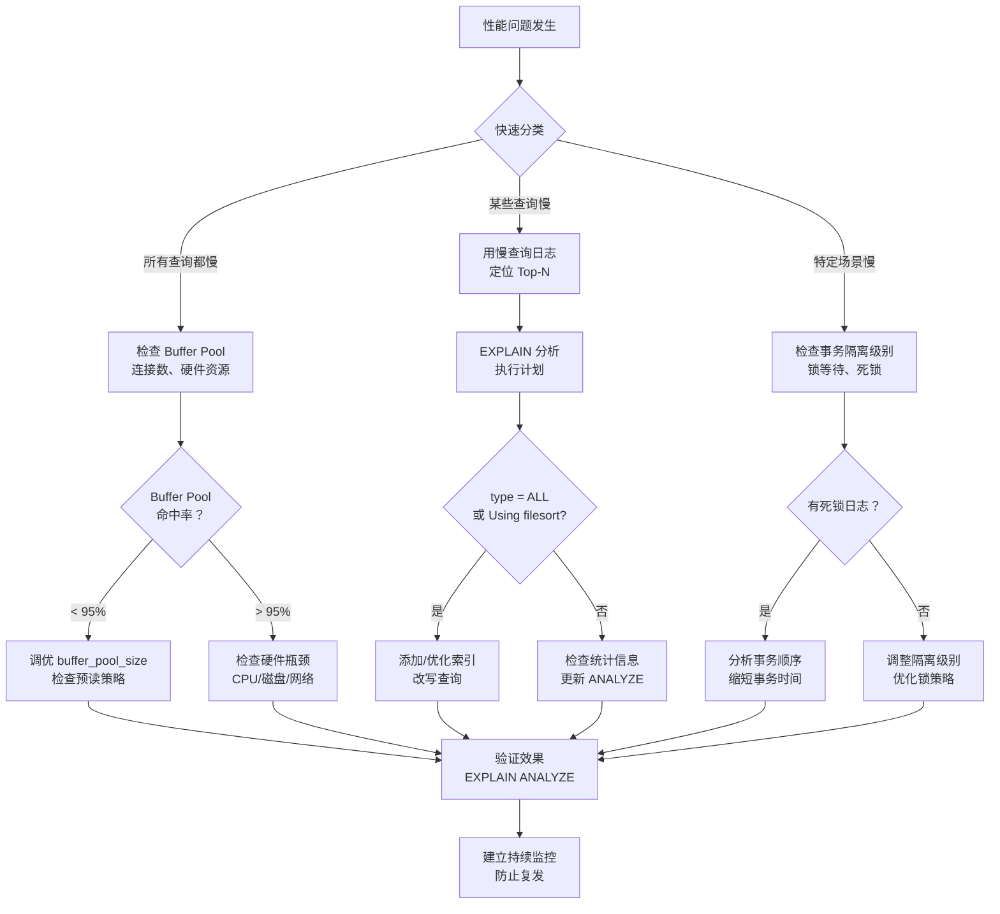

# 13.2 核心技巧：从"会用"到"用好"

理论基础让我们理解了数据库"为什么这样设计"，核心技巧则回答一个更务实的问题——**在日常开发和运维中，如何高效地使用数据库、精准地诊断问题、系统性地提升性能？**

本节聚焦五大核心技巧，它们不是孤立的工具介绍，而是一套**完整的性能诊断与调优方法论**：从"看到问题"（EXPLAIN）到"理解内存行为"（Buffer Pool）到"管理连接资源"（连接池）到"控制并发语义"（事务隔离级别）再到"系统性治理"（慢查询分析）。掌握了这五大技巧，面对绝大多数数据库性能问题都能做到有据可依、有的放矢。

---

## 为什么是这五个技巧

在数据库性能调优的实践中，问题的排查往往遵循一条路径：

发现问题 → 定位原因 → 选择策略 → 验证效果 → 持续监控

五大技巧恰好覆盖了这条路径上的关键环节：

| 阶段 | 技巧 | 解决什么问题 | 为什么重要 |
|------|------|-------------|-----------|
| 发现问题 | 慢查询分析与优化 | 哪些查询消耗了最多资源？根因是什么？ | 没有度量就没有优化——20%的慢查询消耗80%的数据库资源 |
| 定位原因 | EXPLAIN执行计划解读 | 优化器为这条SQL选择了什么执行路径？ | 从"猜测瓶颈"走向"看到瓶颈"，所有SQL优化的起点 |
| 理解机制 | Buffer Pool状态监控与调优 | 数据在内存中是否得到了有效缓存？ | 内存与磁盘的性能差6个数量级，Buffer Pool命中率决定一切 |
| 控制并发 | 事务隔离级别的选择 | 在并发性能和数据一致性之间如何权衡？ | 选错隔离级别，轻则数据不一致，重则资金损失 |
| 管理资源 | 合理使用连接池 | 如何高效复用数据库连接、避免资源耗尽？ | 连接是最昂贵的资源之一，管理不当直接拖垮整个系统 |

这五个技巧之间存在紧密的**依赖和联动关系**：

EXPLAIN（定位单条SQL问题）
    ↓ 需要配合
Buffer Pool（理解内存层面的根因）
    ↓ 影响
连接池（资源层面的全局优化）
    ↓ 制约
事务隔离级别（并发层面的语义控制）
    ↓ 统一治理
慢查询分析（系统性的发现与优化流程）

一个实际的例子：当你发现某条SQL变慢时，首先用 EXPLAIN 查看执行计划——如果发现走了全表扫描（type=ALL），可能是缺少索引；但如果你进一步发现 Buffer Pool 命中率只有 85%，那根因可能是内存不足导致大量磁盘I/O。同时，如果你的事务隔离级别是 REPEATABLE READ，MVCC 的版本链开销也可能加剧问题。最后，你需要把这些诊断流程固化为持续的慢查询监控体系，才能防患于未然。

---

## 五大技巧速览

### 技巧一：EXPLAIN执行计划解读

EXPLAIN 是 MySQL 提供的核心诊断工具，让你看到优化器为一条 SQL 选择的执行路径。本节系统讲解：

- **四种 EXPLAIN 格式**：传统表格、JSON、TREE、ANALYZE，各自适用场景
- **每个字段的含义与判断标准**：type（访问类型从const到ALL的光谱）、key（实际使用的索引）、rows（预估扫描行数）、Extra（Using index/filesort/temporary等关键信号）
- **EXPLAIN ANALYZE 实战**：对比预估值与实际值，发现统计信息偏差
- **type字段完整性能光谱**：从system/const（最优）到ALL（全表扫描），每种类型的触发条件和优化方向

> 适用场景：日常SQL性能诊断、索引设计验证、执行计划对比分析。是每个数据库使用者必须掌握的第一个工具。

### 技巧二：Buffer Pool状态监控与调优

Buffer Pool 是 InnoDB 的核心内存结构，直接决定数据库的I/O模式和响应延迟。本节覆盖：

- **内部结构解析**：Free List、LRU List（Young/Old区）、Flush List、Zip List 四条链表的协作机制
- **改进的LRU算法**：midpoint机制如何过滤全表扫描等一次性访问，保护热数据
- **核心监控指标**：命中率（≥99%优秀/<90%严重告警）、脏页比例（10%~40%健康）、页面分配状态
- **SHOW ENGINE INNODB STATUS 解读**：Buffer Pool段的每个字段含义
- **持续监控方案**：脚本化采集、Performance Schema精确监控、sys Schema便捷视图、Prometheus+Grafana可视化
- **调优策略**：buffer_pool_size计算（专用服务器70%~80%物理内存）、多实例配置、预读策略、脏页刷盘、自适应哈希索引

> 适用场景：数据库性能基线评估、内存不足诊断、I/O瓶颈分析。对DBA和高级开发者而言，这是必须持续关注的首要指标。

### 技巧三：合理使用连接池

数据库连接是应用程序中最昂贵的资源之一，每次新建连接需要经历TCP握手、SSL握手、身份验证、权限检查、资源分配等步骤（总计约10-30ms）。本节详解：

- **连接池工作原理**：预创建→复用→回收→超时销毁的完整生命周期
- **主流连接池对比**：HikariCP（Java高性能首选）、Druid（企业级监控）、SQLAlchemy Pool（Python）、pgBouncer/ProxySQL（连接池代理）
- **Java连接池配置详解**：HikariCP的字节码优化与无锁设计、Druid的SQL防火墙与监控
- **Python连接池配置详解**：SQLAlchemy QueuePool、psycopg2连接池
- **连接池大小计算**：经典公式（CPU核心数×2+有效磁盘数）与Little's Law精确计算法
- **调优实战**：监控指标、性能优化技巧（批量操作、上下文管理器、避免长事务）、连接泄漏检测

> 适用场景：应用架构设计、微服务连接管理、高并发场景调优。连接池配置不当是性能问题的隐形杀手。

### 技巧四：事务隔离级别的选择

事务隔离级别是在并发性能和数据一致性之间的核心权衡旋钮。选错隔离级别，轻则数据不一致，重则资金损失。本节深入讲解：

- **四种并发异常**：脏读、不可重复读、幻读、序列化异常——理解问题才能选择方案
- **四种隔离级别详解**：READ UNCOMMITTED→READ COMMITTED→REPEATABLE READ→SERIALIZABLE，每个级别的机制、行为示例、适用场景
- **MVCC深层原理**：ReadView的工作机制、版本链遍历规则、RC与RR的核心差异
- **InnoDB在RR级别下避免幻读的机制**：Next-Key Lock（记录锁+间隙锁）
- **PostgreSQL的MVCC差异**：SSI算法 vs InnoDB的加锁串行化
- **实战决策框架**：按业务场景推荐（电商订单用RC+乐观锁、财务报表用RR、金融核心用SERIALIZABLE）
- **常见误区纠正**：隔离级别越高越好？RR完全避免了幻读？设置隔离级别就不用管锁了？

> 适用场景：业务架构设计、并发问题诊断、数据库迁移评估。是理解数据库并发行为的核心知识。

### 技巧五：慢查询分析与优化

慢查询是数据库性能劣化的"第一信号"。能否系统性地发现、分析、优化慢查询，是区分普通开发者和资深DBA的关键能力。本节建立完整的慢查询治理流程：

- **三种发现途径**：慢查询日志（Slow Query Log）、Performance Schema/pg_stat_statements全量统计、实时监控抓取
- **分析工具链**：pt-query-digest（慢查询日志分析利器）、mysqldumpslow（MySQL内置）、pgBadger（PostgreSQL日志分析）
- **系统性优化方法**：EXPLAIN分析→根因分类（缺少索引/索引失效/统计信息过期/查询写法不当/锁等待）→针对性优化→验证效果
- **索引失效的完整场景**：对索引列使用函数、隐式类型转换、LIKE左模糊、OR连接不同列、NOT IN/!=等
- **持续监控体系**：如何建立自动化的慢查询发现与告警机制

> 适用场景：性能劣化诊断、SQL优化评审、数据库巡检。是性能调优工作的核心工作流。

---

## 学习路径建议

### 路径一：快速上手（1-2天）

适合工作中遇到数据库性能问题、需要快速找到优化方向的开发者：

技巧一（EXPLAIN）→ 技巧五（慢查询分析）→ 回头查看技巧二（Buffer Pool）

先学会"看到问题"，再学习"系统性治理"。EXPLAIN 是最快见效的工具——今天学会，明天就能用。

### 路径二：系统调优（3-5天）

适合负责数据库性能优化、需要建立监控体系的DBA/高级开发者：

技巧二（Buffer Pool）→ 技巧三（连接池）→ 技巧四（事务隔离级别）→ 技巧五（慢查询治理）

从底层机制出发，逐步建立从内存到连接到并发到SQL的完整调优能力。

### 路径三：架构设计（2-3天）

适合需要做数据库技术选型、设计高并发系统的架构师：

技巧三（连接池）→ 技巧四（事务隔离级别）→ 技巧五（慢查询分析）

重点关注连接管理策略、并发控制方案、性能基准测试方法论。

---

## 前置知识

学习本节之前，建议读者已经阅读过 **13.1 理论基础** 部分，特别是：

- **13.1.1 数据库的分层架构**：理解 SQL 解析→优化→执行的完整流程，有助于理解 EXPLAIN 的每个字段
- **13.1.2 InnoDB存储引擎架构**：理解 Buffer Pool、Redo Log、Undo Log 的设计，是理解本节技巧二和技巧四的基础
- **13.1.3 查询执行流程**：理解代价估算（Cost Estimation）和基数估算（Cardinality Estimation），有助于判断 EXPLAIN 输出的可靠性

如果尚未阅读理论基础部分，也可以直接从技巧一（EXPLAIN）开始——它是本节最独立、最实用的技巧，几乎不需要额外的理论背景。

---

## 技巧间的协作关系

在实际的性能调优工作中，这五个技巧往往需要**组合使用**。以下是一个典型的诊断流程：

这种"组合拳"式的诊断方法，正是掌握五大核心技巧后的价值体现——你不再是在黑暗中摸索，而是有了一套系统性的方法论来应对各种数据库性能挑战。
