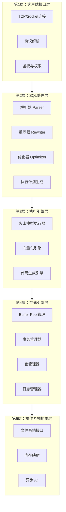
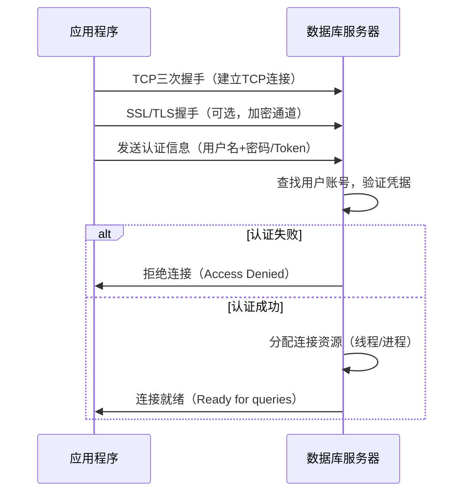
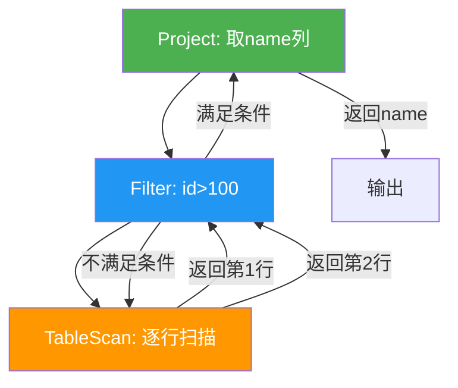
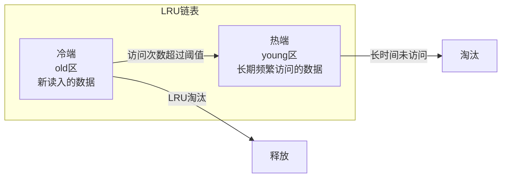
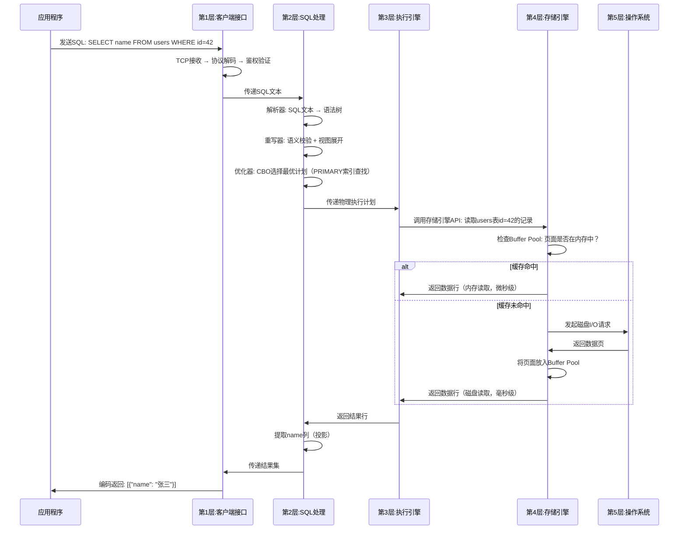

# 13.1 数据库的分层架构

关系型数据库不是一个"铁板一块"的黑盒程序，而是一个精心设计的**多层架构系统**。每一层都有明确的职责边界，层与层之间通过定义良好的接口通信。这种分层设计不是偶然的——它是几十年来无数数据库工程师在可维护性、可扩展性和性能之间反复权衡的结果。

理解分层架构的价值在于：当系统出问题时，你知道问题可能出在哪一层；当需要扩展功能时，你知道应该在哪一层做改动；当需要做技术选型时，你能判断不同数据库在架构层面的本质差异。

本节将从宏观视角出发，逐层剖析关系型数据库的内部架构，帮助读者建立一个完整的认知框架。

---

## 13.1.1 为什么数据库要分层

### 从单一架构的困境说起

在数据库发展的早期，功能模块之间往往是紧耦合的。查询处理、事务管理、数据存储等逻辑交织在一起，修改任何一处都可能引发连锁反应。这种设计带来了三个致命问题：

**第一，维护困难。** 当开发者想优化查询性能时，可能需要同时修改事务处理代码和存储层代码，因为它们之间没有清晰的边界。一个修改可能在测试中表现良好，但在生产环境中引发事务回滚异常。

**第二，扩展性差。** 想支持新的存储格式？需要重写查询处理逻辑。想支持新的查询语言？需要改动存储引擎。每一项新功能都像在沙堆上盖楼，地基不稳。

**第三，可移植性为零。** 整个数据库与特定操作系统、硬件平台紧密绑定，换一个运行环境几乎意味着重写整个系统。

### 分层架构如何解决这些问题

分层架构借鉴了计算机科学中最经典的设计思想——**关注点分离（Separation of Concerns）**。就像网络协议栈将通信分解为物理层、数据链路层、网络层、传输层和应用层一样，数据库也通过分层实现了功能解耦。

分层带来的核心收益：

| 收益 | 具体表现 | 实际案例 |
|------|---------|---------|
| 模块独立演进 | 每层可以独立优化而不影响其他层 | MySQL 8.0 优化了优化器算法，无需改动 InnoDB 存储引擎 |
| 接口标准化 | 层间通过定义良好的API通信 | MySQL 的 Handler API 允许插件式存储引擎 |
| 问题定位 | 出现性能问题时可以逐层排查 | 先看执行计划（SQL处理层），再看Buffer Pool命中率（存储引擎层） |
| 技术替换 | 某一层的技术方案可以整体替换 | PostgreSQL 可以将存储从本地磁盘替换为分布式存储 |
| 团队协作 | 不同团队可以并行开发不同层 | 优化器团队专注查询优化，存储团队专注引擎性能 |

---

## 13.1.2 关系型数据库的五层架构模型

一台典型的关系型数据库（如 MySQL、PostgreSQL）可以抽象为以下五个层次：



接下来逐层展开。

---

## 13.1.3 第1层：客户端接口层

客户端接口层是数据库与外部世界交互的门户。它的核心职责是：**接收客户端请求，完成身份验证，将请求转交给上层处理，并将结果返回给客户端。**

### 连接建立过程

当一个应用程序发起数据库连接时，完整的流程如下：



### 三种连接模型

不同的数据库在连接管理上采用了不同的架构：

| 模型 | 代表数据库 | 工作方式 | 优势 | 劣势 |
|------|-----------|---------|------|------|
| **每连接一进程** | PostgreSQL | 每个客户端连接fork一个独立后端进程 | 故障隔离好，一个连接崩溃不影响其他 | 进程创建开销大，连接数受限 |
| **每连接一线程** | MySQL | 主线程监听，每个连接分配一个工作线程 | 线程轻量，连接数上限更高 | 线程崩溃可能影响整个进程 |
| **线程池模式** | OceanBase、DB2 | 预创建线程池，连接复用线程 | 可控并发，避免上下文切换爆炸 | 实现复杂，需要精细的调度算法 |

以 MySQL 为例，当连接建立后，主线程会创建一个**专用的工作线程**来处理该连接的所有请求：

```sql
-- 查看当前连接与线程状态
SHOW STATUS LIKE 'Threads%';

-- Threads_connected: 已建立的连接数
-- Threads_running: 正在执行查询的线程数
-- Threads_cached: 缓存的空闲线程（可复用）
```

### 连接池：复用连接的艺术

在实际应用中，频繁创建和销毁连接会带来巨大的开销（每次创建连接需要TCP握手、鉴权、分配资源）。**连接池**通过预创建一组连接并复用它们来解决这个问题。

连接池的核心参数：

```sql
-- MySQL连接池相关参数
SHOW VARIABLES LIKE 'max_connections';      -- 最大连接数（默认151）
SHOW VARIABLES LIKE 'wait_timeout';        -- 空闲连接超时时间（默认28800秒）
SHOW VARIABLES LIKE 'interactive_timeout'; -- 交互式连接超时时间
SHOW VARIABLES LIKE 'thread_cache_size';   -- 线程缓存大小
```

> **实践建议：** 连接池大小不是越大越好。每个连接会消耗内存（MySQL中每个连接约占用 256KB-1MB 缓冲区），过多连接会导致内存压力和上下文切换开销。一个常见的经验公式是：`连接池大小 = CPU核心数 × 2 + 磁盘数`。

### 协议解析

MySQL 使用自定义的**客户端/服务器协议（Client/Server Protocol）**，而非通用的HTTP协议。协议报文结构如下：

+--------+--------+--------+--------+
| 长度(3) | 序列号(1) | 类型(1) | 数据(payload) |
+--------+--------+--------+--------+

- **长度字段（3字节）：** 整个报文的长度（不含自身）
- **序列号（1字节）：** 用于检测报文丢失和乱序
- **类型（1字节）：** 报文类型（如 COM_QUERY = 0x03）
- **数据：** 实际的SQL语句或结果数据

客户端发送一条SQL查询时，报文类型为 `COM_QUERY`，数据部分就是SQL文本。服务器处理完毕后，通过 `COM_QUERY_RESPONSE` 类型的报文返回结果集。

PostgreSQL 则使用**扩展查询协议（Extended Query Protocol）**，将查询处理分为 Parse（解析）、Bind（绑定参数）、Execute（执行）四个阶段，支持预编译语句的高效复用。

---

## 13.1.4 第2层：SQL处理层

SQL处理层是数据库的"大脑"，负责将人类可读的SQL文本转化为机器可执行的操作计划。这个过程可以分解为四个阶段：**解析 → 重写 → 优化 → 计划生成**。


### 阶段一：解析器（Parser）

解析器的工作是将SQL文本转化为**抽象语法树（AST）**。这个过程分为两步：

**词法分析（Lexical Analysis）：** 将SQL文本拆分为一个个Token。

```sql
-- 输入SQL
SELECT name, email FROM users WHERE id = 42;

-- 词法分析结果
Token序列: [SELECT, name, ',', email, FROM, users, WHERE, id, '=', 42, ';']
```

**语法分析（Syntax Analysis）：** 根据SQL语法规则，将Token序列组合成语法树。

```sql
-- 语法树（简化表示）
SELECT_STMT
├── SELECT_LIST
│   ├── COLUMN: name
│   └── COLUMN: email
├── FROM
│   └── TABLE: users
└── WHERE
    └── CONDITION: id = 42
```

如果SQL语法有误，解析器会在这个阶段报错：

```sql
-- 语法错误示例
SELECT name email FROM users;
-- Error 1064: You have an error in your SQL syntax
-- 原因：name 和 email 之间缺少逗号
```

### 阶段二：重写器（Rewriter）

重写器对语法树进行**语义校验和等价变换**，不改变查询语义，但可以显著提升后续优化的效率。

**语义校验：**
- 表名是否存在？列名是否合法？
- 数据类型是否匹配？（如 `WHERE id = 'abc'` 是否需要类型转换）
- 用户是否有权限访问这些表？

**常见等价变换：**

```sql
-- 视图展开：将视图替换为底层查询
CREATE VIEW active_users AS SELECT * FROM users WHERE status = 'active';
-- 查询 SELECT * FROM active_users WHERE id = 42
-- 被重写为 SELECT * FROM users WHERE status = 'active' AND id = 42

-- 子查询展开：将关联子查询转换为JOIN
-- 原始查询
SELECT * FROM orders WHERE customer_id IN (SELECT id FROM customers WHERE vip = 1);
-- 重写为
SELECT o.* FROM orders o JOIN customers c ON o.customer_id = c.id WHERE c.vip = 1;

-- 消除冗余：去掉多余的括号、消除 NOT IN 中的 NULL 影响等
```

MySQL 的重写器还处理**SQL Profile**和**查询重写插件**（如 `sql_query_rewrite`），允许用户自定义重写规则。

### 阶段三：优化器（Optimizer）

优化器是SQL处理层最核心、最复杂的组件。它的任务是：**在所有可能的执行计划中，找到代价最低的那一个。**

优化器有两种主要策略：

**基于规则的优化（RBO, Rule-Based Optimization）：** 使用预定义的规则集来选择执行计划。例如，"有索引的条件优先使用索引"、"小表驱动大表"。这种方法实现简单，但无法根据数据分布做出最优选择。

**基于代价的优化（CBO, Cost-Based Optimization）：** 根据表的统计信息（行数、数据分布、索引选择性等），估算每种执行计划的资源消耗（CPU、I/O、内存），选择代价最低的方案。MySQL的优化器、PostgreSQL的优化器都属于CBO。

CBO的核心挑战是**基数估算（Cardinality Estimation）**——准确预测查询结果的行数。估算不准会导致优化器选错执行计划：

```sql
-- 统计信息不准导致的性能问题
-- 当 orders 表有 1000万 行，但统计信息显示只有 1000 行
-- 优化器可能选择全表扫描而非索引查找
ANALYZE TABLE orders;  -- 更新统计信息
```

优化器的代价模型通常基于以下因子：

| 因子 | 含义 | 典型代价权重 |
|------|------|------------|
| I/O代价 | 读取磁盘页面的次数 | 最高（磁盘是最慢的） |
| CPU代价 | 比较、计算、排序操作次数 | 中等 |
| 网络代价 | 分布式场景中节点间数据传输量 | 视情况而定 |
| 内存代价 | 排序缓冲区、哈希表等内存消耗 | 间接影响（内存不足→I/O） |

### 阶段四：执行计划生成

优化器的最终输出是一个**物理执行计划**，它精确描述了数据库将如何一步步执行查询：

```sql
-- 查看MySQL执行计划
EXPLAIN SELECT name, email FROM users WHERE status = 'active' AND id > 1000;

-- 输出示例（简化）
+----+-------------+-------+-------+---------------+---------+---------+------+------+-----------------------+
| id | select_type | table | type  | possible_keys | key     | key_len | ref  | rows | Extra                 |
+----+-------------+-------+-------+---------------+---------+---------+------+------+-----------------------+
|  1 | SIMPLE      | users | range | PRIMARY       | PRIMARY | 4       | NULL | 5000 | Using index condition |
+----+-------------+-------+-------+---------------+---------+---------+------+------+-----------------------+
```

执行计划中的关键信息：

- **type：** 访问类型（ALL=全表扫描, index=索引扫描, range=范围扫描, ref=索引等值查找, eq_ref=唯一索引查找, const=常量查找）
- **key：** 实际使用的索引
- **rows：** 预估扫描行数
- **Extra：** 额外信息（Using filesort=需要额外排序, Using temporary=需要临时表）

> 执行计划是性能调优的起点。一个不读EXPLAIN的开发者就像一个不看仪表盘的飞行员——飞着全凭感觉，出事了才知道哪里不对。13.3节将详细讲解执行计划的解读方法。

---

## 13.1.5 第3层：执行引擎层

执行引擎的任务是：**按照执行计划的指令，逐行/逐批地从存储引擎获取数据并完成计算。** 执行引擎决定了数据库处理数据的"姿势"，不同的执行模型在不同场景下性能差异巨大。

### 火山模型（Volcano/Iterator Model）

火山模型是最经典的执行模型，也称为**迭代器模型**。它的核心思想是：每个执行算子实现 `next()` 接口，自底向上逐行拉取数据。

```python
# 火山模型的简化伪代码
class TableScan:
    def __init__(self, table):
        self.table = table
        self.cursor = 0

    def next(self):
        """返回下一行数据，没有更多数据返回None"""
        if self.cursor >= self.table.row_count:
            return None
        row = self.table.get_row(self.cursor)
        self.cursor += 1
        return row

class Filter:
    def __init__(self, child, condition):
        self.child = child
        self.condition = condition

    def next(self):
        """不断从子算子拉取数据，直到找到满足条件的行"""
        while True:
            row = self.child.next()
            if row is None:
                return None
            if self.condition(row):
                return row

class Project:
    def __init__(self, child, columns):
        self.child = child
        self.columns = columns

    def next(self):
        row = self.child.next()
        if row is None:
            return None
        return {col: row[col] for col in self.columns}

# 执行查询：SELECT name FROM users WHERE id > 100
# 构建执行计划树
scan = TableScan(table)
filter_node = Filter(scan, condition=lambda r: r['id'] > 100)
project = Project(filter_node, columns=['name'])

# 逐行拉取结果
while True:
    row = project.next()
    if row is None:
        break
    print(row)
```

火山模型的执行流程可以用瀑布比喻：



**火山模型的优势：**
- 实现简单，每个算子只需实现 `next()` 接口
- 内存友好：一次只处理一行，不需要将整个结果集加载到内存
- 支持流水线执行（Pipeline）：数据从底层算子"流"过顶层算子

**火山模型的劣势：**
- 每一行数据都要经过多次虚函数调用（`next()`），函数调用开销大
- 无法利用CPU缓存的局部性（每次只处理一行，数据访问模式不连续）
- 在OLAP场景下，逐行处理效率极低

### 向量化执行（Vectorized Execution）

向量化执行是火山模型的进化版本。它不再逐行处理，而是**一次处理一批数据（通常1024行）**，利用现代CPU的SIMD指令（Single Instruction, Multiple Data）实现并行计算。

```python
# 向量化执行的简化伪代码
class VectorizedFilter:
    def __init__(self, child, condition):
        self.child = child
        self.condition = condition

    def next_batch(self, batch_size=1024):
        """一次获取一批数据"""
        batch = self.child.next_batch(batch_size)
        if batch is None:
            return None
        
        # 对整批数据应用过滤条件（可利用SIMD并行）
        mask = self.condition(batch)  # 返回布尔数组
        return batch.filter(mask)
```

向量化执行的性能优势源于两个方面：

**1. 减少函数调用开销。** 火山模型处理1000行数据需要调用1000次 `next()`，向量化模型只需要调用1次 `next_batch()`。

**2. 利用CPU缓存和SIMD。** 一批数据在内存中是连续存储的，CPU可以高效地加载到缓存中，并通过SIMD指令同时对多个数据元素执行相同操作。

| 特性 | 火山模型 | 向量化模型 |
|------|---------|-----------|
| 处理粒度 | 逐行 | 逐批（1024行） |
| 函数调用次数 | O(N) | O(N/1024) |
| CPU缓存利用 | 差（随机访问） | 好（连续访问） |
| SIMD支持 | 不支持 | 天然支持 |
| 适用场景 | OLTP（短查询） | OLAP（分析查询） |
| 代表数据库 | PostgreSQL（传统） | ClickHouse, DuckDB, PostgreSQL 15+ |

### 代码生成（Code Generation）

代码生成是执行引擎的另一种优化路径。它不是解释执行预定义的算子，而是**为每条SQL查询动态生成专用的机器码**，消除虚函数调用和通用算子的额外开销。

```sql
-- 代码生成的典型场景：编译执行热点查询
-- PostgreSQL 11+ 的JIT编译
SET jit = on;
SET jit_above_cost = 100000;  -- 超过此代价的查询启用JIT
SET jit_inline_above_cost = 500000;  -- 超过此代价的查询启用内联优化

-- 查看JIT编译统计
SELECT query, calls, total_time, jit_generation_time
FROM pg_stat_statements
WHERE jit_generation_time > 0;
```

代码生成的工作流程：


三种执行模型的对比：

| 特性 | 火山模型 | 向量化模型 | 代码生成 |
|------|---------|-----------|---------|
| 实现复杂度 | 低 | 中 | 高 |
| OLTP性能 | 好 | 一般 | 好 |
| OLAP性能 | 差 | 好 | 最好 |
| 内存开销 | 低 | 中（批量缓冲） | 低 |
| 代表数据库 | MySQL, PostgreSQL | ClickHouse, DuckDB | Spark, CockroachDB |
| 调试难度 | 低 | 中 | 高（动态生成的代码难以调试） |

> 现代数据库往往不是三选一，而是**混合使用**。例如，PostgreSQL 15+ 在执行长查询时使用向量化执行，同时通过JIT编译生成热点代码路径的机器码。

---

## 13.1.6 第4层：存储引擎层

存储引擎是关系型数据库的"地基"——它负责数据的持久化存储、检索、事务管理和并发控制。如果说SQL处理层是"大脑"，那存储引擎就是"心脏"。

### 存储引擎的核心职责

一个完整的存储引擎需要解决以下五个核心问题：

**1. 数据组织与存储：** 如何将行数据和索引组织到磁盘页面上？B-tree、Hash索引还是其他结构？

**2. 缓冲池管理：** 磁盘太慢，如何在内存中缓存热点数据？缓存满了如何淘汰？

**3. 事务管理：** 如何保证ACID特性？如何实现事务的原子性和持久性？

**4. 并发控制：** 多个事务同时读写同一数据时，如何保证数据一致性？MVCC还是锁？

**5. 崩溃恢复：** 系统突然断电后，如何保证数据不丢失、不损坏？

### 存储引擎的内部结构

以 MySQL InnoDB 为例，存储引擎层的内部架构：

```mermaid
graph TD
    subgraph 存储引擎层
        subgraph 内存结构
            BP[Buffer Pool<br/>数据页+索引页缓存<br/>通常占50-80%物理内存]
            LB[Log Buffer<br/>Redo Log缓冲<br/>批量刷盘优化]
            CB[Change Buffer<br/>非唯一索引变更缓存<br/>减少随机I/O]
            AHI[Adaptive Hash Index<br/>热点数据自动建哈希索引]
        end
        
        subgraph 后台线程
            MC[Master Thread<br/>协调各类后台工作]
            PC[Page Cleaner Thread<br/>脏页刷盘]
            PT[Purge Thread<br/>清理已提交事务的旧版本]
            IBT[Insert Buffer Thread<br/>合并Change Buffer]
        end
        
        subgraph 磁盘结构
            TS[表空间(.ibd)<br/>数据+索引]
            RL[Redo Log<br/>物理日志·循环写入]
            UL[Undo Log<br/>逻辑日志·MVCC+回滚]
            DW[Doublewrite Buffer<br/>防止部分页写入损坏]
        end
    end
    
    BP -->|脏页| PC
    LB -->|顺序写| RL
    CB -->|合并| TS
    PC -->|写入| DW
    DW -->|写入| TS
```

### 缓冲池：性能的关键

缓冲池（Buffer Pool）是存储引擎层最关键的组件。它的原理很简单：**在内存中缓存磁盘上的数据页和索引页，后续的读操作直接命中内存，避免磁盘I/O。**

以MySQL InnoDB为例，Buffer Pool的管理涉及三张链表：

| 链表 | 作用 | 工作方式 |
|------|------|---------|
| **Free链表** | 记录空闲页面 | 新数据读入时，从Free链表获取空闲页面 |
| **LRU链表** | 管理已使用页面的淘汰 | 最久未使用的页面被驱逐 |
| **Flush链表** | 记录脏页（已修改但未写回磁盘） | 后台线程将脏页刷回磁盘 |

InnoDB 使用了**改进的LRU算法（Midpoint Insertion Strategy）**，将LRU链表分为两段：



- **新读入的页面**放在冷端（old区）的头部
- 如果页面在冷端停留超过 `innodb_old_blocks_time`（默认1000ms）后再次被访问，则提升到热端
- 这样可以防止全表扫描等操作将热点数据"冲出"缓存

### 事务与日志：ACID的实现

存储引擎通过**双日志机制**实现事务的ACID特性：

| 日志 | 类型 | 作用 | 写入方式 |
|------|------|------|---------|
| **Redo Log** | 物理日志 | 记录数据页的修改，保证持久性 | 顺序写入（性能高） |
| **Undo Log** | 逻辑日志 | 记录数据的旧版本，支持回滚和MVCC | 追加写入 |

WAL（Write-Ahead Logging）原则：**先写日志，再写数据页。** 即使写数据页时系统崩溃，也可以通过Redo Log恢复数据。

事务提交时的写入顺序：
1. 将修改写入内存中的数据页（Buffer Pool）
2. 将Redo Log写入Log Buffer
3. 事务提交时，将Log Buffer刷到磁盘（fsync）
4. 后台线程将脏页慢慢刷回磁盘

→ 步骤3的fsync保证了持久性（ACID的D）
→ 步骤4是异步的，不影响事务提交性能

### 并发控制：MVCC

MVCC（Multi-Version Concurrency Control）通过保留数据的多个版本，实现了**读写不阻塞**。当一个事务在修改数据时，其他事务仍然可以读取到修改前的旧版本。

```sql
-- MVCC的实际效果
-- 事务A
BEGIN;
UPDATE accounts SET balance = balance - 100 WHERE id = 1;
-- 此时balance=900（A看到的）
-- 但事务B看到的还是balance=1000

-- 事务B（同时运行）
BEGIN;
SELECT balance FROM accounts WHERE id = 1;
-- 返回 balance = 1000（旧版本，通过MVCC可见性判断）
COMMIT;
```

MVCC的实现核心是**可见性判断**：每个事务启动时获得一个快照（Snapshot），后续读操作只能看到在快照时间点之前已提交的数据版本。

---

## 13.1.7 第5层：操作系统抽象层

数据库的最底层直接与操作系统交互。这一层虽然"低级"，但对性能影响巨大——很多数据库的性能瓶颈最终都追溯到操作系统层面。

### 文件系统接口

数据库需要将数据持久化到磁盘，这涉及到文件系统的选择和配置：

| 文件系统 | 特点 | 数据库使用建议 |
|---------|------|--------------|
| **ext4** | Linux默认文件系统，稳定可靠 | 适合大多数场景 |
| **XFS** | 高性能大文件I/O，适合并行写入 | PostgreSQL推荐（WAL文件） |
| **ZFS** | 内置数据校验、快照、压缩 | 数据完整性要求极高的场景 |
| **tmpfs** | 内存文件系统 | 可用于临时表、排序缓冲 |

数据库在文件系统之上的典型文件布局：

/var/lib/mysql/              # MySQL数据目录
├── ibdata1                  # InnoDB系统表空间
├── ib_logfile0              # Redo Log文件1
├── ib_logfile1              # Redo Log文件2
├── mysql/                   # 系统数据库
│   ├── users.ibd            # 表空间文件（数据+索引）
│   └── ...
├── mydb/                    # 用户数据库
│   ├── orders.ibd
│   └── customers.ibd
└── binlog.000001            # 二进制日志

### 内存映射（mmap）

mmap是一种将文件内容直接映射到进程虚拟内存空间的技术。数据库可以像操作内存一样操作磁盘文件，由操作系统负责页面的换入换出。

```c
// mmap的基本使用（C语言示例）
#include <sys/mman.h>

// 将文件映射到内存
void *addr = mmap(NULL, file_size, PROT_READ | PROT_WRITE, 
                   MAP_SHARED, fd, 0);

// 之后可以像操作内存一样读写文件内容
// 修改会自动同步到磁盘（由OS控制）

// 解除映射
munmap(addr, file_size);
```

mmap在数据库中的应用：

- **PostgreSQL** 使用 mmap 映射数据文件和WAL文件
- **SQLite** 在某些操作系统上使用 mmap 读取数据库文件
- **InnoDB** 使用 mmap 辅助 Buffer Pool 的管理

### 异步I/O

传统的同步I/O（synchronous I/O）在等待磁盘完成读写时会阻塞线程。异步I/O允许线程发起I/O请求后继续执行其他工作，等I/O完成后再处理结果。

```sql
-- MySQL InnoDB异步I/O配置
SHOW VARIABLES LIKE 'innodb_use_native_aio';  -- 使用操作系统原生异步I/O
-- Linux: io_uring（最新）或 libaio（较老）
-- Windows: 异步文件I/O API
```

Linux 异步I/O的演进：

| 技术 | 内核版本 | 特点 |
|------|---------|------|
| **传统aio** | 2.5+ | 仅支持O_DIRECT，限制多 |
| **libaio** | 2.5+ | 用户态封装，InnoDB常用 |
| **io_uring** | 5.1+ | 高性能，支持任意I/O操作 |

### 操作系统调优对数据库的影响

数据库性能问题有时根源在操作系统层面：

| 调优项 | 配置建议 | 影响 |
|--------|---------|------|
| **页缓存大小** | Linux默认即可，确保物理内存充足 | 页缓存与Buffer Pool配合减少磁盘I/O |
| **文件句柄限制** | `ulimit -n 65535` | 每个连接+每个文件需要文件句柄 |
| **Swap空间** | 尽量禁用或设为0（`vm.swappiness=0`） | 数据库自己管理内存，Swap会导致性能骤降 |
| **I/O调度器** | SSD用 `none/mq-deadline`，HDD用 `cfq` | 不同调度器适配不同存储介质 |
| **NUMA配置** | 绑定MySQL到特定NUMA节点 | 跨NUMA节点访问内存延迟翻倍 |

```bash
# 查看当前I/O调度器
cat /sys/block/sda/queue/scheduler

# 临时修改（重启失效）
echo mq-deadline > /sys/block/sda/queue/scheduler

# MySQL启动时绑定NUMA节点
numactl --cpunodebind=0 --membind=0 mysqld
```

---

## 13.1.8 层间数据流：一条SQL的完整旅程

理解了每一层的职责后，让我们跟踪一条SQL从发出到返回结果的完整旅程：



整个过程中，每层都在做自己最擅长的事：

- **第1层** 只管连接和通信，不关心SQL语义
- **第2层** 只管SQL解析和优化，不关心数据存在哪里
- **第3层** 只管按计划执行，不关心优化逻辑
- **第4层** 只管数据存取和事务，不关心SQL语法
- **第5层** 只管与硬件交互，不关心业务逻辑

这种分层使得每层都可以独立优化——你可以更换存储引擎而不影响查询优化器，可以优化执行引擎而不影响连接管理。

---

## 13.1.9 分层架构的实际意义：问题诊断的分层思路

理解分层架构的最大实际价值在于：**它为问题诊断提供了一个系统化的排查框架。** 当数据库性能出问题时，你可以从上到下逐层排查：

| 层级 | 可能的问题 | 诊断方法 |
|------|-----------|---------|
| **客户端接口层** | 连接池耗尽、连接超时 | `SHOW STATUS LIKE 'Threads%'`，检查应用端连接池配置 |
| **SQL处理层** | SQL写法不当、统计信息过期、优化器选错计划 | `EXPLAIN`，`ANALYZE TABLE`，慢查询日志 |
| **执行引擎层** | 排序溢出到磁盘、哈希连接内存不足 | `EXPLAIN ANALYZE` 中的 actual rows、Sort/Memory 使用量 |
| **存储引擎层** | Buffer Pool命中率低、锁等待、事务冲突 | `SHOW ENGINE INNODB STATUS`，Buffer Pool监控 |
| **操作系统层** | 磁盘I/O瓶颈、内存不足导致Swap、NUMA远程访问 | `iostat`、`vmstat`、`numastat` |

**一个经典的排查案例：**

现象：查询响应时间从10ms飙升到500ms

第1层排查：连接数正常，排除连接池问题
第2层排查：EXPLAIN显示走了索引，执行计划合理
第3层排查：执行时间正常，排除执行引擎问题
第4层排查：Buffer Pool命中率从99%降到70%
  → 原因：新上线的批量导入任务大量读数据，把热点数据挤出了缓存
第5层排查：磁盘IOPS飙升，确认是Buffer Pool未命中导致的磁盘I/O
  → 解决：增大Buffer Pool、限制批量任务的读取速度

---

## 13.1.10 不同数据库的分层差异

虽然五层架构模型是通用的，但不同数据库在每一层的实现差异显著：

| 层级 | MySQL | PostgreSQL | SQLite |
|------|-------|-----------|--------|
| **客户端接口** | 自定义协议，支持连接池内置 | 自定义协议，进程级连接 | 库函数调用，零网络开销 |
| **SQL处理** | 优化器较简单，RBO+CBO混合 | 优化器功能强大，支持复杂子查询 | 轻量级优化器，适合简单查询 |
| **执行引擎** | 火山模型（逐行执行） | 火山模型 + 向量化（15+） | 字节码虚拟机 |
| **存储引擎** | 插件式（InnoDB/MyISAM等可切换） | 集成式（只有一种引擎） | 集成式（B-tree + WAL） |
| **操作系统抽象** | 较厚的抽象层 | 依赖操作系统能力较多 | 极薄的抽象层 |

插件式存储引擎是MySQL最独特的架构特点：

MySQL架构：
┌─────────────────────────────┐
│     SQL层（Server层）        │  ← 所有存储引擎共享
│  连接管理 + SQL解析 + 优化   │
├─────────────────────────────┤
│     存储引擎API（Handler）   │  ← 定义良好的接口
├──────┬──────┬───────┬───────┤
│InnoDB│MyISAM│Memory│  ...  │  ← 可插拔替换
└──────┴──────┴───────┴───────┘

而PostgreSQL采用的是**紧密集成的架构**，存储引擎、执行引擎、事务管理器都深度耦合：

PostgreSQL架构：
┌─────────────────────────────┐
│  所有组件紧密集成             │
│  连接管理                    │
│  SQL解析 + 优化              │
│  执行引擎（扩展性好的模块化） │
│  MVCC（集成在元组层面）       │
│  WAL + 存储（紧密耦合）      │
└─────────────────────────────┘

这两种设计各有优劣：

- **MySQL的插件式** 允许选择最适合场景的存储引擎（如InnoDB用于事务型应用，MyISAM用于读密集型分析），但层间接口限制了跨层优化
- **PostgreSQL的集成式** 允许深度跨层优化（如并行查询可以直接利用存储层的MVCC信息），但无法替换存储引擎

---

## 13.1.11 本节小结

关系型数据库的五层架构模型提供了一个理解数据库内部工作原理的系统框架：

1. **客户端接口层** 负责连接管理和协议通信，是数据库的"门卫"
2. **SQL处理层** 负责SQL的解析、重写和优化，是数据库的"大脑"
3. **执行引擎层** 负责按照执行计划处理数据，是数据库的"手脚"
4. **存储引擎层** 负责数据的持久化、缓存和事务管理，是数据库的"心脏"
5. **操作系统抽象层** 负责与硬件交互，是数据库的"根基"

理解分层架构的核心价值在于：

- **设计层面：** 为什么数据库要这样分层？每层的职责边界是什么？
- **性能层面：** 当性能出问题时，问题可能出在哪一层？如何定位？
- **架构层面：** 不同数据库在每一层的设计选择有何差异？这些差异带来了什么权衡？

> **进阶阅读：** 本节建立了宏观的分层框架。后续章节将逐层深入：13.2节聚焦存储引擎层（以InnoDB为例），13.3节详解SQL处理层的查询执行流程，13.4节对比不同数据库的架构差异。建议读者按顺序阅读，先建立整体认知，再深入每个细节。
