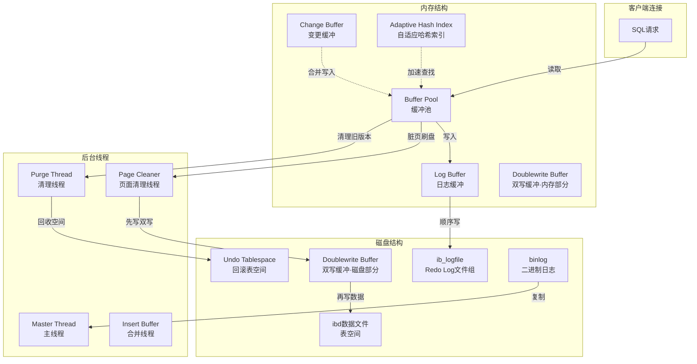
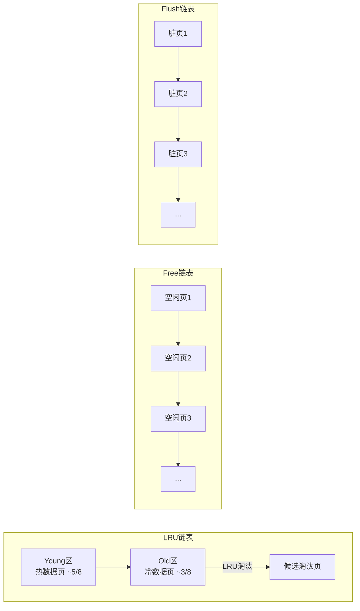
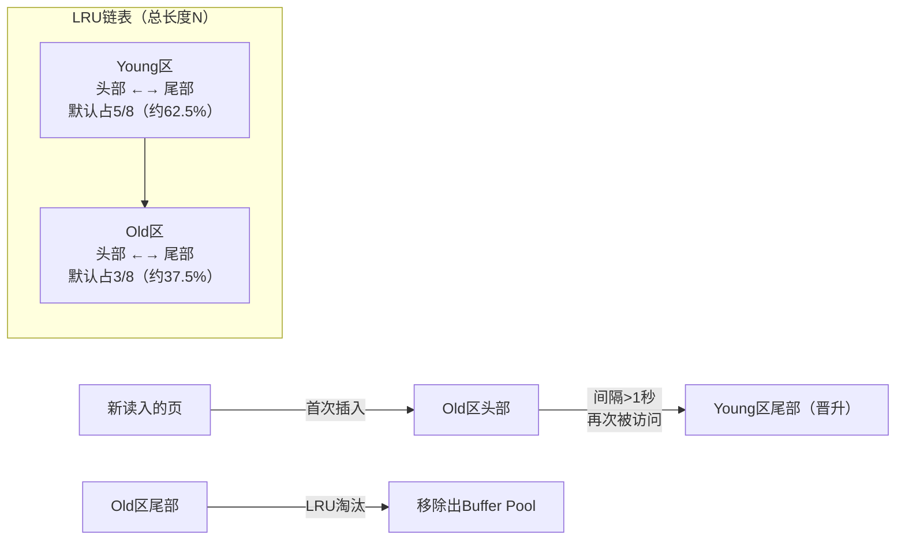
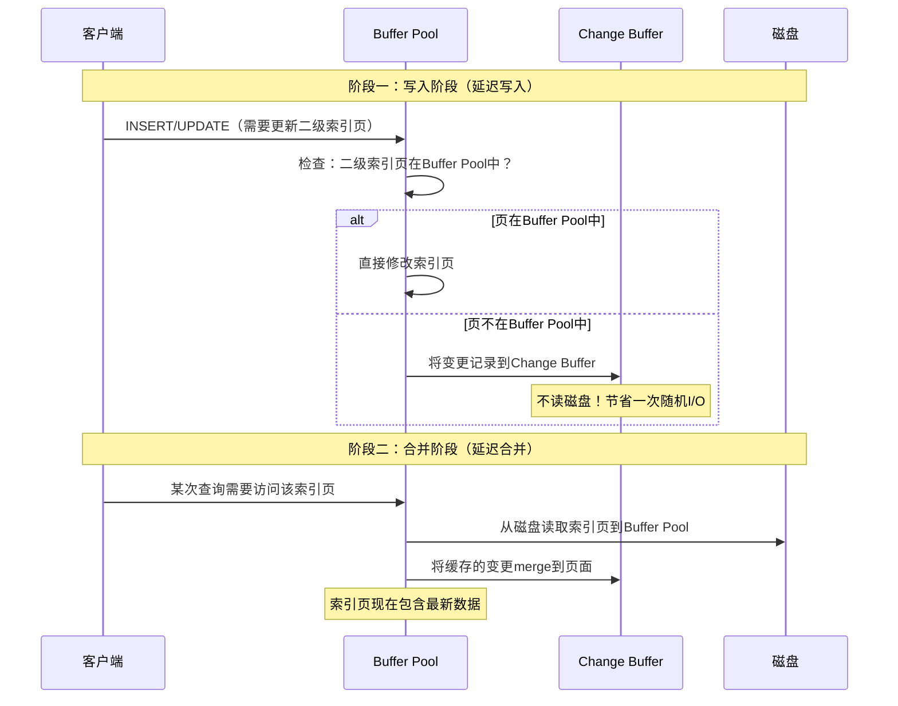
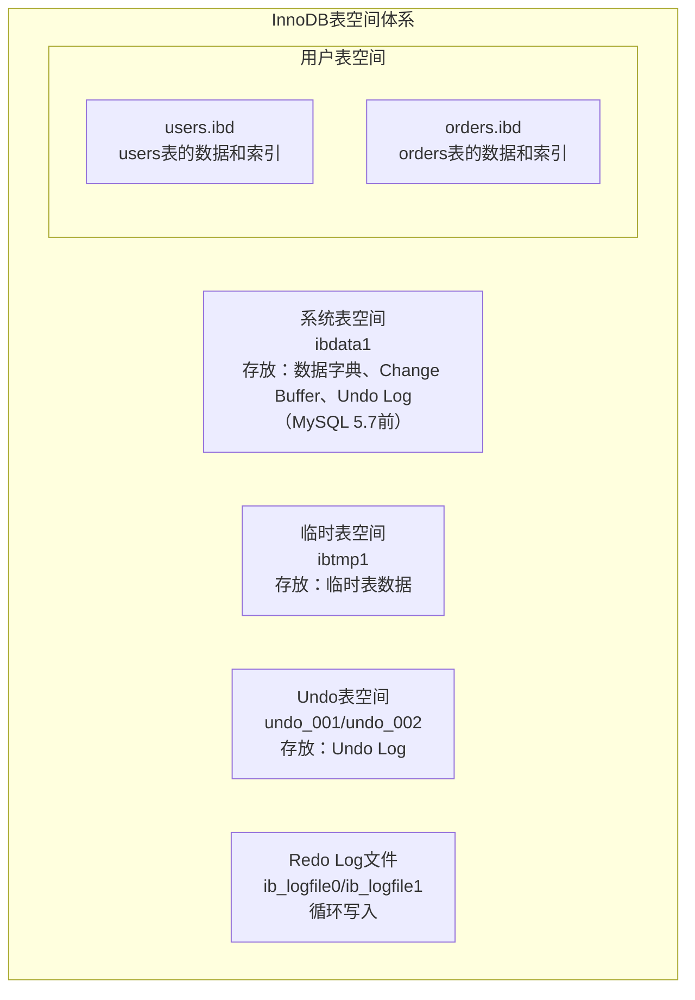
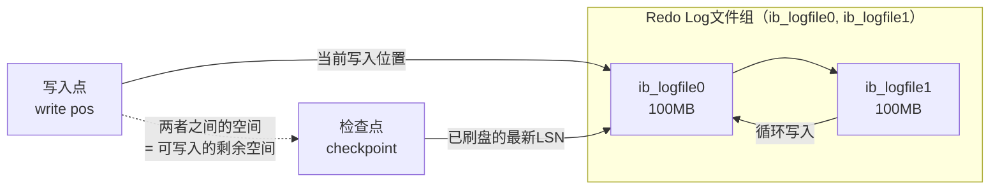
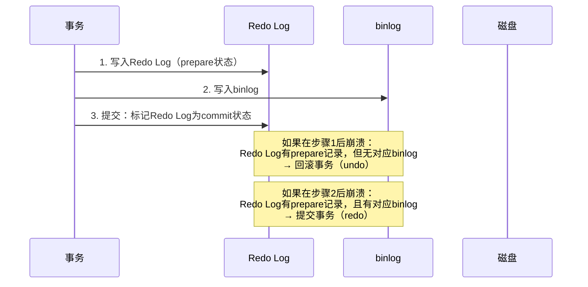
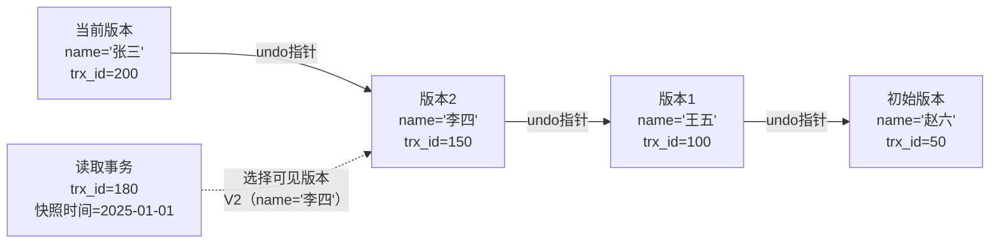
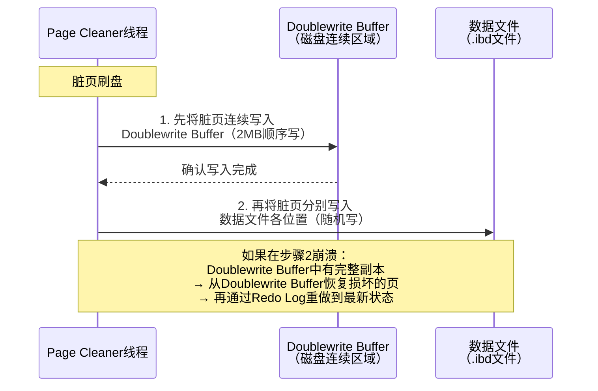
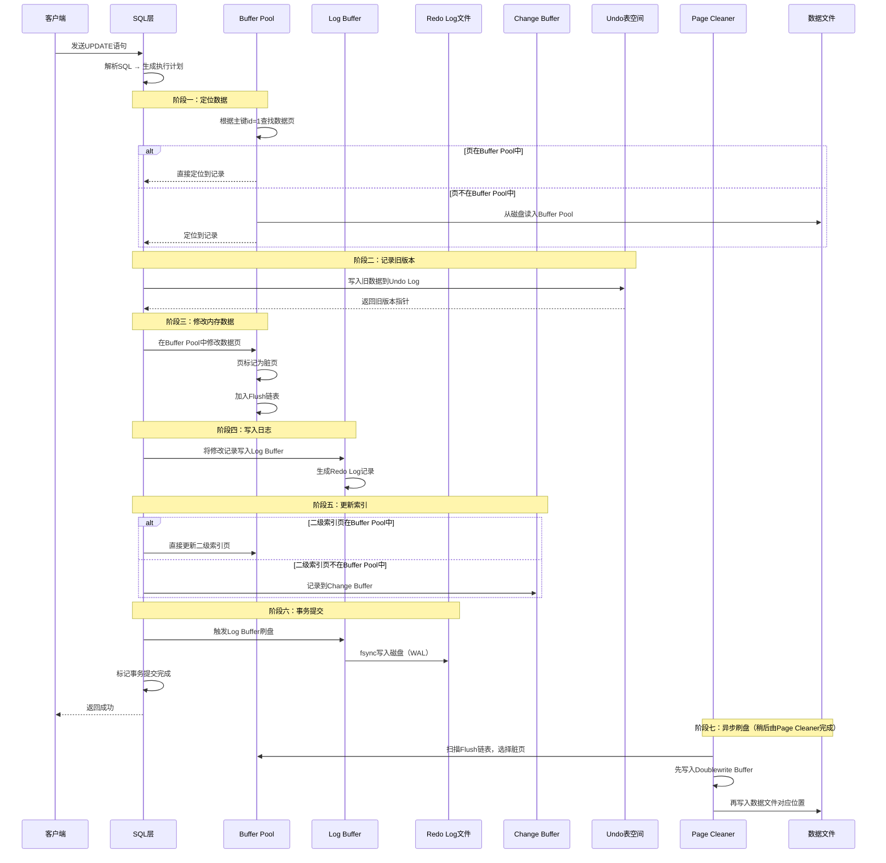

# 13.2 InnoDB存储引擎架构

InnoDB是MySQL的默认存储引擎，也是全球使用最广泛的OLTP存储引擎之一。自MySQL 5.5起InnoDB成为默认引擎以来，它几乎定义了MySQL数据库的能力边界——事务支持、行级锁、MVCC、崩溃恢复等核心特性都由InnoDB实现。

本节将深入剖析InnoDB的完整架构，涵盖**内存结构、磁盘结构、后台线程**三大模块，帮助读者从"会用MySQL"升级为"理解InnoDB为什么这样设计"。

---

## 13.2.1 InnoDB整体架构概览

InnoDB的架构可以用一句话概括：**在内存中缓存数据和索引，用日志保证持久性，用多版本实现并发控制**。



InnoDB的内存和磁盘结构可以归纳为四个核心子系统：

| 子系统 | 核心职责 | 关键机制 |
|--------|---------|---------|
| 缓冲池管理 | 缓存数据页和索引页，减少磁盘I/O | 三链表（LRU/Free/Flush）、改进LRU算法 |
| 日志系统 | 保证事务的持久性和崩溃恢复 | Redo Log（WAL）、Undo Log（MVCC+回滚） |
| 变更缓冲 | 优化二级索引的写入性能 | Change Buffer延迟合并 |
| 双写机制 | 防止部分页写入导致数据损坏 | Doublewrite Buffer |

---

## 13.2.2 内存结构

### 13.2.2.1 Buffer Pool（缓冲池）

Buffer Pool是InnoDB**最核心的内存结构**，也是性能调优的第一关注点。它的作用很简单：**将热点数据页缓存在内存中，避免每次读写都访问磁盘**。

一条数据修改语句（如 `UPDATE orders SET status='done' WHERE id=1`）的执行路径：

1. InnoDB先在Buffer Pool中查找id=1对应的数据页
2. 如果页在内存中（**缓存命中**），直接修改——微秒级
3. 如果页不在内存中（**缓存未命中**），从磁盘读入Buffer Pool，再修改——毫秒级
4. 修改后的页标记为**脏页**（dirty page），等待后续刷盘

**缓存命中率**是衡量Buffer Pool效率的核心指标。一个配置良好的生产系统，Buffer Pool命中率应保持在**99%以上**。命中率低于95%意味着频繁的磁盘I/O，系统性能会急剧下降。

#### 三链表机制

Buffer Pool内部使用三个双向链表来管理数据页，这是理解InnoDB内存管理的关键：



| 链表 | 作用 | 工作方式 |
|------|------|---------|
| **LRU链表** | 管理已加载的数据页，实现页面淘汰 | 按访问时间排序，淘汰最久未访问的页 |
| **Free链表** | 管理空闲页，快速分配新页 | 维护所有未使用的页，新读入的页从此链表分配 |
| **Flush链表** | 管理脏页，控制刷盘节奏 | 记录所有被修改但尚未写回磁盘的页 |

**三链表的协作流程**：当一个新的数据页需要被加载到Buffer Pool时，InnoDB先从Free链表取出一个空闲页，将磁盘数据读入该页，然后将该页加入LRU链表。当该页被修改后，它同时出现在Flush链表中。当Page Cleaner线程决定刷盘时，从Flush链表取出脏页写回磁盘，刷盘完成后将该页从Flush链表移除。

实际生产中，可以通过以下方式观察三链表的状态：

```sql
-- 查看Buffer Pool各链表的状态
SHOW ENGINE INNODB STATUS\G
-- 关注 BUFFER POOL AND MEMORY 部分：
--   Total memory allocated: Buffer Pool总内存
--   Buffer pool hit rate: 命中率（999 / 1000表示99.9%）
--   LRU len: LRU链表长度
--   Free buffers: Free链表长度
--   Modified db pages: Flush链表长度（脏页数）
```

#### 改进的LRU算法——Midpoint Insertion Strategy

传统的LRU算法有一个致命问题：**全表扫描会冲刷掉所有热点数据**。想象一下，你有一个10GB的Buffer Pool，里面全是精心缓存的热点数据。突然有人执行了一条 `SELECT * FROM huge_table`（全表扫描），如果不做任何保护，海量的新页面会把所有热点页挤出Buffer Pool，导致后续的热点查询全部缓存未命中，系统雪崩。

InnoDB的解决方案是**将LRU链表分为两个区域**：



**核心规则**：

1. 新页首次加载时，插入到**Old区的头部**（而非整个LRU链表的头部）
2. Old区的页如果被再次访问，只有在**距首次访问超过1秒**（由 `innodb_old_blocks_time` 控制）后，才会被"晋升"到Young区
3. 如果新页在1秒内被多次访问（典型的全表扫描模式），它们不会晋升，最终从Old区尾部被淘汰

这个设计的精妙之处在于：全表扫描产生的大量新页全部停留在Old区，不会污染Young区的热点数据。一旦扫描结束，这些页自然从Old区尾部被淘汰。1秒的时间窗口恰好覆盖了"真正有价值的重复访问"和"全表扫描的批量访问"之间的差异。

**为什么是5/8和3/8的比例？** 这个比例来自InnoDB的默认配置 `innodb_old_blocks_pct=37`（即Old区占37%，Young区占63%）。比例的选择基于经验数据：OLTP场景中，热点数据通常占总工作集的60-70%，37%的Old区足以容纳一次全表扫描产生的临时页，而不会挤占过多的Young区空间。

#### Buffer Pool多实例

在高并发场景下，单个Buffer Pool实例可能成为瓶颈——多个线程同时访问同一个链表需要加锁。InnoDB支持将Buffer Pool拆分为多个实例：

| 参数 | 含义 | 建议值 |
|------|------|--------|
| `innodb_buffer_pool_size` | Buffer Pool总大小 | 物理内存的60%-80%（独占服务器） |
| `innodb_buffer_pool_instances` | Buffer Pool实例数 | 每个实例至少1GB；总内存<1GB时设为1 |
| `innodb_old_blocks_pct` | Old区占LRU链表的比例 | 37（默认，一般不需调整） |
| `innodb_old_blocks_time` | Old区页晋升到Young区的最小间隔 | 1000ms（默认） |

**分配规则**：每个实例独立维护自己的LRU链表、Free链表和Flush链表。一个数据页只会被缓存在一个实例中。实例数建议设为**CPU核心数的1/2到1/4**，且每个实例至少分配1GB内存。当总内存为64GB时，8个实例（每个8GB）是合理配置。

**运行时动态调整**：MySQL 5.7+支持在线调整Buffer Pool大小，无需重启：

```sql
-- 在线调整Buffer Pool大小（单位字节）
SET GLOBAL innodb_buffer_pool_size = 8589934592;  -- 8GB

-- 查看调整进度
SHOW STATUS LIKE 'Innodb_buffer_pool_resize_status';
-- 输出示例: "Completed to resize at byte 8589934592."
```

调整过程中，InnoDB会分批迁移页面到新实例，不会阻塞正常业务。但频繁调整仍有一定开销，建议一次性设好目标值。

#### Buffer Pool预热与恢复

MySQL重启后Buffer Pool是空的，所有查询都需要从磁盘加载数据，这个过程称为**冷启动**。对于OLTP系统，冷启动期间的性能可能比正常值差10倍以上。

InnoDB提供了两种预热机制：

**1. Dump/Load机制**（`innodb_buffer_pool_dump_at_shutdown` / `innodb_buffer_pool_load_at_startup`）

关闭MySQL时，InnoDB将Buffer Pool中**最热的页面列表**（默认最近300秒内访问过的页的space和page编号）导出到磁盘文件 `ib_buffer_pool`。启动时自动加载这些页面。

```sql
# 关闭时导出（默认开启）
SET GLOBAL innodb_buffer_pool_dump_at_shutdown = ON;
SET GLOBAL innodb_buffer_pool_dump_pct = 25;  # 导出最热的25%的页

# 启动时加载（默认开启）
SET GLOBAL innodb_buffer_pool_load_at_startup = ON;

# 运行时手动触发
SET GLOBAL innodb_buffer_pool_dump_now = ON;
SET GLOBAL innodb_buffer_pool_load_now = ON;

# 查看加载进度
SHOW STATUS LIKE 'Innodb_buffer_pool_load_status';
```

**2. 预热脚本**

对于关键业务表，可以在启动后执行查询将数据预加载到Buffer Pool：

```sql
-- 预加载关键表的索引和数据到Buffer Pool
SELECT COUNT(*) FROM hot_orders USE INDEX (idx_status_date);
SELECT COUNT(*) FROM hot_customers USE INDEX (idx_phone);
```

**预热效果评估**：可以通过对比 `SHOW GLOBAL STATUS LIKE 'Innodb_buffer_pool_read_requests'` 在冷启动前后的增量来评估预热效果。通常，完成预热后物理读（`Innodb_buffer_pool_reads`）的增速应显著放缓。

#### Buffer Pool核心监控指标

```sql
-- 查看Buffer Pool整体状态
SHOW ENGINE INNODB STATUS\G

-- 关键指标
SHOW GLOBAL STATUS LIKE 'Innodb_buffer_pool_%';
```

| 指标 | 含义 | 健康值 |
|------|------|--------|
| `Innodb_buffer_pool_read_requests` | 逻辑读取次数（从Buffer Pool读） | 越高越好 |
| `Innodb_buffer_pool_reads` | 物理读取次数（从磁盘读） | 越低越好 |
| `Innodb_buffer_pool_pages_total` | Buffer Pool总页数 | = buffer_pool_size / 16KB |
| `Innodb_buffer_pool_pages_dirty` | 脏页数量 | < 总页数的25% |
| `Innodb_buffer_pool_pages_free` | 空闲页数量 | > 0（长期为0说明需要扩容） |
| `Innodb_buffer_pool_wait_free` | 等待空闲页的次数 | 应为0 |
| `Innodb_buffer_pool_read_ahead` | 预读次数 | 正常波动 |
| `Innodb_buffer_pool_read_ahead_evicted` | 预读后被淘汰的页数 | 应远小于read_ahead |

**命中率计算公式**：

命中率 = 1 - (Innodb_buffer_pool_reads / Innodb_buffer_pool_read_requests) × 100%

**预读效率公式**：

预读效率 = 1 - (Innodb_buffer_pool_read_ahead_evicted / Innodb_buffer_pool_read_ahead) × 100%

当预读效率过低时，说明预读机制引入了大量"无用读取"，可以通过 `SET GLOBAL innodb_read_ahead_threshold = 0` 关闭预读，或通过 `innodb_read_ahead_threshold`（默认56，范围0-64）调高预读触发门槛。

当命中率低于95%时，应该考虑增大 `innodb_buffer_pool_size` 或优化查询以减少全表扫描。

---

### 13.2.2.2 Change Buffer（变更缓冲）

Change Buffer用于优化**非唯一二级索引**的写入性能。它的核心思想是：**当修改二级索引页时，如果该页不在Buffer Pool中，不立即从磁盘读取，而是将变更缓存在内存中，延迟合并**。

#### 为什么只对非唯一索引有效？

对于**唯一索引**，InnoDB必须立即读取索引页来判断是否存在冲突（违反唯一性约束），所以无法使用Change Buffer。对于**非唯一二级索引**，不需要判断唯一性，因此可以安全地延迟写入。

#### 工作原理



#### Change Buffer的操作类型

InnoDB会根据操作类型将Change Buffer中的记录分为几种：

| 操作类型 | 说明 |
|---------|------|
| `IBUF_OP_DELETE_MARK` | 标记删除（DELETE操作） |
| `IBUF_OP_DELETE` | 物理删除 |
| `IBUF_OP_INSERT` | 插入记录 |
| `IBUF_OP_PURGE` | 清理已删除的记录 |

#### merge触发时机

Change Buffer中的变更不会永远留在内存中，以下情况会触发merge（合并）：

1. **读取触发**：当该索引页被其他查询加载到Buffer Pool时，自动merge。这是最常见的merge方式
2. **后台合并**：Master Thread定期触发merge（每秒或每10秒），将积累的变更逐步合并到磁盘
3. **缓冲池空间不足**：当Buffer Pool空间紧张时，Change Buffer占用的内存会被优先清理——此时会强制merge
4. **数据库关闭**：正常关闭时，所有Change Buffer中的变更会被写回磁盘

**Change Buffer与写入放大**：假设一次批量INSERT操作涉及1000行数据，如果这些行对应的二级索引页都不在Buffer Pool中，启用Change Buffer后只需写1000条变更记录到内存（顺序写），而非读取1000个索引页+写入1000个索引页（1000次随机I/O）。性能差距可达10-100倍。

#### 监控Change Buffer

```sql
SHOW ENGINE INNODB STATUS\G
-- 查看 INSERT BUFFER AND ADAPTIVE HASH INDEX 部分

SHOW GLOBAL STATUS LIKE 'Innodb_ibuf_%';
```

| 指标 | 含义 |
|------|------|
| `Innodb_ibuf_size` | Change Buffer当前大小（页数） |
| `Innodb_ibuf_free_len` | Change Buffer空闲空间大小 |
| `Innodb_ibuf_merges` | 已执行的merge次数 |
| `Innodb_ibuf_merged` | 已合并的记录数 |

**调优建议**：如果 `Innodb_ibuf_merges` 增长缓慢但 `Innodb_ibuf_size` 持续增长，说明merge速度跟不上写入速度。可以通过增大Buffer Pool或减少二级索引数量来缓解。`innodb_change_buffer_max_size`（默认25%，即Buffer Pool的25%）控制Change Buffer的最大内存占用。

---

### 13.2.2.3 Adaptive Hash Index（自适应哈希索引）

InnoDB会监控对Buffer Pool中索引页的查询模式。如果某些索引值被频繁等值查询（如 `WHERE user_id = 12345`），InnoDB会自动为这些热数据构建**哈希索引**，将B-tree的O(log N)查找优化为哈希的O(1)查找。

**触发条件**：当InnoDB检测到某个索引页被连续访问超过**18次**（由 `innodb_adaptive_hash_index` 控制），且以该页中某个索引前缀为条件的等值查询连续命中**100次**以上，就会触发自适应哈希索引的构建。

**MySQL 8.0的改进——AHI分区**：MySQL 8.0将AHI拆分为多个分区（默认8个），每个分区有独立的锁。在高并发等值查询场景下，分区AHI减少了锁竞争，吞吐量提升显著（官方测试提升约2倍）。

**注意事项**：

- AHI是完全自动的，无需手动配置
- 在只读或高并发等值查询场景下效果显著（可提升查询速度5-50倍）
- 在写密集或复杂查询场景下，AHI的维护反而会成为负担，建议关闭（`SET GLOBAL innodb_adaptive_hash_index = OFF`）
- 可以通过 `SHOW ENGINE INNODB STATUS` 的 `HASH TABLES` 部分查看AHI状态

```sql
-- 查看AHI的分区状态
SHOW ENGINE INNODB STATUS\G
-- 关注 INSERT BUFFER AND ADAPTIVE HASH INDEX 部分
-- hash searches/s, non-hash searches/s 两个指标
-- 当 hash searches 明显高于 non-hash searches 时，AHI效果显著

-- 禁用AHI（写密集场景建议）
SET GLOBAL innodb_adaptive_hash_index = OFF;

-- 调整AHI敏感度（默认3，值越小越敏感）
SET GLOBAL innodb_adaptive_hash_index_parts = 8;  -- MySQL 8.0分区数
```

---

### 13.2.2.4 Log Buffer（日志缓冲）

Log Buffer是Redo Log在内存中的缓冲区，用于暂存尚未写入磁盘的Redo Log记录。

| 参数 | 含义 | 建议值 |
|------|------|--------|
| `innodb_log_buffer_size` | 日志缓冲区大小 | 16MB-64MB（默认16MB） |

**刷盘策略**（由 `innodb_flush_log_at_trx_commit` 控制）：

| 值 | 行为 | 安全性 | 性能 |
|----|------|--------|------|
| 0 | 每秒将Log Buffer刷到磁盘 | 最低（可能丢失1秒数据） | 最高 |
| 1 | 每次事务提交都刷到磁盘（默认） | 最高（零数据丢失） | 最低 |
| 2 | 每次事务提交写入OS缓存，每秒fsync | 操作系统崩溃时可能丢失1秒 | 中等 |

**生产建议**：对于要求零数据丢失的金融类系统，必须设置为1。对于允许少量数据丢失的业务（如日志系统），设置为2可以在性能和安全之间取得平衡。设置为0在生产环境中几乎不推荐。

**Log Buffer大小选择原则**：对于大事务（如批量UPDATE、大表DDL），较小的Log Buffer会导致频繁的Log Buffer flush，影响性能。可以通过 `SHOW GLOBAL STATUS LIKE 'Innodb_log_waits'` 检查是否出现Log Buffer等待——如果该值大于0，说明Log Buffer太小，应增大 `innodb_log_buffer_size`。

---

## 13.2.3 磁盘结构

### 13.2.3.1 表空间（Tablespace）

InnoDB的数据在磁盘上以**表空间**为单位组织。每个表空间由一个或多个数据文件组成，内部按**页（Page）**划分，页大小默认16KB。



| 表空间类型 | 文件 | 内容 |
|-----------|------|------|
| 系统表空间 | `ibdata1` | 数据字典、双写缓冲（5.7之前）、Change Buffer、Undo Log（5.7之前） |
| 独立表空间 | `*.ibd` | 每个表的数据页、索引页、插入缓冲位图、自适应哈希索引 |
| 临时表空间 | `ibtmp1` | 临时表的数据和索引 |
| Undo表空间 | `undo_00N` | 事务回滚所需的旧版本数据 |
| Redo Log | `ib_logfile*` | 崩溃恢复所需的重做日志 |

**独立表空间的优势**：MySQL 5.6+默认开启 `innodb_file_per_table=ON`，每个表的数据存储在独立的 `.ibd` 文件中。优势包括：便于单表备份恢复、删除大表时直接删除文件（高效回收空间）、减少系统表空间的IO竞争。

#### 数据页结构

InnoDB的数据页（16KB）内部有严格的结构：

+-----------------------------+
| File Header (38字节)        | ← 页的通用信息（页号、页类型、LSN、校验和）
+-----------------------------+
| Page Header (56字节)        | ← 数据页专有信息（记录数、空闲空间位置、槽数）
+-----------------------------+
| Infimum + Supremum (26字节) | ← 页内记录的边界标记（最小/最大伪记录）
+-----------------------------+
| User Records (用户记录)     | ← 实际的数据行（按主键顺序排列）
+-----------------------------+
| Free Space (空闲空间)       | ← 尚未使用的空间
+-----------------------------+
| Page Directory (槽数组)     | ← 记录槽（每4-8个记录一个槽，支持二分查找）
+-----------------------------+
| File Trailer (8字节)        | ← 页尾校验（与File Header配对，检测部分写）
+-----------------------------+

**File Header中的关键字段**：

| 字段 | 偏移 | 大小 | 说明 |
|------|------|------|------|
| `FIL_PAGE_SPACE_OR_CHKSUM` | 0 | 4字节 | 页号（或校验和，取决于版本） |
| `FIL_PAGE_OFFSET` | 4 | 4字节 | 页在表空间内的偏移 |
| `FIL_PAGE_PREV` | 12 | 4字节 | 上一页页号（B+树链表） |
| `FIL_PAGE_NEXT` | 16 | 4字节 | 下一页页号（B+树链表） |
| `FIL_PAGE_LSN` | 24 | 8字节 | 最后修改该页的LSN |
| `FIL_PAGE_TYPE` | 32 | 2字节 | 页类型（0x45BF=数据页，0x0002=Undo页） |

**页的组织方式**：

- 页内的数据行通过**单链表**串联（按主键顺序）
- **Page Directory**中的槽（Slot）指向每组记录的第一条，支持在页内进行**二分查找**
- 每个槽覆盖4-8条记录，因此页内查找的时间复杂度为O(log N)

InnoDB使用B+树组织索引页，B+树的叶子节点通过**双向链表**相连，支持高效的范围查询。

#### InnoDB页校验和

InnoDB使用校验和（Checksum）来检测页是否在写入过程中损坏。MySQL 8.0默认使用**CRC32**算法（性能优于旧版的InnoDB Checksum算法），校验计算发生在每次读取页时：

- 如果校验和匹配，页数据有效
- 如果校验和不匹配，InnoDB会从Doublewrite Buffer中恢复该页

```sql
-- 查看当前校验和算法
SHOW VARIABLES LIKE 'innodb_checksum_algorithm';
-- crc32（默认，推荐）或 innodb（旧算法）

-- 启动时重新计算所有页的校验和（用于迁移或验证）
ALTER INSTANCE DISABLE INNODB REDO_LOG;  -- MySQL 8.0.21+
-- 注意：此操作需要谨慎，会临时禁用Redo Log
```

---

### 13.2.3.2 Redo Log（重做日志）

Redo Log是InnoDB保证**持久性（Durability）**的核心机制。它采用WAL（Write-Ahead Logging）策略：**先写日志，再写数据**。

#### 为什么需要Redo Log？

InnoDB修改数据时，并不是立即把修改后的数据页写回磁盘。原因有两个：

1. **性能**：数据页的修改发生在Buffer Pool中（内存），而数据页在磁盘上是随机分布的，随机写比顺序写慢100-1000倍
2. **原子性**：一个事务可能涉及多个数据页的修改，如果只写了一部分就崩溃，数据就不一致了

Redo Log通过顺序写入解决了这两个问题：先把所有修改记录以**顺序写**的方式追加到日志文件中，再在合适的时机将数据页写回磁盘。如果崩溃时数据页尚未写完，重启后通过Redo Log重做（Redo）已提交事务的所有修改，恢复数据一致性。

#### Redo Log的文件组织

**MySQL 5.7** 的Redo Log以**循环写入**的方式管理，典型配置包含两个或多个日志文件：



| 参数 | 含义 | 建议值 |
|------|------|--------|
| `innodb_log_file_size` | 单个Redo Log文件大小 | 1GB-4GB（MySQL 5.7），8GB-16GB（MySQL 8.0） |
| `innodb_log_files_in_group` | Redo Log文件数量 | 2（MySQL 8.0已移除此参数，改为单个文件） |
| `innodb_log_group_home_dir` | Redo Log文件目录 | 与数据目录一致 |

**关键限制**：Redo Log总大小决定了崩溃恢复的最长时间和可以"堆积"的最大脏页量。如果Redo Log太小，会导致频繁的Checkpoint，产生磁盘写入风暴（"刷盘风暴"）。如果太大，崩溃恢复时间会变长。

**MySQL 8.0.30+的重大变化**：MySQL 8.0.30将Redo Log从多个固定大小的文件改为**单一动态大小的日志文件**，存储在 `#innodb_redo/` 目录下：

```sql
-- MySQL 8.0.30+ 使用统一参数控制Redo Log总大小
SET GLOBAL innodb_redo_log_capacity = 4294967296;  -- 4GB

-- 旧参数（8.0.30前）
-- innodb_log_file_size × innodb_log_files_in_group = 总大小
-- 例如：1GB × 2 = 2GB

-- 查看当前Redo Log状态（8.0.30+）
SHOW ENGINE INNODB STATUS\G
-- 关注 LOG 部分
SELECT * FROM performance_schema.innodb_redo_log_files;
```

#### LSN（Log Sequence Number）

LSN是InnoDB内部的一个**单调递增的64位整数**，表示Redo Log写入的字节偏移量。它是理解InnoDB日志机制的核心概念：

| LSN术语 | 含义 | 重要性 |
|---------|------|--------|
| `log_lsn` | Log Buffer中最新的LSN | 当前写入位置 |
| `flushed_to_disk_lsn` | 已刷到磁盘的最新LSN | 表示持久化的最新位置 |
| `checkpoint_lsn` | 已Checkpoint的LSN（脏页已刷盘） | 比此LSN更早的日志对应的脏页已安全写入磁盘 |
| `last_checkpoint_lsn` | 上次Checkpoint的LSN | 与checkpoint_lsn配合使用 |

**LSN的应用场景**：

- **崩溃恢复**：InnoDB启动时，找到最后一个Checkpoint的LSN，从该位置开始重放Redo Log直到日志末尾
- **判断脏页是否安全**：只有LSN小于checkpoint_lsn的脏页才能被覆盖
- **计算Redo Log剩余空间**：write_pos和checkpoint_lsn之间的距离
- **主从同步验证**：通过对比主从的LSN可以判断复制是否追上

```sql
-- 查看当前LSN信息
SHOW ENGINE INNODB STATUS\G
-- 关注 LOG 部分的 Log sequence number 和 Last checkpoint at

SHOW GLOBAL STATUS LIKE 'Innodb_os_log%';
-- Innodb_os_log_fsyncs: fsync次数
-- Innodb_os_log_written: 写入字节数

-- 计算Redo Log使用率（8.0.30+）
-- Redo Log已使用百分比 = (当前LSN - checkpointLSN) / innodb_redo_log_capacity × 100%
```

**LSN增长过快的排查**：如果发现 `log_lsn` 和 `checkpoint_lsn` 之间的差距持续增大（接近Redo Log总大小），说明脏页刷盘速度跟不上日志写入速度。此时会出现"checkpoint落后"告警，可能导致写入阻塞。解决方案：增大Buffer Pool、减少脏页比例阈值、优化大事务。

#### 两阶段提交（Two-Phase Commit）

Redo Log与binlog的**两阶段提交**是保证主从一致性的关键机制：



**为什么需要两阶段提交？**

如果Redo Log和binlog不是原子性地写入，可能出现：

- **先写binlog再写Redo Log**：Redo Log写入前崩溃，binlog已记录→主从不一致（从库多了数据）
- **先写Redo Log再写binlog**：binlog写入前崩溃，Redo Log已记录→主从不一致（主库有数据，从库没有）

两阶段提交通过"prepare + commit"状态标记，使得崩溃恢复时可以根据binlog是否完整来决定是提交还是回滚，保证主从一致性。

**Group Commit优化**：两阶段提交中，每次事务提交都会触发一次fsync（将Redo Log刷到磁盘）。在高并发场景下，频繁fsync会成为性能瓶颈。InnoDB通过**Group Commit**将多个事务的fsync合并为一次，显著减少了磁盘I/O次数：

事务A提交 → Redo Log写入OS缓存
事务B提交 → Redo Log写入OS缓存
事务C提交 → Redo Log写入OS缓存
            ↓ 合并为一次fsync
            三个事务的Redo Log同时落盘

---

### 13.2.3.3 Undo Log（回滚日志）

Undo Log有两大核心职责：**事务回滚**和**MVCC（多版本并发控制）**。

#### 事务回滚

当事务需要回滚时（主动 `ROLLBACK` 或异常终止），InnoDB通过Undo Log将数据恢复到修改前的状态。每种DML操作都有对应的Undo Log类型：

| 操作类型 | Undo Log内容 | 示例 |
|---------|-------------|------|
| INSERT | 记录主键值（回滚时删除该行） | `INSERT INTO t(id) VALUES(5)` → 记录 id=5 |
| DELETE | 记录被删除行的完整数据（回滚时重新插入） | `DELETE FROM t WHERE id=5` → 记录整行数据 |
| UPDATE | 记录修改前的列值（回滚时恢复旧值） | `UPDATE t SET name='x' WHERE id=5` → 记录旧name值 |

**Undo Log的空间管理**：Undo Log不仅服务于回滚，还服务于MVCC。因此，即使事务已提交，其Undo Log可能仍然被其他正在读取的事务所需。只有当没有任何事务需要读取某个旧版本时，该Undo Log才能被Purge线程清理。这就是为什么长事务会导致Undo Log膨胀的根本原因。

#### MVCC版本链

MVCC是InnoDB实现高并发读写的核心技术。每次UPDATE操作，旧版本的数据通过Undo Log链接成一个**版本链**：



**ReadView（读视图）** 决定版本链中哪个版本对当前事务可见：

- **Read Committed**：每次SELECT都生成新的ReadView，所以能读到其他事务已提交的最新数据
- **Repeatable Read**（InnoDB默认）：事务中第一次SELECT生成ReadView，后续复用，保证整个事务期间的读取一致性

**ReadView的核心字段**：

| 字段 | 含义 |
|------|------|
| `m_ids` | 创建ReadView时所有活跃（未提交）事务的ID列表 |
| `min_trx_id` | 活跃事务中最小的事务ID |
| `max_trx_id` | 下一个将被分配的事务ID |
| `creator_trx_id` | 创建该ReadView的事务ID |

**可见性判断规则**：版本链中某版本的 `trx_id`，如果：
- 等于 `creator_trx_id` → 可见（自己的修改）
- 小于 `min_trx_id` → 可见（事务已提交）
- 大于等于 `max_trx_id` → 不可见（事务在ReadView之后创建）
- 在 `m_ids` 中 → 不可见（事务未提交）
- 不在 `m_ids` 中 → 可见（事务已提交）

**MVCC的代价——幻读问题**：InnoDB在Repeatable Read隔离级别下，通过**Next-Key Lock**（Record Lock + Gap Lock）在很大程度上解决了幻读。但在特定条件下（如先快照读再当前读），仍可能出现幻读现象。这是MVCC与锁机制交互的边界情况，在后续"锁机制"小节中详细讨论。

**长事务检测与处理**：

```sql
-- 查找所有运行时间超过60秒的事务
SELECT trx_id, trx_state, trx_started,
       TIMESTAMPDIFF(SECOND, trx_started, NOW()) AS duration_sec,
       trx_query
FROM information_schema.innodb_trx
WHERE TIMESTAMPDIFF(SECOND, trx_started, NOW()) > 60
ORDER BY trx_started;

-- 长事务的危害：
-- 1. Undo Log无法被清理 → 表空间膨胀
-- 2. 版本链变长 → 查询性能下降
-- 3. 锁持有时间长 → 阻塞其他事务
```

---

### 13.2.3.4 Doublewrite Buffer（双写缓冲）

#### 部分写问题

InnoDB的数据页大小为16KB，而操作系统的文件系统块（block）通常为4KB。如果在将脏页写入磁盘的过程中发生崩溃（断电或OS宕机），可能只写入了页的一部分（如前4KB写完，后12KB没写），这就是**部分写（Partial Write）**问题。

对于Redo Log来说，部分写不是问题——因为日志记录通常远小于一个块大小（16KB），且有页尾校验。但对于数据页，部分写意味着页的内容损坏，而Redo Log无法修复一个根本不完整的页。

#### 双写机制

Doublewrite Buffer通过**先写备份、再写数据**的方式解决部分写问题：



**性能影响**：Doublewrite Buffer将脏页写入操作**翻倍**（先写备份再写数据），这在SSD时代带来了一定的性能开销。MySQL 8.0.20+在支持原子写的存储设备（如NVM、支持原子写的SSD）上可以自动禁用Doublewrite Buffer。

```sql
-- 查看Doublewrite状态
SHOW GLOBAL STATUS LIKE 'Innodb_dblwr%';
-- Innodb_dblwr_writes: 双写写入次数
-- Innodb_dblwr_pages_written: 双写页数量

-- MySQL 8.0.20+：如果硬件支持原子写，可禁用双写
SET GLOBAL innodb_doublewrite = OFF;  -- 仅在确认硬件支持时使用
```

**双写的两阶段写入**：Doublewrite Buffer本身也是两阶段写入——先将脏页写入连续的磁盘区域（顺序写，2MB一批），确认写入完成后，再将每个页分别写入对应的数据文件位置（随机写）。如果在第二阶段崩溃，恢复过程为：从Doublewrite Buffer读取完整页 → 覆盖损坏的页 → 通过Redo Log重做到最新状态。

---

### 13.2.3.5 Undo Tablespace（Undo表空间）

Undo表空间存储Undo Log数据。MySQL 8.0引入了独立的Undo表空间（默认 `undo_001` 和 `undo_002`），不再像5.7之前那样存储在系统表空间中。

**Undo Log的清理**：已不再被任何活跃事务读取的旧版本数据，可以通过 **Purge** 操作回收。MySQL 8.0支持Undo表空间的**自动截断**（`innodb_undo_log_truncate=ON`），当Undo表空间超过 `innodb_max_undo_log_size`（默认1GB）时自动清理。

**Undo表空间监控**：

```sql
-- 查看Undo表空间使用情况
SELECT NAME, FILE_SIZE, ALLOCATED_SIZE
FROM information_schema.FILES
WHERE FILE_TYPE = 'UNDO LOG';

-- 查看Purge线程状态
SHOW GLOBAL STATUS LIKE 'Innodb_purge_trx%';
-- Innodb_purge_trxHistoryLen: 等待清理的历史记录数
-- 该值长期偏大说明Purge线程跟不上清理速度
```

**Undo Log膨胀的常见原因与处理**：

| 原因 | 现象 | 解决方案 |
|------|------|---------|
| 长事务 | `information_schema.innodb_trx` 中事务持续时间>60s | 优化应用代码，缩短事务时间 |
| 大批量更新 | 一次UPDATE影响数十万行 | 分批提交，每批1000-5000行 |
| Purge线程不足 | `Innodb_purge_trxHistoryLen` 持续增长 | 增加 `innodb_purge_threads`（默认4，最大12） |

---

## 13.2.4 后台线程

InnoDB的后台线程负责处理内存与磁盘之间的数据同步、日志管理、空间回收等任务：

| 线程 | 数量 | 职责 |
|------|------|------|
| **Master Thread** | 1 | 协调各后台线程的运行节奏（刷脏页、合并Change Buffer、刷日志等） |
| **Page Cleaner Thread** | 1+ | 将Buffer Pool中的脏页刷写到磁盘，支持多线程并行刷盘 |
| **Purge Thread** | 1-12 | 回收已提交事务的Undo Log，清理MVCC不再需要的旧版本 |
| **Insert Buffer Thread** | 1 | 合并Change Buffer中的变更到二级索引页 |
| **Log Thread** | 1+ | 将Log Buffer中的Redo Log写入磁盘 |
| **Read/Write I/O Thread** | 各4-8 | 异步读写磁盘页 |

#### Page Cleaner线程详解

Page Cleaner是MySQL 5.6引入的独立线程，从Master Thread中分离出来专门负责脏页刷盘，使主线程更专注于事务处理。

**刷脏页的触发条件**：

1. **脏页比例超过阈值**：`innodb_max_dirty_pages_pct_lwm`（低水位，默认10%）触发刷新，`innodb_max_dirty_pages_pct`（高水位，默认90%）强制刷新
2. **Redo Log写满**：当write_pos追上checkpoint，必须立即刷脏页以推进checkpoint
3. **自适应刷盘**：InnoDB根据Redo Log的写入速度和脏页比例，自动计算刷盘频率
4. **LRU链表需要回收**：当Free链表为空且没有可回收的压缩页时，必须刷脏页

**刷盘算法（Page Cleaner Algorithm）**：InnoDB采用**自适应刷新策略**，根据以下因素动态调整刷盘速度：

目标：使Redo Log的写入速度 < 脏页的刷盘速度
      → 避免Redo Log被写满
      → 避免刷盘风暴

**多线程并行刷盘**：MySQL 5.7+支持多个Page Cleaner线程并行刷脏页，由 `innodb_page_cleaners`（默认4）控制。在高写入压力场景下，增加Page Cleaner线程数可以有效缓解"刷盘瓶颈"：

```sql
-- 查看Page Cleaner线程状态
SHOW GLOBAL STATUS LIKE 'Innodb_page_cleaners';
SHOW GLOBAL STATUS LIKE 'Innodb_buffer_pool_pages_dirty';

-- 调整并行刷盘线程数
SET GLOBAL innodb_page_cleaners = 8;  -- 需要重启生效（MySQL 5.7）
-- MySQL 8.0支持在线调整
```

**刷盘风暴的识别与避免**：当InnoDB发现Redo Log即将写满时，会强制刷大量脏页，这就是"刷盘风暴"。表现为：磁盘I/O飙升、响应时间暴增、TPS骤降。避免方法：适当增大Redo Log文件大小、降低 `innodb_max_dirty_pages_pct` 让脏页提前开始刷盘、优化大事务减少日志写入量。

---

## 13.2.5 一个完整事务的InnoDB内部旅程

以一条 `UPDATE` 语句为例，展示InnoDB各组件的协作流程：

```sql
UPDATE accounts SET balance = balance - 100 WHERE id = 1;
```



**关键时间线**：

| 阶段 | 操作 | 耗时量级 | 持久性保证 |
|------|------|---------|-----------|
| 定位数据 | 查找Buffer Pool | 微秒级（命中）/ 毫秒级（未命中） | - |
| 记录旧版本 | 写入Undo Log | 微秒级 | 与Redo Log一起持久化 |
| 修改内存 | 标记脏页 | 微秒级 | 内存中，尚未持久化 |
| 写入日志 | Log Buffer → 磁盘 | 毫秒级（含fsync） | ✅ 已提交事务持久化 |
| 异步刷盘 | Page Cleaner写磁盘 | 毫秒级 | ✅ 最终一致 |

**性能分析要点**：从上表可以看出，事务提交的延迟主要由"写入日志"阶段决定（含fsync），这解释了为什么 `innodb_flush_log_at_trx_commit=1` 会成为写入瓶颈——每个事务提交都必须等待fsync完成。Group Commit的优化目标就是合并多次fsync，降低平均延迟。

---

## 13.2.6 核心参数配置速查

| 分类 | 参数名 | 默认值 | 说明 | 生产建议 |
|------|--------|--------|------|---------|
| **Buffer Pool** | `innodb_buffer_pool_size` | 128MB | 缓冲池总大小 | 物理内存的60-80% |
| | `innodb_buffer_pool_instances` | 8 | 缓冲池实例数 | 每个实例≥1GB |
| | `innodb_old_blocks_pct` | 37 | Old区占比（%） | 默认即可 |
| | `innodb_old_blocks_time` | 1000 | Old区晋升间隔（ms） | 默认即可 |
| **Redo Log** | `innodb_log_buffer_size` | 16MB | 日志缓冲大小 | 16-64MB |
| | `innodb_flush_log_at_trx_commit` | 1 | 日志刷盘策略 | 生产必须为1 |
| | `innodb_log_file_size` | 48MB(5.7) / 48MB(8.0) | 单个日志文件大小 | 1-4GB(5.7), 8-16GB(8.0) |
| | `innodb_redo_log_capacity` | 100MB(8.0.30+) | Redo Log总容量 | 4-16GB |
| **刷盘** | `innodb_flush_method` | fsync(Windows) / O_DIRECT(Linux) | 刷盘方式 | Linux: O_DIRECT |
| | `innodb_max_dirty_pages_pct_lwm` | 10 | 低水位脏页比例 | 10% |
| | `innodb_max_dirty_pages_pct` | 90 | 高水位脏页比例 | 50-75% |
| | `innodb_page_cleaners` | 4 | 并行刷盘线程数 | 4-8 |
| **Change Buffer** | `innodb_change_buffer_max_size` | 25 | CB最大占比（%） | 25（默认即可） |
| | `innodb_change_buffering` | all | 缓冲的DML类型 | all |
| **AHI** | `innodb_adaptive_hash_index` | ON | 自适应哈希索引 | 写密集场景关闭 |
| **Purge** | `innodb_max_purge_lag` | 0 | purge延迟阈值 | 0（不限制） |
| | `innodb_undo_log_truncate` | ON | 自动截断Undo表空间 | ON |
| | `innodb_purge_threads` | 4 | Purge线程数 | 4-8 |
| **校验** | `innodb_checksum_algorithm` | crc32 | 页校验和算法 | crc32（推荐） |
| **双写** | `innodb_doublewrite` | ON | 是否启用双写 | ON（除非硬件支持原子写） |

---

## 13.2.7 常见误区

### 误区一："Buffer Pool越大越好"

**事实**：Buffer Pool的大小应与实际工作集（Working Set）匹配。如果工作集是50GB，分配200GB的Buffer Pool不会带来性能提升，反而浪费内存（Linux可能因内存不足开始swap，导致性能急剧下降）。通过监控 `Innodb_buffer_pool_pages_free` 可以判断Buffer Pool是否足够。

**正确做法**：先评估业务的工作集大小——找出最热的表和索引的总大小，Buffer Pool应至少为工作集的1.2-1.5倍。对于不确定的场景，从物理内存的60%开始，逐步调整并观察命中率。

### 误区二："Redo Log只是用来做崩溃恢复的"

**事实**：Redo Log的价值远不止崩溃恢复。在日常运行中，它通过将随机写转化为顺序写，大幅减少了磁盘I/O。没有Redo Log，每次事务提交都必须将修改的数据页同步写入磁盘（随机I/O），性能会下降10-100倍。Redo Log是InnoDB高性能写入的**核心基础**。

### 误区三："MVCC通过版本链查询一定会很慢"

**事实**：版本链查询的开销取决于链表长度。对于正常事务（提交时间短），版本链通常很短（1-3个版本）。只有在长事务场景下（事务持续数十分钟甚至数小时），版本链才会变得很长，此时才需要关注。定期检查 `SELECT trx_started FROM information_schema.innodb_trx` 可以发现长事务。

### 误区四："开启Doublewrite会严重降低性能"

**事实**：Doublewrite确实会增加约5-10%的写入开销（因为每页写两次）。但在现代SSD上，这个开销远小于磁盘时代的水平。更重要的是，关闭Doublewrite可能导致数据损坏——而数据损坏的恢复代价远高于Doublewrite的性能开销。除非你确认存储设备支持原子写，否则不建议关闭。

### 误区五："innodb_flush_log_at_trx_commit=2比=1安全"

**事实**：=2看起来比=0安全，但仍然存在风险——如果操作系统本身崩溃（内核panic、硬件故障），OS缓存中未fsync的数据会丢失。只有=1能保证事务提交时数据已落盘。在现代硬件上，=1和=2的性能差异通常在10%以内，对于大多数业务来说不值得为这点性能冒险。

### 误区六："Buffer Pool命中率低就加内存"

**事实**：命中率低可能是查询本身有问题（全表扫描、缺少索引），而非内存不足。应该先用 `EXPLAIN` 分析慢查询的执行计划，确认是否存在全表扫描。如果是查询问题，优化SQL比增加内存更有效。

**排查步骤**：
1. 查看慢查询日志，找出执行时间最长的SQL
2. 用EXPLAIN分析执行计划，检查是否扫描了大量行
3. 检查是否缺少合适的索引
4. 确认是否存在全表扫描（`type=ALL`）
5. 以上都排除后，才考虑增大Buffer Pool

---

## 13.2.8 InnoDB架构与WAL原理的关联

InnoDB的架构设计是WAL（Write-Ahead Logging）原理的经典实现。本节内容与第11章WAL与持久化有密切关联：

| WAL原理 | InnoDB实现 | 效果 |
|---------|-----------|------|
| 先写日志再写数据 | Redo Log写入 → 脏页延迟刷盘 | 顺序写替代随机写，性能提升10-100倍 |
| 崩溃恢复 | Redo Log重做 + Undo Log回滚 | 保证已提交事务不丢失，未提交事务可回滚 |
| LSN递增 | 64位整数LSN | 精确追踪日志和脏页的同步状态 |
| Checkpoint | 脏页刷盘 + 推进Checkpoint LSN | 释放Redo Log空间，缩小恢复时间 |
| Group Commit | 两阶段提交 + 合并fsync | 多个事务合并刷盘，减少fsync次数 |

**从WAL角度看InnoDB的设计哲学**：InnoDB的所有关键设计决策都可以追溯到WAL的两个核心约束——(1) 日志必须先于数据落盘，(2) 日志是恢复的唯一依据。Buffer Pool的设计使得"先写日志"成为可能（修改在内存中完成，日志只需追加顺序写）；Doublewrite Buffer的设计弥补了WAL无法保护数据页部分写入的缺陷；两阶段提交则是WAL在分布式场景（主从复制）中的延伸。

---

## 13.2.9 本节小结

InnoDB的架构设计体现了数据库工程的几个核心思想：

1. **内存与磁盘的平衡**：Buffer Pool用内存加速读取，Redo Log用顺序写加速写入，两者配合实现了内存级的读写性能和磁盘级的数据持久性

2. **空间换时间**：Buffer Pool缓存数据页、Change Buffer延迟合并、Adaptive Hash Index加速查询——这些都是典型的用空间换时间的策略

3. **异步化**：数据页的修改在内存中同步完成（微秒级），刷盘操作由后台线程异步处理（毫秒级），既保证了响应速度又保证了数据安全

4. **防御性设计**：Doublewrite Buffer防止部分写、两阶段提交防止主从不一致、版本链支持MVCC——每个组件都在解决一个具体的"如果出错会怎样"的问题

5. **可观测性**：每个组件都提供了丰富的监控指标（Buffer Pool命中率、Redo Log使用率、Change Buffer合并次数、脏页比例等），使得问题定位和性能调优有据可依

理解InnoDB的架构，是后续学习查询优化（EXPLAIN解读）、锁机制（行锁实现）、性能调优（Buffer Pool命中率）的基础。这些内容将在本章后续的"核心技巧"和"实战案例"部分深入展开。
