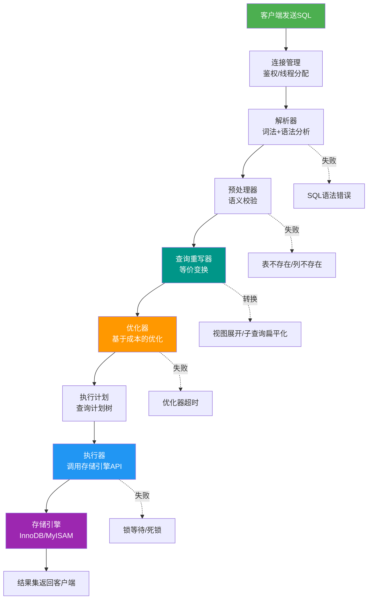
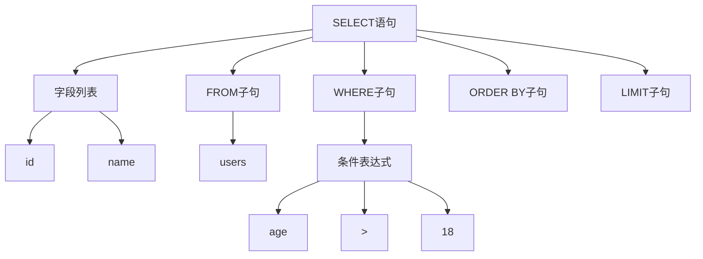
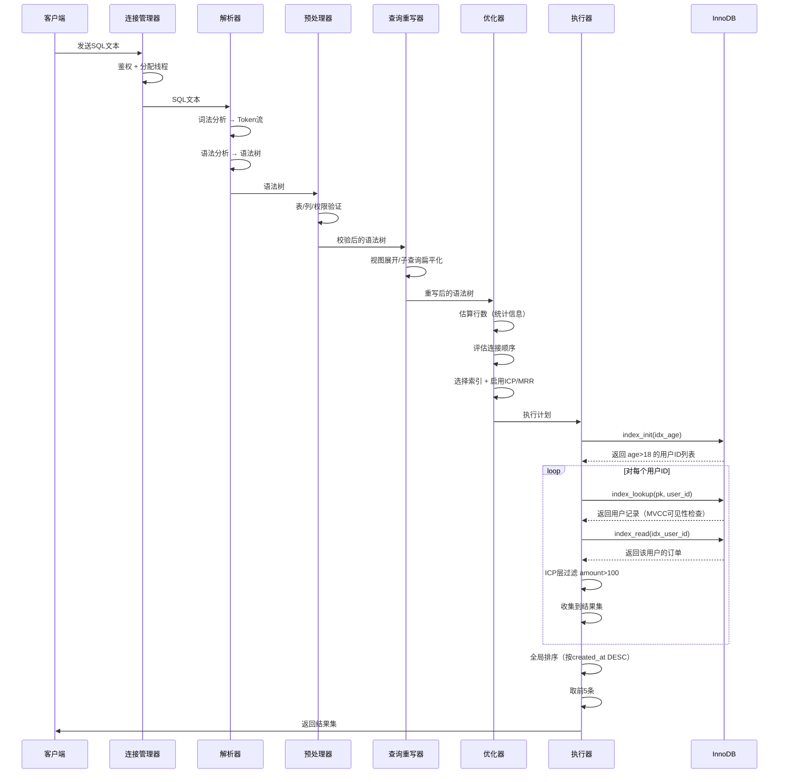
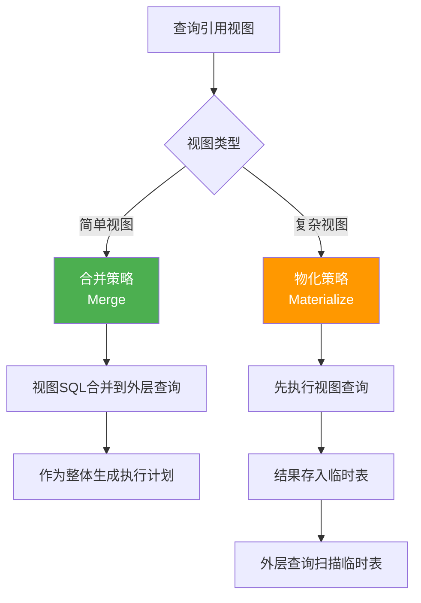
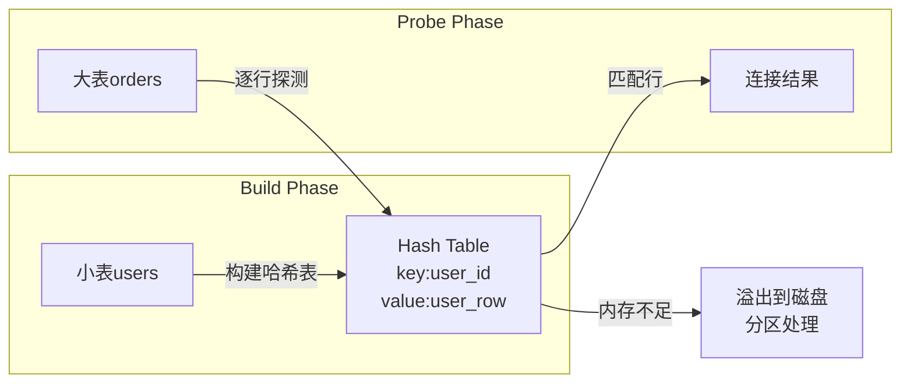

## 13.3 查询执行流程

当用户提交一条SQL语句，MySQL从接收文本到返回结果，经历了一个精密的多阶段流水线。理解这条流水线是诊断慢查询、优化性能的根本前提——你无法优化一个你不理解的系统。

一条看似简单的 `SELECT * FROM users WHERE id = 1`，在MySQL内部实际经历了连接鉴权、词法语法解析、语义校验、查询重写、基于成本的执行计划生成、存储引擎的B-tree查找、MVCC可见性过滤、结果集组装等多个步骤。每一个步骤都可能成为性能瓶颈，也都有对应的诊断和优化手段。



### 13.3.1 连接管理阶段

客户端发起连接时，MySQL的连接管理器（Connection Manager）完成以下工作：

**TCP三次握手** → **SSL握手（可选）** → **身份验证** → **线程分配**

MySQL采用"每连接一线程"（one-thread-per-connection）模型。每个客户端连接由服务器分配一个独立的工作线程来处理。这种模型实现简单，但在高并发场景下线程数量可能成为瓶颈——每个线程需要独立的栈空间（默认256KB）、排序缓冲区等内存资源。

```sql
-- 查看当前连接状态
SHOW STATUS LIKE 'Threads%';
```

| 指标 | 含义 | 优化方向 |
|------|------|----------|
| `Threads_connected` | 当前打开的连接数 | 连接池大小 |
| `Threads_running` | 正在执行查询的线程数 | 慢查询排查 |
| `Threads_cached` | 缓存的空闲线程数 | `thread_cache_size` 调优 |
| `Threads_created` | 历史累计创建的线程总数 | 数值持续增长说明线程缓存不足 |

**关键参数：**

```ini
# /etc/my.cnf
[mysqld]
max_connections = 500        # 最大连接数
thread_cache_size = 64       # 线程缓存（减少线程创建开销）
wait_timeout = 28800         # 空闲连接超时（秒）
interactive_timeout = 28800  # 交互式连接超时
```

**连接池的必要性：** 每次新建连接需要经历TCP三次握手（1.5个RTT）、MySQL协议握手、身份验证（至少一次网络往返）、线程创建与初始化。在局域网环境下，这一系列操作耗时约1-5毫秒；在跨机房场景下，耗时可能超过10毫秒。使用连接池（如Java的HikariCP、Druid，Python的SQLAlchemy Pool）复用连接，可将连接建立开销从毫秒级降到微秒级。

连接池的关键配置原则：

理想连接数 ≈ CPU核心数 × 2 + 磁盘数

原因：
- 超过CPU核心数×2的连接不会提升吞吐量，反而增加上下文切换
- 每个查询执行时如果涉及IO等待，线程会主动让出CPU
- 超出的连接只是在排队等锁和CPU时间片

> **实践建议：** HikariCP的作者建议连接池大小不要超过 `CPU核数 × 2 + 有效磁盘数`。对于一个16核SSD服务器，最大连接数通常不应超过40-50个活跃连接。MySQL的 `max_connections` 可以设得更高（用于容纳短暂的连接高峰），但应用端的连接池才是控制并发的关键阀门。

### 13.3.2 解析器（Parser）

解析器将SQL文本转化为MySQL内部的数据结构。这个过程分为两个子阶段：

**词法分析（Lexical Analysis）：**
将SQL字符串拆分为一个个Token（记号）。词法分析器（Lexer）基于预定义的规则（由Lex/Flex工具生成的词法定义），逐字符扫描输入，识别关键字、标识符、常量、运算符等。

SELECT id, name FROM users WHERE age > 18;
↓
Token流: [SELECT] [id] [,] [name] [FROM] [users] [WHERE] [age] [>] [18] [;]

Token识别的具体规则包括：
- **关键字**：`SELECT`、`FROM`、`WHERE` 等是保留关键字，匹配时不区分大小写
- **标识符**：`id`、`name`、`users` 等表名和列名，如果是保留字需要用反引号包裹
- **常量**：数字 `18`、字符串 `'张三'`、NULL 等
- **运算符**：`=`、`>`、`>=`、`AND`、`OR` 等

**语法分析（Syntax Analysis）：**
根据MySQL的语法规则（由Yacc/Bison工具生成的语法定义），将Token流组装成语法树（Parse Tree）。语法规则定义了合法的SQL语句结构——哪些子句可以出现、子句之间的顺序、各子句接受的参数类型。



**解析失败的常见场景：**

```sql
-- 语法错误：缺少FROM关键字
SELECT id, name users WHERE age > 18;
-- ERROR 1064 (42000): You have an error in your SQL syntax

-- 关键字冲突：表名是保留字
SELECT * FROM order WHERE id = 1;
-- ERROR 1064: 视具体版本而定，建议用反引号包裹
SELECT * FROM `order` WHERE id = 1;

-- 字符串未闭合
SELECT * FROM users WHERE name = '张三;
-- ERROR 1064: 语法错误（缺少闭合引号）

-- 括号不匹配
SELECT * FROM users WHERE (age > 18;
-- ERROR 1064: 语法错误（缺少闭合括号）
```

> **MySQL 8.0的改进：** MySQL 8.0改进了语法错误提示信息，不仅报告错误位置，还会给出可能的修正建议。例如当拼写错误时，会提示"Did you mean..."。这在调试复杂SQL时非常有帮助。

### 13.3.3 预处理器（Preprocessor）

预处理器在语法树的基础上进行**语义校验**，将语法正确的SQL转化为语义完整的内部表示：

**校验清单：**

| 校验项 | 说明 | 失败时的错误码 |
|--------|------|---------------|
| 表名验证 | 检查SQL中引用的表是否存在 | ERROR 1146 (42S02) |
| 列名验证 | 检查字段是否属于对应的表 | ERROR 1054 (42S22) |
| 类型检查 | 确保比较操作的类型兼容 | ERROR 1267 (HY000) |
| 权限验证 | 检查当前用户是否有对应表的操作权限 | ERROR 1142 (42000) |
| 别名检查 | 检查别名的合法性，防止别名冲突 | ERROR 1064 (42000) |
| 聚合检查 | 确保SELECT列表中的非聚合列都在GROUP BY中（严格模式下） | ERROR 1055 (42000) |

```sql
-- 表不存在
SELECT * FROM nonexistent_table;
-- ERROR 1146 (42S02): Table 'db.nonexistent_table' doesn't exist

-- 列不存在
SELECT non_existent_column FROM users;
-- ERROR 1054 (42S22): Unknown column 'non_existent_column'

-- 权限不足
SELECT * FROM mysql.user;  -- 普通用户无权访问
-- ERROR 1142 (42000): SELECT command denied

-- 类型不兼容（隐式转换可能导致性能问题）
SELECT * FROM orders WHERE order_no = 12345;
-- order_no是VARCHAR，12345是INT，MySQL会进行隐式类型转换
-- 转换会导致索引失效！这是常见的性能陷阱
```

> **隐式类型转换的陷阱：** 当WHERE条件中的比较双方类型不一致时，MySQL会进行隐式类型转换。例如将字符串列与数字比较时，MySQL会对每一行的字符串列调用 `CAST()` 函数，这会导致该列上的索引完全失效，退化为全表扫描。这是一个极其常见且隐蔽的性能杀手。

### 13.3.4 查询重写器（Query Rewriter）

查询重写器（Rewriter）是连接"预处理"和"优化器"之间的桥梁。它接收语义校验通过的语法树，进行一系列**等价变换**，将SQL转化为更利于优化器处理的形式。重写变换不会改变查询的语义结果，但会显著影响优化器的选择空间。

MySQL 8.0引入了 **查询重写插件（Query Rewrite Plugin）**，允许用户自定义重写规则，通过 `query_rewrite` 数据库中的 `rewrite_rules` 表配置。

#### 视图展开（View Expansion）

视图本质上是一个存储的查询定义。在查询重写阶段，MySQL将视图引用替换为视图的底层查询：

```sql
-- 定义视图
CREATE VIEW active_users AS
SELECT id, name, age FROM users WHERE status = 'active';

-- 查询视图
SELECT * FROM active_users WHERE age > 25;

-- 重写后的等价SQL：
SELECT id, name, age FROM users WHERE status = 'active' AND age > 25;
```

视图展开有两种策略：
- **合并（Merge）**：将视图的查询体直接合并到外层查询中，生成一个平铺的查询。这是MySQL的默认策略，性能最优。
- **物化（Materialize）**：先执行视图查询，将结果存入临时表，再在外层查询中扫描临时表。当视图定义中包含 `GROUP BY`、`DISTINCT`、`UNION`、聚合函数等无法合并的操作时使用此策略。

```sql
-- 无法合并的视图（包含DISTINCT）
CREATE VIEW unique_cities AS SELECT DISTINCT city FROM users;
SELECT * FROM unique_cities WHERE city = '北京';
-- MySQL会先物化视图（执行SELECT DISTINCT city FROM users），再过滤

-- 可合并的视图
CREATE VIEW user_orders AS SELECT u.id, u.name, o.total FROM users u JOIN orders o ON u.id = o.user_id;
SELECT * FROM user_orders WHERE name = '张三';
-- MySQL直接合并为：SELECT u.id, u.name, o.total FROM users u JOIN orders o ON u.id = o.user_id WHERE u.name = '张三'
```

#### 子查询扁平化（Subquery Flattening）

优化器会尝试将子查询"拍平"为更高效的连接操作：

```sql
-- 原始写法：相关子查询
SELECT * FROM users u
WHERE EXISTS (SELECT 1 FROM orders o WHERE o.user_id = u.id);

-- 重写为半连接（Semi-Join）
SELECT DISTINCT u.* FROM users u
SEMI JOIN orders o ON o.user_id = u.id;
```

#### 分区裁剪（Partition Pruning）

对于分区表，查询重写器会在早期阶段根据WHERE条件确定需要访问哪些分区，跳过不相关的分区：

```sql
-- 假设orders表按created_at做RANGE分区
-- 分区：p2023 (2023年), p2024 (2024年), p2025 (2025年)

SELECT * FROM orders WHERE created_at > '2024-06-01';
-- 重写器识别出只需扫描 p2024 和 p2025 两个分区
-- p2023 完全跳过，减少2/3的IO量

-- 验证分区裁剪效果
EXPLAIN SELECT * FROM orders WHERE created_at > '2024-06-01';
-- partitions 列显示：p2024,p2025（而非所有分区）
```

> **分区裁剪的条件限制：** 分区裁剪要求WHERE条件中的分区键必须使用简单的等值或范围比较。如果对分区键使用函数（如 `WHERE YEAR(created_at) = 2024`），MySQL无法进行分区裁剪，会扫描所有分区。这也是为什么建议将分区键定义为可以直接比较的类型。

#### MySQL 8.0查询重写插件

MySQL 8.0引入了用户自定义查询重写机制，通过SQL规则在服务器层自动改写查询：

```sql
-- 创建query_rewrite数据库（MySQL 8.0.11+）
USE query_rewrite;

-- 添加重写规则：将SELECT * 改写为具体列
INSERT INTO rewrite_rules (pattern, pattern_database, replacement, enabled)
VALUES (
    'SELECT * FROM `orders` WHERE ?',
    'shop',
    'SELECT id, user_id, total, status, created_at FROM `orders` WHERE ?',
    'YES'
);

-- 应用规则
CALL flush_rewrite_rules();

-- 此后所有匹配的SELECT * FROM orders会被自动改写
-- 这在不修改应用代码的情况下实现查询优化
```

### 13.3.5 优化器（Optimizer）——核心阶段

优化器是查询执行流程中**最复杂、最关键**的组件。MySQL优化器的核心策略是**基于成本（Cost-Based）**的优化——从多种可能的执行方案中选择成本最低的一个。

#### 成本模型

MySQL优化器使用成本模型量化每种操作的资源消耗。核心度量包含**IO成本**（磁盘页面读取）和**CPU成本**（内存中的计算）：

| 操作类型 | 成本模型 | 说明 |
|----------|----------|------|
| 顺序IO | 每页1.0成本 | 读取连续数据页（预读命中时） |
| 随机IO | 每页4.0成本 | 随机定位数据页（B-tree索引查找） |
| CPU处理 | 每行0.2成本 | 内存中的比较、计算、函数调用 |
| 排序 | 每行0.3成本 | 额外的排序开销（内存排序） |
| 磁盘排序 | 每页1.0成本 | 排序数据溢出到磁盘时的额外IO |

> **MySQL 8.0成本模型持久化：** MySQL 8.0引入了成本模型持久化机制。优化器的成本参数存储在 `mysql.costs` 表中，DBA可以查看和修改这些参数来适应特定硬件环境。例如在SSD环境下，随机IO成本可能比HDD低很多，可以相应调低随机IO的权重。

```sql
-- 查看当前成本模型参数
SELECT * FROM mysql.costs;

-- 修改随机IO成本（适合SSD环境）
UPDATE mysql.costs SET cost_value = 2.0 
WHERE cost_name = 'io_block_read_cost' AND cost_name LIKE '%random%';
```

#### 优化器的主要决策

**1. 表连接顺序（Join Order）**

对于多表连接，优化器需要决定表的访问顺序。N张表有N!种排列，当N较大时穷举不可行。MySQL优化器采用以下策略：

- **N ≤ 多表阈值（默认7）**：使用动态规划（Dynamic Programming）穷举所有排列，选择成本最低的
- **N > 多表阈值**：使用贪心搜索（Greedy Search），从最优的两表连接开始逐步扩展，避免指数级搜索
- **optimizer_search_depth**：可配置搜索深度，降低可减少优化时间但可能错过最优计划

```sql
-- 查看当前优化器搜索深度配置
SHOW VARIABLES LIKE 'optimizer_search_depth';

-- 对于复杂查询，可以降低搜索深度来加速优化
SET SESSION optimizer_search_depth = 4;

-- 优化器会评估：
-- 方案A: users JOIN orders ON ... JOIN products ON ...
-- 方案B: orders JOIN users ON ... JOIN products ON ...
-- 方案C: products JOIN users ON ... JOIN orders ON ...
-- 选择成本最低的方案
SELECT o.id, u.name, p.title
FROM orders o
JOIN users u ON o.user_id = u.id
JOIN products p ON o.product_id = p.id
WHERE o.status = 'paid';
```

**2. 索引选择（Index Selection）**

优化器根据表的统计信息（索引基数、数据分布、索引选择性）选择使用哪个索引：

```sql
-- 查看索引基数
SHOW INDEX FROM users;

-- 查看表的统计信息
SELECT * FROM information_schema.STATISTICS
WHERE TABLE_NAME = 'users';

-- 查看索引选择性（基数/总行数），选择性越高越好
SELECT 
    INDEX_NAME, 
    COUNT(DISTINCT COLUMN_NAME) as cardinality,
    COUNT(*) as total_rows,
    ROUND(COUNT(DISTINCT COLUMN_NAME) / COUNT(*), 4) as selectivity
FROM information_schema.STATISTICS
WHERE TABLE_SCHEMA = 'shop' AND TABLE_NAME = 'users'
GROUP BY INDEX_NAME;
```

| 字段 | 含义 | 示例值 |
|------|------|--------|
| `Cardinality` | 索引基数（唯一值数量） | 10000 |
| `Sub_part` | 前缀索引长度 | 10 |
| `Packed` | 索引压缩方式 | NULL |
| `Null` | 是否允许NULL | YES |
| `Non_unique` | 是否非唯一索引 | 1（非唯一）/ 0（唯一） |

**3. 优化器提示（Optimizer Hints）**

当优化器选择不理想时，可以使用提示强制指定执行计划：

```sql
-- 强制使用指定索引
SELECT * FROM users FORCE INDEX(idx_age) WHERE age > 18;

-- 忽略指定索引
SELECT * FROM users IGNORE INDEX(idx_name) WHERE name = '张三';

-- 强制使用嵌套循环连接（NLJ）
SELECT /*+ JOIN_ORDER(users, orders) */ * 
FROM users JOIN orders ON users.id = orders.user_id;

-- 禁用优化器的子查询优化（让MySQL使用原始子查询）
SELECT /*+ NO_SUBQUERY */ * FROM users 
WHERE id IN (SELECT user_id FROM orders);

-- 指定Join Buffer大小（优化大表连接）
SELECT /*+ JOIN_BUFFER_SIZE(4194304) */ * 
FROM users JOIN orders ON users.id = orders.user_id;

-- 禁用MRR优化（调试用）
SELECT /*+ NO_MRR(users) */ * FROM users WHERE age BETWEEN 20 AND 30;
```

**4. 子查询优化**

MySQL优化器对子查询有多种优化策略，将低效的子查询转化为高效的连接操作：

```sql
-- IN子查询 → 转为半连接（Semi-Join）
SELECT * FROM users 
WHERE id IN (SELECT user_id FROM orders);
-- 优化器可能转为：users SEMI JOIN orders
-- 适用条件：子查询是独立的（非相关子查询），SELECT列表只有一个列

-- 相关子查询 → 转为EXISTS
SELECT * FROM users u
WHERE EXISTS (SELECT 1 FROM orders o WHERE o.user_id = u.id);
-- 优化器可能转为：users SEMI JOIN orders ON ...

-- EXISTS子查询 → 物化（Materialization）
SELECT * FROM users 
WHERE id IN (SELECT DISTINCT user_id FROM orders WHERE amount > 100);
-- 优化器将子查询结果物化为临时表，再用Hash Join关联

-- 派生表合并（Derived Table Merge）
SELECT * FROM (SELECT user_id, SUM(amount) as total FROM orders GROUP BY user_id) t
WHERE t.total > 1000;
-- 优化器可能将派生表t直接合并到外层查询中
```

**5. 索引条件下推（ICP，Index Condition Pushdown）**

MySQL 5.6引入的ICP优化将部分WHERE条件下推到存储引擎层执行，减少回表次数：

```sql
-- 假设有复合索引 idx_name_age (name, age)
SELECT * FROM users WHERE name LIKE '张%' AND age > 25;

-- 不开启ICP的执行流程：
-- 1. 存储引擎通过索引找到所有 name LIKE '张%' 的记录（假设1000条）
-- 2. 每条记录都回表到主键，取出完整行
-- 3. 服务层逐行过滤 age > 25（假设只有100条满足）
-- 总IO：1000次回表

-- 开启ICP后的执行流程：
-- 1. 存储引擎通过索引找到 name LIKE '张%' 的记录
-- 2. 在索引层直接检查 age > 25（因为age也在索引中）
-- 3. 只对同时满足两个条件的记录（100条）回表
-- 总IO：100次回表（减少90%的IO！）
```

在EXPLAIN输出中，ICP生效时Extra列会显示 `Using index condition`。

**6. 多范围读优化（MRR，Multi-Range Read）**

当执行范围查询时，磁盘上的数据页面可能分散在不同位置，导致大量随机IO。MRR将范围扫描的结果先缓存在 `read_rnd_buffer` 中，按主键排序后再批量读取，将随机IO转化为顺序IO：

```sql
-- 范围查询示例
SELECT * FROM users WHERE age BETWEEN 20 AND 30;

-- 不开启MRR：按索引顺序逐条回表（磁盘随机IO）
-- 开启MRR：先收集主键值 → 排序 → 按排序后的顺序批量回表（顺序IO）

-- 验证MRR是否生效
EXPLAIN SELECT * FROM users WHERE age BETWEEN 20 AND 30;
-- Extra列显示 "Using MRR" 表示MRR生效

-- MRR相关参数
SHOW VARIABLES LIKE 'read_rnd_buffer_size';  -- 默认256KB
SHOW VARIABLES LIKE 'optimizer_switch';  -- 检查mrr=on是否开启
```

> **ICP与MRR的协同：** ICP减少需要回表的行数，MRR将剩余的回表操作从随机IO变为顺序IO。两者组合使用时效果最佳——ICP在索引层提前过滤掉大部分不满足条件的行，MRR对剩余行的回表操作进行IO优化。

#### 优化器Trace

查看优化器的决策过程，是诊断"为什么选错索引"的利器：

```sql
-- 开启优化器Trace
SET optimizer_trace = 'enabled=on';

-- 执行目标SQL
SELECT * FROM users WHERE age > 20 AND name LIKE '张%';

-- 查看Trace输出
SELECT * FROM information_schema.OPTIMIZER_TRACE\G

-- 关闭
SET optimizer_trace = 'enabled=off';
```

Trace输出中关注的关键字段：

| 字段 | 说明 |
|------|------|
| `rows_estimation` | 优化器对每个索引的行数估算 |
| `considered_execution_plans` | 考虑过的所有执行计划列表 |
| `cost` | 每个计划的总成本 |
| `chosen` | 是否被选中为最终计划 |
| `range_scan_alternatives` | 范围扫描的替代方案分析 |
| `index_to_query_plan` | 索引到查询计划的映射关系 |

### 13.3.6 执行计划与EXPLAIN

EXPLAIN是查看MySQL执行计划的最直接工具。它告诉你MySQL**打算如何**执行你的查询——在不真正执行的情况下展示优化器的选择结果。

```sql
EXPLAIN SELECT u.name, COUNT(o.id) as order_count
FROM users u
JOIN orders o ON u.id = o.user_id
WHERE u.age > 18
GROUP BY u.id
ORDER BY order_count DESC
LIMIT 10;
```

**EXPLAIN输出字段详解：**

| 字段 | 含义 | 关注点 |
|------|------|--------|
| `id` | 查询编号 | 相同id为同一层，id越大越先执行 |
| `select_type` | 查询类型 | SIMPLE/PRIMARY/SUBQUERY/DERIVED/UNCACHEABLE |
| `table` | 访问的表 | 表名或别名，<derivedN>表示派生表 |
| `partitions` | 命中的分区 | NULL表示非分区表，具体值表示分区裁剪结果 |
| `type` | 访问类型 | **性能从好到差**：system > const > eq_ref > ref > range > index > ALL |
| `possible_keys` | 可能使用的索引 | 候选索引列表 |
| `key` | 实际使用的索引 | NULL表示未使用索引 |
| `key_len` | 索引使用长度 | 越短越好，反映索引列的使用情况 |
| `ref` | 索引关联的列 | 常数/列名/关联条件 |
| `rows` | 预估扫描行数 | 越小越好（是估算值，非精确值） |
| `filtered` | 过滤比例 | 越高越好（100%最优） |
| `Extra` | 额外信息 | 重要标志位，详见下表 |

**type字段的性能阶梯：**

性能好 ← ─────────────────────────────── → 性能差

system → const → eq_ref → ref → range → index → ALL
  1        2        3       4       5       6      7

| type | 场景 | 示例 | 说明 |
|------|------|------|------|
| `system` | 表只有一行 | MyISAM的单行表 | 极少见，InnoDB不支持 |
| `const` | 主键/唯一索引等值查询 | `WHERE id = 1` | 最多返回一行 |
| `eq_ref` | 关联查询中使用主键/唯一索引 | `JOIN ON a.id = b.id` | 每次关联最多一行 |
| `ref` | 非唯一索引等值查询 | `WHERE name = '张三'` | 可能返回多行 |
| `range` | 索引范围扫描 | `WHERE age > 18` | 索引被用于范围查找 |
| `index` | 全索引扫描 | `SELECT id FROM users` | 遍历整个索引树 |
| `ALL` | 全表扫描（最差） | 无可用索引 | 逐行扫描数据文件 |

**Extra字段的关键标志：**

| Extra值 | 含义 | 优化建议 |
|---------|------|----------|
| `Using index` | 覆盖索引，无需回表 | ✅ 最优——查询所需数据全部在索引中 |
| `Using where` | 服务层过滤 | 检查是否有更精确的索引 |
| `Using temporary` | 使用临时表 | ⚠️ GROUP BY/DISTINCT优化 |
| `Using filesort` | 文件排序 | ⚠️ 优化排序字段索引 |
| `Using join buffer` | 连接缓冲 | ⚠️ 被驱动表缺索引 |
| `Using index condition` | ICP索引条件下推 | ✅ 存储引擎层过滤生效 |
| `Using MRR` | 多范围读优化 | ✅ IO优化生效 |
| `Select tables optimized away` | 聚合直接从索引获取 | ✅ 无需访问数据行 |
| `Using intersect` | 索引交集（Index Merge） | 多个索引条件取交集 |

### 13.3.7 EXPLAIN ANALYZE（MySQL 8.0.18+）

EXPLAIN ANALYZE提供**实际执行**的统计信息，比EXPLAIN的估算更准确：

```sql
EXPLAIN ANALYZE
SELECT u.name, COUNT(o.id)
FROM users u
JOIN orders o ON u.id = o.user_id
WHERE u.age > 18
GROUP BY u.id;
```

输出示例：

-> GroupAggregate: (u.name)
    -> Nested loop inner join: (o.user_id = u.id)
        -> Index range scan on u using idx_age: (u.age > 18)  (cost=0.35 rows=50)
        -> Index lookup on o using idx_user_id: (o.user_id = u.id)  (cost=1.10 rows=3)

关键区别：

| 特性 | EXPLAIN | EXPLAIN ANALYZE |
|------|---------|-----------------|
| 执行方式 | 仅分析，不执行 | 真正执行查询 |
| 行数 | 基于统计信息的**估算** | **实际**扫描和返回的行数 |
| 耗时 | 不包含实际耗时 | 报告每个操作的真实耗时 |
| 适用场景 | 生产环境日常分析 | 深度诊断、验证优化效果 |
| 风险 | 无（不执行查询） | 会消耗资源，生产环境慎用 |

> **警告：** EXPLAIN ANALYZE会真正执行查询。对于有副作用的操作（UPDATE、DELETE），不要在生产环境使用。对于SELECT查询，如果涉及大量数据聚合或排序，执行本身可能产生显著的CPU和内存开销。

### 13.3.8 执行器（Executor）

执行器是MySQL服务层与存储引擎层之间的桥梁。它根据执行计划，逐行（或逐批）调用存储引擎的接口获取数据。MySQL的执行器采用**火山模型（Volcano Model）**——也称为迭代器模型（Iterator Model），每个算子实现 `init()`、`next()`、`close()` 三个接口。

```mermaid
graph TD
    subgraph 执行器
        P1[初始化执行计划<br/>构造算子树]
        P2[调用引擎接口读取第一行]
        P3{还有下一行?}
        P4[执行WHERE过滤]
        P5[执行聚合/排序]
        P6[发送结果到客户端]
    end
    
    subgraph 存储引擎API
        API1[index_init]  -- 初始化索引扫描
        API2[index_read]  -- 读取索引记录
        API3[index_next]  -- 读取下一条记录
        API4[table_scan]  -- 全表扫描
        API5[ha_index_read_map]  -- 读取指定位置
        API6[ha_write_row]  -- 写入行数据
    end
    
    P1 --> P2
    P2 --> P3
    P3 -->|是| P4
    P4 --> P5
    P5 --> API2
    API2 --> API3
    API3 --> P3
    P3 -->|否| P6
```

**Handler API——执行器与存储引擎的契约：**

MySQL的存储引擎通过Handler接口（`handler`类）向服务层暴露统一的操作接口。执行器不直接读写数据文件，而是通过Handler接口与存储引擎交互：

| Handler接口 | 功能 | 对应操作 |
|-------------|------|----------|
| `open()` | 打开表，获取表句柄 | 执行前的准备工作 |
| `index_init()` | 初始化索引扫描 | 准备按索引读取数据 |
| `index_read()` | 读取索引中的指定记录 | 等值查找 |
| `index_next()` | 读取索引中的下一条记录 | 范围扫描/顺序读取 |
| `index_end()` | 结束索引扫描 | 释放索引资源 |
| `read_row()` | 读取指定行（通过主键） | 回表操作 |
| `write_row()` | 写入一行数据 | INSERT操作 |
| `update_row()` | 更新当前行 | UPDATE操作 |
| `delete_row()` | 删除当前行 | DELETE操作 |
| `rnd_init()` / `rnd_next()` | 初始化并执行全表扫描 | 无索引时的全表扫描 |
| `close()` | 关闭表句柄 | 释放资源 |

**执行器的工作模式（伪代码）：**

```sql
-- 以简单查询为例：SELECT * FROM users WHERE id = 1
-- 执行器的伪代码逻辑：

def execute(plan):
    table = open_table(plan.table_name)
    index = table.open_index(plan.index_name)  # 使用主键
    
    # 初始化索引扫描
    index.init_range(1, 1)  # 查找 id = 1
    
    # 逐行读取
    while (row = index.read_next()) != EOF:
        if row matches plan.where_clause:
            send_to_client(row)
    
    index.close()
    close_table(table)

-- 以范围查询为例：SELECT * FROM users WHERE age > 18
-- 执行器的伪代码逻辑：

def execute_range_scan(plan):
    table = open_table(plan.table_name)
    idx_age = table.open_index('idx_age')
    
    # 初始化范围扫描
    idx_age.init_range(lower=18, upper=NULL, include_lower=False)
    
    # 逐行读取
    while (row = idx_age.read_next()) != EOF:
        # 回表获取完整行数据
        full_row = table.read_row(row.primary_key)
        send_to_client(full_row)
    
    idx_age.close()
    close_table(table)
```

### 13.3.9 MVCC可见性检查——执行阶段的隐藏成本

在InnoDB中，执行器读取每一行数据时，都需要进行**MVCC可见性检查**——判断该行数据对当前事务是否可见。这是执行阶段一个经常被忽视但极其重要的性能因素。

**Read View（一致性视图）：**

InnoDB在执行查询时，会根据当前事务的隔离级别创建或使用Read View。Read View包含以下关键信息：

Read View {
    m_ids: [活跃事务ID列表]           -- 当前未提交的事务
    min_trx_id: 最小活跃事务ID         -- 最小的未提交事务
    max_trx_id: 下一个待分配的事务ID   -- 当前最大事务ID+1
    creator_trx_id: 创建该Read View的事务ID
}

**可见性判断规则：**

对每一行数据的trx_id（最后修改该行的事务ID）：

1. trx_id == creator_trx_id → 可见（自己修改的）
2. trx_id < min_trx_id → 可见（事务已提交）
3. trx_id >= max_trx_id → 不可见（事务在Read View之后开启）
4. min_trx_id <= trx_id < max_trx_id：
   - trx_id 在 m_ids 中 → 不可见（事务未提交）
   - trx_id 不在 m_ids 中 → 可见（事务已提交）

不可见时：沿版本链（Undo Log）查找更早的版本

**对性能的影响：**

在 **REPEATABLE READ** 隔离级别下，如果存在长时间未提交的事务（长事务），会导致MVCC版本链过长。执行器读取每一行时可能需要遍历多层版本链才能找到可见版本，显著增加CPU开销。

```sql
-- 查找长时间运行的事务（可能导致MVCC版本链膨胀）
SELECT * FROM information_schema.INNODB_TRX 
WHERE TIMESTAMPDIFF(SECOND, trx_started, NOW()) > 60;

-- 监控Undo Log的使用量
SHOW ENGINE INNODB STATUS\G
-- 关注 TRANSACTION 部分的 History list length
```

> **实践建议：** 将 `innodb_lock_wait_timeout` 设为合理值（默认50秒），同时监控 `INNODB_TRX` 中运行超过60秒的事务。长事务不仅影响MVCC性能，还会导致Undo Log膨胀、锁持有时间过长等连锁问题。应用层应确保事务尽量短小——获取数据后立即提交，不要在事务中执行HTTP调用、文件IO等耗时操作。

### 13.3.10 一条SQL的完整生命周期

将所有阶段串联起来，以一个真实查询为例：

```sql
SELECT u.name, o.total
FROM users u
JOIN orders o ON u.id = o.user_id
WHERE u.age > 18 AND o.amount > 100
ORDER BY o.created_at DESC
LIMIT 5;
```



### 13.3.11 Prepared Statements——预编译的执行流程

Prepared Statements（预编译语句）在标准执行流程上增加了一个**计划缓存层**，将解析和优化的结果缓存起来以供复用：

```sql
-- 第一阶段：PREPARE（解析 + 优化 + 缓存）
PREPARE stmt FROM 'SELECT * FROM users WHERE id = ? AND age > ?';
-- 执行流程：解析器 → 预处理器 → 重写器 → 优化器 → 缓存执行计划
-- 注意：参数 ? 此时未绑定，优化器会生成一个"通用"执行计划

-- 第二阶段：EXECUTE（执行，跳过解析/优化）
SET @id = 1, @age = 18;
EXECUTE stmt USING @id, @age;
-- 执行流程：绑定参数 → 复用缓存的执行计划 → 执行器 → 存储引擎
-- 不再经过解析器和优化器，节省时间

-- 重新绑定不同参数再次执行
SET @id = 2, @age = 25;
EXECUTE stmt USING @id, @age;
-- 同样复用缓存的执行计划

-- 释放
DEALLOCATE PREPARE stmt;
```

**Prepared Statement的执行计划缓存机制：**

| 阶段 | 普通SQL | Prepared Statement |
|------|---------|-------------------|
| PREPARE | — | 解析 → 优化 → 缓存执行计划 |
| EXECUTE | 解析 → 优化 → 执行 | 绑定参数 → 直接执行（跳过解析优化） |
| 重复执行 | 每次都解析+优化 | 复用缓存计划 |

**计划缓存的限制：**

```sql
-- MySQL的Prepared Statement缓存规则：
-- 1. 每个连接独立缓存（不同连接不能共享计划）
-- 2. 缓存大小受 prepared_stmt_cache_size 控制（默认10000）
-- 3. 参数类型变化时可能需要重新优化

-- 错误示例：参数类型不一致导致计划不复用
PREPARE stmt FROM 'SELECT * FROM users WHERE id = ?';
SET @id_str = '1';    -- 字符串类型
EXECUTE stmt USING @id_str;  -- 生成基于字符串比较的计划

SET @id_int = 1;      -- 整数类型
EXECUTE stmt USING @id_int;  -- 需要重新优化计划（类型转换逻辑不同）
```

> **ORM框架的启示：** 大多数ORM框架（如MyBatis、Hibernate）都使用Prepared Statements来防止SQL注入并提升性能。但部分框架在动态SQL拼接时会破坏参数化查询的优势，导致每次执行都走完整流程。检查你的ORM生成的SQL是否真正利用了计划缓存。

### 13.3.12 视图与存储过程的执行差异

#### 视图的执行

视图在执行时有两种处理策略：



**触发物化（而非合并）的场景：**
- 视图定义包含 `GROUP BY`、`DISTINCT`、`UNION`
- 视图定义包含聚合函数（`SUM`、`COUNT`、`AVG`）
- 视图引用了其他视图（多层嵌套）
- 视图定义使用了 `LIMIT`

```sql
-- 物化视图的EXPLAIN特征
EXPLAIN SELECT * FROM (SELECT user_id, SUM(amount) as total FROM orders GROUP BY user_id) t;
-- select_type: DERIVED（表示派生表被物化）
-- 执行计划会显示两个阶段：先执行子查询，再扫描结果
```

#### 存储过程的执行

存储过程在MySQL中会被解析和编译，但执行流程有其特殊性：

```sql
-- 存储过程的执行流程
DELIMITER //
CREATE PROCEDURE get_user_orders(IN p_user_id INT, IN p_limit INT)
BEGIN
    -- 步骤1：创建时，SQL文本被解析为内部表示（但不完全优化）
    SELECT u.name, o.total
    FROM users u JOIN orders o ON u.id = o.user_id
    WHERE u.id = p_user_id
    ORDER BY o.created_at DESC
    LIMIT p_limit;
END //
DELIMITER ;

-- 步骤2：首次调用时，执行计划被生成并缓存
CALL get_user_orders(12345, 10);

-- 步骤3：后续调用复用缓存的执行计划（参数化执行）
CALL get_user_orders(67890, 20);
```

> **存储过程的性能优势：** 存储过程的SQL在创建时被预解析，执行时无需网络传输SQL文本、无需解析。对于需要多次调用的复杂逻辑，存储过程比应用层拼接SQL有明显的性能优势。但存储过程的调试困难、版本管理不便、迁移性差，需要权衡。

### 13.3.13 常见性能问题与优化策略

#### 问题一：全表扫描（type=ALL）

**症状：** EXPLAIN显示 `type: ALL`，扫描行数远大于返回行数。

```sql
-- 慢查询：无索引
EXPLAIN SELECT * FROM orders WHERE user_id = 12345;
-- type: ALL, rows: 1000000  ← 扫描100万行

-- 优化：添加索引
CREATE INDEX idx_user_id ON orders(user_id);
-- type: ref, rows: 3  ← 只读3行
```

**如何判断是否需要优化：**

扫描行数 / 返回行数 > 10 → 建议优化
扫描行数 > 10000 且 返回行数 < 100 → 强烈建议优化
type = ALL 且 表行数 > 10000 → 必须优化

#### 问题二：文件排序（Using filesort）

**症状：** Extra出现 `Using filesort`，ORDER BY无法利用索引。

```sql
-- 慢查询：排序字段无索引
EXPLAIN SELECT * FROM orders ORDER BY created_at DESC LIMIT 10;
-- Extra: Using filesort

-- 优化：创建排序索引
CREATE INDEX idx_created_at ON orders(created_at);
-- Extra: (移除了Using filesort)
```

**filesort的两种实现：**
- **内存排序（sort_buffer）**：数据量小时在内存中完成，`sort_buffer_size` 控制缓冲区大小
- **磁盘排序**：数据量大时溢出到磁盘，性能急剧下降。MySQL使用归并排序，将数据分成多个临时文件分别排序后合并

#### 问题三：临时表（Using temporary）

**症状：** Extra出现 `Using temporary`，通常伴随 `GROUP BY` 或 `DISTINCT`。

```sql
-- 慢查询：GROUP BY字段与索引不匹配
EXPLAIN SELECT user_id, COUNT(*) FROM orders GROUP BY user_id;
-- Extra: Using temporary; Using filesort

-- 优化：确保GROUP BY字段有索引
CREATE INDEX idx_user_id ON orders(user_id);
-- Extra: Using index（覆盖索引，无需临时表）
```

**临时表的存储位置选择：**

tmp_table_size 和 max_heap_table_size 中较小的值
├── 未超过阈值 → 内存临时表（HEAP引擎）
└── 超过阈值 → 磁盘临时表（InnoDB引擎）
    性能：内存 <1ms vs 磁盘 10-50ms

#### 问题四：索引选择错误

**症状：** 优化器选择了低效的索引，或根本没用索引。

```sql
-- 查看优化器为什么选择错误的索引
SET optimizer_trace = 'enabled=on';
SELECT * FROM users WHERE status = 'active' AND age > 20;
SELECT * FROM information_schema.OPTIMIZER_TRACE\G
SET optimizer_trace = 'enabled=off';

-- 常见原因及解决方案：
-- 1. 统计信息过期 → ANALYZE TABLE users;
-- 2. 数据分布倾斜 → 考虑直方图统计 (MySQL 8.0+)
ANALYZE TABLE users UPDATE HISTOGRAM ON status, age WITH 256 BUCKETS;
-- 3. 优化器阈值问题 → 调整优化器开关
SET SESSION optimizer_switch = 'index_merge=on';
```

#### 问题五：深分页（Deep Pagination）

**症状：** `LIMIT 100000, 10` 比 `LIMIT 0, 10` 慢得多。

```sql
-- 慢查询：深分页
SELECT * FROM orders ORDER BY id LIMIT 1000000, 10;
-- 需要先读取100万行再丢弃

-- 优化方案1：游标分页（推荐）
SELECT * FROM orders WHERE id > 1000000 ORDER BY id LIMIT 10;
-- 索引直接定位到起始位置，性能恒定

-- 优化方案2：覆盖索引延迟关联
SELECT o.* FROM orders o
JOIN (SELECT id FROM orders ORDER BY id LIMIT 1000000, 10) t
ON o.id = t.id;
-- 子查询只扫描主键索引（覆盖索引），减少IO

-- 优化方案3：业务层限制（最根本的方案）
-- 将分页深度限制在合理范围内（如最多10000条）
-- 超出部分使用搜索或跳转功能
```

**深分页的性能对比：**

| 方式 | LIMIT 0,10 | LIMIT 100000,10 | LIMIT 1000000,10 |
|------|-----------|----------------|-----------------|
| 普通分页 | ~1ms | ~800ms | ~5000ms |
| 游标分页 | ~1ms | ~1ms | ~1ms |
| 延迟关联 | ~1ms | ~200ms | ~1500ms |

### 13.3.14 查询缓存与性能（MySQL 8.0已移除）

> **注意：** MySQL 8.0已完全移除查询缓存（Query Cache），因为其在高并发写入场景下性能反而更差。MySQL 5.7及更早版本仍可参考。

查询缓存的工作原理：将SQL文本做哈希计算，如果完全相同的SQL（包括空格、大小写）再次执行，直接返回缓存的结果集。

**为什么MySQL 8.0移除了查询缓存：**

根本原因：缓存失效粒度太粗
- 表的任何写操作（INSERT/UPDATE/DELETE）会导致该表的所有缓存失效
- 对于写密集型应用，缓存命中率极低
- 维护缓存一致性本身有CPU开销
- 锁竞争：查询缓存使用全局锁，高并发下成为瓶颈
- 实测：在写比例>10%的场景中，开启查询缓存反而降低整体性能

**现代替代方案：**

```sql
-- 方案1：应用层缓存（Redis/Memcached）
-- 热点查询结果缓存到Redis，TTL根据业务更新频率设置

-- 方案2：ProxySQL查询缓存
-- 在数据库代理层缓存查询结果

-- 方案3：物化视图（MySQL 8.0+）
CREATE TABLE mv_daily_orders AS
SELECT user_id, DATE(created_at) as order_date, COUNT(*) as order_count
FROM orders
GROUP BY user_id, DATE(created_at);
-- 定期刷新物化视图，查询直接读取预计算结果
```

### 13.3.15 慢查询日志与诊断

**开启慢查询日志：**

```sql
-- 动态开启
SET GLOBAL slow_query_log = 'ON';
SET GLOBAL long_query_time = 1;  -- 超过1秒记录
SET GLOBAL log_queries_not_using_indexes = 'ON';  -- 记录未使用索引的查询
SET GLOBAL log_slow_admin_statements = 'ON';  -- 记录慢管理语句（ALTER TABLE等）
SET GLOBAL log_slow_replica_statements = 'ON';  -- 记录从库的慢查询

-- 验证配置
SHOW VARIABLES LIKE 'slow_query%';
SHOW VARIABLES LIKE 'long_query_time';
```

**使用pt-query-digest分析慢查询：**

```bash
# 分析慢查询日志
pt-query-digest /var/log/mysql/slow.log > slow_report.txt

# 输出包含：
# - Top 10 最慢查询
# - 每个查询的执行计划统计
# - 响应时间分布（百分位数）
# - 锁等待时间
# - 实际执行行数 vs 预估行数（识别统计信息偏差）

# 只分析最近1小时的慢查询
pt-query-digest --since '1h' /var/log/mysql/slow.log

# 分析特定用户的慢查询
pt-query-digest --filter '$event->{user} eq "app_user"' /var/log/mysql/slow.log
```

### 13.3.16 进阶：多表连接的执行算法

MySQL支持三种表连接算法，理解它们有助于诊断连接查询的性能问题：

**1. Nested Loop Join（嵌套循环连接）**

最基本的连接算法，外层表的每一行都扫描一次内层表。复杂度为 O(M × N)：

```sql
-- 外层表users（100行）× 内层表orders（每用户10行）
-- 总IO次数 = 100 + 100×10 = 1100次
SELECT * FROM users u JOIN orders o ON u.id = o.user_id;
```

**2. Block Nested Loop Join（BNL，基于块的嵌套循环）**

MySQL 5.6及之前版本在无法使用索引时的默认算法。将外层表批量加载到Join Buffer中，减少内层表的扫描次数：

Join Buffer大小 = join_buffer_size（默认256KB）
一次可以缓存的外层行数 = Buffer大小 / 每行大小

例如：每行100字节，Buffer=256KB → 一次缓存2560行
内层表扫描次数 = 外层总行数 / 一次缓存行数 = 10000 / 2560 ≈ 4次

对比朴素NLJ：内层表扫描10000次
BNL将内层表扫描减少了 10000/4 = 2500倍！

**3. Hash Join（哈希连接，MySQL 8.0.18+）**

MySQL 8.0引入，对等值连接的性能有质的提升：



```sql
-- MySQL 8.0中，以下查询自动使用Hash Join（无需索引）
EXPLAIN SELECT * FROM users u JOIN orders o ON u.id = o.user_id;
-- join_type: HASH

-- 与BNL对比：
-- BNL: O(M×N)，需要扫描内层表多次
-- Hash: O(M+N)，只需扫描两次（Build + Probe）

-- Hash Join的适用条件（MySQL 8.0.18-8.0.30）：
-- 1. 仅支持等值连接（INNER JOIN / LEFT/RIGHT JOIN）
-- 2. 不支持非等值条件（如 a.id > b.id）
-- 3. 8.0.18-8.0.20: 仅支持内连接
-- 4. 8.0.20+: 支持外连接、非等值条件、反连接
```

> **MySQL 8.0.20+的Hash Join增强：** 从8.0.20版本开始，Hash Join不再仅限于等值连接。MySQL可以将非等值条件（如 `ON a.date BETWEEN b.start_date AND b.end_date`）拆分为"等值部分用Hash Join + 非等值部分用过滤"的混合策略，大幅提升了范围连接的性能。

### 13.3.17 执行流程全景对比

| 阶段 | 核心组件 | 输入 | 输出 | 耗时占比 | 可优化手段 |
|------|----------|------|------|----------|-----------|
| 连接管理 | Connection Manager | TCP连接 | 认证结果+线程 | <1% | 连接池、thread_cache_size |
| 解析 | Parser | SQL文本 | 语法树 | <1% | 避免动态拼接SQL |
| 预处理 | Preprocessor | 语法树 | 校验后的语法树 | <1% | 确保表/列存在，避免隐式转换 |
| 查询重写 | Rewriter | 校验后语法树 | 重写后语法树 | <1% | 合理使用视图，避免物化开销 |
| 优化 | Optimizer | 重写后语法树 | 执行计划 | 5-15% | 索引设计、ANALYZE TABLE、Hints |
| 执行 | Executor+引擎 | 执行计划 | 结果集 | 80-95% | 缓存命中率、ICP/MRR、分页优化 |

> 真正耗时的永远是**执行阶段**——IO操作（磁盘读取）是最大的性能瓶颈。优化的核心思路：**减少IO次数**（索引、覆盖索引）、**降低IO延迟**（Buffer Pool、SSD）、**减少CPU开销**（ICP、MRR）。

### 13.3.18 实战：完整优化案例

**场景：** 电商平台订单查询接口，P99延迟从50ms飙升到2s。

**Step 1：定位慢查询**

```sql
-- 开启慢查询日志，收集Top慢查询
SET GLOBAL slow_query_log = 'ON';
SET GLOBAL long_query_time = 0.1;  -- 100ms以上记录

-- 分析结果发现最慢的SQL：
SELECT o.id, o.total, o.status, o.created_at,
       u.name, u.phone, p.title, p.price
FROM orders o
JOIN users u ON o.user_id = u.id
JOIN order_items oi ON o.id = oi.order_id
JOIN products p ON oi.product_id = p.id
WHERE o.user_id = 12345
  AND o.created_at > '2024-01-01'
  AND o.status IN ('paid', 'shipped')
ORDER BY o.created_at DESC
LIMIT 20;
```

**Step 2：分析执行计划**

```sql
EXPLAIN SELECT o.id, o.total, o.status, o.created_at,
       u.name, u.phone, p.title, p.price
FROM orders o
JOIN users u ON o.user_id = u.id
JOIN order_items oi ON o.id = oi.order_id
JOIN products p ON oi.product_id = p.id
WHERE o.user_id = 12345
  AND o.created_at > '2024-01-01'
  AND o.status IN ('paid', 'shipped')
ORDER BY o.created_at DESC
LIMIT 20;
```

+----+-------------+-------+--------+---------------------------------+
| id | select_type | table | type   | key                             |
+----+-------------+-------+--------+---------------------------------+
|  1 | SIMPLE      | o     | ref    | idx_user_created_status         |
|  1 | SIMPLE      | u     | eq_ref | PRIMARY                         |
|  1 | SIMPLE      | oi    | ref    | idx_order_id                    |
|  1 | SIMPLE      | p     | eq_ref | PRIMARY                         |
+----+-------------+-------+--------+---------------------------------+
Extra: Using where; Using filesort  ← 排序未走索引！

**Step 3：深入诊断**

```sql
-- 使用optimizer_trace查看优化器决策
SET optimizer_trace = 'enabled=on';
SELECT o.id, o.total, o.status, o.created_at
FROM orders o
WHERE o.user_id = 12345 AND o.created_at > '2024-01-01' 
  AND o.status IN ('paid', 'shipped')
ORDER BY o.created_at DESC LIMIT 20;
SELECT * FROM information_schema.OPTIMIZER_TRACE\G
SET optimizer_trace = 'enabled=off';

-- 发现：idx_user_created_status(user_id, created_at, status)
-- 索引列顺序导致created_at只能用于范围扫描，无法用于排序
-- 排序在服务层完成（filesort），代价极高
```

**Step 4：优化索引**

```sql
-- 问题：idx_user_created_status索引的列顺序不匹配排序需求
-- 优化：创建覆盖查询条件+排序的复合索引
-- 等值条件列放最前，排序列紧跟其后
CREATE INDEX idx_user_status_created 
ON orders(user_id, status, created_at DESC);

-- 再次EXPLAIN确认
-- type: range, key: idx_user_status_created
-- Extra: Using where（无filesort！）
```

**Step 5：进一步优化——覆盖索引**

```sql
-- 进阶优化：如果只需要id和total字段
CREATE INDEX idx_user_status_created_cover
ON orders(user_id, status, created_at DESC, id, total);

-- 这样可以实现完全的覆盖索引，无需回表
-- Extra: Using index（覆盖索引）
```

**Step 6：验证效果**

```sql
-- 优化前：2000ms
-- 优化后：15ms（性能提升133倍）
SELECT o.id, o.total, o.status, o.created_at,
       u.name, u.phone, p.title, p.price
FROM orders o
JOIN users u ON o.user_id = u.id
JOIN order_items oi ON o.id = oi.order_id
JOIN products p ON oi.product_id = p.id
WHERE o.user_id = 12345
  AND o.created_at > '2024-01-01'
  AND o.status IN ('paid', 'shipped')
ORDER BY o.created_at DESC
LIMIT 20;

-- 对比EXPLAIN ANALYZE的实际执行统计
EXPLAIN ANALYZE
SELECT o.id, o.total, o.status, o.created_at
FROM orders o
WHERE o.user_id = 12345 AND o.created_at > '2024-01-01'
  AND o.status IN ('paid', 'shipped')
ORDER BY o.created_at DESC LIMIT 20;
```

### 13.3.19 常见误区与最佳实践

**误区一：EXPLAIN的rows是精确值**

EXPLAIN中的rows是基于统计信息的**估算值**，可能与实际行数偏差很大（特别是数据分布倾斜时）。使用 `EXPLAIN ANALYZE` 获取真实数据。定期执行 `ANALYZE TABLE` 更新统计信息可以缩小偏差。

**误区二：索引越多越好**

每个索引都会降低写入性能（INSERT/UPDATE/DELETE需要维护索引）。遵循**三星索引**原则：
- 第一星：WHERE条件列在索引中（缩小扫描范围）
- 第二星：ORDER BY列在索引中（避免排序）
- 第三星：SELECT列在索引中（覆盖索引，避免回表）

索引数量的经验法则：
- 单表索引不超过6个
- 每个索引都应该有明确的使用场景
- 如果一个索引从未被EXPLAIN使用，考虑删除
- 写密集型表：索引越少越好
- 读密集型表：可以适当增加覆盖索引

**误区三：JOIN总是比子查询快**

MySQL优化器会自动将IN子查询转为半连接（Semi-Join），在很多场景下性能与JOIN相当。不要盲目改写子查询——现代优化器的子查询优化能力已经非常成熟。

**误区四：忽略EXPLAIN中的filtered**

`filtered: 10%` 表示扫描了100行但只有10行满足WHERE条件。90%的IO是浪费的——说明索引过滤性不够好。解决方案：创建包含更多条件列的复合索引。

**误区五：认为InnoDB Buffer Pool越大越好**

Buffer Pool大小需要与物理内存匹配。过大的Buffer Pool可能导致操作系统内存不足，触发swap——性能比小Buffer Pool更差。建议设置为物理内存的50%-75%：

# 32GB内存的服务器
innodb_buffer_pool_size = 20G  # 62.5%物理内存
innodb_buffer_pool_instances = 20  # 每个实例1GB

**最佳实践清单：**

□ 所有慢查询先EXPLAIN，确认type至少是range
□ 避免SELECT *，只查需要的列（利于覆盖索引）
□ 复合索引遵循最左前缀原则
□ 等值条件列放索引前面，范围条件列放后面
□ ORDER BY和GROUP BY尽量走索引
□ 深分页用游标分页替代OFFSET
□ 定期ANALYZE TABLE更新统计信息
□ 监控长时间运行的查询（performance_schema）
□ 使用Prepared Statements减少解析开销
□ 避免对索引列使用函数或隐式类型转换
□ 阅读EXPLAIN中的Extra列，关注filesort和temporary
□ 使用optimizer_trace诊断优化器的决策过程
□ 高并发场景验证ICP和MRR是否生效
□ 定期检查MVCC版本链长度，避免长事务

### 13.3.20 性能监控工具速查

| 工具 | 用途 | 适用场景 | 开销 |
|------|------|----------|------|
| `EXPLAIN` | 查看执行计划 | 分析单条SQL | 无（不执行查询） |
| `EXPLAIN ANALYZE` | 实际执行统计 | 深度诊断 | 中（真正执行查询） |
| `SHOW PROFILE` | 各阶段耗时 | MySQL 8.0前版本 | 低 |
| `performance_schema` | 全局性能监控 | 生产环境 | 中（需开启） |
| `slow_query_log` | 慢查询记录 | 持续监控 | 低 |
| `pt-query-digest` | 慢查询分析 | 日志分析 | 无（离线分析） |
| `optimizer_trace` | 优化器决策过程 | 调试索引选择 | 低 |
| `SHOW ENGINE INNODB STATUS` | InnoDB内部状态 | 事务/锁/缓冲池诊断 | 低 |

```sql
-- performance_schema 查找最耗时的SQL
SELECT DIGEST_TEXT, COUNT_STAR, 
       ROUND(AVG_TIMER_WAIT/1000000000, 2) as avg_ms,
       ROUND(SUM_TIMER_WAIT/1000000000, 2) as total_ms,
       SUM_ROWS_EXAMINED as rows_examined,
       SUM_ROWS_SENT as rows_sent
FROM performance_schema.events_statements_summary_by_digest
ORDER BY AVG_TIMER_WAIT DESC
LIMIT 10;

-- 查找未使用索引的查询
SELECT DIGEST_TEXT, COUNT_STAR
FROM performance_schema.events_statements_summary_by_digest
WHERE DIGEST_TEXT LIKE '%Using filesort%'
   OR DIGEST_TEXT LIKE '%Using temporary%'
ORDER BY COUNT_STAR DESC
LIMIT 10;

-- 查找全表扫描的查询
SELECT DIGEST_TEXT, COUNT_STAR,
       SUM_NO_INDEX_USED as no_index_count
FROM performance_schema.events_statements_summary_by_digest
WHERE SUM_NO_INDEX_USED > 0
ORDER BY SUM_NO_INDEX_USED DESC
LIMIT 10;
```

---

**小结：** 查询执行流程是MySQL的"高速公路"——连接管理是入口匝道，解析器和预处理器是安全检查站，查询重写器是路线规划师将复杂路线简化，优化器是导航系统选择最优路线，执行器是实际的驾驶引擎，存储引擎是路面。MVCC可见性检查则是每辆车通过收费站时的"身份核验"。理解这条流水线的每个环节，你就能精确定位性能瓶颈，做出有针对性的优化，而不是盲目地"加索引"或"加机器"。

性能优化的核心原则：**先诊断再优化**。永远不要凭直觉修改索引或参数——用EXPLAIN看执行计划，用optimizer_trace看优化器决策，用performance_schema看全局趋势，用EXPLAIN ANALYZE验证优化效果。数据驱动的优化，才是可靠的优化。
