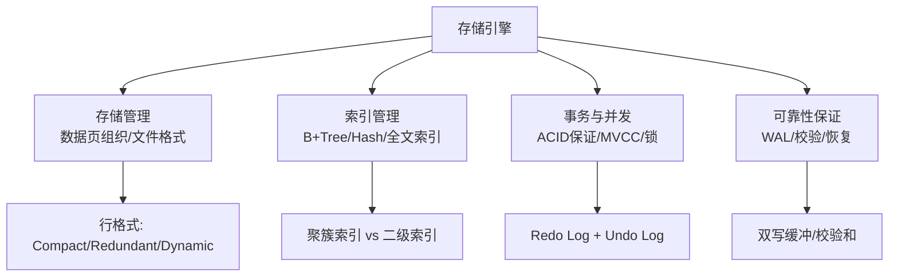
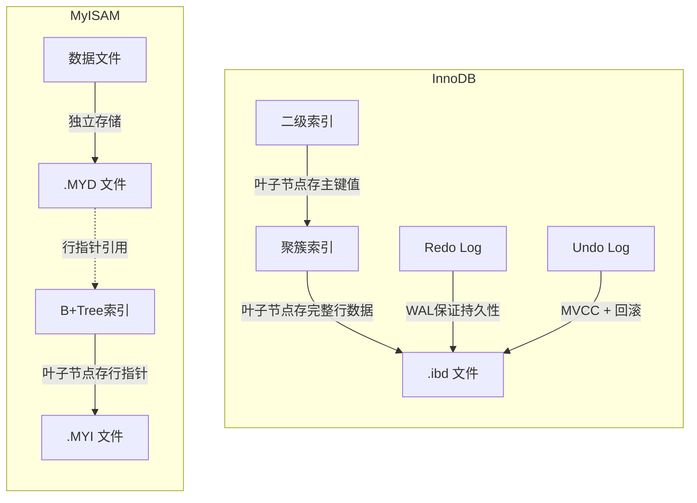
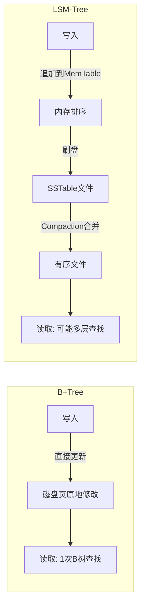
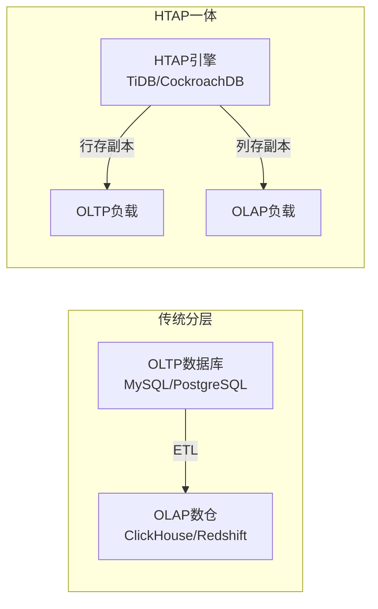
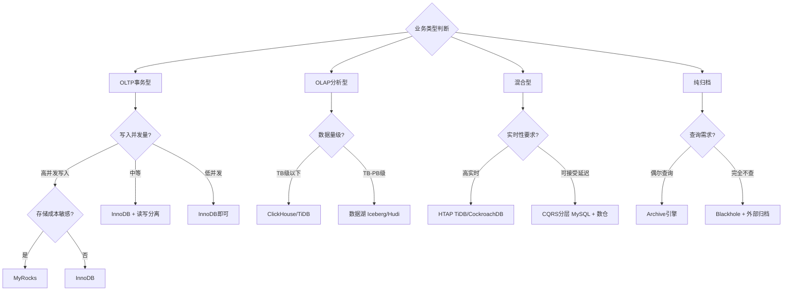

## 13.4 存储引擎对比

存储引擎是数据库的"内脏"——它决定了数据以什么结构写入磁盘、以什么方式被检索、以什么粒度加锁、以什么机制保证数据不丢。13.2节我们深入剖析了InnoDB的内部架构，但InnoDB只是MySQL插件式引擎生态中的一员。理解多种存储引擎的设计哲学和权衡取舍，不仅是架构选型的基础，更是深入理解数据库系统设计思想的必经之路。

本节从**架构设计原理**出发，系统对比主流存储引擎在存储结构、索引机制、事务模型、并发控制和可靠性保证等维度的实现差异，帮助你在架构选型时做出有据可依的决策。

---

### 13.4.1 存储引擎的核心职责

存储引擎本质上是数据库的"数据管家"，承担四大核心职责，每个职责对应一个独立的设计维度：



**存储管理**决定了数据在磁盘上的物理组织方式。以InnoDB为例，每张表的数据和索引存储在一个或多个`.ibd`文件中，文件内部按16KB的页（Page）组织，页内按行格式（Compact/Dynamic）存储数据。而MyISAM将索引和数据分离到`.MYI`和`.MYD`两个文件中，这种设计的直接后果是每次通过索引定位数据后还需要一次额外的磁盘I/O去读取数据文件。

**索引管理**决定了数据的查找效率。InnoDB使用聚簇索引——主键B+Tree的叶子节点直接存储完整的行数据，二级索引的叶子节点存储主键值（需要回表）。MyISAM使用非聚簇索引——所有索引的叶子节点存储行指针，指向`.MYD`文件中的物理位置。Memory引擎默认使用Hash索引（等值查询O(1)），也支持B+Tree但场景有限。

**事务与并发**是区分生产级引擎和轻量级引擎的分水岭。InnoDB通过Redo Log保证持久性、Undo Log支持回滚和MVCC、行级锁实现细粒度并发控制。MyISAM完全没有事务概念，表级锁在高并发写入时所有操作串行执行。

**可靠性保证**决定了数据库在异常情况下的数据安全性。InnoDB通过WAL（Write-Ahead Logging）机制——先写日志再写数据页——确保崩溃后能通过Redo Log恢复到一致状态。MyISAM崩溃后依赖操作系统缓存刷新，可能导致数据损坏。

这四个维度的不同组合，直接决定了每种存储引擎的性能特征和适用边界。

---

### 13.4.2 MySQL存储引擎全景

MySQL采用**可插拔存储引擎架构**（Pluggable Storage Engine），存储引擎与SQL层通过统一接口解耦。这意味着你可以在不修改上层SQL逻辑的情况下，切换底层的存储实现——这是MySQL在灵活性上的核心设计优势。

MySQL 8.0内置的存储引擎及其核心特征：

| 引擎 | 事务支持 | 锁粒度 | 索引结构 | 数据存储 | 主要用途 |
|------|---------|--------|---------|---------|---------|
| InnoDB | ✅ ACID | 行级锁 | 聚簇B+Tree | .ibd文件 | OLTP通用场景 |
| MyISAM | ❌ | 表级锁 | 非聚簇B+Tree | .MYD + .MYI | 读密集/全文索引(旧版) |
| Memory | ❌ | 表级锁 | Hash + B+Tree | 内存 | 临时表/缓存 |
| CSV | ❌ | 行级锁 | 无 | .csv文本 | 数据导入导出 |
| Archive | ❌ | 行级锁 | 无 | .arz压缩 | 日志归档 |
| Blackhole | ❌ | 表级锁 | 无 | 不存储 | 主从过滤 |
| NDB Cluster | ✅ ACID | 行级锁 | Hash + B+Tree | 内存分布式 | 高可用集群 |
| Aria | ✅ | 行级锁 | B+Tree | .MYD + .MYI | MyISAM崩溃恢复替代 |
| TokuDB | ✅ ACID | 行级锁 | Fractal Tree | .tokudb | 压缩/高写入吞吐 |
| RocksDB | ✅ ACID | 行级锁 | LSM-Tree | .rocksdb | 高写入/宽表分析 |

> **注**：MySQL 8.0已彻底移除MyISAM作为系统表引擎（改用InnoDB），MyISAM仅作为兼容性保留，不再推荐新项目使用。

**文件格式细节解析**

理解存储引擎的差异，必须深入到文件层面：

- **InnoDB .ibd文件**：每个表对应一个独立表空间文件（`innodb_file_per_table=ON`，MySQL 8.0默认开启）。文件内部按区（Extent，1MB=64个16KB页）组织，页是InnoDB磁盘I/O的最小单位。页内包含页头（138字节）、用户数据区（16KB）、页尾（8字节校验和）。

- **MyISAM .MYD + .MYI**：`.MYD`（MY Data）存储实际行数据，支持Fixed（定长）、Dynamic（变长）、Compressed三种格式。`.MYI`（MY Index）存储B+Tree索引，索引的叶子节点存储指向`.MYD`的行偏移量（row pointer）。两个文件分离意味着索引和数据可能在磁盘上不连续，增加随机I/O。

- **Archive .arz**：采用zlib压缩存储，仅支持顺序追加写入，不支持原地更新或删除。内部使用行压缩+批量压缩两级压缩策略，压缩比可达10:1以上。

- **Memory引擎**：所有数据存储在内存中，使用固定长度的行格式（变长字段如VARCHAR转为等长CHAR存储）。引擎重启后数据全部丢失。

---

### 13.4.3 InnoDB vs MyISAM：经典对比

这是MySQL历史上最经典的引擎对比。虽然MyISAM已退出主流，但理解二者的差异有助于深刻理解存储引擎设计中的核心权衡——**事务安全 vs 读取效率、行级锁 vs 表级锁、聚簇索引 vs 非聚簇索引**。

#### 架构差异



| 对比维度 | InnoDB | MyISAM |
|---------|--------|--------|
| **索引组织** | 聚簇索引：主键B+Tree叶子存完整行 | 非聚簇索引：索引与数据文件分离 |
| **事务** | 完整ACID支持，支持SAVEPOINT | 不支持事务，操作非原子性 |
| **锁粒度** | 行级锁（基于索引加锁） | 表级锁（读写互斥，写写互斥） |
| **崩溃恢复** | Redo Log + Undo Log，秒级恢复 | 依赖操作系统缓存，可能损坏 |
| **外键** | 支持 | 不支持 |
| **MVCC** | 多版本并发控制，读不阻塞写 | 无MVCC，读写互斥 |
| **AUTO_INCREMENT** | MySQL 8.0持久化到Redo Log，重启保持 | 计数器写入表头文件，重启保持 |
| **COUNT(\*)** | 需遍历聚簇索引（无缓存时为全表扫描） | 存储行数于表头，O(1)查询 |
| **全文索引** | MySQL 5.6+支持（倒排索引） | 原生支持，更成熟（但已过时） |
| **压缩** | 表空间压缩（KEY_BLOCK_SIZE） | 表级压缩（myisampack工具） |
| **行格式** | Compact/Dynamic/Compressed | Fixed/Dynamic/Compressed |

#### 性能特征对比

**写密集场景**：InnoDB完胜。MyISAM的表级锁在高并发写入时会成为严重瓶颈——所有写操作串行执行。实测数据表明，在16线程并发写入场景下，InnoDB的写入吞吐量是MyISAM的3-5倍。InnoDB的行级锁允许不同行的写操作并行进行，且其Buffer Pool中的Change Buffer机制可以延迟合并非唯一二级索引的更新，进一步减少随机I/O。

**读密集场景**：MyISAM在纯读场景下有微弱优势（无MVCC版本链遍历开销），但差距在现代硬件（SSD + 大内存）上已不明显。MyISAM的Key Buffer只缓存索引页，数据页依赖OS的Page Cache；而InnoDB的Buffer Pool同时缓存索引和数据页，对热数据的命中率更高。

**混合读写场景**：InnoDB是唯一合理选择。MyISAM的读写互斥（写锁会阻塞所有读操作）导致性能骤降。在真实的OLTP业务中（典型的7:3读写比），InnoDB的综合吞吐量远超MyISAM。

**关键差异：二级索引查找路径**

这是很多开发者忽略的性能差异根源：

-- InnoDB: 二级索引查找需要2次B+Tree遍历
二级索引树查找 → 获得主键值 → 聚簇索引树查找 → 获得完整行
-- 优势：如果SELECT的列都在二级索引中（覆盖索引），无需回表

-- MyISAM: 索引查找只需1次B+Tree遍历 + 1次文件I/O
索引树查找 → 获得行指针 → .MYD文件随机读取
-- 劣势：索引与数据分离，无法避免额外I/O

```sql
-- 查看当前MySQL支持的存储引擎
SHOW ENGINES;

-- 查看表使用的存储引擎
SHOW TABLE STATUS WHERE Name = 'your_table'\G

-- 查看InnoDB状态（包含行锁等待、事务信息等）
SHOW ENGINE INNODB STATUS\G

-- 查看各引擎在当前数据库中的空间占用
SELECT ENGINE, 
       COUNT(*) AS tables,
       ROUND(SUM(DATA_LENGTH) / 1024 / 1024, 2) AS data_mb,
       ROUND(SUM(INDEX_LENGTH) / 1024 / 1024, 2) AS index_mb,
       ROUND(SUM(DATA_FREE) / 1024 / 1024, 2) AS free_mb
FROM information_schema.TABLES
WHERE TABLE_SCHEMA = DATABASE()
GROUP BY ENGINE;
```

---

### 13.4.4 InnoDB vs Memory引擎

Memory引擎将数据存储在内存中，理论读写延迟在微秒级别，但适用范围非常有限——这不是"更快的InnoDB"，而是一个完全不同的工具。

| 对比维度 | InnoDB | Memory |
|---------|--------|--------|
| **存储位置** | 磁盘（Buffer Pool缓存热点数据） | 纯内存 |
| **持久化** | Redo Log保证持久性 | 重启丢失全部数据 |
| **索引** | B+Tree（有序范围查询高效） | 默认Hash（等值查询O(1)） |
| **锁粒度** | 行级锁 | 表级锁 |
| **BLOB/TEXT** | 支持 | 不支持 |
| **变长字段** | 按实际长度存储 | 转为定长存储（VARCHAR→CHAR） |
| **AUTO_INCREMENT** | 支持 | 支持，但重启后重置为1 |
| **事务** | 完整ACID | 不支持 |

**适用场景**：

- **临时表**：子查询中间结果存储，MySQL优化器在执行复杂JOIN时会自动创建Memory临时表
- **数据字典缓存**：将配置表的内存副本存放在Memory引擎中，程序启动时加载
- **会话状态缓存**：可重建的、生命周期短暂的键值对存储
- **测试基准**：模拟纯内存环境下的查询性能

```sql
-- 创建Memory表示例
CREATE TABLE session_cache (
    session_id VARCHAR(64) PRIMARY KEY,
    user_id INT NOT NULL,
    expires_at BIGINT NOT NULL
) ENGINE=MEMORY;

-- 关键限制：
-- 1. 重启后数据全部丢失
-- 2. VARCHAR列按CHAR列最大长度存储，浪费内存
-- 3. 不支持BLOB/TEXT列
-- 4. 表级锁，高并发下成为瓶颈

-- 计算Memory表的实际内存占用（预估值）
SELECT TABLE_NAME, 
       DATA_LENGTH / 1024 / 1024 AS memory_mb,
       TABLE_ROWS
FROM information_schema.TABLES
WHERE TABLE_SCHEMA = DATABASE() 
  AND ENGINE = 'MEMORY';
```

> **常见误区**：很多开发者因为"Memory引擎用内存所以快"而盲目选用。实际上InnoDB的Buffer Pool机制已经将热点数据缓存在内存中，对于热数据的读取性能差距极小。而Memory引擎丢失了事务支持、行级锁、持久化、BLOB/TEXT支持等关键能力，得不偿失。在MySQL 8.0中，优化器对临时表的处理已经很智能——它会在Memory临时表超过`tmp_table_size`时自动转换为基于磁盘的内部临时表（InnoDB），无需手动干预。

---

### 13.4.5 InnoDB vs Archive引擎

Archive引擎专为**写入密集、极少查询**的场景设计，核心特点是极高压缩比和极快的顺序写入速度——但它不是通用存储引擎，而是一个"数据只进不出"的特殊工具。

| 对比维度 | InnoDB | Archive |
|---------|--------|---------|
| **压缩比** | 2:1 ~ 3:1 | 10:1 ~ 15:1 |
| **写入吞吐** | 中等（支持随机写） | 极高（批量追加写入） |
| **SELECT查询** | 完整支持 | 仅支持WHERE条件扫描（无索引，全表扫描） |
| **UPDATE/DELETE** | 支持 | 不支持（不支持原地修改） |
| **索引** | B+Tree聚簇索引 | 不支持索引 |
| **事务** | 支持 | 每条INSERT独立提交，不支持START TRANSACTION |
| **复制** | 支持 | 支持（ROW格式） |
| **行数统计** | 精确（InnoDB内部维护） | 维护，但SELECT COUNT(*)仍需扫描 |

**适用场景**：

- **审计日志**：写入后几乎不需要读取，只在合规审计时批量导出
- **传感器数据采集**：写入频率极高（每秒数万条），分析时按时间范围批量导出
- **历史数据归档**：将冷数据从InnoDB迁移到Archive，释放主库空间
- **MySQL binlog备份**：利用Blackhole + Archive组合实现binlog的压缩备份

```sql
-- Archive表：写入极快，压缩比极高
CREATE TABLE audit_log (
    log_id BIGINT AUTO_INCREMENT,
    action VARCHAR(32),
    detail TEXT,
    created_at DATETIME DEFAULT CURRENT_TIMESTAMP,
    PRIMARY KEY (log_id)
) ENGINE=ARCHIVE;

-- 写入测试：Archive写入吞吐可达InnoDB的5-10倍
-- 实测数据（SSD环境，单线程顺序插入）：
-- InnoDB: ~15,000 rows/sec（开启autocommit）
-- Archive: ~80,000 rows/sec
-- Archive（批量插入）: ~200,000 rows/sec

-- Archive支持的查询方式
SELECT * FROM audit_log WHERE created_at BETWEEN '2026-01-01' AND '2026-06-01';
-- 注意：没有索引，这是全表扫描（顺序I/O），但Archive的顺序读取速度很快

-- 不支持的操作（会报错）
UPDATE audit_log SET action = 'modified' WHERE log_id = 100;  -- ❌ 不支持
DELETE FROM audit_log WHERE log_id = 100;                      -- ❌ 不支持
```

---

### 13.4.6 MySQL之外：跨数据库引擎对比

不同数据库的存储引擎设计体现了截然不同的架构哲学。MySQL选择了"可插拔、多引擎"的灵活路线，而其他数据库在存储层走出了不同的道路。

#### PostgreSQL的统一存储引擎

PostgreSQL没有可插拔存储引擎的概念——它只有一种存储引擎，将事务处理、MVCC、索引管理等全部内建。这种"一体化"设计的好处是各组件深度优化、配合紧密，代价是用户无法按需替换底层实现。

PostgreSQL 14引入了**表访问方法（Table Access Method）**接口，为替换底层存储实现打开了大门：

| PostgreSQL方案 | 存储结构 | 特点 |
|---------------|---------|------|
| **Heap Table**（默认） | 堆表 + TOAST | 通用OLTP，MVCC基于行版本 |
| **Zheap**（实验性） | Undo-based MVCC | 解决堆表膨胀问题，类似InnoDB |
| **columnar**（TimescaleDB） | 列式压缩 | 时序数据分析 |
| **Citus** | 分布式扩展 | 水平分片，分布式查询 |

**PostgreSQL vs InnoDB的MVCC实现差异**

这是两种引擎在架构层面最本质的区别：

| 维度 | InnoDB | PostgreSQL |
|------|--------|-----------|
| **版本存储** | 旧版本存Undo Log（独立表空间） | 旧版本存在Heap表同一页面内 |
| **清理机制** | 后台Purge线程回收Undo空间 | VACUUM手动/autovacuum自动清理 |
| **表膨胀** | Undo空间独立管理，对主表影响小 | 长事务阻止VACUUM清理，导致表膨胀严重 |
| **索引维护** | 二级索引指向主键（主键变更需级联更新） | 二级索引指向物理TID（行移动不影响索引） |
| **写放大** | 适中（聚簇索引一次写入） | 较高（MVCC版本写入 + VACUUM清理 + HOT更新链） |
| **长事务影响** | Undo Log膨胀，占用表空间 | 阻塞VACUUM，导致bloat累积，性能持续劣化 |

> **实践启示**：PostgreSQL DBA最怕的场景是"长事务+autovacuum配置不当"——一个运行数小时的事务会阻止VACUUM回收死元组，导致表膨胀到原始大小的数倍。InnoDB因为使用独立的Undo Log空间，表膨胀问题相对可控。

#### Oracle的存储架构

Oracle采用**段-区-块（Segment-Extent-Block）**的三层存储层级，这是一套成熟而精细的存储管理体系：

| 概念 | 含义 | InnoDB对应 |
|------|------|-----------|
| Tablespace | 逻辑存储容器，可跨越多个数据文件 | 表空间（.ibd） |
| Segment | 一个表或索引的全部数据 | 表空间中的逻辑分区 |
| Extent | 区：连续的物理块集合（通常64KB~1MB） | 区（默认1MB，64个16KB页） |
| Block | 块：最小I/O单位（通常8KB） | 页（默认16KB） |

Oracle使用**Undo表空间**管理MVCC，与InnoDB的Undo Log机制类似，但Oracle的多版本控制更加精细——支持**闪回查询（Flashback Query）**和**闪回表（Flashback Table）**，可以在不依赖日志的情况下读取任意时间点的历史版本数据：

```sql
-- Oracle闪回查询示例
SELECT * FROM orders 
AS OF TIMESTAMP TO_TIMESTAMP('2026-06-26 10:30:00', 'YYYY-MM-DD HH24:MI:SS')
WHERE order_id = 1001;

-- MySQL 8.0对应的替代方案：通过binlog回放（远不如Oracle方便）
-- mysqlbinlog --start-datetime="2026-06-26 10:30:00" binlog.000042 | mysql
```

#### MariaDB的引擎生态扩展

MariaDB作为MySQL的分支，在存储引擎层面做了显著扩展：

| MariaDB引擎 | 基础 | 特点 | 适用场景 |
|------------|------|------|---------|
| **XtraDB** | InnoDB增强版 | 性能优化、MRR改进、并行复制优化 | 替代InnoDB（MariaDB默认） |
| **Aria** | MyISAM增强版 | 支持事务+崩溃恢复 | MyISAM遗留场景的平滑迁移 |
| **ColumnStore** | 列式存储引擎 | 分布式列存，支持标准SQL | OLAP分析、数据仓库 |
| **Spider** | 分布式存储引擎 | 内建分片，支持跨节点JOIN | 水平扩展、多活架构 |
| **S3** | 对象存储引擎 | 将S3作为存储后端 | 冷数据归档、成本优化 |

---

### 13.4.7 LSM-Tree vs B+Tree：两种核心存储范式

理解B+Tree和LSM-Tree的差异，不仅是选引擎的知识储备，更是理解"写放大、读放大、空间放大"这一存储系统三元悖论（RUM Conjecture）的基础。



| 维度 | B+Tree（InnoDB/MyISAM） | LSM-Tree（RocksDB/MyRocks） |
|------|------------------------|---------------------------|
| **写入模式** | 随机写（原地更新数据页） | 顺序写（追加到MemTable + Compaction） |
| **写放大** | 低（~1x，直接写数据页） | 高（10x-30x，因多层Compaction） |
| **读放大** | 低（O(log N)，B树高度通常3-4层） | 高（可能需要查MemTable + 多层SSTable） |
| **空间放大** | 低（页填充率通常50%-100%） | 中等（SSTable之间有重叠数据，Compaction后改善） |
| **磁盘I/O模式** | 随机I/O为主 | 顺序I/O为主 |
| **适合场景** | OLTP事务型（点查+范围查） | 日志/时序/宽表写入 |
| **SSD友好度** | 中等（随机写磨损SSD） | 高（顺序写延长SSD寿命） |
| **压缩支持** | 页级压缩（InnoDB page compression） | SSTable级压缩（压缩比更高） |

**LSM-Tree的Compaction策略**

Compaction是LSM-Tree的核心机制，也是其性能调优的关键：

- **Size-Tiered Compaction**：当相似大小的SSTable达到阈值数量时合并。写放大低，但空间放大高（同一key可能存在多份）。适合写密集场景。
- **Leveled Compaction**：每个Level有固定大小上限，超出时将最大文件合并到下一层。读放大和空间放大低，但写放大高。适合读写混合场景。RocksDB默认使用此策略。
- **FIFO Compaction**：直接丢弃过期的SSTable，不做合并。适合TTL数据（如日志保留7天）。

#### MySQL中的LSM-Tree引擎

以RocksDB为代表的LSM-Tree引擎正在MySQL生态中崛起：

| 引擎 | 基础 | 压缩比 | 写入吞吐 | 适用场景 |
|------|------|--------|---------|---------|
| **RocksDB** | Facebook开源LSM引擎 | 高 | 极高 | 写密集/宽表/嵌入式 |
| **MyRocks** | MySQL + RocksDB存储引擎 | 极高（比InnoDB少50%+空间） | 极高 | 日志/时序/高写入 |
| **TokuDB** | Fractal Tree索引 | 极高 | 高 | 高压缩需求/DDL操作 |

**MyRocks vs InnoDB实测对比**（Percona官方基准测试数据）：

| 指标 | InnoDB | MyRocks | 差异 |
|------|--------|---------|------|
| 点查吞吐 | 基准 | 持平~+5% | 接近 |
| 范围扫描 | 基准 | 慢10%-30% | LSM读放大 |
| 写入吞吐 | 基准 | 快20%-50% | 顺序写优势 |
| 存储空间 | 基准 | 节省40%-60% | 压缩比优势 |
| 压缩率 | ~50% | ~25%（相同数据） | 显著优势 |

> **选择建议**：如果你的数据特征是"写入远多于读取、存储空间紧张、对范围查询性能要求不高"，MyRocks是极佳选择。Facebook在生产环境中将MySQL的存储引擎从InnoDB切换到MyRocks后，存储成本降低了约50%。

---

### 13.4.8 HTAP混合引擎趋势

随着业务复杂度提升，纯OLTP或纯OLAP架构都难以满足"实时分析+在线交易"的双重需求。HTAP（Hybrid Transactional/Analytical Processing）引擎成为新趋势：



| HTAP方案 | 架构 | OLTP能力 | OLAP能力 | 生态成熟度 |
|---------|------|---------|---------|-----------|
| **TiDB** | 分布式NewSQL（TiKV行存 + TiFlash列存） | 强（MySQL协议兼容） | 中（TiFlash分析） | 高（社区活跃） |
| **CockroachDB** | 分布式NewSQL | 强 | 中（列式存储实验性） | 中 |
| **PolarDB-X** | 阿里云HTAP | 强 | 强（列存索引+实时分析） | 中（阿里云生态） |
| **OceanBase** | 蚂蚁金服分布式 | 强 | 中（列存副本） | 中（蚂蚁生态） |

**HTAP的核心挑战**：行存和列存副本之间的一致性延迟。TiDB的TiFlash通过异步复制（秒级延迟）实现列存副本同步，对于"T+1报表"类需求足够，但对"秒级实时分析"需求仍需结合流计算引擎（如Flink）。

---

### 13.4.9 选型决策框架

面对众多存储引擎和数据库方案，如何做出正确的选择？关键是理解业务的数据特征和访问模式，而非追求"最新最酷"的技术栈。



**核心选型原则**：

| 原则 | 说明 |
|------|------|
| **默认选InnoDB** | MySQL环境下，90%以上场景InnoDB都是最优选择 |
| **不要过早优化** | 先用InnoDB跑通业务，遇到明确瓶颈再考虑专用引擎 |
| **理解数据特征** | 写多读少 → Archive/MyRocks；读多写少 → InnoDB + 缓存层 |
| **关注运维成本** | 小众引擎的监控、备份、恢复工具往往不完善 |
| **评估团队能力** | 如果团队不熟悉RocksDB的调优参数，选InnoDB可能比选RocksDB更优 |
| **考虑生态兼容** | ORM框架、监控工具、备份工具对不同引擎的支持程度差异很大 |

**按业务场景的具体推荐**：

| 业务场景 | 推荐引擎 | 理由 |
|---------|---------|------|
| 电商交易 | InnoDB | 事务ACID、行锁、外键保证数据一致性 |
| 用户行为日志 | MyRocks / Archive | 写入吞吐高、压缩比大、存储成本低 |
| 会话缓存 | Memory（有限场景） | 低延迟、可重建数据 |
| 审计日志 | Archive | 写入快、压缩比高、极少查询 |
| 数据导入导出中间层 | CSV | 文本格式通用，方便程序解析 |
| 主从过滤 | Blackhole | 丢弃数据只复制binlog，用于特殊架构 |
| 分布式MySQL | NDB Cluster | 原生分布式，适合电信级高可用 |

---

### 13.4.10 引擎切换的实战注意事项

从一个引擎迁移到另一个引擎看似简单（`ALTER TABLE ... ENGINE=xxx`），但实际上隐藏着多个陷阱。以下是生产环境中最容易踩坑的点：

**1. 外键依赖检查**

```sql
-- 切换引擎前必须先删除外键约束
-- 否则在目标引擎不支持外键时会直接报错

-- 步骤1：查找所有外键约束
SELECT CONSTRAINT_NAME, TABLE_NAME, COLUMN_NAME, REFERENCED_TABLE_NAME
FROM information_schema.KEY_COLUMN_USAGE
WHERE REFERENCED_TABLE_NAME IS NOT NULL
  AND TABLE_NAME = 'order_items';

-- 步骤2：逐个删除外键
ALTER TABLE order_items DROP FOREIGN KEY fk_product;

-- 步骤3：修改引擎
ALTER TABLE order_items ENGINE = InnoDB;

-- 步骤4：重新添加外键
ALTER TABLE order_items ADD CONSTRAINT fk_product
    FOREIGN KEY (product_id) REFERENCES products(id);
```

**2. 全文索引迁移**

MyISAM到InnoDB迁移时，原有的FULLTEXT索引需要重建。虽然MySQL 5.6+的InnoDB已支持全文索引，但需注意：

- InnoDB全文索引使用**倒排索引**实现，分词算法与MyISAM的ngram/MeCab parser可能存在差异
- 停用词列表不同（InnoDB有自己的内置停用词表）
- 权重评分算法有细微差异，已有的全文搜索相关性排序可能发生变化
- 建议迁移后重新测试搜索结果的相关性

**3. AUTO_INCREMENT行为差异**

```sql
-- InnoDB的AUTO_INCREMENT行为演进：
-- MySQL 5.7: 计数器存储在内存中，重启后取 MAX(id) + 1
--   → 如果删除了最大ID的行再重启，可能出现ID回退（虽然实际极少触发）
-- MySQL 8.0: 计数器持久化到Redo Log，重启后保持
--   → 解决了5.7的ID回退问题

-- MyISAM: 计数器直接写入表头文件，重启不丢失
-- 但在并发INSERT时效率较低（表级锁保护计数器）

-- 迁移建议：
-- 1. 从MyISAM迁移到InnoDB前，确认当前AUTO_INCREMENT值
SELECT AUTO_INCREMENT FROM information_schema.TABLES
WHERE TABLE_NAME = 'your_table';

-- 2. 迁移后验证AUTO_INCREMENT行为一致
```

**4. 隐式转换陷阱**

```sql
-- MEMORY表包含BLOB/TEXT列时的隐式行为：
-- MySQL 8.0: 直接拒绝创建 MEMORY 表（报错）
-- MySQL 5.x 某些版本: 静默转换为 InnoDB
-- 这可能导致你以为在用Memory引擎，实际已经在用InnoDB

-- 最佳实践：创建表时显式指定引擎
CREATE TABLE temp_data (
    id INT PRIMARY KEY,
    payload BLOB
) ENGINE = MEMORY;
-- MySQL 8.0会报错：BLOB column 'payload' is not allowed with 'MEMORY' engine

-- 另一个隐式转换场景：
-- ALTER TABLE时如果参数不兼容，MySQL可能静默切换引擎
-- 例：添加一个MEMORY不支持的列类型
ALTER TABLE mem_table ADD COLUMN data JSON;
-- 某些版本会静默将表转为InnoDB，务必检查确认

-- 验证引擎是否发生变化
SHOW TABLE STATUS WHERE Name = 'mem_table'\G
```

**5. 迁移后的索引重建**

```sql
-- ALTER TABLE ... ENGINE=xxx 实际执行流程：
-- 1. 创建新表（目标引擎）
-- 2. 逐行复制数据
-- 3. 重建所有索引
-- 4. 删除旧表
-- 5. 重命名新表

-- 对于大表（>1GB），建议使用 pt-online-schema-change（Percona Toolkit）
-- 或 gh-ost（GitHub开源）实现在线迁移，避免锁表

-- pt-online-schema-change示例
-- pt-online-schema-change --alter "ENGINE=InnoDB" \
--   D=mydb,t=large_table \
--   --execute
```

---

### 13.4.11 常见误区与最佳实践

**误区一："Memory引擎比InnoDB快，所以用它做缓存表更好"**

InnoDB的Buffer Pool已经将热点数据缓存在内存中。对于热数据（Buffer Pool命中率>99%时），InnoDB和Memory引擎的读取性能差距极小（都在微秒级）。而Memory引擎丢失了事务、持久化、行锁、BLOB/TEXT支持等关键能力，得不偿失。唯一适合Memory引擎的场景是可重建的、不需要持久化的临时数据。

**误区二："MyISAM的COUNT(*)更快，所以统计类表应该用MyISAM"**

MyISAM的COUNT(*)确实O(1)——它在表头维护了行数计数器。但这是以牺牲事务和并发能力为代价的。现代方案是在InnoDB中用缓存表维护计数器（如Redis的INCR），或使用单独的计数服务。另外，InnoDB在`COUNT(*)`不带WHERE条件时可以利用索引的cardinality信息加速（MySQL 8.0优化器改进）。

**误区三："Archive表不能查询，所以没有用"**

Archive支持SELECT和WHERE条件查询，只是不支持索引。对于审计日志等场景，按时间范围扫描Archive表完全可行——Archive的顺序I/O读取速度很快。不支持UPDATE/DELETE是正确的设计——审计日志本就不应被修改。

**误区四："存储引擎选型是一次性决定"**

存储引擎可以随时切换（`ALTER TABLE ENGINE=xxx`），但要注意：大表迁移耗时长（需要全表复制+索引重建）、外键约束需要先删除、全文索引需要重新评估。建议在架构设计阶段就明确数据特征和性能需求，而非在上线后反复调整。

**误区五："LSM-Tree一定比B+Tree写入快"**

LSM-Tree的写入优势在高吞吐场景下才明显。对于低并发的事务写入（每秒数百次），B+Tree的原地更新方式因为没有Compaction开销，实际写入延迟可能更低。LSM-Tree的Compaction在后台消耗大量I/O和CPU资源，如果Compaction不及时，会导致读性能急剧下降。

**最佳实践总结**：

```sql
-- 1. 始终在CREATE TABLE时显式指定存储引擎（不依赖默认值）
CREATE TABLE orders (
    id BIGINT AUTO_INCREMENT PRIMARY KEY,
    user_id BIGINT NOT NULL,
    amount DECIMAL(10,2) NOT NULL,
    status TINYINT DEFAULT 0,
    created_at DATETIME DEFAULT CURRENT_TIMESTAMP,
    INDEX idx_user (user_id),
    INDEX idx_created (created_at)
) ENGINE = InnoDB DEFAULT CHARSET = utf8mb4;

-- 2. 监控各引擎的空间占用
SELECT ENGINE, 
       COUNT(*) AS table_count,
       ROUND(SUM(DATA_LENGTH + INDEX_LENGTH) / 1024 / 1024, 2) AS total_mb,
       ROUND(SUM(DATA_FREE) / 1024 / 1024, 2) AS fragmented_mb
FROM information_schema.TABLES 
WHERE TABLE_SCHEMA = DATABASE()
GROUP BY ENGINE
ORDER BY total_mb DESC;

-- 3. 定期检查InnoDB关键指标
SHOW TABLE STATUS\G

-- 4. InnoDB关键参数调优（根据硬件配置调整）
SET GLOBAL innodb_buffer_pool_size = '8G';       -- 物理内存的60-80%
SET GLOBAL innodb_log_file_size = '2G';          -- Redo Log大小（MySQL 8.0.30+已合并为ib_logfile）
SET GLOBAL innodb_flush_log_at_trx_commit = 1;   -- 每次提交刷盘（安全性最高）
SET GLOBAL innodb_io_capacity = 2000;            -- SSD建议2000-10000
SET GLOBAL innodb_io_capacity_max = 4000;        -- 突发写入时的I/O能力上限

-- 5. 对于生产环境，建议维护一张引擎使用汇总视图
CREATE OR REPLACE VIEW v_engine_stats AS
SELECT 
    TABLE_SCHEMA,
    ENGINE,
    COUNT(*) AS tables,
    ROUND(SUM(DATA_LENGTH) / 1024 / 1024, 2) AS data_mb,
    ROUND(SUM(INDEX_LENGTH) / 1024 / 1024, 2) AS index_mb,
    ROUND(SUM(DATA_LENGTH + INDEX_LENGTH) / 1024 / 1024, 2) AS total_mb,
    MAX(CREATE_TIME) AS latest_create,
    MAX(UPDATE_TIME) AS latest_update
FROM information_schema.TABLES
WHERE TABLE_SCHEMA NOT IN ('mysql', 'information_schema', 'performance_schema', 'sys')
GROUP BY TABLE_SCHEMA, ENGINE;
```

---

### 13.4.12 本节小结

存储引擎的选择本质上是在**事务保证、并发能力、读写性能、存储效率**四个维度间寻找平衡点。没有"最好的引擎"，只有"最适合的引擎"。

**核心要点回顾**：

1. **InnoDB是MySQL的默认选择**——90%以上的业务场景中，InnoDB都是最安全、最通用的方案。它的ACID事务、行级锁、MVCC、崩溃恢复能力构成了生产级数据库的基石。

2. **专用引擎解决特定问题**——Archive用于高压缩归档、Memory用于可重建缓存、MyRocks用于写密集+空间敏感场景。使用它们的前提是你明确理解其能力边界。

3. **理解设计哲学比记住功能列表更有价值**——B+Tree vs LSM-Tree的本质是"读放大-写放大-空间放大"三元悖论的权衡；聚簇索引 vs 非聚簇索引的本质是"数据局部性 vs 索引灵活性"的取舍。

4. **跨数据库视角拓宽选型思路**——PostgreSQL的一体化设计、Oracle的精细存储管理、TiDB的分布式HTAP，都是解决同一问题的不同路径。理解这些差异，才能在架构选型时不被单一技术栈的思维定式束缚。

技术在演进，引擎在更新，但设计思想是永恒的。掌握存储引擎的核心设计原理，你就能在面对任何新引擎时快速理解其定位和价值。
