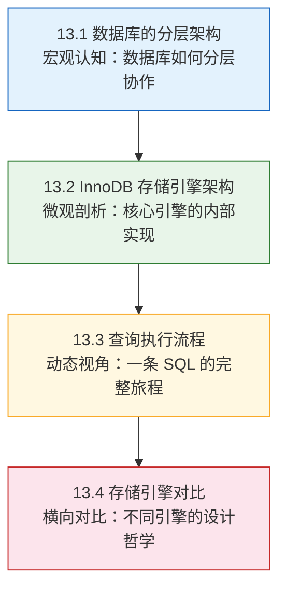
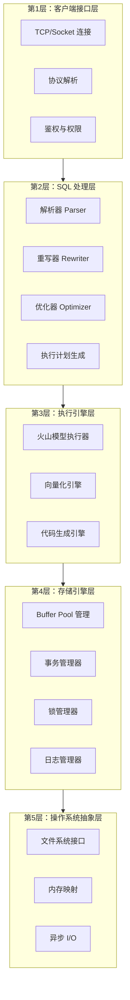
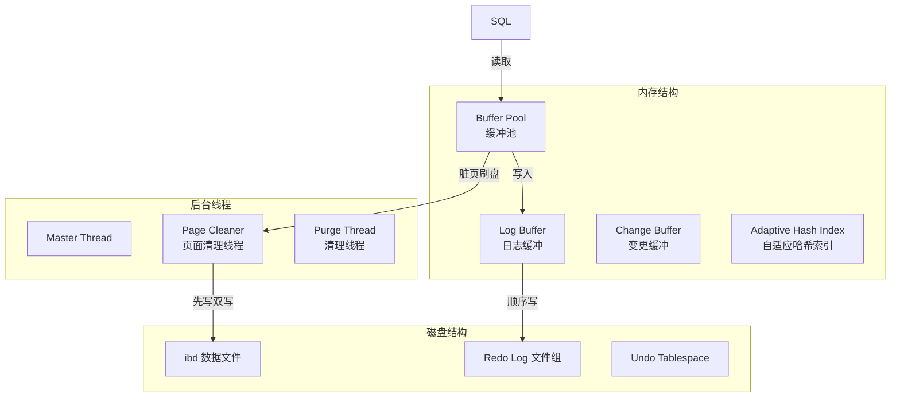
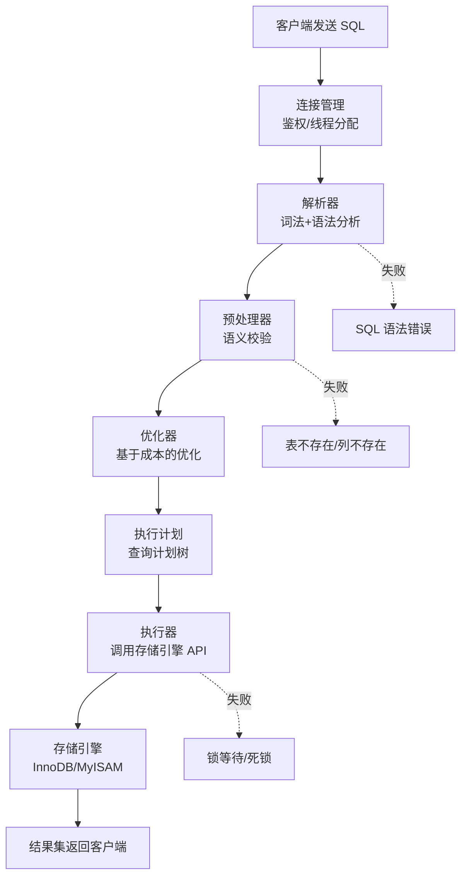
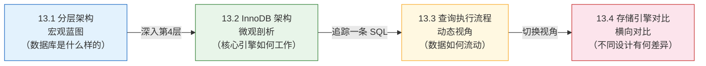

# 理论基础

关系型数据库是一个精密的多层协作系统。当你执行一条 `SELECT` 或 `UPDATE` 语句时，数据库内部会经历连接建立、SQL 解析、查询优化、执行引擎调度、缓冲池管理、事务日志写入、磁盘 I/O 等十几个环节。理解这条完整的链路，是进行性能调优、故障诊断和架构选型的根本前提。

本节从宏观到微观，分四个维度构建关系型数据库的理论认知框架：

---

## 本节的定位与价值

在整章知识体系中，理论基础是**"道"的层面**——它回答"为什么数据库要这样设计"，而非"怎么用"。掌握这些理论后，你将获得以下能力：

| 能力 | 具体表现 | 对应章节 |
|------|---------|---------|
| **架构感知力** | 看到一条慢查询，能迅速判断问题出在哪一层——是 SQL 写法问题、优化器误判、Buffer Pool 命中率低，还是磁盘 I/O 瓶颈 | 13.1 |
| **引擎理解力** | 理解 InnoDB 为什么这样设计 Buffer Pool、Redo Log 和 Undo Log，以及这些机制之间的协作关系 | 13.2 |
| **流程追溯力** | 能完整描述一条 SQL 从文本到结果的执行路径，知道每个阶段可能发生的错误和性能瓶颈 | 13.3 |
| **选型判断力** | 面对不同业务场景（OLTP/OLAP/混合），能基于存储引擎的架构差异做出合理的技术选型 | 13.4 |

---

## 四个核心子节概览

### 13.1 数据库的分层架构——从全局俯瞰

关系型数据库不是一个铁板一块的黑盒，而是由**五个层次**组成的协作系统：客户端接口层、SQL 处理层、执行引擎层、存储引擎层、操作系统抽象层。每一层都有明确的职责边界，层与层之间通过定义良好的接口通信。

**核心内容包括：**

- **为什么数据库要分层**：关注点分离（Separation of Concerns）的设计原则，分层如何实现模块独立演进、接口标准化、问题定位和技术替换
- **客户端接口层**：TCP 连接建立流程、三种连接模型（进程/线程/线程池）的对比、连接池的参数调优、MySQL 客户端/服务器协议的报文结构
- **SQL 处理层**：解析器的词法分析与语法分析、重写器的语义校验与等价变换（视图展开、子查询转换）、优化器的 RBO 与 CBO 策略、基数估算的核心挑战、执行计划的生成过程
- **执行引擎层**：火山模型（Volcano Model）的逐行迭代机制、向量化执行（Vectorized Execution）的批量处理原理与 SIMD 加速、代码生成（Code Generation）的动态编译路径，三种模型的性能对比
- **存储引擎层**：五大核心职责（数据组织、缓冲池管理、事务管理、并发控制、崩溃恢复）的概述
- **操作系统抽象层**：文件系统选择（ext4/XFS/ZFS）、mmap 内存映射、异步 I/O（libaio/io_uring）、OS 层调优参数（Swap、I/O 调度器、NUMA 绑定）
- **层间数据流**：一条 SQL 从客户端到磁盘的完整旅程，每层的输入输出关系
- **分层诊断框架**：按层级逐层排查性能问题的系统化方法

### 13.2 InnoDB 存储引擎架构——核心引擎的内部实现

InnoDB 是 MySQL 的默认存储引擎，也是全球使用最广泛的 OLTP 存储引擎。本节从**内存结构、磁盘结构、后台线程**三个维度完整剖析 InnoDB 的内部架构。

**核心内容包括：**

- **Buffer Pool（缓冲池）**：三链表机制（LRU 链表 / Free 链表 / Flush 链表）的协作流程、改进的 LRU 算法（Midpoint Insertion Strategy）如何防止全表扫描污染热点数据、多实例配置策略、预热与恢复机制、核心监控指标（命中率计算公式、脏页比例、等待空闲页次数）
- **Change Buffer（变更缓冲）**：非唯一二级索引的延迟写入原理、merge 触发时机、适用条件与限制
- **Adaptive Hash Index（自适应哈希索引）**：B-tree 到 Hash 的自动转换机制、触发条件（连续访问 18 次 + 等值查询命中 100 次）、适用场景与关闭策略
- **Log Buffer（日志缓冲）**：`innodb_flush_log_at_trx_commit` 的三种刷盘策略（0/1/2）在安全性与性能间的权衡
- **表空间体系**：系统表空间 / 独立表空间 / 临时表空间 / Undo 表空间的职责划分、数据页 16KB 内部结构（File Header → Page Header → Infimum/Supremum → User Records → Page Directory → File Trailer）
- **Redo Log（重做日志）**：WAL 策略的原理与必要性、循环写入的文件组织、write_pos 与 checkpoint 的空间管理、LSN（Log Sequence Number）的概念与应用、两阶段提交（2PC）保证主从一致性的机制
- **Undo Log（回滚日志）**：三种 DML 操作的 Undo Log 类型、MVCC 版本链的形成与可见性判断、ReadView 的工作机制
- **后台线程**：Master Thread、Page Cleaner Thread、Purge Thread、Insert Buffer Thread 的职责与协作

### 13.3 查询执行流程——一条 SQL 的完整旅程

当用户提交一条 SQL 语句，MySQL 从接收文本到返回结果，经历了一个精密的多阶段流水线。理解这条流水线是诊断慢查询、优化性能的根本前提。

**核心内容包括：**

- **连接管理阶段**：TCP 三次握手 → SSL 握手 → 身份验证 → 线程分配的完整流程，`Threads_connected` / `Threads_running` / `Threads_cached` 指标的含义与调优
- **解析器**：词法分析将 SQL 拆分为 Token 流、语法分析构建语法树（Parse Tree）、常见语法错误的诊断方法
- **预处理器**：表名验证、列名验证、类型检查、权限验证的语义校验过程
- **优化器（核心阶段）**：成本模型（IO 成本 + CPU 成本）、表连接顺序的动态规划决策、索引选择与基数估算、优化器提示（`FORCE INDEX`、`IGNORE INDEX`、`JOIN_ORDER`）、子查询优化（半连接 Semi-Join）、优化器 Trace 的使用方法
- **EXPLAIN 执行计划**：type 字段的性能阶梯（system → const → eq_ref → ref → range → index → ALL）、key / key_len / rows / filtered / Extra 字段的解读、`Using index` / `Using filesort` / `Using temporary` 等关键标志的优化建议
- **EXPLAIN ANALYZE**（MySQL 8.0.18+）：实际执行统计与 EXPLAIN 估算的区别
- **执行器**：调用存储引擎 API（`index_init` → `index_read` → `index_next`）的工作模式
- **常见性能问题与优化策略**：全表扫描（type=ALL）、文件排序（Using filesort）、临时表（Using temporary）、索引选择错误、深分页（Deep Pagination）五大典型问题的症状诊断与解决方案

### 13.4 存储引擎对比——不同引擎的设计哲学

InnoDB 并非唯一选择。MySQL 内置了多种存储引擎，PostgreSQL、Oracle 等数据库也有各自的存储实现。本节从架构设计原理出发，系统对比主流存储引擎的设计哲学、适用场景和性能特征。

**核心内容包括：**

- **MySQL 存储引擎全景**：InnoDB / MyISAM / Memory / CSV / Archive / Blackhole / NDB Cluster 等十种引擎的事务支持、锁粒度、索引结构、数据存储方式的对比
- **InnoDB vs MyISAM 经典对比**：聚簇索引与非聚簇索引的架构差异、行级锁与表级锁的并发性能差距、崩溃恢复能力、AUTO_INCREMENT 行为、COUNT(*) 的 O(1) 与全表扫描差异
- **InnoDB vs Memory 引擎**：Buffer Pool 已经将热点数据缓存在内存中，Memory 引擎的"内存即快"误区分析
- **InnoDB vs Archive 引擎**：高压缩比（10:1 ~ 15:1）的归档场景、写入吞吐的优势、查询能力的限制
- **跨数据库引擎对比**：PostgreSQL 的统一存储引擎设计与 Table Access Method、Oracle 的段-区-块（Segment-Extent-Block）层级、InnoDB 与 PostgreSQL 的 MVCC 实现差异（Undo Log vs 堆表版本链）
- **选型决策框架**：基于 OLTP / OLAP / 混合型业务的决策路径、核心选型原则（默认选 InnoDB、不过早优化、理解数据特征、关注运维成本、评估团队能力）
- **引擎切换的实战注意事项**：外键依赖检查、全文索引迁移、AUTO_INCREMENT 行为差异、隐式转换陷阱
- **新兴存储引擎趋势**：LSM-Tree 阵营（RocksDB / TokuDB / MyRocks）、HTAP 混合引擎（TiDB / CockroachDB / PolarDB-X / OceanBase）

---

## 四个子节之间的逻辑关系

四个子节并非并列关系，而是一条**从宏观到微观、从静态到动态、从单一到对比**的认知路径：

- **13.1 → 13.2**：13.1 给出五层架构的全局视图，13.2 深入其中最关键的"第 4 层——存储引擎层"，剖析 InnoDB 的内存、磁盘和线程结构
- **13.2 → 13.3**：13.2 是静态的架构描述（"InnoDB 有什么"），13.3 是动态的执行追踪（"一条 SQL 如何使用这些组件"），两者互补
- **13.3 → 13.4**：13.3 以 MySQL/InnoDB 为主讲清了完整流程，13.4 将视野扩展到其他引擎和数据库，建立横向对比的选型能力

---

## 推荐阅读路径

### 路径一：从零开始的系统学习

适合对数据库内部机制了解不多，想建立完整知识体系的读者。

13.1 分层架构（建立全局认知）
  → 13.3 查询执行流程（理解数据如何流动）
    → 13.2 InnoDB 架构（深入核心引擎）
      → 13.4 存储引擎对比（扩展视野，建立选型能力）

预计时间：5-7 天，每天 1-2 小时。先建立框架感，再填充细节。

### 路径二：以问题为导向的实用学习

适合工作中遇到数据库性能问题，想快速定位根因的开发者/运维。

13.3 查询执行流程中的 EXPLAIN 部分（学会看执行计划）
  → 13.1 分层架构中的诊断框架（建立分层排查思路）
    → 13.2 InnoDB 架构中的 Buffer Pool 和日志部分（理解核心瓶颈）
      → 13.4 存储引擎对比（如涉及引擎选型）

预计时间：3-5 天。先掌握诊断工具，再补理论。

### 路径三：架构师视角的选型学习

适合需要做数据库技术选型或架构设计的技术负责人。

13.4 存储引擎对比（理解不同引擎的设计哲学）
  → 13.1 分层架构中的数据库差异对比（MySQL vs PostgreSQL vs SQLite）
    → 13.2 InnoDB 架构（深入了解主力引擎的架构边界）

预计时间：3-5 天。重点关注架构差异和适用场景。

---

## 学习检查清单

完成本节学习后，你应该能回答以下问题：

**架构认知（对应 13.1）**
- [ ] 关系型数据库的五层架构模型是什么？每层的核心职责是什么？
- [ ] MySQL 的三种连接模型（进程/线程/线程池）各有什么优劣？
- [ ] 火山模型、向量化执行、代码生成三种执行模型的核心区别是什么？
- [ ] 当查询变慢时，如何按层级逐层排查问题？

**InnoDB 深入（对应 13.2）**
- [ ] Buffer Pool 的三链表（LRU / Free / Flush）如何协作管理数据页？
- [ ] 改进的 LRU 算法（Midpoint Insertion Strategy）如何防止全表扫描污染热点数据？
- [ ] Redo Log 的 WAL 策略为什么能保证崩溃恢复？write_pos 和 checkpoint 之间的空间管理机制是什么？
- [ ] 两阶段提交（2PC）如何保证 Redo Log 和 binlog 的一致性？
- [ ] MVCC 版本链和 ReadView 的工作机制是什么？

**流程理解（对应 13.3）**
- [ ] 一条 SELECT 从客户端发起到结果返回，经历了哪些阶段？
- [ ] EXPLAIN 输出中 type、key、rows、Extra 字段分别代表什么？性能最差和最好的 type 值是什么？
- [ ] 优化器的代价模型（CBO）基于哪些因素选择执行计划？
- [ ] 全表扫描、文件排序、临时表、深分页这些性能问题的诊断和优化方法分别是什么？

**选型能力（对应 13.4）**
- [ ] InnoDB 和 MyISAM 的核心架构差异有哪些？为什么 MyISAM 已不再推荐？
- [ ] Memory 引擎"用内存所以快"的说法为什么是一个误区？
- [ ] InnoDB 和 PostgreSQL 的 MVCC 实现有何本质区别？
- [ ] 面对 OLTP、OLAP、混合型业务，存储引擎的选型决策路径是什么？

---

## 关键术语速查

学习本节之前，先熟悉以下核心术语。它们在四个子节中会反复出现：

| 术语 | 英文 | 一句话定义 | 首次出现 |
|------|------|-----------|---------|
| 缓冲池 | Buffer Pool | 在内存中缓存磁盘数据页，避免每次读写都访问磁盘 | 13.1 / 13.2 |
| WAL | Write-Ahead Logging | 先写日志再写数据，保证崩溃恢复的原子性 | 13.2 |
| MVCC | Multi-Version Concurrency Control | 通过保留数据多版本实现读写不阻塞 | 13.2 |
| LRU | Least Recently Used | 最久未使用的页面优先淘汰的缓存替换策略 | 13.2 |
| 执行计划 | Execution Plan | 数据库执行 SQL 的具体步骤和操作序列 | 13.3 |
| 基数估算 | Cardinality Estimation | 优化器预估查询结果行数的能力，是 CBO 的基础 | 13.3 |
| CBO | Cost-Based Optimization | 基于代价模型（IO + CPU）选择最优执行计划的优化策略 | 13.3 |
| LSN | Log Sequence Number | InnoDB 内部的单调递增计数器，表示 Redo Log 的字节偏移量 | 13.2 |
| 两阶段提交 | Two-Phase Commit | 通过 prepare + commit 状态标记保证 Redo Log 与 binlog 一致 | 13.2 |
| 聚簇索引 | Clustered Index | B+ 树叶子节点直接存储完整行数据的索引组织方式 | 13.4 |
| LSM-Tree | Log-Structured Merge Tree | 写优化的索引结构，先写内存再合并到磁盘 | 13.4 |

---

## 本节与其他章节的知识关联

理论基础提供的认知框架将在后续章节中持续发挥作用：

| 后续章节 | 理论基础的支撑 |
|---------|--------------|
| **13.2 核心技巧** | 13.1 的分层诊断框架 → EXPLAIN 解读、Buffer Pool 调优、连接池设计 |
| **13.3 实战案例** | 13.2 的 InnoDB 内部机制 → 订单表劣化、Buffer Pool 不足、大事务锁等待的根因分析 |
| **13.4 常见误区** | 13.3 的执行流程 → 纠正"加索引一定快"、"事务隔离级别越高越好"等认知偏差 |
| **第 14 章 分布式数据库** | 13.4 的引擎对比 → 从单机架构到分布式架构的演进理解 |
| **第 15 章 NoSQL** | 13.1 的分层架构 → 理解关系型数据库与 NoSQL 在架构层面的本质差异 |

理解理论基础，就如同获得了一张关系型数据库的"内部地图"——无论你后续深入到哪个具体技术点，都能知道它在整个系统中的位置和作用。
