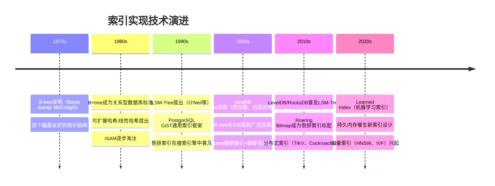

# 第14章 索引实现：章节概览

## 本章定位

在第10章"索引结构"中，我们建立了索引的理论认知框架——B+树为什么矮胖、LSM-树为什么写快、哈希索引为什么不能范围查询。但理论只是起点。真正让一个索引在生产环境中跑出百万级QPS的，是实现层面的工程细节：一个B+树节点在磁盘上如何编码，LSM-树的Compaction策略如何选择，倒排索引的Posting List如何压缩到原始大小的1/10。

本章聚焦于**索引的实现机制**，是理论与工程的桥梁。如果说第10章回答的是"为什么这样设计"，那么第14章回答的是"在真实磁盘和并发环境下怎么落地"。这一章涉及的知识横跨数据结构与算法、磁盘I/O优化、并发控制、内存管理四大领域，是理解数据库内核的关键入口。

### 与第10章的关系

| 维度 | 第10章：索引结构 | 第14章：索引实现 |
|------|-----------------|-----------------|
| 核心问题 | 为什么选择这种索引结构？ | 在磁盘上怎么编码和操作？ |
| 内容深度 | 算法性质、复杂度分析 | 节点布局、并发协议、压缩编码 |
| 关注点 | 数据结构的设计权衡 | 工程实现的性能优化 |
| 适合读者 | 理解索引选型的开发者 | 需要深入内核或做极致优化的工程师 |

## 为什么索引实现如此重要

索引的设计决定了性能的上限，而实现决定了能否逼近这个上限。以下是一些真实的性能差距数据：

| 优化维度 | 未优化实现 | 优化后实现 | 性能提升 |
|---------|-----------|-----------|---------|
| B+树节点压缩 | 每节点200个键值 | 前缀压缩后500+个键值 | 树高从4层降到3层，IO减少25% |
| LSM-Tree Compaction | Size-Tiered全量合并 | Leveled分层合并 | 读放大从O(k·N)降到O(N)，读性能提升数倍 |
| 倒排索引Posting压缩 | 原始整数列表存储 | PForDelta压缩 | 空间减少70%-80%，缓存命中率提升 |
| B+树并发控制 | 粗粒度表锁 | Crabbing协议+latch | 并发写入吞吐量提升10-50倍 |
| Hash索引桶管理 | 静态固定桶数 | 可扩展哈希动态分裂 | 数据量增长10倍时查询延迟不退化 |

一个看似简单的B+树插入操作，涉及页面分配、节点分裂、父节点更新、锁的获取与释放、日志的写入——任何一个环节的实现不当，都可能成为高并发场景下的瓶颈。

## 本章知识地图

索引实现
├── B+树索引实现
│   ├── 节点结构与磁盘布局
│   │   ├── 内部节点：键值+指针数组
│   │   ├── 叶子节点：键值对+链表指针
│   │   ├── 页面布局：Header/Tuple/Directory/Free Space
│   │   └── 指针编码与前缀压缩
│   ├── 插入：搜索 → 分裂 → 提升
│   ├── 删除：搜索 → 重分配/合并
│   ├── Bulk Loading：自底向上批量构建
│   └── 并发控制
│       ├── Lock Coupling（锁耦合）
│       ├── Crabbing协议（蟹步协议）
│       └── Latch vs Lock的区别
│
├── Hash索引实现
│   ├── 静态哈希：固定桶数，简单但不可扩展
│   ├── 可扩展哈希：目录翻倍+桶分裂
│   └── 线性哈希：渐进式扩展，无目录开销
│
├── LSM-Tree架构
│   ├── MemTable：内存有序结构（跳表/红黑树）
│   ├── SSTable：磁盘有序文件（Data Block + Index Block + Filter Block）
│   ├── WAL：预写日志保证持久性
│   └── Compaction策略
│       ├── Size-Tiered Compaction：写放大低，空间放大高
│       └── Leveled Compaction：读性能好，写放大高
│
├── 倒排索引实现
│   ├── Posting List编码与压缩
│   ├── Skip List加速查询
│   ├── Roaring Bitmap位图技术
│   └── VByte/PForDelta压缩算法
│
├── 特殊索引
│   ├── GiST / SP-GiST（通用搜索树）
│   ├── GIN（广义倒排索引）
│   ├── R-tree（空间索引）
│   └── 聚簇/覆盖/前缀/函数索引
│
└── 索引并发与代价模型
    ├── Latch与Lock在索引中的角色
    ├── 代价模型与索引选择器
    └── 索引维护的写入开销

## 本章内容结构

本章按照"核心索引类型逐一深入 → 特殊索引扩展 → 并发与代价模型"的逻辑展开，每个索引类型都覆盖从数据结构到磁盘布局再到操作算法的完整实现链路。

### 第一部分：理论基础

在深入具体实现之前，先建立索引实现的全局框架：

- **核心概念**：明确索引实现的三个关键问题——数据在磁盘上怎么存（物理布局）、操作时怎么改（修改算法）、并发时怎么保证正确性（并发控制）。理解"实现"与"结构"的区别：结构是逻辑抽象，实现是物理落地
- **技术演进**：从早期的ISAM（静态索引，需要定期重建）到B-tree的自平衡机制，再到现代LSM-树的写优化架构——索引实现的演进本质上是在读性能、写性能、空间效率三者之间寻找动态平衡

### 第二部分：B+树索引实现

B+树是关系型数据库最核心的索引结构，其实现细节直接决定OLTP场景的性能上限：

- **节点结构与磁盘布局**：内部节点的键值-指针数组排列、叶子节点的键值对-链表指针结构、PostgreSQL风格的页面布局（Header + Item Pointers + Free Space + Tuple Data + Special Space）。重点理解前缀压缩（共享前缀只存差异）和差值编码（数值型键值存增量）如何提高节点扇出
- **搜索/插入/删除算法**：完整的伪代码实现。插入时的节点分裂如何递归传播到根节点，删除时的重分配（从兄弟借键值）与合并如何处理下溢，Bulk Loading如何以O(N/B)的I/O一次性构建索引
- **并发控制**：Latch（短生命周期，保护内存结构）与Lock（长生命周期，保护事务数据）的区别。Lock Coupling协议（持有子节点锁后释放父节点锁）的正确性与性能分析，Crabbing协议（预判是否需要分裂来提前释放锁）的优化原理

### 第三部分：Hash索引实现

Hash索引提供O(1)的等值查询，但其桶管理机制是实现的核心挑战：

- **静态哈希**：固定桶数+溢出链，简单但数据量增长时性能退化严重
- **可扩展哈希**：全局深度/本地深度控制目录扩展。桶溢出时，本地深度<全局深度只需分裂桶，本地深度=全局深度需要目录翻倍+分裂桶。目录翻倍是O(N)操作但发生频率低
- **线性哈希**：无目录，按顺序逐步分裂桶。分裂触发条件可配置（溢出阈值），分裂操作分散在多次插入中避免突发延迟

### 第四部分：LSM-Tree架构

LSM-树将随机写转为顺序写，在写密集场景下性能碾压B+树：

- **三层架构**：MemTable（内存跳表/红黑树，支持有序写入）→ WAL（预写日志，保证崩溃恢复）→ SSTable（磁盘有序文件，Data Block + Index Block + Filter Block）。写入路径、读取路径、Compaction路径的完整数据流
- **Compaction策略对比**：Size-Tiered（同大小SSTable合并，写放大低但空间放大高，读需要检查所有层）vs Leveled（每层一个有序Run，读放大低但写放大高，LevelDB/RocksDB默认策略）。写放大的定量分析——Leveled Compaction下1TB数据可能产生40倍写放大
- **工程优化**：Bloom Filter减少无效读（将读放大从O(k·N)降到O(1)）、压缩算法选择（Snappy快速/LZ4高压缩/ZSTD通用）、SSTable的块索引设计

### 第五部分：倒排索引实现

倒排索引是全文搜索引擎的基础数据结构：

- **Posting List编码**：从原始整数列表到压缩编码的演进。VByte（变长字节编码，简单但压缩率一般）、PForDelta（批量差值+位填充，压缩率高但实现复杂）、Roaring Bitmap（混合编码，稀疏用数组、稠密用位图，Elasticsearch/Lucene的核心技术）
- **Skip List加速**：在Posting List上叠加跳表层，支持快速跳过不相关文档，将AND/OR查询的时间复杂度从O(m+n)降到O(m·log(n))

### 第六部分：特殊索引与扩展

PostgreSQL等系统提供了丰富的索引接口，支持非传统数据类型的索引：

- **GiST（Generalized Search Tree）**：通用搜索树框架，支持范围、全文、几何等多种数据类型的索引。SP-GiST是其空间分区变体，适合不均匀分布的数据
- **GIN（Generalized Inverted Index）**：广义倒排索引，PostgreSQL中用于全文搜索和JSONB数组索引
- **R-tree**：专为空间数据设计，基于最小包围矩形（MBR）组织空间对象，R*树优化了分裂和插入策略
- **特殊索引类型**：覆盖索引（索引包含所有查询列，避免回表）、前缀索引（字符串列只索引前N个字符）、函数索引（对表达式结果建索引）

### 第七部分：索引并发与代价模型

索引在高并发环境下的正确性和查询优化器的索引选择：

- **Latch vs Lock**：Latch保护内存中的索引结构（B+树节点的并发访问），Lock保护事务级别的数据一致性。索引操作需要同时管理两者，理解它们的生命周期差异
- **代价模型**：数据库查询优化器如何评估不同索引方案的代价——页面访问次数、随机IO vs 顺序IO、选择率估算、索引的选择性计算
- **索引维护开销**：每个索引对写入操作的额外代价——INSERT需要B+树插入+可能的页分裂，UPDATE（索引列）需要删除旧值+插入新值，DELETE需要标记删除+后台清理

## 本章学习路线

根据读者的背景和目标，推荐以下学习路径：

- **基础路径**：掌握B+树的磁盘布局和基本操作算法，理解Hash索引的桶管理机制——这是理解所有数据库索引实现的基石
- **进阶路径**：深入LSM-树的写入优化和Compaction机制，掌握倒排索引的压缩技术——适合需要理解写密集型存储和搜索引擎的工程师
- **精通路径**：掌握索引并发控制的正确性保证，理解查询优化器的代价模型，能够根据工作负载特征设计最优索引方案——适合数据库内核开发者和资深架构师

## 前置知识

学习本章前，建议具备以下基础知识：

- **第10章：索引结构**——理解B+树、LSM-树、哈希索引、倒排索引的基本概念和算法性质
- **第6章：文件系统与磁盘I/O**——理解页面、块、顺序读写vs随机读写的性能差异
- **第4章：进程与线程**——理解锁、互斥量、信号量等同步原语
- **第13章：关系型数据库架构**——理解查询执行流程、存储引擎与查询引擎的职责划分

## 关键度量指标

评估索引实现的性能需要关注以下核心指标：

| 指标 | 含义 | 典型值 | 优化方向 |
|------|------|--------|----------|
| 点查询延迟 | 单次精确匹配查询的响应时间 | B+树: 0.1-1ms, Hash: <0.1ms | 节点压缩提高扇出、缓存热点页面 |
| 范围查询延迟 | 范围扫描的首条结果返回时间 | B+树: 0.2-2ms | 叶子节点链表、覆盖索引减少回表 |
| 写入吞吐量 | 单位时间内完成的写入操作数 | B+树: 10K-100K, LSM: 100K-1M | 批量写入、WAL合并、异步Compaction |
| 读放大 | 一次查询实际读取的磁盘页数 | B+树: 3-4, LSM: 1-6 | Bloom Filter、索引缓存 |
| 写放大 | 一次写入实际写入的磁盘数据量 | B+树: 1x, LSM: 10-40x | Compaction策略选择、WAL优化 |
| 空间放大 | 实际磁盘占用/逻辑数据量 | B+树: 1x, LSM: 1-2x | 压缩算法、及时清理过期数据 |
| 并发吞吐量 | 多线程并发操作下的总吞吐量 | 取决于锁粒度和latch策略 | Crabbing协议、latch分级 |
| 节点利用率 | B+树节点中实际使用的空间比例 | 70%-95% | Bulk Loading、合并策略 |

## 技术演进

## 参考文献

- Ramakrishnan & Gehrke, *Database Management Systems*（第3版）
- Database Internals（Alex Petrov, O'Reilly 2019）
- Architecture of a Database System（Hellerstein et al., 2007）
- Efficient Locking for Concurrent Operations on B-Trees（Lehman & Yao, 1981）
- LSM-based Storage Techniques: A Survey（Luo & Carey, 2019）
- Generalized Search Trees for Database Systems（Hellerstein et al., 1995）
- The Ubiquitous B-Tree（Comer, 1979）
- *Database System Concepts*（Silberschatz et al.）
- 国盛，《数据库索引设计与优化》，电子工业出版社
