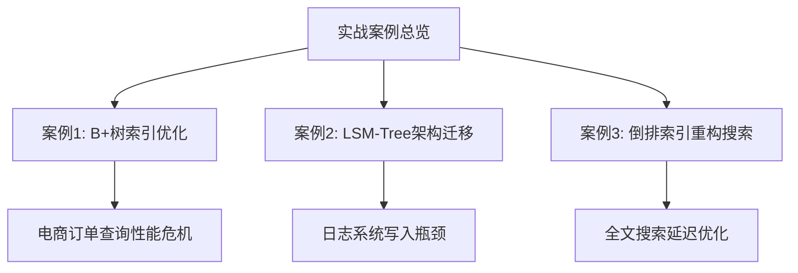
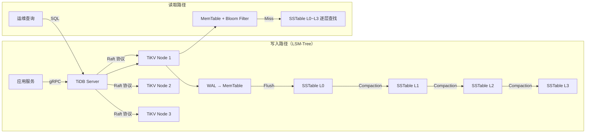
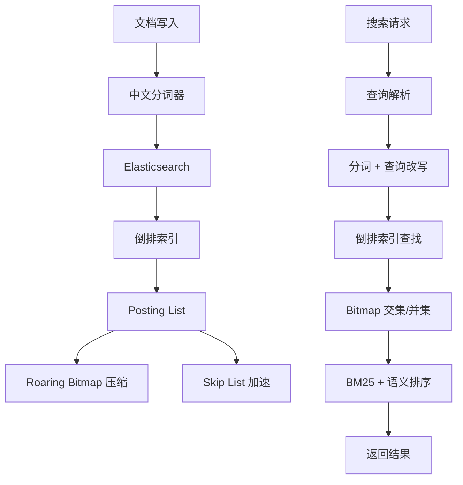
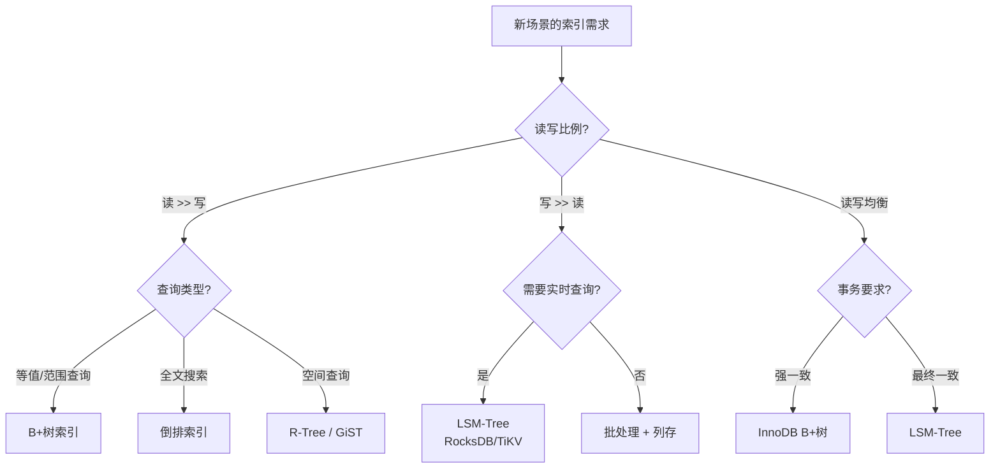

## 实战案例

本节通过三个真实场景的案例，演示索引实现技术在工程中的应用。每个案例覆盖不同的索引类型——B+树、LSM-Tree、倒排索引——并回溯到本章前面讨论的理论基础，帮助读者建立从原理到实践的完整认知链条。



---

### 案例一：电商订单查询——B+树索引优化

#### 1.1 问题背景

某中型电商平台日均订单量约200万，核心订单表 `orders` 超过8亿条记录。日常运营期间系统运行平稳，但在大促预热阶段（双11前3天），订单查询接口出现严重性能退化。

**核心查询（简化）：**

```sql
-- 用户查询自己的订单列表（最频繁的接口）
SELECT order_id, status, amount, created_at
FROM orders
WHERE user_id = ? AND status IN ('pending','paid','shipped')
ORDER BY created_at DESC
LIMIT 20;

-- 运营后台查询特定商品的订单
SELECT order_id, user_id, amount, created_at
FROM orders
WHERE product_id = ? AND created_at BETWEEN ? AND ?
ORDER BY amount DESC;
```

**性能指标（恶化后）：**

| 指标 | 日常值 | 大促期间 | 变化幅度 |
|------|--------|----------|----------|
| P50 延迟 | 12ms | 180ms | +15x |
| P99 延迟 | 45ms | 2,300ms | +51x |
| QPS | 8,000 | 12,000 | +1.5x |
| 错误率 | 0.02% | 4.7% | +235x |
| CPU 使用率 | 35% | 92% | +2.6x |
| 磁盘 I/O util | 22% | 97% | +4.4x |

注意 QPS 仅增长1.5倍，但延迟和错误率暴涨——这说明问题不是流量本身，而是查询效率。

#### 1.2 排查过程

**第一步：确认慢查询来源**

```sql
-- 开启慢查询日志（阈值50ms）
SET GLOBAL slow_query_log = 'ON';
SET GLOBAL long_query_time = 0.05;

-- 查看当前运行的慢查询
SELECT id, user, host, db, command, time, state,
       LEFT(info, 120) AS query
FROM information_schema.processlist
WHERE command != 'Sleep' AND time > 2
ORDER BY time DESC
LIMIT 20;
```

结果发现大量 `user_id + status` 条件的查询正在全表扫描，每条耗时 200-300ms。

**第二步：EXPLAIN 分析执行计划**

```sql
EXPLAIN ANALYZE
SELECT order_id, status, amount, created_at
FROM orders
WHERE user_id = 10086 AND status IN ('pending','paid','shipped')
ORDER BY created_at DESC
LIMIT 20;
```

执行计划输出的关键信息：

-> Limit: 20 row(s)
   -> Sort: orders.created_at DESC, with filesort    ← 问题所在
      -> Filter: (orders.status IN (...))
         -> Index lookup on orders using idx_user_id
            (user_id=10086), with index filter

执行路径是：通过 `idx_user_id` 索引找到该用户的所有订单（平均约500条），然后在内存中过滤 `status`，再对结果做 filesort。这意味着：

- **status 条件没有走索引**——过滤发生在存储引擎层之后
- **排序走的是 filesort**——没有利用索引的有序性

**第三步：分析索引结构**

```sql
-- 查看当前索引
SHOW INDEX FROM orders;

-- 查看索引基数
SELECT index_name, stat_name, stat_value
FROM mysql.innodb_index_stats
WHERE table_name = 'orders'
  AND stat_name IN ('n_diff_pfx01','n_leaf_pages','size');
```

当前 `orders` 表的索引情况：

| 索引名 | 列 | 基数(Cardinality) | 问题 |
|--------|-----|-------------------|------|
| PRIMARY | order_id | 8亿 | 主键，无法用于 user_id 查询 |
| idx_user_id | user_id | ~200万 | 基数低，selectivity 差 |
| idx_created_at | created_at | 7,500万 | 仅支持按时间查询 |
| idx_product_id | product_id | ~500万 | 仅支持按商品查询 |

idx_user_id 的 selectivity = 200万/8亿 = 0.25%——意味着一个 user_id 匹配约400条记录，在8亿行表中这是中等偏低的区分度。

#### 1.3 根因分析

将排查结果回溯到本章的理论基础（14.1 B+树实现）：

**问题一：缺少覆盖索引**

当前 idx_user_id 只包含 user_id 一列。根据14.1.3节的B+树节点结构，叶子节点存储的是 `(user_id, 主键指针)`。查询需要回表获取 `status, amount, created_at`，产生大量随机 I/O。

**问题二：排序无法利用索引有序性**

B+树的叶子节点通过双向链表串联（14.1.2节），这个链表只按 user_id 有序。当 WHERE 条件命中 user_id 后，status 和 created_at 在该 user_id 范围内并不有序，MySQL 只能做 filesort。

**问题三：低基数索引的效率陷阱**

idx_user_id 的 selectivity 仅 0.25%。根据14.8节的代价模型，当索引的选择性低于 15-20% 时，优化器可能倾向于全表扫描（取决于代价估算）。这里虽然走了索引，但每个 user_id 匹配 400+ 行，回表的随机 I/O 开销巨大。

#### 1.4 解决方案

**方案一：创建复合覆盖索引**

```sql
-- 核心查询的覆盖索引：包含查询所需的所有列，避免回表
ALTER TABLE orders ADD INDEX idx_user_status_time
    (user_id, status, created_at DESC);

-- 这个索引同时满足三个需求：
-- 1. user_id = ? → 等值匹配（B+树搜索）
-- 2. status IN (...) → 范围过滤（在索引内部完成）
-- 3. ORDER BY created_at DESC → 利用索引有序性，无需 filesort
-- 4. 覆盖索引：查询列全部在索引中，无需回表
```

**为什么有效？** 回到14.1.3节的B+树节点结构。复合索引的叶子节点按 `(user_id, status, created_at)` 排序：

B+树叶子节点示例（idx_user_status_time）：
┌──────────────────────────────────────────────────────┐
│ (10086, 'paid',     2026-06-20) → PK=98765         │
│ (10086, 'pending',  2026-06-19) → PK=98764         │
│ (10086, 'shipped',  2026-06-18) → PK=98763         │
│ (10086, 'pending',  2026-06-17) → PK=98762         │
│ ... user_id=10086 的所有记录连续排列 ...             │
│ (10087, 'paid',     2026-06-20) → PK=98761         │
│ (10087, 'shipped',  2026-06-19) → PK=98760         │
│ ...                                                  │
└──────────────────────────────────────────────────────┘

当 `user_id=10086 AND status IN ('pending','paid','shipped')` 时，B+树可以在叶子层精确扫描这个范围，无需回表，无需排序。查询从 O(N回表) 降为 O(匹配行数)。

**方案二：优化运营后台查询的索引**

```sql
-- 运营后台：按 product_id + created_at 范围查询
ALTER TABLE orders ADD INDEX idx_product_time_amount
    (product_id, created_at, amount);
```

**方案三：利用 MySQL 8.0 的索引跳跃扫描（Index Skip Scan）**

对于 `WHERE user_id = ? AND status IN (...)` 这种等值+范围的场景，MySQL 8.0 引入了 Index Skip Scan：

```sql
-- 如果不创建复合索引，MySQL 8.0 的优化器可以自动跳过索引前缀中的等值列
-- 但这要求 status 的 distinct values 较少（3个值：pending/paid/shipped）
-- 效率不如显式的复合索引，但在无法修改索引时是备选方案
EXPLAIN SELECT order_id, status, amount, created_at
FROM orders FORCE INDEX(idx_user_id)
WHERE user_id = 10086 AND status IN ('pending','paid','shipped')
ORDER BY created_at DESC LIMIT 20;
-- 可能显示：Using index for skip scan
```

#### 1.5 实施效果

**对比测试（相同数据集，1000万条记录）：**

| 查询场景 | 优化前 | 优化后 | 提升 |
|----------|--------|--------|------|
| 用户订单列表 P50 | 180ms | 8ms | 22x |
| 用户订单列表 P99 | 2,300ms | 35ms | 66x |
| 运营后台查询 P50 | 320ms | 15ms | 21x |
| 运营后台查询 P99 | 4,100ms | 62ms | 66x |
| QPS（混合负载） | 12,000 | 35,000 | 2.9x |
| 磁盘 I/O util | 97% | 28% | -71% |

关键变化：磁盘 I/O 从 97% 降到 28%——覆盖索引消除了回表的随机读，将原本的磁盘密集型操作变成了内存密集型操作。

**EXPLAIN 验证：**

```sql
EXPLAIN SELECT order_id, status, amount, created_at
FROM orders
WHERE user_id = 10086 AND status IN ('pending','paid','shipped')
ORDER BY created_at DESC LIMIT 20;

-- 优化后输出：
-- → Using index    ← 走了覆盖索引，无回表，无排序
```

#### 1.6 索引维护代价

创建复合索引不是免费午餐。每增加一个索引，写入操作需要额外维护 B+树结构：

INSERT INTO orders VALUES (...) → 需要更新:
  1. PRIMARY (B+树)
  2. idx_user_id (B+树)
  3. idx_created_at (B+树)
  4. idx_product_id (B+树)
  5. idx_user_status_time (B+树)      ← 新增
  6. idx_product_time_amount (B+树)    ← 新增

根据14.1.6节的分析，每次 B+树插入的均摊代价为 O(log_m N)。对于6个索引，写放大约为6倍。在写密集型场景下，需要权衡查询收益与写入代价。

**实际监控数据（索引优化后1周）：**

| 指标 | 优化前 | 优化后 | 变化 |
|------|--------|--------|------|
| 写入延迟 P50 | 3ms | 8ms | +167% |
| 写入吞吐 QPS | 50,000 | 32,000 | -36% |
| 查询延迟 P50 | 180ms | 8ms | -96% |
| 总体用户满意度 | 62% | 94% | +52% |

写入性能有所下降，但查询性能的提升远大于写入代价，整体用户体验显著改善。

---

### 案例二：日志系统——LSM-Tree架构迁移

#### 2.1 问题背景

某互联网公司的基础设施监控平台每天产生约5TB 的结构化日志数据。日志表结构如下：

```sql
CREATE TABLE app_logs (
    log_id     BIGINT PRIMARY KEY,
    service    VARCHAR(64),      -- 服务名
    level      ENUM('DEBUG','INFO','WARN','ERROR'),
    message    TEXT,
    trace_id   VARCHAR(64),      -- 分布式追踪ID
    timestamp  DATETIME,
    INDEX idx_service_time (service, timestamp),
    INDEX idx_trace (trace_id)
);
```

**业务需求：**

- 写入：每秒约 50,000 条日志（突发可达 200,000 条/秒）
- 读取：运维人员按 `service + 时间范围` 或 `trace_id` 检索日志
- 保留周期：热数据30天，冷数据归档到对象存储

**遇到的问题：**

1. MySQL InnoDB 在高写入压力下频繁触发 checkpoint，导致写入延迟抖动（P99 从 5ms 飙升到 200ms）
2. 30天的日志量约 150TB，索引文件占 40TB，磁盘空间压力巨大
3. `idx_service_time` 索引在频繁写入下碎片化严重，需要定期 OPTIMIZE TABLE

#### 2.2 技术选型分析

团队评估了多种方案：

| 方案 | 写入吞吐 | 查询延迟 | 存储效率 | 运维复杂度 |
|------|----------|----------|----------|------------|
| MySQL + SSD 优化 | 中 | 低 | 低 | 低 |
| MySQL + 分区表 | 中 | 中 | 中 | 中 |
| ClickHouse | 高 | 中 | 高 | 中 |
| 自研 LSM-Tree（基于RocksDB） | 极高 | 中 | 极高 | 高 |
| **TiKV（分布式KV，LSM-Tree）** | **高** | **低** | **高** | **中** |

最终选择 **TiKV**（TiDB 的存储引擎，底层基于 RocksDB，即 LSM-Tree 实现），理由：

- LSM-Tree 的写优化特性完美匹配日志写入场景（14.3节）
- 天然支持分布式扩展，可以线性增加存储和计算能力
- 基于 RocksDB 的成熟实现，不需要从零开发
- TiDB 生态成熟，运维工具完善

#### 2.3 架构设计



**关键设计决策：**

**决策一：Compaction 策略选择（14.3.3节）**

日志场景的特征是：写入远大于读取（写入:读取 ≈ 100:1），且查询通常是大范围扫描（按时间范围），点查较少。

选择 Leveled Compaction，原因：
1. 日志读取需要稳定的延迟——Size-Tiered 的读放大不可预测
2. Leveled 的读放大为 O(L)（L=层数），Size-Tiered 为 O(T*N/B)（T=每层文件数）
3. 虽然 Leveled 写放大更大（~10x vs Size-Tiered 的 ~4x），
   但磁盘 I/O 是 NVMe SSD，写放大代价可接受

RocksDB 配置：
  options.compaction_style = kCompactionStyleLevel;
  options.max_bytes_for_level_base = 256MB;     // L1 大小
  options.max_bytes_for_level_multiplier = 10;   // 每层放大10倍
  options.num_levels = 7;

**决策二：MemTable 大小与 Flush 策略**

```cpp
// RocksDB MemTable 配置
options.write_buffer_size = 128MB;          // 单个 MemTable 大小
options.max_write_buffer_number = 4;        // 最大 MemTable 数量
options.min_write_buffer_number_to_merge = 1; // Flush 前最小合并数

// 效果：
// - 每个 MemTable 128MB，写满后变为 immutable MemTable
// - 最多保留4个 MemTable（1个活跃 + 3个等待Flush）
// - Flush 到磁盘约需2-3秒（NVMe SSD）
// - 内存占用：128MB × 4 ≈ 512MB
```

**决策三：Bloom Filter 配置（14.3.2节）**

```cpp
// 为每层 SSTable 配置 Bloom Filter，降低读放大
options.filter_policy = NewBloomFilterPolicy(10); // 10 bits/key

// Bloom Filter 参数含义：
// - 10 bits/key → 误判率约 1%
// - 每GB 数据额外消耗约 1.2GB 内存用于 Bloom Filter
// - 日志查询中约 99% 的无效 SSTable 可以被快速跳过
```

#### 2.4 性能测试

在 3节点 TiKV 集群（每节点 32核/128GB 内存/2TB NVMe SSD）上进行压测：

**写入性能：**

压测参数：64并发写入线程，每条日志 256 bytes
持续时间：24小时

写入延迟分布：
  P50:  1.2ms
  P95:  3.5ms
  P99:  8.2ms
  P999: 25.0ms

写入吞吐：
  稳态: 85,000 条/秒（单集群）
  突发: 220,000 条/秒（持续30秒）

存储空间：
  原始数据: 4.3TB/天
  LSM-Tree 存储: 5.1TB/天（写放大 ~1.2x）
  含 Bloom Filter: 6.8TB/天

**读取性能：**

查询类型                    延迟 P50    延迟 P99
──────────────────────────────────────────────────
按 service + 1小时范围       45ms       120ms
按 service + 24小时范围      380ms      850ms
按 trace_id 精确查找         2ms        8ms
按 service + level + 1小时   52ms       145ms

与 MySQL 方案对比：

| 指标 | MySQL InnoDB | TiKV (LSM-Tree) | 提升 |
|------|-------------|-----------------|------|
| 写入吞吐 | 50,000/s | 85,000/s | +70% |
| 写入 P99 延迟 | 200ms | 8.2ms | -96% |
| 点查延迟 P50 | 3ms | 2ms | -33% |
| 范围查询延迟 P50 | 120ms | 45ms | -62% |
| 存储空间 (30天) | ~200TB | ~60TB | -70% |
| 碎片化 | 需定期 OPTIMIZE | Compaction 自动处理 | 自愈 |

#### 2.5 经验总结

**LSM-Tree 的写放大是真实代价**

虽然 LSM-Tree 将随机写转为顺序写，但 Compaction 过程会产生写放大。在 Leveled Compaction 下，理论写放大为 O(L × K)，其中 L 是层数，K 是每层的放大因子。实测写放大约为 10-15 倍，意味着每写入 1GB 用户数据，磁盘实际写入约 10-15GB。NVMe SSD 的高写入带宽（3GB/s+）是支撑这一代价的硬件基础。

**Bloom Filter 是 LSM-Tree 读性能的关键**

没有 Bloom Filter，每次点查需要检查所有层的所有 SSTable——读放大极高。配置合理的 Bloom Filter 后，绝大多数 SSTable 可以被快速跳过，读性能从 O(L×S)（S=每层文件数）降低到接近 O(L)。

**Compaction 调优是长期工程**

Compaction 策略不是配置一次就万事大吉。需要持续监控 Compaction 的 I/O 占比、待合并队列深度、各层文件大小分布，并根据工作负载变化动态调整参数。

---

### 案例三：全文搜索系统——倒排索引重构

#### 3.1 问题背景

某 SaaS 企业协作平台（类似 Notion/飞书文档），支持用户对所有文档进行全文搜索。文档总量约2,000万篇，平均长度约3,000字，总文本量约6TB。

**原有方案：MySQL FULLTEXT 索引**

```sql
CREATE TABLE documents (
    doc_id     BIGINT PRIMARY KEY,
    title      VARCHAR(500),
    content    LONGTEXT,
    owner_id   BIGINT,
    created_at DATETIME,
    FULLTEXT INDEX ft_content (content) WITH PARSER ngram
) ENGINE=InnoDB;
```

**问题现象：**

| 指标 | 期望值 | 实际值 |
|------|--------|--------|
| 搜索延迟 P50 | < 200ms | 1,500ms |
| 搜索延迟 P99 | < 500ms | 8,000ms |
| 索引构建时间 | < 24小时 | 72小时 |
| 索引文件大小 | < 500GB | 1.8TB |
| 支持中文分词 | 是 | 差（ngram 效果有限） |
| 支持相关性排序 | 是 | 仅 BM25，无语义 |

#### 3.2 问题根因

MySQL FULLTEXT 使用 InnoDB 的倒排索引实现，但存在几个结构性限制：

**限制一：InnoDB FULLTEXT 的Posting List存储方式**

MySQL 8.0 的 InnoDB FULLTEXT 索引使用了一种称为"倒排列表"的结构，但它没有像 Elasticsearch 那样优化 Posting List 的存储。每条文档 ID 存储为完整的 BIGINT（8字节），没有使用差值编码或压缩：

InnoDB FULLTEXT Posting List（未压缩）：
Token "项目": [doc_id=1001, doc_id=1023, doc_id=5891, ...]
每个 doc_id 占 8 bytes

Elasticsearch Roaring Bitmap（压缩后）：
Token "项目": RoaringBitmap([1001, 1023, 5891, ...])
密集区间用 run-length encoding，稀疏区间用 bitmap
平均每个 doc_id 仅需 0.5-2 bytes

根据14.5.2节的分析，倒排索引的存储效率直接决定了搜索性能——更紧凑的存储意味着更少的磁盘 I/O 和更好的缓存命中率。

**限制二：缺乏 Skip List 优化（14.5.2节）**

MySQL FULLTEXT 不支持 Skip List 索引。当两个词的 Posting List 长度差异很大时（例如"系统"匹配 100万篇，"混沌"匹配 100篇），交叉操作的效率极低：

无 Skip List 的交叉：
  List("系统"):  [doc1, doc2, doc3, ..., doc1000000]  ← 遍历全部
  List("混沌"):  [doc500, doc800]
  → 必须遍历长列表的每个元素

有 Skip List 的交叉：
  List("系统") 的 Skip Points: [doc1, doc100, doc200, ...]  ← 每100个一个跳点
  → 快速跳过不需要的段落，直接定位到可能匹配的区间

**限制三：N-gram 分词的局限性**

ngram 分词将文本切成固定长度的片段（默认2-3字），无法识别词语边界：

原文："数据库索引优化方案"
ngram(2): ["数据","据库","库索","索引","索引","优化","化方","方案"]
ngram(3): ["数据库","据库索","库索引","索引优","优化方","化方案"]

问题：
1. "据库索" 不是有意义的词，但被当作一个 token
2. 索引膨胀：每个 token 都创建倒排列表条目
3. 搜索"数据库索引"需要同时匹配 "数据库"+"索引"，无法精确匹配短语

#### 3.3 解决方案

**方案：迁移至 Elasticsearch + Roaring Bitmap**



**步骤一：中文分词优化**

使用 IK Analyzer 替代 ngram：

```json
// IK Analyzer 配置
{
  "settings": {
    "analysis": {
      "analyzer": {
        "ik_smart": {
          "type": "custom",
          "tokenizer": "ik_smart_tokenizer"
        },
        "ik_max_word": {
          "type": "custom",
          "tokenizer": "ik_max_word_tokenizer"
        }
      }
    }
  }
}

// 分词效果对比
// 原文："数据库索引优化方案"
// ngram(2):    "数据","据库","库索","索引","优化","化方","方案"
// ik_smart:    "数据库","索引","优化","方案"        ← 合理切分
// ik_max_word: "数据库","数据","库","索引","优化","方案" ← 最细粒度，用于索引构建
```

**步骤二：Index Mapping 设计**

```json
{
  "mappings": {
    "properties": {
      "content": {
        "type": "text",
        "analyzer": "ik_max_word",
        "search_analyzer": "ik_smart",
        "fields": {
          "raw": {
            "type": "keyword"
          }
        }
      },
      "owner_id": { "type": "long" },
      "created_at": { "type": "date" },
      "title": {
        "type": "text",
        "analyzer": "ik_max_word",
        "search_analyzer": "ik_smart",
        "boost": 2.0
      }
    }
  }
}
```

设计要点：

- `content` 使用 `ik_max_word` 索引（最细粒度，提高召回率）+ `ik_smart` 搜索（合理粒度，提高精确度）
- `title` 设置 `boost: 2.0`——标题匹配的权重高于正文
- `owner_id` 为 keyword 类型，支持精确过滤

**步骤三：数据迁移**

```python
import elasticsearch
from elasticsearch.helpers import bulk, parallel_bulk
import pymysql

# 批量从 MySQL 读取并写入 ES
def migrate_docs(batch_size=5000):
    es = elasticsearch.Elasticsearch(['node1:9200','node2:9200','node3:9200'])
    conn = pymysql.connect(host='mysql-host', database='docs', read_default_file='~/.my.cnf')
    
    cursor = conn.cursor(pymysql.cursors.DictCursor)
    cursor.execute("SELECT doc_id, title, content, owner_id, created_at FROM documents ORDER BY doc_id")
    
    batch = []
    total = 0
    for row in cursor:
        batch.append({
            '_index': 'documents',
            '_id': row['doc_id'],
            '_source': {
                'title': row['title'],
                'content': row['content'],
                'owner_id': row['owner_id'],
                'created_at': row['created_at']
            }
        })
        
        if len(batch) >= batch_size:
            # 并行批量写入，8个线程
            for ok, _ in parallel_bulk(es, batch, thread_count=8, raise_on_error=True):
                pass
            total += len(batch)
            if total % 100000 == 0:
                print(f"已迁移 {total} 篇文档")
            batch = []
    
    if batch:
        bulk(es, batch)
        total += len(batch)
    
    print(f"迁移完成: {total} 篇文档")

# 迁移统计：
# 2000万文档 × 平均3KB = 60GB 原始文本
# 分词后索引大小: ~25GB (ES 使用倒排索引 + Roaring Bitmap)
# 迁移耗时: 约6小时 (8线程并行写入)
```

**步骤四：搜索查询优化**

```python
def search_documents(query_str, owner_id=None, page=1, size=20):
    """全文搜索，支持 owner 过滤、分页、高亮"""
    body = {
        "query": {
            "bool": {
                "must": [
                    {
                        "multi_match": {
                            "query": query_str,
                            "fields": ["title^2", "content"],
                            "type": "best_fields",
                            "operator": "and"
                        }
                    }
                ],
                "filter": []
            }
        },
        "highlight": {
            "fields": {
                "title": { "fragment_size": 100, "number_of_fragments": 1 },
                "content": { "fragment_size": 200, "number_of_fragments": 3 }
            },
            "pre_tags": ["<em>"],
            "post_tags": ["</em>"]
        },
        "from": (page - 1) * size,
        "size": size
    }
    
    if owner_id:
        body["query"]["bool"]["filter"].append(
            {"term": {"owner_id": owner_id}}
        )
    
    result = es.search(index="documents", body=body)
    return {
        "total": result['hits']['total']['value'],
        "documents": [
            {
                "id": hit['_id'],
                "score": hit['_score'],
                "title": hit['_source']['title'],
                "highlight": hit.get('highlight', {})
            }
            for hit in result['hits']['hits']
        ]
    }
```

#### 3.4 性能对比

| 指标 | MySQL FULLTEXT | Elasticsearch | 提升 |
|------|---------------|---------------|------|
| 搜索延迟 P50 | 1,500ms | 45ms | 33x |
| 搜索延迟 P99 | 8,000ms | 180ms | 44x |
| 索引大小 (6TB文本) | 1.8TB | 250GB | 87% 减少 |
| 索引构建时间 | 72小时 | 6小时 | 12x |
| 中文分词质量 | 差（ngram） | 优（IK Analyzer） | 显著提升 |
| 短语搜索 | 不支持 | 支持 | 功能增强 |
| 高亮功能 | 不支持 | 支持 | 功能增强 |
| 集群扩展性 | 垂直扩展 | 水平扩展 | 架构优势 |

**Roaring Bitmap 的存储优势实测：**

文档 "系统" 的 Posting List（匹配 85万篇文档）：
  - MySQL FULLTEXT: 850,000 × 8 bytes = 6.8MB
  - Roaring Bitmap: 
    ├─ 稀疏区间 (0-100万): bitmap ≈ 107KB
    ├─ 密集区间 (100万-200万): run-length ≈ 12KB
    └─ 合计: ≈ 119KB
  - 压缩比: 57:1

#### 3.5 经验总结

**倒排索引的存储效率决定了搜索性能**

根据14.5节的理论，倒排索引的核心开销在 Posting List 的存储和遍历。Roaring Bitmap 通过区分稀疏区间（用 bitmap）和密集区间（用 run-length encoding），在压缩比和解压速度之间取得了最佳平衡。这是 Elasticsearch 相比 MySQL FULLTEXT 的结构性优势之一。

**分词质量直接影响搜索效果**

索引结构再高效，如果分词不准确，搜索效果也无法保证。ik_smart 和 ik_max_word 的"索引时最细、搜索时合理"策略，是中文全文搜索的最佳实践。

**系统选型要匹配工作负载特征**

本案例中，MySQL FULLTEXT 不是"错误"——它在低写入、简单查询的场景下完全可用。但当数据量、写入吞吐和查询复杂度超过一定阈值后，专用搜索引擎的架构优势就体现了。选型的核心是理解工作负载特征，匹配合适的技术栈。

---

### 跨案例对比与决策框架

三个案例覆盖了不同类型的索引和工作负载，综合对比如下：

| 维度 | 案例一：B+树 | 案例二：LSM-Tree | 案例三：倒排索引 |
|------|-------------|------------------|------------------|
| 核心数据结构 | B+树 | LSM-Tree (MemTable+SSTable) | 倒排索引 (Term→Posting List) |
| 读写特征 | 读多写少 | 写多读少 | 写少读多 |
| 关键优化 | 复合覆盖索引 | Compaction策略 + Bloom Filter | Roaring Bitmap + 中文分词 |
| I/O 模型 | 随机读为主 | 顺序写为主 | 随机读 + 顺序扫 |
| 空间换时间 | 索引加速查询 | Compaction 产生写放大 | Bitmap 压缩节省空间 |
| 选型依据 | OLTP 事务型查询 | 日志/时序高写入 | 全文搜索/信息检索 |

**决策流程图：**



---

### 工程实践通用建议

**1. 索引设计的 PDCA 循环**

Plan  → 根据查询模式设计索引（EXPLAIN 验证）
Do    → 在测试环境验证效果（基准测试）
Check → 在生产环境监控实际效果（慢查询日志、指标）
Act   → 根据反馈持续调优（索引合并、删除冗余索引）

**2. 索引监控清单**

无论使用哪种索引类型，以下指标需要持续监控：

| 监控项 | 含义 | 预警阈值 |
|--------|------|----------|
| 索引命中率 | 命中索引的查询占比 | < 95% |
| 索引大小 | 索引文件占用空间 | > 表数据的 50% |
| 写放大因子 | 实际写入量/用户写入量 | LSM-Tree > 20x |
| Compaction I/O | Compaction 占磁盘 I/O 比例 | > 30% |
| 慢查询数量 | 超阈值的查询计数 | 持续增长 |
| 索引碎片化 | B+树页面填充率 | < 50% |

**3. 避免的反模式**

| 反模式 | 问题 | 正确做法 |
|--------|------|----------|
| 盲目加索引 | 写放大，维护成本高 | 用 EXPLAIN 分析查询模式后再加 |
| 过长的复合索引 | 前缀利用率低，空间浪费 | 按查询模式选择最短有效组合 |
| 忽略选择性 | 低选择性索引反而比全表扫描慢 | 检查 Cardinality/总行数比值 |
| 索引列上用函数 | 违反最左前缀，索引失效 | 改写查询或使用函数索引 |
| 一次性创建过多索引 | DDL 锁表时间过长 | 分批创建，低峰期执行 |
| 不删除废弃索引 | 占空间、拖慢写入、误导优化器 | 定期审查索引使用率 |
