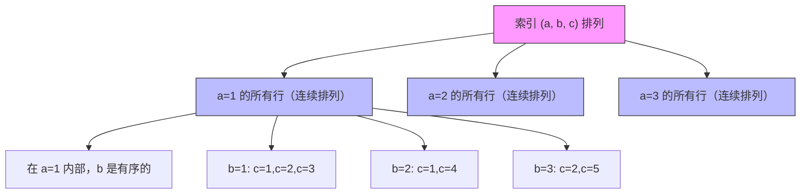
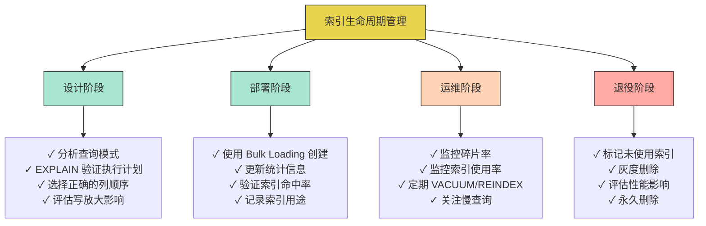

## 常见误区

索引是数据库性能优化中杠杆效应最大的手段——一个设计良好的索引可以让查询从全表扫描的 O(n) 骤降到 O(log n) 甚至 O(1)，但索引同时也是最容易被误用的数据库特性。大量的生产事故并非源于索引"太少"，而是源于对索引机制的**错误认知**和**不当实践**。

本章系统性地梳理索引实现与使用中的常见误区，按照**设计阶段 → 查询阶段 → 运维阶段 → 架构阶段**的生命周期顺序组织，每个误区都包含：错误表现、根因分析、正确做法、以及一个可直接参考的代码示例。

---

### 误区一：索引列顺序随意——"只要包含就行"

#### 错误表现

```sql
-- 表结构：orders(user_id INT, status INT, created_at TIMESTAMP, amount DECIMAL)
-- 常见查询：按 user_id 筛选，按 created_at 排序

-- 错误：先放排序列，再放筛选列
CREATE INDEX idx_wrong ON orders(created_at, user_id, status);

-- 该索引对以下查询有效吗？
SELECT * FROM orders WHERE user_id = 1001 ORDER BY created_at;
```

很多人认为"索引里包含了所需的列就行"，但实际上**列的顺序至关重要**。上面的索引对于 `WHERE user_id = 1001` 的查询几乎无效——因为索引是按 `created_at` 排序的，`user_id` 在排序维度上是无序的。

#### 根因分析

B+ 树索引是按键值的**字典序**排列的。对于复合索引 `(A, B, C)`：

索引的排列顺序：
  (A=1, B=1, C=1)
  (A=1, B=2, C=1)
  (A=1, B=2, C=3)    -- A 相同，B 有序
  (A=2, B=1, C=1)    -- A 不同，A 无序
  (A=2, B=1, C=5)

- **最左前缀原则**：索引只有在使用最左列（或最左若干列的连续前缀）时才能高效利用
- **等值在前，范围在后**：等值条件的列应该放在范围条件列之前
- **选择性高的列优先**：区分度高的列放在前面，能更快缩小扫描范围

#### 正确做法

```sql
-- 查询模式分析：
-- WHERE user_id = ?         -- 等值条件，选择性高
-- WHERE status = ?          -- 等值条件
-- ORDER BY created_at       -- 范围/排序
-- SELECT amount             -- 需要回表或覆盖

-- 正确的索引设计：
CREATE INDEX idx_user_status_time ON orders(user_id, status, created_at);

-- 这个索引支持：
-- WHERE user_id = ?                           -- 使用最左前缀 ✓
-- WHERE user_id = ? AND status = ?            -- 使用前两列 ✓
-- WHERE user_id = ? AND status = ? ORDER BY created_at  -- 完整使用 ✓
-- WHERE user_id = ? ORDER BY created_at       -- 跳过 status 仍可用前缀 ✓
```

**验证方法**：使用 `EXPLAIN` 查看 `key_len`，确认索引实际使用了多少列：

```sql
EXPLAIN SELECT * FROM orders WHERE user_id = 1001 AND status = 1 ORDER BY created_at;
-- key_len = 12  (INT 4 + INT 4 + TIMESTAMP 4 = 12，三列全部使用)

EXPLAIN SELECT * FROM orders WHERE user_id = 1001;
-- key_len = 4   (只使用了第一列)
```

#### 记忆口诀

最左前缀是铁律，等值在前范围后；
选择性高排前面，覆盖索引省回表。

---

### 误区二：索引越多越好——"给每列都建索引"

#### 错误表现

```sql
-- 对一张 50 列的表创建了 30 个索引
CREATE INDEX idx_col1 ON big_table(col1);
CREATE INDEX idx_col2 ON big_table(col2);
CREATE INDEX idx_col3 ON big_table(col3);
-- ... 依此类推到 col30
```

直觉上"每个查询列都有索引"似乎是最佳策略，但这是严重的认知偏差。

#### 根因分析

索引不是免费的。每维护一个索引，数据库需要在**每次写操作**时同步更新：

| 开销类型 | 具体影响 |
|---------|---------|
| 写放大 | 每次 INSERT 需要同时更新所有索引的 B+ 树。30 个索引意味着一次插入可能触发 30 次 B+ 树分裂/合并操作 |
| 存储膨胀 | 每个索引都是一棵独立的 B+ 树，占用磁盘空间。100MB 的数据表，30 个索引可能额外占用 300-500MB |
| 内存压力 | 索引页需要加载到 Buffer Pool / Buffer Cache 中。过多索引挤占缓存空间，导致热数据页被淘汰 |
| 维护成本 | VACUUM（PostgreSQL）/ Purge（InnoDB）需要遍历每个索引清理过期数据 |
| 写入延迟 | 大量索引导致写入路径变长，在写密集场景下成为严重瓶颈 |

**InnoDB 的写放大公式**（简化）：

写放大 ≈ 1 + 索引数量 × 平均分裂因子

#### 正确做法

**原则：只为实际查询建索引，通过慢查询日志和执行计划驱动索引设计。**

```sql
-- 第一步：找出高频慢查询
SELECT query, avg_time, calls
FROM pg_stat_statements
WHERE mean_exec_time > 100  -- 超过 100ms
ORDER BY avg_time DESC
LIMIT 20;

-- 第二步：用 EXPLAIN 分析每个查询的执行计划
EXPLAIN (ANALYZE, BUFFERS)
SELECT * FROM orders WHERE user_id = 1001 AND status = 1;

-- 第三步：仅针对慢查询创建必要的索引
-- 而不是对所有列都建索引

-- 第四步：定期清理无用索引
-- PostgreSQL：找出未使用的索引
SELECT schemaname, relname, indexrelname, idx_scan
FROM pg_stat_user_indexes
WHERE idx_scan = 0  -- 从未被使用
  AND indexrelname NOT LIKE '%pkey%'  -- 排除主键
ORDER BY pg_relation_size(indexrelid) DESC;

-- MySQL：找出冗余索引
SELECT * FROM sys.schema_redundant_indexes WHERE table_schema = 'your_db';
```

#### 量化参考

| 表大小 | 建议索引数量上限 | 说明 |
|-------|----------------|------|
| < 10MB | 3-5 个 | 小表本身扫描就很快，索引收益低 |
| 10MB - 1GB | 5-10 个 | 根据实际查询模式建索引 |
| 1GB - 100GB | 10-20 个 | 严格按查询频率和选择性设计 |
| > 100GB | 15-25 个 | 需要仔细权衡读写比，考虑分区方案 |

> **注意**：这是粗略参考。读密集型系统（OLAP）可以有更多索引，写密集型系统（日志、时序）应尽量减少索引。

---

### 误区三：忽略联合索引的"最左前缀"匹配规则

#### 错误表现

```sql
-- 建了索引 (a, b, c)，然后问：
SELECT * FROM t WHERE b = 1;          -- 这个能用索引吗？→ 不能！
SELECT * FROM t WHERE b = 1 AND c = 2; -- 这个呢？→ 也不能！
SELECT * FROM t WHERE a = 1 AND c = 2; -- 这个呢？→ 只能用到 a 列
```

很多开发者知道"最左前缀"这个词，但对其实际行为的理解是模糊的。

#### 根因分析

B+ 树索引的物理结构决定了匹配规则。以索引 `(a, b, c)` 为例，数据的排列方式是：

首先按 a 排序
  a 相同时，按 b 排序
    b 相同时，按 c 排序



**核心规则**：

| WHERE 条件 | 能否使用索引 (a, b, c) | 解释 |
|-----------|----------------------|------|
| `a = 1` | ✅ 完全使用 | 使用最左列 |
| `a = 1 AND b = 2` | ✅ 完全使用 | 使用前两列 |
| `a = 1 AND b = 2 AND c = 3` | ✅ 完全使用 | 使用全部三列 |
| `b = 1` | ❌ 无法使用 | 缺少最左列 a |
| `b = 1 AND c = 2` | ❌ 无法使用 | 缺少最左列 a |
| `a = 1 AND c = 2` | ⚠️ 部分使用 | 只用到 a，c 无法跳过 b 直接使用 |
| `a > 1 AND b = 2` | ⚠️ 部分使用 | a 是范围查询，范围之后的列无法使用索引排序 |
| `a = 1 AND b > 2 AND c = 3` | ⚠️ 部分使用 | a 和 b 可用，c 在范围之后无法利用索引排序 |

#### 正确做法

根据查询模式选择正确的索引组合：

```sql
-- 如果最常执行的是 WHERE b = ? AND c = ?
-- 不要只建 (a, b, c)，应该单独建 (b, c)
CREATE INDEX idx_b_c ON t(b, c);

-- 如果有多种查询模式，建多个复合索引
CREATE INDEX idx_a_b_c ON t(a, b, c);    -- 用于 WHERE a = ? AND b = ? AND c = ?
CREATE INDEX idx_b_c   ON t(b, c);        -- 用于 WHERE b = ? AND c = ?
CREATE INDEX idx_a_c   ON t(a, c);        -- 用于 WHERE a = ? AND c = ?（但不能跳过 a）

-- MySQL 8.0+ 的 Index Skip Scan 特性可以部分"跳过"最左列
-- 但性能不如正确的索引设计
```

#### MySQL 8.0 Index Skip Scan（进阶了解）

MySQL 8.0 引入了 Index Skip Scan 优化，可以在某些情况下"跳过"最左列：

```sql
-- 索引 (a, b, c)，查询 WHERE b = 1
-- MySQL 8.0 可能执行 Index Skip Scan：
-- 逻辑等价于：WHERE (a=1 AND b=1) UNION ALL (a=2 AND b=1) UNION ALL ...
-- 对 a 的所有可能取值做"虚拟"的最左前缀匹配

-- 但这是有代价的：
-- 1. a 的取值必须很少（distinct 值少于索引大小）
-- 2. 每个 a 值对应的数据块都需要读取
-- 3. 不如直接建 (b, c) 索引高效
```

---

### 误区四：认为覆盖索引只是"性能优化"——它是架构选择

#### 错误表现

```sql
-- 查询只涉及索引中的列，但没有意识到这就是"覆盖索引"
SELECT user_id, status, amount FROM orders WHERE user_id = 1001;
-- 没有针对这个查询设计覆盖索引，导致每次都回表

-- EXPLAIN 显示 Using index condition 但不是 Using index
-- 说明没有实现真正的覆盖索引
```

#### 根因分析

**回表（Look-up / Bookmark Lookup）** 是 B+ 树非聚簇索引的固有开销。当查询的列不完全包含在索引中时，数据库需要：

1. 在索引 B+ 树中找到匹配的叶子节点（获得主键值）
2. 用主键值到聚簇索引中查找完整行记录（可能涉及一次随机 I/O）

非聚簇索引查找路径：
  二级索引 B+ 树 → 找到主键 → 聚簇索引 B+ 树 → 找到行数据
                        ↑ 这一步就是"回表"

覆盖索引路径：
  二级索引 B+ 树 → 找到索引列数据 → 直接返回（无需回表）

**回表的代价**：
- 每次回表是一次随机 I/O（在磁盘上，聚簇索引的叶子节点可能分散在不同位置）
- 批量查询时，回表 I/O 是主要瓶颈（索引扫描很快，回表拖后腿）
- 在 SSD 上回表仍然有代价（随机读 vs 顺序读的性能差距约 10 倍）

#### 正确做法

```sql
-- 查询模式：经常只查 user_id, status, created_at
-- 设计覆盖索引：包含查询涉及的所有列
CREATE INDEX idx_covering ON orders(user_id, status, created_at, amount);

-- EXPLAIN 验证：确认 "Using index"（表示覆盖索引生效）
EXPLAIN SELECT user_id, status, created_at, amount
FROM orders WHERE user_id = 1001;
-- Extra: Using index  ← 这就是覆盖索引的标志

-- 对比：Without 覆盖索引
EXPLAIN SELECT user_id, status, created_at, amount, description
FROM orders WHERE user_id = 1001;
-- Extra: NULL  ← 需要回表读取 description 列
```

**InnoDB 的聚簇索引天然就是覆盖索引**——当你查询主键时，不需要回表，因为行数据就存储在主键索引的叶子节点中。

#### 覆盖索引的设计原则

1. 分析高频查询的 SELECT 列表
2. 将这些列加入索引的尾部
3. 注意列的顺序：等值条件列 → 排序列 → SELECT 列
4. 权衡写放大：覆盖索引越大，写入开销越大

典型优化效果：
- 回表查询：100万行查询 → 约 100万次随机 I/O（秒级）
- 覆盖索引：100万行查询 → 约 1000 次顺序 I/O（毫秒级）

---

### 误区五：忽略索引碎片化——"建了索引就不管了"

#### 错误表现

```sql
-- 索引刚创建时性能很好
CREATE INDEX idx_large ON big_table(created_at);
-- 查询延迟 5ms

-- 6 个月后...
-- 同样的查询延迟变成了 50ms
-- "数据库变慢了，是不是要加机器？"
```

#### 根因分析

索引碎片化是 B+ 树在频繁插入/删除/更新操作后的自然退化：

**外部碎片（External Fragmentation）**：页面未填满

理想状态（顺序插入）：
  Page1: [1-100]  Page2: [101-200]  Page3: [201-300]
  所有页面填满率 > 90%

碎片化后（随机插入+删除）：
  Page1: [1-50,    ...空...]  Page2: [150-200, ...空...]
  Page3: [300-350, ...空...]  Page4: [250-280, ...空...]
  页面填满率 < 50%，大量空间浪费
  范围查询需要扫描更多页面 → I/O 增加

**内部碎片（Internal Fragmentation）**：页面内记录密度低

PostgreSQL VACUUM 前：
  Page1: [1, DEAD, DEAD, 4, DEAD, DEAD, DEAD, 8]
  Page2: [10, DEAD, 12, DEAD, DEAD, 15, DEAD, DEAD]
  
  只有 4 条活数据分布在 2 个页面中
  读取效率低：IO 读了整页，但有效数据只占 25%

**碎片化的影响量化**：

| 碎片率 | 范围扫描性能 | 磁盘空间浪费 | 影响程度 |
|-------|------------|-------------|---------|
| 0-10% | 基准 | < 10% | 正常 |
| 10-30% | 下降 10-30% | 10-30% | 需要关注 |
| 30-50% | 下降 30-60% | 30-50% | 建议重建 |
| > 50% | 下降 60%+ | > 50% | 必须重建 |

#### 正确做法

```sql
-- ==================== PostgreSQL ====================
-- 查看索引碎片率
SELECT
    schemaname, tablename, indexname,
    pg_size_pretty(pg_relation_size(indexrelid)) AS index_size,
    round(
        100.0 - (SELECT avg_leaf_density 
                 FROM pgstatindex(indexrelid::regclass))::numeric,
        1
    ) AS fragmentation_pct
FROM pg_stat_user_indexes
JOIN pg_index USING (indexrelid)
WHERE pg_relation_size(indexrelid) > 1024 * 1024  -- 只看 > 1MB 的索引
ORDER BY pg_relation_size(indexrelid) DESC;

-- 重建索引（不阻塞读写，在线操作）
REINDEX INDEX CONCURRENTLY idx_large;

-- ==================== MySQL InnoDB ====================
-- 查看索引碎片率
SELECT
    TABLE_SCHEMA, TABLE_NAME, INDEX_NAME,
    ROUND((data_free / (data_length + index_length + data_free)) * 100, 1) AS fragmentation_pct
FROM information_schema.TABLES t
JOIN information_schema.STATISTICS s USING (TABLE_SCHEMA, TABLE_NAME)
WHERE ENGINE = 'InnoDB'
  AND data_free > 0
ORDER BY data_free DESC;

-- 重建索引（在线 DDL，MySQL 5.6+）
ALTER TABLE big_table DROP INDEX idx_large, ADD INDEX idx_large(created_at);
-- 或者用 optimize table（会锁表，慎用）
OPTIMIZE TABLE big_table;

-- ==================== 定期维护策略 ====================
-- PostgreSQL：设置 autovacuum 参数
ALTER TABLE big_table SET (
    autovacuum_vacuum_scale_factor = 0.05,  -- 5% 行变更即触发 vacuum
    autovacuum_analyze_scale_factor = 0.02,
    autovacuum_vacuum_cost_delay = 2        -- 降低 I/O 影响
);
```

---

### 误区六：EXPLAIN 不会看——"看到 Using index 就放心了"

#### 错误表现

```sql
EXPLAIN SELECT * FROM orders WHERE user_id = 1001;
-- 输出中有 Using index 或 type = ref
-- 开发者："有索引，没问题了"
-- 实际：查询仍然很慢
```

#### 根因分析

EXPLAIN 输出中有很多关键信息被忽略。"有索引"不等于"索引被正确使用"。以下是 EXPLAIN 输出中最常被误读的字段：

| EXPLAIN 字段 | 常见误读 | 正确理解 |
|-------------|---------|---------|
| type = index | 有索引 | 全索引扫描（遍历整个索引），性能接近全表扫描 |
| type = range | 范围扫描 | 范围扫描，可能扫描大量行，取决于选择性 |
| Using index | 索引覆盖 | 确实是覆盖索引，但不一定是最佳选择 |
| Using where | 正常 | 在存储引擎返回行后还需要 Server 层过滤，说明索引没完全生效 |
| rows = 1000 | 差不多 | 估算值，实际可能偏差很大，需要 ANALYZE 更新统计信息 |
| Extra 为空 | 没问题 | 说明没有特殊的优化，可能需要关注 |

#### 正确做法

**EXPLAIN ANALYZE（PostgreSQL）** 才是真正的运行时分析：

```sql
-- 不要只看 EXPLAIN，要看 EXPLAIN (ANALYZE, BUFFERS, FORMAT TEXT)
EXPLAIN (ANALYZE, BUFFERS)
SELECT * FROM orders WHERE user_id = 1001 AND status = 1;

-- 输出解读：
-- Seq Scan on orders  (cost=0.00..18500.00 rows=1000 width=48)
--   Filter: ((user_id = 1001) AND (status = 1))   ← Seq Scan！说明没走索引
--   Rows Removed by Filter: 999000                 ← 过滤了 99.9 万行
-- Planning Time: 0.1 ms
-- Execution Time: 1200 ms                         ← 1.2 秒，太慢了

-- 关键关注点：
-- 1. 是否有 Seq Scan（全表扫描）？如果有，索引可能没生效
-- 2. rows 估算是否准确？偏差大说明统计信息过时
-- 3. Buffers 的 shared hit vs read 比例？read 高说明缓存命中率低
```

**MySQL 的 EXPLAIN 关键字段解读**：

```sql
EXPLAIN SELECT * FROM orders WHERE user_id = 1001;

-- 关键检查清单：
-- 1. type 字段：
--    system > const > eq_ref > ref > range > index > ALL
--    如果出现 ALL（全表扫描）或 index（全索引扫描），需要优化
    
-- 2. key 字段：
--    显示实际使用的索引名。如果为 NULL，说明没走索引
    
-- 3. rows 字段：
--    预估扫描行数。如果这个值接近表总行数，索引可能没用上
    
-- 4. Extra 字段：
--    Using index        → 覆盖索引 ✓
--    Using where        → 需要额外过滤，索引可能不完整
--    Using temporary    → 使用了临时表，需要优化
--    Using filesort     → 需要额外排序，考虑添加排序列到索引
--    Using index condition → 索引条件下推(ICP)，部分使用索引
```

#### 建立 EXPLAIN 审查习惯

每次 SQL 变更后必做：
1. EXPLAIN 确认执行计划是否符合预期
2. 检查 rows 是否在合理范围
3. 检查 Extra 是否有 Using temporary 或 Using filesort
4. 检查实际执行时间（EXPLAIN ANALYZE）
5. 检查 Buffers（PostgreSQL）确认 I/O 情况

---

### 误区七：配置参数"照抄生产环境"——"别人这么配的"

#### 错误表现

```sql
-- 从网上抄来的配置
innodb_buffer_pool_size = 64G       -- 我的机器只有 32G 内存
innodb_log_file_size = 4G           -- 默认值就够用了
innodb_io_capacity = 2000           -- 我的 HDD 硬盘只能承受 200
innodb_buffer_pool_instances = 16   -- 实际只有 4G buffer pool，16 个实例太碎
```

#### 根因分析

数据库的索引性能与底层配置密切相关，不同硬件、不同负载模式需要完全不同的配置。照抄别人的配置会导致：

| 参数 | 错误配置的后果 | 正确的调优方法 |
|-----|-------------|-------------|
| `buffer_pool_size` | 过大 → 操作系统 OOM，过小 → 索引页频繁换入换出 | 设为物理内存的 50-75%（独占服务器）|
| `log_file_size` | 过大 → 崩溃恢复慢，过小 → 频繁 checkpoint 抖动 | 设为 1-4GB，能覆盖 1-2 小时的写入量 |
| `io_capacity` | 过高 → HDD 过载，过低 → SSD 能力浪费 | HDD: 200-400, SSD: 2000-10000, NVMe: 10000+ |
| `sort_buffer_size` | 过大 → 每个连接消耗大量内存 | 默认 256KB-4MB，按需调整 |
| `max_connections` | 过大 → 内存耗尽，过小 → 连接拒绝 | 100-500（大多数 OLTP 场景够用）|

#### 正确做法

```sql
-- ============ 第一步：评估硬件环境 ============
-- 查看内存
free -g
-- 查看磁盘类型（HDD 还是 SSD）
cat /sys/block/sda/queue/rotational  -- 0=SSD, 1=HDD
-- 查看 IOPS 能力
fio --name=test --rw=randread --bs=4k --numjobs=1 --size=100M \
    --runtime=10 --ioengine=libaio --direct=1

-- ============ 第二步：根据负载类型配置 ============
-- OLTP 场景（高并发小查询）
SET GLOBAL innodb_buffer_pool_size = POWER(2, FLOOR(LOG2(@@global.physical_memory * 0.7 / 1024 / 1024))) * 1024 * 1024;
SET GLOBAL innodb_log_file_size = 1073741824;  -- 1GB
SET GLOBAL innodb_io_capacity = 2000;          -- SSD

-- OLAP 场景（大查询，扫描为主）
SET GLOBAL innodb_buffer_pool_size = POWER(2, FLOOR(LOG2(@@global.physical_memory * 0.8 / 1024 / 1024))) * 1024 * 1024;
SET GLOBAL innodb_sort_buffer_size = 16777216;  -- 16MB
SET GLOBAL read_rnd_buffer_size = 4194304;      -- 4MB

-- ============ 第三步：验证配置效果 ============
-- PostgreSQL
SELECT name, setting, unit, setting * (
    SELECT CASE unit WHEN 'MB' THEN 1024*1024 WHEN 'GB' THEN 1024*1024*1024 ELSE 1 END
) AS bytes
FROM pg_settings
WHERE name IN ('shared_buffers', 'work_mem', 'effective_cache_size');

-- MySQL
SHOW GLOBAL VARIABLES LIKE 'innodb_buffer_pool_size';
SHOW GLOBAL STATUS LIKE 'Innodb_buffer_pool%';
-- 计算命中率：1 - (Innodb_buffer_pool_reads / Innodb_buffer_pool_read_requests)
```

---

### 误区八：忽视写放大——"索引不影响写入性能"

#### 错误表现

```sql
-- "索引只是加速查询，对写入没影响"
-- 因此在写密集型表上建了大量索引
-- 然后困惑为什么 INSERT 每秒只有几百条

-- 实际情况：
CREATE TABLE logs (
    id BIGINT AUTO_INCREMENT,
    level VARCHAR(10),
    message TEXT,
    created_at TIMESTAMP,
    service VARCHAR(50)
);

-- 错误：给日志表建了 8 个索引
CREATE INDEX idx_level ON logs(level);
CREATE INDEX idx_service ON logs(service);
CREATE INDEX idx_created ON logs(created_at);
CREATE INDEX idx_msg ON logs(message(100));
-- ... 等等

-- 结果：INSERT 从每秒 10000 条降到每秒 800 条
```

#### 根因分析

写放大是索引的核心代价。每次写操作，数据库需要更新所有相关的索引：

一次 INSERT 操作的完整路径（MySQL InnoDB）：

1. 写入 Undo Log（事务回滚用）           → 1 次随机写
2. 写入 Redo Log（崩溃恢复用）            → 1 次顺序写
3. 插入到聚簇索引（主键 B+ 树）           → 1 次 B+ 树操作
4. 插入到索引 1（idx_level）             → 1 次 B+ 树操作
5. 插入到索引 2（idx_service）           → 1 次 B+ 树操作
6. 插入到索引 3（idx_created）           → 1 次 B+ 树操作
7. 插入到索引 4（idx_msg）              → 1 次 B+ 树操作
8. ...（每个索引都是一次 B+ 树操作）

总计：一次 INSERT = 1 次主键插入 + N 次索引插入 + 日志写入

**B+ 树插入的最坏情况**：节点分裂传播到根节点，触发 3-4 次磁盘页写入。8 个索引 × 最坏 4 次页写入 = 32 次额外磁盘 I/O。

#### 正确做法

```sql
-- 写密集型表的索引策略：

-- 1. 只保留必要的索引
-- 日志表通常只需要主键索引 + 1-2 个查询索引
CREATE TABLE logs (
    id BIGINT AUTO_INCREMENT PRIMARY KEY,  -- 聚簇索引（必须）
    level VARCHAR(10),
    message TEXT,
    created_at TIMESTAMP,
    service VARCHAR(50),
    INDEX idx_time (created_at)            -- 只按时间范围查询，建这一个够了
);

-- 2. 批量写入替代逐条插入
-- 差：逐条 INSERT
INSERT INTO logs (level, message, created_at, service) VALUES ('INFO', 'msg1', NOW(), 'svc1');
INSERT INTO logs (level, message, created_at, service) VALUES ('INFO', 'msg2', NOW(), 'svc1');
-- 好：批量 INSERT（一次触发一次索引更新批量）
INSERT INTO logs (level, message, created_at, service) VALUES
    ('INFO', 'msg1', NOW(), 'svc1'),
    ('INFO', 'msg2', NOW(), 'svc1'),
    ('INFO', 'msg3', NOW(), 'svc1');

-- 3. 延迟索引创建
-- 在大批量数据导入时，先删索引，导入后重建
ALTER TABLE logs DROP INDEX idx_time;
-- 执行批量导入...
ALTER TABLE logs ADD INDEX idx_time (created_at);

-- 4. LSM-Tree 引擎天然适合写密集场景
-- 如果写入是主要瓶颈，考虑用 RocksDB/LevelDB 作为存储引擎
-- MySQL 有 MyRocks，PostgreSQL 有 cstore_fdw
```

---

### 误区九：忽视并发安全——"B+ 树操作是原子的"

#### 错误表现

```go
// 开发者认为：B+ 树的搜索和修改是原子操作，不需要考虑并发
// 实际：并发修改 B+ 树可能导致数据结构损坏

// 场景：两个事务同时在一个已满的叶子节点中插入
// 事务 A：找到叶子节点，准备分裂
// 事务 B：也找到同一个叶子节点，准备分裂
// 如果没有并发控制：两个事务都尝试分裂同一个节点，导致数据丢失或指针损坏
```

#### 根因分析

B+ 树的并发修改是一个复杂的工程问题。核心挑战是：

1. **搜索与修改的竞态**：一个线程正在从根节点向下搜索，另一个线程正在分裂中间节点
2. **分裂传播的原子性**：分裂操作涉及多个页面的修改（新节点、原节点、父节点），必须原子完成
3. **死锁**：多个事务持有不同节点的锁并等待对方释放

常见的并发问题场景：

场景 1：搜索被分裂中断
  Thread A: 读取节点 N (key_range: 100-200)
  Thread B: 此时分裂节点 N → 节点 N + 节点 N'
  Thread A: 继续在已分裂的节点上搜索 → 找不到本应在 N' 中的键

场景 2：死锁
  Thread A: 锁定节点 X，等待节点 Y
  Thread B: 锁定节点 Y，等待节点 X
  → 死锁

#### 正确做法

**Crabbing 协议（Latch Coupling）** 是 B+ 树并发控制的标准方法：

```python
# Crabbing 协议的工作原理
# 
# 核心思想：从上向下搜索时，"夹持"当前节点和子节点的 Latch
# 当子节点安全（不会分裂/合并）时，释放父节点的 Latch

def bplus_tree_search(root, key):
    node = root
    latch_node(node, READ)  # 对根节点加读锁
    
    while not node.is_leaf:
        child = node.get_child(key)
        latch_node(child, READ)  # 对子节点加读锁
        
        # 如果子节点是安全的（不会分裂），释放父节点
        if child.is_safe():
            unlatch_node(node)
        
        node = child
    
    # 在叶子节点中搜索
    result = search_in_leaf(node, key)
    unlatch_node(node)  # 释放最后一个节点
    return result

def bplus_tree_insert(root, key, value):
    node = root
    latch_node(node, WRITE)  # 写操作需要写锁
    
    path = [node]
    
    while not node.is_leaf:
        child = node.get_child(key)
        latch_node(child, WRITE)
        
        if child.is_safe():
            # 子节点不会分裂，释放路径上所有祖先
            for ancestor in path:
                unlatch_node(ancestor)
            path = []
        
        path.append(child)
        node = child
    
    # 插入
    insert_into_leaf(node, key, value)
    
    if node.is_full():
        # 分裂节点
        new_node = split(node)
        # 向上传播分裂（此时只有新节点和原节点被锁定）
        propagate_split(node, new_node, path)
    
    # 释放所有节点
    for n in path:
        unlatch_node(n)
```

**Latch vs Lock 的区别**（关键区分）：

| 特性 | Latch | Lock |
|-----|-------|------|
| 保护对象 | 内存中的数据结构（B+ 树节点） | 磁盘上的逻辑数据（行、页、表） |
| 生命周期 | 操作期间持有，完成后立即释放 | 事务期间持有，COMMIT/ROLLBACK 后释放 |
| 死锁处理 | 不需要死锁检测，使用超时即可 | 需要死锁检测和回滚 |
| 实现者 | 存储引擎内部 | 事务管理器 |
| 粒度 | 页级（B+ 树节点） | 行级、页级、表级 |

---

### 误区十：不考虑数据类型对索引效率的影响——"VARCHAR 和 INT 性能一样"

#### 错误表现

```sql
-- 用 VARCHAR 存储数字 ID
CREATE TABLE users (
    id VARCHAR(20),       -- 用 VARCHAR 存数字！
    name VARCHAR(100),
    email VARCHAR(200)
);
CREATE INDEX idx_id ON users(id);

-- 用 UTF8MB4 存储固定长度的编码
CREATE TABLE products (
    code VARCHAR(10) CHARACTER SET utf8mb4,  -- 用 4 字节编码存 ASCII 数据
    price DECIMAL(10,2)
);
CREATE INDEX idx_code ON products(code);
```

#### 根因分析

数据类型直接决定索引的存储效率和比较速度：

| 数据类型 | 比较速度 | 存储空间 | 索引效率 |
|---------|---------|---------|---------|
| INT/BIGINT | 极快（CPU 原生指令） | 4/8 字节固定 | 最优 |
| VARCHAR(数字) | 慢（逐字符比较） | 变长 + 长度前缀 | 差 |
| CHAR(定长) | 中等（固定长度） | 固定长度 | 较好 |
| UTF8MB4 vs ASCII | 慢 2-4 倍（多字节比较） | 4x 空间 | 差 |
| DECIMAL | 中等 | 精确但变长 | 中等 |

**B+ 树键比较的开销**：

INT 比较：1 次 CPU 指令
VARCHAR 比较：N 次字符比较（N = 字符串长度）
UTF8MB4 比较：需要解码多字节序列后再比较

一个索引页（16KB）能存储的索引条目数量：
- INT 键：约 1000+ 条 → 扇出 1000+
- VARCHAR(100) UTF8MB4 键：约 50-100 条 → 扇出 50-100
- 树高从 3 层变成 5 层 → 多 2 次磁盘 I/O

#### 正确做法

```sql
-- 1. 用数值类型存储可排序的标识符
ALTER TABLE users MODIFY COLUMN id BIGINT UNSIGNED AUTO_INCREMENT;

-- 2. 选择合适的字符集
-- 如果只存英文/数字，用 utf8mb3 或 latin1
CREATE TABLE products (
    code VARCHAR(10) CHARACTER SET utf8mb3,  -- 3 字节编码，足够 ASCII
    price DECIMAL(10,2)
);

-- 3. 固定长度用 CHAR
CREATE TABLE countries (
    code CHAR(2),    -- 国家代码固定 2 位，用 CHAR
    name VARCHAR(100)
);

-- 4. UUID 存储优化（避免用 CHAR(36)）
-- 差：CHAR(36) 存 UUID
CREATE TABLE sessions (
    session_id CHAR(36),  -- 36 字节，比较慢
    data TEXT
);

-- 好：BINARY(16) 存 UUID
CREATE TABLE sessions (
    session_id BINARY(16),  -- 16 字节，比较快
    data TEXT
);
-- 或者：用 BIGINT 自增 ID + 单独存储 UUID 用于外部
CREATE TABLE sessions (
    id BIGINT AUTO_INCREMENT PRIMARY KEY,
    session_uuid BINARY(16),
    data TEXT
);
```

---

### 误区十一：忽视监控——"等出问题了再说"

#### 错误表现

```sql
-- 没有建立任何索引相关的监控
-- 直到某天：
-- - 查询突然变慢
-- - 发现某个索引碎片率已经 80%
-- - 发现某个索引的统计信息已经 6 个月没更新
-- - 发现一个未使用的索引已经占了 50GB 空间
```

#### 根因分析

索引的健康状态是动态变化的。数据分布变化、业务量增长、数据量膨胀都会导致索引从"最优"退化为"瓶颈"。没有监控意味着：

- 无法及时发现索引碎片化
- 无法发现统计信息过时导致的查询计划退化
- 无法发现未使用的索引浪费的存储和写入开销
- 无法建立性能基线，无法量化优化效果

#### 正确做法

```sql
-- ============ 监控体系：四层看板 ============

-- 第一层：索引使用率（发现无用索引）
-- PostgreSQL
SELECT
    schemaname,
    relname AS table_name,
    indexrelname AS index_name,
    pg_size_pretty(pg_relation_size(i.indexrelid)) AS size,
    idx_scan AS scan_count,
    idx_tup_read AS tuples_read,
    idx_tup_fetch AS tuples_fetched
FROM pg_stat_user_indexes i
JOIN pg_index USING (indexrelid)
WHERE NOT indisunique  -- 排除唯一索引
ORDER BY idx_scan ASC, pg_relation_size(i.indexrelid) DESC;

-- MySQL
SELECT
    object_schema, object_name, index_name,
    count_star AS total_access,
    count_read, count_write, count_fetch
FROM performance_schema.table_io_waits_summary_by_index_usage
WHERE object_schema NOT IN ('mysql', 'sys', 'performance_schema')
  AND count_star = 0  -- 从未使用
ORDER BY object_schema, object_name;

-- 第二层：索引碎片率
-- PostgreSQL
SELECT
    schemaname, tablename, indexname,
    pg_size_pretty(pg_relation_size(indexrelid)) AS index_size,
    (SELECT avg_leaf_density FROM pgstatindex(indexrelid::regclass)) AS leaf_density_pct
FROM pg_stat_user_indexes
WHERE pg_relation_size(indexrelid) > 1024 * 1024
ORDER BY pg_relation_size(indexrelid) DESC;

-- 第三层：索引命中率
-- PostgreSQL
SELECT
    sum(idx_blks_read) AS idx_reads,
    sum(idx_blks_hit) AS idx_hits,
    ROUND(sum(idx_blks_hit) * 100.0 / NULLIF(sum(idx_blks_hit) + sum(idx_blks_read), 0), 2) AS hit_ratio_pct
FROM pg_statio_user_indexes;
-- 命中率应 > 99%，否则需要增加 shared_buffers

-- MySQL
SHOW GLOBAL STATUS LIKE 'Innodb_buffer_pool_read%';
-- hit_ratio = 1 - (Innodb_buffer_pool_reads / Innodb_buffer_pool_read_requests)

-- 第四层：慢查询与索引建议
-- MySQL 8.0+
SELECT * FROM sys.statements_with_full_table_scans ORDER BY no_index_used_count DESC;
SELECT * FROM sys.schema_unused_indexes;
SELECT * FROM sys.schema_redundant_indexes;

-- ============ 自动化：监控脚本 ============
-- 以下脚本可加入定时任务（每天/每周运行）
```

```bash
#!/bin/bash
# index_health_check.sh - 索引健康检查脚本

DB_HOST="localhost"
DB_NAME="production"
ALERT_THRESHOLD_FRAG=30      # 碎片率超过 30% 告警
ALERT_THRESHOLD_UNUSED_DAYS=90  # 超过 90 天未使用的索引告警

# 检查碎片率
psql -h $DB_HOST -d $DB_NAME -t -c "
SELECT schemaname, tablename, indexname,
       pg_size_pretty(pg_relation_size(indexrelid)) AS size
FROM pg_stat_user_indexes
WHERE pg_relation_size(indexrelid) > 10*1024*1024  -- > 10MB
  AND (100 - COALESCE((SELECT avg_leaf_density FROM pgstatindex(indexrelid::regclass)), 100)) > $ALERT_THRESHOLD_FRAG
ORDER BY pg_relation_size(indexrelid) DESC;
" | while read line; do
    echo "[FRAG ALERT] $line"
done

# 检查未使用索引
psql -h $DB_HOST -d $DB_NAME -t -c "
SELECT schemaname, relname, indexrelname,
       pg_size_pretty(pg_relation_size(indexrelid)) AS size
FROM pg_stat_user_indexes
WHERE idx_scan = 0
  AND NOT (SELECT indisunique FROM pg_index WHERE indexrelid = pg_stat_user_indexes.indexrelid)
  AND pg_relation_size(indexrelid) > 5*1024*1024  -- > 5MB
ORDER BY pg_relation_size(indexrelid) DESC;
" | while read line; do
    echo "[UNUSED ALERT] $line"
done
```

---

### 误区十二：缺乏容错设计——"网络和磁盘不会出问题"

#### 错误表现

```python
# 应用层直接执行 SQL，没有超时和重试机制
def get_user(user_id):
    return db.query(f"SELECT * FROM users WHERE id = {user_id}")
    # 如果索引页损坏、磁盘 I/O 阻塞、网络超时...
    # 应用直接卡死或崩溃
```

#### 根因分析

索引依赖于底层存储系统的可靠性。以下场景可能导致索引访问失败：

| 场景 | 表现 | 影响 |
|-----|------|------|
| 磁盘 I/O 阻塞 | 单次页读取从 <1ms 变为数百 ms | 查询突然变慢 |
| 索引页损坏 | 校验和不匹配 | 查询失败或返回错误数据 |
| Buffer Pool 竞争 | 大查询"驱逐"了热数据页 | 其他查询性能骤降 |
| 复制延迟 | 从库索引数据滞后 | 读写不一致 |
| WAL/Redo Log 积压 | 检查点延迟 | 写入阻塞，间接影响索引更新 |

#### 正确做法

```python
# 应用层容错设计

import time
from contextlib import contextmanager

# 1. 设置查询超时
def query_with_timeout(sql, timeout_ms=5000):
    """设置单次查询的超时时间"""
    with db.cursor() as cursor:
        # PostgreSQL
        cursor.execute(f"SET statement_timeout = {timeout_ms}")
        try:
            cursor.execute(sql)
            return cursor.fetchall()
        except OperationalError as e:
            if "statement timeout" in str(e):
                log.warning(f"Query timeout after {timeout_ms}ms: {sql[:100]}")
                return None
            raise

# 2. 指数退避重试
def query_with_retry(sql, max_retries=3, base_delay=0.5):
    """网络抖动时自动重试"""
    for attempt in range(max_retries):
        try:
            result = query_with_timeout(sql)
            if result is not None:
                return result
        except (OperationalError, InterfaceError) as e:
            if attempt == max_retries - 1:
                raise
            delay = base_delay * (2 ** attempt)
            log.warning(f"Query failed (attempt {attempt+1}), retrying in {delay}s")
            time.sleep(delay)
    return None

# 3. 熔断器模式
class CircuitBreaker:
    """连续失败超过阈值后，直接降级，不再访问数据库"""
    def __init__(self, failure_threshold=5, recovery_timeout=60):
        self.failure_count = 0
        self.failure_threshold = failure_threshold
        self.recovery_timeout = recovery_timeout
        self.last_failure_time = None
        self.state = "closed"  # closed = 正常, open = 熔断, half_open = 探测
    
    def execute(self, func, fallback=None):
        if self.state == "open":
            if time.time() - self.last_failure_time > self.recovery_timeout:
                self.state = "half_open"
            else:
                return fallback() if fallback else None
        
        try:
            result = func()
            if self.state == "half_open":
                self.state = "closed"
                self.failure_count = 0
            return result
        except Exception as e:
            self.failure_count += 1
            self.last_failure_time = time.time()
            if self.failure_count >= self.failure_threshold:
                self.state = "open"
                log.error(f"Circuit breaker opened after {self.failure_count} failures")
            return fallback() if fallback else None
```

---

### 误区十三：忽视索引的安全风险——"索引只影响性能"

#### 错误表现

```sql
-- 索引在 WHERE 子句中可以被用于数据推断
-- 但很少有人从安全角度审查索引

-- 场景：索引列包含敏感信息
CREATE TABLE users (
    id INT PRIMARY KEY,
    name VARCHAR(100),
    ssn VARCHAR(20),          -- 社会安全号码
    email VARCHAR(200),
    is_admin BOOLEAN
);

CREATE INDEX idx_ssn ON users(ssn);
CREATE INDEX idx_admin ON users(is_admin);

-- 通过访问模式泄露信息：
-- 攻击者观察到查询 idx_admin 索引时的 I/O 模式差异
-- 推断出系统中管理员的数量
```

#### 根因分析

索引的**访问模式**可以泄露信息：

1. **侧信道攻击**：通过查询时间差异推断索引中是否存在某个值
2. **统计信息泄露**：索引的选择性（区分度）可以推断数据分布
3. **索引存储的列名泄露**：索引名称可能暴露表结构
4. **未加密的索引**：在磁盘上以明文存储，可通过物理访问获取

#### 正确做法

```sql
-- 1. 索引命名规范：不暴露业务含义
-- 差：idx_user_ssn, idx_admin_permission
-- 好：idx_01, idx_02  或  idx_users_col3_col5

-- 2. PostgreSQL：对敏感列使用函数索引 + 加密
-- 不直接索引明文 SSN，而是索引其哈希值
CREATE INDEX idx_ssn_hash ON users(sha256(ssn));
-- 查询时也要用哈希值查询
SELECT * FROM users WHERE sha256(ssn) = sha256('123-45-6789');

-- 3. 列级加密后再建索引
-- 使用 pgcrypto 扩展
CREATE EXTENSION IF NOT EXISTS pgcrypto;
CREATE INDEX idx_encrypted_ssn ON users(
    digest(ssn, 'sha256')
);

-- 4. 审计索引访问
-- PostgreSQL：启用审计日志
ALTER SYSTEM SET log_statement = 'all';
-- 或使用 pgAudit 扩展进行细粒度审计
```

---

### 误区总结：索引生命周期管理清单



---

### 进阶阅读：索引优化的思维模型

1. **Read-Write Ratio 模型**：读写比决定索引策略的倾向
   - 读 > 100:1（OLAP/数据仓库）→ 大胆建索引，牺牲写入
   - 写 > 10:1（日志/时序数据）→ 尽量减少索引，甚至考虑 LSM-Tree
   - 读写均衡（OLTP）→ 为核心查询建索引，严格控制数量

2. **Cardinality-Selectivity 模型**：索引效率取决于选择性
   - 选择性 = 满足条件的行数 / 总行数
   - 选择性 < 0.1%：索引非常有效
   - 选择性 0.1%-5%：索引通常有效
   - 选择性 5%-30%：需要权衡（回表开销 vs 扫描开销）
   - 选择性 > 30%：通常不如全表扫描

3. **Cost-Benefit 模型**：每个索引都是一笔交易
   收益 = 查询频率 × 查询加速比 × 单次查询价值
   成本 = 写放大开销 + 存储成本 + 维护成本 + 内存竞争成本
   
   只有 收益 >> 成本 时，索引才值得创建

---

> **本节核心原则**：索引不是"建了就完事"的静态配置，而是需要贯穿设计、部署、运维、退役全生命周期的动态资产管理。每一次"建索引"的决策，都应该基于数据和证据，而不是直觉和习惯。
