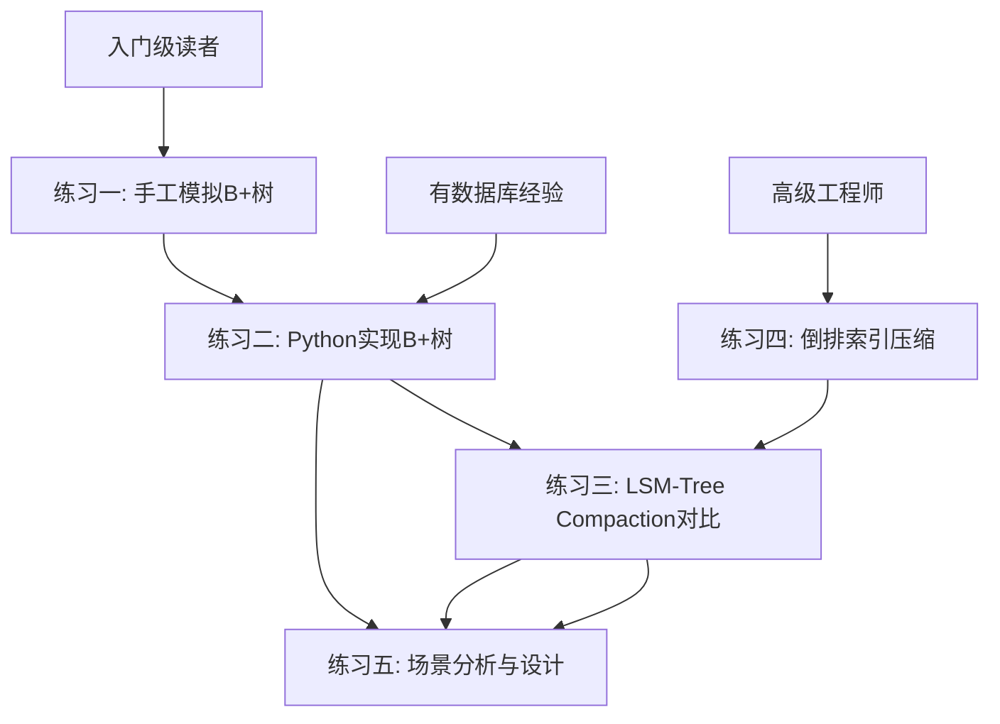

## 练习方法

本章的练习按照**由浅入深**的路径设计，覆盖从理论验证到动手实现再到工程优化的完整链路。每个练习都紧扣前面章节讨论的索引实现技术——B+树节点布局、LSM-Tree Compaction、倒排索引压缩、并发控制协议等——确保你在实操中真正理解这些概念的工程含义。

完成全部五个练习后，你将具备从零设计和实现一个简化版索引引擎的能力。

---

### 练习一：B+树的手工模拟与数据结构推导（预计45分钟）

**目标**：通过手工模拟B+树的完整操作流程，深入理解节点分裂、合并、重分配的触发条件和传播路径，建立对B+树内部行为的直觉。

**核心知识点回顾**：

在动手之前，先确认你对以下概念的理解：

| 概念 | 定义 | 关键约束 |
|------|------|----------|
| 阶数（Order） | 节点最多容纳的子节点数 m | 内部节点最少 ⌈m/2⌉ 个子节点 |
| 扇出（Fanout） | 单个节点能容纳的键值对数量 | 与页面大小和键值大小成反比 |
| 分裂（Split） | 节点满时拆分为两个节点 | 触发条件：num_keys > MAX_KEYS |
| 下溢（Underflow） | 节点键值数低于最小要求 | 触发条件：num_keys < ⌈m/2⌉ - 1 |
| 提升（Push-up） | 分裂时将中间键值提升到父节点 | 叶子分裂提副本，内部分裂提原值 |

**步骤**：

#### 1.1 手工构建B+树（15分钟）

假设一个4阶B+树（每个内部节点最多3个键值、4个子节点；每个叶子节点最多3个键值），依次插入以下键值：

插入序列：10, 20, 5, 6, 12, 30, 7, 17

在纸上（或文本编辑器中）画出每一次插入后的树状态。重点关注：

- 插入第4个值（6）时，叶子节点如何分裂？
- 分裂后中间键值如何提升到父节点？
- 插入第7个值（7）时，父节点是否也触发分裂？
- 树的高度在什么时候从1变为2，从2变为3？

**参考答案要点**：

插入10:           [10]
插入20:           [10, 20]
插入5:            [5, 10, 20]
插入6（叶子满，分裂）:
                  [10]
                 /    \
              [5,6]  [10,20]
              
插入12:           [10]
                 /    \
              [5,6]  [10,12,20]
              
插入30:           [10, 20]
                 /    |    \
              [5,6] [10,12] [20,30]
              
插入7（叶子满，分裂→父节点也满，父节点分裂→树高+1）:
                       [10]
                      /    \
                   [6]      [20]
                  /   \    /    \
              [5,6] [7,10] [12,20] [30]
              
插入17:           [10]
                 /    \
              [6]      [20]
             /   \    /    \
         [5,6] [7,10] [12,17] [20,30]

#### 1.2 验证删除与合并（15分钟）

在上一步最终状态的基础上，依次删除以下键值：

删除序列：30, 20, 17

重点关注：
- 删除30后，兄弟节点是否足够借出？（重分配 vs 合并）
- 删除20后，是否触发节点合并？合并如何影响父节点？
- 删除17后，树的高度是否降低？

#### 1.3 磁盘页面布局分析（15分钟）

参考本章"节点结构与磁盘布局"一节，为一个8KB页面的B+树节点绘制详细的字节级布局图。计算以下指标：

已知条件：
- 页面大小 = 8192 字节
- Page Header = 96 字节
- File Trailer = 8 字节
- 每个键值（key）= 8 字节（BIGINT）
- 每个指针（child pointer）= 6 字节（页号+槽位号）
- 每个记录指针（tuple pointer）= 7 字节

问题：
1. 内部节点最多能存储多少个键值对？（扇出是多少？）
2. 叶子节点最多能存储多少个键值对？
3. 一个扇出为500的B+树，存储1亿条记录需要几层？
4. 如果改用VARCHAR(64)作为键值（平均32字节），扇出降低多少？

**参考计算**：

内部节点：可用空间 = 8192 - 96 - 8 = 8088 字节
每个"键+指针"单元 = 8 + 6 = 14 字节
最多键值数 = 8088 / 14 ≈ 577 个
扇出 = 577 + 1 = 578

叶子节点：每个"键+值+指针"单元 = 8 + 7 + 7 = 22 字节
最多键值对数 = 8088 / 22 ≈ 367 个

存储1亿记录的树高：
log(1亿) / log(578) ≈ 8 / 2.76 ≈ 3 层 → 仅需3次磁盘IO

VARCHAR(64)键值：每个单元 = 32 + 14 = 46 字节
扇出 = 8088 / 46 ≈ 175，比BIGINT的578降低了约70%

**检查标准**：

- [ ] 能手工完成4阶B+树的完整插入/删除流程，正确处理分裂和合并
- [ ] 能解释"叶子分裂提副本、内部分裂提原值"的区别及原因
- [ ] 能根据页面大小和键值大小计算B+树的扇出和树高
- [ ] 能分析键值类型变更对索引空间和查询性能的影响

---

### 练习二：用Python实现一个简化版B+树（预计90分钟）

**目标**：从零实现一个内存中的B+树，支持搜索、插入、删除和范围查询，将理论知识转化为代码实现。

**环境准备**：

```bash
# 无外部依赖，仅需Python 3.8+
python3 --version

# 创建工作目录
mkdir -p btree_practice &amp;&amp; cd btree_practice
```

#### 2.1 定义节点数据结构（15分钟）

实现B+树的叶子节点和内部节点：

```python
import bisect
from typing import List, Optional, Tuple, Iterator

class BPlusTreeNode:
    """B+树节点基类"""
    def __init__(self, is_leaf: bool = False):
        self.is_leaf = is_leaf
        self.keys: List = []
        self.parent: Optional['BPlusTreeNode'] = None

class BPlusTreeLeafNode(BPlusTreeNode):
    """叶子节点：存储键值对 + 链表指针"""
    def __init__(self):
        super().__init__(is_leaf=True)
        self.values: List = []
        self.next: Optional['BPlusTreeLeafNode'] = None  # 右兄弟指针

class BPlusTreeInternalNode(BPlusTreeNode):
    """内部节点：存储键值 + 子节点指针"""
    def __init__(self):
        super().__init__(is_leaf=False)
        self.children: List[BPlusTreeNode] = []
```

#### 2.2 实现搜索操作（15分钟）

```python
class BPlusTree:
    def __init__(self, max_keys_per_node: int = 3):
        """max_keys_per_node: 叶子节点最多存储的键值对数"""
        self.max_keys = max_keys_per_node
        self.min_keys = max_keys_per_node // 2  # 内部节点的最小键数
        self.root: BPlusTreeNode = BPlusTreeLeafNode()
    
    def search(self, key) -> Optional:
        """搜索指定键，返回对应的值或None"""
        node = self._find_leaf(key)
        # TODO: 在叶子节点的keys列表中二分查找
        # 提示：使用 bisect_left 找到可能的位置
        idx = bisect.bisect_left(node.keys, key)
        if idx < len(node.keys) and node.keys[idx] == key:
            return node.values[idx]
        return None
    
    def _find_leaf(self, key) -> BPlusTreeLeafNode:
        """从根节点向下搜索到目标叶子节点"""
        node = self.root
        while not node.is_leaf:
            # TODO: 在内部节点中找到合适的子节点
            # 提示：bisect_right 找到第一个大于key的键的位置
            idx = bisect.bisect_right(node.keys, key)
            node = node.children[idx]
        return node
```

#### 2.3 实现插入与节点分裂（30分钟）

这是B+树实现中最核心也最复杂的部分：

```python
    def insert(self, key, value):
        """插入键值对"""
        leaf = self._find_leaf(key)
        
        # 在叶子节点中插入（保持有序）
        idx = bisect.bisect_left(leaf.keys, key)
        if idx < len(leaf.keys) and leaf.keys[idx] == key:
            leaf.values[idx] = value  # 更新已存在的键
            return
        
        leaf.keys.insert(idx, key)
        leaf.values.insert(idx, value)
        
        # 如果叶子节点未满，直接返回
        if len(leaf.keys) <= self.max_keys:
            return
        
        # 叶子节点已满，需要分裂
        self._split_leaf(leaf)
    
    def _split_leaf(self, leaf: BPlusTreeLeafNode):
        """分裂叶子节点"""
        mid = len(leaf.keys) // 2
        
        # 创建新的右兄弟节点
        new_leaf = BPlusTreeLeafNode()
        new_leaf.keys = leaf.keys[mid:]
        new_leaf.values = leaf.values[mid:]
        new_leaf.next = leaf.next
        leaf.next = new_leaf
        
        # 截断原节点
        leaf.keys = leaf.keys[:mid]
        leaf.values = leaf.values[:mid]
        
        # 将新节点的最小键值提升到父节点
        push_up_key = new_leaf.keys[0]
        new_leaf.parent = leaf.parent
        
        if leaf.parent is None:
            # 叶子就是根节点，需要创建新的根
            new_root = BPlusTreeInternalNode()
            new_root.keys = [push_up_key]
            new_root.children = [leaf, new_leaf]
            leaf.parent = new_root
            new_leaf.parent = new_root
            self.root = new_root
        else:
            self._insert_into_parent(leaf.parent, push_up_key, new_leaf)
    
    def _insert_into_parent(self, parent: BPlusTreeInternalNode, 
                            key, right_child: BPlusTreeNode):
        """将键值和右子节点插入父节点"""
        idx = bisect.bisect_right(parent.keys, key)
        parent.keys.insert(idx, key)
        parent.children.insert(idx + 1, right_child)
        right_child.parent = parent
        
        # 如果父节点未满，直接返回
        if len(parent.keys) <= self.max_keys:
            return
        
        # 父节点已满，递归分裂
        self._split_internal(parent)
    
    def _split_internal(self, node: BPlusTreeInternalNode):
        """分裂内部节点"""
        mid = len(node.keys) // 2
        push_up_key = node.keys[mid]
        
        new_node = BPlusTreeInternalNode()
        new_node.keys = node.keys[mid + 1:]
        new_node.children = node.children[mid + 1:]
        
        # 更新子节点的父指针
        for child in new_node.children:
            child.parent = new_node
        
        node.keys = node.keys[:mid]
        node.children = node.children[:mid + 1]
        
        if node.parent is None:
            new_root = BPlusTreeInternalNode()
            new_root.keys = [push_up_key]
            new_root.children = [node, new_node]
            node.parent = new_root
            new_node.parent = new_root
            self.root = new_root
        else:
            self._insert_into_parent(node.parent, push_up_key, new_node)
```

#### 2.4 实现范围查询（15分钟）

利用叶子节点的链表指针实现高效的范围扫描：

```python
    def range_query(self, start_key, end_key) -> List[Tuple]:
        """范围查询：返回 [start_key, end_key) 之间的所有键值对"""
        leaf = self._find_leaf(start_key)
        results = []
        
        while leaf is not None:
            for key, value in zip(leaf.keys, leaf.values):
                if key >= end_key:
                    return results
                if key >= start_key:
                    results.append((key, value))
            leaf = leaf.next  # 沿链表向右扫描
        
        return results
```

#### 2.5 验证与测试（15分钟）

```python
# ===== 测试用例 =====
def test_btree():
    tree = BPlusTree(max_keys_per_node=4)  # 5阶B+树
    
    # 测试插入
    test_data = [(i, f"value_{i}") for i in range(1, 21)]
    for key, value in test_data:
        tree.insert(key, value)
    
    # 测试搜索
    for key, value in test_data:
        assert tree.search(key) == value, f"搜索 {key} 失败"
    assert tree.search(99) is None, "不存在的键应返回None"
    
    # 测试范围查询
    results = tree.range_query(5, 15)
    assert len(results) == 10, f"范围查询应返回10条，实际返回 {len(results)}"
    assert results[0] == (5, "value_5")
    assert results[-1] == (14, "value_14")
    
    # 测试更新
    tree.insert(10, "updated_10")
    assert tree.search(10) == "updated_10"
    
    # 打印树结构（辅助调试）
    print_tree(tree.root)
    print("✅ 所有测试通过!")

def print_tree(node, level=0):
    prefix = "  " * level
    if node.is_leaf:
        print(f"{prefix}Leaf[{', '.join(str(k) for k in node.keys)}]")
    else:
        print(f"{prefix}Internal[{', '.join(str(k) for k in node.keys)}]")
        for child in node.children:
            print_tree(child, level + 1)

if __name__ == "__main__":
    test_btree()
```

**进阶挑战**：完成基本版本后，尝试以下扩展：

- 实现删除操作（处理重分配和合并逻辑）
- 实现 `EXPLAIN` 方法，记录搜索过程中访问的节点数（模拟磁盘IO次数）
- 添加前缀压缩（对字符串键值只存储与前一个键值的差异部分）
- 实现并发安全版本（使用 `threading.Lock` 模拟Latch，实现简单的Lock Coupling协议）

**检查标准**：

- [ ] B+树能正确执行插入、搜索、范围查询
- [ ] 节点分裂正确处理，分裂传播能递归到根节点
- [ ] 范围查询利用叶子链表，时间复杂度为 O(log N + K)，K为结果数
- [ ] 能通过所有测试用例，打印的树结构符合B+树性质

---

### 练习三：LSM-Tree Compaction策略对比实验（预计60分钟）

**目标**：通过对比实验理解Size-Tiered和Leveled两种Compaction策略在读写性能和空间利用上的差异。

#### 3.1 搭建实验环境（10分钟）

使用RocksDB（LSM-Tree的工业级实现）进行实验：

```bash
# Ubuntu/Debian环境
sudo apt-get update
sudo apt-get install -y librocksdb-dev python3-pip
pip3 install rocksdb  # Python绑定

# 或者用Docker快速搭建
docker run -it --rm ubuntu:22.04 bash
apt-get update &amp;&amp; apt-get install -y git build-essential python3-pip
git clone https://github.com/facebook/rocksdb.git
cd rocksdb &amp;&amp; make -j4 shared_lib &amp;&amp; make install
pip3 install rocksdb
```

#### 3.2 设计对比实验（20分钟）

编写测试脚本，对比两种Compaction策略在相同工作负载下的表现：

```python
import rocksdb
import time
import random
import statistics

def create_db(compaction_style, db_path):
    """创建配置了特定Compaction策略的数据库实例"""
    opts = rocksdb.Options()
    opts.create_if_missing = True
    opts.max_open_files = -1
    
    if compaction_style == "size_tiered":
        opts.compaction_style = rocksdb.CompactionStyle.size_tiered
    elif compaction_style == "leveled":
        opts.compaction_style = rocksdb.CompactionStyle.level
    
    # 统一缓存大小，确保公平对比
    opts.block_cache = rocksdb.LRUCache(64 * 1024 * 1024)  # 64MB
    opts.write_buffer_size = 16 * 1024 * 1024  # 16MB MemTable
    opts.max_write_buffer_number = 3
    
    return rocksdb.DB(db_path, opts)

def benchmark_write(db, num_keys, value_size=100):
    """写入基准测试"""
    values = [b'x' * value_size for _ in range(num_keys)]
    keys = [f"key_{i:010d}".encode() for i in range(num_keys)]
    
    write_times = []
    start_total = time.time()
    
    for i in range(num_keys):
        start = time.time()
        db.put(keys[i], values[i])
        write_times.append(time.time() - start)
    
    total_time = time.time() - start_total
    
    return {
        "total_keys": num_keys,
        "total_time_s": round(total_time, 3),
        "qps": round(num_keys / total_time),
        "avg_latency_us": round(statistics.mean(write_times) * 1_000_000, 2),
        "p99_latency_us": round(sorted(write_times)[int(num_keys * 0.99)] * 1_000_000, 2)
    }

def benchmark_read(db, num_queries=10000, num_keys=100000):
    """读取基准测试"""
    keys = [f"key_{random.randint(0, num_keys-1):010d}".encode() for _ in range(num_queries)]
    
    read_times = []
    hits = 0
    for key in keys:
        start = time.time()
        val = db.get(key)
        read_times.append(time.time() - start)
        if val is not None:
            hits += 1
    
    return {
        "total_queries": num_queries,
        "hit_rate": round(hits / num_queries * 100, 2),
        "avg_latency_us": round(statistics.mean(read_times) * 1_000_000, 2),
        "p99_latency_us": round(sorted(read_times)[int(num_queries * 0.99)] * 1_000_000, 2),
        "qps": round(num_queries / sum(read_times))
    }

# ===== 运行对比实验 =====
NUM_KEYS = 500000
VALUE_SIZE = 200

for style in ["size_tiered", "leveled"]:
    print(f"\n{'='*60}")
    print(f"  Compaction策略: {style.upper()}")
    print(f"{'='*60}")
    
    db = create_db(style, f"/tmp/rocksdb_{style}")
    
    # 写入测试
    write_result = benchmark_write(db, NUM_KEYS, VALUE_SIZE)
    print(f"\n写入性能:")
    print(f"  总键数:   {write_result['total_keys']:,}")
    print(f"  总耗时:   {write_result['total_time_s']}s")
    print(f"  QPS:      {write_result['qps']:,}")
    print(f"  平均延迟: {write_result['avg_latency_us']}μs")
    print(f"  P99延迟:  {write_result['p99_latency_us']}μs")
    
    # 等待Compaction完成
    time.sleep(5)
    
    # 读取测试
    read_result = benchmark_read(db, 10000, NUM_KEYS)
    print(f"\n读取性能:")
    print(f"  QPS:      {read_result['qps']:,}")
    print(f"  平均延迟: {read_result['avg_latency_us']}μs")
    print(f"  P99延迟:  {read_result['p99_latency_us']}μs")
    
    # 磁盘空间统计
    import os
    total_size = sum(
        os.path.getsize(os.path.join(dp, f)) 
        for dp, _, files in os.walk(f"/tmp/rocksdb_{style}") 
        for f in files
    )
    print(f"\n磁盘占用:  {total_size / 1024 / 1024:.1f} MB")
    print(f"空间放大:  {total_size / (NUM_KEYS * VALUE_SIZE):.2f}x")
    
    del db
```

#### 3.3 分析实验结果（20分钟）

根据运行结果，填写以下对比分析表：

┌──────────────┬──────────────────┬──────────────────┐
│ 指标          │ Size-Tiered      │ Leveled          │
├──────────────┼──────────────────┼──────────────────┤
│ 写入QPS       │                  │                  │
│ 写入P99延迟   │                  │                  │
│ 读取QPS       │                  │                  │
│ 读取P99延迟   │                  │                  │
│ 磁盘空间占用   │                  │                  │
│ 空间放大倍数   │                  │                  │
└──────────────┴──────────────────┴──────────────────┘

回答以下问题：

1. **为什么Leveled Compaction的读性能通常优于Size-Tiered？**

   参考答案：Leveled Compaction在每一层维护一个有序的Run，查询时每一层最多只需要检查一个SSTable（通过Key Range排除其他文件）。而Size-Tiered在同一层可能有多个重叠的SSTable，需要检查全部。读放大：Leveled约O(1)每层，Size-Tiered约O(T)每层（T是同层SSTable数量）。

2. **为什么Size-Tiered的写性能通常优于Leveled？**

   参考答案：Leveled Compaction在合并时需要读取上层的SSTable和下层的SSTable，进行排序后写出，写放大约为T（每层SSTable数量，通常为10）。Size-Tiered只合并大小相近的SSTable，写放大约为1-2。

3. **在什么场景下应该选择Size-Tiered？什么场景选择Leveled？**

   参考答案：写密集+读少（如日志收集、时序数据写入）→Size-Tiered；读密集+写少（如用户配置表、元数据存储）→Leveled；混合负载→根据读写比权衡，RocksDB默认Leveled适合大多数OLTP场景。

#### 3.4 观察Compaction过程（10分钟）

使用RocksDB的统计接口观察Compaction的实时状态：

```python
import json

def observe_compaction(db):
    """观察Compaction统计信息"""
    stats = rocksdb.get_property(db, "rocksdb.stats")
    if stats:
        print(stats.decode()[:3000])  # 输出前3000字符
    
    # 关键指标
    sst_count = rocksdb.get_property(db, "rocksdb.num-files-at-level0")
    print(f"\nLevel-0 SSTable数量: {sst_count}")
    
    total_sst = rocksdb.get_property(db, "rocksdb.total-sst-files-size")
    print(f"SSTable总大小: {int(total_sst) / 1024 / 1024:.1f} MB")

observe_compaction(db)
```

**检查标准**：

- [ ] 成功搭建RocksDB实验环境
- [ ] 完成两种Compaction策略的对比实验并记录数据
- [ ] 能解释实验结果与理论预期的对应关系
- [ ] 理解写放大、读放大、空间放大三者之间的权衡关系

---

### 练习四：倒排索引的实现与压缩（预计60分钟）

**目标**：理解倒排索引的核心数据结构，实现Posting List的压缩编码，体验从原始存储到压缩存储的空间收益。

#### 4.1 构建基本倒排索引（20分钟）

```python
from collections import defaultdict
import struct

class InvertedIndex:
    """简化版倒排索引"""
    
    def __init__(self):
        # 倒排索引：term -> sorted list of document IDs
        self.postings: dict[str, list[int]] = defaultdict(list)
        self.doc_count = 0
        self.doc_lengths: dict[int, int] = {}
    
    def add_document(self, doc_id: int, terms: list[str]):
        """添加文档到索引"""
        self.doc_count += 1
        self.doc_lengths[doc_id] = len(terms)
        
        for term in terms:
            # Posting List保持有序
            postings = self.postings[term]
            if not postings or doc_id > postings[-1]:
                postings.append(doc_id)
            else:
                # 二分查找插入位置
                import bisect
                bisect.insort(postings, doc_id)
    
    def search_term(self, term: str) -> list[int]:
        """单词查询：返回包含该词的所有文档ID"""
        return self.postings.get(term, [])
    
    def search_and(self, term1: str, term2: str) -> list[int]:
        """AND查询：两个词的交集（利用Posting List有序性）"""
        list1 = self.postings.get(term1, [])
        list2 = self.postings.get(term2, [])
        return self._intersect(list1, list2)
    
    def search_or(self, term1: str, term2: str) -> list[int]:
        """OR查询：两个词的并集"""
        list1 = self.postings.get(term1, [])
        list2 = self.postings.get(term2, [])
        return self._union(list1, list2)
    
    def _intersect(self, list1, list2) -> list[int]:
        """双指针求交集——时间复杂度 O(m+n)"""
        result = []
        i, j = 0, 0
        while i < len(list1) and j < len(list2):
            if list1[i] == list2[j]:
                result.append(list1[i])
                i += 1
                j += 1
            elif list1[i] < list2[j]:
                i += 1
            else:
                j += 1
        return result
    
    def _union(self, list1, list2) -> list[int]:
        """双指针求并集"""
        result = []
        i, j = 0, 0
        while i < len(list1) and j < len(list2):
            if list1[i] < list2[j]:
                result.append(list1[i])
                i += 1
            elif list1[i] > list2[j]:
                result.append(list2[j])
                j += 1
            else:
                result.append(list1[i])
                i += 1
                j += 1
        result.extend(list1[i:])
        result.extend(list2[j:])
        return result
    
    def compression_ratio(self) -> dict:
        """统计压缩前后的空间对比"""
        raw_size = 0
        for term, postings in self.postings.items():
            # 原始存储：每个doc_id用4字节整数
            raw_size += len(postings) * 4
            # 加上term字符串的开销
            raw_size += len(term.encode('utf-8'))
        
        return {
            "terms": len(self.postings),
            "total_postings": sum(len(v) for v in self.postings.values()),
            "raw_size_bytes": raw_size,
            "raw_size_kb": round(raw_size / 1024, 2)
        }


# ===== 测试 =====
index = InvertedIndex()

# 模拟一批文档（简化版英文分词）
documents = {
    1: ["database", "index", "btree", "performance"],
    2: ["database", "index", "hash", "lookup"],
    3: ["database", "lsm", "tree", "write"],
    4: ["search", "engine", "inverted", "index", "posting"],
    5: ["search", "engine", "inverted", "index", "compress"],
    6: ["database", "btree", "concurrent", "index"],
    7: ["database", "hash", "index", "concurrent"],
    8: ["search", "posting", "compress", "bitmap"],
}

for doc_id, terms in documents.items():
    index.add_document(doc_id, terms)

# 查询测试
print(f"包含'database'的文档: {index.search_term('database')}")
print(f"'database' AND 'index': {index.search_and('database', 'index')}")
print(f"'index' OR 'posting': {index.search_or('index', 'posting')}")
print(f"\n空间统计: {index.compression_ratio()}")
```

#### 4.2 实现Posting List压缩编码（20分钟）

实现三种编码方式，对比压缩效果：

```python
class PostingEncoder:
    """Posting List压缩编码器"""
    
    @staticmethod
    def vbyte_encode(postings: list[int]) -> bytes:
        """
        VByte（变长字节编码）：
        每个字节的最高位为标志位：1=最后一个字节，0=还有后续字节
        剩余7位存储数据
        """
        result = bytearray()
        for num in postings:
            # 先编码差值
            encoded = []
            if num == 0:
                encoded.append(0)
            else:
                while num > 0:
                    encoded.append(num &amp; 0x7F)
                    num >>= 7
            # 反转并设置终止位
            encoded.reverse()
            for i, byte in enumerate(encoded):
                if i == len(encoded) - 1:
                    result.append(byte | 0x80)  # 设置最高位
                else:
                    result.append(byte)
        return bytes(result)
    
    @staticmethod
    def vbyte_decode(data: bytes) -> list[int]:
        """VByte解码"""
        postings = []
        current = 0
        for byte in data:
            current = (current << 7) | (byte &amp; 0x7F)
            if byte &amp; 0x80:  # 终止位
                postings.append(current)
                current = 0
        return postings
    
    @staticmethod
    def pfor_delta_encode(postings: list[int]) -> bytes:
        """
        简化版PForDelta编码：
        1. 计算相邻差值
        2. 找到出现频率最高的差值位宽b
        3. 用b位存储大部分差值，异常值单独存储
        """
        if len(postings) <= 1:
            return PostingEncoder.vbyte_encode(postings)
        
        # 计算差值
        deltas = [postings[0]] + [postings[i] - postings[i-1] 
                                   for i in range(1, len(postings))]
        
        # 找到最佳位宽（简化：选择能覆盖80%差值的最小位宽）
        max_delta = max(deltas)
        if max_delta == 0:
            b = 1
        else:
            b = max_delta.bit_length()
        
        # 编码：[位宽b][差值数量][用b位编码的差值...][异常值位置][异常值...]
        result = bytearray()
        result.append(b)  # 1字节：位宽
        result.append(len(deltas) &amp; 0xFF)  # 1字节：差值数量（简化，最多255）
        
        # 用固定位宽编码所有差值（简化为字节对齐）
        for delta in deltas:
            result.extend(delta.to_bytes((b + 7) // 8, 'big'))
        
        return bytes(result)
    
    @staticmethod
    def delta_encode(postings: list[int]) -> bytes:
        """
        差值编码 + VByte：
        最简单有效的压缩方式
        """
        deltas = [postings[0]] + [postings[i] - postings[i-1] 
                                   for i in range(1, len(postings))]
        return PostingEncoder.vbyte_encode(deltas)
    
    @staticmethod
    def delta_decode(data: bytes) -> list[int]:
        """差值编码解码"""
        deltas = PostingEncoder.vbyte_decode(data)
        if not deltas:
            return []
        postings = [deltas[0]]
        for i in range(1, len(deltas)):
            postings.append(postings[-1] + deltas[i])
        return postings


# ===== 压缩效果对比实验 =====
print("=" * 70)
print("  Posting List 压缩效果对比")
print("=" * 70)

# 模拟一个高频词的Posting List（10000个文档ID）
import random
random.seed(42)
postings = sorted(random.sample(range(1, 1000000), 10000))

raw_size = len(postings) * 4  # 每个int 4字节

vbyte_data = PostingEncoder.vbyte_encode(postings)
delta_data = PostingEncoder.delta_encode(postings)
pfor_data = PostingEncoder.pfor_delta_encode(postings)

print(f"\n原始Posting List: {len(postings)} 个文档ID")
print(f"原始存储大小:     {raw_size:,} 字节 ({raw_size/1024:.1f} KB)")
print(f"VByte编码:        {len(vbyte_data):,} 字节 "
      f"(压缩率 {len(vbyte_data)/raw_size*100:.1f}%)")
print(f"差值+VByte编码:   {len(delta_data):,} 字节 "
      f"(压缩率 {len(delta_data)/raw_size*100:.1f}%)")
print(f"PForDelta编码:    {len(pfor_data):,} 字节 "
      f"(压缩率 {len(pfor_data)/raw_size*100:.1f}%)")

# 验证解码正确性
decoded = PostingEncoder.delta_decode(delta_data)
assert decoded == postings, "差值编码解码失败！"
print("\n✅ 差值编码解码验证通过")
```

#### 4.3 实现Skip List加速查询（20分钟）

当两个Posting List长度差异巨大时（例如一个包含100万文档ID，另一个只有100个），双指针扫描效率很低。Skip List可以快速跳过不相关的文档ID：

```python
class SkipListPostings:
    """带Skip List加速的Posting List"""
    
    def __init__(self, postings: list[int], skip_interval: int = 64):
        self.postings = postings
        self.skip_interval = skip_interval
        # 构建跳表层：每个条目记录 (skip_to_id, position_in_postings)
        self.skip_list = []
        self._build_skip_list()
    
    def _build_skip_list(self):
        """构建跳表加速层"""
        for i in range(0, len(self.postings), self.skip_interval):
            self.skip_list.append((self.postings[i], i))
    
    def intersect_with(self, other: 'SkipListPostings') -> list[int]:
        """利用Skip List加速的交集运算"""
        result = []
        i, j = 0, 0
        
        while i < len(self.postings) and j < len(other.postings):
            if self.postings[i] == other.postings[j]:
                result.append(self.postings[i])
                i += 1
                j += 1
            elif self.postings[i] < other.postings[j]:
                # 利用other的Skip List跳过
                j = other._skip_ahead(self.postings[i], j)
            else:
                i = self._skip_ahead(other.postings[j], i)
        
        return result
    
    def _skip_ahead(self, target: int, current_pos: int) -> int:
        """利用Skip List快速跳过小于target的位置"""
        # 先在跳表中找到最接近target的位置
        lo, hi = 0, len(self.skip_list) - 1
        best_pos = current_pos
        
        while lo <= hi:
            mid = (lo + hi) // 2
            if self.skip_list[mid][0] <= target:
                best_pos = self.skip_list[mid][1]
                lo = mid + 1
            else:
                hi = mid - 1
        
        # 从best_pos开始线性扫描
        pos = best_pos
        while pos < len(self.postings) and self.postings[pos] < target:
            pos += 1
        
        return pos


# ===== Skip List加速效果对比 =====
print("\n" + "=" * 70)
print("  Skip List 加速效果对比")
print("=" * 70)

# 构造两个大小差异巨大的Posting List
large_posting = sorted(random.sample(range(1, 10_000_000), 100_000))
small_posting = sorted(random.sample(range(1, 10_000_000), 500))

# 方式1：朴素双指针
index1 = InvertedIndex()
index2 = InvertedIndex()

start = time.time()
result_naive = index1._intersect(large_posting, small_posting)
time_naive = time.time() - start

# 方式2：Skip List加速
large_skiplist = SkipListPostings(large_posting, skip_interval=128)
small_skiplist = SkipListPostings(small_posting, skip_interval=32)

start = time.time()
result_skip = large_skiplist.intersect_with(small_skiplist)
time_skip = time.time() - start

assert result_naive == result_skip, "两种方式结果不一致！"

print(f"\n大List: {len(large_posting):,} 个ID, 小List: {len(small_posting):,} 个ID")
print(f"朴素双指针:  {time_naive*1000:.3f}ms, 结果: {len(result_naive)} 条")
print(f"Skip List:   {time_skip*1000:.3f}ms, 结果: {len(result_skip)} 条")
print(f"加速比:      {time_naive/time_skip:.1f}x")
print("\n✅ Skip List加速验证通过")
```

**检查标准**：

- [ ] 能构建基本倒排索引，支持单词查询、AND、OR操作
- [ ] 能实现VByte和差值编码，理解压缩率差异的原因
- [ ] 能实现Skip List加速的交集运算，理解其在不均衡Posting List中的优势
- [ ] 能分析不同压缩方式的空间-时间权衡

---

### 练习五：综合设计挑战——为场景选择正确的索引方案（预计60分钟）

**目标**：面对真实的业务场景，能够综合运用本章知识，设计合理的索引方案并进行量化评估。

#### 5.1 场景分析（20分钟）

阅读以下三个场景，为每个场景设计索引方案并说明理由：

**场景A：电商订单系统（OLTP）**

表结构：orders(id BIGINT, user_id BIGINT, status TINYINT, 
               amount DECIMAL(10,2), created_at TIMESTAMP)
数据量：8亿行
写入：5000 TPS（新增订单）
读取：20000 QPS（主要是用户查询自己的订单）
核心查询：
  Q1: SELECT * FROM orders WHERE user_id = ? ORDER BY created_at DESC LIMIT 20
  Q2: SELECT status, COUNT(*) FROM orders WHERE user_id = ? GROUP BY status
  Q3: SELECT * FROM orders WHERE created_at BETWEEN ? AND ? AND amount > 1000

你需要回答：
1. 选择什么索引结构？为什么不用Hash索引？
2. 需要创建哪些索引？每个索引的列顺序是什么？
3. 如何验证你的索引设计是否有效？给出EXPLAIN的预期结果。
4. 预估索引的磁盘空间占用。

**场景B：物联网时序数据写入（Write-Heavy）**

设备数量：100万台
每设备每分钟上报一次数据
写入速率：~17000条/秒（峰值3倍）
主要查询：按设备ID查最近24小时数据
数据保留：90天

你需要回答：
1. B+树索引适合这个场景吗？为什么？
2. 如果使用LSM-Tree，选择Size-Tiered还是Leveled Compaction？
3. 设计一个合理的SSTable分层策略，给出每层的大小估算。
4. 如何处理90天后的数据清理？（TTL机制）

**场景C：全文搜索引擎（Read-Heavy）**

文档数量：500万篇
平均文档长度：500个词
总词条（去重）：约200万
查询模式：多关键词组合搜索（AND/OR）
延迟要求：P99 < 200ms

你需要回答：
1. 倒排索引的Posting List采用什么压缩编码？
2. 如何利用Skip List加速多关键词交集运算？
3. 对于高频词（"the"出现在90%的文档中），如何处理？
4. 如何评估一个查询计划的代价？

#### 5.2 索引代价估算（20分钟）

完成以下定量计算：

```python
def estimate_btree_cost(total_rows, page_size_kb, key_bytes, value_bytes):
    """
    估算B+树索引的各种指标
    """
    page_size = page_size_kb * 1024
    
    # 内部节点扇出
    ptr_bytes = 6  # 页号+槽位号
    internal_slot = key_bytes + ptr_bytes
    internal_fanout = (page_size - 96 - 8) // internal_slot + 1
    
    # 叶子节点容量
    leaf_slot = key_bytes + value_bytes + 7  # 7字节记录指针
    leaf_capacity = (page_size - 96 - 8) // leaf_slot
    
    # 树高
    import math
    if internal_fanout <= 1:
        tree_height = 1
    else:
        tree_height = math.ceil(math.log(total_rows / leaf_capacity) / math.log(internal_fanout)) + 1
    
    # 索引大小
    num_leaves = math.ceil(total_rows / leaf_capacity)
    index_size_mb = (num_leaves * page_size + 
                     num_leaves * page_size / internal_fanout) / 1024 / 1024
    
    print(f"页面大小:        {page_size_kb} KB")
    print(f"内部节点扇出:    {internal_fanout}")
    print(f"叶子节点容量:    {leaf_capacity} 条/页")
    print(f"B+树高度:        {tree_height} 层")
    print(f"叶子节点数:      {num_leaves:,}")
    print(f"索引大小:        {index_size_mb:.1f} MB")
    print(f"单次点查询IO:    {tree_height} 次磁盘读取")
    print(f"树高对应延迟(10ms/IO): {tree_height * 10} ms")
    print()

# 场景A的估算
print("场景A：BIGINT主键 (8字节)")
estimate_btree_cost(
    total_rows=800_000_000,  # 8亿行
    page_size_kb=16,          # InnoDB默认16KB
    key_bytes=8,              # BIGINT
    value_bytes=6             # 页号+槽位号
)

print("场景A：VARCHAR(36) UUID主键")
estimate_btree_cost(
    total_rows=800_000_000,
    page_size_kb=16,
    key_bytes=36,
    value_bytes=6
)

print("场景A：BIGINT主键 + user_id(BIGINT)联合索引")
estimate_btree_cost(
    total_rows=800_000_000,
    page_size_kb=16,
    key_bytes=8 + 8,          # user_id + 主键
    value_bytes=6
)
```

**预期输出分析**：

通过计算你会看到：
- BIGINT主键：扇出约577，3层即可索引8亿行，索引约3.2GB
- UUID主键：扇出约175，4层才能索引8亿行，索引约10GB——空间膨胀3倍
- user_id联合索引：键值翻倍导致扇出减半，需要额外的存储空间

#### 5.3 撰写索引设计文档（20分钟）

为场景A（电商订单系统）撰写一份完整的索引设计文档，包含以下部分：

```markdown
# 电商订单表索引设计方案

## 1. 表结构与数据特征
- 表名、列定义、数据类型
- 数据量、增长速率、生命周期

## 2. 查询分析
- 列出所有高频查询及其执行频率
- 分析每个查询的过滤条件、排序方式、返回列

## 3. 索引方案设计
| 索引名称 | 列组合 | 索引类型 | 目标查询 | 预期收益 |
|---------|--------|---------|---------|---------|
| ...     | ...    | ...     | ...     | ...     |

## 4. 空间与性能估算
- 每个索引的预估大小
- 单次查询的IO次数和延迟
- 写入代价评估（每个INSERT需要维护N个索引）

## 5. 验证方案
- EXPLAIN验证步骤
- 压测方案设计
- 监控指标与告警阈值
```

**检查标准**：

- [ ] 能根据业务场景选择合适的索引类型（B+/LSM/倒排/Hash）
- [ ] 能定量估算索引的磁盘空间和查询IO次数
- [ ] 能考虑索引的写入代价，避免过度索引
- [ ] 能设计完整的验证和监控方案

---

### 学习路径建议

根据不同水平的读者，推荐以下练习路径：



- **入门级（~4小时）**：练习一 → 练习二 → 练习五场景A。重点建立对B+树内部机制的直觉理解。
- **有数据库经验（~5小时）**：练习二 → 练习三 → 练习五场景B。重点理解LSM-Tree与B+树的设计权衡。
- **高级工程师（~6小时）**：练习四 → 练习三 → 练习五全部场景。重点掌握倒排索引的压缩技术和全场景索引选型能力。

### 进阶实践项目

完成以上练习后，可以挑战以下项目来进一步巩固：

1. **实现一个简化版RocksDB**：包含MemTable（跳表）、SSTable（磁盘有序文件）、WAL和Leveled Compaction，支持基本的put/get/delete操作。
2. **为开源项目贡献索引相关PR**：阅读LevelDB/RocksDB的源码，找到可以优化的地方（如Bloom Filter的位数组初始化、Compaction的文件选择策略等）。
3. **设计一个分布式索引方案**：参考TiDB的TiKV如何将RocksDB与Raft结合，设计一个支持分片和副本的索引方案，考虑数据一致性、读写路由和热点处理。
