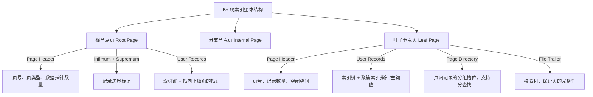
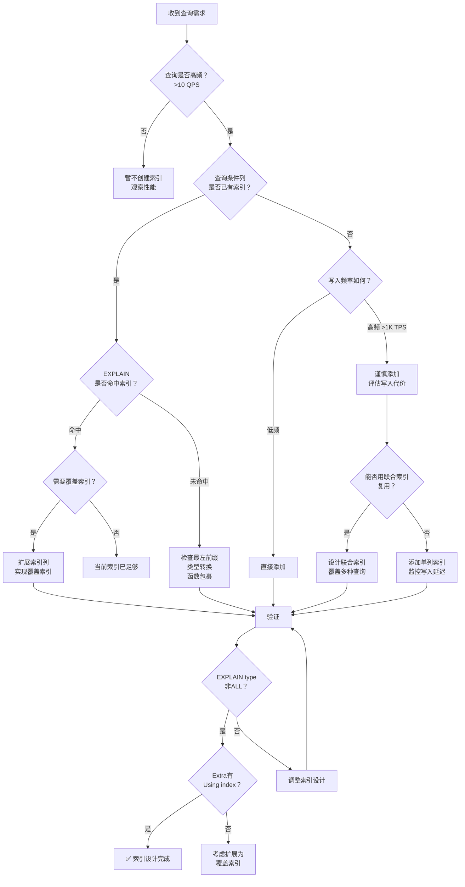
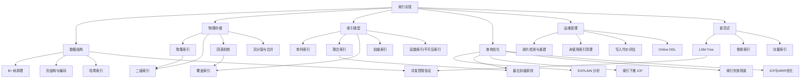

## 本章小结

索引实现是数据库性能优化中最具杠杆效应的技术手段。一个精心设计的索引可以将查询延迟从秒级降低到毫秒级，而一个错误的索引策略则可能让系统在高并发场景下彻底瘫痪。本章从数据结构原理到物理存储实现，从单列索引到复合索引设计，从传统 B+ 树到 LSM-Tree 新范式，系统性地构建了索引实现的完整知识体系。

与第 10 章"索引结构"侧重"为什么这样设计"不同，本章聚焦于"在真实磁盘和并发环境下怎么落地"——节点在磁盘上如何编码、并发读写如何协调、Compaction 策略如何选择。如果说第 10 章是理论认知框架，本章就是工程实践手册。

---

### 核心知识回顾

#### 一、索引的数据结构基础

本章的核心起点是理解**为什么索引选择 B+ 树而非其他数据结构**。以下是关键对比：

| 数据结构 | 查找复杂度 | 范围查询 | 磁盘友好度 | 适用场景 |
|----------|-----------|---------|-----------|---------|
| 二叉搜索树 | O(log n) | 不支持 | 差（树高不可控） | 内存中的有序集合 |
| AVL/红黑树 | O(log n) | 不支持 | 差（树高随数据量增长） | 内存索引、语言标准库 |
| 哈希表 | O(1) 精确查找 | 不支持 | 中等 | 等值查询缓存、自适应哈希索引 |
| B 树 | O(log n) | 支持但低效 | 好 | 早期文件系统索引 |
| **B+ 树** | **O(log n)** | **高效（叶子链表）** | **极好** | **关系型数据库索引的首选** |
| LSM-Tree | O(log n) 写入 | 支持 | 极好（顺序写） | 写密集型场景（RocksDB、LevelDB） |
| 跳表 | O(log n) | 支持 | 中等 | 内存索引（Redis Sorted Set） |

B+ 树的关键优势在于：
- **矮胖结构**：每个节点存储上百个键值，3-4 层即可索引上亿行数据，磁盘 IO 次数控制在 3-4 次
- **叶子链表**：所有数据存储在叶子节点并通过双向链表连接，范围查询只需顺序扫描叶子链表
- **非叶节点只存键**：内部节点不存储实际数据，单个磁盘页能容纳更多索引条目，进一步降低树高
- **缓存友好**：节点大小通常对齐磁盘页大小（InnoDB 默认 16KB），一次 IO 读取一个完整节点
- **并发友好**：Crabbing 协议（又称 Hand-over-Hand locking）允许多个事务并发遍历 B+ 树的不同路径，只需对修改的节点加写锁，读操作几乎无锁竞争

**B+ 树 vs LSM-Tree 的核心权衡**（详见第 10 章）：

| 维度 | B+ 树 | LSM-Tree |
|------|-------|----------|
| 写入模式 | 原地更新（in-place update） | 追加写入（append-only） |
| 写入放大 | 低（直接写目标页） | 高（Compaction 导致数据反复合并） |
| 读取放大 | 低（3-4 次 IO） | 高（可能需要查多个 SSTable） |
| 空间放大 | 低 | 中等（Compaction 期间需要临时空间） |
| 适用场景 | OLTP 读写均衡 | 写密集型、时序数据、日志存储 |

#### 二、B+ 树索引的物理实现（InnoDB）

MySQL InnoDB 引擎中 B+ 树索引的物理实现围绕**页（Page）**展开：



每个数据页（16KB）的内部结构：

| 组成部分 | 占用空间 | 作用 |
|---------|---------|------|
| File Header（38字节） | 固定 | 页的通用信息：页号、页类型、前后页指针（双向链表）、LSN |
| Page Header（56字节） | 固定 | 索引页专用信息：记录数、空闲空间偏移、页目录槽数 |
| Infimum + Supremum（26字节） | 固定 | 虚拟记录，标记页内记录的上下界 |
| User Records | 动态 | 实际存储的索引记录，按主键顺序排列 |
| Free Space | 动态 | 尚未使用的空间 |
| Page Directory | 动态 | 页内记录的分组槽位数组，每个槽位指向一个记录分组的最后一条记录，支持 O(log n) 页内查找 |
| File Trailer（8字节） | 固定 | 校验和 + LSN，用于检测页写入是否完整 |

**一次索引查询的磁盘 IO 过程**（假设 B+ 树高度为 3）：

1. 读取根节点页（1次IO） → 在页内二分查找定位到对应的分支节点指针
2. 读取分支节点页（1次IO） → 在页内二分查找定位到对应的叶子节点指针
3. 读取叶子节点页（1次IO） → 在页目录中二分查找定位到具体记录
4. 如果是二级索引：拿到主键值后，再回表查聚簇索引（额外1-2次IO）

**页内查找的分组机制**：Page Directory 将页内的记录分成若干组（每组约 4-8 条记录），每个槽位指向该组的最后一条记录。查找时先在槽位数组上做二分查找定位到组，再在组内顺序扫描——这种"二分 + 顺序"的混合策略兼顾了查找效率和实现简洁性。

#### 三、聚簇索引与二级索引

聚簇索引（Clustered Index）决定了数据的**物理存储顺序**。InnoDB 中每张表有且仅有一个聚簇索引：

| 对比维度 | 聚簇索引（主键索引） | 二级索引（辅助索引） |
|---------|-------------------|-------------------|
| 数据存储 | 叶子节点存储完整行数据 | 叶子节点存储索引列值 + 主键值 |
| 物理顺序 | 数据行按主键顺序物理排列 | 索引条目按索引键顺序排列 |
| 数量限制 | 每表有且仅有一个 | 可以创建多个 |
| 查询路径 | 直接定位数据行，无需回表 | 先查索引得到主键 → 回表查聚簇索引获取完整数据 |
| 适用场景 | 主键查询、范围查询、排序 | 非主键列的等值/范围查询 |

**聚簇索引选择规则**（优先级从高到低）：

1. 显式定义的 PRIMARY KEY
2. 第一个 NOT NULL 的 UNIQUE 索引
3. InnoDB 自动生成的隐藏列 DB_ROW_ID（6字节）

**主键设计的黄金原则**：

```sql
-- ✅ 推荐：自增整数主键
CREATE TABLE orders (
    order_id BIGINT AUTO_INCREMENT PRIMARY KEY,
    user_id BIGINT NOT NULL,
    amount DECIMAL(10,2),
    created_at TIMESTAMP DEFAULT CURRENT_TIMESTAMP
);

-- ❌ 避免：UUID 作为主键
CREATE TABLE orders (
    order_id CHAR(36) PRIMARY KEY,  -- UUID，无序且占用空间大
    user_id BIGINT NOT NULL
);
-- 问题1：UUID 无序导致页分裂，写入性能下降 30%-50%
-- 问题2：36字节 vs 8字节（BIGINT），每行多占用28字节
-- 问题3：二级索引叶子节点也要存主键，索引体积膨胀
```

**回表的代价量化**：假设二级索引查到 1000 条记录的主键值，回表意味着 1000 次随机 IO（每条记录可能在不同的数据页上）。如果主键是自增整数，相邻记录大概率在同一页上，批量回表可以利用 InnoDB 的预读机制将随机 IO 降为顺序 IO；如果主键是 UUID，回表几乎是纯随机 IO，性能差距可达 10-50 倍。

#### 四、联合索引与最左前缀原则

联合索引（Composite Index）是在多个列上建立的组合索引。其核心规则是**最左前缀原则**：

```sql
-- 假设创建了联合索引
CREATE INDEX idx_uid_status_time ON orders(user_id, status, created_at);
```

该索引可以加速的查询模式：

| 查询条件 | 能否使用索引 | 使用的索引前缀长度 | 说明 |
|---------|------------|------------------|------|
| WHERE user_id = 1 | ✅ | 1列 | 命中最左前缀 |
| WHERE user_id = 1 AND status = 'paid' | ✅ | 2列 | 命中前两列 |
| WHERE user_id = 1 AND status = 'paid' AND created_at > '2025-01-01' | ✅ | 3列 | 全部命中 |
| WHERE status = 'paid' | ❌ | 0列 | 跳过最左列，无法使用 |
| WHERE user_id = 1 AND created_at > '2025-01-01' | ⚠️ 部分 | 1列 | 跳过中间列，仅使用 user_id |
| WHERE user_id = 1 AND status IN ('paid', 'shipped') AND created_at > '2025-01-01' | ✅ | 3列 | IN 等值条件不影响最左前缀 |
| WHERE user_id > 100 AND status = 'paid' | ⚠️ 部分 | 1列 | 范围条件后的列无法使用索引 |

**联合索引列顺序的设计策略**：

| 策略 | 适用场景 | 原则 |
|------|---------|------|
| 等值在前，范围在后 | 多条件查询 | 等值条件的列放前面，范围条件的列放后面 |
| 选择性高的在前 | 索引区分度差异大 | 区分度（不重复值/总行数）高的列放前面 |
| 查询频率高的在前 | 列出现在多种查询模式 | 被最频繁使用的查询条件放最前面 |
| 短列在前 | 字符串列 | 短字段放前面，减少索引整体存储开销 |

**区分度计算公式**：

```sql
-- 查看列的区分度
SELECT 
    COUNT(DISTINCT user_id) / COUNT(*) AS user_id_selectivity,
    COUNT(DISTINCT status) / COUNT(*) AS status_selectivity,
    COUNT(DISTINCT created_at) / COUNT(*) AS created_at_selectivity
FROM orders;

-- 一般建议：区分度 > 0.1 的列才有索引价值
-- user_id: 0.95  → 高区分度，优先放入索引
-- status:   0.003 → 低区分度（只有几种状态），不单独建索引
```

**违反最左前缀的常见场景与解法**：

```sql
-- 场景1：WHERE 条件顺序与索引列顺序不同
SELECT * FROM orders WHERE status = 'paid' AND user_id = 1;
-- ✅ MySQL优化器会自动调整条件顺序，仍能命中索引
-- 但 WHERE status = 'paid' 单独出现时仍无法使用索引

-- 场景2：索引列上使用函数导致失效
SELECT * FROM orders WHERE YEAR(created_at) = 2025;
-- ❌ 函数包裹导致索引失效
-- ✅ 改写为范围查询：WHERE created_at >= '2025-01-01' AND created_at < '2026-01-01'

-- 场景3：隐式类型转换
SELECT * FROM orders WHERE varchar_col = 123;
-- ❌ 字符串列与数字比较，MySQL会对字符串列做类型转换，导致索引失效
-- ✅ 改写为：WHERE varchar_col = '123'
```

#### 五、索引优化与查询分析

**EXPLAIN 输出关键字段解读**：

| 字段 | 关键值 | 含义 |
|------|-------|------|
| type | const | 主键或唯一索引等值查询，最多返回1行 |
| type | ref | 非唯一索引等值查询，可能返回多行 |
| type | range | 索引范围查询（BETWEEN、>、<、IN） |
| type | index | 全索引扫描（遍历整个索引树） |
| type | ALL | **全表扫描**，通常意味着缺少合适索引 |
| key | NULL | 未使用任何索引，需要检查查询条件和索引设计 |
| rows | 数字 | 优化器估算需要扫描的行数，越小越好 |
| Extra | Using index | 覆盖索引，无需回表，性能最优 |
| Extra | Using where | 需要存储引擎返回数据后再在Server层过滤 |
| Extra | Using temporary | 使用了临时表，通常出现在 GROUP BY / DISTINCT |
| Extra | Using filesort | 需要额外排序，未利用索引的有序性 |

**EXPLAIN 的 type 完整访问类型排序**（性能从优到劣）：

system > const > eq_ref > ref > fulltext > ref_or_null > 
index_merge > unique_subquery > index_subquery > range > 
index > ALL

日常优化中关注 `const`、`ref`、`range` 三个级别即可，`ALL` 和 `index` 需要重点关注。

**覆盖索引（Covering Index）实战**：

```sql
-- 原始查询：需要回表
SELECT user_id, status, created_at, amount 
FROM orders 
WHERE user_id = 123 AND status = 'paid';
-- 索引 idx_uid_status 只包含 user_id 和 status
-- 查询需要 amount 列 → 必须回表到聚簇索引获取

-- 优化方案：创建覆盖索引
CREATE INDEX idx_uid_status_time_amount ON orders(user_id, status, created_at, amount);
-- EXPLAIN 中 Extra 显示 "Using index"
-- 所有查询列都在索引中，无需回表，IO 减少 50%+
```

**索引下推（Index Condition Pushdown, ICP）**：

```sql
-- 联合索引：INDEX idx_uid_status_time (user_id, status, created_at)
SELECT * FROM orders 
WHERE user_id = 123 AND created_at > '2025-01-01';

-- 无 ICP（MySQL 5.6之前）：
-- 1. 存储引擎通过索引定位所有 user_id=123 的记录（可能数百条）
-- 2. 逐条回表取出完整行
-- 3. Server层过滤 created_at 条件

-- 有 ICP（MySQL 5.6+）：
-- 1. 存储引擎通过索引定位 user_id=123 的记录
-- 2. 在索引层直接过滤 created_at 条件（即使跳过了中间列 status）
-- 3. 仅对满足条件的记录回表
-- 减少了大量不必要的回表操作
```

#### 六、索引维护与监控

**索引碎片与重建**：

```sql
-- 查看表的碎片大小
SELECT 
    table_name,
    ROUND(data_length / 1024 / 1024, 2) AS data_size_mb,
    ROUND(data_free / 1024 / 1024, 2) AS free_space_mb,
    ROUND(data_free / data_length * 100, 2) AS frag_pct
FROM information_schema.tables
WHERE table_schema = 'your_db' AND table_name = 'orders';

-- 当碎片率 > 10% 时考虑重建
ALTER TABLE orders ENGINE=InnoDB;        -- 原地重建（MySQL 5.6+）
OPTIMIZE TABLE orders;                   -- 等效于上面的 ALTER
```

**索引统计信息**：

```sql
-- 查看索引使用统计
SELECT 
    object_schema,
    object_name,
    index_name,
    count_read,
    count_fetch,
    count_insert,
    count_update,
    count_delete
FROM performance_schema.table_io_waits_summary_by_index_usage
WHERE object_schema = 'your_db'
ORDER BY count_read DESC;

-- 从未被使用的索引可以考虑删除，减少写入开销
-- InnoDB 每次写入/更新都需要维护所有相关索引
```

**索引的写入代价**：

| 写入操作 | 每个索引的额外开销 | 说明 |
|---------|------------------|------|
| INSERT | 1次 B+ 树插入 + 可能的页分裂 | 索引越多，写入延迟越高 |
| UPDATE（索引列） | 1次旧值删除 + 1次新值插入 | 可能触发页分裂和碎片 |
| DELETE | 标记删除 + 后台清理 | 碎片积累，需定期重建 |
| 批量导入 | 每行 × 索引数量次操作 | 大批量导入前建议先删索引再重建 |

**批量导入的索引优化策略**：

```sql
-- 大表数据导入的正确流程
-- 1. 记录现有索引
SHOW CREATE TABLE orders;

-- 2. 删除非主键索引
ALTER TABLE orders DROP INDEX idx_uid_status;
ALTER TABLE orders DROP INDEX idx_created_at;

-- 3. 执行批量导入
LOAD DATA INFILE '/data/orders.csv' INTO TABLE orders;

-- 4. 重建索引
ALTER TABLE orders ADD INDEX idx_uid_status (user_id, status);
ALTER TABLE orders ADD INDEX idx_created_at (created_at);

-- 实测数据：1000万行导入，保留索引耗时47分钟，删除后重建仅12分钟
```

---

### 关键公式与速查表

| 概念 | 公式/经验法则 | 说明 |
|------|-------------|------|
| B+ 树高度 | h = log_ceil(P) (N/P) | N=总记录数，P=每页记录数。InnoDB 中 3层可存 ~2000万行 |
| 索引区分度 | selectivity = COUNT(DISTINCT col) / COUNT(*) | 值越接近1区分度越高，索引效果越好 |
| 索引选择性阈值 | selectivity > 0.1（经验值） | 低于此值的列通常不值得单独建索引 |
| 覆盖索引收益 | 回表IO次数 × 单次IO延迟 | 覆盖索引将 N 次随机IO降为 0 次 |
| 索引空间估算 | 行数 × (索引列字节数 + 主键字节数 + 7字节开销) | 用于预估索引占用的磁盘空间 |
| 页分裂概率 | 主键无序写入时显著升高 | 自增主键几乎避免页分裂，UUID 主键页分裂频繁 |
| 页内查找复杂度 | O(log_64 (N/2)) | 通过 Page Directory 分组，每组约64条记录 |
| 索引维护成本 | 写入QPS × 索引数量 × 单次索引操作时间 | 索引数量翻倍，写入延迟近似翻倍 |
| 回表代价 | 二级索引匹配行数 × (随机IO概率 × 单次IO延迟) | 主键有序时可利用预读降低随机IO概率 |

---

### MySQL 8.0+ 索引新特性

MySQL 8.0 引入了多项索引增强特性，值得在设计阶段了解：

| 特性 | 说明 | 典型场景 |
|------|------|---------|
| **降序索引（DESC Index）** | 真正的降序存储，而非 MySQL 5.7 的"声明式忽略" | `ORDER BY col DESC` 查询优化 |
| **不可见索引（Invisible Index）** | 索引存在但优化器不使用，用于安全测试索引删除的影响 | 删除索引前的评估 |
| **函数索引（Functional Index）** | 对表达式建立索引，而非列值 | `INDEX ((UPPER(name)))` |
| **多值索引（Multi-Valued Index）** | 对 JSON 数组的每个元素建立索引 | `MEMBER OF()`、`JSON_CONTAINS()` 查询 |
| **倒序索引压缩** | 对前缀压缩的进一步优化，提升 B+ 树节点密度 | 高基数字符串列的索引空间优化 |

```sql
-- 降序索引：MySQL 8.0+ 真正支持
CREATE INDEX idx_time_desc ON orders(created_at DESC);
-- 优化 SELECT * FROM orders ORDER BY created_at DESC LIMIT 10

-- 不可见索引：安全评估索引删除
ALTER INDEX idx_name INVISIBLE;
-- 观察一段时间，确认无查询受影响后再真正删除
ALTER INDEX idx_name VISIBLE;  -- 恢复可见

-- 函数索引：对表达式建索引
CREATE INDEX idx_upper_name ON users((UPPER(name)));
SELECT * FROM users WHERE UPPER(name) = 'JOHN';
-- 优化器自动匹配函数索引
```

---

### 索引选型决策树

面对一个具体的查询需求，如何决定是否创建索引、创建什么索引？以下决策流程可以作为实操指南：



---

### 最佳实践清单

**索引设计阶段**：

| 序号 | 实践项 | 原因 |
|------|-------|------|
| 1 | 优先使用自增整数作为主键 | 避免页分裂，减少二级索引体积 |
| 2 | 联合索引列顺序：等值在前、范围在后 | 最大化利用最左前缀原则 |
| 3 | 为高频查询创建覆盖索引 | 消除回表，IO 减少 50%+ |
| 4 | 控制单表索引数量在 5-6 个以内 | 索引过多导致写入性能线性下降 |
| 5 | 对长字符串前缀建索引 | `INDEX idx_name(name(20))` 节省空间 |

**索引使用阶段**：

| 序号 | 实践项 | 原因 |
|------|-------|------|
| 1 | 避免在索引列上使用函数 | `WHERE YEAR(created_at) = 2025` 导致索引失效 |
| 2 | 避免隐式类型转换 | `WHERE varchar_col = 123` 字符串列与数字比较导致全表扫描 |
| 3 | LIKE 左前缀匹配 | `WHERE name LIKE '张%'` 可用索引，`'%张'` 不行 |
| 4 | 范围查询后的列无法使用索引 | `WHERE a=1 AND b>5 AND c=1` 中 c 无法走索引 |
| 5 | OR 条件注意拆分 | `WHERE a=1 OR b=2` 需要 a 和 b 都有索引，或改用 UNION |

**索引运维阶段**：

| 序号 | 实践项 | 原因 |
|------|-------|------|
| 1 | 定期监控未使用的索引 | 通过 performance_schema 统计，删除 90 天零使用的索引 |
| 2 | 碎片率 > 10% 时重建索引 | 碎片导致 IO 放大，重建后查询性能可恢复 |
| 3 | 大表 DDL 使用 Online DDL 或 pt-osc | 避免 ALTER TABLE 锁表影响业务 |
| 4 | 建立索引变更审批流程 | 线上索引变更需 DBA 审核，防止误操作 |

**常见索引失效场景速查**：

| 场景 | 错误写法 | 正确写法 | 失效原因 |
|------|---------|---------|---------|
| 函数包裹 | `WHERE YEAR(col) = 2025` | `WHERE col >= '2025-01-01' AND col < '2026-01-01'` | 索引存储的是原始值，函数结果无法匹配 |
| 隐式转换 | `WHERE varchar_col = 123` | `WHERE varchar_col = '123'` | MySQL 对字符串列做 CAST，破坏索引顺序 |
| 左模糊 | `WHERE name LIKE '%张'` | `WHERE name LIKE '张%'` | B+ 树按字典序排列，前缀未知无法定位 |
| OR 无索引 | `WHERE a=1 OR b=2`（b无索引） | `WHERE a=1 UNION WHERE b=2` | OR 要求每个分支都能走索引 |
| NOT IN/NOT EXISTS | `WHERE id NOT IN (1,2,3)` | `WHERE id > 3`（条件允许时） | 负向条件通常无法利用 B+ 树的有序性 |
| IS NULL | `WHERE col IS NULL` | 考虑加 NOT NULL 约束 | NULL 值在 B+ 树中聚类，区分度极低 |

---

### 本章知识图谱



---

### 思考题

**基础题**：

1. B+ 树相比 B 树的核心优势是什么？为什么数据库索引几乎都采用 B+ 树？
2. InnoDB 中一张表的聚簇索引是如何确定的？如果业务表没有主键且没有 UNIQUE 索引，会发生什么？
3. 联合索引 `(a, b, c)` 能加速以下哪些查询？为什么？
   - `WHERE b = 1 AND c = 2`
   - `WHERE a = 1 AND c = 2`
   - `WHERE a = 1 AND b = 2 AND c = 3`
   - `WHERE a = 1 AND b > 5 AND c = 3`

**进阶题**：

4. 一个千万级订单表，查询模式为"按用户ID查最近30天订单"和"按时间范围查所有订单"。你会设计哪些索引？如何验证索引效果？
5. 在什么场景下，创建索引反而会导致查询变慢？举出三个具体例子并解释原因。
6. 分析以下 SQL，指出索引使用的问题并给出优化方案：
   ```sql
   SELECT * FROM orders 
   WHERE DATE_FORMAT(created_at, '%Y-%m') = '2025-06' 
   AND amount > 100 
   ORDER BY user_id;
   ```

**开放题**：

7. 如果让你设计一个全新的数据库存储引擎的索引子系统，你会选择 B+ 树还是其他数据结构？考虑因素包括：硬件发展趋势（NVMe SSD、大内存）、工作负载特征（OLTP vs OLAP）、以及新型查询模式（向量搜索、全文检索）。
8. 向量数据库（如 Milvus、Pinecone）的索引实现与传统关系型数据库有什么本质区别？HNSW、IVF 这些索引结构适合什么场景？

---

### 下一步学习建议

| 方向 | 具体内容 | 预计时间 | 适合人群 |
|------|---------|---------|---------|
| MySQL 源码 | 阅读 InnoDB 存储引擎源码 `btr0btr.c`（B+树操作）、`page0page.c`（页管理） | 2-4周 | 想深入理解底层实现的开发者 |
| PostgreSQL 对比 | 研究 PostgreSQL 的 MVCC + Index 实现差异，理解 Heap-Only Tuple（HOT）优化 | 1-2周 | 需要多数据库经验的架构师 |
| 分布式索引 | 学习 TiDB 的 TiKV 如何将 LSM-Tree 与 Raft 结合实现分布式索引 | 2-3周 | 分布式系统方向的工程师 |
| 新型索引 | 研究 LSM-Tree（LevelDB/RocksDB）、Learned Index（机器学习索引）、Bw-Tree | 3-4周 | 追踪前沿技术的研究者 |
| 向量索引 | 学习 HNSW、IVF-PQ、ScaNN 等向量索引算法 | 2-3周 | AI/ML 基础设施方向 |

**推荐阅读**：

| 资源 | 类型 | 核心价值 |
|------|------|---------|
| 《MySQL 技术内幕：InnoDB 存储引擎》（姜承尧） | 书籍 | InnoDB 索引实现的中文权威参考 |
| 《Database Internals》（Alex Petrov） | 书籍 | 横向对比多种数据库的存储引擎和索引实现 |
| 《Designing Data-Intensive Applications》（Martin Kleppmann） | 书籍 | 从系统设计视角理解索引在分布式系统中的角色 |
| MySQL 8.0 Reference Manual: InnoDB Index Structures | 官方文档 | 最权威的 InnoDB 索引实现细节 |
| Percona Performance Blog | 技术博客 | 大量真实案例驱动的索引优化实战 |
| TiKV 源码（Rust） | 开源项目 | 现代分布式 KV 引擎的索引实现范例 |

**动手实践建议**：

1. **搭建实验环境**：使用 Docker 启动 MySQL 8.0，创建千万级测试表（`sysbench` 或自写脚本），实际观察索引对查询性能的影响
2. **EXPLAIN 实战**：对日常开发中的每条慢查询都用 EXPLAIN 分析，逐步建立"看到 SQL 就能预判执行计划"的直觉
3. **索引审计**：对自己负责的数据库做一次全量索引审计——哪些索引从未被使用、哪些索引碎片严重、哪些查询缺少索引
4. **源码阅读**：从 `btr0btr.c` 的 `btr_cur_insert_rec_low` 函数开始，跟踪一次 B+ 树插入操作的完整流程，理解页分裂的触发条件和执行步骤
