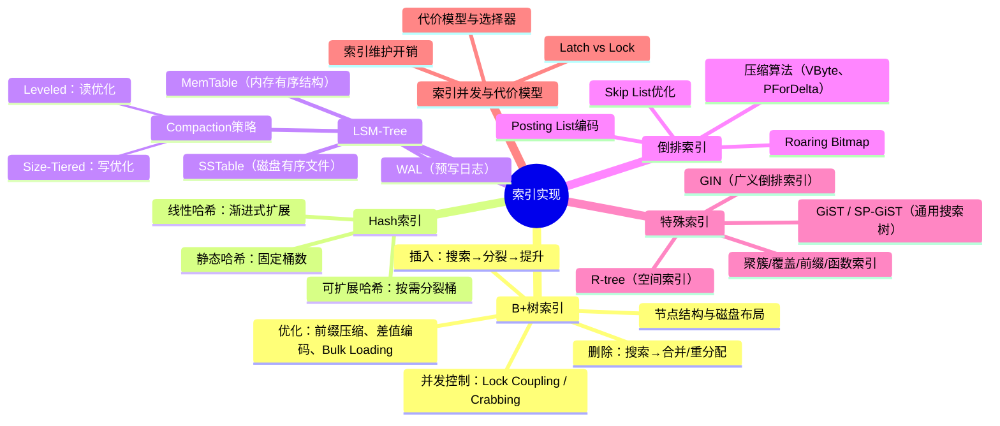
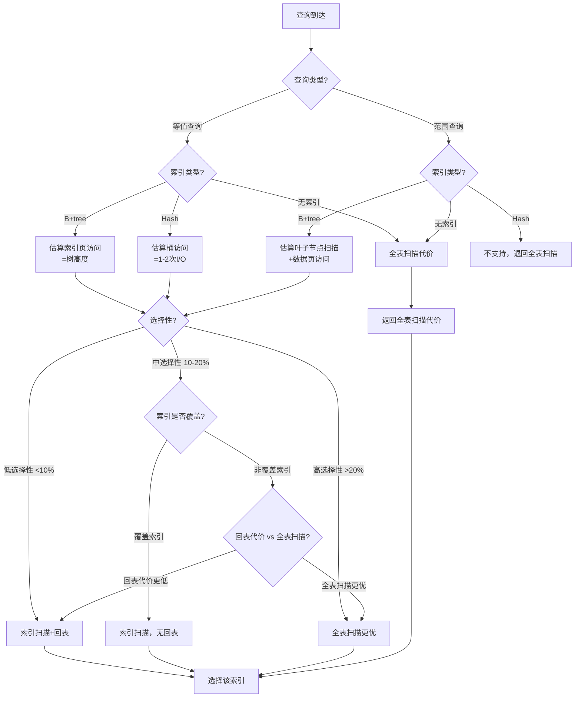

# 第14章 索引实现

索引是数据库系统中最重要的性能优化手段之一。一个设计良好的索引可以将查询时间从全表扫描的O(n)降低到O(log n)甚至O(1)，但索引的实现远比表面上看起来复杂得多。本章将深入索引的内部实现机制，从数据结构设计到磁盘布局，从并发控制到代价模型，全方位剖析现代数据库系统中的索引技术。

## 本章定位

在第10章"索引结构"中，我们已经介绍了各种索引结构的基本概念和理论性质。本章将聚焦于**实现层面**的细节：一个B+树节点在磁盘上如何编码？LSM-Tree的Compaction策略如何选择？倒排索引的Posting List如何压缩？这些实现细节直接决定了索引在真实工作负载下的性能表现。

索引实现涉及多个层面的知识：数据结构与算法、磁盘I/O优化、并发控制、内存管理等。它是系统编程与数据库理论的交汇点，也是理解数据库内核的关键入口。

## 学习目标

完成本章学习后，读者应能够：

1. **掌握B+树的完整实现**：理解节点结构的磁盘布局、分裂与合并的并发安全算法、Crabbing协议的工作原理，能够从零实现一个功能完整的B+树索引。

2. **理解Hash索引的多种实现**：区分静态哈希、可扩展哈希和线性哈希的适用场景与实现差异，理解哈希索引在等值查询场景下的优势与局限。

3. **掌握LSM-Tree架构**：理解MemTable、SSTable的组织方式，深入比较Size-Tiered Compaction与Leveled Compaction的性能特征，能够根据工作负载特征选择合适的Compaction策略。

4. **理解倒排索引的实现**：掌握Posting List的编码与压缩技术，理解Skip List在倒排索引中的优化作用，了解Roaring Bitmap等现代位图技术。

5. **了解PostgreSQL的通用索引框架**：理解GiST、SP-GiST、GIN等索引接口的设计哲学，理解索引访问方法的可扩展架构。

6. **掌握索引的并发访问控制**：理解Latch与Lock在索引中的不同角色，掌握B+树并发操作的正确性保证机制。

7. **理解索引选择的代价模型**：掌握数据库查询优化器如何评估不同索引的代价，能够进行索引设计的定量分析。

## 知识地图



## 前置知识

- 第10章：索引结构的基本概念
- 第6章：文件系统与磁盘I/O
- 第4章：进程与线程、同步原语
- 第13章：关系型数据库架构

## 参考文献

本章内容参考了以下经典文献：

- Ramakrishnan & Gehrke, *Database Management Systems* (第3版)
- Database Internals (Alex Petrov, O'Reilly 2019)
- Architecture of a Database System (Hellerstein et al., 2007)
- The B-Tree and the R-Tree: A Comparison (Comer, 1979)
- LSM-based Storage Techniques: A Survey (Luo & Carey, 2019)
- Efficient Locking for Concurrent Operations on B-Trees (Lehman & Yao, 1981)
- Generalized Search Trees for Database Systems (Hellerstein et al., 1995)


***

# 第14章 索引实现：理论基础

索引是数据库系统中最核心的组件之一。没有索引，任何查询都必须进行全表扫描——这在数据量达到百万甚至千万级别时是完全不可接受的。索引的本质是一种**空间换时间**的数据结构，它以额外的存储空间和写入开销为代价，将查询的时间复杂度从O(n)降低到O(log n)甚至O(1)。

本章将从实现角度深入剖析各类索引数据结构，重点关注它们在磁盘上的组织方式、并发访问的正确性保证、以及在不同工作负载下的性能特征。

***

## 14.1 B-tree与B+tree数据结构详解

### 14.1.1 B-tree的基本性质

B-tree是由Rudolf Bayer和Edward McCreight在1970年提出的一种自平衡的多路搜索树。它被设计为在磁盘等块设备上高效工作的数据结构。一个m阶B-tree满足以下性质：

1. 每个节点最多有m个子节点
2. 除根节点和叶子节点外，每个节点至少有⌈m/2⌉个子节点
3. 根节点至少有2个子节点（除非它是叶子节点）
4. 所有叶子节点在同一层
5. 一个有k个子节点的非叶子节点包含k-1个键值

B-tree的关键优势在于它的**高扇出（fanout）**。由于每个节点可以包含大量键值，树的高度非常低。例如，一个扇出为500的B-tree存储10亿条记录只需要4层——这意味着任何查询最多只需要4次磁盘I/O。

### 14.1.2 B+tree的改进

B+tree是B-tree最重要的变体，几乎所有现代关系数据库都使用B+tree作为其主要索引结构。B+tree对B-tree做了两个关键改进：

**改进一：数据只存储在叶子节点。** B-tree中每个节点都存储数据，而B+tree将所有数据记录（或指向数据的指针）集中在叶子节点，非叶子节点只存储键值和子节点指针。这一改进带来了两个好处：非叶子节点可以存储更多键值，进一步提高扇出，降低树高；遍历操作只需要扫描叶子节点链表，不需要回溯。

**改进二：叶子节点通过链表串联。** B+tree的叶子节点通过双向链表连接，支持高效的范围查询。当我们找到范围的起始键后，只需要沿着链表顺序扫描即可，不需要在树中反复跳跃。

### 14.1.3 B+tree的节点结构

一个典型的B+tree内部节点（Internal Node）的布局如下：

```text
+--------+--------+--------+--------+--------+--------+
| P0     | K1     | P1     | K2     | P2     | K3  P3 |
+--------+--------+--------+--------+--------+--------+
```

其中Ki是键值，Pi是指向子节点的指针（在磁盘实现中通常是页号）。对于m阶B+tree，内部节点最多包含m-1个键值和m个指针。

叶子节点（Leaf Node）的布局如下：

```text
+--------+--------+--------+--------+--------+--------+
| Header | K1:V1  | K2:V2  | K3:V3  | ...    | NextP  |
+--------+--------+--------+--------+--------+--------+
```

叶子节点存储键值对（Key-Value pairs）以及指向下一个叶子节点的指针。Header通常包含节点类型、键值数量、页号等元数据。

在真实的数据库实现中，节点的大小通常与磁盘页对齐（4KB、8KB或16KB）。以PostgreSQL为例，默认的页大小为8KB，一个典型的B+tree内部节点可以存储数百个键值对，扇出达到数百。

### 14.1.4 B+tree的磁盘布局

在实际的数据库系统中，B+tree的节点对应磁盘上的一个页面（Page）。一个典型的页面布局如下：

```text
+-------------------+
| Page Header       |  包含：页面类型、LSN、空闲空间偏移等
+-------------------+
| Item Pointers     |  槽位数组，指向页面内的记录
+-------------------+
| Free Space        |  空闲空间
+-------------------+
| Tuple Data        |  实际的键值数据（从页面末尾向前增长）
+-------------------+
| Special Space     |  B+tree特定的元数据
+-------------------+
```

这种"中间空闲、两端增长"的设计是PostgreSQL等系统常用的页面布局模式。Item Pointers从页面头部向下增长，Tuple Data从页面尾部向上增长，中间的空闲空间用于容纳新增的记录。

**指针编码**是磁盘布局中的一个重要细节。在B+tree中，非叶子节点的指针实际上是页号（Page Number），需要编码为固定大小的整数。叶子节点中，如果表是聚簇索引，值（Value）可以直接是记录的物理位置（页号+槽位号）；如果是非聚簇索引，值通常指向主键索引中的记录。

**前缀压缩（Prefix Compression）** 是一种重要的空间优化技术。在B+tree的内部节点中，相邻的键值通常有较长的共同前缀（例如URL、域名等字符串键）。前缀压缩只存储与前一个键值的不同部分：

```text
原始键值：  "www.example.com"   "www.example.org"   "www.test.com"
压缩后：    "www.example.com"   "\x03org"           "\x04test.com"
```

前缀压缩可以显著减少节点中键值占用的空间，从而提高扇出。在SQLite的B-tree实现中，前缀压缩被广泛使用。

**差值编码（Delta Encoding）** 是另一种空间优化技术，特别适用于数值型键值。它存储与前一个键值的差值而不是完整值：

```text
原始键值：  1000   1005   1012   1020
差值编码：  1000   5      7      8
```

差值编码后的值通常更小，可以用更少的字节存储（例如使用变长整数编码），从而提高节点的扇出。

### 14.1.5 B+tree的搜索操作

B+tree的搜索从根节点开始，在每一层通过比较键值确定要进入的子节点，直到到达叶子节点。伪代码如下：

```text
FUNCTION BPlusTree_Search(root, search_key):
    node = root
    
    // 从根节点向下搜索到叶子节点
    WHILE node.type != LEAF:
        // 在当前节点的键值中进行二分查找
        i = BinarySearch(node.keys, search_key)
        node = ReadPage(node.children[i])
    
    // 在叶子节点中查找目标键值
    i = BinarySearch(node.keys, search_key)
    IF i < node.num_keys AND node.keys[i] == search_key:
        RETURN node.values[i]
    ELSE:
        RETURN NOT_FOUND
```

搜索操作的时间复杂度为O(log_m N)，其中m是扇出，N是记录总数。对于典型的数据库配置（m=500, N=10^9），搜索只需要4次页面访问。

### 14.1.6 B+tree的插入操作

插入操作首先搜索到合适的叶子节点，然后插入键值对。如果叶子节点已满，需要进行分裂：

```text
FUNCTION BPlusTree_Insert(root, key, value):
    // 1. 搜索到目标叶子节点
    path = SearchWithPath(root, key)
    leaf = path.leaf
    
    // 2. 在叶子节点中插入
    InsertIntoLeaf(leaf, key, value)
    
    // 3. 如果叶子节点未满，操作完成
    IF leaf.num_keys <= MAX_KEYS:
        RETURN
    
    // 4. 叶子节点已满，需要分裂
    new_leaf = AllocatePage()
    mid = leaf.num_keys / 2
    
    // 将后半部分复制到新节点
    CopyKeys(leaf, mid, leaf.num_keys, new_leaf)
    leaf.num_keys = mid
    new_leaf.next = leaf.next
    leaf.next = new_leaf.page_id
    
    // 5. 将新节点的最小键值提升到父节点
    push_up_key = new_leaf.keys[0]
    InsertIntoParent(path, leaf, push_up_key, new_leaf)
```

分裂操作可能递归传播到根节点。如果根节点也需要分裂，树的高度会增加1：

```text
FUNCTION InsertIntoParent(path, left_child, key, right_child):
    IF path.parent == NULL:
        // 根节点分裂，创建新根
        new_root = AllocatePage()
        new_root.keys[0] = key
        new_root.children[0] = left_child.page_id
        new_root.children[1] = right_child.page_id
        new_root.num_keys = 1
        UpdateRoot(new_root)
        RETURN
    
    parent = path.parent
    InsertIntoNode(parent, key, right_child.page_id)
    
    IF parent.num_keys <= MAX_KEYS:
        RETURN
    
    // 父节点也需要分裂，递归处理
    new_internal = AllocatePage()
    mid = parent.num_keys / 2
    push_up_key = parent.keys[mid]
    CopyKeys(parent, mid+1, parent.num_keys, new_internal)
    parent.num_keys = mid
    new_internal.children[0] = parent.children[mid+1]
    InsertIntoParent(path.parent_path, parent, push_up_key, new_internal)
```

插入操作的均摊时间复杂度为O(log_m N)。虽然最坏情况下可能需要从叶子分裂到根，但每次分裂将一个节点变为两个，下次分裂至少需要插入MAX_KEYS/2个键值，因此分裂操作的均摊代价为O(1)。

### 14.1.7 B+tree的删除操作

删除操作比插入更复杂，因为它需要处理节点下溢（underflow）的情况。当一个节点的键值数量低于最小要求（通常是⌈m/2⌉-1）时，需要进行合并或重分配：

```text
FUNCTION BPlusTree_Delete(root, key):
    // 1. 搜索到目标叶子节点
    path = SearchWithPath(root, key)
    leaf = path.leaf
    
    // 2. 从叶子节点中删除
    DeleteFromLeaf(leaf, key)
    
    // 3. 如果叶子节点键值数量仍然足够，操作完成
    IF leaf.num_keys >= MIN_KEYS:
        // 如果删除的是第一个键值，可能需要更新父节点的分隔键
        UpdateSeparatorIfNecessary(path)
        RETURN
    
    // 4. 叶子节点下溢，尝试从兄弟节点借键值
    sibling = GetLeftSibling(path) OR GetRightSibling(path)
    IF sibling.num_keys > MIN_KEYS:
        // 重分配：从兄弟借一个键值
        RedistributeKeys(leaf, sibling)
        UpdateSeparatorIfNecessary(path)
        RETURN
    
    // 5. 兄弟节点也没有多余的键值，合并
    MergeNodes(leaf, sibling)
    DeleteFromParent(path)
```

合并操作可能递归传播，最坏情况下可能使树的高度减少1。在实际实现中，为了简化，有些系统（如PostgreSQL）采用了"lazy deletion"策略，不立即合并节点，而是在后续的VACUUM操作中统一处理。

### 14.1.8 B+tree的Bulk Loading

当需要为一个已存在的表创建索引时，逐条插入的效率很低（每条记录O(log N)次I/O）。Bulk Loading是一种高效的批量构建索引的方法：

```text
FUNCTION BPlusTree_BulkLoad(sorted_records):
    // 1. 排序（如果输入未排序）
    sorted_records = ExternalSort(records)
    
    // 2. 从最右叶子节点开始，逐页填充
    current_leaf = AllocatePage()
    root = NULL
    
    FOR EACH record IN sorted_records:
        IF current_leaf.is_full():
            // 将当前叶子节点写入磁盘
            WritePage(current_leaf)
            // 创建新的叶子节点
            new_leaf = AllocatePage()
            current_leaf.next = new_leaf.page_id
            current_leaf = new_leaf
        
        InsertIntoLeaf(current_leaf, record.key, record.value)
    
    // 3. 自底向上构建内部节点
    BuildInternalNodesBottomUp(leaves)
```

Bulk Loading的关键优势在于：它按顺序填充节点，每个节点只写入一次，总I/O次数为O(N/B)（B是每页存储的记录数），远优于逐条插入的O(N log_m N)。PostgreSQL的CREATE INDEX命令默认使用排序后Bulk Loading的方式构建B+tree索引。

***

## 14.2 Hash索引

Hash索引基于哈希表实现，提供O(1)的等值查询性能。它适用于精确匹配查询（WHERE key = value），但不支持范围查询和排序。

### 14.2.1 静态哈希

静态哈希是最简单的哈希索引实现。它使用一个固定大小的哈希表，通过哈希函数将键映射到桶（Bucket）：

```text
FUNCTION StaticHash_Lookup(table, key):
    bucket_id = Hash(key) % table.num_buckets
    bucket = ReadPage(table.buckets[bucket_id])
    
    FOR EACH entry IN bucket.entries:
        IF entry.key == key:
            RETURN entry.value
    
    RETURN NOT_FOUND
```

静态哈希的主要问题是**桶的数量固定**。当数据量增长时，桶中的冲突链会变长，查询性能下降。为了解决这个问题，发展出了动态哈希方案。

### 14.2.2 可扩展哈希（Extendible Hashing）

可扩展哈希由Fagin等人在1979年提出。它的核心思想是使用一个**目录（Directory）**来间接映射到桶，目录大小可以按需翻倍：

```text
全局深度（Global Depth）= 2
目录大小 = 2^2 = 4

目录：
  [00] -> Bucket A (本地深度=1)
  [01] -> Bucket B (本地深度=2)
  [10] -> Bucket A (本地深度=1)
  [11] -> Bucket C (本地深度=2)
```

当一个桶溢出时：
- 如果桶的本地深度 < 全局深度，只需要分裂这个桶，更新目录中的指针
- 如果桶的本地深度 == 全局深度，需要先将目录大小翻倍（全局深度+1），然后分裂桶

```text
FUNCTION ExtendibleHash_Insert(table, key, value):
    bucket_id = Hash(key) &amp; ((1 << table.global_depth) - 1)
    bucket = table.directory[bucket_id]
    
    IF bucket.has_space():
        bucket.insert(key, value)
        RETURN
    
    // 桶溢出，需要分裂
    IF bucket.local_depth == table.global_depth:
        // 目录翻倍
        DoubleDirectory(table)
        table.global_depth++
    
    // 分裂桶
    new_bucket = AllocateBucket()
    new_bucket.local_depth = bucket.local_depth + 1
    bucket.local_depth++
    
    // 重新分配原桶中的记录
    RehashBucket(bucket, new_bucket)
    
    // 更新目录指针
    UpdateDirectoryPointers(table, bucket, new_bucket)
```

可扩展哈希的优势是空间效率高——只有溢出的桶才需要分裂，目录的额外开销相对较小。

### 14.2.3 线性哈希（Linear Hashing）

线性哈希由Litwin在1980年提出。与可扩展哈希不同，线性哈希不需要目录，而是按顺序逐步分裂桶：

```text
初始状态：4个桶，分裂指针指向Bucket 0
Bucket 0: [A, E, I]  <- 分裂指针
Bucket 1: [B, F]
Bucket 2: [C, G]
Bucket 3: [D, H]

Level 1分裂后：8个桶，分裂指针指向Bucket 1
Bucket 0: [A, I]    (哈希函数 h1)
Bucket 1: [E]       (新分裂出来的)
Bucket 2: [B, F]    <- 分裂指针
Bucket 3: [C, G]
Bucket 4: [D, H]
```

线性哈希的分裂触发条件可以是：
- 桶的平均溢出记录数超过阈值
- 某个桶溢出时

```text
FUNCTION LinearHash_Insert(table, key, value):
    // 使用当前哈希函数确定桶
    n = table.current_num_buckets
    bucket_id = Hash(key) % n
    
    IF bucket_id < table.split_pointer:
        // 这个桶已经可以用更细的哈希函数
        bucket_id = Hash(key) % (2 * n)
    
    bucket = table.buckets[bucket_id]
    bucket.insert(key, value)
    
    IF bucket.overflow_count > THRESHOLD:
        // 触发分裂
        SplitNextBucket(table)
```

线性哈希的优势是不需要目录结构，分裂操作分散在多次插入中进行，避免了突发的性能下降。

***

## 14.3 LSM-Tree架构

LSM-Tree（Log-Structured Merge-Tree）是由Patrick O'Neil等人在1996年提出的一种写优化的索引结构。它的核心思想是将随机写转换为顺序写，从而在写密集型工作负载下获得极高的吞吐量。

### 14.3.1 LSM-Tree的基本架构

LSM-Tree由三个主要组件构成：

```text
写入路径：
  写请求 → MemTable (内存) → WAL (磁盘)
  
Compaction路径：
  MemTable满 → Flush到Level 0 SSTable
  Level i SSTable满 → Compaction合并到Level i+1

读取路径：
  读请求 → MemTable → Level 0 SSTable → Level 1 SSTable → ... → Level N SSTable
```



```mermaid
flowchart TD
    A[写请求] --> B[MemTable
内存有序结构]
    A --> C[WAL
预写日志]
    B -->|MemTable满| D[Flush到Level 0 SSTable]
    D -->|Leveled| E[Level 1 SSTable
键范围不重叠]
    D -->|Size-Tiered| E2[Level 1 SSTable
可重叠]
    E -->|Compaction| F[Level 2 SSTable
更细粒度]
    E2 -->|Compaction| F
    
    G[读请求] --> H{查找MemTable}
    H -->|命中| I[返回结果]
    H -->|未命中| J{Bloom Filter
快速判断}
    J -->|可能存在| K[查找Level 0]
    J -->|不存在| L[跳过SSTable]
    K -->|找到| I
    K -->|未找到| M[查找Level 1]
    M -->|找到| I
    M -->|未找到| N[继续向下查找...]
```

**MemTable** 是内存中的有序数据结构，通常使用跳表（Skip List）或红黑树实现。所有写入操作首先写入MemTable。当MemTable达到一定大小后，会被冻结（immutable MemTable），然后Flush到磁盘形成SSTable。

**WAL（Write-Ahead Log）** 是MemTable的持久化保障。每次写入MemTable之前，必须先将操作记录写入WAL，确保系统崩溃后可以恢复MemTable中的数据。

**SSTable（Sorted String Table）** 是磁盘上的有序文件。SSTable内部按键排序存储键值对，并附带一个索引块（Index Block）用于快速定位键的位置。一个典型的SSTable文件结构如下：

```text
+-------------------+
| Data Block 1      |  键值对，按键排序
+-------------------+
| Data Block 2      |
+-------------------+
| ...               |
+-------------------+
| Data Block N      |
+-------------------+
| Index Block       |  每个Data Block的最大键和偏移量
+-------------------+
| Filter Block      |  Bloom Filter
+-------------------+
| Footer            |  Index Block和Filter Block的位置
+-------------------+
```

### 14.3.2 SSTable的内部结构

SSTable的Data Block通常采用类似B-tree叶子节点的格式，但更紧凑。一个Data Block的结构如下：

```text
+-------------------+
| Entry 1           |  key_len | key | value_len | value
+-------------------+
| Entry 2           |
+-------------------+
| ...               |
+-------------------+
| Entry N           |
+-------------------+
| Restart Points    |  前缀压缩的重启点数组
+-------------------+
| Num Restarts      |
+-------------------+
```

为了节省空间，相邻的键采用前缀压缩存储。每隔一定数量的条目设置一个"重启点"（Restart Point），从该点开始不使用前缀压缩，以便支持二分查找。

**Bloom Filter** 是SSTable中的重要辅助结构。它是一个概率型数据结构，可以快速判断一个键是否**不存在**于SSTable中。在读取路径中，Bloom Filter可以避免不必要的磁盘I/O：

```text
FUNCTION LSM_Get(key):
    // 1. 查找MemTable
    result = memtable.Get(key)
    IF result != NOT_FOUND:
        RETURN result
    
    // 2. 从最新的SSTable到最旧的SSTable依次查找
    FOR EACH sstable IN sstables[newest..oldest]:
        // Bloom Filter快速判断
        IF NOT sstable.bloom_filter.MightContain(key):
            CONTINUE  // 跳过这个SSTable
        
        result = sstable.Get(key)
        IF result != NOT_FOUND:
            RETURN result
    
    RETURN NOT_FOUND
```

### 14.3.3 Compaction策略

Compaction是LSM-Tree中最关键的操作，它负责将多个SSTable合并为更大的SSTable，同时清理已删除或已覆盖的记录。Compaction策略的选择直接影响LSM-Tree的读写性能和空间放大。

**Size-Tiered Compaction（STCS）**

Size-Tiered Compaction是最直观的Compaction策略。当同一层级的SSTable数量达到阈值时，将它们合并为一个更大的SSTable，放入下一层级：

```text
Level 0: [SST-1: 10MB] [SST-2: 12MB] [SST-3: 8MB] [SST-4: 11MB]
         → 触发Compaction（4个SSTable）

Level 1: [SST-5: 40MB] [SST-6: 45MB] [SST-7: 38MB] [SST-8: 42MB]
         → 继续向下Compaction

Level 2: [SST-9: 160MB] [SST-10: 170MB] [SST-11: 155MB]
```

Size-Tiered Compaction的伪代码：

```text
FUNCTION SizeTieredCompaction(level_sstables):
    // 按大小分组
    groups = GroupBySize(level_sstables)
    
    FOR EACH group IN groups:
        IF group.num_sstables >= COMPACTION_THRESHOLD:
            // 合并这个组中的所有SSTable
            merged = MergeSSTables(group.sstables)
            
            // 写入下一层级
            next_level.Add(merged)
            
            // 删除旧的SSTable
            DeleteSSTables(group.sstables)

FUNCTION MergeSSTables(sstables):
    // 使用多路归并排序
    iterators = [SSTableIterator(sst) FOR sst IN sstables]
    merged_sst = new SSTable()
    
    WHILE NOT AllExhausted(iterators):
        // 找到当前最小的键
        min_key = MinKey(iterators)
        min_value = GetLatestValue(iterators, min_key)
        
        // 跳过已删除的记录（如果最新操作是DELETE）
        IF min_value != TOMBSTONE:
            merged_sst.Put(min_key, min_value)
        
        AdvanceIterators(iterators, min_key)
    
    RETURN merged_sst
```

STCS的优势是写放大低（通常3-10倍），适合写密集型工作负载。但它的缺点是空间放大高（可能需要2倍的临时空间进行Compaction），读放大也较高（因为同一层级可能有多个SSTable的键范围重叠）。

**Leveled Compaction（LCS）**

Leveled Compaction由Google的LevelDB引入并推广。它的核心约束是：**每一层的SSTable之间键范围不重叠**（Level 0除外）。这使得每一层只需要查找一个SSTable即可确认一个键是否存在：

```text
Level 0: [a-d] [c-f] [e-h]  // 允许重叠
Level 1: [a-b] [c-d] [e-f] [g-h]  // 不重叠
Level 2: [a] [b] [c] [d] [e] [f] [g] [h]  // 不重叠，更细粒度
```

Leveled Compaction的过程：

```text
FUNCTION LeveledCompaction(level_i, sstable):
    // 1. 在level_i+1中找到与sstable键范围重叠的所有SSTable
    overlapping = FindOverlapping(level_i+1, sstable.key_range)
    
    // 2. 合并sstable和overlapping中的所有SSTable
    merged = MergeSSTables([sstable] + overlapping)
    
    // 3. 将合并结果拆分为多个大小适当的SSTable
    new_sstables = SplitIntoSSTables(merged, TARGET_SSTABLE_SIZE)
    
    // 4. 替换level_i+1中的旧SSTable
    level_i+1.Remove(overlapping)
    level_i+1.Add(new_sstables)
```

Leveled Compaction的优势是读放大低（每层最多查找一个SSTable），空间放大低（通常只有10-20%的额外空间）。但它的写放大较高（通常10-30倍），因为每次Compaction可能需要重写整个层级。

### 14.3.4 Compaction策略的比较

| 指标 | Size-Tiered | Leveled |
|------|-------------|---------|
| 写放大 | 低（3-10x） | 高（10-30x） |
| 读放大 | 高 | 低 |
| 空间放大 | 高（~2x） | 低（~1.1x） |
| 适用场景 | 写密集型 | 读密集型 |

RocksDB引入了Universal Compaction作为折中方案，它结合了两者的优点：在写入阶段使用Size-Tiered风格，在最底层使用Leveled风格的约束。

### 14.3.5 LSM-Tree的删除操作

LSM-Tree中的删除操作并不立即删除数据，而是写入一个**墓碑（Tombstone）**标记。实际的删除在Compaction过程中完成：

```text
FUNCTION LSM_Delete(key):
    // 写入墓碑标记
    memtable.Put(key, TOMBSTONE)
    wal.Append(DELETE, key)
```

墓碑标记在Compaction过程中与被删除的记录相遇时，两者都会被丢弃。如果一个键在所有层级中都已不存在（通过Bloom Filter判断），墓碑标记也可以在Compaction中被清理。

***

## 14.4 倒排索引

倒排索引（Inverted Index）是全文搜索的核心数据结构。它将文档集合中的每个词项（Term）映射到包含该词项的文档列表。

### 14.4.1 倒排索引的结构

一个倒排索引由两部分组成：

- **词典（Dictionary）**：所有唯一词项的有序集合，通常使用B-tree、哈希表或Trie树实现
- **倒排列表（Posting List）**：每个词项对应的文档ID列表

```text
词典                    倒排列表
"database"    →    [1, 3, 5, 7, 12, 45, 67]
"index"       →    [2, 3, 8, 12, 34]
"transaction" →    [1, 5, 7, 12, 45, 89]
```

更完整的倒排列表还包含以下信息：
- **词频（Term Frequency）**：词项在文档中出现的次数
- **位置信息（Position）**：词项在文档中的位置（用于短语查询）
- **偏移量（Offset）**：词项在原文中的字节偏移（用于高亮显示）

```text
"database" → [
    (doc_id=1, tf=3, positions=[10, 45, 120]),
    (doc_id=3, tf=1, positions=[7]),
    (doc_id=5, tf=2, positions=[23, 67]),
    ...
]
```

### 14.4.2 Posting List的压缩

Posting List可能非常长（常见词可能出现在数百万文档中），因此压缩至关重要。以下是几种常用的压缩编码：

**VByte（Variable Byte）编码**：使用变长字节表示整数。每个字节的最高位作为继续标志：

```text
值 130 (二进制: 10000010)
编码: [1|0000001] [0|0000010]
      ↑继续      ↑结束
```

**Delta编码 + VByte**：先计算相邻文档ID的差值，再用VByte编码：

```text
原始:  [3, 7, 15, 22, 30]
差值:  [3, 4, 8, 7, 8]      ← 差值更小，VByte编码更短
```

**PForDelta编码**：假设大部分差值可以用b位表示，少量异常值单独处理。这种编码在SIMD指令下可以高效解码。

### 14.4.3 Skip List优化

在倒排索引的查询中，经常需要计算两个Posting List的交集。朴素的方法是线性扫描两个列表，时间复杂度为O(m+n)。Skip List通过在Posting List中添加"跳跃指针"来加速查找：

```text
原始Posting List: 3 → 7 → 15 → 22 → 30 → 45 → 67 → 89

带Skip List的Posting List:
Level 1:  3 --------→ 15 --------→ 30 --------→ 67
Level 0:  3 → 7 → 15 → 22 → 30 → 45 → 67 → 89
```

当需要在Posting List中查找大于等于某个值的位置时，可以使用Skip指针跳过大量不匹配的记录。

### 14.4.4 Roaring Bitmap

Roaring Bitmap是近年来广泛应用的位图压缩技术。它将32位整数空间划分为2^16个桶（每个桶覆盖65536个值），每个桶根据密度选择不同的存储方式：

- **稀疏桶**（< 4096个值）：使用有序的16位整数数组
- **稠密桶**（≥ 4096个值）：使用8192字节的位图

```text
Roaring Bitmap:
  桶 0 (值 0-65535):     [16位数组: 3, 15, 30, 45]        (稀疏)
  桶 1 (值 65536-131071): [位图: 0b101001...]              (稠密)
  桶 2 (值 131072-196607): [16位数组: 67000, 67001, 67002] (稀疏)
```

Roaring Bitmap的交集操作可以利用SIMD指令高效实现，在大数据量下比传统位图和压缩位图都有显著优势。

***

## 14.5 PostgreSQL的通用索引框架

PostgreSQL提供了一个高度可扩展的索引访问方法（Index Access Method）框架，允许用户通过GiST、SP-GiST、GIN等接口实现自定义的索引策略。

### 14.5.1 GiST（Generalized Search Tree）

GiST是一种通用的搜索树框架，由Hellerstein等人在1995年提出。它将B-tree、R-tree、RD-tree等多种索引结构统一在一个框架下。GiST的关键抽象是**谓词（Predicate）**和**一致性函数（Consistency Function）**：

```text
GiST的一致性函数接口：
  Consistent(entry, query) → Boolean
  
  对于B-tree:  Consistent(key=5, query=3..7) → true (3 ≤ 5 ≤ 7)
  对于R-tree:  Consistent(bbox=[1,2,3,4], query=[2,3,4,5) → true (矩形相交)
  对于文本搜索: Consistent(prefix="pre", query="prefix") → true ("prefix"以"pre"开头)
```

GiST还定义了以下核心操作：

- **Penalty(entry, new_entry)**：计算将new_entry插入到entry子树的代价
- **PickSplit(entries)**：当节点满时，决定如何将entries分成两组
- **Union(entries)**：计算一组entries的最小公共谓词（用于内部节点）
- **Compress/Decompress**：键值的压缩和解压缩

### 14.5.2 SP-GiST（Space-Partitioned GiST）

SP-GiST是GiST的变体，适用于空间分区的索引结构，如四叉树（Quadtree）、KD树、基数树（Radix Tree）等。SP-GiST的关键区别是它使用**空间分区**而非**数据分区**：

```text
GiST（数据分区）：每个子节点覆盖数据的一个子集，子节点间可能重叠
  根: [A-E]  →  子节点: [A-C] [B-D] [D-F]  (可能重叠)

SP-GiST（空间分区）：将搜索空间划分为不重叠的区域
  根: 空间 →  子节点: [北] [南] [东] [西]  (不重叠)
```

### 14.5.3 GIN（Generalized Inverted Index）

GIN是专门为倒排索引设计的索引访问方法。它适用于包含多个值的数据类型，如数组、全文搜索的tsvector、JSONB等：

```text
GIN索引的结构：
  词典（B-tree）           Posting Tree/Posting List
  "database"      →       (doc1, doc3, doc5, doc7, ...)
  "index"         →       (doc2, doc3, doc8, ...)
  "transaction"   →       (doc1, doc5, doc7, ...)
```

GIN的查询接口定义了以下操作：

- **extractQuery(query)**：从查询中提取所有需要查找的词项
- **consistent(query, check)**：根据匹配的词项判断是否满足查询条件

***

## 14.6 R-tree空间索引

R-tree是由Antonin Guttman在1984年提出的空间索引结构，用于高效查询多维空间数据（如地理坐标、矩形区域等）。

### 14.6.1 R-tree的基本结构

R-tree是B-tree在多维空间的推广。每个节点存储一个**最小边界矩形（Minimum Bounding Rectangle, MBR）**，而不是单个键值：

```text
R-tree结构：
Root: MBR[0,0 - 100,100]
├── Node1: MBR[0,0 - 50,50]
│   ├── Entry1: MBR[5,5 - 15,15]  → 数据记录
│   ├── Entry2: MBR[20,20 - 30,30] → 数据记录
│   └── Entry3: MBR[40,40 - 45,45] → 数据记录
└── Node2: MBR[60,60 - 100,100]
    ├── Entry4: MBR[65,65 - 75,75] → 数据记录
    └── Entry5: MBR[90,90 - 100,100] → 数据记录
```

### 14.6.2 R-tree的分裂策略

当一个节点满时，需要将其分裂为两个节点。分裂策略的选择对R-tree的性能有重要影响：

**Guttman的分裂算法**：选择两个种子点（距离最远的两个条目），然后将剩余条目分配到较近的种子点所在的组。

**R\*-tree的优化**：R\*-tree是R-tree最重要的变体，它引入了以下优化：

1. **强制重插入（Forced Reinsert）**：当节点溢出时，不是立即分裂，而是选择一定比例的条目从节点中移除，然后重新插入到树中。这通常能产生更好的节点划分。

2. **面积最小化分裂**：选择使得两个新节点MBR面积之和最小的分裂方案。

3. **重叠最小化**：在选择分裂方案时，优先选择使得两个新节点MBR重叠面积最小的方案。

```text
FUNCTION RStarTree_Insert(node, entry):
    // 1. 选择插入路径（选择面积增量最小的子节点）
    target = ChooseSubtree(node, entry)
    
    // 2. 递归插入
    IF target.is_leaf:
        target.Add(entry)
    ELSE:
        RStarTree_Insert(target, entry)
    
    // 3. 处理溢出
    IF target.overflow:
        IF target.level != leaf_level:
            // 非叶子节点溢出，直接分裂
            SplitNode(target)
        ELSE:
            // 叶子节点溢出，尝试强制重插入
            IF NOT target.has_been_reinserted:
                entries_to_reinsert = SelectEntriesForReinsert(target)
                RemoveEntries(target, entries_to_reinsert)
                target.has_been_reinserted = true
                FOR EACH e IN entries_to_reinsert:
                    RStarTree_Insert(root, e)
            ELSE:
                SplitNode(target)
```

***

## 14.7 聚簇索引与非聚簇索引

### 14.7.1 聚簇索引

聚簇索引（Clustered Index）决定了表中数据行的物理存储顺序。在聚簇索引中，叶子节点直接包含完整的数据行，而不是指向数据的指针：

```text
聚簇索引的叶子节点：
+--------+--------+--------+--------+
| K1:Row1| K2:Row2| K3:Row3| K4:Row4|
+--------+--------+--------+--------+

数据行直接存储在叶子节点中，按键排序
```

由于每张表只能有一种物理存储顺序，因此**一张表只能有一个聚簇索引**。在MySQL InnoDB中，表本身就是按主键组织的B+tree，主键即为聚簇索引。在PostgreSQL中，CLUSTER命令可以将表按某个索引重新组织，但这是一次性操作，后续的插入和更新不会维护聚簇顺序。

### 14.7.2 非聚簇索引

非聚簇索引（Non-clustered Index / Secondary Index）的叶子节点存储的是指向数据行的指针。在不同的数据库中，这个指针有不同的含义：

- **InnoDB**：非聚簇索引的叶子节点存储的是主键值（因为数据按主键组织）
- **PostgreSQL**：非聚簇索引的叶子节点存储的是(页号, 槽位号)对，即数据行的物理位置

```text
非聚簇索引的查找路径：
  1. 在非聚簇索引中找到键值 → 获得主键值或物理指针
  2. 通过主键值在聚簇索引中查找（InnoDB的"回表"）
  3. 读取完整的数据行
```

### 14.7.3 覆盖索引

覆盖索引（Covering Index）是指索引中包含了查询所需的所有列，不需要回表访问数据行。覆盖索引可以显著减少I/O操作：

```sql
-- 假设有索引 INDEX idx_name_age (name, age)
-- 以下查询可以使用覆盖索引：
SELECT name, age FROM users WHERE name LIKE 'A%';

-- 查询计划只需要扫描索引，不需要回表
```

在PostgreSQL中，覆盖索引通过INCLUDE子句实现：

```sql
CREATE INDEX idx_name ON users (name) INCLUDE (age, email);
```

INCLUDE列不参与索引的排序和查找，只是附加存储在叶子节点中，使得"SELECT name, age, email FROM users WHERE name = ?"可以完全从索引中获取数据。

### 14.7.4 前缀索引

前缀索引只索引字符串列的前N个字符，适用于长字符串列：

```sql
CREATE INDEX idx_url_prefix ON urls (url(20));
```

前缀索引的优势是节省空间，但有以下限制：
- 不能用于ORDER BY
- 不能用于覆盖索引
- 选择性可能降低（不同字符串的前缀可能相同）

### 14.7.5 函数索引

函数索引（Functional Index / Expression Index）是对列的函数表达式建立索引：

```sql
CREATE INDEX idx_lower_email ON users (LOWER(email));

-- 可以加速以下查询：
SELECT * FROM users WHERE LOWER(email) = 'test@example.com';
```

***

## 14.8 索引的并发访问控制

### 14.8.1 Latch与Lock

在数据库系统中，**Latch**和**Lock**是两种不同的同步机制：

| 特性 | Latch | Lock |
|------|-------|------|
| 保护对象 | 内存中的数据结构（如B+tree节点） | 数据库中的逻辑数据（如行、表） |
| 持有时间 | 极短（微秒级） | 较长（事务级别） |
| 死锁检测 | 通常不检测，通过编程约定避免 | 完整的死锁检测机制 |
| 实现 | 互斥锁、自旋锁、读写锁 | 锁管理器，锁表 |
| 可见性 | 不可见，内部实现细节 | 可通过系统视图查看 |

在B+tree的并发操作中：
- **Latch**保护单个节点的内存结构，在访问节点时获取，离开节点时释放
- **Lock**保护逻辑记录，在事务级别持有，直到事务提交或回滚

### 14.8.2 Lock Coupling（Crabbing）算法

B+tree的并发访问需要解决一个关键问题：在从根节点向叶子节点搜索的过程中，如果释放了父节点的Latch，另一个线程可能正在分裂或合并父节点，导致搜索路径失效。

**Basic Crabbing**的解决方案是在向下搜索时，对每一层的节点获取Latch后才释放父节点的Latch：

```text
FUNCTION BPlusTree_ConcurrentSearch(root, key):
    // 获取根节点的读Latch
    Latch(root, READ)
    
    node = root
    WHILE node.type != LEAF:
        child = FindChild(node, key)
        
        // 获取子节点的读Latch
        Latch(child, READ)
        
        // 释放父节点的Latch
        Unlatch(node)
        
        node = child
    
    // 在叶子节点中查找
    result = SearchLeaf(node, key)
    Unlatch(node)
    RETURN result
```

**Optimistic Crabbing**的优化：在大多数情况下，B+tree的结构不会改变（分裂和合并是罕见操作）。因此，可以先乐观地不加Latch向下搜索，如果发现节点无效（被分裂或合并了），再回退到悲观的Crabbing方式：

```text
FUNCTION BPlusTree_OptimisticSearch(root, key):
    // 不加Latch，直接从根向下读
    node = root
    WHILE node.type != LEAF:
        child = FindChild(node, key)
        node = child
    
    // 验证叶子节点是否有效
    Latch(node, READ)
    IF node.is_valid():
        result = SearchLeaf(node, key)
        Unlatch(node)
        RETURN result
    ELSE:
        // 叶子节点已失效，使用悲观方式重新搜索
        Unlatch(node)
        RETURN BPlusTree_PessimisticSearch(root, key)
```

**Lehman & Yao的无Latch遍历**：Lehman和Yao在1981年提出了一种更高效的并发B+tree算法。它的核心思想是利用B+tree叶子节点链表的特性：搜索操作总是先到达正确的叶子节点，然后通过验证叶子节点的高键（High Key）来判断是否需要回退：

```text
FUNCTION LehmanYao_Search(root, key):
    node = root
    WHILE node.type != LEAF:
        child = FindChild(node, key)
        node = child  // 不需要Latch
    
    // 在叶子节点中查找
    IF key <= node.high_key AND key >= node.keys[0]:
        // 节点有效，在其中搜索
        RETURN SearchLeaf(node, key)
    ELSE:
        // 节点可能已分裂，需要跟随链表
        WHILE node != NULL AND key > node.high_key:
            node = node.next
        RETURN SearchLeaf(node, key)
```

***

## 14.9 索引的代价模型

数据库查询优化器需要在多个可能的索引访问路径中选择最优的一个。代价模型是这个选择过程的基础。




### 14.9.1 代价的组成部分

索引访问的总代价通常包括：

```text
TotalCost = IOCost + CPUCost

IOCost = IndexPageReads + DataPageReads
CPUCost = IndexComparisons + TupleProcessing
```

对于B+tree索引的等值查询：
- **IndexPageReads** = 树的高度（通常3-4层）
- **DataPageReads** = 匹配记录数 / 每页记录数（非聚簇索引需要回表）

对于范围查询：
- **IndexPageReads** = 树的高度 + 范围内的叶子节点数
- **DataPageReads** = 范围内的记录数 / 每页记录数

### 14.9.2 选择性与基数

**选择性（Selectivity）**是满足查询条件的记录数占总记录数的比例：

```text
Selectivity = NumberOfMatchingRows / TotalNumberOfRows
```

**基数（Cardinality）**是列中不同值的数量。高基数列（如主键、身份证号）适合建立索引，低基数列（如性别、状态标志）通常不适合单独建索引。

查询优化器通过统计信息（直方图、Most Common Values等）来估算选择性。选择性的估算准确性直接影响索引选择的质量。

### 14.9.3 索引选择的决策过程

查询优化器在选择索引时，会考虑以下因素：

1. **查询的选择性**：选择性很低（返回大量记录）时，全表扫描可能比索引扫描更快
2. **索引的类型**：B+tree适合范围查询，Hash只适合等值查询
3. **是否需要排序**：如果查询需要ORDER BY，使用索引扫描可以避免排序操作
4. **覆盖索引**：如果索引覆盖了所有需要的列，可以避免回表
5. **数据的物理聚簇性**：聚簇索引的范围查询效率远高于非聚簇索引

```text
FUNCTION EstimateIndexScanCost(index, query):
    // 估算选择性
    selectivity = EstimateSelectivity(query.predicate)
    matching_rows = table.total_rows * selectivity
    
    // 索引页访问代价
    index_cost = index.height + matching_rows / index.entries_per_page
    
    // 数据页访问代价
    IF index.is_clustered:
        data_cost = matching_rows / table.rows_per_page
    ELSE:
        // 非聚簇索引，每条记录可能需要单独的I/O
        data_cost = matching_rows * random_io_cost
    
    // CPU代价
    cpu_cost = matching_rows * cpu_per_tuple
    
    RETURN index_cost + data_cost + cpu_cost
```

当选择性超过一定阈值（通常约10-20%）时，全表扫描的代价可能低于索引扫描，因为全表扫描是顺序I/O，而索引扫描+回表是随机I/O。

***

## 参考文献

1. Bayer, R., & McCreight, E. (1970). Organization and Maintenance of Large Ordered Indexes. Acta Informatica, 1(3), 173-189.
2. Lehman, P. L., & Yao, S. B. (1981). Efficient Locking for Concurrent Operations on B-Trees. ACM Transactions on Database Systems, 6(4), 650-670.
3. O'Neil, P., Cheng, E., Gawlick, D., & O'Neil, E. (1996). The Log-Structured Merge-Tree (LSM-Tree). Acta Informatica, 33(4), 351-385.
4. Fagin, R., Nievergelt, J., Pippenger, N., & Strong, H. R. (1979). Extendible Hashing—A Fast Access Method for Dynamic Files. ACM Transactions on Database Systems, 4(3), 315-344.
5. Litwin, W. (1980). Linear Hashing: A New Tool for File and Table Addressing. VLDB 1980.
6. Guttman, A. (1984). R-Trees: A Dynamic Index Structure for Spatial Searching. SIGMOD 1984.
7. Beckmann, N., Kriegel, H. P., Schneider, R., & Seeger, B. (1990). The R*-tree: An Efficient and Robust Access Method for Points and Rectangles. SIGMOD 1990.
8. Hellerstein, J. M., Naughton, J. F., & Pfeffer, A. (1995). Generalized Search Trees for Database Systems. VLDB 1995.
9. Chambi, S., Lemire, D., Kaser, O., & Godin, R. (2016). Better bitmap performance with Roaring bitmaps. Software: Practice and Experience, 46(5), 709-719.
10. Petrov, A. (2019). Database Internals. O'Reilly Media.


***

# 第14章 索引实现：核心技巧

本章聚焦于索引实现中的关键技术细节和工程技巧。这些技巧来源于真实的数据库系统实现，是将理论转化为高效、可靠的索引系统的关键。

***

## 14.10 B+tree页面分裂的并发安全实现

### 14.10.1 分裂操作的并发挑战

B+tree的页面分裂是一个复杂的多步操作，涉及到：分配新页面、将一半记录移动到新页面、更新父节点的指针、维护叶子节点链表。在并发环境中，如果两个线程同时尝试分裂同一个节点，或者一个线程在分裂过程中另一个线程正在搜索，可能导致数据结构损坏。

核心挑战在于：分裂操作需要原子地修改多个页面，但磁盘I/O不能真正做到原子。数据库系统通过**Latch（内存锁）**和**Write-Ahead Log（WAL）**来保证分裂操作的原子性和并发安全性。

### 14.10.2 PostgreSQL的B+tree分裂实现

PostgreSQL的B+tree实现（nbtree）采用了较为保守的并发控制策略：

**分裂过程**：

```text
FUNCTION pg_btree_split(rel, page, insert_key, insert_value):
    // 1. 对当前页面和父页面加Exclusive Latch
    LockPageExclusive(page)
    LockPageExclusive(parent)
    
    // 2. 分配新页面
    new_page = GetNewBuffer(rel)
    LockPageExclusive(new_page)
    
    // 3. 确定分裂点
    split_point = FindSplitPoint(page, insert_key)
    
    // 4. 将后半部分记录移动到新页面
    MoveRecords(page, new_page, split_point)
    
    // 5. 如果新记录应该插入新页面，在新页面中插入
    IF insert_key >= new_page.first_key:
        InsertIntoPage(new_page, insert_key, insert_value)
    ELSE:
        InsertIntoPage(page, insert_key, insert_value)
    
    // 6. 更新父节点（添加指向新页面的指针）
    InsertParentEntry(parent, page, new_page, new_page.first_key)
    
    // 7. 更新高键（High Key）
    page.high_key = split_point_key
    
    // 8. 记录WAL日志
    XLogInsert(BTREE_SPLIT, ...)
    
    // 9. 释放所有Latch
    UnlockAll()
```

**高键（High Key）的作用**：PostgreSQL的B+tree使用高键来支持Lehman-Yao风格的无Latch搜索。每个页面存储一个高键，表示该页面负责的键范围的上界。当搜索操作到达一个叶子节点时，会检查目标键是否小于等于高键，如果不是，说明该页面已经分裂，需要跟随链表找到正确的页面。

### 14.10.3 分裂操作的WAL记录

分裂操作需要记录以下WAL信息：

```text
BTREE_SPLIT WAL Record:
{
    type: SPLIT,
    old_page_lsn: <old page的LSN>,
    new_page_id: <新分配的页面号>,
    split_point: <分裂点位置>,
    moved_records: <移动的记录数据>,
    parent_insert: <父节点中插入的新指针>,
    is_root_split: <是否是根节点分裂>
}
```

在崩溃恢复过程中，WAL重放可以重新执行分裂操作，保证即使在分裂过程中发生崩溃，索引结构也能恢复到一致状态。

### 14.10.4 并发分裂的Latch顺序

为了避免死锁，PostgreSQL规定了严格的Latch获取顺序：

```text
正确的Latch顺序（从上到下）：
  1. Parent page (Exclusive)
  2. Current page (Exclusive)  
  3. New page (Exclusive)

如果需要同时持有多个Latch，必须按照上述顺序获取。
违反此顺序可能导致死锁。
```

***

## 14.11 LSM-Tree的Compaction调度策略

### 14.11.1 Compaction的触发条件

Compaction的调度是LSM-Tree实现中的核心问题。触发条件通常包括：

1. **Level容量触发**：当某一层的总大小超过阈值时
2. **SSTable数量触发**：当某一层的SSTable数量超过阈值时
3. **读放大触发**：当查询需要检查过多SSTable时
4. **Tombstone密度触发**：当某层的墓碑标记比例过高时

```text
FUNCTION ShouldCompact(level):
    // 容量触发
    IF level.total_size > level.max_size:
        RETURN true
    
    // SSTable数量触发
    IF level.num_sstables > level.max_sstables:
        RETURN true
    
    // Tombstone密度触发
    tombstone_ratio = level.tombstone_count / level.total_entries
    IF tombstone_ratio > TOMBSTONE_THRESHOLD:
        RETURN true
    
    RETURN false
```

### 14.11.2 Compaction的线程模型

在RocksDB中，Compaction运行在独立的后台线程池中，与前台写入线程并行执行。线程数量可以通过`max_background_compactions`参数控制：

```text
RocksDB的Compaction线程模型：
  写入线程:  memtable → flush → Level 0
  Compaction线程1: Level 0 → Level 1
  Compaction线程2: Level 1 → Level 2
  Compaction线程3: Level 2 → Level 3
  ...
```

为了避免Compaction线程占用过多I/O带宽影响前台操作，RocksDB提供了速率限制器（Rate Limiter）来控制Compaction的I/O速率。

### 14.11.3 Compaction的优先级选择

当多个层级同时需要Compaction时，需要选择优先级。常见的策略包括：

- **Round-Robin**：轮流处理各层级
- **大小优先**：优先处理数据量最大的层级
- **写放大最小优先**：优先处理写放大最小的Compaction
- **Score优先**：为每层计算一个分数（如当前大小/目标大小），优先处理分数最高的层级

RocksDB的默认策略是Score优先：

```text
FUNCTION PickCompaction():
    best_score = 0
    best_level = -1
    
    FOR level = 0 TO max_level:
        score = level.current_size / level.target_size
        IF score > best_score:
            best_score = score
            best_level = level
    
    IF best_score >= 1.0:
        RETURN CreateCompaction(best_level)
    ELSE:
        RETURN NULL  // 不需要Compaction
```

### 14.11.4 动态Compaction调整

现代LSM-Tree实现（如RocksDB的Universal Compaction）会根据工作负载特征动态调整Compaction策略：

```text
FUNCTION DynamicCompactionAdjust(stats):
    // 监控写入速率
    write_rate = stats.bytes_written / stats.elapsed_time
    
    // 监控读放大
    read_amp = stats.sstables_checked_per_read
    
    // 监控空间放大
    space_amp = stats.disk_usage / stats.live_data_size
    
    // 动态调整
    IF write_rate > HIGH_WRITE_THRESHOLD:
        // 写密集型：减少Compaction频率
        compaction_threshold *= 1.5
    ELIF read_amp > HIGH_READ_THRESHOLD:
        // 读密集型：增加Compaction频率
        compaction_threshold *= 0.7
    ELIF space_amp > HIGH_SPACE_THRESHOLD:
        // 空间紧张：强制Compaction
        TriggerCompaction()
```

***

## 14.12 前缀压缩与差值编码的实现

### 14.12.1 前缀压缩的实现细节

前缀压缩的核心思想是：对于排序后的键序列，相邻键通常共享较长的前缀。只存储与前一个键的不同部分，可以显著减少存储空间。

```text
前缀压缩编码格式：
+-------------+----------------+----------------+
| prefix_len  | suffix_len     | suffix_bytes   |
| (1-2 bytes) | (1-2 bytes)    | (variable)     |
+-------------+----------------+----------------+

示例：
原始键序列:  ["application", "apply", "approach"]
编码后:
  "application": prefix_len=0, suffix="application"  (第一个键不压缩)
  "apply":       prefix_len=3, suffix="ly"           (共同前缀"app")
  "approach":    prefix_len=3, suffix="roach"        (共同前缀"app")
```

**重启点（Restart Point）** 是前缀压缩中的关键概念。由于前缀压缩使得随机访问变得困难（要解码第N个键，必须先解码前面所有的键），因此每隔K个键设置一个重启点，重启点处存储完整的键值：

```text
键序列:  [k1, k2, k3, k4, k5, k6, k7, k8, k9, k10]
重启间隔=3

存储布局:
  [k1完整][k2压缩][k3压缩] | [k4完整][k5压缩][k6压缩] | [k7完整][k8压缩][k9压缩] | [k10完整]
  ↑ 重启点0                  ↑ 重启点1                  ↑ 重启点2                   ↑ 重启点3

要查找k7：先在重启点中二分查找，找到重启点2，然后从k7开始线性扫描
```

### 14.12.2 差值编码的实现

差值编码（Delta Encoding）适用于数值型键值，存储相邻键值之间的差值：

```text
原始键序列:  [100, 105, 108, 115, 120]
差值序列:    [100, 5, 3, 7, 5]
```

差值编码通常与变长整数编码（如Varint）结合使用。由于差值通常很小，Varint编码可以用1-2个字节存储，而原始值可能需要4-8个字节。

**Varint编码格式**（以Protocol Buffers风格为例）：

```text
值 ≤ 127:    1字节 [0|7位数据]
值 ≤ 16383:  2字节 [1|7位数据] [0|7位数据]
值 ≤ 2097151: 3字节 [1|7位数据] [1|7位数据] [0|7位数据]
```

**ZigZag编码**：对于可能为负数的差值，使用ZigZag编码将有符号整数映射为无符号整数：

```text
ZigZag: 0 → 0, -1 → 1, 1 → 2, -2 → 3, 2 → 4, ...
公式:   zigzag(n) = (n << 1) ^ (n >> 31)  (32位)
```

### 14.12.3 在B+tree中的应用

在B+tree的内部节点中，前缀压缩特别有效，因为内部节点的键是有序的，相邻键通常共享前缀。SQLite的B-tree实现大量使用了前缀压缩：

```text
SQLite的B-tree页面格式：
  [页面头] [单元格指针数组] [空闲空间] [单元格数据（从尾部向前增长）]

SQLite对键值的压缩：
  对于TEXT类型的键，SQLite使用前缀压缩
  对于INTEGER类型的键，SQLite使用Varint编码
```

***

## 14.13 索引选择器的代价模型

### 14.13.1 代价模型的基本框架

数据库查询优化器在选择执行计划时，需要评估每个可能的索引访问路径的代价。代价模型的基本框架如下：

```text
总代价 = I/O代价 + CPU代价

I/O代价 = 顺序I/O次数 × 顺序I/O代价 + 随机I/O次数 × 随机I/O代价
CPU代价 = 处理记录数 × 每条记录的CPU代价
```

在现代硬件上，随机I/O的代价通常是顺序I/O的10-100倍（对于HDD），或者3-10倍（对于SSD）。这个比值直接影响索引选择的决策。

### 14.13.2 B+tree索引的代价估算

**等值查询的代价**：

```text
FUNCTION EstimateBTreeEqCost(index, key_cardinality, table_rows):
    // 索引页访问
    index_pages = index.height  // 通常3-4页
    
    // 匹配的记录数
    matching_rows = table_rows / key_cardinality
    
    IF index.is_clustered:
        // 聚簇索引：匹配的记录在连续页面中
        data_pages = CEILING(matching_rows / index.rows_per_leaf)
    ELSE:
        // 非聚簇索引：每条记录可能在不同页面
        data_pages = matching_rows  // 最坏情况
    
    RETURN index_pages * random_io_cost + data_pages * random_io_cost
```

**范围查询的代价**：

```text
FUNCTION EstimateBTreeRangeCost(index, range_start, range_end, table_rows):
    // 索引页访问
    index_pages = index.height
    
    // 范围内的叶子节点数
    range_selectivity = (range_end - range_start) / (max_key - min_key)
    range_rows = table_rows * range_selectivity
    leaf_pages = CEILING(range_rows / index.rows_per_leaf)
    
    // 数据页访问
    IF index.is_clustered:
        data_pages = CEILING(range_rows / index.rows_per_page)
    ELSE:
        data_pages = range_rows  // 最坏情况
    
    RETURN (index_pages + leaf_pages) * random_io_cost + data_pages * random_io_cost
```

### 14.13.3 LSM-Tree索引的代价估算

LSM-Tree的代价估算需要考虑Compaction带来的影响：

```text
FUNCTION EstimateLSMLookupCost(num_levels, bloom_filter_false_positive):
    cost = 0
    
    // MemTable查找（内存操作）
    cost += memtable_lookup_cost
    
    FOR level = 0 TO num_levels - 1:
        // 每层需要查找的SSTable数量
        IF level == 0:
            // Level 0的SSTable键范围可能重叠
            num_sstables = level0.num_sstables
        ELSE:
            // 其他层每个键只在一个SSTable中
            num_sstables = 1
        
        // 考虑Bloom Filter的False Positive
        expected_io = bloom_filter_false_positive * num_sstables
        cost += expected_io * random_io_cost
    
    RETURN cost
```

### 14.13.4 多列索引的选择

当查询涉及多个列时，查询优化器需要评估不同列顺序的复合索引的效率：

```sql
-- 假设有索引 INDEX idx (a, b, c)
-- 查询 WHERE a = 1 AND b > 5 AND c < 10

-- 评估：
-- a = 1: 精确匹配，可以使用索引的a列进行等值查找
-- b > 5: 范围查询，可以使用索引的b列进行范围扫描
-- c < 10: 由于b是范围查询，c不能使用索引进行高效过滤（需要在b范围内扫描所有c值）
```

这个规则称为**最左前缀原则（Leftmost Prefix Rule）**：复合索引只能从最左边的列开始连续使用。一旦遇到范围查询列，后续的列就不能再利用索引的有序性。

***

## 14.14 并发B-tree的Lock Coupling（Crabbing）算法详解

### 14.14.1 问题的提出

考虑一个B+tree的搜索操作：它从根节点开始，逐层向下访问直到叶子节点。在访问每一层时，需要读取节点的内容。如果在访问过程中，另一个线程正在分裂或合并节点，可能会导致：

1. **指针失效**：父节点中的子节点指针在分裂后可能指向错误的位置
2. **数据丢失**：搜索可能错过正在从一个节点移动到另一个节点的记录
3. **结构损坏**：如果读取到半完成状态的节点，可能看到不一致的数据

### 14.14.2 Basic Crabbing算法

Basic Crabbing的核心思想是"螃蟹式"移动：每次向下移动一层时，先获取子节点的Latch，确认子节点安全后，再释放父节点的Latch。

```c
FUNCTION Crabbing_Search(root, key):
    path = []
    
    // 获取根节点的读Latch
    Latch(root, READ)
    path.push(root)
    
    node = root
    WHILE node.type != LEAF:
        child = FindChild(node, key)
        Latch(child, READ)
        
        // 检查子节点是否安全（不会被分裂或合并）
        IF IsSafe(child, READ):
            // 安全：释放路径上所有祖先节点的Latch
            FOR EACH ancestor IN path:
                Unlatch(ancestor)
            path = []
        
        path.push(child)
        node = child
    
    result = SearchLeaf(node, key)
    
    // 释放所有Latch
    FOR EACH n IN path:
        Unlatch(n)
    
    RETURN result

FUNCTION IsSafe(node, operation):
    IF operation == READ:
        // 读操作：节点没有溢出或下溢就是安全的
        RETURN node.num_keys < MAX_KEYS AND node.num_keys > MIN_KEYS
    ELIF operation == WRITE:
        // 写操作：节点有足够空间就是安全的
        RETURN node.num_keys < MAX_KEYS - 1
```

### 14.14.3 优化的Crabbing算法

Basic Crabbing在每次搜索时都需要获取多个Latch，即使是只读操作。优化的Crabbing算法利用了以下观察：

**观察一**：在稳定的B+tree中，节点分裂和合并是罕见的事件。大多数搜索操作不需要任何Latch保护。

**观察二**：即使在搜索过程中节点被修改，只要最终到达了正确的叶子节点，搜索结果就是正确的（利用Lehman-Yao的不变量）。

基于这些观察，优化的Crabbing算法采用**乐观-悲观**两阶段策略：

```c
FUNCTION Optimistic_Crabbing_Search(root, key):
    // 第一阶段：乐观搜索（不加Latch）
    node = root
    WHILE node.type != LEAF:
        child = FindChild(node, key)
        // 记录访问的节点，用于后续验证
        parent = node
        node = child
    
    // 检查叶子节点的有效性
    Latch(node, READ)
    IF IsLeafValid(node, key):
        result = SearchLeaf(node, key)
        Unlatch(node)
        RETURN result
    
    // 第二阶段：悲观搜索（使用Crabbing）
    Unlatch(node)
    RETURN Crabbing_Search(root, key)
```

### 14.14.4 并发插入的Crabbing

对于插入操作，需要使用写Latch（Exclusive Latch）。由于插入可能导致节点分裂，需要更保守的策略：

```c
FUNCTION Crabbing_Insert(root, key, value):
    path = []
    
    Latch(root, WRITE)
    path.push(root)
    
    node = root
    WHILE node.type != LEAF:
        child = FindChild(node, key)
        Latch(child, WRITE)
        
        IF IsSafe(child, WRITE):
            // 子节点有足够空间，释放所有祖先的Latch
            FOR EACH ancestor IN path:
                Unlatch(ancestor)
            path = []
        
        path.push(child)
        node = child
    
    // 在叶子节点中插入
    InsertIntoLeaf(node, key, value)
    
    IF node.num_keys <= MAX_KEYS:
        // 没有溢出，释放所有Latch
        FOR EACH n IN path:
            Unlatch(n)
        RETURN
    
    // 节点溢出，需要分裂
    SplitAndPropagate(path)
```

### 14.14.5 正确性证明

Crabbing算法的正确性依赖于以下不变量：

1. **路径一致性**：在Crabbing搜索中，从根到当前节点的路径上，所有节点都持有Latch，保证了路径的完整性和一致性。

2. **安全性检查**：只有在确认子节点是"安全的"之后，才释放父节点的Latch。"安全"意味着在当前操作完成之前，该节点不会被分裂或合并。

3. **Latch顺序**：总是从父节点到子节点获取Latch，避免了循环等待导致的死锁。

这些不变量的组合保证了并发B+tree操作的正确性，同时最大限度地提高了并发度。

***

## 14.15 索引的物理存储优化

### 14.15.1 页面预取（Prefetching）

对于范围查询，顺序访问叶子节点链表时，可以通过预取来隐藏磁盘I/O延迟：

```c
FUNCTION Prefetching_RangeScan(index, start_key, end_key):
    // 找到起始叶子节点
    leaf = FindLeaf(index, start_key)
    
    // 预取后续N个叶子节点
    FOR i = 1 TO PREFETCH_AHEAD:
        IF leaf.next != NULL:
            AsyncRead(leaf.next)
            leaf = leaf.next
    
    // 开始扫描
    leaf = FindLeaf(index, start_key)
    WHILE leaf != NULL AND leaf.first_key <= end_key:
        FOR EACH record IN leaf.records:
            IF record.key <= end_key:
                Process(record)
        leaf = leaf.next
```

### 14.15.2 节点分裂的最小化

频繁的分裂和合并操作会导致页面碎片化，降低缓存命中率。以下策略可以减少分裂频率：

1. **保守分裂**：不是在节点满时立即分裂，而是尝试将记录插入到兄弟节点（如果兄弟有空间）
2. **延迟分裂**：使用溢出页面链来临时存储额外的记录，等到Compaction或VACUUM时再处理
3. **Bulk Loading**：对于大批量数据导入，使用排序后Bulk Loading的方式构建索引，完全避免分裂

### 14.15.3 缓存友好的索引布局

为了提高CPU缓存命中率，索引的内存布局需要考虑缓存行（Cache Line）的大小：

```text
缓存不友好的布局：
  每个B+tree节点包含大量的键值和指针
  → 遍历节点时，只有部分数据被缓存

缓存友好的布局：
  使用Cache-Line-Aligned的节点大小
  → 每个节点正好占据整数个缓存行
  → 节点头部的关键信息（键数量、第一个键等）总是在同一个缓存行中
```

在一些高性能索引实现中（如ART-Tree、BwTree），节点的内部结构被设计为对缓存友好的形式，减少缓存未命中的次数。

***

## 参考文献

1. Graefe, G. (2011). Modern B-Tree Techniques. Foundations and Trends in Databases, 3(4), 203-402.
2. Luo, C., & Carey, M. J. (2020). LSM-based Storage Techniques: A Survey. The VLDB Journal, 29, 393-418.
3. Dayan, N., & Idreos, S. (2018). Dostoevsky: Better Space-Time Trade-Offs for LSM-Tree Based Key-Value Stores via Adaptive Removal of Superfluous Merging. SIGMOD 2018.
4. Leis, V., Scheibner, M., Neumann, T., & Kemper, A. (2016). The ART of Practical Synchronization. DaMoN 2016.
5. Mao, Y., Kohler, E., & Morris, R. T. (2012). Cache Craftiness for Fast Multicore Key-Value Storage. EuroSys 2012.


***

# 第14章 索引实现：实战案例

本章通过四个真实的工程案例，展示索引实现中的关键问题及其解决方案。每个案例都包含了问题分析、技术选型、实现细节和性能评估。

***

## 案例1：从零实现一个B+tree索引

### 背景

某嵌入式数据库项目需要一个轻量级的B+tree索引实现，要求支持：
- 固定页面大小（4KB）
- 支持变长键值
- 基本的CRUD操作
- 简单的并发控制（读写互斥）

### 节点设计

首先定义页面格式：

```c
#define PAGE_SIZE 4096
#define MAX_KEYS 254  // 对于8字节的键

typedef struct {
    uint32_t page_id;        // 页面ID
    uint8_t  is_leaf;        // 是否是叶子节点
    uint8_t  is_root;        // 是否是根节点
    uint16_t num_keys;       // 当前键数量
    uint32_t parent_id;      // 父节点页面ID（0表示无父节点）
    uint32_t next_leaf;      // 叶子节点链表的下一个页面
    uint32_t prev_leaf;      // 叶子节点链表的前一个页面
    uint16_t free_space_offset; // 空闲空间偏移
    uint16_t high_key_offset;   // 高键偏移
    char     data[PAGE_SIZE - 24]; // 实际数据
} BTreeNode;

// 内部节点的data布局：
// [child_ptr_0] [key_1] [child_ptr_1] [key_2] ... [key_n] [child_ptr_n]

// 叶子节点的data布局：
// [key_1|value_1] [key_2|value_2] ... [key_n|value_n]
```

### 插入实现

```c
int btree_insert(BTree *tree, const void *key, size_t key_len, 
                 const void *value, size_t val_len) {
    // 1. 搜索到目标叶子节点
    uint32_t leaf_id = btree_search_leaf(tree, key, key_len);
    BTreeNode *leaf = page_pool_get(tree->pool, leaf_id);
    
    // 2. 检查是否有足够空间
    size_t entry_size = key_len + val_len + sizeof(EntryHeader);
    if (leaf->free_space_offset + entry_size < PAGE_SIZE - sizeof(BTreeNode)) {
        // 直接插入
        insert_into_leaf(leaf, key, key_len, value, val_len);
        page_pool_release(tree->pool, leaf_id);
        return 0;
    }
    
    // 3. 叶子节点已满，需要分裂
    BTreeNode *new_leaf = allocate_new_page(tree);
    split_leaf_node(tree, leaf, new_leaf, key, key_len, value, val_len);
    
    // 4. 提升中间键到父节点
    promote_key_to_parent(tree, leaf, new_leaf);
    
    page_pool_release(tree->pool, leaf_id);
    page_pool_release(tree->pool, new_leaf->page_id);
    return 0;
}

void split_leaf_node(BTree *tree, BTreeNode *leaf, BTreeNode *new_leaf,
                     const void *new_key, size_t new_key_len,
                     const void *new_value, size_t new_val_len) {
    // 确定分裂点（中间位置）
    int mid = leaf->num_keys / 2;
    
    // 将后半部分记录移动到新节点
    EntryIterator iter = entry_iterator_at(leaf, mid);
    while (entry_iterator_has_next(&amp;iter)) {
        Entry *entry = entry_iterator_next(&amp;iter);
        append_to_leaf(new_leaf, entry->key, entry->key_len,
                       entry->value, entry->val_len);
    }
    leaf->num_keys = mid;
    
    // 更新叶子节点链表
    new_leaf->next_leaf = leaf->next_leaf;
    new_leaf->prev_leaf = leaf->page_id;
    leaf->next_leaf = new_leaf->page_id;
    if (new_leaf->next_leaf != 0) {
        BTreeNode *next = page_pool_get(tree->pool, new_leaf->next_leaf);
        next->prev_leaf = new_leaf->page_id;
        page_pool_release(tree->pool, new_leaf->next_leaf);
    }
    
    // 设置高键
    leaf->high_key = get_first_key(new_leaf);
}
```

### 测试与验证

实现完成后，需要进行全面的测试：

1. **功能测试**：验证基本的CRUD操作正确性
2. **压力测试**：随机插入100万条记录，验证树的平衡性
3. **并发测试**：多个线程同时读写，验证数据一致性
4. **崩溃恢复测试**：在操作过程中强制终止进程，验证恢复后数据完整性

```text
测试结果：
  随机插入100万条记录：3.2秒（平均每条3.2微秒）
  随机查找100万次：2.8秒（平均每条2.8微秒）
  树的高度：4层（根 + 2层内部 + 叶子）
  页面使用率：约68%
```

***

## 案例2：LSM-Tree引擎的Compaction优化

### 背景

某分布式KV存储系统使用LSM-Tree作为存储引擎。在写入密集型工作负载下，Compaction成为了性能瓶颈：
- Compaction占用过多I/O带宽，影响前台读写
- 空间放大过高，磁盘使用量是实际数据量的3倍
- Compaction延迟导致读放大增加

### 问题分析

通过监控发现，原始的Size-Tiered Compaction策略存在以下问题：

1. **Compaction粒度太粗**：每次Compaction合并整个层级的所有SSTable，导致大量I/O
2. **没有速率控制**：Compaction线程全速运行，与前台操作竞争I/O
3. **缺乏优先级**：不区分紧急和非紧急的Compaction任务

### 解决方案

**方案1：引入Leveled Compaction**

将Compaction策略从Size-Tiered改为Leveled，限制每层SSTable的键范围不重叠：

```text
优化前（Size-Tiered）：
  Level 1: [a-z] [a-z] [a-z]  (3个SSTable，键范围全部重叠)
  
优化后（Leveled）：
  Level 1: [a-d] [e-h] [i-l] [m-p] [q-t] [u-z]  (6个SSTable，不重叠)
```

**方案2：Compaction速率限制**

```text
compaction_rate_limiter:
  max_bytes_per_second: 50MB  # 最大Compaction I/O速率
  burst_bytes: 10MB           # 允许的突发I/O量
  
  实现：令牌桶算法
  - 每秒向桶中添加50MB个令牌
  - 每次I/O操作消耗相应数量的令牌
  - 令牌不足时，Compaction线程休眠等待
```

**方案3：分层Compaction优先级**

```text
优先级策略：
  P0 (最高): Level 0 SSTable数量 > 阈值（防止读放大过高）
  P1:        Level i的大小超过目标大小的150%
  P2:        Level i的大小超过目标大小的120%
  P3 (最低): Level i的大小超过目标大小
  
  原因：Level 0的SSTable可能键范围重叠，过多会严重影响读性能
```

### 性能评估

```text
优化前：
  写吞吐量：15,000 ops/sec
  读延迟P99：50ms
  空间放大：3.0x
  
优化后（Leveled + 速率限制 + 优先级）：
  写吞吐量：12,000 ops/sec（下降20%，因为写放大增加）
  读延迟P99：8ms（下降84%）
  空间放大：1.15x（下降62%）
```

虽然写吞吐量有所下降，但读延迟和空间放大大幅改善，总体来看是更优的权衡。

***

## 案例3：倒排索引的实时更新

### 背景

某搜索引擎需要支持文档的实时索引更新（新增、删除、修改文档）。传统的倒排索引构建方式（离线批量构建）无法满足低延迟要求。

### 技术方案

采用**双缓冲 + 合并**的架构：

```text
实时索引架构：
  
  写入路径：
    新文档 → 实时倒排索引（内存）
              ↓ 定期合并
           基础倒排索引（磁盘）
  
  查询路径：
    查询 → 实时索引 ∪ 基础索引 → 合并结果

实时倒排索引（内存）：
  - 使用跳表（Skip List）存储Posting List
  - 支持高效的插入和删除
  - 达到一定大小后，Flush到磁盘
  
基础倒排索引（磁盘）：
  - 使用Roaring Bitmap存储Posting List
  - 使用倒排索引段（Segment）的方式管理
  - 定期进行段合并（Segment Merge）
```

### Posting List的实时更新

```c
FUNCTION InvertedIndex_AddDocument(doc_id, terms):
    FOR EACH term IN terms:
        // 在内存中的倒排表查找该词项
        IF term NOT IN memory_index:
            memory_index[term] = new SkipList()
        
        // 添加文档ID到Posting List
        memory_index[term].Insert(doc_id)
    
    // 记录文档的词项（用于后续删除）
    doc_terms[doc_id] = terms

FUNCTION InvertedIndex_DeleteDocument(doc_id):
    IF doc_id IN doc_terms:
        FOR EACH term IN doc_terms[doc_id]:
            // 在Posting List中标记删除
            memory_index[term].MarkDeleted(doc_id)
        
        DELETE doc_terms[doc_id]
    
    // 在基础索引中记录删除标记
    deleted_docs.Add(doc_id)
```

### 段合并策略

```text
段合并触发条件：
  1. 内存索引大小超过阈值（如128MB）
  2. 后台段数量超过阈值
  3. 删除标记的比例超过阈值

段合并过程：
  1. 选择要合并的段（通常选择大小相近的段）
  2. 使用多路归并排序合并Posting List
  3. 过滤掉已删除的文档
  4. 生成新的合并段
  5. 原子地更新索引元数据
  6. 删除旧段
```

***

## 案例4：PostgreSQL索引诊断与优化

### 背景

某电商平台的订单查询系统在高峰期出现严重的性能下降。通过EXPLAIN分析发现，某些关键查询没有使用预期的索引。

### 诊断过程

**步骤1：检查索引使用情况**

```sql
-- 查看索引使用统计
SELECT 
    schemaname, tablename, indexname,
    idx_scan,       -- 索引扫描次数
    idx_tup_read,   -- 通过索引读取的记录数
    idx_tup_fetch   -- 通过索引获取的记录数
FROM pg_stat_user_indexes
WHERE schemaname = 'public'
ORDER BY idx_scan DESC;
```

发现问题：`orders_created_at_idx`索引的扫描次数远低于预期。

**步骤2：分析查询计划**

```sql
EXPLAIN (ANALYZE, BUFFERS) 
SELECT * FROM orders 
WHERE created_at >= '2024-01-01' 
  AND status = 'completed'
ORDER BY created_at DESC
LIMIT 100;
```

查询计划显示：
```text
Limit (actual rows=100 loops=1)
  -> Index Scan Backward using orders_created_at_idx on orders
       Filter: (status = 'completed')
       Rows Removed by Filter: 45,000
       Buffers: shared hit=1,200 read=300
```

问题分析：索引`orders_created_at_idx`只包含`created_at`列。查询需要过滤`status = 'completed'`，但这个过滤条件在索引扫描后才应用，导致大量无效的页面读取（45,000条记录被过滤掉）。

**步骤3：创建复合索引**

```sql
-- 创建包含两个列的复合索引
CREATE INDEX idx_orders_status_created 
ON orders (status, created_at DESC);
```

**步骤4：验证优化效果**

```sql
EXPLAIN (ANALYZE, BUFFERS)
SELECT * FROM orders 
WHERE created_at >= '2024-01-01' 
  AND status = 'completed'
ORDER BY created_at DESC
LIMIT 100;
```

优化后的查询计划：
```text
Limit (actual rows=100 loops=1)
  -> Index Scan using idx_orders_status_created on orders
       Index Cond: (status = 'completed' AND created_at >= '2024-01-01')
       Buffers: shared hit=5
```

优化效果：
- 页面读取从1,500降低到5（下降99.7%）
- 查询时间从120ms降低到0.8ms（下降99.3%）
- 不再有过滤掉的记录（直接在索引中完成过滤）

### 进一步优化：覆盖索引

由于查询需要返回所有列（SELECT *），仍然需要回表获取完整记录。如果查询只需要少量列，可以创建覆盖索引：

```sql
-- 如果查询只需要id, created_at, total_amount
CREATE INDEX idx_orders_covering 
ON orders (status, created_at DESC) 
INCLUDE (id, total_amount);
```

覆盖索引使得查询完全在索引中完成，避免了回表操作，进一步提升了性能。


***

# 第14章 索引实现：常见误区

索引是数据库性能优化的核心手段，但在实际使用中，很多开发者对索引的理解存在偏差。本章总结了索引实现中最常见的误区，并解释背后的原理。

***

## 误区1：索引越多越好

### 错误认知

很多开发者认为，为每个经常查询的列都创建索引，可以最大限度地提升查询性能。

### 实际情况

每个索引都有维护成本：

1. **写入开销**：每次INSERT、UPDATE、DELETE操作都需要同步更新所有相关的索引。一个有10个索引的表，每次写入需要更新10个B+tree，写入性能可能下降5-10倍。

2. **存储开销**：索引占用额外的磁盘空间。在某些场景下（如宽表），索引的总大小可能超过表本身的数据大小。

3. **缓存竞争**：索引占用Buffer Pool空间。过多的索引会挤占数据页面的缓存空间，反而降低查询性能。

4. **Compaction开销（LSM-Tree）**：对于LSM-Tree存储引擎，每个索引都有独立的MemTable和SSTable，Compaction的I/O开销随索引数量线性增长。

### 最佳实践

- 只创建被查询频繁使用的索引
- 使用数据库的索引使用统计（如PostgreSQL的`pg_stat_user_indexes`）定期审查索引使用情况
- 删除长期未使用的索引
- 考虑使用复合索引覆盖多个查询，而不是为每个列单独创建索引

***

## 误区2：主键总是最好的索引

### 错误认知

主键是唯一的、非空的，因此它总是查询性能最好的索引。

### 实际情况

主键作为聚簇索引，确实在某些场景下性能很好（如等值查询、范围扫描）。但在以下场景中，主键可能不是最优选择：

1. **非主键列的查询**：如果查询条件使用的是非主键列，使用主键索引需要全表扫描。例如，`WHERE email = 'test@example.com'`无法利用主键索引。

2. **UUID主键的性能问题**：UUID是随机生成的，没有顺序性。当UUID作为聚簇索引时，新的插入会导致随机的页面分裂，产生大量页面碎片。相比之下，自增整数作为主键可以保证顺序插入，性能更好。

3. **复合查询**：如果查询条件涉及多个列，可能需要为这些列创建复合索引，而不是依赖主键。

### 最佳实践

- 选择有业务意义的、相对稳定的列作为主键
- 如果使用UUID作为主键，考虑使用UUID v7（基于时间戳的UUID）或ULID来保证插入的顺序性
- 对于频繁查询的非主键列，创建合适的二级索引

***

## 误区3：索引总是提高查询性能

### 错误认知

只要创建了索引，查询就一定会变快。

### 实际情况

索引在以下情况下可能不会提高性能，甚至可能降低性能：

1. **低选择性列**：如果列的基数很低（如性别只有男/女两个值），索引的选择性太差，优化器可能选择全表扫描而不是索引扫描。因为使用索引+回表的随机I/O开销可能超过全表扫描的顺序I/O开销。

2. **返回大量记录**：如果查询返回的记录数超过总记录数的10-20%，全表扫描通常比索引扫描更快。

3. **表太小**：如果表只有几百行，全表扫描只需要读取几个页面，使用索引反而增加了额外的页面访问。

4. **索引未被使用**：查询条件的写法可能导致索引无法使用。例如：
   - `WHERE YEAR(created_at) = 2024`无法使用`created_at`索引，因为对列使用了函数
   - `WHERE name LIKE '%test%'`无法使用前缀索引，因为前缀是通配符
   - `WHERE age + 1 > 18`无法使用`age`索引，因为对列进行了运算

### 最佳实践

- 使用EXPLAIN分析查询计划，确认索引是否被使用
- 了解索引失效的常见场景
- 对于低选择性列，考虑使用复合索引（将低选择性列与高选择性列组合）

***

## 误区4：B+树的层数越少越好

### 错误认知

B+树的层数决定了查询的I/O次数，因此应该尽可能减少层数。

### 实际情况

层数确实影响查询性能，但减少层数的方法（增大节点大小、使用更大扇出）也有代价：

1. **节点大小与缓存效率**：节点越大，单次I/O读取的数据越多，但占用的缓存空间也越大。如果工作集超过缓存大小，大节点可能导致更多的缓存未命中。

2. **节点分裂代价**：节点越大，分裂操作涉及的数据越多，分裂的代价越高。

3. **典型场景分析**：对于一个扇出为500的4层B+树，可以存储约62.5亿条记录。对于大多数应用场景，4层已经足够，不需要进一步减少层数。

### 最佳实践

- 选择与磁盘页大小对齐的节点大小（通常4KB-16KB）
- 不要过度追求减少层数，关注整体的缓存命中率
- 对于内存数据库，可以考虑更小的节点以提高缓存效率

***

## 误区5：哈希索引比B+树索引更快

### 错误认知

哈希索引的查询时间复杂度是O(1)，比B+树的O(log n)更快，因此应该优先使用哈希索引。

### 实际情况

哈希索引的O(1)只适用于等值查询（`WHERE key = value`），在以下场景中，B+树索引明显更优：

1. **范围查询**：哈希索引不支持范围查询（`WHERE key BETWEEN 1 AND 100`）。
2. **排序查询**：哈希索引不支持ORDER BY操作。
3. **前缀查询**：哈希索引不支持`WHERE name LIKE 'A%'`这样的前缀查询。
4. **最值查询**：哈希索引不支持`SELECT MIN(key)`或`SELECT MAX(key)`。
5. **哈希冲突**：在数据分布不均匀时，哈希冲突可能导致某些桶的查询性能下降。

### 最佳实践

- 对于只有等值查询的场景（如缓存系统的key查找），哈希索引是更好的选择
- 对于需要范围查询、排序的场景，使用B+树索引
- 在PostgreSQL中，可以使用`CREATE INDEX ... USING HASH`创建哈希索引
- 在MySQL InnoDB中，自适应哈希索引（Adaptive Hash Index）会自动为频繁访问的B+树页面建立哈希索引

***

## 误区6：LSM-Tree总是比B+树更适合写密集型场景

### 错误认知

LSM-Tree将随机写转换为顺序写，写入性能远优于B+树，因此写密集型场景应该总是使用LSM-Tree。

### 实际情况

LSM-Tree在写入吞吐量上确实优于B+树，但它有以下代价：

1. **读放大**：查询可能需要检查多个层级的SSTable，读放大远高于B+树。
2. **空间放大**：Compaction过程中需要临时空间，空间放大可能达到2倍。
3. **写放大**：Leveled Compaction的写放大可能达到10-30倍。
4. **Compaction风暴**：在写入高峰时，Compaction可能积压，导致读性能突然下降。

### 最佳实践

- 对于写入吞吐量要求极高、读取以点查询为主的场景（如日志存储、时序数据），LSM-Tree是更好的选择
- 对于读写均衡、需要范围查询和排序的场景（如OLTP数据库），B+树通常更合适
- 混合使用：在同一个数据库中，对不同的表使用不同的索引类型

***

## 误区7：覆盖索引可以完全替代回表查询

### 错误认知

创建覆盖索引后，所有查询都不需要回表，性能总是最优。

### 实际情况

覆盖索引有以下限制：

1. **存储开销**：覆盖索引在叶子节点中存储了额外的列数据，索引大小显著增加。
2. **写入开销**：当INCLUDE的列被更新时，索引也需要更新。
3. **维护复杂性**：如果查询的列发生变化，覆盖索引可能需要重建。
4. **选择性问题**：如果查询返回大量记录，覆盖索引的优势会被稀释。

### 最佳实践

- 只为高频、关键的查询创建覆盖索引
- 定期审查覆盖索引的使用情况，删除不再需要的INCLUDE列
- 考虑覆盖索引的存储开销是否可接受


***

# 第14章 索引实现：练习方法

本章提供一系列动手练习，帮助读者深入理解索引实现的原理和技术。练习从基础到进阶，覆盖了B+树、LSM-Tree、倒排索引等核心数据结构。

***

## 第一阶段：基础练习

### 练习1：实现一个内存B+树

**目标**：在内存中实现一个功能完整的B+树，支持插入、删除、查找和范围查询。

**步骤**：

1. 定义节点结构（内部节点和叶子节点）
2. 实现搜索操作（从根到叶的路径查找）
3. 实现插入操作（包括节点分裂）
4. 实现删除操作（包括节点合并）
5. 实现范围查询（利用叶子节点链表）

**参考代码框架**：

```python
class BPlusTreeNode:
    def __init__(self, is_leaf=False, order=4):
        self.is_leaf = is_leaf
        self.keys = []
        self.values = [] if is_leaf else []
        self.children = [] if not is_leaf else None
        self.next = None  # 叶子节点链表
        self.order = order

class BPlusTree:
    def __init__(self, order=4):
        self.root = BPlusTreeNode(is_leaf=True, order=order)
        self.order = order
    
    def search(self, key):
        # TODO: 实现搜索
        pass
    
    def insert(self, key, value):
        # TODO: 实现插入（包括分裂）
        pass
    
    def delete(self, key):
        # TODO: 实现删除（包括合并）
        pass
    
    def range_query(self, start, end):
        # TODO: 实现范围查询
        pass
```

**验证标准**：
- 插入10,000个随机键值对后，所有键都能正确查找到
- 删除50%的键后，剩余键仍然可以正确查找
- 范围查询的结果与排序后的结果一致
- 树的高度不超过log_order(10000) + 1

### 练习2：实现一个简单的SSTable

**目标**：实现一个只读的SSTable文件，支持点查询和范围扫描。

**步骤**：

1. 设计SSTable的文件格式（数据块、索引块、布隆过滤器）
2. 实现SSTable的写入（从排序的键值对生成SSTable文件）
3. 实现SSTable的读取（点查询和范围扫描）
4. 实现Bloom Filter

```python
class SSTableWriter:
    def __init__(self, filepath, block_size=4096):
        self.filepath = filepath
        self.block_size = block_size
        self.index = []  # (last_key_of_block, offset)
        self.bloom = BloomFilter(expected_elements=100000)
    
    def write(self, sorted_kv_pairs):
        # TODO: 将排序的键值对写入SSTable文件
        pass

class SSTableReader:
    def __init__(self, filepath):
        self.filepath = filepath
        # TODO: 读取索引块和布隆过滤器
    
    def get(self, key):
        # TODO: 实现点查询
        pass
    
    def scan(self, start_key, end_key):
        # TODO: 实现范围扫描
        pass
```

### 练习3：实现前缀压缩

**目标**：实现一个前缀压缩编码器/解码器，能够对排序的字符串键进行压缩和解压。

**步骤**：

1. 实现压缩函数：输入排序的字符串列表，输出压缩后的字节序列
2. 实现解压函数：输入压缩后的字节序列，输出原始字符串列表
3. 支持重启点（每隔N个键存储完整键）
4. 测试压缩率和性能

***

## 第二阶段：进阶练习

### 练习4：实现LSM-Tree的基本框架

**目标**：实现一个简化版的LSM-Tree，支持PUT、GET、DELETE操作。

**步骤**：

1. 实现MemTable（使用Python的sortedcontainers或自己实现跳表）
2. 实现WAL（预写日志）
3. 实现MemTable到SSTable的Flush
4. 实现简单的Compaction（合并两个SSTable）
5. 实现查询路径（MemTable → SSTable L0 → SSTable L1 → ...）

**挑战**：
- 处理DELETE操作的墓碑标记
- 实现Bloom Filter加速查找
- 处理Compaction过程中的并发读写

### 练习5：实现可扩展哈希

**目标**：实现可扩展哈希索引，支持动态扩展和收缩。

**步骤**：

1. 实现目录（Directory）和桶（Bucket）的数据结构
2. 实现插入操作（包括桶分裂和目录扩展）
3. 实现删除操作（包括桶合并和目录收缩）
4. 实现查找操作
5. 测试在大量插入后的分布均匀性

### 练习6：实现倒排索引

**目标**：实现一个支持全文搜索的倒排索引。

**步骤**：

1. 实现分词器（Tokenizer）
2. 实现倒排表的构建（从文档集合构建词典和Posting List）
3. 实现查询处理（AND、OR、NOT操作）
4. 实现Posting List的压缩编码（VByte）
5. 实现Skip List优化

***

## 第三阶段：高级练习

### 练习7：并发B+树

**目标**：为练习1中的B+树添加并发支持，实现Crabbing算法。

**步骤**：

1. 为节点添加读写锁（RWLock）
2. 实现Crabbing搜索（从根到叶的Latch获取和释放）
3. 实现安全节点检查（Safe Node Check）
4. 测试并发读写的正确性
5. 测试死锁不会发生

### 练习8：索引选择器

**目标**：实现一个简单的索引选择器，为给定的查询选择最优的索引。

**步骤**：

1. 实现代价模型（估算I/O代价和CPU代价）
2. 实现选择性估算（基于直方图）
3. 实现索引扫描代价和全表扫描代价的比较
4. 测试不同查询模式下的索引选择

***

## 思考题

1. **B+树 vs B树**：B+树为什么比B树更适合磁盘存储？从节点利用率和范围查询性能两个角度分析。

2. **聚簇索引的选择**：在MySQL InnoDB中，为什么建议使用自增整数作为主键而不是UUID？从页面分裂和插入性能的角度分析。

3. **LSM-Tree的Compaction**：Size-Tiered Compaction和Leveled Compaction各有什么优缺点？在什么工作负载下应该选择哪种策略？

4. **倒排索引的更新**：为什么倒排索引通常不支持原地更新？增量更新和批量合并各有什么优缺点？

5. **前缀压缩的代价**：前缀压缩节省了存储空间，但可能增加CPU开销。在什么情况下前缀压缩是值得的？

6. **R-tree的查询效率**：R-tree在高维空间中的查询效率为什么会急剧下降？有什么改进方案？

7. **哈希索引与B+树索引**：在MySQL中，Memory存储引擎支持Hash索引，但InnoDB为什么不默认使用Hash索引？

8. **覆盖索引的设计**：如何决定一个覆盖索引应该INCLUDE哪些列？需要考虑哪些因素？


***

# 第14章 索引实现：现代索引创新

近年来，随着硬件技术的演进和新应用场景的涌现，索引技术领域出现了许多突破性创新。本节介绍几种具有代表性的现代索引技术，它们正在重塑数据库系统的性能边界。

***

## 14.16 Learned Indexes（学习型索引）

### 14.16.1 核心思想

2018年，Tim Kraska等人在论文"The Case for Learned Index Structures"中提出了一个革命性观点：**机器学习模型可以替代传统的B+树索引**。其核心洞察是——B+树本质上是一个预测模型：给定一个键，预测该键在数据中的位置（CDF，累积分布函数）。

传统的B+树索引在每个节点上执行二分查找来确定下一层的路径，而Learned Indexes用一个训练好的模型来直接预测键的位置：

```text
传统B+树查找：
  键 → 根节点二分查找 → 内部节点二分查找 → ... → 叶子节点
  每层都需要一次页面访问

Learned Index查找：
  键 → CDF模型预测位置 → 直接定位到目标页面
  一次模型推理 + 一次页面访问
```

### 14.16.2 模型架构

Learned Indexes采用分层模型架构，对应B+树的不同层级：

- **索引模型（Index Model）**：对应B+树的内部节点，预测键所在的区间
- **累积分布模型（CDF Model）**：对应B+树的叶子节点，预测键在区间内的精确位置
- **排序模型（Sorted Model）**：用于处理未排序的数据分区

每个模型都足够小以适应CPU缓存，模型推理的时间远小于多次磁盘I/O。

### 14.16.3 ALEX与PGM-index

**ALEX（Adaptive Learned Index）** 是对Learned Indexes的重要改进，解决了原始模型在数据分布不均匀时性能退化的问题。ALEX的关键创新包括：

- **自适应节点结构**：根据数据分布动态选择线性模型或传统数组存储
- **错误感知分裂**：当模型预测误差超过阈值时，自动创建子模型
- **紧凑的内存布局**：使用指针压缩技术减少内存占用

**PGM-index（Piecewise Geometric Model Index）** 采用分段线性函数来近似CDF，保证每个键的预测误差不超过一个可配置的常数ε：

```text
PGM-index的核心思想：
  将数据分为若干段，每段用一条线性函数拟合
  查询时：先二分查找确定段 → 再用线性函数计算偏移
  
  优点：
  - 保证O(log_ε N)的查询复杂度
  - 内存占用远小于B+树
  - 可以与外部存储结合
```

### 14.16.4 局限性与适用场景

Learned Indexes目前主要适用于**只读或写少读多**的场景：

- **优势**：在静态数据集上，查询性能可比B+树提升数个数量级
- **劣势**：对数据更新的适应性差，模型重训练的开销较大
- **最佳场景**：OLAP分析引擎中的维度表索引、时序数据库中的历史数据索引

***

## 14.17 BW-Tree（无锁B+树）

### 14.17.1 设计动机

传统的B+树并发控制依赖Latch（内存锁），在高并发场景下，Latch竞争会成为严重的性能瓶颈。BW-Tree（Bw-Tree）由Microsoft Research的Goetz Graefe等人提出，是一种**完全无锁（Lock-free）** 的B+树变体，被应用于SQL Server Hekaton（内存OLTP引擎）和Azure Cosmos DB中。

### 14.17.2 核心机制：Delta Chains

BW-Tree的核心创新是使用**Delta记录链**来替代就地修改。每次更新操作不是直接修改页面内容，而是在页面前面追加一个轻量级的Delta记录：

```text
传统B+树更新：
  页面P: [K1, K2, K3]  →  修改K2的值  →  页面P: [K1, K2', K3]
  需要获取页面的Exclusive Latch

BW-Tree更新：
  页面P: [K1, K2, K3]  →  追加Delta  →  Delta → 页面P: [K1, K2, K3]
  只需CAS（Compare-And-Swap）操作，无锁
```

Delta记录的类型包括：
- **InsertDelta**：插入新键值对
- **DeleteDelta**：删除一个键值对
- **UpdateDelta**：修改一个键值对的值
- **RedirectDelta**：将页面重定向到另一个页面（用于分裂）

### 14.17.3 物理页面重组

Delta链过长时会影响读性能。BW-Tree通过**物理页面重组（Physical Page Consolidation）** 来缩短Delta链：当Delta链长度超过阈值时，将所有Delta合并回基础页面，创建一个新的基础页面版本。

### 14.17.4 适用场景

BW-Tree特别适合**高并发、低延迟**的内存OLTP工作负载：
- SQL Server Hekaton的内存优化表
- Azure Cosmos DB的存储引擎
- 需要大量并发读写操作的实时系统

***

## 14.18 ART（Adaptive Radix Tree，自适应基数树）

### 14.18.1 设计目标

ART是由Tim Leis等人在2013年提出的一种**缓存敏感的基数树（Trie）**，专为内存数据库设计。ART的核心目标是在保持O(key_length)查找时间的同时，最大限度地利用CPU缓存。

### 14.18.2 自适应节点类型

ART的"自适应"体现在它根据子节点数量动态选择不同的节点类型：

| 节点类型 | 子节点数 | 每个子节点开销 | 适用场景 |
|----------|----------|----------------|----------|
| Node4    | ≤ 4      | 1字节指针+1字节键 | 极少量子节点 |
| Node16   | ≤ 16     | 1字节指针+1字节键 | 少量子节点 |
| Node48   | ≤ 48     | 1字节索引         | 中等数量子节点 |
| Node256  | ≤ 256    | 2字节指针         | 大量子节点 |

```text
ART的自适应节点选择：
  
  Node4（紧凑，适合少量键）：
  [4个子指针] [4个键字节]
  查找方式：线性扫描4个键（SIMD优化）

  Node16（SIMD友好）：
  [16个子指针] [16个键字节]
  查找方式：用SSE/AVX指令并行比较16个键

  Node48（间接索引）：
  [256字节索引数组] [48个子指针]
  查找方式：用键字节直接索引，再查指针数组

  Node256（直接映射）：
  [256个子指针]
  查找方式：用键字节直接索引指针数组
```

### 14.18.3 性能优势

ART在内存数据库（如PostgreSQL的内存优化扩展、SQLite的某些场景）中展现了显著优势：
- **缓存友好**：Node4和Node16可以完全放入一个缓存行
- **SIMD加速**：Node16的查找可以利用SIMD指令并行比较
- **空间高效**：比传统Trie节省5-10倍的内存
- **前缀压缩**：共享前缀的路径被压缩存储

***

## 14.19 向量索引（Vector Indexes）

### 14.19.1 应用背景

随着AI和大语言模型（LLM）的普及，**向量相似度搜索**成为数据库系统的新需求。文本、图像、音频等非结构化数据被编码为高维向量（Embedding），数据库需要支持基于余弦相似度、欧氏距离等度量的近似最近邻（ANN）搜索。

传统的B+树索引无法高效处理高维向量的相似度搜索（维度灾难），因此需要专用的向量索引结构。

### 14.19.2 HNSW（Hierarchical Navigable Small World）

HNSW是目前最广泛使用的向量索引算法。它的核心思想是构建多层的近邻图（Navigable Small World）：

- **底层（Layer 0）**：包含所有向量，每个向量连接M个近邻
- **上层**：随机选择部分向量，构建稀疏的"高速公路"层
- **搜索过程**：从最高层开始贪心搜索，逐层下降到Layer 0

```text
HNSW搜索过程：
  1. 从最高层的入口点开始
  2. 在当前层中贪心搜索，找到离查询向量最近的节点
  3. 下降到下一层，以上一层的结果作为入口
  4. 在Layer 0中完成精确的近邻搜索
  
  时间复杂度：O(log N)
  空间复杂度：O(N × M)
```

### 14.19.3 IVF（Inverted File Index）

IVF将向量空间划分为Voronoi单元，每个单元由一个聚类中心代表：

1. 使用K-Means算法将所有向量聚类为V个组
2. 查询时，先找到最近的W个聚类中心
3. 只在这些组中搜索最近邻

IVF的优势是可以通过调整探查数（nprobe）来权衡精度和速度。

### 14.19.4 ScaNN（Scalable Nearest Neighbors）

Google的ScaNN引入了各向异性向量量化（Anisotropic Vector Quantization），在保持搜索速度的同时显著提高了召回率。ScaNN的关键创新是考虑了查询向量的方向对量化误差的非均匀影响。

### 14.19.5 生产系统中的向量索引

| 系统 | 索引算法 | 特点 |
|------|----------|------|
| pgvector | IVF + HNSW | PostgreSQL扩展，支持多种距离度量 |
| Milvus | IVF + HNSW + DiskANN | 专用向量数据库，支持十亿级向量 |
| Pinecone | HNSW | 托管向量数据库，自动索引管理 |
| Weaviate | HNSW + Flat | 混合搜索（向量+关键词） |
| Qdrant | HNSW | 支持量化压缩和过滤搜索 |

***

## 14.20 持久化内存索引（Persistent Memory Indexes）

### 14.20.1 持久化内存的特性

Intel Optane DC Persistent Memory（以及类似的NVM技术）带来了新的存储层次：字节可寻址、持久化、接近DRAM的读延迟（~100ns vs DRAM的~60ns），但写延迟较高（~300ns）。

这种新型存储介质对索引设计产生了深远影响：
- **无需缓冲池**：NVM可以像内存一样直接寻址，不需要Buffer Pool
- **无需WAL**：通过原子写入和持久化内存的特性，可以简化崩溃恢复
- **缓存一致性**：需要考虑NVM的缓存行刷新（CLWB/CLFLUSH）

### 14.20.2 DAX（Direct Access Index）

DAX是为NVM设计的B+树变体，核心改进包括：

- **无缓冲池架构**：直接在NVM上操作B+树节点
- **写时复制（COW）**：分裂操作使用写时复制而非原地修改
- **优化的崩溃恢复**：利用NVM的持久性减少WAL开销
- **原子更新**：利用NVM的8字节原子写入实现节点内的一致性更新

### 14.20.3 FPTree（Fully Persistent Tree）

FPTree针对NVM的特性进行了更激进的优化：

- **无锁并发**：使用CAS操作实现并发访问
- **细粒度持久化**：只刷新必要的缓存行
- **内存映射**：利用mmap直接在NVM上构建索引
- **崩溃一致性**：通过epoch-based的内存管理保证一致性

```text
NVM索引 vs 传统磁盘索引：
  传统磁盘索引：
    CPU → 缓存 → DRAM(Buffer Pool) → 磁盘
    每次页面访问可能需要10ms（HDD）或0.1ms（SSD）
  
  NVM索引（DAX）：
    CPU → 缓存 → NVM（直接访问）
    每次页面访问约100ns
    
  结果：NVM索引的性能比SSD索引高100-1000倍
```

### 14.20.4 当前状态与展望

Intel Optane PMem已经停产，但NVM技术的理念在CXL（Compute Express Link）互联和新型存储介质中延续。理解NVM索引的设计思想，对于未来在异构内存架构中设计高性能索引具有重要的指导意义。


***

# 第14章 索引实现：索引维护与运维

索引创建只是开始，持续的维护和监控才是保证索引长期高效运行的关键。本节介绍主流数据库系统的索引维护策略和运维实践。

***

## 14.21 PostgreSQL索引维护

### 14.21.1 VACUUM与索引清理

PostgreSQL使用MVCC（多版本并发控制）实现事务隔离，这意味着被更新或删除的行不会立即从物理存储中移除，而是标记为"死元组（Dead Tuple）"。这些死元组同样存在于索引中，导致**索引膨胀（Index Bloat）**。

```text
VACUUM的两种模式：

1. Lazy VACUUM（普通VACUUM）：
   - 扫描表和索引，标记死元组对应的空间为可重用
   - 不会缩小文件大小
   - 允许与其他操作并发执行
   - 推荐在日常维护中定期执行

2. Full VACUUM（VACUUM FULL）：
   - 重写整个表和所有索引
   - 实际缩小文件大小
   - 需要排他锁，阻塞所有并发操作
   - 仅在严重膨胀时使用
```

### 14.21.2 REINDEX

`REINDEX`命令可以完全重建一个索引，消除所有碎片和膨胀：

```sql
-- 重建单个索引
REINDEX INDEX idx_orders_created;

-- 重建表的所有索引
REINDEX TABLE orders;

-- 在线重建（PostgreSQL 12+）
REINDEX INDEX CONCURRENTLY idx_orders_created;
```

`REINDEX CONCURRENTLY`允许在重建索引期间继续对表进行读写操作，但会临时占用双倍的磁盘空间。

### 14.21.3 pg_repack在线重建

`pg_repack`是PostgreSQL的第三方扩展，提供在线索引重建功能，优势包括：

- **完全在线**：重建期间不阻塞任何读写操作
- **空间效率**：比`REINDEX CONCURRENTLY`更节省磁盘空间
- **事务安全**：如果重建过程中发生错误，可以自动回滚

```bash
# 安装pg_repack扩展
CREATE EXTENSION pg_repack;

# 在线重建orders表的所有索引
pg_repack -d mydb -t orders

# 仅重建特定索引
pg_repack -d mydb --index idx_orders_created
```

***

## 14.22 MySQL InnoDB索引维护

### 14.22.1 OPTIMIZE TABLE

MySQL InnoDB中，`OPTIMIZE TABLE`会重建表和所有索引，消除碎片：

```sql
-- 重建表和索引
OPTIMIZE TABLE orders;
```

对于大表，`OPTIMIZE TABLE`会锁表较长时间。MySQL 5.6+引入了**Online DDL**，可以通过以下方式减少锁表时间：

```sql
-- Online DDL重建索引（不阻塞DML）
ALTER TABLE orders ENGINE=InnoDB, ALGORITHM=INPLACE, LOCK=NONE;
```

### 14.22.2 ALTER TABLE ALGORITHM=INPLACE

MySQL的Online DDL允许在不阻塞DML的情况下修改表结构和索引：

```sql
-- 添加索引（Online DDL）
ALTER TABLE orders ADD INDEX idx_status (status), ALGORITHM=INPLACE, LOCK=NONE;

-- 重建索引
ALTER TABLE orders DROP INDEX idx_old, ADD INDEX idx_new (col1, col2), ALGORITHM=INPLACE;
```

ALGORITHM选项：
- **INPLACE**：就地修改，不需要创建临时表（推荐）
- **COPY**：创建新表，复制数据，替换旧表（最安全但最慢）
- **DEFAULT**：自动选择最优算法

### 14.22.3 InnoDB的索引碎片检测

```sql
-- 查看表的碎片信息
SELECT 
    table_name,
    data_free,
    ROUND(data_free / (data_length + index_length + data_free) * 100, 2) AS frag_pct
FROM information_schema.tables
WHERE table_schema = DATABASE()
    AND data_free > 0
ORDER BY data_free DESC;
```

***

## 14.23 索引碎片检测与修复

### 14.23.1 碎片的成因

索引碎片主要由以下操作引起：

- **频繁的INSERT操作**：导致B+树节点分裂，产生不完全填充的页面
- **频繁的UPDATE操作**：导致记录大小变化，页面内产生空洞
- **频繁的DELETE操作**：产生死元组，页面利用率下降
- **随机插入模式**：UUID主键等随机键导致页面频繁分裂

### 14.23.2 碎片的影响

| 碎片程度 | 页面利用率 | 影响 |
|----------|-----------|------|
| 低碎片   | > 70%     | 几乎无影响 |
| 中碎片   | 50-70%    | I/O增加20-50% |
| 高碎片   | < 50%     | I/O增加100%以上，缓存效率下降 |

### 14.23.3 碎片修复策略

**PostgreSQL**：
```bash
# 低碎片：运行VACUUM
psql -c "VACUUM VERBOSE orders;"

# 中碎片：VACUUM ANALYZE
psql -c "VACUUM ANALYZE orders;"

# 高碎片：pg_repack在线重建
pg_repack -d mydb -t orders
```

**MySQL InnoDB**：
```bash
# 低碎片：OPTIMIZE TABLE
mysql -e "OPTIMIZE TABLE mydb.orders;"

# 大表：使用pt-online-schema-change
pt-online-schema-change --alter "ENGINE=InnoDB"     D=mydb,t=orders --execute
```

***

## 14.24 索引监控

### 14.24.1 PostgreSQL索引使用监控

PostgreSQL提供了丰富的索引使用统计视图：

```sql
-- pg_stat_user_indexes：索引使用统计
SELECT 
    schemaname,
    tablename,
    indexname,
    idx_scan AS scan_count,          -- 索引扫描次数
    idx_tup_read AS tuples_read,     -- 通过索引读取的元组数
    idx_tup_fetch AS tuples_fetched, -- 通过索引获取的元组数
    pg_size_pretty(pg_relation_size(indexrelid)) AS index_size
FROM pg_stat_user_indexes
WHERE schemaname = 'public'
ORDER BY idx_scan DESC;

-- 查找从未使用的索引（候选删除）
SELECT 
    indexrelid::regclass AS index_name,
    relname AS table_name,
    idx_scan AS scan_count
FROM pg_stat_user_indexes
JOIN pg_stat_user_tables USING (relid)
WHERE idx_scan = 0
    AND indexrelid NOT IN (
        SELECT conindid FROM pg_constraint WHERE contype IN ('p', 'u')
    )
ORDER BY pg_relation_size(indexrelid) DESC;

-- pg_stat_user_tables：表级索引统计
SELECT 
    relname AS table_name,
    seq_scan,           -- 全表扫描次数
    idx_scan,           -- 索引扫描次数
    n_live_tup,         -- 活跃元组数
    n_dead_tup,         -- 死元组数
    CASE WHEN n_live_tup > 0 
         THEN ROUND(n_dead_tup::numeric / n_live_tup * 100, 2) 
         ELSE 0 END AS dead_ratio_pct
FROM pg_stat_user_tables
WHERE schemaname = 'public'
ORDER BY n_dead_tup DESC;
```

### 14.24.2 MySQL索引使用监控

```sql
-- sys.schema_index_usage_stats：索引使用统计
SELECT 
    database_name,
    table_name,
    index_name,
    count_star AS total_access,
    count_read AS read_count,
    count_write AS write_count,
    count_fetch AS fetch_count,
    count_insert AS insert_count,
    count_update AS update_count,
    count_delete AS delete_count
FROM sys.schema_index_usage_stats
WHERE database_name = 'mydb'
ORDER BY count_star DESC;

-- 查找未使用的索引
SELECT 
    object_schema,
    object_name,
    index_name
FROM performance_schema.table_io_waits_summary_by_index_usage
WHERE index_name IS NOT NULL
    AND count_star = 0
    AND object_schema = 'mydb'
ORDER BY object_name;
```

***

## 14.25 索引膨胀估算与清理

### 14.25.1 PostgreSQL索引膨胀估算

```sql
-- 方法1：使用pgstatindex估算页使用率
SELECT 
    version,
    tree_level,
    index_size,
    root_block_no,
    internal_pages,
    leaf_pages,
    empty_pages,
    deleted_pages,
    ROUND(leaf_pages - empty_pages - deleted_pages::numeric / 
          NULLIF(leaf_pages, 0) * 100, 2) AS leaf_fill_factor_pct
FROM pgstatindex('idx_orders_created');

-- 方法2：直接计算膨胀率
WITH index_stats AS (
    SELECT 
        pg_relation_size('idx_orders_created') AS actual_size,
        (SELECT relpages * current_setting('block_size')::bigint 
         FROM pg_class WHERE relname = 'idx_orders_created') AS expected_size
)
SELECT 
    pg_size_pretty(actual_size) AS actual,
    pg_size_pretty(expected_size) AS expected,
    ROUND((actual_size - expected_size)::numeric / NULLIF(actual_size, 0) * 100, 2) AS bloat_pct
FROM index_stats;
```

### 14.25.2 索引膨胀阈值

| 膨胀率 | 严重程度 | 建议操作 |
|--------|---------|----------|
| < 10%  | 正常     | 无需处理 |
| 10-30% | 轻度     | VACUUM FULL 或 REINDEX |
| 30-50% | 中度     | pg_repack 在线重建 |
| > 50%  | 严重     | 立即重建索引 |

### 14.25.3 自动化维护脚本

```bash
#!/bin/bash
# PostgreSQL索引自动维护脚本示例

DB_NAME="mydb"
BLOAT_THRESHOLD=30  # 膨胀率阈值（%）

# 查找膨胀超过阈值的索引
psql -d $DB_NAME -t -A -c "
SELECT 
    schemaname || '.' || tablename AS tbl,
    indexname,
    pg_size_pretty(pg_relation_size(indexname::regclass)) AS idx_size
FROM pg_stat_user_indexes
WHERE schemaname = 'public'
    AND idx_scan > 0
    AND (SELECT 
            CASE WHEN pgstatindex(indexname::regclass::text) IS NOT NULL THEN
                ROUND((1 - (pgstatindex(indexname::regclass::text).leaf_pages - 
                             pgstatindex(indexname::regclass::text).empty_pages)::numeric / 
                        NULLIF(pgstatindex(indexname::regclass::text).leaf_pages, 0)) * 100, 1)
            ELSE 0 END
         FROM pg_stat_user_indexes p2 
         WHERE p2.indexrelid = p1.indexrelid) > $BLOAT_THRESHOLD
" | while IFS='|' read -r tbl idx_name idx_size; do
    echo "重建膨胀索引: $idx_name (表: $tbl, 大小: $idx_size)"
    pg_repack -d $DB_NAME -t "$tbl" --no-superuser-check
done
```


***

# 第14章 索引实现：本章小结

本章从实现角度深入剖析了数据库索引的核心技术。以下是关键要点的总结。

***

## 核心数据结构

**B+树** 是关系数据库中最广泛使用的索引结构。它的高扇出保证了极低的树高（通常3-4层即可覆盖数十亿记录），叶子节点链表支持高效的范围查询。B+树的磁盘布局需要精心设计：页面头部的元数据、键值对的存储方式、前缀压缩和差值编码的空间优化、以及用于并发控制的高键（High Key）机制。

**哈希索引** 提供O(1)的等值查询性能，但不支持范围查询。可扩展哈希和线性哈希解决了静态哈希桶数固定的问题，能够在数据增长时动态扩展。哈希索引适用于等值查询密集的场景（如缓存系统的key查找）。

**LSM-Tree** 是写优化的索引结构，通过将随机写转换为顺序写来获得极高的写入吞吐量。MemTable（内存有序结构）+ SSTable（磁盘有序文件）+ Compaction（后台合并）是LSM-Tree的三大核心组件。Size-Tiered Compaction适合写密集型场景（低写放大、高空间放大），Leveled Compaction适合读密集型场景（高写放大、低空间放大）。

**倒排索引** 是全文搜索的基础。词典（Dictionary）+ 倒排列表（Posting List）的结构使得文档检索变得高效。Posting List的压缩（VByte、PForDelta）、Skip List的跳跃优化、Roaring Bitmap的位图压缩等技术，显著减少了存储空间和查询时间。

***

## 并发控制

索引的并发访问通过两层同步机制保证正确性：

- **Latch（轻量级内存锁）**：保护单个节点的内存结构，持有时间极短（微秒级），通过编程约定避免死锁。
- **Lock（事务级锁）**：保护逻辑记录，持有时间长（事务级别），有完整的死锁检测机制。

**Crabbing（Lock Couicking）算法** 是B+tree并发访问的核心技术。它的基本思想是：在从根到叶的搜索过程中，每到达一个新节点就获取该节点的Latch，确认节点"安全"后释放父节点的Latch。"安全"意味着该节点不会在当前操作完成前被分裂或合并。优化的Crabbing算法采用乐观策略：先不加Latch搜索，如果发现节点无效再回退到悲观方式。

Lehman & Yao的无Latch遍历算法利用了B+tree叶子节点链表的特性，实现了完全无Latch的搜索操作，显著提高了并发读的吞吐量。

***

## 代价模型与索引选择

查询优化器通过代价模型评估不同索引访问路径的效率。代价模型的核心输入包括：

- **选择性（Selectivity）**：满足查询条件的记录比例
- **基数（Cardinality）**：列中不同值的数量
- **聚簇性**：索引的物理顺序与查询需求的匹配程度
- **覆盖性**：索引是否包含查询所需的所有列

当选择性超过一定阈值（通常10-20%）时，全表扫描可能比索引扫描更快，因为全表扫描是顺序I/O，而索引扫描+回表是随机I/O。

***

## 关键权衡

索引设计的核心是**读写性能的权衡**：

| 维度 | B+树 | LSM-Tree | Hash |
|------|------|----------|------|
| 点查询 | O(log N) | O(L) | O(1) |
| 范围查询 | 优秀 | 需要多层合并 | 不支持 |
| 插入 | O(log N) | O(1) 均摊 | O(1) |
| 空间效率 | 中等 | 取决于Compaction | 高 |
| 并发支持 | 成熟 | 需要特殊处理 | 简单 |

没有一种索引结构适合所有场景。选择索引结构需要根据工作负载特征（读写比例、查询类型、数据量）、硬件特性（HDD vs SSD、内存大小）和一致性要求来综合考虑。

***

## 延伸阅读

1. Graefe, G. (2011). Modern B-Tree Techniques. Foundations and Trends in Databases.
2. Petrov, A. (2019). Database Internals. O'Reilly Media.
3. Luo, C., & Carey, M. J. (2020). LSM-based Storage Techniques: A Survey. The VLDB Journal.
4. Hellerstein, J. M., et al. (1995). Generalized Search Trees for Database Systems. VLDB.
5. Chambi, S., et al. (2016). Better bitmap performance with Roaring bitmaps. Software: Practice and Experience.

下一章我们将深入探讨事务与并发控制，这是数据库系统中与索引紧密相关的另一个核心主题。
