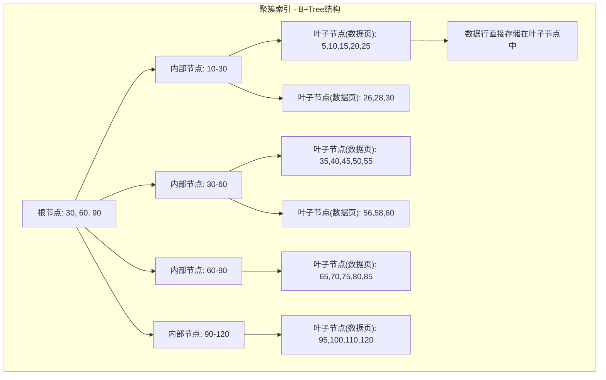
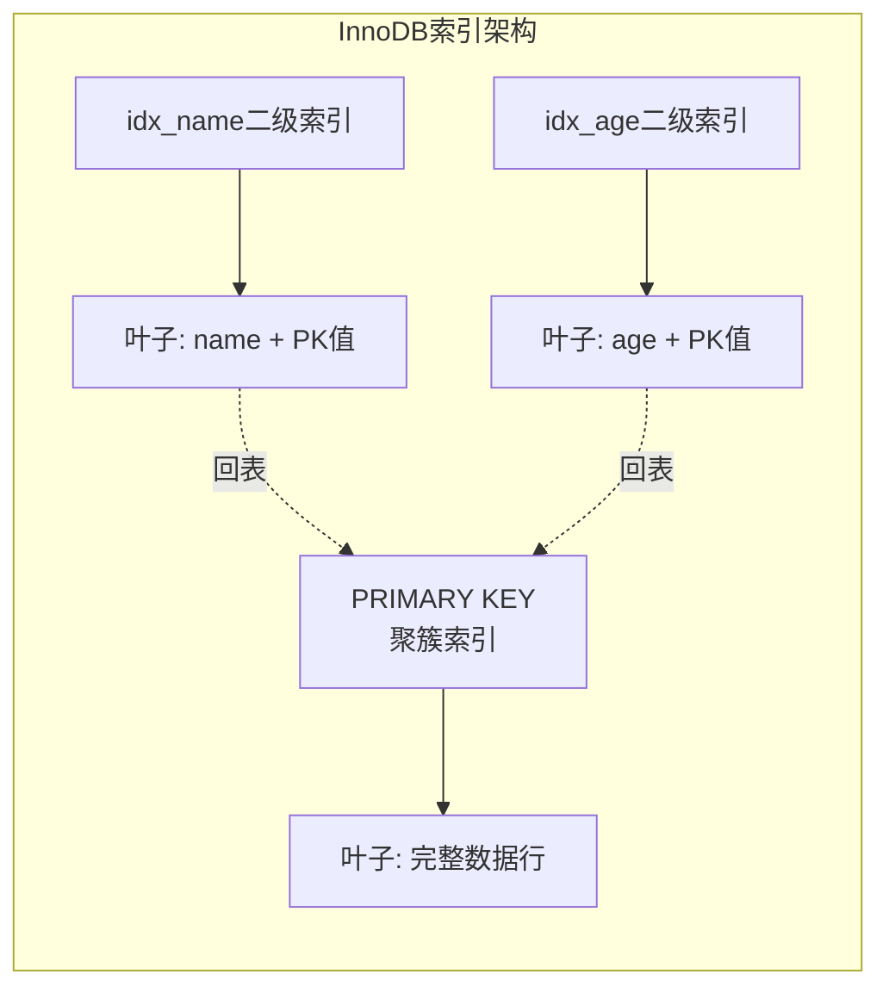
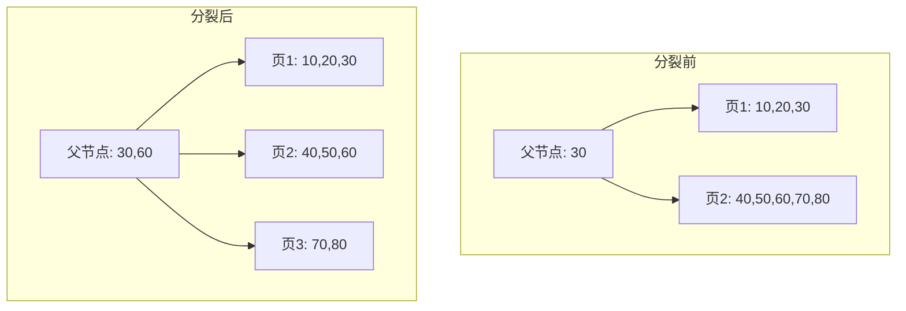
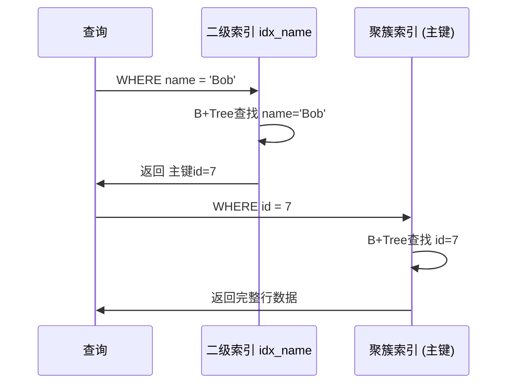

## 技巧2 聚簇索引

### 1. 什么是聚簇索引

#### 1.1 核心定义

聚簇索引（Clustered Index）是一种特殊的索引结构，它决定了表中数据行在磁盘上的**物理存储顺序**。与非聚簇索引（Secondary Index）不同，聚簇索引的叶子节点直接存储了完整的数据行，而非指向数据行的指针。

换句话说：**一个表的物理排列方式，就是它的聚簇索引**。这也是为什么每个表只能有一个聚簇索引——数据只能按一种物理顺序排列。



#### 1.2 与非聚簇索引的本质区别

理解聚簇索引的最佳方式是与非聚簇索引对比：

| 对比维度 | 聚簇索引 | 非聚簇索引（二级索引） |
|----------|----------|----------------------|
| 每表数量 | 最多1个（InnoDB为PK） | 可以有多个 |
| 叶子节点内容 | 存储完整数据行 | 存储索引列值 + 主键指针 |
| 物理排序 | 决定数据物理顺序 | 与物理顺序无关 |
| 查询路径 | 索引扫描直接获取数据 | 索引扫描 → 回表（bookmark lookup） |
| 查询效率 | 通常更高（避免回表） | 需要额外一次随机IO |
| 范围查询 | 天然有序，效率极高 | 需要回表后排序或利用索引有序性 |
| 排序开销 | ORDER BY聚簇键几乎零成本 | 可能需要filesort |

#### 1.3 不同数据库引擎的实现差异

不同数据库对聚簇索引的实现各有特点：

**InnoDB（MySQL）**
- 默认以主键作为聚簇索引（PRIMARY KEY）
- 无显式主键时，选择第一个非空唯一索引
- 都没有时，生成隐藏的6字节ROW_ID作为聚簇键
- 聚簇索引即"聚簇组织表"（Clustered Organized Table）

**InnoDB的二级索引**
- 叶子节点存储的是：索引列值 + 主键值
- 通过主键值"回表"到聚簇索引获取完整行数据
- 这就是为什么InnoDB必须有聚簇索引

**MyISAM（MySQL）**
- 不支持聚簇索引，数据和索引分离存储
- .MYD文件存数据，.MYI文件存索引
- 索引叶子节点存储数据文件的物理行指针（row pointer）

**SQL Server**
- 默认以主键创建聚簇索引
- 允许在非主键列上创建聚簇索引（但同样只能有一个）
- 提供 CLUSTERED / NONCLUSTERED 关键字显式指定

**PostgreSQL**
- 默认使用堆表（Heap Table），没有传统意义上的聚簇索引
- 提供 CLUSTER 命令按索引重排物理存储（一次性操作）
- PostgreSQL 12+ 的 BRIN 索引可以利用物理顺序性加速范围查询



---

### 2. 聚簇索引的内部机制

#### 2.1 B+Tree 与聚簇索引的结合

InnoDB的聚簇索引本质上是一棵B+Tree，但有一个关键区别：**叶子节点存储的不是指针，而是完整的数据行**。

每个数据页（Page）大小默认16KB，页内的数据行按聚簇键排序存储。页与页之间通过双向链表连接，形成一个有序的叶子节点链表。

┌──────────────────────────────────────────────┐
│                InnoDB Page (16KB)              │
├──────────────────────────────────────────────┤
│  File Header (38B)  │  Page Header (56B)     │
├──────────────────────────────────────────────┤
│           Infimum + Supremum                  │
├──────────────────────────────────────────────┤
│  Row 1 (id=1, name='Alice', age=30)          │
│  Row 2 (id=2, name='Bob', age=25)            │
│  Row 3 (id=3, name='Charlie', age=35)        │
│  ...                                         │
├──────────────────────────────────────────────┤
│  Page Directory (槽目录，用于页内二分查找)       │
└──────────────────────────────────────────────┘

#### 2.2 页分裂（Page Split）

当需要在已满的页中间插入新记录时，InnoDB会执行页分裂：

1. 创建一个新的空白页（3号页）
2. 将原满页中约一半的记录移动到新页
3. 调整页间的双向链表指针
4. 更新父节点的指针以包含新页



**页分裂的代价：**
- 性能开销：需要移动数据、更新指针
- 空间浪费：新页只填充约50%，造成约30%-50%的空间碎片
- 磁盘碎片：物理上不连续，降低顺序扫描效率
- 这就是为什么**自增主键**优于UUID主键——自增主键总是在页末尾追加，极少触发页分裂

#### 2.3 填充因子（Fill Factor）

填充因子决定了页在创建或分裂时的填充比例：

- **InnoDB默认**：页填充约15/16（约93.75%），为未来插入预留空间
- **高填充因子**（如95%）：适合读密集型场景，空间利用率高
- **低填充因子**（如70%）：适合频繁更新的场景，减少页分裂

#### 2.4 缓冲池与聚簇索引

InnoDB的缓冲池（Buffer Pool）将聚簇索引的热点数据页缓存在内存中：

┌─────────────────────────────────┐
│         Buffer Pool (内存)       │
│  ┌──────┐ ┌──────┐ ┌──────┐    │
│  │页1024│ │页1025│ │页1030│    │
│  └──────┘ └──────┘ └──────┘    │
│         LRU淘汰算法              │
└────────────┬────────────────────┘
             │ 磁盘IO
┌────────────┴────────────────────┐
│         磁盘数据文件              │
│  ibdata1 / tablespace.ibd       │
└─────────────────────────────────┘

聚簇索引的根节点和上层内部节点通常常驻缓冲池，实际的磁盘IO主要发生在叶子节点的数据页读取上。

---

### 3. 主键设计：聚簇索引的核心决策

#### 3.1 自增主键 vs UUID主键

这是选择聚簇索引策略时最关键的决策之一：

| 对比维度 | 自增主键（INT/BIGINT AUTO_INCREMENT） | UUID（CHAR(36)/BINARY(16)） |
|----------|--------------------------------------|----------------------------|
| 插入顺序 | 严格递增，在页末尾追加 | 随机，任意位置插入 |
| 页分裂频率 | 极低（仅页满时分裂） | 频繁（随机插入导致大量分裂） |
| 索引大小 | 4-8字节 | 16-36字节 |
| 二级索引大小 | 二级索引叶子节点存储4-8字节PK | 存储16-36字节UUID |
| 内存效率 | 高，缓冲池可缓存更多行 | 低，同等内存缓存行数更少 |
| 分布式友好 | 多节点ID冲突，需额外方案 | 天然全局唯一 |
| 有序性 | 有（可用于范围查询排序） | 无 |
| 典型场景 | 单机/小规模分布式 | 微服务、CQRS、分库分表 |

**实际数据对比（以100万行、每行200字节为例）：**

自增主键:
  聚簇索引大小: ~208 MB
  二级索引每个: ~24 MB (索引列 + 4字节BIGINT)
  总插入耗时: ~45秒
  页分裂次数: ~6,500次

UUID主键 (CHAR(36)):
  聚簇索引大小: ~360 MB (+73%)
  二级索引每个: ~56 MB (+133%)
  总插入耗时: ~180秒 (+300%)
  页分裂次数: ~320,000次 (+4800%)

#### 3.2 有序UUID（UUIDv7）的折中方案

UUIDv7在UUID的前48位嵌入了毫秒级时间戳，既保留全局唯一性，又大幅减少页分裂：

```sql
-- MySQL 8.0+ 使用 UUIDv7
-- 方法1: 使用 UUID_TO_BIN 的第二个参数转为有序字节序
INSERT INTO users (id, name) VALUES (UUID_TO_BIN(UUID()), 'Alice');
-- 解读：UUID v4 仍然随机，需要应用层生成 v7

-- 方法2: 应用层生成 UUIDv7（Python示例）
-- pip install uuid-utils
-- import uuid_utils
-- new_id = uuid_utils.uuid7()
```

UUIDv7的性能表现：
- 插入性能：接近自增主键（仅慢10%-20%）
- 页分裂频率：比随机UUID低90%以上
- 索引大小：与随机UUID相同（16字节）
- 分布式支持：天然全局唯一，无需协调

#### 3.3 复合主键的设计原则

InnoDB允许使用复合主键，但需要理解其对聚簇索引的影响：

```sql
-- 反面教材：过长的复合主键
CREATE TABLE order_items (
    order_id BIGINT,
    item_id BIGINT,
    product_name VARCHAR(200),
    quantity INT,
    price DECIMAL(10,2),
    PRIMARY KEY (order_id, item_id, product_name)  -- 3列复合PK，过长
);

-- 正确做法：保持主键简洁
CREATE TABLE order_items (
    id BIGINT AUTO_INCREMENT PRIMARY KEY,  -- 简洁的聚簇键
    order_id BIGINT NOT NULL,
    item_id BIGINT NOT NULL,
    product_name VARCHAR(200),
    quantity INT,
    price DECIMAL(10,2),
    UNIQUE KEY uk_order_item (order_id, item_id)  -- 业务唯一键用二级索引
);
```

**复合主键的陷阱：**
- 所有二级索引的叶子节点都会携带完整的复合主键
- 复合主键越长，二级索引越大，内存效率越低
- 更新主键列（如修改order_id）会导致级联更新所有二级索引
- 最佳实践：聚簇键尽量控制在8-16字节以内

---

### 4. 聚簇索引的查询优势

#### 4.1 主键等值查询

主键查询是聚簇索引最高效的使用方式——从根节点到叶子节点，每层只需一次页读取：

```sql
-- 最优查询路径：直接定位数据行
SELECT * FROM users WHERE id = 42;

-- 查询路径分析
-- 1. 读取根节点页 (1次IO → 页在缓冲池则0次IO)
-- 2. 读取内部节点页 (1次IO)
-- 3. 读取叶子节点页，直接获取完整行 (1次IO)
-- 总计: 最多3次页读取（B+Tree高度通常为2-4层）
```

使用 `EXPLAIN` 可以验证：

```sql
EXPLAIN SELECT * FROM users WHERE id = 42;
-- type: const
-- key: PRIMARY
-- rows: 1
```

#### 4.2 主键范围查询

B+Tree叶子节点的双向链表使范围查询极其高效：

```sql
-- 利用聚簇索引叶子节点的有序链表
SELECT * FROM orders
WHERE order_date BETWEEN '2024-01-01' AND '2024-01-31'
  AND id BETWEEN 1000 AND 5000;

-- 优化器策略：
-- 如果主键范围更小 → 先用PK范围过滤，再过滤order_date
-- 如果日期条件更选择性 → 用二级索引后回表
```

#### 4.3 ORDER BY 与聚簇索引

当排序列与聚簇键一致时，可以避免filesort：

```sql
-- 以下查询不需要排序操作（聚簇索引已保证顺序）
SELECT * FROM users ORDER BY id LIMIT 100;

-- 如果主键是自增的，以下也不需要排序
SELECT * FROM users ORDER BY id DESC LIMIT 100;

-- 但如果ORDER BY非主键列，且无法使用索引
SELECT * FROM users ORDER BY name LIMIT 100;
-- 可能触发 filesort（取决于数据量和sort_buffer_size）
```

---

### 5. 覆盖索引与聚簇索引的协同

#### 5.1 覆盖索引的原理

覆盖索引（Covering Index）是指查询所需的所有列都包含在索引中，无需回表到聚簇索引获取数据：

```sql
-- 索引定义
CREATE INDEX idx_name_age ON users(name, age);

-- 覆盖索引查询（仅扫描二级索引，不回表）
SELECT name, age FROM users WHERE name = 'Alice';

-- EXPLAIN分析：
-- Extra: Using index  ← 关键标志，表示覆盖索引
-- 不需要回表到聚簇索引，减少IO
```

#### 5.2 覆盖索引 vs 聚簇索引扫描

| 场景 | 覆盖索引 | 聚簇索引扫描 |
|------|----------|-------------|
| 索引大小 | 远小于聚簇索引 | 全量数据 |
| 内存效率 | 高（索引页小，可更多页驻留缓冲池） | 低（数据页大，缓存行少） |
| IO次数 | 仅扫描索引页 | 扫描数据页 |
| 适用条件 | 查询列是索引列子集 | 无合适索引 |
| 典型场景 | COUNT/SUM/AVG聚合查询 | 全表扫描 |

---

### 6. 二级索引的回表机制

#### 6.1 回表的完整流程

当使用非聚簇索引查询时，InnoDB需要通过"回表"获取完整数据：

```sql
-- 二级索引: idx_name
SELECT * FROM users WHERE name = 'Bob';

-- 执行流程:
-- 1. 在idx_name的B+Tree中查找 name='Bob' → 得到主键 id=7
-- 2. 用 id=7 去聚簇索引的B+Tree中查找完整行
-- 3. 返回完整行数据
```



#### 6.2 回表的性能代价

回表的代价取决于主键类型和数据分布：

**自增主键回表：**
- 主键值连续 → 数据行物理位置相近 → 顺序IO
- 10次回表 ≈ 2-3次磁盘IO（因为相邻主键行在同一数据页）

**UUID主键回表：**
- 主键值随机 → 数据行物理位置分散 → 随机IO
- 10次回表 ≈ 10次磁盘IO（每次都可能命中不同页）

这就是UUID主键在随机查询密集场景下性能差的根本原因。

#### 6.3 减少回表的策略

```sql
-- 策略1: 创建覆盖索引，完全避免回表
-- 只查询索引列
SELECT name, age FROM users WHERE name = 'Alice';

-- 策略2: 减少SELECT列数，可能触发覆盖索引
-- 之前: SELECT * → 必须回表
-- 之后: SELECT id, name, age → 可能被idx_name_age覆盖

-- 策略3: 利用主键覆盖
-- IN查询的结果会被优化器用于避免重复回表
SELECT * FROM users
WHERE name IN ('Alice', 'Bob', 'Charlie')
  AND id IN (SELECT id FROM users WHERE name IN ('Alice', 'Bob', 'Charlie'));

-- 策略4: 批量回表（MRR优化）
-- InnoDB的 Multi-Range Read 将随机回表转为顺序
SET optimizer_switch = 'mrr=on';
-- 先收集主键，排序后批量回表，将随机IO转为顺序IO
```

---

### 7. 聚簇索引的碎片化与维护

#### 7.1 碎片的产生原因

碎片类型:
├── 页分裂碎片 → 插入删除交替导致页空间利用率低
├── 删除碎片 → DELETE后页中留下空洞，未被回收
├── 更新碎片 → 变长字段更新导致行溢出（OFFPAGE）
└── 顺序碎片 → 多次页分裂后数据页物理不连续

#### 7.2 检测碎片

```sql
-- 方法1: 查看表的物理空间使用
SELECT
    table_name,
    ROUND(data_length / 1024 / 1024, 2) AS data_mb,
    ROUND(index_length / 1024 / 1024, 2) AS index_mb,
    ROUND(data_free / 1024 / 1024, 2) AS free_mb,
    ROUND((data_free / data_length) * 100, 2) AS frag_pct
FROM information_schema.tables
WHERE table_schema = 'your_db'
  AND table_name = 'users';

-- 方法2: 使用 information_schema.innodb_metrics
SELECT name, count
FROM information_schema.innodb_metrics
WHERE name LIKE '%page%split%';

-- 方法3: SHOW TABLE STATUS
SHOW TABLE STATUS LIKE 'users'\G
-- 关注 Data_free 字段
```

#### 7.3 碎片整理方法

```sql
-- 方法1: OPTIMIZE TABLE（在线重建）
OPTIMIZE TABLE users;
-- 效果: 重建表和聚簇索引，消除所有碎片
-- 缺点: 需要额外空间（约等于表大小），可能锁表（取决于MySQL版本）

-- MySQL 5.6+ 支持 online DDL
ALTER TABLE users ENGINE=InnoDB;  -- 等效于重建

-- 方法2: ALTER TABLE（MySQL 8.0+ Online DDL）
ALTER TABLE users REBUILD;
-- 在线重建，允许并发DML（需要足够的 tmp 空间）

-- 方法3: pt-online-schema-change（Percona Toolkit）
-- 适用于无法接受任何锁的生产环境
pt-online-schema-change \
  --alter "ENGINE=InnoDB" \
  --execute D=test,t=users

-- 方法4: 合理使用 DELETE 替代 TRUNCATE
-- 大表先分批删除
DELETE FROM users WHERE id < 1000000;
DELETE FROM users WHERE id >= 1000000 AND id < 2000000;
-- 每批删除后 OPTIMIZE 可能更高效
```

---

### 8. 聚簇索引在实战中的设计模式

#### 8.1 时间序列表设计

时间序列数据的写入和查询模式对聚簇索引设计有特殊要求：

```sql
-- 方案1: 自增主键 + 时间索引（最常用）
CREATE TABLE sensor_data (
    id BIGINT AUTO_INCREMENT PRIMARY KEY,  -- 聚簇键
    sensor_id INT NOT NULL,
    record_time DATETIME(3) NOT NULL,
    temperature DECIMAL(5,2),
    humidity DECIMAL(5,2),
    INDEX idx_sensor_time (sensor_id, record_time)
) ENGINE=InnoDB;

-- 优点: 插入快（自增无分裂），二级索引小
-- 缺点: 按时间范围查询需要走二级索引回表

-- 方案2: 时间作为主键前缀
CREATE TABLE sensor_data_v2 (
    record_time DATETIME(3) NOT NULL,
    id BIGINT AUTO_INCREMENT,  -- 附加列避免唯一性冲突
    sensor_id INT NOT NULL,
    temperature DECIMAL(5,2),
    PRIMARY KEY (record_time, id)
) ENGINE=InnoDB;

-- 优点: 按时间范围查询直接利用聚簇索引
-- 缺点: 插入需要分散到不同位置（时间并发写入时可能有竞争）

-- 方案3: 分区表 + 自增主键（推荐大表）
CREATE TABLE sensor_data_v3 (
    id BIGINT AUTO_INCREMENT PRIMARY KEY,
    sensor_id INT NOT NULL,
    record_time DATETIME(3) NOT NULL,
    temperature DECIMAL(5,2),
    PRIMARY KEY (id, record_time),  -- 分区键必须包含在主键中
    INDEX idx_sensor_time (sensor_id, record_time)
) PARTITION BY RANGE (TO_DAYS(record_time)) (
    PARTITION p202401 VALUES LESS THAN (TO_DAYS('2024-02-01')),
    PARTITION p202402 VALUES LESS THAN (TO_DAYS('2024-03-01')),
    PARTITION p202403 VALUES LESS THAN (TO_DAYS('2024-04-01'))
);
```

#### 8.2 日志/审计表设计

日志表通常是 append-only（只追加），且查询以时间范围为主：

```sql
CREATE TABLE audit_log (
    id BIGINT AUTO_INCREMENT PRIMARY KEY,
    event_time DATETIME(3) NOT NULL,
    user_id BIGINT,
    action VARCHAR(50),
    detail JSON,
    INDEX idx_time_action (event_time, action),
    INDEX idx_user (user_id, event_time)
) ENGINE=InnoDB
  ROW_FORMAT=COMPRESSED  -- 日志表通常可压缩
  KEY_BLOCK_SIZE=8;      -- 压缩块大小
```

#### 8.3 多租户SaaS应用

```sql
-- 租户ID作为聚簇键前缀（所有查询必须带租户ID）
CREATE TABLE tenant_orders (
    tenant_id BIGINT NOT NULL,
    id BIGINT AUTO_INCREMENT,
    order_date DATE,
    amount DECIMAL(12,2),
    PRIMARY KEY (tenant_id, id),  -- 聚簇键
    INDEX idx_date (tenant_id, order_date)
) ENGINE=InnoDB;

-- 优点: 租户隔离天然实现（查询必须带tenant_id）
-- 缺点: 跨租户查询效率低，AUTO_INCREMENT在复合PK中不全局递增
```

---

### 9. 常见误区与排错

#### 误区1：主键越短越好，UUID不能用

**真相：** UUIDv7（有序UUID）完全可以在聚簇索引中使用，性能接近自增主键。关键不是UUID本身，而是是否有时间顺序性。UUIDv4（完全随机）才是性能杀手。

#### 误区2：聚簇索引总是比二级索引快

**真相：** 当查询列不包含在聚簇索引的二级索引中需要回表时，如果回表量大（选择性差），聚簇索引扫描可能不如全表扫描。优化器会根据数据分布选择最优方案：

```sql
-- 如果 80% 的行都满足条件，优化器可能放弃索引
SELECT * FROM users WHERE age > 20;  -- 如果age > 20 覆盖80%的行
-- 优化器: "不如直接扫聚簇索引（全表扫描）"
```

#### 误区3：修改主键代价不高

**真相：** 修改InnoDB的主键需要重建整张表（ALGORITHM=INPLACE 但需要 rebuild）：

```sql
-- 修改主键 = 重建全表
ALTER TABLE users DROP PRIMARY KEY, ADD PRIMARY KEY (new_pk);
-- MySQL 8.0: 使用 ALGORITHM=INSTANT 可能无法应用于主键变更
-- 实际上会执行 TABLE REORGANIZE，需要大量IO
```

#### 误区4：MyISAM也有聚簇索引

**真相：** MyISAM的索引是"非聚簇"的，所有索引的叶子节点都存储行指针（物理地址），数据和索引完全分离。这也是InnoDB相比MyISAM在主键查询上更快的原因之一。

#### 误区5：聚簇索引可以加速所有查询

**真相：** 聚簇索引只能加速**按主键（或主键前缀）的等值和范围查询**。对于非主键列的查询，仍然需要创建对应的二级索引。聚簇索引对 `ORDER BY non_pk_column` 也没有直接帮助。

---

### 10. 监控与调优

#### 10.1 关键监控指标

```sql
-- 1. InnoDB缓冲池命中率（越高越好，>99%为优秀）
SHOW GLOBAL STATUS LIKE 'Innodb_buffer_pool_read%';
-- 命中率 = 1 - (Innodb_buffer_pool_reads / Innodb_buffer_pool_read_requests)

-- 2. 页分裂监控
SHOW GLOBAL STATUS LIKE 'Innodb_page_splits';
-- 定期记录差值，增长过快说明主键设计有问题

-- 3. 磁盘IO模式
SHOW GLOBAL STATUS LIKE 'Innodb_data_read%';
SHOW GLOBAL STATUS LIKE 'Innodb_data_written%';

-- 4. 索引使用情况
SELECT
    object_schema,
    object_name,
    index_name,
    count_star,
    count_read,
    count_write
FROM performance_schema.table_io_waits_summary_by_index_usage
WHERE object_schema = 'your_db'
  AND object_name = 'users'
ORDER BY count_star DESC;

-- 5. 未使用的索引（可能浪费空间和写入性能）
SELECT
    object_schema,
    object_name,
    index_name
FROM performance_schema.table_io_waits_summary_by_index_usage
WHERE object_schema = 'your_db'
  AND count_star = 0
  AND index_name != 'PRIMARY'
  AND object_name = 'users';
```

#### 10.2 性能调优参数

```ini
# my.cnf 关键参数

[mysqld]
# 缓冲池大小: 建议设置为物理内存的 50%-75%
innodb_buffer_pool_size = 4G

# 缓冲池实例数: 减少锁竞争
innodb_buffer_pool_instances = 4

# 日志文件大小: 影响写入性能和恢复时间
innodb_log_file_size = 1G

# 每次刷脏页的IO上限: 控制IO突发
innodb_io_capacity = 2000     # SSD建议1000-10000
innodb_io_capacity_max = 4000

# 排序缓冲区: 影响ORDER BY性能
sort_buffer_size = 4M

# MRR优化: 将随机回表转为顺序IO
optimizer_switch = 'mrr=on,mrr_cost_based=off'
```

#### 10.3 实时监控脚本

```bash
#!/bin/bash
# monitor_clustered_index.sh
# 监控聚簇索引相关的关键指标

DB="your_database"
TABLE="users"

echo "=== 聚簇索引监控报告 $(date) ==="

# 1. 表空间使用情况
echo "--- 表空间 ---"
mysql -N -e "
SELECT
    ROUND(data_length/1024/1024, 2) AS data_mb,
    ROUND(index_length/1024/1024, 2) AS index_mb,
    ROUND(data_free/1024/1024, 2) AS free_mb,
    ROUND((data_free/GREATEST(data_length,1))*100, 1) AS frag_pct
FROM information_schema.tables
WHERE table_schema='$DB' AND table_name='$TABLE';
"

# 2. 缓冲池命中率
echo "--- 缓冲池命中率 ---"
mysql -N -e "
SELECT
    ROUND((1 - (
        VARIABLE_VALUE /
        (SELECT VARIABLE_VALUE FROM performance_schema.global_status
         WHERE VARIABLE_NAME='Innodb_buffer_pool_read_requests')
    )) * 100, 3) AS hit_rate_pct
FROM performance_schema.global_status
WHERE VARIABLE_NAME='Innodb_buffer_pool_reads';
"

# 3. 页分裂频率（需定期采样对比）
echo "--- 页分裂次数 ---"
mysql -N -e "
SELECT VARIABLE_VALUE FROM performance_schema.global_status
WHERE VARIABLE_NAME='Innodb_page_splits';
"
```

---

### 11. 总结

聚簇索引是InnoDB存储引擎的基石，其设计直接决定了数据库的写入性能、查询效率和存储空间。核心要点如下：

| 设计决策 | 推荐方案 | 理由 |
|----------|----------|------|
| 主键类型 | BIGINT AUTO_INCREMENT 或 UUIDv7 | 最小化页分裂，保持顺序写入 |
| 复合主键 | 尽量避免，控制在8-16字节 | 减少二级索引大小 |
| 覆盖索引 | 为高频查询创建 | 避免回表，减少IO |
| 碎片管理 | 定期监控 data_free，>20%时整理 | 保持顺序扫描效率 |
| 缓冲池 | 物理内存50%-75% | 确保聚簇索引热点页驻留内存 |
| 二级索引 | 存储主键值而非行指针 | InnoDB聚簇索引的固有特性 |

掌握聚簇索引的原理和最佳实践，是从"会用SQL"到"精通数据库"的关键一步。理解数据在磁盘上的物理排列方式，才能真正写出高性能的数据库应用。
