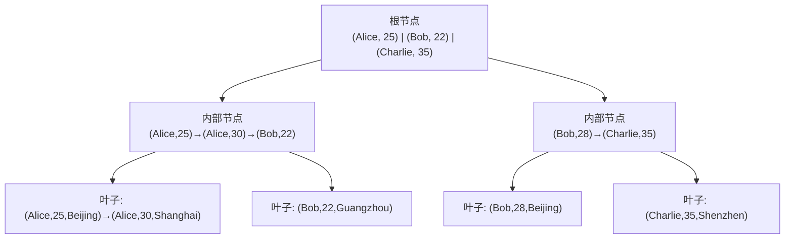
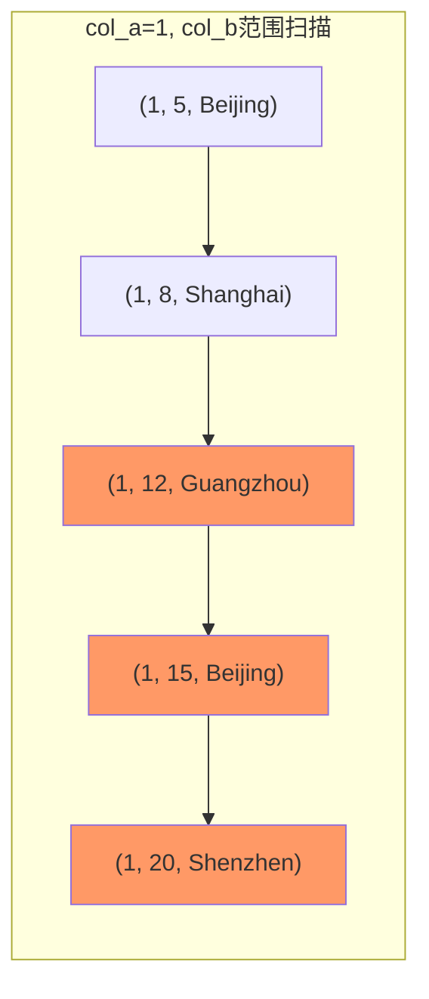
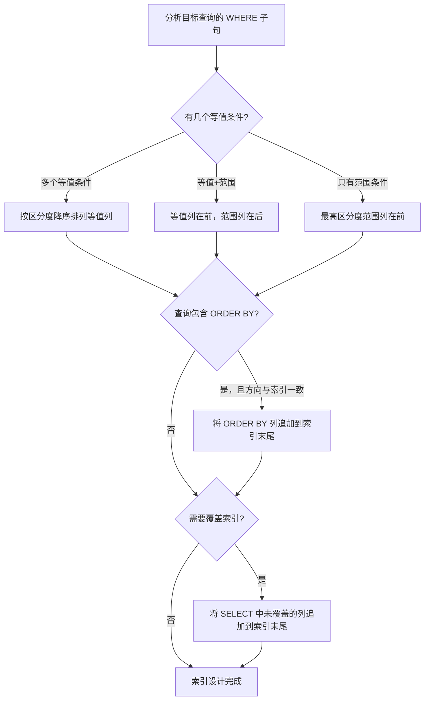
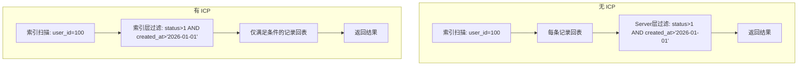

## 技巧3 联合索引

联合索引（Composite Index / Compound Index）是数据库性能优化中使用频率最高、但也最容易设计错误的索引类型。一条设计合理的联合索引，往往能替代多条单列索引，同时在过滤、排序、覆盖查询等多个维度提供性能增益。本节将从底层存储结构出发，系统讲解联合索引的原理、规则、设计方法论与实战验证。

---

### 1. 联合索引的本质

#### 1.1 什么是联合索引

联合索引是在一张表的多个列上建立的单一索引。与单列索引只对一个字段排序不同，联合索引按照定义时的列顺序，对多列的组合值进行排序和存储。

```sql
-- 单列索引：只对 name 排序
CREATE INDEX idx_name ON users(name);

-- 联合索引：先按 name 排序，name 相同时再按 age 排序
CREATE INDEX idx_name_age ON users(name, age);

-- 三列联合索引：name → age → city 层层递进排序
CREATE INDEX idx_name_age_city ON users(name, age, city);
```

联合索引的核心价值在于：**一条索引同时服务多个查询条件**，带来三重收益：

| 收益 | 说明 |
|------|------|
| 减少索引数量 | 一条联合索引可替代多条单列索引，减少索引总数 |
| 降低写入开销 | 每次 INSERT/UPDATE/DELETE 只需维护一棵 B+ 树，而非多棵 |
| 提供组合能力 | 支持多条件过滤、多列排序、覆盖查询等单列索引无法实现的优化 |

#### 1.2 B+ 树中的存储结构

联合索引在 B+ 树中的存储方式决定了其所有行为特性。理解这个结构是掌握联合索引一切规则的前提。

以联合索引 `(name, age, city)` 为例，数据在 B+ 树叶子节点中的排列如下：

叶子节点排序规则：
(Alice, 25, Beijing)  ←  第一排序键 name 升序
(Alice, 30, Shanghai) ←  name 相同时，按第二排序键 age 升序
(Bob,   22, Guangzhou)
(Bob,   28, Beijing)  ←  name 和 age 都相同时，按第三排序键 city 升序
(Charlie, 35, Shenzhen)



关键特性：

| 特性 | 说明 |
|------|------|
| 排序规则 | 严格按列定义顺序：先按第一列排，第一列相同时按第二列排，以此类推 |
| 有序区间 | 仅当左前缀列的值确定时，后续列才有序 |
| 覆盖能力 | 查询列全在索引中时，无需回表读取数据行 |
| 多条件服务 | 一条索引可服务于包含左前缀的多种查询组合 |
| 最左匹配 | B+ 树的查找必须从最左列开始，无法跳过中间列 |

---

### 2. 左前缀匹配规则

左前缀匹配是联合索引最核心的使用规则，也是大多数索引设计错误的根源。

#### 2.1 规则详解

对于联合索引 `(col_a, col_b, col_c)`，B+ 树的排序逻辑是：

1. 先按 `col_a` 排序
2. `col_a` 值相同时，按 `col_b` 排序
3. `col_a` 和 `col_b` 值都相同时，按 `col_c` 排序

这意味着查询条件必须从最左列开始连续使用，才能利用索引的有序性进行高效查找。

```sql
-- 联合索引：idx_a_b_c (col_a, col_b, col_c)

-- ✅ 能使用索引（完整左前缀）
SELECT * FROM t WHERE col_a = 1 AND col_b = 2 AND col_c = 3;

-- ✅ 能使用索引（使用了 col_a, col_b 两列）
SELECT * FROM t WHERE col_a = 1 AND col_b = 2;

-- ✅ 能使用索引（只使用最左列 col_a）
SELECT * FROM t WHERE col_a = 1;

-- ❌ 不能使用索引（跳过了 col_a，直接用 col_b）
SELECT * FROM t WHERE col_b = 2;

-- ❌ 不能使用索引（跳过了 col_a，直接用 col_c）
SELECT * FROM t WHERE col_c = 3;

-- ❌ 不能使用索引（使用了 col_a 和 col_c，但跳过了 col_b）
SELECT * FROM t WHERE col_a = 1 AND col_c = 3;
```

#### 2.2 范围查询对索引使用的影响

范围查询（`>`、`<`、`>=`、`<=`、`BETWEEN`、`LIKE 'abc%'`）会中断索引的列利用。范围查询之后的列无法利用索引的有序性。

```sql
-- 联合索引：idx_a_b_c (col_a, col_b, col_c)

-- ✅ col_a 等值 + col_b 范围：索引用于 col_a 的等值定位和 col_b 的范围扫描
SELECT * FROM t WHERE col_a = 1 AND col_b > 10 AND col_c = 3;
-- col_c 虽然在 WHERE 中，但因为 col_b 是范围条件，col_c 无法利用索引

-- ✅ col_a 等值 + col_b 等值：三列都能利用索引
SELECT * FROM t WHERE col_a = 1 AND col_b = 10 AND col_c = 3;
```

这背后的原理：当 `col_b > 10` 时，满足条件的记录在 B+ 树中分布在多个区间，这些区间内的 `col_c` 并不是全局有序的，因此无法通过索引直接定位 `col_c` 的值。

#### 2.3 范围查询的内部原理图解



> 范围条件 `col_b > 10` 命中 A3/A4/A5，但这些记录的 `col_c` 分别是 Guangzhou、Beijing、Shenzhen，不具有有序性，因此索引无法继续向下利用 `col_c`。

#### 2.4 WHERE 和 ORDER BY 的联合利用

当查询同时包含 WHERE 和 ORDER BY 时，联合索引的左前缀规则同样适用，但需要额外考虑排序方向：

```sql
-- 联合索引：idx_a_b (col_a, col_b)

-- ✅ WHERE 用 col_a 等值定位，ORDER BY 用 col_b 排序 → 索引同时服务过滤和排序
SELECT * FROM t WHERE col_a = 1 ORDER BY col_b;
-- 执行：col_a=1 定位到有序区间，区间内 col_b 已有序，无需 filesort

-- ❌ WHERE 用 col_b 等值，ORDER BY 用 col_a → 无法利用索引排序
SELECT * FROM t WHERE col_b = 1 ORDER BY col_a;
-- 执行：col_b=1 无法利用索引定位（跳过了 col_a），需要 filesort

-- ✅ WHERE 用 col_a 等值 + col_b 范围，ORDER BY 用 col_a → 部分利用
SELECT * FROM t WHERE col_a = 1 AND col_b > 10 ORDER BY col_a;
-- col_a 等值定位，col_b 范围扫描，col_a 排序在等值条件下自动满足
```

---

### 3. 列顺序的设计方法论

联合索引的列顺序直接决定了索引能服务哪些查询。错误的列顺序会让索引形同虚设。

#### 3.1 设计原则

**原则一：高区分度列在前**

区分度（Cardinality）= 不重复值的数量 / 总行数。区分度越高，索引的过滤能力越强。

```sql
-- 查看各列的区分度
SELECT
    COUNT(DISTINCT status) / COUNT(*) AS status_cardinality,    -- 0.001（只有几个状态值）
    COUNT(DISTINCT city) / COUNT(*) AS city_cardinality,       -- 0.05
    COUNT(DISTINCT name) / COUNT(*) AS name_cardinality        -- 0.95
FROM users;

-- 结论：name 区分度最高，应放在最前面
CREATE INDEX idx_name_city_status ON users(name, city, status);
```

> **注意**：区分度不是唯一因素。如果某个低区分度列在所有查询中都是等值条件，而高区分度列只在部分查询中出现，优先满足高频查询的模式可能比严格按区分度排序更优。

**原则二：等值条件列在前，范围条件列在后**

等值条件能精确定位 B+ 树节点，范围条件只做区间扫描。将等值列放前面可以让更多列参与索引过滤。

```sql
-- 查询模式：WHERE user_id = ? AND created_at > ?
-- 推荐索引：
CREATE INDEX idx_uid_time ON orders(user_id, created_at);
-- user_id 等值定位 → created_at 范围扫描 → 高效

-- 不推荐：
CREATE INDEX idx_time_uid ON orders(created_at, user_id);
-- created_at 范围扫描 → user_id 无法利用索引 → 低效
```

**原则三：考虑查询频率，优先覆盖高频查询**

分析慢查询日志中出现频率最高的查询模式，优先为其设计索引。

```sql
-- 慢查询日志分析
-- 查询1：WHERE department_id = ? AND status = ? ORDER BY salary DESC  （日均 50000 次）
-- 查询2：WHERE employee_id = ?                                       （日均 20000 次）
-- 查询3：WHERE department_id = ? AND hire_date > ?                   （日均 5000 次）

-- 最优索引策略
CREATE INDEX idx_dept_status_salary ON employees(department_id, status, salary);
CREATE INDEX idx_empid ON employees(employee_id);
-- department_id=等值, status=等值, salary=排序 → 完美匹配查询1
```

#### 3.2 设计决策流程



#### 3.3 ORDER BY 与联合索引

当查询包含 `ORDER BY` 且排序方向与索引列顺序一致时，可以避免额外的文件排序（filesort）。

```sql
-- 联合索引：idx_a_b (col_a, col_b)

-- ✅ 排序方向一致，利用索引排序，无 filesort
SELECT * FROM t WHERE col_a = 1 ORDER BY col_b ASC;

-- ❌ 排序方向不一致，需要 filesort
SELECT * FROM t WHERE col_a = 1 ORDER BY col_b DESC;

-- ✅ MySQL 8.0+ 支持混合排序方向的索引
CREATE INDEX idx_a_b_desc ON t(col_a, col_b DESC);
SELECT * FROM t WHERE col_a = 1 ORDER BY col_b DESC;

-- ✅ 多列排序方向不同时
CREATE INDEX idx_mixed ON t(col_a ASC, col_b DESC);
SELECT * FROM t WHERE col_a > 0 ORDER BY col_a ASC, col_b DESC;
```

#### 3.4 GROUP BY 与联合索引

GROUP BY 的优化逻辑与 ORDER BY 类似——如果分组列是联合索引的前缀列，且索引已经排好序，则 MySQL 可以直接利用索引的有序性进行分组，避免额外的临时表和排序操作。

```sql
-- 联合索引：idx_dept_status (department_id, status)

-- ✅ 分组列是索引前缀，且无其他列需要排序 → 索引排序 + 分组
SELECT department_id, status, COUNT(*) FROM orders
GROUP BY department_id, status;
-- Extra: Using index（如果也是覆盖索引）

-- ❌ 分组列跳过了索引列 → 需要临时表 + filesort
SELECT status, COUNT(*) FROM orders
GROUP BY status;

-- ✅ 分组列包含在索引中，但 SELECT 了额外列 → 需要回表但分组仍可利用索引
SELECT department_id, status, SUM(amount) FROM orders
GROUP BY department_id, status;
-- Extra: Using temporary; Using filesort（因为 SUM 需要回表取 amount）
-- 但如果 SELECT 只有 department_id, status, COUNT(*)，则可能完全避免临时表
```

---

### 4. 覆盖索引与索引下推

#### 4.1 覆盖索引原理

覆盖索引（Covering Index）是指查询所需的所有列都包含在索引中，无需回表读取数据行。这是联合索引最强大的性能优化手段之一。

```sql
-- 联合索引
CREATE INDEX idx_name_age_email ON users(name, age, email);

-- 覆盖索引：所有 SELECT 列都在索引中
EXPLAIN SELECT name, age, email FROM users WHERE name = 'Alice';
-- Extra: Using index  ← 表示覆盖索引，无需回表

-- 需要回表：SELECT 中包含索引未覆盖的列
EXPLAIN SELECT name, age, email, phone FROM users WHERE name = 'Alice';
-- Extra: NULL  ← 需要回表读取 phone 列
```

#### 4.2 覆盖索引的性能优势

| 操作 | 回表查询 | 覆盖索引 |
|------|----------|----------|
| B+ 树查找 | 1 次 | 1 次 |
| 数据行读取 | 随机 IO（每行一次） | 无 |
| 结果来源 | 索引 + 数据行 | 仅索引 |
| 典型延迟 | 1-10ms（百万级表） | 0.1-1ms |

覆盖索引将随机 IO 转化为顺序 IO，在 InnoDB 中尤其有效，因为非聚簇索引的叶子节点存储的是主键值，每次回表都需要通过主键到聚簇索引中查找完整行数据（随机 IO）。

**覆盖索引的典型应用场景**：

```sql
-- 场景1：只查询索引列 + 主键
-- 联合索引 idx_user_status_time (user_id, status, created_at)
SELECT user_id, status, created_at FROM orders WHERE user_id = 100;
-- 主键 id 也会存储在非聚簇索引中，所以 SELECT id 也算覆盖索引

-- 场景2：COUNT 查询利用覆盖索引
SELECT COUNT(*) FROM orders WHERE user_id = 100;
-- 如果 idx_user_status_time 存在，InnoDB 只需扫描索引树即可完成计数

-- 场景3：存在性检查
SELECT 1 FROM orders WHERE user_id = 100 AND status = 1 LIMIT 1;
-- 只需在索引中找到一条匹配记录即可返回，无需回表
```

#### 4.3 索引下推（Index Condition Pushdown, ICP）

MySQL 5.6+ 引入的优化，将 WHERE 条件中索引列的过滤操作下推到存储引擎层，在索引遍历过程中直接过滤，减少回表次数。

```sql
-- 联合索引：idx_user_status_time (user_id, status, created_at)

-- 不使用 ICP（MySQL 5.5 或关闭 ICP）
-- 执行流程：
-- 1. 通过 user_id 定位索引记录
-- 2. 每条记录都回表到主键索引
-- 3. 在 Server 层过滤 status 和 created_at

-- 使用 ICP（MySQL 5.6+ 默认开启）
-- 执行流程：
-- 1. 通过 user_id 定位索引记录
-- 2. 在索引层直接检查 status 和 created_at
-- 3. 只有满足条件的记录才回表

EXPLAIN SELECT * FROM orders
WHERE user_id = 100 AND status > 1 AND created_at > '2026-01-01';
-- Extra: Using index condition  ← ICP 生效
```



> **ICP 的生效条件**：(1) 只适用于 InnoDB 和 MyISAM；(2) 不能用于覆盖索引（因为覆盖索引本身就不需要回表）；(3) 只能下推到存储引擎层能评估的条件（如范围、LIKE 前缀等），不能下推子查询、存储函数等。

#### 4.4 Index Skip Scan（MySQL 8.0.13+）

当联合索引的前缀列区分度极低时，MySQL 8.0 引入了 Skip Scan 优化，跳过前缀列的全值遍历。

```sql
-- 联合索引：idx_gender_name (gender, name)
-- gender 只有 'M'、'F' 两个值，区分度极低

-- 查询只用 name，理论上无法利用索引
EXPLAIN SELECT * FROM users WHERE name = 'Alice';
-- MySQL 8.0+ 可能输出：
-- type: range
-- key: idx_gender_name
-- Extra: Using index for skip scan  ← Skip Scan 生效

-- Skip Scan 的原理：
-- 等价于执行以下两个查询的合并结果
-- SELECT * FROM users WHERE gender = 'M' AND name = 'Alice'
-- SELECT * FROM users WHERE gender = 'F' AND name = 'Alice'
-- 因为 gender 只有几个值，遍历成本很低
```

> **Skip Scan 的限制**：(1) 仅在 MySQL 8.0.13+ 中可用；(2) 前缀列的 DISTINCT 值数量必须很少（通常 < 10）；(3) 查询不能包含范围条件；(4) 实际收益取决于前缀列的基数——如果前缀列有 100 个不同值，Skip Scan 会退化为 100 次范围扫描，反而更慢。

---

### 5. 多表查询中的联合索引

联合索引不仅服务于单表查询，在 JOIN、子查询、GROUP BY 等多表操作中同样扮演关键角色。

#### 5.1 JOIN 操作中的联合索引

在表连接时，被驱动表（右侧表）的连接列上的联合索引能显著减少嵌套循环的匹配次数。

```sql
-- 订单表：orders(user_id, product_id, status, created_at)
-- 用户表：users(id, name, city)

-- 查询：每个用户的最近订单
SELECT u.name, o.created_at, o.amount
FROM users u
JOIN orders o ON o.user_id = u.id
WHERE o.status = 1;

-- 为 orders 设计联合索引
CREATE INDEX idx_user_status_time ON orders(user_id, status, created_at);
-- user_id: JOIN 连接条件（等值）
-- status: WHERE 过滤条件（等值）
-- created_at: ORDER BY 排序列（如果需要取最近订单）
-- 三个列全部被索引覆盖，减少嵌套循环中的扫描范围

-- 为 users 设计索引（主键通常是 id，已自动有聚簇索引）
-- 如果 users 表很大且需要覆盖 name 列：
CREATE INDEX idx_id_name ON users(id, name);
-- 覆盖索引：JOIN 时无需回表读取 name
```

#### 5.2 子查询中的联合索引

子查询中，IN 子查询和 EXISTS 子查询对索引的利用方式不同：

```sql
-- 场景：查找下过订单的活跃用户
-- users(id, name, status)
-- orders(user_id, status, created_at)

-- 方式1：IN 子查询
SELECT * FROM users
WHERE id IN (SELECT user_id FROM orders WHERE status = 1);
-- orders 上的 idx_user_status 索引能加速子查询

-- 方式2： EXISTS（通常更优）
SELECT * FROM users u
WHERE EXISTS (SELECT 1 FROM orders o WHERE o.user_id = u.id AND o.status = 1);
-- 同样利用 orders 上的联合索引

-- 优化点：如果 orders 的联合索引是 (user_id, status, created_at)
-- EXISTS 子查询只需要 user_id + status 两列即可完成
-- created_at 列虽在索引中但不会被使用（不影响效率，只是占空间）
```

#### 5.3 联合索引与覆盖索引在 JOIN 中的协同

当 JOIN 查询同时利用覆盖索引时，性能提升最为显著——整个查询可以在索引层完成，无需回表读取任何数据行：

```sql
-- 联合索引 idx_user_status_time (user_id, status, created_at)

-- 覆盖索引 + JOIN：只查索引列，完全不回表
SELECT o.user_id, o.status, o.created_at
FROM orders o
JOIN users u ON u.id = o.user_id
WHERE o.user_id = 100 AND o.status = 1;
-- orders 表：Using index（覆盖索引）
-- users 表：通过主键查找（id 是主键）
-- 整个查询的 IO 开销极低
```

---

### 6. MySQL 特性与联合索引

#### 6.1 降序索引（MySQL 8.0+）

MySQL 8.0 之前，所有索引都按升序存储，`DESC` 声明会被忽略。MySQL 8.0 引入了真正的降序索引，允许索引列按不同方向存储。

```sql
-- MySQL 8.0+：混合排序索引
CREATE INDEX idx_time_desc ON orders(created_at DESC, user_id ASC);

-- 查询：最近的订单在前，同一时间的按 user_id 升序
SELECT * FROM orders ORDER BY created_at DESC, user_id ASC;
-- 索引已经按此方向排序，无需 filesort

-- 经典场景：聊天消息列表
-- messages(conversation_id, sender_id, created_at)
-- 查询模式：按会话查最新消息，时间倒序
CREATE INDEX idx_conv_time ON messages(conversation_id, created_at DESC);
SELECT * FROM messages WHERE conversation_id = 100 ORDER BY created_at DESC LIMIT 20;
-- 完美利用索引排序，无需 filesort
```

#### 6.2 不可见索引（MySQL 8.0+）

不可见索引（Invisible Index）允许在不删除索引的情况下，让优化器忽略该索引。用于安全评估联合索引的影响。

```sql
-- 创建索引后设为不可见
CREATE INDEX idx_test ON orders(user_id, status, created_at) INVISIBLE;

-- 该索引不会被优化器使用，但写入时仍会维护
-- 用于测试：如果删除某索引后性能没有变化，说明它是冗余的

-- 查看索引可见性
SHOW INDEX FROM orders WHERE Invisible = 'YES';

-- 恢复可见
ALTER INDEX idx_test VISIBLE;
```

#### 6.3 函数索引与表达式索引（MySQL 8.0+）

MySQL 8.0 支持在表达式上创建索引，这改变了联合索引只能基于原始列的传统限制：

```sql
-- 在表达式上创建联合索引
CREATE INDEX idx_func ON users((UPPER(name)), city);

-- 查询：利用函数索引
SELECT * FROM users WHERE UPPER(name) = 'ALICE' AND city = 'Beijing';
-- 优化器识别出 UPPER(name) 与索引表达式匹配，使用该索引

-- 实用场景：JSON 字段的联合索引
CREATE TABLE events (
    id BIGINT PRIMARY KEY,
    data JSON NOT NULL,
    created_at DATETIME NOT NULL
);

-- 对 JSON 中的字段和 created_at 建联合索引
CREATE INDEX idx_type_time ON events((CAST(data->>'$.type' AS CHAR(50))), created_at);

-- 查询：利用函数索引
SELECT * FROM events
WHERE CAST(data->>'$.type' AS CHAR(50)) = 'click' AND created_at > '2026-01-01';
```

#### 6.4 InnoDB 的索引长度限制

InnoDB 对联合索引的总键长度有严格限制，超出部分会被截断：

| 配置 | 最大键长度 |
|------|-----------|
| `innodb_large_prefix=ON` + `ROW_FORMAT=DYNAMIC/COMPRESSED` | 3072 字节 |
| 默认配置（MySQL 5.6+ 通常已开启） | 767 字节（utf8mb4 下约 191 个字符） |

```sql
-- 查看当前配置
SHOW VARIABLES LIKE 'innodb_large_prefix';      -- 应为 ON
SHOW VARIABLES LIKE 'innodb_default_row_format'; -- 应为 dynamic

-- VARCHAR(255) 在 utf8mb4 下占 255×4 = 1020 字节
-- 三个 VARCHAR(255) 列的联合索引 = 3060 字节，在 3072 限制内

-- 如果超长，可以使用前缀索引
CREATE INDEX idx_prefix ON users(name(50), city(20));
-- 只索引 name 的前 50 个字符和 city 的前 20 个字符
-- 注意：前缀索引无法用于覆盖索引
```

---

### 7. 联合索引 vs 多个单列索引

在设计索引策略时，一个常见问题是：用一条联合索引还是多个单列索引？

#### 7.1 对比分析

| 维度 | 联合索引 (a, b, c) | 三个单列索引 idx_a, idx_b, idx_c |
|------|---------------------|----------------------------------|
| WHERE a=? AND b=? AND c=? | ✅ 一条索引完美覆盖 | ⚠️ Index Merge（效率低） |
| WHERE a=? | ✅ 使用索引 | ✅ 使用 idx_a |
| WHERE b=? | ❌ 不使用 | ✅ 使用 idx_b |
| WHERE a=? AND c=? | ⚠️ 只用 a 部分 | ⚠️ Index Merge |
| 磁盘空间 | 一条索引树 | 三棵索引树 |
| 写入开销 | 低（维护一棵树） | 高（维护三棵树） |
| 排序优化 | ✅ 支持多列排序 | ❌ 只能单列排序 |
| 覆盖索引 | ✅ 多列可同时覆盖 | ❌ 单列覆盖 |

#### 7.2 Index Merge 的局限

MySQL 支持对多个单列索引取交集（Index Merge Intersect），但有严格限制：

```sql
-- 两个单列索引
CREATE INDEX idx_user ON orders(user_id);
CREATE INDEX idx_status ON orders(status);

-- Index Merge 查询
EXPLAIN SELECT * FROM orders WHERE user_id = 100 AND status = 1;
-- type: index_merge
-- Extra: Using intersect(idx_user, idx_status)

-- 问题：Index Merge 需要对两个索引的结果取交集
-- 当两个索引各自匹配的行数都很多时，交集操作本身也很昂贵
-- 且 Index Merge 无法利用排序、无法使用覆盖索引
```

**Index Merge 的实际开销**：

| 操作 | 联合索引 | Index Merge |
|------|----------|-------------|
| 索引查找次数 | 1 次 | 2 次（每个索引各一次） |
| 结果集合并 | 无需合并 | 需要取交集（内存中排序合并） |
| 排序支持 | ✅ | ❌ |
| 覆盖索引 | ✅ | ❌ |
| 优化器选择概率 | 高（默认优先） | 低（仅在无联合索引时） |

**经验法则**：当查询中经常同时出现的条件列，应该放在同一条联合索引中，而不是分别建单列索引。

---

### 8. 常见误区与纠正

#### 误区一：WHERE 中的列都建单列索引就够了

错误做法：
CREATE INDEX idx_user_id ON orders(user_id);
CREATE INDEX idx_status ON orders(status);
CREATE INDEX idx_time ON orders(created_at);

-- 查询：WHERE user_id = ? AND status = ? ORDER BY created_at
-- 结果：Index Merge，无法利用排序，性能差

正确做法：
CREATE INDEX idx_user_status_time ON orders(user_id, status, created_at);
-- 一条联合索引同时覆盖过滤和排序

#### 误区二：索引列越多越好

联合索引的列数不是越多越好。MySQL（InnoDB）单个索引键的最大长度为 3072 字节（`innodb_large_prefix=ON` 且 `ROW_FORMAT=DYNAMIC`）。更重要的是：

- 每增加一列，索引树的扇出降低，查找效率可能下降
- 写入时需要维护更多列的 B+ 树平衡
- 冗余列浪费存储空间和内存

```sql
-- ❌ 不必要的超长联合索引
CREATE INDEX idx_everything ON orders(user_id, product_id, status, amount, created_at, updated_at);

-- ✅ 按实际查询模式设计
CREATE INDEX idx_user_time ON orders(user_id, created_at);  -- 服务用户订单查询
CREATE INDEX idx_status_time ON orders(status, created_at);  -- 服务状态筛选
```

#### 误区三：联合索引能替代所有查询

有些查询模式无法有效利用联合索引：

```sql
-- 联合索引：idx_a_b (col_a, col_b)

-- ❌ 函数操作破坏索引使用
SELECT * FROM t WHERE UPPER(col_a) = 'ALICE';
-- 纠正：改为 WHERE col_a = 'alice'（存储时统一大小写）
-- 或 MySQL 8.0+：CREATE INDEX idx_func ON t((UPPER(col_a)));

-- ❌ 隐式类型转换
-- col_a 是 VARCHAR 类型
SELECT * FROM t WHERE col_a = 123;
-- 纠正：改为 WHERE col_a = '123'

-- ❌ LIKE 左模糊
SELECT * FROM t WHERE col_a LIKE '%alice';
-- 纠正：改为前缀匹配 WHERE col_a LIKE 'alice%'，或使用全文索引
```

#### 误区四：忽略索引的最左前缀规则

```sql
-- 索引 (a, b, c)

查询1: WHERE b = 1 AND c = 2           → ❌ 无法使用索引
查询2: WHERE a = 1 AND c = 2           → ⚠️ 只能用到 a 列
查询3: WHERE a = 1 AND b > 5 AND c = 2 → ⚠️ a 等值+b 范围，c 无法利用索引

解决方法：
- 查询1需要单独建索引 (b, c) 或 (b, c, a)
- 查询2是正常的，c 虽然无法利用索引定位，但 a 的过滤已减少扫描范围
- 查询3如果 c 的过滤很重要，考虑拆分为两个查询或调整查询逻辑
```

#### 误区五：冗余索引无害

```sql
-- 以下索引组合中，idx_a 是冗余的
CREATE INDEX idx_a ON t(col_a);
CREATE INDEX idx_a_b ON t(col_a, col_b);

-- idx_a_b 的最左列已经是 col_a，查询 WHERE col_a = ? 会使用 idx_a_b
-- idx_a 完全冗余，白白增加写入开销和存储空间

-- 检测冗余索引
SELECT * FROM sys.schema_redundant_indexes WHERE table_name = 't';
-- MySQL 5.7+ 的 sys schema 提供了便捷的冗余索引检测视图
```

#### 误区六：忽视索引维护的写入代价

```sql
-- 表 orders 有 5 条索引，每条索引约 200MB
-- 每次 INSERT 需要维护 5 棵 B+ 树
-- 写入放大效应：一次逻辑写入变成 5 次物理写入

-- 评估写入代价：
-- 1. 统计现有索引数量和大小
SELECT
    INDEX_NAME,
    ROUND(SUM(INDEX_LENGTH) / 1024 / 1024, 2) AS size_mb
FROM information_schema.STATISTICS
WHERE TABLE_SCHEMA = 'your_db' AND TABLE_NAME = 'orders'
GROUP BY INDEX_NAME;

-- 2. 监控写入性能
SHOW GLOBAL STATUS LIKE 'Innodb_data_writes';  -- 数据写入次数
SHOW GLOBAL STATUS LIKE 'Innodb_buffer_pool_write_requests';  -- 缓冲池写入请求
-- 如果写入请求远大于数据写入，说明索引维护开销较大
```

---

### 9. 高级场景与进阶技巧

#### 9.1 多值查询（IN 条件）

```sql
-- 联合索引：idx_a_b (col_a, col_b)

-- IN 条件中多值的情况
SELECT * FROM t WHERE col_a IN (1, 2, 3) AND col_b = 10;

-- MySQL 的处理方式：
-- 等价于分别执行：
-- WHERE col_a = 1 AND col_b = 10
-- WHERE col_a = 2 AND col_b = 10
-- WHERE col_a = 3 AND col_b = 10
-- 然后合并结果（Range Scan 或 Index Merge）
```

#### 9.2 NULL 值的处理

```sql
-- 联合索引对 NULL 的处理
CREATE INDEX idx_a_b ON t(col_a, col_b);

-- NULL = NULL 的特殊行为
SELECT * FROM t WHERE col_a IS NULL AND col_b = 1;
-- ✅ 可以使用索引，IS NULL 等同于等值条件

-- NULL 在排序中的位置
-- InnoDB 中 NULL 值被认为是最小的，排在最前面
-- ORDER BY col_a ASC → NULL 值排在最前
-- ORDER BY col_a DESC → NULL 值排在最后

-- NULL 值对区分度的影响
-- COUNT(DISTINCT col) 不统计 NULL 值
-- 如果某列有大量 NULL，实际区分度会比预估的低
-- 设计索引时需考虑 NULL 值的比例
```

#### 9.3 分区表中的联合索引

```sql
-- 分区表的联合索引设计
-- 分区键必须是联合索引的第一列（或全部包含）

CREATE TABLE logs (
    id BIGINT AUTO_INCREMENT,
    log_date DATE NOT NULL,
    service VARCHAR(50) NOT NULL,
    level TINYINT NOT NULL,
    message TEXT,
    PRIMARY KEY (id, log_date),  -- 分区键 log_date 必须在主键中
    INDEX idx_service_level_date (service, level, log_date)
) PARTITION BY RANGE (TO_DAYS(log_date)) (
    PARTITION p202601 VALUES LESS THAN (TO_DAYS('2026-02-01')),
    PARTITION p202602 VALUES LESS THAN (TO_DAYS('2026-03-01')),
    PARTITION p202603 VALUES LESS THAN (TO_DAYS('2026-04-01')),
    PARTITION pmax VALUES LESS THAN MAXVALUE
);

-- 查询时必须包含分区键，否则会扫描所有分区
-- ✅ 分区裁剪生效
SELECT * FROM logs WHERE log_date = '2026-03-15' AND service = 'auth';
-- ❌ 分区裁剪不生效，扫描所有分区
SELECT * FROM logs WHERE service = 'auth';
```

---

### 10. 实战验证：EXPLAIN 分析

#### 10.1 创建测试环境

```sql
-- 创建测试表
CREATE TABLE orders (
    id BIGINT PRIMARY KEY AUTO_INCREMENT,
    user_id INT NOT NULL,
    product_id INT NOT NULL,
    status TINYINT NOT NULL DEFAULT 0,
    amount DECIMAL(10,2),
    created_at DATETIME NOT NULL,
    INDEX idx_user_status_time (user_id, status, created_at)
) ENGINE=InnoDB;

-- 插入测试数据（模拟真实数据分布）
INSERT INTO orders (user_id, product_id, status, amount, created_at)
SELECT
    FLOOR(RAND() * 10000),
    FLOOR(RAND() * 500),
    FLOOR(RAND() * 4),
    ROUND(RAND() * 1000, 2),
    DATE_SUB(NOW(), INTERVAL FLOOR(RAND() * 365) DAY)
FROM information_schema.tables t1
CROSS JOIN information_schema.tables t2
LIMIT 1000000;
```

#### 10.2 EXPLAIN 分析实战

```sql
-- 查询1：完美匹配索引前缀
EXPLAIN SELECT id, user_id, status, created_at
FROM orders
WHERE user_id = 100 AND status = 1 AND created_at > '2026-01-01';

-- 预期输出：
-- type: ref
-- key: idx_user_status_time
-- rows: ~250（精确估计）
-- Extra: Using where  ← 索引完全覆盖 WHERE 条件
```

```sql
-- 查询2：跳过了 status 列
EXPLAIN SELECT id, user_id, created_at
FROM orders
WHERE user_id = 100 AND created_at > '2026-01-01';

-- 预期输出：
-- type: ref  ← 仍然使用索引
-- key: idx_user_status_time
-- Extra: Using where  ← 只利用了 user_id，created_at 需要回表过滤
-- 注意：虽然能用索引，但只能用到 user_id 一列
```

```sql
-- 查询3：完全不匹配左前缀
EXPLAIN SELECT id, user_id, created_at
FROM orders
WHERE status = 1 AND created_at > '2026-01-01';

-- 预期输出：
-- type: ALL 或 index  ← 全表扫描或全索引扫描
-- key: NULL  ← 没有使用联合索引
-- Extra: Using where
```

```sql
-- 查询4：覆盖索引优化
EXPLAIN SELECT user_id, status, created_at
FROM orders
WHERE user_id = 100 AND status = 1;

-- 预期输出：
-- type: ref
-- key: idx_user_status_time
-- Extra: Using where; Using index  ← 覆盖索引！
```

```sql
-- 查询5：索引下推生效
EXPLAIN SELECT *
FROM orders
WHERE user_id = 100 AND status > 1 AND created_at > '2026-01-01';

-- 预期输出：
-- type: range
-- key: idx_user_status_time
-- Extra: Using index condition  ← ICP 生效
-- 注意：status > 1 是范围条件，created_at 无法利用索引
-- 但 ICP 在索引层过滤了 status > 1，减少了回表次数
```

#### 10.3 EXPLAIN 输出字段详解

| 字段 | 说明 | 关注点 |
|------|------|--------|
| `type` | 访问类型 | `const` > `ref` > `range` > `index` > `ALL` |
| `key` | 实际使用的索引 | NULL 表示未使用索引 |
| `key_len` | 使用的索引字节长度 | 越短说明使用的列越少 |
| `rows` | 预估扫描行数 | 越小越好，与实际行数差距大说明统计信息不准 |
| `Extra` | 额外信息 | `Using index`（覆盖索引）、`Using index condition`（ICP）、`Using filesort`（需要排序） |

---

### 11. 联合索引设计检查清单

在设计联合索引时，按以下清单逐项检查：

| 检查项 | 说明 | 常见问题 |
|--------|------|----------|
| WHERE 列顺序 | 等值条件列是否在范围条件列之前 | 将范围列放前面导致后续列无法利用 |
| ORDER BY 一致性 | 排序方向是否与索引列方向一致 | ASC/DESC 不一致引发 filesort |
| 覆盖索引检查 | SELECT 列是否全部包含在索引中 | 缺少一列导致回表 |
| 区分度评估 | 高区分度列是否在前面 | status 等低区分度列放在最前 |
| 冗余索引检测 | 是否与已有索引功能重叠 | (a,b) 和 (a) 同时存在，(a) 冗余 |
| 索引列数限制 | 是否超过 3-4 列 | 列数过多降低效率且浪费空间 |
| 字段长度控制 | VARCHAR 列是否指定了前缀长度 | 全长索引浪费空间 |
| NULL 值影响 | 列是否允许 NULL，是否影响区分度 | NULL 值降低索引效率 |
| 写入代价评估 | 索引数量是否合理，是否超过 5-6 条 | 过多索引拖慢写入性能 |

```sql
-- 检查冗余索引的 SQL（MySQL sys schema，推荐）
SELECT * FROM sys.schema_redundant_indexes
WHERE table_schema = 'your_database' AND table_name = 'your_table';

-- 手动检查冗余索引
SELECT
    a.TABLE_SCHEMA,
    a.TABLE_NAME,
    a.INDEX_NAME AS redundant_index,
    a.COLUMN_NAME AS redundant_columns,
    b.INDEX_NAME AS dominant_index,
    b.COLUMN_NAME AS dominant_columns
FROM information_schema.STATISTICS a
JOIN information_schema.STATISTICS b ON
    a.TABLE_SCHEMA = b.TABLE_SCHEMA
    AND a.TABLE_NAME = b.TABLE_NAME
    AND a.INDEX_NAME != b.INDEX_NAME
    AND a.SEQ_IN_INDEX >= b.SEQ_IN_INDEX
    AND LEFT(a.COLUMN_NAME, LENGTH(b.COLUMN_NAME)) = b.COLUMN_NAME
WHERE a.SEQ_IN_INDEX = 1
  AND a.INDEX_NAME != 'PRIMARY'
  AND b.INDEX_NAME != 'PRIMARY';
```

---

### 12. 实战总结

联合索引是数据库性能优化中最常用也最容易用错的工具。掌握以下核心要点：

1. **左前缀是铁律**：联合索引 `(a, b, c)` 的使用顺序必须从 a 开始连续，跳过任何一列都会导致后续列无法利用索引
2. **范围中断后续列**：范围条件（`>`、`<`、`BETWEEN`）之后的列无法利用索引，设计时将范围列放在最后
3. **覆盖索引是王道**：将查询需要的所有列都放进索引，消除回表操作，性能提升一个数量级
4. **列顺序决定一切**：同样的列，不同的顺序会产生截然不同的性能表现
5. **写入代价不能忽视**：每条索引都会增加写入开销，不要盲目叠加索引
6. **验证靠 EXPLAIN**：设计完索引后，务必用 EXPLAIN 确认索引被正确使用，关注 type、key、Extra 三个字段
7. **定期清理冗余**：使用 `sys.schema_redundant_indexes` 定期检测并删除冗余索引

设计索引的本质是在读性能和写开销之间找到平衡点。正确的做法是先分析真实查询模式，再针对性地设计联合索引，最后通过 `EXPLAIN` 验证索引是否被正确使用。索引不是越多越好，也不是越复杂越好——**最合适的索引才是最好的索引**。
