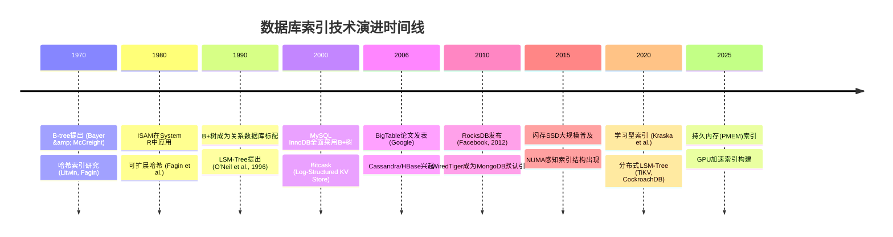

# 索引技术演进：从线性扫描到智能索引

索引技术的发展史，本质上是一部**用空间换时间**的工程演进史。从最早的顺序文件扫描，到B+树成为关系数据库的标配，再到LSM-Tree统治写密集型场景，每一次范式转移的背后都是硬件特性变化与新型工作负载需求的共同驱动。理解这条演进脉络，不仅能帮助我们做出正确的索引选型决策，更能让我们预见未来的发展方向。

## 演进全景图

## 第一阶段：线性扫描与简单索引（1960s–1970s）

### 顺序文件与全表扫描

最早的数据库系统（如IBM的IMS层次数据库）使用简单的顺序文件存储数据。查询时从头到尾逐条扫描记录，时间复杂度为O(n)。这种方式在数据量较小时尚可接受，但当记录数超过磁盘页面缓存能力后，每条查询都需要完整的磁盘扫描，性能急剧恶化。

一个100万条记录、每条1KB的表，顺序扫描需要读取约1GB数据。以机械硬盘100MB/s的顺序读速度计算，单次查询耗时约10秒——这在交互式应用中是完全不可接受的。

### ISAM：第一个实用的索引结构

ISAM（Indexed Sequential Access Method）由IBM在1960年代末开发，是最早被大规模使用的索引技术。ISAM的核心思想是：

- **主数据区**：数据按键值顺序存储在磁盘上
- **多级索引**：在数据之上建立多级稀疏索引，每一级索引覆盖下一层的一个范围
- **溢出区**：当插入导致数据顺序被打破时，新记录被放入溢出区

ISAM结构示意：

┌─────────────────────────────────────────┐
│ Level 2 Index (最顶层，常驻内存)          │
│  [0-999] [1000-2999] [3000-5999] [6000+]│
└────┬──────────┬──────────┬──────────────┘
     │          │          │
┌────▼────┐ ┌──▼──────┐ ┌─▼─────────┐
│ Level 1 │ │ Level 1 │ │ Level 1   │
│ Index   │ │ Index   │ │ Index     │
└────┬────┘ └────┬────┘ └─────┬─────┘
     │           │            │
┌────▼───────────▼────────────▼─────────┐
│           Data Pages (顺序存储)        │
│  [0,1,2,...,99] [100,101,...]  ...     │
└───────────────────────────────────────┘
│ Overflow Pages (处理插入冲突)          │
└───────────────────────────────────────┘

ISAM的查询性能取决于索引级数。对于3级索引的100万条记录，一次查找只需3次磁盘I/O（读取每级索引各一次）加1次数据页读取，共4次I/O。

**ISAM的致命缺陷**在于不支持高效的原地更新。插入操作可能产生溢出链，随着溢出链的增长，查询性能退化为接近顺序扫描。删除操作需要特殊标记，不能回收空间。这意味着ISAM适合**只读或追加写入**的工作负载，但不适合频繁更新的OLTP场景。这个缺陷直接推动了B-tree家族的诞生。

## 第二阶段：B-tree家族的崛起（1970s–1990s）

### B-tree：自平衡多路搜索树的突破

1970年，Rudolf Bayer和Edward McCreight在波音研究实验室提出了B-tree。B-tree相比ISAM的革命性突破在于：**通过节点的分裂和合并，自动保持树的平衡**，从而避免了ISAM中溢出链导致的性能退化。

B-tree的核心性质：

B-tree节点结构：
┌──────────────────────────────────────────┐
│ P0 │ K1 │ P1 │ K2 │ P2 │ K3 │ P3 │ ...  │
└──────────────────────────────────────────┘
  指针  键   指针  键   指针  键   指针

性质约束（m阶B-tree）：
- 每个节点最多m个子节点
- 非根节点至少⌈m/2⌉个子节点
- 所有叶子节点在同一层
- 一个有k个子节点的非叶子节点包含k-1个键值

B-tree在数据库领域取得成功的关键因素：

| 因素 | 说明 |
|------|------|
| **高扇出** | 每个节点存储数百个键值，树高极低（10亿记录仅需4层） |
| **平衡性保证** | 所有查询路径长度相同，最坏情况下的性能可预测 |
| **原地更新** | 插入/删除通过分裂/合并完成，不需要移动大量数据 |
| **范围查询** | 叶子节点链表支持高效的顺序遍历 |
| **磁盘友好** | 节点大小与磁盘页对齐，每次访问读取一个完整页 |

### B+树：实用化的关键改进

B-tree最初发表后很快被发现有一个效率问题：非叶子节点也存储数据记录，浪费了宝贵的节点空间。1972年，Douglas Comer提出了B+树，做出了两个关键改进：

**改进一：数据集中在叶子节点。** 非叶子节点只存储键值和子节点指针，不存储实际数据。这使得非叶子节点可以容纳更多键值，扇出更高，树高更低。

**改进二：叶子节点链表串联。** 叶子节点通过双向链表连接，支持高效的范围扫描和ORDER BY操作。这个改进让B+树天然适合关系数据库的查询模式。

B+树结构示意：

            ┌──────────────┐
            │  [20]  [40]  │     Root (非叶子)
            └──┬───────┬───┘
        ┌──────┘       └──────┐
   ┌────▼────┐           ┌────▼────┐
   │ [10][20]│           │ [30][40]│     Internal
   └──┬──┬───┘           └──┬──┬───┘
   ┌──┘  └──┐           ┌──┘  └──┐
 ┌─▼─┐ ┌─▼─┐ ┌─▼─┐ ┌─▼─┐ ┌─▼─┐ ┌─▼─┐
 │1-9│ │10-19│ │20-29│ │30-39│ │40-49│ │50+│  Leaves
 └─┬─┘ └──┬─┘ └──┬─┘ └──┬─┘ └──┬─┘ └─┬─┘
   └───────┴──────┴──────┴──────┴──────┘
              Leaf Linked List (双向链表)

**性能对比数据：**

| 指标 | ISAM | B-tree | B+tree |
|------|------|--------|--------|
| 点查询 I/O | 4次（3级索引+1数据页） | 4次（树高相同） | 4次（树高更低，可到3次） |
| 范围查询 | 需要回到数据区定位 | 需要在叶子间跳跃 | 叶子链表直接遍历，效率最高 |
| 插入导致退化 | 溢出链增长，性能下降 | 分裂保持平衡 | 分裂保持平衡 |
| 空间利用率 | 有溢出区浪费 | 节点中键值+数据，空间紧张 | 节点仅键值，扇出更高 |

### B+树在工业界的统治

1980年代，IBM的System R（关系数据库的开山之作）采用了改进的B-tree索引。此后，几乎所有关系数据库都转向了B+树：

- **Oracle**：从版本2开始使用B-tree索引，至今仍是默认索引类型
- **PostgreSQL**：B+tree是其最常用的索引类型，采用WAL（Write-Ahead Logging）保证并发安全
- **MySQL/InnoDB**：InnoDB引擎使用B+tree作为聚簇索引和二级索引的基础结构
- **SQL Server**：B+tree + 行级锁 + 版本化，支持高并发OLTP

B+树统治关系数据库长达30多年，其成功的核心原因是**完美匹配了关系模型的查询模式**：精确匹配、范围查询、排序、连接操作都能高效支持。直到NoSQL运动和写密集型工作负载的兴起，才催生了新的索引范式。

## 第三阶段：哈希索引的探索（1980s–2000s）

### 静态哈希与动态哈希

哈希索引的动机很直接：**对于等值查询（WHERE key = value），哈希表提供O(1)的常数时间访问**，比B+树的O(log n)更快。1980年代，多种动态哈希方案被提出：

**可扩展哈希（Extendible Hashing，Fagin et al., 1979）**

全局深度 = 3，目录大小 = 8

目录索引（使用键的低3位）：
┌─────┬─────┬─────┬─────┬─────┬─────┬─────┬─────┐
│ 000 │ 001 │ 010 │ 011 │ 100 │ 101 │ 110 │ 111 │
└──┬──┴──┬──┴──┬──┴──┬──┴──┬──┴──┬──┴──┬──┴──┬──┘
   │     │     │     │     │     │     │     │
   ▼     ▼     ▼     ▼     ▼     ▼     ▼     ▼
 ┌───┐ ┌───┐ ┌───┐ ┌───┐ ┌───┐ ┌───┐ ┌───┐ ┌───┐
 │B1 │ │B2 │ │B1 │ │B3 │ │B4 │ │B2 │ │B3 │ │B4 │  桶
 │l=2│ │l=3│ │l=2│ │l=3│ │l=3│ │l=3│ │l=3│ │l=3│
 └───┘ └───┘ └───┘ └───┘ └───┘ └───┘ └───┘ └───┘

特点：多个目录条目可以指向同一个桶（当桶的本地深度 < 全局深度时）
分裂时只需更新目录指针，不需要移动其他桶

**线性哈希（Linear Hashing，Litwin, 1980）**

不需要目录，按顺序分裂桶：

Round 0（初始）：
  桶0: [a1, a2]  ← 溢出页
  桶1: [b1]
  桶2: [c1, c2]
  桶3: [d1]

Round 1（桶0分裂）：
  桶0: [a1]      (h0哈希)
  桶4: [a2]      (h1哈希，新桶)
  桶1: [b1]
  桶2: [c1, c2]
  桶3: [d1]

Round 2（桶1分裂）：
  桶0: [a1]
  桶4: [a2]
  桶1: [b1]      (h0哈希)
  桶5: []        (h1哈希，新桶)
  桶2: [c1, c2]
  桶3: [d1]

### 哈希索引的局限

尽管哈希索引在等值查询上性能卓越，但它有几个根本性的限制：

1. **不支持范围查询**：哈希函数破坏了键的顺序，无法像B+树那样通过叶子链表高效扫描范围
2. **不支持排序**：ORDER BY操作无法利用哈希索引
3. **哈希冲突**：随着数据量增长，冲突链变长，性能退化
4. **扩容开销**：可扩展哈希需要目录翻倍操作，线性哈希需要逐步rehash，都会带来临时的性能波动
5. **不支持前缀匹配**：LIKE 'prefix%'无法利用哈希索引

由于这些限制，哈希索引在通用关系数据库中始终是**补充性索引**而非主索引。但在特定场景下（如内存数据库、KV存储），哈希索引仍是最佳选择。PostgreSQL从9.6版本开始支持Hash索引，但仅推荐用于等值查询频繁且不需要范围查询的场景。

## 第四阶段：LSM-Tree与写优化索引（1990s–2010s）

### LSM-Tree的诞生背景

1996年，Patrick O'Neil等人在论文*"The Log-Structured Merge-Tree (LSM-Tree)"*中提出了LSM-Tree。其动机来自一个关键观察：**在写密集型工作负载下，B+树的随机写入是性能瓶颈**。

B+树的写入路径：每次插入需要定位到正确的叶子节点（随机I/O），然后修改节点内容并写回磁盘（随机I/O）。即使有Buffer Pool缓存，高并发写入仍然会产生大量随机磁盘I/O。

LSM-Tree的核心思想：**将随机写转换为顺序写**。所有写入先进入内存中的有序结构（MemTable），达到一定大小后整体刷写为磁盘上的有序文件（SSTable），再通过后台的合并操作（Compaction）逐步整合。

LSM-Tree写入路径：

    写请求
      │
      ▼
 ┌─────────┐    ┌─────────┐
 │  WAL    │    │ MemTable │  ← 内存（跳表/红黑树）
 │ (顺序写) │───▶│ (有序)   │
 └─────────┘    └────┬────┘
                     │ 满了
                     ▼
              ┌─────────────┐
              │  Level 0     │  ← SSTable（磁盘有序文件）
              │  SSTable     │
              └──────┬──────┘
                     │ Compaction
                     ▼
              ┌─────────────┐
              │  Level 1     │  ← 合并后的SSTable
              │  SSTable     │
              └──────┬──────┘
                     │ Compaction
                     ▼
              ┌─────────────┐
              │  Level N     │  ← 最大层级
              │  SSTable     │
              └─────────────┘

### LSM-Tree的工业实现演进

LSM-Tree从理论走向工业应用经历了多个阶段：

| 时期 | 系统 | 关键创新 |
|------|------|----------|
| 1996 | 原始论文 | 提出MemTable + SSTable + Compaction的基本框架 |
| 2006 | Google BigTable | 分布式LSM-Tree，GFS存储，Column Family |
| 2007 | LevelDB (Google) | Leveled Compaction，降低读放大 |
| 2012 | RocksDB (Facebook) | LevelDB + 后台优化、列族、压缩、Merge Operator |
| 2013 | Cassandra | Size-Tiered + 可选Leveled，可调一致性 |
| 2016 | CockroachDB | 基于RocksDB的分布式KV存储 |
| 2017 | TiKV | 基于RocksDB的分布式KV，Raft一致性 |

### Compaction策略的演进

Compaction是LSM-Tree最核心也最复杂的机制，其策略选择直接决定了读写性能的权衡：

**Size-Tiered Compaction（STCS，尺寸分层）**

触发条件：当同一层的SSTable数量达到阈值T时触发合并

Level i:
  [SST1] [SST2] [SST3] [SST4]  ← 4个SSTable合并
       ↓ Compaction
  [  Large SSTable  ]          ← 写入Level i+1

优点：写放大低（每个SSTable只被合并一次）
缺点：读放大高（最坏情况需要检查每层的所有SSTable）
适用：写密集、读较少的场景（如日志存储、时序数据库）

**Leveled Compaction（LCS，分层合并）**

触发条件：当Level i的数据量超过阈值时，选择一个SSTable与Level i+1合并

Level i:   [SST_a]
Level i+1: [SST_1] [SST_2] [SST_3] [SST_4] [SST_5]
                 ↓ Compaction (SST_a与Level i+1中键范围重叠的SSTable合并)
Level i+1: [SST_1'] [SST_2'] [SST_3'] [SST_4'] [SST_5']

优点：读放大低（每层最多一个SSTable的键范围与查询重叠）
缺点：写放大高（一个SSTable在每层都可能被重写一次）
适用：读多写少的场景（如用户数据存储、缓存）

**两大策略的性能对比：**

| 指标 | Size-Tiered | Leveled |
|------|-------------|---------|
| 写放大 | 低（~4x） | 高（~10-30x） |
| 读放大 | 高（需检查每层多个文件） | 低（每层最多一个文件） |
| 空间放大 | 中（临时需要额外空间） | 低（无重叠文件） |
| 磁盘带宽 | 写入友好 | 读取友好 |
| 典型用户 | Cassandra（默认） | LevelDB/RocksDB（默认） |

RocksDB在2014年还引入了**Universal Compaction**策略，类似于Size-Tiered但有更灵活的触发条件，适合需要在写放大和空间放大之间做精细权衡的场景。

## 第五阶段：倒排索引与全文检索（1990s–2010s）

### 从数据库索引到搜索引擎索引

倒排索引（Inverted Index）与B+树、LSM-Tree属于不同的索引范式。B+树和LSM-Tree是**键值索引**，以某个字段的值为键查找记录；而倒排索引是**内容索引**，以文档中的词语为键查找包含该词的文档列表。

倒排索引的演进与互联网搜索的发展紧密相关：

倒排索引基本结构：

词典（Dictionary）            倒排列表（Posting Lists）
┌──────────┐                ┌──────────────────────┐
│ "database" │──────────▶   │ Doc1(词频=3, 位置=[2,5,8])  │
│ "index"    │──────────▶   │ Doc2(词频=1, 位置=[7])      │
│ "query"    │──────────▶   │ Doc1(词频=2, 位置=[1,12])   │
│            │              │ Doc3(词频=4, 位置=[3,6,9,15])│
└──────────┘                │ Doc5(词频=1, 位置=[20])      │
                            └──────────────────────┘

### Posting List压缩技术的演进

随着文档规模从百万增长到十亿级别，Posting List的存储和查询效率成为核心挑战。压缩技术的演进如下：

**变长整数编码（VByte/Varint）**

编码规则：每个字节的最高位为标志位（1=后续还有字节，0=最后一个字节）

数值 7    → [00000111]           1字节
数值 300  → [01001011] [00000010]  2字节（300 = 2 + 37*8）
数值 1000 → [11110000] [00000111]  2字节

优点：实现简单，解码速度快
缺点：压缩比有限，对大数值编码效率低
应用：Lucene早期版本、倒排索引基础压缩

**PForDelta（Patched Frame-of-Reference Delta）**

核心思想：对一组整数使用统一的位宽编码，少数超出的值单独处理

原始Posting List: [100, 105, 107, 112, 500, 115, 118]
Delta编码:        [100, 5, 2, 5, 388, -385, 3]
分组（每4个一组）:
  组1: [100, 5, 2, 5]    → 最大值100，用7位编码即可
  组2: [388, -385, 3, ?]  → 最大值388，需要9位编码

Patch位图标记异常值位置，单独存储

**Roaring Bitmap（2016年）**

Roaring Bitmap是现代倒排索引中最重要的压缩技术之一，由Lemire等人提出。它将32位整数空间分为65536个容器（container），每个容器存储一个子范围内的整数：

Roaring Bitmap结构：

键空间按高16位分组：
┌──────────────────────────────────────────┐
│ Container 0: [0x0000 - 0xFFFF]          │
│   → ArrayContainer (稀疏，元素<4096时)   │
│     存储排序数组: [1, 5, 12, 100, 4567]  │
├──────────────────────────────────────────┤
│ Container 1: [0x10000 - 0x1FFFF]        │
│   → BitmapContainer (密集，≥4096时)      │
│     位图: 00010001000000010...           │
├──────────────────────────────────────────┤
│ Container 2: [0x20000 - 0x2FFFF]        │
│   → RunContainer (连续区间)              │
│     游程编码: [(start=100, length=50)]   │
└──────────────────────────────────────────┘

优势：
- 稀疏数据用数组（空间效率高）
- 密集数据用位图（操作效率高）
- 连续区间用游程编码（压缩比高）
- 集合运算（交集、并集）可利用CPU SIMD指令加速

Roaring Bitmap被广泛应用于Elasticsearch、Apache Lucene、ClickHouse等系统中，是现代搜索引擎的标配技术。

## 第六阶段：特殊索引结构（2000s–2010s）

### PostgreSQL的通用索引框架

1995年，Hellerstein等人发表了*"Generalized Search Trees for Database Systems"*，提出了GiST（Generalized Search Tree）框架。GiST的核心创新是**将B+树的节点分裂、合并逻辑抽象为可插入的策略接口**，使同一棵树框架可以支持多种数据类型和查询操作：

GiST框架：

┌─────────────────────────────────┐
│           GiST Tree             │
│  （与B+树类似的平衡树结构）       │
└─────────────────────────────────┘
          │
    ┌─────┴─────┐
    │ 可插入策略  │
    └─────┬─────┘
          │
  ┌───────┼───────┬────────┬────────┐
  ▼       ▼       ▼        ▼        ▼
R-tree  KNN     区间树   全文检索   地理索引
(空间)  (最近邻) (时间)   (文本)    (GIS)

基于GiST框架，PostgreSQL发展出了多种索引类型：

| 索引类型 | 提出时间 | 适用场景 | 核心数据结构 |
|----------|----------|----------|-------------|
| GiST | 1995 | 多维数据、范围、全文 | 可扩展搜索树 |
| SP-GiST | 2010 | 非均匀分布数据 | 空间分区树（Quad-tree、KD-tree、Trie） |
| GIN | 2008 | 多值类型、全文检索 | 倒排索引 |
| BRIN | 2016 | 物理有序的大表 | 块范围索引（最小/最大值） |

**BRIN（Block Range Index）** 是PostgreSQL 9.5引入的创新索引类型。它不对每个键值建立索引，而是对物理存储的连续块范围记录最小值和最大值：

BRIN工作原理：

表数据（按物理存储顺序）：
Block 0:  [日期=2024-01-01 到 2024-01-03]  → min=01-01, max=01-03
Block 1:  [日期=2024-01-03 到 2024-01-05]  → min=01-03, max=01-05
Block 2:  [日期=2024-01-05 到 2024-01-08]  → min=01-05, max=01-08
Block 3:  [日期=2024-01-08 到 2024-01-10]  → min=01-08, max=01-10

查询 WHERE date = '2024-01-06':
1. 检查BRIN索引 → Block 2的min=01-05, max=01-08 → 可能包含目标
2. 扫描Block 2 → 找到记录

对比B+树：
- B+树索引大小：约数据量的20-30%
- BRIN索引大小：约数据量的0.01-0.05%
- 适用条件：数据在物理存储上与索引键有自然的相关性

### R-tree与空间索引

R-tree由Antonin Guttman在1984年提出，用于处理多维空间数据。R-tree使用最小边界矩形（MBR）来组织空间对象：

R-tree层级结构：

Level 2 (根):
  MBR_R1: ┌────────────────────┐
          │  ┌──┐  ┌──────┐   │
          │  │  │  │ MBR_R2│   │
          │  │  │  └──────┘   │
          │  └──┘             │
          └────────────────────┘

Level 1:
  MBR_R1: ┌──────────────┐    MBR_R2: ┌────────────┐
          │  ┌──┐ ┌──┐  │            │ ┌────┐    │
          │  │A │ │B │  │            │ │C   │    │
          │  └──┘ └──┘  │            │ └────┘    │
          └──────────────┘            └────────────┘

Level 0 (叶子):
  [A: (1,2)-(4,5)]  [B: (3,1)-(6,4)]  [C: (7,3)-(10,6)]

空间查询（如"找到与矩形(2,2)-(5,5)相交的所有对象"）：
1. 从根节点开始，检查哪些MBR与查询矩形相交
2. 递归进入相交的子节点
3. 在叶子节点中精确检查每个对象

R-tree在GIS系统（如PostGIS、Oracle Spatial）、多媒体数据库、游戏引擎中广泛使用。其后续变体包括R*-tree（优化分裂策略）、R+-tree（避免重叠）、Hilbert R-tree（使用Hilbert曲线优化排序）。

## 第七阶段：硬件驱动的新范式（2010s–至今）

### 闪存SSD对索引设计的影响

SSD的大规模普及从根本上改变了索引的I/O特性：

| 特性 | 机械硬盘 (HDD) | 固态硬盘 (SSD) |
|------|---------------|----------------|
| 顺序读速度 | 100-200 MB/s | 500-3500 MB/s |
| 随机读延迟 | 5-10 ms | 0.05-0.1 ms |
| 随机写延迟 | 5-10 ms | 0.1-0.5 ms |
| 顺序写/随机写比 | 100x差距 | 2-5x差距 |
| 随机读/顺序读比 | 1000x差距 | 接近1x |

SSD消除了HDD上随机I/O的严重惩罚，使得一些在HDD时代不可行的设计变得可行：

1. **小型B+树节点**：HDD时代为了减少I/O次数，节点通常设为磁盘页大小（4-16KB）。SSD上可以使用更小的节点（如512B-2KB），提高缓存命中率
2. **哈希索引复兴**：哈希索引在HDD上因为范围查询性能差而受限，SSD上随机读几乎和顺序读一样快，哈希索引的O(1)等值查询优势更加明显
3. **WAL的简化**：LSM-Tree依赖WAL来保证崩溃一致性，SSD的快速随机写使得WAL写入代价降低

### 持久内存（PMEM）与索引重构

Intel Optane持久内存（PMEM）的出现催生了全新的索引设计理念。PMEM的特性介于DRAM和SSD之间：

延迟对比（纳秒级）：

DRAM:     ████ 80ns
PMEM:     ████████ 300ns (直接访问模式)
SSD:      ████████████████████████████████████ 10,000ns
HDD:      ██████████████████████████████████████████████████████████████████████████ 10,000,000ns

PMEM索引的典型设计：

- **CCEF Tree（Concurrent and Consistent Enhanced Fermi Tree）**：专门为PMEM设计的B+树变体，利用PMEM的字节可寻址特性，避免了传统B+树的页面对齐开销
- **bwTree（Bw-Tree）**：微软SQL Server Hekaton引擎使用，基于CAS（Compare-And-Swap）操作实现无锁并发，适合PMEM
- **FD-tree（Flash-Disk Tree）**：结合了B+树和LSM-Tree的优势，用多级结构减少PMEM上的写放大

### NUMA感知索引

在多路服务器上，内存访问延迟取决于数据所在NUMA节点与访问线程所在CPU的距离：

NUMA架构示意：

┌──────────────┐     ┌──────────────┐
│   NUMA 0     │     │   NUMA 1     │
│ ┌──────────┐ │     │ ┌──────────┐ │
│ │ CPU 0-15 │ │     │ │CPU 16-31 │ │
│ └──────────┘ │     │ └──────────┘ │
│ ┌──────────┐ │     │ ┌──────────┐ │
│ │ 本地内存  │ │     │ │ 本地内存  │ │
│ │ 80ns     │◄├─────┤►│ 80ns     │ │
│ └──────────┘ │     │ └──────────┘ │
│    跨节点访问：150ns                │
└──────────────┘     └──────────────┘

传统B+树在NUMA环境下的问题：树的根节点通常在NUMA节点0的内存中，所有线程访问根节点都需要跨节点访问，造成延迟增加和互联带宽饱和。

解决方案包括：
- **NUMA-aware B-tree**：将树的不同子树分配到不同NUMA节点，让线程尽量访问本地内存中的子树
- **分布式B-tree**：每个NUMA节点维护自己的B-tree，通过消息传递同步，类似分布式系统的做法
- **分区哈希索引**：将哈希表按NUMA节点分区，减少跨节点访问

## 第八阶段：学习型索引与未来方向（2018–未来）

### 学习型索引（Learned Index）

2018年，Tim Kraska等人在MIT发表了开创性论文*"The Case for Learned Index Structures"*。核心思想是：**用机器学习模型替代传统的索引数据结构**。

传统B+树 vs 学习型索引：

B+树查询过程：
  root → 内部节点 → 内部节点 → 叶子节点 → 数据位置
  （4次内存/磁盘访问，每次做二分查找）

学习型索引查询过程：
  输入键值 → CDF模型（神经网络/线性回归） → 预测数据位置
  （1次模型推理 + 1-2次验证）

核心假设：
  键值在数据文件中的分布是有规律的（CDF是单调递增的）
  一个足够小的模型可以学会这个CDF
  模型的输入是键值，输出是数据在文件中的位置（或百分位）

**CDF模型的工作原理：**

累积分布函数 (CDF):

数据文件中的键值分布：
  [1, 3, 5, 7, 10, 12, 15, 20, 25, 30, ...]

CDF模型:
  输入: key
  输出: position = f(key) ≈ count(key < 目标键) / total_count × file_size

查询 key=12:
  B+树:  4次节点访问（树高=4）
  CDF:   f(12) → position ≈ 60% → 1次模型推理 + 1次局部搜索验证

学习型索引的后续发展：

| 时间 | 研究 | 贡献 |
|------|------|------|
| 2018 | ALEX (MIT) | 自适应学习索引，处理偏斜分布 |
| 2019 | PGM-Index | 分段线性模型，理论最优空间 |
| 2020 | LIPS | 缓存友好的学习索引，利用B-tree节点缓存 |
| 2021 | FITing-Tree | 分段线性拟合 + B-tree回退 |
| 2022 | MILC | 考虑I/O成本的学习索引 |

**学习型索引的现状评估：**

学习型索引在以下场景已展示出实用价值：
- **只读或读多写少**的工作负载（如数据仓库、分析型查询）
- **键值分布稳定**的场景（不需要频繁重建模型）
- **空间受限**的场景（模型比B+树更紧凑）

但学习型索引在以下方面仍面临挑战：
- **更新成本高**：数据变化时需要重新训练模型或维护额外的增量结构
- **尾延迟不可预测**：模型预测错误时需要回退到全表扫描，最坏情况性能差
- **工程复杂度**：在生产环境中与现有存储引擎集成仍然困难

截至2025年，学习型索引尚未在主流数据库系统中大规模部署，但其思想已被用于优化现有索引的**内部结构**（如用学习型模型替代B+树节点内的二分查找）。

### 向量索引：AI时代的新型索引

随着大语言模型和向量检索的兴起，向量索引成为近5年最热门的索引研究方向。向量索引的核心挑战是：在高维空间（768-4096维）中高效找到最近邻。

向量索引技术演进：

暴力搜索 (Brute Force)
  │ 时间复杂度 O(n×d)，精确但慢
  ▼
IVF (Inverted File Index)
  │ 聚类分桶 + 桶内暴力搜索
  │ 时间复杂度 O(n/k × d)，k为桶数
  ▼
HNSW (Hierarchical Navigable Small World)
  │ 多层图结构，逐层逼近
  │ 时间复杂度 O(log n)，支持动态更新
  ▼
产品量化 (Product Quantization)
  │ 向量压缩 + 码本查找
  │ 空间效率高，适合内存受限场景
  ▼
混合方案 (DiskANN, Faiss-GPU)
  │ SSD存储 + GPU加速 + 图索引
  │ 支持十亿级向量检索

主要向量索引框架对比：

| 框架 | 索引类型 | 支持规模 | 特点 |
|------|----------|----------|------|
| Faiss (Meta) | IVF/HNSW/PQ | 10亿+ | 最成熟，GPU加速 |
| Milvus | IVF/HNSW | 100亿+ | 分布式，云原生 |
| Pinecone | 专有 | 10亿+ | 托管服务，易用 |
| Weaviate | HNSW | 10亿+ | 向量+属性混合查询 |
| Qdrant | HNSW | 10亿+ | Rust实现，性能优秀 |

## 演进趋势总结

索引技术演进的核心驱动力：

┌────────────────────────────────────────────────────┐
│                  驱动力分析                         │
├──────────────┬──────────────┬──────────────────────┤
│   硬件变化    │   负载变化    │   应用需求变化       │
├──────────────┼──────────────┼──────────────────────┤
│ HDD → SSD    │ OLAP兴起     │ 实时分析             │
│ DRAM增大     │ 写密集场景   │ 全文检索             │
│ PMEM出现     │ 向量搜索     │ AI/ML特征检索        │
│ GPU普及      │ 分布式查询   │ 地理空间             │
│ 多核NUMA     │ 多模数据     │ 时序数据             │
└──────────────┴──────────────┴──────────────────────┘

### 五大演进趋势

**趋势一：从单一结构到混合架构**

现代数据库系统不再使用单一的索引结构，而是根据工作负载特征组合使用：

PostgreSQL索引体系：
├── B+tree（默认，通用场景）
├── Hash（等值查询优化）
├── GiST（空间/范围）
├── GIN（全文/多值）
├── SP-GiST（非均匀分布）
├── BRIN（物理有序大表）
└── pgvector（向量检索）

MySQL 8.0引入了不可见索引、降序索引、函数索引等功能，InnoDB引擎同时维护聚簇索引（B+tree）和二级索引（B+tree），并用Change Buffer优化非唯一索引的写入。

**趋势二：从单机到分布式**

分布式索引架构演进：

单机B+树
  │
  ├── Range分区：按键值范围分片到不同节点
  │     例：TiDB的Region分裂
  │
  ├── Hash分区：按哈希值分片到不同节点
  │     例：Cassandra的Token Ring
  │
  └── LSM-Tree分布式化
        例：RocksDB → TiKV → TiDB
            LevelDB → Spanner

**趋势三：从通用到专用**

不同应用场景催生了专用的索引结构：

| 应用场景 | 专用索引 | 核心优化 |
|----------|----------|----------|
| 时序数据库 | TSM (InfluxDB)、时间分片 | 时间范围压缩、自动过期 |
| 图数据库 | 邻接表、边索引 | 图遍历优化 |
| 向量数据库 | HNSW、IVF | 高维近似最近邻 |
| 流处理 | 时间窗口索引 | 滑动窗口查询优化 |
| 地理空间 | R-tree、Geohash、S2 | 多维范围查询 |

**趋势四：从确定性到概率性**

传统索引提供精确查询结果，新型索引开始接受近似结果以换取性能提升：

- **Bloom Filter**：LSM-Tree用Bloom Filter快速判断键值是否存在于SSTable中，允许假阳性但不允许假阴性
- **Count-Min Sketch**：估计键值的频率，用于查询优化器的基数估计
- **近似最近邻（ANN）**：向量索引（HNSW、IVF）返回近似最近邻，牺牲少量精度换取数量级的性能提升

**趋势五：从手动设计到自动优化**

索引设计正从DBA的手动经验转向自动化：

- **自动索引推荐**：Amazon Aurora、Azure SQL Database等云数据库提供自动索引建议
- **自适应索引**：SQL Server的"Adaptive Index Defragmentation"自动维护索引碎片
- **在线索引调整**：部分数据库支持在不锁表的情况下创建或删除索引
- **AI辅助索引**：利用查询日志和机器学习自动识别需要索引的列和组合

## 索引选型决策指南

面对如此多的索引技术，如何做出正确的选型决策？以下是一个实用的决策框架：

索引选型决策树：

工作负载类型是什么？
├── OLTP（高并发点查询 + 短事务）
│   ├── 等值查询为主？ → Hash索引 / B+树
│   ├── 范围查询为主？ → B+tree
│   └── 写入极密集？   → LSM-Tree（如RocksDB）
│
├── OLAP（分析型查询 + 大范围扫描）
│   ├── 列式存储？ → 位图索引 / 列存索引
│   ├── 物理有序？ → BRIN
│   └── 多维分析？ → R-tree / GiST
│
├── 全文检索
│   ├── 简单关键词？ → 倒排索引（Elasticsearch）
│   ├── 语义搜索？   → 向量索引（HNSW）
│   └── 混合查询？   → 倒排索引 + 向量索引
│
└── 特殊场景
    ├── 地理空间 → R-tree / PostGIS
    ├── 时序数据 → 时间分片索引
    ├── 图遍历   → 邻接表 / 边索引
    └── 高维向量 → HNSW / IVF-PQ

## 本节要点回顾

索引技术的演进遵循几个核心规律：

1. **硬件决定边界**：HDD时代B+树通过减少随机I/O占据统治地位；SSD消除了随机I/O惩罚，让哈希索引和LSM-Tree有了更多用武之地；PMEM和GPU正在催生全新的索引设计

2. **写放大-读放大-空间放大三角权衡**：几乎所有索引结构都在这三个维度之间做取舍。B+树读放大低但写放大高；LSM-Tree写放大低但读放大高；学习型索引空间效率高但更新成本高

3. **通用走向专用**：从B+树一统天下，到不同场景使用不同索引结构（LSM-Tree用于写密集、哈希用于等值、倒排用于全文、向量用于AI），索引生态越来越多元化

4. **自动化是方向**：从DBA手动设计索引，到云数据库自动推荐索引，再到AI驱动的自适应索引优化，索引管理正变得越来越智能
