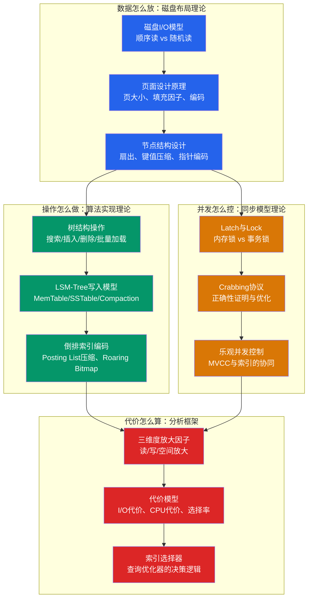
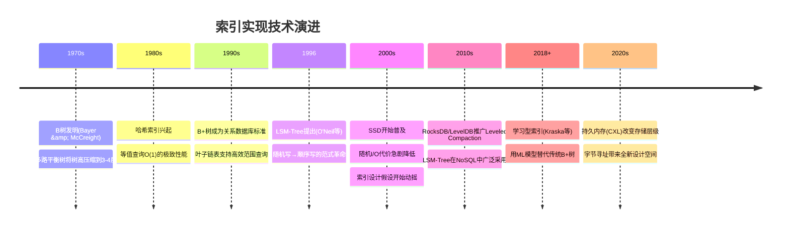

# 索引实现：理论基础

索引是数据库系统中最核心的性能引擎。第10章"索引结构"从抽象数据结构的角度介绍了B+树、哈希表、LSM-Tree等索引的基本概念和理论性质。但当我们将一个索引结构从论文搬到生产系统时，面对的是一系列截然不同的问题：一个B+树节点在磁盘上如何编码才能最大化扇出？并发操作如何保证树结构的正确性？为什么同样的索引在不同的工作负载下表现天差地别？

**本节的定位是从实现层面建立索引的理论基础**——不是"索引是什么"，而是"索引为什么这样实现"。我们将深入磁盘I/O模型、节点设计原理、并发访问模型、代价分析框架等核心理论，为后续的B+树实现、LSM-Tree Compaction策略、索引并发控制等实践内容打下坚实根基。

---

## 为什么实现层面的理论很重要

很多开发者对索引的理解停留在"创建索引可以加速查询"的层面。但在实际的数据库内核开发和深度性能优化中，缺乏实现层面的理论基础会导致严重的问题：

| 问题场景 | 缺乏理论基础的表现 | 理论支撑的解决方案 |
|----------|-------------------|-------------------|
| B+树节点大小选择 | 随意设定，不知道最优值 | 理解扇出-树高-I/O的数学关系，根据键值大小和页大小计算最优配置 |
| 索引并发性能差 | 不理解Latch与Lock的区别，滥用锁 | 理解Crabbing协议的正确性和乐观/悲观策略的权衡 |
| LSM-Tree写放大严重 | 盲目使用默认Compaction配置 | 理解Size-Tiered与Leveled策略的放大因子模型，按负载特征选型 |
| 索引选型困难 | 凭经验猜测，无法量化比较 | 掌握读放大/写放大/空间放大的三维度代价框架 |
| 索引维护开销大 | 不知道索引数量和结构对写入的影响 | 理解写路径中索引维护的代价模型 |
| 范围查询性能波动大 | 不理解叶子节点链表的物理布局 | 理解磁盘顺序读与随机读的性能差异，优化页面布局 |

理论不是空洞的教条——它是在面对具体实现问题时做出正确决策的依据。

---

## 知识体系全景图

索引实现的理论基础围绕四个核心问题展开：**数据怎么放**（磁盘布局）、**操作怎么做**（算法实现）、**并发怎么控**（同步模型）、**代价怎么算**（分析框架）。

---

## 本节内容详解

### 第一部分：核心概念

本篇建立索引实现的完整认知框架，涵盖三大核心理论板块。

**1. 磁盘I/O模型——索引设计的第一性原理**

所有索引实现的根源问题都是一个：**如何在磁盘I/O的约束下最大化数据访问效率**。理解磁盘I/O模型是理解一切索引设计决策的前提。

核心概念包括：

- **顺序I/O vs 随机I/O**：HDD上顺序读可达200MB/s，随机读仅150 IOPS（每I/O 4KB，有效带宽仅0.6MB/s），差距超过300倍。即使在NVMe SSD上（随机IOPS可达100万），顺序读的带宽优势仍然显著（6GB/s vs 有效随机带宽4GB/s）。这意味着索引结构的设计目标之一是**最大化顺序访问、最小化随机跳转**
- **磁盘页与块设备**：操作系统以页（通常4KB）为单位进行I/O，数据库通常使用更大的页（8KB-16KB）。索引节点的大小直接决定了每个I/O操作能获取的信息量
- **预读与缓存层次**：操作系统预读机制对顺序扫描有显著加速，但对随机访问无效。数据库的Buffer Pool进一步缓存热点页面，减少实际磁盘I/O

**2. 节点结构设计——扇出与树高的数学关系**

B+树的性能核心在于**扇出（Fanout）**：每个节点能容纳多少个键值指针对。扇出越大，树越矮，查询需要的I/O次数越少。

关键的数学关系：

树高 h = ⌈log_m(N)⌉

其中：m = 扇出（每个节点的子节点数）
      N = 记录总数

示例：N = 10亿条记录
  扇出 m=100：h = ⌈log_100(10^9)⌉ = 5 层 → 5次I/O
  扇出 m=500：h = ⌈log_500(10^9)⌉ = 4 层 → 4次I/O
  扇出 m=1000：h = ⌈log_1000(10^9)⌉ = 3 层 → 3次I/O

扇出受以下因素影响：

| 因素 | 影响机制 | 优化方向 |
|------|---------|---------|
| 页大小 | 页越大，能容纳的键值越多 | PostgreSQL默认8KB，InnoDB默认16KB |
| 键值大小 | 键值越大，每个节点能存的条目越少 | 前缀压缩、差值编码、定长键优化 |
| 指针大小 | 指针越大（如8字节64位页号），扇出越小 | 页号压缩、溢出页引用 |
| 填充因子 | 节点不一定填满（为分裂预留空间） | 通常70%-90%，可配置 |

**3. 三维度放大因子——索引代价的统一分析框架**

读放大、写放大和空间放大是评估任何索引结构的核心理论框架。这三个维度构成一个"不可能三角"——优化其中一个往往以恶化另一个为代价：

| 放大因子 | 定义 | B+树表现 | LSM-Tree表现 |
|---------|------|---------|-------------|
| **读放大** | 一次查询需要读取的磁盘页数 | 低（树高决定，通常3-4次I/O） | 高（需逐层查找，可能触发多次磁盘读取） |
| **写放大** | 一次逻辑写入实际触发的物理写入量 | 低（原地更新，写放大≈1） | 高（Compaction导致多次重写，写放大3-30倍） |
| **空间放大** | 实际占用空间与逻辑数据量的比值 | 低（约1.0-1.5倍，含碎片） | 高（多版本共存，可能达2倍以上） |

这个框架是后续所有索引选型讨论的理论基础。选择B+树还是LSM-Tree，本质上就是在读/写/空间三个维度之间做权衡。

### 第二部分：技术演进

本篇从历史视角梳理索引实现技术的演进脉络，展示每一代技术突破背后的理论驱动力。

演进的核心线索是**存储硬件的变化如何重塑索引设计的假设**：

每个阶段的关键理论突破：

| 时代 | 关键技术 | 核心理论突破 | 解决的根本问题 |
|------|---------|-------------|---------------|
| 1970s | B树 | 多路平衡搜索，高扇出降低树高 | 磁盘随机I/O极慢，需要最小化I/O次数 |
| 1980s | 哈希索引 | 哈希函数将键均匀映射到桶 | 等值查询不需要排序，O(1)是最优解 |
| 1990s | B+树 | 数据只存叶子+链表串联 | 范围查询成为核心需求 |
| 1996 | LSM-Tree | 以追加写替代原地更新 | 写密集场景下B+树写放大不可接受 |
| 2000s | SSD优化 | 重新评估随机I/O的代价模型 | 硬件变化使传统假设失效 |
| 2018 | 学习型索引 | 用模型预测数据位置，替代树遍历 | B+树节点中有大量冗余信息 |
| 2020s | 持久内存索引 | 字节寻址，绕过块设备抽象 | 传统"页"模型不再是唯一选择 |

### 第三部分：并发模型与代价分析

本篇深入两个高级理论主题：索引的并发访问控制和代价分析模型。

**并发模型**的核心问题是：如何在保证正确性的前提下，最大化索引操作的并发度？

关键理论包括：

- **Latch vs Lock的本质区别**：Latch保护内存数据结构（微秒级持有），Lock保护逻辑数据（事务级持有）。混淆两者是性能问题和正确性问题的常见根源
- **Crabbing协议的正确性**：为什么"持有父节点Latch直到确认子节点安全"是搜索操作正确性的必要条件？从图论角度证明，如果在搜索路径中间释放Latch，可能导致"悬空引用"
- **Optimistic Crabbing的性能分析**：在99.9%的情况下B+树结构不变（分裂/合并是罕见事件），乐观策略可以将搜索操作的Latch开销从O(h)降低到接近O(1)
- **写时复制（Copy-on-Write）**：PostgreSQL使用的策略——修改节点时创建新版本而非原地修改，通过版本链保证读操作的MVCC隔离

**代价分析模型**的核心问题是：数据库查询优化器如何选择最优索引？

关键理论包括：

- **选择率（Selectivity）**：`选择率 = 匹配行数 / 总行数`。选择率决定了索引扫描的代价——低选择率（如0.01%）时索引极有价值，高选择率（如50%）时全表扫描可能更优
- **I/O代价估算**：`代价 = 索引层数 + 匹配行数 × 单行I/O代价`。索引层数由树高决定，单行I/O代价取决于是否聚簇（聚簇=顺序I/O，非聚簇=随机I/O）
- **索引交叉与合并**：当查询涉及多个条件时（`WHERE a=1 AND b>5`），优化器需要评估使用哪个索引、是否做Index Merge、以及Index Nested Loop的代价

---

## 本节内容导读

本节包含两篇详细讲解文档，建议按顺序阅读：

### 第一部分：核心概念

从索引实现的三个根基理论出发：磁盘I/O模型决定了"为什么索引要这样组织数据"，节点结构设计揭示了"如何最大化每个I/O操作的信息收益"，三维度放大因子提供了"如何量化评估不同索引方案"的统一框架。这是理解所有后续实现细节的认知基础。

**适合读者**：所有学习索引实现的必读起点。即使有经验的数据库工程师，三维度放大因子的量化分析也是选型决策的必备工具。

### 第二部分：技术演进

从1970年代B树发明到2020年代学习型索引，七十年的技术演进背后是存储硬件与查询需求的持续博弈。每一个看似"过时"的技术（如哈希索引）在特定场景下仍然是最优解，理解演进脉络能帮助你在技术选型时做出更有依据的判断。

**适合读者**：希望理解"为什么"的读者。技术选型不仅需要知道"哪个更好"，更需要知道"在什么条件下哪个更好"。

---

## 阅读路径建议

                        理论基础
                    ┌────────────┐
                    │  核心概念   │ ← 从这里开始，建立全局认知
                    └─────┬──────┘
                          │
               ┌──────────┼──────────┐
               ▼          ▼          ▼
         ┌──────────┐ ┌──────────┐ ┌──────────┐
         │ 磁盘I/O  │ │ 节点设计  │ │ 放大因子  │
         │ 模型     │ │ 原理     │ │ 框架     │
         └──────────┘ └──────────┘ └──────────┘
               │          │          │
               └──────────┼──────────┘
                          ▼
                   ┌────────────┐
                   │  技术演进   │ → 理解历史选择，指导未来决策
                   └────────────┘

- **初学者**：按 01 → 02 顺序阅读，先建立理论框架，再理解演进逻辑
- **有经验的工程师**：可重点关注三维度放大因子框架和并发模型理论，直接用于实际的索引选型和性能诊断
- **架构师/技术决策者**：重点关注技术演进中的权衡分析和代价分析模型，为系统架构设计提供量化依据

---

## 与前置知识和后续章节的衔接

### 前置知识

本节假设读者已具备以下基础知识：

| 前置章节 | 需要掌握的内容 | 对本节的支撑作用 |
|---------|---------------|-----------------|
| 第4章：进程与线程 | 互斥锁、条件变量、读写锁等同步原语 | 理解索引并发控制中的Latch机制 |
| 第6章：文件系统 | 页、块、缓冲区、顺序I/O与随机I/O | 理解磁盘I/O模型对索引设计的约束 |
| 第10章：索引结构 | B+树、哈希表、LSM-Tree的基本概念和性质 | 理解索引的数据结构层面知识 |
| 第13章：关系型数据库 | 事务、ACID、Buffer Pool | 理解索引在数据库架构中的位置 |

### 后续章节衔接

理论基础为后续"核心技巧"章节奠定认知基础：

| 理论基础的概念 | 对应的核心技巧 |
|--------------|---------------|
| 磁盘I/O模型与页面设计 | B+树索引——节点的磁盘编码与页面布局实战 |
| 扇出-树高数学关系 | B+树索引——批量加载与最优配置 |
| 三维度放大因子框架 | LSM-Tree Compaction策略——根据放大因子选型 |
| Latch/Lock理论与Crabbing协议 | B+树并发控制——Crabbing的正确性与性能调优 |
| 读放大与空间放大权衡 | 聚簇索引与覆盖索引——减少I/O的实战策略 |
| 代价模型与选择率分析 | 联合索引——列顺序选择与代价估算 |

理论告诉你"为什么这样做"，技巧告诉你"具体怎么做"。先理解理论，后续的工程实践才有根基。

---

**前置知识：** 第4章（进程与线程）、第6章（文件系统与磁盘I/O）、第10章（索引结构）、第13章（关系型数据库架构）

**参考文献：**
- Database Internals (Alex Petrov, O'Reilly 2019) — 索引实现的现代权威参考
- Architecture of a Database System (Hellerstein et al., 2007) — 数据库系统架构的全景综述
- Ramakrishnan & Gehrke, *Database Management Systems* (第3版) — B+树操作算法的经典教材
- Efficient Locking for Concurrent Operations on B-Trees (Lehman & Yao, 1981) — B+树并发控制的奠基论文
- LSM-based Storage Techniques: A Survey (Luo & Carey, 2019) — LSM-Tree的全面综述
- The Case for Learned Index Structures (Kraska et al., SIGMOD 2018) — 学习型索引的开创性工作
