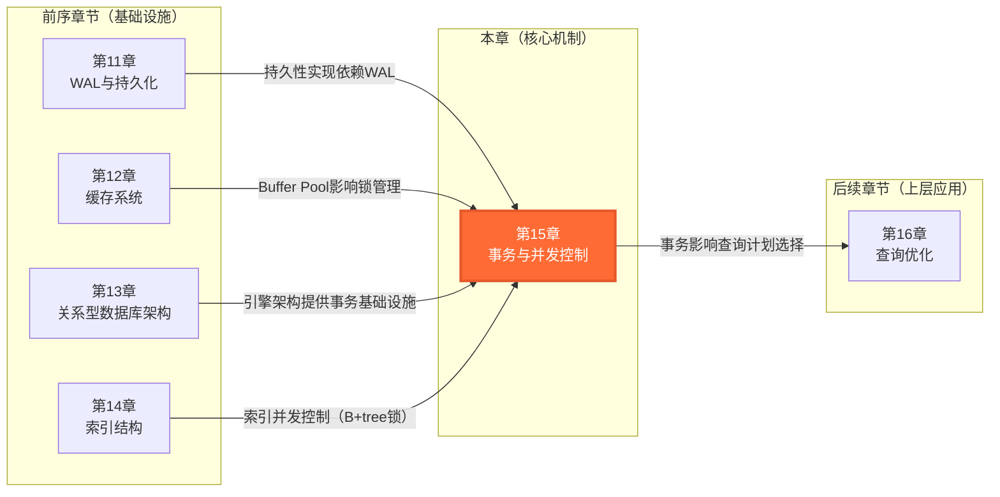
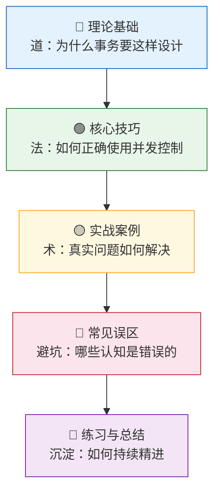
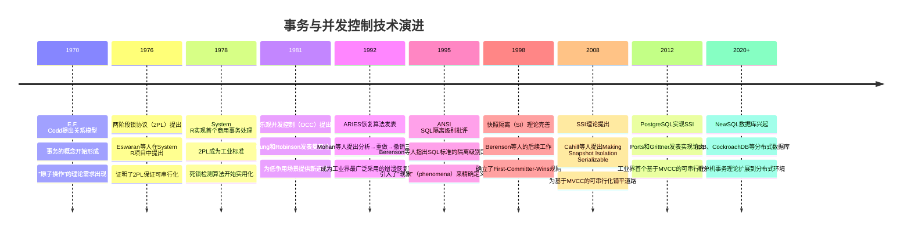

# 第15章 事务与并发控制 — 章节概览

## 为什么这一章重要

想象一个电商系统的"噩梦场景"：双十一零点，用户A点击"立即购买"，系统从库存扣减1件商品，同时用户B也在抢购同一件商品。如果系统没有正确的并发控制，可能出现两种灾难性后果：超卖（两个用户的购买都成功了，但库存只够1件）或数据不一致（库存扣减了但订单没有创建，钱扣了但货没发）。

这正是事务与并发控制要解决的核心问题：**如何让多个操作看起来像一个原子操作，同时保证高并发下的性能**。

事务（Transaction）是数据库系统中最核心的抽象之一。它将一组数据库操作封装为一个逻辑单元，保证即使在系统故障和并发访问的情况下，数据仍然保持一致性。从银行转账到电商下单，从机票预订到股票交易，几乎所有涉及数据一致性的场景都依赖事务机制。

更深层地说，事务与并发控制代表了数据库系统设计中最经典的一对矛盾：**正确性 vs 性能**。你想要绝对的数据正确性，就必须严格控制并发——加锁、串行化、牺牲并发度。你想要极致的并发性能，就必须容忍一定程度的不确定性——最终一致性、乐观重试、写偏斜异常。现代数据库系统的设计，本质上是在这对矛盾中寻找最优平衡点。

本章将从**实现者**的视角，深入讲解每种机制的算法、数据结构和工程细节。读完本章，你将理解：

- 为什么MySQL InnoDB选择MVCC+2PL的组合，而PostgreSQL走了另一条路
- 为什么REPEATABLE READ在InnoDB中能防幻读，但在SQL标准中不能
- 死锁为什么是2PL协议的"基因缺陷"，以及如何在工程中优雅地处理它
- 快照隔离为什么不能防写偏斜，SSI又是如何解决这个问题的

---

## 本章在全书中的位置

事务与并发控制在本书的知识体系中处于核心枢纽位置——它将前面学到的存储引擎、索引、WAL等组件串联起来，形成完整的数据库系统认知：



**知识关联说明：**

- **WAL与持久化（第11章）**：Redo Log是持久性的实现基础，ARIES恢复算法是本章ACID实现的核心内容。WAL协议的"日志先行"规则是理解Redo Log的关键前提。
- **缓存系统（第12章）**：Buffer Pool的管理直接影响锁的实现——锁表存储在共享内存中，MVCC的版本链遍历受Buffer Pool命中率影响。
- **关系型数据库架构（第13章）**：提供了事务管理器、锁管理器等子系统的架构框架。本章深入这些子系统的算法实现。
- **索引结构（第14章）**：B+tree的并发控制是索引层面的并发问题，与行级锁的实现密切相关。InnoDB的行锁本质上就是基于索引实现的。

---

## 学习目标

通过本章的学习，读者将达到以下能力水平：

| 层级 | 目标 | 衡量标准 |
|------|------|----------|
| **认知层** | 理解ACID特性的实现机制（不是"四个独立机制"，而是一个协作体系） | 能解释原子性由Undo Log保证、持久性由Redo Log保证、隔离性由锁+MVCC保证、一致性由三者共同保证 |
| **理解层** | 掌握2PL、MVCC、OCC等并发控制协议的算法原理 | 能画出2PL的增长/缩减阶段、MVCC的版本链遍历过程、OCC的三阶段协议 |
| **分析层** | 能诊断死锁、分析锁等待、评估隔离级别选择 | 面对一个InnoDB死锁日志，能在10分钟内定位到具体的死锁模式和根因 |
| **设计层** | 能根据业务场景选择合适的并发控制策略 | 能为电商系统的库存扣减、订单查询、报表统计分别设计事务策略 |
| **工程层** | 能实现和优化生产级的事务管理方案 | 能搭建死锁监控系统、设计乐观锁重试机制、配置合理的隔离级别 |

---

## 知识体系全景

本章按照"道→法→术→器"的层次组织，从理论原理到工程实践，层层递进：



### 完整知识树

事务与并发控制
│
├── 📘 理论基础 —— 回答"为什么事务要这样设计"
│   │
│   ├── 一、ACID特性的实现机制
│   │   ├── 原子性：Undo Log与事务回滚
│   │   │   ├── Undo Log的记录格式（事务ID, 操作类型, 表ID, 行ID, 旧值, 新值）
│   │   │   ├── Undo Log的存储结构（回滚段 + 链表）
│   │   │   ├── MySQL InnoDB的回滚段实现
│   │   │   └── PostgreSQL的替代策略（旧版本保留在原表中）
│   │   │
│   │   ├── 持久性：Redo Log与Write-Ahead Logging
│   │   │   ├── WAL协议的两条规则（日志先行 + 提交规则）
│   │   │   ├── Redo Log的记录格式（LSN, 事务ID, 操作类型, 页面号, 偏移量）
│   │   │   └── ARIES恢复算法（分析→重做→撤销三阶段）
│   │   │
│   │   ├── 隔离性：锁机制与MVCC
│   │   │   ├── 锁的基本概念（共享锁S / 排他锁X / 兼容矩阵）
│   │   │   ├── 锁管理器的实现（锁表、哈希表、请求队列）
│   │   │   └── MVCC的基本思想（多版本、快照、读写分离）
│   │   │
│   │   └── 一致性：约束检查与触发器
│   │       ├── 主键/外键/CHECK约束的实现
│   │       └── 触发器机制
│   │
│   ├── 二、两阶段锁协议（2PL）
│   │   ├── Basic 2PL（增长阶段 + 缩减阶段）
│   │   │   ├── 协议规则与伪代码实现
│   │   │   ├── 可串行化证明（优先图无环）
│   │   │   └── 级联回滚问题
│   │   ├── Strict 2PL（X锁在事务结束时释放）
│   │   │   └── 消除级联回滚
│   │   ├── Rigorous 2PL（所有锁在事务结束时释放）
│   │   │   └── 提交顺序 = 串行顺序，MySQL InnoDB采用
│   │   └── 2PL的可串行化证明
│   │
│   ├── 三、死锁处理
│   │   ├── 检测：Wait-For Graph算法
│   │   │   ├── 等待图的构建（节点=事务，边=等待关系）
│   │   │   ├── DFS环检测算法
│   │   │   ├── 检测策略（定时检测/等待超时/深度限制）
│   │   │   └── 牺牲者选择标准
│   │   ├── 预防：Wait-Die和Wound-Wait
│   │   │   ├── Wait-Die策略（老事务等待，新事务回滚）
│   │   │   ├── Wound-Wait策略（老事务抢占，新事务等待）
│   │   │   └── 两种策略的对比分析
│   │   └── 避免：银行家算法变体
│   │
│   ├── 四、MVCC理论与实现
│   │   ├── 快照隔离（Snapshot Isolation）
│   │   │   ├── 快照获取与可见性判断
│   │   │   ├── First-Committer-Wins规则
│   │   │   └── 写偏斜（Write Skew）异常
│   │   ├── 可串行化快照隔离（SSI）
│   │   │   ├── rw-antidependency的危险结构检测
│   │   │   └── PostgreSQL的SSI实现（SIREAD锁）
│   │   └── 多版本存储
│   │       ├── 版本链的组织方式（追加式 vs 原地更新）
│   │       ├── 垃圾回收（VACUUM / Purge）
│   │       └── 版本链长度对性能的影响
│   │
│   ├── 五、乐观并发控制（OCC）
│   │   ├── 三阶段协议（读取→验证→写入）
│   │   ├── 前向验证 vs 后向验证
│   │   ├── 应用层落地（版本号机制）
│   │   └── 适用场景与局限性
│   │
│   └── 六、时间戳排序协议
│       ├── 基本时间戳排序
│       ├── Thomas Write Rule（跳过过时写操作）
│       └── 多版本时间戳排序
│
├── 📗 核心技巧 —— 回答"如何正确使用并发控制"
│   ├── 技巧一：事务最佳实践
│   │   ├── 设计阶段（短事务、固定顺序、合适隔离级别）
│   │   ├── 实现阶段（索引避免锁升级、批量合并、锁等待超时）
│   │   └── 监控阶段（活跃事务、锁等待、Undo Log空间）
│   │
│   ├── 技巧二：死锁排查
│   │   ├── MySQL死锁排查（innodb_print_all_deadlocks, performance_schema）
│   │   ├── PostgreSQL死锁排查（pg_locks, pg_stat_activity, deadlock_timeout）
│   │   └── SQL Server死锁排查（Extended Events, Trace Flag 1222）
│   │
│   └── 技巧三：乐观锁实现
│       ├── MySQL version字段方案
│       ├── PostgreSQL version + RETURNING方案
│       ├── Redis WATCH + MULTI方案
│       └── 分布式系统版本号方案（雪花ID / 向量时钟）
│
├── 📙 实战案例 —— 回答"真实问题如何解决"
│   └── 案例：电商系统的并发控制设计
│       ├── 库存扣减的乐观锁 vs 悲观锁选择
│       ├── 订单查询的隔离级别配置
│       └── 死锁复现与排查实战
│
├── 📕 常见误区 —— 回答"哪些认知是错误的"
│   ├── 误区："REPEATABLE READ下不会幻读"
│   ├── 误区："MVCC完全不需要锁"
│   ├── 误区："死锁是bug"
│   ├── 误区："乐观锁适用于所有场景"
│   ├── 误区："无索引查询只影响查询速度"
│   └── 更多认知纠正...
│
└── 📓 本章小结 —— 回答"核心要点是什么"
    ├── ACID实现机制总结
    ├── 四种并发控制策略对比
    ├── MySQL InnoDB并发控制全景
    ├── 进阶学习路径与推荐资源
    └── 思考题（基础/应用/深度三层）

---

## 从一个真实问题说起

假设你在维护一个电商系统，数据库是MySQL。某天下午3点，监控告警显示大量用户反馈"下单失败"。你查看错误日志，发现大量事务被回滚：

ERROR 1213 (40001): Deadlock found when trying to get lock;
try restarting transaction

如果你只懂SQL语法，你能做的可能就是：

1. 试试加大锁等待超时时间？
2. 试试重试几次？
3. 试试把所有UPDATE改成SELECT FOR UPDATE？

这些都是"猜测式"的修复——运气好能缓解，运气不好就陷入无尽的试错循环。

但如果你理解事务与并发控制机制，你的诊断路径完全不同：

1. **死锁模式识别**：查看`SHOW ENGINE INNODB STATUS`的`LATEST DETECTED DEADLOCK`部分，识别是"交叉更新"死锁还是"间隙锁"死锁
2. **锁等待分析**：通过`performance_schema.data_lock_waits`查看当前锁等待关系，构建Wait-For Graph
3. **事务策略评估**：检查库存扣减SQL是否命中索引（无索引会退化为表锁），检查事务是否过长（长事务导致版本链膨胀）
4. **隔离级别选择**：评估当前RR隔离级别的间隙锁是否必要，能否降级为RC以减少锁冲突
5. **并发控制策略**：评估是否应该从悲观锁切换到乐观锁（version字段 + 重试机制）

这就是理解事务与并发控制的价值——**它让你从"猜测"走向"诊断"，从"试错"走向"根因分析"**。

---

## 核心指标与评估框架

理解事务与并发控制的一个重要目的是能够系统性地评估数据库并发性能。以下是需要关注的核心指标：

| 维度 | 指标 | 含义 | 典型值范围 | 异常信号 |
|------|------|------|-----------|---------|
| 延迟 | 事务响应时间 | 从事务开始到COMMIT/ROLLBACK的时间 | OLTP: <10ms | >50ms需关注锁等待 |
| 延迟 | 锁等待时间 | 事务等待获取锁的时间 | <5ms | >100ms说明锁冲突严重 |
| 吞吐量 | TPS | 每秒提交的事务数 | 1K-50K | 突然下降需排查锁/死锁 |
| 并发 | 活跃事务数 | 当前正在执行的事务数量 | <100（取决于硬件） | 持续增长说明有长事务 |
| 死锁 | 死锁频率 | 单位时间内发生的死锁次数 | <1次/分钟 | 频繁死锁需优化事务设计 |
| 资源 | Undo Log空间 | Undo Log占用的磁盘空间 | <1GB | 持续增长说明有长事务未清理 |
| 资源 | 锁表大小 | Lock Table中记录的锁数量 | <10K | 异常增长说明锁泄漏 |
| 版本链 | MVCC版本链长度 | 单个数据项的历史版本数量 | <10 | >50说明有长事务阻塞清理 |

**指标之间的因果链：**

长事务（活跃事务持续>30秒）
    → MVCC版本链膨胀
    → 读操作需要遍历更长的版本链
    → 查询延迟上升
    → 连接池排队时间增加
    → 更多事务超时

锁冲突严重（等待时间>100ms）
    → 事务持有锁时间过长
    → 等待队列堆积
    → 死锁概率上升
    → 被回滚的事务增多
    → 有效吞吐量下降
    → 应用层重试增加
    → 数据库负载进一步恶化（雪崩效应）

无索引的UPDATE/DELETE
    → 行锁退化为表锁
    → 锁冲突面大幅扩大
    → 并发度骤降
    → TPS断崖式下跌

---

## 四种并发控制策略对比

在深入学习之前，先对四种主要的并发控制策略有一个宏观认识：

| 维度 | 2PL（悲观锁） | MVCC | OCC（乐观锁） | 时间戳排序 |
|------|--------------|------|--------------|-----------|
| **核心思想** | 互斥访问：读写都加锁 | 多版本：读写分离 | 先操作后验证 | 时间戳全局排序 |
| **读操作开销** | 需要加S锁 | 快照读无锁 | 无锁 | 无锁 |
| **写操作开销** | 需要加X锁 | 创建新版本 | 提交时验证+写入 | 创建新版本 |
| **死锁风险** | 存在 | 写操作仍存在 | 不存在 | 不存在 |
| **冲突处理** | 阻塞等待 | First-Committer-Wins | 回滚重试 | 按时间戳顺序 |
| **适用场景** | 写密集、高争用 | 读多写少 | 低争用、读多写少 | 理论模型为主 |
| **工业采用** | InnoDB（Rigorous 2PL） | InnoDB + PostgreSQL | 应用层实现 | 较少直接采用 |
| **可串行化** | 2PL直接保证 | SI不能防写偏斜，SSI可以 | 验证策略决定 | Thomas Write Rule |

**关键认知**：现代数据库通常**组合使用**多种策略。例如MySQL InnoDB同时使用MVCC（快照读）+ 2PL（当前读），PostgreSQL使用MVCC + SSI（可串行化快照隔离）。没有"最好"的策略，只有"最适合"的组合。

---

## 章节结构与学习路径

### 章节目录

| 序号 | 模块 | 内容概要 | 适合读者 |
|------|------|---------|---------|
| 15.1 | **理论基础** | ACID实现机制、2PL协议、死锁处理、MVCC理论与实现、OCC、时间戳排序 | 想从底层理解事务机制的读者 |
| 15.2 | **核心技巧** | 事务最佳实践、死锁排查流程、乐观锁实现方案 | 想提升事务使用能力的开发者 |
| 15.3 | **实战案例** | 电商系统并发控制设计、死锁复现与排查 | 遇到实际问题需要解决方案的运维/DBA |
| 15.4 | **常见误区** | 纠正事务与并发控制中的典型认知偏差 | 所有数据库使用者 |
| 15.5 | **练习方法** | 系统的学习路径与动手实践建议 | 想持续精进的读者 |
| 15.6 | **本章小结** | 核心要点总结、关键公式、概念速查表 | 回顾与复习 |

### 推荐学习路径

**路径一：从零开始的系统学习**

适合：对事务内部机制了解不多，想建立完整知识体系的开发者。

理论基础（15.1） → 核心技巧（15.2） → 实战案例（15.3） → 常见误区（15.4） → 练习方法（15.5） → 本章小结（15.6）

建议时间：2-3 周，每天投入 1-2 小时。理论基础部分信息量大，建议先快速浏览建立框架感，再回过头精读ACID实现和MVCC部分。

学习检查点：
- 第 1 周末：能解释Undo Log和Redo Log的作用，能画出ARIES恢复的三个阶段
- 第 2 周末：能解释2PL的三个变体区别，能用Wait-For Graph分析一个简单死锁
- 第 3 周末：能解释MVCC的可见性判断流程，能对比InnoDB和PostgreSQL的MVCC实现差异

**路径二：以问题为导向的实用学习**

适合：工作中遇到死锁、锁等待、性能问题，想快速提升诊断能力的开发者/运维。

常见误区（15.4） → 核心技巧（15.2） → 实战案例（15.3） → 理论基础（15.1 中与问题相关的部分）

建议时间：1 周。先纠正认知偏差，再学习实用技巧，遇到不理解的原理再回理论基础查阅。

学习检查点：
- 第 3 天：能列出至少 5 个常见的事务与并发控制认知误区
- 第 5 天：能使用 `SHOW ENGINE INNODB STATUS` 和 `performance_schema` 排查死锁
- 第 7 天：能独立完成一个死锁问题的诊断、修复和验证

**路径三：架构师视角的选型学习**

适合：需要做数据库事务策略选型、设计高并发系统架构的技术负责人。

理论基础（15.1 中的ACID和MVCC部分） → 四种并发控制策略对比 → 核心技巧中的事务最佳实践 → 实战案例

建议时间：1 周。重点关注不同策略的适用场景和性能特征。

学习检查点：
- 第 3 天：能对比2PL、MVCC、OCC的优缺点和适用场景
- 第 5 天：能为一个具体业务场景（如电商库存扣减）设计合适的并发控制方案
- 第 7 天：能设计一个生产级的死锁监控和告警系统

### 前置知识

学习本章之前，读者应具备以下基础知识：

1. **WAL机制基础（第11章）**：理解Write-Ahead Logging的基本原理，知道Redo Log和Undo Log的区别。本章的ACID实现直接建立在WAL机制之上——原子性通过Undo Log实现，持久性通过Redo Log实现。

2. **关系型数据库架构（第13章）**：了解数据库引擎的分层架构，知道事务管理器、锁管理器在架构中的位置。本章深入这些子系统的算法实现。

3. **索引结构（第14章）**：理解B+tree的基本操作，知道索引的并发控制问题。InnoDB的行锁本质上是基于索引实现的——无索引的WHERE条件会退化为表锁。

4. **操作系统基础**：理解进程/线程、同步原语（互斥锁、信号量）、死锁的概念。数据库的锁机制与操作系统的同步机制有直接对应关系。

5. **SQL基础**：能够编写基本的SQL查询，理解SELECT、INSERT、UPDATE、DELETE操作，了解事务的BEGIN/COMMIT/ROLLBACK语法。本章不会教你怎么写SQL，但会解释SQL背后的并发控制机制。

如果读者对以上某些知识点不够熟悉，建议先回顾本书前面的相关章节。

---

## 技术演进时间线

事务与并发控制的发展经历了多个重要阶段：



---

## 本章的学习建议

### 动手实践是最好的学习方式

事务与并发控制是一个"越动手越理解"的领域。以下建议帮助你从阅读走向实践：

1. **搭建实验环境**：在本地安装MySQL和PostgreSQL，亲手构造死锁场景、观察MVCC行为。

   ```bash
   # MySQL
   docker run -d --name mysql -e MYSQL_ROOT_PASSWORD=test -p 3306:3306 mysql:8.0

   # PostgreSQL
   docker run -d --name pg -e POSTGRES_PASSWORD=test -p 5432:5432 postgres:16
   ```

2. **构造死锁场景**：创建两个并发事务，按不同顺序更新同一组行，观察死锁检测结果。

   ```sql
   -- 窗口1
   BEGIN;
   UPDATE accounts SET balance = balance - 100 WHERE id = 1;
   -- 等待窗口2执行UPDATE accounts SET balance = balance - 100 WHERE id = 2
   UPDATE accounts SET balance = balance + 100 WHERE id = 2;

   -- 窗口2（同时执行）
   BEGIN;
   UPDATE accounts SET balance = balance - 100 WHERE id = 2;
   UPDATE accounts SET balance = balance + 100 WHERE id = 1;  -- 死锁！
   ```

3. **观察MVCC行为**：在PostgreSQL中开启两个事务，分别查看数据版本的变化。

4. **使用监控工具**：开启`innodb_print_all_deadlocks`（MySQL）和`pg_locks`（PostgreSQL），观察真实的锁等待和死锁信息。

### 常见的学习误区

1. **只看理论不实践**：事务与并发控制的理论很抽象，必须通过实际操作才能建立直觉。建议每学一个概念，就构造一个实验验证。

2. **只关注MySQL**：不同数据库的事务实现差异很大。建议同时学习MySQL InnoDB和PostgreSQL的实现，理解"同一件事的两种做法"。

3. **跳过证明过程**：2PL的可串行化证明虽然抽象，但理解证明过程能帮助你真正理解为什么2PL是正确的。不要跳过证明，但也不必死记硬背。

4. **忽视监控和排查**：生产环境中，事务问题的表现往往是"系统变慢了"或"报错了"。学会使用`SHOW ENGINE INNODB STATUS`、`performance_schema`、`pg_locks`等工具排查问题，比记住理论更重要。

---

## 关键概念速查

在进入正式学习之前，先快速浏览以下核心概念。这些概念会在后续章节中反复出现：

### 事务基础

| 概念 | 一句话解释 | 关键点 |
|------|-----------|--------|
| 事务（Transaction） | 一组数据库操作封装为一个逻辑单元，要么全部成功，要么全部回滚 | ACID是事务的四个基本属性 |
| ACID | 原子性、一致性、隔离性、持久性 | 一致性由其他三者共同保证 |
| Undo Log | 记录数据修改前的旧值，用于事务回滚和MVCC | MySQL InnoDB的核心数据结构 |
| Redo Log | 记录数据修改后的值，用于崩溃恢复 | WAL协议的实现基础 |
| ARIES | 崩溃恢复算法：分析→重做→撤销三阶段 | 工业界最广泛采用的恢复算法 |

### 并发控制

| 概念 | 一句话解释 | 关键权衡 |
|------|-----------|---------|
| 2PL（两阶段锁） | 增长阶段只加锁，缩减阶段只解锁 | 保证可串行化，但有死锁风险 |
| MVCC（多版本并发控制） | 读操作访问旧版本，不阻塞写操作 | 读不阻塞写，写不阻塞读 |
| OCC（乐观并发控制） | 先操作后验证，冲突时回滚重试 | 低争用高效，高争用劣化 |
| 隔离级别 | 控制事务间可见性的四个级别 | 隔离性越强，并发性能越低 |

### 锁机制

| 概念 | 一句话解释 | 使用场景 |
|------|-----------|---------|
| 共享锁（S锁） | 允许多个事务同时读取同一数据 | 读操作 |
| 排他锁（X锁） | 独占访问，其他事务不能读也不能写 | 写操作 |
| 死锁 | 两个或多个事务互相等待对方释放锁 | 2PL的固有特性，需要专门处理 |
| Wait-For Graph | 等待图：节点是事务，边是等待关系，DFS检测环 | 最常用的死锁检测算法 |

### MVCC核心

| 概念 | 一句话解释 | 关键实现 |
|------|-----------|---------|
| 快照隔离（SI） | 事务开始时获取快照，后续读操作只看到快照数据 | First-Committer-Wins规则 |
| SSI | 可串行化快照隔离，检测写偏斜异常 | PostgreSQL 9.1+实现 |
| Read View | InnoDB的快照数据结构，包含活跃事务ID列表 | 决定哪些版本对当前事务可见 |
| 版本链 | 每个数据项维护多个历史版本的链表 | MVCC的核心数据结构 |
| 写偏斜（Write Skew） | 快照隔离不能防止的异常：两个事务各自读取不同数据，写入后违反约束 | 需要SSI才能防止 |

---

## 参考文献

本章内容参考了以下经典文献：

- Database System Concepts (Silberschatz et al., 第7版)
- Architecture of a Database System (Hellerstein et al., 2007)
- A Critique of ANSI SQL Isolation Levels (Berenson et al., 1995)
- Making Snapshot Isolation Serializable (Cahill et al., 2008)
- Serializable Snapshot Isolation in PostgreSQL (Ports & Grittner, 2012)
- ARIES: A Transaction Recovery Method Supporting Fine-Granularity Locking (Mohan et al., 1992)
- Optimalistic Concurrency Control (Kung & Robinson, 1981)
- Weikum & Vossen, Transactional Information Systems (2002)
