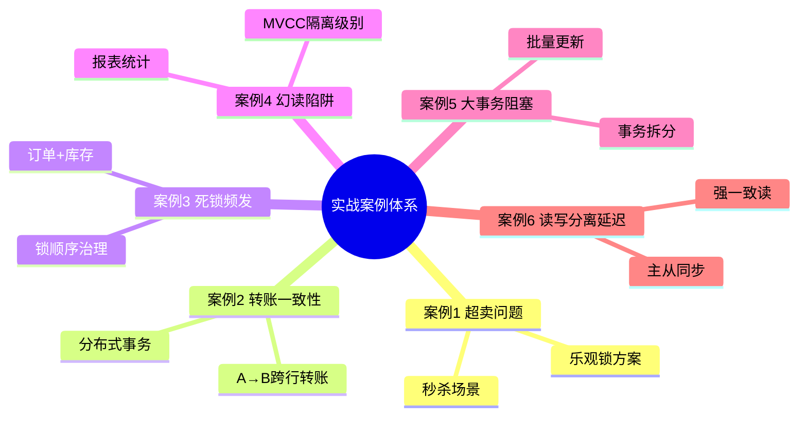
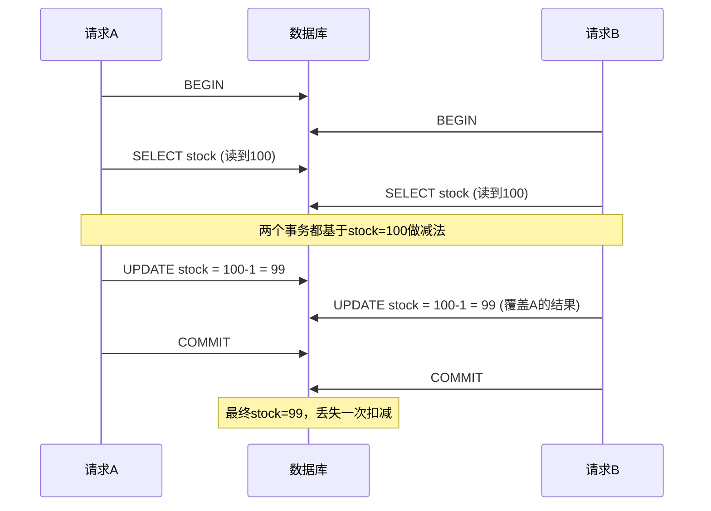
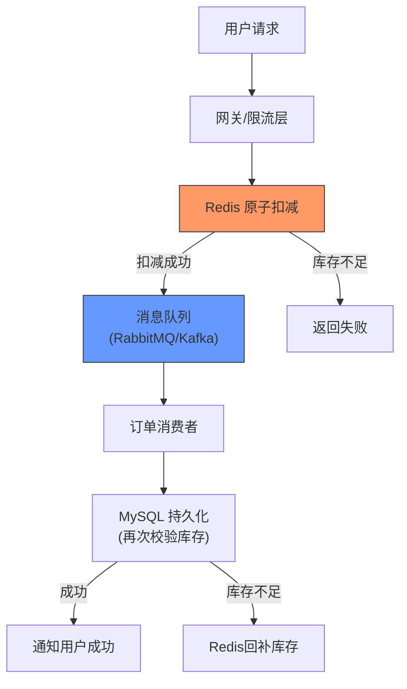
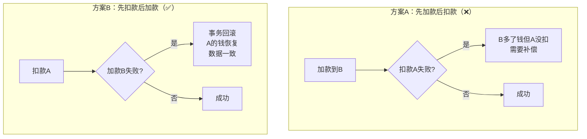
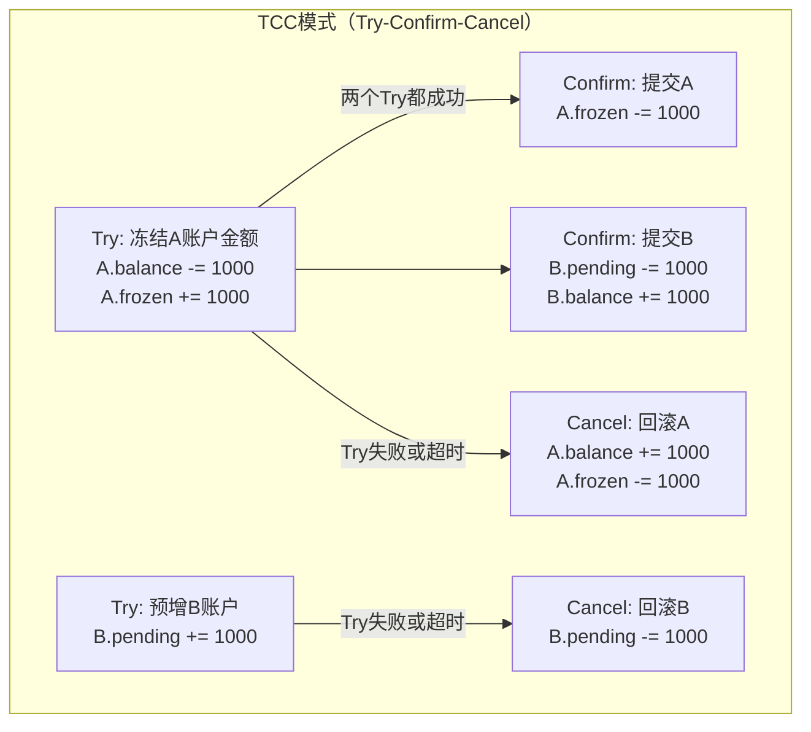
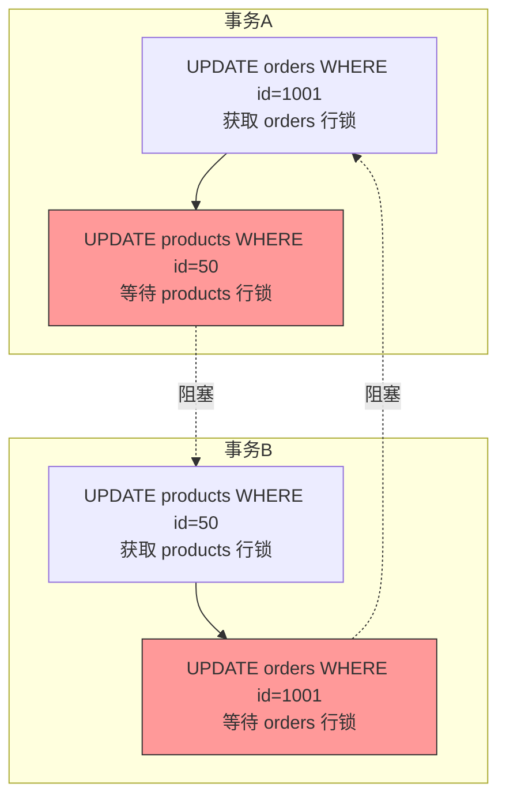
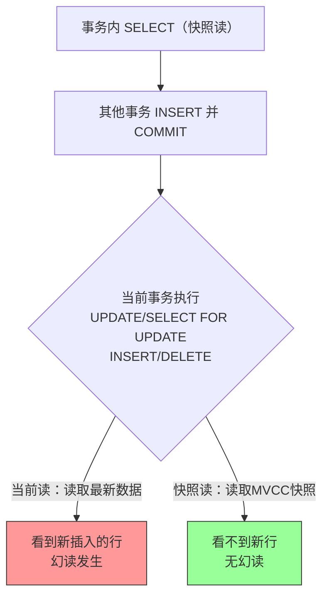
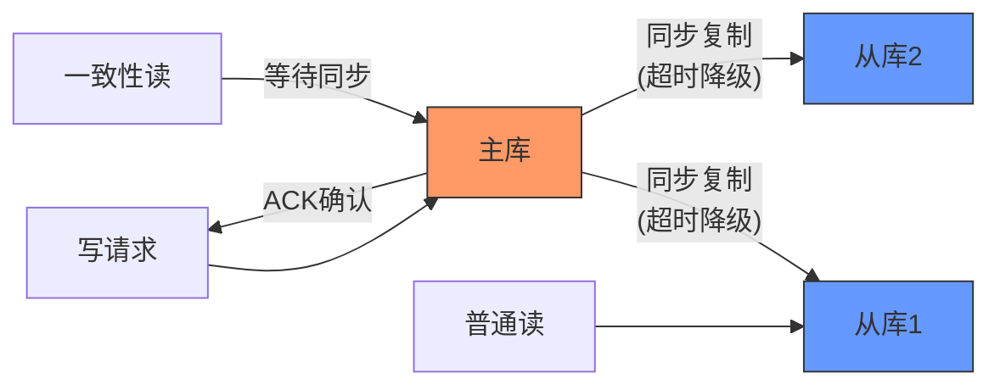
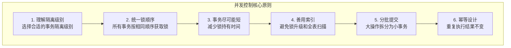

## 实战案例

> 本章提供六个完整的实战案例，覆盖事务与并发控制中最常见的生产级问题。每个案例遵循「现象→根因→方案→验证」的排查闭环，读者可直接对照自身场景复用。



---

### 案例一：秒杀超卖问题

#### 1.1 业务背景

某电商平台的秒杀活动上线后，运营反馈存在「超卖」现象——库存明明设为100件，实际卖出了105件。超卖意味着需要向用户赔付差价、补偿优惠券，同时引发客诉。这是高并发场景下最典型的并发控制失效案例。

#### 1.2 问题复现

```sql
-- 商品表结构
CREATE TABLE products (
    id BIGINT PRIMARY KEY AUTO_INCREMENT,
    name VARCHAR(100) NOT NULL,
    stock INT NOT NULL DEFAULT 0,
    price DECIMAL(10,2) NOT NULL,
    version INT NOT NULL DEFAULT 0 COMMENT '乐观锁版本号',
    created_at DATETIME DEFAULT CURRENT_TIMESTAMP,
    updated_at DATETIME DEFAULT CURRENT_TIMESTAMP ON UPDATE CURRENT_TIMESTAMP,
    INDEX idx_stock (stock)
) ENGINE=InnoDB;

-- 初始库存100
INSERT INTO products (name, stock, price) VALUES ('iPhone 16', 100, 5999.00);
```

模拟两个并发请求同时抢购同一件商品：

```sql
-- 请求A的执行过程（事务隔离级别：REPEATABLE READ）
BEGIN;
SELECT stock FROM products WHERE id = 1;
-- 返回 stock = 100
-- 模拟业务处理延迟200ms（此处用SLEEP模拟）
SELECT SLEEP(0.2);
UPDATE products SET stock = stock - 1 WHERE id = 1;
-- stock = 100 - 1 = 99
COMMIT;

-- 请求B的执行过程（与A并发，在A的SLEEP期间启动）
BEGIN;
SELECT stock FROM products WHERE id = 1;
-- 返回 stock = 100（因为A尚未提交，RR隔离级别下B看到的是快照数据）
SELECT SLEEP(0.2);
UPDATE products SET stock = stock - 1 WHERE id = 1;
-- stock = 100 - 1 = 99（覆盖了A的更新！）
COMMIT;
```

结果：A和B各扣减1，但最终 stock = 99 而不是 98。库存被多扣了一件，这就是**丢失更新（Lost Update）**。

#### 1.3 根因分析



核心问题：事务A和B在读取 stock 值后、更新前，另一个事务已修改了 stock，但当前事务仍然基于**过期的读取值**执行更新，导致后提交的事务覆盖先提交的结果。

在 `REPEATABLE READ` 隔离级别下，`SELECT` 语句使用一致性快照读（MVCC），不会加锁。两个事务都能成功读取到同一个快照版本的 stock 值，更新时虽会加排他锁串行化，但 `stock = stock - 1` 的计算基于读取时的快照值而非当前实际值。

#### 1.4 方案一：悲观锁（SELECT FOR UPDATE）

最直接的修复方式——读取时就加排他锁，阻止其他事务并发修改。

```sql
-- 悲观锁方案
BEGIN;
-- SELECT ... FOR UPDATE 会对读取的行加X锁，其他事务读此行会阻塞
SELECT stock FROM products WHERE id = 1 FOR UPDATE;
-- 返回 stock = 100，同时持有该行的排他锁

-- 此时如果请求B也执行 SELECT ... FOR UPDATE，会被阻塞等待A释放锁

UPDATE products SET stock = stock - 1 WHERE id = 1;
-- stock = 99
COMMIT;
-- 释放锁，B才能继续执行，此时读到stock=99，更新为98
```

**代码实现（Java + Spring）**：

```java
@Service
public class StockService {

    @Autowired
    private ProductMapper productMapper;

    /**
     * 悲观锁扣减库存
     * 关键点：必须在事务中，FOR UPDATE 事务结束自动释放
     */
    @Transactional(rollbackFor = Exception.class)
    public boolean deductStockPessimistic(Long productId) {
        // 1. 加锁读取
        Product product = productMapper.selectForUpdate(productId);
        if (product == null || product.getStock() <= 0) {
            return false; // 库存不足
        }
        // 2. 扣减
        productMapper.updateStock(productId, product.getStock() - 1);
        return true;
    }
}
```

```xml
<!-- MyBatis Mapper -->
<select id="selectForUpdate" resultType="Product">
    SELECT id, name, stock, price
    FROM products
    WHERE id = #{productId}
    FOR UPDATE
</select>

<update id="updateStock">
    UPDATE products
    SET stock = #{newStock}, updated_at = NOW()
    WHERE id = #{productId}
</update>
```

**优点**：逻辑简单，绝对安全，适合冲突率高的场景。
**缺点**：高并发下锁竞争激烈，吞吐量受限于锁持有时间；可能引发死锁。

#### 1.5 方案二：乐观锁（版本号控制）

使用版本号实现CAS（Compare-And-Swap）语义，读取时不加锁，提交时校验版本。

```sql
-- 乐观锁方案
BEGIN;
-- 1. 读取时记录版本号
SELECT id, stock, version FROM products WHERE id = 1;
-- 返回 stock=100, version=1

-- 2. 业务计算
-- stock_new = 100 - 1 = 99

-- 3. 提交时校验版本号：只有版本未被其他事务修改才能成功
UPDATE products
SET stock = 99, version = version + 1
WHERE id = 1 AND version = 1;
-- 影响行数 = 1（成功）或 0（被其他事务抢先修改了版本号）

COMMIT;
```

如果两个事务同时读取 version=1，先提交的事务会将 version 更新为 2，后提交的事务执行 `WHERE version = 1` 匹配不到行，更新 0 行——需要应用层重试。

**代码实现（Java + Spring）**：

```java
@Service
public class StockService {

    /**
     * 乐观锁扣减库存
     * 核心：UPDATE语句的WHERE条件包含版本号
     * 返回true表示扣减成功，false表示需要重试
     */
    @Transactional(rollbackFor = Exception.class)
    public boolean deductStockOptimistic(Long productId, int quantity) {
        Product product = productMapper.selectById(productId);
        if (product == null || product.getStock() < quantity) {
            return false;
        }

        int affected = productMapper.updateStockWithVersion(
            productId,
            product.getStock() - quantity,
            product.getVersion()
        );
        // affected=0 表示版本冲突，需要重试
        return affected > 0;
    }

    /**
     * 带重试的乐观锁扣减
     * 推荐上限3次重试，超过说明冲突率过高，应切换悲观锁
     */
    public boolean deductStockWithRetry(Long productId, int quantity,
                                         int maxRetries) {
        for (int i = 0; i < maxRetries; i++) {
            if (deductStockOptimistic(productId, quantity)) {
                return true;
            }
            log.warn("乐观锁冲突，第{}次重试", i + 1);
        }
        log.error("乐观锁重试{}次均失败，建议切换悲观锁或限流", maxRetries);
        return false;
    }
}
```

```xml
<update id="updateStockWithVersion">
    UPDATE products
    SET stock = #{newStock},
        version = version + 1,
        updated_at = NOW()
    WHERE id = #{productId} AND version = #{expectedVersion}
</update>
```

**适用场景**：读多写少、冲突率低于15%的业务（如商品详情页库存查询多、下单扣减少）。
**局限**：冲突率高时重试风暴会加重数据库压力，此时应选用悲观锁或分布式锁。

#### 1.6 方案三：Redis 分布式锁 + 原子操作

对于秒杀这种极端高并发场景，可以在 Redis 层做预扣减，避免大量请求涌入数据库。

```python
import redis
import time

class SeckillService:
    """基于Redis原子操作的秒杀服务"""

    def __init__(self, redis_client: redis.Redis):
        self.redis = redis_client
        self.STOCK_KEY = "seckill:product:{}:stock"

    def init_stock(self, product_id: int, stock: int):
        """活动开始前初始化库存"""
        self.redis.set(self.STOCK_KEY.format(product_id), stock)

    def seckill(self, product_id: int, user_id: int) -> dict:
        """
        秒杀核心逻辑
        使用 Lua 脚本保证「查询+扣减」的原子性
        """
        stock_key = self.STOCK_KEY.format(product_id)
        order_key = f"seckill:product:{product_id}:orders"

        # Lua 脚本：原子操作——检查库存并扣减
        lua_script = """
        local stock = tonumber(redis.call('GET', KEYS[1]))
        if stock == nil then
            return -1  -- 商品不存在
        end
        if stock <= 0 then
            return 0   -- 库存不足
        end
        -- 检查是否重复购买
        if redis.call('SISMEMBER', KEYS[2], ARGV[1]) == 1 then
            return -2  -- 重复购买
        end
        redis.call('DECR', KEYS[1])
        redis.call('SADD', KEYS[2], ARGV[1])
        return 1       -- 扣减成功
        """

        result = self.redis.eval(lua_script, 2, stock_key, order_key, user_id)

        if result == 1:
            return {"success": True, "message": "抢购成功"}
        elif result == 0:
            return {"success": False, "message": "库存不足"}
        elif result == -1:
            return {"success": False, "message": "商品不存在"}
        elif result == -2:
            return {"success": False, "message": "每人限购一件"}
```

**异步落库**：Redis 扣减成功后，通过消息队列异步写入数据库：

```python
import json
import pika

class OrderProducer:
    """将秒杀成功事件发送到消息队列，异步创建订单"""

    def __init__(self, mq_connection):
        self.channel = mq_connection.channel()
        self.channel.queue_declare(queue='seckill_orders', durable=True)

    def publish_order(self, product_id: int, user_id: int):
        message = json.dumps({
            "event": "seckill_success",
            "product_id": product_id,
            "user_id": user_id,
            "timestamp": time.time()
        })
        self.channel.basic_publish(
            exchange='',
            routing_key='seckill_orders',
            body=message,
            properties=pika.BasicProperties(delivery_mode=2)  # 持久化
        )

class OrderConsumer:
    """异步消费秒杀订单，写入数据库"""

    def __init__(self, mq_connection, db_session):
        self.channel = mq_connection.channel()
        self.db = db_session

    def on_message(self, ch, method, properties, body):
        event = json.loads(body)
        try:
            # 1. 创建订单
            order = Order(
                user_id=event["user_id"],
                product_id=event["product_id"],
                status="CREATED"
            )
            self.db.add(order)
            # 2. 数据库层面再次校验并扣减库存（双重保障）
            self.db.execute(
                "UPDATE products SET stock = stock - 1 "
                "WHERE id = :pid AND stock > 0",
                {"pid": event["product_id"]}
            )
            self.db.commit()
            ch.basic_ack(delivery_tag=method.delivery_tag)
        except Exception as e:
            self.db.rollback()
            # 重新入队，最多重试3次
            ch.basic_nack(delivery_tag=method.delivery_tag, requeue=True)
```

**架构总览**：



#### 1.7 三种方案对比

| 维度 | 悲观锁 | 乐观锁 | Redis预扣减 |
|------|--------|--------|-------------|
| 实现复杂度 | 低 | 中 | 高 |
| 并发性能 | 低（串行） | 中 | 极高 |
| 冲突处理 | 排队等待 | 版本校验+重试 | 原子操作无冲突 |
| 数据一致性 | 强一致 | 最终一致 | 最终一致 |
| 适用场景 | 冲突率>30% | 冲突率<15% | 秒杀/高并发 |
| 数据库压力 | 高（长事务） | 低 | 低（异步入库） |
| 典型案例 | 转账扣款 | 电商库存扣减 | 限时秒杀 |

---

### 案例二：转账事务一致性

#### 2.1 业务背景

某银行系统的转账功能出现「钱扣了但对方没收到」的投诉。用户A转账1000元到用户B，A账户已扣款，但B账户余额不变。这是事务一致性失效的经典案例。

#### 2.2 问题代码

```java
// ❌ 错误实现：两个独立事务
@Service
public class TransferService {

    @Autowired
    private AccountMapper accountMapper;

    public void transfer(Long fromId, Long toId, BigDecimal amount) {
        // 事务1：扣款
        deduct(fromId, amount);
        // 事务2：加款（如果这里异常，A的钱已经扣了但B没收到）
        credit(toId, amount);
    }

    @Transactional
    public void deduct(Long accountId, BigDecimal amount) {
        Account account = accountMapper.selectById(accountId);
        if (account.getBalance().compareTo(amount) < 0) {
            throw new InsufficientBalanceException("余额不足");
        }
        accountMapper.deduct(accountId, amount);
        // 事务1提交
    }

    @Transactional
    public void credit(Long accountId, BigDecimal amount) {
        accountMapper.credit(accountId, amount);
        // 事务2提交——如果此处异常，事务1已提交无法回滚
    }
}
```

问题分析：`deduct` 和 `credit` 分别在独立事务中。`deduct` 事务提交后，即使 `credit` 抛出异常，A的扣款也无法回滚。这违反了事务的**原子性**。

#### 2.3 正确实现：单事务 + 扣款优先

```java
@Service
public class TransferService {

    @Autowired
    private AccountMapper accountMapper;

    /**
     * 正确实现：单事务，先扣款后加款
     *
     * 关键设计原则：
     * 1. 两个操作必须在同一个事务中
     * 2. 先扣款（失败概率高的操作优先），减少锁持有时间
     * 3. 扣款使用乐观/悲观锁防止超扣
     */
    @Transactional(rollbackFor = Exception.class)
    public TransferResult transfer(Long fromId, Long toId, BigDecimal amount) {
        // 参数校验
        if (amount.compareTo(BigDecimal.ZERO) <= 0) {
            return TransferResult.fail("转账金额必须大于0");
        }
        if (fromId.equals(toId)) {
            return TransferResult.fail("不能转账给自己");
        }

        // 1. 先扣款（高风险操作优先）
        int affected = accountMapper.deductForUpdate(fromId, amount);
        if (affected == 0) {
            throw new InsufficientBalanceException("余额不足");
        }

        // 2. 再加款
        affected = accountMapper.creditForUpdate(toId, amount);
        if (affected == 0) {
            throw new RuntimeException("目标账户不存在");
        }

        // 3. 记录流水（在同一事务中）
        TransferRecord record = new TransferRecord();
        record.setFromId(fromId);
        record.setToId(toId);
        record.setAmount(amount);
        record.setStatus("SUCCESS");
        record.setCreatedAt(LocalDateTime.now());
        accountMapper.insertRecord(record);

        // 事务提交——要么全部成功，要么全部回滚
        return TransferResult.success("转账成功");
    }
}
```

```xml
<update id="deductForUpdate">
    UPDATE accounts
    SET balance = balance - #{amount},
        updated_at = NOW()
    WHERE id = #{accountId} AND balance >= #{amount}
</update>

<update id="creditForUpdate">
    UPDATE accounts
    SET balance = balance + #{amount},
        updated_at = NOW()
    WHERE id = #{accountId}
</update>
```

#### 2.4 深入分析：为什么先扣款？



先扣款的优势：
- 扣款可能因余额不足失败，此时事务直接回滚，无任何副作用
- 加款操作几乎不会失败（除非账户不存在），放在后面减少锁冲突窗口
- 如果先加款再扣款失败，需要额外的补偿逻辑，增加系统复杂度

#### 2.5 防重设计：幂等性保障

转账必须保证幂等——同一笔转账重复执行结果不变。

```java
/**
 * 基于流水号的幂等设计
 * 每笔转账携带唯一的transfer_no，数据库通过UNIQUE约束防重
 */
@Transactional(rollbackFor = Exception.class)
public TransferResult transferWithIdempotent(
        Long fromId, Long toId, BigDecimal amount, String transferNo) {

    // 0. 幂等检查：如果该流水号已处理，直接返回成功
    TransferRecord existing = accountMapper.findByTransferNo(transferNo);
    if (existing != null) {
        return TransferResult.success("转账成功（重复请求，已幂等）");
    }

    // 1. 扣款
    int affected = accountMapper.deductForUpdate(fromId, amount);
    if (affected == 0) {
        throw new InsufficientBalanceException("余额不足");
    }

    // 2. 加款
    affected = accountMapper.creditForUpdate(toId, amount);
    if (affected == 0) {
        throw new RuntimeException("目标账户不存在");
    }

    // 3. 记录流水（UNIQUE(transfer_no)保证幂等）
    TransferRecord record = new TransferRecord();
    record.setTransferNo(transferNo); // 唯一键
    record.setFromId(fromId);
    record.setToId(toId);
    record.setAmount(amount);
    accountMapper.insertRecord(record);

    return TransferResult.success("转账成功");
}
```

```sql
-- 流水表：transfer_no 唯一约束是幂等的物理保障
CREATE TABLE transfer_records (
    id BIGINT PRIMARY KEY AUTO_INCREMENT,
    transfer_no VARCHAR(64) NOT NULL UNIQUE COMMENT '幂等键',
    from_id BIGINT NOT NULL,
    to_id BIGINT NOT NULL,
    amount DECIMAL(15,2) NOT NULL,
    status VARCHAR(20) NOT NULL DEFAULT 'SUCCESS',
    created_at DATETIME DEFAULT CURRENT_TIMESTAMP,
    INDEX idx_from (from_id),
    INDEX idx_to (to_id)
) ENGINE=InnoDB;
```

#### 2.6 分布式转账场景扩展

当转账涉及不同数据库（跨行/跨系统）时，单机事务无法保证一致性，需要分布式事务方案：



| 分布式事务方案 | 一致性级别 | 性能 | 复杂度 | 适用场景 |
|---------------|-----------|------|--------|---------|
| 2PC（两阶段提交） | 强一致 | 低 | 中 | 同构数据库集群 |
| TCC（Try-Confirm-Cancel） | 最终一致 | 中 | 高 | 跨行转账、核心金融 |
| Saga | 最终一致 | 中 | 中 | 长流程、跨系统 |
| 本地消息表 | 最终一致 | 高 | 中 | 异步场景 |
| RocketMQ事务消息 | 最终一致 | 高 | 中 | 大规模微服务 |

---

### 案例三：订单系统死锁频发

#### 3.1 业务背景

某电商订单系统在高峰期频繁出现死锁告警，监控显示每小时触发 200+ 次死锁，每次死锁导致数十个事务回滚，用户体验明显下降（订单提交失败率飙升至 8%）。

#### 3.2 死锁现场还原

业务流程：用户下单时需要同时操作订单表和库存表，且存在并发的订单状态更新。

```sql
-- 事务A：下单（先操作订单表，再操作库存表）
BEGIN;
UPDATE orders SET status = 'PROCESSING' WHERE id = 1001;
UPDATE products SET stock = stock - 1 WHERE id = 50;
COMMIT;

-- 事务B：取消订单（先操作库存表回补，再更新订单状态）
BEGIN;
UPDATE products SET stock = stock + 1 WHERE id = 50;
UPDATE orders SET status = 'CANCELLED' WHERE id = 1001;
COMMIT;
```

当 A 在执行第一个 UPDATE 后、B 也在执行第一个 UPDATE 后，双方分别持有对方需要的行的锁，形成**循环等待**。

#### 3.3 死锁诊断全流程

**第一步：查看最近一次死锁信息**

```sql
-- InnoDB 引擎查看最近的死锁日志
SHOW ENGINE INNODB STATUS\G
```

输出中的 `LATEST DETECTED DEADLOCK` 部分：

LATEST DETECTED DEADLOCK
------------------------
2026-06-25 14:32:15 0x7f3a2c000700
*** (1) TRANSACTION:
TRANSACTION 584921, ACTIVE 0 sec starting index read
mysql tables in use 1, locked 1
LOCK WAIT 3 lock struct(s), heap size 1136, 2 row lock(s)
MySQL thread id 28841, OS thread id 140646912342784
*** (1) WAITING FOR THIS LOCK TO BE GRANTED:
RECORD LOCKS space id 156 page no 5 n bits 80 index PRIMARY
of table `shop`.`products` trx id 584921 lock_mode X locks rec but not gap
wait lock

*** (2) TRANSACTION:
TRANSACTION 584922, ACTIVE 0 sec starting index read
mysql tables in use 1, locked 1
LOCK WAIT 4 lock struct(s), heap size 1136, 2 row lock(s)
*** (2) WAITING FOR THIS LOCK TO BE GRANTED:
RECORD LOCKS space id 155 page no 8 n bits 128 index PRIMARY
of table `shop`.`orders` trx id 584922 lock_mode X locks rec but not gap
wait lock

**第二步：分析锁等待关系**

```sql
-- 当前正在执行的事务
SELECT * FROM information_schema.innodb_trx
ORDER BY trx_started ASC;

-- 锁等待关系
SELECT
    r.trx_id AS waiting_trx,
    r.trx_mysql_thread_id AS waiting_thread,
    r.trx_query AS waiting_query,
    b.trx_id AS blocking_trx,
    b.trx_mysql_thread_id AS blocking_thread,
    b.trx_query AS blocking_query
FROM information_schema.innodb_lock_waits w
JOIN information_schema.innodb_trx b ON b.trx_id = w.blocking_trx_id
JOIN information_schema.innodb_trx r ON r.trx_id = w.requesting_trx_id;
```

**第三步：开启死锁日志持久化**

```bash
# my.cnf 中配置（推荐生产环境始终开启）
[mysqld]
innodb_print_all_deadlocks = 1
# 死锁日志会输出到错误日志，方便事后分析
```

#### 3.4 根因分析



根本原因：**事务A和B以相反的顺序锁定资源**。A先锁orders再锁products，B先锁products再锁orders，构成循环等待的四个必要条件（互斥、持有并等待、不可剥夺、循环等待）。

#### 3.5 解决方案：统一锁顺序

**核心原则**：所有事务必须以相同的顺序访问共享资源。

```java
@Service
public class OrderService {

    /**
     * 统一锁顺序：所有操作都先锁 orders 再锁 products
     * 表级别锁顺序约定（文档化）：
     *   orders → products → payments → logistics
     */
    @Transactional(rollbackFor = Exception.class)
    public void createOrder(Long userId, Long productId, int quantity) {
        // 1. 先锁订单表（按业务约定的顺序）
        Long orderId = createOrderRecord(userId, productId, quantity);

        // 2. 再锁库存表
        int affected = productMapper.deductStock(productId, quantity);
        if (affected == 0) {
            throw new InsufficientStockException("库存不足");
        }

        // 3. 更新订单状态
        orderMapper.updateStatus(orderId, "CONFIRMED");
    }

    @Transactional(rollbackFor = Exception.class)
    public void cancelOrder(Long orderId) {
        // 同样先锁订单表
        Order order = orderMapper.selectForUpdate(orderId);
        if ("CANCELLED".equals(order.getStatus())) {
            return; // 幂等
        }

        // 再锁库存表（顺序一致！）
        productMapper.restoreStock(order.getProductId(), order.getQuantity());

        // 更新订单状态
        orderMapper.updateStatus(orderId, "CANCELLED");
    }
}
```

**锁定顺序文档约定（写入项目规范）**：

数据库表访问顺序约定 v1.0
─────────────────────────
所有涉及多表更新的事务，必须按照以下顺序加锁：

1. orders        （订单表）
2. products      （商品/库存表）
3. payments      （支付表）
4. logistics     （物流表）
5. user_accounts （用户账户表）

违反此顺序的代码不允许合并到主分支。

#### 3.6 进阶：死锁监控告警

```sql
-- 死锁监控视图：每5分钟统计死锁次数
CREATE EVENT IF NOT EXISTS deadlock_monitor
ON SCHEDULE EVERY 5 MINUTE
DO
BEGIN
    INSERT INTO deadlock_history (
        detect_time, deadlocks_count, last_deadlock_info
    )
    SELECT
        NOW(),
        VARIABLE_VALUE,
        (SELECT CONCAT('Thread ', thread_id, ': ', sql_text)
         FROM performance_schema.events_statements_history
         WHERE event_id = (
            SELECT MAX(event_id)
            FROM performance_schema.events_statements_history
            WHERE sql_text LIKE '%DEADLOCK%'
         ))
    FROM performance_schema.global_status
    WHERE VARIABLE_NAME = 'Innodb_deadlocks';
END;
```

---

### 案例四：幻读导致报表数据不一致

#### 4.1 业务背景

某SaaS平台的财务报表模块，运营发现同一个时间范围内，月初统计的订单总额与月末统计的不一致。具体表现为：月初统计的"1月订单总额"为50万元，但到了月底再统计同一个范围变成了55万元。期间没有任何人工修改历史订单的操作。

#### 4.2 问题复现

```sql
-- 假设当前月份有以下订单
INSERT INTO orders (user_id, amount, created_at) VALUES
(1, 10000, '2026-01-05'),
(2, 20000, '2026-01-10'),
(3, 15000, '2026-01-15'),
(4, 5000,  '2026-01-20');

-- 事务A：统计1月订单总额（可重复读）
BEGIN;
SELECT SUM(amount) FROM orders
WHERE created_at >= '2026-01-01' AND created_at < '2026-02-01';
-- 结果：50000

-- 此时事务B插入了新订单并提交
INSERT INTO orders (user_id, amount, created_at)
VALUES (5, 25000, '2026-01-25');
-- 事务B自动提交

-- 事务A再次统计（同一事务内）
SELECT SUM(amount) FROM orders
WHERE created_at >= '2026-01-01' AND created_at < '2026-02-01';
-- 在 REPEATABLE READ 下，MySQL 使用 MVCC 快照读，
-- 仍返回50000——看起来没有幻读？
```

但在特定场景下，幻读确实会发生：

```sql
-- 场景二：间隙锁失效的情况
BEGIN;
-- 第一次查询（快照读）
SELECT COUNT(*) FROM orders
WHERE created_at >= '2026-01-01' AND created_at < '2026-02-01';
-- 结果：4

-- 使用 CURRENT UPDATE 语句（会读取最新数据，不是快照！）
SELECT COUNT(*) FROM orders WHERE created_at >= '2026-01-01'
AND created_at < '2026-02-01' FOR UPDATE;
-- 此时如果其他事务已插入新行，这里可能看到5行

-- 基于快照的COUNT和FOR UPDATE的COUNT不一致
-- 导致业务逻辑判断错误
COMMIT;
```

更常见的幻读触发路径是**先快照读再当前读**：

```sql
-- 典型幻读场景
BEGIN;
-- 快照读：返回4行，总额50000
SELECT * FROM orders
WHERE created_at >= '2026-01-01' AND created_at < '2026-02-01';

-- 其他事务插入了 order_id=5 的新记录并提交

-- 当前读：能看到新插入的行
SELECT * FROM orders
WHERE created_at >= '2026-01-01' AND created_at < '2026-02-01' FOR UPDATE;
-- 返回5行，包括新插入的 order_id=5

-- 基于结果更新——意外修改了"新"数据
UPDATE orders SET status = 'AUDITED'
WHERE created_at >= '2026-01-01' AND created_at < '2026-02-01';
-- 影响了5行，包括不该包含的 order_id=5

COMMIT;
```

#### 4.3 根因分析

MySQL 的 `REPEATABLE READ` 通过 MVCC 解决了大部分幻读问题（一致性快照读），但有以下漏洞：



**本质**：MVCC 快照读和当前读使用不同的数据视图。快照读看到的是事务开始时的快照，当前读看到的是最新数据+锁保护的数据。两者混用会导致数据不一致。

#### 4.4 解决方案

**方案一：统一使用当前读**

```sql
BEGIN;
-- 全部使用 FOR UPDATE，保证一致性
SELECT SUM(amount) FROM orders
WHERE created_at >= '2026-01-01' AND created_at < '2026-02-01'
FOR UPDATE;
-- 其他事务的 INSERT 在此期间会被间隙锁阻塞
COMMIT;
```

**方案二：使用 `SERIALIZABLE` 隔离级别**

```sql
-- 会话级别设置
SET SESSION transaction_isolation = 'SERIALIZABLE';

-- 该级别下所有 SELECT 都隐式加 LOCK IN SHARE MODE
-- 自动防止幻读，但并发性能大幅下降
BEGIN;
SELECT SUM(amount) FROM orders
WHERE created_at >= '2026-01-01' AND created_at < '2026-02-01';
-- 自动加共享锁，其他事务无法在此范围内 INSERT
COMMIT;
```

**方案三：报表场景的时间点快照（推荐）**

```java
/**
 * 报表统计使用独立快照，避免事务内幻读
 * 核心思路：在事务外获取统计结果，或使用临时表固化数据
 */
@Service
public class ReportService {

    @Autowired
    private ReportMapper reportMapper;

    /**
     * 方案A：单条SQL在事务外执行（利用MVCC的自动提交语义）
     * 每次查询都是独立事务，看到的是执行时刻的一致性快照
     */
    public BigDecimal getMonthlyReport(int year, int month) {
        // 单条SQL默认autocommit，看到的是当前时刻的数据快照
        // 不会有事务内幻读问题
        return reportMapper.sumMonthlyAmount(year, month);
    }

    /**
     * 方案B：快照表（适合需要多次分析的场景）
     * 将数据固化到临时表，后续分析基于快照而非实时数据
     */
    @Transactional
    public void generateMonthlySnapshot(int year, int month) {
        // 1. 先清除旧快照
        reportMapper.clearSnapshot(year, month);

        // 2. 将当前数据一次性写入快照表
        reportMapper.createSnapshot(year, month);

        // 3. 后续所有报表查询都读快照表，不受并发影响
    }
}
```

```sql
-- 报表快照表
CREATE TABLE report_snapshots (
    id BIGINT PRIMARY KEY AUTO_INCREMENT,
    report_year INT NOT NULL,
    report_month INT NOT NULL,
    total_orders INT NOT NULL,
    total_amount DECIMAL(15,2) NOT NULL,
    snapshot_time DATETIME DEFAULT CURRENT_TIMESTAMP,
    UNIQUE KEY uk_year_month (report_year, report_month)
) ENGINE=InnoDB;

-- 创建快照（原子操作）
INSERT INTO report_snapshots (report_year, report_month, total_orders, total_amount)
SELECT
    YEAR(created_at), MONTH(created_at),
    COUNT(*), SUM(amount)
FROM orders
WHERE YEAR(created_at) = #{year} AND MONTH(created_at) = #{month}
GROUP BY YEAR(created_at), MONTH(created_at)
ON DUPLICATE KEY UPDATE
    total_orders = VALUES(total_orders),
    total_amount = VALUES(total_amount),
    snapshot_time = NOW();
```

#### 4.5 隔离级别选择指南

| 隔离级别 | 脏读 | 不可重复读 | 幻读 | 性能 | 适用场景 |
|---------|------|-----------|------|------|---------|
| READ UNCOMMITTED | ✅可能 | ✅可能 | ✅可能 | 最高 | 极少数只读监控 |
| READ COMMITTED (RC) | ❌解决 | ✅可能 | ✅可能 | 高 | Oracle默认，互联网常用 |
| REPEATABLE READ (RR) | ❌解决 | ❌解决 | ⚠️部分解决 | 中 | MySQL默认，一般业务 |
| SERIALIZABLE | ❌解决 | ❌解决 | ❌解决 | 低 | 金融核心、报表一致性 |

> **实战建议**：互联网业务通常使用 RC 而非 RR。原因：RC 的间隙锁更少，并发性能更好；且 RC 下每次 SELECT 都读最新已提交数据，不容易出现"先快照读再当前读"的混用陷阱。可在 `my.cnf` 中全局设置：`transaction_isolation = READ-COMMITTED`。

---

### 案例五：大事务阻塞导致连接池耗尽

#### 5.1 业务背景

某内容平台的定时任务——每小时执行一次「用户积分批量结算」，每次需要处理约50万条记录。该任务在数据库层面以一个长事务执行，导致连接池被长期占用，其他业务请求拿不到连接，出现大面积超时。

#### 5.2 问题代码

```java
// ❌ 错误实现：一个大事务处理所有数据
@Transactional(rollbackFor = Exception.class)
public void settleAllPoints() {
    List<PointRecord> records = pointMapper.selectUnsettled();
    // records 包含 50万条记录
    for (PointRecord record : records) {
        // 逐条更新积分
        pointMapper.updateBalance(
            record.getUserId(),
            record.getPoints(),
            record.getId()
        );
        // 每1000条记录一条日志
        if (record.getId() % 1000 == 0) {
            log.info("已处理 {} 条", record.getId());
        }
    }
    // 整个循环在一个事务中，执行时间可能超过10分钟
}
```

问题分析：

1. **事务持有时间过长**：50万条更新在单个事务中，持有锁时间可能超过10分钟
2. **连接被长期占用**：事务期间连接无法释放给其他请求
3. **锁竞争严重**：长事务持有的行锁可能阻塞其他业务的正常操作
4. **回滚代价大**：如果最后一条失败，50万条更新全部回滚

#### 5.3 解决方案：分批提交

```java
/**
 * 分批处理：每1000条提交一次事务
 * 使用 REQUIRES_NEW 确保每批是独立事务
 */
@Service
public class PointSettlementService {

    private static final int BATCH_SIZE = 1000;

    /**
     * 分批处理主逻辑
     */
    public void settleAllPoints() {
        long maxId = pointMapper.selectMaxUnsettledId();
        long processed = 0;

        for (long startId = 0; startId <= maxId; startId += BATCH_SIZE) {
            try {
                int count = settleBatch(startId, startId + BATCH_SIZE);
                processed += count;
                log.info("已处理 {} 条，本批 {} 条", processed, count);
            } catch (Exception e) {
                log.error("批次 [{}-{}] 处理失败", startId, startId + BATCH_SIZE, e);
                // 单批失败不影响其他批次，记录失败ID后续重试
                recordFailedBatch(startId, startId + BATCH_SIZE);
            }
        }
        log.info("批量结算完成，共处理 {} 条", processed);
    }

    /**
     * 单批次处理（独立事务）
     * REQUIRES_NEW：无论外层是否有事务，都开启新事务
     */
    @Transactional(rollbackFor = Exception.class)
    public int settleBatch(long startId, long endId) {
        List<PointRecord> records = pointMapper.selectUnsettledRange(startId, endId);
        for (PointRecord record : records) {
            pointMapper.updateBalance(
                record.getUserId(),
                record.getPoints(),
                record.getId()
            );
        }
        return records.size();
    }
}
```

#### 5.4 进阶：使用游标流式处理

当数据量达到千万级时，即使分批也可能因一次性加载数据而 OOM。使用数据库游标逐行处理：

```java
/**
 * 游标流式处理：每次从数据库取一批，处理完释放内存
 * 适合千万级数据量
 */
@Service
public class PointSettlementService {

    /**
     * 使用游标避免一次性加载全部数据到内存
     */
    public void settleAllPointsCursor() {
        int lastId = 0;
        int totalProcessed = 0;

        while (true) {
            // 每次只取 BATCH_SIZE 条，处理完再取下一批
            List<PointRecord> batch = pointMapper.selectUnsettledCursor(
                lastId, BATCH_SIZE
            );

            if (batch.isEmpty()) {
                break; // 处理完毕
            }

            // 分批提交
            settleBatch(batch);
            totalProcessed += batch.size();
            lastId = batch.get(batch.size() - 1).getId();

            log.info("游标进度：已处理 {} 条，当前ID: {}", totalProcessed, lastId);
        }
    }
}
```

```xml
<!-- 游标查询：只加载指定范围的数据 -->
<select id="selectUnsettledCursor" resultType="PointRecord">
    SELECT id, user_id, points, created_at
    FROM point_records
    WHERE settled = 0 AND id > #{lastId}
    ORDER BY id ASC
    LIMIT #{batchSize}
</select>
```

#### 5.5 监控大事务

```sql
-- 查找执行超过60秒的长事务
SELECT
    trx_id,
    trx_state,
    trx_started,
    TIMESTAMPDIFF(SECOND, trx_started, NOW()) AS duration_seconds,
    trx_rows_locked,
    trx_rows_modified,
    trx_query
FROM information_schema.innodb_trx
WHERE TIMESTAMPDIFF(SECOND, trx_started, NOW()) > 60
ORDER BY trx_started ASC;

-- 查找持有行锁超过30秒的事务
SELECT
    b.trx_id AS blocking_trx,
    b.trx_started,
    TIMESTAMPDIFF(SECOND, b.trx_started, NOW()) AS hold_seconds,
    b.trx_rows_locked,
    b.trx_query AS blocking_query,
    r.trx_id AS waiting_trx,
    r.trx_query AS waiting_query
FROM information_schema.innodb_lock_waits w
JOIN information_schema.innodb_trx b ON b.trx_id = w.blocking_trx_id
JOIN information_schema.innodb_trx r ON r.trx_id = w.requesting_trx_id
WHERE TIMESTAMPDIFF(SECOND, b.trx_started, NOW()) > 30;
```

---

### 案例六：读写分离后的数据不一致

#### 6.1 业务背景

某系统从单机 MySQL 迁移到主从架构（1主2从），开启了读写分离。上线后用户反馈：刚下单的订单查询不到、支付后余额未更新等"数据不一致"问题。技术团队确认写操作成功，但从库查不到最新数据。

#### 6.2 问题现象

```java
// 用户刚完成支付
paymentService.pay(orderId);  // 写入主库成功

// 立即查询订单状态
Order order = orderMapper.selectById(orderId);  // 走从库
// order.status 可能仍是 "UNPAID"——主从延迟导致
```

原因：MySQL 异步复制存在延迟（主库写入到从库同步之间有时间差），通常在毫秒级到秒级。在写入后立即读从库，可能读到旧数据。

#### 6.3 四种解决方案

**方案一：强制读主库（简单粗暴）**

```java
/**
 * 关键业务强制读主库
 * 适用场景：写后立即读、支付回调、库存校验
 */
@Service
public class OrderService {

    @Autowired
    private MasterDataSource masterDs; // 强制主库数据源

    @Autowired
    private SlaveDataSource slaveDs;   // 从库数据源

    /**
     * 普通查询走从库
     */
    public Order getOrder(Long orderId) {
        return orderMapper.selectById(orderId); // 走从库
    }

    /**
     * 支付后立即查询强制走主库
     */
    public Order getOrderAfterPayment(Long orderId) {
        // 临时切换到主库数据源
        DynamicDataSource.setMaster();
        try {
            return orderMapper.selectById(orderId);
        } finally {
            DynamicDataSource.clear(); // 恢复默认路由
        }
    }
}
```

**方案二：延迟读（等待同步完成）**

```java
/**
 * 写入后延迟一段时间再读从库
 * 适用于对一致性要求不高但想走从库减轻主库压力的场景
 */
public Order getOrderWithDelay(Long orderId, Long writeTimestamp) {
    long elapsed = System.currentTimeMillis() - writeTimestamp;
    long replicationDelay = 200; // 预估主从延迟200ms

    if (elapsed < replicationDelay) {
        // 读写间隔不够，强制读主库
        DynamicDataSource.setMaster();
        try {
            return orderMapper.selectById(orderId);
        } finally {
            DynamicDataSource.clear();
        }
    }
    // 已超过预估延迟，走从库
    return orderMapper.selectById(orderId);
}
```

**方案三：基于 GTID 的一致性读（推荐）**

```java
/**
 * 使用 GTID 判断从库是否已同步到指定事务
 * 需要 MySQL 5.6+ 开启 GTID 模式
 */
@Service
public class ConsistentReadService {

    /**
     * 写入时记录 GTID，读取时检查从库同步进度
     */
    public String writeWithGtid(String sql) {
        // 执行写操作
        jdbcTemplate.execute(sql);

        // 获取当前GTID（需要开启 session_track_gtids = OWN_GTID）
        return jdbcTemplate.queryForObject(
            "SELECT @@global.gtid_executed", String.class
        );
    }

    /**
     * 等待从库同步到指定GTID后再读
     */
    public void waitForSync(String gtidSet, int maxWaitMs) throws Exception {
        long start = System.currentTimeMillis();

        while (System.currentTimeMillis() - start < maxWaitMs) {
            // 检查从库的同步位点
            String slaveGtid = getSlaveExecutedGtid();
            if (gtidContainedIn(slaveGtid, gtidSet)) {
                return; // 已同步
            }
            Thread.sleep(10); // 等待10ms后重试
        }

        throw new SyncTimeoutException(
            "等待主从同步超时，已等待" + maxWaitMs + "ms"
        );
    }
}
```

**方案四：半同步复制 + 超时降级**

```sql
-- 主库配置半同步复制
INSTALL PLUGIN rpl_semi_sync_master SONAME 'semisync_master.so';
SET GLOBAL rpl_semi_sync_master_enabled = 1;
SET GLOBAL rpl_semi_sync_master_timeout = 1000; -- 超时1秒降级为异步

-- 从库配置
INSTALL PLUGIN rpl_semi_sync_slave SONAME 'semisync_slave.so';
SET GLOBAL rpl_semi_sync_slave_enabled = 1;
```



#### 6.4 方案选型对比

| 方案 | 一致性 | 实现复杂度 | 主库压力 | 适用场景 |
|------|--------|-----------|---------|---------|
| 强制读主 | 强一致 | 低 | 高 | 支付回调、关键业务 |
| 延迟读 | 基本一致 | 低 | 低 | 一般业务 |
| GTID一致性读 | 强一致 | 高 | 低 | 金融、库存 |
| 半同步复制 | 近似强一致 | 中 | 中 | 通用推荐 |

---

### 实战总结：六大案例的核心教训



| 案例 | 核心问题 | 根因 | 关键解决方案 |
|------|---------|------|-------------|
| 秒杀超卖 | 丢失更新 | 快照读+无锁控制 | 乐观锁版本号 / Redis原子操作 |
| 转账一致性 | 部分提交 | 拆分为多个独立事务 | 单事务+幂等设计 |
| 订单死锁 | 循环等待 | 资源访问顺序不一致 | 统一锁顺序约定 |
| 报表幻读 | 数据不一致 | 快照读与当前读混用 | 时间点快照 / SERIALIZABLE |
| 大事务阻塞 | 连接池耗尽 | 单事务处理时间过长 | 分批提交 / 游标流式处理 |
| 读写分离延迟 | 主从不一致 | 异步复制延迟 | 强制读主 / GTID一致性读 |

> **通用建议**：
> 1. 生产环境始终开启 `innodb_print_all_deadlocks = 1`
> 2. 设置慢查询阈值 `long_query_time = 1`，配合 `slow_query_log`
> 3. 定期执行 `SHOW ENGINE INNODB STATUS` 分析锁状态
> 4. 使用 `performance_schema` 监控事务持有时间
> 5. 代码审查时重点关注跨表更新的锁顺序
> 6. 压测时模拟并发场景，提前发现事务问题
