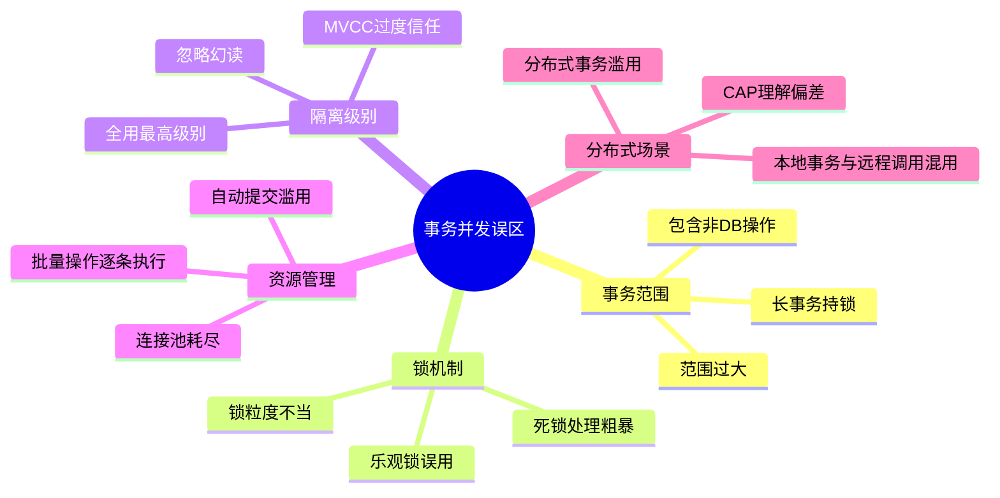
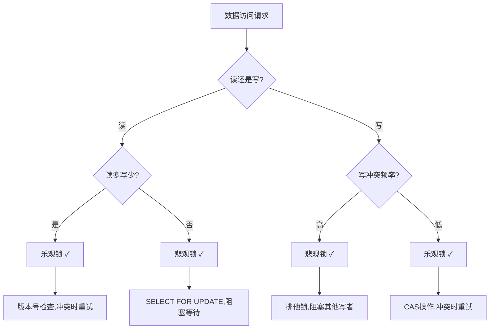
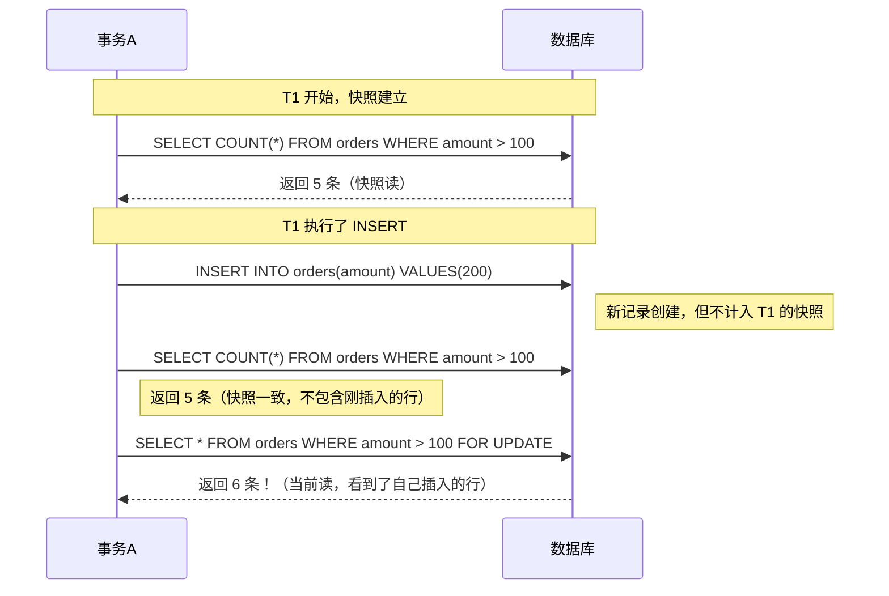
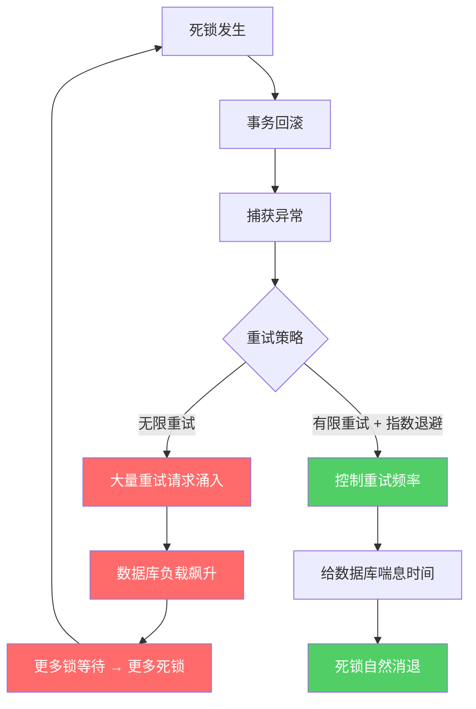
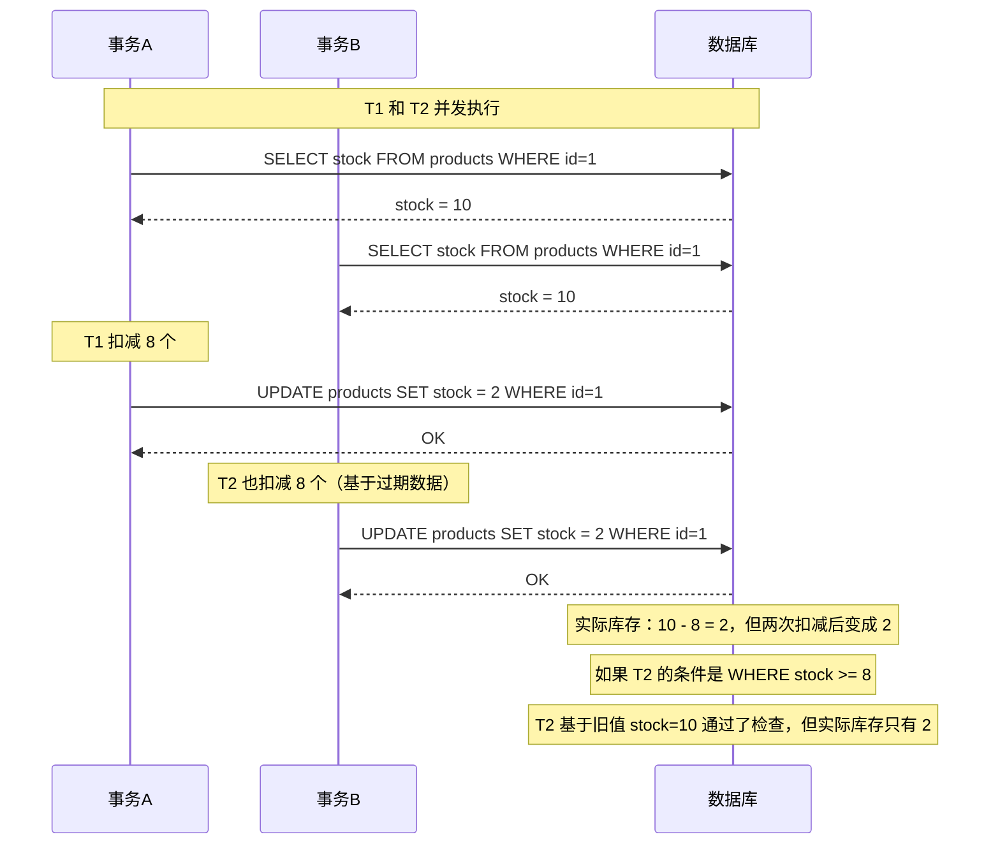

## 常见误区

事务与并发控制是后端开发中最容易出错的领域之一。许多开发者在日常工作中反复踩入相同的陷阱——有些源于对数据库底层机制的理解不足，有些来自对"快速修复"的过度依赖，还有些则是架构设计时埋下的隐患。

本节汇总了生产环境中最高频的事务与并发控制误区。每个误区都按"错误现象 → 根因分析 → 错误示范 → 正确做法 → 实际影响"的结构展开，帮助你不仅知道"不该怎么做"，更理解"为什么不该这样做"。



---

### 误区一：事务范围过大——把所有逻辑塞进一个事务

**错误现象**

一个接口请求中，数据库事务包含了远程HTTP调用、消息队列发送、文件上传、甚至邮件通知等操作。一旦其中任何一个步骤耗时过长或失败，整个事务长时间持有锁，导致后续请求大量排队，最终拖垮数据库。

**根因分析**

事务的本质是保证数据库操作的原子性。但它并不负责保证"数据库操作 + 外部调用"的原子性。把外部服务调用放进事务，意味着：
- 事务的持续时间被外部服务的响应时间决定（通常几十毫秒到几秒）
- 数据库连接和行锁在事务期间持续被占用
- 外部服务不可用时，整个事务阻塞，数据库资源无法释放

**错误示范**

```python
# ❌ 错误：事务中包含远程调用和文件操作
import requests
from my_db import transaction

def transfer_order(order_data):
    with transaction() as txn:
        # 1. 写数据库（毫秒级）
        txn.execute("INSERT INTO orders ...", order_data)

        # 2. 调用支付网关（几百毫秒到几秒）
        payment_result = requests.post(
            "https://payment-gateway.com/charge",
            json=order_data, timeout=30
        )  # ← 这里阻塞了事务！

        # 3. 上传发票到OSS（几秒）
        upload_to_oss(invoice_file)  # ← 继续阻塞

        # 4. 发送确认邮件（几秒）
        send_confirmation_email(order_data)  # ← 还在阻塞

        # 5. 发送MQ消息
        mq_producer.send("order.created", order_data)
```

在这个例子中，步骤1只需要5ms，但步骤2-5可能需要数秒。整个事务期间，数据库连接被白白占用，行锁无法释放。

**正确做法**

采用**事务只管数据库 + 外部调用异步化**的模式：

```python
# ✅ 正确：事务只包含数据库操作，外部调用拆出事务
import requests
from my_db import transaction
from my_mq import mq_producer

def transfer_order(order_data):
    # 第一阶段：事务内只做数据库操作（毫秒级完成）
    with transaction() as txn:
        txn.execute("INSERT INTO orders ...", order_data)
        txn.execute("INSERT INTO order_items ...", order_data)
        # 事务在这里 commit，连接和锁立即释放

    # 第二阶段：事务外执行外部调用
    try:
        payment_result = requests.post(
            "https://payment-gateway.com/charge",
            json=order_data, timeout=10
        )
    except requests.Timeout:
        # 补偿逻辑：异步重试或人工处理
        mq_producer.send("order.payment.retry", order_data)
        return {"status": "pending_payment"}

    # 第三阶段：非关键操作走异步
    mq_producer.send("order.post_process", order_data)

    return {"status": "success"}
```

**实际影响**

在某电商系统的实际案例中，将远程调用移出事务后：
- 数据库事务平均耗时从 3.2s 降到 12ms（降低 99.6%）
- 数据库连接池占用率从 95% 降到 30%
- 大促期间的数据库QPS承载能力提升 4 倍

---

### 误区二：长事务——锁持有时间过长

**错误现象**

数据库出现大量 `Lock wait timeout` 错误，`SHOW PROCESSLIST` 中发现多个事务状态为 `Updating` 但执行时间超过30秒。应用日志中频繁出现获取数据库连接超时的异常。

**根因分析**

长事务的核心问题是**锁持有时间 = 事务持续时间**。即使你只在事务的最后一行代码获取了锁，锁也会一直持有到事务 commit 或 rollback。以下场景最容易产生长事务：

| 场景 | 说明 | 典型持续时间 |
|------|------|-------------|
| 事务中包含复杂计算 | 在内存中做大量数据处理后再提交 | 数秒到数十秒 |
| 事务中读取大量数据 | 事务内执行多次大查询，读到的数据也被锁保护 | 数秒 |
| 事务中等待用户输入 | Web应用中事务跨请求边界 | 数分钟 |
| 循环中逐条更新 | 每次更新都扩大锁范围 | 与数据量成正比 |
| 大批量数据迁移 | 一个事务包含百万行更新 | 数分钟到数小时 |

**错误示范**

```sql
-- ❌ 错误：大事务批量更新，锁持有时间过长
BEGIN;

-- 更新100万行订单状态
UPDATE orders SET status = 'archived'
WHERE created_at < '2024-01-01'
AND status = 'completed';

-- 还要做其他操作...
UPDATE statistics SET total_archived = total_archived + 1000000;
UPDATE summary SET last_archive_time = NOW();

COMMIT;
-- ↑ 整个过程中，被更新的100万行全部持有排他锁
-- 其他用户对这些行的任何操作都会被阻塞
```

**正确做法**

对于大批量操作，采用**分批提交**策略：

```sql
-- ✅ 正确：分批处理，每批 commit 一次释放锁
DELIMITER //
CREATE PROCEDURE batch_archive()
BEGIN
    DECLARE affected INT DEFAULT 1;
    DECLARE batch_size INT DEFAULT 5000;

    WHILE affected > 0 DO
        START TRANSACTION;

        -- 每次只更新一批行
        UPDATE orders SET status = 'archived'
        WHERE created_at < '2024-01-01'
        AND status = 'completed'
        LIMIT batch_size;

        SET affected = ROW_COUNT();

        COMMIT;
        -- 每批提交后释放锁，让其他事务有机会执行

        -- 轻量级 sleep，避免给主库持续施压
        DO SLEEP(0.1);
    END WHILE;
END //
DELIMITER ;
```

应用层的分批实现：

```python
def batch_archive_orders(cutoff_date, batch_size=5000):
    """分批归档订单，每批独立事务"""
    while True:
        with transaction() as txn:
            affected = txn.execute("""
                UPDATE orders SET status = 'archived'
                WHERE created_at < %s
                AND status = 'completed'
                LIMIT %s
            """, (cutoff_date, batch_size))

            if affected == 0:
                break  # 全部处理完毕

        # 事务已提交，锁已释放
        logger.info(f"Archived batch: {affected} rows")
        time.sleep(0.05)  # 给其他事务喘息时间
```

**实际影响**

某金融系统将日终对账的单一大事务拆分为5000行/批的分批事务后：
- 锁等待超时错误从每分钟 200+ 次降为 0
- 其他在线业务的 P99 延迟从 8s 降到 50ms
- 对账任务总耗时基本不变（约多5%）

---

### 误区三：隔离级别全用最高——SERIALIZABLE 并不是万能药

**错误现象**

为了"保险起见"，将所有数据库连接的隔离级别都设为 `SERIALIZABLE`。结果在高并发场景下，系统吞吐量急剧下降，大量事务因序列化冲突而回滚，应用日志中充满 `serialization failure` 错误。

**根因分析**

MySQL InnoDB 默认隔离级别是 `REPEATABLE READ`，已经能应对绝大多数业务场景。`SERIALIZABLE` 会将所有普通 SELECT 转为 `SELECT ... LOCK IN SHARE MODE`，相当于对读操作也加锁，代价是并发性能大幅下降。

各隔离级别的真实性能差异：

| 隔离级别 | 并发读冲突 | 并发写冲突 | 适用场景 | 性能影响 |
|----------|-----------|-----------|---------|---------|
| READ UNCOMMITTED | 无锁 | 行排他锁 | 日志采集、临时查询 | 最低开销 |
| READ COMMITTED | 无锁 | 行排他锁 | 大多数Web应用（推荐） | 低开销 |
| REPEATABLE READ | 间隙锁防幻读 | 行排他锁+间隙锁 | 需要事务内可重复读 | 中等开销 |
| SERIALIZABLE | 共享锁读 | 完全序列化 | 资金/库存等强一致场景 | 高开销 |

**错误示范**

```yaml
# ❌ 错误：全局强制 SERIALIZABLE
spring:
  datasource:
    hikari:
      data-source-properties:
        transaction-isolation: SERIALIZABLE
```

```java
// ❌ 错误：每个连接都设置最高隔离级别
connection.setTransactionIsolation(
    Connection.TRANSACTION_SERIALIZABLE
);
```

**正确做法**

根据业务场景选择合适的隔离级别：

```python
# ✅ 正确：按业务场景选择隔离级别
from enum import Enum
import threading

class IsolationLevel(Enum):
    READ_COMMITTED = "READ COMMITTED"
    REPEATABLE_READ = "REPEATABLE READ"
    SERIALIZABLE = "SERIALIZABLE"

# 不同业务使用不同隔离级别
def get_user_profile(user_id):
    """普通查询：READ COMMITTED 足够"""
    with transaction(isolation=IsolationLevel.READ_COMMITTED):
        return db.query("SELECT * FROM users WHERE id = %s", user_id)

def transfer_money(from_id, to_id, amount):
    """资金操作：需要 SERIALIZABLE 防止脏读"""
    with transaction(isolation=IsolationLevel.SERIALIZABLE):
        db.execute("UPDATE accounts SET balance = balance - %s WHERE id = %s",
                   (amount, from_id))
        db.execute("UPDATE accounts SET balance = balance + %s WHERE id = %s",
                   (amount, to_id))

def generate_report():
    """报表查询：REPEATABLE READ 保证同一事务内数据一致"""
    with transaction(isolation=IsolationLevel.REPEATABLE_READ):
        summary = db.query("SELECT ... GROUP BY ...")
        detail = db.query("SELECT ... WHERE ...")
        return merge(summary, detail)
```

```sql
-- MySQL 全局默认设为 READ COMMITTED（推荐）
SET GLOBAL transaction_isolation = 'READ-COMMITTED';

-- 需要强一致的事务单独提升
SET SESSION transaction_isolation = 'SERIALIZABLE';
START TRANSACTION;
-- 资金操作 ...
COMMIT;
-- 自动恢复为连接级别的默认值
```

**实际影响**

某 SaaS 平台将全局 `SERIALIZABLE` 改为 `READ COMMITTED` 后：
- 数据库 CPU 使用率从 80% 降到 35%
- 吞吐量从 8,000 QPS 提升到 25,000 QPS
- 仅资金相关接口保留 `SERIALIZABLE`，未出现数据异常

---

### 误区四：乐观锁与悲观锁选型错误

**错误现象**

对读多写少的场景使用悲观锁（`SELECT ... FOR UPDATE`），导致大量读请求互相等待；或者对写冲突频繁的场景使用乐观锁（版本号检查），导致大量事务因版本不匹配而反复重试，CPU 打满。

**根因分析**

两种锁机制的本质区别在于**冲突处理策略**：



| 维度 | 乐观锁 | 悲观锁 |
|------|--------|--------|
| 加锁时机 | 提交时才检查 | 读取时即加锁 |
| 并发性能 | 高（读不阻塞） | 低（读写都可能阻塞） |
| 适用场景 | 读多写少、冲突率<10% | 写多读少、冲突率>20% |
| 实现方式 | 版本号/CAS | SELECT FOR UPDATE |
| 典型冲突处理 | 重试或报错 | 阻塞等待 |
| 死锁风险 | 无 | 有 |

**错误示范**

```python
# ❌ 错误：高频写场景用乐观锁（秒杀扣库存）
def deduct_stock(product_id, quantity):
    for attempt in range(100):  # 需要大量重试！
        stock = db.query(
            "SELECT stock, version FROM products WHERE id = %s",
            product_id
        )
        if stock < quantity:
            raise OutOfStock()

        affected = db.execute("""
            UPDATE products
            SET stock = stock - %s, version = version + 1
            WHERE id = %s AND version = %s
        """, (quantity, product_id, stock.version))

        if affected > 0:
            return True  # 成功
        # 版本不匹配，重试...
    raise MaxRetryExceeded()  # 高并发下几乎必然触发

# ❌ 错误：读多写少场景用悲观锁
def get_product_list():
    """查询商品列表（99%是读操作）"""
    with transaction():
        # FOR UPDATE 锁住了所有读到的行！
        # 其他用户查看商品列表都会被阻塞
        return db.query(
            "SELECT * FROM products WHERE category = 'electronics' FOR UPDATE"
        )
```

**正确做法**

```python
# ✅ 正确：秒杀扣库存用悲观锁（行锁保证原子性）
def deduct_stock_pessimistic(product_id, quantity):
    with transaction():
        # SELECT ... FOR UPDATE 锁住这一行
        # 其他线程对同一行的 FOR UPDATE 操作会排队等待
        stock = db.query(
            "SELECT stock FROM products WHERE id = %s FOR UPDATE",
            product_id
        )
        if stock < quantity:
            raise OutOfStock()
        db.execute(
            "UPDATE products SET stock = stock - %s WHERE id = %s",
            (quantity, product_id)
        )

# ✅ 正确：商品列表查询用无锁读
def get_product_list():
    return db.query(
        "SELECT * FROM products WHERE category = 'electronics'"
    )

# ✅ 正确：用户资料修改用乐观锁（写冲突极低）
def update_user_profile(user_id, profile_data):
    for attempt in range(3):
        user = db.query(
            "SELECT * FROM users WHERE id = %s", user_id
        )
        db.execute("""
            UPDATE users SET name = %s, bio = %s, version = version + 1
            WHERE id = %s AND version = %s
        """, (profile_data.name, profile_data.bio,
              user_id, user.version))
        if db.rowcount() > 0:
            return True
    raise ConcurrentModificationError()
```

---

### 误区五：MVCC 能解决所有幻读问题

**错误现象**

在 `REPEATABLE READ` 隔离级别下，开发者认为 MVCC 已经彻底解决了幻读问题，于是在同一个事务中先执行了一次范围查询（如统计用户数），然后插入了一条满足该范围条件的记录，再重新执行范围查询，发现结果不一致——"幻影行"出现了。

**根因分析**

MVCC（Multi-Version Concurrency Control）通过维护数据的多个版本来实现**快照读**（Snapshot Read）的隔离。但需要注意：

- **快照读**（普通 `SELECT ...`）：基于事务开始时的快照，确实能防止幻读
- **当前读**（`SELECT ... FOR UPDATE`、`INSERT`、`UPDATE`、`DELETE`）：读取的是最新数据，不受快照保护



这不是 bug，是 MVCC 的设计行为：**你自己插入的行，当然对自己可见**。

**错误示范**

```sql
-- ❌ 错误：在 REPEATABLE READ 下依赖快照一致性进行逻辑判断
-- 事务A
START TRANSACTION;

-- 第一次查询：统计有多少订单金额 > 100
SELECT COUNT(*) FROM orders WHERE amount > 100;
-- 返回: 5

-- 检查是否有重复订单（基于第一次查询的结果）
SELECT COUNT(*) FROM orders
WHERE user_id = 42 AND amount > 100;
-- 返回: 0（没有重复）

-- 基于上面的结果插入
INSERT INTO orders(user_id, amount) VALUES(42, 150);

-- 再次检查：期望还是 0 条重复
SELECT COUNT(*) FROM orders
WHERE user_id = 42 AND amount > 100;
-- 返回: 1！（幻影行——自己插入的行对当前读可见）
-- 如果代码逻辑依赖第二次 COUNT 的结果做判断，就会出错

COMMIT;
```

**正确做法**

```sql
-- ✅ 正确做法一：用唯一约束 + INSERT IGNORE 防止重复
ALTER TABLE orders ADD UNIQUE INDEX idx_user_amount
    (user_id, amount, created_at);

-- 直接插入，数据库层面保证唯一性
INSERT IGNORE INTO orders(user_id, amount)
VALUES(42, 150);
-- 如果重复，affected rows = 0，不需要应用层判断

-- ✅ 正确做法二：需要精确一致性时使用 SERIALIZABLE
SET TRANSACTION ISolation LEVEL SERIALIZABLE;
START TRANSACTION;

SELECT COUNT(*) FROM orders WHERE amount > 100;

-- 此时如果有其他事务插入了 amount > 100 的记录，
-- 当前事务在 COMMIT 时会收到序列化冲突错误
-- 需要重试整个事务

COMMIT;

-- ✅ 正确做法三：在事务内用 FOR UPDATE 锁定范围
START TRANSACTION;

-- 锁定所有 amount > 100 的行（包括间隙锁）
SELECT COUNT(*) FROM orders WHERE amount > 100 FOR UPDATE;
-- 此后其他事务无法在该范围内插入新行（被间隙锁阻塞）

INSERT INTO orders(user_id, amount) VALUES(42, 150);

SELECT COUNT(*) FROM orders WHERE amount > 100;
-- 现在结果一致了，因为间隙锁阻止了其他并发插入

COMMIT;
```

---

### 误区六：自动提交（autocommit）的陷阱

**错误现象**

应用中某些代码路径没有显式开启事务，但数据库操作在"看似安全"的情况下执行了，导致部分操作成功、部分操作失败，数据处于不一致的中间状态。

**根因分析**

MySQL 客户端默认开启 `autocommit=1`，意味着**每条 SQL 都自动作为一个独立事务提交**。这在以下场景会造成问题：

| 场景 | autocommit=1（默认） | autocommit=0 |
|------|---------------------|-------------|
| 两条 UPDATE | 各自独立提交，第一条成功第二条失败时数据不一致 | 同一事务，要么都成功要么都回滚 |
| SELECT + UPDATE | SELECT 结果可能被其他事务在间隙中修改（不可重复读） | SELECT 结果锁定直到事务结束 |
| 异常处理 | 没有事务对象可以 rollback | 可以 catch 异常后显式 rollback |

**错误示范**

```python
# ❌ 错误：autocommit=1 下的非原子操作
def transfer_balance(from_id, to_id, amount):
    # 没有显式事务，两条 UPDATE 各自独立提交
    db.execute(
        "UPDATE accounts SET balance = balance - %s WHERE id = %s AND balance >= %s",
        (amount, from_id, amount)
    )
    # 如果这里应用崩溃或数据库连接断开...
    db.execute(
        "UPDATE accounts SET balance = balance + %s WHERE id = %s",
        (amount, to_id)
    )
    # 扣款已提交，但收款未执行——钱凭空消失了！
```

**正确做法**

```python
# ✅ 正确：始终使用显式事务管理
def transfer_balance(from_id, to_id, amount):
    with transaction() as txn:
        affected = txn.execute(
            "UPDATE accounts SET balance = balance - %s "
            "WHERE id = %s AND balance >= %s",
            (amount, from_id, amount)
        )
        if affected == 0:
            raise InsufficientBalance()

        txn.execute(
            "UPDATE accounts SET balance = balance + %s WHERE id = %s",
            (amount, to_id)
        )
    # with 块结束时自动 commit，异常时自动 rollback
```

```python
# ✅ 更好的做法：ORM 框架中的事务管理
from sqlalchemy.orm import Session

def transfer_balance_orm(session: Session, from_id, to_id, amount):
    try:
        sender = session.query(Account).with_for_update().get(from_id)
        if sender.balance < amount:
            raise InsufficientBalance()
        sender.balance -= amount

        receiver = session.query(Account).with_for_update().get(to_id)
        receiver.balance += amount

        session.commit()  # 两条更新在同一事务中提交
    except Exception:
        session.rollback()  # 任何异常都回滚全部操作
        raise
```

---

### 误区七：死锁发生后简单重试

**错误现象**

应用中频繁出现死锁错误（`Deadlock found when trying to get lock`），开发者的处理方式是捕获异常后无限重试。结果死锁错误没有减少，反而因为大量重试请求导致数据库负载飙升。

**根因分析**

死锁重试是必要的，但**无限制重试**会把死锁从"偶发问题"放大为"雪崩效应"：



**错误示范**

```python
# ❌ 错误：无限重试，没有退避策略
def transfer_with_retry(from_id, to_id, amount):
    while True:  # 无限循环！
        try:
            with transaction():
                do_transfer(from_id, to_id, amount)
                return
        except DeadlockError:
            continue  # 马上重试，给数据库更大压力
```

**正确做法**

```python
# ✅ 正确：有限重试 + 指数退避 + 死锁根因修复
import time
import random

def transfer_with_retry(from_id, to_id, amount,
                        max_retries=3, base_delay=0.1):
    """有限次数重试，指数退避 + 随机抖动"""
    for attempt in range(max_retries):
        try:
            with transaction():
                do_transfer(from_id, to_id, amount)
                return
        except DeadlockError:
            if attempt == max_retries - 1:
                raise  # 最后一次重试仍失败，向上传播异常

            # 指数退避 + 随机抖动（避免多个客户端同时重试）
            delay = base_delay * (2 ** attempt) + random.uniform(0, 0.1)
            time.sleep(delay)

    raise TransferFailed("Max retries exceeded due to deadlocks")

# ✅ 根治：统一加锁顺序，从源头避免死锁
def do_transfer(from_id, to_id, amount):
    """按 ID 升序锁定，确保两个转账事务的加锁顺序一致"""
    first_id, second_id = sorted([from_id, to_id])

    with transaction():
        # 无论 from_id 和 to_id 谁大谁小，都先锁小的
        first = db.query(
            "SELECT * FROM accounts WHERE id = %s FOR UPDATE",
            first_id
        )
        second = db.query(
            "SELECT * FROM accounts WHERE id = %s FOR UPDATE",
            second_id
        )

        # 确定哪个是付款方哪个是收款方
        if from_id == first_id:
            if first.balance < amount:
                raise InsufficientBalance()
            first.balance -= amount
            second.balance += amount
        else:
            if second.balance < amount:
                raise InsufficientBalance()
            second.balance -= amount
            first.balance += amount
```

---

### 误区八：事务中混用数据库事务和消息队列

**错误现象**

在事务中发送消息队列消息，事务回滚时消息已经发出，导致下游系统收到了本应被回滚的数据。或者反过来，消息发送成功但事务回滚，下游系统永远收不到消息。

**根因分析**

数据库事务和消息队列是两个独立的系统，它们之间没有原子性保证。这个问题的本质是**分布式事务问题的简化版**：

| 场景 | 数据库事务 | MQ消息 | 结果 |
|------|-----------|--------|------|
| 先发消息后提交事务 | 已发送 | 提交成功 | ✅ 正常 |
| 先发消息后提交事务 | 已发送 | 提交失败回滚 | ❌ 消息发出但数据回滚 |
| 先提交事务后发消息 | 提交成功 | 已发送 | ✅ 正常 |
| 先提交事务后发消息 | 提交成功 | 发送失败 | ❌ 数据已写但下游没收到 |

**错误示范**

```python
# ❌ 错误：事务中直接发送 MQ 消息
def create_order(order_data):
    with transaction() as txn:
        txn.execute("INSERT INTO orders ...", order_data)
        txn.execute("UPDATE inventory SET stock = stock - 1 ...")

        # 此时事务还没 commit！但消息已发出去了
        mq_producer.send("order.created", order_data)

        # 如果下面这行抛出异常，事务回滚
        # 但 MQ 消息已经发出——下游收到了不存在的订单
        update_statistics(order_data)

    # 事务在这里 commit
```

**正确做法**

```python
# ✅ 正确做法一：本地消息表（Outbox Pattern）
def create_order(order_data):
    with transaction() as txn:
        txn.execute("INSERT INTO orders ...", order_data)
        txn.execute("UPDATE inventory SET stock = stock - 1 ...")

        # 消息写入本地数据库（在同一事务中）
        txn.execute("""
            INSERT INTO outbox_messages(topic, payload, status)
            VALUES (%s, %s, 'PENDING')
        """, ("order.created", json.dumps(order_data)))

    # 事务提交后，由独立的后台进程轮询 outbox 表发送消息
    # 发送成功后标记 status = 'SENT'

# 后台进程（独立运行）
def poll_outbox():
    while True:
        messages = db.query(
            "SELECT * FROM outbox_messages WHERE status = 'PENDING' LIMIT 100"
        )
        for msg in messages:
            try:
                mq_producer.send(msg.topic, msg.payload)
                db.execute(
                    "UPDATE outbox_messages SET status = 'SENT' WHERE id = %s",
                    msg.id
                )
            except MQError:
                continue  # 稍后重试
        time.sleep(1)

# ✅ 正确做法二：事务提交后再发消息（容忍少量丢失）
def create_order_v2(order_data):
    with transaction() as txn:
        txn.execute("INSERT INTO orders ...", order_data)
    # 事务已提交

    # 事务外发送，即使失败也不影响数据一致性
    try:
        mq_producer.send("order.created", order_data)
    except MQError:
        # 记录失败日志，后续补偿
        log_failed_message("order.created", order_data)
```

---

### 误区九：忽略数据库连接池的事务管理

**错误现象**

高并发下数据库连接池耗尽，所有请求都卡在获取连接上。监控显示连接数已达上限，但大量连接处于 `IDLE` 状态却未被回收。排查发现是因为部分连接被泄漏——使用后没有正确归还。

**根因分析**

连接泄漏的最常见原因是**异常路径下连接未归还**：

```python
# ❌ 错误：异常时连接泄漏
conn = pool.get_connection()
cursor = conn.cursor()
cursor.execute("SELECT * FROM orders")
result = cursor.fetchall()
# 如果上面的查询抛出异常，下面的 close 永远不会执行
cursor.close()
conn.close()  # ← 连接泄漏！
pool.return_connection(conn)
```

**正确做法**

```python
# ✅ 正确：使用上下文管理器确保连接归还
from contextlib import contextmanager

@contextmanager
def get_db_connection():
    conn = pool.get_connection()
    try:
        yield conn
    finally:
        # 无论是否异常，都确保连接归还
        conn.close()
        pool.return_connection(conn)

# 使用
with get_db_connection() as conn:
    cursor = conn.cursor()
    cursor.execute("SELECT * FROM orders")
    result = cursor.fetchall()
    cursor.close()
# 即使查询异常，连接也会被正确归还
```

```yaml
# ✅ 正确：连接池参数调优
spring:
  datasource:
    hikari:
      maximum-pool-size: 20          # 不超过 CPU核心数 * 2 + 有效磁盘数
      minimum-idle: 5                # 保持一定空闲连接
      connection-timeout: 5000       # 获取连接超时 5 秒（不要设太长）
      idle-timeout: 600000           # 空闲连接 10 分钟后回收
      max-lifetime: 1800000          # 连接最大生命周期 30 分钟
      leak-detection-threshold: 60000 # 连接被占用超过 60 秒报警
```

---

### 误区十：过度乐观——在事务外做"先读后写"

**错误现象**

开发者在事务外先查询一条记录的状态，然后在另一个事务中根据查询结果做更新。在两个操作之间，其他事务可能已经修改了这条记录，导致更新基于过期数据执行。

**根因分析**

这是典型的**TOCTOU（Time of Check to Time of Use）**竞态条件：



**错误示范**

```python
# ❌ 错误：事务外先读后写，存在竞态条件
def deduct_stock(product_id, quantity):
    # 事务外查询
    stock = db.query(
        "SELECT stock FROM products WHERE id = %s", product_id
    )

    if stock < quantity:
        raise InsufficientStock()

    # 另一个事务可能在查询和更新之间修改了 stock！
    db.execute(
        "UPDATE products SET stock = stock - %s WHERE id = %s",
        (quantity, product_id)
    )
```

**正确做法**

```python
# ✅ 正确：将检查和更新放在同一个事务中，用锁保护
def deduct_stock(product_id, quantity):
    with transaction():
        stock = db.query(
            "SELECT stock FROM products WHERE id = %s FOR UPDATE",
            product_id
        )
        if stock < quantity:
            raise InsufficientStock()
        db.execute(
            "UPDATE products SET stock = stock - %s WHERE id = %s",
            (quantity, product_id)
        )
```

```python
# ✅ 更简洁：用条件 UPDATE + 影响行数判断
def deduct_stock_conditional(product_id, quantity):
    affected = db.execute(
        "UPDATE products SET stock = stock - %s "
        "WHERE id = %s AND stock >= %s",
        (quantity, product_id, quantity)
    )
    if affected == 0:
        raise InsufficientStock()
```

---

### 误区十一：批量操作逐条执行——性能杀手

**错误现象**

循环中逐条执行 INSERT 或 UPDATE，数据量大时性能急剧下降。1000 条数据逐条插入需要 5 秒，10 万条数据可能需要 500 秒以上。

**根因分析**

每条 SQL 都涉及：SQL 解析 → 执行计划生成 → 网络往返 → 锁获取 → 写入数据 → 锁释放。逐条执行意味着这些开销重复 N 次。批量操作可以合并这些开销。

| 方式 | 1000条耗时 | 10万条耗时 | 网络往返次数 |
|------|-----------|-----------|------------|
| 逐条 INSERT | 5秒 | 500秒+ | 100,000 次 |
| 批量 INSERT（1000条/批） | 0.5秒 | 5秒 | 100 次 |
| LOAD DATA INFILE | 0.1秒 | 0.5秒 | 1 次 |

**错误示范**

```python
# ❌ 错误：循环中逐条插入
def import_orders(orders):
    for order in orders:  # 10万条订单
        db.execute(
            "INSERT INTO orders(user_id, amount, created_at) VALUES(%s, %s, %s)",
            (order.user_id, order.amount, order.created_at)
        )
    # 10万次网络往返 + 10万次解析 + 10万次锁操作
```

**正确做法**

```python
# ✅ 正确：批量插入
def import_orders_batch(orders, batch_size=1000):
    """分批批量插入"""
    for i in range(0, len(orders), batch_size):
        batch = orders[i:i + batch_size]
        db.execute_many(
            "INSERT INTO orders(user_id, amount, created_at) VALUES(%s, %s, %s)",
            [(o.user_id, o.amount, o.created_at) for o in batch]
        )
    # 10万条 / 1000 = 100 次网络往返

# ✅ 更高效：使用参数化批量插入（MySQL）
def import_orders_param(orders, batch_size=5000):
    """参数化批量插入，单条 SQL 插入多行"""
    for i in range(0, len(orders), batch_size):
        batch = orders[i:i + batch_size]
        placeholders = ", ".join(["(%s, %s, %s)"] * len(batch))
        params = []
        for o in batch:
            params.extend([o.user_id, o.amount, o.created_at])
        db.execute(
            f"INSERT INTO orders(user_id, amount, created_at) VALUES {placeholders}",
            params
        )
```

```sql
-- ✅ 最高效：LOAD DATA INFILE（百万级数据）
-- 1. 准备 CSV 文件
-- 2. 执行导入
LOAD DATA INFILE '/tmp/orders.csv'
INTO TABLE orders
FIELDS TERMINATED BY ','
ENCLOSED BY '"'
LINES TERMINATED BY '\n'
IGNORE 1 ROWS
(user_id, amount, created_at);
```

---

### 误区十二：不考虑事务超时——慢事务拖垮系统

**错误现象**

某个事务因为数据量大或逻辑复杂，执行时间超过 10 分钟。期间它持有的锁阻塞了所有其他访问相关表的事务。应用日志中出现大量 `Lock wait timeout exceeded` 错误，最终整个系统响应变慢甚至不可用。

**根因分析**

大多数数据库允许事务无限期执行（只要不显式设置超时）。一个慢事务就像高速公路上的"占道慢车"——它不违法，但会阻塞整个车流。InnoDB 的锁等待超时默认 50 秒，但事务本身的执行时间没有上限。

**错误示范**

```python
# ❌ 错误：没有事务超时机制
def complex_migration():
    """数据迁移任务，可能执行很久"""
    with transaction():
        # 涉及多张表的大事务
        data = db.query("SELECT * FROM large_table WHERE ...")
        for row in data:
            # 每行处理耗时较长
            process_and_update(row)
        # 如果数据量巨大，这个事务可能持续数小时
        # 期间大表上的所有写操作都被阻塞
```

**正确做法**

```python
# ✅ 正确：设置事务超时 + 心跳机制
import signal

class TransactionTimeoutError(Exception):
    pass

def with_timeout(func, timeout_seconds=30):
    """为事务设置超时"""
    def handler(signum, frame):
        raise TransactionTimeoutError("Transaction timed out")

    signal.signal(signal.SIGALRM, handler)
    signal.alarm(timeout_seconds)

    try:
        with transaction() as txn:
            result = func(txn)
            return result
    finally:
        signal.alarm(0)  # 取消定时器

# ✅ 正确：分批处理 + 每批独立事务
def safe_migration(batch_size=5000):
    """安全的数据迁移：每批独立事务 + 批次心跳"""
    total = db.query("SELECT COUNT(*) FROM large_table WHERE ...")
    processed = 0

    while processed < total:
        with transaction(timeout=60):  # 每个事务最多 60 秒
            batch = db.query(
                "SELECT * FROM large_table WHERE ... LIMIT %s",
                batch_size
            )
            for row in batch:
                process_and_update(row)

            processed += len(batch)
            logger.info(f"Migration progress: {processed}/{total}")
```

```sql
-- MySQL 层面设置语句超时（非事务超时，但可以限制单条SQL）
SET SESSION max_execution_time = 60000;  -- 单条 SQL 最多执行 60 秒

-- MariaDB 支持事务超时
SET SESSION innodb_lock_wait_timeout = 10;  -- 锁等待超时 10 秒
```

---

### 误区速查表

| 误区 | 核心问题 | 关键修正 | 优先级 |
|------|---------|---------|--------|
| 事务范围过大 | 外部调用拖慢事务 | 事务只含DB操作，外部调用移出 | 🔴 高 |
| 长事务持锁 | 锁持有时间=事务时间 | 分批提交，每批独立事务 | 🔴 高 |
| 隔离级别全用最高 | SERIALIZABLE 吞吐量骤降 | 按业务场景分级设置 | 🟡 中 |
| 乐观/悲观锁选型错误 | 场景与锁机制不匹配 | 读多写少用乐观，写多用悲观 | 🟡 中 |
| MVCC幻读误解 | 当前读不受快照保护 | 理解快照读与当前读区别 | 🟡 中 |
| autocommit陷阱 | 部分操作提交不可回滚 | 始终使用显式事务 | 🔴 高 |
| 死锁无限重试 | 重试风暴加剧问题 | 有限重试+指数退避+统一加锁顺序 | 🟡 中 |
| 事务混用MQ | 两个系统无原子性保证 | Outbox模式或事务外发送 | 🔴 高 |
| 连接池泄漏 | 异常路径连接未归还 | 上下文管理器+leak-detection | 🟡 中 |
| TOCTOU竞态 | 先读后写不在同一事务 | 检查和更新放同一事务+锁保护 | 🔴 高 |
| 逐条批量操作 | N次网络往返开销 | 批量INSERT+分批处理 | 🟡 中 |
| 无事务超时 | 慢事务阻塞全表 | 事务超时+分批处理 | 🟡 中 |

---

### 自检清单

在提交代码前，逐项检查以下问题：

- [ ] 事务中是否包含了外部 HTTP/RPC 调用？
- [ ] 事务的持续时间是否超过 1 秒？
- [ ] 大批量操作是否使用了分批提交策略？
- [ ] 隔离级别设置是否符合业务需求（而非一律最高）？
- [ ] 乐观锁重试是否有次数上限和退避策略？
- [ ] 事务中的"先读再写"是否在同一个事务内完成？
- [ ] 消息队列发送是否在事务外执行或使用了 Outbox 模式？
- [ ] 数据库连接是否通过上下文管理器确保归还？
- [ ] 是否设置了事务或锁等待的超时时间？
- [ ] 批量操作是否使用了批量 INSERT 而非循环单条？

---

### 延伸阅读

- **Martin Kleppmann《Designing Data-Intensive Applications》** 第7章：事务的深入理论，涵盖分布式事务的完整分析
- **Paul Butcher《Seven Concurrency Models in Seven Weeks》**：从线程到Actor到CSP的并发模型全景
- **Percona Blog**：大量 MySQL 事务与锁的生产案例分析
- **MySQL官方文档**：InnoDB锁定和事务模型的底层实现细节

> 本节总结：事务与并发控制的误区大多源于"想当然"——想当然认为高隔离级别更安全，想当然认为框架会自动处理事务边界，想当然认为数据库操作和其他操作可以原子执行。破除这些想当然的唯一方法是理解底层机制：隔离级别到底锁了什么？MVCC 的快照边界在哪里？autocommit 对事务边界有什么影响？当你能回答这些问题时，大部分误区自然消失。
