# 第15章 事务与并发控制

事务（Transaction）是数据库系统中最核心的抽象之一。它将一组数据库操作封装为一个逻辑单元，保证即使在系统故障和并发访问的情况下，数据仍然保持一致性。本章将深入事务的实现机制，从ACID特性的底层实现到各种并发控制协议的算法细节。

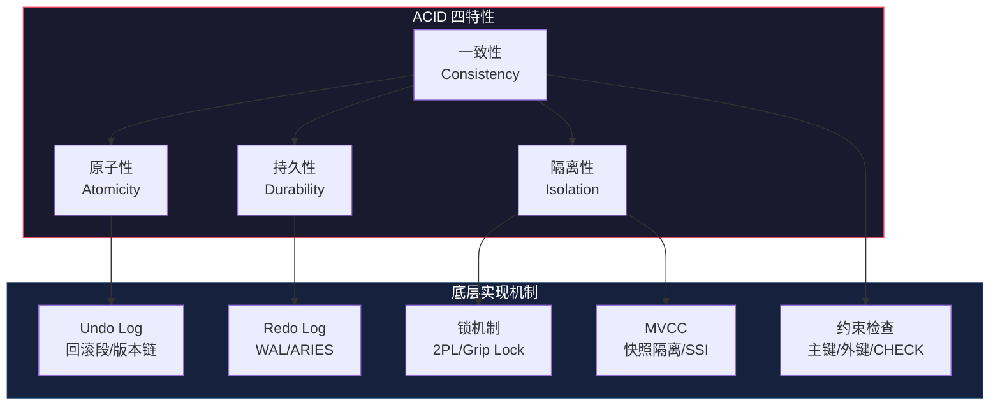

本章内容覆盖从理论基础到工程实战的完整知识链。以下为本章各部分的定位：

| 部分 | 内容定位 | 适合读者 |
|------|---------|---------|
| 理论基础 | ACID实现机制、2PL、死锁、MVCC、隔离级别、OCC、时间戳排序 | 所有读者 |
| 核心技巧 | 锁管理器设计、死锁优化、快照优化、长事务、Gap Lock、分布式事务 | 中级开发者 |
| 实战案例 | 死锁排查、表膨胀、隔离级别选择、分布式事务电商方案 | 高级开发者/DBA |
| 常见误区 | RR防幻读、MVCC与锁、死锁检测、乐观锁vs悲观锁 | 所有读者 |
| 练习方法 | 动手实验、工具使用、算法实现、源码阅读 | 所有读者 |

## 本章定位

在前面的章节中，我们已经了解了数据库的存储引擎（第13章）、索引实现（第14章）和WAL机制（第11章）。事务与并发控制是将这些组件串联起来的关键机制：原子性通过Undo Log实现，持久性通过Redo Log（WAL）实现，隔离性通过锁和MVCC实现，而一致性则是这三者共同保证的结果。

本章将从**实现者**的视角，详细讲解每种机制的算法、数据结构和工程细节。读者将理解为什么MySQL InnoDB选择MVCC+2PL的组合，PostgreSQL如何判断元组的可见性，以及各种隔离级别在底层是如何实现的。

## 学习目标

完成本章学习后，读者应能够：

1. **理解ACID的实现机制**：掌握原子性（Undo Log）、持久性（Redo Log/WAL）、隔离性（锁/MVCC）的具体实现方式，理解一致性是如何由这三者共同保证的。

2. **掌握两阶段锁协议（2PL）**：理解Basic 2PL、Strict 2PL、Rigorous 2PL的区别和适用场景，理解锁的升级、降级和转换规则。

3. **理解死锁的检测与预防**：掌握Wait-For Graph死锁检测算法，理解Wound-Wait和Wait-Die两种死锁预防策略的区别。

4. **深入理解MVCC**：掌握快照隔离（Snapshot Isolation）和可串行化快照隔离（SSI）的理论基础，理解PostgreSQL和MySQL InnoDB中MVCC的具体实现差异。

5. **掌握各种隔离级别**：理解Read Uncommitted、Read Committed、Repeatable Read、Serializable四种标准隔离级别的实现方式和异常现象（脏读、不可重复读、幻读、写偏斜）。

6. **理解乐观并发控制（OCC）**：掌握OCC的三阶段协议（读取→验证→写入），理解OCC在高争用和低争用场景下的性能特征。

7. **了解时间戳排序协议**：理解Thomas Write Rule和多版本时间戳排序的基本原理。

## 知识地图
## 知识地图

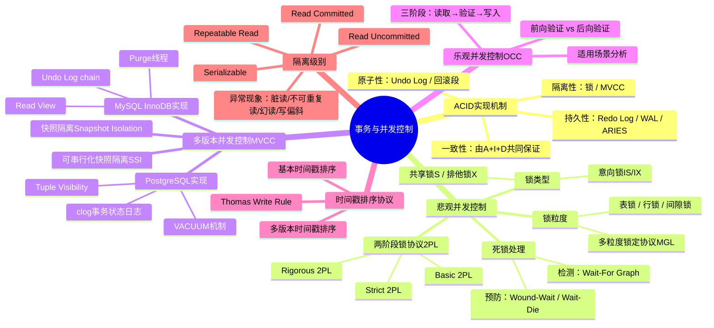

## 前置知识

- 第11章：WAL与持久化
- 第14章：索引实现（特别是B+tree的并发控制）
- 第4章：进程与线程、同步原语
- 第13章：关系型数据库架构

## 参考文献

本章内容参考了以下经典文献：

- Database System Concepts (Silberschatz et al., 第7版)
- Architecture of a Database System (Hellerstein et al., 2007)
- A Critique of ANSI SQL Isolation Levels (Berenson et al., 1995)
- Making Snapshot Isolation Serializable (Cahill et al., 2008)
- Serializable Snapshot Isolation in PostgreSQL (Ports & Grittner, 2012)
- ARIES: A Transaction Recovery Method Supporting Fine-Granularity Locking (Mohan et al., 1992)
- Weikum & Vossen, Transactional Information Systems (2002)


***

# 事务与并发控制：理论基础

## 一、ACID特性的实现机制

ACID是事务的四个基本属性：原子性（Atomicity）、一致性（Consistency）、隔离性（Isolation）、持久性（Durability）。教科书通常将它们并列描述，但从实现角度来看，它们的实现机制完全不同，且一致性更多是其他三者共同作用的结果。本节将逐一拆解每个特性的底层实现。

### 1.1 原子性：Undo Log与事务回滚

原子性的核心要求是：事务中的所有操作要么全部成功，要么全部撤销，不存在中间状态。在数据库崩溃恢复或显式ROLLBACK时，系统必须能够撤销已执行的操作。

**Undo Log的基本原理**

Undo Log（撤销日志）记录了数据修改前的旧值。当事务需要回滚时，系统根据Undo Log逐条反向恢复数据。Undo Log的记录格式通常包含：

<事务ID, 操作类型, 表ID, 行ID, 旧值, 新值>

对于不同的操作类型，Undo Log的记录内容不同：

- **INSERT**：回滚时执行DELETE，Undo Log记录新插入行的标识
- **DELETE**：回滚时执行INSERT，Undo Log记录被删除行的完整数据
- **UPDATE**：回滚时执行反向UPDATE，Undo Log记录修改前的旧值

**Undo Log的存储结构**

在MySQL InnoDB中，Undo Log存储在回滚段（Rollback Segment）中。每个回滚段包含多个Undo Log Slot。InnoDB的Undo Log采用链表结构组织：同一事务的多个Undo Log记录通过链表串联，便于事务回滚时的反向遍历。

事务T1的Undo Log链：
[T1-Undo-3] → [T1-Undo-2] → [T1-Undo-1]
  (最后操作)     (中间操作)     (最初操作)

回滚时，系统从链表尾部开始，逐条执行反向操作：

```pseudocode
function rollback(transaction):
    undo_log_chain = get_undo_log_chain(transaction)
    for log in reverse(undo_log_chain):
        if log.type == INSERT:
            delete_row(log.table, log.row_id)
        elif log.type == DELETE:
            insert_row(log.table, log.old_value)
        elif log.type == UPDATE:
            update_row(log.table, log.row_id, log.old_value)
    mark_transaction_aborted(transaction)
```

**PostgreSQL的Undo实现**

与InnoDB不同，PostgreSQL没有独立的Undo Log。它采用"将旧版本保留在原表中"的策略：UPDATE操作不是原地修改，而是插入一个新版本的元组（tuple），旧版本仍然保留在数据页中。回滚时，只需将新插入的元组标记为无效即可。这种方式简化了回滚逻辑，但导致了表膨胀（table bloat）问题，需要VACUUM机制定期清理。

### 1.2 持久性：Redo Log与Write-Ahead Logging

持久性保证已提交事务的修改不会因系统崩溃而丢失。这通过Write-Ahead Logging（WAL）协议实现：在修改数据页之前，必须先将修改记录写入持久化的日志文件。

**WAL协议的两条规则**

1. **日志先行规则**：数据页的修改必须在其对应的日志记录写入稳定存储之后
2. **提交规则**：事务的COMMIT记录必须在所有日志记录写入稳定存储之后才能返回

**Redo Log的记录格式**

<LSN, 事务ID, 操作类型, 表空间ID, 页面号, 偏移量, 修改后数据>

其中LSN（Log Sequence Number）是日志的唯一标识，通常是一个单调递增的64位整数。LSN在崩溃恢复中起关键作用：恢复过程根据LSN判断哪些修改已经应用到数据页，哪些还需要重做。

**ARIES恢复算法**

ARIES（Algorithm for Recovery and Isolation Exploiting Semantics）是工业界最广泛采用的崩溃恢复算法，由Mohan等人在1992年提出。它包含三个阶段：

```pseudocode
function ARIES_recovery():
    // 阶段1：分析（Analysis）
    // 从最后一个checkpoint开始，扫描Redo Log
    // 确定哪些事务在崩溃时处于活跃状态
    // 确定需要重做的最早日志记录（Redo LSN）
    (active_transactions, dirty_pages, redo_lsn) = analysis_pass(last_checkpoint)

    // 阶段2：重做（Redo）
    // 从redo_lsn开始，重新应用所有日志记录
    // 使用page_lsn判断是否需要重做
    for log_record in scan_log(redo_lsn):
        page = read_page(log_record.page_id)
        if page.lsn < log_record.lsn:
            apply_redo(page, log_record)
            page.lsn = log_record.lsn

    // 阶段3：撤销（Undo）
    // 回滚所有未提交的活跃事务
    for txn in active_transactions:
        rollback(txn)
```

ARIES的精妙之处在于：重做阶段采用"无条件重做"策略——即使数据页可能已经包含了该修改，也要重新应用。这简化了恢复逻辑，因为不需要判断修改是否已落盘。重做操作必须是幂等（idempotent）的。

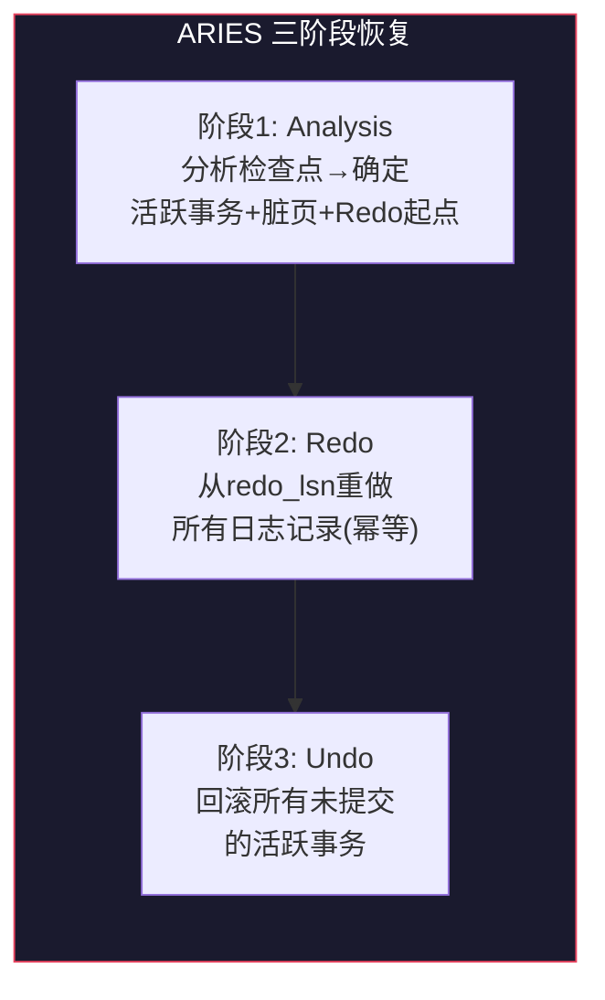

**Group Commit优化**

在高吞吐场景下，频繁的fsync调用会成为性能瓶颈。Group Commit通过批量合并提交来减少磁盘同步次数：

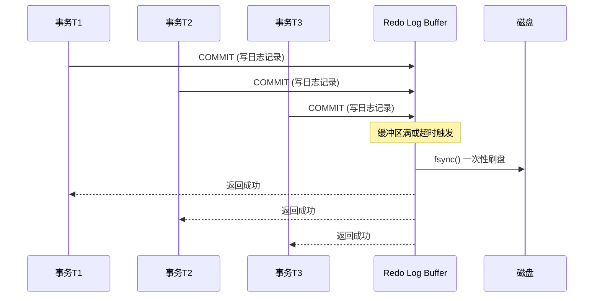

Group Commit的关键参数（以MySQL InnoDB为例）：

| 参数 | 默认值 | 作用 |
|------|--------|------|
| `innodb_flush_log_at_trx_commit=1` | 1 | 每次提交都fsync（最安全） |
| `innodb_flush_log_at_trx_commit=2` | — | 每次提交写OS缓存，每秒fsync |
| `innodb_flush_log_at_trx_commit=0` | — | 每秒写入+fsync（最快但可能丢数据） |
| `binlog_group_commit_sync_delay` | 0 | 提交延迟（微秒），增加合并机会 |
| `binlog_group_commit_sync_no_delay_count` | 0 | 等待此数量事务后再提交 |

在`innodb_flush_log_at_trx_commit=1`的情况下，InnoDB仍会使用Group Commit：多个同时到达的COMMIT请求共享一次fsync，而非各自独立刷盘。这使得在高并发下，实际的fsync频率远低于COMMIT频率。

### 1.3 隔离性：锁机制与MVCC

隔离性保证并发事务之间互不干扰。实现隔离性的两大主流技术是**锁机制**和**多版本并发控制（MVCC）**，现代数据库通常两者结合使用。

**锁机制的基本概念**

锁是最基本的并发控制机制。通过在访问数据前加锁，保证同一时刻只有一个事务能修改特定数据。最基础的锁类型包括：

| 锁类型 | 兼容性 | S锁 | X锁 |
|--------|--------|-----|-----|
| 共享锁（S锁） | 读操作 | 兼容 | 冲突 |
| 排他锁（X锁） | 写操作 | 冲突 | 冲突 |

锁的管理由锁管理器（Lock Manager）负责。锁管理器维护一个锁表（Lock Table），通常以哈希表实现，键为资源标识（如表ID+行ID），值为该资源上的锁请求队列。

**MVCC的基本思想**

MVCC通过维护数据的多个版本，允许读操作访问旧版本数据而不被写操作阻塞。每个事务在开始时获取一个"快照"（snapshot），后续的读操作只看到快照中的数据状态。写操作创建新版本，但不覆盖旧版本。

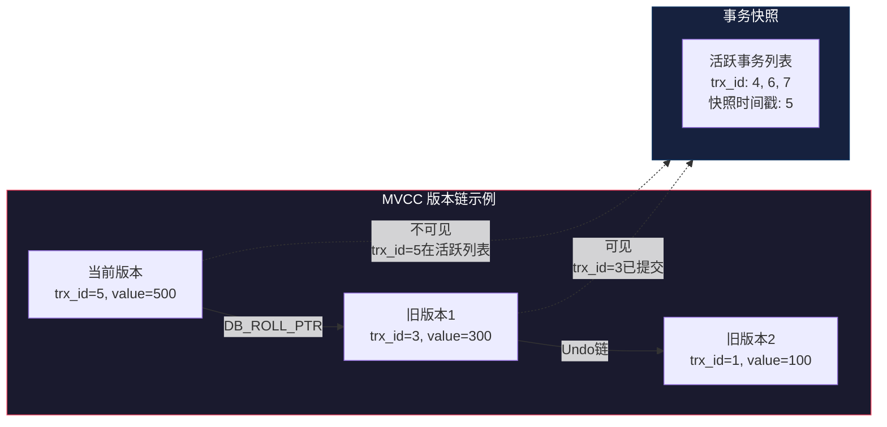

MVCC的核心优势：**读不阻塞写，写不阻塞读**。这在读多写少的场景下能显著提升并发性能。

### 1.4 一致性：约束检查与触发器

一致性是事务的最终目标：事务执行前后，数据库满足所有完整性约束。从实现角度看，一致性并非由单一机制保证，而是原子性、隔离性和持久性三者共同作用的结果，再加上数据库自身的约束检查机制。

约束检查包括：
- **主键约束**：通过唯一索引保证
- **外键约束**：通过引用完整性检查保证
- **CHECK约束**：通过表达式求值保证
- **触发器**：通过在DML操作前后执行用户定义的逻辑保证

## 二、两阶段锁协议（2PL）详解

两阶段锁协议是保证可串行化的经典算法。它规定事务的加锁和解锁行为必须分为两个阶段。

### 2.1 Basic 2PL

Basic 2PL将事务分为两个阶段：

- **增长阶段（Growing Phase）**：事务可以获取锁，但不能释放锁
- **缩减阶段（Shrinking Phase）**：事务可以释放锁，但不能获取新锁

```pseudocode
class Basic2PLTransaction:
    phase = GROWING
    lock_set = {}

    function lock(resource, mode):
        if phase == SHRINKING:
            abort(transaction)  // 违反2PL规则
            return
        lock_manager.acquire(this, resource, mode)
        lock_set.add((resource, mode))

    function unlock(resource):
        phase = SHRINKING
        lock_manager.release(this, resource)
        lock_set.remove(resource)
```

**定理**：如果所有事务都遵循2PL协议，则任何并发调度都是可串行化的。

**证明思路**：构建优先图（Precedence Graph）。如果事务Ti在资源R上持有锁时，事务Tj请求同一资源的冲突锁，则在优先图中添加边 Ti → Tj。可以证明2PL保证优先图无环，因此调度是可串行化的。

然而，Basic 2PL存在**级联回滚（Cascading Rollback）**问题：事务在缩减阶段释放锁后，其他事务可能读取了该事务尚未提交的数据。如果该事务最终回滚，所有依赖它的事务也必须回滚。

### 2.2 Strict 2PL

Strict 2PL要求所有**写锁（X锁）**必须在事务结束（COMMIT或ABORT）时才能释放。读锁（S锁）仍然可以在缩减阶段提前释放。

Strict 2PL规则：
- 获取锁：增长阶段可以获取S锁和X锁
- 释放S锁：可以在缩减阶段释放
- 释放X锁：必须在事务结束时释放

Strict 2PL消除了级联回滚问题，因为任何事务读取的数据都来自已提交的事务（已提交事务的X锁保证了这一点）。

### 2.3 Rigorous 2PL

Rigorous 2PL（也称为Strong Strict 2PL）是最严格的变体：**所有锁**（包括S锁和X锁）都必须在事务结束时才能释放。

```pseudocode
class Rigorous2PLTransaction:
    lock_set = {}

    function lock(resource, mode):
        lock_manager.acquire(this, resource, mode)
        lock_set.add((resource, mode))

    function commit():
        // 所有操作完成后，一次性释放所有锁
        for (resource, mode) in lock_set:
            lock_manager.release(this, resource)
        lock_set.clear()

    function abort():
        // 回滚操作
        rollback_all()
        // 释放所有锁
        for (resource, mode) in lock_set:
            lock_manager.release(this, resource)
        lock_set.clear()
```

Rigorous 2PL的简化之处在于：事务的等价串行顺序就是事务提交的顺序。这大大简化了可串行化验证和并发控制的实现。MySQL InnoDB实际上采用的就是Rigorous 2PL。

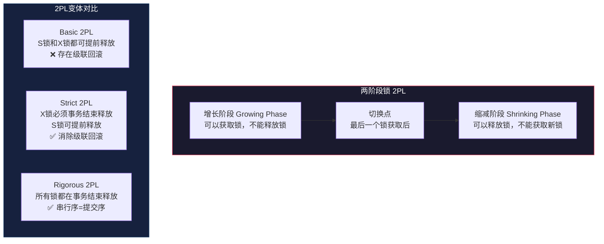

### 2.4 多粒度锁定协议（Multi-Granularity Locking）

实际数据库中，数据的组织具有层次结构：数据库 → 表 → 页 → 行 → 字段。多粒度锁定协议（MGL）允许事务在不同粒度级别上加锁，以在并发度和锁管理开销之间取得平衡。

**锁粒度层次**：

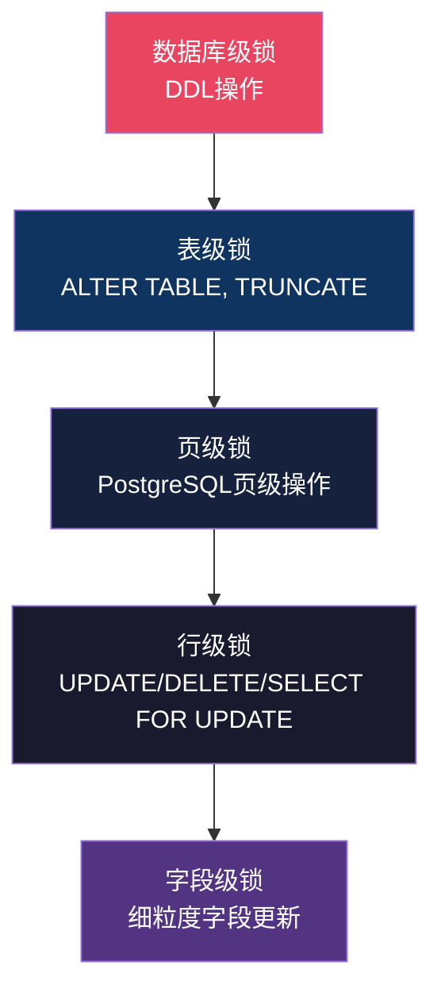

**粒度越大**：并发度越低，但锁管理开销越小（需要管理的锁数量少）
**粒度越小**：并发度越高，但锁管理开销越大（需要管理的锁数量多）

**MGL的加锁规则**：

要对某个节点加锁，必须先对其所有祖先节点加**意向锁**。这确保了自顶向下的锁定一致性：

```sql
-- 例：要锁定表T中的行R
-- 1. 先在数据库级获取意向锁（IS或IX）
-- 2. 再在表T上获取意向锁（IS或IX）
-- 3. 最后在行R上获取具体锁（S或X）
```

**意向锁的作用**：意向锁解决了"判断表级锁与行级锁是否冲突"的问题。当事务请求表级X锁时，只需检查表上是否有意向锁——如果有，说明某些行已被锁定，直接拒绝，无需遍历所有行。

**锁升级（Lock Escalation）**：当一个事务持有太多行锁时，系统可能自动将多个行锁升级为一个页锁或表锁，以减少锁管理器的内存占用。例如，InnoDB会监控单个事务持有的锁数量，超过阈值时考虑升级。锁升级虽然减少了内存开销，但降低了并发度——被升级的范围内其他事务将被完全阻塞。

**锁降级（Lock Demotion）**：与升级相反，在某些情况下（如事务进入缩减阶段），可以将持有的锁降级。但需要注意降级可能导致违反2PL协议。

### 2.5 2PL的可串行化证明

**定理**：遵循2PL协议的调度是冲突可串行化的。

**证明**：

假设存在一个遵循2PL的调度S，其优先图中存在环 T1 → T2 → ... → Tn → T1。

对于环中的每条边 Ti → Ti+1，存在某个资源R使得：
- Ti持有R上的锁（至少与Ti+1请求的锁冲突）
- Ti+1等待获取R上的锁

考虑T1和T2之间存在冲突操作OP1和OP2：
- T1先获取R上的锁
- T2后请求R上的冲突锁，被阻塞
- T1在某个时刻释放R上的锁（进入缩减阶段）
- T2获得R上的锁

由于T1已进入缩减阶段，它不能获取新锁。但Tn → T1的边意味着T1还需要等待Tn释放某个锁——这要求T1获取新锁，与2PL矛盾。因此优先图中不可能存在环。

## 三、死锁处理

当两个或多个事务互相等待对方释放锁时，就产生了死锁。死锁是2PL协议的固有问题，需要专门的机制来处理。

### 3.1 死锁检测：Wait-For Graph算法

Wait-For Graph（等待图）是最常用的死锁检测算法。系统维护一个有向图，节点表示事务，边 Ti → Tj 表示事务Ti正在等待事务Tj释放锁。

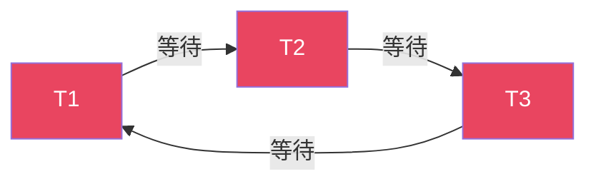

```sql
-- 上图所示的死锁场景
-- T1持有A锁，等待B锁
-- T2持有B锁，等待C锁
-- T3持有C锁，等待A锁 → 形成环路 → 死锁！
```

```pseudocode
function detect_deadlock():
    wfg = build_wait_for_graph()
    // 使用DFS检测环
    visited = {}
    for node in wfg.nodes:
        if node not in visited:
            if has_cycle(wfg, node, visited, {}):
                return true
    return false

function has_cycle(graph, node, visited, stack):
    visited[node] = true
    stack[node] = true
    for neighbor in graph.neighbors(node):
        if neighbor in stack:
            return true  // 找到环
        if neighbor not in visited:
            if has_cycle(graph, neighbor, visited, stack):
                return true
    stack[node] = false
    return false
```

**检测策略**：系统通常不会在每次锁等待时都检测死锁，而是采用以下策略之一：

1. **定时检测**：每隔固定时间（如InnoDB默认的`innodb_deadlock_detect`周期）检测一次
2. **等待超时**：锁等待超过阈值（如InnoDB默认50秒）后触发检测
3. **基于图搜索深度限制**：限制DFS的搜索深度以控制检测开销

当检测到死锁时，系统选择一个"牺牲者"事务进行回滚。选择标准通常考虑：
- 事务已执行的时间（回滚代价最小的优先）
- 事务已持有的锁数量
- 事务已完成的工作量

### 3.2 死锁预防：Wait-Die和Wound-Wait

死锁预防策略通过在加锁前强制执行某种顺序来避免死锁的产生。最经典的两种策略基于事务的时间戳：

**Wait-Die策略**：
- 如果Ti的时间戳 < Tj的时间戳（Ti更老），则Ti**等待**Tj
- 如果Ti的时间戳 > Tj的时间戳（Ti更新），则Ti**死亡**（自行回滚）

```pseudocode
function wait_die(requester, holder, resource):
    if requester.timestamp < holder.timestamp:
        // requester更老，等待
        wait(requester, holder, resource)
    else:
        // requester更新，自我回滚
        abort(requester)
        // requester以相同时间戳重启
        restart_with_same_timestamp(requester)
```

**Wound-Wait策略**：
- 如果Ti的时间戳 < Tj的时间戳（Ti更老），则Ti**伤害**Tj（强制回滚Tj）
- 如果Ti的时间戳 > Tj的时间戳（Ti更新），则Ti**等待**Tj

```pseudocode
function wound_wait(requester, holder, resource):
    if requester.timestamp < holder.timestamp:
        // requester更老，伤害holder
        abort(holder)
        // holder以相同时间戳重启
        restart_with_same_timestamp(holder)
        grant_lock(requester, resource)
    else:
        // requester更新，等待
        wait(requester, holder, resource)
```

两种策略的关键区别：
- **Wait-Die**：老事务等待，新事务回滚。被回滚的事务是发起请求的事务
- **Wound-Wait**：老事务抢占，新事务等待。被回滚的是持有锁的事务

Wound-Wait通常优于Wait-Die，因为老事务不会被回滚（减少不必要的工作浪费）。但两者都能保证无死锁，因为时间戳的全序关系保证了不会出现循环等待。

### 3.3 死锁避免：银行家算法变体

银行家算法（Banker's Algorithm）在加锁前检查是否会导致不安全状态。如果授予锁后可能导致死锁，则延迟授予。由于其高昂的运行时开销，数据库系统很少直接使用银行家算法，但某些系统会使用基于资源预估的简化变体。

## 四、MVCC理论与实现

多版本并发控制（MVCC）是现代数据库系统最核心的并发控制机制。它通过维护数据的多个历史版本，实现了读写操作的并发执行。

### 4.1 快照隔离（Snapshot Isolation）

快照隔离是MVCC最基础的隔离级别。其核心思想：

1. 事务开始时获取一个**快照**，包含所有在该时刻已提交的事务的修改
2. 所有读操作基于快照数据，不受后续提交的其他事务影响
3. 写操作创建新版本，但不影响其他事务的快照
4. 提交时进行**First-Committer-Wins**规则检查：如果两个并发事务修改了同一数据，先提交的成功，后提交的回滚

```pseudocode
function begin_transaction():
    txn = new Transaction()
    txn.start_ts = get_current_timestamp()
    txn.snapshot = get_active_snapshot()
    return txn

function read(txn, key):
    // 从版本链中找到对txn可见的最新版本
    version_chain = get_version_chain(key)
    for version in version_chain:
        if is_visible(version, txn):
            return version.value
    return NOT_FOUND

function commit(txn):
    // First-Committer-Wins检查
    for write in txn.write_set:
        current_version = get_latest_version(write.key)
        if current_version.commit_ts > txn.start_ts:
            abort(txn)  // 写冲突
            return
    txn.commit_ts = get_next_timestamp()
    // 发布所有新版本
    for write in txn.write_set:
        publish_version(write.key, write.value, txn.commit_ts)
```

快照隔离**不能**防止**写偏斜（Write Skew）**异常。考虑以下场景：

初始状态：账户A余额=500，账户B余额=500，约束：A+B >= 0
事务T1：读A=500，读B=500，写A=0（从A取500）
事务T2：读A=500，读B=500，写B=0（从B取500）
两者都基于各自的快照读取，都认为满足约束
结果：A=0，B=0，A+B=0，但两者各取了500，实际A+B应=-500，违反约束

### 4.2 可串行化快照隔离（SSI）

SSI在快照隔离的基础上增加了写偏斜的检测能力。其核心思想是检测读写依赖关系中的危险结构。

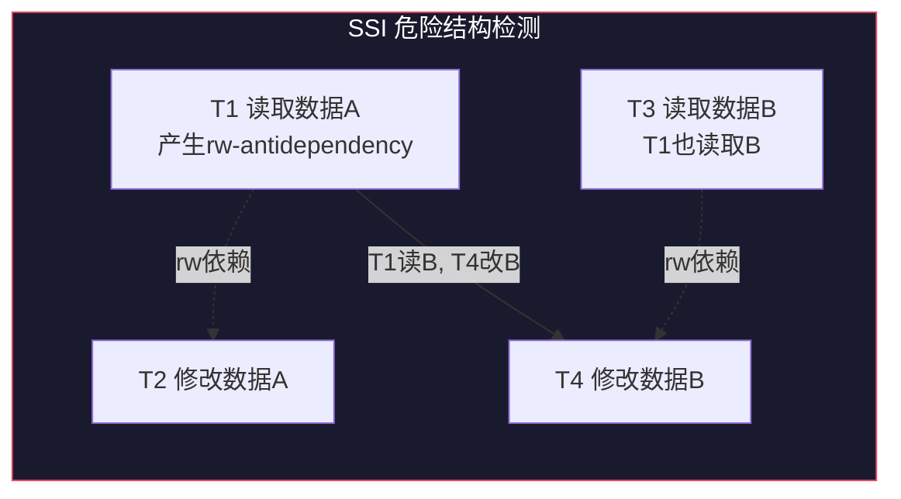

**危险结构**：如果存在事务T1、T2、T3使得：
- T1读取了某个数据项（产生rw-antidependency）
- T2修改了该数据项
- T3与T1存在类似关系

则可能产生不可串行化的调度。SSI通过在元组级别维护"读标记"和"写标记"来检测这种危险结构。

PostgreSQL从9.1版本开始实现了SSI。其实现要点：
- 在每个元组上维护SIREAD锁信息，记录哪些事务读取了该元组
- 当一个事务修改某元组时，检查是否有并发事务读取了该元组
- 如果检测到危险结构，回滚其中一个事务

### 4.3 多版本存储：版本链与垃圾回收

MVCC系统的核心数据结构是**版本链（Version Chain）**。每个数据项维护一个版本列表，记录其所有历史版本。

版本链的组织方式有两种：

**1. 追加式（Append-only）**：新版本追加到链头

当前版本 → 旧版本1 → 旧版本2 → ... → 初始版本

**2. 原地更新+Undo链**：当前数据在数据页中，旧版本在Undo Log中（InnoDB方式）

数据页中的当前元组 ← Undo Log中的旧版本1 ← Undo Log中的旧版本2

**垃圾回收（Garbage Collection）**

不再被任何活跃事务需要的旧版本必须被回收。判断标准：如果一个版本的创建事务ID小于所有活跃快照的最小事务ID，则该版本可以被回收。

```pseudocode
function garbage_collect():
    oldest_active_snapshot = get_oldest_active_snapshot()
    for each version in all_versions:
        if version.max_txn_id < oldest_active_snapshot:
            reclaim_space(version)
```

### 4.4 可见性判断算法

MVCC的核心算法是判断某个版本对当前事务是否可见。以下是一个通用的可见性判断算法：

```pseudocode
function is_visible(version, txn):
    // version由事务creator创建，由事务deleter删除
    creator = version.xmin  // 创建该版本的事务ID
    deleter = version.xmax  // 删除/更新该版本的事务ID（0表示未删除）

    // 规则1：如果创建者未提交，不可见
    if not is_committed(creator):
        return false
    // 规则2：如果创建者在当前事务开始之后才提交，不可见
    if get_commit_timestamp(creator) > txn.snapshot_timestamp:
        return false
    // 规则3：如果版本未被删除，可见
    if deleter == 0:
        return true
    // 规则4：如果删除者未提交或在当前事务快照之后才删除，可见
    if not is_committed(deleter):
        return true
    if get_commit_timestamp(deleter) > txn.snapshot_timestamp:
        return true
    // 规则5：版本已被删除且删除者在快照之前已提交，不可见
    return false
```

## 五、隔离级别详解

SQL标准定义了四种隔离级别，每种级别允许不同的异常现象。但标准定义基于锁模型，与实际数据库的MVCC实现存在语义差异。

### 5.1 Read Uncommitted

最低隔离级别，允许读取未提交的数据（脏读）。

**实现**：读操作不获取任何锁，写操作获取X锁。

**允许的异常**：脏读、不可重复读、幻读、写偏斜。

**应用场景**：几乎不用于生产环境。偶尔用于近似统计查询（如`SELECT COUNT(*)`），此时准确性可以妥协以换取性能。

### 5.2 Read Committed

保证读取的数据都是已提交的。这是PostgreSQL的默认隔离级别。

**实现**（MVCC方式）：每条SQL语句开始时获取新的快照，而不是事务开始时。因此同一事务中不同语句可能看到不同的数据状态。

```pseudocode
// Read Committed的快照获取
function execute_statement(txn):
    txn.current_snapshot = get_current_snapshot()  // 每条语句重新获取快照
    execute(txn, txn.current_snapshot)
```

**允许的异常**：不可重复读、幻读、写偏斜。

**不允许的异常**：脏读。

### 5.3 Repeatable Read

保证同一事务中多次读取同一数据的结果一致。这是MySQL InnoDB的默认隔离级别。

**实现**（MVCC方式）：事务开始时获取一次快照，后续所有读操作都基于该快照。

```pseudocode
// Repeatable Read的快照获取
function begin_transaction(txn):
    txn.snapshot = get_current_snapshot()  // 只在事务开始时获取一次
    // 后续所有读操作使用txn.snapshot
```

**允许的异常**：幻读（SQL标准定义下允许，但InnoDB通过Gap Lock基本消除了幻读）、写偏斜。

**不允许的异常**：脏读、不可重复读。

### 5.4 Serializable

最强的隔离级别，保证并发执行的结果等价于某种串行执行。

**实现**：有多种方式：
1. **严格两阶段锁（Rigorous 2PL）**：所有读写操作加锁
2. **SSI**：在快照隔离基础上检测写偏斜
3. **实际串行执行**：如SQLite的WAL模式

**不允许的异常**：脏读、不可重复读、幻读、写偏斜。

### 5.5 异常现象总结

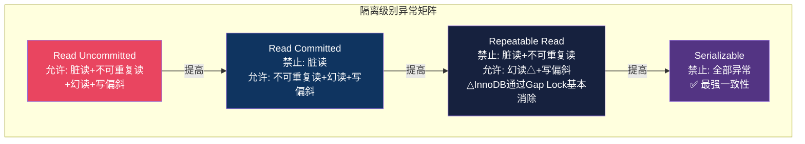

| 异常现象 | 定义 | RC | RR | SSI/Serializable |
|----------|------|----|----|------------------|
| 脏读 | 读取未提交数据 | ✗ | ✗ | ✗ |
| 不可重复读 | 同一事务两次读取结果不同 | ✓ | ✗ | ✗ |
| 幻读 | 范围查询结果集变化 | ✓ | △* | ✗ |
| 写偏斜 | 并发写入导致约束违反 | ✓ | ✓ | ✗ |

*注：InnoDB的RR级别通过Gap Lock基本消除了幻读，但不是SQL标准定义的严格RR。

## 六、PostgreSQL的MVCC实现

PostgreSQL采用"追加式"MVCC：UPDATE操作不是原地修改，而是插入一个新版本的元组（tuple），旧版本保留在原数据页中。

### 6.1 Heap Tuple的元组头结构

每个Heap Tuple都有一个元组头（HeapTupleHeaderData），包含MVCC所需的关键字段：

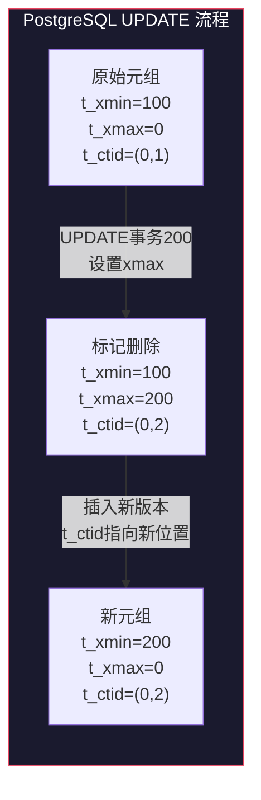

HeapTupleHeaderData {
    t_xmin:      事务ID，插入该元组的事务
    t_xmax:      事务ID，删除或更新该元组的事务（0表示未删除）
    t_cid:       命令ID，同一事务内不同SQL语句的序号
    t_ctid:      当前元组的物理位置（block_number, offset）
    // t_ctid也用于版本链：UPDATE后，旧版本的t_ctid指向新版本
    t_infomask:  各种标志位（如HEAP_XMIN_COMMITTED, HEAP_XMAX_INVALID等）
}

当UPDATE发生时：
1. 在原元组上设置t_xmax = 当前事务ID
2. 在同一数据页或新数据页中插入新元组，设置t_xmin = 当前事务ID
3. 将旧元组的t_ctid指向新元组的位置

### 6.2 可见性判断的完整算法

PostgreSQL的元组可见性判断（HeapTupleSatisfiesMVCC）是整个MVCC实现的核心：

```pseudocode
function HeapTupleSatisfiesMVCC(tuple, snapshot):
    xmin = tuple.t_xmin
    xmax = tuple.t_xmax

    // 检查插入者（xmin）是否对当前快照可见
    if not TransactionIdDidCommit(xmin):
        return false  // 插入者未提交或已回滚

    if xmin > snapshot.xmax:
        return false  // 插入者在快照之后才开始

    if xmin in snapshot.active_list:
        return false  // 插入者在快照时刻仍活跃

    // 检查删除者（xmax）
    if xmax == 0:
        return true  // 未被删除

    if xmax in snapshot.active_list:
        return true  // 删除者在快照时刻仍活跃

    if not TransactionIdDidCommit(xmax):
        return true  // 删除者未提交

    if xmax > snapshot.xmax:
        return true  // 删除者在快照之后才提交

    return false  // 删除者在快照之前已提交
```

### 6.3 clog（事务提交日志）

PostgreSQL使用clog（Commit Log）来记录事务的提交状态。clog是一个固定大小的位图文件，每个事务占2位：

- 00：事务正在进行
- 01：事务已提交
- 10：事务已回滚
- 11：（保留）

clog存储在`pg_xact`目录下，每个文件默认256KB，可记录约100万个事务的状态。`TransactionIdDidCommit()`函数通过查询clog来判断事务是否已提交。

### 6.4 VACUUM机制

由于PostgreSQL将旧版本保留在数据页中，长期不清理会导致表膨胀。VACUUM是PostgreSQL清理死元组的机制。

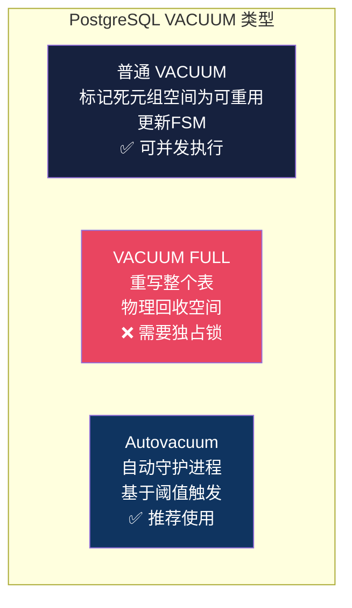

**普通VACUUM**：
- 标记死元组的空间为可重用
- 更新FSM（Free Space Map）
- 不回收表占用的磁盘空间
- 可以与正常读写并发执行

**VACUUM FULL**：
- 重写整个表，物理上回收空间
- 需要独占锁，阻塞所有读写操作
- 通常只在表严重膨胀时使用

**自动VACUUM（Autovacuum）**：
PostgreSQL通过autovacuum守护进程自动执行VACUUM。触发条件基于：
- 死元组数量超过阈值（`autovacuum_vacuum_scale_factor` × 表大小）
- 自上次VACUUM以来的事务ID变化量

### 6.5 快照过旧（Snapshot Too Old）问题

如果一个事务长时间持有旧快照，它可能引用已被VACUUM回收的元组。PostgreSQL 9.6+引入了`old_snapshot_threshold`参数来处理这个问题：当检测到快照引用的元组已被回收时，返回"snapshot too old"错误，而不是返回不一致的数据。

## 七、MySQL InnoDB的MVCC实现

InnoDB采用与PostgreSQL不同的MVCC策略：当前版本在聚簇索引中，旧版本通过Undo Log链维护。

### 7.1 Read View的实现原理

Read View是InnoDB中快照的实现。它包含以下关键信息：

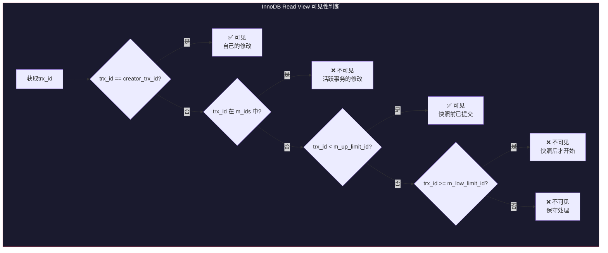

ReadView {
    m_low_limit_id:    高水位，大于此ID的事务不可见
    m_up_limit_id:     低水位，小于此ID的事务可见
    m_creator_trx_id:  创建该Read View的事务ID
    m_ids:             创建Read View时所有活跃事务的ID列表
}

Read View在事务开始时创建（在RR级别），或在每条语句开始时创建（在RC级别）。

### 7.2 Undo Log版本链

InnoDB的聚簇索引中，每个行记录包含两个隐藏列：
- `DB_TRX_ID`：最后修改该行的事务ID
- `DB_ROLL_PTR`：指向Undo Log中旧版本的指针

当UPDATE发生时：
1. 将当前版本的数据复制到Undo Log
2. 在聚簇索引中修改数据，更新DB_TRX_ID为当前事务ID
3. 更新DB_ROLL_PTR指向Undo Log中的旧版本

聚簇索引中的当前行 → Undo Log版本1 → Undo Log版本2 → ... → 最初插入

沿着这条版本链，根据Read View找到第一个可见的版本：

```pseudocode
function read_with_mvcc(row, read_view):
    version = row.current_version
    while version != null:
        if is_visible(version.trx_id, read_view):
            return version.data
        version = version.prev_version  // 通过DB_ROLL_PTR遍历
    return NOT_FOUND

function is_visible(trx_id, read_view):
    if trx_id == read_view.creator_trx_id:
        return true  // 自己的修改总是可见
    if trx_id in read_view.m_ids:
        return false  // 活跃事务的修改不可见
    if trx_id < read_view.m_up_limit_id:
        return true  // 事务在快照之前已提交
    if trx_id >= read_view.m_low_limit_id:
        return false  // 事务在快照之后才开始
    return false
```

### 7.3 Purge线程的工作机制

InnoDB通过Purge线程清理不再需要的Undo Log记录和标记删除的行。Purge线程维护一个**Purge View**，它是最老的活跃事务的Read View。只有那些对Purge View不可见的旧版本才能被清理。

```pseudocode
function purge_worker():
    while true:
        purge_view = get_oldest_active_read_view()
        undo_records = get_purgeable_undo_log(purge_view)
        for record in undo_records:
            // 物理删除标记删除的行
            if record.type == DELETE_MARK:
                physically_delete_row(record)
            // 释放Undo Log空间
            free_undo_log_space(record)
```

### 7.4 聚簇索引与二级索引的一致性读

在InnoDB中，聚簇索引（主键索引）包含完整的行数据，而二级索引只包含索引列和主键值。对于MVCC可见性判断：

- **聚簇索引**：直接通过DB_TRX_ID判断可见性
- **二级索引**：如果二级索引页中包含足够信息（如PAGE_MAX_TRX_ID），可以直接判断；否则需要回表到聚簇索引判断

在InnoDB的实现中，二级索引的更新采用"标记删除+插入新记录"的方式。当事务修改二级索引列时，原记录被标记删除（设置delete mark），新记录被插入。Purge线程在确认所有活跃事务都不再需要旧记录后，物理删除标记删除的记录。

## 八、时间戳排序协议

时间戳排序协议是另一类并发控制方法。它不使用锁，而是为每个事务分配时间戳，并按照时间戳顺序执行操作。

### 8.1 基本时间戳排序

每个数据项X维护两个时间戳：
- `W-timestamp(X)`：成功执行write(X)的最大事务时间戳
- `R-timestamp(X)`：成功执行read(X)的最大事务时间戳

```pseudocode
function timestamp_read(txn, X):
    if txn.ts < W-timestamp(X):
        // 读请求的时间戳小于写时间戳，说明有更新的事务已写入
        abort(txn)  // Thomas Write Rule可以优化此处
    else:
        R-timestamp(X) = max(R-timestamp(X), txn.ts)
        return X.value

function timestamp_write(txn, X):
    if txn.ts < R-timestamp(X):
        // 写请求的时间戳小于读时间戳，说明有更新的事务已读取旧值
        abort(txn)
    elif txn.ts < W-timestamp(X):
        // 写请求的时间戳小于写时间戳，但不小于读时间戳
        // 可以忽略这次写入（Thomas Write Rule）
        skip_write()
    else:
        W-timestamp(X) = txn.ts
        X.value = txn.write_value
```

### 8.2 Thomas Write Rule

Thomas Write Rule是对基本时间戳排序的优化。当 `txn.ts < W-timestamp(X)` 时，不是回滚事务，而是**忽略这次写入**。因为这次写入的值已经被一个更新的事务覆盖了，跳过它不会影响正确性。

Thomas Write Rule使得某些基本时间戳排序认为不可串行化的调度成为可接受的，从而提高了并发度。

### 8.3 多版本时间戳排序

多版本时间戳排序结合了MVCC和时间戳排序的思想。每个数据项维护多个版本，每个版本附带写时间戳：

```pseudocode
function multi_version_read(txn, X):
    // 找到写时间戳 <= txn.ts的最大版本
    for version in reverse(X.versions):
        if version.write_ts <= txn.ts:
            version.read_ts = max(version.read_ts, txn.ts)
            return version.value

function multi_version_write(txn, X, value):
    // 检查是否存在读时间戳 > txn.ts的版本
    for version in X.versions:
        if version.read_ts > txn.ts:
            abort(txn)  // 有更新的事务已读取，不能写入
            return
    // 创建新版本
    new_version = Version(value, txn.ts, 0)
    X.versions.append(new_version)
```

多版本时间戳排序能够保证可串行化，且读操作永远不需要等待。

## 九、乐观并发控制（OCC）

乐观并发控制假设事务冲突很少发生，允许事务在不加锁的情况下执行，仅在提交时验证是否发生冲突。

### 9.1 三阶段：读取、验证、写入

OCC将事务执行分为三个阶段：

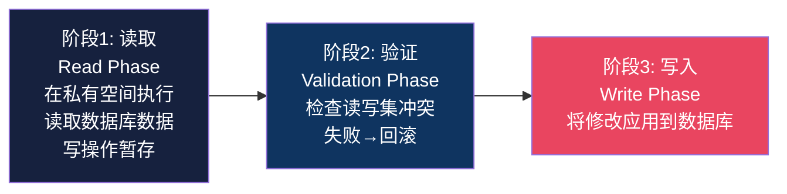

**1. 读取阶段（Read Phase）**
- 事务在私有工作区中执行所有读写操作
- 读操作直接读取数据库中的数据
- 写操作记录在私有工作区中，不立即反映到数据库

**2. 验证阶段（Validation Phase）**
- 检查事务的读取集和写入集是否与其他已提交事务冲突
- 如果验证通过，进入写入阶段
- 如果验证失败，回滚事务

**3. 写入阶段（Write Phase）**
- 将私有工作区中的修改应用到数据库

```pseudocode
class OCCTransaction:
    read_set = {}
    write_set = {}
    start_ts = 0
    validation_ts = 0

    function read(key):
        value = database.read(key)
        read_set[key] = value
        return value

    function write(key, value):
        write_set[key] = value

    function commit():
        // 验证阶段
        validation_ts = get_current_timestamp()
        if not validate(this):
            abort(this)
            return false
        // 写入阶段
        for key, value in write_set:
            database.write(key, value)
        return true
```

### 9.2 向前验证与向后验证

**向后验证（Backward Validation）**：检查已提交事务是否与当前事务冲突。

```pseudocode
function validate_backward(txn):
    for committed_txn in committed_after(txn.start_ts):
        if txn.read_set ∩ committed_txn.write_set != ∅:
            return false  // 读取的数据被后来的事务修改了
    return true
```

**向前验证（Forward Validation）**：检查当前事务是否与活跃事务冲突。

```pseudocode
function validate_forward(txn):
    for active_txn in active_transactions:
        if active_txn.start_ts < txn.validation_ts:
            if txn.write_set ∩ active_txn.read_set != ∅:
                return false  // 当前事务修改了活跃事务读取的数据
    return true
```

向前验证的优势在于：只有当前事务可能需要回滚，不会影响已提交的事务。

### 9.3 OCC的适用场景分析

OCC最适合的场景：
- **读多写少**：事务冲突概率低，验证阶段很少失败
- **短事务**：减少验证窗口期，降低冲突概率
- **低争用**：不同事务访问的数据集重叠少

OCC不适合的场景：
- **高争用**：大量事务访问相同数据，冲突频繁导致大量回滚
- **长事务**：验证窗口期长，冲突概率高，回滚代价大
- **写密集型**：写操作频繁，写偏斜和冲突频繁

OCC与2PL的性能对比：

                低争用          高争用
OCC            优秀（无锁开销）  很差（大量回滚）
2PL            一般（锁管理开销） 较差（锁等待+死锁）

在实际系统中，OCC常用于乐观锁模式（如CAS操作、版本号检查），而2PL（通过数据库锁机制实现）用于悲观场景。现代数据库如MySQL InnoDB和PostgreSQL实际上结合了两种思想：读操作使用MVCC（类似OCC），写操作使用2PL。

***

**参考文献**：

1. Gray, J. & Reuter, A. *Transaction Processing: Concepts and Techniques*. Morgan Kaufmann, 1993.
2. Mohan, C. et al. *ARIES: A Transaction Recovery Method Supporting Fine-Granularity Locking*. ACM TODS, 1992.
3. Berenson, H. et al. *A Critique of ANSI SQL Isolation Levels*. SIGMOD, 1995.
4. Cahill, M. J. et al. *Making Snapshot Isolation Serializable*. ACM TODS, 2008.
5. Ports, D. R. K. & Grittner, K. *Serializable Snapshot Isolation in PostgreSQL*. PVLDB, 2012.
6. Petrov, A. *Database Internals*. O'Reilly, 2019.
7. Hellerstein, J. M. et al. *Architecture of a Database System*. Foundations and Trends in Databases, 2007.


***

# 事务与并发控制：核心技巧

## 一、锁管理器的内存结构设计

锁管理器是数据库并发控制的核心组件，其内存结构设计直接影响系统的并发性能。一个高效的锁管理器需要满足以下要求：快速的锁请求查找、高效的死锁检测、以及低内存占用。

### 1.1 锁表（Lock Table）的设计

锁表是锁管理器的核心数据结构，通常采用**哈希表+链表**的组合设计：

Lock Table (Hash Table)
┌──────────┬─────────────────────────────────────┐
│ Hash Key │ Lock Request Chain                    │
├──────────┼─────────────────────────────────────┤
│ RowID=1  │ [T1:S] → [T2:X:WAITING] → [T3:S]    │
│ RowID=2  │ [T1:X]                               │
│ RowID=3  │ [T4:S] → [T5:S]                      │
│ ...      │ ...                                   │
└──────────┴─────────────────────────────────────┘

每个锁请求包含以下信息：

```c
struct LockRequest {
    TransactionId txn_id;      // 请求事务ID
    LockMode      mode;        // 锁模式（S/X/IS/IX/SIX）
    LockStatus    status;      // GRANTED 或 WAITING
    LockRequest*  next;        // 链表指针
    LockRequest*  prev;        // 双向链表指针
    Timestamp     wait_start;  // 等待开始时间（用于超时检测）
};

struct LockBucket {
    ResourceId     resource_id;    // 锁资源标识
    LockRequest*   head;           // 请求链表头
    int            granted_count;  // 已授予的锁数量
    LockMode       granted_mode;   // 当前已授予锁的最高模式
    pthread_mutex_t mutex;         // 桶级别的互斥锁
};
```

**关键优化技巧**：

1. **桶级锁粒度**：每个哈希桶使用独立的互斥锁，而非全局锁，减少锁管理器本身的竞争
2. **锁升级优化**：当事务请求X锁且已持有S锁时，直接在现有锁请求上升级，而非创建新请求
3. **批量释放**：事务提交时一次性释放所有锁，而非逐个释放

### 1.2 锁的内存分配策略

锁请求对象需要频繁分配和释放。为了避免频繁的内存分配开销，通常采用以下策略：

- **内存池（Memory Pool）**：预分配一批锁请求对象，通过空闲链表管理
- **Slab分配器**：按固定大小分配，减少内存碎片
- **Per-Transaction缓存**：每个事务结构体中预留一定数量的锁请求槽位

```pseudocode
class LockRequestPool:
    free_list = {}
    pool_size = 10000

    function init():
        for i in range(pool_size):
            free_list.push(allocate_lock_request())

    function acquire():
        if free_list.is_empty():
            expand_pool()  // 扩展内存池
        return free_list.pop()

    function release(request):
        request.reset()
        free_list.push(request)
```

## 二、死锁检测的优化：超时+图检测组合策略

在高并发系统中，频繁的死锁检测会带来显著的性能开销。实际系统通常采用**超时+图检测**的组合策略。

### 2.1 分层检测策略

```pseudocode
class DeadlockDetector:
    timeout_threshold = 50  // 秒

    function on_lock_wait(txn):
        // 第一层：快速超时检测
        if txn.wait_duration > timeout_threshold:
            abort(txn, "lock wait timeout")
            return

        // 第二层：轻量级死锁检测（仅检查直接依赖）
        if has_direct_cycle(txn):
            abort(victim_selection(txn))
            return

    // 第三层：周期性全局检测（后台线程）
    function periodic_detection():
        while true:
            sleep(detection_interval)
            wfg = build_wait_for_graph()
            cycles = find_all_cycles(wfg)
            for cycle in cycles:
                victim = select_victim(cycle)
                abort(victim)
```

### 2.2 增量式Wait-For Graph维护

构建完整的Wait-For Graph需要遍历所有锁等待关系，开销较大。增量式维护可以在锁等待关系变化时局部更新：

```pseudocode
class IncrementalWFG:
    adjacency_list = {}  // txn_id → set of txn_ids

    function add_edge(waiter, holder):
        adjacency_list[waiter].add(holder)
        // 检查新增边是否形成环（从waiter开始DFS）
        if has_cycle_from(waiter):
            return find_cycle_containing(waiter)

    function remove_edge(waiter, holder):
        adjacency_list[waiter].remove(holder)
        // 移除边不会产生新环，无需检测
```

### 2.3 事务权重的牺牲者选择

选择牺牲者时，应最小化回滚代价：

```pseudocode
function select_victim(deadlock_cycle):
    min_cost = infinity
    victim = null
    for txn in deadlock_cycle:
        cost = calculate_rollback_cost(txn)
        if cost < min_cost:
            min_cost = cost
            victim = txn
    return victim

function calculate_rollback_cost(txn):
    // 考虑因素：
    // 1. 已持有的锁数量
    // 2. 已修改的行数
    // 3. 事务已执行的时间
    // 4. 是否为交互式事务（用户等待响应）
    cost = txn.lock_count * 10
          + txn.modified_rows * 5
          + txn.elapsed_time * 2
    if txn.is_interactive:
        cost += 1000  // 尽量避免回滚交互式事务
    return cost
```

## 三、MVCC快照获取的性能优化

快照获取是MVCC系统中最频繁的操作之一。每次事务或语句开始时都需要获取快照。优化快照获取性能是MVCC系统调优的关键。

### 3.1 快照缓存

```pseudocode
class SnapshotCache:
    cached_snapshot = null
    cache_valid_until = 0
    cache_mutex = RWLock()

    function get_snapshot():
        now = current_time()
        // 快速路径：使用缓存的快照
        if now < cache_valid_until:
            return cached_snapshot

        // 慢速路径：需要创建新快照
        with cache_mutex.write_lock():
            if now < cache_valid_until:
                return cached_snapshot  // 双重检查
            snapshot = create_new_snapshot()
            cached_snapshot = snapshot
            cache_valid_until = now + CACHE_TTL
            return snapshot
```

### 3.2 活跃事务列表的高效维护

快照的核心是记录当前活跃事务列表。如果活跃事务数量很大，快照会变得很昂贵。

**优化策略**：

1. **位图表示**：用位图替代列表，减少内存占用
2. **范围表示**：如果活跃事务ID连续，用范围表示（如 [100, 200]）
3. **分层快照**：全局快照只记录最小活跃事务ID，局部快照记录具体的活跃事务

```pseudocode
class EfficientSnapshot:
    xmin: TransactionId           // 最小活跃事务ID
    xmax: TransactionId           // 下一个待分配的事务ID
    active_bitmap: BitMap         // [xmin, xmax)范围内的活跃事务位图

    function is_active(txn_id):
        if txn_id < xmin or txn_id >= xmax:
            return false
        return active_bitmap[txn_id - xmin]
```

## 四、长事务的识别与处理

长事务是数据库运维中的常见问题。它们持有旧快照，导致：
- Undo Log/旧版本无法被Purge，造成空间膨胀
- 长时间持有锁，阻塞其他事务
- 快照获取变慢（需要遍历更多活跃事务信息）

### 4.1 长事务检测

```pseudocode
class LongTransactionMonitor:
    threshold = 3600  // 1小时

    function monitor_loop():
        while true:
            sleep(60)  // 每分钟检测一次
            for txn in get_active_transactions():
                age = current_time() - txn.start_time
                if age > threshold:
                    log_warning("Long transaction detected: {txn.id}, age={age}s")
                    if age > threshold * 2:
                        // 可配置：自动回滚超长事务
                        if auto_kill_enabled:
                            abort(txn, "transaction timeout")
```

### 4.2 MySQL中的长事务监控

```sql
-- 查看运行时间最长的事务
SELECT trx_id, trx_state, trx_started,
       TIMESTAMPDIFF(SECOND, trx_started, NOW()) AS duration,
       trx_rows_modified, trx_rows_locked
FROM information_schema.innodb_trx
ORDER BY trx_started ASC
LIMIT 10;

-- 查看最老的活跃事务（影响Purge）
SELECT MIN(trx_id) AS oldest_trx_id
FROM information_schema.innodb_trx;
```

### 4.3 PostgreSQL中的长事务监控

```sql
-- 查看活跃事务
SELECT pid, xact_start, now() - xact_start AS duration,
       state, query
FROM pg_stat_activity
WHERE state != 'idle'
ORDER BY xact_start;

-- 查看最老的快照
SELECT * FROM pg_stat_activity
WHERE backend_type = 'client backend'
ORDER BY xact_start LIMIT 1;
```

## 五、间隙锁（Gap Lock）和临键锁（Next-Key Lock）的实现

InnoDB在RR隔离级别下使用Gap Lock和Next-Key Lock来防止幻读。这是InnoDB对标准RR隔离级别的增强。

### 5.1 Gap Lock的定义与作用

Gap Lock锁定索引记录之间的"间隙"，防止其他事务在间隙中插入新记录。

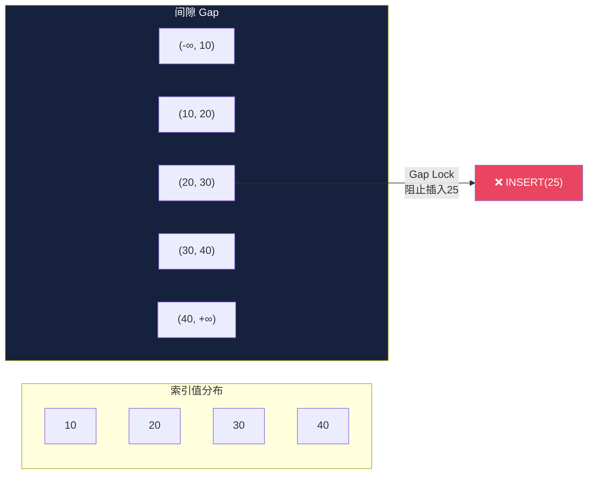

假设索引中有值：[10, 20, 30, 40]

间隙（Gap）：
(-∞, 10), (10, 20), (20, 30), (30, 40), (40, +∞)

Gap Lock on (20, 30)：
- 允许：读取20和30，更新20和30
- 阻塞：在(20, 30)之间插入新值（如25）

### 5.2 Next-Key Lock

Next-Key Lock是**行锁+Gap Lock**的组合。InnoDB默认使用Next-Key Lock：

Next-Key Lock on record 20:
- 锁定记录20本身（行锁）
- 锁定间隙(10, 20)（Gap Lock）

等价于：Gap Lock(10, 20) + Record Lock(20)

### 5.3 实现细节

InnoDB的锁结构需要区分记录锁和间隙锁：

```c
enum lock_type {
    LOCK_ORDINARY,     // Next-Key Lock（默认）
    LOCK_GAP,          // Gap Lock
    LOCK_REC_NOT_GAP,  // 仅记录锁
    LOCK_INSERT_INTENTION  // 插入意向锁
};
```

**加锁逻辑**：

```pseudocode
function lock_rec_insert(index, position):
    // 插入前检查是否有Gap Lock阻止此插入
    gap_locks = find_gap_locks_at(index, position)
    if gap_locks is not empty:
        // 创建插入意向锁并等待
        insert_intention = create_lock(LOCK_INSERT_INTENTION)
        wait_for(gap_locks, insert_intention)

function lock_rec_read(index, position, mode):
    if mode == FOR_UPDATE or mode == FOR_SHARE:
        // 行锁请求，使用Next-Key Lock
        next_key_range = get_next_key_range(index, position)
        lock(index, position, LOCK_ORDINARY)  // Next-Key Lock
```

### 5.4 Gap Lock的死锁风险

Gap Lock容易导致死锁，因为：
1. 多个事务可能在相同间隙上持有兼容的Gap Lock（Gap Lock之间兼容）
2. 但插入操作需要等待Gap Lock释放
3. 如果两个事务分别在对方的Gap上持有锁并尝试插入，就会死锁

T1: SELECT * FROM t WHERE id > 10 FOR UPDATE
    → 获取Gap Lock (10, +∞)

T2: SELECT * FROM t WHERE id > 20 FOR UPDATE
    → 获取Gap Lock (20, +∞)（与T1的Gap Lock兼容）

T1: INSERT INTO t VALUES (25)
    → 等待T2的Gap Lock释放

T2: INSERT INTO t VALUES (15)
    → 等待T1的Gap Lock释放

→ 死锁！

## 六、意向锁（IS/IX）的工作机制

意向锁是表级别的锁，用于表示事务打算在表中的某些行上获取什么类型的锁。意向锁的作用是**快速判断表级锁与行级锁是否冲突**，而无需遍历所有行锁。

### 6.1 锁兼容矩阵（含意向锁）

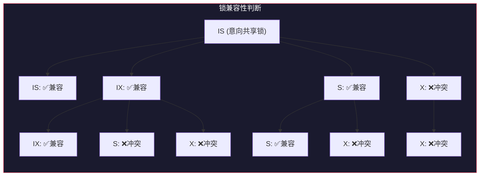

| | IS | IX | S | X |
|---|---|---|---|---|
| **IS** | 兼容 | 兼容 | 兼容 | 冲突 |
| **IX** | 兼容 | 兼容 | 冲突 | 冲突 |
| **S** | 兼容 | 冲突 | 兼容 | 冲突 |
| **X** | 冲突 | 冲突 | 冲突 | 冲突 |

### 6.2 加锁过程

```pseudocode
function lock_row(table, row, mode):
    // 步骤1：获取表级意向锁
    if mode == S:
        table_lock_mode = IS  // 意向共享锁
    elif mode == X:
        table_lock_mode = IX  // 意向排他锁

    if not lock_manager.acquire_table(table, table_lock_mode):
        return BLOCKED  // 表级锁冲突

    // 步骤2：获取行级锁
    if not lock_manager.acquire_row(table, row, mode):
        return BLOCKED  // 行级锁冲突

    return GRANTED
```

### 6.3 意向锁的优化效果

如果没有意向锁，当事务T1请求表级X锁时，需要遍历表中所有行检查是否有行级锁冲突。有了意向锁，只需检查表级锁的兼容性即可：

- 如果T1请求表级X锁，表上已有IS锁（说明有其他事务持有行级S锁），冲突
- 如果T1请求表级X锁，表上已有IX锁（说明有其他事务持有行级X锁），冲突

## 七、两阶段提交在分布式事务中的应用

两阶段提交（2PC）是分布式事务中最常用的原子提交协议。它协调多个参与者（Participant）要么全部提交，要么全部回滚。

### 7.1 2PC协议流程

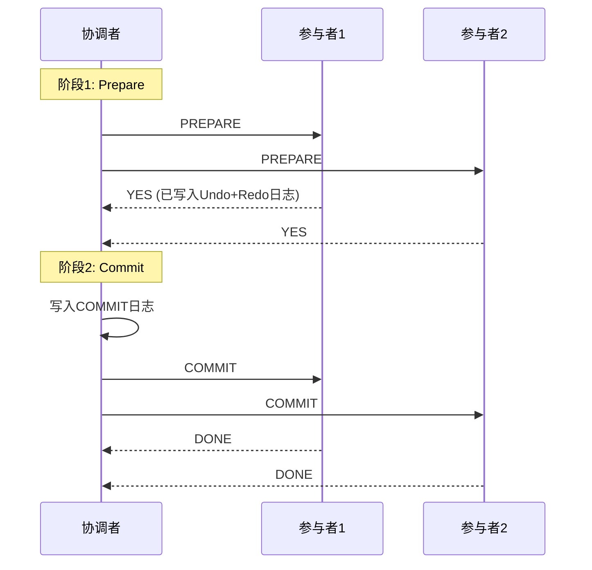

```pseudocode
function two_phase_commit(coordinator, participants):
    // 阶段1：准备阶段（Prepare Phase）
    votes = {}
    for p in participants:
        vote = p.prepare()  // 参与者投票：YES 或 NO
        votes[p] = vote

    // 阶段2：提交/回滚阶段
    if all(v == YES for v in votes.values()):
        // 所有参与者同意提交
        write_commit_log(coordinator)  // 写入提交决定日志
        for p in participants:
            p.commit()
        return COMMITTED
    else:
        // 有参与者拒绝，全部回滚
        for p in participants:
            p.rollback()
        return ABORTED
```

### 7.2 2PC的阻塞问题

2PC存在阻塞问题：如果协调者在发送COMMIT后崩溃，参与者将不确定是否应该提交。参与者必须等待协调者恢复后才能决定。

**优化方案**：

1. **3PC（三阶段提交）**：增加Pre-Commit阶段，减少阻塞时间，但不能完全消除
2. **Paxos Commit**：使用Paxos共识协议替代2PC的协调者
3. **Percolator模型**：Google Percolator使用2PC+时间戳服务实现分布式事务

### 7.3 2PC的工程实践

**XA事务**是2PC在数据库领域的标准实现：

```sql
-- MySQL中的XA事务示例
XA START 'xid_001';
UPDATE account SET balance = balance - 100 WHERE user_id = 1;
XA END 'xid_001';
XA PREPARE 'xid_001';  -- 阶段1：准备
XA COMMIT 'xid_001';   -- 阶段2：提交
```

**XA的性能问题**：
- 同步阻塞：参与者在PREPARE后必须等待协调者的决定
- 全局锁持有时间长：从PREPARE到COMMIT期间，行锁不能释放
- 单点故障：协调者崩溃导致所有参与者阻塞

**现代替代方案**：
- **TCC（Try-Confirm-Cancel）**：业务层面的2PC，将准备和提交/回滚拆分为业务操作
- **Saga模式**：将长事务拆分为一系列本地事务，每个本地事务有对应的补偿操作
- **消息队列最终一致性**：通过消息队列实现跨系统的最终一致性

***

**参考文献**：

1. Gray, J. & Reuter, A. *Transaction Processing: Concepts and Techniques*. Morgan Kaufmann, 1993.
2. Petrov, A. *Database Internals*. O'Reilly, 2019.
3. Bernstein, P. A. & Newcomer, E. *Principles of Transaction Processing*. Morgan Kaufmann, 2009.
4. Silberschatz, A. et al. *Database System Concepts* (7th ed.). McGraw-Hill, 2019.
5. Corbett, J. C. et al. *Spanner: Google's Globally-Distributed Database*. OSDI, 2012.
6. Peng, D. & Dabek, F. *Large-scale Incremental Processing Using Distributed Transactions and Notifications*. OSDI, 2010.


***

# 事务与并发控制：实战案例

## 一、死锁排查案例

### 1.1 案例背景

某电商系统的订单服务在高并发场景下频繁出现死锁告警。用户下单时，系统需要同时更新订单表、库存表和用户账户表，偶尔出现死锁导致部分下单失败。

**涉及的表结构**：

```sql
CREATE TABLE orders (
    order_id BIGINT PRIMARY KEY AUTO_INCREMENT,
    user_id BIGINT NOT NULL,
    product_id BIGINT NOT NULL,
    amount DECIMAL(10,2),
    status VARCHAR(20),
    created_at TIMESTAMP DEFAULT CURRENT_TIMESTAMP,
    INDEX idx_user_id (user_id),
    INDEX idx_product_id (product_id)
) ENGINE=InnoDB;

CREATE TABLE inventory (
    product_id BIGINT PRIMARY KEY,
    stock INT NOT NULL,
    version BIGINT DEFAULT 0
) ENGINE=InnoDB;

CREATE TABLE user_account (
    user_id BIGINT PRIMARY KEY,
    balance DECIMAL(12,2) NOT NULL,
    version BIGINT DEFAULT 0
) ENGINE=InnoDB;
```

### 1.2 问题SQL与死锁日志分析

系统捕获到的死锁日志如下：

------------------------
LATEST DETECTED DEADLOCK
------------------------
2024-03-15 14:32:05
*** (1) TRANSACTION:
TRANSACTION 184729, ACTIVE 2 sec
mysql tables in use 1, locked 1
LOCK WAIT 3 lock struct(s), heap size 1136, 2 row lock(s)
MySQL thread id 456, OS thread handle 0x7f3c8a0b8700
INSERT INTO orders (user_id, product_id, amount, status)
VALUES (1001, 2001, 299.00, 'pending')

*** (1) WAITING FOR THIS LOCK TO BE GRANTED:
RECORD LOCKS space id 12 page no 5 n bits 72
index `idx_user_id` of table `orders`
trx id 184729 lock_mode X insert intention waiting

*** (2) TRANSACTION:
TRANSACTION 184728, ACTIVE 3 sec
mysql tables in use 1, locked 1
LOCK WAIT 3 lock struct(s), heap size 1136, 2 row lock(s)
MySQL thread id 457, OS thread handle 0x7f3c8a0c9700
UPDATE user_account SET balance = balance - 299.00
WHERE user_id = 1001

*** (2) HOLDS THE LOCK(S):
RECORD LOCKS space id 12 page no 5 n bits 72
index `idx_user_id` of table `orders`
trx id 184728 lock mode S

*** (2) WAITING FOR THIS LOCK TO BE GRANTED:
RECORD LOCKS space id 8 page no 3 n bits 72
index `PRIMARY` of table `user_account`
trx id 184728 lock_mode X locks rec but not gap waiting

*** WE ROLL BACK TRANSACTION (1)

### 1.3 死锁分析

分析日志可以得出以下结论：

**事务1（T1）**：正在执行INSERT orders，等待idx_user_id上的插入意向锁（Insert Intention Lock）

**事务2（T2）**：
- 持有orders表idx_user_id上的S锁（共享锁）
- 等待user_account表主键上的X锁

**冲突链条**：
1. T2先查询了orders表（如`SELECT * FROM orders WHERE user_id = 1001 FOR SHARE`），在idx_user_id上持有S锁和Gap Lock
2. T1尝试INSERT新订单，需要在idx_user_id的间隙上获取插入意向锁，被T2的Gap Lock阻塞
3. T2继续执行扣款操作，尝试获取user_account的X锁
4. 如果T1之前已经持有user_account的X锁（如先扣款再插订单），则形成死锁

### 1.4 解决方案

**方案1：统一加锁顺序**

```python
# 错误的做法：不同事务以不同顺序访问表
# T1: orders → inventory → user_account
# T2: user_account → orders

# 正确的做法：所有事务按相同顺序访问表
def create_order(user_id, product_id, amount):
    # 第一步：检查并扣减用户余额（先锁user_account）
    update_balance(user_id, -amount)
    # 第二步：扣减库存
    update_inventory(product_id, -1)
    # 第三步：创建订单
    insert_order(user_id, product_id, amount)
```

**方案2：缩小事务范围**

```python
# 将大事务拆分为小事务，减少锁持有时间
def create_order(user_id, product_id, amount):
    # 预检查（不加锁）
    balance = query_balance(user_id)
    stock = query_stock(product_id)
    if balance < amount or stock < 1:
        return Error("insufficient balance or stock")

    # 原子操作（快速完成，减少锁持有时间）
    with db.transaction():
        affected = update_balance_with_check(user_id, amount)
        if affected == 0:
            raise Rollback("balance changed")
        affected = update_inventory_with_check(product_id, 1)
        if affected == 0:
            raise Rollback("stock changed")
        insert_order(user_id, product_id, amount)
```

**方案3：使用乐观锁替代悲观锁**

```sql
-- 使用版本号的乐观锁方式
UPDATE user_account
SET balance = balance - 299.00, version = version + 1
WHERE user_id = 1001 AND balance >= 299.00 AND version = @current_version;
-- 检查affected rows，如果为0则重试
```

### 1.5 效果

实施方案1（统一加锁顺序）后，死锁发生频率从每天数十次降低到几乎为零。同时配合方案2缩小事务范围，系统的TPS（每秒事务数）提升了约30%。

## 二、长事务导致表膨胀案例

### 2.1 案例背景

某公司的数据分析平台使用PostgreSQL存储业务数据。DBA发现某张核心业务表`transaction_log`的物理大小持续增长，从最初的20GB增长到了200GB，但实际有效数据只有50GB。

### 2.2 问题排查

**第一步：检查表膨胀情况**

```sql
-- 查看表大小与有效数据大小
SELECT
    pg_size_pretty(pg_total_relation_size('transaction_log')) AS total_size,
    pg_size_pretty(pg_relation_size('transaction_log')) AS table_size,
    pg_size_pretty(pg_indexes_size('transaction_log')) AS index_size,
    (SELECT count(*) FROM transaction_log) AS row_count;

-- 使用pgstattuple扩展分析死元组比例
CREATE EXTENSION IF NOT EXISTS pgstattuple;
SELECT * FROM pgstattuple('transaction_log');
-- 结果：dead_tuple_percent = 68.7%
```

**第二步：查找长事务**

```sql
-- 查看最老的活跃事务
SELECT
    pid,
    usename,
    application_name,
    xact_start,
    now() - xact_start AS duration,
    state,
    query
FROM pg_stat_activity
WHERE state != 'idle'
ORDER BY xact_start;

-- 结果发现一个BI工具的连接：
-- pid=12345, duration='3 days 14:22:05', state='active'
-- query='SELECT * FROM transaction_log WHERE ...'（一个复杂的大查询）
```

**第三步：确认影响**

```sql
-- 查看最老事务的时间戳
SELECT backend_xmin FROM pg_stat_activity ORDER BY backend_xmin LIMIT 1;

-- 查看VACUUM是否被阻塞
SELECT relname, last_vacuum, last_autovacuum,
       n_dead_tup, n_live_tup
FROM pg_stat_user_tables
WHERE relname = 'transaction_log';
```

### 2.3 根因分析

根因是一个BI工具的长时间查询（运行了3天多）。这个查询持有一个非常旧的快照，导致：

1. VACUUM无法清理该快照之后产生的死元组
2. 每次UPDATE操作都产生新版本，旧版本无法回收
3. 索引膨胀也同步加剧

### 2.4 解决方案

**短期措施**：

```sql
-- 1. 终止长查询
SELECT pg_terminate_backend(12345);

-- 2. 执行VACUUM清理
VACUUM VERBOSE transaction_log;

-- 3. 如果膨胀严重，使用pg_repack在线重建表
-- pg_repack不需要排他锁，可以在线完成
pg_repack -d dbname -t transaction_log
```

**长期措施**：

```sql
-- 1. 设置语句超时
ALTER SYSTEM SET statement_timeout = '1h';

-- 2. 设置空闲事务超时
ALTER SYSTEM SET idle_in_transaction_session_timeout = '10min';

-- 3. 设置old_snapshot_threshold
ALTER SYSTEM SET old_snapshot_threshold = '1h';

-- 4. 优化BI工具的查询（分页查询、物化视图）
```

**BI查询优化**：

```sql
-- 原始查询（全表扫描，耗时长）
SELECT * FROM transaction_log WHERE created_at >= '2024-01-01';

-- 优化方案：使用游标分页
DECLARE bi_cursor CURSOR FOR
    SELECT * FROM transaction_log
    WHERE created_at >= '2024-01-01'
    ORDER BY id;
FETCH 10000 FROM bi_cursor;

-- 或使用物化视图预聚合
CREATE MATERIALIZED VIEW transaction_summary AS
SELECT date(created_at) AS dt, COUNT(*) AS cnt, SUM(amount) AS total
FROM transaction_log
GROUP BY date(created_at);
```

## 三、隔离级别选择导致数据不一致

### 3.1 案例背景

某银行系统使用MySQL InnoDB，默认隔离级别为Repeatable Read。系统中有一个转账场景：从账户A向账户B转账100元，同时需要检查A和B的总余额是否保持不变（作为资金安全校验）。

### 3.2 问题代码

```sql
-- 转账事务
BEGIN;
UPDATE accounts SET balance = balance - 100 WHERE id = 'A';
UPDATE accounts SET balance = balance + 100 WHERE id = 'B';
COMMIT;

-- 同时运行的资金校验事务
BEGIN;
SELECT SUM(balance) FROM accounts WHERE id IN ('A', 'B');
-- ... 其他操作 ...
SELECT SUM(balance) FROM accounts WHERE id IN ('A', 'B');
-- 期望两次查询结果相同
COMMIT;
```

### 3.3 异常现象分析

在RR级别下，资金校验事务的两次`SUM(balance)`查询结果确实相同（因为RR使用事务级快照）。但问题出现在另一个场景：

```sql
-- T1: 从A向B转账100元
BEGIN;
UPDATE accounts SET balance = balance - 100 WHERE id = 'A';
-- 此时A余额=400

-- T2: 从A向C转账300元（并发执行）
BEGIN;
UPDATE accounts SET balance = balance - 300 WHERE id = 'A';
-- T2等待T1的X锁释放

-- T1继续
UPDATE accounts SET balance = balance + 100 WHERE id = 'B';
COMMIT;

-- T2继续
UPDATE accounts SET balance = balance + 300 WHERE id = 'C';
COMMIT;
```

这个场景在RR级别下运行正常。但如果我们使用Read Committed隔离级别，会出现**不可重复读**：

```sql
-- T1: 使用RC级别
BEGIN;
SELECT balance FROM accounts WHERE id = 'A';  -- 读到500
-- ... 其他操作 ...
SELECT balance FROM accounts WHERE id = 'A';  -- 可能读到400（被T2修改）
COMMIT;
```

### 3.4 写偏斜问题

在RR级别下，虽然解决了不可重复读，但**写偏斜（Write Skew）**仍然可能发生：

```sql
-- 场景：医院值班系统，同一时间至少需要一名医生值班
-- 表：on_call (doctor_id, shift)
-- 约束：至少一名医生在值班

-- 初始状态：Alice和Bob都在值班

-- T1: Alice想下线
BEGIN;
SELECT COUNT(*) FROM on_call WHERE shift = 'today';  -- 读到2，满足约束
DELETE FROM on_call WHERE doctor_id = 'Alice';
COMMIT;

-- T2: Bob想下线（并发）
BEGIN;
SELECT COUNT(*) FROM on_call WHERE shift = 'today';  -- 读到2（RC级别）或2（RR级别快照）
DELETE FROM on_call WHERE doctor_id = 'Bob';
COMMIT;

-- 结果：无人值班，违反约束！
```

### 3.5 解决方案

**方案1：使用Serializable隔离级别**

```sql
SET TRANSACTION ISOLATION LEVEL SERIALIZABLE;
-- InnoDB会自动检测写偏斜并回滚其中一个事务
```

**方案2：使用显式锁**

```sql
-- T1: Alice下线
BEGIN;
SELECT * FROM on_call WHERE shift = 'today' FOR UPDATE;  -- 加行锁
-- 检查约束
DELETE FROM on_call WHERE doctor_id = 'Alice';
COMMIT;
```

**方案3：使用约束**

```sql
-- 使用触发器或CHECK约束
ALTER TABLE on_call ADD CONSTRAINT chk_min_doctors
    CHECK ((SELECT COUNT(*) FROM on_call WHERE shift = 'today') >= 1);
-- 注意：MySQL不支持子查询CHECK约束，需要使用触发器
```

## 四、分布式事务在电商系统中的应用

### 4.1 案例背景

某电商平台的下单流程涉及三个微服务：订单服务、库存服务、账户服务。需要保证下单操作的原子性：要么订单创建成功、库存扣减、余额扣减全部成功，要么全部回滚。

### 4.2 方案一：基于消息队列的最终一致性

```python
# 下单流程（Saga模式）
def create_order_saga(order_info):
    saga = Saga()

    # Step 1: 创建订单（状态为pending）
    saga.add_step(
        action=lambda: create_order(order_info, status='pending'),
        compensate=lambda: cancel_order(order_info['order_id'])
    )

    # Step 2: 扣减库存
    saga.add_step(
        action=lambda: deduct_inventory(order_info['product_id'], 1),
        compensate=lambda: restore_inventory(order_info['product_id'], 1)
    )

    # Step 3: 扣减余额
    saga.add_step(
        action=lambda: deduct_balance(order_info['user_id'], order_info['amount']),
        compensate=lambda: restore_balance(order_info['user_id'], order_info['amount'])
    )

    # Step 4: 确认订单
    saga.add_step(
        action=lambda: confirm_order(order_info['order_id'])
    )

    try:
        saga.execute()
        return SUCCESS
    except SagaStepFailed as e:
        saga.compensate()  # 执行补偿操作
        return FAILURE
```

### 4.3 方案二：基于Seata的AT模式

```java
// 使用Seata AT模式的分布式事务
@GlobalTransactional(timeoutMills = 60000, name = "create-order")
public void createOrder(OrderDTO orderDTO) {
    // 1. 扣减库存（Seata自动管理分布式事务）
    inventoryService.deduct(orderDTO.getProductId(), 1);

    // 2. 扣减余额
    accountService.deduct(orderDTO.getUserId(), orderDTO.getAmount());

    // 3. 创建订单
    orderService.create(orderDTO);

    // 如果任何一步失败，Seata会自动回滚所有操作
}
```

### 4.4 方案三：TCC模式

```java
// TCC模式实现
public interface InventoryTCC {
    // Try: 预留资源
    @TwoPhaseBusinessAction(name = "deduct")
    boolean tryDeduct(
        @BusinessActionContextParameter(paramName = "productId") Long productId,
        @BusinessActionContextParameter(paramName = "quantity") Integer quantity
    );

    // Confirm: 确认扣减
    boolean confirmDeduct(BusinessActionContext context);

    // Cancel: 取消扣减
    boolean cancelDeduct(BusinessActionContext context);
}

@Service
public class InventoryTCCImpl implements InventoryTCC {

    @Override
    public boolean tryDeduct(Long productId, Integer quantity) {
        // 预扣库存（冻结库存）
        int affected = inventoryMapper.freezeStock(productId, quantity);
        return affected > 0;
    }

    @Override
    public boolean confirmDeduct(BusinessActionContext context) {
        Long productId = (Long) context.getActionContext("productId");
        Integer quantity = (Integer) context.getActionContext("quantity");
        // 确认扣减（将冻结库存转为已扣减）
        return inventoryMapper.confirmDeduct(productId, quantity) > 0;
    }

    @Override
    public boolean cancelDeduct(BusinessActionContext context) {
        Long productId = (Long) context.getActionContext("productId");
        Integer quantity = (Integer) context.getActionContext("quantity");
        // 取消扣减（释放冻结库存）
        return inventoryMapper.releaseFrozen(productId, quantity) > 0;
    }
}
```

### 4.5 方案对比

| 维度 | Saga模式 | AT模式 | TCC模式 |
|------|----------|--------|---------|
| 侵入性 | 低 | 最低 | 高 |
| 一致性 | 最终一致 | 最终一致 | 最终一致 |
| 性能 | 高 | 中 | 高 |
| 复杂度 | 中 | 低 | 高 |
| 适用场景 | 长流程、跨系统 | 简单CRUD操作 | 高性能要求 |

### 4.6 实际选择建议

1. **简单场景**：优先使用AT模式（Seata），开发成本最低
2. **高性能要求**：使用TCC模式，但需要业务方实现Try/Confirm/Cancel
3. **长流程、跨系统**：使用Saga模式，配合状态机引擎（如Seata Saga）
4. **非关键路径**：使用消息队列最终一致性（如RocketMQ事务消息）

***

**参考文献**：

1. Garcia-Molina, H. & Salem, K. *Sagas*. SIGMOD, 1987.
2. Richardson, C. *Microservices Patterns*. Manning, 2018.
3. Faleiro, J. M. & Abadi, D. *Rethinking Serializable Multiversion Concurrency Control*. PVLDB, 2015.
4. Seata官方文档：https://seata.io/


***

# 事务与并发控制：常见误区

## 误区一："RR级别就能完全防止幻读"

### 误区描述

很多开发者认为，只要将数据库隔离级别设置为Repeatable Read（RR），就能完全防止幻读现象。

### 实际情况

**SQL标准的RR**和**InnoDB实现的RR**有重要区别。

SQL标准中的RR隔离级别只能防止**不可重复读**，不能防止**幻读**。幻读是指同一事务中，两次范围查询返回的结果集不同（因为其他事务插入了新记录）。

但InnoDB在RR级别下通过**Gap Lock（间隙锁）**和**Next-Key Lock（临键锁）**额外防止了大部分幻读场景。这使得InnoDB的RR级别在行为上接近Serializable。

**InnoDB RR仍然可能出现幻读的场景**：

```sql
-- T1: RR级别
BEGIN;
SELECT * FROM orders WHERE amount > 100;  -- 返回3条记录
-- T2在此时插入了一条amount=200的记录并提交
UPDATE orders SET status = 'processed' WHERE amount > 100;
-- 此时UPDATE会影响4条记录（包括T2新插入的那条）
SELECT * FROM orders WHERE amount > 100;  -- 返回4条记录（幻读！）
COMMIT;
```

**为什么会出现这种情况**？

1. 第一个SELECT是快照读（Snapshot Read），使用MVCC读取事务开始时的快照
2. UPDATE是当前读（Current Read），使用Next-Key Lock锁定现有记录和间隙
3. 但UPDATE操作本身会获取行锁，在某些边界条件下，第二个SELECT可能看到新的数据

**更准确的说法**：

- InnoDB RR + 快照读：不会出现幻读（基于MVCC快照）
- InnoDB RR + 当前读：通过Gap Lock**基本**防止幻读，但某些边界情况仍可能出现
- 如果需要严格的可串行化保证，应使用Serializable级别

```sql
-- 正确的做法：根据业务需求选择隔离级别
-- 1. 如果只需要一致性快照读：RR足够
-- 2. 如果涉及当前读（SELECT ... FOR UPDATE）：考虑Serializable
-- 3. 如果需要严格可串行化：使用Serializable
SET TRANSACTION ISOLATION LEVEL SERIALIZABLE;
```

***

## 误区二："MVCC不需要锁"

### 误区描述

由于MVCC实现了"读不阻塞写，写不阻塞读"，很多开发者认为MVCC完全消除了对锁的需求。

### 实际情况

MVCC只解决了**读写冲突**，没有解决**写写冲突**。

MVCC的能力：
✓ 读操作不阻塞写操作（读旧版本，写创建新版本）
✓ 写操作不阻塞读操作（读旧版本，不受写影响）
✗ 写操作仍然会阻塞写操作（同一行的并发修改需要锁）

**写写冲突的处理**：

```sql
-- T1和T2同时修改同一行
-- T1:
UPDATE accounts SET balance = balance - 100 WHERE id = 1;

-- T2:
UPDATE accounts SET balance = balance - 200 WHERE id = 1;

-- T1先获得X锁，T2等待
-- T1完成后释放锁，T2获得锁并执行
-- 最终结果正确，但写操作是串行化的
```

**InnoDB的MVCC+2PL组合**：

- **读操作**：使用MVCC快照读，不加锁（普通SELECT）
- **当前读**：需要加锁（SELECT ... FOR UPDATE/SHARE, INSERT, UPDATE, DELETE）
- **写操作**：使用2PL，X锁在事务结束时释放

```sql
-- 快照读（不加锁）
SELECT * FROM accounts WHERE id = 1;

-- 当前读（加S锁）
SELECT * FROM accounts WHERE id = 1 LOCK IN SHARE MODE;
SELECT * FROM accounts WHERE id = 1 FOR SHARE;

-- 当前读（加X锁）
SELECT * FROM accounts WHERE id = 1 FOR UPDATE;
UPDATE accounts SET balance = 100 WHERE id = 1;
```

**实际影响**：

如果业务场景是写密集型（如计数器、库存扣减），MVCC带来的收益有限，因为写操作仍然需要锁。此时应考虑：
1. 使用乐观锁（CAS操作）减少锁等待
2. 使用队列将并发写转为串行写
3. 使用Redis等内存数据库处理高频写操作

***

## 误区三："自动死锁检测可以完全解决死锁"

### 误区描述

既然数据库支持自动死锁检测，那么死锁就不是问题了，系统会自动处理。

### 实际情况

自动死锁检测存在以下局限性：

**1. 检测延迟**

死锁检测通常不是实时的。InnoDB默认使用`innodb_deadlock_detect`参数控制是否开启死锁检测，以及检测的频率。从死锁发生到被检测到，可能存在数秒的延迟。

```sql
-- 查看死锁检测相关参数
SHOW VARIABLES LIKE 'innodb_deadlock_detect';
SHOW VARIABLES LIKE 'innodb_lock_wait_timeout';
```

**2. 检测开销**

在高并发系统中，Wait-For Graph可能包含数千个节点和数万条边。每次检测都需要遍历图，时间复杂度为O(n²)甚至更高。InnoDB从5.7.15开始支持基于等待图的死锁检测，但在极高并发下（如10000+并发事务），检测本身的CPU开销可能成为瓶颈。

**3. 只能检测，不能预防**

死锁检测是在死锁发生后进行的。被选为牺牲者的事务需要回滚并重试，这会：
- 增加事务的响应时间
- 浪费已执行的工作
- 在极端情况下，可能导致"饥饿"（某个事务反复被选为牺牲者）

**4. 分布式系统中的复杂性**

在分布式数据库中，死锁检测更加复杂。每个节点只了解本地的锁等待情况，全局死锁需要跨节点协调检测，开销更大。

**正确的做法**：

```python
# 应用层面的死锁预防和处理策略

# 1. 统一资源访问顺序（预防死锁）
def transfer(from_id, to_id, amount):
    # 总是按ID从小到大的顺序访问
    first, second = min(from_id, to_id), max(from_id, to_id)
    with transaction():
        lock(first)
        lock(second)
        # 执行转账

# 2. 设置合理的锁等待超时
# innodb_lock_wait_timeout = 10 (秒)

# 3. 应用层重试机制
def execute_with_retry(func, max_retries=3):
    for attempt in range(max_retries):
        try:
            return func()
        except DeadlockError:
            if attempt == max_retries - 1:
                raise
            time.sleep(0.1 * (2 ** attempt))  # 指数退避

# 4. 监控和告警
# 定期检查 SHOW ENGINE INNODB STATUS 中的死锁信息
# 设置死锁频率告警
```

***

## 误区四："乐观锁一定比悲观锁快"

### 误区描述

由于乐观锁避免了锁等待和死锁，很多开发者认为乐观锁在所有场景下都比悲观锁快。

### 实际情况

乐观锁和悲观锁的性能取决于**争用程度（Contention Level）**。

**低争用场景**：乐观锁确实更快
- 事务冲突概率低，验证阶段几乎不会失败
- 避免了锁管理的开销
- 读操作完全不阻塞

**高争用场景**：乐观锁可能更慢
- 事务冲突频繁，验证阶段大量失败
- 失败的事务需要回滚并重试
- 重试可能再次失败，导致"活锁"（Livelock）

**性能对比示意**：

性能
  │
  │  乐观锁
  │  ╲
  │   ╲           悲观锁
  │    ╲         ╱
  │     ╲       ╱
  │      ╲     ╱
  │       ╲   ╱
  │        ╲ ╱
  │         ╳
  │        ╱ ╲
  │       ╱   ╲
  │      ╱     ╲  乐观锁（重试风暴）
  │     ╱       ╲
  │    ╱         ╲
  └──────────────── 争用程度
  低争用          高争用

**关键指标**：

- **冲突率**：< 10%时乐观锁优势明显；> 30%时悲观锁通常更优
- **事务长度**：短事务适合乐观锁（冲突窗口小）；长事务适合悲观锁（避免大量回滚）
- **重试成本**：如果回滚代价很高（如涉及外部API调用），悲观锁更安全

**实际案例**：

```python
# 乐观锁在高争用下的问题

# 场景：热门商品秒杀，100个用户同时扣减库存
# 乐观锁方式：
def deduct_stock_optimistic(product_id):
    for retry in range(10):
        stock = get_stock(product_id)  # 读取当前库存
        version = get_version(product_id)
        affected = db.execute("""
            UPDATE inventory
            SET stock = stock - 1, version = version + 1
            WHERE product_id = %s AND version = %s AND stock > 0
        """, (product_id, version))
        if affected > 0:
            return SUCCESS
        # 重试（此时可能99个事务都失败了，需要重试）
    return FAILURE  # 重试次数用完

# 悲观锁方式：
def deduct_stock_pessimistic(product_id):
    with db.transaction():
        row = db.execute("""
            SELECT * FROM inventory
            WHERE product_id = %s FOR UPDATE
        """, (product_id,))
        if row.stock > 0:
            db.execute("""
                UPDATE inventory SET stock = stock - 1
                WHERE product_id = %s
            """, (product_id,))
            return SUCCESS
        return FAILURE
```

**在秒杀场景下**：
- 乐观锁：100个事务，可能99个需要重试，总重试次数可能达到数百次
- 悲观锁：事务串行执行，但每个事务只需执行一次，无重试开销

**选择建议**：

| 场景 | 推荐方式 | 原因 |
|------|----------|------|
| 读多写少 | 乐观锁 | 冲突少，避免锁开销 |
| 写密集型 | 悲观锁 | 避免重试风暴 |
| 短事务 | 乐观锁 | 冲突窗口小 |
| 长事务 | 悲观锁 | 回滚代价高 |
| 低争用 | 乐观锁 | 验证很少失败 |
| 高争用 | 悲观锁 | 重试成本高 |

**最佳实践**：在实际系统中，通常需要结合两种策略：

```python
# 混合策略：乐观锁 + 快速降级
def deduct_stock_hybrid(product_id):
    # 先尝试乐观锁（最多3次）
    for retry in range(3):
        if try_optimistic_lock(product_id):
            return SUCCESS
    # 乐观锁失败，降级为悲观锁
    return try_pessimistic_lock(product_id)
```

***

## 总结

| 误区 | 正确理解 |
|------|----------|
| RR级别完全防幻读 | InnoDB RR通过Gap Lock基本防幻读，但非标准RR；某些边界情况仍可能出现幻读 |
| MVCC不需要锁 | MVCC只解决读写冲突，写写冲突仍需锁；实际系统是MVCC+2PL的组合 |
| 死锁检测完全解决问题 | 检测有延迟和开销，只能检测不能预防；应在应用层面做好预防 |
| 乐观锁一定更快 | 取决于争用程度；低争用时乐观锁快，高争用时悲观锁更稳定 |

理解这些误区，有助于在实际项目中做出正确的技术选择。并发控制没有银弹，需要根据具体的业务场景、数据特征和性能要求来选择合适的策略。

***

**参考文献**：

1. Berenson, H. et al. *A Critique of ANSI SQL Isolation Levels*. SIGMOD, 1995.
2. Herlihy, M. & Moss, J. E. B. *Transactional Memory: Architectural Support for Lock-Free Data Structures*. ISCA, 1993.
3. Bernstein, P. A. et al. *Concurrency Control and Recovery in Database Systems*. Addison-Wesley, 1987.


***

# 事务与并发控制：练习方法

## 一、基础概念验证

### 1.1 动手实验：观察隔离级别的行为差异

使用MySQL或PostgreSQL，创建测试表并验证不同隔离级别下的异常现象。

**实验1：脏读（Read Uncommitted）**

```sql
-- 准备
CREATE TABLE test_dirty_read (
    id INT PRIMARY KEY,
    value INT
) ENGINE=InnoDB;
INSERT INTO test_dirty_read VALUES (1, 100);

-- 会话1（设置为RU级别）
SET SESSION TRANSACTION ISOLATION LEVEL READ UNCOMMITTED;
BEGIN;
SELECT value FROM test_dirty_read WHERE id = 1;  -- 读到100

-- 会话2
BEGIN;
UPDATE test_dirty_read SET value = 200 WHERE id = 1;
-- 不提交

-- 会话1
SELECT value FROM test_dirty_read WHERE id = 1;  -- 读到200（脏读！）

-- 会话2
ROLLBACK;

-- 会话1
SELECT value FROM test_dirty_read WHERE id = 1;  -- 读到什么？
COMMIT;
```

**实验2：不可重复读（Read Committed vs Repeatable Read）**

```sql
-- 分别在RC和RR级别下重复以下实验

-- 会话1
SET SESSION TRANSACTION ISOLATION LEVEL READ COMMITTED; -- 或 REPEATABLE READ
BEGIN;
SELECT value FROM test_dirty_read WHERE id = 1;  -- 第一次读取

-- 会话2
BEGIN;
UPDATE test_dirty_read SET value = 300 WHERE id = 1;
COMMIT;

-- 会话1
SELECT value FROM test_dirty_read WHERE id = 1;  -- 第二次读取
-- RC: 读到300（不可重复读）
-- RR: 读到100（一致）
COMMIT;
```

**实验3：幻读**

```sql
-- 会话1（RR级别）
SET SESSION TRANSACTION ISOLATION LEVEL REPEATABLE READ;
BEGIN;
SELECT * FROM test_dirty_read WHERE value > 50;  -- 返回1条

-- 会话2
BEGIN;
INSERT INTO test_dirty_read VALUES (2, 200);
COMMIT;

-- 会话1
SELECT * FROM test_dirty_read WHERE value > 50;  -- RR级别下仍返回1条
SELECT * FROM test_dirty_read WHERE value > 50 FOR UPDATE;  -- 当前读，返回2条（幻读！）
COMMIT;
```

### 1.2 MVCC快照验证

```sql
-- 观察InnoDB的MVCC行为

-- 会话1
BEGIN;
SELECT * FROM test_dirty_read WHERE id = 1;  -- 读到快照数据

-- 会话2
UPDATE test_dirty_read SET value = 999 WHERE id = 1;
COMMIT;

-- 会话1（仍然读到旧值）
SELECT * FROM test_dirty_read WHERE id = 1;  -- 旧值

-- 观察Undo Log
-- 打开innodb_monitor观察锁和事务信息
SET GLOBAL innodb_status_output = ON;
SHOW ENGINE INNODB STATUS;
```

### 1.3 死锁重现与分析

```sql
-- 死锁实验

-- 会话1
BEGIN;
UPDATE test_dirty_read SET value = 1 WHERE id = 1;
-- 等待2秒
SELECT SLEEP(2);
UPDATE test_dirty_read SET value = 1 WHERE id = 2;

-- 会话2
BEGIN;
UPDATE test_dirty_read SET value = 2 WHERE id = 2;
-- 等待2秒
SELECT SLEEP(2);
UPDATE test_dirty_read SET value = 2 WHERE id = 1;
-- 其中一个会话会收到死锁错误

-- 分析死锁日志
SHOW ENGINE INNODB STATUS;
```

## 二、工具使用练习

### 2.1 MySQL性能监控

```sql
-- 查看当前事务
SELECT * FROM information_schema.INNODB_TRX;

-- 查看锁信息
SELECT * FROM information_schema.INNODB_LOCKS;
SELECT * FROM information_schema.INNODB_LOCK_WAITS;

-- 查看InnoDB状态
SHOW ENGINE INNODB STATUS;

-- 开启锁监控
SET GLOBAL innodb_status_output = ON;
SET GLOBAL innodb_status_output_locks = ON;

-- 使用performance_schema监控锁等待
SELECT * FROM performance_schema.data_lock_waits;
SELECT * FROM performance_schema.data_locks;
```

### 2.2 PostgreSQL性能监控

```sql
-- 查看活跃事务
SELECT * FROM pg_stat_activity WHERE state = 'active';

-- 查看锁信息
SELECT * FROM pg_locks WHERE NOT granted;  -- 等待中的锁
SELECT l.*, a.pid, a.query
FROM pg_locks l
JOIN pg_stat_activity a ON l.pid = a.pid
WHERE l.relation = 'test_dirty_read'::regclass;

-- 查看MVCC相关统计
SELECT relname, n_dead_tup, n_live_tup,
       dead_tup_ratio = n_dead_tup * 100.0 / NULLIF(n_live_tup + n_dead_tup, 0)
FROM pg_stat_user_tables
ORDER BY n_dead_tup DESC;

-- 使用pg_stat_statements分析慢查询
CREATE EXTENSION IF NOT EXISTS pg_stat_statements;
SELECT * FROM pg_stat_statements ORDER BY total_exec_time DESC LIMIT 10;
```

### 2.3 使用EXPLAIN分析事务行为

```sql
-- 分析锁行为
EXPLAIN ANALYZE
SELECT * FROM orders WHERE user_id = 1001 FOR UPDATE;

-- 观察锁范围
EXPLAIN FORMAT=JSON
SELECT * FROM orders WHERE user_id > 1000 FOR UPDATE;
```

## 三、算法实现练习

### 3.1 实现简单的2PL锁管理器

用Python实现一个基本的锁管理器，支持S锁和X锁，包含死锁检测：

```python
from enum import Enum
from collections import defaultdict
import threading

class LockMode(Enum):
    S = 'shared'
    X = 'exclusive'

class LockStatus(Enum):
    GRANTED = 'granted'
    WAITING = 'waiting'

class LockRequest:
    def __init__(self, txn_id, mode):
        self.txn_id = txn_id
        self.mode = mode
        self.status = LockStatus.WAITING

class LockManager:
    def __init__(self):
        self.lock_table = defaultdict(list)  # resource -> [LockRequest]
        self.wait_for = defaultdict(set)     # txn_id -> {waiting for txn_ids}
        self.mutex = threading.Lock()

    def acquire(self, txn_id, resource, mode):
        with self.mutex:
            requests = self.lock_table[resource]
            # 检查是否可以授予锁
            can_grant = True
            for req in requests:
                if req.status == LockStatus.GRANTED:
                    if mode == LockMode.X or req.mode == LockMode.X:
                        can_grant = False
                        break

            new_req = LockRequest(txn_id, mode)
            if can_grant:
                new_req.status = LockStatus.GRANTED
                requests.append(new_req)
                return True
            else:
                # 记录等待关系
                for req in requests:
                    if req.status == LockStatus.GRANTED:
                        self.wait_for[txn_id].add(req.txn_id)
                requests.append(new_req)
                # 检测死锁
                if self._has_cycle(txn_id):
                    requests.remove(new_req)
                    self.wait_for.pop(txn_id, None)
                    return False  # 死锁
                return True  # 等待中

    def release(self, txn_id, resource):
        with self.mutex:
            requests = self.lock_table[resource]
            self.lock_table[resource] = [r for r in requests if r.txn_id != txn_id]
            # 唤醒等待的事务
            self._grant_waiting(resource)

    def _has_cycle(self, start):
        visited = set()
        stack = set()
        return self._dfs(start, visited, stack)

    def _dfs(self, node, visited, stack):
        visited.add(node)
        stack.add(node)
        for neighbor in self.wait_for.get(node, set()):
            if neighbor in stack:
                return True
            if neighbor not in visited:
                if self._dfs(neighbor, visited, stack):
                    return True
        stack.discard(node)
        return False

    def _grant_waiting(self, resource):
        requests = self.lock_table[resource]
        for req in requests:
            if req.status == LockStatus.WAITING:
                can_grant = all(
                    r.mode == LockMode.S and req.mode == LockMode.S
                    for r in requests if r.status == LockStatus.GRANTED
                )
                if can_grant:
                    req.status = LockStatus.GRANTED
                    self.wait_for.pop(req.txn_id, None)
```

### 3.2 实现MVCC快照隔离

```python
class MVCCDatabase:
    def __init__(self):
        self.data = {}               # key -> [(value, xmin, xmax)]
        self.txn_counter = 0
        self.active_txns = set()
        self.committed_txns = {}      # txn_id -> commit_timestamp

    def begin(self):
        self.txn_counter += 1
        txn_id = self.txn_counter
        self.active_txns.add(txn_id)
        snapshot = Snapshot(txn_id, set(self.active_txns))
        return txn_id, snapshot

    def read(self, txn_id, snapshot, key):
        if key not in self.data:
            return None
        for value, xmin, xmax in reversed(self.data[key]):
            if self._is_visible(xmin, xmax, snapshot):
                return value
        return None

    def write(self, txn_id, key, value):
        if key not in self.data:
            self.data[key] = []
        # 旧版本设xmax
        for i in range(len(self.data[key]) - 1, -1, -1):
            _, xmin, xmax = self.data[key][i]
            if xmax is None:
                self.data[key][i] = (self.data[key][i][0], xmin, txn_id)
                break
        self.data[key].append((value, txn_id, None))

    def commit(self, txn_id):
        self.committed_txns[txn_id] = self.txn_counter
        self.active_txns.discard(txn_id)

    def _is_visible(self, xmin, xmax, snapshot):
        # 插入者是否可见
        if xmin in snapshot.active_txns and xmin != snapshot.txn_id:
            return False
        if xmin not in self.committed_txns and xmin != snapshot.txn_id:
            return False
        # 删除者是否不可见
        if xmax is None:
            return True
        if xmax in snapshot.active_txns:
            return True
        if xmax not in self.committed_txns:
            return True
        return False

class Snapshot:
    def __init__(self, txn_id, active_txns):
        self.txn_id = txn_id
        self.active_txns = active_txns
```

### 3.3 实现OCC验证器

```python
class OCCTransaction:
    def __init__(self, db):
        self.db = db
        self.start_ts = db.get_timestamp()
        self.read_set = {}      # key -> version_read
        self.write_set = {}     # key -> new_value
        self.status = 'active'

    def read(self, key):
        value, version = db.read_with_version(key)
        self.read_set[key] = version
        return value

    def write(self, key, value):
        self.write_set[key] = value

    def validate(self):
        # 向前验证
        for active_txn in db.get_active_transactions():
            if active_txn.start_ts < self.start_ts:
                # 检查写集与读集的交集
                if set(self.write_set.keys()) &amp; set(active_txn.read_set.keys()):
                    return False
        return True

    def commit(self):
        if not self.validate():
            self.abort()
            return False
        # 写入阶段
        db.apply_writes(self.write_set)
        self.status = 'committed'
        return True

    def abort(self):
        self.status = 'aborted'
        # 清理
```

## 四、阅读材料与进阶

### 4.1 经典论文

1. **ARIES: A Transaction Recovery Method Supporting Fine-Granularity Locking**
   - 作者：Mohan, C. et al. (1992)
   - 重点：崩溃恢复算法，WAL的工业实现
   - 阅读建议：关注Section 3-5（Recovery Algorithm）

2. **A Critique of ANSI SQL Isolation Levels**
   - 作者：Berenson, H. et al. (1995)
   - 重点：SQL标准隔离级别的缺陷，写偏斜等异常现象
   - 阅读建议：理解为什么标准定义与实际实现有差距

3. **Making Snapshot Isolation Serializable**
   - 作者：Cahill, M. J. et al. (2008)
   - 重点：SSI算法，如何在快照隔离基础上实现可串行化
   - 阅读建议：Section 3-4是核心

4. **Serializable Snapshot Isolation in PostgreSQL**
   - 作者：Ports, D. R. K. & Grittner, K. (2012)
   - 重点：PostgreSQL的SSI实现细节
   - 阅读建议：结合PostgreSQL源码阅读

### 4.2 推荐书籍

1. **《Transaction Processing: Concepts and Techniques》**
   - 作者：Gray, J. & Reuter, A.
   - 出版社：Morgan Kaufmann, 1993
   - 评价：事务处理领域的"圣经"，涵盖从理论到实现的所有方面

2. **《Database Internals》**
   - 作者：Petrov, A.
   - 出版社：O'Reilly, 2019
   - 评价：现代数据库内部机制的优秀参考，MVCC章节尤其出色

3. **《Database System Concepts》（第7版）**
   - 作者：Silberschatz, A. et al.
   - 出版社：McGraw-Hill, 2019
   - 评价：教科书级别的系统性覆盖，适合系统学习

4. **《Designing Data-Intensive Applications》**
   - 作者：Kleppmann, M.
   - 出版社：O'Reilly, 2017
   - 评价：从分布式系统视角讨论事务，适合系统架构师

### 4.3 源码阅读建议

**PostgreSQL MVCC相关源码**：

src/backend/access/heap/
├── heapam.c          # Heap访问方法，UPDATE实现
├── heapam_visibility.c  # 元组可见性判断（HeapTupleSatisfiesMVCC）
└── hio.c             # Heap I/O操作

src/backend/storage/
├── procarray.c       # 活跃事务数组管理
└── lwlock.c          # 轻量级锁

src/backend/access/transam/
├── transam.c         # 事务管理
├── clog.c            # Commit Log实现
└── multixact.c       # 多事务ID管理

**MySQL InnoDB相关源码**：

storage/innobase/
├── lock/
│   ├── lock0lock.cc    # 锁管理器核心
│   └── lock0wait.cc    # 锁等待处理
├── trx/
│   ├── trx0trx.cc      # 事务管理
│   ├── trx0purge.cc    # Purge线程
│   └── trx0undo.cc     # Undo Log管理
├── read/
│   └── read0read.cc    # Read View实现
└── row/
    ├── row0vers.cc     # 行版本管理
    └── row0mvcc.cc     # MVCC相关

## 五、练习项目建议

### 5.1 项目1：简易事务引擎

实现一个支持ACID特性的内存事务引擎：
- 支持BEGIN、COMMIT、ROLLBACK
- 实现Undo Log和回滚
- 实现基本的2PL锁管理
- 支持Read Committed和Repeatable Read隔离级别

### 5.2 项目2：分布式事务协调器

实现一个简化的2PC协调器：
- 支持Prepare和Commit/Abort阶段
- 实现超时和故障恢复
- 使用日志记录事务状态

### 5.3 项目3：MVCC存储引擎

实现一个基于MVCC的简单键值存储：
- 支持多版本并发读写
- 实现快照隔离
- 实现垃圾回收（清理旧版本）

***

**参考文献**：

1. Mohan, C. et al. *ARIES: A Transaction Recovery Method Supporting Fine-Granularity Locking*. ACM TODS, 1992.
2. Berenson, H. et al. *A Critique of ANSI SQL Isolation Levels*. SIGMOD, 1995.
3. Gray, J. & Reuter, A. *Transaction Processing: Concepts and Techniques*. Morgan Kaufmann, 1993.
4. Petrov, A. *Database Internals*. O'Reilly, 2019.


***

# 事务与并发控制：现代趋势与前沿

## 一、MVCC+2PL混合架构

现代关系型数据库（MySQL InnoDB、PostgreSQL、Oracle）普遍采用MVCC+2PL的混合架构，而非单一的并发控制方法。这种组合充分利用了两种方法的优势：

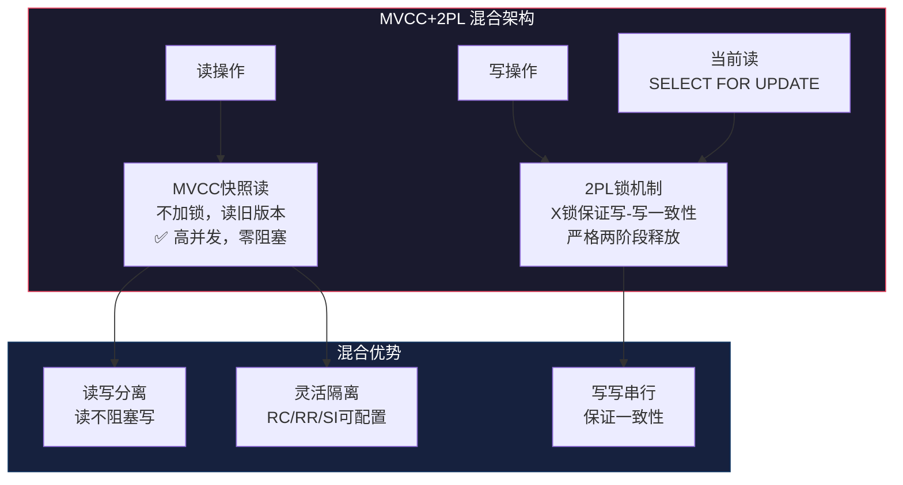

**InnoDB的具体实现**：

| 操作类型 | 并发控制方式 | 锁行为 |
|---------|-------------|--------|
| 普通SELECT（快照读） | MVCC | 不加锁 |
| SELECT ... FOR SHARE | MVCC + 锁 | 加S锁（当前读） |
| SELECT ... FOR UPDATE | MVCC + 锁 | 加X锁（当前读） |
| INSERT | 锁 | 加X锁 + 插入意向锁 |
| UPDATE | MVCC + 锁 | 读旧版本(MVCC) + 写时加X锁(2PL) |
| DELETE | 锁 | 标记删除 + X锁 |
| DDL (ALTER TABLE) | 锁 | 表级MDL锁 |

## 二、确定性并发控制（Deterministic Concurrency Control）

确定性并发控制是近年来新兴的并发控制方法，被CockroachDB、YugaByte、TiDB等分布式数据库采用。其核心思想：**事务的执行结果完全由事务到达的顺序决定**，与执行过程无关。

**工作原理**：

1. 每个事务在提交时分配一个全局唯一的时间戳
2. 事务的所有操作被发送到所有节点
3. 所有节点以相同的时间戳顺序执行事务
4. 由于执行顺序确定，所有节点产生相同的结果

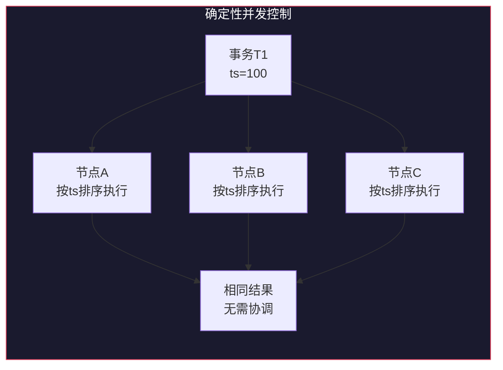

**优势**：无需2PC或锁协调，所有节点独立确定执行顺序，大幅降低分布式事务的延迟。

**局限**：要求预规划执行（planning phase），对动态查询不够灵活；无法处理运行时约束检查（如唯一性约束需要在提交时验证）。

## 三、无锁数据结构与事务内存

传统的并发控制基于锁或MVCC，但在某些特定场景下，无锁（Lock-Free）和无等待（Wait-Free）数据结构提供了更好的性能。

**CAS（Compare-And-Swap）操作**：

```python
def atomic_increment(counter):
    """使用CAS实现无锁原子操作"""
    while True:
        old_value = counter.value
        new_value = old_value + 1
        if compare_and_swap(counter, old_value, new_value):
            return new_value
        # CAS失败，重试
```

**事务内存（Transactional Memory）**：

硬件事务内存（Intel TSX）和软件事务内存（STM）允许将一组操作包装为事务，由硬件或运行时自动保证原子性和隔离性。在数据库场景中，这主要用于内存数据库的内部数据结构（如索引维护）。

**适用场景**：

| 技术 | 适用场景 | 优势 | 局限 |
|------|---------|------|------|
| CAS | 计数器、指针更新 | 无锁、低延迟 | ABA问题、重试风暴 |
| HTM | 内存密集计算 | 硬件加速 | 事务大小受限 |
| STM | 复杂内存操作 | 灵活的事务语义 | 性能开销较大 |

## 四、分布式事务的演进

从经典的2PC到现代的分布式事务方案，业界经历了多次范式转变：


**Google Spanner的TrueTime**：Spanner使用GPS+原子钟提供全局时间戳服务（TrueTime API），使得跨数据中心的事务可以在不使用2PC的情况下实现外部一致性。TrueTime返回一个时间区间而非精确时间点，事务的提交时间戳落在该区间内。

**Percolator模型**：Google Percolator使用MVCC+2PC实现大规模增量计算（如Google索引更新）的事务语义。它引入了一个全局时间戳Oracle服务，所有事务通过该服务获取时间戳并进行提交。

## 五、性能调优实战参数

### 5.1 MySQL InnoDB 并发调优参数

| 参数 | 推荐值 | 说明 |
|------|--------|------|
| `innodb_deadlock_detect` | ON | 开启死锁检测（高并发时考虑关闭） |
| `innodb_lock_wait_timeout` | 10-50秒 | 锁等待超时 |
| `innodb_lock_schedule_algorithm` | FCFS | 锁调度算法（FCFS=先到先服务） |
| `innodb_page_cleaners` | 与CPU核心数匹配 | 并行清理脏页的线程数 |
| `innodb_purge_threads` | 4-8 | Purge线程数量 |
| `innodb_undo_tablespaces` | 2+ | Undo Log表空间数量 |
| `innodb_max_undo_log_size` | 1G | 单个Undo Log文件最大值 |
| `innodb_change_buffering` | all | 修改缓冲策略 |

### 5.2 PostgreSQL 并发调优参数

| 参数 | 推荐值 | 说明 |
|------|--------|------|
| `max_connections` | 根据负载调整 | 最大连接数（配合连接池） |
| `shared_buffers` | 系统内存的25% | 共享缓冲区大小 |
| `autovacuum_max_workers` | 3-6 | 自动VACUUM并行工作进程数 |
| `autovacuum_vacuum_scale_factor` | 0.05-0.1 | 触发VACUUM的死元组比例阈值 |
| `idle_in_transaction_session_timeout` | 60s-10min | 空闲事务超时 |
| `old_snapshot_threshold` | -1(禁用)或1h | 快照过旧阈值 |
| `lock_timeout` | 10-60s | 锁等待超时 |
| `statement_timeout` | 按需 | 单条语句执行超时 |

***

# 事务与并发控制：本章小结

## 核心知识点回顾

本章从实现者的视角，深入探讨了事务与并发控制的理论基础和工程实现。以下是本章的核心要点：

### ACID的实现机制

事务的四个特性由不同的底层机制保证：

- **原子性**通过Undo Log实现，确保事务可以完整回滚。InnoDB使用回滚段和Undo Log链表，PostgreSQL则将旧版本保留在数据页中。
- **持久性**通过Redo Log（WAL）实现，ARIES恢复算法的三阶段（分析→重做→撤销）确保了崩溃后的数据一致性。
- **隔离性**通过锁机制和MVCC实现。现代数据库通常结合使用两者：读操作使用MVCC，写操作使用锁。
- **一致性**是原子性、隔离性和持久性共同作用的结果，再加上数据库自身的约束检查机制。

### 并发控制的三大范式

1. **悲观并发控制（2PL）**：通过锁机制预防冲突。Strict 2PL和Rigorous 2PL是工业界最常用的变体。死锁是2PL的固有问题，通过Wait-For Graph检测或Wait-Die/Wound-Wait预防。多粒度锁定协议（MGL）允许在不同粒度级别上加锁，通过意向锁实现高效的锁兼容性判断。

2. **多版本并发控制（MVCC）**：通过维护数据的多个版本实现读写并发。PostgreSQL采用"追加式"MVCC（旧版本保留在数据页），InnoDB采用"Undo链式"MVCC（旧版本在Undo Log中）。

3. **乐观并发控制（OCC）**：假设冲突罕见，事务在私有空间执行，提交时验证冲突。适合低争用场景，高争用下性能反而不如悲观方法。

4. **现代混合架构**：实际数据库普遍采用MVCC+2PL的混合架构——读操作使用MVCC（零阻塞），写操作使用2PL（保证一致性）。确定性并发控制（DCC）是分布式数据库的新趋势。

### 隔离级别的本质

四种隔离级别的差异在于允许的异常现象：

| 隔离级别 | 脏读 | 不可重复读 | 幻读 | 写偏斜 |
|----------|------|-----------|------|--------|
| Read Uncommitted | ✓ | ✓ | ✓ | ✓ |
| Read Committed | ✗ | ✓ | ✓ | ✓ |
| Repeatable Read | ✗ | ✗ | △* | ✓ |
| Serializable | ✗ | ✗ | ✗ | ✗ |

*注：InnoDB的RR级别通过Gap Lock基本防止了幻读，但并非SQL标准定义的严格RR。

### 关键算法

- **2PL算法**：保证可串行化的经典方法，通过增长阶段和缩减阶段控制锁的获取和释放
- **MVCC可见性判断**：通过xmin/xmax和事务状态（clog或Read View）判断元组对当前事务是否可见
- **死锁检测**：Wait-For Graph算法，通过DFS检测图中的环
- **OCC验证**：向前验证或向后验证，检查读写集的冲突

## 术法道贯通

从**术**（具体技术）的角度：
- 掌握锁管理器的内存结构设计、死锁检测优化、MVCC快照获取优化等工程技巧
- 理解Gap Lock、Next-Key Lock、意向锁、多粒度锁定协议等InnoDB特有的锁机制
- 了解Group Commit优化、Purge线程、VACUUM等后台维护机制

从**法**（方法论）的角度：
- 理解"读写分离"的思想：MVCC将读操作与写操作解耦
- 理解"预防与检测"的平衡：死锁预防（Wait-Die/Wound-Wait）vs 死锁检测（Wait-For Graph）
- 理解"乐观与悲观"的选择：根据争用程度选择合适的并发控制策略

从**道**（设计哲学）的角度：
- 并发控制的本质是在**一致性**和**性能**之间寻找平衡点
- 没有万能的并发控制策略，需要根据业务特征做出权衡
- 现代数据库的并发控制是多种技术的组合（MVCC+2PL+OCC），而非单一方法
- 分布式事务的演进体现了从"强一致"到"最终一致"再到"确定性一致"的范式转变

## 常见陷阱

1. **不要盲目相信隔离级别的名称**：不同数据库的"Repeatable Read"实现可能完全不同
2. **不要忽视写偏斜**：RR级别不能防止写偏斜，需要Serializable或显式锁
3. **不要过度依赖自动死锁检测**：应在应用层面做好死锁预防
4. **不要认为MVCC完全消除了锁**：写写冲突仍需锁机制处理
5. **不要在高争用场景使用乐观锁**：重试风暴会导致性能急剧下降

## 扩展阅读

要进一步深入学习事务与并发控制，建议阅读以下资源：

- **理论基础**：Gray & Reuter的《Transaction Processing》，事务处理领域的经典著作
- **实现细节**：Petrov的《Database Internals》，现代数据库内部机制的优秀参考
- **论文精读**：ARIES、A Critique of ANSI SQL Isolation Levels、SSI等经典论文
- **源码实践**：PostgreSQL的`heapam_visibility.c`和InnoDB的`lock0lock.cc`是理解MVCC和锁实现的最佳材料
- **现代趋势**：CockroachDB的确定性事务论文、Google Spanner的TrueTime论文、Percolator论文
- **分布式系统**：Kleppmann的《Designing Data-Intensive Applications》，从系统架构视角理解分布式事务

下一章（第16章：查询优化）将探讨数据库如何将SQL语句转换为高效的执行计划，这与事务和并发控制密切相关——执行计划的每一步都需要考虑并发访问的影响。

***

**参考文献**：

1. Gray, J. & Reuter, A. *Transaction Processing: Concepts and Techniques*. Morgan Kaufmann, 1993.
2. Petrov, A. *Database Internals*. O'Reilly, 2019.
3. Silberschatz, A. et al. *Database System Concepts* (7th ed.). McGraw-Hill, 2019.
4. Kleppmann, M. *Designing Data-Intensive Applications*. O'Reilly, 2017.
5. Mohan, C. et al. *ARIES: A Transaction Recovery Method Supporting Fine-Granularity Locking*. ACM TODS, 1992.
