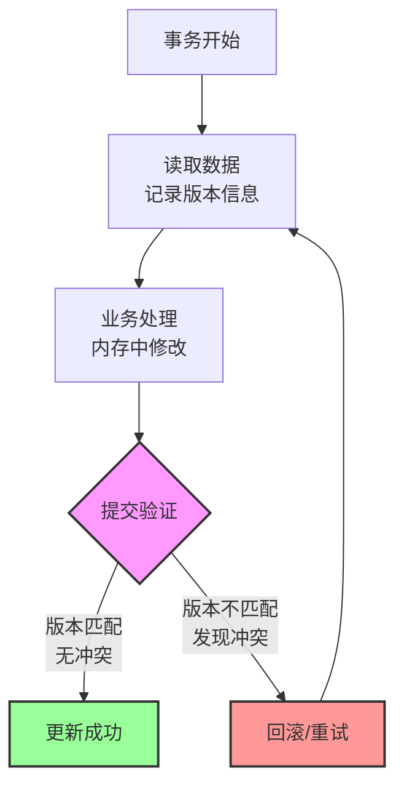
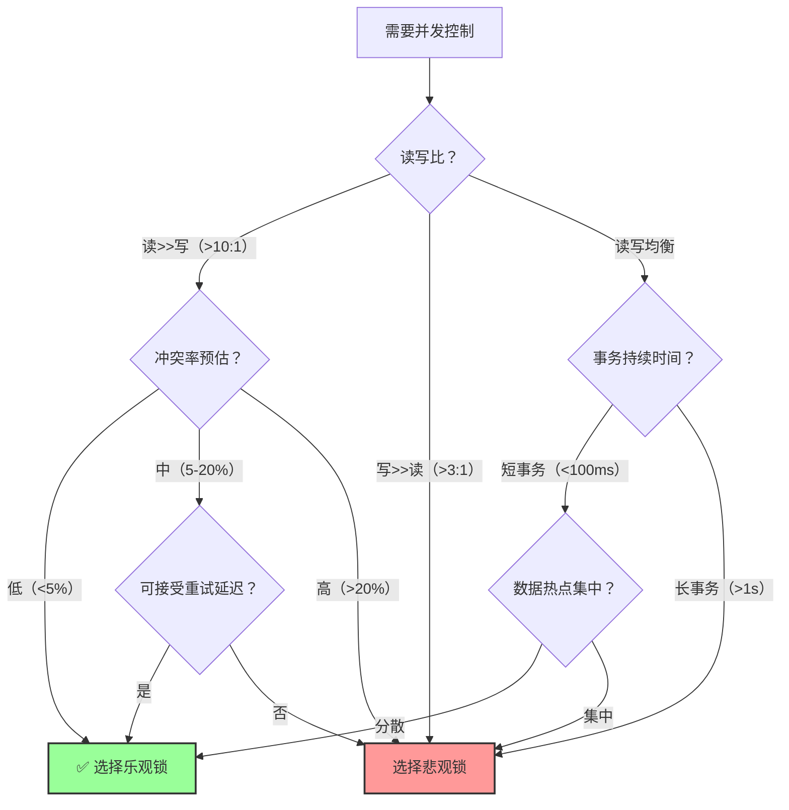
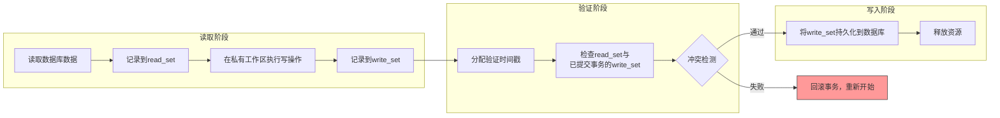
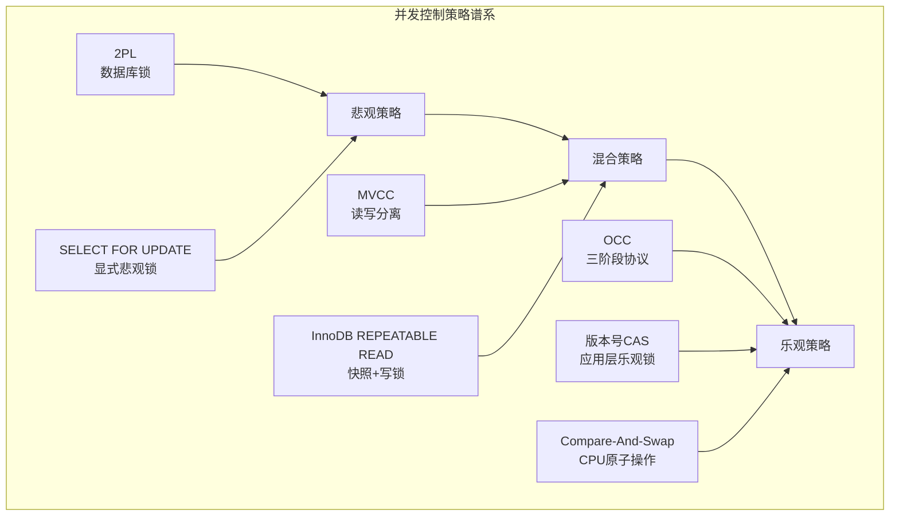

## 技巧三：乐观锁实现

### 1. 概述与设计哲学

乐观锁（Optimistic Locking）并非数据库层面真正意义上的"锁"，而是一种**基于冲突检测的并发控制策略**。其核心假设是：在大多数情况下，事务之间不会发生冲突。因此，事务在执行过程中不加任何锁，仅在提交时验证是否存在冲突。如果冲突发生，则回滚并重试。

这种策略源于Kung和Robinson在1981年提出的**乐观并发控制（Optimistic Concurrency Control, OCC）**算法，论文"Optimistic Concurrency Control"首次系统化地描述了这一思想。其哲学内核可以用一句话概括：**"先做事，后验证，冲突了再来"**——这与现实世界中大多数协作场景的直觉一致：先各干各的，最后汇总时再检查有没有撞车。



**为什么乐观锁如此重要？** 在互联网应用中，绝大多数操作是读多写少的。以电商系统为例，一个商品页面的浏览量可能是下单量的100倍以上。如果对每次读操作都加锁，系统吞吐量将急剧下降。乐观锁的设计哲学正是为这种场景量身定制的——**把锁的开销从每一次操作推迟到只有冲突时才付出**。

**与悲观锁的本质区别**：

| 对比维度 | 悲观锁（Pessimistic） | 乐观锁（Optimistic） |
|---------|----------------------|---------------------|
| 加锁时机 | 操作前加锁 | 提交时检测冲突 |
| 并发模型 | 互斥访问 | 先操作后验证 |
| 适用场景 | 高争用、写密集 | 低争用、读多写少 |
| 性能特征 | 有锁管理开销 | 无锁开销，冲突时回滚 |
| 死锁风险 | 可能发生 | 不会发生 |
| 吞吐量影响 | 串行化部分操作 | 允许最大并发 |
| 实现复杂度 | 数据库内置 | 需要应用层配合 |
| 资源占用 | 持有锁直到事务结束 | 仅在提交时短暂检查 |

**乐观锁的本质是"先斩后奏"**——先执行操作，提交时再确认是否合法。这与操作系统中的CAS（Compare-And-Swap）原子操作思想一脉相承，也是无锁编程（Lock-Free Programming）的基石。

#### 1.1 选择决策流程图

面对并发控制的需求，如何判断该用乐观锁还是悲观锁？以下是决策路径：



### 2. 理论基础：OCC三阶段协议

OCC将每个事务的执行分为三个严格的阶段，这是乐观锁所有实现变体的理论根基。理解这三个阶段的工作原理，是正确实现和调优乐观锁的前提。



#### 2.1 读取阶段（Read Phase）

事务在私有工作空间中执行所有操作：

```python
class OCCTransaction:
    def __init__(self):
        self.read_set = {}   # {key: (value, version)}
        self.write_set = {}  # {key: new_value}
        self.start_ts = None

    def read(self, key):
        """从数据库读取数据，同时记录当前版本号"""
        value, version = database.get_with_version(key)
        self.read_set[key] = (value, version)
        return value

    def write(self, key, value):
        """在私有缓冲区记录写操作，不立即修改数据库"""
        self.write_set[key] = value
```

关键设计要点：
- 读操作直接读取数据库最新数据，但不加任何锁
- 写操作仅记录在内存缓冲区，不产生任何持久化变更
- read_set中保存的是(key, value, version)三元组，版本号用于后续冲突检测
- 读取阶段可能持续较长时间，但不会阻塞其他事务
- **读取阶段是乐观锁"乐观"的体现**——假设数据不会被别人改，先读着

#### 2.2 验证阶段（Validation Phase）

验证是OCC的核心——检查事务的读取集是否被其他已提交事务修改过：

```python
def commit(self):
    """提交事务：先验证，再写入"""
    self.validation_ts = get_next_timestamp()

    # 向后验证：检查已提交事务是否与当前事务冲突
    if not self._validate():
        self._abort()
        return False

    # 写入阶段：将修改应用到数据库
    self._write_phase()
    return True

def _validate(self):
    """向后验证：检查当前事务的read_set是否与
    在start_ts和validation_ts之间提交的事务的write_set有交集"""
    committed_txns = get_committed_after(self.start_ts)
    for txn in committed_txns:
        # 如果我读取的数据被别人修改了，说明冲突
        if self.read_set.keys() &amp; txn.write_set.keys():
            return False
    return True
```

验证阶段的性能至关重要。在高并发场景下，可能需要检查大量已提交事务的write_set。常见的优化手段包括：
- **写集索引**：对write_set的key建立哈希索引，将O(N)的冲突检测降为O(1)
- **时间窗口裁剪**：只检查validation_ts前N秒内提交的事务
- **批量验证**：多个事务共享验证结果，避免重复检查

#### 2.3 写入阶段（Write Phase）

验证通过后，将私有工作区的修改原子地写入数据库：

```python
def _write_phase(self):
    """将write_set持久化到数据库"""
    with database.batch_update() as batch:
        for key, value in self.write_set.items():
            current_version = self.read_set[key][1]
            # 原子更新：仅当版本号匹配时才写入
            success = batch.compare_and_set(
                key,
                expected_version=current_version,
                new_value=value
            )
            if not success:
                raise ConflictDetected("写入阶段版本冲突")
```

#### 2.4 向前验证与向后验证的对比

OCC存在两种验证策略，各有优劣：

```python
# === 向后验证（Backward Validation）===
# 检查"在我开始之后提交的事务"是否与我冲突
def validate_backward(txn):
    for committed_txn in committed_after(txn.start_ts):
        # 我读的数据是否被别人写了
        if txn.read_set.keys() &amp; committed_txn.write_set.keys():
            return False  # 冲突：读取的数据被后续事务修改
    return True

# === 向前验证（Forward Validation）===
# 检查"我是否与当前活跃的事务"冲突
def validate_forward(txn):
    for active_txn in active_transactions:
        if active_txn.start_ts < txn.validation_ts:
            # 我写的是否被别人读了
            if txn.write_set.keys() &amp; active_txn.read_set.keys():
                return False  # 冲突：我的修改影响了正在执行的事务
    return True
```

| 验证策略 | 检测方向 | 优势 | 劣势 |
|---------|---------|------|------|
| 向后验证 | 已提交事务 vs 当前事务 | 实现简单，信息完整 | 需遍历所有已提交事务 |
| 向前验证 | 当前事务 vs 活跃事务 | 只需回滚当前事务 | 可能遗漏某些冲突 |

**向后验证的致命问题**：一旦检测到冲突，回滚的只能是当前事务——但已提交的事务不会被回滚。这意味着如果冲突检测不够精确，可能产生不可串行化的调度。

**向前验证的优势**：冲突只涉及当前事务与活跃事务，可以选择回滚代价最小的一方，且不会影响已提交事务。

### 3. 应用层乐观锁：版本号机制

应用层乐观锁最常见的实现是**版本号（Version Number）**机制，这是OCC三阶段协议在关系型数据库中的工程化落地。版本号的选择直接影响系统的可靠性和性能。

#### 3.1 版本号策略对比

| 策略 | 数据类型 | 优势 | 劣势 | 适用场景 |
|------|---------|------|------|---------|
| 自增整数 | INT/BIGINT | 简单可靠，数据库原子递增 | 分布式需额外协调 | 单数据库、中低并发 |
| 时间戳 | TIMESTAMP | 自带时间语义 | 精度受限，时钟偏移 | 低并发、审计需求 |
| UUID | CHAR(36) | 天然分布式，无协调 | 索引效率低，占用空间大 | 分布式、多主写入 |
| 雪花算法 | BIGINT | 分布式友好，有序 | 依赖时钟同步 | 分布式ID场景 |
| 哈希值 | CHAR(32) | 内容寻址，变更即变化 | 计算开销 | 内容级版本控制 |

#### 3.2 基本实现

**数据库表设计**：

```sql
-- 订单表，包含version字段用于乐观锁
CREATE TABLE orders (
    id          BIGINT PRIMARY KEY AUTO_INCREMENT,
    user_id     BIGINT NOT NULL,
    product_id  BIGINT NOT NULL,
    quantity    INT NOT NULL DEFAULT 1,
    amount      DECIMAL(10, 2) NOT NULL,
    status      VARCHAR(20) NOT NULL DEFAULT 'pending',
    version     INT NOT NULL DEFAULT 0,       -- 乐观锁版本号
    created_at  TIMESTAMP DEFAULT CURRENT_TIMESTAMP,
    updated_at  TIMESTAMP DEFAULT CURRENT_TIMESTAMP ON UPDATE CURRENT_TIMESTAMP,

    INDEX idx_user_id (user_id),
    INDEX idx_status (status)
);
```

**核心更新模式**：

```sql
-- 读取阶段：查询当前版本号
SELECT id, quantity, amount, status, version
FROM orders
WHERE id = 1001;

-- 假设读到 version = 5, quantity = 2

-- 写入阶段：带上版本号更新
UPDATE orders
SET quantity = 3, status = 'confirmed', version = version + 1
WHERE id = 1001 AND version = 5;

-- 检查影响行数：0表示冲突，1表示成功
```

为什么用`version = version + 1`而不是`version = 6`？因为自增操作由数据库原子执行，避免了应用层自行计算版本号可能引入的并发问题。如果用`version = 6`，两个事务可能同时读到version=5，都写入version=6，导致乐观锁失效。

#### 3.3 Java/Spring Boot完整实现

```java
// ===== 实体类 =====
@Entity
@Table(name = "orders")
public class Order {
    @Id
    @GeneratedValue(strategy = GenerationType.IDENTITY)
    private Long id;

    private Long userId;
    private Long productId;
    private Integer quantity;
    private BigDecimal amount;
    private String status;

    @Version  // JPA自动管理乐观锁版本号
    private Integer version;

    // getter/setter省略
}

// ===== Repository层 =====
@Repository
public interface OrderRepository extends JpaRepository<Order, Long> {
}

// ===== Service层：带重试的乐观锁更新 =====
@Service
@Slf4j
public class OrderService {

    @Autowired
    private OrderRepository orderRepository;

    // 最大重试次数，防止无限重试
    private static final int MAX_RETRY = 3;

    /**
     * 更新订单数量（乐观锁模式）
     *
     * @return 更新后的订单，如果所有重试都失败返回null
     */
    public Order updateQuantity(Long orderId, int newQuantity) {
        for (int attempt = 1; attempt <= MAX_RETRY; attempt++) {
            try {
                // 1. 读取阶段：加载当前状态
                Order order = orderRepository.findById(orderId)
                    .orElseThrow(() -> new OrderNotFoundException(orderId));

                // 2. 业务逻辑校验
                if ("cancelled".equals(order.getStatus())) {
                    throw new BusinessException("已取消订单不可修改");
                }

                // 3. 修改数据
                order.setQuantity(newQuantity);
                order.setAmount(calculateAmount(newQuantity));

                // 4. 提交（JPA @Version自动做版本号校验）
                Order saved = orderRepository.save(order);
                log.info("订单{}更新成功，重试次数：{}", orderId, attempt - 1);
                return saved;

            } catch (OptimisticLockingFailureException e) {
                log.warn("订单{}乐观锁冲突，第{}/{}次重试",
                    orderId, attempt, MAX_RETRY);
                if (attempt == MAX_RETRY) {
                    log.error("订单{}重试{}次仍失败", orderId, MAX_RETRY);
                    return null;
                }
                // 短暂等待后重试，避免立即再次冲突
                try {
                    Thread.sleep(10 * attempt); // 递增退避
                } catch (InterruptedException ie) {
                    Thread.currentThread().interrupt();
                    return null;
                }
            }
        }
        return null;
    }

    private BigDecimal calculateAmount(int quantity) {
        return BigDecimal.valueOf(99.9).multiply(BigDecimal.valueOf(quantity));
    }
}
```

**JPA `@Version`的底层原理**：Hibernate在执行`save()`时，会自动生成如下SQL：

```sql
-- Hibernate自动生成的SQL（带版本号校验）
UPDATE orders
SET quantity=?, amount=?, version=version+1
WHERE id=? AND version=?

-- 如果WHERE条件匹配0行，抛出OptimisticLockingFailureException
```

这完全等价于手动编写带版本号条件的UPDATE语句，但由框架自动管理，减少了遗漏风险。

#### 3.4 时间戳作为版本号

除自增整数外，时间戳也是常用的版本标识：

```sql
-- 使用时间戳作为版本号
UPDATE products
SET stock = stock - 1, updated_at = NOW(3)  -- 毫秒精度
WHERE id = 1001 AND updated_at = '2026-06-26 10:30:00.123';

-- 影响行数为0则表示在读取后被其他事务修改过
```

**时间戳方案的陷阱**：MySQL的`NOW(3)`在单核高并发下可能产生相同的时间戳（精度不够）。更安全的做法是使用数据库生成的`ON UPDATE CURRENT_TIMESTAMP`，或者改用整数版本号。在分布式系统中，时间戳还可能受时钟偏移影响。

#### 3.5 多字段联合版本号

在复杂业务场景下，单个版本号字段可能不足以表达所有冲突维度。此时可以使用多字段联合版本号：

```sql
-- 库存表：同时检查版本号和库存数量
UPDATE inventory
SET stock = stock - 1,
    version = version + 1
WHERE product_id = 1001
  AND version = 5
  AND stock >= 1;  -- 额外的业务约束

-- 这样既做了乐观锁冲突检测，又做了库存不足的业务校验
```

```sql
-- 订单表：版本号+状态联合校验
UPDATE orders
SET status = 'shipped',
    version = version + 1
WHERE id = 1001
  AND version = 3
  AND status = 'paid';  -- 只有已支付的订单才能发货

-- 防止已取消/已发货的订单被错误更新
```

### 4. 数据库层面的CAS操作

Compare-And-Swap（CAS）是乐观锁的原子指令级实现，是乐观锁在内存和数据库两个层面的统一体现。

#### 4.1 MySQL的CAS实现

MySQL本身没有原生CAS指令，但可以通过`UPDATE ... WHERE version = old_version`模式实现等价语义：

```sql
-- 标准CAS模式
UPDATE inventory
SET stock = stock - 1
WHERE product_id = 2001 AND stock >= 1 AND version = 5;

-- 执行后检查：
-- ROW_COUNT() = 1 → 成功
-- ROW_COUNT() = 0 → 版本不匹配或库存不足
```

**更优雅的CAS：使用INSERT ... ON DUPLICATE KEY**：

```sql
-- 分布式ID生成器的CAS实现
INSERT INTO distributed_ids (worker_id, last_id, version)
VALUES (3, 10000, 1)
ON DUPLICATE KEY UPDATE
    last_id = IF(version = VALUES(version) - 1, VALUES(last_id), last_id),
    version = IF(version = VALUES(version) - 1, VALUES(version), version);
```

**MySQL 8.0.19+的原生CAS支持**：MySQL从8.0.19开始支持`VALUES()`函数在`ON DUPLICATE KEY UPDATE`中的使用，使得CAS模式更加简洁可靠。

#### 4.2 PostgreSQL的CAS实现

PostgreSQL提供了`RETURNING`子句，可以更优雅地实现CAS：

```sql
-- 读取并更新一体化
UPDATE products
SET stock = stock - 1,
    version = version + 1
WHERE id = 2001 AND version = 5 AND stock >= 1
RETURNING id, stock, version;

-- 如果返回空结果集，说明CAS失败
```

PostgreSQL还支持`CTID`作为隐式版本号：

```sql
-- 利用CTID做CAS（适用于简单场景）
UPDATE accounts
SET balance = balance - 100
WHERE ctid = '(0,5)'  -- CTID是行的物理位置标识
RETURNING balance;
```

但CTID在VACUUM后会改变，因此生产环境推荐使用显式版本号。

**PostgreSQL SSI（Serializable Snapshot Isolation）**：PostgreSQL还提供了一种更高级的乐观并发控制机制——可串行化快照隔离。它在MVCC的基础上增加了依赖图检测，当检测到可能导致不可串行化的读写依赖时自动回滚事务：

```sql
-- 启用SSI：将隔离级别设为SERIALIZABLE
BEGIN TRANSACTION ISOLATION LEVEL SERIALIZABLE;

-- 如果两个事务的读写模式可能导致不可串行化的调度
-- PostgreSQL会自动回滚其中一个事务
-- 错误信息：could not serialize access due to read/write dependencies
```

SSI的优势在于不需要手动管理版本号，数据库自动检测所有潜在冲突。但它的代价是更高的回滚率，适合冲突较少但正确性要求极高的场景。

#### 4.3 Redis的CAS实现

Redis通过`WATCH`命令和`MULTI`事务提供CAS语义：

```python
import redis

r = redis.Redis()

def cas_update_stock(product_id, quantity):
    """Redis乐观锁：库存扣减"""
    max_retries = 3
    for attempt in range(max_retries):
        try:
            # 1. WATCH目标key，监听变更
            pipe = r.pipeline()
            pipe.watch(f"product:{product_id}:stock")

            # 2. 读取当前值
            current_stock = int(pipe.get(f"product:{product_id}:stock") or 0)

            if current_stock < quantity:
                pipe.unwatch()
                raise InsufficientStockError()

            # 3. 在MULTI事务中执行更新
            pipe.multi()
            pipe.set(
                f"product:{product_id}:stock",
                current_stock - quantity
            )
            # 4. 执行：如果WATCH期间key被修改，EXEC返回None
            result = pipe.execute()

            if result is None:
                # CAS失败：其他客户端在WATCH期间修改了stock
                print(f"冲突，重试 {attempt + 1}/{max_retries}")
                continue

            return current_stock - quantity

        except redis.WatchError:
            print(f"WATCH检测到冲突，重试 {attempt + 1}/{max_retries}")
            continue

    raise ConcurrencyConflictError("重试次数耗尽")
```

**Redis WATCH的工作原理**：
- `WATCH`为key设置一个客户端级别的监视标记
- 在`MULTI/EXEC`期间，如果被监视的key被其他客户端修改，`EXEC`返回`(nil)`
- 这本质上是一个轻量级的CAS实现，不需要数据库锁

**Redis 6.0+的改进**：Redis 6.0引入了`CLIENT NO-EVICT`和更好的WATCH性能，在高并发场景下冲突检测更高效。同时，Redis 7.0的Function API支持将CAS逻辑封装为服务端函数，减少网络往返。

#### 4.4 三种数据库CAS实现对比

| 特性 | MySQL | PostgreSQL | Redis |
|------|-------|-----------|-------|
| CAS原语 | UPDATE...WHERE version=N | UPDATE...RETURNING | WATCH/MULTI/EXEC |
| 原子性保证 | InnoDB行锁 | 行级MVCC | 单线程命令执行 |
| 冲突检测 | 影响行数=0 | RETURNING空结果 | EXEC返回None |
| 性能开销 | 低（单条SQL） | 低（单条SQL） | 极低（内存操作） |
| 持久性 | 磁盘持久化 | 磁盘持久化 | 可配置（RDB/AOF） |
| 适用场景 | 通用OLTP | 需要RETURNING的场景 | 高频计数器/缓存 |

### 5. 分布式环境下的乐观锁

在分布式系统中，乐观锁的实现面临更多挑战：网络延迟、节点故障、数据分片等。核心难题是：**如何在没有全局时钟的情况下，为并发操作建立偏序关系？**

#### 5.1 分布式版本号方案

```python
# 方案一：基于雪花算法的版本号（包含时间戳+机器ID+序列号）
class SnowflakeVersion:
    """版本号由时间戳(41bit) + 机器ID(10bit) + 序列号(12bit)组成"""

    def __init__(self, worker_id):
        self.worker_id = worker_id
        self.sequence = 0
        self.last_timestamp = -1

    def next_version(self):
        timestamp = current_millis()

        if timestamp == self.last_timestamp:
            self.sequence = (self.sequence + 1) &amp; 0xFFF
            if self.sequence == 0:
                timestamp = wait_next_millis(self.last_timestamp)
        else:
            self.sequence = 0

        self.last_timestamp = timestamp
        return ((timestamp - EPOCH) << 22) | (self.worker_id << 12) | self.sequence


# 方案二：基于向量时钟的版本号（适合多主写入）
class VectorClock:
    """向量时钟：每个节点维护自己的逻辑时钟"""

    def __init__(self):
        self.clock = {}  # {node_id: counter}

    def increment(self, node_id):
        self.clock[node_id] = self.clock.get(node_id, 0) + 1

    def merge(self, other):
        for node_id, counter in other.clock.items():
            self.clock[node_id] = max(self.clock.get(node_id, 0), counter)

    def happens_before(self, other):
        """判断self是否先于other发生"""
        dominated = False
        for node_id in set(self.clock) | set(other.clock):
            if self.clock.get(node_id, 0) > other.clock.get(node_id, 0):
                return False
            if self.clock.get(node_id, 0) < other.clock.get(node_id, 0):
                dominated = True
        return dominated

    def concurrent_with(self, other):
        """判断两个时钟是否并发（无先后关系）"""
        return not self.happens_before(other) and not other.happens_before(self)
```

**方案三：基于CAS的自增版本号（最实用）**

```sql
-- 在分布式数据库中，使用数据库自身的自增能力
-- 配合全局唯一表名避免冲突
CREATE TABLE distributed_versions (
    entity_type VARCHAR(50) NOT NULL,
    entity_id   BIGINT NOT NULL,
    version     BIGINT NOT NULL DEFAULT 0,
    PRIMARY KEY (entity_type, entity_id)
);

-- 每次更新时原子递增
UPDATE distributed_versions
SET version = version + 1
WHERE entity_type = 'order' AND entity_id = 12345
RETURNING version;
```

#### 5.2 分布式事务中的乐观锁

在微服务架构中，乐观锁需要与分布式事务协调：

```python
class OrderSaga:
    """基于Saga模式的分布式订单流程，每步都用乐观锁"""

    def create_order(self, order_request):
        saga = SagaCoordinator()

        # Step 1: 扣减库存（乐观锁）
        saga.add_step(
            action=self._deduct_inventory,
            compensate=self._restore_inventory,
            context={
                "product_id": order_request.product_id,
                "quantity": order_request.quantity,
                "expected_version": order_request.inventory_version
            }
        )

        # Step 2: 扣减余额（乐观锁）
        saga.add_step(
            action=self._deduct_balance,
            compensate=self._restore_balance,
            context={
                "user_id": order_request.user_id,
                "amount": order_request.total_amount,
                "expected_version": order_request.account_version
            }
        )

        # Step 3: 创建订单记录
        saga.add_step(
            action=self._create_order_record,
            compensate=self._cancel_order_record,
            context=order_request
        )

        # 执行Saga，任何一步失败则触发补偿
        result = saga.execute()
        return result

    def _deduct_inventory(self, context):
        """库存扣减：乐观锁检查"""
        result = inventory_service.update(
            product_id=context["product_id"],
            delta=-context["quantity"],
            expected_version=context["expected_version"]
        )
        if result.rows_affected == 0:
            raise SagaStepFailed("库存版本冲突，需要重新读取")
        return {"new_version": result.new_version}
```

**Saga模式中乐观锁的关键设计**：每个Saga步骤都携带`expected_version`，当某一步因乐观锁冲突失败时，Saga协调器可以：
1. 重新读取最新版本号，更新`expected_version`后重试当前步骤
2. 触发已完成步骤的补偿操作，整个Saga回滚

#### 5.3 事件溯源中的乐观锁

事件溯源（Event Sourcing）天然支持乐观锁——事件流本身就是版本化的：

```python
class EventStore:
    """基于事件溯源的乐观锁实现"""

    def append(self, stream_id, events, expected_version):
        """
        向事件流追加新事件。

        expected_version = 当前流的最新版本号
        如果流的当前版本 != expected_version，说明有并发写入
        """
        with self.db.transaction():
            # 检查当前版本
            current_version = self._get_current_version(stream_id)
            if current_version != expected_version:
                raise ConcurrencyConflict(
                    f"流 {stream_id} 当前版本 {current_version}，"
                    f"期望版本 {expected_version}"
                )

            # 追加事件（使用数据库行锁保证单流串行化）
            for i, event in enumerate(events):
                self.db.execute(
                    "INSERT INTO events (stream_id, version, type, data, metadata) "
                    "VALUES (%s, %s, %s, %s, %s)",
                    (stream_id, expected_version + i + 1,
                     event.type, event.data, event.metadata)
                )

            # 发布事件到消息队列（最终一致性）
            self.publisher.publish(stream_id, events)

        return expected_version + len(events)
```

**EventStoreDB的实现参考**：EventStoreDB是一个专门为事件溯源设计的数据库，其`expected_version`参数就是乐观锁的典型实现。当并发写入同一事件流时，后提交的事务会收到`WrongExpectedVersion`异常。

#### 5.4 分布式冲突解决策略

当乐观锁冲突在分布式环境中发生时，除了简单的重试，还有更复杂的冲突解决策略：

```python
class ConflictResolver:
    """分布式冲突解决器"""

    def resolve_last_write_wins(self, local_version, remote_version):
        """策略一：最后写入胜出（Last-Write-Wins, LWW）
        优点：简单，保证最终一致性
        缺点：可能丢失更新"""
        if remote_version.timestamp > local_version.timestamp:
            return remote_version
        return local_version

    def resolve_merge(self, local_state, remote_state):
        """策略二：自动合并（CRDT）
        适用于可交换/可结合的操作（如计数器、集合、寄存器）"""
        merged = {}
        for key in set(local_state.keys()) | set(remote_state.keys()):
            local_val = local_state.get(key)
            remote_val = remote_state.get(key)
            if local_val is None:
                merged[key] = remote_val
            elif remote_val is None:
                merged[key] = local_val
            else:
                # 对于G-Counter类型：取每个维度的最大值
                merged[key] = max(local_val, remote_val)
        return merged

    def resolve_manual(self, local_version, remote_version):
        """策略三：人工裁决
        适用于金融、医疗等需要精确一致性的场景"""
        conflict_record = {
            "local": local_version.serialize(),
            "remote": remote_version.serialize(),
            "detected_at": datetime.utcnow(),
            "status": "pending_review"
        }
        self.conflict_queue.put(conflict_record)
        raise ManualResolutionRequired(conflict_record)
```

| 策略 | 适用场景 | 一致性保证 | 实现复杂度 |
|------|---------|-----------|-----------|
| 重试（Retry） | 冲突率低的通用场景 | 强一致 | 低 |
| LWW（最后写入胜出） | 日志、时序数据 | 最终一致 | 低 |
| CRDT自动合并 | 分布式计数器、集合 | 最终一致 | 中 |
| 人工裁决 | 金融、医疗数据 | 强一致 | 高 |
| 三向合并（3-way merge） | 协作文档、配置管理 | 最终一致 | 中高 |

### 6. 乐观锁的重试策略

乐观锁的核心设计问题之一是：冲突后如何重试？重试策略直接影响系统在高并发下的表现。

#### 6.1 基本重试模式

```python
class OptimisticLockRetry:
    """乐观锁重试框架"""

    def __init__(self, max_retries=3, base_delay_ms=10, max_delay_ms=1000):
        self.max_retries = max_retries
        self.base_delay_ms = base_delay_ms
        self.max_delay_ms = max_delay_ms

    def execute_with_retry(self, operation):
        """带重试的操作执行器"""
        last_error = None

        for attempt in range(self.max_retries + 1):
            try:
                result = operation()
                if attempt > 0:
                    log.info(f"第{attempt}次重试成功")
                return result

            except OptimisticLockConflict as e:
                last_error = e
                if attempt < self.max_retries:
                    delay = self._calculate_delay(attempt)
                    log.warning(
                        f"乐观锁冲突，{delay}ms后重试 "
                        f"({attempt + 1}/{self.max_retries})"
                    )
                    time.sleep(delay / 1000.0)

        raise last_error

    def _calculate_delay(self, attempt):
        """指数退避 + 随机抖动（Jitter）"""
        delay = min(
            self.base_delay_ms * (2 ** attempt),
            self.max_delay_ms
        )
        # 添加±25%的随机抖动，避免惊群效应
        jitter = delay * 0.25 * (2 * random.random() - 1)
        return int(delay + jitter)
```

#### 6.2 重试策略对比

| 策略 | 描述 | 适用场景 | 风险 |
|------|------|---------|------|
| 立即重试 | 冲突后立刻重试 | 极低冲突率 | 惊群效应 |
| 固定间隔 | 每次等待相同时间 | 简单场景 | 可能周期性冲突 |
| 指数退避 | 等待时间指数增长 | 通用场景 | 长尾延迟高 |
| 指数退避+抖动 | 退避基础上加随机抖动 | **推荐方案** | 实现稍复杂 |
| 自适应退避 | 根据冲突率动态调整 | 高级场景 | 实现复杂 |

**指数退避+抖动**是业界推荐的最佳方案，原因在于：
- 指数退避逐步降低重试频率，给冲突方更多时间完成
- 随机抖动打散多个客户端的重试时间点，避免"同时重试→同时冲突→同时再重试"的惊群效应
- 有理论证明该策略在竞争信道场景下的最优性（Exponential Backoff with Truncated Binary Exponential Distribution, IEEE 802.3以太网协议采用此策略）

#### 6.3 自适应退避算法

```python
class AdaptiveBackoff:
    """自适应退避：根据实时冲突率动态调整退避参数"""

    def __init__(self, initial_base_ms=10, max_delay_ms=2000):
        self.base_ms = initial_base_ms
        self.max_delay_ms = max_delay_ms
        # 滑动窗口统计最近100次操作的冲突率
        self.window_size = 100
        self.results = collections.deque(maxlen=self.window_size)

    def record(self, was_conflict: bool):
        self.results.append(1 if was_conflict else 0)

    def get_delay(self, attempt: int) -> float:
        conflict_rate = sum(self.results) / max(len(self.results), 1)

        # 冲突率越高，基础退避时间越长
        # 冲突率0% → base_ms, 冲突率50% → base_ms * 10
        adaptive_base = self.base_ms * (1 + conflict_rate * 20)

        delay = min(adaptive_base * (2 ** attempt), self.max_delay_ms)
        jitter = delay * 0.25 * (2 * random.random() - 1)
        return delay + jitter
```

#### 6.4 避免无限重试

```python
class CircuitBreakerOptimisticLock:
    """带熔断器的乐观锁：冲突过多时快速失败"""

    def __init__(self, failure_threshold=10, recovery_timeout=30):
        self.failure_count = 0
        self.failure_threshold = failure_threshold
        self.recovery_timeout = recovery_timeout
        self.last_failure_time = None
        self.state = "closed"  # closed / open / half-open

    def execute(self, operation):
        if self.state == "open":
            if time.time() - self.last_failure_time > self.recovery_timeout:
                self.state = "half-open"
            else:
                raise CircuitOpenError("冲突过多，熔断器打开")

        try:
            result = operation()
            if self.state == "half-open":
                self.state = "closed"
                self.failure_count = 0
            return result

        except OptimisticLockConflict:
            self.failure_count += 1
            self.last_failure_time = time.time()
            if self.failure_count >= self.failure_threshold:
                self.state = "open"
                log.error(f"连续{self.failure_count}次冲突，熔断器打开")
            raise
```

### 7. ORM框架中的乐观锁集成

#### 7.1 SQLAlchemy（Python）

```python
from sqlalchemy import Column, Integer, String, Numeric, select
from sqlalchemy.orm import declarative_base
from sqlalchemy.exc import StaleDataError

Base = declarative_base()

class Product(Base):
    __tablename__ = 'products'

    id = Column(Integer, primary_key=True)
    name = Column(String(100), nullable=False)
    stock = Column(Integer, default=0)
    version = Column(Integer, default=0, nullable=False)

    def update_stock(self, delta):
        """乐观锁更新库存"""
        old_version = self.version
        self.stock += delta
        self.version += 1

        # 执行时附带版本号条件
        result = session.execute(
            Product.__table__.update()
            .where(Product.id == self.id, Product.version == old_version)
            .values(stock=self.stock, version=self.version)
        )

        if result.rowcount == 0:
            session.rollback()
            raise StaleDataError(
                f"产品{self.id}版本冲突: "
                f"期望版本{old_version}, 当前已被其他事务修改"
            )
        session.commit()
```

**SQLAlchemy 1.4+的`mapped_column`方式**（推荐）：

```python
from sqlalchemy.orm import DeclarativeBase, Mapped, mapped_column

class Base(DeclarativeBase):
    pass

class Product(Base):
    __tablename__ = 'products'
    id: Mapped[int] = mapped_column(primary_key=True)
    name: Mapped[str] = mapped_column(String(100))
    stock: Mapped[int] = mapped_column(default=0)
    version: Mapped[int] = mapped_column(default=0)

    # 使用ORM事件自动管理版本号
    from sqlalchemy import event

    @event.listens_for(Product, "before_update")
    def auto_increment_version(mapper, connection, target):
        target.version += 1
```

#### 7.2 Hibernate/JPA（Java）

```java
// JPA @Version注解自动管理版本号
@Entity
@Table(name = "products")
public class Product {
    @Id
    @GeneratedValue(strategy = GenerationType.IDENTITY)
    private Long id;

    private String name;
    private Integer stock;

    @Version
    private Integer version;  // Hibernate自动在UPDATE中加入版本号检查

    // 更新库存
    public void deductStock(int quantity) {
        if (this.stock < quantity) {
            throw new InsufficientStockException();
        }
        this.stock -= quantity;
        // Hibernate在flush时自动执行:
        // UPDATE products SET stock=?, version=version+1
        // WHERE id=? AND version=?
    }
}

// 全局异常处理
@ControllerAdvice
public class OptimisticLockExceptionHandler {

    @ExceptionHandler(OptimisticLockingFailureException.class)
    @ResponseStatus(HttpStatus.CONFLICT)
    @ResponseBody
    public ErrorResponse handleOptimisticLock(
            OptimisticLockingFailureException ex) {
        return new ErrorResponse(
            "CONFLICT",
            "数据已被其他用户修改，请刷新后重试",
            409
        );
    }
}
```

**Hibernate的`@OptimisticLocking`注解**：

```java
@Entity
@OptimisticLocking(type = OptimisticLockType.VERSION)
// 也可选择 DIRTY（只检查被修改的字段）、ALL（检查所有字段）
public class Product {
    @Version
    private Long version;

    // DIRTY模式：只有被修改的字段才会出现在WHERE条件中
    // 适用于宽表场景，减少不必要的冲突
}
```

#### 7.3 GORM（Go）

```go
type Product struct {
    gorm.Model
    Name    string
    Stock   int
    Version int `gorm:"not null;default:0"`
}

// 乐观锁更新
func UpdateStock(db *gorm.DB, productID uint, delta int) error {
    result := db.Model(&amp;Product{}).
        Where("id = ? AND version = ?", productID, expectedVersion).
        Updates(map[string]interface{}{
            "stock":   gorm.Expr("stock + ?", delta),
            "version": gorm.Expr("version + 1"),
        })

    if result.RowsAffected == 0 {
        return ErrOptimisticLockConflict
    }
    return nil
}
```

#### 7.4 Django ORM（Python）

```python
from django.db import models, transaction
from django.db.models import F

class Product(models.Model):
    name = models.CharField(max_length=100)
    stock = models.IntegerField(default=0)
    version = models.IntegerField(default=0)

class OptimisticLockManager:
    @staticmethod
    def update_stock(product_id, delta, expected_version):
        """Django ORM的乐观锁实现"""
        with transaction.atomic():
            # 使用select_for_update获取当前状态
            product = Product.objects.select_for_update().get(id=product_id)

            # 原子更新：使用F表达式避免读-改-写竞态
            rows_updated = Product.objects.filter(
                id=product_id,
                version=expected_version
            ).update(
                stock=F('stock') + delta,
                version=F('version') + 1
            )

            if rows_updated == 0:
                raise OptimisticLockConflict(
                    f"产品{product_id}版本冲突"
                )
            return product_id
```

**Django的关键技巧**：使用`F('stock') + delta`而非`product.stock + delta`，让数据库原子执行加法操作，彻底消除读-改-写竞态。

### 8. 适用场景与性能特征

#### 8.1 何时选择乐观锁

场景评估矩阵：

                        低争用          高争用
                       ┌──────────┬──────────┐
短事务（<100ms）       │ ✅ 乐观锁  │ ⚠️ 看情况  │
                       ├──────────┼──────────┤
长事务（>1s）          │ ✅ 乐观锁  │ ❌ 悲观锁  │
                       └──────────┴──────────┘

**推荐使用乐观锁的场景**：
- 读多写少的应用（如CMS、配置管理、用户资料）
- 低冲突率的业务操作（如个人信息修改、评论更新）
- 分布式环境下的无锁同步（如分布式ID生成、库存预扣减）
- 微服务间的数据同步（如订单状态流转）
- 缓存与数据库的一致性维护（CAS更新缓存）

**不适合乐观锁的场景**：
- 热点数据的频繁更新（如秒杀库存、计数器）
- 长事务中的频繁写操作（验证窗口过大）
- 需要严格串行化的操作（如银行转账的强一致场景）
- 高并发写入的OLTP系统（如交易撮合引擎）

#### 8.2 真实场景案例：电商库存扣减

**场景描述**：某电商平台大促期间，单个热门SKU每秒产生2000+次库存扣减请求。

**方案一：纯乐观锁（失败）**

```sql
-- 冲突率高达60%，大量重试
UPDATE inventory SET stock = stock - 1, version = version + 1
WHERE product_id = 1001 AND version = 5 AND stock >= 1;
-- 影响行数0 → 重试 → 再冲突 → 再重试
-- 平均重试3.2次才成功，P99延迟飙到2秒
```

**方案二：乐观锁+Redis预扣减（成功）**

```python
def deduct_stock_with_redis_product_id):
    """Redis预扣减 + 数据库乐观锁异步同步"""
    # 第一层：Redis原子扣减（内存操作，微秒级）
    lua_script = """
    local stock = redis.call('GET', KEYS[1])
    if tonumber(stock) >= tonumber(ARGV[1]) then
        redis.call('DECRBY', KEYS[1], ARGV[1])
        return 1
    end
    return 0
    """
    success = redis.eval(lua_script, 1, f"stock:{product_id}", quantity)
    if not success:
        raise InsufficientStockError()

    # 第二层：异步同步到数据库（最终一致性）
    async_sync_to_database(product_id, quantity)
    return True
```

**方案三：分桶库存（大促专用）**

```sql
-- 将库存拆分到多个桶，分散热点
CREATE TABLE inventory_buckets (
    id          BIGINT PRIMARY KEY AUTO_INCREMENT,
    product_id  BIGINT NOT NULL,
    bucket_idx  INT NOT NULL,          -- 桶编号（0-9共10个桶）
    stock       INT NOT NULL DEFAULT 0,
    version     INT NOT NULL DEFAULT 0,
    UNIQUE KEY uk_product_bucket (product_id, bucket_idx)
);

-- 扣减时随机选择一个桶，降低冲突概率
-- 10个桶可以将冲突率降低到原来的1/10
UPDATE inventory_buckets
SET stock = stock - 1, version = version + 1
WHERE product_id = 1001 AND bucket_idx = FLOOR(RAND() * 10)
  AND version = 5 AND stock >= 1;
```

**三种方案性能对比**：

| 方案 | QPS | P99延迟 | 冲突率 | 适用场景 |
|------|-----|---------|--------|---------|
| 纯乐观锁 | ~500 | 2000ms | 60% | 低并发 |
| Redis预扣减 | ~50000 | 5ms | 0%（Redis层） | 高并发大促 |
| 分桶库存 | ~2000 | 100ms | 6% | 中等并发 |

#### 8.3 性能基准对比

```python
# 乐观锁 vs 悲观锁 性能测试框架
import time
import threading

def benchmark_optimistic_lock(num_threads=50, num_ops=1000):
    """测试乐观锁在不同争用程度下的性能"""
    results = {}

    for contention_level in ['low', 'medium', 'high']:
        # 争用程度通过热点数据占比控制
        # low: 10%数据被50%事务访问
        # medium: 30%数据被50%事务访问
        # high: 80%数据被50%事务访问

        conflicts = [0]
        latencies = []
        barrier = threading.Barrier(num_threads)

        def worker():
            barrier.wait()
            start = time.monotonic()
            for _ in range(num_ops):
                key = select_key_by_contention(contention_level)
                try:
                    optimistic_update(key)
                except Conflict:
                    conflicts[0] += 1
            latencies.append(time.monotonic() - start)

        threads = [threading.Thread(target=worker) for _ in range(num_threads)]
        for t in threads:
            t.start()
        for t in threads:
            t.join()

        results[contention_level] = {
            'throughput': num_threads * num_ops / max(latencies),
            'conflict_rate': conflicts[0] / (num_threads * num_ops),
            'avg_latency_ms': sum(latencies) / len(latencies) * 1000,
        }

    return results

# 典型结果（参考值）:
# {
#   'low':    { 'throughput': 85000, 'conflict_rate': 0.02, 'avg_latency_ms': 5.2 },
#   'medium': { 'throughput': 32000, 'conflict_rate': 0.15, 'avg_latency_ms': 15.8 },
#   'high':   { 'throughput': 8000,  'conflict_rate': 0.55, 'avg_latency_ms': 62.3 },
# }
```

**关键洞察**：
- 争用率低于5%时，乐观锁吞吐量比悲观锁高3-5倍
- 争用率超过30%时，乐观锁因频繁回滚导致吞吐量急剧下降
- 临界点大约在15-20%争用率，此时两者性能持平
- **重试成本是隐形杀手**：每次重试意味着一次完整的事务往返，包括网络延迟、解析开销和锁检查

#### 8.4 与MVCC的关系



现代数据库实际上混合使用两种策略：
- **MySQL InnoDB**：读操作使用MVCC（类似乐观），写操作使用Rigorous 2PL（悲观）
- **PostgreSQL**：读操作使用MVCC + SSI（类似乐观+检测），写操作使用行级锁（悲观）
- **应用层版本号**：在数据库事务机制之上的又一层乐观控制

三者并非互斥关系，而是不同层次的并发控制手段。

### 9. 常见误区与反模式

#### 9.1 误区一：版本号只加不检查

```python
# ❌ 错误：只自增版本号，不做冲突检测
def bad_update(item_id, new_value):
    db.execute(
        "UPDATE items SET value = %s, version = version + 1 WHERE id = %s",
        (new_value, item_id)
    )
    # 这和不加版本号完全一样！版本号形同虚设

# ✅ 正确：WHERE条件中必须包含版本号
def good_update(item_id, new_value, expected_version):
    result = db.execute(
        "UPDATE items SET value = %s, version = version + 1 "
        "WHERE id = %s AND version = %s",
        (new_value, item_id, expected_version)
    )
    if result.rowcount == 0:
        raise ConflictError("版本不匹配，数据已被修改")
```

#### 9.2 误区二：在长事务中使用乐观锁

```python
# ❌ 错误：读取和提交之间间隔太久
order = db.get_order(order_id)        # T=0 读取
time.sleep(5)                          # T=5 模拟长操作（调用外部API等）
calculate_tax(order)                   # T=5 计算
send_notification(order)               # T=6 发通知
db.update_order(order)                # T=6 提交，5秒的窗口期内极易冲突

# ✅ 正确：缩短事务生命周期，先做非数据库操作
tax = calculate_tax(order_data)        # T=0 先计算（不涉及DB）
notification = prepare_notification(order_data)  # T=0 准备通知
order = db.get_order(order_id)         # T=0.1 最后才读DB
order.tax = tax
db.update_order(order)                 # T=0.11 立即提交，窗口极短
send_notification(notification)        # T=0.2 异步发通知
```

#### 9.3 误区三：乐观锁的重试次数设为无限

```python
# ❌ 错误：无限重试可能引发雪崩
while True:
    try:
        update_with_optimistic_lock()
        break
    except Conflict:
        continue  # 无限循环，可能永远无法完成

# ✅ 正确：设置合理的上限，超出后降级处理
MAX_RETRIES = 3
for attempt in range(MAX_RETRIES):
    try:
        update_with_optimistic_lock()
        break
    except Conflict:
        if attempt == MAX_RETRIES - 1:
            # 降级：转人工处理或记录到重试队列
            enqueue_for_later_retry(data)
            notify_admin("乐观锁重试失败", data)
        else:
            time.sleep(backoff_delay(attempt))
```

#### 9.4 误区四：忽略读-改-写的非原子性

```python
# ❌ 错误：读和写之间数据可能已被修改
product = db.get_product(pid)          # 读取 stock=5
new_stock = product.stock - quantity   # 在内存中计算
# ⚠️ 此时另一个事务可能已经把stock改为3
db.update_product(pid, new_stock)      # 写入 stock=4（实际应为1）

# ✅ 正确：在数据库层面原子执行读-改-写
# 方法一：SQL原子操作
db.execute(
    "UPDATE products SET stock = stock - %s "
    "WHERE id = %s AND stock >= %s AND version = %s",
    (quantity, pid, quantity, expected_version)
)

# 方法二：使用SELECT FOR UPDATE（转为悲观锁）
product = db.execute(
    "SELECT stock, version FROM products WHERE id = %s FOR UPDATE",
    (pid,)
)
if product.stock < quantity:
    raise InsufficientStockError()
db.execute(
    "UPDATE products SET stock = stock - %s, version = version + 1 "
    "WHERE id = %s AND version = %s",
    (quantity, pid, product.version)
)
```

#### 9.5 误区五：版本号回绕问题

```python
# 当version是INT类型时，理论上可能回绕（虽然概率极低）
# INT最大值 2,147,483,647，即使每秒更新1000次也需要68年

# 更实际的问题：version字段溢出处理
def safe_increment_version(current_version):
    """安全的版本号递增，防止溢出"""
    MAX_VERSION = 2**31 - 1  # INT signed max
    if current_version >= MAX_VERSION:
        # 方案一：重置为0（需要确保此刻无并发）
        # 方案二：改用BIGINT
        # 方案三：改用UUID作为版本号
        raise VersionOverflowError("版本号即将溢出，请联系管理员")
    return current_version + 1
```

#### 9.6 误区六：混淆乐观锁与缓存一致性

```python
# ❌ 错误：用乐观锁解决缓存与数据库的一致性问题
# 乐观锁只能解决同一数据源的并发问题，无法跨数据源保证一致性

# ❌ 错误的缓存更新模式
def update_with_optimistic_lock(item_id, data):
    # 数据库层面乐观锁成功
    db.update(item_id, data, expected_version)
    # ⚠️ 此时缓存还是旧数据！
    cache.set(item_id, data)  # 如果这一步失败，缓存和数据库不一致

# ✅ 正确：缓存失效策略（Cache Invalidation）
def update_with_cache_invalidation(item_id, data):
    # 1. 先更新数据库（乐观锁）
    db.update(item_id, data, expected_version)
    # 2. 删除缓存（而非更新），下次读取时自动重建
    cache.delete(item_id)
    # 3. 可选：发布消息通知其他实例清除本地缓存
    pubsub.publish(f"cache:invalidate:{item_id}")
```

### 10. 监控与诊断

#### 10.1 冲突率监控

```python
import prometheus_client

# 定义监控指标
conflict_counter = prometheus_client.Counter(
    'optimistic_lock_conflicts_total',
    'Total optimistic lock conflicts',
    ['table', 'operation']
)

retry_histogram = prometheus_client.Histogram(
    'optimistic_lock_retry_count',
    'Number of retries before success or failure',
    ['table'],
    buckets=[0, 1, 2, 3, 5, 10]
)

# 吞吐量监控
operation_counter = prometheus_client.Counter(
    'optimistic_lock_ops_total',
    'Total optimistic lock operations',
    ['table', 'operation']
)

# 延迟监控
latency_histogram = prometheus_client.Histogram(
    'optimistic_lock_latency_seconds',
    'Latency of optimistic lock operations',
    ['table', 'result'],
    buckets=[0.001, 0.005, 0.01, 0.05, 0.1, 0.5, 1.0]
)

def monitored_optimistic_update(table, operation, func):
    """带监控的乐观锁操作"""
    retries = 0
    operation_counter.labels(table=table, operation=operation).inc()
    start_time = time.monotonic()

    while True:
        try:
            result = func()
            retry_histogram.labels(table=table).observe(retries)
            latency = time.monotonic() - start_time
            latency_histogram.labels(
                table=table, result='success'
            ).observe(latency)
            return result
        except OptimisticLockConflict:
            conflict_counter.labels(table=table, operation=operation).inc()
            retries += 1
            if retries > MAX_RETRIES:
                latency = time.monotonic() - start_time
                latency_histogram.labels(
                    table=table, result='failed'
                ).observe(latency)
                raise
            time.sleep(backoff_delay(retries))
```

#### 10.2 MySQL冲突检测查询

```sql
-- 查看各表的行锁等待情况
SELECT
    r.trx_id AS waiting_trx,
    r.trx_mysql_thread_id AS waiting_thread,
    b.trx_id AS blocking_trx,
    b.trx_mysql_thread_id AS blocking_thread,
    r.trx_query AS waiting_query
FROM information_schema.innodb_lock_waits w
INNER JOIN information_schema.innodb_trx b ON b.trx_id = w.blocking_trx_id
INNER JOIN information_schema.innodb_trx r ON r.trx_id = w.requesting_trx_id;

-- 统计乐观锁重试频率（基于general_log分析）
SELECT
    DATE(ts) AS date,
    COUNT(*) AS total_updates,
    SUM(CASE WHEN info LIKE '%WHERE version=%' THEN 1 ELSE 0 END) AS versioned_updates,
    SUM(CASE WHEN ROW_COUNT = 0 THEN 1 ELSE 0 END) AS failed_updates
FROM mysql.general_log
WHERE command_type = 'Query'
  AND info LIKE '%UPDATE%version%'
GROUP BY DATE(ts);

-- 查看InnoDB事务状态（MySQL 8.0+）
SELECT
    trx_id,
    trx_state,
    trx_started,
    TIMESTAMPDIFF(SECOND, trx_started, NOW()) AS duration_seconds,
    trx_rows_modified,
    trx_rows_locked,
    trx_query
FROM information_schema.innodb_trx
WHERE trx_state = 'ACTIVE'
ORDER BY trx_started ASC;
```

#### 10.3 告警规则

```yaml
# Prometheus告警规则示例
groups:
  - name: optimistic_lock_alerts
    rules:
      # 冲突率超过10%持续5分钟，可能需要调整策略
      - alert: HighOptimisticLockConflictRate
        expr: |
          rate(optimistic_lock_conflicts_total[5m])
          / rate(optimistic_lock_ops_total[5m]) > 0.1
        for: 5m
        labels:
          severity: warning
        annotations:
          summary: "乐观锁冲突率过高: {{ $value | humanizePercentage }}"
          description: "考虑是否需要切换到悲观锁或优化事务粒度"

      # 重试次数中位数超过3，可能有热点争用
      - alert: HighOptimisticLockRetryCount
        expr: |
          histogram_quantile(0.5,
            rate(optimistic_lock_retry_count_bucket[5m])
          ) > 3
        for: 5m
        labels:
          severity: critical
        annotations:
          summary: "乐观锁重试中位数过高: {{ $value }}"
          description: "大量事务需要3次以上重试，建议排查热点数据"

      # P99延迟超过1秒，用户体验严重受损
      - alert: HighOptimisticLockLatency
        expr: |
          histogram_quantile(0.99,
            rate(optimistic_lock_latency_seconds_bucket[5m])
          ) > 1.0
        for: 3m
        labels:
          severity: critical
        annotations:
          summary: "乐观锁P99延迟过高: {{ $value }}s"
          description: "重试导致延迟飙升，需立即排查热点数据或调整重试策略"
```

#### 10.4 Grafana面板配置要点

监控乐观锁的核心指标需要关注以下几个维度：

**面板一：冲突率趋势**
- 指标：`rate(optimistic_lock_conflicts_total[5m]) / rate(optimistic_lock_ops_total[5m])`
- 阈值线：绿色<5%，黄色5-10%，红色>10%
- 聚合维度：按表名（table标签）

**面板二：重试次数分布**
- 指标：`histogram_quantile(0.5, rate(optimistic_lock_retry_count_bucket[5m]))`
- 展示P50/P95/P99三条线
- 正常值：P50=0, P95=1, P99=2

**面板三：操作延迟**
- 指标：`histogram_quantile(0.99, rate(optimistic_lock_latency_seconds_bucket[5m]))`
- 分成功/失败两条线
- 基线对比：无冲突时的延迟 vs 有冲突时的延迟

**面板四：热点数据识别**
- 指标：按`key`或`entity_id`聚合的冲突计数
- Top N 热点数据排行
- 用于识别需要优化的数据访问模式

### 11. 测试策略

#### 11.1 单元测试：模拟冲突场景

```python
import unittest
from unittest.mock import patch, MagicMock

class TestOptimisticLock(unittest.TestCase):
    def test_successful_update_on_first_attempt(self):
        """测试：第一次尝试就成功"""
        db = MagicMock()
        db.execute.return_value = MagicMock(rowcount=1)

        result = optimistic_update(db, item_id=1, new_value='v2', expected_version=5)
        self.assertTrue(result)
        self.assertEqual(db.execute.call_count, 1)

    def test_conflict_triggers_retry(self):
        """测试：冲突后重试成功"""
        db = MagicMock()
        # 第一次冲突，第二次成功
        db.execute.side_effect = [
            MagicMock(rowcount=0),  # 冲突
            MagicMock(rowcount=1),  # 重试成功
        ]

        result = optimistic_update(db, item_id=1, new_value='v2', expected_version=5)
        self.assertTrue(result)
        self.assertEqual(db.execute.call_count, 2)

    def test_max_retries_exhausted(self):
        """测试：超过最大重试次数后抛出异常"""
        db = MagicMock()
        db.execute.return_value = MagicMock(rowcount=0)  # 始终冲突

        with self.assertRaises(ConflictExhausted):
            optimistic_update(
                db, item_id=1, new_value='v2',
                expected_version=5, max_retries=3
            )
        self.assertEqual(db.execute.call_count, 3)
```

#### 11.2 并发测试：压力验证

```python
import concurrent.futures
import threading

def test_concurrent_optimistic_lock():
    """并发压力测试：验证乐观锁在高并发下的正确性"""
    db = InMemoryDatabase()
    db.insert('items', {'id': 1, 'value': 'initial', 'version': 0})

    errors = []
    success_count = [0]
    conflict_count = [0]
    lock = threading.Lock()

    def update_worker(worker_id):
        """每个worker尝试更新同一条记录"""
        try:
            for _ in range(100):
                result = optimistic_update(
                    db, item_id=1,
                    new_value=f'worker_{worker_id}',
                    expected_version=None,  # 每次重新读取
                    max_retries=5
                )
                with lock:
                    success_count[0] += 1
        except Exception as e:
            with lock:
                errors.append((worker_id, str(e)))

    # 50个并发worker
    with concurrent.futures.ThreadPoolExecutor(max_workers=50) as executor:
        futures = [executor.submit(update_worker, i) for i in range(50)]
        concurrent.futures.wait(futures)

    # 验证最终状态一致性
    final_item = db.get('items', 1)
    # 每次成功更新version+1，所以version应该等于成功次数
    assert final_item['version'] == success_count[0], \
        f"version不一致: 期望{success_count[0]}, 实际{final_item['version']}"
    assert len(errors) == 0, f"不应有异常: {errors}"
    print(f"成功更新{success_count[0]}次，冲突{conflict_count[0]}次")
```

#### 11.3 契约测试：ORM集成验证

```python
def test_orm_optimistic_lock_contract(orm_session, Model):
    """ORM乐观锁契约测试：验证不同ORM框架的行为一致性"""
    # 创建测试数据
    obj = Model(name='test', version=0)
    orm_session.add(obj)
    orm_session.commit()

    # 模拟并发冲突：在另一个session中修改同一记录
    other_session = orm_session.bind.connect()
    other_session.execute(
        Model.__table__.update()
        .where(Model.id == obj.id)
        .values(name='modified_by_other', version=1)
    )
    other_session.commit()

    # 在原始session中尝试更新（应该失败）
    obj.name = 'modified_by_original'
    with pytest.raises(StaleDataError):
        orm_session.commit()
```

### 12. 最佳实践总结

┌─────────────────────────────────────────────────────────────┐
│                   乐观锁实施检查清单                          │
├─────────────────────────────────────────────────────────────┤
│                                                             │
│  □ 设计阶段                                                  │
│    ├─ 确认业务场景适合乐观锁（读多写少、低争用）                  │
│    ├─ 选择版本号策略（自增整数/时间戳/UUID）                     │
│    ├─ 设计版本号字段类型（INT vs BIGINT vs UUID）              │
│    └─ 评估最坏情况下的重试次数和延迟                            │
│                                                             │
│  □ 实现阶段                                                  │
│    ├─ WHERE条件必须包含版本号                                  │
│    ├─ 实现指数退避+抖动的重试机制                              │
│    ├─ 设置最大重试次数（推荐3次）                               │
│    ├─ 在事务生命周期最短处执行数据库操作                         │
│    └─ 处理并发冲突的用户反馈（409状态码/提示刷新）               │
│                                                             │
│  □ 测试阶段                                                  │
│    ├─ 并发压力测试（50+并发线程）                               │
│    ├─ 监控冲突率在可接受范围（<5%为理想）                        │
│    ├─ 验证重试机制在高冲突下的正确性                            │
│    └─ 压测吞吐量是否满足SLA                                   │
│                                                             │
│  □ 监控阶段                                                  │
│    ├─ 部署冲突率监控指标                                      │
│    ├─ 配置冲突率告警阈值                                      │
│    ├─ 定期审查冲突率趋势                                      │
│    └─ 当冲突率持续升高时评估是否需要调整策略                     │
│                                                             │
└─────────────────────────────────────────────────────────────┘

**核心原则**：

1. **先验证适用性**：乐观锁不是万能药，高争用场景下性能反而更差
2. **缩短事务生命周期**：读取和提交之间的时间窗口越短，冲突概率越低
3. **重试必须有上限**：无限重试可能引发级联故障
4. **退避必须加抖动**：避免多个客户端同步重试产生惊群效应
5. **监控不可省略**：冲突率是乐观锁是否健康的唯一量化指标
6. **提供降级路径**：重试耗尽后，要有明确的降级方案（排队/人工/异步）
7. **避免读-改-写非原子操作**：在数据库层面使用`SET col = col + N`原子修改
8. **版本号选择需谨慎**：自增整数最简单可靠，UUID适合分布式，时间戳有精度陷阱
9. **理解适用边界**：乐观锁擅长"读多写少"，对"写多读少"或"热点集中"场景需换策略
10. **测试覆盖并发**：单线程测试无法发现乐观锁问题，必须用并发压力测试验证

### 13. 进阶：无锁数据结构中的CAS

乐观锁的思想不限于数据库，它是现代并发编程的基石。CPU级别的CAS指令是所有高级乐观策略的底层支撑：

```c
// x86 CMPXCHG指令：Compare and Exchange
// 伪代码：
bool cas(int *addr, int expected, int new_val) {
    if (*addr == expected) {
        *addr = new_val;
        return true;   // 交换成功
    }
    return false;       // 交换失败，*addr已被其他线程修改
}

// C++ std::atomic::compare_exchange_weak 示例
std::atomic<int> counter{0};

void increment() {
    int old_val = counter.load();
    while (!counter.compare_exchange_weak(old_val, old_val + 1)) {
        // CAS失败，old_val已被自动更新为当前值
        // 循环重试
    }
}
```

**ABA问题**：CAS的经典陷阱——值从A变为B再变回A，CAS误认为没有变化。

```python
class CompareAndSwapABA:
    """
    ABA问题演示与解决

    场景：栈的pop操作
    线程1: 读到 head = A -> next = B
    线程2: pop A, pop B, push A  （A->B->A）
    线程1: CAS(A, B) 成功，但B已经被pop了！
    """

    # 解决方案一：使用带版本号的CAS（Double-Word CAS）
    class VersionedReference:
        def __init__(self, value, version=0):
            self.value = value
            self.version = version  # 单调递增，不会出现ABA

    # 解决方案二：Hazard Pointers / Epoch-based Reclamation
    # 通过延迟回收避免内存被重用
```

CAS的应用场景远不止数据库乐观锁：
- **无锁队列**（Lock-Free Queue）：使用CAS实现入队/出队
- **无锁栈**（Lock-Free Stack）：使用CAS实现push/pop
- **Java的ConcurrentHashMap**：使用CAS实现segment级别的并发控制
- **Go的sync.Mutex内部实现**：基于CAS的快速路径优化
- **Redis的单线程模型**：虽然是单线程，但内部使用CAS做原子计数
- **Linux内核的futex**：用户态快速路径使用CAS，慢速路径才进内核

***

**参考文献**：

1. Kung, H. T. & Robinson, J. T. *On Optimistic Methods for Concurrency Control*. ACM TODS, 1981.
2. Gray, J. & Reuter, A. *Transaction Processing: Concepts and Techniques*. Morgan Kaufmann, 1993.
3. Corbett, J. C. et al. *Spanner: Google's Globally-Distributed Database*. ACM TOCS, 2013.
4. Herlihy, M. & Shavit, N. *The Art of Multiprocessor Programming*. Morgan Kaufmann, 2008.
5. Silberschatz, A., Korth, H. F. & Sudarshan, S. *Database System Concepts* (7th ed.). McGraw-Hill, 2019.
6. Petrov, A. *Database Internals*. O'Reilly, 2019.
7. Hellerstein, J. M. et al. *Architecture of a Database System*. Foundations and Trends in Databases, 2007.
