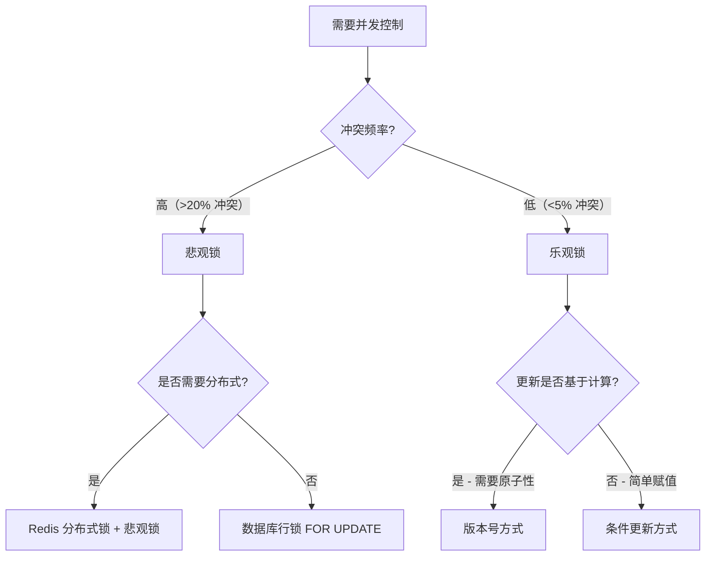
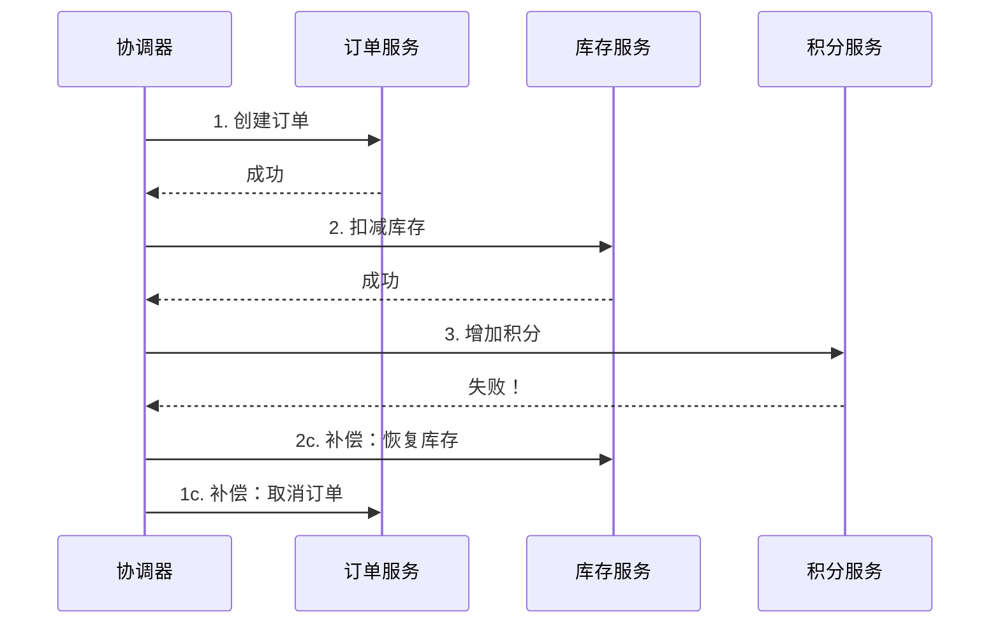

# 核心技巧

事务与并发控制是后端系统稳定性的基石。本章从实战角度出发，系统梳理事务管理、死锁排查、锁策略选择、分布式事务等核心技巧，每个技巧都配以真实场景、可运行代码和踩坑经验。

---

## 技巧一：事务最佳实践

### 1.1 为什么事务管理容易出错

事务看似简单——加个 `@Transactional` 就完事了——但它恰恰是生产事故的高频源头。常见问题包括：

- 事务边界过长导致锁持有时间过久，拖垮数据库连接池
- 异常被吞掉导致事务不回滚，数据处于脏状态
- 跨方法调用时事务注解失效（Spring AOP 代理机制导致）
- 嵌套事务的传播行为不符合预期

### 1.2 事务边界的黄金法则：短而快

事务的持有时间直接决定了系统的并发能力。每多持有一个数据库连接 1 秒，就意味着连接池中少一个可用连接 1 秒。

**反面案例：在事务中做 RPC 调用**

```java
@Transactional
public void processOrder(OrderDTO dto) {
    // 1. 写数据库（很快）
    orderDao.insert(dto);
    
    // 2. 调用外部支付接口（可能耗时 3-10 秒）
    paymentClient.charge(dto.getAmount());  // ← 事务在这里被挂起
    
    // 3. 更新状态（很快）
    orderDao.updateStatus(dto.getId(), "PAID");
}
// 外部服务超时 → 数据库连接被占用 3-10 秒
// 并发 200 个请求 → 连接池耗尽 → 整个服务雪崩
```

**正确做法：将外部调用移到事务外**

```java
public void processOrder(OrderDTO dto) {
    // 事务内：只做数据库操作
    orderDao.insert(dto);
    
    // 事务外：调用外部服务
    try {
        paymentClient.charge(dto.getAmount());
        // 事务外：更新状态
        updateOrderStatus(dto.getId(), "PAID");
    } catch (PaymentException e) {
        updateOrderStatus(dto.getId(), "PAYMENT_FAILED");
    }
}

@Transactional(propagation = Propagation.REQUIRES_NEW)
public void updateOrderStatus(Long orderId, String status) {
    orderDao.updateStatus(orderId, status);
}
```

### 1.3 异常处理的陷阱

Spring 的 `@Transactional` 默认只在遇到 `RuntimeException` 和 `Error` 时回滚，遇到受检异常（checked exception）时**不会回滚**。

```java
// 危险：IOException 是受检异常，事务不会回滚！
@Transactional
public void importData(InputStream input) throws IOException {
    dataDao.batchInsert(parse(input));  // 前半部分已提交
    throw new IOException("格式错误");   // 不会回滚！
    // 结果：部分数据已入库，部分没入，数据不一致
}
```

**解决方案：显式指定回滚异常**

```java
@Transactional(rollbackFor = Exception.class)
public void importData(InputStream input) throws IOException {
    // 现在所有异常都会触发回滚
}
```

> **经验法则：** 项目中统一加 `rollbackFor = Exception.class`，避免团队成员踩坑。

### 1.4 事务传播行为速查

| 传播行为 | 行为描述 | 典型场景 |
|---------|---------|---------|
| `REQUIRED`（默认） | 有事务就加入，没有就新建 | 绝大多数业务方法 |
| `REQUIRES_NEW` | 总是新建事务，挂起当前事务 | 日志记录、审计操作 |
| `NESTED` | 有事务就创建嵌套事务（savepoint） | 部分失败不影响整体 |
| `SUPPORTS` | 有事务就加入，没有就非事务执行 | 只读查询 |
| `NOT_SUPPORTED` | 非事务执行，挂起当前事务 | 大批量数据处理 |

**`REQUIRES_NEW` 的实战应用：操作日志**

```java
@Service
public class OrderService {
    
    @Autowired
    private AuditLogDao auditLogDao;
    
    public void cancelOrder(Long orderId) {
        // 主事务：更新订单
        doCancelOrder(orderId);
        
        // 审计日志用独立事务，即使主事务回滚，日志仍保留
        auditLogDao.log("ORDER_CANCELLED", orderId);
    }
    
    @Transactional
    public void doCancelOrder(Long orderId) {
        orderDao.updateStatus(orderId, "CANCELLED");
        // 如果这里抛异常，订单回滚，但审计日志不会回滚
    }
}
```

---

## 技巧二：死锁排查与预防

### 2.1 死锁的本质

死锁是两个或多个事务互相等待对方释放锁，导致所有事务都无法继续执行。MySQL InnoDB 中最常见的场景：

事务 A：锁定行 1 → 尝试锁定行 2
事务 B：锁定行 2 → 尝试锁定行 1
→ 互相等待 → 死锁

### 2.2 MySQL 死锁诊断全流程

**第一步：查看最近一次死锁信息**

```sql
SHOW ENGINE INNODB STATUS\G
```

重点看 `LATEST DETECTED DEADLOCK` 部分，包含：
- 两个事务分别持有和等待哪些锁
- 涉及的 SQL 语句
- 回滚了哪个事务

**第二步：查看当前锁等待关系**

```sql
-- MySQL 8.0+（performance_schema）
SELECT 
    r.trx_id AS waiting_trx_id,
    r.trx_mysql_thread_id AS waiting_thread,
    r.trx_query AS waiting_query,
    b.trx_id AS blocking_trx_id,
    b.trx_mysql_thread_id AS blocking_thread,
    b.trx_query AS blocking_query
FROM performance_schema.data_lock_waits w
JOIN information_schema.innodb_trx r ON r.trx_id = w.REQUESTING_ENGINE_TRANSACTION_ID
JOIN information_schema.innodb_trx b ON b.trx_id = w.BLOCKING_ENGINE_TRANSACTION_ID;
```

**第三步：分析锁的粒度**

```sql
-- 查看当前持有的锁
SELECT * FROM performance_schema.data_locks;
```

关注 `LOCK_TYPE`（RECORD 是行锁，TABLE 是表锁）和 `LOCK_MODE`（X 是排他锁，S 是共享锁）。

### 2.3 典型死锁场景与解决方案

**场景一：顺序不一致导致死锁**

```sql
-- 事务 A
UPDATE accounts SET balance = balance - 100 WHERE id = 1;
UPDATE accounts SET balance = balance + 100 WHERE id = 2;

-- 事务 B（同时执行）
UPDATE accounts SET balance = balance - 50 WHERE id = 2;
UPDATE accounts SET balance = balance + 50 WHERE id = 1;
```

**解决：统一按 id 从小到大的顺序操作**

```java
// 所有转账操作都按 id 升序排列
public void transfer(Long fromId, Long toId, BigDecimal amount) {
    Long first = Math.min(fromId, toId);
    Long second = Math.max(fromId, toId);
    
    accountDao.debit(fromId, amount);
    accountDao.credit(toId, amount);
}
```

**场景二：索引缺失导致锁升级**

```sql
-- 没有索引的列：InnoDB 会锁整张表！
UPDATE orders SET status = 'shipped' WHERE customer_id = 123;
-- customer_id 没有索引 → 退化为全表扫描 → 锁住所有行 → 死锁概率极高
```

**解决：确保 WHERE 条件的列有合适的索引**

```sql
CREATE INDEX idx_orders_customer_id ON orders(customer_id);
```

**场景三：间隙锁（Gap Lock）导致的隐式死锁**

```sql
-- 事务 A
INSERT INTO orders (id, amount) VALUES (10, 100);  -- 插入 id=10
-- 事务 B
INSERT INTO orders (id, amount) VALUES (10, 200);  -- 插入 id=10，冲突
-- 间隙锁互相等待 → 死锁
```

**解决：使用 `INSERT ... ON DUPLICATE KEY` 或在应用层做幂等校验**

```java
try {
    orderDao.insert(order);
} catch (DuplicateKeyException e) {
    // 订单已存在，幂等处理
    log.info("订单已存在，跳过: {}", order.getId());
}
```

### 2.4 死锁预防清单

| 预防措施 | 实施方法 | 优先级 |
|---------|---------|-------|
| 统一加锁顺序 | 按主键或固定顺序访问资源 | 高 |
| 缩小事务范围 | 只在事务中做必要的数据库操作 | 高 |
| 使用合适的索引 | 避免全表扫描导致的锁升级 | 高 |
| 设置锁等待超时 | `innodb_lock_wait_timeout` 默认 50 秒 | 中 |
| 开启死锁日志 | `innodb_print_all_deadlocks = ON` | 中 |
| 使用乐观锁替代 | 读多写少场景避免悲观锁 | 低 |

---

## 技巧三：乐观锁与悲观锁的选型与实现

### 3.1 核心概念对比

| 维度 | 悲观锁 | 乐观锁 |
|-----|-------|-------|
| 思想 | "我操作时别人一定也在改" | "别人可能改了，但我先试试" |
| 实现 | `SELECT ... FOR UPDATE` | 版本号 / CAS / 条件更新 |
| 适用场景 | 写多读少、冲突频繁 | 读多写少、冲突稀少 |
| 性能 | 阻塞等待，吞吐量低 | 无阻塞，失败时重试 |
| 数据一致性 | 强一致 | 最终一致（可能丢更新） |

### 3.2 乐观锁的三种实现方式

**方式一：版本号（最推荐）**

```sql
-- 表结构
ALTER TABLE products ADD COLUMN version INT DEFAULT 0;

-- 读取时带版本号
SELECT id, name, price, version FROM products WHERE id = 1;
-- 假设返回 version = 3

-- 更新时校验版本号
UPDATE products 
SET name = '新名称', price = 99.9, version = version + 1 
WHERE id = 1 AND version = 3;
-- 影响行数 = 0 → 说明被别人改过，需要重试
```

```java
@Service
public class ProductService {
    
    public boolean updateProduct(Long id, String newName) {
        int maxRetries = 3;
        for (int i = 0; i < maxRetries; i++) {
            Product product = productDao.selectById(id);
            int oldVersion = product.getVersion();
            
            int affected = productDao.updateWithVersion(id, newName, oldVersion);
            if (affected > 0) {
                return true;  // 更新成功
            }
            // 版本冲突，重试
            log.warn("版本冲突，第 {} 次重试", i + 1);
        }
        throw new OptimisticLockException("更新失败，请刷新后重试");
    }
}
```

**方式二：条件更新（简单场景）**

```sql
-- 不加版本号，直接用业务字段做条件
UPDATE accounts 
SET balance = balance - 100 
WHERE id = 1 AND balance >= 100;
-- 影响行数 = 0 → 余额不足或已被修改
```

**方式三：CAS（Compare-And-Swap）**

```java
// 利用数据库的原子操作特性
public boolean deductStock(Long productId, int quantity) {
    int affected = jdbcTemplate.update(
        "UPDATE products SET stock = stock - ? WHERE id = ? AND stock >= ?",
        quantity, productId, quantity
    );
    return affected > 0;
}
```

### 3.3 悲观锁的正确使用

```java
@Transactional
public void reserveSeat(Long flightId, Long seatId) {
    // 加排他锁，其他事务读取同一行会阻塞
    Flight flight = flightDao.selectForUpdate(flightId);
    
    if (flight.getAvailableSeats() <= 0) {
        throw new BusinessException("航班已满");
    }
    
    flightDao.decrementSeats(flightId);
    seatDao.reserve(seatId);
}
```

**注意：`SELECT ... FOR UPDATE` 必须在事务内才有效。** 如果在事务外执行，锁会在语句执行完后立即释放。

### 3.4 选型决策树



---

## 技巧四：分布式事务的轻量级方案

### 4.1 分布式事务的困境

单体应用中，一个数据库事务就能保证 ACID。但在微服务架构中，一个业务流程可能涉及多个服务和数据库：

下单流程：
订单服务 → 创建订单（数据库 A）
库存服务 → 扣减库存（数据库 B）
积分服务 → 增加积分（数据库 C）

传统的 2PC（两阶段提交）虽然能保证强一致，但性能差、可用性低，生产中很少直接使用。

### 4.2 Saga 模式：用补偿代替回滚

Saga 的核心思想：将一个长事务拆成一系列本地事务，每个本地事务都有对应的补偿操作。如果某个步骤失败，依次执行之前步骤的补偿操作。



**Saga 的两种实现方式：**

| 方式 | 描述 | 优点 | 缺点 |
|-----|------|-----|------|
| 编排式（Orchestration） | 中央协调器指挥各服务 | 流程清晰，易调试 | 协调器成为单点 |
| 协同式（Choreography） | 各服务通过事件自行协调 | 去中心化，松耦合 | 流程分散，难追踪 |

### 4.3 本地消息表：可靠的消息驱动

本地消息表是保证最终一致性的经典模式，核心思想是把业务操作和消息发送放在同一个本地事务中。

```java
// 1. 业务操作 + 写消息表（同一事务）
@Transactional
public void createOrder(OrderDTO dto) {
    orderDao.insert(dto);
    messageDao.insert(new OutboxMessage(
        "ORDER_CREATED",
        dto.getId(),
        toJson(dto),
        "PENDING"
    ));
}

// 2. 后台任务轮询发送消息（事务外）
@Scheduled(fixedDelay = 5000)
public void sendPendingMessages() {
    List<OutboxMessage> messages = messageDao.findByStatus("PENDING");
    for (OutboxMessage msg : messages) {
        try {
            mqClient.send(msg.getTopic(), msg.getPayload());
            messageDao.updateStatus(msg.getId(), "SENT");
        } catch (Exception e) {
            log.error("消息发送失败: {}", msg.getId(), e);
            // 下次重试
        }
    }
}
```

**优势：** 即使消息队列宕机，消息也不会丢失（持久化在本地数据库中）。配合重试机制，可以保证消息最终被投递。

### 4.4 TCC 模式：Try-Confirm-Cancel

TCC 是一种两阶段提交的变体，在业务层面实现分布式事务：

```java
// Try：预留资源
@Transactional
public boolean tryDeductStock(Long productId, int quantity) {
    // 冻结库存（不真正扣减）
    int affected = stockDao.freeze(productId, quantity);
    return affected > 0;
}

// Confirm：确认提交
@Transactional
public void confirmDeductStock(Long productId, int quantity) {
    stockDao.deductFrozen(productId, quantity);
}

// Cancel：释放预留
@Transactional
public void cancelDeductStock(Long productId, int quantity) {
    stockDao.unfreeze(productId, quantity);
}
```

**TCC 的关键约束：** 每个服务必须实现三个接口，业务侵入性较高。适合对一致性要求高且资源可预留的场景（如金融转账、库存锁定）。

---

## 技巧五：高并发下的限流与降级

### 5.1 为什么需要限流

没有限流的系统就像没有红绿灯的十字路口——正常时没问题，一旦流量激增就会混乱。限流的目的不是阻止用户，而是保护系统不被压垮。

### 5.2 四种经典限流算法

| 算法 | 原理 | 优点 | 缺点 | 适用场景 |
|-----|------|-----|------|---------|
| 固定窗口 | 固定时间段内计数 | 实现简单 | 窗口边界突发问题 | 简单场景 |
| 滑动窗口 | 时间窗口随请求滑动 | 平滑，无边界问题 | 内存占用较高 | API 网关 |
| 令牌桶 | 固定速率生成令牌 | 允许突发流量 | 参数调优较复杂 | 微服务限流 |
| 漏桶 | 固定速率处理请求 | 输出速率恒定 | 不允许突发 | 消息消费 |

**令牌桶的 Redis 实现：**

```java
public class TokenBucketLimiter {
    private final StringRedisTemplate redis;
    
    private static final String LUA_SCRIPT = """
        local key = KEYS[1]
        local capacity = tonumber(ARGV[1])   -- 桶容量
        local rate = tonumber(ARGV[2])        -- 令牌生成速率（个/秒）
        local now = tonumber(ARGV[3])         -- 当前时间戳（毫秒）
        local requested = tonumber(ARGV[4])   -- 请求的令牌数
        
        local bucket = redis.call('hmget', key, 'tokens', 'last_refill')
        local tokens = tonumber(bucket[1]) or capacity
        local last_refill = tonumber(bucket[2]) or now
        
        -- 补充令牌
        local elapsed = now - last_refill
        local refill = math.floor(elapsed * rate / 1000)
        tokens = math.min(capacity, tokens + refill)
        
        if tokens >= requested then
            tokens = tokens - requested
            redis.call('hmset', key, 'tokens', tokens, 'last_refill', now)
            redis.call('expire', key, math.ceil(capacity / rate) * 2)
            return 1  -- 允许
        else
            redis.call('hmset', key, 'tokens', tokens, 'last_refill', now)
            return 0  -- 拒绝
        end
        """;
    
    public boolean tryAcquire(String key, int tokens) {
        Long result = redis.execute(
            new DefaultRedisScript<>(lua_SCRIPT, Long.class),
            List.of("bucket:" + key),
            "100", "10", String.valueOf(System.currentTimeMillis()), String.valueOf(tokens)
        );
        return result != null &amp;&amp; result == 1L;
    }
}
```

### 5.3 服务降级策略

当下游服务不可用时，系统应该有优雅的降级方案：

```java
@Service
public class ProductPriceService {
    
    @Autowired
    private PriceDao priceDao;        // 数据库价格（兜底）
    @Autowired
    private PriceCache priceCache;    // Redis 缓存价格
    
    @CircuitBreaker(name = "price-service", fallbackMethod = "fallbackPrice")
    public BigDecimal getPrice(Long productId) {
        return priceClient.getPrice(productId);  // 远程调用
    }
    
    // 降级：从缓存获取
    public BigDecimal fallbackPrice(Long productId, Exception e) {
        log.warn("价格服务降级，使用缓存价格: {}", e.getMessage());
        BigDecimal cached = priceCache.get(productId);
        if (cached != null) {
            return cached;
        }
        // 最终兜底：从数据库获取
        return priceDao.getPrice(productId);
    }
}
```

**降级的优先级链：**

1. **远程服务** → 正常路径
2. **缓存数据** → 第一级降级
3. **数据库快照** → 第二级降级
4. **默认值 / 历史数据** → 最终兜底

---

## 技巧六：连接池调优

### 6.1 连接池为什么重要

数据库连接是昂贵资源——每次创建 TCP 连接需要三次握手，建立 SSL 连接需要密钥交换。连接池通过复用连接来避免这些开销。但连接池配置不当，会成为系统瓶颈。

### 6.2 关键参数调优

| 参数 | 含义 | 调优建议 |
|-----|------|---------|
| `maximumPoolSize` | 最大连接数 | 通常 CPU 核心数 × 2 + 磁盘数 |
| `minimumIdle` | 最小空闲连接 | 设为与 maximumPoolSize 相同 |
| `connectionTimeout` | 获取连接超时 | 3-10 秒，过长会排队阻塞 |
| `idleTimeout` | 空闲连接存活时间 | 10-30 分钟 |
| `maxLifetime` | 连接最大生命周期 | 小于数据库 `wait_timeout`，通常 30 分钟 |
| `leakDetectionThreshold` | 连接泄漏检测 | 设为 30 秒，帮助发现未关闭的连接 |

**HikariCP 推荐配置（中等规模应用）：**

```yaml
spring:
  datasource:
    hikari:
      maximum-pool-size: 20
      minimum-idle: 20
      connection-timeout: 5000
      idle-timeout: 600000
      max-lifetime: 1800000
      leak-detection-threshold: 30000
```

### 6.3 连接泄漏的排查

连接泄漏是指获取了数据库连接但未归还到池中。典型原因：

```java
// 泄漏：手动获取连接后没有在 finally 中关闭
Connection conn = dataSource.getConnection();
PreparedStatement ps = conn.prepareStatement("...");
// 如果这里抛异常，连接永远不会被归还！
```

**排查步骤：**

1. 开启泄漏检测：设置 `leakDetectionThreshold = 30000`
2. 观察日志中的 `Connection leak detection triggered` 警告
3. 根据堆栈定位泄漏代码位置
4. 确保所有连接在 `try-with-resources` 或 `finally` 块中关闭

```java
// 正确写法：try-with-resources 自动关闭
try (Connection conn = dataSource.getConnection();
     PreparedStatement ps = conn.prepareStatement(sql)) {
    ps.setLong(1, id);
    ResultSet rs = ps.executeQuery();
    // 处理结果
}
// 无论成功还是异常，连接都会被归还
```

---

## 技巧七：数据库事务的性能监控

### 7.1 关键监控指标

| 指标 | 含义 | 告警阈值 |
|-----|------|---------|
| 活跃事务数 | 正在执行的事务数量 | > 连接池大小的 80% |
| 事务平均耗时 | 事务从开始到提交的平均时间 | > 500ms |
| 锁等待时间 | 事务等待获取锁的平均时间 | > 100ms |
| 死锁次数 | 单位时间内的死锁次数 | > 0 次/小时 |
| 连接池使用率 | 当前连接数 / 最大连接数 | > 80% |
| 慢查询数量 | 执行时间 > 1s 的查询 | 持续增长 |

### 7.2 实用监控 SQL

```sql
-- 实时查看事务状态
SELECT 
    trx_state,
    trx_started,
    TIMESTAMPDIFF(SECOND, trx_started, NOW()) AS duration_sec,
    trx_rows_locked,
    trx_rows_modified,
    trx_query
FROM information_schema.innodb_trx
ORDER BY trx_started ASC;

-- 查看锁等待链
SELECT * FROM sys.innodb_lock_waits;

-- 查看慢查询统计
SELECT * FROM sys.statements_with_runtimes_in_95th_percentile LIMIT 10;
```

---

## 常见误区总结

| 误区 | 正确做法 |
|-----|---------|
| `@Transactional` 加在 private 方法上 | 必须加在 public 方法上，Spring AOP 代理无法拦截 private 方法 |
| 事务中做 RPC / HTTP 调用 | 外部调用移到事务外，或使用事务传播隔离 |
| 批量操作不在事务中 | 批量插入 10000 条记录没有事务，失败后部分已提交 |
| 忽略事务超时设置 | 设置合理的 `@Transactional(timeout = 30)`，防止长事务 |
| 滥用 `@Transactional(readOnly = true)` | 只读事务在 MySQL 中可利用 MVCC 优化，但不要加在写方法上 |
| 乐观锁不处理重试 | 必须有重试机制，否则冲突后直接报错影响用户体验 |
| 分布式锁用完不释放 | 必须设置过期时间 + finally 释放，防止死锁 |
| 连接池 `maxPoolSize` 设得越大越好 | 过大的连接池反而降低性能（上下文切换开销），通常 10-30 足够 |

---

## 本章小结

事务与并发控制的核心技巧可以归纳为三个原则：

1. **最小化原则**：事务尽可能短，锁尽可能小，连接尽可能快释放
2. **防御性原则**：假设任何并发都可能发生，用版本号、重试、超时来防御
3. **可观测原则**：监控事务耗时、锁等待、连接使用率，问题要能被发现

掌握这些技巧，就能在大多数场景下写出既正确又高效的并发代码。对于极端的分布式一致性需求，则需要根据业务容忍度选择合适的分布式事务方案（Saga、TCC、本地消息表），在一致性和性能之间找到平衡点。
