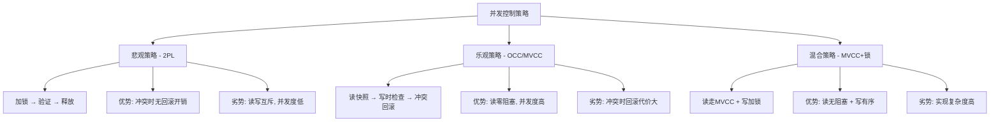

## 1. MVCC概述与动机

### 1.1 什么是MVCC

MVCC（Multi-Version Concurrency Control，多版本并发控制）是一种数据库并发控制机制，其核心思想是：**为每行数据维护多个版本，读操作和写操作可以同时进行而互不阻塞**。

传统加锁方案中，读写互斥——一个事务在写某行时，其他事务必须等待该行上的共享锁释放。在高并发OLTP场景下，这种互斥会导致严重的性能瓶颈。MVCC通过版本化数据消除了这种互斥，使得读操作永远不会被写操作阻塞，写操作也不会被读操作阻塞。

### 1.2 为什么需要MVCC

考虑一个简单的场景：电商订单表上每秒有5000次更新（库存变更、状态流转），同时有20000次读取（用户查询订单状态）。

**加锁方案的困境：**

| 问题 | 表现 | 影响 |
|------|------|------|
| 读写互斥 | 读操作需要获取共享锁，被写事务的排他锁阻塞 | 读延迟飙升 |
| 锁等待链 | 事务A等事务B释放锁，事务B等事务C | 死锁风险、级联阻塞 |
| 锁开销 | 每个操作都要维护锁表项、检测冲突 | CPU和内存消耗大 |
| 可重复读困难 | 需要在整个事务期间持有锁 | 并发度极低 |

**MVCC的解决方案：**

- 读操作读取数据的某个历史版本（快照），不需要加任何锁
- 写操作创建新版本，不覆盖旧版本，不需要等读操作完成
- 读写之间零冲突，吞吐量大幅提升

PostgreSQL官方文档指出，在典型OLTP负载下，MVCC相比纯加锁方案可将并发吞吐量提升5-10倍。

### 1.3 历史演进

MVCC并非现代产物。其理论根基可以追溯到1970年代数据库学术研究：

- **1978年**：David Reed在MIT博士论文中首次提出多版本并发控制的概念
- **1981年**：Bernstein等人在《Concurrency Control and Recovery in Database Systems》中系统化了MVCC理论
- **1995年**：Oracle 7引入了基于回滚段（Rollback Segment）的MVCC实现，成为首个大规模商用MVCC数据库
- **1996年**：PostgreSQL 6.0引入了基于元组版本链（Tuple Versioning）的MVCC
- **2001年**：MySQL InnoDB开始支持MVCC，配合其聚簇索引架构
- **2010年代**：分布式数据库（CockroachDB、TiDB、YugabyteDB）将MVCC扩展到分布式场景
- **2020年代**：云原生数据库（Aurora、PolarDB）在存储层实现MVCC，进一步分离计算与存储

## 2. 核心原理

### 2.1 版本化存储模型

MVCC的核心是**每行数据的多版本存储**。当一行数据被修改时，系统不是直接覆盖旧值，而是创建一个新版本，旧版本保留在某个位置供读操作使用。

版本的物理存储有两种主流实现：

**方案一：Undo Log（回滚日志）方式**

InnoDB采用此方案。原始数据行本身只保留最新版本，历史版本存储在系统表空间的Undo Log中。

数据行（当前版本）
┌──────┬──────┬──────┬──────────────┐
│ id=1 │ name │ age  │ trx_id=1003  │  ← 最新版本
│      │Bob   │ 25   │ roll_ptr ──┐ │
└──────┴──────┴──────┴──────────┘ │
                                    │
Undo Log（历史版本链）               │
┌──────────────────────────┐       │
│ trx_id=1002, name=Bob24 │ ◄─────┘
│ roll_ptr ──────────────► ┐
└──────────────────────────┘ │
                              │
┌──────────────────────────┐ │
│ trx_id=1001, name=Bob23 │ ◄─┘
│ roll_ptr = NULL          │  ← 链尾
└──────────────────────────┘

**方案二：元组版本链方式**

PostgreSQL采用此方式。每个版本都作为独立的元组（tuple）存储在同一表的物理页面中，通过t_ctid指针链接。

页面中的元组版本链：

元组A ( xmin=1001, xmax=1002)     元组B ( xmin=1002, xmax=1003)
┌──────┬──────┬──────┐           ┌──────┬──────┬──────┐
│ id=1 │Bob23 │ 23   │ ──ctid──► │ id=1 │Bob24 │ 24   │
└──────┴──────┴──────┘           └──────┴──────┴──────┘
                                                    │
                                                    ▼
                                   元组C ( xmin=1003, xmax=0)
                                   ┌──────┬──────┬──────┐
                                   │ id=1 │Bob25 │ 25   │
                                   └──────┴──────┴──────┘

两种方案的关键区别：

| 特性 | Undo Log方式（InnoDB） | 元组版本链方式（PostgreSQL） |
|------|----------------------|--------------------------|
| 版本存储位置 | 独立的Undo Log段 | 与数据在同一表空间 |
| 写放大 | 较低（只记录变更字段） | 较高（复制整行） |
| 读放大 | 需要沿链回溯查找版本 | 需要沿链回溯，但可在同一页内完成 |
| 空间回收 | 由Undo清理线程回收 | 由VACUUM进程清理 |
| 索引影响 | 索引指向最新版本，无碎片 | 旧版本导致索引膨胀 |

### 2.2 事务快照与可见性规则

MVCC的精髓在于**事务快照（Snapshot）**机制。每个事务在开始时获取一个一致性快照，此后所有读操作都基于这个快照进行，不受其他并发事务的影响。

**快照的定义要素：**

1. **活跃事务列表（Active Transaction List）**：快照时刻仍在执行的事务ID集合
2. **最小活跃事务ID（olxid）**：快照时刻最小的活跃事务ID
3. **下一个事务ID（next_tid）**：快照时刻下一个将要分配的事务ID

**可见性判断规则：**

对于版本链上的每个版本（由事务tid创建），当前事务判断其是否可见：

函数 IsVisible(version, current_snapshot):
    创建者事务ID = version.trx_id

    if 创建者事务ID == current_snapshot.my_tid:
        // 自己创建的版本——可见（如果是当前事务修改的）
        return VISIBLE

    if 创建者事务ID < current_snapshot.olxid:
        // 创建者事务在快照前已提交
        if 创建者事务已提交:
            return VISIBLE
        else:
            // 创建者事务已回滚，版本不可见
            return INVISIBLE

    if 创建者事务ID in current_snapshot.active_list:
        // 创建者事务在快照时仍活跃
        return INVISIBLE

    if 创建者事务ID >= current_snapshot.next_tid:
        // 创建者事务在快照后才开始
        return INVISIBLE

    // 创建者事务在快照前开始但未在快照时活跃，说明已提交
    return VISIBLE

用更直观的方式表达：

                    事务ID空间
    ├──────────────────────────────────────►
    
    已提交的  │  快照时活跃的  │  快照后开始的
    事务      │  事务          │  事务
    (可见)    │  (不可见)      │  (不可见)
    
    ◄─ olxid ─┼──── active_list ────┼─ next_tid ─►

### 2.3 快照隔离级别

基于MVCC可以实现多种隔离级别，最常用的是**快照隔离（Snapshot Isolation, SI）**：

**RC（Read Committed，读已提交）：**

- 每条SQL语句执行前获取新快照
- 只能看到其他已提交事务的修改
- 同一事务内不同语句可能看到不同数据
- 实现：InnoDB的默认隔离级别

```sql
-- 会话1
BEGIN;
UPDATE accounts SET balance = 100 WHERE id = 1;
-- 不提交，不回滚

-- 会话2（RC隔离级别）
BEGIN;
SELECT balance FROM accounts WHERE id = 1;  -- 看到旧值（例如200）
-- 等待...

-- 会话1
COMMIT;

-- 会话2（继续）
SELECT balance FROM accounts WHERE id = 1;  -- 看到新值100
COMMIT;
```

**RR（Repeatable Read，可重复读）：**

- 整个事务生命周期内使用同一个快照
- 可以重复读取同一行，结果一致
- InnoDB的默认事务隔离级别（通过`tx_isolation`配置）
- 实现：事务开始时获取快照，后续所有读操作复用该快照

```sql
-- 会话1
BEGIN;
SELECT balance FROM accounts WHERE id = 1;  -- 看到200

-- 会话2
UPDATE accounts SET balance = 100 WHERE id = 1;
COMMIT;

-- 会话1（继续）
SELECT balance FROM accounts WHERE id = 1;  -- 仍然看到200（快照不变）
COMMIT;
```

**SI的写冲突问题——Write Skew：**

快照隔离消除了脏读、不可重复读和大部分幻读，但引入了一个特殊异常——**写偏序（Write Skew）**：

```sql
-- 场景：医生值班表，规则是至少一名医生在线
-- 表结构：doctors(id, name, on_call)

-- 会话1（Dr. Smith的换班请求）
BEGIN;
SELECT count(*) FROM doctors WHERE on_call = true;  -- 结果=2
-- 有2人在线，Dr. Smith可以下线

-- 会话2（Dr. Jones的换班请求）
BEGIN;
SELECT count(*) FROM doctors WHERE on_call = true;  -- 结果=2
-- 有2人在线，Dr. Jones也可以下线

-- 会话1
UPDATE doctors SET on_call = false WHERE name = 'Smith';
COMMIT;

-- 会话2
UPDATE doctors SET on_call = false WHERE name = 'Jones';
COMMIT;

-- 结果：0人在线！违反业务规则
-- 两个事务都基于相同的快照（2人在线），都判断可以安全修改
-- 但合并后结果不正确
```

解决写偏序需要**串行化快照隔离（SSI, Serializable Snapshot Isolation）**，PostgreSQL 9.1+的SERIALIZABLE级别即基于此实现。SSI通过检测读写依赖的"危险结构"来识别潜在的写偏序。

### 2.4 版本链的遍历与性能

读操作需要沿版本链回溯，找到对当前事务可见的版本。这个过程直接影响查询性能。

**影响版本链长度的因素：**

1. **长事务**：一个长时间运行的事务阻止旧版本被清理，版本链持续增长
2. **高更新频率**：频繁更新同一行导致版本链快速膨胀
3. **频繁的批量更新**：一次更新大量行，每个受影响的行都产生新版本

**版本链遍历的性能特征：**

- 最好情况：最新版本即可见，O(1)时间
- 最坏情况：需要遍历整个版本链到链尾，O(n)时间
- 平均情况：取决于事务活跃时间和更新频率

**InnoDB的优化——Change Buffer：**

对于非唯一二级索引的更新操作，InnoDB使用Change Buffer缓存变更，在索引页被读入Buffer Pool时再合并，减少随机IO。

## 3. 各主流数据库的MVCC实现

### 3.1 MySQL InnoDB

InnoDB的MVCC实现基于Undo Log和Read View：

**每行数据的隐藏列：**

| 隐藏列 | 大小 | 含义 |
|--------|------|------|
| DB_TRX_ID | 6字节 | 最后修改该行的事务ID |
| DB_ROLL_PTR | 7字节 | 回滚指针，指向Undo Log中上一个版本 |
| DB_ROW_ID | 6字节 | 自增行ID（无显式主键时使用） |

**Read View的结构：**

```c
// InnoDB Read View核心字段（简化表示）
struct ReadView {
    trx_id_t low_limit_id;   // 高水位：下一个将要分配的事务ID
    trx_id_t up_limit_id;    // 低水位：最小的活跃事务ID（活跃列表中最小值）
    trx_id_t *m_ids;          // 创建Read View时的活跃事务ID列表
    ulint    n_ids;           // 活跃事务ID列表的长度
    trx_id_t creator_trx_id;  // 创建该Read View的事务ID
};
```

**可见性判断伪代码：**

```python
def check_visibility(version_trx_id, read_view):
    # 版本的创建者就是当前事务
    if version_trx_id == read_view.creator_trx_id:
        return VISIBLE
    
    # 版本创建者在Read View创建时已提交
    if version_trx_id < read_view.up_limit_id:
        return VISIBLE
    
    # 版本创建者在Read View创建时仍在活跃列表中
    if version_trx_id in read_view.m_ids:
        return INVISIBLE
    
    # 版本创建者在Read View创建之后才开始
    if version_trx_id >= read_view.low_limit_id:
        return INVISIBLE
    
    # 版本创建者在Read View创建时已提交（不在活跃列表，且小于low_limit_id）
    return VISIBLE
```

**Read View获取时机的差异：**

| 隔离级别 | Read View获取时机 | 特点 |
|----------|------------------|------|
| READ COMMITTED | 每条SELECT语句执行前 | 每次看到最新的已提交数据 |
| REPEATABLE READ | 事务中第一条SELECT语句执行前 | 整个事务看到一致的快照 |

### 3.2 PostgreSQL

PostgreSQL使用元组级别的xmin/xmax实现MVCC：

**每个元组的系统列：**

| 列名 | 含义 |
|------|------|
| xmin | 插入（创建）该元组的事务ID |
| xmax | 删除（或锁定更新）该元组的事务ID，0表示未删除 |
| ctid | 该元组的物理位置（page, offset），指向更新后的版本 |

**PostgreSQL的可见性判断：**

```sql
-- PostgreSQL判断元组可见性的核心逻辑（简化）

-- 元组对当前事务可见的条件：
-- 1. xmin已提交 且 xmin < xact_snapshot中的活跃事务最小值
--    或者 xmin是当前事务自己
-- 2. xmax为0 或 xmax未提交 或 xmax > xact_snapshot中的最大活跃事务值

-- 版本检查示例（伪SQL）
SELECT * FROM pg_class WHERE xmin = ... AND xmax = ...;
```

**PostgreSQL的VACUUM机制：**

PostgreSQL不会原地更新（no in-place update），旧版本留在表中直到被VACUUM清理。这导致两个关键问题：

1. **表膨胀（Table Bloat）**：大量旧版本堆积，表物理大小远超实际数据量
2. **事务ID回卷（Transaction ID Wraparound）**：事务ID是32位无符号整数，约42亿后回卷，必须在回卷前冻结旧元组的xmin

```sql
-- 查看表膨胀情况
SELECT 
    current_database(), schemaname, tablename,
    pg_size_pretty(pg_total_relation_size(schemaname || '.' || tablename)) AS total_size,
    n_dead_tup,
    n_live_tup,
    round(n_dead_tup::numeric / NULLIF(n_live_tup + n_dead_tup, 0) * 100, 1) AS dead_ratio_pct
FROM pg_stat_user_tables
WHERE n_dead_tup > 10000
ORDER BY n_dead_tup DESC;

-- VACUUM的两种模式
VACUUM orders;           -- 普通VACUUM：标记空间可复用，不锁表
VACUUM FULL orders;      -- 完全VACUUM：重写表，释放空间，但需要排他锁
```

**Autovacuum配置要点：**

```sql
-- 查看当前Autovacuum设置
SHOW autovacuum_vacuum_threshold;   -- 触发VACUUM的最小死元组数，默认50
SHOW autovacuum_vacuum_scale_factor; -- 触发VACUUM的死元组比例，默认0.2
SHOW autovacuum_naptime;            -- Autovacuum检查间隔，默认1分钟

-- 对高更新表调优
ALTER TABLE orders SET (
    autovacuum_vacuum_scale_factor = 0.01,  -- 1%死元组即触发
    autovacuum_analyze_scale_factor = 0.05  -- 5%变化即触发ANALYZE
);
```

### 3.3 Oracle

Oracle使用回滚段（Undo Segment）实现MVCC，其特点：

- 旧版本存储在回滚段中，不在数据文件的表段中
- 通过`ORA-01555: snapshot too old`错误提示回滚段空间不足
- 使用SCN（System Change Number）作为逻辑时间戳
- 支持闪回查询（Flashback Query），利用Undo数据重建历史状态

```sql
-- Oracle闪回查询示例
SELECT * FROM orders AS OF TIMESTAMP TO_TIMESTAMP('2025-01-01 10:00:00', 'YYYY-MM-DD HH24:MI:SS')
WHERE order_id = 1001;

-- 闪回表到某个时间点
FLASHBACK TABLE orders TO TIMESTAMP TO_TIMESTAMP('2025-01-01 10:00:00', 'YYYY-MM-DD HH24:MI:SS');
```

### 3.4 分布式数据库的MVCC

**CockroachDB：**

- 基于HLC（Hybrid Logical Clock，混合逻辑时钟）为每个事务分配时间戳
- MVCC数据存储在RocksDB/Pebble中，键格式为`/table/index/key/timestamp`
- 支持AS OF TIMESTAMP子句进行时间点查询
- GC（垃圾回收）基于配置的GC TTL清理过期版本

**TiDB：**

- 底层TiKV存储引擎采用MVCC，基于RocksDB
- 每个值附带事务开始时间戳和提交时间戳
- 使用GC机制清理旧版本，默认保留最近10分钟的版本
- 分布式事务使用Percolator模型（两阶段提交 + MVCC）

```sql
-- TiDB时间点查询
SELECT * FROM orders AS OF TIMESTAMP NOW() - INTERVAL 5 MINUTE
WHERE order_id = 1001;

-- TiDB GC配置
SHOW VARIABLES LIKE 'tidb_gc_life_time';  -- 默认10m0s
```

## 4. MVCC的性能调优

### 4.1 长事务的危害与治理

长事务是MVCC性能的最大杀手。一个运行1小时的事务会阻止所有在其开始之后产生的旧版本被清理。

**危害量化：**

- PostgreSQL：一个持续1小时的长事务可能导致数十GB的表膨胀
- InnoDB：长事务导致Undo Log膨胀，占用大量系统表空间
- 查询性能：版本链增长导致遍历时间线性增加

**检测长事务：**

```sql
-- MySQL InnoDB
SELECT 
    trx_id, trx_state, trx_started,
    TIMESTAMPDIFF(SECOND, trx_started, NOW()) AS duration_sec,
    trx_query, trx_rows_locked, trx_rows_modified
FROM information_schema.INNODB_TRX
WHERE TIMESTAMPDIFF(SECOND, trx_started, NOW()) > 60
ORDER BY trx_started;

-- PostgreSQL
SELECT 
    pid, usename, application_name, 
    state, query_start,
    NOW() - query_start AS duration,
    query
FROM pg_stat_activity
WHERE state != 'idle'
  AND NOW() - query_start > INTERVAL '60 seconds'
ORDER BY query_start;
```

**治理策略：**

1. **设置事务超时**：`SET SESSION statement_timeout = '30s'`（PostgreSQL）或`SET innodb_lock_wait_timeout = 10`（InnoDB）
2. **应用层强制超时**：所有数据库操作使用带超时的连接池
3. **代码审查**：禁止在事务中执行HTTP调用、文件IO等慢操作
4. **监控告警**：对超过阈值的活跃事务发出告警

### 4.2 版本链长度控制

**PostgreSQL——VACUUM调优：**

```sql
-- 对高更新表加速清理
ALTER TABLE high_update_table SET (
    autovacuum_vacuum_scale_factor = 0.01,
    autovacuum_vacuum_cost_limit = 1000,  -- 默认200，增大可加速清理
    autovacuum_vacuum_cost_delay = 2      -- 默认2ms，减小可加速清理
);

-- 手动紧急清理
VACUUM (VERBOSE, ANALYZE) high_update_table;
```

**InnoDB——Undo Log管理：**

```sql
-- 查看Undo Log使用情况
SELECT NAME, FILE_SIZE, ALLOCATED_SIZE 
FROM information_schema.INNODB_METRICS 
WHERE NAME LIKE '%undo%';

-- 配置Undo表空间（MySQL 8.0+）
ALTER UNDO TABLESPACE undo_ts SET INACTIVE;  -- 标记旧Undo表空间待清理
CREATE UNDO TABLESPACE new_undo ADD DATAFILE 'new_undo.ibu';  -- 创建新的
```

### 4.3 索引与MVCC的交互

MVCC对索引查询有特殊影响：

**InnoDB的聚簇索引：**

- 二级索引的叶子节点存储的是主键值，而非行数据指针
- 通过二级索引查找时，先在二级索引中找到主键，再回表到聚簇索引
- 回表时通过版本链找到可见版本
- 这意味着二级索引查询的代价包含：二级索引查找 + 聚簇索引回表 + 版本链遍历

**PostgreSQL的HOT（Heap Only Tuples）：**

- 当更新不涉及索引列且更新后的新版本仍在同一页面内时，HOT更新避免了索引修改
- 新版本通过t_ctid指针链接，索引仍指向旧版本的ctid，旧版本沿链找到新版本
- 减少了索引维护开销

```sql
-- 查看HOT更新比例
SELECT 
    schemaname, relname,
    n_tup_upd, n_tup_hot_upd,
    CASE WHEN n_tup_upd > 0 
         THEN round(n_tup_hot_upd::numeric / n_tup_upd * 100, 1)
         ELSE 0 END AS hot_update_pct
FROM pg_stat_user_tables
WHERE n_tup_upd > 1000
ORDER BY n_tup_upd DESC;
```

## 5. MVCC与其他并发控制机制的关系

### 5.1 MVCC与锁的协同

MVCC不是万能的，它需要与锁机制协同工作：

| 操作类型 | MVCC的角色 | 锁的角色 |
|----------|-----------|----------|
| 普通SELECT | 快照读，无需锁 | 不加锁 |
| SELECT ... FOR UPDATE | 快照读定位行，然后加锁 | 排他锁 |
| SELECT ... FOR SHARE | 快照读定位行，然后加锁 | 共享锁 |
| INSERT | 创建新版本 | 行级意向锁 |
| UPDATE | 创建新版本，旧版本入Undo | 行级排他锁 |
| DELETE | 标记xmax，旧版本入Undo | 行级排他锁 |

**关键区分——当前读与快照读：**

```sql
-- 快照读（Snapshot Read）：基于Read View，不加锁
SELECT * FROM orders WHERE id = 1;

-- 当前读（Current Read）：读最新已提交版本，加锁
SELECT * FROM orders WHERE id = 1 FOR UPDATE;        -- 排他锁
SELECT * FROM orders WHERE id = 1 FOR SHARE;         -- 共享锁
INSERT INTO orders VALUES (...);                       -- 意向排他锁
UPDATE orders SET status = 'done' WHERE id = 1;      -- 排他锁
DELETE FROM orders WHERE id = 1;                       -- 排他锁
```

### 5.2 MVCC与间隙锁（Gap Lock）

InnoDB在RR隔离级别下使用间隙锁防止幻读：

```sql
-- 表 orders 有 id = [1, 5, 10, 15]
-- 间隙锁示例

-- 会话1
BEGIN;
SELECT * FROM orders WHERE id = 7 FOR UPDATE;
-- 对 (5, 10) 这个间隙加间隙锁

-- 会话2
BEGIN;
INSERT INTO orders (id, ...) VALUES (8, ...);
-- 被间隙锁阻塞！即使 id=8 的行不存在

INSERT INTO orders (id, ...) VALUES (3, ...);
-- 不被阻塞，不在间隙锁范围内
```

间隙锁只在RR隔离级别下生效。RC隔离级别不使用间隙锁，这也是为什么InnoDB默认使用RR级别——它同时提供可重复读和间隙锁保护。

### 5.3 MVCC与2PL（两阶段锁）

MVCC和2PL是两种不同维度的并发控制机制，可以组合使用：

- **纯MVCC**：乐观并发控制（OCC），假设冲突很少，冲突时回滚
- **纯2PL**：悲观并发控制，预先加锁，阻塞冲突操作
- **MVCC + 2PL**（InnoDB模式）：读操作走MVCC快照，写操作加行级锁。这是大多数现代数据库的选择



## 6. 常见误区与最佳实践

### 6.1 误区澄清

**误区一：MVCC等于无锁**

事实：MVCC消除了读写之间的锁冲突，但写写冲突仍然需要锁。UPDATE操作仍然需要获取行级排他锁，两个事务同时更新同一行时仍然会阻塞。

**误区二：RR隔离级别完全防止幻读**

事实：MVCC下的RR通过快照避免了大部分幻读，但当前读（FOR UPDATE/FOR SHARE）可能看到新插入的行。InnoDB通过间隙锁（Gap Lock）进一步防止这类幻读，但这不是MVCC本身的功劳。

```sql
-- 幻读的微妙情况（RR隔离级别）
-- 会话1
BEGIN;
SELECT * FROM orders WHERE amount > 100 FOR UPDATE;  -- 5行

-- 会话2
INSERT INTO orders (amount) VALUES (200);  -- 插入新行
COMMIT;

-- 会话1
SELECT * FROM orders WHERE amount > 100 FOR UPDATE;  -- 仍然5行（间隙锁阻止了新插入）
SELECT * FROM orders WHERE amount > 100;              -- 可能看到6行（快照读，无间隙锁保护）
```

**误区三：MVCC版本链越长性能越差，所以版本链应该尽量短**

事实：版本链长度受事务活跃时间和更新频率影响，控制版本链长度的主要手段是治理长事务，而非限制更新频率。限制更新频率会影响业务，治理长事务是合理的运维手段。

### 6.2 最佳实践

1. **事务尽量短小**：遵循"事务中只做数据库操作"原则，禁止在事务中做网络调用、文件IO
2. **避免大事务**：批量操作拆分为小批次，每批单独提交
3. **监控活跃事务**：设置告警，超过阈值（如30秒）立即通知
4. **定期检查表膨胀**：PostgreSQL定期执行`VACUUM VERBOSE`检查死元组比例
5. **选择合适的隔离级别**：大多数场景RC足够，不要盲目使用Serializable
6. **理解当前读与快照读**：FOR UPDATE/FOR SHARE走当前读，普通SELECT走快照读，两者行为差异很大
7. **分布式场景注意GC TTL**：TiDB/CockroachDB的版本保留时间需要根据业务需求调整，太短会导致时间点查询失败，太长会导致存储膨胀

## 7. 总结

MVCC是现代数据库并发控制的基石。它通过多版本存储和快照读机制，实现了读写操作的零冲突，极大地提升了数据库在高并发场景下的吞吐量。

理解MVCC需要掌握三个核心概念：**版本化存储**（数据的多个版本如何物理存储）、**快照可见性**（事务如何判断哪个版本对自己可见）、**版本链清理**（如何回收不再需要的旧版本）。

各主流数据库的MVCC实现虽然在物理存储和版本管理上有差异，但核心思想一致：用空间换时间，用多版本消除读写互斥。掌握这些原理，才能在系统设计和性能调优中做出正确的决策。
