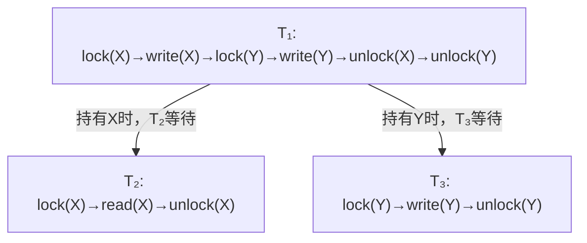
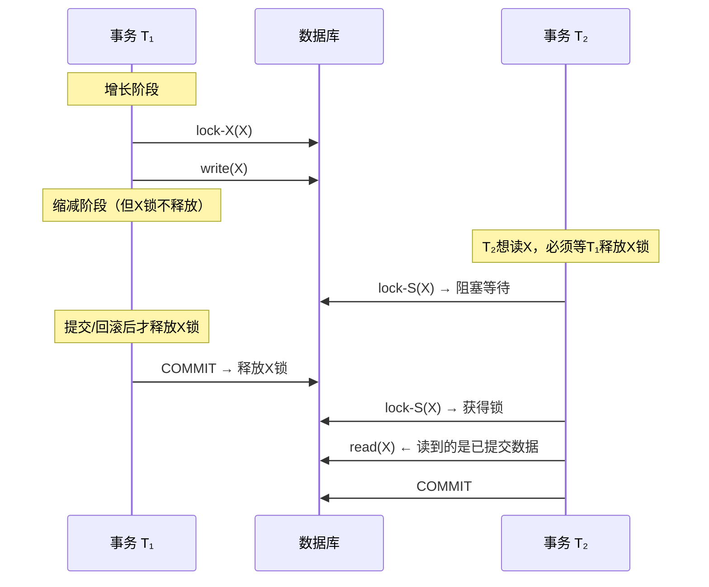
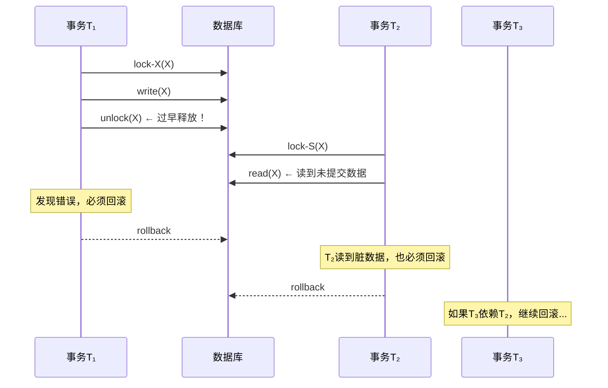

## 概述与定位

两阶段锁协议（Two-Phase Locking Protocol，简称 2PL）是数据库事务并发控制中最重要的理论基础之一。它由 Jim Gray 于 1978 年在其经典论文 *"Notes on Data Base Operating Systems"* 中系统阐述，是保证事务可串行化（Serializability）的充分条件。在实际的数据库系统中——无论是 MySQL InnoDB、PostgreSQL 还是 Oracle——几乎所有基于锁的并发控制机制都可以看作是 2PL 的某种变体或优化。

2PL 之所以被称为"并发控制的基石"，是因为它提供了一个极其简洁的判定标准：**只要每个事务遵守"先获取全部锁、再逐步释放"的规则，调度器就能自动保证并发执行的结果等价于某种串行执行。** 程序员无需推理并发结果的正确性，协议本身就内建了正确性保证。

本节将从理论根基出发，逐层深入讲解 2PL 的原理、变体、与可恢复性的关系、在主流数据库中的实现，以及性能优化策略。

## 核心概念：锁的类型与兼容性

在理解 2PL 之前，首先需要掌握锁的基本分类和交互规则。

### 共享锁与排他锁

| 锁类型 | 英文 | 别名 | 语义 | 典型场景 |
|--------|------|------|------|----------|
| 共享锁（S Lock） | Shared Lock | 读锁 | 多个事务可同时持有，用于读操作 | `SELECT ... LOCK IN SHARE MODE`（MySQL）<br>`SELECT ... FOR SHARE`（PostgreSQL） |
| 排他锁（X Lock） | Exclusive Lock | 写锁 | 仅一个事务可持有，用于写操作 | `SELECT ... FOR UPDATE` / `INSERT` / `UPDATE` / `DELETE` |

### 锁兼容矩阵

两个事务对同一数据项请求锁时，是否允许取决于锁类型的组合：

| 已持有 \ 请求 | S Lock | X Lock |
|---------------|--------|--------|
| S Lock | ✅ 兼容 | ❌ 冲突 |
| X Lock | ❌ 冲突 | ❌ 冲突 |

这个矩阵是理解所有锁协议的基石：**共享锁之间不互斥（读-读并行），排他锁与任何锁都互斥（写操作独占）。** 所有的锁冲突、等待、死锁问题，归根结底都源于这个 2×2 矩阵的"❌ 冲突"单元格。

### 锁升级与降级

在某些数据库实现中，锁可以在不同粒度之间转换：

- **锁升级（Lock Escalation）**：将多个细粒度锁合并为一个粗粒度锁。例如 SQL Server 在单表持有的行锁超过阈值（默认约 5000 个锁）时，自动升级为表锁。目的是降低锁管理的内存开销——每个锁在内存中约占 96 字节，百万行表的行级锁可消耗近百 MB 内存。
- **锁降级（Lock Demotion）**：将粗粒度锁拆分为多个细粒度锁。在持有表锁的批量操作完成后、提交前，降级为行锁以释放表级锁，让其他事务可以并发访问该表的其他行。

MySQL InnoDB 不做自动锁升级，而是通过"意向锁"（Intention Lock）机制在表级和行级之间协调，避免了粗暴的锁升级带来的并发度骤降。

## 2PL 的核心定义

两阶段锁协议将事务的执行划分为两个明确的阶段：

### 阶段一：增长阶段（Growing Phase）

事务不断申请锁，可以获取任意数量的 S 锁或 X 锁，但**不能释放任何锁**。在这个阶段，事务在逐步"扩大"它对数据的控制范围。

### 阶段二：缩减阶段（Shrinking Phase）

事务开始释放锁，可以释放已持有的 S 锁或 X 锁，但**不能再申请任何新锁**。在这个阶段，事务在逐步"收缩"对数据的控制范围。

用一句话总结：**一旦释放了第一个锁，就不能再获取任何新锁。**


### 形式化定义

设事务 T 的锁操作序列为 L₁, L₂, ..., Lₙ（每个 Lᵢ 要么是 lock(X) 要么是 unlock(X)）。如果存在一个点 t（1 ≤ t ≤ n），使得：

- L₁, L₂, ..., Lₜ 都是 lock 操作
- Lₜ₊₁, Lₜ₊₂, ..., Lₙ 都是 unlock 操作

则事务 T 遵循 2PL 协议。这个分界点 t 就是两个阶段的切换点，称为**锁点（Lock Point）**。

### 关键定理

**定理：遵循 2PL 的任意多个事务的并发执行结果，等价于某个串行执行顺序。**

这是 2PL 最重要的理论价值。它不需要程序员自己推理并发结果的正确性，只要每个事务遵守 2PL，调度器（Scheduler）就能自动保证可串行化。

## 为什么 2PL 能保证可串行化？

### 直觉解释

1. **增长阶段**保证了事务在读写数据前，已经锁住了它需要的所有数据
2. **缩减阶段**保证了事务在释放锁时，不会再读写新的数据（因为它已经锁好了它需要的一切）
3. 两个阶段的事务之间，锁的持有关系形成了一个**依赖图**，这个依赖图是无环的，因此可以拓扑排序得到等价的串行顺序

### 依赖图示例

假设三个事务 T₁、T₂、T₃ 都遵循 2PL，对数据项 X 和 Y 有如下操作：

| 事务 | 操作 |
|------|------|
| T₁ | lock(X) → write(X) → **unlock(X)** → lock(Y) ← **被阻塞！违反2PL** |

等一下——T₁ 在释放 X 之后还想获取 Y 锁，这违反了 2PL。这恰恰说明了 2PL 的约束力：**它强制事务在获取所有需要的锁之后，才开始释放。**

正确的依赖关系如下：



在这种依赖关系下，T₁ 先于 T₂（因为 T₂ 在 T₁ 释放 X 后才能读取），T₁ 先于 T₃（因为 T₃ 在 T₁ 释放 Y 后才能写入）。于是串行顺序为 T₁ → T₂ → T₃ 或 T₁ → T₃ → T₂。

### 形式化证明的核心

**锁变换定理（Lock Transformation Theorem）**：任何遵循 2PL 的调度都可以通过交换不冲突的操作，变换为等价的串行调度。交换操作不会改变语义，因为冲突操作（读写、写写、写读）被锁机制强制串行化了。

证明的关键思路：
1. 设 S 是一个 2PL 调度中所有事务的锁点（最后获取锁的时刻）的顺序
2. 可以证明，任何两个冲突操作的顺序都与锁点顺序一致
3. 通过不断交换相邻的非冲突操作，最终将 S 变换为按锁点顺序排列的串行调度
4. 变换过程中没有改变任何冲突操作的相对顺序，因此语义等价

## 2PL 与可恢复性（Recoverability）

可恢复性是 2PL 常被忽略但极其重要的属性。一个调度是可恢复的，当且仅当：**如果事务 Tⱼ 读取了事务 Tᵢ 写入的数据，那么 Tᵢ 必须在 Tⱼ 之前提交或回滚。**

基本 2PL 不保证可恢复性——Tᵢ 可能在 Tⱼ 读取其数据后才回滚，导致 Tⱼ 读到了"脏数据"。

严格 2PL 通过延迟 X 锁释放到事务结束，天然保证了可恢复性：



这就解释了为什么严格 2PL 是主流数据库的选择——它同时保证了**可串行化**和**可恢复性**，避免了级联回滚（Cascading Rollback）。

## 2PL 的三个变体

### 基本 2PL（Basic 2PL）

也叫 Strict 2PL 的前身。遵循增长→缩减两个阶段，但对释放时机没有额外限制。

**核心问题：级联回滚（Cascading Rollback）**。如果事务 T₁ 释放了对数据项 X 的写锁，事务 T₂ 随后读取 X 并据此做了更新，然后 T₁ 回滚——T₂ 读到了"脏数据"，也必须回滚。如果 T₃ 又依赖 T₂，T₃ 也要回滚……形成级联回滚链。



级联回滚的代价是灾难性的：一个事务的失败可能引发整个事务链的连锁回滚，在高并发系统中可能导致大量已做工作的浪费。

### 严格 2PL（Strict 2PL）

在基本 2PL 的基础上增加一条规则：**所有排他锁（X 锁）必须在事务提交或回滚后才能释放**（即 held until commit/abort）。

| 对比维度 | 基本 2PL | 严格 2PL |
|----------|----------|----------|
| S 锁释放时机 | 缩减阶段随时可释放 | 缩减阶段随时可释放 |
| X 锁释放时机 | 缩减阶段随时可释放 | 必须等到事务提交或回滚 |
| 级联回滚 | 可能发生 | **不会发生** |
| 可恢复性 | 不保证 | **保证** |
| 死锁等待时间 | 较短 | 可能更长（X 锁持有时间更长） |
| 实际应用 | 理论模型 | **绝大多数数据库的默认行为** |

严格 2PL 是 MySQL InnoDB、PostgreSQL、SQL Server 等主流数据库实际采用的协议。它通过延长 X 锁的持有时间来消除级联回滚，代价是增加了锁持有时间和潜在的等待。

**为什么 S 锁不需要延迟释放？** 因为共享锁只用于读操作。如果事务 T₁ 的 S 锁被释放，另一个事务 T₂ 读取了同一数据，当 T₁ 回滚时，T₂ 读到的数据仍然是正确的（T₁ 没有修改该数据，所以不存在脏读问题）。只有 X 锁（写锁）的提前释放才会导致下游事务读到未提交的修改。

### 宽松 2PL（Rigorous 2PL）

最严格的形式：**所有锁（S 锁和 X 锁）都必须在事务提交或回滚后才能释放。**

| 对比维度 | 严格 2PL | 宽松 2PL |
|----------|----------|----------|
| S 锁释放 | 缩减阶段可释放 | 必须等到提交/回滚 |
| X 锁释放 | 必须等到提交/回滚 | 必须等到提交/回滚 |
| 事务顺序保证 | 可串行化 | 可串行化 + 事务执行顺序与提交顺序一致 |
| 适用场景 | 通用 OLTP | 需要严格因果顺序的场景 |

宽松 2PL 的额外好处是：**串行化顺序就是提交顺序**。这对某些需要按提交顺序回放事务的复制系统（如 MySQL 的 binlog）非常方便——它保证了事务的可见顺序与提交顺序严格一致，简化了主从复制的实现。

## 2PL 的致命缺陷：死锁

2PL 保证了可串行化，但**不能避免死锁**。这是它最著名的局限。

### 死锁的产生机制

当两个事务互相等待对方持有的锁时，形成循环等待：


**经典死锁场景：**

```sql
-- 事务 T₁
BEGIN;
SELECT * FROM accounts WHERE id = 1 FOR UPDATE;  -- 获得 id=1 的锁
-- ... 处理 ...
SELECT * FROM accounts WHERE id = 2 FOR UPDATE;  -- 等待 id=2 的锁 ← 被 T₂ 持有
COMMIT;

-- 事务 T₂
BEGIN;
SELECT * FROM accounts WHERE id = 2 FOR UPDATE;  -- 获得 id=2 的锁
-- ... 处理 ...
SELECT * FROM accounts WHERE id = 1 FOR UPDATE;  -- 等待 id=1 的锁 ← 被 T₁ 持有
COMMIT;
```

两个事务都遵循 2PL（先获取所有锁，再逐步释放），但锁的获取顺序相反，形成循环等待。这个场景揭示了一个关键事实：**2PL 保证了可串行化，但没有规定锁的获取顺序**——后者正是死锁的根源。

### 死锁的四个必要条件

理解死锁需要掌握四个必要条件（Coffman 条件，1971），缺一不可：

| 条件 | 含义 | 破坏方法 |
|------|------|----------|
| 互斥（Mutual Exclusion） | 资源一次只能被一个事务持有 | 大多数锁天然互斥，难以破坏 |
| 持有并等待（Hold and Wait） | 事务持有资源的同时等待其他资源 | 要求一次性获取所有锁（降低并发） |
| 非抢占（No Preemption） | 不能强制从事务手中夺走锁 | 允许抢占（如 Wound-Wait 策略） |
| 循环等待（Circular Wait） | 存在事务间的循环依赖链 | 规定锁获取的全局顺序 |

### 死锁处理策略

| 策略 | 原理 | 优点 | 缺点 | 实际应用 |
|------|------|------|------|----------|
| 死锁预防（Prevention） | 破坏四个必要条件之一 | 简单直接 | 降低并发度 | 一次锁所有资源（Wound-Wait） |
| 死锁检测（Detection） | 构建等待图，检测环 | 不限制并发 | 有检测开销 | **MySQL InnoDB 默认策略** |
| 死锁超时（Timeout） | 等待超时后回滚 | 实现简单 | 可能误杀 | 应用层常用（如 `innodb_lock_wait_timeout`） |
| 死锁避免（Avoidance） | 银行家算法 | 理论最优 | 开销大 | 几乎不用于数据库 |

### MySQL InnoDB 的死锁检测机制

InnoDB 维护一个等待图（Wait-for Graph），每次加锁时检查是否形成环。检测到死锁后，选择**回滚代价最小的事务**（undo log 量最少的）进行回滚，并返回错误：

ERROR 1213 (40001): Deadlock found when trying to get lock

```sql
-- 查看最近的死锁信息
SHOW ENGINE INNODB STATUS\G

-- 死锁日志中的关键信息：
-- (1) LATEST DETECTED DEADLOCK
-- (2) WAITING FOR THIS LOCK TO BE GRANTED
-- (3) HOLDS THE LOCK(S)
-- (4) ROLLBACK WAITING TRANSACTION

-- InnoDB 8.0+ 可通过 performance_schema 查看锁等待
SELECT * FROM performance_schema.data_lock_waits;
```

### 死锁预防：锁顺序协议

最实用的死锁预防方法是**固定锁获取顺序**：所有事务都按相同的顺序（如按主键升序）获取锁。

```sql
-- 规范做法：按 id 升序获取锁
-- 事务 T₁ 和 T₂ 都先锁 id=1，再锁 id=2
SELECT * FROM accounts WHERE id = 1 FOR UPDATE;
SELECT * FROM accounts WHERE id = 2 FOR UPDATE;
```

这样就消除了循环等待的可能性。实际开发中，可以通过以下方式强制执行：

- 在代码规范中规定所有涉及多行更新的事务必须按主键升序获取锁
- 使用数据库提供的排序函数（如 `ORDER BY id`）自动规范化顺序
- 在 ORM 层面封装统一的锁获取方法
- 微服务架构中，每个服务对同一组资源的锁获取顺序必须一致

## 2PL 与幻读问题

幻读（Phantom Read）是指事务在两次查询之间，另一个事务插入了满足条件的新行，导致两次查询结果集不一致。

传统 2PL 理论模型中，锁是加在"数据项"上的，没有处理"新插入行"的情况。MySQL InnoDB 通过**间隙锁（Gap Lock）**和**Next-Key Lock** 扩展了 2PL 来解决幻读：

```sql
-- 事务 T₁：锁定 id 在 [10, 20) 的间隙
BEGIN;
SELECT * FROM accounts WHERE id BETWEEN 10 AND 20 FOR UPDATE;
-- 结果：id = 10, 15

-- 事务 T₂：尝试插入 id = 12，被间隙锁阻塞
BEGIN;
INSERT INTO accounts(id, balance) VALUES(12, 100);
-- 阻塞！等待 T₁ 释放间隙锁
```

间隙锁是 InnoDB 在 REPEATABLE READ 隔离级别下对 2PL 的重要扩展——它锁定的不是已有的记录，而是索引记录之间的"间隙"，从而防止新行被插入。

## 2PL 在主流数据库中的实现

### MySQL InnoDB

InnoDB 的行级锁实现是严格 2PL 的典型代表：

**锁的粒度层次：**

表锁（Table Lock）
 └── 意向锁（Intention Lock）—— IS/IX
      └── 行锁（Row Lock）—— S/X
           └── 间隙锁（Gap Lock）
                └── 插入意向锁（Insert Intention Lock）

**关键锁类型：**

| 锁类型 | 说明 | 2PL 角色 |
|--------|------|----------|
| Record Lock | 锁定索引记录本身 | 基本 X/S 锁 |
| Gap Lock | 锁定索引记录之间的间隙 | 防止幻读的扩展 |
| Next-Key Lock | Record Lock + Gap Lock | InnoDB 默认的行锁类型，左开右闭区间 |
| Insert Intention Lock | 插入操作的间隙锁变种 | 允许并发插入不同间隙 |

**MVCC 与 2PL 的协作：**

InnoDB 同时使用 MVCC（多版本并发控制）和锁。在 REPEATABLE READ 隔离级别下：

- **普通 SELECT**：使用 MVCC 的快照读，**不需要加锁**，不参与 2PL 的锁管理
- **SELECT ... FOR UPDATE / LOCK IN SHARE MODE**：加锁，遵循 2PL
- **INSERT / UPDATE / DELETE**：加 X 锁，遵循严格 2PL

这意味着 InnoDB 中只有写操作和显式加锁的读操作才真正参与 2PL 的锁协调。这种"读走 MVCC、写走 2PL"的混合模式，是现代数据库的最佳实践。

**InnoDB 的锁等待超时配置：**

```sql
-- 查看当前锁等待超时（默认50秒）
SHOW VARIABLES LIKE 'innodb_lock_wait_timeout';

-- 查看死锁检测是否开启（默认开启）
SHOW VARIABLES LIKE 'innodb_deadlock_detect';

-- 查看锁监控开关
SHOW VARIABLES LIKE 'innodb_status_output%';
```

### PostgreSQL

PostgreSQL 采用 MVCC 为优先的策略，锁的使用比 MySQL InnoDB 更少：

- **默认 SELECT**：纯 MVCC 快照读，无锁
- **SELECT FOR UPDATE / SHARE**：加行级锁
- **写操作**：加行级 X 锁，但使用 SSI（Serializable Snapshot Isolation）而非传统 2PL 来实现可串行化隔离级别

PostgreSQL 的 SSI 是对 2PL 的一种替代方案：它不使用传统的锁来保证可串行化，而是通过检测读写依赖中的"危险结构"（Dangerous Structure，即 rw-dependency 和 wr-dependency 形成的潜在环）来回滚冲突事务。SSI 在读多写少场景下性能显著优于 2PL，因为它避免了读操作的加锁开销。

**PostgreSQL 的锁监控：**

```sql
-- 查看当前锁等待
SELECT blocked.pid AS blocked_pid,
       blocked.query AS blocked_query,
       blocking.pid AS blocking_pid,
       blocking.query AS blocking_query
FROM pg_catalog.pg_locks AS blocked
JOIN pg_catalog.pg_stat_activity AS blocked_activity ON blocked.pid = blocked_activity.pid
JOIN pg_catalog.pg_locks AS blocking ON blocking.locktype = blocked.locktype
  AND blocking.database IS NOT DISTINCT FROM blocked.database
  AND blocking.relation IS NOT DISTINCT FROM blocked.relation
  AND blocking.page IS NOT DISTINCT FROM blocked.page
  AND blocking.tuple IS NOT DISTINCT FROM blocked.tuple
  AND blocking.pid != blocked.pid
JOIN pg_catalog.pg_stat_activity AS blocking_activity ON blocking.pid = blocking_activity.pid
WHERE NOT blocked.granted;
```

## 2PL 与其他并发控制协议的对比

| 协议 | 核心机制 | 可串行化保证 | 死锁 | 并发度 | 实现复杂度 |
|------|----------|--------------|------|--------|------------|
| 基本 2PL | 锁的两阶段 | ✅ 充分条件 | 可能死锁 | 中等 | 低 |
| 严格 2PL | X 锁持有到提交 | ✅ 充分条件 | 可能死锁 | 中等 | 低 |
| 宽松 2PL | 所有锁持有到提交 | ✅ 充分条件 | 可能死锁 | 较低 | 低 |
| MVCC + 2PL | 快照读 + 写加锁 | ✅ 读写分离 | 写操作可能死锁 | 高 | 中等 |
| SSI | 读写依赖检测 | ✅ 必要且充分 | 无死锁 | 高 | 高 |
| OCC | 乐观执行 + 冲突检测 | ✅ | 无死锁 | 写少时高 | 中等 |
| Timestamp Ordering | 时间戳排序 | ✅ | 无死锁 | 中等 | 中等 |

**选择指南：**

- **高并发 OLTP（读多写少）**：MVCC + 严格 2PL（如 MySQL InnoDB、PostgreSQL）
- **强一致性场景**：宽松 2PL 或 SSI（如 PostgreSQL SERIALIZABLE）
- **写密集型**：OCC 或 Timestamp Ordering 更适合（如 Hekaton 内存引擎）
- **分布式环境**：2PL 与 2PC 结合使用（见下文）

## 从 2PL 到分布式事务：2PC 的关系

两阶段提交协议（Two-Phase Commit，2PC）与两阶段锁协议（2PL）名字相似但解决不同问题：

| 维度 | 2PL | 2PC |
|------|-----|-----|
| 解决的问题 | 单节点并发控制 | 跨节点原子提交 |
| "两阶段"的含义 | 增长阶段 / 缩减阶段 | Prepare 阶段 / Commit 阶段 |
| 协调对象 | 锁的获取与释放 | 事务的提交与回滚 |
| 使用场景 | 单数据库内部 | 分布式事务（如 XA） |

但在实践中两者经常配合使用：在分布式事务中，每个节点内部使用 2PL 管理本地并发，跨节点使用 2PC 协调提交。这就是为什么 2PL 的理解对于掌握分布式事务至关重要。

## 实际应用中的 2PL 最佳实践

### 事务设计原则

**1. 事务尽可能短小**

锁持有的时间越长，并发冲突的概率越大。避免在事务中做以下事情：

- 跨服务 RPC 调用
- 大批量数据处理
- 用户交互等待
- 文件 I/O 或网络请求

```sql
-- ❌ 反面教材：事务中包含网络调用
BEGIN;
SELECT * FROM orders WHERE id = 1 FOR UPDATE;
UPDATE orders SET status = 'paid' WHERE id = 1;
CALL external_payment_api(order_id);  -- 可能耗时数秒！锁被白白持有
UPDATE orders SET status = 'confirmed' WHERE id = 1;
COMMIT;

-- ✅ 正确做法：先做网络调用，最后再开事务
result = call_external_payment_api(order_id);
BEGIN;
UPDATE orders SET status = 'confirmed' WHERE id = 1;
COMMIT;
```

**2. 减少锁的范围**

使用合理的索引让数据库锁定精确的行，而非锁住大量行或整个表。

```sql
-- ❌ 没有索引，可能导致表锁（InnoDB 会退化为全表扫描加锁）
SELECT * FROM orders WHERE user_name = 'Alice' FOR UPDATE;

-- ✅ 在 user_name 上建立索引
CREATE INDEX idx_orders_user ON orders(user_name);
SELECT * FROM orders WHERE user_name = 'Alice' FOR UPDATE;
-- 现在只锁定 user_name='Alice' 的行
```

**3. 统一锁获取顺序**

所有涉及多行更新的事务必须按相同的顺序获取锁。在微服务架构中：

- 每个服务对同一组资源的锁获取顺序必须一致
- 在服务间调用链中，锁的获取顺序应该从调用链的起点开始规范
- 使用唯一资源 ID 排序，而不是业务字段排序

```python
# ✅ 封装锁获取逻辑，确保全局顺序
def transfer_money(from_id: int, to_id: int, amount: float):
    """按 id 升序获取锁，避免死锁"""
    first, second = (from_id, to_id) if from_id < to_id else (to_id, from_id)
    with db.transaction():
        # 先锁 id 小的，再锁 id 大的
        db.execute("UPDATE accounts SET balance = balance - %s WHERE id = %s", (amount, first))
        db.execute("UPDATE accounts SET balance = balance + %s WHERE id = %s", (amount, second))
```

**4. 合理选择隔离级别**

隔离级别直接决定锁的行为：

```sql
-- MySQL InnoDB 的隔离级别与锁行为
-- READ COMMITTED：无间隙锁，锁范围最小，并发最高
SET SESSION transaction_isolation = 'READ-COMMITTED';

-- REPEATABLE READ（默认）：有间隙锁，防止幻读
SET SESSION transaction_isolation = 'REPEATABLE-READ';

-- SERIALIZABLE：所有 SELECT 自动加锁（等效于 FOR SHARE）
SET SESSION transaction_isolation = 'SERIALIZABLE';
```

### 监控与调优

```sql
-- MySQL: 查看当前锁等待
SELECT * FROM performance_schema.data_lock_waits;

-- MySQL: 查看所有当前锁
SELECT * FROM performance_schema.data_locks;

-- MySQL: 查看 InnoDB 锁监控状态
SHOW STATUS LIKE 'Innodb_row_lock%';
-- Innodb_row_lock_current_waits  当前等待锁的事务数
-- Innodb_row_lock_time            锁等待总时间（毫秒）
-- Innodb_row_lock_time_avg        平均等待时间
-- Innodb_row_lock_time_max        最长等待时间
-- Innodb_row_lock_waits           锁等待总次数
```

### 常见误区

| 误区 | 事实 |
|------|------|
| "2PL 能避免死锁" | 2PL 保证可串行化，但不防止死锁。死锁是锁机制的固有代价 |
| "加了锁就一定安全" | 锁的粒度和范围同样重要：锁太粗降低并发，太细增加管理开销 |
| "MVCC 可以替代 2PL" | MVCC 解决读写冲突，但写写冲突仍需要锁机制（MVCC + 2PL 是互补关系） |
| "事务越长越安全" | 事务越长，锁持有时间越长，并发度和性能越差，死锁风险越高 |
| "SELECT 不需要关注锁" | 普通 SELECT 在 MVCC 引擎中无锁，但 FOR UPDATE 的 SELECT 会参与锁竞争 |
| "隔离级别越高越好" | SERIALIZABLE 的锁开销最大，应根据业务需求选择适当的隔离级别 |
| "Strict 和 Rigorous 是同一回事" | Strict 只延迟 X 锁释放，Rigorous 延迟所有锁释放。后者更严格 |
| "间隙锁是 2PL 定义的一部分" | 间隙锁是 InnoDB 对 2PL 的实现扩展，标准 2PL 理论模型不包含它 |

## 总结

两阶段锁协议是数据库并发控制的理论基石。它的核心思想——将事务分为增长和缩减两个阶段——简洁而强大，足以保证可串行化。在实践中：

- **严格 2PL** 是主流数据库的实际选择，通过延迟 X 锁释放消除了级联回滚并保证了可恢复性
- **死锁**是 2PL 的固有缺陷，需要配合死锁检测（InnoDB 默认）或锁顺序预防使用
- **MVCC + 2PL 的混合模式**是现代数据库的最佳实践：读操作走 MVCC 无锁路径，写操作走 2PL 保证一致性
- 事务设计的最佳实践（短事务、合理索引、统一锁顺序、合理隔离级别）比选择哪种 2PL 变体更重要
- 从 2PL 理解延伸到 2PC，是掌握分布式事务的重要理论基础

掌握 2PL 不仅是为了通过面试，更是为了在实际系统设计中做出正确的并发控制决策——什么时候该加锁、加多细的锁、锁持有多久、用什么隔离级别——这些决策直接影响系统的吞吐量、延迟和正确性。
