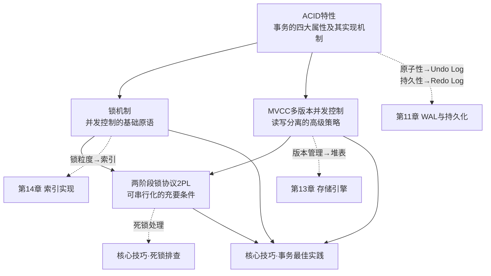

# 理论基础

事务与并发控制是数据库系统设计中最核心的课题之一。理解其理论基础，不仅是掌握数据库内核的必经之路，更是设计高可靠、高性能数据密集型系统的根基。本节将系统性地拆解事务的四大属性（ACID）的底层实现、锁机制的完整体系、多版本并发控制（MVCC）的原理与工程实现，以及两阶段锁协议（2PL）的严格数学证明。

---

## 为什么需要理论基础

在工程实践中，许多开发者把事务视为一个"黑盒"——开启事务、执行SQL、提交或回滚。但当遇到以下问题时，黑盒思维就力不从心了：

- 为什么同一条SQL在不同隔离级别下行为完全不同？
- 为什么两个事务加了相同的锁却产生了死锁？
- 为什么MySQL InnoDB的REPEATABLE READ能避免大部分幻读，而SQL标准说它不能？
- MVCC的版本链到底怎么组织？旧版本何时被清理？
- 为什么一个"无辜"的长事务会导致整个数据库写入变慢？

这些问题的答案都藏在理论基础中。不理解ACID的实现机制，就无法解释为什么某些优化有效、某些反模式有害；不理解锁的兼容矩阵，就无法诊断复杂的死锁场景；不理解MVCC的可见性判断逻辑，就无法设计正确的业务逻辑。

### 真实生产场景：理论缺失的代价

| 场景 | 理论根源 | 后果 |
|------|----------|------|
| 长事务导致回滚段膨胀，写入吞吐下降90% | 不理解Undo Log与事务生命周期 | 数据库假死，业务全面停摆 |
| 两个微服务同时扣减同一库存行，死锁率飙升 | 不理解锁等待与死锁检测机制 | 订单失败率从0.1%暴涨到15% |
| "明明两个事务各自只扣了300，账户余额500，怎么会变负？" | 不理解快照隔离下的写偏斜 | 资金超扣，财务损失 |
| PostgreSQL表膨胀到原始大小的10倍 | 不理解MVCC版本清理机制 | 磁盘耗尽，查询超时 |
| `UPDATE`没有命中索引，锁住整张表 | 不理解行锁基于索引实现 | 全表阻塞，级联雪崩 |

这些不是理论推演，而是真实发生过的线上事故。理论不是"学术象牙塔"，而是预防事故的操作手册。

## 前置知识

学习本节内容前，建议具备以下基础知识：

| 前置知识 | 重要程度 | 说明 |
|----------|----------|------|
| 数据库存储引擎（第13章） | ★★★★★ | 理解堆表、B+树索引的物理结构 |
| 索引实现（第14章） | ★★★★☆ | 理解B+树的并发控制与页面级锁 |
| WAL与持久化（第11章） | ★★★★☆ | 理解日志先行协议与崩溃恢复 |
| 进程与线程（第4章） | ★★★☆☆ | 理解同步原语、互斥量、条件变量 |
| CPU缓存一致性（第2章） | ★★☆☆☆ | 理解原子操作的硬件基础 |

> 如果时间有限，至少确保理解第13章存储引擎和第14章索引。这两个前置知识是理解锁粒度和MVCC版本链物理组织的关键。

---

## 本节知识体系

本节包含四个核心主题，它们之间存在严密的逻辑递进关系：

**学习路径建议**：建议按照 ACID → 锁机制 → MVCC → 2PL 的顺序学习。ACID建立整体框架认知，锁机制提供最基础的并发控制原语，MVCC是在锁之上的性能优化，2PL则是理解可串行化的理论终点。如果你时间有限，至少完整学习ACID和锁机制两个主题——它们是所有后续内容的根基。

### 四大主题的逻辑递进

理解四个主题之间的关系至关重要：

ACID（目标层）：定义"事务应该保证什么"
    ↓ 实现手段
锁机制（原语层）：提供最基础的互斥访问能力
    ↓ 性能优化
MVCC（策略层）：在锁之上实现读写分离，减少阻塞
    ↓ 形式化保证
2PL（证明层）：从数学上证明可串行化的充要条件

这个递进关系意味着：**不理解锁就无法理解MVCC为什么有效，不理解MVCC就无法理解2PL在现代数据库中为何"退居幕后"**。

---

## 主题一：ACID特性

> 对应文件：[一、ACID特性](./01-一ACID特性.md)
> 
> **一句话总结**：ACID的四个属性并非并列关系——原子性靠Undo Log，持久性靠Redo Log/WAL，隔离性靠锁+MVCC，一致性是前三者的合力。

ACID是事务的四个基本属性——原子性（Atomicity）、一致性（Consistency）、隔离性（Isolation）、持久性（Durability）。教科书将它们并列描述，仿佛四个独立的概念。但从数据库内核实现的角度看，**它们的实现机制完全不同，且一致性更多是其他三者共同保证的结果**。

### 核心要点

**原子性（Atomicity）的实现——Undo Log**

原子性要求事务的所有操作要么全部成功，要么全部撤销。这不是靠"记在脑子里"实现的，而是通过Undo Log（撤销日志）这一数据结构。Undo Log记录了每次数据修改前的旧值，在事务回滚时逐条反向重放。InnoDB将Undo Log组织为链表结构，同一事务的多条记录通过前后指针串联，回滚时从链表尾部向前遍历。

事务T1的Undo Log链（回滚时从右向左遍历）：
┌──────────┐    ┌──────────┐    ┌──────────┐
│ INSERT    │───→│ UPDATE   │───→│ UPDATE   │
│ row_id=99 │    │ old=500  │    │ old=300  │
│ (最后操作) │    │ new=800  │    │ new=500  │
└──────────┘    └──────────┘    └──────────┘
                                    ↑ 回滚从这里开始

PostgreSQL采用了完全不同的策略：没有独立的Undo Log，而是将旧版本保留在数据页本身中。UPDATE操作不原地修改，而是插入新元组并保留旧元组。回滚只需标记新元组无效。这种设计简化了回滚逻辑，但带来了表膨胀（table bloat）问题，需要VACUUM机制定期清理。

**持久性（Durability）的实现——Redo Log与WAL**

持久性通过Write-Ahead Logging（WAL）协议保证：在数据页修改落盘之前，对应的日志记录必须先写入稳定存储。工业界最广泛采用的崩溃恢复算法是ARIES（Mohan et al., 1992），它包含分析（Analysis）、重做（Redo）、撤销（Undo）三个阶段。ARIES的精妙之处在于重做阶段采用"无条件重做"策略——即使数据页已包含该修改也要重新应用，因为重做操作是幂等的，这大大简化了恢复逻辑。

**隔离性（Isolation）的实现——锁与MVCC**

隔离性是最复杂的属性，其实现方案也最多样化。两大主流技术是锁机制（Pessimistic Concurrency Control）和多版本并发控制（MVCC）。现代数据库通常两者结合使用：InnoDB的REPEATABLE READ同时使用了MVCC（读不加锁）和2PL（写加锁）。

**一致性（Consistency）——三者的合力**

一致性并非由单一机制保证，而是原子性、隔离性和持久性三者共同作用的结果，再加上数据库自身的约束检查（主键、外键、CHECK、触发器）。理解这一点至关重要：如果原子性或隔离性被打破，一致性就会受损。

### 为什么重要

理解ACID的实现机制直接决定了你的优化能力。例如：
- 知道Undo Log的存在，才能理解为什么长事务会导致回滚段膨胀
- 知道Redo Log的写入策略，才能理解为什么频繁的小事务会影响写入性能
- 知道MVCC的可见性判断，才能解释为什么某些查询在不同事务中返回不同结果
- 知道一致性靠约束检查实现，才能理解为什么"信任应用层"来维护一致性是危险的

---

## 主题二：锁机制

> 对应文件：[二、锁机制](./02-二锁机制.md)
> 
> **一句话总结**：锁是并发控制的原子单元，但"加了锁"不等于"并发正确"——锁的类型、粒度、兼容矩阵和管理策略共同决定了并发控制的正确性和性能。

锁是最基本、最经典的并发控制机制。通过在访问数据前加锁，保证同一时刻只有一个事务能修改特定数据。理解锁机制是理解所有并发控制方案的基础。

### 核心要点

**锁的类型体系**

锁不是只有"共享锁"和"排他锁"两种。完整的锁类型体系包括：

| 锁类型 | 用途 | 兼容性 | 典型场景 |
|--------|------|--------|----------|
| 共享锁（S Lock） | 读操作 | S与S兼容，S与X冲突 | SELECT ... LOCK IN SHARE MODE |
| 排他锁（X Lock） | 写操作 | X与任何锁都冲突 | UPDATE、DELETE、SELECT ... FOR UPDATE |
| 意向共享锁（IS） | 表级标记，表示事务意图加行级S锁 | IS与IX兼容 | 行级加S锁前自动获取 |
| 意向排他锁（IX） | 表级标记，表示事务意图加行级X锁 | IX与IS兼容 | 行级加X锁前自动获取 |
| 自增锁（AUTO-INC） | 保护自增列 | 特殊兼容规则 | INSERT时自增ID分配 |

意向锁（Intention Lock）是很多人忽视的细节。它们存在的意义是解决"行锁和表锁的冲突判断"问题——当事务要给整张表加X锁时，不需要逐行检查是否有行锁，只需检查表级是否有IS或IX锁即可。这是一个经典的O(1) vs O(n)优化。

**锁兼容矩阵详解**

        请求→   S锁    X锁    IS锁    IX锁
 持有↓
  S锁         ✓      ✗      ✓       ✗
  X锁         ✗      ✗      ✗       ✗
  IS锁        ✓      ✗      ✓       ✓
  IX锁        ✗      ✗      ✓       ✓

这张矩阵是诊断锁等待问题的核心参考。例如：两个事务同时对同一行加X锁，必然冲突；但意向锁之间（IS与IX）是兼容的，只有当表级锁请求（如LOCK TABLE）与意向锁冲突时才会阻塞。

**锁粒度**

锁的粒度从粗到细包括表锁、页锁、行锁，甚至还有间隙锁（Gap Lock）和临键锁（Next-Key Lock）。InnoDB的行锁实际上基于索引实现——没有索引的列上加行锁会退化为表锁，这是一个常见且致命的性能陷阱。

锁粒度层级（InnoDB）：
┌─────────────────────────────────────────┐
│ 表锁（Table Lock）                        │
│  ┌─────────────────────────────────────┐ │
│ │ 意向锁（Intention Lock）               │ │
│ │  ┌─────────────────────────────────┐ │ │
│ │ │ 间隙锁（Gap Lock）                │ │ │
│ │ │  ┌─────────────────────────────┐ │ │ │
│ │ │ │ 临键锁（Next-Key Lock）       │ │ │ │
│ │ │ │  ┌─────────────────────────┐ │ │ │ │
│ │ │ │ │ 行锁（Record Lock）      │ │ │ │ │
│ │ │ │ └─────────────────────────┘ │ │ │ │
│ │ │ └─────────────────────────────┘ │ │ │
│ │ └─────────────────────────────────┘ │ │
│ └─────────────────────────────────────┘ │
└─────────────────────────────────────────┘

注意：锁粒度越细，并发度越高，但管理开销也越大。

**间隙锁与临键锁——InnoDB的幻读防护**

这是InnoDB在REPEATABLE READ下能部分防止幻读的关键机制：

| 锁类型 | 锁定范围 | 阻止的操作 | 触发条件 |
|--------|----------|-----------|----------|
| 记录锁（Record Lock） | 仅锁定索引记录本身 | 阻止对特定行的修改 | WHERE条件精确命中索引记录 |
| 间隙锁（Gap Lock） | 锁定索引记录之间的间隙 | 阻止在间隙中插入新记录 | 范围查询（如BETWEEN、<、>）|
| 临键锁（Next-Key Lock） | 记录锁 + 间隙锁 | 阻止修改和在间隙中插入 | InnoDB默认的行锁类型 |

间隙锁的存在是为了防止幻读——如果事务A查询"年龄在25-30之间的员工有5人"，事务B在同一间隙中插入一条新记录，事务A再次查询就会看到6人（幻读）。间隙锁阻止了这种插入。

**锁管理器（Lock Manager）的实现**

锁管理器是数据库内核中的核心组件，负责锁的授予、等待和释放。它通常以哈希表实现，键为资源标识（表ID + 行ID），值为该资源上的锁请求队列。当一个新锁请求与已有锁冲突时，请求者进入等待队列；当持有者释放锁时，管理器按照等待队列中的顺序（或优先级）决定下一个授予的对象。

### 为什么重要

锁是所有悲观并发控制方案的原子单元。不理解锁，就无法：
- 解释为什么UPDATE会在特定索引上产生锁等待
- 设计避免死锁的事务执行顺序
- 理解InnoDB的间隙锁为何存在以及何时触发
- 在高并发场景下做出正确的锁粒度选择
- 区分"行锁"和"基于索引的行锁"——后者是性能的关键

---

## 主题三：MVCC多版本并发控制

> 对应文件：[三、MVCC多版本并发控制](./03-三MVCC多版本并发控制.md)
> 
> **一句话总结**：MVCC的核心优势是"读不阻塞写，写不阻塞读"，但快照隔离不能防止写偏斜——这是SSI要解决的问题。

MVCC是现代数据库系统最重要的并发控制创新。它的核心优势可以用一句话概括：**读不阻塞写，写不阻塞读**。这在读多写少的场景下能带来数量级的性能提升。

### 核心要点

**MVCC的基本思想**

MVCC通过维护数据的多个历史版本，允许读操作访问旧版本数据而不被写操作阻塞。每个事务在开始时获取一个"快照"（Snapshot），后续读操作只看到快照中的数据状态。写操作创建新版本，但不覆盖旧版本。

MVCC版本链示意（InnoDB）：

行记录: id=1, name="Alice"
  ┌──────────┐     ┌──────────┐     ┌──────────┐
  │ version 3 │────→│ version 2 │────→│ version 1 │
  │ name="Amy" │     │ name="Ali" │     │ name="Alice" │
  │ ts=1005   │     │ ts=1002   │     │ ts=999    │
  │ commit=1006│    │ commit=1003│    │ commit=1000│
  └──────────┘     └──────────┘     └──────────┘
       ↑
   最新版本（已提交）
   
读操作根据Read View判断对哪个版本可见：
- 事务A (start_ts=1004): 看到 version 2 ("Ali")
- 事务B (start_ts=1007): 看到 version 3 ("Amy")

**快照隔离（Snapshot Isolation）**

快照隔离是MVCC最基础的隔离级别。其核心规则是First-Committer-Wins：如果两个并发事务修改了同一数据，先提交的成功，后提交的回滚。快照隔离消除了脏读和不可重复读，但**不能防止写偏斜（Write Skew）异常**——这是一个被广泛忽视的隔离缺陷。

写偏斜的经典案例：两个医生同时查看值班表，各自发现对方在值班，于是都申请休假，最终导致无人值班。两个事务各自基于快照读取，都认为满足约束（至少一人值班），但提交后约束被违反。

写偏斜场景：
初始状态: 医生A=在岗, 医生B=在岗, 约束: 至少1人值班

事务T1 (医生A):              事务T2 (医生B):
├─ 读: A=在岗, B=在岗         ├─ 读: A=在岗, B=在岗
├─ 判断: B在岗, A可以休假      ├─ 判断: A在岗, B可以休假
├─ 写: A=休假                 ├─ 写: B=休假
└─ 提交 ✓                     └─ 提交 ✓

结果: A=休假, B=休假 → 违反约束！
原因: 两个事务各自基于快照读取，互不知道对方也在修改

**可串行化快照隔离（SSI）**

SSI在快照隔离基础上增加了写偏斜检测。通过在元组级别维护读写依赖关系，检测危险的rw-antidependency结构。PostgreSQL从9.1版本开始实现SSI，这是工业界首个基于MVCC的可串行化实现。

SSI的检测原理可以简化为：如果事务T1读取了数据X，而事务T2修改了数据X，同时T2也读取了T1修改的数据Y——这就形成了一个"读-写危险结构"。当检测到这种结构时，必须回滚其中一个事务。

**版本链与垃圾回收**

MVCC系统的核心数据结构是版本链（Version Chain）。InnoDB通过Undo Log chain实现版本链，PostgreSQL将旧版本直接存在数据页中。两个系统都面临旧版本清理的问题：InnoDB通过Purge线程清理不再被任何活跃事务使用的Undo Log，PostgreSQL通过VACUUM机制回收死元组。

版本链的长度直接影响读性能——链越长，遍历开销越大。长事务是版本链膨胀的最大元凶，因为即使旧版本早已"过期"，只要有活跃事务需要它，就不能被清理。

**MySQL InnoDB vs PostgreSQL的MVCC实现对比**

| 特性 | MySQL InnoDB | PostgreSQL |
|------|-------------|------------|
| 旧版本存储 | Undo Log（独立区域） | 数据页内（堆表） |
| 可见性判断 | Read View + Undo Log chain | 元组的xmin/xmax + clog |
| 版本清理 | Purge线程异步清理Undo Log | VACUUM机制回收死元组 |
| 表膨胀问题 | 较轻（Undo Log独立管理） | 较重（需要定期VACUUM） |
| 可序列化 | 通过Next-Key Lock模拟 | SSI（真正的快照隔离可序列化） |
| 读性能退化 | 链长时遍历开销大 | 死元组多时扫描效率低 |
| 维护复杂度 | Purge线程相对简单 | AutoVacuum调优复杂 |

### 为什么重要

MVCC是理解现代数据库行为的关键。不理解MVCC，就无法解释：
- 为什么REPEATABLE READ下"同一事务两次查询结果不同"（MVCC快照时机）
- 为什么UPDATE会看到自己之前的修改（InnoDB的Read View更新策略）
- 为什么VACUUM/AutoVacuum对PostgreSQL性能至关重要
- 为什么长事务是性能杀手（版本链无法清理）
- 为什么某些"读已提交"的查询能"看到"另一个事务的部分修改

---

## 主题四：两阶段锁协议（2PL）

> 对应文件：[四、两阶段锁协议（2PL）](./04-四两阶段锁协议2PL.md)
> 
> **一句话总结**：2PL是可串行化的充要条件，它的三个变体（Basic→Strict→Rigorous）逐步解决了级联回滚和实现复杂性问题。

两阶段锁协议是保证可串行化的经典算法，由Eswaran等人于1976年提出。它规定事务的加锁和解锁行为必须分为两个阶段，由此保证任何并发调度都是冲突可串行化的。

### 核心要点

**Basic 2PL**

Basic 2PL将事务分为两个阶段：
- **增长阶段（Growing Phase）**：事务可以获取锁，但不能释放锁
- **缩减阶段（Shrinking Phase）**：事务可以释放锁，但不能获取新锁

Basic 2PL的事务生命周期：

时间轴 ──────────────────────────────────────→

事务T1:  ┌──增长阶段──┐┌──缩减阶段──┐
         │ 加锁 加锁 加锁││ 释放 释放 释放│
         └────────────┘└────────────┘
                         ↑
                    一旦释放第一把锁
                    就不能再加新锁

Basic 2PL保证了可串行化，但存在级联回滚（Cascading Rollback）问题：事务在缩减阶段释放写锁后，其他事务可能读取了该事务尚未提交的数据。如果该事务最终回滚，所有依赖它的事务也必须回滚。

**Strict 2PL与Rigorous 2PL**

Strict 2PL要求所有写锁（X锁）必须在事务结束时才能释放，读锁（S锁）仍可在缩减阶段提前释放。这消除了级联回滚问题。

Rigorous 2PL（Strong Strict 2PL）更进一步：所有锁（包括S锁和X锁）都必须在事务结束时才能释放。其简化之处在于：事务的等价串行顺序就是事务提交的顺序。**MySQL InnoDB实际上采用的就是Rigorous 2PL**。

三种2PL变体对比：

Basic 2PL:
  加锁阶段: [加S][加X][加S][加X]  释放阶段: [释S][释X][释S][释X]
  ⚠ 级联回滚风险

Strict 2PL:
  加锁阶段: [加S][加X][加S][加X]  释放阶段: [释S]──[释X+释S]──[释X]
  ✓ 无级联回滚，但串行顺序不确定

Rigorous 2PL (InnoDB选择):
  加锁阶段: [加S][加X][加S][加X]  释放阶段: [所有锁同时释放]
  ✓ 无级联回滚 + 串行顺序=提交顺序

**2PL与死锁**

2PL是死锁的根源——因为事务在持有锁的同时请求新锁，循环等待不可避免。死锁处理策略分为三类：
- **检测**：Wait-For Graph算法，通过DFS检测等待图中的环
- **预防**：Wait-Die和Wound-Wait策略，基于时间戳强制执行顺序
- **避免**：银行家算法变体，在加锁前检查是否会导致不安全状态

死锁的循环等待示例：

事务T1                     事务T2
 │                          │
 ├─ 持有: 行A上的X锁         ├─ 持有: 行B上的X锁
 │                          │
 ├─ 请求: 行B上的X锁         ├─ 请求: 行A上的X锁
 │                          │
 └──── 等待T2释放B ─────────┘
     └── 等待T1释放A ────────┘
     
     → 循环等待 → 死锁！

**可串行化的形式化证明**

2PL之所以在理论界地位崇高，是因为它提供了可串行化的**充分条件**：任何遵循2PL的调度都是冲突可串行化的。证明通过反证法完成——假设优先图中存在环，可以推导出违反2PL规则的矛盾。这个证明虽然只有几段话，却是数据库理论的基石之一。

### 为什么重要

2PL是连接理论与实践的桥梁。理解2PL才能：
- 解释为什么InnoDB在默认隔离级别下能保证可串行化
- 理解死锁产生的根本原因（不是bug，而是2PL的必然产物）
- 设计低死锁率的事务执行策略
- 在2PL（悲观）和OCC（乐观）之间做出正确的选择
- 理解为什么MySQL选择Rigorous 2PL而非更宽松的变体

---

## 四个主题的关联与对比

| 维度 | ACID特性 | 锁机制 | MVCC | 2PL |
|------|----------|--------|------|-----|
| 定位 | 事务的属性定义 | 并发控制的基础原语 | 读写分离的高级策略 | 可串行化的充要条件 |
| 核心问题 | 事务应该保证什么？ | 如何互斥访问共享数据？ | 如何让读不阻塞写？ | 如何保证可串行化？ |
| 工程载体 | Undo Log / Redo Log | Lock Manager | 版本链 / Read View | 两阶段加锁/解锁规则 |
| 性能特征 | 写放大（日志开销） | 读写互斥（高延迟） | 读零开销（快照读） | 死锁风险（检测开销） |
| 适用场景 | 所有事务场景 | 写密集型 | 读多写少 | 需要可串行化 |
| InnoDB实现 | Undo Log + Redo Log | Rigorous 2PL + 间隙锁 | Read View + Purge | Rigorous 2PL |
| PostgreSQL实现 | 堆表内版本 + WAL | 行级锁 | xmin/xmax + VACUUM | SSI |

### 悲观 vs 乐观并发控制的演进

并发控制策略谱系：

悲观策略（假设冲突频繁）         乐观策略（假设冲突稀少）
┌─────────────────────┐       ┌─────────────────────┐
│ 锁机制               │       │ OCC（乐观并发控制）    │
│   ├─ Basic 2PL       │       │   ├─ 读阶段          │
│   ├─ Strict 2PL      │       │   ├─ 验证阶段         │
│   └─ Rigorous 2PL    │       │   └─ 写阶段          │
│                       │       │                       │
│ MVCC + 2PL           │       │ SSI（可串行化快照隔离） │
│ (InnoDB REPEATABLE    │       │ (PostgreSQL           │
│  READ的实现)           │       │  SERIALIZABLE)        │
└─────────────────────┘       └─────────────────────┘
     ↓                              ↓
  适用于:                        适用于:
  • 写密集                       • 读密集
  • 强一致需求                    • 高并发读
  • 事务短小                     • 冲突率低

---

## 常见误区与纠正

### 误区一："加了事务就安全了"

**错误认知**：只要用了 `@Transactional`，数据一致性就有保证。

**实际情况**：事务的隔离级别决定了它能看到什么。READ COMMITTED下，同一事务内两次查询可能看到不同数据；REPEATABLE READ下也可能存在写偏斜。

**纠正**：根据业务语义选择合适的隔离级别，并在必要时通过应用层逻辑（如SELECT FOR UPDATE）保证一致性。

### 误区二："行锁就是锁住一行"

**错误认知**：UPDATE ... WHERE id = 1 只锁定id=1这一行。

**实际情况**：InnoDB的行锁基于索引。如果WHERE条件没有命中索引，InnoDB会退化为表锁。即使命中了索引，实际锁定的也可能是Next-Key Lock（记录+间隙）。

**纠正**：始终确保WHERE条件能命中索引，并理解间隙锁的存在。使用 `EXPLAIN` 确认查询确实走了索引。

### 误区三："MVCC完全消除了锁"

**错误认知**：用了MVCC就不需要锁了。

**实际情况**：MVCC消除了读操作的锁开销，但写操作仍然需要加锁。InnoDB在REPEATABLE READ下，快照读不加锁，但当前读（SELECT FOR UPDATE、UPDATE、DELETE）仍然需要加锁。而且间隙锁的存在意味着即使读操作也可能触发锁。

**纠正**：MVCC减少的是读的阻塞，不是完全消除锁。理解"快照读"和"当前读"的区别是关键。

### 误区四："长事务没什么大不了"

**错误认知**：事务长一点只是占着连接，影响不大。

**实际情况**：长事务会导致三个严重问题：(1) 回滚段膨胀，因为Undo Log不能被清理；(2) 版本链膨胀，其他事务读取时需要遍历更长的版本链；(3) 锁持有时间延长，增加死锁概率。

**纠正**：事务应该尽可能短小。将非数据库操作（RPC调用、文件操作）移到事务外。监控长事务：`SELECT * FROM information_schema.innodb_trx WHERE TIME_TO_SEC(TIMEDIFF(NOW(), trx_started)) > 60;`

### 误区五："死锁是bug，应该完全避免"

**错误认知**：死锁说明代码有bug。

**实际情况**：在2PL协议下，死锁是并发的固有产物，不是bug。真正的问题不是"会不会死锁"，而是"死锁了怎么处理"。MySQL InnoDB有自动死锁检测和回滚机制。

**纠正**：接受死锁的存在，重点放在：(1) 设置合理的锁等待超时；(2) 开启死锁日志便于排查；(3) 统一加锁顺序减少死锁概率；(4) 重试机制处理被回滚的事务。

### 误区六："MySQL的REPEATABLE READ和SQL标准的REPEATABLE READ一样"

**错误认知**：数据库文档说支持REPEATABLE READ，就等于标准的可重复读。

**实际情况**：MySQL InnoDB的REPEATABLE READ通过间隙锁和临键锁，实际上比SQL标准的REPEATABLE READ更强——它能防止大部分幻读。但SQL标准定义的REPEATABLE READ不能防止幻读，这是一个常见的混淆点。

**纠正**：区分"SQL标准的隔离级别定义"和"特定数据库的实现"。MySQL文档中提到的REPEATABLE READ行为优于标准定义。

---

## 从理论到实践的衔接

本节的理论知识直接指导"核心技巧"部分的实践操作：

| 理论主题 | 实践应用 | 对应技巧 |
|----------|----------|----------|
| ACID - 事务边界 | 事务短而快，RPC调用移到事务外 | 技巧一：事务最佳实践 |
| 锁机制 - 死锁检测 | SHOW ENGINE INNODB STATUS诊断死锁 | 技巧二：死锁排查与预防 |
| MVCC - 快照隔离 | 乐观锁vs悲观锁选型 | 技巧三：乐观锁与悲观锁的选型 |
| 2PL - 锁持有策略 | 统一加锁顺序减少死锁 | 技巧二：死锁排查与预防 |
| ACID - 分布式事务 | Saga、TCC、本地消息表 | 技巧四：分布式事务的轻量级方案 |

理解了理论基础，你在阅读"核心技巧"时将不再觉得那些操作步骤是"知其然不知其所以然"——你知道每一步背后的原理和权衡。

---

## 核心概念速查

| 概念 | 定义 | 关键要点 |
|------|------|----------|
| ACID | 事务四大属性：原子性、一致性、隔离性、持久性 | 一致性靠A+I+D共同保证 |
| Undo Log | 记录修改前旧值的日志，用于回滚 | InnoDB链表结构，PostgreSQL堆表内元组 |
| Redo Log | 记录修改后新值的日志，用于崩溃恢复 | WAL协议：日志先行 |
| ARIES | 三阶段崩溃恢复算法：Analysis→Redo→Undo | 无条件重做，幂等操作 |
| S Lock | 共享锁，允许多个读操作并发 | S与S兼容，S与X冲突 |
| X Lock | 排他锁，独占访问 | X与任何锁冲突 |
| 意向锁（IS/IX） | 表级标记，声明行级锁意图 | 避免表锁冲突检测的O(n)扫描 |
| Gap Lock | 锁定索引记录间的间隙 | 防止间隙中插入新记录（防幻读）|
| Next-Key Lock | 记录锁 + 间隙锁 | InnoDB默认行锁类型 |
| MVCC | 多版本并发控制 | 读不阻塞写，写不阻塞读 |
| Read View | InnoDB判断版本可见性的快照 | 包含活跃事务列表和trx_id |
| VACUUM | PostgreSQL回收死元组的机制 | 防止表膨胀，AutoVacuum自动运行 |
| Purge | InnoDB清理过期Undo Log的线程 | 异步清理，不阻塞正常操作 |
| 2PL | 两阶段锁协议 | 增长阶段只加锁，缩减阶段只解锁 |
| Rigorous 2PL | 所有锁在事务结束时释放 | InnoDB选择，串行顺序=提交顺序 |
| Write Skew | 快照隔离下的异常 | 两个事务各自读写不同数据，整体违反约束 |
| SSI | 可串行化快照隔离 | 检测rw-antidependency危险结构 |
| Wait-For Graph | 死锁检测算法 | 通过DFS检测等待图中的环 |
| Wound-Wait | 死锁预防策略 | 老事务抢占新事务，减少工作浪费 |

---

## 学习检验标准

完成本节学习后，你应该能够回答以下问题：

### 基础题（确保理解核心概念）

1. **ACID**：InnoDB中一次UPDATE操作涉及哪些日志？Undo Log和Redo Log各自在什么时机写入？
2. **锁机制**：意向锁存在的意义是什么？没有意向锁时，判断表锁和行锁的冲突需要什么操作？
3. **MVCC**：InnoDB的Read View包含哪些信息？可见性判断的具体规则是什么？
4. **2PL**：为什么Rigorous 2PL比Strict 2PL更简单？MySQL InnoDB选择了哪种变体？

### 进阶题（检验深度理解）

5. **ACID + MVCC**：为什么REPEATABLE READ下，同一个事务中先执行SELECT再执行UPDATE，UPDATE能看到自己的修改？（提示：InnoDB的Read View更新策略）
6. **锁 + MVCC**：在InnoDB的REPEATABLE READ下，快照读和当前读的区别是什么？什么情况下读操作也会加锁？
7. **2PL + 死锁**：假设有事务T1持有行A的X锁并请求行B的X锁，T2持有行B的X锁并请求行A的X锁。分别画出Wait-Die和Wound-Wait策略下的处理过程。
8. **MVCC + 写偏斜**：画出"医生值班"场景的时序图，说明为什么快照隔离无法防止写偏斜，以及SSI如何检测和阻止它。

### 实战题（检验应用能力）

9. 给定一个电商平台的订单表，设计事务执行策略：(a) 如何避免"超卖"？(b) 如何避免死锁？(c) 如何在高并发下保持性能？
10. 比较MySQL InnoDB和PostgreSQL在MVCC实现上的优劣，针对你的具体业务场景，解释你会选择哪个数据库，以及为什么。

如果对这些问题感到模糊，请深入阅读对应的主题文件，确保理解每个细节背后的"为什么"。理论不是用来"背"的，而是用来"理解"的——当你能用理论解释生产环境中的现象时，才算真正掌握了它。

---

## 参考文献与延伸阅读

本节内容参考了以下经典文献：

| 文献 | 作者 | 核心贡献 |
|------|------|----------|
| Database System Concepts (第7版) | Silberschatz et al. | 事务与并发控制的经典教材 |
| ARIES Recovery Method (1992) | Mohan et al. | 崩溃恢复算法的奠基之作 |
| A Critique of ANSI SQL Isolation Levels (1995) | Berenson et al. | 揭示SQL标准隔离级别定义的模糊性 |
| Making Snapshot Isolation Serializable (2008) | Cahill et al. | SSI的工程实现基础 |
| Serializable Snapshot Isolation in PostgreSQL (2012) | Ports & Grittner | 工业界首个基于MVCC的可串行化实现 |
| Architecture of a Database System (2007) | Hellerstein et al. | 数据库系统架构的全景式综述 |
| Transactional Information Systems (2002) | Weikum & Vossen | 事务处理系统的技术百科 |

延伸阅读建议：
- 想深入MVCC实现：阅读InnoDB源码中的 `trx0rseg.cc`（Undo Log管理）和 `read0read.cc`（Read View）
- 想深入死锁检测：阅读InnoDB源码中的 `lock0lock.cc`（锁管理器）
- 想深入SSI：阅读PostgreSQL源码中的 `predicate.c`（SSI谓词锁实现）
