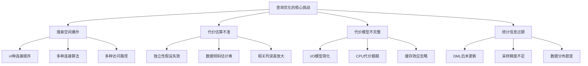
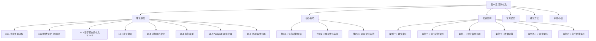

# 第十六章 查询优化 · 章节概览

## 本章定位

查询优化是数据库系统中最具技术深度的子系统，也是软件工程中"性能决定成败"的典型领域。一条SQL语句从文本到结果，中间要经历解析、重写、优化、执行四个阶段——其中优化器的工作直接决定了查询是秒级返回还是数小时无响应。本章将系统拆解这一核心子系统，从理论根基到工程实践，构建完整的查询优化知识体系。

对于后端工程师和DBA而言，查询优化不是"锦上添花"，而是"生死攸关"。一条未优化的查询可能拖垮整个数据库，而一个正确的优化决策可以将查询从"不可用"变为"毫秒级响应"——性能差距动辄数万倍。

---

## 为什么查询优化如此困难

查询优化的核心问题可以表述为：给定一个关系代数表达式，如何将其转换为一个物理执行计划，使得执行代价最小？这个问题的困难来自三个层面：

**搜索空间爆炸**——SQL是声明式语言，用户只描述"想要什么"，同一个查询可以有多种语义等价的执行方式。对于n个表的连接，可能的连接顺序有 n! 种（考虑交换律后为 n!/2），每种顺序又可以选择不同的连接算法（嵌套循环/哈希/归并），每种算法还有不同的物理参数。n=10时搜索空间就达到180万种以上。

**代价估算依赖近似统计**——优化器需要估算每个候选计划的执行代价，但代价估算依赖统计信息（行数、数据分布、列唯一值数等），而统计信息本身是采样近似的。当统计信息过期或不准确时，优化器可能做出灾难性的错误选择。

**误差在执行链中累积放大**——一个两表连接的基数估计偏差2倍，再连接第三个表时误差可能放大到4倍甚至更多。Leis等人2015年在VLDB发表的实证研究证实：选择性估计不准是优化器失误的首要原因。

---

## 本章知识地图

本章按照"理论基础 → 核心技巧 → 实战案例 → 反思总结"的路径组织，从底层原理到上层实践层层递进。以下为完整的章节结构与内容导引：

---

## 各节内容导引

### 第一部分：理论基础

理论基础是本章的根基，覆盖查询优化从问题定义到系统实现的完整知识链。即使你的日常工作中不需要手写优化器代码，理解这些原理也能让你在遇到慢查询时做出正确的诊断和决策。

| 节号 | 主题 | 核心问题 | 适合读者 |
|------|------|----------|----------|
| 16.1 | 查询处理流程 | 一条SQL从文本到结果经历了什么？ | 所有读者 |
| 16.2 | 代数优化（RBO） | 启发式规则如何变换查询树？ | 所有读者 |
| 16.3 | 基于代价的优化（CBO） | 代价模型、统计信息、选择性估计如何协同工作？ | 中级+ |
| 16.4 | 连接算法 | NLJ/SMJ/HJ各自的设计哲学与适用场景？ | 中级+ |
| 16.5 | 连接顺序优化 | 动态规划如何在指数级搜索空间中找到最优解？ | 高级 |
| 16.6 | 执行模型 | Volcano迭代器模型如何工作？物化vs流水线？ | 中级+ |
| 16.7 | PostgreSQL优化器 | PostgreSQL的优化器架构与特有能力 | 实战读者 |
| 16.8 | MySQL优化器 | MySQL的优化器架构与版本演进 | 实战读者 |

**16.1 查询处理流程**——从SQL文本出发，完整拆解解析（Parsing）、重写（Rewriting）、优化（Optimization）、执行（Execution）四个阶段的内部机制。理解这个流程是后续所有内容的基础。

**16.2 代数优化（RBO）**——基于关系代数的等价变换规则，通过选择下推、投影下推、连接重排序、连接消除等启发式方法重写查询树。这些规则不依赖统计信息，是优化器的第一道防线。

**16.3 基于代价的优化（CBO）**——本章理论部分最核心、最深入的内容。详细剖析代价模型的数学基础（I/O代价、CPU代价、启动代价与总代价），统计信息的收集与存储（直方图、MCV列表、NDV），以及选择性估计和基数估计的具体算法。包含完整的伪代码实现。

**16.4 连接算法**——深入比较嵌套循环连接（NLJ）、排序归并连接（SMJ）、哈希连接（Hash Join）三种核心连接算法的原理、时间复杂度、空间复杂度和适用场景。理解每种算法在什么数据规模和内存条件下表现最优。

**16.5 连接顺序优化**——当查询涉及多表连接时，连接顺序对性能有决定性影响。本节讲解System R风格的动态规划方法如何在指数级搜索空间中高效搜索，以及Greedy等启发式方法如何在多表连接场景下降低搜索开销。

**16.6 执行模型**——对比物化执行（Materialized Execution）和流水线执行（Pipelined Execution）两种模型，重点讲解Volcano迭代器模型（open/next/close接口）的工作原理，以及批处理执行模型在现代列式数据库中的应用。

**16.7 PostgreSQL优化器**——剖析PostgreSQL查询优化器的架构设计，包括其代价模型参数配置、EXPLAIN/EXPLAIN ANALYZE输出解读、遗传查询优化器（GEQO）处理多表连接的机制，以及Hint机制和计划稳定性的实现方式。

**16.8 MySQL优化器**——讲解MySQL优化器从RBO到CBO的演进历程，MySQL 8.0引入的代价模型改进、多表连接优化策略，以及MySQL特有的优化器Hint语法和索引提示机制。

### 第二部分：核心技巧

从理论走向实操，本节聚焦三个最核心的实战技巧——让你能够读懂执行计划、运用RBO规则、驾驭CBO优化。

**技巧1：执行计划解读**——EXPLAIN输出的逐行解读方法，包括type列（system/const/eq_ref/ref/range/index/ALL）的含义与性能排序，rows和filtered列的解读技巧，Extra列的关键信息（Using filesort、Using temporary、Using index等）。这是诊断慢查询的第一步。

**技巧2：RBO优化实战**——在实际项目中应用代数优化规则：选择下推的SQL写法技巧、投影下推的列选择策略、连接消除的条件判断、子查询到半连接的重写方法。

**技巧3：CBO优化实战**——基于代价模型的优化策略：如何通过ANALYZE确保统计信息准确、如何调整代价参数适配硬件环境、如何利用EXPLAIN COSTS对比不同执行计划的代价估算。

### 第三部分：实战案例

六个真实生产环境案例，覆盖日常开发中最常见的查询性能问题：

| 案例 | 问题类型 | 核心教训 |
|------|----------|----------|
| 案例一：电商订单查询 | 缺失索引导致全表扫描 | 索引设计的第一性原理 |
| 案例二：执行计划异常 | 优化器误判连接顺序 | EXPLAIN诊断流程 |
| 案例三：统计信息过期 | ANALYZE缺失导致计划退化 | 统计信息维护策略 |
| 案例四：数据倾斜 | 分布不均匀导致代价估算偏差 | Skew Join处理技巧 |
| 案例五：子查询退化 | IN子查询未被半连接优化 | SQL重写方法论 |
| 案例六：高并发锁争用 | 查询级优化与系统级优化的平衡 | 全链路优化思维 |

每个案例都遵循"问题发现 → 诊断分析 → 解决方案 → 效果验证"的完整流程，附带真实的EXPLAIN输出和性能对比数据。

### 第四部分：误区、练习与总结

**常见误区**——列举查询优化领域最典型的认知偏差和操作失误：过度依赖索引、忽略统计信息维护、盲目使用Hint、只看单次执行时间不看执行计划稳定性等。

**练习方法**——提供分层练习方案：基础概念理解（30分钟）、执行计划解读实操（60分钟）、综合优化实战（90分钟），帮助读者将知识转化为能力。

**本章小结**——提炼核心知识图谱，回顾关键公式与模型，给出进一步学习的路线建议。

---

## 前置知识与学习路径

学习本章需要以下前置知识：

| 前置知识 | 必要程度 | 缺失时的建议 |
|----------|----------|-------------|
| 关系代数基础 | 必需 | 先补充选择、投影、连接等基本概念 |
| 第十三章：关系型数据库架构 | 推荐 | 了解存储引擎、缓冲池、索引结构 |
| 第十四章：索引实现 | 推荐 | 理解B+树索引、聚簇索引与非聚簇索引 |
| 基本的SQL编写能力 | 必需 | 能编写多表连接查询 |
| Linux基础操作 | 推荐 | 能使用psql/mysql客户端 |

**推荐学习路径**：

路径一：理论导向（适合想深入理解原理的读者）
  理论基础 → 核心技巧 → 本章小结
  预计时间：6-8小时

路径二：实战导向（适合想快速解决慢查询的读者）
  技巧1（执行计划解读）→ 实战案例 → 常见误区 → 本章小结
  预计时间：3-4小时

路径三：完整学习（适合系统掌握查询优化的读者）
  理论基础 → 核心技巧 → 实战案例 → 常见误区 → 练习方法 → 本章小结
  预计时间：10-12小时

---

## 本章学习目标

完成本章学习后，读者应当能够：

**理解层面**
- 说出SQL查询从文本到结果的完整处理流程
- 解释代价模型中I/O代价和CPU代价的计算方法
- 区分嵌套循环连接、排序归并连接、哈希连接的适用场景
- 理解独立性假设在选择性估计中的作用与局限

**应用层面
- 独立解读EXPLAIN输出，识别全表扫描、文件排序、临时表等性能问题
- 运用选择下推、投影下推等规则重写低效SQL
- 根据表规模和数据特征选择合适的连接算法
- 执行ANALYZE收集统计信息，并判断统计信息是否需要更新

**分析层面
- 诊断慢查询的根因（缺失索引/统计过期/计划误判/数据倾斜）
- 对比不同执行计划的代价，预判性能差异
- 在PostgreSQL和MySQL中使用Hint引导优化器选择预期计划

---

## 关键术语速查

| 术语 | 英文 | 一句话解释 |
|------|------|-----------|
| 查询优化器 | Query Optimizer | 在语义等价的执行计划中选择代价最低方案的组件 |
| 代价模型 | Cost Model | 量化估算执行计划资源消耗的数学模型 |
| 选择性 | Selectivity | 满足条件的元组占总元组数的比例，取值[0,1] |
| 基数 | Cardinality | 操作输出的行数估计 |
| 直方图 | Histogram | 描述列数据分布的分段常数近似 |
| MCV | Most Common Values | 记录出现频率最高的值及其频率的列表 |
| NDV | Number of Distinct Values | 列中不同值的数量 |
| 嵌套循环连接 | Nested Loop Join | 对外表每行扫描内表查找匹配的连接算法 |
| 哈希连接 | Hash Join | 对一侧建哈希表、另一侧探测的连接算法 |
| 排序归并连接 | Sort-Merge Join | 两侧排序后线性归并的连接算法 |
| 执行计划 | Execution Plan | 优化器输出的物理操作序列与参数 |
| EXPLAIN | EXPLAIN | 查看查询执行计划的SQL命令 |
| RBO | Rule-Based Optimizer | 基于预定义规则选择计划的优化器 |
| CBO | Cost-Based Optimizer | 基于代价估算选择计划的优化器 |
| Volcano模型 | Volcano Model | 基于迭代器的自底向上执行框架 |
| 物化执行 | Materialized Execution | 每个操作物化完整结果后传递给下一步 |
| 流水线执行 | Pipelined Execution | 操作逐行产出，上下游并行执行 |

---

## 参考文献

本章核心内容参考以下经典文献：

- **Selinger, P.G. et al.** "Access Path Selection in a Relational Database Management System." *ACM SIGMOD*, 1979. — System R优化器，代价模型与动态规划连接顺序优化的奠基之作。
- **Graefe, G.** "Volcano—An Extensible and Parallel Query Evaluation System." *IEEE TKDE*, 1994. — 迭代器执行模型的标准实现。
- **Leis, V. et al.** "How Good Are Query Optimizers, Really?" *VLDB*, 2015. — 首次系统性实证研究优化器准确性，揭示选择性估计是瓶颈。
- **Graefe, G.** "Modern Query Optimization Techniques." *ACM Computing Surveys*, 1995. — 查询优化技术的综合综述。
- **Ioannidis, Y.E.** "Query Optimization." *ACM Computing Surveys*, 1996. — 查询优化理论的教科书级综述。
