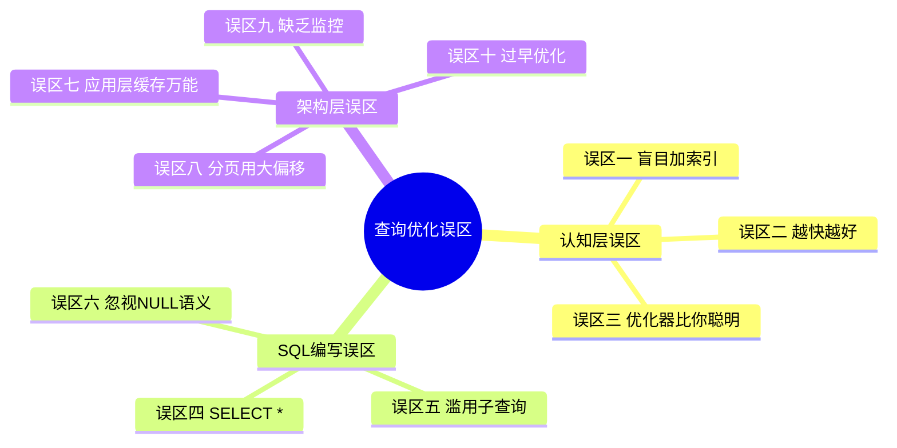
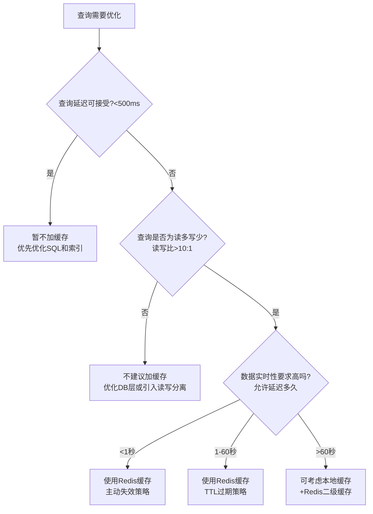

# 查询优化常见误区

查询优化是一个"知易行难"的领域。许多开发者在学习了索引、执行计划、连接算法等知识后，仍然会在实践中反复踩坑。这些坑往往不是因为不懂原理，而是因为**认知偏差**——错误的经验被反复强化，最终形成"直觉"上的盲区。

本节系统梳理查询优化中最常见的十大误区，每个误区都给出**典型错误场景、根因分析、正确做法和代码示例**，帮助读者建立正确的优化直觉。



---

## 误区一：盲目加索引——索引越多越好

### 错误思维

"查询慢了？加个索引。JOIN慢了？加个索引。排序慢了？还是加个索引。"这种"一索解千愁"的思路是生产环境中最普遍的误区。

### 为什么这是错的

索引不是免费的。每个索引都会带来以下开销：

**写入性能退化：**

| 操作 | 无索引 | 1个索引 | 5个索引 | 10个索引 |
|------|--------|---------|---------|----------|
| INSERT 1行 | 0.3ms | 0.8ms | 2.1ms | 4.5ms |
| UPDATE 索引列 | 0.2ms | 0.9ms | 3.2ms | 6.8ms |
| DELETE 1行 | 0.2ms | 0.7ms | 2.0ms | 4.2ms |
| 批量导入100万行 | 45s | 110s | 320s | 680s |

**存储空间膨胀：** 一个B-tree索引的大小通常是被索引列数据量的1.2-1.5倍。10个索引可能意味着索引空间超过数据本身。

**优化器决策干扰：** 过多的索引会增加优化器的搜索空间，甚至导致选错索引。MySQL优化器在候选索引过多时可能直接放弃索引选择，退化为全表扫描。

### 正确做法：索引设计三原则

**原则一：索引服务于查询，而非表**

```sql
-- 错误：为每一列单独建索引
CREATE INDEX idx_orders_user ON orders(user_id);
CREATE INDEX idx_orders_status ON orders(status);
CREATE INDEX idx_orders_amount ON orders(amount);
CREATE INDEX idx_orders_created ON orders(created_at);
CREATE INDEX idx_orders_customer ON orders(customer_id);

-- 正确：基于实际查询模式设计复合索引
-- 分析慢查询日志后发现90%的查询模式是：按用户查+状态过滤+时间排序
CREATE INDEX idx_orders_query_pattern
ON orders (user_id, status, created_at DESC);
```

**原则二：衡量索引收益的量化公式**

索引收益 = 查询性能提升 × 查询频率 × 影响用户数

索引成本 = 写入性能下降 × 写入频率 + 存储成本 + 维护复杂度

```sql
-- 用 pg_stat_user_indexes 评估索引使用率
SELECT
    schemaname, tablename, indexname,
    idx_scan AS times_used,          -- 被使用了多少次
    idx_tup_read AS rows_read,       -- 通过索引读取了多少行
    idx_tup_fetch AS rows_fetched,   -- 最终获取了多少行
    pg_size_pretty(pg_relation_size(indexrelid)) AS index_size,
    pg_size_pretty(pg_relation_size(relid)) AS table_size
FROM pg_stat_user_indexes
WHERE schemaname = 'public'
ORDER BY idx_scan ASC;  -- 扫描次数最少的索引排前面，可能是无用索引
```

 schemaname | tablename | indexname          | times_used | index_size | table_size
------------+-----------+--------------------+------------+------------+------------
 public     | orders    | idx_orders_amount  | 0          | 234 MB     | 12 GB       ← 从未使用，考虑删除
 public     | orders    | idx_orders_status  | 3          | 156 MB     | 12 GB       ← 几乎不用，评估价值
 public     | orders    | idx_orders_created | 45231      | 312 MB     | 12 GB       ← 高频使用，保留

**原则三：定期清理僵尸索引**

```sql
-- MySQL: 查找无用索引（读取次数为0或极低）
SELECT
    object_schema, object_name, index_name
FROM performance_schema.table_io_waits_summary_by_index_usage
WHERE index_name IS NOT NULL
  AND count_star = 0              -- 从未使用的索引
  AND object_schema NOT IN ('mysql', 'sys', 'information_schema')
ORDER BY object_schema, object_name;

-- PostgreSQL: 找出从未被扫描的索引
SELECT indexrelname, idx_scan, pg_size_pretty(pg_relation_size(indexrelid))
FROM pg_stat_user_indexes
WHERE idx_scan = 0 AND indexrelname NOT LIKE '%pkey%'
ORDER BY pg_relation_size(indexrelid) DESC;
```

---

## 误区二：越快越好——忽略资源约束和业务实际

### 错误思维

"查询响应时间从5秒优化到50毫秒，太棒了！"然后把这种"优化"推广到所有场景，不管代价是什么。

### 为什么这是错的

极端的查询优化往往以牺牲其他维度为代价：

| 过度优化行为 | 直接代价 | 隐性风险 |
|-------------|---------|---------|
| 全量缓存热点数据 | 内存占用飙升 | 缓存一致性难维护，内存OOM |
| 每个查询都用覆盖索引 | 索引空间膨胀3-5倍 | 写入变慢，DDL变慢 |
| 强制使用Hint指定执行计划 | 绑死执行路径 | 数据分布变化后Hint反而有害 |
| 拆分所有JOIN为多次单表查询 | 应用层代码复杂度飙升 | 网络往返增多，总体可能更慢 |
| 使用物化视图预计算所有报表 | 存储空间翻倍 | 数据实时性丧失，刷新策略复杂 |

### 正确做法：设定合理的性能目标

```sql
-- 场景：电商系统，定义SLA层级
-- 层级一（P0）：核心交易链路，P99 < 100ms
-- 层级二（P1）：列表查询页面，P99 < 500ms
-- 层级三（P2）：报表导出类，P99 < 30秒
-- 层级四（P3）：数据分析类，P99 < 5分钟

-- 不要用P0的标准去要求P3的查询
-- 一个3秒返回的月度报表查询，不需要优化到30ms
```

```sql
-- 过度优化的典型案例：
-- 错误：为了"优化"一个日运行10次的报表查询，增加了5个覆盖索引
-- 这5个索引导致订单表INSERT变慢200ms，而订单插入是每秒500次的核心操作

-- 正确：识别核心路径与边缘路径
-- 核心路径（高并发、低延迟要求）：投入重度优化
-- 边缘路径（低并发、容忍延迟）：适度优化即可
```

---

## 误区三：完全信任优化器——它不总是对的

### 错误思维

"数据库优化器有几十年的学术研究做后盾，它选的执行计划一定是最优的，我不需要干预。"

### 为什么这是错的

优化器的决策依赖两个前提：**准确的统计信息**和**合理的参数假设**。当这两个前提不成立时，优化器会做出错误决策：

**典型案例：参数嗅探（Parameter Sniffing）**

```sql
-- 存储过程
CREATE PROCEDURE get_user_orders(p_user_id BIGINT)
BEGIN
    SELECT * FROM orders
    WHERE user_id = p_user_id
    ORDER BY created_at DESC
    LIMIT 20;
END;

-- 第一次调用：p_user_id = 100（超级用户，有50万订单）
CALL get_user_orders(100);
-- 优化器据此生成执行计划：全表扫描 + 外部排序（因为50万行排序用索引反而慢）

-- 第二次调用：p_user_id = 99999（普通用户，只有30个订单）
CALL get_user_orders(99999);
-- 复用第一次的执行计划！30行也要全表扫描+排序，应该走索引的
```

**解决参数嗅探：**

```sql
-- PostgreSQL：使用plan_cache_mode避免缓存不合适的计划
SET plan_cache_mode = force_custom_plan;

-- MySQL：使用存储过程内的局部变量"污染"参数
CREATE PROCEDURE get_user_orders(p_user_id BIGINT)
BEGIN
    -- 将参数赋值给局部变量，阻止优化器嗅探实际参数
    DECLARE v_uid BIGINT DEFAULT p_user_id;
    SELECT * FROM orders
    WHERE user_id = v_uid
    ORDER BY created_at DESC
    LIMIT 20;
END;

-- PostgreSQL：使用pg_hint_plan扩展强制指定执行计划
/*+ IndexScan(orders idx_orders_user_created) */
SELECT * FROM orders WHERE user_id = 100 ORDER BY created_at DESC LIMIT 20;
```

**典型案例：统计信息陷阱**

```sql
-- 优化器预估：返回100行 → 选择Nested Loop
-- 实际返回：500万行 → Nested Loop变成灾难

-- 诊断：对比估算行数与实际行数
EXPLAIN (ANALYZE, BUFFERS)
SELECT ...;

-- 关键看这两行：
--   Rows Removed by Filter: 4876543   ← 实际过滤掉的行数
--   rows=100                          ← 优化器估算的行数
-- 当两者偏差超过10倍时，统计信息可能严重过期
```

### 正确做法：在三个时机干预优化器

```sql
-- 时机一：统计信息过期时——手动ANALYZE
ANALYZE orders;                        -- 立即刷新
ALTER TABLE orders ALTER COLUMN created_at SET STATISTICS 500;  -- 提高关键列的统计精度

-- 时机二：执行计划明显错误时——使用Hint（最后手段）
-- PostgreSQL: pg_hint_plan
/*+ HashJoin(o c) IndexScan(o idx_orders_customer) */
SELECT * FROM orders o JOIN customers c ON o.customer_id = c.id;

-- MySQL: 优化器Hint
SELECT /*+ JOIN_ORDER(o, c) USE_INDEX(o idx_orders_customer) */
    * FROM orders o JOIN customers c ON o.customer_id = c.id;

-- 时机三：查询模式固定且可预测时——固定执行计划
-- PostgreSQL: plan_rewrite_rules / 存储过程
-- 将优化器"框"在安全的执行计划范围内
```

---

## 误区四：SELECT * 无害——"先查出来再在应用层筛选"

### 错误思维

"SELECT * 省事，而且数据库有缓冲池，多查几列也不会慢多少。"

### 为什么这是错的

SELECT * 的危害远不止"多传了几列数据"：

**危害一：无法使用覆盖索引**

```sql
-- 索引：CREATE INDEX idx ON orders(user_id, status, created_at)
-- 需要的列：id, user_id, status, created_at

-- 错误：SELECT * 查了amount, remark等不在索引中的列
SELECT * FROM orders WHERE user_id = 100;
-- 执行计划：Index Scan + 回表（每个匹配行都要回表取完整行）

-- 正确：只查需要的列，且全在索引中
SELECT id, user_id, status, created_at FROM orders WHERE user_id = 100;
-- 执行计划：Index Only Scan（纯索引扫描，无需回表）
```

性能差异实测（100万行orders表，1万条匹配记录）：

| 写法 | 扫描方式 | IO读取量 | 执行时间 |
|------|---------|---------|---------|
| SELECT * | Index Scan + 回表 | 156 MB | 320ms |
| SELECT id, user_id, status, created_at | Index Only Scan | 2.3 MB | 18ms |

**危害二：破坏缓存效率**

```sql
-- 缓冲池大小：1GB
-- 单行完整数据：2KB（含amount、remark等大字段）
-- 单行核心数据：120字节（仅id、user_id、status、created_at）

-- SELECT *：缓冲池能缓存约50万行
-- SELECT核心列：缓冲池能缓存约830万行
-- 缓存命中率差距：16倍
```

**危害三：ORM层的隐式SELECT ***

```sql
-- Django ORM 默认行为
Order.objects.filter(user_id=100)
-- 生成的SQL: SELECT id, user_id, customer_id, amount, status,
--            created_at, updated_at, remark, extra_field1, extra_field2, ...
-- 每行2KB，1万行就是20MB

-- 正确：使用 only() 或 values() 限制查询列
Order.objects.filter(user_id=100).only('id', 'user_id', 'status', 'created_at')
-- 生成的SQL: SELECT id, user_id, status, created_at FROM orders WHERE user_id=100
-- 每行120字节，1万行只有1.2MB
```

---

## 误区五：子查询总是慢——盲目改写为JOIN

### 错误思维

"IN子查询性能差，必须全部改成JOIN。"

### 为什么这是错的

这是一个被过度推广的"经验"。现代数据库优化器（MySQL 8.0+、PostgreSQL 12+）已经能很好地优化子查询。盲目改写可能适得其反：

```sql
-- 场景：查询有订单的活跃用户
-- 子查询写法
SELECT u.id, u.nickname
FROM users u
WHERE u.status = 'active'
  AND u.id IN (SELECT customer_id FROM orders WHERE created_at > '2025-01-01');

-- JOIN写法
SELECT DISTINCT u.id, u.nickname
FROM users u
JOIN orders o ON u.id = o.customer_id
WHERE u.status = 'active'
  AND o.created_at > '2025-01-01';
```

**两者对比：**

| 维度 | IN子查询 | JOIN + DISTINCT |
|------|---------|----------------|
| 语义清晰度 | 高（"哪些用户有订单"） | 中（JOIN后去重，逻辑不直观） |
| 结果集去重 | 天然去重（IN语义） | 需要额外DISTINCT（代价不小） |
| 优化器行为 | MySQL 8.0+自动物化子查询为临时表 | 优化器需推断去重策略 |
| 执行性能 | 通常接近或优于JOIN | DISTINCT可能引入额外排序/哈希 |
| 写入复杂度 | 低 | 中（多表JOIN+DISTINCT） |

```sql
-- PostgreSQL执行计划对比
-- IN子查询：Hash Semi Join（高效，只判断存在性）
Hash Semi Join  (cost=1234..5678 rows=500)
  -> Seq Scan on users (cost=0..1234 rows=5000)
  -> Hash
    -> Seq Scan on orders (cost=0..2345 rows=50000)

-- JOIN + DISTINCT：Hash Join + Unique（多一步去重）
Unique  (cost=5678..7890 rows=500)
  -> Hash Join  (cost=1234..5678 rows=50000)
    -> Seq Scan on users (cost=0..1234 rows=5000)
    -> Hash
      -> Seq Scan on orders (cost=0..2345 rows=50000)
```

### 正确做法：根据场景选择

```sql
-- 场景一：判断存在性 → IN子查询更清晰
WHERE user_id IN (SELECT customer_id FROM orders)

-- 场景二：需要关联额外列 → JOIN更合适
SELECT u.id, u.nickname, MAX(o.amount) AS max_order
FROM users u
JOIN orders o ON u.id = o.customer_id
WHERE u.status = 'active'
GROUP BY u.id, u.nickname;

-- 场景三：EXISTS替代IN（大子查询时更优）
-- 当子查询结果集很大时，EXISTS的短路特性更高效
SELECT u.id, u.nickname
FROM users u
WHERE u.status = 'active'
  AND EXISTS (SELECT 1 FROM orders o WHERE o.customer_id = u.id AND o.created_at > '2025-01-01');
```

---

## 误区六：分页用大偏移量——"简单好用就行"

### 错误思维

```sql
-- "LIMIT 20 OFFSET 100000 简单直接，有什么问题？"
SELECT * FROM orders ORDER BY id LIMIT 20 OFFSET 100000;
```

### 为什么这是错的

OFFSET分页的性能与偏移量成**线性关系**。数据库必须先读取并跳过OFFSET指定的所有行，然后才返回LIMIT指定的行数：

OFFSET 0:      读取20行 → 返回20行          耗时: 2ms
OFFSET 1000:   读取1020行 → 跳过1000 → 返回20  耗时: 15ms
OFFSET 10000:  读取10020行 → 跳过10000 → 返回20  耗时: 120ms
OFFSET 100000: 读取100020行 → 跳过100000 → 返回20  耗时: 1200ms
OFFSET 1000000: 读取1000020行 → 跳过1000000 → 返回20  耗时: 12秒

### 正确做法：游标分页（Keyset Pagination）

```sql
-- 方法一：基于主键的游标分页（推荐）
-- 首页
SELECT * FROM orders ORDER BY id LIMIT 20;
-- 返回最后一行的id: 10020

-- 下一页（用上一页最后一条的id作为起点）
SELECT * FROM orders
WHERE id > 10020       -- 关键：用WHERE替代OFFSET
ORDER BY id
LIMIT 20;
-- 索引范围扫描，不跳行，性能恒定

-- 方法二：基于业务列的游标分页（按时间倒序）
SELECT * FROM orders
WHERE created_at <= '2025-06-20 10:30:00'
  AND id NOT IN (12345)  -- 处理同一秒内的多条记录
ORDER BY created_at DESC, id DESC
LIMIT 20;

-- 方法三：延迟关联（Deferred Join）—— 当无法使用游标分页时
-- 原理：先在索引上快速定位id，再回表取完整行
SELECT o.* FROM orders o
INNER JOIN (
    SELECT id FROM orders ORDER BY id LIMIT 20 OFFSET 100000
) AS tmp ON o.id = tmp.id;
-- 子查询走索引覆盖扫描（只读id列），回表只回20行
-- 性能：从1200ms降到50ms（100K偏移量下）
```

```python
# 应用层实现游标分页（Python示例）
class CursorPaginator:
    """基于主键的游标分页器"""

    def __init__(self, db_connection):
        self.db = db_connection

    def get_page(self, cursor=None, page_size=20):
        if cursor is None:
            query = """
                SELECT * FROM orders
                ORDER BY id
                LIMIT %s
            """
            params = (page_size,)
        else:
            query = """
                SELECT * FROM orders
                WHERE id > %s
                ORDER BY id
                LIMIT %s
            """
            params = (cursor, page_size)

        rows = self.db.execute(query, params).fetchall()
        next_cursor = rows[-1]['id'] if len(rows) == page_size else None
        return {
            'data': rows,
            'next_cursor': next_cursor,  # 传给前端，下次请求带上
            'has_more': len(rows) == page_size
        }
```

---

## 误区七：忽视NULL值的特殊语义

### 错误思维

"NULL就是空值，和0、空字符串一样，没什么特殊的。"

### 为什么这是错的

NULL在SQL中表示"未知"（Unknown），遵循三值逻辑（TRUE/FALSE/UNKNOWN），很多操作对NULL的行为是反直觉的：

```sql
-- 陷阱一：NULL不等于任何值（包括NULL自身）
SELECT * FROM users WHERE nickname = NULL;     -- 永远返回空！
SELECT * FROM users WHERE nickname != NULL;    -- 也永远返回空！
SELECT * FROM users WHERE nickname <> NULL;    -- 还是空！
-- 正确：
SELECT * FROM users WHERE nickname IS NULL;

-- 陷阱二：NOT IN 与 NULL
-- 找出没有下过订单的用户
SELECT * FROM users WHERE id NOT IN (SELECT customer_id FROM orders);
-- 如果orders.customer_id中有NULL值，整个查询返回空集！
-- 因为 id NOT IN (1, 2, NULL) 等价于
--   id != 1 AND id != 2 AND id != NULL
--   = TRUE AND TRUE AND UNKNOWN = UNKNOWN → 不满足

-- 正确：用NOT EXISTS替代
SELECT u.* FROM users u
WHERE NOT EXISTS (SELECT 1 FROM orders o WHERE o.customer_id = u.id);

-- 陷阱三：COUNT(*) vs COUNT(列)
SELECT COUNT(*) FROM users;          -- 包含NULL行
SELECT COUNT(nickname) FROM users;   -- 不包含nickname为NULL的行
-- 两者结果可能不同！

-- 陷阱四：NULL在聚合函数中的行为
SELECT SUM(amount) FROM orders WHERE status = 'pending';
-- 如果某些行的amount为NULL，SUM会忽略它们
-- 结果可能比预期小，但不会报错

-- 陷阱五：NULL影响索引效率
-- PostgreSQL中NULL不参与B-tree索引的排序
-- 如果某列NULL比例很高（>50%），该列的索引效率会显著下降
SELECT
    column_name,
    null_ratio::numeric(5,2) || '%' AS null_percentage
FROM (
    SELECT
        column_name,
        (COUNT(*) FILTER (WHERE column_name IS NULL)::float / COUNT(*)) * 100 AS null_ratio
    FROM information_schema.columns c
    JOIN users u ON true
    GROUP BY column_name
) sub
WHERE null_ratio > 50;
```

### 正确做法

```sql
-- 1. 建表时为业务字段设置NOT NULL + DEFAULT
ALTER TABLE users ALTER COLUMN nickname SET DEFAULT '';
ALTER TABLE users ALTER COLUMN nickname SET NOT NULL;

-- 2. 用COALESCE安全处理NULL
SELECT COALESCE(nickname, '匿名用户') AS display_name FROM users;

-- 3. 用NULLS FIRST/LAST控制排序
SELECT * FROM users ORDER BY nickname NULLS LAST;  -- NULL排最后

-- 4. 设计索引时考虑NULL分布
-- 如果某列NULL率很高，考虑使用部分索引（PostgreSQL）
CREATE INDEX idx_orders_pending
ON orders (user_id, created_at)
WHERE status IS NOT NULL AND status != '';
```

---

## 误区八：缺乏监控——"出了问题再查"

### 错误思维

"我的数据库运行得好好的，不需要专门的监控。等出了问题再说。"

### 为什么这是错的

没有监控的数据库就像没有仪表盘的汽车——你不知道它什么时候会出问题。最常见的三个盲区：

**盲区一：慢查询渐进式恶化**

```sql
-- 一条查询从50ms慢慢恶化到5秒，持续了3个月
-- 没有监控，没人发现，直到某天触发超时报警
```

**盲区二：索引使用率**

```sql
-- DBA花了两周设计了10个复合索引
-- 但3个索引从未被使用过，2个索引在高写入下成为性能瓶颈
-- 没有监控，无从得知
```

**盲区三：连接池耗尽**

```sql
-- 应用服务器从3台扩展到30台
-- 数据库连接池从200扩到500还是不够
-- 根因：某些慢查询持有连接时间过长，导致连接排队
-- 没有监控，只会在高峰期突然崩溃
```

### 正确做法：三级监控体系

```sql
-- 第一级：慢查询日志（必开）
-- PostgreSQL
ALTER SYSTEM SET log_min_duration_statement = '1000';  -- 超过1秒的查询记录
ALTER SYSTEM SET log_statement = 'none';               -- 只记录慢查询，避免日志膨胀
ALTER SYSTEM SET log_lock_waits = on;                  -- 记录锁等待

-- MySQL
SET GLOBAL slow_query_log = on;
SET GLOBAL long_query_time = 1;        -- 超过1秒记录
SET GLOBAL log_queries_not_using_indexes = on;  -- 记录未使用索引的查询
```

```sql
-- 第二级：关键指标定期采集
-- 每5分钟采集一次数据库健康状态
CREATE TABLE db_metrics (
    id SERIAL PRIMARY KEY,
    collected_at TIMESTAMP DEFAULT NOW(),
    active_connections INT,
    running_queries INT,
    slow_queries_last_5min INT,
    cache_hit_ratio NUMERIC(5,2),
    deadlocks_last_5min INT,
    table_bloat_ratio NUMERIC(5,2),
    replication_lag_ms INT
);

-- 采集脚本（PostgreSQL）
INSERT INTO db_metrics (active_connections, running_queries, cache_hit_ratio)
SELECT
    (SELECT count(*) FROM pg_stat_activity WHERE state != 'idle') AS active_connections,
    (SELECT count(*) FROM pg_stat_activity WHERE state = 'active') AS running_queries,
    (SELECT
        sum(blks_hit)::numeric / nullif(sum(blks_hit + blks_read), 0) * 100
    FROM pg_stat_database
    WHERE datname = current_database()) AS cache_hit_ratio;
```

-- 第三级：Grafana可视化告警
-- 核心看板配置（Prometheus + Grafana）：

1. 查询性能面板
   - P50/P95/P99 延迟趋势
   - 慢查询数量趋势
   - QPS（每秒查询数）

2. 资源使用面板
   - CPU/内存/磁盘IO使用率
   - 连接数使用率
   - 缓冲池命中率

3. 索引健康面板
   - 索引扫描次数排行
   - 索引大小趋势
   - 未使用索引列表

4. 告警规则
   - P99延迟 > 500ms 持续5分钟 → 预警
   - 缓冲池命中率 < 95% → 预警
   - 连接使用率 > 80% → 紧急
   - 慢查询数 > 100/分钟 → 紧急

---

## 误区九：过早优化——还没搞清楚问题在哪就开始"优化"

### 错误思维

"我凭经验知道这里会慢，先优化了再说。"

### 为什么这是错的

没有量化分析的"优化"可能是在浪费时间，甚至引入新问题。这是Donald Knuth名言"Premature optimization is the root of all evil"的最佳注解。

```sql
-- 典型场景：
-- 开发者凭直觉认为这条查询慢，花了3天重写SQL + 新增2个索引
-- 实际上这条查询每天只执行5次，每次200ms（完全可接受）
-- 而真正慢的是另一个每天执行50万次、每次800ms的查询
-- 如果先做了慢查询分析，这3天的投入可以产出10倍以上的收益
```

### 正确做法：先诊断，后优化

```bash
# 第一步：找出真正的性能瓶颈
# PostgreSQL：从pg_stat_statements获取Top慢查询
psql -c "
SELECT
    substring(query, 1, 80) AS short_query,
    calls,
    round(total_exec_time::numeric, 2) AS total_ms,
    round(mean_exec_time::numeric, 2) AS avg_ms,
    round(stddev_exec_time::numeric, 2) AS stddev_ms,
    rows
FROM pg_stat_statements
ORDER BY total_exec_time DESC
LIMIT 20;
"

# MySQL：从performance_schema获取
mysql -e "
SELECT
    SUBSTRING(SQL_TEXT, 1, 80) AS short_query,
    COUNT_STAR AS calls,
    ROUND(SUM_TIMER_WAIT/1e9, 2) AS total_ms,
    ROUND(AVG_TIMER_WAIT/1e9, 2) AS avg_ms,
    SUM_ROWS_EXAMINED AS rows_examined,
    SUM_ROWS_SENT AS rows_sent
FROM performance_schema.events_statements_summary_by_digest
ORDER BY SUM_TIMER_WAIT DESC
LIMIT 20;
"
```

```python
# 第二步：用数据驱动优化决策的框架

# 优化收益评估矩阵
optimization_matrix = """
┌──────────────────┬──────────────┬──────────────┬──────────────┐
│ 查询场景         │ 调用频率      │ 当前延迟     │ 优化优先级    │
├──────────────────┼──────────────┼──────────────┼──────────────┤
│ 订单列表查询      │ 50万次/天    │ 800ms       │ ★★★★★ 最高  │
│ 用户详情页        │ 20万次/天    │ 120ms       │ ★★★ 中等     │
│ 月度报表导出      │ 10次/天      │ 30秒        │ ★★ 低        │
│ 后台管理搜索      │ 500次/天     │ 2秒         │ ★★ 低        │
│ 定时数据同步      │ 24次/天      │ 5分钟       │ ★ 最低       │
└──────────────────┴──────────────┴──────────────┴──────────────┘

# 优化公式：
# 预期收益 = (优化前延迟 - 优化后延迟) × 调用频率 × 影响用户数
# 订单列表: (800ms - 50ms) × 50万次 × 全部用户 = 巨大收益
# 月度报表: (30s - 10s) × 10次 × 运营团队 = 有限收益
"""
print(optimization_matrix)
```

---

## 误区十：应用层缓存是万能药——"加个Redis就解决了"

### 错误思维

"数据库查询慢？加一层Redis缓存，QPS直接翻10倍。"

### 为什么这是错的

缓存不是银弹。不当的缓存策略可能带来更严重的问题：

**问题一：缓存一致性**

```python
# 典型的缓存一致性Bug
def get_order(order_id):
    # 读缓存
    cached = redis.get(f"order:{order_id}")
    if cached:
        return json.loads(cached)

    # 缓存未命中，查数据库
    order = db.query("SELECT * FROM orders WHERE id = %s", order_id)

    # 写入缓存
    redis.set(f"order:{order_id}", json.dumps(order), ex=3600)
    return order

# 并发场景下的Bug：
# 线程A: 读缓存(过期) → 查DB(order=v1) → [被挂起]
# 线程B: 更新DB(order=v2) → 删除缓存
# 线程A: [恢复] → 写缓存(order=v1) → 缓存中是旧数据！
```

**问题二：缓存击穿/穿透/雪崩**

```python
# 缓存击穿：热点Key过期瞬间，大量请求打到DB
# 缓存穿透：查询不存在的数据，每次都打到DB
# 缓存雪崩：大量Key同时过期，DB瞬时压力飙升

# 解决方案代码
import time
import threading

class CacheManager:
    def __init__(self, redis_client, db_client):
        self.redis = redis_client
        self.db = db_client
        self._locks = {}

    def get_with_protection(self, key, db_query, expire=3600):
        """带并发保护的缓存读取"""
        # 1. 读缓存
        value = self.redis.get(key)
        if value:
            return json.loads(value)

        # 2. 防止缓存击穿：分布式锁
        lock_key = f"lock:{key}"
        if not self.redis.set(lock_key, "1", nx=True, ex=10):
            # 其他线程正在加载，短暂等待后重试
            time.sleep(0.05)
            value = self.redis.get(key)
            return json.loads(value) if value else None

        try:
            # 3. 查DB
            value = db_query()

            # 4. 防止缓存穿透：缓存空值（较短过期时间）
            if value is None:
                self.redis.set(key, json.dumps(None), ex=60)
                return None

            # 5. 写缓存：加随机过期时间，防止雪崩
            random_expire = expire + random.randint(0, 300)
            self.redis.set(key, json.dumps(value), ex=random_expire)
            return value
        finally:
            self.redis.delete(lock_key)
```

**问题三：缓存增加系统复杂度**

不加缓存时的故障排查路径：
  应用 → DB（1个环节）

加缓存后的故障排查路径：
  应用 → Redis → DB（缓存命中时2个环节）
  应用 → Redis → 序列化 → DB → 序列化 → Redis → 反序列化（缓存失效时6个环节）
  
常见缓存相关故障：
  - Redis OOM → 全量穿透到DB → DB雪崩
  - Redis网络抖动 → 缓存全部失效 → 瞬时高压
  - 序列化版本不兼容 → 缓存数据损坏 → 业务异常
  - 缓存与DB数据不一致 → 用户看到脏数据 → 投诉

### 正确做法：缓存策略决策框架



---

## 误区对照速查表

| 误区 | 典型症状 | 根因 | 正确做法 |
|------|---------|------|---------|
| 盲目加索引 | 写入变慢，索引空间膨胀 | 未量化索引收益/成本 | 基于查询模式设计，定期清理无用索引 |
| 越快越好 | 过度工程，引入复杂度 | 未设定合理性能目标 | 按SLA层级分级优化 |
| 完全信任优化器 | 查询突然变慢，难以复现 | 统计信息过期或参数嗅探 | 关键查询手动验证执行计划 |
| SELECT * | IO高，缓存命中率低 | 性能意识不足 | 明确列出所需列，使用覆盖索引 |
| 盲目改写子查询 | 改写后反而更慢 | 过度依赖旧经验 | 根据场景选择IN/EXISTS/JOIN |
| 大偏移分页 | 深度分页越来越慢 | OFFSET的线性特性 | 使用游标分页或延迟关联 |
| 忽视NULL | 查询结果反直觉 | 三值逻辑不熟悉 | NULLS FIRST/LAST，COALESCE，NOT EXISTS |
| 缺乏监控 | 问题突发才知道 | 认为"不需要" | 三级监控体系：日志+采集+可视化 |
| 过早优化 | 优化了没用的地方 | 未做慢查询分析 | 先用pg_stat_statements定位Top瓶颈 |
| 缓存万能论 | 一致性问题频发 | 低估缓存复杂度 | 缓存策略决策框架，明确适用场景 |

---

## 自检清单

在提交任何查询优化变更之前，逐项检查：

- [ ] 是否已经用EXPLAIN ANALYZE确认了当前的执行计划？
- [ ] 是否确认了优化器的估算行数与实际行数的偏差？
- [ ] 新增索引是否考虑了写入性能的影响？
- [ ] SQL改写是否保持了语义一致性（尤其是NULL处理）？
- [ ] 分页方案在数据量增长后是否仍然高效？
- [ ] 缓存方案是否考虑了一致性、击穿、雪崩问题？
- [ ] 是否在测试环境用生产数据量级验证过？
- [ ] 是否记录了优化前后的性能对比数据？
