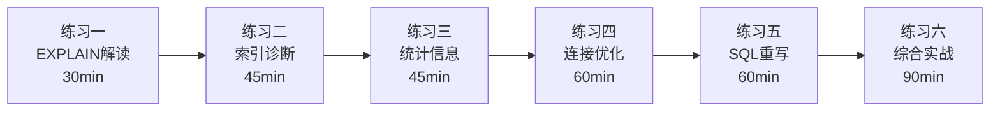
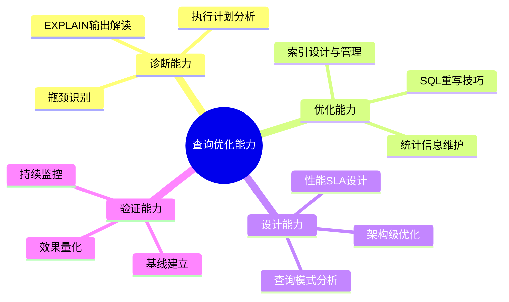

# 查询优化练习方法

查询优化是一项"知道"和"做到"之间存在巨大鸿沟的知识技能。你可以理解代价模型、连接算法、统计信息的原理，但面对一条实际的慢查询时仍然无从下手——因为诊断和优化需要的是反复训练形成的直觉。

本节提供从基础到高级的六个练习方案，每个练习都围绕真实的数据库场景展开，要求读者亲手操作 PostgreSQL 或 MySQL，完成从诊断到优化的完整闭环。所有练习均附带预期输出和验证标准，确保你不仅"做了"，而且"做对了"。



**环境准备**

以下所有练习使用相同的示例数据集。在开始前，请执行以下初始化脚本创建测试环境：

```sql
-- PostgreSQL 环境初始化
-- 创建订单系统模拟数据（约500万行）

-- 用户表（10万用户）
CREATE TABLE users (
    id SERIAL PRIMARY KEY,
    nickname VARCHAR(50) NOT NULL,
    email VARCHAR(100),
    status VARCHAR(20) DEFAULT 'active',
    created_at TIMESTAMP DEFAULT NOW(),
    region VARCHAR(20)
);

-- 订单表（500万行，核心大表）
CREATE TABLE orders (
    id BIGSERIAL PRIMARY KEY,
    user_id INT NOT NULL,
    customer_id INT,
    amount NUMERIC(12,2) NOT NULL,
    status VARCHAR(20) NOT NULL,
    product_category VARCHAR(50),
    created_at TIMESTAMP NOT NULL,
    updated_at TIMESTAMP
);

-- 订单明细表（1000万行）
CREATE TABLE order_items (
    id BIGSERIAL PRIMARY KEY,
    order_id BIGINT NOT NULL,
    product_id INT NOT NULL,
    quantity INT NOT NULL,
    price NUMERIC(10,2) NOT NULL
);

-- 产品表（5万产品）
CREATE TABLE products (
    id SERIAL PRIMARY KEY,
    name VARCHAR(200) NOT NULL,
    category VARCHAR(50),
    price NUMERIC(10,2),
    stock INT DEFAULT 0
);

-- 插入模拟数据（使用 generate_series 批量生成）
INSERT INTO users (nickname, email, status, created_at, region)
SELECT
    'user_' || i,
    'user_' || i || '@example.com',
    CASE WHEN random() < 0.9 THEN 'active' ELSE 'inactive' END,
    NOW() - (random() * 365 * 3)::int * INTERVAL '1 day',
    (ARRAY['east', 'west', 'south', 'north', 'central'])[1 + (i % 5)]
FROM generate_series(1, 100000) AS i;

INSERT INTO orders (user_id, customer_id, amount, status, product_category, created_at, updated_at)
SELECT
    (random() * 99999 + 1)::int,
    (random() * 99999 + 1)::int,
    (random() * 10000)::numeric(12,2),
    (ARRAY['pending', 'paid', 'shipped', 'completed', 'cancelled'])[1 + (random() * 4)::int],
    (ARRAY['electronics', 'clothing', 'food', 'books', 'home'])[1 + (random() * 4)::int],
    NOW() - (random() * 365 * 2)::int * INTERVAL '1 day',
    NOW() - (random() * 30)::int * INTERVAL '1 day'
FROM generate_series(1, 5000000) AS i;

INSERT INTO order_items (order_id, product_id, quantity, price)
SELECT
    (random() * 4999999 + 1)::bigint,
    (random() * 49999 + 1)::int,
    (random() * 5 + 1)::int,
    (random() * 500 + 1)::numeric(10,2)
FROM generate_series(1, 10000000) AS i;

INSERT INTO products (name, category, price, stock)
SELECT
    'Product_' || i,
    (ARRAY['electronics', 'clothing', 'food', 'books', 'home'])[1 + (i % 5)],
    (random() * 1000)::numeric(10,2),
    (random() * 1000)::int
FROM generate_series(1, 50000) AS i;

-- 初始：不创建任何业务索引，模拟"缺少索引"的场景
-- 仅保留主键索引

-- 收集初始统计信息
ANALYZE;
```

---

## 练习一：EXPLAIN 执行计划解读（预计30分钟）

### 目标

能够独立阅读 EXPLAIN 输出，识别全表扫描、索引扫描、排序、临时表等关键信息，并判断执行计划的性能好坏。

### 步骤

**1.1 观察全表扫描（10分钟）**

执行以下查询并解读 EXPLAIN 输出：

```sql
-- 查询：某用户的订单列表
EXPLAIN (ANALYZE, BUFFERS, FORMAT TEXT)
SELECT id, amount, status, created_at
FROM orders
WHERE user_id = 10086
  AND status = 'pending'
ORDER BY created_at DESC
LIMIT 20;
```

阅读输出时，重点关注以下字段：

| 字段 | 关注点 | 含义 |
|------|--------|------|
| Seq Scan | 是否出现顺序扫描 | 出现 = 可能缺少索引 |
| Filter | 过滤条件及过滤比例 | 过滤比例极低 = 大量无用IO |
| Rows | 估算行数 vs 实际行数 | 偏差 > 10倍 = 统计信息过期 |
| Sort Method | 排序方式 | external merge = 内存不足用磁盘 |
| actual time | 实际执行时间 | 首行时间/总时间 |
| Buffers | 缓冲区命中/读取 | shared hit/read 的比例 |
| Loop | 执行次数 | 非1的循环次数需警惕 |

预期输出（初始状态，无索引）大致如下：

Sort  (cost=87654.32..87654.37 rows=20) (actual time=2341.234..2341.245 rows=20 loops=1)
  Sort Key: created_at DESC
  Sort Method: top-N heapsort  Memory: 25kB
  ->  Seq Scan on orders  (cost=0.00..87654.00 rows=5000) (actual time=0.023..2289.456 rows=4987 loops=1)
        Filter: ((user_id = 10086) AND (status = 'pending'))
        Rows Removed by Filter: 4995013
        Buffers: shared hit=128 read=389120
Planning Time: 0.089 ms
Execution Time: 2341.312 ms

**关键解读：**
- `Seq Scan` = 全表扫描500万行，没有索引可用
- `Rows Removed by Filter: 4995013` = 过滤掉了99.9%的数据，实际只匹配4987行
- `Buffers: read=389120` = 读了约3GB数据（389120 × 8KB），只为返回20行
- `Execution Time: 2341ms` = 2.3秒，对一个列表页接口完全不可接受

**1.2 理解 EXPLAIN 输出层级（10分钟）**

执行一个多表连接查询，练习阅读嵌套的执行计划：

```sql
EXPLAIN (ANALYZE, BUFFERS, FORMAT TEXT)
SELECT u.nickname, o.amount, p.name
FROM users u
JOIN orders o ON u.id = o.user_id
JOIN order_items oi ON o.id = oi.order_id
JOIN products p ON oi.product_id = p.id
WHERE o.status = 'completed'
  AND o.created_at > '2025-06-01'
LIMIT 50;
```

解读要点：
- 执行计划是**自底向上**读的：最内层节点先执行
- 每个节点输出的 `rows` 是该节点的输出行数
- `Buffers` 仅统计该节点的IO，不包含子节点
- 关注 `actual time` 的第一个数字（首行返回时间）——它反映用户体验延迟

**1.3 使用 FORMAT JSON 获取结构化输出（10分钟）**

```sql
-- JSON格式输出包含更多信息（如JIT编译、WAL记录等）
EXPLAIN (ANALYZE, BUFFERS, FORMAT JSON)
SELECT user_id, COUNT(*), SUM(amount)
FROM orders
WHERE status = 'paid'
GROUP BY user_id
HAVING COUNT(*) > 10
ORDER BY SUM(amount) DESC
LIMIT 100;
```

观察 JSON 输出中每个 Plan 节点的字段：
- `Node Type`：操作类型（Seq Scan / HashAggregate / Sort 等）
- `Startup Cost` / `Total Cost`：优化器的代价估算
- `Plan Rows`：估算行数
- `Actual Rows`：实际行数
- `Shared Hit Blocks` / `Shared Read Blocks`：缓冲区使用

### 检查标准

- [ ] 能够说出 Seq Scan / Index Scan / Index Only Scan 的区别
- [ ] 能从 Filter 条件中判断缺少哪种索引
- [ ] 能对比 Plan Rows 和 Actual Rows 判断统计信息准确性
- [ ] 能识别 Sort Method 是否涉及磁盘排序
- [ ] 能读懂嵌套连接的执行顺序

---

## 练习二：索引诊断与创建（预计45分钟）

### 目标

根据 EXPLAIN 分析结果，设计合适的索引，创建后验证性能提升，并理解复合索引的列顺序原则。

### 步骤

**2.1 基于练习一的分析创建索引（15分钟）**

```sql
-- 问题查询回顾：
-- SELECT id, amount, status, created_at FROM orders
-- WHERE user_id = 10086 AND status = 'pending'
-- ORDER BY created_at DESC LIMIT 20;

-- 分析：WHERE条件使用 user_id + status，ORDER BY 使用 created_at DESC
-- 复合索引列顺序：等值条件列在前，范围/排序列在后
CREATE INDEX idx_orders_user_status_created
ON orders (user_id, status, created_at DESC);

-- 重新收集统计信息
ANALYZE orders;
```

验证索引效果：

```sql
-- 同一个查询，对比优化前后
EXPLAIN (ANALYZE, BUFFERS, FORMAT TEXT)
SELECT id, amount, status, created_at
FROM orders
WHERE user_id = 10086
  AND status = 'pending'
ORDER BY created_at DESC
LIMIT 20;
```

预期改进：
- `Index Scan` 替代 `Seq Scan`
- 扫描行数从500万降至几十行
- `Buffers: shared read` 从38万降到个位数
- 执行时间从2300ms降到 < 5ms

**2.2 理解复合索引的列顺序（15分钟）**

依次尝试以下索引设计，观察对不同查询的影响：

```sql
-- 方案A：user_id, status, created_at（等值+等值+排序）
CREATE INDEX idx_a ON orders (user_id, status, created_at DESC);

-- 方案B：status, user_id, created_at（调换前两列顺序）
CREATE INDEX idx_b ON orders (status, user_id, created_at DESC);

-- 方案C：created_at, user_id, status（排序列在前）
CREATE INDEX idx_c ON orders (created_at DESC, user_id, status);
```

分别执行以下查询，观察优化器选择了哪个索引（或全表扫描）：

```sql
-- 查询1：等值 + 等值 + 排序
EXPLAIN SELECT * FROM orders
WHERE user_id = 10086 AND status = 'pending'
ORDER BY created_at DESC LIMIT 20;

-- 查询2：仅按 user_id 查
EXPLAIN SELECT * FROM orders WHERE user_id = 10086;

-- 查询3：仅按 status 查
EXPLAIN SELECT * FROM orders WHERE status = 'pending';

-- 查询4：范围查询 + 排序
EXPLAIN SELECT * FROM orders
WHERE user_id = 10086 AND created_at > '2025-06-01'
ORDER BY created_at DESC;
```

总结规律：

| 索引方案 | 查询1 | 查询2 | 查询3 | 查询4 |
|---------|-------|-------|-------|-------|
| A: user_id, status, created_at | ✅ 完美利用 | ✅ 部分利用 | ❌ 无法利用 | ✅ 部分利用 |
| B: status, user_id, created_at | ✅ 可用 | ❌ 不高效 | ✅ 部分利用 | ❌ 不高效 |
| C: created_at, user_id, status | ❌ 不高效 | ❌ 无法利用 | ❌ 不高效 | ✅ 完美利用 |

规律：**等值条件列在前，范围/排序列在后**——这是B-tree复合索引的"最左前缀"原则在实际场景中的体现。

**2.3 分析僵尸索引（15分钟）**

```sql
-- 查找从未被使用的索引
SELECT
    schemaname,
    tablename,
    indexname,
    pg_size_pretty(pg_relation_size(indexrelid)) AS index_size,
    idx_scan AS times_used
FROM pg_stat_user_indexes
WHERE schemaname = 'public'
  AND idx_scan = 0
  AND indexname NOT LIKE '%pkey%'
ORDER BY pg_relation_size(indexrelid) DESC;

-- 查看索引膨胀程度（实际行数 vs 逻辑大小）
SELECT
    indexname,
    pg_size_pretty(pg_relation_size(indexname::regclass)) AS logical_size,
    (SELECT pg_size_pretty(pg_relation_size(indexrelid))
     FROM pg_stat_user_indexes i
     WHERE i.indexrelid = t.indexname::regclass) AS physical_size
FROM (
    SELECT indexname
    FROM pg_indexes
    WHERE tablename = 'orders'
      AND indexname NOT LIKE '%pkey%'
) t;
```

评估是否删除无用索引：

```sql
-- 安全删除确认流程
-- 第一步：确认索引确实未被使用（连续观察7天）
-- 第二步：在测试环境验证删除后无查询报错
-- 第三步：使用 CONCURRENTLY 避免锁表
DROP INDEX CONCURRENTLY idx_unused_example;
```

### 检查标准

- [ ] 创建索引后查询性能提升 > 100倍
- [ ] 能解释为什么方案A的列顺序最适用于查询1
- [ ] 能识别并报告至少2个未使用的索引
- [ ] 能说出 DROP INDEX CONCURRENTLY 与普通 DROP 的区别

---

## 练习三：统计信息与代价估算（预计45分钟）

### 目标

理解统计信息如何影响优化器决策，能够诊断统计信息过期问题，掌握 ANALYZE 和相关参数调整方法。

### 步骤

**3.1 观察统计信息过期的后果（15分钟）**

```sql
-- 第一步：制造统计信息过期的场景
-- 先在 orders 表中大量插入某一种 status 的数据
INSERT INTO orders (user_id, customer_id, amount, status, product_category, created_at)
SELECT
    50000,  -- 集中在同一个用户
    (random() * 99999 + 1)::int,
    (random() * 1000)::numeric(12,2),
    'rare_status',  -- 一个新的、很少见的状态值
    'misc',
    '2025-07-01'::timestamp + random() * INTERVAL '30 days'
FROM generate_series(1, 2000000) AS i;  -- 插入200万行

-- 此时统计信息未更新（因为还没执行 ANALYZE）
-- 优化器基于旧的统计信息做决策

-- 第二步：查看优化器的估算 vs 实际
EXPLAIN (ANALYZE, BUFFERS)
SELECT * FROM orders
WHERE user_id = 50000 AND status = 'rare_status';

-- 观察：
--   rows=???  ← 优化器估算的行数（可能严重偏差）
--   actual rows=???  ← 实际行数（200万）
--   两者的差距就是统计信息过期的直接证据
```

**3.2 查看和解读统计信息（15分钟）**

```sql
-- 查看 orders 表的统计信息
SELECT
    attname,           -- 列名
    n_distinct,        -- 不同值的数量（-1表示精确值，负数表示比例）
    most_common_vals,  -- 最常见的值列表
    most_common_freqs, -- 最常见值的频率
    histogram_bounds,  -- 直方图边界
    correlation        -- 物理排序相关性（0-1，越接近1越有序）
FROM pg_stats
WHERE tablename = 'orders'
  AND schemaname = 'public'
  AND attname IN ('user_id', 'status', 'created_at');

-- 理解 correlation 的含义
-- correlation ≈ 1：数据物理排列与索引逻辑顺序一致（顺序扫描快）
-- correlation ≈ 0：数据随机排列（需要大量随机IO）
```

查看统计信息的最后更新时间：

```sql
-- 检查每张表的 ANALYZE 时间
SELECT
    schemaname,
    relname AS table_name,
    n_live_tup,            -- 活跃行数估算
    n_dead_tup,            -- 死行数
    last_analyze,          -- 上次 ANALYZE 时间
    last_autoanalyze,      -- 上次自动 ANALYZE 时间
    n_mod_since_analyze    -- 自上次 ANALYZE 以来的修改量
FROM pg_stat_user_tables
WHERE relname IN ('orders', 'users', 'order_items', 'products')
ORDER BY relname;
```

**3.3 执行 ANALYZE 并验证（15分钟）**

```sql
-- 手动更新统计信息
ANALYZE orders;

-- 验证统计信息已更新
SELECT last_analyze, n_mod_since_analyze
FROM pg_stat_user_tables
WHERE relname = 'orders';

-- 再次查看统计信息
SELECT attname, n_distinct, most_common_vals, most_common_freqs
FROM pg_stats
WHERE tablename = 'orders' AND attname = 'status';

-- 对比优化器估算
EXPLAIN (ANALYZE, BUFFERS)
SELECT * FROM orders
WHERE user_id = 50000 AND status = 'rare_status';

-- 观察 rows 值是否更接近 actual rows
```

**进阶：调整统计精度**

```sql
-- 默认统计采样 100 个桶（pg_statistic 精度）
-- 对关键列提高精度
ALTER TABLE orders ALTER COLUMN user_id SET STATISTICS 500;
ALTER TABLE orders ALTER COLUMN status SET STATISTICS 500;
ANALYZE orders;

-- 检查不同 STATISTICS 直方图桶数对选择性估计的影响
-- 桶数越高，对数据倾斜的描述越精确，但统计收集时间也更长
```

### 检查标准

- [ ] 能从 pg_stats 中解读直方图边界和频率分布
- [ ] 能判断一张表的统计信息是否过期
- [ ] 执行 ANALYZE 后能验证估算行数的改善
- [ ] 能解释 correlation 对索引扫描性能的影响

---

## 练习四：连接优化（预计60分钟）

### 目标

理解连接顺序、连接算法对查询性能的影响，能够诊断多表连接中的性能问题并选择合适的优化策略。

### 步骤

**4.1 观察连接顺序对性能的影响（20分钟）**

```sql
-- 初始状态：创建必要的索引
CREATE INDEX idx_orders_user ON orders (user_id);
CREATE INDEX idx_order_items_order ON order_items (order_id);
CREATE INDEX idx_products_id ON products (id);

-- 查询：获取某用户的完整订单信息
EXPLAIN (ANALYZE, BUFFERS, FORMAT TEXT)
SELECT
    u.nickname,
    o.id AS order_id,
    o.amount,
    p.name AS product_name,
    oi.quantity
FROM users u
JOIN orders o ON u.id = o.user_id
JOIN order_items oi ON o.id = oi.order_id
JOIN products p ON oi.product_id = p.id
WHERE u.id = 10086;
```

仔细观察执行计划中各表的连接顺序。PostgreSQL 优化器通常会将**过滤后行数最少的表放在最前面**，以此减少后续连接的工作量。

**4.2 对比不同连接算法（20分钟）**

```sql
-- 场景：统计每个用户的总消费金额（大规模聚合）
-- 不同的 JOIN 策略会体现在执行计划中

EXPLAIN (ANALYZE, BUFFERS, FORMAT TEXT)
SELECT
    u.id,
    u.nickname,
    SUM(o.amount) AS total_amount,
    COUNT(o.id) AS order_count
FROM users u
JOIN orders o ON u.id = o.user_id
GROUP BY u.id, u.nickname
ORDER BY total_amount DESC
LIMIT 20;
```

阅读执行计划时识别连接算法：
- `Nested Loop`：外表每行扫描内表，适合小表驱动大表（外表行数少）
- `Hash Join`：一侧建哈希表，另一侧探测，适合无索引的等值连接
- `Merge Join`：两侧有序后线性归并，适合已排序的大表连接

```sql
-- 强制观察不同连接算法的行为（仅供学习，生产环境慎用）
-- PostgreSQL 支持通过 enable_* 参数控制是否使用某算法

-- 禁用 Hash Join，迫使优化器选择 Nested Loop
SET enable_hashjoin = off;
EXPLAIN (ANALYZE, BUFFERS)
SELECT u.id, SUM(o.amount)
FROM users u JOIN orders o ON u.id = o.user_id
GROUP BY u.id;
SET enable_hashjoin = on;  -- 恢复

-- 禁用 Nested Loop，迫使优化器选择 Hash Join
SET enable_nestloop = off;
EXPLAIN (ANALYZE, BUFFERS)
SELECT u.id, SUM(o.amount)
FROM users u JOIN orders o ON u.id = o.user_id
GROUP BY u.id;
SET enable_nestloop = on;  -- 恢复
```

**4.3 诊断并优化低效的多表连接（20分钟）**

```sql
-- 问题查询：查询特定时间段内的订单及其关联数据
-- 这个查询在默认状态下性能很差
EXPLAIN (ANALYZE, BUFFERS, FORMAT TEXT)
SELECT
    u.nickname,
    u.region,
    o.id,
    o.amount,
    o.status,
    oi.quantity,
    p.name AS product_name
FROM users u
JOIN orders o ON u.id = o.user_id
JOIN order_items oi ON o.id = oi.order_id
JOIN products p ON oi.product_id = p.id
WHERE o.created_at BETWEEN '2025-06-01' AND '2025-06-30'
  AND o.status = 'completed'
  AND u.region = 'east';
```

诊断清单：
1. `orders` 表的 `created_at` 条件是否有索引支持？
2. `users` 表的 `region` 条件是否有索引？
3. 连接顺序是否最优（是否先过滤再连接）？
4. 中间结果集是否膨胀过大？

逐步优化：

```sql
-- 优化1：为 orders 的时间范围查询添加索引
CREATE INDEX idx_orders_created_status ON orders (created_at, status);
ANALYZE orders;

-- 优化2：为 users 的 region 过滤添加索引
CREATE INDEX idx_users_region ON users (region);
ANALYZE users;

-- 重新检查执行计划
EXPLAIN (ANALYZE, BUFFERS, FORMAT TEXT)
SELECT
    u.nickname, u.region, o.id, o.amount, o.status,
    oi.quantity, p.name AS product_name
FROM users u
JOIN orders o ON u.id = o.user_id
JOIN order_items oi ON o.id = oi.order_id
JOIN products p ON oi.product_id = p.id
WHERE o.created_at BETWEEN '2025-06-01' AND '2025-06-30'
  AND o.status = 'completed'
  AND u.region = 'east';
```

### 检查标准

- [ ] 能解释执行计划中连接顺序的选择依据
- [ ] 能识别 Nested Loop / Hash Join / Merge Join 的执行计划特征
- [ ] 能通过 enable_* 参数验证不同连接算法的性能差异
- [ ] 能为多表连接查询设计合理的索引组合
- [ ] 优化前后性能对比提升 > 10倍

---

## 练习五：SQL 重写技巧（预计60分钟）

### 目标

掌握常见的 SQL 重写方法——选择下推、投影下推、子查询改写、分页优化——能够用重写手段解决优化器无法自动优化的查询。

### 步骤

**5.1 选择下推实践（15分钟）**

```sql
-- 重写前：WHERE条件在JOIN之后过滤（依赖优化器自动下推）
EXPLAIN (ANALYZE, BUFFERS, FORMAT TEXT)
SELECT o.id, o.amount
FROM orders o
JOIN users u ON o.user_id = u.id
WHERE o.status = 'paid'
  AND u.region = 'east';

-- 重写后：手动将选择条件提前（减少JOIN的数据量）
-- PostgreSQL通常能自动下推，但复杂子查询时不一定
EXPLAIN (ANALYZE, BUFFERS, FORMAT TEXT)
SELECT o.id, o.amount
FROM (
    SELECT id, user_id, amount
    FROM orders
    WHERE status = 'paid'
) o
JOIN users u ON o.user_id = u.id
WHERE u.region = 'east';
```

对比两种写法的执行计划，观察子查询是否被优化器"展开"或"物化"。

**5.2 投影下推实践（10分钟）**

```sql
-- 问题：SELECT * 导致无法使用覆盖索引
-- 重写前
EXPLAIN (ANALYZE, BUFFERS, FORMAT TEXT)
SELECT *
FROM orders
WHERE user_id = 10086
  AND status = 'pending'
ORDER BY created_at DESC
LIMIT 20;

-- 重写后：只选择需要的列
EXPLAIN (ANALYZE, BUFFERS, FORMAT TEXT)
SELECT id, amount, status, created_at
FROM orders
WHERE user_id = 10086
  AND status = 'pending'
ORDER BY created_at DESC
LIMIT 20;
```

如果创建了覆盖索引，投影下推的效果更加明显：

```sql
-- 创建覆盖索引（包含查询需要的所有列）
CREATE INDEX idx_orders_covering
ON orders (user_id, status, created_at DESC)
INCLUDE (amount);

-- 再次测试
EXPLAIN (ANALYZE, BUFFERS, FORMAT TEXT)
SELECT id, amount, status, created_at
FROM orders
WHERE user_id = 10086
  AND status = 'pending'
ORDER BY created_at DESC
LIMIT 20;

-- 预期：Index Only Scan，Buffers 大幅减少
```

**5.3 子查询与 EXISTS 改写（15分钟）**

```sql
-- 场景：查询有订单的活跃用户

-- 写法1：IN子查询
EXPLAIN (ANALYZE, BUFFERS, FORMAT TEXT)
SELECT u.id, u.nickname
FROM users u
WHERE u.status = 'active'
  AND u.id IN (SELECT user_id FROM orders WHERE created_at > '2025-06-01');

-- 写法2：EXISTS子查询
EXPLAIN (ANALYZE, BUFFERS, FORMAT TEXT)
SELECT u.id, u.nickname
FROM users u
WHERE u.status = 'active'
  AND EXISTS (
      SELECT 1 FROM orders o
      WHERE o.user_id = u.id
        AND o.created_at > '2025-06-01'
  );

-- 写法3：JOIN + DISTINCT
EXPLAIN (ANALYZE, BUFFERS, FORMAT TEXT)
SELECT DISTINCT u.id, u.nickname
FROM users u
JOIN orders o ON u.id = o.user_id
WHERE u.status = 'active'
  AND o.created_at > '2025-06-01';
```

对比三种写法的执行计划和性能。EXISTS 在子查询结果集很大时通常最优（短路求值），JOIN + DISTINCT 的 DISTINCT 开销不可忽视。

**5.4 大偏移分页优化（20分钟）**

```sql
-- 确保有排序索引
CREATE INDEX idx_orders_id ON orders (id);

-- 方法1：传统OFFSET分页——第10000页
EXPLAIN (ANALYZE, BUFFERS, FORMAT TEXT)
SELECT id, amount, status, created_at
FROM orders
ORDER BY id
LIMIT 20 OFFSET 199980;  -- 跳过199980行

-- 方法2：游标分页（Keyset Pagination）
-- 假设上一页最后一条的 id = 200000
EXPLAIN (ANALYZE, BUFFERS, FORMAT TEXT)
SELECT id, amount, status, created_at
FROM orders
WHERE id > 200000
ORDER BY id
LIMIT 20;

-- 方法3：延迟关联（Deferred Join）
EXPLAIN (ANALYZE, BUFFERS, FORMAT TEXT)
SELECT o.id, o.amount, o.status, o.created_at
FROM orders o
INNER JOIN (
    SELECT id FROM orders ORDER BY id LIMIT 20 OFFSET 199980
) AS tmp ON o.id = tmp.id;
```

记录三种方法的执行时间和 Buffers 读取量：

| 方法 | 执行时间 | Buffers Read | 说明 |
|------|---------|-------------|------|
| OFFSET | | | 跳过所有偏移行 |
| 游标分页 | | | 直接定位，不跳行 |
| 延迟关联 | | | 子查询走覆盖索引，回表仅20行 |

### 检查标准

- [ ] 能解释选择下推的原理及其在何种场景下收益最大
- [ ] 能通过投影下推减少 IO 读取量
- [ ] 能对比 IN / EXISTS / JOIN+DISTINCT 的性能差异
- [ ] 能实现游标分页替代大偏移分页
- [ ] 所有重写操作都有 EXPLAIN 数据支撑

---

## 练习六：综合优化实战（预计90分钟）

### 目标

模拟一个完整的慢查询优化全流程：从发现问题、诊断根因、设计优化方案、实施优化，到验证效果。这是一个端到端的实战练习。

### 场景

你负责的电商系统有一个"热销商品排行榜"查询，业务需求如下：

> 查询过去30天内，按销售额降序排列的前100个商品，要求显示商品名称、总销售额、总销量、订单数，且只统计已完成的订单。

### 步骤

**6.1 编写查询（10分钟）**

根据需求写出初始SQL：

```sql
-- 你的SQL写在这里
-- 提示：涉及 orders, order_items, products 三张表
-- 需要 JOIN + WHERE + GROUP BY + ORDER BY + LIMIT
```

参考答案：

```sql
SELECT
    p.id AS product_id,
    p.name AS product_name,
    p.category,
    SUM(oi.quantity * oi.price) AS total_revenue,
    SUM(oi.quantity) AS total_quantity,
    COUNT(DISTINCT o.id) AS order_count
FROM orders o
JOIN order_items oi ON o.id = oi.order_id
JOIN products p ON oi.product_id = p.id
WHERE o.status = 'completed'
  AND o.created_at >= NOW() - INTERVAL '30 days'
GROUP BY p.id, p.name, p.category
ORDER BY total_revenue DESC
LIMIT 100;
```

**6.2 基线测试（10分钟）**

```sql
-- 运行5次取中位数作为基线
\timing on
EXPLAIN (ANALYZE, BUFFERS, FORMAT TEXT)
-- 上面的查询
;
-- 记录：执行时间、Buffers Read、使用的索引
```

**6.3 诊断分析（20分钟）**

逐步分析执行计划中的瓶颈：

```sql
-- 问题1：orders 表的过滤
-- created_at 范围查询 + status 等值过滤是否有索引？

-- 问题2：order_items 表的连接
-- order_id 上的索引是否能支持 Join 操作？

-- 问题3：products 表的连接
-- product_id (即 products.id) 的连接是否走索引？

-- 问题4：GROUP BY 和 ORDER BY
-- 是否需要额外的排序操作（filesort / Sort）？

-- 问题5：SUM 和 COUNT 聚合
-- 聚合前的中间结果集有多大？
```

使用以下查询获取统计信息辅助诊断：

```sql
-- 检查各表在30天范围内的数据量
SELECT
    'orders' AS table_name,
    COUNT(*) AS total_rows,
    COUNT(*) FILTER (WHERE created_at >= NOW() - INTERVAL '30 days') AS recent_rows,
    COUNT(*) FILTER (WHERE status = 'completed' AND created_at >= NOW() - INTERVAL '30 days') AS filtered_rows
FROM orders

UNION ALL

SELECT
    'order_items',
    COUNT(*),
    NULL,
    NULL
FROM order_items

UNION ALL

SELECT
    'products',
    COUNT(*),
    NULL,
    NULL
FROM products;
```

**6.4 设计优化方案（20分钟）**

根据诊断结果，制定索引策略和可能的SQL重写：

```sql
-- 索引方案设计
-- 你认为需要哪些索引？列出 CREATE INDEX 语句

-- SQL重写方案
-- 是否需要改写SQL？如何改写？

-- 思考：SUM(oi.quantity * oi.price) 能否利用索引？
-- COUNT(DISTINCT o.id) 的开销如何降低？
```

推荐方案：

```sql
-- 索引1：orders 表的时间范围 + 状态过滤
CREATE INDEX idx_orders_completed_date
ON orders (status, created_at)
WHERE status = 'completed';
-- 注意：PostgreSQL 支持部分索引（WHERE条件索引），MySQL 不支持

-- 索引2：order_items 表的连接列
CREATE INDEX idx_oi_order_product
ON order_items (order_id, product_id, quantity, price);
-- 包含聚合所需列，减少回表

-- 重写：将 SUM 计算下推到子查询，减少 JOIN 后的数据量
```

重写后的查询：

```sql
-- 优化后：先在 order_items 层面聚合，再做 JOIN
EXPLAIN (ANALYZE, BUFFERS, FORMAT TEXT)
SELECT
    p.id AS product_id,
    p.name AS product_name,
    p.category,
    agg.total_revenue,
    agg.total_quantity,
    agg.order_count
FROM (
    SELECT
        oi.product_id,
        SUM(oi.quantity * oi.price) AS total_revenue,
        SUM(oi.quantity) AS total_quantity,
        COUNT(DISTINCT oi.order_id) AS order_count
    FROM order_items oi
    JOIN orders o ON oi.order_id = o.id
    WHERE o.status = 'completed'
      AND o.created_at >= NOW() - INTERVAL '30 days'
    GROUP BY oi.product_id
) agg
JOIN products p ON agg.product_id = p.id
ORDER BY agg.total_revenue DESC
LIMIT 100;
```

**6.5 实施优化（15分钟）**

```sql
-- 执行索引创建
CREATE INDEX idx_orders_completed_date ON orders (status, created_at) WHERE status = 'completed';
CREATE INDEX idx_oi_order_product ON order_items (order_id, product_id, quantity, price);
ANALYZE orders;
ANALYZE order_items;

-- 执行重写后的查询
-- 记录性能数据
```

**6.6 效果验证（15分钟）**

构建对比报告：

慢查询优化报告
====================

查询：热销商品排行榜
表数据量：orders=500万, order_items=1000万, products=5万

优化前：
  执行时间:    ____ms
  Buffers Read: ____
  扫描方式:    ____

优化后：
  执行时间:    ____ms
  Buffers Read: ____
  扫描方式:    ____

性能提升：____x

### 检查标准

- [ ] 能独立写出满足业务需求的SQL
- [ ] 能系统性地诊断执行计划中的瓶颈
- [ ] 能设计合理的索引方案（包括部分索引、覆盖索引）
- [ ] 能通过SQL重写减少中间结果集规模
- [ ] 优化后查询性能提升 > 5倍
- [ ] 能输出完整的优化报告，包含前后对比数据

---

## 练习进阶：持续优化能力培养

完成上述六个练习后，以下建议帮助你持续提升查询优化能力：

**建立个人慢查询库**

在日常工作中遇到的慢查询，按以下模板记录：

```markdown
## 慢查询 #[编号]

**业务场景**：[什么接口/页面触发]
**表规模**：[各表行数]
**原始SQL**：
**问题类型**：[缺失索引/统计过期/SQL写法/连接顺序/数据倾斜]

**诊断过程**：
1. EXPLAIN 输出摘要
2. 瓶颈分析

**优化方案**：
1. 索引变更
2. SQL重写（如有）

**效果**：[优化前] → [优化后]，提升 [N]x
```

**定期回顾与复盘**

- 每周花15分钟回顾本周遇到的查询问题
- 每月统计优化效果最显著的Top 10案例
- 每季度审视所有索引的使用率，清理无用索引

**扩展阅读方向**

| 方向 | 适合场景 | 推荐学习路径 |
|------|---------|------------|
| 分区表设计 | 单表超亿行 | 分区策略 → 分区裁剪 → 分区维护 |
| 物化视图 | 复杂报表查询 | 物化视图设计 → 刷新策略 → 查询路由 |
| 查询重写引擎 | ORM生成低效SQL | SQL解析器 → 重写规则 → 自动优化 |
| 读写分离 | 高并发读场景 | 主从复制 → 读写分离中间件 → 一致性保证 |
| 分库分表 | 垂直/水平拆分 | 拆分策略 → 跨库查询 → 分布式事务 |

---

## 总结



查询优化不是一次性的活动，而是持续迭代的过程。数据库中的数据在增长，查询模式在变化，优化器的决策也会随之调整。养成"先看执行计划，再动手优化"的习惯，比任何具体技巧都重要。

通过这六个练习，你应当已经建立起从诊断到优化的完整工作流。接下来，请在实际项目中实践这些方法——真实的慢查询是最好的老师。
