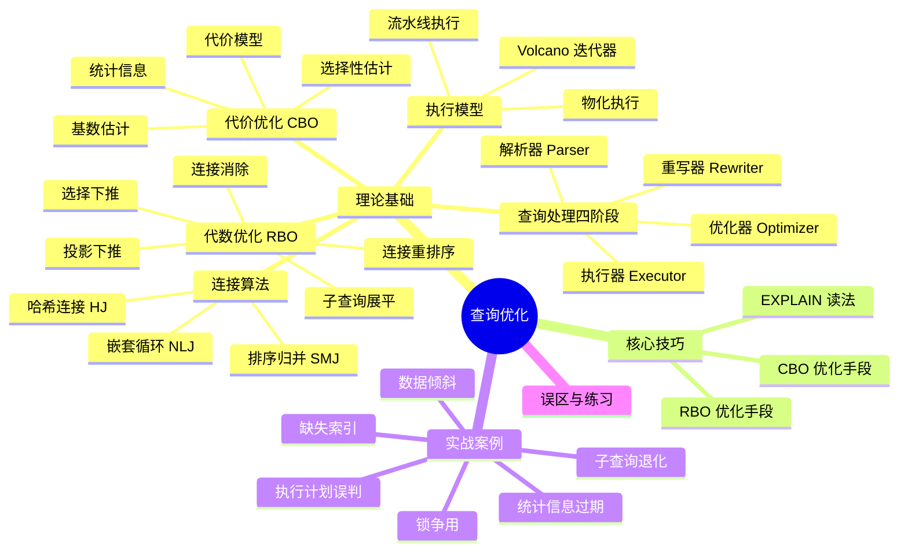

# 第十六章 查询优化 · 本章小结

查询优化是数据库系统中技术深度最深、工程挑战最大的子系统之一。本章从理论根基到生产实践，系统梳理了查询优化的完整技术栈。本节将全章知识体系做一次结构化回顾，帮助读者建立完整的心智模型。

---

## 一、核心知识体系总览



---

## 二、理论基础回顾

### 2.1 查询处理的四阶段流水线

一条 SQL 从文本到结果，经历四个核心阶段：

| 阶段 | 输入 | 输出 | 核心任务 |
|------|------|------|----------|
| 解析（Parsing） | SQL 文本 | 查询树 | 词法分析 → 语法分析 → 语义检查 |
| 重写（Rewriting） | 查询树 | 优化后查询树 | 视图展开、子查询转换、常量折叠、谓词化简 |
| 优化（Optimization） | 优化后查询树 | 物理执行计划 | 逻辑优化（RBO）+ 物理优化（CBO） |
| 执行（Execution） | 物理执行计划 | 结果集 | 调用存储引擎，执行过滤/连接/聚合 |

其中优化阶段是最关键也最复杂的环节——它决定了查询是"秒级响应"还是"超时失败"。

### 2.2 代数优化（RBO）：五条核心规则

代数优化基于关系代数的等价变换，不依赖统计信息，纯靠启发式规则：

| 规则 | 数学表达 | 实际作用 |
|------|----------|----------|
| 选择分解 | σ_{c1∧c2}(R) ≡ σ_{c1}(σ_{c2}(R)) | 分步过滤，每步数据更少 |
| 选择交换 | σ_{c1}(σ_{c2}(R)) ≡ σ_{c2}(σ_{c1}(R)) | 选择性高的先执行 |
| 投影下推 | π_L(σ_c(R)) ≡ σ_c(π_L(R)) | 尽早去除不需要的列，减少 I/O |
| 连接结合 | (R⋈S)⋈T ≡ R⋈(S⋈T) | 为连接重排序提供基础 |
| 连接交换 | R⋈S ≡ S⋈R | 连接顺序可以任意调换 |

**选择下推**是效果最显著的规则——将 `WHERE` 条件尽可能推到数据源附近，大幅减少进入连接操作的数据量。实测中，一条正确的选择下推可以将查询从分钟级降到毫秒级。

### 2.3 代价优化（CBO）：决策三要素

CBO 的核心公式：

总代价 = I/O 代价 + CPU 代价
其中：
  I/O 代价 = 页面读写数 × 单页面 I/O 时间
  CPU 代价 = 处理元组数 × 单元组处理时间

CBO 做出正确决策依赖三个关键组件：

**（1）代价模型**

PostgreSQL 使用无量纲"代价单位"，核心参数：

```sql
seq_page_cost = 1.0            -- 顺序读一页的基准代价
random_page_cost = 4.0         -- 随机读一页的代价（SSD 可设 1.1-1.5）
cpu_tuple_cost = 0.01          -- 处理一个元组的 CPU 代价
cpu_index_tuple_cost = 0.005   -- 处理一个索引条目的 CPU 代价
cpu_operator_cost = 0.0025     -- 每个比较操作的 CPU 代价
```

**（2）统计信息**

| 统计项 | 含义 | 用途 |
|--------|------|------|
| n_tup（行数） | 表的总元组数 | 结果集大小基数 |
| NDV（不同值数） | 列中不同值的数量 | 等值选择性估计 |
| 直方图 | 数据在值域上的分布 | 范围选择性估计 |
| MCV（最常见值） | 出现频率最高的若干值 | 高倾斜列的精确估计 |
| 相关性 | 物理存储顺序与索引键的相关性 | 索引扫描代价估算 |

PostgreSQL 使用 `ANALYZE` 收集统计信息，MySQL 8.0 支持 `ANALYZE TABLE ... UPDATE HISTOGRAM`。

**（3）选择性估计**

选择性是满足条件的元组占总行数的比例。核心方法：

- **等值谓词**：优先查 MCV 列表，其次用均匀分布假设 `(1 - ΣMCV频率) / (NDV - |MCV|)`
- **范围谓词**：用等深直方图 + 线性插值
- **多谓词组合**：独立性假设下 `sel(P1 AND P2) = sel(P1) × sel(P2)`，但实际中相关列会严重偏离

**基数估计的误差传播**是 CBO 面临的最大挑战：每步偏差 2 倍，三表连接后误差可能放大到 8 倍甚至更高。

### 2.4 连接算法：三种武器

| 算法 | 核心思想 | 最佳适用场景 | 时间复杂度 |
|------|----------|--------------|------------|
| 嵌套循环连接（NLJ） | 外表每行扫一遍内表 | 小表驱动大表 + 内表有索引 | O(M × N) |
| 排序归并连接（SMJ） | 两表排序后顺序归并 | 两表已排序或需要排序输出 | O(M log M + N log N) |
| 哈希连接（HJ） | 小表建哈希表，大表探测 | 等值连接 + 内表能放入内存 | O(M + N) |

选择准则：
- 内表能放入内存 → **哈希连接**（通常最优）
- 两表都有索引/已排序 → **排序归并连接**
- 外表极小（< 100 行）+ 内表有索引 → **嵌套循环连接**
- 非等值连接（`>`, `<`, `BETWEEN`）→ 只能用 **嵌套循环连接**

### 2.5 执行模型：物化 vs 流水线

| 模型 | 工作方式 | 优势 | 劣势 |
|------|----------|------|------|
| 物化执行 | 每个操作完成后将结果写入临时存储 | 实现简单，中间结果可复用 | 内存消耗大，延迟高 |
| 流水线执行（Volcano） | 每行数据在操作间即时传递 | 内存消耗小，首行延迟低 | 实现复杂，无法利用多核并行 |

现代数据库通常混合使用：在内存充足时用物化执行加速批量处理，在内存受限时用流水线执行降低峰值内存。

---

## 三、核心技巧回顾

### 3.1 EXPLAIN 读法要点

`EXPLAIN ANALYZE` 是诊断查询性能的第一工具，核心关注：

EXPLAIN ANALYZE 输出的关键字段：
├── 扫描方式：Seq Scan / Index Scan / Index Only Scan / Bitmap Scan
├── 代价估算：cost=启动代价..总代价（无量纲单位）
├── 实际行数：rows（估算）vs actual rows（实际）
├── 执行时间：actual time=首行时间..总时间
└── 过滤信息：Rows Removed by Filter（被过滤掉的行数）

**估算行数 vs 实际行数的偏差**是发现问题的关键信号——偏差越大，说明统计信息越不准确，优化器可能选错了执行计划。

### 3.2 RBO 优化的核心手段

| 优化手段 | 适用场景 | 操作方法 |
|----------|----------|----------|
| 选择下推 | WHERE 条件涉及多表 | 确保谓词尽早过滤数据 |
| 投影下推 | 查询只涉及少数列 | 只读取需要的列，利用索引覆盖扫描 |
| 连接重排序 | 多表连接查询 | 小表/高选择性表先连接 |
| 连接消除 | 外连接但不引用被引用表 | 基于外键约束消除多余 JOIN |
| 子查询展平 | IN/EXISTS 子查询 | 转为 JOIN 让优化器有更多选择 |

### 3.3 CBO 优化的核心手段

| 优化手段 | 适用场景 | 操作方法 |
|----------|----------|----------|
| 统计信息更新 | 查询计划突然变慢 | `ANALYZE` 或 `ANALYZE TABLE` |
| 直方图收集 | 数据分布不均匀 | 指定列收集直方图 |
| Hint 强制 | 优化器选择错误 | 强制指定索引/连接算法/连接顺序 |
| 索引设计 | 频繁查询的列 | 复合索引遵循最左前缀原则 |
| 查询重写 | 优化器无法自动优化 | 手动改写 SQL 结构 |

---

## 四、实战案例知识图谱

本章通过六个生产环境案例，覆盖了最常见的查询性能问题：

| 案例 | 问题根因 | 核心诊断方法 | 解决方案 |
|------|----------|--------------|----------|
| 电商订单查询 | 缺失索引导致全表扫描 | EXPLAIN 发现 Seq Scan + 过滤 5000 万行 | 创建复合索引 `idx_user_status_created` |
| 执行计划误判 | 统计信息过期导致优化器选错计划 | 估算行数与实际行数偏差 > 100 倍 | `ANALYZE` 更新统计信息 |
| 统计信息过期 | 大量 DML 后未更新统计信息 | 查看 `pg_stat_user_tables` 确认最后 ANALYZE 时间 | 设置 autovacuum 阈值或定期 ANALYZE |
| 数据倾斜 | 某些键值的行数远超平均 | 直方图显示严重不均匀 | 分区表 + 针对性索引 |
| 子查询退化 | IN 子查询未被展开为 JOIN | EXPLAIN 显示 Nested Loop 而非 Hash Join | 改写为 JOIN 或使用 Hint |
| 高并发锁争用 | 大事务持有锁时间过长 | `pg_locks` 视图 + `pg_stat_activity` | 缩小事务粒度 + 乐观锁 |

---

## 五、关键公式速查

| 概念 | 公式 | 说明 |
|------|------|------|
| Little 定律 | QPS = 并发数 / 平均延迟 | 吞吐量、并发数、延迟三者关系 |
| 启动代价 | 首行返回前的准备代价 | 排序需扫描全部输入，NLJ 可立即返回 |
| 总代价 | 启动代价 + 处理代价 | 计划选择的主要依据 |
| 等值选择性 | sel(col=val) = MCV频率 或 (1-ΣMCV)/(NDV-\|MCV\|) | MCV 精确，其余均匀假设 |
| 范围选择性 | 直方图桶重叠比例 × 线性插值 | 等深直方图最常用 |
| AND 组合选择性 | sel(P1) × sel(P2) | 独立性假设，相关列会偏离 |
| OR 组合选择性 | sel(P1) + sel(P2) - sel(P1)×sel(P2) | 容斥原理 |
| 连接基数 | \|A⋈B\| ≈ \|A\| × \|B\| × sel(join_cond) | 误差会传播放大 |
| NLJ 代价 | O(外表行数 × 内表单行查找代价) | 有索引时内表查找为 O(log N) |
| 哈希连接代价 | O(\|Build\| + \|Probe\|) | Build 表必须能放入内存 |
| 误差传播 | 三步 2× 误差 → 最终 8× 误差 | 基数估计误差指数级放大 |

---

## 六、PostgreSQL vs MySQL 优化器对比

| 特性 | PostgreSQL | MySQL (InnoDB) |
|------|------------|----------------|
| 优化器类型 | CBO（基于代价） | CBO（8.0+显著增强） |
| 代价模型 | 无量纲代价单位，可配置参数 | 内部代价单位，参数较少 |
| 直方图 | 等深直方图（默认 10000 桶） | 等宽直方图（100 桶，手动触发） |
| 统计信息收集 | autovacuum 自动 + ANALYZE 手动 | InnoDB 自动采样（部分统计） |
| EXPLAIN 格式 | 文本/JSON/YAML/XML | 文本/JSON |
| 并行查询 | 支持（3.0+） | 8.0+ 有限支持 |
| Hint 机制 | 不支持（用 pg_hint_plan 扩展） | 支持 `/*+ ... */` 语法 |
| 自适应优化 | 有限（Partitionwise Join 等） | 8.0+ Hash Join 自适应 |
| 计划缓存 | 不缓存（每次重新生成） | Prepared Statement 缓存计划 |

---

## 七、最佳实践清单

### 7.1 开发阶段

- [ ] 理解 `EXPLAIN ANALYZE` 输出，养成查看执行计划的习惯
- [ ] 为高频查询设计合适的索引（复合索引遵循最左前缀）
- [ ] 避免 `SELECT *`，明确列出需要的列
- [ ] 大表连接前先用 WHERE 过滤数据，利用选择下推
- [ ] IN 子查询中子查询返回大量数据时，改写为 JOIN
- [ ] 避免在索引列上使用函数（如 `WHERE YEAR(created_at) = 2025`）
- [ ] 使用参数化查询避免 SQL 注入和计划缓存污染

### 7.2 运维阶段

- [ ] 定期 `ANALYZE` 或确保 autovacuum 正常运行（PostgreSQL）
- [ ] 监控慢查询日志，设置合理阈值（PostgreSQL: `log_min_duration_statement`，MySQL: `slow_query_log`）
- [ ] 关注 `pg_stat_user_tables` 中的 `n_tup_ins/upd/del` 与最后 ANALYZE 时间
- [ ] 数据量大幅变化后立即 `ANALYZE`
- [ ] 对关键查询保存执行计划基线，定期对比是否退化
- [ ] 根据硬件特征调整代价参数（SSD 环境降低 `random_page_cost`）

### 7.3 优化决策树

查询慢？
├── EXPLAIN 看扫描方式
│   ├── Seq Scan（全表扫描）
│   │   ├── 表很小（< 1万行）→ 正常，Seq Scan 可能更快
│   │   ├── WHERE 条件列无索引 → 添加索引
│   │   └── WHERE 条件列有索引但没用 → 检查选择性/统计信息/函数包裹
│   ├── Index Scan → 代价是否合理？
│   │   ├── 回表代价高 → 考虑覆盖索引
│   │   └── 选择性差 → 索引列区分度不足，考虑复合索引
│   └── Bitmap Scan → 介于两者之间，通常可接受
├── EXPLAIN 看连接方式
│   ├── Nested Loop + 大表驱动 → 换为 Hash Join 或调整连接顺序
│   ├── Hash Join → Build 表是否过大？
│   │   └── 超出 work_mem → 增大 work_mem 或优化查询
│   └── Merge Join → 排序代价是否过高？
├── 估算行数 vs 实际行数偏差大？
│   └── ANALYZE 更新统计信息
└── 以上都正常但仍慢？
    ├── 检查锁争用（pg_locks）
    ├── 检查 I/O 瓶颈（iostat）
    └── 检查连接池/内存配置

---

## 八、常见误区纠正

| 误区 | 正确认识 |
|------|----------|
| "加索引就能解决所有查询性能问题" | 索引不是万能的——选择性低的列加索引可能无效，过多索引增加写入代价 |
| "EXPLAIN 显示的代价越低就一定越快" | 代价是估算值，基于统计信息；统计不准时代价也可能不准 |
| "优化器总是比手动优化更好" | 现代 CBO 大多数情况下更优，但统计信息过期或数据倾斜时可能误判 |
| "ANALYZE 越频繁越好" | 频繁 ANALYZE 在大表上有 I/O 开销，应配合 autovacuum 阈值合理配置 |
| "SQL 写法对性能没影响" | 声明式不代表无影响——子查询写法、JOIN 顺序、谓词位置都影响优化器决策 |
| "PostgreSQL 不需要关心统计信息" | autovacuum 有阈值限制，大量 DML 后可能不会立即触发 ANALYZE |

---

## 九、进阶学习路径

### 9.1 学术方向

| 方向 | 推荐论文/著作 | 核心价值 |
|------|--------------|----------|
| 代价优化基础 | Selinger et al. "Access Path Selection..." (SIGMOD 1979) | System R 优化器，所有现代 CBO 的鼻祖 |
| 执行框架 | Graefe "Volcano..." (TKDE 1994) | 迭代器执行模型，理解 open/next/close 机制 |
| 优化器准确性 | Leis et al. "How Good Are Query Optimizers, Really?" (VLDB 2015) | 实证研究，揭示选择性估计是核心瓶颈 |
| 连接顺序优化 | Dynamic Programming / System R approach | 动态规划搜索 n! 空间的核心算法 |
| AI 优化器 | Marcus et al. "End-to-End..." (2018) / Naru (2019) | 强化学习与归一化流在优化器中的应用 |

### 9.2 工程方向

- **源码阅读**：PostgreSQL `src/backend/optimizer/` 目录是学习查询优化器实现的最佳入口
- **实际项目**：用 `EXPLAIN ANALYZE` 分析生产环境的真实慢查询，建立优化案例库
- **基准测试**：用 TPC-H / TPC-DS 基准测试不同优化配置的效果
- **扩展阅读**：本章前置章节——第十三章关系型数据库架构、第十四章索引实现

### 9.3 推荐资源

| 类别 | 资源 | 特点 |
|------|------|------|
| 经典教材 | 《Database System Concepts》(Silberschatz) | 查询优化章节理论严谨 |
| 实战指南 | 《Use The Index, Luke》(use-the-index-luke.com) | 索引与查询优化的交互式教程 |
| PostgreSQL 官方 | docs PostgreSQL: Routine Vacuuming + Routine Recompliation | autovacuum 与计划缓存机制 |
| MySQL 官方 | MySQL 8.0 Reference: Optimizer Hints | MySQL Hint 语法与使用场景 |
| 工具 | pgBadger / pt-query-digest | 慢查询日志分析工具 |

---

## 十、思考题

1. **理论理解**：为什么说基数估计的误差传播是 CBO 面临的最大挑战？试用一个三表连接的例子说明误差如何从 2 倍放大到 8 倍。

2. **实践诊断**：你发现一条三表连接查询的 EXPLAIN 输出中，估算行数为 100 行但实际返回了 100 万行。请列出可能的原因和排查步骤。

3. **算法选择**：对于一个外表 100 行、内表 5000 万行且内表有索引的连接查询，你会选择哪种连接算法？为什么？如果外表改为 500 万行呢？

4. **索引设计**：以下查询需要创建什么样的索引？考虑最左前缀和覆盖索引：
   ```sql
   SELECT order_id, amount
   FROM orders
   WHERE user_id = ? AND status = 'paid' AND amount > 100
   ORDER BY created_at DESC
   LIMIT 20;
   ```

5. **统计信息**：一张表有 1 亿行数据，其中 `status` 列的值分布为：`completed` 占 85%，`pending` 占 10%，其他占 5%。如果不用 MCV 列表，仅用直方图估算 `WHERE status = 'completed'` 的选择性，可能产生什么问题？

6. **对比分析**：PostgreSQL 和 MySQL 在处理同一个复杂多表连接查询时，优化器的行为会有哪些关键差异？各有什么优势？

7. **优化策略**：一条查询在测试环境（10 万行数据）执行正常，但到生产环境（1 亿行数据）就超时。EXPLAIN 显示执行计划相同。请分析可能的原因和解决方案。

---

> **全章回顾**：本章从查询处理的四阶段流水线出发，系统讲解了代数优化的等价变换规则、基于代价优化的三要素（代价模型、统计信息、选择性估计）、三种连接算法的原理与适用场景、Volcano 执行模型的设计哲学。通过六个生产案例展示了从 EXPLAIN 诊断到方案落地的完整闭环。查询优化不是一劳永逸的工作——统计信息会过期、数据分布会变化、业务需求会增长，需要持续监控、持续调优。掌握本章知识后，你已经具备了独立诊断和优化绝大多数查询性能问题的能力。
