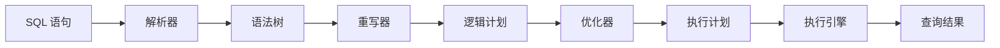

## 技巧1：读懂执行计划——查询优化的第一把钥匙

> 执行计划（Execution Plan）是数据库引擎执行一条 SQL 语句的"蓝图"。看不懂执行计划，就像医生看不懂 CT 片——你可能在做治疗，但完全不知道病灶在哪。

执行计划是查询优化的起点和核心。在所有优化技巧中，读懂执行计划的优先级最高——因为没有它，你只能凭直觉猜；有了它，你才能凭证据决策。本节将带你从零掌握执行计划的阅读方法，让你具备独立诊断慢查询的能力。

---

## 1. 什么是执行计划

### 1.1 基本概念

当你提交一条 SQL 语句时，数据库并不会逐字执行它。相反，数据库会：

1. **解析（Parse）**：检查 SQL 语法，生成语法树
2. **重写（Rewrite）**：将视图、子查询等展开，应用规则优化
3. **优化（Optimize）**：为查询选择最优的执行策略——选择哪个索引、以什么顺序关联表、使用哪种连接算法
4. **执行（Execute）**：按优化后的计划实际读取数据并返回结果

**执行计划就是第 3 步的输出**——它是数据库告诉你"我打算怎么做这件事"的详细说明。



### 1.2 为什么需要看执行计划

执行计划直接揭示了以下几个关键信息：

| 信息 | 意义 | 典型问题 |
|------|------|----------|
| **访问路径** | 数据库用什么方式读取数据 | 应走索引却走了全表扫描 |
| **连接算法** | 表与表之间如何关联 | 大表关联用了嵌套循环 |
| **执行顺序** | 多表查询先处理哪张表 | 驱动表选择不当 |
| **代价估算** | 优化器预估的成本 | 统计信息过期导致误判 |
| **行数预估** | 每一步预估处理多少行 | 预估行数与实际行数偏差大 |
| **实际耗时** | 每一步真实消耗的时间 | 某一步成为瓶颈 |

**核心原则：先看执行计划，再决定优化方向。** 没有执行计划的优化就是盲人摸象。

### 1.3 不同数据库的命令差异

| 数据库 | 命令 | 实际执行 |
|--------|------|----------|
| **PostgreSQL** | `EXPLAIN` / `EXPLAIN ANALYZE` | ANALYZE 模式会真正执行 |
| **MySQL** | `EXPLAIN` / `EXPLAIN ANALYZE`（8.0+） | 传统 EXPLAIN 不执行 |
| **Oracle** | `EXPLAIN PLAN FOR` + 查表 | 需要额外查询结果表 |
| **SQL Server** | `SET STATISTICS IO ON` + 执行 | 边执行边收集统计 |
| **SQLite** | `EXPLAIN QUERY PLAN` | 轻量级计划信息 |

**本文以 PostgreSQL 为主要示例**（其执行计划输出最详细），同时兼顾 MySQL 的差异说明。原理是通用的，掌握 PostgreSQL 后迁移到其他数据库非常容易。

---

## 2. 获取执行计划

### 2.1 PostgreSQL：EXPLAIN 与 EXPLAIN ANALYZE

#### 基础用法

```sql
-- 只看优化器的预估计划（不执行查询）
EXPLAIN SELECT * FROM orders WHERE customer_id = 10086;

-- 真正执行查询，并显示每一步的实际耗时和行数
EXPLAIN ANALYZE SELECT * FROM orders WHERE customer_id = 10086;
```

#### 完整选项

```sql
-- 推荐的生产诊断组合：实际执行 + 缓冲区统计 + 格式化输出
EXPLAIN (ANALYZE, BUFFERS, FORMAT TEXT)
SELECT o.*, c.name
FROM orders o
JOIN customers c ON o.customer_id = c.id
WHERE o.created_at > '2025-01-01';

-- 输出 JSON 格式（便于程序解析）
EXPLAIN (ANALYZE, BUFFERS, FORMAT JSON)
SELECT * FROM orders WHERE customer_id = 10086;
```

各选项的含义：

| 选项 | 作用 | 何时使用 |
|------|------|----------|
| `ANALYZE` | 真正执行查询，显示实际执行时间和行数 | 需要真实性能数据时 |
| `BUFFERS` | 显示缓冲区读写统计（共享块命中/未命中） | 需要判断 I/O 情况时 |
| `FORMAT TEXT` | 纯文本输出（默认） | 人工阅读 |
| `FORMAT JSON` | JSON 格式 | 程序解析、可视化工具 |
| `VERBOSE` | 显示额外信息（排序键、Join 使用的列等） | 深入诊断时 |
| `COSTS` | 显示预估代价（默认开启） | 对比预估与实际时 |
| `TIMING` | 显示实际耗时（默认开启） | 性能诊断 |
| `SUMMARY` | 显示总耗时摘要 | 快速获取总体信息 |

> **警告：EXPLAIN ANALYZE 会真正执行查询。** 如果查询会修改数据（INSERT/UPDATE/DELETE），请用 `BEGIN; EXPLAIN ANALYZE ...; ROLLBACK;` 包裹，执行后回滚。

#### 实战示例：读懂输出

假设有一张 `orders` 表（约 1000 万行），执行：

```sql
EXPLAIN ANALYZE
SELECT customer_id, COUNT(*), SUM(amount)
FROM orders
WHERE created_at >= '2025-01-01'
GROUP BY customer_id
HAVING COUNT(*) > 10;
```

输出大致如下：

Finalize GroupAggregate  (cost=89234.56..89240.12 rows=3 width=20)
                          (actual time=1245.678..1245.890 rows=156 rows=1)
  Group Key: customer_id
  Filter: (count(*) > 10)
  ->  Sort  (cost=89234.56..89235.31 rows=3 width=20)
             (actual time=1245.650..1245.700 rows=468 rows=1)
        Sort Key: customer_id
        ->  Partial HashAggregate  (cost=89230.00..89233.48 rows=3 width=20)
                                   (actual time=1244.123..1244.890 rows=468 rows=1)
              Group Key: customer_id
              ->  Index Scan using idx_orders_created on orders
                  (cost=0.43..82000.00 rows=1234567 width=12)
                  (actual time=0.050..1123.456 rows=1234567 rows=1)
                    Index Cond: (created_at >= '2025-01-01')
Planning Time: 0.085 ms
Execution Time: 1246.234 ms

---

## 3. 执行计划的阅读方法

### 3.1 计划的树状结构

执行计划是一棵**倒置的树**——数据从叶子节点（最内层）流出，经过中间节点的处理，最终从根节点（最外层）返回结果。

根节点（最终结果）
  ├── 中间节点2（后处理）
  │     ├── 叶子节点2（数据来源B）
  │     └── 叶子节点3（数据来源C）
  └── 中间节点1（前处理）
        └── 叶子节点1（数据来源A）

**阅读顺序**：从内到外，从下到上。叶子节点先执行，数据逐层向上流动。

### 3.2 缩进规则

节点A
  节点B           <-- 缩进，是节点A的子节点（B先执行，A后处理B的结果）
  节点C           <-- 与B同级，也是A的子节点
节点D             <-- 回到A的层级，与A同级

缩进表示父子关系。同一缩进层级的节点是"兄弟"，它们依次被外层节点调用。

### 3.3 关键字段解读

#### 代价字段（Cost）

(cost=0.43..82000.00 rows=1234567 width=12)

| 字段 | 含义 | 注意事项 |
|------|------|----------|
| `cost=0.43..82000.00` | 启动代价..总代价 | 单位是"代价单元"，非真实时间 |
| `rows=1234567` | 预估输出行数 | 与实际行数偏差大说明统计信息不准 |
| `width=12` | 预估每行的字节数 | 影响内存和 I/O 估算 |

**代价模型（PostgreSQL）**：代价由 CPU 代价和 I/O 代价组成。`seq_page_cost`（顺序页读取代价，默认 1.0）和 `random_page_cost`（随机页读取代价，默认 4.0）是两个核心参数。代价是相对值，不是绝对值。

#### 实际字段（Actual）

(actual time=0.050..1123.456 rows=1234567 rows=1 loops=1)

| 字段 | 含义 | 注意事项 |
|------|------|----------|
| `actual time=0.050..1123.456` | 首行产出时间..最后一行产出时间（毫秒） | 包含子节点的处理时间 |
| `rows=1234567` | 实际输出行数 | 与预估行数对比，差距大需关注 |
| `loops=1` | 该节点被重复执行的次数 | 循环节点中 `loops` 可能 > 1 |

> **关键对比：预估行数 vs 实际行数。** 如果预估行数与实际行数差距超过一个数量级（如预估 100 行但实际 10000 行），说明统计信息可能过期，需要 `ANALYZE` 更新。

#### 缓冲区字段（Buffers）

使用 `EXPLAIN (ANALYZE, BUFFERS)` 时会出现：

Buffers: shared hit=83504 read=1256 dirtied=123 written=45

| 字段 | 含义 | 健康判断 |
|------|------|----------|
| `shared hit` | 命中共享缓冲区（内存中） | 越高越好，说明数据在内存中 |
| `shared read` | 需要从磁盘读取 | 越低越好，说明 I/O 少 |
| `dirtied` | 被修改的缓冲页 | 反映写操作强度 |
| `written` | 刷写到磁盘的页 | 频繁写盘需关注 checkpoint |

**I/O 命中率公式**：`hit_rate = shared hit / (shared hit + shared read)`。低于 99% 时应考虑增加 `shared_buffers`。

---

## 4. 表数据访问方式

### 4.1 全表扫描（Sequential Scan）

Seq Scan on orders  (cost=0.00..245678.90 rows=10000000 width=32)
  Filter: (status = 'pending')

**含义**：从头到尾逐行扫描整张表，没有使用任何索引。

**何时合理**：
- 表很小（几百行以内）
- 查询返回大部分数据（如 > 10% 的总行数）
- 表在内存中（shared_buffers 够大时 Seq Scan 反而更快）

**何时有问题**：
- 大表上仅需少量数据却做了全表扫描
- 是导致慢查询的最常见原因

**解决思路**：创建合适的索引 → 看 Index Scan 是否被优化器选择。

### 4.2 索引扫描（Index Scan）

Index Scan using idx_orders_customer on orders
  (cost=0.43..8456.78 rows=120 width=32)
  Index Cond: (customer_id = 10086)

**含义**：先通过 B-Tree 索引定位到满足条件的索引条目，再回到表中读取完整行数据（回表）。

**适用场景**：
- 需要读取的行较少（索引选择性好）
- 需要返回索引列以外的列

### 4.3 仅索引扫描（Index Only Scan）

Index Only Scan using idx_orders_customer_status on orders
  (cost=0.43..4234.56 rows=120 width=12)
  Index Cond: (customer_id = 10086)

**含义**：所有需要的数据都包含在索引中，无需回表读取堆（Heap）。这是最快的扫描方式。

**前提条件**：查询涉及的所有列都在索引中（覆盖索引）。例如：

```sql
-- 如果索引是 (customer_id, status)，下面这条查询可以走 Index Only Scan
SELECT customer_id, status FROM orders WHERE customer_id = 10086;

-- 这条不行，因为 amount 不在索引中，需要回表
SELECT customer_id, status, amount FROM orders WHERE customer_id = 10086;
```

**创建覆盖索引**：

```sql
CREATE INDEX idx_orders_covering ON orders (customer_id, status, amount);
```

### 4.4 位图索引扫描（Bitmap Index Scan + Bitmap Heap Scan）

Bitmap Heap Scan on orders  (cost=12345.67..45678.90 rows=3000 width=32)
  Recheck Cond: (status = 'active')
  Rows Removed by Filter: 150
  ->  Bitmap Index Scan on idx_orders_status  (cost=0.00..12345.67 rows=3150 width=0)
        Index Cond: (status = 'active')

**含义**：先用索引在内存中构建一个位图（Bitmap），标记所有符合条件的行的位置，然后再按位图去表中批量读取。

**适用场景**：
- 需要读取的行数较多（如几千到几万行），Index Scan 回表代价太高
- 不需要排序（Bitmap Scan 不保证顺序）
- 内存足够放下位图

**两步过程**：
1. `Bitmap Index Scan`：遍历索引，生成行号位图
2. `Bitmap Heap Scan`：根据位图去表中读取实际数据行

如果位图对应的行在磁盘上是分散的，`Recheck Cond` 说明优化器需要在堆上重新验证条件（因为位图存储的是页级粒度的标记）。

### 4.5 访问方式对比

| 访问方式 | 回表 | 适用场景 | 性能特征 |
|----------|------|----------|----------|
| Seq Scan | 无（直接读表） | 小表或返回大部分行 | 线性 I/O，顺序读取快 |
| Index Scan | 是（逐行回表） | 少量行，需要完整列 | 随机 I/O，回表代价高 |
| Index Only Scan | 否 | 查询列全在索引中 | 最快，纯索引读取 |
| Bitmap Scan | 是（批量回表） | 中等行数，不要求顺序 | 批量 I/O，比逐行回表好 |
| TID Scan | 否 | 已知行物理位置 | 极快，但很少用到 |

---

## 5. 连接算法

### 5.1 嵌套循环（Nested Loop）

Nested Loop  (cost=0.43..12345.67 rows=1000 width=64)
  ->  Index Scan on orders  (cost=0.43..4567.89 rows=100 width=32)
  ->  Index Scan on customers  (cost=0.28..8.60 rows=10 width=32)
        Index Cond: (id = orders.customer_id)

**原理**：外表每取一行，用该行的关联值去内表查一次索引。类似于嵌套 for 循环。

for each row in outer_table:
    look up matching rows in inner_table (using index)

**适用场景**：
- 外表行数少（如 < 1000 行）
- 内表有高效索引
- 总体执行次数 = 外表行数 × 每次内表查找代价

**风险**：如果外表行数很多且内表没有索引，总代价 = 外表行数 × 内表行数，即 N×M 次扫描，极其缓慢。

### 5.2 哈希连接（Hash Join）

Hash Join  (cost=23456.78..89012.34 rows=50000 width=64)
  Hash Cond: (o.customer_id = c.id)
  ->  Seq Scan on orders o  (cost=0.00..245678.90 rows=10000000 width=32)
  ->  Hash  (cost=1234.56..1234.56 rows=50000 width=32)
        ->  Seq Scan on customers c  (cost=0.00..1234.56 rows=50000 width=32)

**原理**：对内表建立哈希表（将关联列的值作为 key），然后扫描外表，对每一行计算哈希值并查找匹配。

phase 1 (Build):   对内表建哈希表
phase 2 (Probe):   扫描外表，逐行查哈希表

**适用场景**：
- 两张表都较大
- 无需排序
- 等值连接（`=` 条件）
- 这是大数据量连接的最常用算法

**内存控制**：当内表太大无法放入内存时，会使用**混合哈希连接（Hybrid Hash Join）**——将内表分批处理，先处理能放入内存的部分，剩余部分使用分区写盘再读入。

### 5.3 合并连接（Merge Join）

Merge Join  (cost=12345.67..67890.12 rows=50000 width=64)
  Merge Cond: (o.customer_id = c.id)
  ->  Sort  (cost=12345.67..12567.89 rows=10000000 width=32)
        Sort Key: o.customer_id
        ->  Seq Scan on orders o  (cost=0.00..245678.90 rows=10000000 width=32)
  ->  Sort  (cost=1234.56..1256.78 rows=50000 width=32)
        Sort Key: c.id
        ->  Seq Scan on customers c  (cost=0.00..1234.56 rows=50000 width=32)

**原理**：两边先按关联列排序，然后像拉链一样合并——两边游标同步推进，相同值的行匹配。

**适用场景**：
- 两边都已排序（有索引或预先 Sort）
- 需要输出结果有序
- 大数据量连接

**性能关键**：如果两边需要先排序（Seq Scan + Sort），排序代价可能很高。如果两边关联列上已有索引，则可以直接使用索引顺序，跳过排序步骤。

### 5.4 连接算法选择指南

| 条件 | 推荐算法 | 原因 |
|------|----------|------|
| 内外表都很小 | Nested Loop | 无需建哈希表的额外开销 |
| 外表小、内表有索引 | Nested Loop | 每次查找代价低 |
| 两张大表等值连接 | Hash Join | 线性扫描 + 哈希查找，总代价最低 |
| 已排序或需要排序输出 | Merge Join | 利用已排序数据，避免重复排序 |
| 内表太大放不进内存 | Hash Join（分区） | 自动使用分区策略 |
| 非等值连接（<, >, BETWEEN） | Nested Loop 或 Merge Join | Hash 只支持等值连接 |

---

## 6. 其他常见执行计划节点

### 6.1 排序（Sort）

Sort  (cost=5678.90..5789.01 rows=50000 width=32)
  Sort Key: created_at DESC
  Sort Method: quicksort  Memory: 5344kB

**排序方式**：

| 排序方法 | 条件 | 性能 |
|----------|------|------------|
| `quicksort` | 数据能放入 `work_mem` | 快（内存中排序） |
| `external merge` | 数据超出 `work_mem`，但临时文件不多 | 较慢（涉及磁盘 I/O） |
| `Top-N heapsort` | 只需 Top N 行 | 只维护 N 行堆，高效 |
| `disk-based merge` | 数据远超 `work_mem` | 最慢（大量磁盘 I/O） |

**优化思路**：
- 增大 `work_mem` 让排序在内存中完成
- 创建索引避免排序（ORDER BY 列上有索引时，优化器可能选择 Index Scan 天然有序，跳过 Sort 节点）

### 6.2 聚合（Aggregate）

HashAggregate  (cost=4567.89..4678.90 rows=500 width=16)
  Group Key: category
  Batches: 1  Memory Usage: 48kB

两种聚合方式：

| 方式 | 特点 | 适用场景 |
|------|------|----------|
| `HashAggregate` | 先哈希分组，再聚合 | GROUP BY 列值较多 |
| `GroupAggregate` | 先排序，再逐组聚合 | 已排序的数据或 GROUP BY 列值较少 |

### 6.3 LIMIT 与 Top-N

Limit  (cost=1234.56..1234.67 rows=10 width=32)
  ->  Index Scan using idx_orders_created on orders
        (cost=0.43..45678.90 rows=5000 width=32)
        Index Cond: (created_at >= '2025-01-01')

当看到 `Limit` 包裹时，说明优化器做了优化——只取前 N 行就停止扫描，不会处理全部数据。这配合索引效果极好。

**经典反模式**：

```sql
-- ❌ 不好：先排序全部数据，再 LIMIT
SELECT * FROM orders ORDER BY created_at DESC LIMIT 10;

-- ✅ 如果有索引 (created_at DESC)，优化器会自动选择高效路径
CREATE INDEX idx_orders_created ON orders (created_at DESC);
SELECT * FROM orders ORDER BY created_at DESC LIMIT 10;
```

### 6.4 子查询展开

Nested Loop  (cost=0.43..12345.67 rows=100 width=64)
  ->  Index Scan on orders o  (cost=0.43..4567.89 rows=100 width=32)
  ->  Index Scan on customers c  (cost=0.28..8.60 rows=1 width=32)
        Filter: (c.id = o.customer_id)

子查询被"展开"（flattened/unnested）后，优化器将子查询转化为连接操作，这样就能选择最优的连接算法。如果子查询没有被展开，可能意味着需要改写 SQL 或调整数据库版本。

---

## 7. 常见问题诊断与修复

### 7.1 全表扫描问题

**症状**：大表上出现 Seq Scan

Seq Scan on orders  (cost=0.00..245678.90 rows=10000000 width=32)
  Filter: (customer_id = 10086)
  Rows Removed by Filter: 9999900

`Rows Removed by Filter` 是关键指标——扫描了 1000 万行才找到 100 行。

**修复**：

```sql
-- 创建针对性索引
CREATE INDEX idx_orders_customer ON orders (customer_id);

-- 检查索引是否被使用
EXPLAIN SELECT * FROM orders WHERE customer_id = 10086;
-- 应该变成 Index Scan
```

**如果索引存在但仍走 Seq Scan**：
- 统计信息过期 → `ANALYZE orders;`
- 查询条件类型不匹配 → 检查隐式类型转换
- 数据分布问题 → 超过阈值后优化器认为 Seq Scan 更优（这是正常的）

### 7.2 预估行数与实际行数偏差

Index Scan on orders  (cost=0.43..8456.78 rows=120 width=32)
                        (actual time=0.050..890.123 rows=89000 width=32)

预估 120 行，实际 89000 行——偏差 741 倍。这会导致后续节点的执行策略选择错误。

**原因排查**：

| 可能原因 | 检查方法 | 解决方案 |
|----------|----------|----------|
| 统计信息过期 | 检查 `last_analyze` 时间 | `ANALYZE table;` |
| 数据倾斜 | `SELECT col, COUNT(*) FROM table GROUP BY col ORDER BY 2 DESC;` | 使用部分索引或表达式索引 |
| 参数嗅探 | 相同查询不同参数差异大 | 使用 `pg_stat_statements` 分析 |
| NULL 值多 | 检查列的 NULL 比例 | 在统计分析中调整 |

**PostgreSQL 特定优化**：

```sql
-- 增加统计精度（默认 100，最大 10000）
ALTER TABLE orders ALTER COLUMN customer_id SET STATISTICS 1000;
ANALYZE orders;

-- 对长尾分布的列使用 MCV 统计
ALTER TABLE orders ALTER COLUMN status SET STATISTICS 1000;
ANALYZE orders;
```

### 7.3 连接顺序不当

**症状**：小表做内层（被多次遍历），大表做外层（每行都要驱动一次）

**优化方向**：
- 使用 `JOIN` 代替子查询，让优化器有更多选择
- 确保 `join_collapse_limit` 和 `from_collapse_limit` 参数允许优化器调整连接顺序
- 对于复杂查询，可以手动调整表的 JOIN 顺序作为提示

### 7.4 排序溢出到磁盘

Sort  (cost=12345.67..12567.89 rows=5000000 width=32)
  Sort Method: external merge  Disk: 123456kB

`Disk: 123456kB` 表示排序数据溢出到磁盘，性能大幅下降。

**解决方案**：

```sql
-- 临时增加 work_mem（仅当前会话）
SET work_mem = '256MB';

-- 重新执行查询，检查是否变为内存排序
EXPLAIN ANALYZE SELECT * FROM orders ORDER BY created_at;

-- 确认恢复默认值
RESET work_mem;
```

### 7.5 函数导致索引失效

-- ❌ 函数调用导致索引不被使用
Seq Scan on orders  (cost=0.00..245678.90 rows=1000 width=32)
  Filter: (lower(email) = 'test@example.com')

-- ✅ 创建表达式索引
CREATE INDEX idx_orders_email_lower ON orders (lower(email));

-- ✅ 或者改写查询避免函数
SELECT * FROM orders WHERE email = 'Test@Example.com';

---

## 8. 进阶技巧

### 8.1 使用 pg_stat_statements 持续监控

```sql
-- 安装扩展
CREATE EXTENSION pg_stat_statements;

-- 查找最耗时的查询 Top 10
SELECT
    calls,
    round(total_exec_time::numeric, 2) AS total_ms,
    round(mean_exec_time::numeric, 2) AS avg_ms,
    round((100 * total_exec_time / sum(total_exec_time) OVER())::numeric, 2) AS pct,
    substring(query, 1, 80) AS short_query
FROM pg_stat_statements
ORDER BY total_exec_time DESC
LIMIT 10;
```

### 8.2 EXPLAIN 输出的可视化工具

| 工具 | 类型 | 适用数据库 | 特点 |
|------|------|-----------|------|
| [explain.dalibo.com](https://explain.dalibo.com/) | 在线 | PostgreSQL | 免费、支持 JSON 格式粘贴 |
| [EXPLAIN Visualizer](https://tatiyants.com/postgres-query-plan-visualizer/) | 在线 | PostgreSQL | 可视化树状图 |
| MySQL Workbench | 桌面 | MySQL | 内置 EXPLAIN 可视化 |
| pgAdmin | 桌面 | PostgreSQL | 支持 EXPLAIN 视图 |
| DataGrip | 桌面 | 多种 | 内置计划分析 |

**使用方式**：执行 `EXPLAIN (ANALYZE, BUFFERS, FORMAT JSON)` 获取 JSON，粘贴到在线工具即可看到可视化图。

### 8.3 执行计划对比：优化前 vs 优化后

使用 PostgreSQL 的 `EXPLAIN (ANALYZE, FORMAT JSON)` 输出可以程序化地对比：

```python
import json
import subprocess

def get_plan(sql):
    cmd = ["psql", "-d", "mydb", "-c",
           f"EXPLAIN (ANALYZE, BUFFERS, FORMAT JSON) {sql}"]
    result = subprocess.run(cmd, capture_output=True, text=True)
    return json.loads(result.stdout)[0]

# 对比优化前后的执行计划
plan_before = get_plan("SELECT * FROM orders WHERE customer_id = 10086")
plan_after  = get_plan("CREATE INDEX idx ON orders(customer_id);"
                        "ANALYZE orders;")
plan_after  = get_plan("SELECT * FROM orders WHERE customer_id = 10086")

# 关键指标对比
def summary(plan):
    node = plan["Plan"]
    return {
        "total_cost": node["Total Cost"],
        "total_time": plan["Total Runtime"],
        "planning_time": plan["Planning Time"],
    }

print("优化前:", summary(plan_before))
print("优化后:", summary(plan_after))
```

### 8.4 优化器参数调优

以下是 PostgreSQL 中影响执行计划的关键参数：

```sql
-- 顺序扫描 vs 随机扫描的代价比（默认 4.0）
-- 如果使用 SSD，可以降低到 1.5-2.0
SET random_page_cost = 1.5;

-- 估算的有效缓存大小（设为实际可用内存）
SET effective_cache_size = '8GB';

-- 工作内存（每个排序/哈希操作可用的内存）
-- 注意：这是 per-operation 的，不是 per-query
SET work_mem = '64MB';

-- 并行查询 worker 数量
SET max_parallel_workers_per_gather = 4;

-- 启用并行查询
SET parallel_setup_cost = 1000;
SET parallel_tuple_cost = 0.01;
```

> **注意**：`work_mem` 的设置需要谨慎。如果一条查询有 10 个排序节点，每个节点独立使用 `work_mem`，则可能消耗 `10 × 64MB = 640MB` 内存。在连接数多的服务器上，过高的 `work_mem` 可能导致 OOM。

### 8.5 触发器和函数对计划的影响

```sql
-- 触发器不会出现在 EXPLAIN 输出中，但会增加实际执行时间
-- 如果 EXPLAIN 显示执行很快但实际很慢，检查触发器

-- 同样，PL/pgSQL 函数内的查询有自己的执行计划
-- 需要在函数内单独 EXPLAIN，而不是对调用函数的外层查询 EXPLAIN

-- 检查触发器的开销：
SELECT
    trigger_name,
    event_manipulation,
    action_timing
FROM information_schema.triggers
WHERE event_object_table = 'orders';
```

---

## 9. 执行计划阅读清单（速查表）

当你拿到一个执行计划时，按以下顺序逐项检查：

□ 1. 有没有全表扫描（Seq Scan）？对大表来说是否合理？
□ 2. 索引扫描（Index Scan）是否真的在使用索引？Index Cond 是否匹配？
□ 3. 预估行数 vs 实际行数——偏差是否超过 10 倍？
□ 4. 连接算法是否合适？大表连接是否用了 Hash Join？
□ 5. 有没有排序（Sort）溢出到磁盘？能否用索引消除排序？
□ 6. 缓冲区统计——read 数是否过高？I/O 命中率是否 > 99%？
□ 7. 总执行时间是否达标？哪一步占比最大？
□ 8. 是否有不必要的子查询未被展开？
□ 9. 函数调用是否导致索引失效？
□ 10. 统计信息是否过期？（pg_stat_user_tables.last_analyze）

---

## 10. 常见误区

### 误区1：代价（Cost）高的执行就一定慢

代价是优化器的相对估算值，不是实际时间。两个计划即使总代价相同，实际性能也可能天差地别——因为代价模型假设 I/O 代价恒定，但实际 I/O 性能受缓存、并发、硬件影响很大。**永远以 EXPLAIN ANALYZE 的实际时间为准。**

### 误区2：Index Scan 一定比 Seq Scan 快

对于大范围扫描（如返回 > 5% 的总行数），Seq Scan 因为顺序 I/O 可能比 Index Scan 的随机 I/O 更快。优化器会根据代价模型自动选择，不要强制所有查询都走索引。

### 误区3：work_mem 越大越好

过高的 `work_mem` 在高并发下会导致内存溢出。而且只对需要排序/哈希的查询有效——对纯索引扫描的查询毫无帮助。建议根据并发数合理设置，而非盲目增大。

### 误区4：只看 EXPLAIN 不看 ANALYZE

EXPLAIN 仅显示预估计划，EXPLAIN ANALYZE 显示真实执行数据。预估行数偏差大时，EXPLAIN 的结论不可靠。**生产诊断必须用 ANALYZE。**

### 误区5：忽视 Planning Time

Planning Time 过长（> 几十毫秒）通常说明查询过于复杂（大量 JOIN、子查询），优化器在枚举计划空间时消耗了太多时间。对于 OLTP 系统中高频率执行的查询，Planning Time 也值得关注。

---

## 11. 实战演练

### 练习1：诊断一个慢查询

```sql
-- 创建测试表和数据
CREATE TABLE slow_test (
    id SERIAL PRIMARY KEY,
    category TEXT,
    status TEXT,
    amount NUMERIC,
    created_at TIMESTAMPTZ DEFAULT now()
);

-- 插入 500 万行测试数据
INSERT INTO slow_test (category, status, amount, created_at)
SELECT
    'cat_' || (random() * 100)::int,
    CASE WHEN random() > 0.1 THEN 'active' ELSE 'inactive' END,
    random() * 1000,
    now() - (random() * 365 * 2)::int * interval '1 day'
FROM generate_series(1, 5000000);

ANALYZE slow_test;

-- 问题查询：找出每个分类中活跃用户的平均消费金额
EXPLAIN (ANALYZE, BUFFERS)
SELECT category, AVG(amount)
FROM slow_test
WHERE status = 'active'
GROUP BY category
ORDER BY 2 DESC;
```

**诊断步骤**：
1. 观察是否有 Seq Scan → 评估是否需要索引
2. 观察 GROUP BY 是 HashAggregate 还是 GroupAggregate → 判断是否需要 work_mem 调优
3. 检查预估 vs 实�行数 → 判断统计信息是否准确
4. 检查 Buffers → 判断 I/O 是否是瓶颈

**可能的优化**：

```sql
-- 创建覆盖索引
CREATE INDEX idx_slow_test_covering ON slow_test (status, category, amount);
ANALYZE slow_test;

-- 重新执行，对比执行计划变化
EXPLAIN (ANALYZE, BUFFERS)
SELECT category, AVG(amount)
FROM slow_test
WHERE status = 'active'
GROUP BY category
ORDER BY 2 DESC;
```

### 练习2：对比不同 JOIN 策略

```sql
-- 建表
CREATE TABLE departments (id INT PRIMARY KEY, name TEXT, head_count INT);
CREATE TABLE employees (
    id SERIAL PRIMARY KEY,
    dept_id INT,
    salary NUMERIC,
    name TEXT
);

INSERT INTO departments VALUES
    (1, 'Engineering', 500), (2, 'Marketing', 200),
    (3, 'Sales', 300), (4, 'HR', 50);

INSERT INTO employees (dept_id, salary, name)
SELECT
    (random() * 3 + 1)::int,
    random() * 200000,
    'emp_' || seq
FROM generate_series(1, 50000) seq;

ANALYZE employees;
ANALYZE departments;

-- 连接查询：查看优化器选择的 JOIN 算法
EXPLAIN (ANALYZE, BUFFERS)
SELECT d.name, COUNT(*), AVG(e.salary)
FROM departments d
JOIN employees e ON d.id = e.dept_id
GROUP BY d.name;
```

观察执行计划中使用的连接算法，思考为什么优化器选择了这个算法。

---

## 小结

执行计划是查询优化的基石。掌握它的阅读方法后，你就拥有了"透视"数据库内部行为的能力。核心要点回顾：

1. **先看再改**：所有优化决策都应该基于执行计划，而非直觉
2. **关注差异**：预估行数与实际行数的偏差是诊断问题的黄金指标
3. **从内到外**：树状结构从叶子节点读起，理解数据的流动过程
4. **综合判断**：访问路径、连接算法、排序方式、I/O 情况要综合考虑
5. **持续监控**：使用 `pg_stat_statements` 持续发现慢查询，用 EXPLAIN ANALYZE 深入诊断

下一节我们将在此基础上，深入探讨**索引优化**——如何设计和选择索引来改变执行计划中的访问路径。
