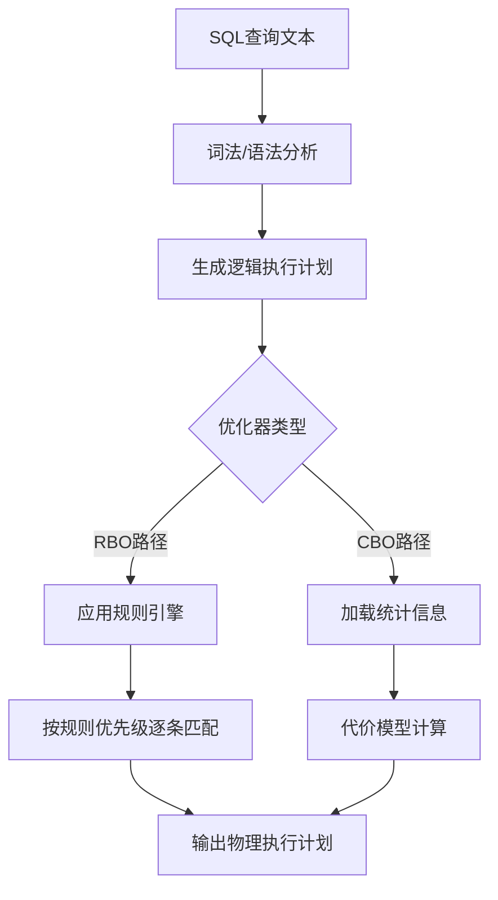
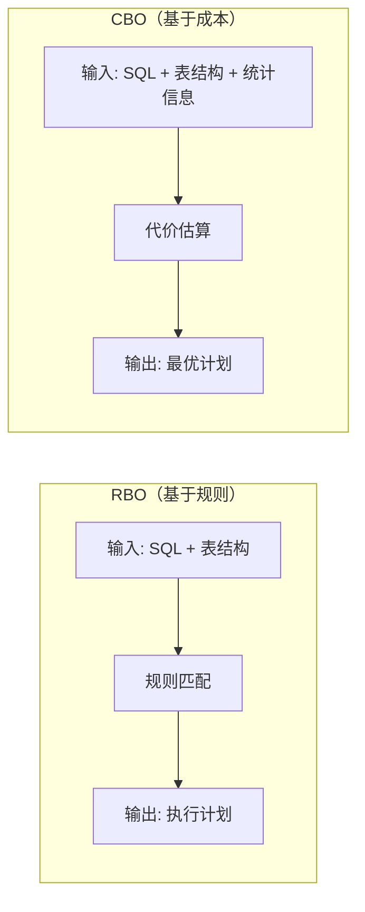
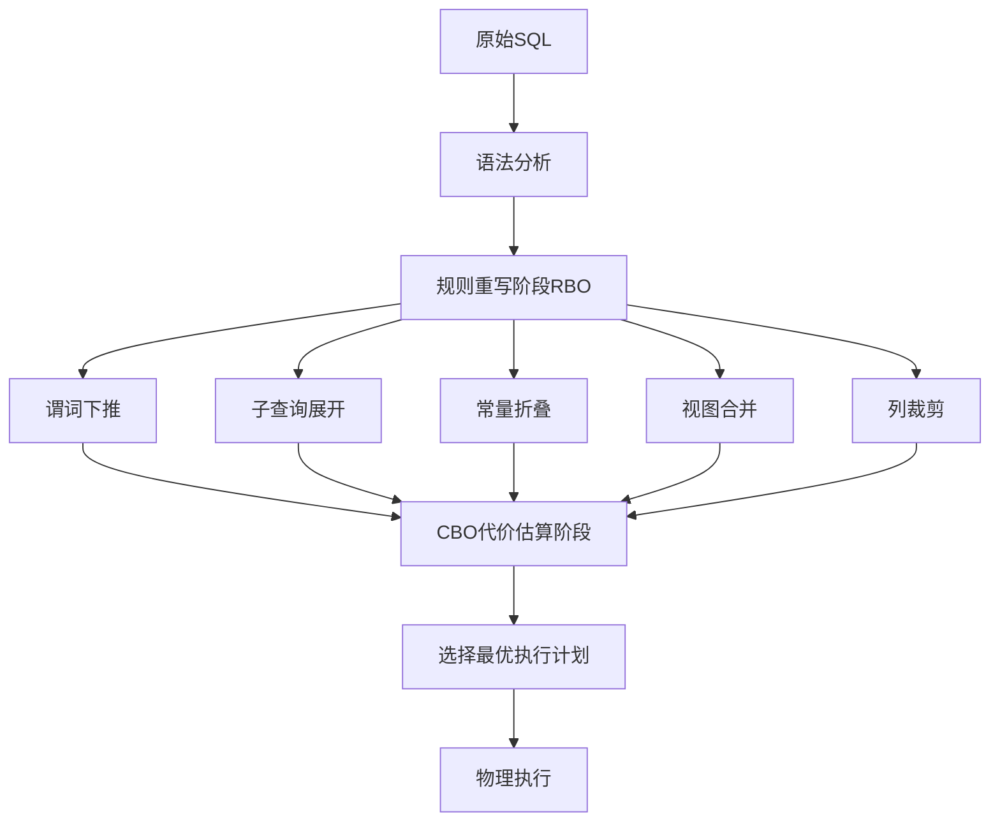

## 技巧2：RBO（基于规则的优化）

> 规则不会说谎，但规则也不懂变通。RBO的价值在于"确定性"，RBO的局限也在于"确定性"。

RBO（Rule-Based Optimization，基于规则的优化器）是数据库查询优化器的两大流派之一。与CBO（基于成本的优化器）依赖统计信息和代价模型不同，RBO通过预定义的规则集合来决定查询的执行策略。它不关心"哪种方案更便宜"，而是回答"按照经验法则，哪种方案更可能最优"。

理解RBO不是为了复古，而是因为：现代数据库的查询重写阶段（Rewrite Phase）本质上仍然是纯RBO——谓词下推、子查询展开、常量折叠等优化，全部由规则驱动。掌握RBO思维，才能真正理解优化器"在CBO介入之前做了什么"。

---

## 1. RBO概述：什么是基于规则的优化

### 1.1 核心思想

RBO用一组人工编写的启发式规则（heuristic rules），对SQL语句的逻辑执行计划进行等价变换，选择一条"规则认为最优"的物理执行路径。



RBO的决策过程可以用一句话概括：**规则编号越小，优先级越高，先匹配到就先执行**。这是一种"先到先得"的贪心策略——不搜索所有可能的执行计划，只按照固定顺序逐条尝试。

### 1.2 RBO的工作机制

RBO引擎内部是一个**模式匹配系统**，其工作流程如下：

┌─────────────────────────────────────────────────────┐
│                 RBO 规则引擎内部流程                    │
├─────────────────────────────────────────────────────┤
│                                                     │
│  1. 解析SQL → 生成逻辑计划树                          │
│           ↓                                         │
│  2. 遍历规则列表（按优先级从高到低）                     │
│           ↓                                         │
│  3. 对每条规则，检查逻辑计划是否匹配该规则的模式         │
│     ├── 匹配 → 应用该规则，生成物理操作符               │
│     └── 不匹配 → 跳过，检查下一条规则                   │
│           ↓                                         │
│  4. 所有访问路径确定后，处理连接顺序                     │
│           ↓                                         │
│  5. 输出最终物理执行计划                               │
│                                                     │
└─────────────────────────────────────────────────────┘

这里的关键是：**规则的匹配是排他性的**。一旦某条规则成功匹配，优化器就停止向下搜索，直接采用该规则产出的执行路径。这意味着RBO从不比较两个方案的优劣——它只关心"谁先被匹配到"。

### 1.3 RBO在数据库历史中的位置

| 时代 | 代表数据库 | 优化方式 | 特点 |
|------|-----------|---------|------|
| 1970s | System R | RBO原型 | 首次引入基于规则的访问路径选择 |
| 1980s | Oracle 6/7 | 纯RBO | 15条规则驱动，规则优先级固定 |
| 1990s | Oracle 8+ | RBO + CBO并存 | CBO成为默认，RBO保留兼容 |
| 2000s | MySQL 5.x | 简化RBO | 基于索引选择的简单规则 |
| 2010s+ | 现代数据库 | CBO为主 + RBO重写 | CBO做代价决策，RBO做查询重写 |

RBO并未真正消亡，它在以下场景仍然发挥作用：

- **无统计信息时**：新表、数据变更频繁的表，统计信息可能不可靠，RBO提供了稳定的兜底策略
- **简单查询**：索引存在时，规则足以做出正确选择，无需代价计算的开销
- **兼容性需求**：老系统升级时，保留RBO模式确保行为不变，避免回归风险
- **嵌入式数据库**：SQLite等轻量级引擎，用简化规则降低CPU和内存开销
- **查询重写阶段**：所有现代数据库的SQL重写（Rewrite）阶段本质上是纯RBO

### 1.4 RBO与CBO的本质区别



| 维度 | RBO | CBO |
|------|-----|-----|
| 决策依据 | 预定义规则 | 代价模型 + 统计信息 |
| 依赖数据 | 不依赖统计信息 | 依赖表行数、直方图、NDV等 |
| 优化速度 | 快（规则匹配，O(N)规则数） | 慢（需枚举候选计划并计算代价） |
| 对统计信息要求 | 无 | 高（需定期ANALYZE） |
| 复杂查询优化能力 | 弱（无法感知数据分布） | 强（可根据实际数据选择最优路径） |
| 可预测性 | 高（相同SQL + 相同结构 = 相同计划） | 低（数据变化可能导致计划漂移） |
| 适用场景 | 简单查询、无统计信息 | 复杂查询、大数据量、多表连接 |

---

## 2. RBO核心规则体系

### 2.1 Oracle RBO的经典规则优先级

Oracle的RBO定义了15条规则，按优先级从高到低排列。优化器从规则1开始逐条匹配，一旦某条规则适用，即选定执行路径，不再检查更低优先级的规则。

| 规则编号 | 规则名称 | 适用场景 | 优先级说明 |
|---------|---------|---------|-----------|
| 1 | 通过RowID访问单行 | `WHERE rowid = :rid` | 最高优先级，直接物理定位 |
| 2 | 通过Cluster Join访问单行 | 集群表的等值连接 | 专用于Oracle Cluster |
| 3 | 通过带唯一键的Hash Cluster Key访问单行 | Hash集群表 | 集群表特有 |
| 4 | 通过唯一索引或主键访问单行 | `WHERE pk_col = :val` | 唯一键精确匹配 |
| 5 | 通过Cluster Join访问多行 | 集群表的连接查询 | 集群表多行 |
| 6 | 通过Hash Cluster Key访问多行 | Hash集群表范围查询 | 集群表 |
| 7 | 通过索引合并（Index Merge）访问 | 多个索引条件组合 | 组合多个索引 |
| 8 | 通过非唯一索引访问单列范围 | `WHERE col BETWEEN :a AND :b` | 范围扫描 |
| 9 | 通过唯一索引访问多行 | `WHERE unique_col IN (...)` | 唯一索引IN查询 |
| 10 | 通过合并的索引访问 | 联合索引前缀匹配 | 组合条件 |
| 11 | 通过索引访问所有索引列 | 索引覆盖查询（无需回表） | 最优索引路径 |
| 12 | 通过索引访问部分索引列 | 索引列的部分匹配 | 需要回表 |
| 13 | 通过索引访问单行（其他） | 其他索引访问 | 兜底索引规则 |
| 14 | 全表扫描（非并行） | 无索引可用 | 默认兜底 |
| 15 | 全表扫描（并行） | 无索引 + 并行查询 | 最低优先级 |

**关键理解**：RBO不计算代价，只看"规则编号谁更小"。即使全表扫描在特定场景下更快（如返回表的80%以上数据），只要索引存在，RBO可能仍然选择索引——因为索引相关规则（7-13）的优先级永远高于全表扫描（14-15）。

### 2.2 访问路径选择规则详解

#### 规则1：RowID直接访问

```sql
-- 触发规则1：通过RowID直接定位
SELECT * FROM orders WHERE ROWID = 'AAABkCAALAAAABRAAA';
```

RowID是Oracle中每行数据的物理地址，由三部分组成：

- **数据文件编号**（10 bit）：标识数据所在的物理文件
- **数据块编号**（22 bit）：标识文件内的数据块位置
- **行槽编号**（16 bit）：标识块内的行偏移

通过RowID访问的时间复杂度为O(1)——一次磁盘IO直接定位到数据块，因此被赋予最高优先级。RowID访问是Oracle中最快的路径，没有之一。

```sql
-- RowID在实际开发中的典型场景
-- 场景1：子查询中获取RowID后批量更新
UPDATE orders SET status = 'SHIPPED'
WHERE ROWID IN (
    SELECT ROWID FROM orders
    WHERE create_time < SYSDATE - 30 AND status = 'PENDING'
);
-- 优化器对内层查询应用规则14（全表扫描），对外层UPDATE应用规则1（RowID访问）

-- 场景2：通过RowID删除重复数据
DELETE FROM orders
WHERE ROWID NOT IN (
    SELECT MIN(ROWID) FROM orders GROUP BY order_id, customer_id
);
```

#### 规则4：唯一索引/主键访问

```sql
-- 触发规则4：通过唯一索引访问
CREATE UNIQUE INDEX idx_order_id ON orders(order_id);
SELECT * FROM orders WHERE order_id = 10001;

-- 执行路径分析：
-- 1. B+树索引查找：O(log N) 定位叶子节点
-- 2. 通过叶子节点中的RowID回表
-- 3. 总耗时：O(log N) + O(1) ≈ O(log N)
```

唯一索引保证每次查找只返回一行，因此RBO将其排在较高优先级。B+树索引的高度通常为2-4层，即使百万级数据，也只需2-4次磁盘IO即可定位目标行。

```sql
-- B+树索引高度与数据量的关系
-- 高度2：可索引约 65,536 行（假设每节点存500个key）
-- 高度3：可索引约 32,768,000 行（约3200万）
-- 高度4：可索引约 16,384,000,000 行（约163亿）
-- 因此绝大多数表的索引高度不超过4层
```

#### 规则7：索引合并（Index Merge）

```sql
-- 触发规则7：多索引条件组合
CREATE INDEX idx_status ON orders(status);
CREATE INDEX idx_amount ON orders(amount);

-- RBO在MySQL 5.0+中的Index Merge行为
EXPLAIN SELECT * FROM orders WHERE status = 'ACTIVE' AND amount > 100;
-- 执行计划：
-- type: index_merge
-- key: idx_status, idx_amount
-- Extra: Using union(idx_status, idx_amount); Using where

-- 执行过程：
-- 1. 用 idx_status 找到 status='ACTIVE' 的RowID集合 → Set A
-- 2. 用 idx_amount 找到 amount>100 的RowID集合 → Set B
-- 3. 取 A ∪ B（并集）或 A ∩ B（交集，取决于条件组合）
-- 4. 回表获取完整行数据
```

#### 规则11-13：索引扫描系列

```sql
-- 规则11：索引覆盖查询（无需回表）
-- 创建包含查询所有列的联合索引
CREATE INDEX idx_covering ON orders(customer_id, order_date, amount);
-- 以下查询触发规则11
SELECT customer_id, order_date, amount
FROM orders
WHERE customer_id = 100;
-- 执行计划中会出现 "Using index"（MySQL）或 "INDEX ONLY SCAN"（Oracle）
-- 含义：所有需要的数据都在索引中，无需回表读取主表数据

-- 规则12：部分列需要回表
SELECT customer_id, order_date, amount, status
FROM orders
WHERE customer_id = 100;
-- status不在索引中，需要通过索引中的主键值回表获取
-- 执行计划：type=ref, Extra 中无 "Using index"

-- 规则13：兜底索引访问
SELECT * FROM orders
WHERE customer_id = 100 AND order_date > '2024-01-01';
-- 多条件查询，索引能部分使用（customer_id等值 + order_date范围）
```

### 2.3 连接顺序优化规则

RBO在多表连接时，采用固定的启发式规则决定表的连接顺序：

```sql
-- RBO连接顺序决策的三条核心规则

-- 规则A：小表驱动大表（简化版）
-- RBO倾向选择行数较少的表作为驱动表
SELECT o.*, c.name
FROM customers c          -- 小表，作为驱动表
JOIN orders o ON c.id = o.customer_id;  -- 大表，作为被驱动表

-- 规则B：有索引的表优先作为被驱动表
-- 如果被驱动表的连接列有索引，嵌套循环效率最高
-- RBO会检查哪个表的连接列有索引，优先将其放在内层

-- 规则C：等值连接优先于非等值连接
SELECT o.*, c.name
FROM customers c
JOIN orders o ON c.id = o.customer_id  -- 等值连接（优先处理）
WHERE o.amount > c.credit_limit;       -- 非等值连接（WHERE过滤）

-- 规则D：按FROM子句顺序（Oracle ORDERED Hint的默认行为）
-- 当无法确定最优顺序时，按SQL书写顺序执行
```

**嵌套循环连接（Nested Loop）的规则驱动选择**：

RBO在连接操作中倾向于选择嵌套循环连接，因为它的内存开销小、实现简单，且在有索引的情况下效率很高：

```mermaid
graph TD
    A[多表连接查询] --> B{RBO选择连接方式}
    B -->|被驱动表有索引| C[索引嵌套循环连接]
    B -->|被驱动表无索引| D[嵌套循环连接]
    B -->|默认兜底| E[排序合并连接]
    C --> F[外层行→内层索引直接定位: O(log N) per row]
    D --> G[外层行→内层逐行扫描: O(M) per row]
    E --> H[两侧排序后合并: O(N log N + M log M)]
```

```sql
-- 嵌套循环连接的执行过程
-- SELECT * FROM customers c JOIN orders o ON c.id = o.customer_id

-- 执行步骤：
-- 1. 驱动表 customers：逐行读取
-- 2. 对每行 customer，用其 id 值去 orders 表查找
--    - 如果 orders.customer_id 有索引 → 索引嵌套循环（高效）
--    - 如果没有索引 → 全表扫描嵌套循环（低效）
-- 3. 每匹配到一行，输出结果

-- RBO为什么偏爱嵌套循环？
-- 原因1：不需要额外内存排序（对比排序合并连接）
-- 原因2：不需要构建哈希表（对比哈希连接）
-- 原因3：可以在第一行匹配到时就开始返回结果（流式输出）
```

---

## 3. 不同数据库的RBO实现

### 3.1 Oracle RBO的启用与控制

```sql
-- 查看当前优化器模式
SHOW PARAMETER optimizer_mode;

-- Oracle支持的优化器模式
-- ALL_ROWS     : CBO，优化整体吞吐量（默认，Oracle 8i+）
-- FIRST_ROWS   : CBO，优化前几行返回速度
-- FIRST_ROWS_N : CBO，优化前N行返回速度（如 FIRST_ROWS_10）
-- RULE          : RBO模式（Oracle 10g起已弃用）
-- CHOOSE        : 有统计信息用CBO，否则用RBO（Oracle 9i起已弃用）

-- 启用RBO模式（仅Oracle 9i及之前版本可用）
ALTER SESSION SET optimizer_mode = RULE;

-- 单条SQL强制使用RBO
SELECT /*+ RULE */ * FROM orders WHERE customer_id = 100;

-- 兼容性说明：
-- Oracle 10g：RULE模式标记为弃用，但仍可用
-- Oracle 11g：RULE模式仍可使用，但官方不推荐
-- Oracle 12c+：完全移除RBO支持，/*+ RULE */ Hint被忽略
```

**Oracle RBO的实际行为陷阱**：

```sql
-- 场景：RBO对数据分布"视而不见"

-- 创建测试表和索引
CREATE TABLE big_table AS
SELECT * FROM all_objects WHERE ROWNUM <= 1000000;

CREATE INDEX idx_status ON big_table(status);

-- 假设数据分布：
-- STATUS = 'VALID'   → 990,000行（99%）
-- STATUS = 'INVALID'  → 10,000行（1%）

-- CBO的决策（有统计信息时）：
-- SELECT * FROM big_table WHERE STATUS = 'INVALID'
-- → 走索引（选择性高，1%数据）✓
-- SELECT * FROM big_table WHERE STATUS = 'VALID'
-- → 全表扫描（选择性低，99%数据）✓

-- RBO的决策（不看数据分布）：
-- SELECT * FROM big_table WHERE STATUS = 'INVALID'
-- → 走索引（索引存在，规则8/11优先）✓ 正确
-- SELECT * FROM big_table WHERE STATUS = 'VALID'
-- → 也走索引！（索引存在就选索引）✗ 错误
-- 实际代价：99万次索引查找 + 99万次回表IO
-- 而全表扫描：100万次顺序IO（顺序读比随机读快100倍以上）
-- 结论：RBO在高重复值场景下会选错路径
```

### 3.2 MySQL的隐式RBO

MySQL 5.7及之前版本使用的优化器本质上是一个简化版RBO，其核心逻辑基于索引选择：

```sql
-- MySQL基于规则的索引选择逻辑

-- 规则1：如果查询列有索引，优先使用索引
CREATE INDEX idx_customer ON orders(customer_id);
EXPLAIN SELECT * FROM orders WHERE customer_id = 100;
-- 执行结果：
-- +----+-------------+--------+------+---------------+-----------+---------+-------+------+-------+
-- | id | select_type | table  | type | possible_keys | key       | key_len | ref   | rows | Extra |
-- +----+-------------+--------+------+---------------+-----------+---------+-------+------+-------+
-- |  1 | SIMPLE      | orders | ref  | idx_customer  | idx_customer | 5    | const |  500 | NULL  |
-- +----+-------------+--------+------+---------------+-----------+---------+-------+------+-------+

-- 规则2：主键/唯一索引优先（const级别）
EXPLAIN SELECT * FROM orders WHERE order_id = 10001;
-- type: const（主键精确匹配，最多返回1行）

-- 规则3：多索引时，MySQL 5.7选择它认为"最优"的单个索引
CREATE INDEX idx_status ON orders(status);
CREATE INDEX idx_date ON orders(order_date);
-- 以下查询，MySQL 5.7只能选择其中一个索引
SELECT * FROM orders WHERE status = 'ACTIVE' AND order_date > '2024-01-01';
-- 不会综合考虑两个索引的组合效果（除非触发Index Merge）

-- MySQL 8.0+：引入Index Merge优化
-- 可以同时使用多个索引后取交集/并集
EXPLAIN SELECT * FROM orders WHERE status = 'ACTIVE' AND order_date > '2024-01-01';
-- 可能出现 type: index_merge, Using intersect(idx_status, idx_date)
```

**MySQL的join_buffer_size与Block Nested Loop**：

```sql
-- MySQL在被驱动表无索引的JOIN上使用Block Nested Loop（BNL）
-- 这是一种规则驱动的固定策略

-- 查看join buffer设置
SHOW VARIABLES LIKE 'join_buffer_size';  -- 默认256KB

-- BNL的工作过程：
-- 1. 读取驱动表的一批行（放入join buffer，最多256KB）
-- 2. 扫描被驱动表全表，与buffer中的行逐行匹配
-- 3. 清空buffer，读取下一批驱动表行
-- 4. 重复直到驱动表处理完毕

-- MySQL 8.0.18+：BNL被Hash Join替代
-- Hash Join不再需要被驱动表有索引，性能大幅提升
-- 这是MySQL从RBO向CBO靠拢的标志性改进之一
```

### 3.3 PostgreSQL的有限RBO

PostgreSQL虽然以CBO为主，但在某些路径上仍有规则驱动的行为：

```sql
-- PostgreSQL的CTE（公共表表达式）优化受规则影响

-- 场景：CTE的物化行为
WITH cte AS (
    SELECT * FROM orders WHERE customer_id = 100
)
SELECT * FROM cte UNION ALL SELECT * FROM cte;

-- PostgreSQL 11之前：CTE是优化屏障（规则行为）
-- CTE内的查询只执行一次，结果物化到临时表
-- 即使上层可以下推条件，也不会优化CTE内部

-- PostgreSQL 12+：CTE可以被内联（CBO行为）
-- 通过 CTEInlining 参数控制
SET cte_inlining = on;  -- 默认开启
-- 此时CTE类似于视图，可以被优化器展开和重写

-- PostgreSQL的另一种规则驱动行为：Plan Caching
-- 首次执行某类SQL时编译执行计划，后续复用
-- 这是典型的RBO思想——相同结构的SQL用相同的计划
-- PostgreSQL通过 generic_plan / custom_plan 机制平衡
PREPARE my_query AS SELECT * FROM orders WHERE customer_id = $1;
-- 首次：生成 custom_plan（基于当前参数值）
-- 后续：复用 generic_plan（基于参数无关的通用计划）
```

### 3.4 SQLite的规则化优化

SQLite的查询优化器本质上是一个轻量级RBO：

```sql
-- SQLite的索引选择规则

-- 规则1：如果WHERE条件列有索引，使用索引
CREATE INDEX idx_user_id ON logs(user_id);
EXPLAIN QUERY PLAN
SELECT * FROM logs WHERE user_id = 42;
-- → SEARCH TABLE logs USING INDEX idx_user_id (user_id=?)

-- 规则2：复合索引遵循最左前缀规则
CREATE INDEX idx_multi ON logs(user_id, action, created_at);
EXPLAIN QUERY PLAN SELECT * FROM logs WHERE user_id = 42;
-- → SEARCH TABLE logs USING INDEX idx_multi (user_id=?)

EXPLAIN QUERY PLAN SELECT * FROM logs WHERE user_id = 42 AND action = 'login';
-- → SEARCH TABLE logs USING INDEX idx_multi (user_id=? AND action=?)

-- 无法使用索引的情况（违反最左前缀）
EXPLAIN QUERY PLAN SELECT * FROM logs WHERE action = 'login';
-- → SCAN TABLE logs（全表扫描）

-- 规则3：覆盖索引优化（自动）
-- 如果索引包含所有查询列，不回表
CREATE INDEX idx_covering ON logs(user_id, action);
EXPLAIN QUERY PLAN SELECT user_id, action FROM logs WHERE user_id = 42;
-- → SEARCH TABLE logs USING INDEX idx_covering (user_id=?)
-- 无需回表，因为user_id和action都在索引中

-- 规则4：OR条件处理（RBO限制）
EXPLAIN QUERY PLAN SELECT * FROM logs WHERE user_id = 42 OR action = 'login';
-- SQLite可能选择：
-- 1. 全表扫描（如果两个条件都没有好的索引）
-- 2. 各索引单独扫描后合并（MySQL的Index Merge类似机制）
-- 注意：SQLite的OR优化能力不如MySQL
```

### 3.5 TiDB与分布式数据库的RBO

TiDB作为分布式NewSQL数据库，其优化器在CBO基础上保留了大量RBO行为：

```sql
-- TiDB的查询重写阶段完全由规则驱动

-- 规则1：分区裁剪（Partition Pruning）
-- 根据WHERE条件中的分区键，自动排除不相关的分区
CREATE TABLE orders (
    id BIGINT PRIMARY KEY,
    create_time DATE,
    customer_id INT
) PARTITION BY RANGE (YEAR(create_time)) (
    PARTITION p2023 VALUES LESS THAN (2024),
    PARTITION p2024 VALUES LESS THAN (2025),
    PARTITION p2025 VALUES LESS THAN (2026)
);
EXPLAIN SELECT * FROM orders WHERE create_time = '2024-06-15';
-- 执行计划显示只扫描 p2024 分区，而非全部分区
-- 这是纯RBO行为：规则判断分区键条件 → 排除不相关分区

-- 规则2：索引选择的RBO兜底
-- TiDB的CBO依赖统计信息，但统计信息可能过期或缺失
-- 此时退化为RBO行为：有索引就用索引
EXPLAIN SELECT * FROM orders WHERE customer_id = 100;
-- 如果customer_id上有索引，优先选择索引路径

-- 规则3：TiFlash MPP模式的规则选择
-- TiFlash是列存引擎，适合OLAP查询
-- TiDB会根据查询特征规则性地选择TiKV或TiFlash
-- 简单点查 → TiKV（行存，适合OLTP）
-- 全表扫描/聚合 → TiFlash（列存，适合OLAP）
```

---

## 4. RBO常见问题与陷阱

### 4.1 陷阱一：索引不一定比全表扫描快

```sql
-- 核心问题：RBO选择了索引，但实际上全表扫描更快

-- 表数据：100万行，STATUS列的分布：
-- STATUS = 'ACTIVE'   → 80万行（80%）
-- STATUS = 'INACTIVE'  → 20万行（20%）

CREATE INDEX idx_status ON big_table(status);

-- 查询1：返回20%的数据
SELECT * FROM big_table WHERE STATUS = 'INACTIVE';
-- RBO选择：走索引（规则8/11优先）
-- 实际代价：20万次索引查找 + 20万次回表IO
--   每次索引查找 = 3-4次随机IO（B+树高度）
--   每次回表 = 1次随机IO
--   总计：20万 × 4次随机IO = 80万次随机IO
-- 全表扫描：100万次顺序IO（顺序读吞吐约500MB/s，随机读约5MB/s）
-- 结论：此时全表扫描可能更快，但RBO不会选它

-- 查询2：返回80%的数据
SELECT * FROM big_table WHERE STATUS = 'ACTIVE';
-- RBO选择：仍然走索引
-- 实际代价：80万 × 4次随机IO = 320万次随机IO
-- 全表扫描：100万次顺序IO
-- 结论：索引完全无意义，RBO选错了

-- 判断标准（经验法则）：
-- 返回行数 < 表总行数的 5%  → 索引更优
-- 返回行数 5%~15%           → 边界区域，需要实测
-- 返回行数 > 15%            → 全表扫描通常更优
-- 返回行数 > 30%            → 全表扫描几乎一定更优

-- 验证方法：对比两种方式的执行计划和实际耗时
-- Oracle: EXPLAIN PLAN FOR SELECT ...; SELECT * FROM TABLE(DBMS_XPLAN.DISPLAY);
-- MySQL: EXPLAIN ANALYZE SELECT ...;  -- 实际执行并显示耗时
-- PostgreSQL: EXPLAIN (ANALYZE, BUFFERS) SELECT ...;
```

### 4.2 陷阱二：函数操作导致索引失效

```sql
-- RBO规则无法识别的索引失效场景

-- 场景1：对索引列使用函数
CREATE INDEX idx_create_time ON orders(create_time);

-- 错误写法：对索引列使用TO_CHAR函数
SELECT * FROM orders
WHERE TO_CHAR(create_time, 'YYYY-MM-DD') = '2024-01-15';
-- RBO：无法使用 idx_create_time 索引
-- 原因：索引存储的是原始DATE值，不是TO_CHAR转换后的字符串
-- 索引列上应用函数 = 索引失效（所有数据库通用规则）

-- 正确写法：用范围条件替代函数
SELECT * FROM orders
WHERE create_time >= DATE '2024-01-15'
  AND create_time < DATE '2024-01-16';
-- 范围条件可以直接使用B+树索引

-- 场景2：隐式类型转换
-- create_time 列类型为 DATE
SELECT * FROM orders
WHERE create_time = '2024-01-15';
-- 字符串字面量触发隐式转换，数据库会对每行的create_time调用TO_DATE
-- 等价于 WHERE TO_DATE(create_time) = '2024-01-15'
-- 索引失效！

-- 正确写法
SELECT * FROM orders
WHERE create_time = DATE '2024-01-15';
-- 使用正确的字面量类型，避免隐式转换

-- 场景3：LIKE前缀通配符
SELECT * FROM orders WHERE customer_name LIKE '%Smith%';
-- 前缀通配符导致索引失效（B+树按前缀排序，前缀不确定无法查找）
-- 解决方案1：改为前缀匹配
SELECT * FROM orders WHERE customer_name LIKE 'Smith%';
-- 解决方案2：使用全文索引
CREATE FULLTEXT INDEX ft_name ON orders(customer_name);
SELECT * FROM orders WHERE MATCH(customer_name) AGAINST('Smith');

-- 场景4：NOT IN / NOT EXISTS 对索引的影响
-- WHERE id NOT IN (子查询) 可能导致全表扫描
-- 改写为 LEFT JOIN ... IS NULL 通常更优

-- 场景5：对索引列进行算术运算
CREATE INDEX idx_amount ON orders(amount);
SELECT * FROM orders WHERE amount * 2 > 200;
-- 索引失效：对amount做了乘法运算
-- 正确写法
SELECT * FROM orders WHERE amount > 100;
```

### 4.3 陷阱三：联合索引的列顺序选择不当

```sql
-- 联合索引(a, b, c)的使用规则：最左前缀匹配

CREATE INDEX idx_abc ON orders(a, b, c);

-- 能使用索引的查询（从左到右连续匹配）
WHERE a = 1                          -- ✓ 使用索引（匹配a）
WHERE a = 1 AND b = 2                -- ✓ 使用索引（匹配a,b）
WHERE a = 1 AND b = 2 AND c = 3     -- ✓ 使用索引（匹配a,b,c）
WHERE a = 1 AND c = 3                -- ✓ 使用索引（但只用到a部分，c跳过b无法匹配）

-- 不能使用索引的查询（跳过了最左列）
WHERE b = 2                          -- ✗ 跳过了最左列a
WHERE b = 2 AND c = 3               -- ✗ 跳过了最左列a

-- 范围条件的特殊行为
WHERE a = 1 AND b > 10 AND c = 3    -- ✓ 使用索引匹配a和b，c无法使用
-- 原因：b是范围条件，范围之后的列无法利用B+树的有序性

-- RBO的列顺序设计原则
-- 原则1：等值条件列放在前面
-- 原则2：范围条件列放在等值列之后
-- 原则3：覆盖查询列放在最后（如果空间允许）

-- 示例：为以下查询设计最优索引
SELECT * FROM orders
WHERE status = 'ACTIVE'        -- 等值条件
  AND customer_id = 100;       -- 等值条件
-- 推荐索引：(status, customer_id) 或 (customer_id, status)
-- 两个等值条件的顺序影响不大，但高选择性列在前略优

-- 示例：为以下查询设计最优索引
SELECT * FROM orders
WHERE status = 'ACTIVE'        -- 等值条件
  AND amount > 100             -- 范围条件
  AND customer_id = 100;       -- 等值条件
-- 推荐索引：(status, customer_id, amount)
-- 两个等值列在前，范围列在后
-- 错误索引：(status, amount, customer_id)
-- → amount范围扫描后，customer_id无法利用索引
```

### 4.4 陷阱四：OR条件导致索引失效

```sql
-- RBO对OR条件的处理能力有限

CREATE INDEX idx_a ON t(col_a);
CREATE INDEX idx_b ON t(col_b);

-- 问题：RBO通常只能选择其中一个索引
SELECT * FROM t WHERE col_a = 1 OR col_b = 2;
-- 执行计划：选择 idx_a 或 idx_b 中的一个
-- 不会同时使用两个索引再合并结果（MySQL 5.0之前）

-- 解决方案1：改写为UNION ALL（兼容性最好）
SELECT * FROM t WHERE col_a = 1
UNION ALL
SELECT * FROM t WHERE col_b = 2 AND col_a != 1;
-- 每个子查询都能独立使用索引
-- 注意：第二个子查询加 col_a != 1 避免重复行

-- 解决方案2：创建复合索引（如果业务允许）
CREATE INDEX idx_ab ON t(col_a, col_b);
-- 但这只对 col_a OR col_b 部分有效
-- 如果是 col_a OR col_x，复合索引无帮助

-- 解决方案3：MySQL 5.0+ 的 Index Merge
EXPLAIN SELECT * FROM t WHERE col_a = 1 OR col_b = 2;
-- 可能出现 type: index_merge
-- 执行过程：分别扫描两个索引 → 合并结果（并集）
-- 但Index Merge有性能开销，不一定比全表扫描快

-- 解决方案4：使用全文索引（适用于文本搜索场景）
-- 如果OR条件是多个文本字段的模糊搜索
CREATE FULLTEXT INDEX ft_search ON t(col_a, col_b);
SELECT * FROM t WHERE MATCH(col_a, col_b) AGAINST('search_term');
```

### 4.5 陷阱五：IS NULL / IS NOT NULL 与索引

```sql
-- RBO对NULL值的处理

CREATE INDEX idx_email ON users(email);

-- IS NULL 查询：大多数数据库可以使用索引
SELECT * FROM users WHERE email IS NULL;
-- MySQL: 可以使用索引
-- Oracle: 可以使用索引
-- PostgreSQL: 可以使用索引

-- IS NOT NULL 查询：可能无法使用索引
SELECT * FROM users WHERE email IS NOT NULL;
-- 在某些数据库版本中，IS NOT NULL会导致全表扫描
-- 原因：NULL值的存储方式与非NULL值不同
-- B+树叶子节点中，NULL值通常存储在最前面

-- 优化建议：
-- 1. 将列定义为 NOT NULL + 默认值，避免NULL
ALTER TABLE users MODIFY email VARCHAR(255) NOT NULL DEFAULT '';
-- 2. 查询时用列名 != '' 替代 IS NOT NULL
SELECT * FROM users WHERE email != '';
```

### 4.6 陷阱六：数据类型不匹配导致的隐式转换

```sql
-- 这是最隐蔽的索引失效场景之一

CREATE INDEX idx_varchar_col ON t(varchar_col);
-- varchar_col 列类型为 VARCHAR(100)

-- 问题SQL：用数字查字符串列
SELECT * FROM t WHERE varchar_col = 12345;
-- 数据库会将 varchar_col 的每行值转换为数字进行比较
-- 等价于 WHERE CAST(varchar_col AS INT) = 12345
-- 索引失效！

-- 问题SQL：用字符串查数字列
CREATE INDEX idx_int_col ON t(int_col);
SELECT * FROM t WHERE int_col = '12345';
-- 某些数据库（如MySQL）会将字符串'12345'转换为数字
-- 这种情况下索引通常还能使用（因为转换发生在常量端）
-- 但Oracle会将int_col转换为字符串，索引失效

-- 最佳实践：始终确保查询参数的类型与列类型一致
-- 正确：WHERE varchar_col = '12345'
-- 正确：WHERE int_col = 12345
```

---

## 5. RBO优化实战技巧

### 5.1 技巧一：利用规则确定性进行查询重写

RBO的最大优势是执行计划的确定性——相同的SQL结构总是产生相同的执行计划。利用这个特点，可以重写查询以匹配最优规则：

```sql
-- 原始查询：RBO可能选择次优路径
SELECT o.*, c.name, c.email
FROM orders o
JOIN customers c ON o.customer_id = c.id
WHERE o.order_date > '2024-01-01'
  AND o.amount > 100
  AND c.status = 'ACTIVE';

-- 重写策略：
-- 1. 将选择性最高的条件放在子查询中，先缩小数据集
-- 2. 确保被驱动表的连接列有索引
-- 3. 将可能触发规则1-4的条件优先处理

-- 重写后的查询
SELECT o.*, c.name, c.email
FROM (
    -- 子查询：利用索引快速筛选orders
    SELECT customer_id, id, order_date, amount
    FROM orders
    WHERE order_date > '2024-01-01'
      AND amount > 100
) o
JOIN customers c ON o.customer_id = c.id
WHERE c.status = 'ACTIVE';

-- 配套索引
CREATE INDEX idx_orders_filter ON orders(order_date, amount, customer_id);
CREATE INDEX idx_customers_status ON customers(status, id);
```

**查询重写的通用规则**：

| 重写技巧 | 适用场景 | RBO规则对应 |
|---------|---------|-----------|
| 子查询预过滤 | 大表连接前先缩小数据集 | 减少嵌套循环的外层行数 |
| UNION ALL替代OR | 多列OR条件 | 每个子查询独立使用最优索引 |
| EXISTS替代IN | 子查询返回多列 | EXISTS可触发规则4（唯一索引） |
| 列裁剪 | SELECT * 改为只选需要的列 | 减少回表IO |
| 范围替代函数 | 对索引列使用函数 | 保持索引可用性 |

### 5.2 技巧二：通过Hint强制RBO行为

```sql
-- Oracle Hint系统：精确控制RBO的决策

-- 强制使用指定索引
SELECT /*+ INDEX(orders idx_create_time) */
    * FROM orders
WHERE create_time > SYSDATE - 30;

-- 强制使用全表扫描
SELECT /*+ FULL(orders) */
    * FROM orders
WHERE status = 'ACTIVE';

-- 强制使用嵌套循环连接
SELECT /*+ ORDERED USE_NL(c o) */
    o.*, c.name
FROM customers c
JOIN orders o ON c.id = o.customer_id;

-- 强制使用指定连接顺序
SELECT /*+ ORDERED */
    a.*, b.*, c.*
FROM table_a a
JOIN table_b b ON a.id = b.a_id
JOIN table_c c ON b.id = c.b_id;
-- ORDERED Hint告诉优化器：按照FROM子句的顺序执行连接

-- 强制使用哈希连接
SELECT /*+ USE_HASH(o c) */
    o.*, c.name
FROM customers c
JOIN orders o ON c.id = o.customer_id;
-- 哈希连接适合大表等值连接，需要足够内存构建哈希表

-- 强制使用排序合并连接
SELECT /*+ USE_MERGE(o c) */
    o.*, c.name
FROM customers c
JOIN orders o ON c.id = o.customer_id;
-- 排序合并连接适合已排序数据或无法使用哈希连接的场景

-- MySQL的Hint语法
SELECT STRAIGHT_JOIN o.*, c.name
FROM customers c
JOIN orders o ON c.id = o.customer_id;
-- STRAIGHT_JOIN 强制按FROM顺序连接（MySQL特有）
```

**常用Hint速查表**：

| Hint名称 | 作用 | 使用场景 | 风险 |
|---------|------|---------|------|
| `FULL(别名)` | 强制全表扫描 | 大批量读取，索引选择性差 | 数据量大时耗时长 |
| `INDEX(别名 索引名)` | 强制使用指定索引 | 已知索引更优时 | 数据分布变化后可能失效 |
| `INDEX_FFS(别名 索引名)` | 强制索引快速全扫描 | 大量索引列读取 | 仅在列数多时优于全表扫描 |
| `INDEX_JOIN(别名 索引1 索引2)` | 强制索引合并 | 两个索引条件OR | 合并开销可能高于全表扫描 |
| `USE_NL(外表 别名)` | 强制嵌套循环连接 | 小表驱动大表 | 大表做驱动表时性能灾难 |
| `USE_HASH(外表 别名)` | 强制哈希连接 | 大表等值连接 | 内存不足时溢出到磁盘 |
| `USE_MERGE(外表 别名)` | 强制排序合并连接 | 已排序数据 | 排序消耗内存和CPU |
| `ORDERED` | 按FROM顺序执行连接 | 控制连接顺序 | 需要手动保证顺序正确 |
| `LEADING(别名1 别名2)` | 指定连接顺序 | 精确控制 | 维护成本高 |
| `PARALLEL(别名 N)` | 强制并行执行 | 大数据量批量处理 | 资源竞争，不适合OLTP |

**Hint的使用原则**：

┌─────────────────────────────────────────────────────┐
│              Hint使用决策树                            │
├─────────────────────────────────────────────────────┤
│                                                     │
│  优化器选错了执行计划？                                │
│       ├── 否 → 不需要Hint                            │
│       └── 是 → 检查原因                               │
│            ├── 统计信息过期 → 先更新统计信息             │
│            ├── SQL写法不当 → 先重写SQL                  │
│            ├── 索引缺失 → 先创建索引                    │
│            └── 以上都试过了仍不对 → 使用Hint             │
│                                                     │
│  使用Hint后记得：                                     │
│  1. 加注释说明为什么需要这个Hint                       │
│  2. 定期检查Hint是否仍然必要                          │
│  3. 在测试环境验证Hint的效果                           │
│                                                     │
└─────────────────────────────────────────────────────┘

### 5.3 技巧三：利用RBO的确定性进行性能预测

```sql
-- RBO的执行计划是确定性的（不依赖数据量）
-- 利用这个特性可以做性能预测和回归测试

-- 步骤1：获取RBO的执行计划
EXPLAIN PLAN FOR
SELECT * FROM orders WHERE customer_id = 100;
SELECT * FROM TABLE(DBMS_XPLAN.DISPLAY);

-- 步骤2：分析执行计划中的关键操作符
-- 操作符              含义                    典型IO模式
-- ─────────────────────────────────────────────────────
-- INDEX UNIQUE SCAN   唯一索引精确查找         O(log N) 随机读
-- INDEX RANGE SCAN    索引范围扫描             O(log N + M) 顺序读
-- TABLE ACCESS BY INDEX ROWID  索引回表        O(1) 随机读 per row
-- FULL TABLE SCAN     全表扫描                 O(N) 顺序读
-- NESTED LOOPS        嵌套循环连接             O(N × M)
-- SORT MERGE JOIN     排序合并连接             O(N log N + M log M)
-- HASH JOIN           哈希连接                 O(N + M)

-- 步骤3：根据执行计划估算IO代价
-- B+树索引高度通常为3（百万级数据）
-- 每次索引查找 = 3次随机IO（遍历树的每一层）
-- 回表 = 1次随机IO
-- 总计每次查找 = 4次随机IO
-- 返回100行 = 400次随机IO
-- 随机IO延迟 ≈ 10ms/次（HDD）或 0.1ms/次（SSD）
-- 总延迟 ≈ 4秒（HDD）或 0.04秒（SSD）

-- 步骤4：对比不同执行方式的代价
-- 全表扫描（100万行）：
--   顺序IO ≈ 100万 × 8KB / 500MB/s ≈ 1.6秒
-- 索引扫描（返回100行）：
--   随机IO ≈ 100 × 4 × 10ms = 4秒（HDD）或 0.04秒（SSD）
-- 选择标准：
--   HDD环境：返回行数 < 5000 行 → 索引更优
--   SSD环境：返回行数 < 50000 行 → 索引更优
```

### 5.4 技巧四：索引设计的RBO友好原则

```sql
-- 原则1：高选择性列在联合索引的最前面（当所有列都是等值条件时）
CREATE INDEX idx_good ON orders(status, customer_id, order_type);
-- status选择性高（3-5个值），customer_id次之，order_type最低
-- 先过滤掉最多数据的列放在最前面

-- 原则2：范围条件列放在最后
CREATE INDEX idx_range ON orders(status, amount);
-- WHERE status = 'ACTIVE' AND amount > 100
-- status用等值匹配，amount用范围扫描
-- 范围列必须在最后，否则后续列无法利用索引

-- 原则3：覆盖索引避免回表
-- SQL Server / PostgreSQL 支持 INCLUDE 子句
CREATE INDEX idx_covering ON orders(customer_id, order_date)
INCLUDE (amount, status);
-- INCLUDE列不参与索引排序，但存储在叶子节点中
-- 查询 customer_id, order_date, amount, status 时无需回表

-- MySQL不支持INCLUDE，需要把所有列都放到索引里
CREATE INDEX idx_covering_mysql ON orders(customer_id, order_date, amount, status);
-- 缺点：索引越大，写入代价越高

-- 原则4：区分索引类型
-- 聚簇索引（主键索引）：叶子节点存储完整行数据
--   InnoDB：主键索引 = 聚簇索引 = 数据本身
--   PostgreSQL：默认使用堆表，主键索引指向堆中的行位置
-- 二级索引（非聚簇索引）：叶子节点存储主键值
--   InnoDB：二级索引叶子节点存主键值 → 需要回表
--   如果查询列都在索引中 → 覆盖索引，无需回表

-- 原则5：前缀索引节省空间
-- 对长字符串列使用前缀索引
CREATE INDEX idx_email_prefix ON users(email(20));
-- 只索引email的前20个字符
-- 选择性公式：COUNT(DISTINCT LEFT(email, 20)) / COUNT(DISTINCT email)
-- 如果前20字符的选择性 > 80%，前缀索引性价比高
```

---

## 6. RBO在查询重写中的现代应用

现代数据库虽然以CBO做最终决策，但在查询重写（Rewrite）阶段大量使用RBO思想。这些规则变换不依赖统计信息，对所有查询统一执行：



**规则重写阶段的关键变换**：

| 变换规则 | 作用 | 示例 |
|---------|------|------|
| 谓词下推（Predicate Pushdown） | 将WHERE条件尽可能下推到最内层 | 减少JOIN的数据量 |
| 子查询展开（Subquery Unnesting） | 将相关子查询改写为JOIN | 避免逐行执行子查询 |
| 常量折叠（Constant Folding） | 编译期计算常量表达式 | `WHERE 1=1` 被消除 |
| 视图合并（View Merging） | 将视图定义合并到查询中 | 消除视图的额外开销 |
| 列裁剪（Column Pruning） | 只保留需要的列 | 减少IO和内存消耗 |
| 公共子表达式消除（CSE） | 相同子查询只计算一次 | 避免重复计算 |

```sql
-- 谓词下推示例
-- 原始SQL
SELECT *
FROM (SELECT * FROM orders WHERE year = 2024) o
JOIN customers c ON o.customer_id = c.id
WHERE c.status = 'ACTIVE';

-- 规则重写后的逻辑计划
-- 子查询展开 + 谓词下推
SELECT *
FROM orders o
JOIN customers c ON o.customer_id = c.id
WHERE o.year = 2024 AND c.status = 'ACTIVE';
-- WHERE条件被下推到连接之前
-- 大幅减少JOIN的数据量

-- 常量折叠示例
SELECT * FROM orders WHERE 1 = 1 AND status = 'ACTIVE';
-- 重写为
SELECT * FROM orders WHERE status = 'ACTIVE';

-- 视图合并示例
CREATE VIEW active_orders AS
SELECT * FROM orders WHERE status = 'ACTIVE';

SELECT * FROM active_orders WHERE amount > 100;
-- 重写为
SELECT * FROM orders WHERE status = 'ACTIVE' AND amount > 100;
-- 视图定义被合并到查询中，避免先物化视图再过滤

-- 子查询展开示例
SELECT * FROM customers c
WHERE EXISTS (
    SELECT 1 FROM orders o WHERE o.customer_id = c.id AND o.amount > 100
);
-- 可能被重写为
SELECT DISTINCT c.* FROM customers c
JOIN orders o ON o.customer_id = c.id
WHERE o.amount > 100;
-- 相关子查询被展开为JOIN，避免逐行执行
```

---

## 7. 诊断与监控

### 7.1 查看RBO选择的执行计划

```sql
-- Oracle
EXPLAIN PLAN FOR SELECT ...;
SELECT * FROM TABLE(DBMS_XPLAN.DISPLAY);

-- 关键字段解读
-- Id  Operation              Cost(%CPU)  Rows
-- 0   SELECT STATEMENT       150         100
-- 1   TABLE ACCESS FULL      150(0)      1000000
-- 解读：全表扫描，代价150，预计返回100万行

-- MySQL
EXPLAIN SELECT ...;                    -- 基本执行计划
EXPLAIN FORMAT=JSON SELECT ...;        -- JSON格式（更详细）
EXPLAIN ANALYZE SELECT ...;            -- 实际执行并显示耗时（MySQL 8.0.18+）

-- MySQL EXPLAIN 关键字段解读
-- type（访问类型，从好到差）：
--   system > const > eq_ref > ref > fulltext > ref_or_null
--   > index_merge > unique_subquery > index_subquery
--   > range > index > ALL
-- key：实际使用的索引
-- rows：预估扫描行数（非精确值）
-- Extra：额外信息
--   Using index        → 覆盖索引，无需回表
--   Using where        → 在Server层进行了过滤
--   Using filesort     → 额外排序（通常需要优化）
--   Using temporary    → 使用临时表（通常需要优化）

-- PostgreSQL
EXPLAIN (ANALYZE, BUFFERS, FORMAT TEXT) SELECT ...;

-- PostgreSQL 关键信息解读
-- Seq Scan on orders  (cost=0.00..15000.00 rows=1000000)
--   → 全表扫描，代价0-15000，预估100万行
-- Index Scan using idx_customer on orders (cost=0.43..8.45 rows=1)
--   → 索引扫描，代价0.43-8.45，预估1行
-- Nested Loop  (cost=0.86..17.74 rows=5)
--   → 嵌套循环连接，预估5行
```

### 7.2 监控RBO相关的性能指标

```sql
-- Oracle：监控索引使用情况
-- 查找从未被使用的索引（Oracle 11g+）
SELECT
    index_name,
    table_name,
    num_rows,
    last_analyzed
FROM user_indexes
WHERE index_name NOT IN (
    SELECT index_name FROM v$object_usage
);

-- Oracle：查看索引的聚簇因子
-- 聚簇因子越高，索引扫描时的随机IO越多
SELECT
    index_name,
    clustering_factor,
    num_rows,
    ROUND(clustering_factor / num_rows, 2) AS cluster_ratio
FROM user_indexes
WHERE table_name = 'ORDERS';
-- cluster_ratio < 0.1  → 索引顺序与物理存储高度一致（理想）
-- cluster_ratio > 0.5  → 索引顺序与物理存储严重不一致（考虑重建）

-- MySQL：监控慢查询
SET GLOBAL slow_query_log = 'ON';
SET GLOBAL long_query_time = 1;              -- 超过1秒的查询
SET GLOBAL log_queries_not_using_indexes = 'ON';  -- 记录未使用索引的查询
SET GLOBAL min_examined_row_limit = 100;     -- 至少扫描100行才记录

-- 分析慢查询
-- pt-query-digest /var/log/mysql/slow.log
-- 会按查询指纹排序，显示每个查询的执行次数、平均耗时、锁等待时间等

-- PostgreSQL：监控索引使用率
SELECT
    schemaname,
    relname AS table_name,
    indexrelname AS index_name,
    idx_scan AS times_used,
    idx_tup_read AS tuples_read,
    idx_tup_fetch AS tuples_fetched
FROM pg_stat_user_indexes
ORDER BY idx_scan DESC;
-- idx_scan = 0 的索引从未被使用，可以考虑删除
```

### 7.3 RBO决策日志分析

```sql
-- Oracle：10053事件跟踪优化器决策过程
ALTER SESSION SET EVENTS '10053 trace name context forever, level 1';
SELECT /*+ RULE */ * FROM orders WHERE customer_id = 100;
ALTER SESSION SET EVENTS '10053 trace name context off';

-- 分析trace文件
-- 路径：$ORACLE_BASE/diag/rdbms/<实例名>/<SID>/trace/
-- 关注以下内容：
-- "Registered external rule set"      → 规则集加载
-- "Access Path: Table Scan"           → 全表扫描候选路径
-- "Access Path: Index Scan"           → 索引扫描候选路径
-- "Access Path: Index (Range)"        → 索引范围扫描候选
-- "Access Path: Index (Full)"         → 索引全扫描候选
-- "Chosen Access Path"                → 最终选择的路径
-- "Join Sel: ..."                     → 连接选择率计算

-- MySQL：Optimizer Trace（MySQL 5.6+）
SET optimizer_trace = "enabled=on";
SELECT * FROM orders WHERE customer_id = 100;
SELECT * FROM information_schema.OPTIMIZER_TRACE\G
SET optimizer_trace = "enabled=off";

-- Optimizer Trace 输出关键字段
-- "rows_estimation": 预估行数
-- "access_type": 访问类型（ref, range, ALL等）
-- "index": 选择的索引
-- "cost": 估算代价
-- "chosen": 是否被选中

-- PostgreSQL：强制开启详细执行计划
SET client_min_messages = debug1;
EXPLAIN (ANALYZE, VERBOSE, BUFFERS, TIMING) SELECT ...;
-- VERBOSE模式显示额外的输出行信息
-- BUFFERS模式显示共享缓冲区命中情况
```

---

## 8. 常见误区与纠正

| 误区 | 纠正 |
|------|------|
| "RBO已经过时了" | RBO的规则引擎思想仍被现代优化器用于查询重写阶段（谓词下推、子查询展开等） |
| "有索引就比全表扫描快" | 当返回数据超过表总量5%~15%时，全表扫描可能更快（顺序IO vs 随机IO） |
| "RBO不关心数据量" | 这是特点而非缺陷，在统计信息不可靠时反而更稳定 |
| "Hint可以解决一切" | 滥用Hint会导致优化器退化为"手写汇编"，数据变化后Hint可能成为性能瓶颈 |
| "联合索引列越多越好" | 索引列越多，写入代价越高，维护成本越大，且只对特定查询模式有效 |
| "EXPLAIN显示的行数一定准确" | 预估行数可能与实际相差很大（统计信息过期、数据倾斜），需结合ANALYZE验证 |
| "MySQL的index_merge总是好的" | Index Merge有额外的合并开销，在高并发场景下可能导致锁竞争 |
| "CBO完全替代了RBO" | 现代数据库是RBO+CBO混合架构：RBO负责重写和基础变换，CBO负责代价决策 |

---

## 9. 最佳实践总结

┌─────────────────────────────────────────────────────┐
│              RBO优化最佳实践清单                       │
├─────────────────────────────────────────────────────┤
│                                                     │
│  □ 1. 统计信息先行                                   │
│     无论RBO还是CBO，准确的统计信息都是基础             │
│     定期执行 ANALYZE TABLE 或 DBMS_STATS            │
│                                                     │
│  □ 2. 索引设计原则                                   │
│     联合索引列顺序：等值列在前，范围列在后             │
│     覆盖索引减少回表，前缀索引节省空间                │
│                                                     │
│  □ 3. 避免索引失效                                   │
│     不在索引列上使用函数                              │
│     不做隐式类型转换                                  │
│     LIKE用前缀匹配，不用尾部通配符                   │
│                                                     │
│  □ 4. 理解执行计划                                   │
│     每个关键查询都应查看执行计划                      │
│     对比EXPLAIN输出与预期是否一致                     │
│                                                     │
│  □ 5. Hint作为最后手段                               │
│     先调整索引和SQL写法                              │
│     Hint只在优化器决策确实错误时使用                  │
│     加注释说明为什么需要Hint                         │
│                                                     │
│  □ 6. 定期清理无用索引                               │
│     无用索引拖慢写入性能                              │
│     通过监控索引使用率删除从未使用的索引              │
│                                                     │
│  □ 7. 测试环境验证                                   │
│     生产环境变更前先在测试环境验证                    │
│     使用EXPLAIN ANALYZE获取实际执行时间              │
│                                                     │
│  □ 8. 升级时注意兼容性                               │
│     从RBO为主的版本升级时验证关键查询                 │
│     CBO可能选择与RBO不同的执行路径                   │
│                                                     │
└─────────────────────────────────────────────────────┘

**RBO思维在CBO时代的真正价值**：

RBO不仅仅是"老技术"，它代表了一种确定性思维。在CBO时代，理解RBO思维仍然重要：

1. **查询重写能力**：所有数据库的SQL重写阶段都是RBO，理解这些规则能帮你写出更利于优化器的SQL
2. **调试能力**：当CBO选择了一个奇怪的计划时，理解RBO的基础规则能帮你定位问题
3. **设计能力**：索引设计、表结构设计，本质上是利用RBO的确定性来保证查询性能
4. **预测能力**：RBO的确定性让你能在执行前预测执行计划，这是CBO做不到的

> **一句话总结**：RBO的核心价值不是"替代CBO"，而是"理解优化器的基础逻辑"。掌握RBO，你才能真正读懂优化器在做什么，也才能写出优化器"看得懂"的SQL。
