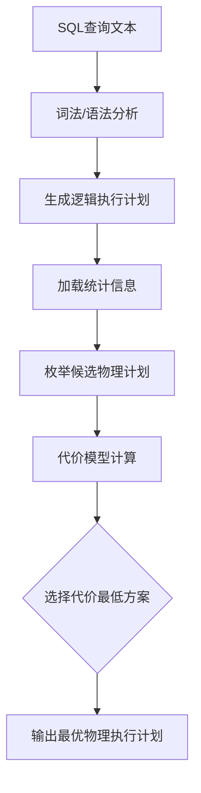
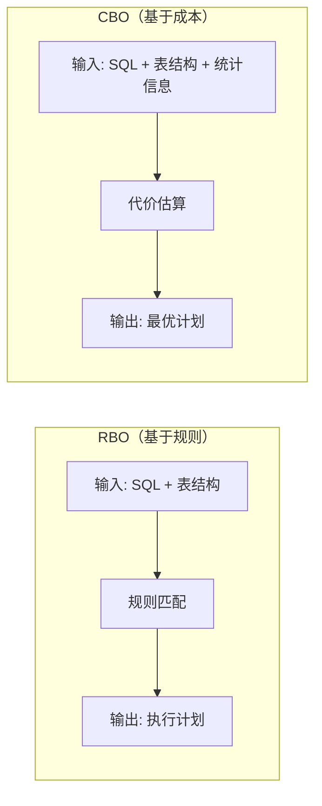
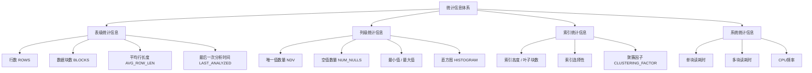
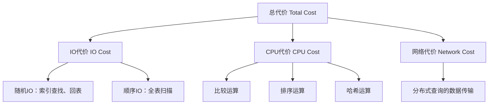
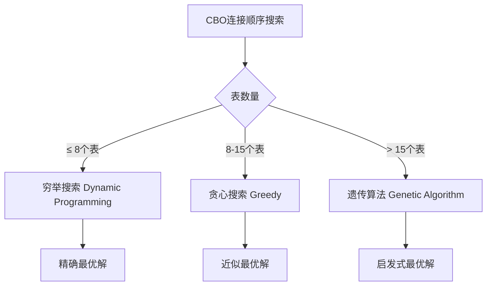
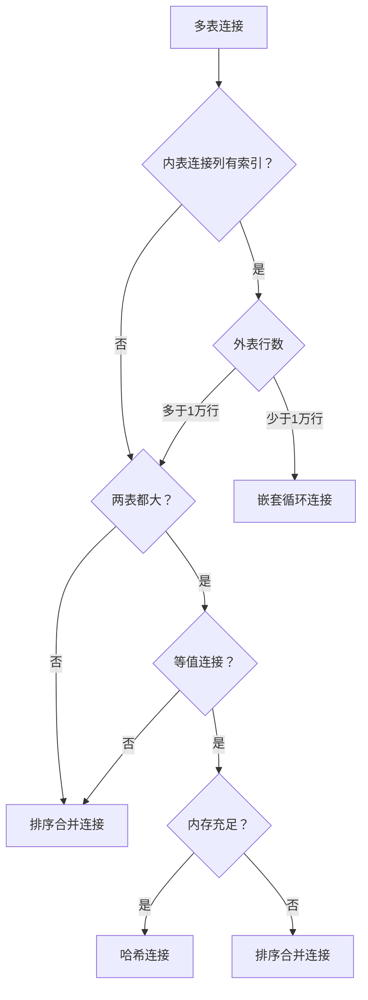
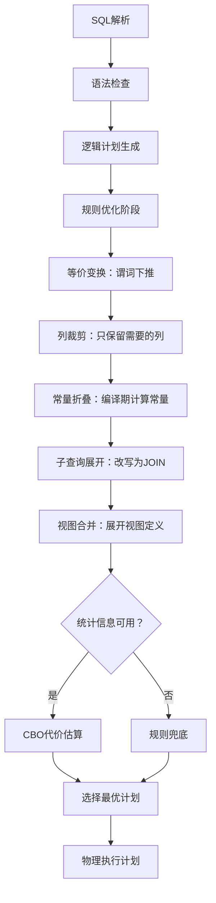

## 技巧3：CBO（基于成本的优化）

### 1. CBO概述：什么是基于成本的优化

CBO（Cost-Based Optimization，基于成本的优化器）是现代数据库查询优化器的主流方案。与RBO（基于规则的优化器）使用固定规则不同，CBO通过统计信息和代价模型，为每种可能的执行计划计算一个"代价"（Cost），选择代价最低的方案作为最终执行计划。

**CBO的核心思想**：不是问"按照规则应该怎么做"，而是问"哪种方案消耗的资源最少"。它把查询优化问题转化为一个数学优化问题——在所有可能的执行计划中，找到总代价最小的那个。



#### 1.1 CBO的诞生背景

CBO的理论基础可以追溯到1979年IBM System R项目中的论文《ACCESS PATH SELECTION IN A RELATIONAL DATABASE MANAGEMENT SYSTEM》。该论文首次提出用统计信息和代价模型来选择查询执行路径，奠定了CBO的理论基础。

| 时期 | 里程碑 | 意义 |
|------|--------|------|
| 1979 | System R优化器论文 | 首次提出基于代价的访问路径选择 |
| 1988 | Oracle 6引入CBO | 商业数据库开始采用CBO |
| 1993 | Oracle 7 CBO成熟 | 统计信息收集机制完善 |
| 1996 | PostgreSQL引入遗传算法 | 用遗传算法搜索连接顺序空间 |
| 2005 | SQL Server 2005全CBO | 微软全面转向CBO |
| 2010s | MySQL 5.6+增强CBO | InnoDB统计信息支持完善 |
| 2020s | 自适应查询优化 | Oracle 19c、PostgreSQL 12+引入运行时自适应 |

**为什么CBO成为主流？** RBO的核心缺陷在于：它不关心数据的实际分布。一个索引在数据量小的表上很快，但在百万级数据且选择性差的查询上可能极慢。CBO通过统计信息感知数据分布，能在各种场景下做出更合理的决策。

#### 1.2 CBO与RBO的本质区别



| 维度 | RBO | CBO |
|------|-----|-----|
| 决策依据 | 预定义规则 | 代价模型 + 统计信息 |
| 依赖数据 | 不依赖统计信息 | 依赖表行数、直方图、NDV等 |
| 优化速度 | 快（规则匹配） | 较慢（需要代价计算） |
| 对统计信息要求 | 无 | 高（需定期ANALYZE） |
| 复杂查询优化能力 | 弱 | 强 |
| 可预测性 | 高（规则固定） | 低（随数据变化） |
| 适用场景 | 简单查询、无统计信息 | 复杂查询、大数据量 |

### 2. 统计信息体系：CBO的决策基础

CBO的一切决策都建立在统计信息之上。没有准确的统计信息，CBO就是"巧妇难为无米之炊"。统计信息的质量直接决定了执行计划的优劣。

#### 2.1 统计信息的层次结构



#### 2.2 表级统计信息详解

```sql
-- Oracle：查看表的统计信息
SELECT
    table_name,
    num_rows,           -- 表的总行数
    blocks,             -- 表占用的数据块数
    avg_row_len,        -- 平均行长度（字节）
    last_analyzed       -- 最后分析时间
FROM user_tables
WHERE table_name = 'ORDERS';

-- MySQL：查看表的统计信息
SELECT
    table_name,
    table_rows,         -- 估算行数（InnoDB不精确）
    avg_row_length,     -- 平均行长度
    data_length,        -- 数据大小（字节）
    index_length,       -- 索引大小
    create_time,
    update_time
FROM information_schema.tables
WHERE table_schema = 'mydb' AND table_name = 'orders';

-- PostgreSQL：查看表的统计信息
SELECT
    relname,
    reltuples::bigint AS estimated_rows,  -- 估算行数
    relpages AS data_pages,               -- 数据页数
    pg_size_pretty(pg_total_relation_size(relid)) AS total_size
FROM pg_stat_user_tables
WHERE relname = 'orders';
```

**行数（ROWS）的意义**：行数是CBO最基础的统计信息。CBO用它来估算每种执行计划需要处理的数据量，进而计算IO和CPU代价。如果行数偏差很大，CBO的决策就会严重失准。

**数据块数（BLOCKS）的意义**：数据块数决定了全表扫描的IO代价。CBO通过"块数 × 单块读代价"来估算全表扫描的总代价。

#### 2.3 列级统计信息详解

```sql
-- Oracle：查看列的统计信息
SELECT
    column_name,
    num_distinct,       -- 唯一值数量（NDV）
    num_nulls,          -- 空值数量
    num_buckets,        -- 直方图桶数
    density,            -- 列密度
    low_value,          -- 最小值
    high_value          -- 最大值
FROM user_tab_columns
WHERE table_name = 'ORDERS' AND column_name = 'STATUS';

-- MySQL：查看列的统计信息
SELECT
    column_name,
    cardinality,        -- 基数（唯一值估算）
    nullable,
    column_type
FROM information_schema.statistics
WHERE table_schema = 'mydb' AND table_name = 'orders';
```

**NDV（Number of Distinct Values）**：唯一值数量，是CBO计算选择率的核心依据。例如：
- STATUS列有3个唯一值（ACTIVE/INACTIVE/PENDING）→ 选择率约1/3
- CUSTOMER_ID有100万唯一值 → 选择率约1/1000000

**列密度（Density）**：密度 = 1/NDV，表示随机选取一行命中该值的概率。密度越大，选择性越差。

#### 2.4 直方图：理解数据分布的关键武器

直方图（Histogram）是CBO最重要的统计信息补充。当列的数据分布不均匀时（如99%的订单状态是COMPLETED，只有1%是CANCELLED），简单的NDV不足以描述真实分布，直方图能精确刻画数据的偏斜程度。

**直方图的类型**：

| 直方图类型 | 适用场景 | Oracle | MySQL | PostgreSQL |
|-----------|---------|--------|-------|------------|
| 等高直方图（Height-Balanced） | 数据分布均匀 | ✓ (旧版) | ✓ | ✓ |
| 等频直方图（Frequency） | 低基数列（唯一值<254） | ✓ | ✓ | ✓ |
| 混合直方图（Hybrid） | 高基数列 | ✓ (12c+) | ✗ | ✗ |
| Top-Frequency | 极端偏斜 | ✓ (12c+) | ✗ | ✗ |

```sql
-- Oracle：创建直方图
-- 自动收集（推荐）
EXEC DBMS_STATS.GATHER_TABLE_STATS(
    ownname          => 'SCOTT',
    tabname          => 'ORDERS',
    method_opt       => 'FOR ALL COLUMNS SIZE AUTO',
    estimate_percent => DBMS_STATS.AUTO_SAMPLE_SIZE
);

-- 手动指定：为STATUS列创建254个桶的直方图
EXEC DBMS_STATS.GATHER_TABLE_STATS(
    ownname          => 'SCOTT',
    tabname          => 'ORDERS',
    method_opt       => 'FOR COLUMNS STATUS SIZE 254'
);

-- 查看直方图信息
SELECT
    column_name,
    num_distinct,
    num_buckets,
    histogram        -- NONE / FREQUENCY / TOPFrequency / HYBRID
FROM user_tab_col_statistics
WHERE table_name = 'ORDERS' AND column_name = 'STATUS';

-- MySQL：创建直方图
ANALYZE TABLE orders UPDATE HISTOGRAM ON status, customer_id WITH 256 BUCKETS;

-- 查看直方图
SELECT
    column_name,
    histogram_json
FROM information_schema.column_statistics
WHERE table_schema = 'mydb' AND table_name = 'orders';

-- PostgreSQL：创建直方图（通过扩展）
CREATE EXTENSION IF NOT EXISTS pg_stat_statements;
-- PostgreSQL自动收集直方图，通过ANALYZE触发
ANALYZE orders;
```

**直方图如何影响CBO决策**：

```sql
-- 场景：STATUS列数据分布极端偏斜
-- COMPLETED: 990,000行 (99%)
-- CANCELLED: 10,000行 (1%)

-- 查询1：返回1%的数据
SELECT * FROM orders WHERE status = 'CANCELLED';
-- 无直方图：CBO估算 1,000,000 × (1/3) ≈ 333,333行 → 可能选择全表扫描
-- 有直方图：CBO估算 ~10,000行 → 选择索引扫描 ✓

-- 查询2：返回99%的数据
SELECT * FROM orders WHERE status = 'COMPLETED';
-- 无直方图：CBO估算 333,333行 → 可能选择索引扫描（错误！）
-- 有直方图：CBO估算 ~990,000行 → 选择全表扫描 ✓
```

### 3. 代价模型：CBO如何计算"最优"

代价模型是CBO的核心引擎。它将各种操作（索引扫描、全表扫描、排序、连接）转化为统一的代价单位，然后累加得到整个执行计划的总代价。

#### 3.1 代价的组成

CBO的代价主要由三部分构成：



| 代价类型 | 计算方式 | 典型权重 |
|---------|---------|---------|
| 随机IO | 单次随机读耗时 × 次数 | 最高（通常0.01-0.1ms/次） |
| 顺序IO | 单次顺序读耗时 × 块数 | 较低（通常0.001-0.01ms/块） |
| CPU | 单次运算耗时 × 次数 | 中等（通常远低于IO代价） |
| 网络 | 数据传输量 × 带宽 | 分布式场景下显著 |

**关键概念：IO vs CPU**

在传统磁盘时代，IO是绝对瓶颈（机械磁盘随机读约10ms）。CBO高度偏向减少IO。但在现代SSD/NVMe环境下，随机读延迟降至0.1ms甚至更低，CPU代价的相对权重上升。这也是为什么PostgreSQL引入了"自适应代价模型"，根据硬件特性动态调整IO/CPU权重。

#### 3.2 各操作的代价计算公式

```sql
-- 全表扫描代价
-- Cost(Full Table Scan) = Blocks × SIO_weight
-- 其中 SIO_weight = 多块读的单块等价代价

-- 例：表有10000个数据块，SIO_weight = 0.001
-- Cost = 10000 × 0.001 = 10

-- 索引范围扫描代价
-- Cost(Index Range Scan) = BTree_height × RIO_weight + Matching_rows × RIO_weight ×回表代价
-- 其中 RIO_weight = 随机读的单块等价代价

-- 例：B+树高度3，匹配100行，回表，RIO_weight = 0.01
-- 索引查找：3 × 0.01 = 0.03
-- 回表：100 × 0.01 = 1.0
-- 总计：1.03

-- 排序代价
-- Cost(Sort) = 2 × Rows × log₂(Rows) × CPU_weight
-- 如果内存足够：Cost = Rows × CPU_weight（内存排序）
-- 如果需要磁盘：Cost += 写出 + 读回的IO代价

-- 哈希连接代价
-- Cost(Hash Join) = Build_cost + Probe_cost
-- Build_cost = Build_rows × CPU_weight（构建哈希表）
-- Probe_cost = Probe_rows × CPU_weight（探测匹配）

-- 排序合并连接代价
-- Cost(Sort-Merge Join) = Sort_cost_A + Sort_cost_B + Merge_cost
-- Merge_cost = (Rows_A + Rows_B) × CPU_weight
```

#### 3.3 选择率估算：CBO决策的关键指标

选择率（Selectivity）表示一个条件能过滤掉多少数据。选择率越低，条件越"有效"。

```sql
-- 选择率计算公式
-- 等值条件选择率 = 1 / NDV（无直方图时）
-- 范围条件选择率 ≈ (High - Query_Value) / (High - Low)
-- 组合条件选择率 = 选择率1 × 选择率2（假设独立）

-- 示例：计算各条件的选择率

-- 表统计信息
-- orders表: 1,000,000行
-- customer_id: NDV = 100,000
-- status: NDV = 3
-- amount: MIN=0, MAX=100,000, AVG=500

-- 查询1：WHERE customer_id = 100
-- 选择率 = 1/100,000 = 0.001%
-- 估算行数 = 1,000,000 × 0.001% = 10行

-- 查询2：WHERE status = 'COMPLETED'
-- 选择率 = 1/3 = 33.3%
-- 估算行数 = 1,000,000 × 33.3% ≈ 333,333行

-- 查询3：WHERE amount > 5000
-- 选择率 = (100,000 - 5,000) / 100,000 = 95%
-- 估算行数 = 1,000,000 × 95% = 950,000行

-- 查询4：WHERE customer_id = 100 AND status = 'COMPLETED'
-- 选择率 = (1/100,000) × (1/3) = 0.00033%
-- 估算行数 = 1,000,000 × 0.00033% ≈ 3.3行
```

**选择率与执行计划的关系**：

| 选择率范围 | CBO倾向 | 原因 |
|-----------|---------|------|
| < 5% | 索引扫描 | 少量数据，索引定位快 |
| 5% - 15% | 边界区域 | 需结合实际数据分布判断 |
| > 15% | 全表扫描 | 大量数据，顺序读更高效 |

### 4. 连接优化：CBO最复杂的决策领域

多表连接的优化是CBO面临的最大挑战。N个表的连接有N!种顺序，加上每种顺序下不同的连接算法，搜索空间呈指数增长。

#### 4.1 连接顺序优化

```sql
-- 连接顺序的搜索空间
-- 3个表：3! = 6种顺序
-- 5个表：5! = 120种顺序
-- 10个表：10! = 3,628,800种顺序
-- 15个表：15! ≈ 1.3万亿种顺序
```

**CBO的搜索策略**：



```sql
-- Oracle：控制连接顺序搜索深度
-- 优化器搜索深度（默认10）
ALTER SESSION SET "_optimizer_max_permutations" = 2000;

-- PostgreSQL：遗传算法参数
-- 个体数（默认100）
SET geqo_threshold = 12;  -- 超过12个表使用遗传算法
SET geqo_effort = 5;       -- 搜索努力程度（1-10）
SET geqo_pool_size = 0;    -- 0表示自动计算

-- MySQL：连接顺序搜索
SET optimizer_search_depth = 0;  -- 0表示自动确定
SET optimizer_switch = 'optimizer_extensions=dynamic_schedule';
```

#### 4.2 连接算法选择

CBO在选择连接算法时，会综合考虑表大小、索引可用性、内存限制等因素。

**嵌套循环连接（Nested Loop Join）**：

```sql
-- 适用场景：小表驱动大表，被驱动表连接列有索引
-- 代价计算：
-- Cost(NLJ) = 外表行数 × (内表索引查找代价 + 回表代价)

-- 示例
SELECT o.*, c.name
FROM customers c          -- 小表（1000行）
JOIN orders o ON c.id = o.customer_id  -- 大表（100万行），有索引
WHERE c.status = 'ACTIVE';

-- CBO分析：
-- 驱动表：customers（1000行，STATUS='ACTIVE'约500行）
-- 被驱动表：orders（索引查找代价≈4次IO/行）
-- 总代价 = 500 × 4 = 2000次IO
-- 结论：选择嵌套循环连接 ✓
```

**哈希连接（Hash Join）**：

```sql
-- 适用场景：大表等值连接，被驱动表能放入内存
-- 代价计算：
-- Cost(Hash Join) = Build表全扫描 + Probe表全扫描
-- Build表：较小的表，构建哈希表
-- Probe表：较大的表，逐行探测

-- 示例
SELECT o.*, c.name
FROM orders o              -- 大表（100万行）
JOIN customers c ON o.customer_id = c.id  -- 中表（10万行）

-- CBO分析：
-- Build表：customers（10万行，放入内存构建哈希表）
-- Probe表：orders（100万行，逐行探测）
-- 总代价 = Build表扫描 + Probe表扫描
-- = 5000块 + 50000块 = 55000次IO
-- 如果内存足够：代价更低（避免溢出到磁盘）
```

**排序合并连接（Sort-Merge Join）**：

```sql
-- 适用场景：两个大表，连接列已排序或需要排序
-- 代价计算：
-- Cost(SMJ) = Sort(表A) + Sort(表B) + Merge(两表)

-- 示例
SELECT o.*, c.name
FROM orders o              -- 大表（100万行）
JOIN customers c ON o.customer_id = c.id  -- 大表（10万行）
WHERE o.order_date > '2024-01-01';

-- CBO分析：
-- 如果两表连接列都有索引：排序代价低
-- 如果需要内存排序：代价 = 2 × N × log(N) × CPU_weight
-- 如果需要磁盘排序：代价 += 临时空间的IO
```

**连接算法选择决策矩阵**：

| 条件 | 推荐算法 | 原因 |
|------|---------|------|
| 内外表都小（<1万行） | 嵌套循环 | 简单高效，无额外内存开销 |
| 内表连接列有索引 | 嵌套循环 | 索引查找O(log N)，逐行匹配快 |
| 两表都大，等值连接 | 哈希连接 | 一次构建哈希表，O(1)探测 |
| 两表都大，非等值连接 | 排序合并 | 哈希不支持非等值，需排序后合并 |
| 内存充足 | 哈希连接 | 避免排序开销 |
| 内存不足 | 排序合并 | 可利用外部排序，不依赖内存 |



### 5. 不同数据库的CBO实现

#### 5.1 Oracle CBO：最成熟的代价模型

Oracle的CBO是业界最成熟、最复杂的实现，支持多种优化模式和Hint控制。

```sql
-- Oracle优化器模式
-- ALL_ROWS    : 优化整体吞吐量（默认）——返回所有行最快
-- FIRST_ROWS_N: 优化前N行返回速度——交互式查询首选
-- CHOOSE       : 有统计信息用CBO，否则用RBO（已废弃）

-- 设置优化器模式
ALTER SESSION SET optimizer_mode = ALL_ROWS;

-- 单条SQL优化模式
SELECT /*+ FIRST_ROWS(10) */ * FROM orders WHERE customer_id = 100;

-- Oracle代价模型的内部计算
-- Cost = I/O_cost + CPU_cost
-- I/O_cost 基于系统统计信息（ioseektim, iotfrtim, cpuspeed）
-- CPU_cost = CPU cycles / cpuspeed
```

**Oracle的自适应优化**：

```sql
-- Oracle 12c+ 引入的自适应查询优化
-- 1. 自适应连接方法：运行时根据实际行数调整连接算法
-- 2. 自适应统计信息：运行时收集额外统计信息

-- 查看自适应优化状态
SELECT
    name,
    value
FROM v$parameter
WHERE name LIKE '%adaptive%';

-- 禁用自适应优化（如果需要确定性）
ALTER SESSION SET optimizer_adaptive_plans = FALSE;
ALTER SESSION SET optimizer_adaptive_statistics = FALSE;
```

#### 5.2 MySQL CBO：从简化到完善

```sql
-- MySQL 8.0+ CBO关键参数

-- 优化器开关
SET optimizer_switch = 'index_merge=on';          -- 索引合并
SET optimizer_switch = 'mrr=on';                  -- 多范围读
SET optimizer_switch = 'batched_key_access=on';   -- 批量键访问
SET optimizer_switch = 'hash_join=on';             -- 哈希连接（8.0.18+）

-- InnoDB统计信息参数
SET innodb_stats_auto_recalc = ON;                -- 自动重算
SET innodb_stats_persistent = ON;                 -- 持久化统计
SET innodb_stats_method = 'nulls_equal';          -- NULL值处理

-- 统计信息采样比例
SET innodb_stats_sample_pages = 20;               -- 采样页数
SET innodb_stats_transient_sample_pages = 8;      -- 瞬态采样

-- 查看MySQL优化器选择
EXPLAIN FORMAT=JSON SELECT * FROM orders WHERE customer_id = 100;
-- 关注 cost_info 部分
```

**MySQL统计信息的局限性**：

```sql
-- MySQL InnoDB的行数是估算值，不精确
-- SHOW TABLE STATUS 的 Rows 字段是基于采样的估算
-- 精确行数需要 COUNT(*)，对大表代价极高

-- 验证MySQL统计信息准确性
SELECT COUNT(*) FROM orders;  -- 精确行数
SHOW TABLE STATUS LIKE 'orders';  -- 估算行数

-- 如果偏差较大，手动更新统计信息
ANALYZE TABLE orders;

-- MySQL 8.0+ 直方图支持
ANALYZE TABLE orders UPDATE HISTOGRAM ON customer_id, status WITH 100 BUCKETS;
```

#### 5.3 PostgreSQL CBO：遗传算法的独特实现

```sql
-- PostgreSQL的CBO特点：使用遗传算法（Genetic Algorithm）搜索连接顺序

-- 遗传算法参数
SET geqo = on;                -- 启用遗传算法
SET geqo_threshold = 12;      -- 超过12个表使用遗传算法
SET geqo_effort = 5;          -- 搜索努力程度
SET geqo_pool_size = 0;       -- 自动计算种群大小

-- 动态规划参数（小表数量时使用）
SET geqo_rel_threshold = 4.0; -- 相对阈值

-- PostgreSQL的代价模型
-- seq_page_cost = 1.0         -- 顺序读页代价（基准）
-- random_page_cost = 4.0      -- 随机读页代价（SSD设为1.1）
-- cpu_tuple_cost = 0.01       -- 每行CPU处理代价
-- cpu_index_tuple_cost = 0.005 -- 每个索引条目CPU代价
-- cpu_operator_cost = 0.0025  -- 每个运算符CPU代价
-- effective_cache_size = 4GB   -- 预期可用缓存大小

-- 根据硬件调整代价模型
-- SSD环境：
SET random_page_cost = 1.1;   -- SSD随机读接近顺序读
SET effective_cache_size = '8GB';

-- HDD环境：
SET random_page_cost = 4.0;   -- HDD随机读代价高
SET effective_cache_size = '2GB';

-- 查看PostgreSQL的执行计划和代价
EXPLAIN (ANALYZE, BUFFERS, FORMAT TEXT)
SELECT o.*, c.name
FROM orders o
JOIN customers c ON o.customer_id = c.id
WHERE o.status = 'COMPLETED';
```

### 6. 统计信息收集与维护

统计信息的质量直接决定CBO的决策质量。收集不及时或采样不足是CBO失效的最常见原因。

#### 6.1 自动统计收集

```sql
-- Oracle：自动统计收集任务
-- 检查自动收集任务状态
SELECT
    client_name,
    status,
    window_group
FROM dba_autotask_client
WHERE client_name = 'auto optimizer stats collection';

-- 手动触发统计收集
EXEC DBMS_STATS.GATHER_DATABASE_STATS(estimate_percent => DBMS_STATS.AUTO_SAMPLE_SIZE);
EXEC DBMS_STATS.GATHER_SCHEMA_STATS(ownname => 'SCOTT');

-- MySQL：自动统计收集
SET innodb_stats_auto_recalc = ON;  -- 数据变化10%以上自动重算
SET innodb_stats_persistent = ON;   -- 统计信息持久化到磁盘

-- PostgreSQL：自动收集
-- autovacuum守护进程自动运行ANALYZE
-- 通过以下参数控制
SET autovacuum_analyze_threshold = 50;      -- 变化行数阈值
SET autovacuum_analyze_scale_factor = 0.1;  -- 变化比例阈值
```

#### 6.2 手动统计收集策略

```sql
-- Oracle：精细化统计收集
-- 收集表统计信息（指定采样比例）
EXEC DBMS_STATS.GATHER_TABLE_STATS(
    ownname          => 'SCOTT',
    tabname          => 'ORDERS',
    estimate_percent => 0.1,        -- 0.1%采样（大表）
    method_opt       => 'FOR ALL COLUMNS SIZE 254',
    cascade          => TRUE,       -- 同时收集索引统计
    degree           => 4           -- 并行度
);

-- 收集直方图（重点列）
EXEC DBMS_STATS.GATHER_COLUMN_STATS(
    ownname    => 'SCOTT',
    tabname    => 'ORDERS',
    colname    => 'STATUS',
    method_opt => 'FOR COLUMNS SIZE 254'
);

-- 导出/导入统计信息（跨环境迁移）
EXEC DBMS_STATS.CREATE_STAT_TABLE(ownname => 'SCOTT', stattab => 'STATS_TABLE');
EXEC DBMS_STATS.EXPORT_TABLE_STATS(
    ownname => 'SCOTT', tabname => 'ORDERS',
    stattab => 'STATS_TABLE', statid => 'V1'
);
-- 在目标环境导入
EXEC DBMS_STATS.IMPORT_TABLE_STATS(
    ownname => 'SCOTT', tabname => 'ORDERS',
    stattab => 'STATS_TABLE', statid => 'V1'
);

-- MySQL：手动收集
ANALYZE TABLE orders;  -- 基本统计信息
ANALYZE TABLE orders UPDATE HISTOGRAM ON customer_id, status WITH 256 BUCKETS;

-- PostgreSQL：手动收集
ANALYZE orders;  -- 基本统计信息
ALTER TABLE orders ALTER COLUMN customer_id SET STATISTICS 1000;  -- 提高列统计精度
ANALYZE orders;
```

#### 6.3 统计信息维护的常见问题

| 问题 | 原因 | 解决方案 |
|------|------|---------|
| 统计信息过时 | 大量数据变更后未收集 | 定期执行ANALYZE/DBMS_STATS |
| 采样不足 | 采样比例过低 | 增大estimate_percent或使用AUTO_SAMPLE_SIZE |
| 直方图缺失 | 未为偏斜列创建直方图 | method_opt指定SIZE |
| NULL值处理不当 | 统计信息未包含NULL | 检查num_nulls是否准确 |
| 分区表统计不准 | 全局统计与分区统计不一致 | GATHER_TABLE_STATS的granularity参数 |
| 临时表统计缺失 | 临时表无持久统计 | 在会话中手动ANALYZE |

### 7. CBO常见陷阱与诊断

#### 7.1 陷阱一：统计信息过时导致全表扫描

```sql
-- 场景：大表数据从100万增长到5000万，但统计信息仍是旧的

-- 问题SQL
SELECT * FROM orders WHERE customer_id = 100;
-- CBO基于旧统计信息：表有100万行，customer_id NDV=100000
-- 估算行数 = 100万/10万 = 10行 → 选择索引扫描
-- 实际行数 = 5000万/10万 = 500行 → 仍然选择索引扫描（正确）

-- 但如果NDV也变了：从10万变为50万
-- 估算行数 = 100万/50万 = 2行（基于旧表大小）
-- 实际行数 = 5000万/50万 = 100行
-- CBO严重低估，可能导致选择错误的连接算法

-- 解决方案
EXEC DBMS_STATS.GATHER_TABLE_STATS(
    ownname => 'SCOTT', tabname => 'ORDERS',
    estimate_percent => DBMS_STATS.AUTO_SAMPLE_SIZE,
    cascade => TRUE
);
```

#### 7.2 陷阱二：数据偏斜导致选择率估算错误

```sql
-- 场景：STATUS列数据分布极端偏斜，但没有直方图

-- 表数据：100万行
-- COMPLETED: 990,000行 (99%)
-- CANCELLED: 10,000行 (1%)

-- 查询：SELECT * FROM orders WHERE status = 'CANCELLED';
-- 无直方图：选择率 = 1/3 = 33% → 估算33万行 → 全表扫描
-- 有直方图：选择率 ≈ 1% → 估算1万行 → 索引扫描 ✓

-- 解决方案：为偏斜列创建直方图
EXEC DBMS_STATS.GATHER_TABLE_STATS(
    ownname => 'SCOTT',
    tabname => 'ORDERS',
    method_opt => 'FOR COLUMNS STATUS SIZE 254'
);
```

#### 7.3 陷阱三：函数操作导致统计信息失效

```sql
-- 场景：对索引列使用函数，CBO无法使用索引统计

-- 索引列
CREATE INDEX idx_create_time ON orders(create_time);

-- 问题SQL
SELECT * FROM orders
WHERE TO_CHAR(create_time, 'YYYY-MM-DD') = '2024-01-15';
-- CBO无法使用 create_time 的统计信息
-- 因为TO_CHAR转换后的值没有统计信息
-- 可能退化为全表扫描

-- 正确写法：避免函数操作
SELECT * FROM orders
WHERE create_time >= DATE '2024-01-15'
  AND create_time < DATE '2024-01-16';

-- 如果必须使用函数：创建函数索引（Oracle）
CREATE INDEX idx_create_time_char ON orders(TO_CHAR(create_time, 'YYYY-MM-DD'));
```

#### 7.4 陷阱四：连接列数据类型不匹配

```sql
-- 场景：两个表的连接列数据类型不同

-- orders.customer_id 是 VARCHAR2(20)
-- customers.id 是 NUMBER

-- 问题SQL
SELECT o.*, c.name
FROM orders o
JOIN customers c ON o.customer_id = c.id;
-- CBO需要进行隐式类型转换
-- 转换后的统计信息可能不准确
-- 可能导致选择错误的连接算法

-- 解决方案：统一数据类型
ALTER TABLE orders MODIFY customer_id NUMBER;
-- 或在应用层确保类型一致
```

#### 7.5 诊断CBO决策过程

```sql
-- Oracle：10053事件跟踪优化器决策
ALTER SESSION SET EVENTS '10053 trace name context forever, level 1';
SELECT * FROM orders WHERE customer_id = 100;
ALTER SESSION SET EVENTS '10053 trace name context off';

-- 分析trace文件
-- 路径：$ORACLE_BASE/diag/rdbms/<实例名>/<SID>/trace/
-- 关注以下内容：
-- "Base Table Statistics"    → 基础统计信息
-- "Column Usage Information" → 列使用信息
-- "Access Path: Table Scan"  → 全表扫描代价
-- "Access Path: Index Scan"  → 索引扫描代价
-- "Join Order"               → 连接顺序选择
-- "Best Plan"                → 最终选择的计划

-- MySQL：EXPLAIN ANALYZE（8.0.18+）
EXPLAIN ANALYZE
SELECT o.*, c.name
FROM orders o
JOIN customers c ON o.customer_id = c.id
WHERE o.status = 'COMPLETED';
-- 输出包含实际执行时间和行数，可验证CBO估算准确性

-- PostgreSQL：EXPLAIN详细输出
EXPLAIN (ANALYZE, BUFFERS, COSTS, TIMING, VERBOSE)
SELECT o.*, c.name
FROM orders o
JOIN customers c ON o.customer_id = c.id
WHERE o.status = 'COMPLETED';
-- 关注 cost=actual 和 rows=actual 的偏差
```

### 8. CBO调优实战技巧

#### 8.1 技巧一：通过Hint修正CBO决策

```sql
-- Oracle Hint系统：精确控制CBO的决策

-- 强制使用指定索引
SELECT /*+ INDEX(orders idx_status) */
    * FROM orders
WHERE status = 'COMPLETED';

-- 强制使用全表扫描
SELECT /*+ FULL(orders) */
    * FROM orders
WHERE status = 'COMPLETED';

-- 强制哈希连接
SELECT /*+ USE_HASH(o c) */
    o.*, c.name
FROM orders o
JOIN customers c ON o.customer_id = c.id;

-- 强制嵌套循环连接
SELECT /*+ USE_NL(o c) */
    o.*, c.name
FROM orders o
JOIN customers c ON o.customer_id = c.id;

-- 强制连接顺序
SELECT /*+ LEADING(c o) USE_NL(o c) */
    o.*, c.name
FROM customers c
JOIN orders o ON c.id = o.customer_id;

-- MySQL Hint语法
SELECT STRAIGHT_JOIN o.*, c.name
FROM customers c
JOIN orders o ON c.id = o.customer_id;
-- STRAIGHT_JOIN 强制按FROM顺序连接

-- PostgreSQL Hint（需要pg_hint_plan扩展）
SET enable_hashjoin = off;
SELECT o.*, c.name
FROM orders o
JOIN customers c ON o.customer_id = c.id;
SET enable_hashjoin = on;
```

**常用Oracle Hint速查表**：

| Hint名称 | 作用 | 使用场景 |
|---------|------|---------|
| `FULL(别名)` | 强制全表扫描 | 大批量读取，索引选择性差 |
| `INDEX(别名 索引名)` | 强制使用指定索引 | 已知索引更优时 |
| `INDEX_FFS(别名 索引名)` | 强制索引快速全扫描 | 大量索引列读取 |
| `USE_NL(外表 别名)` | 强制嵌套循环连接 | 小表驱动大表 |
| `USE_HASH(外表 别名)` | 强制哈希连接 | 大表等值连接 |
| `USE_MERGE(外表 别名)` | 强制排序合并连接 | 已排序数据 |
| `ORDERED` | 按FROM顺序执行连接 | 控制连接顺序 |
| `LEADING(别名1 别名2)` | 指定连接顺序 | 精确控制 |
| `PARALLEL(别名 N)` | 强制并行执行 | 大数据量批量处理 |
| `NO_INDEX(别名 索引名)` | 禁用指定索引 | 避免CBO选择次优索引 |

#### 8.2 技巧二：通过SQL重写引导CBO

```sql
-- 技巧：将选择性高的条件提前，引导CBO选择最优路径

-- 原始SQL（CBO可能选择次优路径）
SELECT o.*, c.name, c.email
FROM orders o
JOIN customers c ON o.customer_id = c.id
WHERE o.order_date > '2024-01-01'
  AND o.amount > 100
  AND c.status = 'ACTIVE';

-- 重写：利用子查询先过滤
SELECT o.*, c.name, c.email
FROM (
    SELECT customer_id, id
    FROM orders
    WHERE order_date > '2024-01-01'
      AND amount > 100
) o
JOIN customers c ON o.customer_id = c.id
WHERE c.status = 'ACTIVE';
-- 子查询先用索引过滤orders，减少JOIN的数据量

-- 技巧：将IN子查询改写为JOIN
-- 原始SQL（可能触发 semi-join 优化，但有时不理想）
SELECT * FROM orders
WHERE customer_id IN (SELECT id FROM customers WHERE status = 'ACTIVE');

-- 改写为显式JOIN
SELECT o.* FROM orders o
JOIN customers c ON o.customer_id = c.id
WHERE c.status = 'ACTIVE';
```

#### 8.3 技巧三：利用执行计划验证CBO决策

```sql
-- 验证CBO决策的标准流程

-- 步骤1：获取执行计划
-- Oracle
EXPLAIN PLAN FOR SELECT ...;
SELECT * FROM TABLE(DBMS_XPLAN.DISPLAY);

-- MySQL
EXPLAIN SELECT ...;
EXPLAIN FORMAT=JSON SELECT ...;

-- PostgreSQL
EXPLAIN (ANALYZE, BUFFERS) SELECT ...;

-- 步骤2：分析关键指标
-- 关注以下字段：
-- Oracle: Cost, Cardinality, Access
-- MySQL: type, key, rows, Extra
-- PostgreSQL: cost, rows, actual time, loops

-- 步骤3：对比CBO估算与实际执行
-- 如果偏差超过10倍，需要调查原因
-- 常见原因：统计信息过时、数据偏斜、函数操作

-- 步骤4：调整并验证
-- 修改索引/统计信息/Hint后，重新EXPLAIN确认计划变化
```

### 9. CBO与RBO的协作机制

现代数据库并非纯粹使用RBO或CBO，而是两者协作。规则优化（RBO思想）负责基础的等价变换，代价优化（CBO思想）负责路径选择。



**规则优化阶段（所有数据库都有）**：
- **谓词下推**（Predicate Pushdown）：将WHERE条件尽可能下推到最内层
- **列裁剪**（Column Pruning）：只SELECT需要的列，减少IO
- **常量折叠**（Constant Folding）：编译期计算常量表达式
- **子查询展开**（Subquery Unnesting）：将相关子查询改写为JOIN
- **视图合并**（View Merging）：将视图定义合并到查询中

```sql
-- 谓词下推示例
-- 原始SQL
SELECT *
FROM (SELECT * FROM orders WHERE year = 2024) o
JOIN customers c ON o.customer_id = c.id
WHERE c.status = 'ACTIVE';

-- 规则优化后的逻辑计划
SELECT *
FROM orders o
JOIN customers c ON o.customer_id = c.id
WHERE o.year = 2024 AND c.status = 'ACTIVE';
-- WHERE条件被下推到连接之前
-- 大幅减少JOIN的数据量
```

### 10. 监控与维护

#### 10.1 CBO相关性能监控

```sql
-- Oracle：监控统计信息准确性
SELECT
    table_name,
    num_rows,
    last_analyzed,
    TRUNC(SYSDATE - last_analyzed) AS days_since_analyze
FROM user_tables
WHERE last_analyzed < SYSDATE - 7  -- 超过7天未分析
ORDER BY days_since_analyze DESC;

-- MySQL：监控统计信息
SELECT
    table_name,
    table_rows,
    update_time,
    UNIX_TIMESTAMP(NOW()) - UNIX_TIMESTAMP(update_time) AS seconds_since_update
FROM information_schema.tables
WHERE table_schema = 'mydb'
ORDER BY seconds_since_update DESC;

-- PostgreSQL：监控统计信息
SELECT
    relname,
    last_analyze,
    last_autoanalyze,
    n_tup_ins + n_tup_upd + n_tup_del AS total_changes,
    n_live_tup,
    n_dead_tup
FROM pg_stat_user_tables
ORDER BY total_changes DESC;
```

#### 10.2 索引使用率监控

```sql
-- Oracle：查找未使用的索引
SELECT
    index_name,
    table_name,
    num_rows,
    last_analyzed
FROM user_indexes
WHERE index_name NOT IN (
    SELECT index_name FROM v$object_usage
);

-- MySQL：监控索引使用
-- 开启性能模式
UPDATE performance_schema.setup_instruments
SET ENABLED = 'YES', TIMED = 'YES'
WHERE NAME LIKE 'statement/sql/explain%';

-- PostgreSQL：监控索引使用
SELECT
    schemaname,
    relname,
    indexrelname,
    idx_scan,      -- 索引扫描次数
    idx_tup_read,  -- 索引读取的行数
    idx_tup_fetch  -- 通过索引获取的行数
FROM pg_stat_user_indexes
WHERE idx_scan = 0  -- 从未使用的索引
ORDER BY pg_relation_size(indexrelid) DESC;
```

#### 10.3 慢查询与CBO决策偏差分析

```bash
# MySQL：开启慢查询日志
SET GLOBAL slow_query_log = 'ON';
SET GLOBAL long_query_time = 1;  # 超过1秒的查询
SET GLOBAL log_queries_not_using_indexes = 'ON';  # 记录未使用索引的查询

# 分析慢查询
pt-query-digest /var/log/mysql/slow.log

# PostgreSQL：启用慢查询记录
ALTER SYSTEM SET log_min_duration_statement = 1000;  # 超过1秒
ALTER SYSTEM SET log_statement = 'none';
SELECT pg_reload_conf();
```

### 11. 常见误区与纠正

| 误区 | 纠正 |
|------|------|
| "CBO总是能做出最优决策" | CBO依赖统计信息质量，统计不准时可能做出极差决策 |
| "统计信息收集越多越好" | 过度收集会消耗系统资源，需平衡准确性和性能 |
| "索引越多查询越快" | 索引会拖慢写入，且CBO可能选择次优索引 |
| "Hint可以解决一切CBO问题" | 滥用Hint会导致优化器退化，应在确有必要时使用 |
| "全表扫描一定很慢" | 当返回数据超过表总量15%时，全表扫描可能更快 |
| "EXPLAIN显示的代价一定准确" | 代价是估算值，实际性能需通过ANALYZE验证 |
| "统计信息收集后立即生效" | 某些数据库需要刷新共享池或重新加载计划 |
| "CBO不需要人工干预" | 复杂场景下需要DBA通过Hint或统计调整引导CBO |

### 12. 最佳实践总结

1. **统计信息先行**：定期执行ANALYZE或DBMS_STATS，确保统计信息反映真实数据分布。大表建议每周收集一次，数据变更频繁的表可更频繁。

2. **直方图为偏斜列服务**：对数据分布不均匀的列（如状态、类型等低基数但偏斜的列）创建直方图，让CBO感知真实分布。

3. **监控CBO决策准确性**：通过EXPLAIN ANALYZE对比CBO估算与实际执行，偏差超过10倍时需要调查原因。

4. **Hint作为最后手段**：先通过调整索引、统计信息和SQL写法优化，Hint只在CBO决策确实错误时使用。

5. **根据硬件调整代价模型**：SSD环境下降低random_page_cost，增大effective_cache_size；HDD环境下保持默认或增大随机读代价。

6. **避免统计信息失效**：不在索引列上使用函数、不做隐式类型转换、LIKE条件用前缀匹配。

7. **分区表单独统计**：分区表的全局统计和分区统计需要分别收集，确保CBO在分区修剪和全分区扫描时都能做出正确决策。

8. **测试环境验证**：生产环境变更前，先在测试环境验证执行计划。数据量和分布差异会导致不同的最优路径。

9. **升级时验证执行计划**：数据库版本升级可能改变CBO的代价模型或默认行为，关键查询需要重新验证。

10. **建立统计信息维护机制**：将统计信息收集纳入日常运维流程，避免"统计信息过时"成为性能瓶颈的隐性原因。
