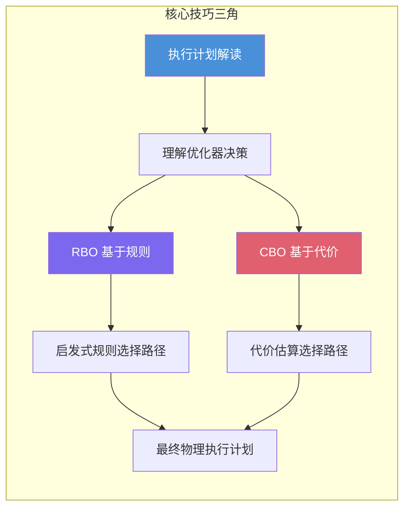
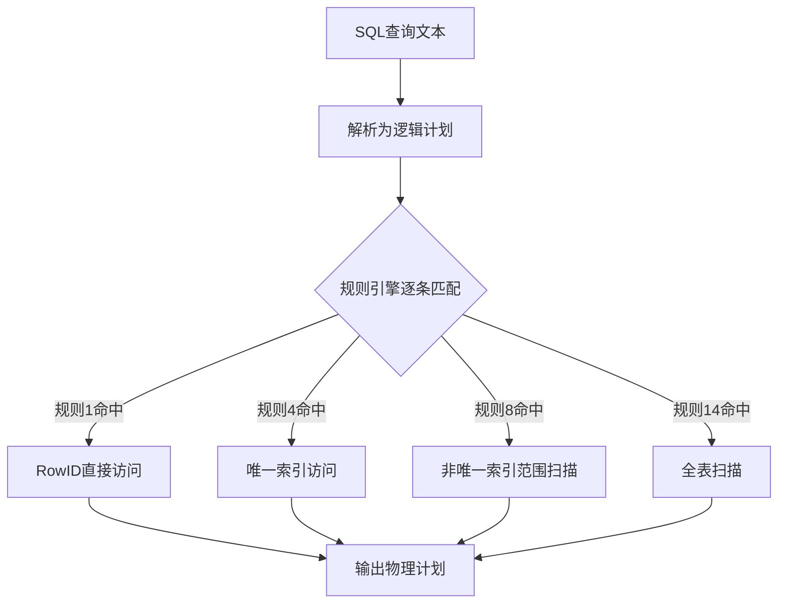
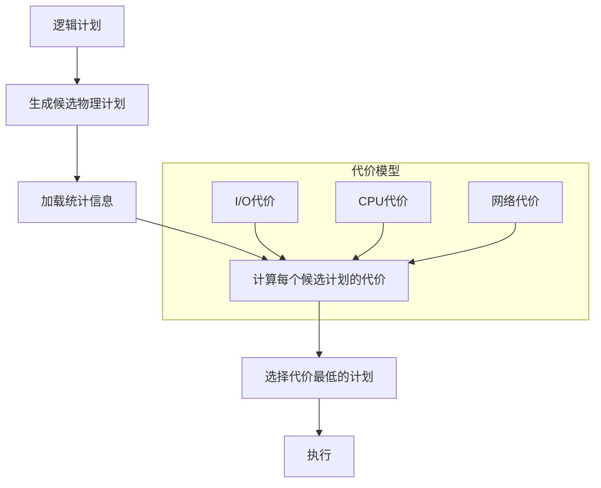
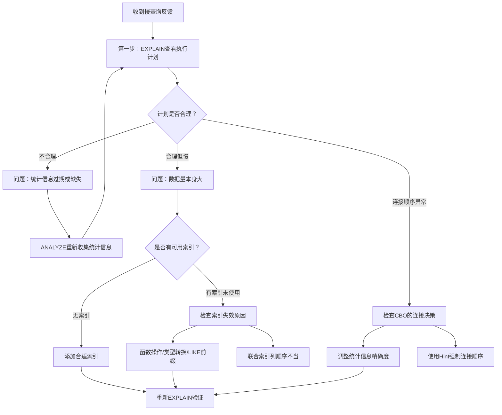

# 核心技巧

在上一节中，我们系统梳理了查询优化的理论根基——关系代数等价变换、代价模型数学原理、统计信息理论、连接算法分析。理论告诉我们"为什么"，而本节要回答"怎么做"。

查询优化的三大核心技巧——**执行计划解读**、**基于规则的优化（RBO）**、**基于代价的优化（CBO）**——构成了优化器从"理解SQL意图"到"生成最优执行方案"的完整链路。掌握这三项技巧，是诊断慢查询、调优数据库性能的必备能力。



---

## 一、三大技巧的关系与定位

三大技巧并非孤立存在，它们形成了一个层层递进的认知体系：

| 技巧 | 定位 | 核心问题 | 读者收获 |
|------|------|----------|----------|
| 执行计划解读 | 诊断工具 | "优化器选了什么方案？" | 能读懂EXPLAIN输出，识别性能瓶颈 |
| RBO | 规则引擎 | "按照经验法则应该怎么做？" | 理解启发式优化的确定性行为和局限性 |
| CBO | 代价估算 | "哪种方案实际代价最低？" | 理解统计信息、选择性估计、代价模型 |

**学习路径建议**：先掌握执行计划解读（这是所有优化工作的起点），再理解RBO的规则逻辑（理解简单查询的优化行为），最后深入CBO（理解复杂查询的优化原理）。三者相辅相成——执行计划告诉你"结果是什么"，RBO和CBO告诉你"为什么会这样"。

---

## 二、执行计划：优化器的"决策报告"

### 2.1 为什么执行计划是第一要务

执行计划是优化器对一条SQL查询的最终回答——它详细记录了数据库将如何获取和处理数据。当你面对一条慢查询时，第一步永远是查看执行计划，而不是猜测原因。没有执行计划的优化就是盲人摸象。

执行计划记录的信息包括：
- **访问路径**：全表扫描、索引扫描、索引覆盖扫描，还是直接定位行
- **连接算法**：嵌套循环连接、哈希连接、排序合并连接中的哪一种
- **连接顺序**：多个表的连接先后次序
- **过滤节点**：哪些条件在哪个阶段被执行
- **代价估算**：优化器预估的行数和代价

### 2.2 EXPLAIN命令实战

不同的数据库提供了不同的执行计划查看命令，核心逻辑一致但输出格式各异：

```sql
-- PostgreSQL：EXPLAIN ANALYZE 是最强大的诊断工具
EXPLAIN (ANALYZE, BUFFERS, FORMAT TEXT)
SELECT o.id, c.name, o.amount
FROM orders o JOIN customers c ON o.customer_id = c.id
WHERE o.status = 'pending' AND o.amount > 100;

-- 输出示例（解读要点）：
-- Hash Join  (cost=12.50..4580.25 rows=1200 width=48) (actual time=0.15..45.20 rows=1180 loops=1)
--   Hash Cond: (o.customer_id = c.id)
--   ->  Seq Scan on orders o  (cost=0.00..4420.00 rows=24000 width=20) (actual time=0.02..40.10 rows=23800 loops=1)
--         Filter: ((status = 'pending') AND (amount > '100'))
--         Rows Removed by Filter: 976200
--   ->  Hash  (cost=8.20..8.20 rows=520 width=36) (actual time=0.10..0.10 rows=520 loops=1)
--         Buckets: 1024  Batches: 1  Memory Usage: 37kB
-- Planning Time: 0.08 ms
-- Execution Time: 45.35 ms
```

```sql
-- MySQL：EXPLAIN 是基础，EXPLAIN ANALYZE 从8.0.18开始支持
EXPLAIN SELECT o.id, c.name, o.amount
FROM orders o JOIN customers c ON o.customer_id = c.id
WHERE o.status = 'pending' AND o.amount > 100;

-- 输出解读：
-- id | select_type | table | type | possible_keys | key  | key_len | ref  | rows | Extra
--  1 | SIMPLE      | o     | ref  | idx_status    | idx_status | ... | ... | 24000 | Using where
--  1 | SIMPLE      | c     | eq_ref | PRIMARY    | PRIMARY    | ... | ... | 1     | NULL
```

### 2.3 执行计划解读的核心原则

**原则一：cost（代价）从上往下累加**

执行计划是一棵树，每个节点的cost代表"这个操作本身的代价+所有子节点的代价"。根节点的总cost就是整条查询的预估总代价。

**原则二：rows（行数）估算的偏差是最大的风险**

优化器的rows估算如果严重偏离实际行数，后续所有决策（连接顺序、连接算法）都可能出错。这是CBO面临的最核心挑战——基数估计误差会在多层操作中累积放大。

**原则三：actual time（实际时间）与cost对比发现异常**

如果某个节点的actual time远高于预估，说明优化器低估了数据量或高估了索引效率。这是诊断统计信息过期的关键信号。

**原则四：关注"过滤掉多少行"（Rows Removed by Filter）**

当Seq Scan后出现大量Rows Removed by Filter，说明缺少合适索引导致全表扫描。过滤比例越大，优化空间越大。

---

## 三、RBO：确定性优先的规则引擎

### 3.1 RBO的核心逻辑

RBO（Rule-Based Optimization，基于规则的优化器）通过预定义的规则集合来决定查询执行策略。它不关心"哪种方案更便宜"，而是回答"按照经验法则，哪种方案更可能最优"。

RBO的最大优势是**确定性**——相同的SQL在相同的表结构下，永远产生相同的执行计划。这在简单查询场景中是巨大优势，因为开发者可以预判优化器行为，针对性地编写SQL。

### 3.2 RBO的工作机制



以Oracle的15条经典RBO规则为例，优化器从规则1开始逐条匹配，一旦某条规则适用就选定执行路径，不再检查更低优先级的规则：

| 规则编号 | 规则名称 | 典型触发条件 | 优先级 |
|---------|---------|-------------|--------|
| 1 | RowID直接访问 | `WHERE ROWID = :rid` | 最高 |
| 4 | 唯一索引/主键 | `WHERE pk = :val` | 极高 |
| 8 | 非唯一索引范围 | `WHERE col BETWEEN :a AND :b` | 中高 |
| 11 | 索引覆盖 | 查询列全部在索引中 | 中等 |
| 14 | 全表扫描（非并行） | 无索引可用 | 最低 |

**关键陷阱**：RBO看到索引就倾向使用索引，不关心数据分布。当一条查询需要返回表中80%的数据时，全表扫描实际更快，但RBO可能仍然选择索引——因为规则只看"索引存不存在"，不看"数据量有多大"。

### 3.3 RBO的适用场景与局限

**RBO仍然发挥作用的场景**：
- 无统计信息时（新表、数据频繁变更的表）
- 简单查询（有索引时，规则足以做出正确选择）
- 兼容性需求（老系统升级时保留行为不变）
- 嵌入式数据库（SQLite等轻量引擎用简化规则降低开销）

**RBO的主要局限**：
- 无法根据数据量选择最优路径（索引不一定比全表扫描快）
- 对复杂多表连接的连接顺序决策能力弱
- 无法感知统计信息变化（数据倾斜时决策容易出错）
- OR条件、函数操作等复杂场景处理能力有限

---

## 四、CBO：代价驱动的智能优化

### 4.1 CBO的核心逻辑

CBO（Cost-Based Optimization，基于代价的优化器）通过定量估算每个候选计划的执行代价，选择代价最低的计划。它是现代数据库优化器的主流方案——PostgreSQL、MySQL 8.0+、Oracle 12c+都以CBO为主。

CBO的工作流程：



### 4.2 CBO的三大支柱

| 支柱 | 作用 | 关键组件 |
|------|------|----------|
| 代价模型 | 定义"代价"的计算公式 | I/O成本、CPU成本、启动成本 |
| 统计信息 | 描述数据分布特征 | 行数、NDV、直方图、MCV |
| 选择性估计 | 预估谓词过滤后的行数 | 等值估计、范围估计、多谓词组合 |

**代价模型示例（PostgreSQL默认参数）**：
总代价 = I/O代价 + CPU代价

seq_page_cost = 1.0          -- 顺序读一页的代价基准
random_page_cost = 4.0        -- 随机读一页（约4倍顺序读）
cpu_tuple_cost = 0.01         -- 处理一个元组的CPU代价
cpu_index_tuple_cost = 0.005  -- 处理一个索引元组的CPU代价

**选择性估计的核心公式**：
等值谓词: sel(col = val) = 1 / NDV(col)          -- 均匀分布假设
范围谓词: sel(col > val) = (max - val) / (max - min)  -- 线性假设
多谓词AND: sel(P1 AND P2) = sel(P1) × sel(P2)    -- 独立性假设

### 4.3 CBO面临的挑战

CBO并非完美，它面临的核心挑战包括：

**挑战一：基数估计误差的累积放大**

如果两表连接的基数估计偏差2倍，在此基础上再连接第三表时，误差可能放大到4倍甚至更多。这是误差传播（Error Propagation）效应，是CBO面临的最大挑战。

**挑战二：独立性假设的失效**

`WHERE city = 'Beijing' AND province = 'Beijing'`——两个条件高度相关，但独立性假设会严重高估选择性。解决方法包括多列直方图、相关性估计、采样估算。

**挑战三：统计信息过期**

数据频繁变更后，统计信息可能不再反映真实分布。PostgreSQL通过autovacuum自动触发ANALYZE，MySQL通过InnoDB的采样统计自动维护。但仍需注意：批量导入大量数据后必须手动ANALYZE。

**挑战四：参数嗅探（Parameter Sniffing）**

同一查询模板，不同参数值可能需要完全不同的执行计划。SQL Server、PostgreSQL等系统引入了计划缓存失效、参数定制化等机制来应对。

---

## 五、从技巧到实践：优化决策框架

在实际工作中，面对一条慢查询，应该按照以下决策框架来应用三大技巧：



### 5.1 按查询复杂度选择策略

| 查询复杂度 | 推荐策略 | 关键动作 |
|-----------|---------|----------|
| 单表简单查询 | RBO足够 | 确保索引存在且写法正确 |
| 单表多条件查询 | RBO + 索引设计 | 联合索引列顺序遵循最左前缀 |
| 两表连接查询 | CBO为主 | 检查连接算法选择是否合理 |
| 多表连接查询 | 深度CBO | 连接顺序优化，必要时用Hint |
| 子查询/CTE | 重写优先 | 考虑将子查询改写为JOIN |

### 5.2 常见优化手段速查表

| 问题现象 | 可能原因 | 优化手段 | 涉及技巧 |
|---------|---------|---------|---------|
| Seq Scan全表扫描 | 缺少索引或选择性低 | 添加索引 / 改写SQL | RBO索引规则 |
| Hash Join内存溢出 | 内表过大 | 调整work_mem / 改用Merge Join | CBO代价模型 |
| Nested Loop嵌套过深 | 连接顺序不当 | 强制连接顺序 / 统计信息更新 | CBO连接顺序 |
| Sort操作使用磁盘 | work_mem过小 | 增大work_mem / 添加排序索引 | CBO内存估算 |
| 索引存在但未使用 | 函数操作/类型转换 | 修正SQL写法 / 添加函数索引 | RBO规则约束 |

---

## 六、本节内容导读

本节包含三篇详细的技术文章，分别深入展开三大核心技巧：

| 篇目 | 核心内容 | 适用读者 |
|------|---------|---------|
| [技巧1：执行计划](01-技巧1执行计划.md) | EXPLAIN命令详解、各数据库执行计划输出解读、执行计划树分析方法、从执行计划诊断性能问题的系统方法 | 所有开发者（入门必读） |
| [技巧2：RBO优化](02-技巧2RBO优化.md) | Oracle RBO 15条规则详解、MySQL/PostgreSQL/SQLite的规则行为对比、RBO陷阱与规避、利用规则确定性进行查询重写 | 中级开发者（理解优化器行为） |
| [技巧3：CBO优化](03-技巧3CBO优化.md) | 代价模型参数调优、统计信息收集策略、选择性估计的精确化、连接顺序优化、自适应查询优化 | 高级开发者/DBA（深入优化原理） |

**阅读建议**：
- **入门读者**：先读"技巧1执行计划"，掌握EXPLAIN的基本用法，然后读"技巧2RBO"理解索引选择的规则逻辑
- **中级读者**：重点读"技巧2RBO"和"技巧3CBO"，理解两种优化器的差异和适用场景
- **高级读者/DBA**：三篇都精读，重点关注CBO的代价模型参数调优和统计信息管理策略

---

## 七、核心概念速查

在进入详细内容之前，先熟悉以下关键概念：

| 概念 | 定义 | 重要性 |
|------|------|--------|
| 执行计划（Execution Plan） | 优化器为SQL生成的具体执行步骤 | 一切优化工作的诊断起点 |
| 访问路径（Access Path） | 数据库从表中获取数据的方式（索引/全表扫描） | 直接决定单表查询性能 |
| 选择性（Selectivity） | 谓词过滤后保留的行数比例 | CBO决策的核心依据 |
| 基数（Cardinality） | 操作输出的行数 | 连接算法和连接顺序选择的基础 |
| I/O代价 | 读取数据页的开销 | 代价模型的主要组成部分 |
| 统计信息 | 描述数据分布的元数据（行数、NDV、直方图等） | CBO做出正确决策的前提 |
| 启发式规则 | 不依赖统计信息的通用优化规则 | RBO的核心，简单查询的有效策略 |
| 代价单位（Cost Unit） | PostgreSQL中无量纲的代价度量 | 通过参数映射到实际时间 |
