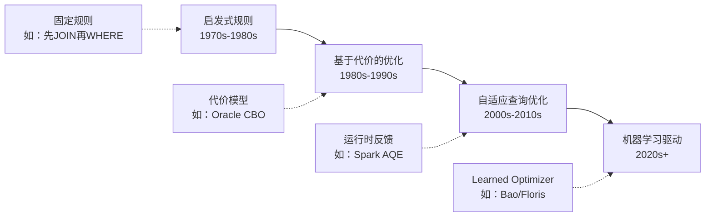
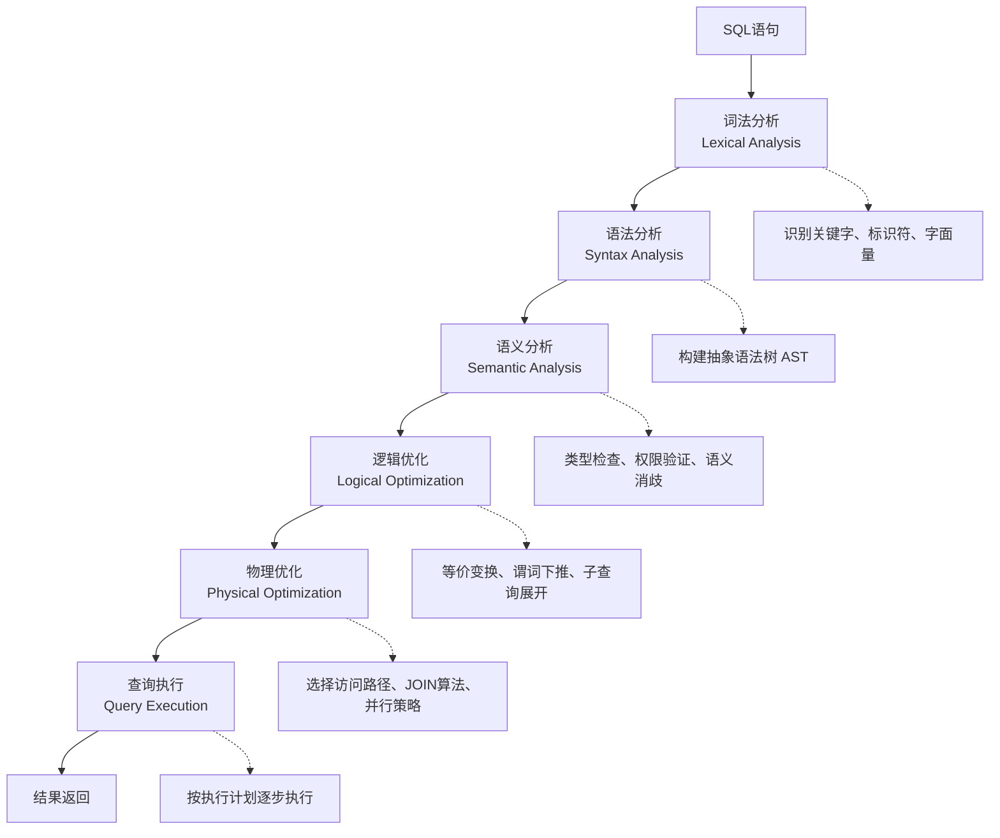

## 查询优化核心概念

查询优化是数据库系统的"大脑"——它决定了每一条SQL语句以何种路径执行、消耗多少资源、返回多快的结果。同一个查询请求，优化器的选择可能带来百倍的性能差异。本节将从查询处理的完整流程出发，系统梳理查询优化的核心概念、关键模型与基础指标，为后续章节的深入探讨打下坚实基础。

### 1. 什么是查询优化

#### 1.1 定义与本质

查询优化（Query Optimization）是指在数据库管理系统中，对用户提交的SQL查询进行语义分析、逻辑变换和物理执行策略选择的过程。其核心目标是：**在保证语义正确性的前提下，找到执行代价最小的执行方案。**

这里需要理解一个关键区别——用户写的是"做什么"（What），而优化器决定的是"怎么做"（How）。例如：

```sql
-- 用户声明：我要什么
SELECT c.name, o.total
FROM customers c
JOIN orders o ON c.id = o.customer_id
WHERE o.date >= '2024-01-01'
  AND o.total > 1000;

-- 优化器决定：怎么高效地拿到结果
-- 可能的执行路径之一：
-- 1. 用索引 idx_order_date 快速扫描 orders 表的日期范围
-- 2. 对过滤后的 orders 结果做 nested loop join
-- 3. 避免全表扫描 customers 表，只读取匹配的行
```

#### 1.2 为什么查询优化至关重要

一个未经优化的查询可能引发连锁反应：

| 场景 | 未优化的后果 | 优化后的效果 |
|------|-------------|-------------|
| 电商订单查询 | 全表扫描千万级订单，耗时30秒 | 索引+分区剪枝，响应<50ms |
| 日志分析 | 全量读取日志表，内存溢出 | 谓词下推+列裁剪，只读取必要数据 |
| 报表聚合 | 多表笛卡尔积后聚合，CPU打满 | 提前聚合+物化视图，秒级出结果 |

在OLTP（在线事务处理）系统中，查询延迟直接影响用户体验和业务转化率；在OLAP（在线分析处理）系统中，查询效率决定了分析人员能否及时获得洞察。

#### 1.3 查询优化的演进历程



- **启发式规则优化**：基于经验规则重写查询（如"选择性高的表先过滤"），简单但缺乏灵活性
- **基于代价的优化（CBO）**：为每种候选执行计划估算代价（I/O、CPU、内存），选择代价最小的方案，是当前主流方法
- **自适应查询优化**：在执行过程中根据实际运行时统计信息动态调整执行计划（如Apache Spark的AQE）
- **机器学习驱动**：利用历史查询的执行反馈训练模型，辅助或替代传统代价估算，是前沿研究方向

### 2. 查询处理的完整流程

一条SQL从提交到返回结果，经历以下阶段。理解这个流程是理解优化的前提。



#### 2.1 解析阶段（Parsing）

解析器将SQL文本转换为内部表示（抽象语法树，AST）。这个过程包括：

- **词法分析**：将SQL字符串拆分为token流。例如 `SELECT name FROM users WHERE id = 1` 被拆分为 `[SELECT, name, FROM, users, WHERE, id, =, 1]`
- **语法分析**：根据SQL语法规则，将token流组装成AST。如果语法错误（如缺少FROM子句），在此阶段报错
- **语义分析**：验证查询的语义正确性，包括表名/列名是否存在、数据类型是否匹配、用户是否有权限执行该操作

#### 2.2 逻辑优化阶段

逻辑优化（也叫代数优化或查询重写）在不改变查询语义的前提下，将AST变换为更高效的逻辑查询计划。常见变换包括：

- **等值连接消除**：将子查询转换为JOIN
- **谓词下推（Predicate Pushdown）**：将过滤条件尽可能下推到数据源附近
- **列裁剪（Column Pruning）**：只保留需要的列，丢弃无关列
- **常量折叠（Constant Folding）**：在编译期计算常量表达式

```sql
-- 谓词下推示例

-- 原始查询
SELECT *
FROM (
    SELECT * FROM orders WHERE amount > 100
) o
JOIN customers c ON o.customer_id = c.id
WHERE o.region = 'Asia';

-- 优化后：过滤条件被下推到最内层
SELECT *
FROM orders o
JOIN customers c ON o.customer_id = c.id
WHERE o.amount > 100
  AND o.region = 'Asia';
```

#### 2.3 物理优化阶段

物理优化将逻辑计划转换为可执行的物理计划，核心决策包括：

| 决策类型 | 问题描述 | 典型选项 |
|---------|---------|---------|
| 访问路径 | 如何从表中读取数据 | 全表扫描、索引扫描、索引覆盖扫描 |
| JOIN算法 | 两表连接的执行方式 | Nested Loop、Hash Join、Sort-Merge Join |
| JOIN顺序 | 多表连接的执行顺序 | 左深树、右深树、星型拓扑 |
| 并行策略 | 是否并行执行、如何分区 | 单线程、多线程、分布式 |
| 物化策略 | 中间结果如何传递 | 流式传递、物化到磁盘、物化到内存 |

### 3. 代价模型：优化器的"度量衡"

代价模型（Cost Model）是基于代价的优化器（CBO）的核心组件，负责量化评估每种候选执行计划的资源消耗。

#### 3.1 代价的组成

一个查询的执行代价通常由以下几部分构成：

总代价 = I/O代价 + CPU代价 + 内存代价 + 网络代价（分布式场景）

| 代价类型 | 含义 | 典型度量方式 |
|---------|------|-------------|
| I/O代价 | 磁盘读写次数 | 页（Page）数 × 每页I/O开销 |
| CPU代价 | 计算操作次数 | 比较次数、哈希计算次数 |
| 内存代价 | 内存占用与交换开销 | 缓冲池命中率、溢写磁盘次数 |
| 网络代价 | 节点间数据传输量 | 传输的数据量 × 网络延迟 |

#### 3.2 代价估算的关键输入

代价模型的准确性严重依赖于底层统计数据的质量：

- **表的行数**：`pg_class.reltuples`（PostgreSQL）、`USER_TABLES.NUM_ROWS`（Oracle）
- **列的数据分布**：直方图（Histogram），记录数据在各个值域区间的分布密度
- **列的基数（Cardinality）**：`COUNT(DISTINCT column)`，估算去重后的唯一值数量
- **索引信息**：索引类型（B-tree、Hash、GIN、GiST）、索引高度、叶节点密度
- **数据页面数量**：表和索引占用的物理页面数

```sql
-- PostgreSQL 中查看表的统计信息
SELECT relname, reltuples, relpages
FROM pg_class
WHERE relname = 'orders';

-- 查看列的统计直方图
SELECT histogram_bounds, n_distinct, most_common_vals
FROM pg_stats
WHERE tablename = 'orders' AND attname = 'amount';
```

#### 3.3 代价估算的误差问题

代价估算并非完美，常见的误差来源包括：

1. **数据倾斜**：直方图将列值等宽分桶，无法精确捕捉长尾分布。例如，订单金额99%在100元以下，但有1%超过10万元——等宽直方图可能无法准确表示这种极端偏斜
2. **列间相关性**：独立性假设认为不同列的选择率可以相乘，但现实中"城市=北京"和"省份=北京"高度相关
3. **跨表关联基数**：多表JOIN时，估算误差会以乘积形式放大，导致执行计划严重偏差
4. **统计信息过期**：大量数据写入后未及时ANALYZE，统计信息与实际数据分布脱节

### 4. 查询执行计划（Query Plan）

执行计划是优化器的最终输出——一棵描述查询如何执行的树状结构。学会阅读执行计划是数据库调优的第一技能。

#### 4.1 执行计划的基本结构

执行计划从叶节点向根节点执行，每个节点代表一个操作：

Seq Scan on orders  (cost=0.00..35.50 rows=1000 width=24)
  Filter: (amount > 1000)
-> Hash Join  (cost=8.12..42.67 rows=500 width=32)
     Hash Cond: (o.customer_id = c.id)
     -> Seq Scan on orders o  (cost=0.00..35.50 rows=1000 width=24)
          Filter: (amount > 1000)
     -> Hash  (cost=7.50..7.50 rows=417 width=16)
          -> Seq Scan on customers c  (cost=0.00..7.50 rows=417 width=16)

#### 4.2 关键字段解读

| 字段 | 含义 | 关注点 |
|------|------|--------|
| `cost=0.00..35.50` | 启动代价..总代价 | 总代价越小越好 |
| `rows=1000` | 预估返回行数 | 与实际值偏差大说明统计不准 |
| `width=24` | 每行预估字节数 | 影响内存和网络开销 |
| `actual time` | 实际执行时间 | 运行时统计（EXPLAIN ANALYZE） |
| `loops` | 循环执行次数 | 子节点被重复调用的次数 |

#### 4.3 EXPLAIN命令的使用

```sql
-- 基本用法：只看执行计划，不实际执行
EXPLAIN SELECT * FROM orders WHERE amount > 1000;

-- 详细用法：实际执行并显示运行时统计
EXPLAIN (ANALYZE, BUFFERS, FORMAT TEXT)
SELECT o.*, c.name
FROM orders o
JOIN customers c ON o.customer_id = c.id
WHERE o.amount > 1000;

-- JSON格式：便于程序化分析
EXPLAIN (ANALYZE, FORMAT JSON)
SELECT * FROM orders WHERE amount > 1000;
```

### 5. 核心优化策略概览

在后续章节中将详细展开，此处先建立整体认知：

#### 5.1 索引优化

索引是查询优化最直接、最有效的手段。通过建立合适的索引，将全表扫描（O(N)）降低为索引查找（O(logN)）甚至覆盖扫描（O(1)）。

| 索引类型 | 适用场景 | 时间复杂度 |
|---------|---------|-----------|
| B-tree索引 | 等值查询、范围查询、排序 | O(logN) |
| Hash索引 | 精确等值查询 | O(1) 平均 |
| GIN索引 | 全文搜索、数组包含查询 | O(N) 最坏，实际通常很快 |
| GiST索引 | 地理空间查询、范围类型 | 取决于操作符类 |
| 部分索引 | 只索引满足特定条件的行 | 节省存储和维护成本 |
| 覆盖索引 | 查询列全部包含在索引中 | 避免回表，O(logN)→O(1) |

#### 5.2 查询重写优化

通过等价变换将查询改写为更高效的形式，常见技术包括：

- **子查询展开**：将关联子查询转换为JOIN
- **视图合并**：将视图查询内联到外层查询
- **连接消除**：如果JOIN不影响结果，直接去除
- **EXISTS优化**：将EXISTS改写为半连接（Semi Join）
- **LIMIT优化**：为TOP-N查询选择带LIMIT的执行策略

#### 5.3 统计信息维护

准确的统计信息是优化器做出正确决策的前提：

```sql
-- PostgreSQL：更新单个表的统计信息
ANALYZE orders;

-- 更新所有表
ANALYZE;

-- 调整统计采样精度（默认100，最大10000）
ALTER TABLE orders ALTER COLUMN amount SET STATISTICS 500;
ANALYZE orders;

-- Oracle：收集统计信息
EXEC DBMS_STATS.GATHER_TABLE_STATS('SCHEMA', 'ORDERS', 
     ESTIMATE_PERCENT => 100,
     METHOD_OPT => 'FOR ALL COLUMNS SIZE AUTO');
```

### 6. 关键性能指标

评估查询优化效果需要关注以下核心指标：

| 指标 | 定义 | 健康基准 | 劣化信号 |
|------|------|---------|---------|
| 平均查询延迟 | 从提交到返回结果的平均时间 | OLTP < 100ms, OLAP < 10s | 超过基线2倍以上 |
| P99延迟 | 第99百分位响应时间 | OLTP < 500ms | 长尾延迟飙升 |
| 查询吞吐量 | 单位时间内处理的查询数 | 取决于硬件和并发模型 | 突然下降 |
| 缓冲池命中率 | 内存中直接命中的页比例 | > 99% | 低于95%需关注 |
| I/O等待占比 | 查询等待磁盘I/O的时间比例 | < 10% | 高于30%需优化 |
| 扫描行数/返回行数 | 扫描效率比 | 越接近1越好 | 比值>100说明索引缺失 |
| 排序溢出率 | 排序操作溢写磁盘的比例 | 0% | 高于0%需调大work_mem |

### 7. 常见误区与纠正

| 误区 | 纠正 |
|------|------|
| "加索引就能解决所有慢查询" | 索引有写放大成本，过多索引会拖慢写入。需根据实际查询模式选择性建立 |
| "EXPLAIN看到Seq Scan就是坏事" | 小表（<几千行）的全表扫描往往比索引扫描更快，因为避免了索引查找的随机I/O |
| "优化器永远比人聪明" | 对于复杂多表JOIN、数据严重倾斜等场景，优化器的代价估算可能失误，需要人工干预（Hint、物化视图等） |
| "统计信息会自动保持准确" | 大量数据变更后必须手动ANALYZE，否则优化器基于过期数据做出错误决策 |
| "执行计划一旦生成就不会变" | PostgreSQL支持plan caching，但很多因素会导致重新生成计划。Oracle的绑定变量窥探（Bind Peeking）也会导致计划不稳定 |

### 8. 本章路线图

本章后续内容将沿着"道→法→术→器"的路径逐层深入：

1. **本节（核心概念）**：建立整体认知框架
2. **索引优化原理**：深入B-tree、Hash、GIN等索引结构的工作机制与适用场景
3. **查询计划分析**：掌握EXPLAIN工具，学会诊断慢查询的执行计划
4. **连接优化**：多表JOIN的算法选择、顺序优化与分布式场景
5. **统计信息与代价估算**：代价模型的数学原理与误差校正
6. **实战调优案例**：从真实生产环境的慢查询出发，完成端到端的优化闭环
