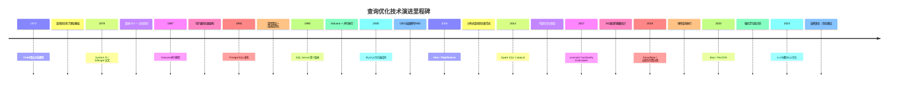

# 查询优化技术演进

查询优化技术的发展史，本质上是一部"如何让数据库在海量执行计划中找到最优解"的探索史。从1970年代System R的开创性工作，到2020年代基于机器学习的自适应优化器，每一次范式跃迁都伴随着理论突破、硬件变革和业务需求的共同驱动。理解这条演进脉络，不仅有助于把握当前优化器的设计哲学，更能帮助工程师在面对新问题时做出正确的技术选型。

---

## 1. 萌芽期：手写访问路径与启发式规则（1960s-1970s初）

### 1.1 背景与约束

在关系型数据库诞生之前，层次型数据库（如IBM的IMS）和网状型数据库（如CODASYL DBTG）采用固定的数据访问路径。程序员必须在应用程序中显式指定如何从一个记录导航到下一个记录——访问路径完全由人决定，数据库本身不做任何优化。

这种模式存在根本性问题：

- **程序员负担重**：每次查询都必须手动编写导航逻辑，一旦数据结构变更，大量代码需要重写
- **访问路径固化**：选择哪个索引、以什么顺序连接，都写死在代码里，无法根据数据分布变化自适应调整
- **查询不透明**：数据库不理解"意图"，只执行机械指令，无法在语义层面做优化

### 1.2 E.F. Codd与关系模型的奠基

1970年，E.F. Codd发表论文"A Relational Model of Data for Large Shared Data Banks"，提出关系模型。关系模型最深远的影响之一是：**将数据的逻辑描述与物理存储彻底解耦**。用户用关系代数表达查询意图，由数据库系统负责决定如何高效执行。

这一思想解放意味着：**优化器有了存在的空间**——既然用户不关心数据怎么存、怎么取，那系统就可以自由选择最优的执行策略。

### 1.3 早期实现的探索

最早的商业关系数据库（如Oracle V2, 1979）开始尝试自动化查询优化，但实现方式非常粗糙：

- **固定连接顺序**：按照SQL中表出现的顺序依次连接，不做重排
- **简单索引选择**：如果有单列索引恰好匹配WHERE条件，就使用该索引
- **硬编码规则**：优化逻辑直接嵌入执行代码，不具通用性

这种早期方案的问题显而易见：它完全无法处理多表连接的组合爆炸问题，也无法根据数据量和数据分布动态调整策略。

---

## 2. 突破期：System R与基于代价的优化（1979）

### 2.1 System R的历史性贡献

1979年，IBM的Patricia Selinger等人发表了数据库领域的里程碑论文"Access Path Selection in a Relational Database Management System"，描述了System R优化器的设计。这篇论文奠定了现代查询优化的基础，其核心贡献包括：

**（1）基于代价的优化（Cost-Based Optimization, CBO）框架**

System R第一次系统化地提出：不应该用启发式规则选择执行计划，而应该**量化估算每个候选计划的执行代价**，选择代价最低的计划。这标志着查询优化从"经验主义"走向"理性主义"。

代价模型的数学表达：

TotalCost(plan) = Σ cost(op_i)，其中op_i是计划中的每个操作

每个操作的代价由三部分组成：
  I/O Cost  = 页面读取数 × 磁盘I/O单位代价
  CPU Cost  = 处理元组数 × CPU单位代价
  Network Cost = 数据传输量 × 网络单位代价（分布式场景）

**（2）动态规划的连接顺序优化**

System R将连接顺序搜索问题建模为组合优化问题，使用**动态规划**在O(n³)时间内求解最优连接顺序（n为表的数量）。在此之前，穷举所有可能的连接顺序是阶乘级复杂度——10个表的连接需要探索约360万种顺序，而动态规划将其压缩为可管理的搜索空间。

动态规划的关键思想是：**最优的n表连接计划，一定由最优的子计划组合而成**（最优子结构性质）。因此，只需保存每个子集的最优计划，自底向上逐步构建更大的计划：

DP搜索过程（以表集合{A, B, C, D}为例）：

第1步：计算所有单表的最优扫描计划
  {A}: SeqScan(A) 或 IndexScan(A)
  {B}: SeqScan(B)
  {C}: IndexScan(C)
  {D}: SeqScan(D)

第2步：计算所有两表子集的最优连接计划
  {A,B}: min{ cost({A})+cost(A⋈B), cost({B})+cost(B⋈A) }
  {A,C}: ...
  ...

第3步：三表子集
  {A,B,C}: 枚举所有分割方式 {A,B}⋈{C}, {A,C}⋈{B}, {B,C}⋈{A}
           取代价最低者

第4步：四表全集
  {A,B,C,D}: 枚举所有分割方式，取代价最低者

**（3）左深树搜索策略**

System R引入了**左深树（Left-Deep Tree）**约束：在连接计划中，右子树必须是基表（即不能再是连接操作）。这将搜索空间从所有可能的树形结构缩减为(n-1)!种排列，大幅降低了搜索开销。虽然左深树可能错过最优的右深树或 bushy 树计划，但在实践中性能损失很小。

### 2.2 System R的代价估算体系

System R建立了完整的代价估算方法论，其核心是**选择性估计**：

sel(column = value) = 1 / NDV(column)

sel(column > value) = (max(column) - value) / (max(column) - min(column))

sel(column BETWEEN low AND high) = (high - low) / (max(column) - min(column))

其中NDV（Number of Distinct Values）是列中不同值的数量。这些估算虽然基于均匀分布假设，精度有限，但在当时已经极大地提升了查询性能。

### 2.3 历史影响

System R优化器的思想被此后几乎所有主流数据库系统继承和发展：

| 数据库系统 | 发布年份 | 对System R的继承 |
|------------|----------|-------------------|
| Oracle | 1979 | 引入基于代价的优化器（CBO），动态规划连接顺序 |
| DB2 | 1983 | IBM内部直接继承System R优化器设计 |
| PostgreSQL | 1996 | 采用遗传算法替代动态规划，处理大表连接 |
| MySQL (InnoDB) | 2003 | MySQL 5.0引入CBO，逐步替代纯RBO模式 |
| SQL Server | 1995 | 基于System R框架，增加自适应优化能力 |

---

## 3. 搜索框架期：Volcano模型与可扩展优化器（1987-1990s）

### 3.1 从System R到Volcano

System R优化器虽然开创了CBO范式，但其实现存在一个关键局限：**优化器的搜索策略与物理操作算法紧耦合**。添加新的连接算法或扫描方式，往往需要大幅修改优化器代码。

1987年，Goetz Graefe和Leonard McGuire在论文"Emerging Technology: Volcano -- An Extensible and Parallel Query Evaluation System"中提出了**Volcano执行模型**（也称Volcano iterator model），从根本上解决了这个问题。

### 3.2 Volcano模型的核心设计

Volcano模型的核心思想是**迭代器（Iterator）接口**：每个执行操作符都实现统一的`Open()→Next()→Close()`接口，通过流水线（pipelining）方式传递数据。

┌─────────────────────────────────────────┐
│           Volcano Iterator Model         │
├─────────────────────────────────────────┤
│                                         │
│  每个操作符实现三个接口：                 │
│  ├── Open(): 初始化操作符状态            │
│  ├── Next(): 返回下一条结果              │
│  └── Close(): 释放资源                  │
│                                         │
│  调用方式：自顶向下请求，自底向上返回      │
│                                         │
│  [HashJoin]                              │
│   ├── Next()                            │
│   │    ├── [HashBuild: Scan Inner]      │
│   │    └── [HashProbe: Scan Outer]      │
│   └── 返回匹配行                         │
│                                         │
└─────────────────────────────────────────┘

**关键优势：**

1. **数据按需传递（Pull-Based）**：上层操作符调用Next()时，下层才执行计算，避免了物化所有中间结果的内存开销
2. **物理操作符可替换**：通过统一接口，HashJoin和NestedLoopJoin可以互换使用，优化器只需选择代价最低的组合
3. **支持并行执行**：多个流水线可以并行运行，每个操作符独立执行

### 3.3 优化器的可扩展架构

Volcano模型将优化器分解为两个独立组件：

┌──────────────┐     ┌──────────────┐
│  优化器框架    │────▶│  执行引擎     │
│  (Optimizer)  │     │  (Executor)  │
├──────────────┤     ├──────────────┤
│ • 搜索策略     │     │ • 迭代器模型  │
│ • 代价模型     │     │ • 内存管理    │
│ • 规则集      │     │ • 并行控制    │
│ • 统计信息    │     │ • I/O调度     │
└──────────────┘     └──────────────┘
  两个组件通过"物理计划树"解耦

**枚举框架（Ennumerator）**：负责搜索所有可能的计划，决定以什么顺序生成候选计划。支持深度优先、广度优先、随机搜索等策略。

**规则/物理操作符**：每个规则定义一种具体的执行方式（如IndexNestedLoopJoin、SortMergeJoin），并提供代价估算函数。

这种分离使得：
- 新增连接算法只需实现Iterator接口和代价估算
- 新增搜索策略只需修改Enumerator
- 两者可以独立演进，互不干扰

### 3.4 Volcano对后续系统的影响

Volcano模型成为后续几乎所有数据库优化器的架构范式：

| 系统 | 实现方式 |
|------|----------|
| PostgreSQL | 经典Volcano迭代器，所有操作符统一Next()接口 |
| SQL Server | Volcano + 并行扩展，支持Exchange操作符 |
| MySQL | 执行器层采用迭代器模型，优化器层分离 |
| ClickHouse | Pipeline执行模型，Volcano的并行化演进 |
| Spark SQL | Catalyst优化器 + Tungsten执行引擎，思想一脉相承 |

---

## 4. 成熟期：统计信息与基数估计的精细化（1990s-2000s）

### 4.1 问题的根源

CBO的核心假设是：**代价估算越准确，选择的计划越优**。但代价估算的精度取决于两个输入：统计信息的准确性和选择性估计模型的合理性。System R时代的简单均匀分布假设在真实场景中频繁失效：

- **数据倾斜**：某省用户占全国60%（如广东），等值谓词`province = '广东'`的选择性远高于均匀分布估计
- **列相关性**：`city = '北京' AND province = '北京'`两条件高度相关，独立性假设严重高估选择性
- **多列谓词**：三个以上谓词的组合选择性误差会指数级放大

### 4.2 直方图技术的演进

**1990年代：等宽直方图**

等宽直方图（Equi-width Histogram）将值域等分为固定数量的桶。实现简单但精度有限——数据倾斜时，某些桶包含绝大部分数据，形同虚设。

**2000年代：等深直方图普及**

等深直方图（Equi-depth / Equi-height Histogram）保证每个桶包含大致相同数量的元组，桶的边界根据数据分布自适应调整。这是目前PostgreSQL和MySQL都采用的直方图方案。

等深直方图的构建过程：
1. 按目标列排序所有值
2. 将排序后的值分为N个桶（N = default_statistics_target）
3. 每个桶包含约 total_rows / N 个值
4. 记录每个桶的边界值和元组数

示例：salary列，10000行数据，4个桶
桶1: [30000, 42000)  2500行  ← 低薪区间较窄，数据密集
桶2: [42000, 58000)  2500行
桶3: [58000, 85000)  2500行  ← 中高薪区间较宽，数据稀疏
桶4: [85000, 150000) 2500行  ← 高薪区间最宽，极少数人

**2010年代：多维直方图与数据草图**

为解决列相关性问题，研究者提出多种高级数据结构：

- **MG（MaxDiff）直方图**：按相邻值差的最大值确定桶边界，在数据分布突变处产生更细粒度的桶
- **KDE（核密度估计）**：非参数方法，不需要预设桶数量，通过核函数平滑估计连续值的分布
- **Count-Min Sketch**：概率数据结构，用固定内存近似统计高频项和范围查询，适合流式数据
- **HyperLogLog**：近似计算NDV（不同值数量），O(log log n)空间复杂度，PostgreSQL和Redis都采用

### 4.3 多列相关性估计

处理列间相关性是基数估计的最大挑战之一。几种主流方案：

**（1）采样法（Sampling）**

从表中随机抽取一小部分数据（如1%），对采样数据执行实际谓词计算，用采样结果估计全表选择性。PostgreSQL的`JOIN SELECTIVITY ESTIMATION`在部分场景下使用采样法。

优点：不假设任何分布，能处理任意复杂的相关性
缺点：采样开销、大范围谓词可能命中不到采样点

**（2）马尔可夫链（Markov Chain）**

记录列值之间的条件概率转移矩阵。例如P(province='北京' | city='北京')=1.0，P(province='广东' | city='深圳')=1.0。

优点：能精确建模列间函数依赖
缺点：存储开销随列数指数增长，只能处理固定列对

**（3）贝叶斯网络（Bayesian Network）**

用有向无环图建模列间的概率依赖关系，自动学习条件概率。Microsoft SQL Server的基数估计器就采用了类似方法。

贝叶斯网络示例（员工表）：

  [department] ──→ [salary]
       │              ↑
       └──→ [location]

边表示条件依赖关系：
P(salary | department, location)  ← salary取决于部门和地点
P(location | department)          ← 地点部分取决于部门

### 4.4 小结：基数估计的精度竞赛

基数估计的准确性直接决定查询计划的质量。Leis等人在2015年VLDB论文"How Good Are Query Optimizers, Really?"中通过Job（Join Order Benchmark）基准测试发现：即使是当时最先进的商用数据库优化器，在某些查询上的基数估计误差也高达**1000倍以上**。这个发现推动了后续十年中基于机器学习的基数估计研究。

---

## 5. 并行化时期：从单线程到并行查询执行（1990s-2010s）

### 5.1 并行化的驱动力

随着硬件从单核CPU演进到多核，数据库系统开始利用并行执行加速查询。并行查询面临的挑战包括：

- **数据分区**：如何将数据均匀分配到多个并行工作线程
- **任务调度**：如何避免某些线程空闲而其他线程过载（数据倾斜）
- **结果合并**：如何正确合并并行产生的中间结果（如并行排序、并行聚合）
- **并发控制**：多个并行线程同时读取数据时的一致性保证

### 5.2 并行执行模型

**Volcano并行模型（1990s）**

在Volcano模型基础上增加Exchange操作符，实现生产者-消费者模式：

并行连接执行示例：

        [HashJoin]
        /        \
[Exchange-Redistribute]   [Exchange-Broadcast]
    /       \                    |
[Thread-1] [Thread-2]      [Table Scan]
[Scan A]   [Scan A]       [Table B]

Exchange操作符负责在并行线程间重新分配数据，常见策略：
- **Redistribute**：按连接键的哈希值重新分区，保证相同键值的数据在同一线程处理
- **Broadcast**：将小表的完整副本广播到所有线程（适合小表驱动的连接）

**Push-Based并行模型（2000s-2010s）**

传统Volcano模型是Pull-Based（自顶向下拉取），在高并发时上下文切换开销大。现代系统转向Push-Based（自底向上推送），操作符主动将结果推给下游：

Pull模型 vs Push模型：

Pull（Volcano）：              Push（Pipeline）：
  客户端请求 →                   数据源推送 →
  HashJoin.Next() →              Scan → 
  Scan.Next() →                  Filter →
  [执行扫描] →                   HashJoin →
  [返回一行] →                   [直接输出多行]
  [客户端再请求]
  
特点：延迟低，内存小              特点：吞吐高，缓存友好

ClickHouse、DuckDB、DataFusion等现代分析型数据库普遍采用Push-Based Pipeline执行模型。

### 5.3 分布式查询优化

分布式数据库（如Google Spanner、CockroachDB、TiDB）面临额外的挑战：

**数据本地性优化**：尽量在数据所在节点执行计算，减少网络传输

分布式连接优化示例：

查询：SELECT * FROM orders o JOIN customers c ON o.cust_id = c.id

方案A（全shuffle）：
  所有节点将orders和customers数据发送到协调节点
  网络传输量：O(|orders| + |customers|)
  
方案B（collocated join）：
  如果orders和customers按cust_id做了相同的哈希分区
  每个节点只需本地连接，无需网络传输
  网络传输量：O(0)

方案C（broadcastr join）：
  如果customers表很小（< 1MB）
  将customers完整广播到所有节点
  每个节点本地连接其orders分区
  网络传输量：O(|customers| × 节点数)

**两阶段聚合（Two-Phase Aggregation）**：

阶段1（局部聚合）：每个节点先在本地做COUNT/SUM
阶段2（全局聚合）：协调节点汇总各节点的局部结果

SELECT dept, SUM(salary) FROM employees GROUP BY dept;

节点1本地：dept_A → 50000, dept_B → 30000
节点2本地：dept_A → 40000, dept_B → 60000
协调节点汇总：dept_A → 90000, dept_B → 90000

相比全量传输（传输所有行），两阶段聚合只传输聚合结果，数据量大幅缩减

---

## 6. 自适应时期：运行时反馈与动态调整（2000s-2010s）

### 6.1 静态优化的局限

传统优化器采用**一次性优化（One-Pass Optimization）**：在查询开始执行前生成完整计划，执行过程中不做调整。这种策略存在根本缺陷：

- **参数变化**：prepared statement中参数不同，最优计划可能不同，但传统优化器用同一个计划
- **统计信息滞后**：ANALYZE执行间隔期间数据可能大幅变化
- **中间结果误判**：嵌套查询的内层结果大小依赖参数，外层优化时无法准确预估

### 6.2 PostgreSQL的遗传算法优化

PostgreSQL采用**遗传算法（Genetic Algorithm, GA）**替代传统动态规划来搜索连接顺序。当连接的表数量超过遗传算法阈值（默认12，可通过`geqo_threshold`调整）时，启用遗传搜索：

遗传算法优化流程：

1. 初始化：随机生成N个连接顺序（种群）
2. 评估：用代价模型计算每个顺序的代价
3. 选择：按适应度（1/代价）选择优秀个体
4. 交叉：将两个父代的连接顺序片段交换，产生子代
5. 变异：随机交换某两个表的位置
6. 重复2-5直到达到最大迭代次数或收敛

优势：搜索空间为O(N×iterations)而非O(n!)
劣势：可能找不到全局最优解

遗传算法的引入使PostgreSQL能处理数十甚至上百个表的连接，代价是可能牺牲部分最优性。

### 6.3 运行时反馈优化（Runtime Feedback Optimization）

自适应优化的核心思想是：**在执行过程中根据实际观测到的数据特征，动态调整执行策略**。

**（1）哈希连接的溢出检测**

嵌套循环的内层如果过大，哈希表无法放入内存，需要溢出到磁盘。自适应优化器在构建哈希表的过程中监控内存使用，如果发现将要溢出，动态切换到Grace Hash Join（分区溢出）：

内存阈值检测流程：
  构建哈希表 → 监控内存使用
  ├── 内存充足 → 继续构建，完成后Probing
  └── 内存超阈值 → 停止构建
       ├── 分区溢出到磁盘
       ├── 对每个分区重新构建哈希表（通常能放入内存）
       └── 逐分区执行连接

**（2）Join Predicate Pushdown的动态调整**

某些查询中，外层谓词的选择性在执行前无法预估（如`WHERE x IN (SELECT ...)`）。自适应优化器采用**两阶段执行**：

阶段1：执行子查询，收集统计信息
  SELECT id FROM t2 WHERE ... → 收集结果集大小、值分布

阶段2：根据收集到的信息优化外层计划
  如果结果集小 → 用Nested Loop + Index
  如果结果集大 → 用Hash Join

### 6.4 商用数据库中的自适应优化

| 数据库 | 自适应特性 | 实现方式 |
|--------|-----------|----------|
| SQL Server | Adaptive Join | 运行时在Hash Join和Nested Loop之间切换 |
| SQL Server | Interleaved Execution | 跨语句的多阶段自适应执行 |
| Oracle | Adaptive Plans | 并行度自适应、连接方法自适应 |
| PostgreSQL | Memoize | 缓存嵌套循环内层查找结果 |
| MySQL 8.0 | Hash Join | MySQL 8.0.18引入，支持运行时溢出处理 |

---

## 7. 智能化时期：基于机器学习的查询优化（2017-至今）

### 7.1 为什么需要ML

传统优化器面临的两个根本挑战：

**挑战一：基数估计的精度天花板**

基于规则和统计的方法在高维、相关性强的数据上精度有限。ML方法可以学习复杂的列间交互模式，突破传统方法的理论限制。

**挑战二：计划选择的不确定性**

即使基数估计准确，代价模型本身的参数（如CPU代价、I/O代价的比例）也需要手工调优。ML方法可以端到端学习：直接从历史查询-执行计划-实际性能中学习最优选择策略。

### 7.2 Learned Cardinality Estimation

用深度学习模型替代传统选择性估计器：

**（1）基数估计的深度学习方案**

输入特征：
  - 查询模板（如 T1.a = T2.b AND T1.c > 100）
  - 表名和列名的嵌入向量
  - 谓词常量值
  - 表大小、列NDV等统计信息

模型架构：
  ┌─────────────┐
  │  Query Encoder│  ← Transformer / RNN
  ├─────────────┤
  │  Table/Col   │  ← Embedding层
  │  Embeddings  │
  ├─────────────┤
  │  Cardinality │  ← MLP回归头
  │  Predictor   │
  └─────────────┘
  输出：每个操作的基数估计值

代表性工作：
- **MSCN（Multi-Set Convolution Network, 2019）**：用图卷积网络建模查询的表-列关系图
- **FLAT（2020）**：用注意力机制建模谓词间的交互
- **Neo（2020）**：将查询表示为图，用图神经网络估计基数

**（2）挑战与局限**

- **训练数据**：需要大量（查询，真实基数）配对数据
- **泛化能力**：对训练集中未见过的查询模板泛化能力有限
- **可解释性**：黑盒模型难以解释为什么做了某个选择，生产环境中调试困难
- **在线更新**：数据分布变化时需要重新训练或增量学习

### 7.3 Learned Query Optimization

更激进的方向是让ML直接选择最优执行计划，跳过代价估算：

**ReJOIN（2020）**：将连接顺序选择建模为序列决策问题，用强化学习（RL）Agent逐步选择下一个连接的表。

强化学习框架：
  State  = 当前已选择的表集合 + 查询谓词
  Action = 选择下一个要连接的表
  Reward = 1 / 实际执行时间

  Agent通过与数据库环境交互学习：
  观察当前状态 → 选择动作 → 执行查询 → 观察执行时间
  → 更新策略 → 选择新动作

**Bao（2020, CMU）**：将查询计划选择视为上下文赌博机（Contextual Bandit）问题，用轻量级模型在推理时选择计划。

### 7.4 自适应与ML的融合

最新趋势是将ML嵌入自适应执行框架，实现端到端的智能优化：

┌─────────────────────────────────────────────────┐
│              智能查询优化架构                      │
├─────────────────────────────────────────────────┤
│                                                  │
│  查询输入 ──→ ML基数估计 ──→ 代价模型 ──→ 计划搜索│
│                  ↑                               │
│            ┌─────┴─────┐                         │
│            │ 训练数据   │                         │
│            │ (反馈回路) │                         │
│            └─────┬─────┘                         │
│                  ↑                               │
│  执行监控 ←──────┘                               │
│  (实际基数、执行时间)                              │
│                                                  │
└─────────────────────────────────────────────────┘

---

## 8. 云原生时期：新一代查询引擎的范式变革（2010s-至今）

### 8.1 存算分离架构

云原生数据库（如Snowflake、BigQuery、Aurora Serverless）将计算和存储完全分离：

传统架构：                    云原生架构：
┌──────────┐              ┌──────────┐
│ 计算+存储 │              │ 计算节点  │ ← 弹性扩缩
│ (绑定)    │              │ (无状态)  │
└──────────┘              └──────────┘
                              ↕ 高速网络
                          ┌──────────┐
                          │ 对象存储  │ ← 持久化、低成本
                          │ (S3/OSS) │
                          └──────────┘

存算分离对查询优化的影响：

- **优化器需要感知网络传输代价**：数据在对象存储中，每次读取都经过网络，随机读与顺序读的代价差距缩小
- **弹性并行**：计算节点数量可动态调整，优化器需要支持可变并行度
- **结果缓存**：无状态计算节点之间共享缓存，重复查询可以跨节点复用

### 8.2 物化视图与查询改写

现代查询优化器将物化视图的自动匹配和改写作为核心能力：

原始查询：
  SELECT product_category, SUM(amount)
  FROM orders JOIN products ON orders.product_id = products.id
  WHERE order_date >= '2024-01-01'
  GROUP BY product_category

物化视图定义：
  CREATE MATERIALIZED VIEW mv_monthly_sales AS
  SELECT product_category, SUM(amount) as total
  FROM orders JOIN products ON orders.product_id = products.id
  WHERE order_date >= '2024-01-01'
  GROUP BY product_category

优化器自动改写：
  → 直接查询 mv_monthly_sales，跳过 JOIN + GROUP BY
  代价：从扫描数千万行 → 扫描数百行物化视图

### 8.3 实时HTAP优化

混合事务/分析处理（HTAP）场景要求同一个数据库同时支持OLTP和OLAP负载。这对优化器提出了双重要求：

- **OLTP优化**：点查询、小范围扫描，优化目标是最小化延迟（< 10ms）
- **OLAP优化**：全表扫描、复杂聚合，优化目标是最小化吞吐量

HTAP优化器的双模式策略：

事务查询（OLTP）：
  WHERE user_id = 12345 AND status = 'active'
  → 选择B+树索引扫描，Nested Loop Join
  → 并行度 = 1，避免锁竞争

分析查询（OLAP）：
  SELECT region, SUM(revenue) FROM sales GROUP BY region
  → 选择列式扫描，Hash Aggregate
  → 并行度 = CPU核心数，全速执行
  → 如果有列存副本，优先读取列存

TiDB的TiFlash引擎、PostgreSQL的列存扩展（cstore_fdw）、Oracle的In-Memory Column Store都是HTAP优化的典型实现。

---

## 9. 演进全景：关键里程碑时间线

---

## 10. 各时代优化器技术对比

| 维度 | 萌芽期(1960s-70s) | 突破期(1979) | 成熟期(1990s-2000s) | 智能化(2017-) |
|------|-------------------|--------------|---------------------|---------------|
| 优化策略 | 人工指定/固定路径 | 启发式规则+代价估算 | 动态规划+遗传算法 | ML端到端学习 |
| 统计信息 | 无 | 基本NDV/极值 | 直方图+MCV | 深度学习特征 |
| 基数估计 | 不支持 | 均匀分布假设 | 等深直方图+采样 | 神经网络 |
| 连接顺序 | 固定 | 动态规划 | GA/分支定界 | RL/上下文赌博机 |
| 并行能力 | 无 | 有限（Inter-Query） | Intra-Query并行 | 弹性并行 |
| 自适应 | 无 | 无 | 有限反馈 | 运行时自适应 |
| 扩展性 | 低（硬编码） | 中 | 高（Volcano） | 极高（插件化） |
| 典型系统 | IMS/IMS/VS | System R | Oracle/PostgreSQL | Snowflake/Bao |

---

## 11. 未来趋势与前沿方向

### 11.1 LLM驱动的查询优化

大语言模型正在被引入查询优化领域：

- **SQL查询理解**：LLM辅助解析复杂SQL的语义意图，辅助重写器生成更高效的等价查询
- **索引推荐**：基于查询模式的LLM分析，自动推荐应创建的索引
- **自然语言优化建议**：将EXPLAIN输出转化为人类可读的优化建议
- **自动调优**：LLM分析历史查询负载，自动调整`random_page_cost`等代价参数

### 11.2 联邦查询优化

跨异构数据源（MySQL + PostgreSQL + MongoDB + S3 Parquet）的联邦查询，优化器需要：

- 估算不同数据源的执行代价（不同引擎的代价不可比）
- 决定谓词下推到哪些数据源执行
- 处理不同数据源的类型系统差异

### 11.3 持续学习优化器

未来的优化器将具备**持续学习**能力：

传统优化器：                     持续学习优化器：
  静态参数调优                     在线学习
  手动ANALYZE                     自动统计更新
  规则固定                         规则自适应
  离线基准测试                     实时反馈

---

## 12. 常见误区与认知纠偏

### 误区一："CBO总是比RBO好"

事实：对于小表（< 1000行）或结构高度规律的数据，RBO的固定规则可能比不准确的CBO更快找到接近最优的计划。大多数现代数据库采用混合策略——先用规则消除明显不合理的计划，再用CBO在剩余候选中选择。

### 误区二："更多统计信息 = 更好的计划"

事实：统计信息收集本身有开销，过细的统计信息（如每个值的精确频率）在大表上收集代价极高。更重要的是，统计信息越细，维护成本越高——频繁的DML操作会使统计信息迅速过时。实践中需要在精度和维护成本之间找到平衡。

### 误区三："ML优化器可以完全替代传统优化器"

事实：目前ML优化器在特定领域（如基数估计）展现了潜力，但在完整查询优化中仍面临：可解释性差（生产环境需要审计）、冷启动问题（新数据库无训练数据）、鲁棒性不足（对异常查询可能产生灾难性计划）。更现实的方向是ML作为传统优化器的**增强模块**，而非替代品。

### 误区四："并行度越高越好"

事实：超过CPU核心数的并行度会导致线程竞争和上下文切换开销，反而降低性能。此外，并行执行需要数据分区、锁管理、结果合并等额外开销，对于小查询（返回<1000行）通常单线程更快。

---

## 13. 本节小结

查询优化技术的演进可以概括为四次范式跃迁：

1. **从人工到自动**（1970s）：System R将访问路径选择从程序员手中接管
2. **从规则到代价**（1979-1990s）：CBO框架使优化器能定量比较候选计划
3. **从静态到自适应**（2000s-2010s）：运行时反馈使优化器能根据实际数据动态调整
4. **从规则到学习**（2017-至今）：ML方法开始突破传统统计方法的精度天花板

每一次跃迁都建立在前一代的基础上，而非完全替代。理解这条演进脉络，有助于在实际工程中选择合适的技术层次——并非所有场景都需要最新最复杂的方案，**合适的技术才是最好的技术**。

