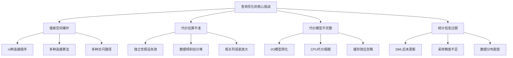
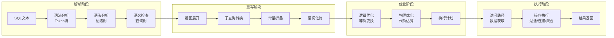
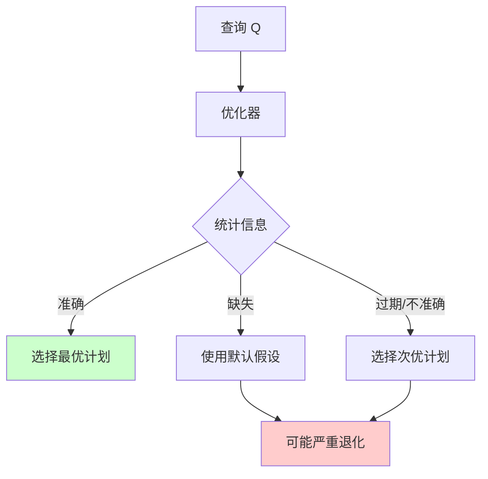
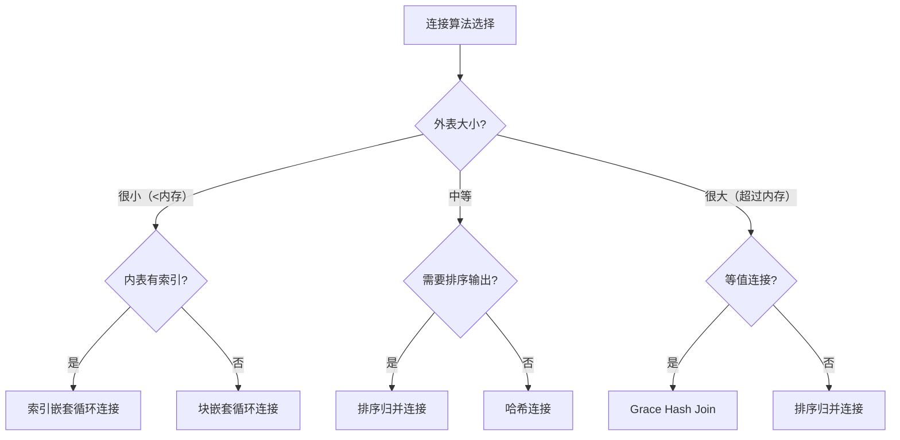
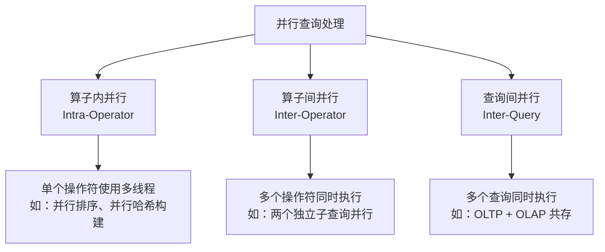

# 查询优化的理论基础

查询优化是数据库系统中技术深度最深、工程挑战最大的子系统。一条SQL语句从文本到执行结果，中间需要经历解析、重写、优化、执行四个阶段。优化器作为其中的核心环节，必须在海量的候选执行计划中找到代价最低的方案——这个目标看似简单，背后却涉及关系代数、概率统计、算法设计、系统工程等多个领域的知识交叉。

本节将从问题本质出发，系统阐述查询优化的理论根基：为什么查询优化如此困难、优化器的完整架构是什么、代数优化的等价变换规则如何工作、代价模型的数学原理是什么、统计信息如何支撑决策、连接算法各自的设计哲学，以及执行模型的演进逻辑。与前面的核心概念和技术演进部分不同，本节专注于这些理论的**数学推导**、**形式化定义**和**工程权衡**，为后续的核心技巧和实战案例打下坚实的理论基础。

---

## 1. 为什么查询优化如此困难

### 1.1 语义等价与执行计划空间

SQL是一种声明式语言——用户描述"想要什么"，而不是"怎么取"。同一个SQL查询可以有多种语义等价的执行方式，而不同执行方式的性能可能相差数个数量级。

以一个三表连接查询为例：

```sql
SELECT o.id, c.name, p.title
FROM orders o
JOIN customers c ON o.customer_id = c.id
JOIN products p ON o.product_id = p.id
WHERE c.country = 'CN' AND o.amount > 100;
```

这个查询可以有多种执行策略：

策略A：先过滤 customers → 再连接 orders → 再连接 products
策略B：先过滤 orders → 再连接 customers → 再连接 products
策略C：先连接 orders 和 products → 过滤 → 再连接 customers
......

对于n个表的连接查询，可能的连接顺序有 n! 种（考虑交换律后为 n!/2），每种顺序又可以选择不同的连接算法（NLJ、SMJ、HJ），每种算法还有不同的物理参数（内存分配、分区数等）。总的执行计划数量呈**指数级**增长：

n个表的搜索空间大小：
├── 连接顺序：n!/2 种（n=10时 ≈ 180万种）
├── 连接算法：每对连接3种选择（NLJ/SMJ/HJ）
├── 访问路径：每个表多种选择（全扫/索引/位图等）
└── 总搜索空间：O(n! × 3^(n-1) × ∏(每个表的访问路径数))

更精确地说，如果考虑连接的结合律（`(R⋈S)⋈T = R⋈(S⋈T)`）和交换律（`R⋈S = S⋈R`），不同连接顺序的总数可以用以下公式计算：

左深树（Left-Deep Tree）数量：
├── 定义：每次连接结果作为下一次连接的左输入
├── 数量：n! / 2（n≥3时）
├── n=5:  60种
├── n=8:  20,160种
├── n=10: 1,814,400种
└── n=15: 约 6.5×10^11 种（超过6500亿）

完全二叉树（Bushy Tree）数量：
├── 定义：连接双方都可以是子树（不限于左深）
├── 数量：(2(n-1))! / ((n-1)! × n!)
├── n=5:  14种
├── n=8:  1,430种
├── n=10: 48,62种
└── 优势：某些查询中 bushy 树可能优于所有左深树

### 1.2 代价差异的真实案例

在实际系统中，执行计划选择不当可能导致灾难性的性能差异：

```sql
-- 案例：某电商系统三表连接查询
-- 表规模：orders(1000万), customers(50万), products(10万)

-- 糟糕的计划：嵌套循环连接，外表为orders
-- 代价：1000万 × 50万 = 5×10^14 次比较 → 执行时间 > 24小时

-- 优秀的计划：哈希连接，先过滤customers
-- 代价：50万(过滤后5万) + 1000万 ≈ 1000万 次操作 → 执行时间 < 1秒

-- 性能差距：约 86,400 倍
```

让我们用具体的EXPLAIN输出来验证这个差距。以下是PostgreSQL中两种不同计划的对比：

```sql
-- 创建测试表并插入数据
CREATE TABLE orders (
    id SERIAL PRIMARY KEY,
    customer_id INT,
    product_id INT,
    amount DECIMAL(10,2)
);
CREATE TABLE customers (
    id SERIAL PRIMARY KEY,
    name VARCHAR(100),
    country VARCHAR(2)
);
CREATE TABLE products (
    id SERIAL PRIMARY KEY,
    title VARCHAR(200)
);
CREATE INDEX idx_orders_customer ON orders(customer_id);
CREATE INDEX idx_orders_product ON orders(product_id);

-- 糟糕的计划（优化器错误估计时可能出现）
EXPLAIN ANALYZE
SELECT o.id, c.name, p.title
FROM orders o
JOIN customers c ON o.customer_id = c.id
JOIN products p ON o.product_id = p.id
WHERE c.country = 'CN' AND o.amount > 100;
```

这个案例说明：查询优化不是"锦上添花"，而是"生死攸关"。优化器选择正确的执行计划，可以将查询从"不可用"变为"秒级响应"。

### 1.3 优化器的四大核心挑战



这四个挑战相互交织，形成了一个**误差传递链**：

搜索空间太大 → 需要剪枝策略
    ↓
剪枝依赖代价估算 → 代价估算需要统计信息
    ↓
统计信息永远是近似的 → 代价估算必然有误差
    ↓
误差在连接链中累积放大 → 可能导致完全错误的计划选择

整个系统必须在**最优性**和**决策时间**之间取得平衡。穷举所有计划找到全局最优的理论代价不可接受（n=15时超过6500亿种），因此优化器不得不在搜索深度和计划质量之间做权衡——这本质上是一个**近似算法**问题。

### 1.4 为什么不能简单地"试一试"

一个自然的想法是：为什么不生成几个候选计划，然后实际执行来比较？这种方法叫做"Execute-and-Compare"，但在实践中不可行，原因如下：

执行代价问题：
├── 生成候选计划本身需要优化器工作
├── 每个候选计划的实际执行可能需要读取大量数据
├── 如果有10个候选计划，最坏情况需要执行10次
└── 对于OLTP查询，多执行几次就不可接受了

副作用问题：
├── DML语句（INSERT/UPDATE/DELETE）有副作用
├── 不可能先执行一次INSERT看看效果，不满意再回滚
├── 即使SELECT没有副作用，执行本身消耗的I/O和CPU也是真实代价
└── 某些操作（如排序、哈希构建）的代价本身就很高

不确定性问题：
├── 同一查询在不同时间执行，结果可能不同（并发写入）
├── 缓存状态不同导致实际I/O差异巨大
├── 系统负载不同导致CPU和内存资源不同
└── 实际执行的代价不能代表未来执行的代价

因此，查询优化本质上是一个**预测问题**——必须在执行之前预测每个计划的代价，选择预测代价最低的计划。预测的准确性取决于统计信息的质量和代价模型的精确度。

---

## 2. 查询处理的完整架构

### 2.1 四阶段流水线

一条SQL查询从文本到结果，经过四个核心阶段：



### 2.2 解析阶段的内部机制

**词法分析**将SQL文本拆分为Token流。核心挑战是关键字与标识符的区分——`SELECT`是关键字，而`select_column`是标识符。现代数据库通常使用有限状态自动机（DFA）实现词法分析器：

输入: "SELECT name FROM employees WHERE id = 1"

Token流:
[KEYWORD:SELECT] [IDENT:name] [KEYWORD:FROM] [IDENT:employees] 
[KEYWORD:WHERE] [IDENT:id] [OPERATOR:=] [LITERAL:1]

**语法分析**根据SQL文法（通常用BNF描述）将Token流构建为语法树。两种主流实现方式：

| 方式 | 代表 | 优势 | 劣势 |
|------|------|------|------|
| LALR(1) 自动生成 | PostgreSQL (Bison) | 开发效率高 | 错误提示差 |
| 递归下降 手写 | MySQL 8.0, DuckDB | 错误提示好 | 开发工作量大 |
| 手写递归下降 + Pratt Parser | DuckDB, SingleStore | 灵活度最高 | 维护成本高 |

**语义检查**验证查询的语义正确性，包括：
- 表/列是否存在（查数据字典）
- 数据类型兼容性（如 `WHERE id = 'abc'` 中类型不匹配）
- 聚合函数使用规则（WHERE中不能有聚合、SELECT列表必须被GROUP BY覆盖或包含在聚合函数中）
- 权限校验（用户是否有权访问目标表/列）
- 约束检查（NOT NULL、UNIQUE等）

### 2.3 重写阶段的等价变换

重写阶段是优化器的第一个"智慧"环节。它基于关系代数的等价变换规则，对查询树进行语义保持的变换。核心目标是将查询转化为更高效的形式。

**子查询到半连接的变换**是最重要的重写规则之一：

```sql
-- 原始查询（相关子查询，逐行执行 → O(n×m)）
SELECT * FROM orders o
WHERE EXISTS (
    SELECT 1 FROM customers c
    WHERE c.id = o.customer_id AND c.country = 'CN'
);

-- 重写后（半连接，一次扫描完成 → O(n+m)）
SELECT o.* FROM orders o
SEMI-JOIN customers c ON o.customer_id = c.id
WHERE c.country = 'CN';

-- 优势：半连接可以使用哈希半连接算法，避免相关子查询的逐行执行
```

经典等价变换规则体系：

| 规则类别 | 具体规则 | 作用 | 实际效果 |
|----------|----------|------|----------|
| 选择分解 | σ_{c1∧c2}(R) ≡ σ_{c1}(σ_{c2}(R)) | 分步过滤，每步数据更少 | 中间结果集更小 |
| 选择交换 | σ_{c1}(σ_{c2}(R)) ≡ σ_{c2}(σ_{c1}(R)) | 选择性高的先执行 | 尽早减少数据量 |
| 投影下推 | π_L(σ_c(R)) ≡ σ_c(π_L(R)) | 尽早去除不需要的列 | 减少I/O和内存占用 |
| 连接结合 | (R⋈S)⋈T ≡ R⋈(S⋈T) | 为连接重排序提供基础 | 搜索更优的连接顺序 |
| 连接交换 | R⋈S ≡ S⋈R | 连接顺序可以任意调换 | 选择更优的外表/内表 |
| 选择下推 | σ_c(R⋈S) ≡ σ_c(R) ⋈ S（当c只涉及R的列时） | 在连接前过滤 | 减少连接的数据量 |
| 视图合并 | 将视图定义内联到查询中 | 消除视图的额外开销 | 允许跨视图边界优化 |

**谓词下推（Predicate Pushdown）** 是最实用的变换规则，它将过滤条件尽可能推向数据源：

```sql
-- 原始查询（过滤在连接之后）
SELECT o.id, c.name
FROM orders o
JOIN customers c ON o.customer_id = c.id
WHERE c.country = 'CN';

-- 优化后（过滤在连接之前）
-- 步骤1：将 c.country = 'CN' 下推到 customers 表扫描
-- 步骤2：用过滤后的 customers（假设只有5万行）与 orders 连接
-- 而不是用全部50万 customers 与 orders 连接

-- 类似地，列裁剪（Column Pruning）：
-- 只读取 o.id 和 c.name 两列，而不是 SELECT * 的所有列
-- 在列存储中，这个优化的效果尤其显著
```

### 2.4 常量折叠与谓词化简

重写阶段还包含一系列简单的代数化简：

```sql
-- 常量折叠：编译时计算常量表达式
WHERE price * 1.1 > 100
-- → 优化为 WHERE price > 90.91

-- 谓词化简：消除恒真/恒假条件
WHERE 1 = 1 AND name = 'Alice'
-- → 优化为 WHERE name = 'Alice'

WHERE id > 10 AND id > 5
-- → 优化为 WHERE id > 10（取更严格的条件）

WHERE status = 'A' OR status = 'B' OR status = 'C'
-- → 优化为 WHERE status IN ('A', 'B', 'C')

-- NULL处理优化
WHERE col IS NOT NULL AND col > 100
-- → 优化为 WHERE col > 100（数值比较自动排除NULL）
```

---

## 3. 代价模型的数学基础

### 3.1 代价分解框架

代价模型将查询执行的总代价分解为可量化的组成部分：

总代价 = I/O代价 + CPU代价 + 内存代价 + 网络代价

其中：
├── I/O代价 = Σ(每个操作的页面读写数) × 单页面I/O时间
├── CPU代价 = Σ(每个操作处理的元组数) × 单元组处理时间
├── 内存代价 = 缓冲池命中率 × 缓存访问时间
└── 网络代价 = 节点间传输的数据量 / 网络带宽

不同数据库系统对代价的权重分配不同：

| 数据库 | I/O权重 | CPU权重 | 特点 |
|--------|---------|---------|------|
| PostgreSQL | `seq_page_cost=1.0`, `random_page_cost=4.0` | `cpu_tuple_cost=0.01` | I/O主导，参数可调 |
| MySQL (InnoDB) | 基于buffer pool命中 | 基于比较次数 | 相对简化 |
| Oracle | 基于块读取 | 基于CPU时间 | 高度可调 |
| SQL Server | 基于页面读取 | 基于CPU ticks | 自动校准 |

### 3.2 I/O代价模型

I/O代价是传统数据库中最主要的代价来源。关键参数：

HDD:
├── 顺序读带宽: 100-200 MB/s
├── 随机读延迟: 5-10 ms（寻道时间 + 旋转延迟）
├── 随机/顺序比: 约 1:100（延迟维度）
└── 页大小: 通常 4KB-16KB

SSD:
├── 顺序读带宽: 500 MB/s - 7 GB/s
├── 随机读延迟: 0.02-0.1 ms
├── 随机/顺序比: 约 1:3-1:5（延迟维度）
└── 页大小: 通常 4KB

NVMe SSD:
├── 顺序读带宽: 3-7 GB/s
├── 随机读延迟: 0.01-0.05 ms
├── 随机/顺序比: 约 1:2-1:3
└── 并发队列深度: 64K（vs SATA的32）

PostgreSQL的代价参数配置体现了这种层次：

```sql
-- PostgreSQL代价参数（无量纲单位，可调）
seq_page_cost = 1.0           -- 顺序读一页的基准代价
random_page_cost = 4.0        -- 随机读一页的代价（HDD设4.0，SSD可设1.1-1.5）
cpu_tuple_cost = 0.01         -- 处理一个元组的CPU代价
cpu_index_tuple_cost = 0.005  -- 处理一个索引条目的CPU代价
cpu_operator_cost = 0.0025    -- 每个比较操作的CPU代价
parallel_tuple_cost = 0.01    -- 并行处理中传递一个元组的代价
```

**关键洞察**：在SSD/NVMe时代，`random_page_cost` 应当大幅调低。很多系统仍使用HDD时代遗留的默认值（4.0），导致优化器低估索引扫描的优势、高估顺序扫描的代价。对于纯NVMe环境，建议设为 `1.1-1.5`：

```sql
-- SSD环境下的推荐配置
ALTER SYSTEM SET random_page_cost = 1.1;
ALTER SYSTEM SET effective_cache_size = '8GB';  -- 应设为物理内存的70-80%
ALTER SYSTEM SET shared_buffers = '2GB';        -- 应设为物理内存的25%
```

### 3.3 启动代价与总代价

执行计划的代价分为两个维度：

启动代价 (Startup Cost):
├── 定义：返回第一条结果之前需要完成的准备工作代价
├── 示例：排序操作需要扫描完所有输入才能开始输出
│         → 启动代价 = 排序代价
├── 示例：嵌套循环连接可以立即返回第一行
│         → 启动代价 ≈ 0
├── 示例：哈希连接需要先构建哈希表
│         → 启动代价 = 构建哈希表的代价
└── 用途：用于判断是否需要物化中间结果

总代价 (Total Cost):
├── 定义：完成整个操作的总代价
├── 启动代价 + 处理所有元组的代价
└── 用途：最终计划选择的主要依据

启动代价的实际意义体现在LIMIT子句中：

```sql
-- 查询1：需要低启动代价的计划
SELECT * FROM orders ORDER BY created_at DESC LIMIT 10;
-- 优化器可能选择 Index Scan（启动代价≈0）而不是
-- SeqScan + Sort（启动代价=全表排序代价）

-- 查询2：需要低总代价的计划
SELECT COUNT(*) FROM orders;
-- 优化器选择 SeqScan（总代价最低），因为需要扫描所有行
```

### 3.4 代价估算的误差分析

代价估算的误差会在执行计划中累积和放大：

误差传播示例（三表连接）：
原始误差：每步基数估计偏差 2倍

步骤1: 单表选择
├── 实际行数: 10,000
├── 估计行数: 20,000 (2倍误差)
└── 误差: 2x

步骤2: 两表连接
├── 输入行数: 10,000 × 50,000 = 5×10^8 (基于错误估计)
├── 实际行数: 10,000 × 50,000 × sel = 25,000
├── 估计行数: 20,000 × 10,000 × sel = 100,000
└── 误差: 4x (误差从2倍放大到4倍)

步骤3: 三表连接
├── 误差可能放大到 8x 甚至更高
└── 这就是为什么基数估计是优化器的核心挑战

误差的数学性质：

假设每步的相对误差为 ε（乘法误差模型）：

单表选择: 误差 = ε
两表连接: 误差 = ε²（假设独立）
三表连接: 误差 = ε³
n表连接:  误差 = ε^n

如果 ε = 2（估计值是实际值的2倍），连接10个表后：
误差 = 2^10 = 1024倍

这就是为什么 Leis et al. (VLDB 2015) 的实证研究表明：
复杂查询（4+表连接）的基数估计误差平均超过10倍

---

## 4. 统计信息理论

### 4.1 统计信息的作用

统计信息是优化器做出正确决策的数据基础。没有准确的统计信息，代价模型就像没有地图的导航系统——理论上可以工作，实际上完全不可靠。



### 4.2 核心统计指标

| 统计项 | 含义 | 用途 | 收集方式 |
|--------|------|------|----------|
| n_tup (行数) | 表的总元组数 | 结果集大小基数 | 精确计数或近似 |
| n_page (页面数) | 表占用的磁盘页面数 | I/O代价估算 | 从存储层获取 |
| NDV (不同值数) | 列中不同值的数量 | 等值选择性估计 | HyperLogLog等近似算法 |
| min/max (最值) | 列值域的边界 | 范围选择性过滤 | 全表扫描或采样 |
| avg_width (平均宽度) | 列值的平均字节数 | 结果集大小估算 | 采样计算 |
| null_frac (NULL比例) | NULL值占比 | 谓词选择性调整 | 采样计算 |
| correlation (相关性) | 物理存储顺序与索引键的相关性 | 索引扫描代价估算 | 统计计算 |

查看PostgreSQL表的统计信息：

```sql
-- 查看表的基本统计信息
SELECT relname, reltuples::bigint, relpages,
       reltuples / NULLIF(relpages, 0) AS rows_per_page
FROM pg_class
WHERE relname = 'orders';

-- 查看列级统计信息
SELECT attname, n_distinct, most_common_vals, most_common_freqs,
       histogram_bounds, correlation
FROM pg_stats
WHERE tablename = 'orders';

-- 直方图分布可视化
SELECT histogram_bounds
FROM pg_stats
WHERE tablename = 'orders' AND attname = 'amount';
-- 输出示例: {0,50,100,200,500,1000,5000,10000,NULL}
```

### 4.3 直方图的数学原理

直方图是选择性估计最重要的工具。其核心思想是：用分段常数函数近似真实的概率密度函数。

**等深直方图（Equi-depth Histogram）** 是最常用的类型。设值域为 [a, b]，分为h个桶：

等深直方图的构建：
1. 对列值排序
2. 将排序后的值均分为h个桶
3. 每个桶包含大约 n/h 个值
4. 记录每个桶的 [min, max] 和 [count]

查询估算：WHERE column > x
├── 定位x所在的桶
├── 用线性插值估算桶内匹配比例
├── 累加后续桶的全部行数
└── 总匹配行数 / 总行数 = 选择性

**等高直方图 vs 等宽直方图**的对比：

等高直方图（Equi-depth，最常用）：
├── 每个桶包含相同数量的记录
├── 桶的宽度随数据密度变化
├── 优势：对任何分布都能给出合理的估计
└── 劣势：在数据极度倾斜时，桶边界可能不够精确

等宽直方图（Equi-width）：
├── 每个桶覆盖相同的值域范围
├── 桶的记录数随数据密度变化
├── 优势：实现简单
└── 劣势：在数据倾斜时，某些桶可能为空或包含大部分数据

超级直方图（Super Histogram）：
├── 在等深直方图基础上，对每个桶记录精确的MCV
├── 优势：在桶边界处有更精确的估计
└── 代表：PostgreSQL的直方图 + MCV组合

**桶数的选择**是一个权衡问题：

桶数太少（如10个）：
├── 优势：存储开销小，收集速度快
├── 劣势：丢失分布细节，估计精度低
├── 适用：均匀分布数据
└── 误差：在数据倾斜时可能超过50%

桶数太多（如1000个）：
├── 优势：保留更多分布信息
├── 劣势：存储开销大，收集时间长
├── 适用：高度倾斜数据
└── 误差：通常 < 10%

PostgreSQL默认桶数 = 100 × default_statistics_target
                    = 100 × 100 = 10,000 个桶

实践建议：
├── 均匀分布列：保持默认即可
├── 倾斜分布列：提高STATISTICS目标值
├── 关键查询列：使用CREATE STATISTICS创建多列统计
└── 极端倾斜列（如status列）：依赖MCV列表而非直方图

### 4.4 最常见值（MCV）列表

MCV记录出现频率最高的若干个值及其频率。对于高度倾斜的数据（如状态列、枚举类型），MCV比直方图更准确：

MCV列表示例（订单状态列，共100万行）：

值          频率      估计行数
'completed'  0.65      650,000    ← MCV直接给出精确频率
'shipped'    0.20      200,000
'pending'    0.10      100,000
'cancelled'  0.03       30,000
'other'      0.02       20,000

查询 WHERE status = 'completed' 的选择性 = 0.65
不使用MCV时的均匀假设: 1/5 = 0.20 (误差 3.25倍!)

MCV的局限性：

MCV无法处理的情况：
├── 值不在MCV列表中（罕见值）
│   此时使用剩余均匀分布假设：(1-ΣMCV频率) / (NDV-|MCV|)
├── 范围查询（BETWEEN, >, <）
│   MCV只对等值查询有效，范围查询仍需依赖直方图
├── 多列相关性
│   单列MCV无法捕捉列间相关性
│   PostgreSQL 10+ 支持 CREATE STATISTICS 创建多列统计
└── 新值插入后
    MCV需要重新收集才能反映新值的频率

### 4.5 统计信息收集策略

全量扫描（ANALYZE）：
├── 方式：扫描表的全部或采样页面
├── 优势：统计信息最准确
├── 劣势：大表上耗时长、I/O开销大
├── 触发：手动 ANALYZE 或 autovacuum daemon
└── 采样：默认采样 300 × default_statistics_target 行

增量维护：
├── 方式：在DML操作时增量更新统计信息
├── 优势：避免周期性的全量扫描开销
├── 劣势：实现复杂，可能引入累积误差
├── 实现：MySQL InnoDB的index统计信息自动更新
└── 局限：只维护简单统计（如行数），不维护直方图

```sql
-- PostgreSQL ANALYZE 命令
-- 收集所有表的统计信息
ANALYZE;

-- 收集特定表
ANALYZE employees;

-- 收集特定列并指定精度
ANALYZE employees (salary, department_id);

-- 调整统计精度（影响直方图桶数和MCV长度）
ALTER TABLE employees ALTER COLUMN salary SET STATISTICS 500;
ANALYZE employees;

-- 创建多列统计（捕捉列间相关性）
CREATE STATISTICS stats_emp_dept (dependencies)
ON employee_id, department_id FROM employees;
ANALYZE employees;

-- 查看统计信息状态
SELECT relname, last_analyze, last_autoanalyze,
       n_live_tup, n_dead_tup
FROM pg_stat_user_tables
WHERE relname = 'employees';
```

**autovacuum 的统计信息触发机制**：

PostgreSQL autovacuum 自动收集统计信息的触发条件：
├── 插入阈值：50 + 0.1 × reltuples（约每插入10万行触发一次）
├── 更新/删除阈值：50 + 0.2 × reltuples
├── 时间间隔：默认不设最小间隔（可通过 autovacuum_analyze_threshold 调整）
└── 注意：ANALYZE 和 VACUUM 是独立的，但通常一起执行

关键配置参数：
├── autovacuum_analyze_threshold = 50  -- 最小触发行数
├── autovacuum_analyze_scale_factor = 0.1  -- 触发比例
├── default_statistics_target = 100  -- 统计精度
└── 对关键表可单独设置：ALTER TABLE t SET (autovacuum_analyze_scale_factor = 0.01)

---

## 5. 选择性与基数估计

### 5.1 选择性的定义

选择性（Selectivity）是满足谓词条件的元组占总元组数的比例，取值范围 [0, 1]。基数（Cardinality）是满足条件的元组绝对数量：

基数 = 总行数 × 选择性
即：Cardinality(Q) = |R| × Selectivity(Q)

选择性估计的准确性直接决定连接算法和连接顺序的选择。

### 5.2 各类谓词的选择性估计

**等值谓词**的选择性：

sel(column = value) 的计算逻辑：

1. 如果 value 是 NULL → sel = 0（NULL不等于任何值）
2. 如果 value 在 MCV 列表中 → sel = MCV频率(value)
3. 如果 value 不在 MCV 列表中：
   sel = (1 - Σ MCV频率) / (NDV - |MCV列表|)
   即：剩余部分均匀分布假设

示例：
├── NDV = 1000, MCV列表有10个值
├── MCV总频率 = 0.5
├── 查询值不在MCV中
└── sel = (1 - 0.5) / (1000 - 10) = 0.000503

**范围谓词**的选择性：

sel(column BETWEEN low AND high) 的计算逻辑：

1. 定位 low 和 high 在直方图中的位置
2. 对每个与范围重叠的桶：
   ├── 如果桶完全包含在范围内：加入桶的全部行数
   ├── 如果桶部分重叠：用线性插值估算重叠比例
   └── 如果桶不重叠：跳过
3. 匹配行数 / 总行数 = 选择性

示例（等深直方图，salary范围 [30000, 120000]）：
├── 桶1: [30000, 38000) 1560行  ← 部分重叠 (BETWEEN 35000 AND ...)
├── 桶2: [38000, 52000) 1560行  ← 完全包含
├── 桶3: [52000, 65000) 1560行  ← 完全包含
├── 桶4: [65000, 85000) 1560行  ← 完全包含
└── 桶5: [85000, 120000) 1560行 ← 部分重叠 (BETWEEN ... AND 90000)

**LIKE谓词**的选择性：

sel(column LIKE 'pattern') 的估计：

├── 'ABC%'（前缀匹配）：
│   使用 B+树索引的范围查询能力
│   sel ≈ 1 / NDV（均匀分布假设）
│
├── '%ABC'（后缀匹配）：
│   无法使用B+树索引（除非有反转索引）
│   通常只能全表扫描
│   sel 难以估计，默认按 0.1-0.2 估算
│
├── '%ABC%'（包含匹配）：
│   全表扫描 + 字符串匹配
│   sel 难以估计，取决于数据特征
│
└── PostgreSQL特殊处理：
    支持 pg_trgm 扩展的GIN/GiST索引
    可以加速 '%ABC%' 类型的查询
    此时选择性估计基于三元组统计

**多谓词组合**的选择性：

独立性假设下的组合公式：
AND组合：sel(P1 AND P2) = sel(P1) × sel(P2)
OR组合： sel(P1 OR P2)  = sel(P1) + sel(P2) - sel(P1) × sel(P2)
NOT组合：sel(NOT P)     = 1 - sel(P)

独立性假设的局限性：
├── 高估场景：city='Beijing' AND province='Beijing'
│   两列高度相关，独立性假设严重高估选择性
├── 低估场景：罕见值组合
│   两列独立但值都很罕见时，乘积可能过度低估
└── 解决方案：多列直方图、相关性估计、采样验证

**相关性对选择性估计的影响**：

场景：city 和 province 两列高度相关
├── city='Beijing' 的选择性 = 0.05
├── province='Beijing' 的选择性 = 0.08
├── 独立性假设: sel = 0.05 × 0.08 = 0.004
├── 实际选择性: sel ≈ 0.05（因为北京 city 的行必然在北京 province）
└── 误差: 0.05 / 0.004 = 12.5倍！

PostgreSQL的解决方案：
├── 使用 CREATE STATISTICS 捕捉依赖关系
│   CREATE STATISTICS stats_city_province (dependencies)
│   ON city, province FROM addresses;
├── 优化器自动使用依赖统计修正选择性估计
└── 10.0+ 版本支持（需手动创建）

### 5.3 基数估计的挑战

基数估计是查询优化领域最困难的问题之一。根据Leis等人在VLDB 2015年的实证研究：

研究发现（对MySQL、PostgreSQL、SQL Server等的测试）：

├── 简单查询（单表+简单谓词）：
│   基数估计平均误差 < 2倍 → 通常能选到最优计划
│
├── 中等查询（2-3表连接）：
│   基数估计平均误差 2-10倍 → 偶尔选到次优计划
│
└── 复杂查询（4+表连接）：
    基数估计平均误差 > 10倍 → 经常选到次优计划
    
结论：基数估计误差是现代数据库优化器的主要瓶颈

基数估计不准的根本原因：

1. 独立性假设（Independence Assumption）
   ├── 假设不同列的值相互独立
   ├── 现实中列间往往存在强相关性
   └── 导致AND条件高估、OR条件低估

2. 均匀分布假设（Uniform Distribution Assumption）
   ├── 假设非MCV的值均匀分布
   ├── 现实中数据分布往往严重倾斜
   └── 导致罕见值选择性被高估

3. 包含假设（Inclusion Assumption）
   ├── 假设一个表的列值都包含在另一个表中
   ├── 现实中可能存在不匹配的值
   └── 影响连接选择性估计

4. 统计信息过期
   ├── 数据变化后统计信息未及时更新
   ├── 特别是批量DML操作后
   └── 需要定期 ANALYZE 或设置自动收集

---

## 6. 连接算法的设计哲学

### 6.1 三种经典连接算法的权衡

每种连接算法都是在特定约束条件下的最优解：



三种算法的代价对比：

算法             | 构建代价        | 探测/合并代价     | 内存需求      | 适用场景
-----------------|-----------------|-------------------|---------------|------------------
嵌套循环（NLJ）   | 无              | O(M×N)           | O(1)          | 外表极小+内表有索引
索引嵌套循环（INLJ）| 无            | O(M×log(N))      | O(1)          | 外表小+内表有B+树
块嵌套循环（BNLJ）| 无              | O(M/B×N)         | O(B)          | 无索引+内存有限
排序归并（SMJ）    | O(MlogM+NlogN) | O(M+N)           | O(M+N)        | 已排序输入/非等值
哈希连接（HJ）     | O(M)           | O(N)             | O(M)          | 等值连接+内存充足
Grace Hash Join   | O(M+N)写分区    | O(M+N)探测       | O(√(M+N))    | 大表等值连接

### 6.2 嵌套循环连接的设计逻辑

嵌套循环连接（NLJ）的核心思想是"以小博大"——外表越小越好，内表最好有索引：

代价模型：
├── 朴素NLJ: O(|outer| × |inner|) 次比较
├── 索引NLJ: O(|outer| × log|inner|) 次比较（内表有B+树索引）
├── 块NLJ:  O(|outer| + |outer|/B × |inner|) 次I/O
│           其中 B = 可用缓冲区块数

适用条件：
├── 外表足够小（能放入内存缓冲区）
├── 内表连接列有索引（索引NLJ）
├── 连接条件包含不等值（其他算法不适用）
├── 查询只需要少量行（提前终止优化）
└── 存在选择性很高的过滤条件在连接前执行

**索引嵌套循环连接（Index Nested Loop Join）** 是NLJ的最重要变体：

```sql
-- 当内表连接列有索引时，NLJ效率很高
-- 代价：|外表| × (索引查找代价 + 匹配行数)

-- 例如：orders JOIN customers ON orders.customer_id = customers.id
-- 如果 customers.id 有主键索引：
-- 对于 orders 中的每一行，通过索引直接定位 customers 的对应行
-- 代价 ≈ |orders| × (B+树高度 + 匹配行数)
-- 如果 B+树高度=3，每个 customer 有 10 行匹配
-- 总代价 ≈ |orders| × 13

-- 对比无索引的NLJ：
-- 总代价 = |orders| × |customers|（笛卡尔积）
```

### 6.3 排序归并连接的设计逻辑

排序归并连接（SMJ）的核心思想是"排序一次，合并多次"：

两阶段流程：
阶段1 - 排序：O(n log n)
├── 如果输入已排序（如有索引），排序阶段可跳过
├── 内部归并排序，I/O代价 ≈ 2|R| × log_{B-1}(|R|/B)
└── B = 缓冲区可用页数

阶段2 - 归并：O(n)
├── 双指针线性扫描两个有序序列
├── I/O代价 ≈ |R| + |S|（顺序扫描）
└── 可以流水线化输出

SMJ的独特优势：
├── 对等值和非等值连接都适用（如 R.a < S.b）
├── 产生有序输出，可能避免后续的 ORDER BY 排序
├── 输入已排序时代价极低
├── 对数据倾斜不敏感（不像哈希连接）
└── 输出天然有序，适合需要 ORDER BY 的场景

### 6.4 哈希连接的设计逻辑

哈希连接（HJ）的核心思想是"空间换时间"——用哈希表消除嵌套循环的二次复杂度：

构建-探测两阶段：
构建阶段（Build Phase）：
├── 在较小的关系上构建哈希表
├── 代价：|build_rel| 次I/O + 哈希表构建CPU
└── 内存需求：能容纳整个构建侧的哈希表

探测阶段（Probe Phase）：
├── 扫描较大的关系，对每行哈希探测
├── 代价：|probe_rel| 次I/O + 每行一次哈希查找
└── 总代价：|build_rel| + |probe_rel|

Grace Hash Join（大表场景）：
├── 分区阶段：用哈希函数将数据分为多个分区
├── 连接阶段：对每对分区执行内存哈希连接
├── 代价：3 × (|R| + |S|)（写分区 + 读分区 + 构建/探测）
└── 适用：构建侧超过内存容量

**哈希连接的溢出处理**：

当哈希表超过可用内存时：
├── Grace Hash Join：
│   ├── 用哈希函数将数据分为B个分区（B = 内存可容纳的分区数）
│   ├── 每个分区独立执行内存哈希连接
│   ├── 如果某分区仍然溢出，递归分区（recursive partitioning）
│   └── 代价：最坏情况 2B × (|R| + |S|) 次I/O
│
├── Hybrid Hash Join（混合哈希连接）：
│   ├── 将一个分区保留在内存中（"未分区"分区）
│   ├── 只对其余分区写入磁盘
│   └── 优势：减少一次写+读的I/O
│
└── Shared Hash Join（共享哈希连接，PostgreSQL）：
    ├── 并行执行时，多个Worker共享一个哈希表
    ├── 构建阶段：Worker并行构建各自的哈希表
    ├── 使用dsm（dynamic shared memory）共享
    └── 优势：避免每个Worker重复构建哈希表

### 6.5 算法选择的量化决策

```sql
-- PostgreSQL优化器的连接算法决策逻辑（简化版）
-- 对于每个连接对 (R⋈S):

-- 1. 如果R很小且S有索引 → NLJ（索引嵌套循环）
--    代价 ≈ |R| × (索引高度 + 匹配行数)

-- 2. 如果|R| + |S| 能放入内存 → Hash Join
--    代价 ≈ |R| + |S|

-- 3. 如果需要有序输出或输入已排序 → Sort-Merge Join
--    代价 ≈ 2|R|log|R| + 2|S|log|S| + |R| + |S|

-- 4. 如果|R| + |S| 超过内存 → Grace Hash Join
--    代价 ≈ 3 × (|R| + |S|)
```

---

## 7. 连接顺序优化

### 7.1 搜索空间分析

n个表的连接顺序搜索空间大小：

考虑连接交换律和结合律后的搜索空间：

├── 不同的左深树（Left-Deep Trees）数量：
│   n! / 2
│   n=5:  60种
│   n=8:  20,160种
│   n=10: 1,814,400种
│
├── 不同的 bushy 树数量（含所有树形结构）：
│   卡特兰数 C(n-1)
│   n=5:  14种
│   n=8:  1,430种
│   n=10: 48,62种
│
└── 总搜索空间（含每种连接的算法选择）：
    O(n! × 3^(n-1))
    n=10: 约 10^8 种候选计划

### 7.2 动态规划方法（System R）

System R的动态规划算法将搜索空间从指数级降为O(3^n)：

核心思想：自底向上构建最优计划

状态定义：
├── best_plan[S] = 表集合S的最优连接计划
└── S ⊆ {T1, T2, ..., Tn}

状态转移：
├── 对每个大小为k的表子集S
├── 尝试所有分割 (S1, S2)，其中 S1 ∪ S2 = S
├── 如果S1和S2之间存在连接条件
│   └── best_plan[S] = min(best_plan[S] | best_plan[S1] ⋈ best_plan[S2])
└── 考虑两种连接顺序：S1 ⋈ S2 和 S2 ⋈ S1

时间复杂度：O(3^n)（n=15时仍可行）
空间复杂度：O(2^n)（存储所有子集的最优计划）

**左深树（Left-Deep Tree）的偏好**：

为什么优化器通常只搜索左深树？

左深树：((A⋈B)⋈C)⋈D
├── 每次连接的左输入是前一步的连接结果（流水线化）
├── 右输入是原始表（可以直接使用索引）
└── 可以直接流水线化执行（Volcano模型天然支持）

Bushy树：(A⋈B)⋈(C⋈D)
├── 两侧都是中间结果
├── 无法直接流水线化（需要物化中间结果）
├── 但某些查询中可能更优

PostgreSQL的策略：
├── 默认只搜索左深树（join_collapse_limit 控制）
├── set join_collapse_limit = 0 → 禁止重排（使用SQL中的顺序）
├── set join_collapse_limit = 8 → 最多重排8个表的连接
├── 对于复杂查询，可设置更大的值
└── GEQO（遗传算法）模式下搜索 bushy 树

### 7.3 贪心算法与遗传算法

当表数量超过动态规划的阈值（PostgreSQL默认12个表）时，使用近似算法：

贪心算法：
├── 起点：选择全表扫描代价最低的表
├── 迭代：每次选择代价增量最小的表加入
├── 时间复杂度：O(n²)
├── 优势：速度快，可预测
└── 劣势：可能陷入局部最优

遗传算法（GEQO）：
├── 编码：连接顺序编码为排列（基因）
├── 种群：随机生成多个候选方案
├── 选择：适应度高的方案更可能被选中
├── 交叉：两个方案交换部分表顺序
├── 变异：随机调整某些表的顺序
├── 迭代：重复选择-交叉-变异过程
├── 时间复杂度：O(pop_size × generations)
├── 优势：能跳出局部最优，搜索范围广
├── 劣势：结果有随机性，不保证最优
└── PostgreSQL：geqo_threshold 控制何时切换（默认12）

### 7.4 动态规划的剪枝策略

为了在有限时间内找到足够好的计划，优化器使用多种剪枝策略：

1. 等价类剪枝（Equivalence Class Pruning）
   ├── 将功能依赖的列归为等价类
   ├── 如果 A = B，则不需要考虑以 A 或 B 作为连接条件的差异
   └── 效果：减少冗余的连接顺序探索

2. 规格化剪枝（Normalized Plan Pruning）
   ├── 对于等价的计划，只保留代价最低的
   ├── 例如：R⋈S 和 S⋈R 只保留代价较低的一种
   └── 效果：减少约一半的搜索空间

3. 最优子计划剪枝（Optimal Subplan Pruning）
   ├── 如果某个子集的当前最优计划已经比已知全局最优差
   ├── 则不再尝试基于该子集构建更大计划
   └── 效果：大幅减少搜索空间

4. Top-K 剪枝（Top-K Plans）
   ├── 不只保留每个子集的最优计划，而是保留 Top-K
   ├── K=1：标准System R（可能错过最优组合）
   ├── K=3-5：保留更多候选，提高找到全局最优的概率
   └── 效果：提高计划质量，增加搜索时间

---

## 8. 执行模型

### 8.1 物化执行 vs 流水线执行

两种执行模型代表了不同的设计哲学：

物化执行（Materialized Execution）：
├── 每个操作符执行完毕后，将完整结果写入临时存储
├── 下一个操作符从临时存储中读取
├── 优势：实现简单，每个操作独立
├── 劣势：中间结果I/O开销大
└── 适用：操作间数据量差异大时

流水线执行（Pipeline Execution / Volcano Model）：
├── 每个操作符实现为迭代器（open/next/close）
├── 数据以"拉"（Pull）的方式流动
├── 优势：不需要物化中间结果
├── 劣势：实现复杂，某些操作无法流水线化
└── 适用：操作链较深时

对比：
├── 物化：扫描 → [写临时文件] → 过滤 → [写临时文件] → 排序 → 输出
└── 流水线：扫描 → 过滤 → 排序 → 输出（一气呵成）

### 8.2 Volcano迭代器模型

Volcano模型（Graefe, 1989）是事实标准的执行框架，被PostgreSQL、MySQL、SQL Server等几乎所有主流数据库采用：

```python
# Volcano模型的三个核心接口
class Iterator:
    def open(self):
        """初始化：打开子操作符，分配资源"""
        pass
    
    def next(self) -> Tuple:
        """获取下一个元组：如果就绪返回元组，否则返回None"""
        pass
    
    def close(self):
        """清理：释放资源，关闭子操作符"""
        pass
```

**拉取模式（Pull-Based）的调用流程**：

执行树：
        HashJoin
       /       \
  FilterScan   SeqScan

调用过程：
1. HashJoin.open()
   ├── FilterScan.open()
   │   └── SeqScan.open()  (employees)
   └── SeqScan.open()      (departments)

2. HashJoin.next()
   ├── FilterScan.next()
   │   └── SeqScan.next()  → row1
   │   └── if predicate(row1): return row1
   └── 对每个探测行：在哈希表中查找匹配

3. HashJoin.close()
   ├── FilterScan.close()
   └── SeqScan.close()

**Volcano模型的性能特征**：

函数调用开销分析：
├── 每个元组需要调用一次 next()，经过整个操作符树
├── 对于一个深度为D的执行树，每个元组需要 D 次函数调用
├── 函数调用开销：约 5-10ns（现代CPU，缓存命中时）
├── 如果元组数为 N，深度为 D，总调用开销：N × D × 10ns
├── 对于 100万行 × 深度5：约 50ms（可接受）
└── 对于 1亿行 × 深度5：约 5s（开始成为瓶颈）

缓存不友好问题：
├── 每次 next() 调用可能跳转到不同的代码路径
├── CPU指令缓存（I-Cache）可能频繁失效
├── 数据缓存（D-Cache）也可能因为间接访问而失效
└── 这是推送模型出现的主要原因之一

### 8.3 推送执行模型（Push-Based / Morsel-Driven）

现代数据库开始采用推送模型以更好地利用多核CPU：

推送模型 vs 拉取模型：
拉取模型（Volcano）：
├── 父节点调用子节点的 next()
├── 一次处理一个元组
├── 优势：内存效率高（不需要缓冲大量数据）
└── 劣势：函数调用开销大，难以并行化

推送模型（Morsel-Driven）：
├── 子节点主动将一批数据推送给父节点
├── 一次处理一批元组（Morsel，通常1000行）
├── 优势：减少函数调用，容易并行化，缓存友好
└── 劣势：需要更多内存缓冲，实现更复杂

代表系统：
├── HyPer（TU Munich）：最早的推送模型实现
├── Peloton/CMU：morsel-driven并行执行
└── PostgreSQL 15+：逐步引入部分推送特性

**Morsel-Driven 并行执行的原理**：

核心思想：将数据分为多个 Morsel（小块），每个CPU核心处理一个 Morsel

执行流程：
1. 将输入数据分为多个 Morsel（每个约1000行）
2. 每个 Worker 线程获取一个 Morsel
3. Worker 执行完整的操作符流水线（推送模式）
4. 结果写入线程安全的输出缓冲区

优势：
├── 天然支持并行化（每个Morsel独立处理）
├── 函数调用次数减少 K倍（K = Morsel大小）
├── CPU缓存友好（连续处理同一批数据）
├── 负载均衡简单（任务粒度均匀）
└── 无锁设计（每个Worker独立工作）

挑战：
├── 需要协调多个Worker的输出顺序（如果需要保序）
├── 内存使用增加（每个Worker需要独立的缓冲区）
└── 操作符状态管理更复杂

---

## 9. 并行查询处理

### 9.1 并行化的三个层次



### 9.2 PostgreSQL的并行查询架构

PostgreSQL从9.6开始支持并行查询，其架构包括三个核心组件：

并行执行的三个阶段：
1. Leader进程分配工作
├── 扫描操作：按页面范围分配给Worker
├── 连接操作：使用并行哈希连接（共享哈希表）
├── 聚合操作：分组聚合 + 合并聚合
└── 排序操作：并行外部归并排序

2. Worker进程并行执行
├── 每个Worker独立读取分配的数据范围
├── 独立执行过滤、投影等操作
├── 结果写入共享内存区域
└── Leader定期检查Worker状态

3. Leader进程合并结果
├── 从共享内存区域读取Worker结果
├── 合并、去重、最终聚合
└── 返回最终结果集

```sql
-- PostgreSQL并行查询配置
SET max_parallel_workers_per_gather = 4;  -- 每个操作最多4个Worker
SET parallel_tuple_cost = 0.01;           -- 元组在进程间传递的代价
SET parallel_setup_cost = 1000;           -- 并行启动的固定代价

-- 强制并行查询
SET parallel_setup_cost = 0;
EXPLAIN SELECT COUNT(*) FROM large_table GROUP BY category;
-- 会看到 Parallel Seq Scan + Parallel HashAggregate
```

**并行查询的适用条件和限制**：

适用条件：
├── 表大小超过 min_parallel_table_scan_size（默认8MB）
├── 查询结果行数超过 min_parallel_tuple_cost 的阈值
├── 操作符支持并行（SeqScan、HashJoin、HashAggregate等）
└── 事务隔离级别允许（Serializable不支持）

不支持并行的场景：
├── 访问外部表（Foreign Data Wrapper）
├── 使用了 PL/pgSQL 函数
├── 查询涉及未物化的视图
├── 使用了 FOR UPDATE/SHARE
└── CTE（WITH子句）中的递归查询

并行Worker数量建议：
├── CPU密集型查询：设为 CPU核心数的 50-75%
├── I/O密集型查询：设为 CPU核心数的 25-50%
├── 混合负载：根据实际测试调整
└── 关键：不要超过 max_parallel_workers（全局限制）

---

## 10. 查询优化的前沿方向

### 10.1 自适应查询处理

传统优化器在查询编译时一次性确定执行计划，无法在执行过程中根据实际情况调整。自适应查询处理通过在执行过程中收集反馈信息，动态调整执行计划：

自适应查询处理的三种形式：

1. Adaptive Join（自适应连接）
├── 执行时根据实际数据量选择Join算法
├── 初始使用Nested Loop，如果实际数据量大则切换到Hash Join
├── 实现：SQL Server Adaptive Join (2017+)
└── 代价：需要维护两种算法的执行状态

2. Adaptive Skew Handling（自适应倾斜处理）
├── 在Hash Join执行过程中检测数据倾斜
├── 对热分区自动使用备用策略（如分区排序后用NLJ）
└── PostgreSQL: Hash Join with Skew Handling

3. Mid-Query Reoptimization（查询中重优化）
├── 执行到某个阶段时，发现实际行数与估计差异过大
├── 重新优化剩余部分的执行计划
├── 实现：SQL Server Query Store + Plan Forcing
└── 代价：重优化本身需要时间

### 10.2 机器学习在查询优化中的应用

近年来，机器学习技术被引入查询优化领域，主要方向包括：

1. 学习型基数估计器
├── 传统方法：直方图 + 独立性假设 → 误差累积
├── 学习方法：深度学习模型捕捉列间相关性
├── 代表：
│   ├── Naru (Yang et al., 2019)：基于归一化流(Normalizing Flow)
│   ├── DeepDB (Schuhknecht et al., 2020)：基于集成学习
│   ├── NeuroCard (Yang et al., 2020)：基于自回归模型
│   └── FLAT (Kipf et al., 2019)：基于注意力机制
├── 优势：能捕捉列间复杂相关性，估计精度更高
└── 挑战：训练开销大、更新代价高、可解释性差

2. 学习型代价模型
├── 传统方法：手工设计的公式 → 难以适应所有场景
├── 学习方法：基于历史查询执行数据训练预测模型
├── 代表：
│   ├── OtterTune (Zhang et al., 2016)：数据库参数自动调优
│   ├── CDBTune (Zhang et al., 2019)：强化学习调优
│   └── Bao (Marcus et al., 2020)：在线学习选择执行计划
├── 优势：能适应特定工作负载的特征
└── 挑战：需要大量训练数据、泛化能力有限

3. 端到端学习型优化器
├── 传统方法：手工规则 + 代价模型 → 搜索空间受限
├── 学习方法：强化学习直接学习查询→计划映射
├── 代表：
│   ├── ReJoin (Krstev et al., 2018)：DRL用于连接顺序优化
│   ├── QueryFormer (Ma et al., 2022)：Transformer用于计划生成
│   └── JoinGym (Liu et al., 2023)：基于RL的连接优化框架
├── 优势：能发现人类规则遗漏的优化机会
└── 挑战：训练不稳定、计划质量不稳定、部署成本高

4. 智能索引推荐
├── 传统方法：DBA手动分析 → 依赖经验
├── 学习方法：基于工作负载自动推荐索引配置
├── 代表：
│   ├── Database Advisor (IBM)：基于代价模型推荐索引
│   ├── hypertree (Aouiche & Darmont, 2009)：树形索引结构
│   └── hypopg (PostgreSQL扩展)：虚拟索引评估
├── 优势：能发现人工难以想到的组合索引
└── 挑战：推荐的索引可能与现有设计冲突

**AI优化器的当前状态与局限**：

已证明有效的场景：
├── 简单查询的基数估计提升（Naru、NeuroCard在Job-light上表现优异）
├── 数据库参数自动调优（OtterTune、CDBTune已商用）
└── 在线计划选择（Bao在实际负载上持续学习）

尚未解决的挑战：
├── 训练数据收集：需要大量查询的执行反馈
├── 实时性要求：OLTP查询的优化需要毫秒级响应
├── 可解释性：DBA需要理解为什么选择某个计划
├── 迁移性：一个数据库上训练的模型难以迁移到另一个
├── 数据漂移：数据分布变化后模型需要重新训练
└── 安全性：对抗样本可能诱导优化器选择低效计划

未来趋势：
├── 混合优化器：ML模型与传统CBO结合，ML负责基数估计，CBO负责计划搜索
├── 增量学习：模型随数据变化在线更新，无需重新训练
└── 联邦学习：多数据库协作训练共享模型

---

## 11. 本节小结

查询优化是一个跨越理论与工程的复杂系统。本节从问题本质出发，系统阐述了：

核心知识体系：

1. 问题定义
├── SQL的声明式特性导致执行计划空间巨大（n!级）
├── 不同计划的性能差异可达数个数量级（万倍以上）
├── 优化器必须在决策质量和决策时间之间平衡
└── 误差在执行链中累积放大，基数估计是核心瓶颈

2. 理论基础
├── 关系代数的等价变换规则 → 代数优化
├── 代价模型（I/O + CPU + 网络）→ 代价优化
├── 概率统计（直方图 + MCV + NDV）→ 选择性估计
└── 图搜索算法（DP + 贪心 + 遗传）→ 连接顺序优化

3. 算法设计
├── 嵌套循环：以小博大，适合外表小且内表有索引
├── 排序归并：排序一次合并多次，适合已排序输入
└── 哈希连接：空间换时间，适合大表等值连接

4. 执行模型
├── Volcano迭代器：拉取模式，内存效率高
├── Morsel-Driven：推送模式，利于并行化
└── 物化执行：简单可靠，适合大数据量中间结果

5. 前沿方向
├── 自适应查询处理：执行时动态调整计划
├── 学习型优化器：用ML替代手工规则
└── 并行查询处理：利用多核CPU加速

理解这些理论基础，是诊断和解决查询性能问题的前提。在后续的核心技巧部分，我们将基于这些理论，深入讲解EXPLAIN分析、索引优化、查询重写等实战技巧。

后续阅读路径：
├── 核心技巧/01-技巧1执行计划.md → 学习如何阅读和分析EXPLAIN输出
├── 核心技巧/02-技巧2RBO优化.md → 学习基于规则的优化策略
├── 核心技巧/03-技巧3CBO优化.md → 学习基于代价的优化策略
└── 实战案例/03-实战案例.md → 通过真实案例巩固理论知识
