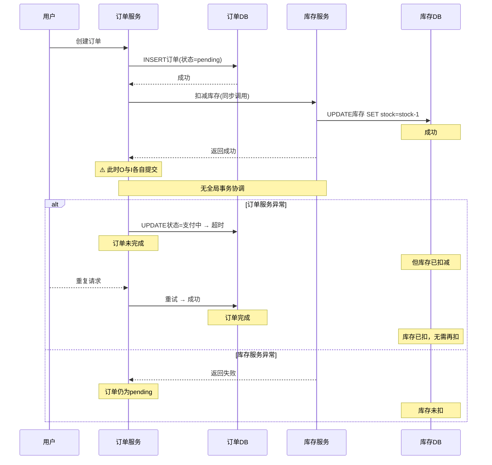
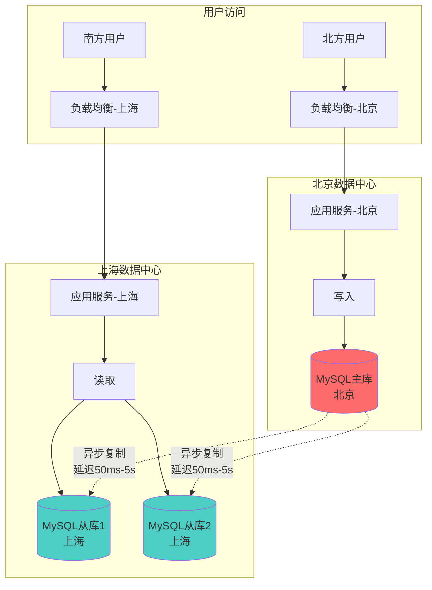

## 实战案例

本章通过三个真实场景的分布式数据库实战案例，展示从问题发现、排查定位到方案落地的完整过程。每个案例覆盖不同的分布式数据库核心挑战：数据分片迁移、跨库分布式事务、读写分离与一致性保障。

---

### 案例一：电商订单库的分库分表迁移

#### 1.1 问题背景

**业务场景**：某电商平台日订单量从10万增长到500万，单表数据量突破3亿行。MySQL单表在5000万行后写入性能急剧下降，DDL操作（如加索引）需要锁表数小时，严重影响业务迭代。

**核心痛点**：

| 问题 | 影响 | 紧迫度 |
|------|------|--------|
| 单表3亿行，写入延迟P99从5ms飙至200ms | 用户下单体验恶化 | 极高 |
| DDL加索引锁表4小时 | 业务无法正常迭代 | 高 |
| 备份恢复耗时超过8小时 | RTO不满足SLA | 高 |
| 读写混用导致互相干扰 | 读延迟随写入峰值波动 | 中 |

**技术选型**：采用ShardingSphere-Proxy作为分片中间件，分片策略选择：

- 分片键：`user_id`（按用户维度水平拆分，保证同一用户订单在同一分片）
- 分片算法：`user_id % 64`（64个分片，预留扩展空间）
- 分片中间件：ShardingSphere-Proxy 5.3.x（支持在线扩容）

#### 1.2 架构设计

迁移前后的架构对比：

迁移前（单库单表）                     迁移后（分库分表）
┌─────────────┐                ┌──────────────────────────────┐
│   应用服务    │                │          应用服务              │
└──────┬──────┘                └──────────────┬───────────────┘
       │                                      │
       ▼                                      ▼
┌─────────────┐                ┌──────────────────────────────┐
│  orders表    │                │    ShardingSphere-Proxy       │
│  (3亿行)    │                │    (SQL路由 + 分片解析)       │
└─────────────┘                └──────────────────────────────┘
                                ┌──────┬──────┬──────┬──────┐
                                │db_00 │db_01 │db_02 │ ...  │db_63│
                                │1280w │1280w │1280w │      │1280w│
                                └──────┴──────┴──────┴──────┴──────┘

#### 1.3 实施步骤

**阶段一：双写准备（第1-2周）**

在应用层实现双写逻辑，同时写入旧表和新分片库，为数据一致性校验做准备：

```java
// 双写Service实现
@Service
public class OrderDualWriteService {

    @Autowired
    private OrderMapper oldOrderMapper;    // 旧表Mapper
    @Autowired
    private ShardingOrderMapper newOrderMapper;  // 新分片Mapper
    @Autowired
    private DualWriteConfig config;

    @Transactional
    public void createOrder(Order order) {
        // 1. 写入旧表（主路径）
        oldOrderMapper.insert(order);

        // 2. 异步写入新分片库（降级不影响主流程）
        CompletableFuture.runAsync(() -> {
            try {
                newOrderMapper.insert(order);
            } catch (Exception e) {
                // 记录失败记录，后续补偿
                dualWriteFailLogService.log(order, e);
                log.error("双写失败: orderId={}", order.getId(), e);
            }
        });
    }
}
```

**阶段二：全量数据迁移（第3-4周）**

使用DataX批量迁移历史数据，按`user_id`范围分批：

```python
# DataX任务配置（按user_id范围分批迁移）
import json

def generate_datax_job(start_user_id, end_user_id, target_ds):
    """生成DataX迁移任务JSON"""
    job = {
        "job": {
            "setting": {
                "speed": {
                    "channel": 8,           # 8个并发通道
                    "byte": 104857600       # 每通道100MB/s
                },
                "errorLimit": {
                    "record": 0,            # 零容忍错误
                    "percentage": 0
                }
            },
            "content": [{
                "reader": {
                    "name": "mysqlreader",
                    "parameter": {
                        "username": "${OLD_DB_USER}",
                        "password": "${OLD_DB_PASS}",
                        "column": ["*"],
                        "where": f"user_id >= {start_user_id} AND user_id < {end_user_id}",
                        "connection": [{
                            "table": ["orders"],
                            "jdbcUrl": ["jdbc:mysql://old-db:3306/orders_db"]
                        }]
                    }
                },
                "writer": {
                    "name": "mysqlwriter",
                    "parameter": {
                        "username": "${NEW_DB_USER}",
                        "password": "${NEW_DB_PASS}",
                        "column": ["*"],
                        "writeMode": "insert",
                        "preSql": ["SET SESSION sql_mode='NO_AUTO_VALUE_ON_ZERO'"],
                        "connection": [{
                            "table": ["orders"],
                            "jdbcUrl": f"jdbc:mysql://{target_ds}:3306/orders_db"
                        }]
                    }
                }
            }]
        }
    }
    return job

# 按user_id范围生成64个分片的迁移任务
for shard in range(64):
    start_uid = shard * 15625000    # 每个分片约1562万用户
    end_uid = (shard + 1) * 15625000
    target_ds = f"db_{shard:02d}"
    job = generate_datax_job(start_uid, end_uid, target_ds)
    with open(f"/tmp/datax_job_shard_{shard:02d}.json", "w") as f:
        json.dump(job, f, indent=2)
```

**阶段三：增量同步与数据校验（第5周）**

```sql
-- 校验数据一致性：对比旧表和新分片库的订单数量
-- 在每个分片上执行
SELECT
    shard_id,
    old_count,
    new_count,
    (old_count - new_count) AS diff,
    CASE
        WHEN old_count = new_count THEN '✅ 一致'
        WHEN old_count > new_count THEN '⚠️ 新库缺少数据'
        ELSE '⚠️ 新库多出数据'
    END AS status
FROM (
    SELECT
        'db_00' AS shard_id,
        (SELECT COUNT(*) FROM old_db.orders WHERE user_id % 64 = 0) AS old_count,
        (SELECT COUNT(*) FROM db_00.orders) AS new_count
    UNION ALL
    SELECT
        'db_01' AS shard_id,
        (SELECT COUNT(*) FROM old_db.orders WHERE user_id % 64 = 1) AS old_count,
        (SELECT COUNT(*) FROM db_01.orders) AS new_count
    -- ... 逐个分片校验
) AS comparison;
```

```python
# 自动化数据校验脚本
import pymysql
import logging

logger = logging.getLogger(__name__)

class DataValidator:
    def __init__(self, old_db_config, new_db_configs):
        self.old_conn = pymysql.connect(**old_db_config)
        self.new_conns = {
            i: pymysql.connect(**cfg) for i, cfg in new_db_configs.items()
        }

    def validate_all(self):
        """校验所有分片的数据一致性"""
        results = []
        for shard_id in range(64):
            result = self.validate_shard(shard_id)
            results.append(result)
            if not result['consistent']:
                logger.warning(f"分片{shard_id}数据不一致! 差异: {result['diff']}")
        return results

    def validate_shard(self, shard_id):
        """校验单个分片"""
        # 1. 数量校验
        old_count = self._count_old(shard_id)
        new_count = self._count_new(shard_id)
        if old_count != new_count:
            return {
                'shard_id': shard_id,
                'consistent': False,
                'diff': old_count - new_count,
                'message': f'旧库{old_count}条, 新库{new_count}条'
            }

        # 2. 抽样校验（随机抽取1000条比对完整数据）
        old_samples = self._sample_old(shard_id, 1000)
        mismatches = []
        for order_id, old_data in old_samples.items():
            new_data = self._get_new(shard_id, order_id)
            if new_data != old_data:
                mismatches.append({
                    'order_id': order_id,
                    'old': old_data,
                    'new': new_data
                })

        return {
            'shard_id': shard_id,
            'consistent': len(mismatches) == 0,
            'diff': 0,
            'sample_mismatches': mismatches
        }
```

**阶段四：灰度切流（第6周）**

按用户ID尾号逐步切流，每批切10%流量，观察30分钟无异常后继续：

切流计划：
  灰度10%: user_id % 10 == 0 → 新分片库    (观察30min)
  灰度30%: user_id % 10 in (0,1,2)         (观察30min)
  灰度50%: user_id % 2 == 0                 (观察30min)
  灰度80%: user_id % 5 in (0,1,2,3)        (观察30min)
  全量切换: 100% → 新分片库                  (观察2h)
  下线双写: 关闭旧表写入                     (保留30天)

```java
// 灰度切流路由控制
@Component
public class ShardingRouteInterceptor implements HandlerInterceptor {

    @Autowired
    private灰度比例配置 grayConfig;

    @Override
    public boolean preHandle(HttpServletRequest request,
                             HttpServletResponse response,
                             Object handler) {
        Long userId = getCurrentUserId();
        if (userId == null) return true;

        // 判断当前用户是否在灰度范围内
        if (isInGrayScope(userId, grayConfig.getCurrentPercentage())) {
            // 路由到新分片库
            ShardingContextHolder.setDataSource("sharding");
        } else {
            // 走旧库
            ShardingContextHolder.setDataSource("legacy");
        }
        return true;
    }

    private boolean isInGrayScope(Long userId, int percentage) {
        return (userId % 100) < percentage;
    }
}
```

#### 1.4 迁移效果

| 指标 | 迁行前 | 迁移后 | 提升幅度 |
|------|--------|--------|----------|
| 写入P99延迟 | 200ms | 8ms | 降低96% |
| DDL操作耗时 | 4小时（锁表） | 2分钟（单分片） | 降低99% |
| 备份恢复RTO | 8小时 | 25分钟（并行恢复） | 降低95% |
| 可支撑数据量 | 3亿行上限 | 理论无上限 | — |
| 单分片数据量 | — | 约470万行 | — |

#### 1.5 经验教训

**教训一：分片键选择是决策根基**

分片键一旦选定，后续修改成本极高。选择分片键必须基于业务查询模式：

分片键选择决策树：
  Q: 大部分查询按什么维度？
  ├── 用户维度 → 用 user_id
  ├── 商户维度 → 用 merchant_id
  ├── 时间维度 → 用 created_at（但有热点问题）
  └── 混合维度 → 考虑二级分片或冗余索引表

**教训二：双写期间的一致性是最大风险**

双写必然存在时间窗口内的数据不一致。关键措施：
- 双写失败必须有补偿机制（写入本地队列，定时重试）
- 数据校验不能只比数量，要抽样比对完整字段
- 灰度切流期间必须保留回滚能力（旧库至少保留30天）

**教训三：预留扩展空间**

初始64个分片看似够用，但分片数在架构设计时确定，后续扩容需要数据迁移。建议按3倍业务预期容量设计分片数。

---

### 案例二：分布式事务的一致性保障

#### 2.1 问题背景

**业务场景**：某SaaS平台的订单系统和库存系统分别部署在不同的数据库实例上。在高并发场景下，频繁出现"用户已付款但库存未扣减"或"库存已扣减但订单未创建"的数据不一致问题。

**典型故障现象**：

事故时间线（某周五下午14:30）：

14:30:01  用户A下单购买商品X（库存剩余1件）
14:30:01  订单服务：创建订单 → 成功
14:30:01  库存服务：扣减库存 → 成功
14:30:02  订单服务：支付回调 → 更新订单状态 → 超时
14:30:02  订单服务：重试更新 → 成功
14:30:03  库存服务：收到延迟消息 → 重复扣减 → 库存变为-1

结果：订单已支付成功，但库存变成了-1（超卖）

**影响数据**：过去30天内，共发现127笔库存异常订单，涉及金额约8.5万元。其中超卖43笔，多扣84笔。

#### 2.2 根因分析

问题根源在于跨服务的分布式事务缺乏可靠的协调机制：



**三个核心问题**：

1. **无全局事务协调**：订单创建和库存扣减是两个独立事务，没有原子性保障
2. **缺乏幂等设计**：库存扣减接口没有幂等键，重复调用导致重复扣减
3. **补偿机制缺失**：部分失败时没有自动回滚或补偿逻辑

#### 2.3 解决方案

采用**Seata AT模式 + 幂等性设计 + 对账补偿**的三层防护体系：

**第一层：Seata分布式事务**

```java
// Seata AT模式：订单创建 + 库存扣减作为分布式事务
@Service
public class OrderService {

    @Autowired
    private InventoryService inventoryService;

    @GlobalTransactional(name = "create-order", rollbackFor = Exception.class)
    public Order createOrder(CreateOrderRequest request) {
        // 1. 创建订单（本地事务）
        Order order = buildOrder(request);
        orderMapper.insert(order);

        // 2. 扣减库存（远程调用，被Seata AT代理）
        inventoryService.deductStock(request.getSkuId(), request.getQuantity());

        // 3. 生成支付单
        Payment payment = createPayment(order);
        paymentMapper.insert(payment);

        // 如果任何步骤失败，Seata会自动回滚所有参与者的事务
        return order;
    }
}

// 库存服务（Seata RM角色）
@Service
public class InventoryService {

    // @GlobalTransactional由Seata拦截，自动管理本地事务的undo_log
    public void deductStock(Long skuId, int quantity) {
        // Seata AT模式会在执行前记录before image，执行后记录after image
        // 如果全局事务回滚，Seata根据undo_log自动恢复
        int affected = inventoryMapper.deduct(skuId, quantity);
        if (affected == 0) {
            throw new BusinessException("库存不足");
        }
    }
}
```

对应的Seata配置：

```yaml
# application.yml
seata:
  enabled: true
  application-id: order-service
  tx-service-group: order_tx_group
  service:
    vgroup-mapping:
      order_tx_group: default
  registry:
    type: nacos
    nacos:
      server-addr: nacos:8848
  config:
    type: nacos
    nacos:
      server-addr: nacos:8848
```

```sql
-- Seata AT模式需要在每个业务库创建undo_log表
CREATE TABLE IF NOT EXISTS `undo_log` (
    `id` bigint(20) NOT NULL AUTO_INCREMENT,
    `branch_id` bigint(20) NOT NULL,
    `xid` varchar(100) NOT NULL,
    `rollback_info` longblob NOT NULL,
    `log_status` int(11) NOT NULL,
    `log_created` datetime NOT NULL,
    `log_modified` datetime NOT NULL,
    `ext` varchar(100) DEFAULT NULL,
    PRIMARY KEY (`id`),
    UNIQUE KEY `ux_undo_log` (`xid`, `branch_id`)
) ENGINE=InnoDB DEFAULT CHARSET=utf8mb4;
```

**第二层：幂等性保障**

```java
// 基于Redis的幂等性控制
@Component
public class IdempotentGuard {

    @Autowired
    private StringRedisTemplate redis;

    /**
     * 幂等性校验 + 执行
     * @param idempotentKey 幂等键（如 "deduct:{skuId}:{orderId}"）
     * @param businessLogic 业务逻辑
     * @param expireSeconds 幂等键过期时间
     */
    public <T> T executeWithIdempotent(String idempotentKey,
                                        Supplier<T> businessLogic,
                                        long expireSeconds) {
        // 1. 尝试获取幂等锁（NX + EX，原子操作）
        Boolean acquired = redis.opsForValue()
            .setIfAbsent("idempotent:" + idempotentKey, "1", expireSeconds, TimeUnit.SECONDS);

        if (Boolean.FALSE.equals(acquired)) {
            // 重复请求，直接返回上次结果
            log.info("幂等拦截: key={}", idempotentKey);
            return null;
        }

        try {
            // 2. 执行业务逻辑
            return businessLogic.get();
        } catch (Exception e) {
            // 3. 业务失败，释放幂等锁（允许重试）
            redis.delete("idempotent:" + idempotentKey);
            throw e;
        }
    }
}

// 使用示例
@Service
public class InventoryServiceImpl implements InventoryService {

    @Autowired
    private IdempotentGuard idempotentGuard;

    @Override
    public void deductStock(Long skuId, int quantity, String orderId) {
        String idempotentKey = String.format("deduct:%d:%s", skuId, orderId);

        idempotentGuard.executeWithIdempotent(idempotentKey, () -> {
            // 幂等保护下的库存扣减
            doDeductStock(skuId, quantity);
            return null;
        }, 3600);  // 幂等键1小时过期
    }
}
```

**第三层：对账补偿系统**

```python
"""
对账补偿系统：每天凌晨自动对账，发现不一致后触发补偿
"""
import datetime
from dataclasses import dataclass

@dataclass
class ReconciliationResult:
    order_id: str
    order_status: str
    stock_deducted: bool
    payment_status: str
    mismatch_type: str  # normal, order_only, stock_only, both_failed

class ReconciliationService:

    def daily_reconciliation(self):
        """每日对账主流程"""
        yesterday = datetime.date.today() - datetime.timedelta(days=1)

        # 1. 获取昨天所有订单
        orders = self.get_orders_by_date(yesterday)
        results = []

        for order in orders:
            result = self.reconcile_single(order)
            results.append(result)

        # 2. 生成对账报告
        report = self.generate_report(results)

        # 3. 自动补偿不一致记录
        mismatches = [r for r in results if r.mismatch_type != 'normal']
        for mismatch in mismatches:
            self.auto_compensate(mismatch)

        # 4. 告警
        if len(mismatches) > 0:
            self.send_alert(len(mismatches), report)

        return report

    def reconcile_single(self, order):
        """单笔订单对账"""
        # 查询库存扣减记录
        stock_record = self.get_stock_deduct_record(order.sku_id, order.id)

        # 查询支付记录
        payment = self.get_payment(order.id)

        mismatch_type = 'normal'
        if order.status == 'completed' and stock_record is None:
            mismatch_type = 'order_only'      # 订单完成但库存未扣
        elif order.status == 'pending' and stock_record is not None:
            mismatch_type = 'stock_only'      # 库存已扣但订单未完成

        return ReconciliationResult(
            order_id=order.id,
            order_status=order.status,
            stock_deducted=stock_record is not None,
            payment_status=payment.status if payment else 'none',
            mismatch_type=mismatch_type
        )

    def auto_compensate(self, result):
        """自动补偿"""
        if result.mismatch_type == 'order_only':
            # 订单完成但库存未扣 → 补扣库存
            self补偿扣减库存(result.order_id)
            log.warning(f"补偿扣减: orderId={result.order_id}")

        elif result.mismatch_type == 'stock_only':
            # 库存已扣但订单未完成 → 恢复库存 + 取消订单
            self补偿恢复库存(result.order_id)
            self.cancel_order(result.order_id)
            log.warning(f"补偿恢复: orderId={result.order_id}")
```

#### 2.4 实施效果

| 指标 | 改造前 | 改造后 | 说明 |
|------|--------|--------|------|
| 数据不一致率 | 0.12% | <0.001% | 降低99%以上 |
| 月均异常订单数 | 127笔 | ≤1笔 | 基本消除 |
| 分布式事务平均耗时 | — | +15ms | Seata带来的额外开销 |
| 系统吞吐量影响 | — | 降低约8% | AT模式需要记录undo_log |
| 对账自动补偿成功率 | — | 99.5% | 剩余0.5%需人工介入 |

#### 2.5 深度反思

**反思一：Seata AT模式的性能代价**

AT模式通过代理SQL解析和undo_log记录实现无侵入式分布式事务，但代价不可忽视：
- 每个事务需要额外一次undo_log写入（磁盘IO）
- SQL解析消耗CPU资源，高并发下可能成为瓶颈
- undo_log表膨胀需要定期清理

**替代方案对比**：

| 方案 | 侵入性 | 性能 | 一致性保障 | 适用场景 |
|------|--------|------|------------|----------|
| Seata AT | 低 | 中 | 强一致 | 中低并发，跨库事务 |
| Seata TCC | 高 | 高 | 强一致 | 高并发，可预占资源 |
| Saga | 中 | 高 | 最终一致 | 长事务，跨多个服务 |
| 本地消息表 | 低 | 高 | 最终一致 | 异步场景，允许延迟 |
| RocketMQ事务消息 | 低 | 高 | 最终一致 | 异步解耦场景 |

**反思二：幂等性设计不能依赖单一机制**

实践中发现Redis幂等锁存在边界情况：
- Redis故障时幂等锁不可用 → 需要降级策略（数据库唯一索引兜底）
- 幂等键过期后重复请求 → 需要根据业务选择合理过期时间
- 分布式环境下Redis主从切换可能丢锁 → 使用RedLock或数据库锁兜底

---

### 案例三：跨机房读写分离与一致性保障

#### 3.1 问题背景

**业务场景**：某互联网公司在北京和上海两个数据中心部署了MySQL主从集群，北京为主库（写），上海为从库（读），通过异步复制同步数据。业务为全球用户服务，对读延迟敏感。

**爆发问题**：

用户反馈："我刚下单成功，刷新页面却看不到订单"

分析日志发现：用户下单后系统立即路由到上海从库读取，但此时主从复制延迟导致从库数据尚未同步。在高峰期，主从复制延迟从正常的50ms飙升至2-5秒，直接影响用户体验。

故障复现路径：
1. 用户下单 → 写入北京主库
2. 应用根据用户所在区域 → 路由到上海从库读取
3. 主从复制延迟500ms-5s → 从库查不到刚创建的订单
4. 用户看到空订单列表 → 投诉"订单丢失"
5. 客服查主库 → 订单确实存在 → 用户体验混乱

#### 3.2 架构分析



**根本矛盾**：异步复制的延迟是物理定律决定的（网络传输+应用日志），不可能消除，只能管理。

#### 3.3 解决方案：三层读写路由策略

**策略一：写后读强制路由主库**

对于下单、支付等对一致性要求极高的操作，在写入后的短时间内，强制后续读请求路由到主库：

```java
/**
 * 写后读一致性保障
 * 原理：写操作完成后，将该用户的"主库直读"标记写入Redis
 * 后续该用户的读请求在标记有效期内强制走主库
 */
@Component
public class ReadAfterWriteRouter {

    @Autowired
    private StringRedisTemplate redis;

    // 标记有效期：5秒（覆盖99.9%的主从复制延迟）
    private static final int MARKER_TTL_SECONDS = 5;

    /**
     * 写操作完成后调用
     */
    public void markWriteConsistency(Long userId) {
        String key = "raw:" + userId;
        redis.opsForValue().set(key, "1", MARKER_TTL_SECONDS, TimeUnit.SECONDS);
    }

    /**
     * 读操作前调用，决定路由目标
     */
    public DataSourceRoute decideRoute(Long userId) {
        String key = "raw:" + userId;
        if (Boolean.TRUE.equals(redis.hasKey(key))) {
            // 写后5秒内 → 路由主库
            return DataSourceRoute.PRIMARY;
        }
        // 正常读请求 → 路由从库
        return DataSourceRoute.REPLICA;
    }
}

// 集成到数据源路由
@Aspect
@Component
public class ReadRouteAspect {

    @Autowired
    private ReadAfterWriteRouter router;

    @Before("@annotation(readFromPrimary)")
    public void enforcePrimaryRead(JoinPoint joinPoint) {
        Long userId = extractUserId(joinPoint);
        DataSourceRoute route = router.decideRoute(userId);
        DynamicDataSourceContextHolder.setDataSource(route.getDataSourceName());
    }
}
```

**策略二：关键业务使用半同步复制**

对于订单详情等关键页面，将MySQL复制模式从异步升级为半同步复制（semi-sync）：

```sql
-- 北京主库配置
-- 安装半同步复制插件
INSTALL PLUGIN rpl_semi_sync_master SONAME 'semisync_master.so';

SET GLOBAL rpl_semi_sync_master_enabled = 1;
SET GLOBAL rpl_semi_sync_master_timeout = 100;  -- 100ms超时后降级为异步

-- 上海从库配置
INSTALL PLUGIN rpl_semi_sync_slave SONAME 'semisync_slave.so';

SET GLOBAL rpl_semi_sync_slave_enabled = 1;

-- 验证半同步状态
SHOW STATUS LIKE 'Rpl_semi_sync%';
-- +--------------------------------------------+-------+
-- | Variable_name                              | Value |
-- +--------------------------------------------+-------+
-- | Rpl_semi_sync_master_status                | ON    |  ← 半同步已开启
-- | Rpl_semi_sync_master_clients               | 2     |  ← 2个从库已连接
-- | Rpl_semi_sync_master_no_tx                 | 12    |  ← 降级为异步的事务数
-- | Rpl_semi_sync_master_yes_tx                | 8521  |  ← 半同步成功的事务数
-- +--------------------------------------------+-------+
```

半同步复制的权衡：

| 模式 | 写入延迟 | 数据安全性 | 适用场景 |
|------|----------|------------|----------|
| 异步复制 | 最低（+0ms） | 可能丢最后几秒数据 | 日志、统计等非关键读 |
| 半同步复制 | +100ms（从库确认） | 主库崩溃不丢最近数据 | 订单、支付等关键读 |
| 组复制（MGR） | +200ms（多数派确认） | 强一致 | 金融核心场景 |

**策略三：客户端缓存兜底**

对于对实时性要求不那么极端的场景（如订单列表），在应用层增加短时缓存：

```python
"""
客户端缓存兜底策略
写操作后直接将数据注入本地缓存，后续读请求优先命中缓存
"""
import time
import threading

class ReadConsistencyCache:
    """
    带版本号的本地缓存，用于保障写后读一致性
    """

    def __init__(self, local_ttl=3, max_size=10000):
        self.cache = {}
        self.lock = threading.RLock()
        self.local_ttl = local_ttl  # 本地缓存TTL（秒）
        self.max_size = max_size

    def on_write(self, cache_key, data):
        """写操作完成后调用，将最新数据注入本地缓存"""
        with self.lock:
            self.cache[cache_key] = {
                'data': data,
                'expire_at': time.time() + self.local_ttl,
                'source': 'write_through'
            }

    def on_read(self, cache_key, db_reader):
        """读操作：先查本地缓存，再查从库"""
        with self.lock:
            entry = self.cache.get(cache_key)
            if entry and entry['expire_at'] > time.time():
                # 命中本地缓存（写后读一致性有保障）
                return entry['data'], 'local_cache'

        # 未命中，查询从库
        data = db_reader(cache_key)

        # 如果本地缓存中有过期数据，说明从库可能还没同步
        # 此时额外校验主库
        with self.lock:
            entry = self.cache.get(cache_key)
            if entry and entry['expire_at'] > time.time():
                # 从库数据比本地缓存旧 → 走主库
                data = db_reader_primary(cache_key)
                return data, 'primary_fallback'

        return data, 'replica'
```

#### 3.4 实施效果

| 指标 | 改造前 | 改造后 | 说明 |
|------|--------|--------|------|
| "订单丢失"投诉 | 日均15-20次 | <1次/周 | 降低99%+ |
| 写后读延迟（P99） | 2s | 50ms | 关键路径走主库 |
| 半同步增加写延迟 | — | +30ms（平均） | 仅影响关键写 |
| 从库读取占比 | 60% | 85% | 更多读路由到从库，释放主库压力 |

#### 3.5 进阶：跨机房一致性架构演进

当业务规模进一步扩大，需要考虑更完整的跨机房一致性架构：

阶段一（当前）：单主多从 + 写后读标记
  优点：简单可控
  缺点：单点写入瓶颈，跨机房延迟不可消除

阶段二（演进方向）：双主多活 + 分区路由
  按用户维度分配主写区域（华北→北京主库，华东→上海主库）
  每个区域有自己的主库和从库
  跨区域读取通过异步复制 + 写后读标记保障

阶段三（终极形态）：全球分布式数据库
  TiDB / CockroachDB / OceanBase等NewSQL
  底层自动处理分片、复制、一致性
  应用层无需关心主从路由

---

### 三个案例的共性总结

#### 核心原则

┌─────────────────────────────────────────────────────────────┐
│                    分布式数据库实战核心原则                     │
├─────────────┬───────────────────────────────────────────────┤
│  数据安全    │  任何架构变更都必须有回滚方案和数据校验机制         │
│  灰度优先    │  切流必须渐进式，观察指标无异常后再扩大范围         │
│  幂等设计    │  所有写接口都必须设计幂等性，防重放、防重复        │
│  补偿兜底    │  分布式环境下100%一致不可能，对账补偿是最后防线    │
│  监控先行    │  没有监控的优化是盲人摸象，先建设观测能力再动手    │
└─────────────┴───────────────────────────────────────────────┘

#### 不同场景的技术选型建议

| 业务阶段 | 数据规模 | 推荐方案 | 关注重点 |
|----------|----------|----------|----------|
| 初创期 | <1000万行 | 单库+读写分离 | 快速验证，不过早分片 |
| 成长期 | 1000万-5亿行 | 分库分表+中间件 | 选择合适的分片键 |
| 扩张期 | 5亿-100亿行 | 分布式数据库（TiDB/OB） | 成本与运维复杂度平衡 |
| 全球化 | >100亿行 | 全球分布式+多活 | 网络延迟与一致性 |

#### 工具生态速查

| 工具 | 用途 | 适用案例 |
|------|------|----------|
| ShardingSphere-Proxy | 分库分表中间件 | 案例一 |
| DataX | 离线数据迁移 | 案例一 |
| Seata | 分布式事务框架 | 案例二 |
| RocketMQ | 事务消息 | 案例二 |
| MySQL半同步复制 | 读写一致性 | 案例三 |
| Prometheus + Grafana | 监控告警 | 全部 |
| pt-table-checksum | 主从数据校验 | 案例一、三 |
