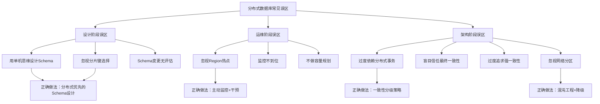

# 分布式数据库常见误区与深度纠偏

分布式数据库的复杂性不仅来自技术本身，更来自开发者从单机数据库迁移过来的思维惯性。许多在单机场景下完全正确的做法，放到分布式环境中会变成灾难性的错误。本节系统梳理分布式数据库领域最常见的十大误区，逐一剖析其危害、根因和正确做法，帮助读者建立正确的分布式数据库设计直觉。

## 误区一：用单机数据库的思维设计分布式Schema

### 误区表现

许多团队在引入分布式数据库时，习惯性地沿用单机数据库的Schema设计思路：宽表、大量JOIN、自增主键、缺少合理的分片键选择。这种做法在单机MySQL中毫无问题，但在分布式数据库中会导致严重的性能退化。

典型错误模式：

```sql
-- 错误：使用自增ID作为主键（在Range分片下造成写热点）
CREATE TABLE orders (
    id BIGINT AUTO_INCREMENT PRIMARY KEY,
    user_id BIGINT,
    amount DECIMAL(10,2),
    created_at TIMESTAMP,
    INDEX idx_user (user_id)
);

-- 错误：设计了大量跨分片的JOIN关系
SELECT o.*, u.name, p.title, c.category_name
FROM orders o
JOIN users u ON o.user_id = u.id
JOIN products p ON o.product_id = p.id
JOIN categories c ON p.category_id = c.id
WHERE o.created_at > '2024-01-01';
```

### 为什么这是个问题

自增主键在Range分片策略下会导致所有新数据写入同一个Region/分片，形成严重的写热点。TiDB的默认Region大小为96MB，当写入集中在最后一个Region时，该Region会频繁分裂，产生大量后台Compaction，同时该Region所在的Raft Leader节点会承受远超其他节点的负载。

跨分片JOIN则是另一个性能杀手。在TiDB中，当两张表的分片键不同时，JOIN需要通过TiFlash的MPP引擎或TiDB的Shuffle Hash Join来执行，数据需要在节点间大量传输。假设orders表有1亿行，users表有1000万行，一个跨分片JOIN可能需要传输数GB的中间结果。

### 正确做法

**合理选择分片键**：分片键的选择应基于业务的高频查询模式。对于电商系统，如果80%的查询都是按用户维度进行的，那么user_id就是最佳分片键。

```sql
-- 正确：使用分布式ID生成策略替代自增主键
CREATE TABLE orders (
    id BIGINT PRIMARY KEY,        -- 使用Snowflake/ULID等分布式ID
    user_id BIGINT NOT NULL,       -- 作为分片键
    amount DECIMAL(10,2),
    created_at TIMESTAMP,
    INDEX idx_user (user_id)
) SHARD_ROW_ID_BITS = 4 PRE_SPLIT_REGIONS = 8;

-- 正确：通过冗余字段避免跨分片JOIN
CREATE TABLE orders (
    id BIGINT PRIMARY KEY,
    user_id BIGINT NOT NULL,
    user_name VARCHAR(100),       -- 冗余用户名，避免JOIN users表
    product_id BIGINT,
    product_title VARCHAR(200),   -- 冗余商品名，避免JOIN products表
    amount DECIMAL(10,2),
    created_at TIMESTAMP
);
```

**TiDB中控制Region分裂**：

```sql
-- 查看Region分布是否均匀
SELECT COUNT(*), leader_store_id FROM pd_regions GROUP BY leader_store_id;

-- 手动合并热点Region（如果自动分裂不理想）
SPLIT TABLE orders BETWEEN (0) AND (90000000) REGIONS 32;
```

**单机数据库 vs 分布式数据库Schema设计对比**：

| 设计维度 | 单机数据库 | 分布式数据库 |
|----------|-----------|-------------|
| 主键策略 | AUTO_INCREMENT即可 | Snowflake/ULID，避免热点 |
| 分片键 | 不需要 | 必须精心选择，基于查询模式 |
| JOIN | 自由JOIN，优化器自动处理 | 尽量避免跨分片JOIN，用冗余字段 |
| 索引 | 越多越好 | 谨慎创建，每个索引都有跨节点维护开销 |
| 事务 | 开箱即用 | 跨分片事务代价高昂，需避免 |
| 数据类型 | 灵活 | 尽量用定长类型，减少Schema变更成本 |

## 误区二：忽视分片键选择的长期影响

### 误区表现

很多团队在项目初期随意选择一个字段作为分片键（比如created_at或某个无关紧要的ID），等到数据量增长到数十亿行时才发现查询性能急剧下降，但此时数据迁移的成本已经极其高昂。

### 为什么这是个问题

分片键一旦确定并写入大量数据后，变更分片键意味着：

1. **全量数据迁移**：数十亿行数据需要按照新的分片键重新分布，可能需要数天时间
2. **双写窗口**：迁移期间需要同时写入新旧两个分片方案，保证一致性
3. **索引重建**：所有二级索引需要根据新的物理分布重新构建
4. **业务中断风险**：迁移过程中的路由切换可能导致短暂的服务降级

某大型互联网公司的实际案例：一个日志系统最初按时间分片（Range分片，按created_at），初期写入性能良好。但当运营团队需要按用户维度查询日志时（"查看某个用户最近7天的操作记录"），所有查询都变成了跨分片扫描，单次查询耗时从10ms飙升到30秒以上。最终花了3个月时间和大量工程师资源完成了分片键变更。

### 正确做法

**分片键选择决策框架**：

分片键选择流程：
1. 分析Top 20高频查询 → 确定查询模式
2. 统计读写比例 → 读多写少优先考虑读性能
3. 评估数据增长趋势 → 预测未来3年的数据分布
4. 检查热点风险 → 是否有高价值的单Key大表
5. 模拟分片分布 → 用实际数据验证均匀性

```python
def evaluate_shard_key(table_data, query_patterns):
    """评估分片键候选方案"""
    candidates = {}
    
    for candidate_key in get_candidate_keys(table_data):
        # 1. 评估数据分布均匀性
        distribution = compute_distribution(table_data, candidate_key)
        skewness = compute_skewness(distribution)
        
        # 2. 评估查询覆盖度（多少高频查询可以直接路由到单个分片）
        coverage = 0
        for pattern in query_patterns:
            if candidate_key in pattern['where_clause']:
                coverage += 1
        query_coverage = coverage / len(query_patterns)
        
        # 3. 评估热点风险（单个Key下的数据量方差）
        max_partition_size = max(distribution.values())
        avg_partition_size = sum(distribution.values()) / len(distribution)
        hotspot_ratio = max_partition_size / avg_partition_size
        
        # 4. 综合评分
        score = (1 - skewness) * 0.3 + query_coverage * 0.5 + (1 / hotspot_ratio) * 0.2
        
        candidates[candidate_key] = {
            'score': score,
            'skewness': skewness,
            'query_coverage': query_coverage,
            'hotspot_ratio': hotspot_ratio
        }
    
    # 选择综合评分最高的分片键
    best_key = max(candidates, key=lambda k: candidates[k]['score'])
    return best_key, candidates
```

**经验法则**：

- 电商系统：`user_id`（按用户查询为主）
- 日志系统：`trace_id`或`user_id`（按链路/用户查询，非按时间）
- IM系统：`conversation_id`（按会话查询为主）
- 金融系统：`account_id`（按账户查询为主）
- **永远不要用时间戳作为分片键**，除非你的查询模式确实是纯时间范围扫描

## 误区三：对分布式事务过度依赖

### 误区表现

很多从单机MySQL迁移过来的开发团队，习惯性地在所有涉及多表修改的操作上使用分布式事务（如TiDB的BEGIN...COMMIT包裹所有跨表操作），认为这样可以保证数据一致性。

```go
// 典型的过度使用分布式事务的代码
func CreateOrder(ctx context.Context, order *Order) error {
    txn, _ := ctx.Txn(true) // 开启分布式事务
    
    // 插入订单
    txn.ExecContext(ctx, "INSERT INTO orders ...", order.Args...)
    // 扣减库存
    txn.ExecContext(ctx, "UPDATE products SET stock = stock - 1 WHERE id = ?", order.ProductID)
    // 写入流水
    txn.ExecContext(ctx, "INSERT INTO account_flows ...", flow.Args...)
    // 更新用户积分
    txn.ExecContext(ctx, "UPDATE users SET points = points + ? WHERE id = ?", order.Points, order.UserID)
    // 记录日志
    txn.ExecContext(ctx, "INSERT INTO operation_logs ...", log.Args...)
    
    return txn.Commit() // 跨多个分片的2PC
}
```

### 为什么这是个问题

分布式事务（2PC）的性能代价远高于本地事务。每个跨分片事务至少需要：

- **2个RTT**（Prepare + Commit各一轮网络往返）
- **多次WAL写入**（协调者写Decision日志 + 参与者写Prepare/Commit日志）
- **锁持有时间延长**（锁从Prepare阶段一直持有到Commit完成）

在TiDB的实测数据中，跨两个Region的分布式事务吞吐量比本地事务低3-5倍，跨4个Region则低8-10倍。当事务涉及5个以上分片时，吞吐量可能下降一个数量级。

更严重的是，分布式事务的锁冲突是跨节点的，冲突检测的开销更大。在高并发场景下（如秒杀），大量分布式事务可能导致死锁检测超时，进而引发事务回滚风暴。

### 正确做法

**分级事务策略**：

| 场景 | 事务策略 | 示例 |
|------|---------|------|
| 单表操作 | 本地事务 | 更新用户积分 |
| 同分片多表 | 本地事务 | 同一用户的订单+流水 |
| 跨分片关键操作 | 分布式事务 | 订单创建+库存扣减（必须一致） |
| 跨分片非关键操作 | 消息队列最终一致 | 订单创建+积分更新+日志记录 |

```go
// 正确做法：将必须一致的操作和可以最终一致的操作分开
func CreateOrder(ctx context.Context, order *Order) error {
    // 第一步：核心事务（本地或跨分片，尽量减少跨分片范围）
    txn, _ := ctx.Txn(true)
    txn.ExecContext(ctx, "INSERT INTO orders ...", order.Args...)
    txn.ExecContext(ctx, "UPDATE products SET stock = stock - 1 WHERE id = ?", order.ProductID)
    if err := txn.Commit(); err != nil {
        return err // 核心操作失败，整体回滚
    }
    
    // 第二步：异步最终一致操作（通过消息队列）
    mq.SendAsync("order_created", map[string]interface{}{
        "order_id":  order.ID,
        "user_id":   order.UserID,
        "points":    order.Points,
    })
    return nil
}

// 消费者：异步更新积分
func HandleOrderCreated(msg Message) {
    // 重试机制 + 幂等保证
    user_id := msg["user_id"]
    points := msg["points"]
    db.Exec("UPDATE users SET points = points + ? WHERE id = ?", points, user_id)
    // 如果失败，消息重试（幂等设计确保不会重复加分）
}
```

**TiDB事务模式选择**：

```sql
-- 保守模式（强一致，适合金融场景）
SET SESSION tidb_txn_mode = 'pessimistic';

-- 乐观模式（高吞吐，适合非冲突场景）
SET SESSION tidb_txn_mode = 'optimistic';

-- 在非关键路径上，考虑使用LOCAL Transaction
-- 即确保事务涉及的数据都在同一个Region/分片上
```

## 误区四：忽略Region热点问题

### 误区表现

部署了TiDB或CockroachDB之后，开发团队以为"分布式数据库自动分片=自动均衡"，不再关注数据分布是否均匀。结果随着业务增长，某些节点的CPU和IO远高于其他节点，但团队无法理解"为什么数据不是均匀分布的"。

### 为什么这是个问题

自动分片并不等于自动均衡。以下场景都可能导致热点：

1. **时间序列数据**：新数据总是写入最新的Range分片
2. **自增ID**：所有INSERT都路由到最大的Key所在的Region
3. **热点Key**：某些业务Key（如"系统用户"、"默认配置"）承载远超平均的读写量
4. **大Key**：单个Key/行的Value过大（如存储了大量JSON或BLOB数据）

TiDB的PD（Placement Driver）会自动分裂和调度Region，但分裂需要时间（默认10秒检测一次），调度也需要时间（默认10分钟检查一次Region分布均衡性）。在突发流量下，热点可能在PD响应之前就已经造成了严重的性能影响。

### 正确做法

**监控热点Region**：

```sql
-- TiDB：查看Region的QPS分布
SELECT region_id, leader_store_id, read_bytes, write_bytes, 
       read_qps, write_qps
FROM INFORMATION_SCHEMA.TIDB_HOT_REGIONS
ORDER BY write_qps DESC
LIMIT 10;

-- 查看Region的大小分布
SELECT region_id, leader_store_id, approximate_size
FROM INFORMATION_SCHEMA.TIDB_REGIONS
ORDER BY approximate_size DESC
LIMIT 10;

-- 查看各Store的负载
SELECT store_id, leader_count, region_count, 
       cpu_used_pct, disk_used_pct
FROM INFORMATION_SCHEMA.TIDB_STORES;
```

**手动拆分热点Region**：

```sql
-- 当某个Region的QPS远超平均时，手动拆分
-- 将Region [0, +∞) 拆分为 [0, 5000000) 和 [5000000, +∞)
SPLIT TABLE orders BETWEEN (0) AND (9999999) REGIONS 16;

-- 针对热点Key的预拆分
SPLIT TABLE orders BY (1000000), (2000000), (3000000);
```

**避免热点的编码技巧**：

```python
# 错误：直接使用自增ID，热点在最大ID处
def bad_order_id():
    return auto_increment_id()

# 正确：使用Snowflake ID（时间戳+机器ID+序列号）
# 或者对ID做前缀打散
def good_order_id():
    base_id = snowflake.next_id()
    # 将高位的机器ID部分进行掩码，打散到多个Region
    prefix = base_id % 1000  # 散列到1000个前缀
    return (prefix << 52) | (base_id &amp; 0xFFFFFFFFFFFF)

# 更好的方案：使用SHARD_ROW_ID_BITS让TiDB自动打散
# 在建表时指定
# CREATE TABLE orders (...) SHARD_ROW_ID_BITS = 4 PRE_SPLIT_REGIONS = 8
# 这会将RowID的高4位随机化，自动分散到16个Region
```

## 误区五：盲目信任最终一致性

### 误区表现

一些团队在使用支持最终一致性模式的分布式数据库（如Cassandra、DynamoDB）时，忽视了最终一致性带来的一致性窗口问题，在业务逻辑中隐含了强一致性的假设。

```python
# 典型的最终一致性陷阱
def transferMoney(from_account, to_account, amount):
    # 从A账户扣款
    db_write(from_account, balance - amount, consistency="ONE")
    # 立即从B账户的读操作中获取余额
    balance_b = db_read(to_account, consistency="ONE")  # 可能读到旧值！
    # 给B账户加款
    db_write(to_account, balance_b + amount, consistency="ONE")
    
    # 问题：如果读到的balance_b是旧值，转账金额会出错
```

### 为什么这是个问题

最终一致性模型下，写入操作返回成功时，数据可能还没有同步到所有副本。读取操作可能读到旧版本的数据。这在以下场景会造成严重问题：

1. **读写同Key**：写入后立即读取同一Key，可能读到旧值（Read-your-writes问题）
2. **跨Key依赖**：操作B依赖操作A的写入结果，但A的写入可能还没有传播
3. **计数器操作**：先读后写的Counter操作可能丢失更新

Dynamo论文中明确指出：最终一致性适用于"可以容忍短暂不一致但最终会收敛"的场景（如用户评论的点赞数、浏览量）。对于涉及金钱的操作（余额、库存），必须使用强一致性读写。

### 正确做法

**根据业务语义选择一致性级别**：

| 业务场景 | 所需一致性 | 实现方式 |
|---------|-----------|---------|
| 账户余额/库存 | 强一致 | Quorum读写（W+R>N） |
| 用户Session | 强一致（Read-your-writes） | 会话粘性 + read-after-write |
| 点赞/浏览量 | 最终一致 | 单副本写入 + 异步同步 |
| 搜索索引 | 最终一致 | 写入主库 + 异步同步到ES |
| 用户资料 | 最终一致 | 读写分离即可 |

```python
# 正确：资金操作使用Quorum读写（W=2, R=2, N=3）
def safe_transfer(from_account, to_account, amount):
    # 使用线性一致性读取（读最新写入）
    balance_a = db_read(from_account, consistency="QUORUM")
    if balance_a < amount:
        raise InsufficientBalance()
    
    # 使用Quorum写入（写入至少2个副本）
    db_write(from_account, balance_a - amount, consistency="QUORUM")
    
    # 读取时也要Quorum，保证读到最新值
    balance_b = db_read(to_account, consistency="QUORUM")
    db_write(to_account, balance_b + amount, consistency="QUORUM")

# 正确：非关键业务使用最终一致性，但要处理冲突
def update_like_count(post_id):
    db_write(post_id, increment=1, consistency="ONE")  # 快速写入
    # 后台异步修复计数器偏差
```

**Cassandra中的一致性选择**：

```sql
-- 资金操作：强一致性
CONSISTENCY QUORUM;
INSERT INTO accounts (id, balance) VALUES (1, 1000);

-- 浏览量：最终一致性
CONSISTENCY ONE;
UPDATE posts SET view_count = view_count + 1 WHERE id = 123;
```

## 误区六：忽视网络分区对系统的影响

### 误区表现

在系统设计时，假设网络永远是可靠的，不做任何网络分区（Network Partition）场景下的容错处理。结果当机房之间的光纤被挖断、交换机故障、或云厂商网络抖动时，系统出现数据不一致或完全不可用。

### 为什么这是个问题

CAP定理明确告诉我们：在网络分区发生时，系统必须在一致性和可用性之间做出选择。但很多团队在设计分布式数据库应用时：

1. 完全没有考虑网络分区的场景
2. 没有设计降级策略
3. 没有定期进行混沌工程测试
4. 没有准备网络分区的恢复流程

2023年某云厂商的大规模网络故障导致多个依赖其网络的分布式系统出现脑裂（Split-Brain），由于系统未做分区容错设计，出现了双写冲突，恢复后需要人工修复数百万条数据。

### 正确做法

**网络分区防御体系**：

```python
class PartitionTolerantService:
    """网络分区感知的服务"""
    
    def __init__(self):
        self.local_leader = None
        self.partition_detected = False
        self.quorum_checker = QuorumChecker()
    
    def handle_request(self, request):
        if self.partition_detected:
            return self.handle_partition_mode(request)
        
        # 正常模式：检查是否有网络分区
        if not self.quorum_checker.has_quorum():
            self.partition_detected = True
            return self.handle_partition_mode(request)
        
        return self.handle_normal_mode(request)
    
    def handle_partition_mode(self, request):
        """分区模式下的处理策略"""
        # 策略1：只读模式（CP选择：牺牲可用性保一致性）
        if request.is_read():
            if self.can_serve_read(request):
                return self.read_local(request)
            else:
                return Response(status=503, body="读请求在当前分区下无法服务")
        
        # 策略2：写请求拒绝或排队
        if request.is_write():
            # 记录到本地WAL，等分区恢复后重放
            self.local_wal.append(request)
            return Response(status=503, body="写请求已排队，等待网络恢复")
    
    def on_partition_healed(self):
        """网络分区恢复后的处理"""
        self.partition_detected = False
        
        # 1. 同步本地WAL中的写入
        self.replay_local_wal()
        
        # 2. 解决冲突（Last-Write-Wins / Vector Clock / CRDT）
        self.resolve_conflicts()
        
        # 3. 重新同步所有副本
        self.resync_replicas()
```

**混沌工程测试清单**：

```bash
# 模拟网络分区（使用tc命令）
# 将节点A和节点B之间的网络延迟增加到5秒
tc qdisc add dev eth0 root netem delay 5000ms 500ms

# 模拟丢包（50%丢包率）
tc qdisc add dev eth0 root netem loss 50%

# 模拟节点间完全隔离
iptables -A INPUT -s <node_b_ip> -j DROP
iptables -A OUTPUT -d <node_b_ip> -j DROP

# Chaos Mesh（Kubernetes环境下的混沌工程工具）
kubectl chaos mesh create network-chaos \
    --mode=all \
    --action=loss \
    --loss=100 \
    --target-pods=tiKV-0,tiKV-1
```

## 误区七：过度追求强一致性

### 误区表现

与误区五相反，另一些团队走向了另一个极端：所有操作都使用强一致性，即使是业务上可以容忍短暂不一致的场景。这导致系统性能严重下降，吞吐量远低于预期。

```go
// 过度追求强一致性的代码
func LikePost(userID, postID string) error {
    // 使用了线性一致性读写，但只是个点赞操作
    txn, _ := client.BeginTx(ctx, &amp;sql.TxOptions{
        Isolation: sql.LevelLinearizable, // 最强隔离级别
    })
    
    // 先读取当前点赞数
    var count int
    txn.QueryRow("SELECT like_count FROM posts WHERE id = ? FOR UPDATE", postID).Scan(&amp;count)
    
    // 更新点赞数
    txn.Exec("UPDATE posts SET like_count = ? WHERE id = ?", count+1, postID)
    
    // 记录点赞关系
    txn.Exec("INSERT INTO post_likes (user_id, post_id) VALUES (?, ?)", userID, postID)
    
    return txn.Commit() // 全部使用强一致性，杀鸡用牛刀
}
```

### 为什么这是个问题

强一致性意味着更高的通信开销、更长的锁持有时间和更低的并发能力。对于点赞、浏览量、评论计数这类业务，即使读到了几秒钟前的旧值，对用户体验的影响几乎为零。但强制使用强一致性会导致：

1. **QPS下降50-80%**：每次读写都需要多数派确认
2. **延迟增加**：从单副本读取的<1ms延迟变成多副本同步的5-20ms
3. **锁竞争加剧**：热点Key上的强一致性读写会导致大量锁等待
4. **可用性降低**：多数派不可用时，即使是读操作也会失败

### 正确做法

**一致性分级策略**：

```yaml
# 业务一致性需求分级
consistency_levels:
  critical:  # 金融级：账户余额、库存、订单金额
    read: QUORUM
    write: QUORUM
    timeout: 5000ms
    retry: 3
    
  important:  # 重要级：用户资料、订单状态
    read: LOCAL_QUORUM
    write: LOCAL_QUORUM
    timeout: 2000ms
    retry: 2
    
  normal:  # 普通级：评论、点赞、浏览量
    read: ONE
    write: ONE
    timeout: 1000ms
    retry: 1
    
  eventual:  # 最终级：搜索索引、推荐数据
    read: ONE
    write: ONE
    async_sync: true
    sync_delay: 30s
```

```python
# 正确：根据业务语义选择不同的一致性级别
def like_post(user_id, post_id):
    # 点赞关系：最终一致性即可
    db.write(f"INSERT INTO post_likes (user_id, post_id) VALUES ({user_id}, {post_id})", 
             consistency="ONE")
    # 计数器：异步更新，最终一致
    mq.send_async("like_counter", {"post_id": post_id, "delta": 1})

def transfer_money(from_id, to_id, amount):
    # 资金操作：强一致性
    with db.transaction(isolation="QUORUM"):
        balance = db.read(from_id, consistency="QUORUM")
        db.write(from_id, balance - amount, consistency="QUORUM")
        balance_b = db.read(to_id, consistency="QUORUM")
        db.write(to_id, balance_b + amount, consistency="QUORUM")
```

## 误区八：忽视分布式数据库的监控和可观测性

### 误区表现

部署了TiDB/CockroachDB/YugabyteDB后，只监控了基本的CPU、内存、磁盘指标，没有深入到分布式数据库特有的指标（Region分布、Raft日志延迟、事务冲突率、GC压力等）。等到出了问题才临时添加监控，此时已经错过了定位根因的最佳时机。

### 为什么这是个问题

分布式数据库的故障模式与单机数据库截然不同。以下是单机监控看不到的分布式特有问题：

1. **Region热点**：某些Region的QPS远超平均，但整体CPU看起来正常
2. **Raft日志延迟**：Follower落后Leader太多，导致读取到旧数据
3. **事务冲突**：两个事务竞争同一行数据，大量重试导致吞吐量下降
4. **GC压力**：旧版本数据清理不及时，占用大量磁盘和内存
5. **网络延迟**：节点间网络延迟异常增加，导致Raft心跳超时

### 正确做法

**TiDB/Prometheus/Grafana监控体系**：

```yaml
# prometheus.yml - 分布式数据库监控配置
global:
  scrape_interval: 15s

scrape_configs:
  - job_name: 'tidb'
    static_configs:
      - targets: ['tidb-0:10080', 'tidb-1:10080']
    
  - job_name: 'tikv'
    static_configs:
      - targets: ['tikv-0:20180', 'tikv-1:20180', 'tikv-2:20180']
    
  - job_name: 'pd'
    static_configs:
      - targets: ['pd-0:2379', 'pd-1:2379', 'pd-2:2379']

# 关键告警规则
rule_groups:
  - name: tidb_critical
    rules:
      # Region热点告警
      - alert: RegionHotspot
        expr: rate(tidb_pd_region_bucket_query{type="write"}[1m]) > 10000
        for: 5m
        labels:
          severity: warning
        annotations:
          summary: "Region写入热点 detected"
          
      # Raft日志延迟告警
      - alert: RaftLogLag
        expr: tikv_raftstore_raft_log_lag > 1000
        for: 3m
        labels:
          severity: critical
        annotations:
          summary: "Raft日志延迟超过1000条"
          
      # 事务冲突率告警
      - alert: TransactionConflict
        expr: rate(tidb_session_transaction_duration_seconds_count{type="rollback"}[5m]) / rate(tidb_session_transaction_duration_seconds_count[5m]) > 0.3
        for: 5m
        labels:
          severity: warning
        annotations:
          summary: "事务回滚率超过30%"
          
      # TiKV存储空间告警
      - alert: TiKVStorageFull
        expr: tikv_engine_size_bytes / tikv_engine_block_cache_size_bytes > 0.9
        for: 10m
        labels:
          severity: critical
```

**关键监控指标清单**：

| 指标类别 | 关键指标 | 告警阈值 | 含义 |
|---------|---------|---------|------|
| Region分布 | store_size | 各store差异>30% | 存储不均衡 |
| Region分布 | leader_balance_ratio | >0.3 | Leader分布不均 |
| Raft | raft_log_lag | >5000 | Follower落后过多 |
| Raft | apply_log_duration | >100ms | 日志应用延迟 |
| 事务 | txn_conflict_retry | >1000/min | 事务冲突频繁 |
| 事务 | txn_statement_count | >30/txn | 事务太大 |
| GC | gc_life_time | <10min | GC太频繁 |
| TiFlash | tiflash_cpu | >80% | 计算节点过载 |

## 误区九：Schema变更不做风险评估

### 误区表现

在分布式数据库上执行ALTER TABLE操作时不评估影响范围和风险，直接在生产环境执行大表的Schema变更。

```sql
-- 危险操作：在10亿行的大表上直接添加索引
ALTER TABLE orders ADD INDEX idx_amount (amount);

-- 危险操作：修改列类型（可能触发全表重写）
ALTER TABLE orders MODIFY COLUMN amount DECIMAL(12,2);

-- 危险操作：添加新列并设置非NULL默认值（在CockroachDB中会触发全表扫描）
ALTER TABLE orders ADD COLUMN region VARCHAR(50) NOT NULL DEFAULT 'unknown';
```

### 为什么这是个问题

分布式数据库的Schema变更虽然在某些系统中（如TiDB）支持Online DDL，但仍然有隐性代价：

1. **TiDB的Online DDL**：添加索引会在后台异步构建，但会消耗TiKV的CPU和IO资源，可能影响在线业务
2. **CockroachDB的Schema Change**：添加NOT NULL的列需要扫描全表，10亿行的表可能需要数小时
3. **锁等待**：某些Schema变更会短暂获取元数据锁，阻塞所有相关表的读写
4. **回滚困难**：某些变更（如删除列、修改列类型）一旦执行完成就无法回滚

### 正确做法

**Schema变更风险评估矩阵**：

| 变更类型 | TiDB风险 | CockroachDB风险 | 建议操作时间 |
|---------|---------|----------------|-------------|
| ADD COLUMN (nullable) | 低 | 低 | 任意时间 |
| ADD COLUMN (NOT NULL) | 低 | 高（全表扫描） | 低峰期 |
| ADD INDEX | 中（后台构建消耗IO） | 中 | 低峰期 |
| DROP INDEX | 低 | 低 | 任意时间 |
| MODIFY COLUMN类型 | 高（全表重写） | 高 | 维护窗口 |
| DROP COLUMN | 中 | 中 | 低峰期 |
| RENAME TABLE | 低 | 低 | 任意时间 |

```sql
-- TiDB：使用专门的Schema变更工具评估影响
-- 1. 先在测试环境验证
EXPLAIN ALTER TABLE orders ADD INDEX idx_amount (amount);
-- 查看预估的变更时间和资源消耗

-- 2. 分批添加索引（TiDB不支持分批，但可以监控进度）
ALTER TABLE orders ADD INDEX idx_amount (amount);
-- 监控DDL进度
SELECT * FROM INFORMATION_SCHEMA.DDL_JOBS WHERE TABLE_NAME = 'orders' ORDER BY START_TIME DESC LIMIT 1;

-- CockroachDB：使用虚拟Schema Change避免全表扫描
-- 添加nullable列（不触发全表扫描）
ALTER TABLE orders ADD COLUMN region VARCHAR(50);  -- 默认NULL，安全

-- 之后批量更新（分批更新，不影响在线业务）
UPDATE orders SET region = 'unknown' WHERE id BETWEEN 1 AND 1000000;
UPDATE orders SET region = 'unknown' WHERE id BETWEEN 1000001 AND 2000000;
-- ... 分批执行
```

## 误区十：不做容量规划和性能基线

### 误区表现

项目上线时不建立性能基线，不进行容量规划，不做压力测试。等到业务增长到瓶颈时才发现系统已经无法通过简单的调参来解决，需要架构级别的改造，但此时时间和预算都已经不够了。

### 为什么这是个问题

分布式数据库的容量扩展不是线性的。根据实际经验：

- **TiDB**：从3节点扩展到6节点，吞吐量不会翻倍（受限于分布式事务和跨节点通信），通常只能提升60-80%
- **CockroachDB**：每增加一个节点，跨节点事务的协调开销也会增加
- **分库分表**：从单库到分库分表的迁移，可能需要数周的开发和测试时间

没有基线数据，就无法回答以下关键问题：

1. 当前系统的容量极限在哪里？
2. 业务增长到什么规模时需要扩容？
3. 扩容后性能提升是否符合预期？
4. 当前的架构能支撑未来多久的业务增长？

### 正确做法

**建立性能基线的标准流程**：

```bash
# 1. 使用sysbench建立基准数据
# OLTP读写混合基准测试
sysbench oltp_read_write \
    --mysql-host=tidb-server \
    --mysql-port=4000 \
    --mysql-user=root \
    --mysql-db=benchmark \
    --tables=16 \
    --table-size=10000000 \
    --threads=64 \
    --time=600 \
    --report-interval=10 \
    run | tee baseline_read_write.log

# 纯写入基准测试（模拟写热点）
sysbench oltp_insert \
    --mysql-host=tidb-server \
    --mysql-port=4000 \
    --tables=16 \
    --table-size=10000000 \
    --threads=128 \
    --time=300 \
    run | tee baseline_insert.log

# 2. 记录基线数据
cat baseline_read_write.log | grep "transactions:" > baseline_metrics.txt
cat baseline_read_write.log | grep "avg:" >> baseline_metrics.txt
```

**容量规划模板**：

```yaml
# capacity_plan.yaml
current_state:
  cluster: "production-tidb"
  nodes: 6
  storage_per_node: "2TB SSD"
  qps_baseline: 50000
  p99_latency_baseline: "50ms"
  data_volume: "500GB"
  daily_growth_rate: "2GB/day"

projections:
  three_month:
    estimated_data: "680GB"  # 500 + 2*90
    estimated_qps: 75000     # 50%增长
    required_nodes: 6        # 当前集群可支撑
    risk_level: "low"
    
  six_month:
    estimated_data: "860GB"
    estimated_qps: 100000
    required_nodes: 9        # 需要扩容3节点
    risk_level: "medium"
    action_needed: "扩容前需评估数据迁移时间"
    
  twelve_month:
    estimated_data: "1220GB"
    estimated_qps: 150000
    required_nodes: 12       # 需要扩容6节点
    risk_level: "high"
    action_needed: "考虑是否需要分库分表或读写分离"

scaling_strategy:
  horizontal:
    trigger: "QPS > 80% capacity OR storage > 70%"
    method: "添加TiKV/TiFlash节点"
    time_estimate: "2-4小时数据rebalance"
    downtime: "零（在线扩容）"
    
  vertical:
    trigger: "单节点CPU > 90%持续5分钟"
    method: "升级机器规格"
    time_estimate: "需要短暂维护窗口"
    downtime: "约10分钟"
```

## 总结

分布式数据库的陷阱本质上来自于用单机思维解决分布式问题。核心认知转变包括：

1. **Schema设计**：必须考虑分片键、数据局部性、跨节点JOIN的代价
2. **分片键选择**：是一次性决策，变更成本极高，必须基于充分的业务分析
3. **事务模型**：分布式事务是昂贵的操作，不是默认选项
4. **数据分布**：自动分片≠自动均衡，需要主动监控和干预
5. **一致性模型**：根据业务语义选择合适的一致性级别，不要一刀切
6. **容错设计**：网络分区是必然发生的，系统必须有降级策略
7. **监控体系**：需要覆盖分布式特有的指标（Region、Raft、事务冲突）
8. **Schema变更**：评估影响范围，选择安全的变更策略
9. **容量规划**：建立基线，提前预判扩容需求


