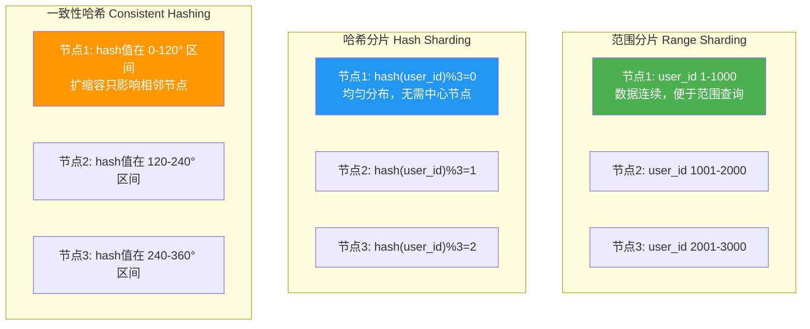

# 分布式数据库练习方法

本章提供五组渐进式练习，覆盖从概念理解到架构设计的完整学习路径。每组练习都基于真实开源系统（TiDB、etcd、Apache Cassandra 等），包含可执行的代码和明确的验收标准。

建议学习顺序：练习一 → 练习二 → 练习三 → 练习四 → 练习五。前三个为必做，后两个根据职业方向选做（DBA/运维偏练习四，架构师偏练习五）。

---

## 练习一：核心概念理解（预计 30 分钟）

### 目标

掌握分布式数据库的核心概念体系：CAP 定理、数据分片、一致性协议、副本策略，能够用自己的话解释它们的原理和权衡关系。

### 步骤

#### 1. CAP 定理推演（10 分钟）

CAP 定理指出：在一个分布式系统中，**一致性（Consistency）、可用性（Availability）、分区容错性（Partition tolerance）** 三者最多只能同时满足两个。这不是一个"三选一"的简单选择，而是网络分区发生时的真实权衡。

动手推演以下场景：

```python
"""
CAP 权衡推演模拟器
模拟网络分区发生时，CP 系统和 AP 系统的不同行为
"""

import time
from enum import Enum

class NodeState(Enum):
    HEALTHY = "healthy"
    PARTITIONED = "partitioned"  # 与主节点断联

class CAPSimulator:
    """模拟分布式数据库在分区时的两种策略"""

    def __init__(self, mode="CP"):
        """
        mode: "CP" (一致性优先) 或 "AP" (可用性优先)
        """
        self.mode = mode
        self.primary_data = {"user:1001": {"name": "Alice", "balance": 5000}}
        self.secondary_data = {"user:1001": {"name": "Alice", "balance": 5000}}

    def simulate_write(self, key, value):
        """模拟写入操作"""
        self.primary_data[key] = value
        # CP 模式：同步复制，确保一致性
        # AP 模式：异步复制，允许暂时不一致
        if self.mode == "CP":
            time.sleep(0.01)  # 模拟同步复制延迟
            self.secondary_data[key] = value
            return True
        else:
            # AP 模式：后台异步同步
            return True  # 立即返回成功

    def simulate_read_from_secondary(self):
        """模拟从从节点读取"""
        return self.secondary_data.copy()

    def simulate_network_partition(self):
        """模拟网络分区：从节点与主节点断联"""
        print(f"\n{'='*50}")
        print(f"【{self.mode} 模式】网络分区发生！")
        print(f"{'='*50}")

        # 分区后写入新数据
        self.primary_data["user:1002"] = {"name": "Bob", "balance": 3000}

        if self.mode == "CP":
            print("  主节点：拒绝新写入（等从节点恢复）")
            print("  结果：一致性保证 ✓，部分操作不可用 ✗")
            print("  适用场景：金融交易、库存扣减")
            return None
        else:
            self.simulate_write("user:1002", {"name": "Bob", "balance": 3000})
            print("  主节点：接受写入，异步同步")
            print("  结果：可用性保证 ✓，暂时数据不一致 ✗")
            print("  适用场景：社交动态、用户评论")
            secondary = self.simulate_read_from_secondary()
            print(f"  从节点数据：{secondary}（可能缺少 user:1002）")
            return secondary

# 运行推演
cp_system = CAPSimulator(mode="CP")
ap_system = CAPSimulator(mode="AP")

cp_system.simulate_network_partition()
ap_system.simulate_network_partition()
```

#### 2. 分片策略对比图（10 分钟）

在纸上或用 Mermaid 画出三种分片策略的数据分布示意图：



核心对比表：

| 维度 | 范围分片 | 哈希分片 | 一致性哈希 |
|------|---------|---------|-----------|
| 数据分布 | 不均匀（热点问题） | 均匀 | 均匀 |
| 范围查询 | 高效（相邻数据在同一分片） | 低效（需跨分片） | 低效（需跨分片） |
| 扩缩容成本 | 高（大量数据迁移） | 高（所有数据重新映射） | 低（仅相邻节点迁移） |
| 典型系统 | HBase, TiDB | Cassandra, DynamoDB | Dynamo, Riak |
| 适用场景 | 时序数据、日志系统 | 通用键值存储 | 频繁扩缩容的场景 |

#### 3. 概念自测（10 分钟）

不看参考资料，回答以下问题并记录自己的理解盲区：

1. 为什么网络分区不可能完全避免？网络分区的物理根源是什么？
2. 一致性哈希中"虚拟节点"解决什么问题？虚拟节点数量通常设为多少？
3. Raft 中 Leader、Follower、Candidate 三种角色在什么条件下互相转换？
4. 两阶段提交（2PC）的阻塞问题具体指什么？三阶段提交（3PC）如何缓解？
5. Quorum 机制中 R + W > N 为什么能保证读到最新数据？

### 检查标准

- [ ] 能画出 CAP 定理的三角权衡图，并解释每个角代表的系统类型
- [ ] 能准确区分三种分片策略的优缺点和适用场景
- [ ] 能用自己的话解释 Raft Leader 选举过程
- [ ] 自测题中至少答对 4 题

---

## 练习二：TiDB 本地集群搭建与基本操作（预计 60 分钟）

### 目标

从零搭建一个本地 TiDB 三节点集群，完成数据分片、故障模拟、事务验证的全流程操作，体验真实分布式数据库的行为。

### 步骤

#### 1. 环境准备与集群搭建（20 分钟）

TiDB 是一款开源的分布式 NewSQL 数据库，兼容 MySQL 协议，原生支持水平扩展和分布式事务。使用 TiUP 可以在本地快速搭建测试集群。

```bash
# === 安装 TiUP（TiDB 的包管理工具） ===
curl --proto '=https' --tlsv1.2 -sSf https://tiup-mirrors.pingcap.com/install.sh | sh

# 重新加载 shell 环境
source ~/.bashrc

# === 安装 TiUP 组件 ===
tiup update --self
tiup install tidb
tiup install tikv
tiup install pd

# === 使用 playground 搭建本地集群 ===
# 启动一个包含 1 PD + 2 TiKV + 1 TiDB 的本地集群
# --host 指定绑定地址，--without-monitor 关闭 Prometheus（节省内存）
tiup playground v7.5.0 \
  --db 1 \
  --kv 3 \
  --pd 3 \
  --host 127.0.0.1 \
  --without-monitor

# 集群启动后，另一个终端连接 TiDB
# TiDB 默认监听 4000 端口，兼容 MySQL 协议
mysql -h 127.0.0.1 -P 4000 -u root

# 如果没有 mysql 客户端，可以用 tiup 安装
tiup install mysql-client
```

#### 2. 分片实践（20 分钟）

在 TiDB 中创建表并观察数据分片行为：

```sql
-- === 创建测试表 ===
-- TiDB 默认使用 Region 分片（基于 Key Range 的自动分片）
CREATE DATABASE practice;
USE practice;

-- 创建订单表
CREATE TABLE orders (
    id BIGINT AUTO_RANDOM PRIMARY KEY,  -- AUTO_RANDOM 替代 AUTO_INCREMENT，避免写热点
    user_id INT NOT NULL,
    product_name VARCHAR(100),
    amount DECIMAL(10, 2),
    created_at TIMESTAMP DEFAULT CURRENT_TIMESTAMP,
    INDEX idx_user_id (user_id)
) SHARD_ROW_ID_BITS = 4 PRE_SPLIT_REGIONS = 4;

-- SHARD_ROW_ID_BITS=4: 将 RowID 打散到 2^4=16 个 shard
-- PRE_SPLIT_REGIONS=4: 建表时预分 2^4=16 个 Region

-- === 插入大量测试数据 ===
-- 插入 10000 条数据，观察分片效果
INSERT INTO orders (user_id, product_name, amount)
SELECT 
    FLOOR(RAND() * 1000) + 1,
    CONCAT('Product_', FLOOR(RAND() * 500)),
    ROUND(RAND() * 1000, 2)
FROM (
    SELECT @rownum := @rownum + 1 AS n
    FROM information_schema.columns a,
         information_schema.columns b,
         (SELECT @rownum := 0) r
    LIMIT 10000
) t;

-- === 观察 Region 分布 ===
-- 查看表的 Region 信息
SHOW TABLE orders REGIONS;

-- 查看表的 Key 分布
SHOW TABLE orders KEYS;

-- === 手动分裂 Region ===
-- 当默认分片不够时，可以手动分裂
SPLIT TABLE orders BETWEEN (0) AND (1000000) REGIONS 8;
```

#### 3. 故障模拟与恢复验证（20 分钟）

```sql
-- === 故障模拟：节点宕机 ===
-- 在 TiKV 进程上模拟宕机
# 找到 TiKV 进程 PID
ps aux | grep tikv-server

# 优雅停止一个 TiKV 节点（模拟节点故障）
tiup clean --all  # 或 kill -15 <tikv_pid>

-- === 验证数据仍然可读 ===
-- TiDB 有 3 副本，1 个节点宕机后数据仍然可用
SELECT COUNT(*) FROM orders;
SELECT * FROM orders WHERE user_id = 42 LIMIT 5;

-- === 验证写入行为 ===
-- 单节点故障时，写入仍然成功（3 副本容忍 1 个故障）
INSERT INTO orders (user_id, product_name, amount) 
VALUES (999, 'Emergency Order', 100.00);

-- === 恢复节点后观察 ===
# 重启 TiKV 节点
tiup playground v7.5.0 --db 1 --kv 3 --pd 3 --host 127.0.0.1 --without-monitor

-- 检查副本是否自动恢复
SHOW TABLE orders REGIONS;
```

### 检查标准

- [ ] TiUP Playground 集群正常启动并连接
- [ ] 成功创建带分片参数的表并插入数据
- [ ] 能通过 `SHOW REGIONS` 查看 Region 分布
- [ ] 模拟节点故障后数据仍可读写
- [ ] 恢复节点后副本自动补齐

---

## 练习三：etcd 集群部署与 Raft 共识实验（预计 45 分钟）

### 目标

部署一个 3 节点 etcd 集群，通过实验理解 Raft 共识协议的实际行为，包括 Leader 选举、日志复制、网络分区恢复。

### 步骤

#### 1. 搭建三节点 etcd 集群（15 分钟）

etcd 是 Kubernetes 的核心组件，也是 Raft 协议最经典的生产级实现。

```bash
# === 安装 etcd ===
ETCD_VER=v3.5.12
DOWNLOAD_URL=https://github.com/etcd-io/etcd/releases/download
curl -L ${DOWNLOAD_URL}/${ETCD_VER}/etcd-${ETCD_VER}-linux-amd64.tar.gz -o /tmp/etcd.tar.gz
tar xzf /tmp/etcd.tar.gz -C /tmp/
export PATH=$PATH:/tmp/etcd-${ETCD_VER}-linux-amd64

# === 创建集群配置 ===
# 创建三个数据目录
for i in 1 2 3; do
    mkdir -p /tmp/etcd-node${i}
done

# 启动节点 1（初始 Leader）
etcd --name node1 \
    --data-dir /tmp/etcd-node1 \
    --listen-client-urls http://127.0.0.1:2379 \
    --advertise-client-urls http://127.0.0.1:2379 \
    --listen-peer-urls http://127.0.0.1:2380 \
    --initial-advertise-peer-urls http://127.0.0.1:2380 \
    --initial-cluster "node1=http://127.0.0.1:2380,node2=http://127.0.0.2:2380,node3=http://127.0.0.3:2380" \
    --initial-cluster-state new \
    --initial-cluster-token my-etcd-cluster

# 启动节点 2（在另一个终端）
etcd --name node2 \
    --data-dir /tmp/etcd-node2 \
    --listen-client-urls http://127.0.0.2:2379 \
    --advertise-client-urls http://127.0.0.2:2379 \
    --listen-peer-urls http://127.0.0.2:2380 \
    --initial-advertise-peer-urls http://127.0.0.2:2380 \
    --initial-cluster "node1=http://127.0.0.1:2380,node2=http://127.0.0.2:2380,node3=http://127.0.0.3:2380" \
    --initial-cluster-state new \
    --initial-cluster-token my-etcd-cluster

# 启动节点 3（在第三个终端）
etcd --name node3 \
    --data-dir /tmp/etcd-node3 \
    --listen-client-urls http://127.0.0.3:2379 \
    --advertise-client-urls http://127.0.0.3:2379 \
    --listen-peer-urls http://127.0.0.3:2380 \
    --initial-advertise-peer-urls http://127.0.0.3:2380 \
    --initial-cluster "node1=http://127.0.0.1:2380,node2=http://127.0.0.2:2380,node3=http://127.0.0.3:2380" \
    --initial-cluster-state new \
    --initial-cluster-token my-etcd-cluster

# 验证集群状态
etcdctl endpoint health --cluster
etcdctl member list -w table
```

#### 2. Raft 共识行为观察（15 分钟）

```bash
# === 观察 Leader 选举 ===
# 查看当前 Leader
etcdctl endpoint status --cluster -w table
# 输出中 "Leader" 列显示当前 Leader 节点 ID

# === 验证日志复制 ===
# 写入数据（所有写入必须经过 Leader）
etcdctl put /config/database_host "192.168.1.100"
etcdctl put /config/database_port "5432"
etcdctl put /config/max_connections "100"

# 从任意节点读取（验证数据已复制）
etcdctl get /config/ --prefix --endpoints=http://127.0.0.1:2379
etcdctl get /config/ --prefix --endpoints=http://127.0.0.2:2379
etcdctl get /config/ --prefix --endpoints=http://127.0.0.3:2379

# === 模拟网络分区 ===
# 用 iptables 阻断 node3 与 node1/node2 的通信
sudo iptables -A INPUT -s 127.0.0.3 -p tcp --dport 2380 -j DROP
sudo iptables -A OUTPUT -d 127.0.0.3 -p tcp --sport 2380 -j DROP

# 等待 5-10 秒后，观察 Leader 是否重新选举
# node3 因为无法联系多数派，会退化为 follower
# node1 和 node2 会重新选举 Leader（如果原 Leader 是 node3）

etcdctl endpoint status --cluster -w table

# === 恢复网络 ===
sudo iptables -D INPUT -s 127.0.0.3 -p tcp --dport 2380 -j DROP
sudo iptables -D OUTPUT -d 127.0.0.3 -p tcp --sport 2380 -j DROP

# 验证 node3 恢复后自动同步日志
etcdctl get /config/ --prefix --endpoints=http://127.0.0.3:2379
```

#### 3. 故障注入与恢复（15 分钟）

```bash
# === 模拟节点永久丢失 ===
# 删除 node3 的数据目录，模拟磁盘损坏
# 先停止 node3 进程
kill $(pgrep -f "etcd.*node3")

# 删除数据
rm -rf /tmp/etcd-node3

# 从集群中移除 node3
etcdctl member remove <node3-member-id>

# 验证集群仍正常工作（2/3 多数派存活）
etcdctl put /test/key "survived"
etcdctl get /test/key

# === 添加新节点替代 ===
# 启动一个新节点
etcd --name node3-new \
    --data-dir /tmp/etcd-node3-new \
    --listen-client-urls http://127.0.0.3:2379 \
    --advertise-client-urls http://127.0.0.3:2379 \
    --listen-peer-urls http://127.0.0.3:2380 \
    --initial-advertise-peer-urls http://127.0.0.3:2380 \
    --initial-cluster "node1=http://127.0.0.1:2380,node2=http://127.0.0.2:2380,node3-new=http://127.0.0.3:2380" \
    --initial-cluster-state existing \
    --initial-cluster-token my-etcd-cluster

# 添加新成员到集群
etcdctl member add node3-new --peer-urls=http://127.0.0.3:2380

# 验证集群恢复到 3 节点
etcdctl member list -w table
etcdctl endpoint health --cluster
```

### 检查标准

- [ ] 三节点集群正常启动，`endpoint health` 全部健康
- [ ] 能准确识别当前 Leader 节点
- [ ] 写入的数据能从任意节点读取（日志复制成功）
- [ ] 网络分区后自动完成 Leader 重新选举
- [ ] 移除故障节点后集群继续正常工作

---

## 练习四：分布式数据库性能调优（预计 60 分钟）

### 目标

掌握分布式数据库性能分析的完整方法论：基线建立 → 瓶颈识别 → 优化实施 → 效果验证。使用 sysbench 对 TiDB/MySQL 进行基准测试和调优。

### 步骤

#### 1. 建立性能基线（15 分钟）

```bash
# === 安装 sysbench ===
# sysbench 是最常用的数据库基准测试工具
sudo apt-get install -y sysbench
# 或通过源码编译最新版本
# git clone https://github.com/akopytov/sysbench.git

# === 准备测试数据 ===
# 创建 oltp_read_write 模式的测试表
# --tables=10: 10 张表
# --table-size=100000: 每张表 10 万行
sysbench oltp_read_write \
    --mysql-host=127.0.0.1 \
    --mysql-port=4000 \
    --mysql-user=root \
    --mysql-password="" \
    --mysql-db=sbtest \
    --tables=10 \
    --table-size=100000 \
    prepare

# === 运行基线测试 ===
# 32 并发线程，持续 120 秒
sysbench oltp_read_write \
    --mysql-host=127.0.0.1 \
    --mysql-port=4000 \
    --mysql-user=root \
    --mysql-password="" \
    --mysql-db=sbtest \
    --tables=10 \
    --table-size=100000 \
    --threads=32 \
    --time=120 \
    --report-interval=10 \
    run | tee baseline_result.txt

# === 记录关键指标 ===
# 重点关注：
# - transactions per second (TPS)
# - queries per second (QPS)  
# - P95/P99 延迟（95th/99th percentile latency）
# - 错误率（应为 0%）
```

#### 2. 瓶颈识别与诊断（20 分钟）

```bash
# === 分层诊断法 ===
# 第一层：系统级资源监控

# CPU 使用情况（关注 %si 软中断、%us 用户态）
mpstat -P ALL 1 10

# 磁盘 I/O（关注 await 平均等待时间、%util 利用率）
iostat -x 1 10

# 网络流量（关注重传、错误）
sar -n DEV 1 10

# 内存使用（关注 available 内存、swap 使用）
free -h
vmstat 1 10

# === 第二层：数据库级诊断 ===

# TiDB 慢查询日志分析
# 慢查询阈值默认 300ms，可在 Grafana 中调整
mysql -h 127.0.0.1 -P 4000 -u root -e "
SELECT query, query_time, process_time, wait_time, 
       scan_keys, process_keys
FROM information_schema.slow_query 
WHERE db = 'sbtest' 
ORDER BY query_time DESC 
LIMIT 10\G"

# TiKV 性能分析
# 查看各 Region 的读写热点
mysql -h 127.0.0.1 -P 4000 -u root -e "
SELECT region_id, leader_store_id, 
       approximate_keys, approximate_size
FROM information_schema.tikv_region_status
WHERE db_name = 'sbtest'
ORDER BY approximate_keys DESC
LIMIT 10\G"

# === 第三层：执行计划分析 ===

# 对慢查询使用 EXPLAIN ANALYZE
mysql -h 127.0.0.1 -P 4000 -u root sbtest -e "
EXPLAIN ANALYZE 
SELECT c, COUNT(*) 
FROM sbtest1 
WHERE id BETWEEN 1 AND 10000 
GROUP BY c 
ORDER BY COUNT(*) DESC\G"
```

#### 3. 优化实施与验证（25 分钟）

```sql
-- === 优化一：索引优化 ===
-- 检查全表扫描的查询
SELECT query, avg_latency, exec_count, sum_latency
FROM information_schema.slow_query 
WHERE plan_from_cache = 0 
ORDER BY sum_latency DESC 
LIMIT 5;

-- 为高频查询添加覆盖索引
CREATE INDEX idx_sbtest1_k_c ON sbtest1 (k, c);

-- 验证索引是否被使用
EXPLAIN SELECT c, COUNT(*) FROM sbtest1 WHERE k = '1001' GROUP BY c;

-- === 优化二：分区裁剪 ===
-- 确保查询条件能命中分区键，避免全分区扫描
-- 检查 Region 分布是否均匀
SELECT region_id, leader_store_id, approximate_keys
FROM information_schema.tikv_region_status
WHERE table_name = 'sbtest1'
ORDER BY leader_store_id;

-- === 优化三：批量写入优化 ===
-- 调整事务大小，减少事务冲突
SET tidb_batch_insert = 1;
SET tidb_dml_batch_size = 5000;

-- 使用 LOAD DATA 替代 INSERT 批量导入
-- 文件格式：每行字段用 TAB 分隔
-- LOAD DATA LOCAL INFILE '/path/to/data.csv' 
-- INTO TABLE sbtest1 
-- FIELDS TERMINATED BY '\t';
```

```bash
# === 优化后重新测试 ===
sysbench oltp_read_write \
    --mysql-host=127.0.0.1 \
    --mysql-port=4000 \
    --mysql-user=root \
    --mysql-password="" \
    --mysql-db=sbtest \
    --tables=10 \
    --table-size=100000 \
    --threads=32 \
    --time=120 \
    --report-interval=10 \
    run | tee optimized_result.txt

# === 对比基线和优化后的结果 ===
echo "=== 基线结果 ==="
grep -E "transactions:|queries:|95th percentile:|99th percentile:" baseline_result.txt
echo ""
echo "=== 优化后结果 ==="
grep -E "transactions:|queries:|95th percentile:|99th percentile:" optimized_result.txt

# === 清理测试数据 ===
sysbench oltp_read_write \
    --mysql-host=127.0.0.1 \
    --mysql-port=4000 \
    --mysql-user=root \
    --mysql-db=sbtest \
    cleanup
```

### 优化策略速查表

| 瓶颈类型 | 诊断信号 | 优化手段 | 预期效果 |
|----------|---------|---------|---------|
| CPU 热点 | mpstat %us > 80% | 优化 SQL、添加索引、减少锁竞争 | TPS 提升 30-100% |
| 磁盘 I/O | iostat %util > 90% | 增大 buffer pool、调整 WAL 策略、SSD 升级 | 延迟降低 50-80% |
| 内存不足 | free 可用内存 < 10% | 增大内存、优化缓存淘汰策略 | 避免 OOM、减少磁盘回读 |
| 网络瓶颈 | sar 重传率 > 0.1% | 检查网络设备、增大 TCP 缓冲区 | 跨节点延迟降低 |
| 锁冲突 | 慢查询中 lock_time 高 | 优化事务粒度、使用乐观锁 | 延迟降低 20-50% |
| 热点 Region | Region keys 分布严重不均 | 手动 split、使用 AUTO_RANDOM | 写吞吐线性提升 |

### 检查标准

- [ ] 成功运行 sysbench 基线测试并记录 TPS/P99 指标
- [ ] 能使用 iostat/mpstat 定位系统级瓶颈
- [ ] 能通过慢查询日志识别 SQL 级别问题
- [ ] 实施至少 2 项优化后性能有可量化提升
- [ ] 能编写对比报告，解释每项优化的原理和效果

---

## 练习五：分布式数据库架构设计（预计 90 分钟）

### 目标

根据真实业务场景设计分布式数据库架构方案，输出完整的技术选型、架构设计、部署规划和容灾方案。

### 步骤

#### 1. 需求分析（20 分钟）

选择以下场景之一，完成需求分析：

**场景 A：电商平台**
- 日活用户：500 万
- 峰值订单量：1 万单/秒（双十一大促）
- 订单数据量：年增长 200GB
- 一致性要求：库存扣减强一致，商品浏览最终一致
- 延迟要求：订单创建 P99 < 50ms

**场景 B：IoT 时序平台**
- 设备数：100 万台
- 写入频率：每设备 1 条/秒
- 数据保留：热数据 7 天，温数据 30 天，冷数据 1 年
- 查询模式：按设备 ID + 时间范围查询
- 一致性要求：最终一致即可

**场景 C：社交内容平台**
- 用户数：2000 万
- 日发帖量：500 万条
- 读写比：读多写少（100:1）
- 一致性要求：发帖后 1 秒内可读
- 特殊需求：全文搜索、Feed 流推送

分析模板：

┌─────────────────────────────────────────┐
│ 需求分析报告                              │
├─────────────────────────────────────────┤
│ 业务场景：_______________                 │
│ 日活用户：_______________                 │
│ 峰值 QPS：_______________                 │
│ 数据量级：_______________                 │
│ 一致性等级：□强一致  □最终一致  □因果一致    │
│ 延迟要求：P50=__ms  P99=__ms  P999=__ms   │
│ 可用性要求：___个9                         │
│ 合规要求：□数据本地化  □审计日志  □加密存储  │
│ 预算范围：_______________                 │
└─────────────────────────────────────────┘

#### 2. 技术选型与架构设计（40 分钟）

参考以下决策矩阵进行选型：

| 维度 | TiDB | CockroachDB | Apache Cassandra | TiDB (HTAP) |
|------|------|-------------|-----------------|-------------|
| 数据模型 | 关系型 SQL | 关系型 SQL | 宽列存储 | 关系型 + 列存 |
| 一致性 | 强一致 | 强一致 | 最终一致（可调） | 强一致 |
| 水平扩展 | ✅ 自动 | ✅ 自动 | ✅ 手动+自动 | ✅ 自动 |
| 分布式事务 | ✅ | ✅ | ❌（仅轻量事务） | ✅ |
| 全文搜索 | ❌ | ❌ | ✅（SASI 索引） | ❌（需外接 ES） |
| HTAP 能力 | ✅（TiFlash） | ❌ | ❌ | ✅（核心优势） |
| 运维复杂度 | 中等 | 高 | 中等 | 高 |
| MySQL 兼容 | ✅ | ❌ | ❌ | ✅ |

架构设计文档模板：

```yaml
架构设计文档 v1.0
==================

一、技术选型
-----------
  数据库引擎: [填写选择]
  选择理由:
    1. [理由1]
    2. [理由2]
  弃选方案: [填写未选择的方案]
  弃选原因: [填写原因]

二、数据分片设计
-----------
  分片策略: [范围分片/哈希分片/混合]
  分片键: [选择依据]
  预估分片数: [计算过程]
  热点预防: [具体措施]

三、副本与一致性
-----------
  副本数: [3/5/7]
  一致性级别: [强一致/可调]
  读写分离策略: [具体方案]

四、部署架构
-----------
  节点数量: [计算依据]
  节点规格: [CPU/内存/磁盘]
  网络拓扑: [画图]
  存储方案: [本地 SSD/NVMe/云盘]

五、容灾方案
-----------
  RPO: [恢复点目标]
  RTO: [恢复时间目标]
  备份策略: [全量/增量频率]
  跨机房方案: [同步/异步]
```

#### 3. 方案评审与优化（30 分钟）

完成设计后，用以下检查清单进行自审：

**数据层检查：**
- [ ] 分片键选择合理，不会产生热点
- [ ] 分片数量留有 30% 以上的扩展余量
- [ ] 跨分片查询有明确的优化方案
- [ ] 大事务场景有拆分策略

**可用性检查：**
- [ ] 单节点故障不影响服务
- [ ] 单机房故障有切换方案
- [ ] 有明确的 RPO/RTO 指标
- [ ] 备份恢复流程经过演练

**性能检查：**
- [ ] 读写路径无单点瓶颈
- [ ] 缓存策略覆盖热数据
- [ ] 慢查询有监控告警
- [ ] 大表 DDL 有在线变更方案

**安全检查：**
- [ ] 数据传输加密（TLS）
- [ ] 数据存储加密
- [ ] 访问权限最小化
- [ ] 审计日志完整

### 检查标准

- [ ] 完成至少一个场景的需求分析（500 字以上）
- [ ] 技术选型有明确的对比依据
- [ ] 架构设计文档包含全部 5 个模块
- [ ] 容灾方案有具体的 RPO/RTO 指标
- [ ] 自审检查清单中勾选项 ≥ 80%

---

## 附录：学习资源推荐

| 资源 | 类型 | 适合阶段 | 链接 |
|------|------|---------|------|
| TiDB 官方文档 | 文档 | 入门-进阶 | docs.pingcap.com |
| etcd GitHub 仓库 | 源码 | 进阶 | github.com/etcd-io/etcd |
| 《Distributed Systems》(Maarten van Steen) | 教材 | 理论 | 免费在线版 |
| CMU 15-445 数据库课程 | 视频 | 入门-进阶 | 15445.courses.cs.cmu.edu |
| TiDB 源码阅读指南 | 文档 | 进阶-精通 | tidb.net/blog |
| sysbench 官方文档 | 文档 | 进阶 | github.com/akopytov/sysbench |
