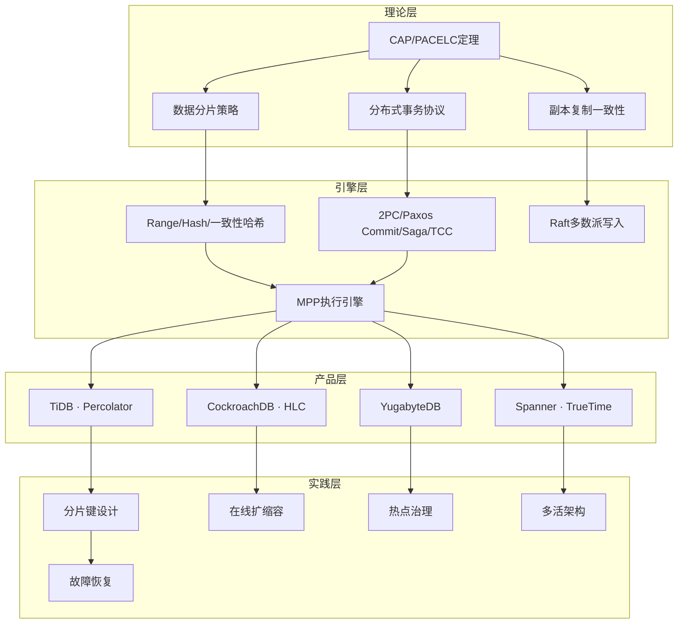
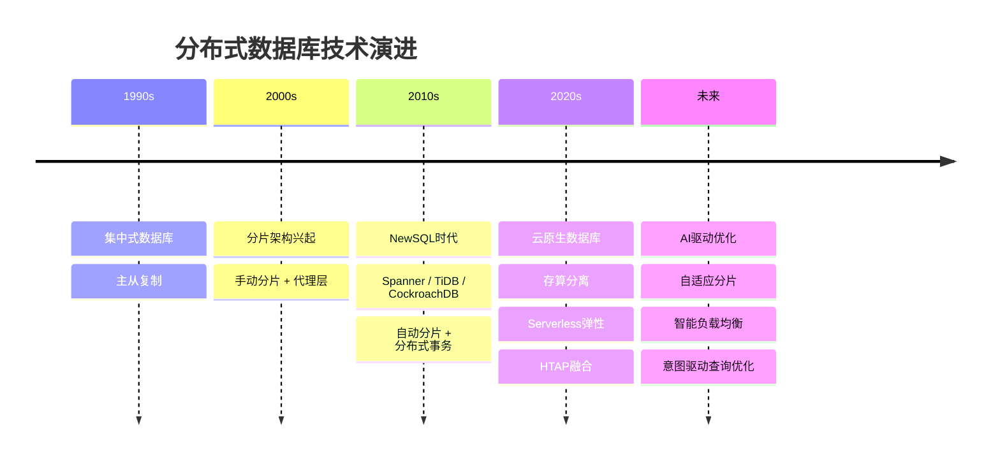

# 第17章 分布式数据库 · 本章小结

本章系统性地介绍了分布式数据库从理论基础到工程实践的完整知识体系。以下从知识脉络、核心模型、工程要点三个维度进行总结，并给出后续学习路径。

---

## 一、本章知识脉络总览

分布式数据库的核心矛盾是**一致性与可用性之间的取舍**。CAP定理告诉我们三者最多取二，而PACELC定理进一步揭示：即使在正常运行时（无分区），系统仍然需要在延迟（Latency）和一致性（Consistency）之间做出权衡。这个权衡贯穿了本章所有技术选型。

---

## 二、核心技术要点回顾

### 2.1 数据分片：决定性能上限的架构决策

分片策略决定了数据在集群中的分布方式，直接影响查询性能、扩容难度和运维复杂度。

| 策略 | 路由原理 | 优势 | 劣势 | 典型系统 |
|------|----------|------|------|----------|
| **Range分片** | 按键值范围划分，范围查询高效 | 范围查询只需访问相关分片；分裂操作简单 | 顺序写入产生热点；分片可能不均匀 | TiDB（Region 96MB）、CockroachDB（Range 512MB） |
| **Hash分片** | `hash(key) % 分片数` | 数据均匀分布；实现简单 | 范围查询需全分片扫描；扩容迁移量大 | MySQL Sharding、Vitess |
| **一致性哈希** | 哈希环 + 虚拟节点 | 扩容仅迁移 `1/N` 数据；单调性保证 | 实现复杂；需要虚拟节点平衡负载 | Dynamo、Cassandra、Redis Cluster |

**分片键选择的三条黄金法则**：
1. **高基数原则**：分片键的基数（Cardinality）必须远大于分片数，否则大量键映射到同一分片
2. **均匀分布原则**：选择业务上分布均匀的字段作为分片键，避免热点（如用 `user_id` 而非 `create_time`）
3. **查询亲和原则**：高频查询应能命中单一分片，避免跨分片扫描（如订单表以 `user_id` 分片，用户维度查询天然亲和）

### 2.2 分布式事务：一致性与性能的博弈

分布式事务是分布式数据库最核心的难题。事务涉及多个节点时，必须保证原子性——要么全部提交，要么全部回滚。

**主流协议对比**：

| 协议 | 通信轮次 | 阻塞性 | 容错能力 | 适用场景 |
|------|----------|--------|----------|----------|
| **2PC** | 2轮 | 阻塞（协调者故障时） | 协调者单点 | 跨分片短事务 |
| **3PC** | 3轮 | 非阻塞（超时可自行决定） | 网络分区下可能不一致 | 理论意义大于实践 |
| **Paxos Commit** | 2-3轮 | 非阻塞 | 多数派容错 | Spanner等强一致系统 |
| **Saga** | N轮（每步1轮） | 非阻塞 | 补偿回滚 | 长事务、微服务编排 |
| **TCC** | 2轮 | 非阻塞 | 业务层补偿 | 高一致要求的金融场景 |

**2PC的致命缺陷**——阻塞性：协调者在发出COMMIT/ABORT后崩溃，参与者将永远处于不确定状态，无法自行决定提交或回滚。这是Paxos Commit和Raft共识要解决的问题。

**CockroachDB的并行提交优化**：将分布式事务延迟从2个RTT降低到接近1个RTT——所有参与者发出VOTE_COMMIT后立即将事务标记为"staging"，应用可以继续执行，后台异步完成确认。

### 2.3 副本复制与一致性

数据分片解决容量问题，副本复制解决可靠性问题。但副本之间的一致性程度直接影响系统延迟。

**三种复制模式**：

| 模式 | 写入路径 | 读取一致性 | 延迟 | 可用性 |
|------|----------|------------|------|--------|
| **同步复制** | 等待所有副本确认 | 强一致 | 高（RTT × 副本数） | 低（任一副本故障阻塞写入） |
| **异步复制** | 主副本确认即返回 | 最终一致 | 低 | 高 |
| **半同步复制** | 等待至少1个从副本确认 | 主从一致 | 中等 | 中等 |

**Raft多数派写入的生产调优要点**：
- Leader读：避免每次读都走Raft共识，但可能读到过期数据
- Lease Read：Leader持有租约期间可直接读，兼顾一致性和性能
- 线性读（Follower Read with ReadIndex）：Leader确认自己仍是Leader后，让Follower处理读请求

### 2.4 MPP执行引擎与分布式查询

分布式查询的核心挑战是**跨分片Join**——当两个大表需要连接但分片键不同时，必须移动数据。

**四种Join策略的适用场景**：

| 策略 | 数据传输方式 | 适用条件 | 网络开销 |
|------|-------------|----------|----------|
| **Broadcast Join** | 小表广播到所有节点 | 一表远小于另一表 | `小表大小 × 节点数` |
| **Shuffle Join** | 两表按Join键重新分区 | 两表都大且无共同分片键 | `两表总量 × 2` |
| **Co-located Join** | 无数据移动 | 两表按Join键共分片 | 接近零 |
| **Nested Loop Join** | 外表每行驱动内表扫描 | 有选择性过滤条件 | 取决于选择率 |

**MPP引擎的并行执行模型**：
分布式查询 → 查询优化器 → 物理执行计划
                              ↓
                    生成分布式执行计划
                    (每个Stage分配到对应节点)
                              ↓
                    Pipeline执行 (Exchange算子传输数据)
                              ↓
                    结果聚合 → 返回客户端

### 2.5 NewSQL三大系统的架构取舍

| 维度 | TiDB | CockroachDB | YugabyteDB |
|------|------|-------------|------------|
| **底层存储** | RocksDB（TiKV） | Pebble（CockroachKV） | DocDB（Raft+LSM） |
| **事务模型** | Percolator（乐观/悲观） | SSI（Serializable Snapshot Isolation） | 基于Raft的分布式事务 |
| **时间机制** | TSO（集中式时间戳） | HLC（混合逻辑时钟） | Hybrid Logical Clock |
| **分片策略** | Range（Region 96MB） | Range（Range 512MB） | Range + Hash |
| **Raft优化** | Learner角色、Pipeline | Parallel Commits | Followers Reads |
| **强一致读** | Leader Read / Follower Read | Follower Read (严格一致) | Follower Read |
| **生态兼容** | MySQL协议兼容 | PostgreSQL协议兼容 | PostgreSQL协议兼容 |
| **典型场景** | HTAP混合负载 | 全球分布强一致 | PostgreSQL迁移场景 |

### 2.6 全局唯一ID生成

分布式环境下的ID生成必须保证全局唯一、趋势递增（对索引友好），且不依赖单点。

**Snowflake算法及其变体**：

Snowflake ID结构 (64 bit):
┌──────────────────────────────────────────────────────────────────┐
│ 1 bit 符号位 │ 41 bit 时间戳 │ 10 bit 机器ID │ 12 bit 序列号  │
│   (0)        │  (毫秒级)     │ (1024台机器)  │  (4096/ms)    │
└──────────────────────────────────────────────────────────────────┘

时间戳：相对起始时间的毫秒偏移，可用约69年
机器ID：支持1024个节点
序列号：每毫秒4096个ID = 约410万/秒/节点

**工程变体**：
- **UUID v7**（RFC 9562）：时间排序的UUID，128位，无需协调但存储开销大
- **百度UidGenerator**：预分配一批ID到WorkerID，解决时钟回拨问题
- **美团Leaf**：Segment模式（号段预分配） + Snowflake模式双切换

---

## 三、关键公式与性能模型

| 概念 | 公式 | 含义 |
|------|------|------|
| **Little定律** | `Throughput = Concurrency / Latency` | 吞吐量 = 并发数 / 平均延迟 |
| **可用性** | `SLA = Uptime / Total_Time` | 99.9% = 年停机8.76h；99.99% = 年停机52.6min |
| **分片扩容迁移量** | `Migration = Data × (1 / (N+1))` | N个分片加1，约1/(N+1)数据需迁移 |
| **2PC延迟** | `Latency = 2 × RTT + 2 × WAL_Time` | 两轮通信 + 两轮日志写入 |
| **P99尾延迟** | `P99 = sorted(latencies)[0.99 × N]` | 第99百分位值，反映长尾效应 |
| **Raft写入延迟** | `Latency = RTT_to_Leader + RTT_to_Majority + WAL` | Leader到多数派确认 + 日志持久化 |
| **Snowflake ID吞吐** | `Max_IDs = 4096 × Nodes × 1000` | 每毫秒每节点4096个序列号 |

---

## 四、工程实践检查清单

### 设计阶段

- [ ] **分片键选型**：确认分片键满足高基数、均匀分布、查询亲和三大原则
- [ ] **事务模式选择**：评估业务是需要强一致（2PC/Paxos）还是最终一致（Saga/本地消息表）
- [ ] **副本策略**：确定副本数（通常3副本）和一致性级别（同步/异步/半同步）
- [ ] **CAP取舍**：明确业务是CP优先（金融交易）还是AP优先（社交Feed）
- [ ] **ID生成方案**：根据性能需求选择Snowflake/UUID/号段模式

### 实现阶段

- [ ] **分片监控**：部署Region/Range的大小和热度监控（TiDB: `pd-ctl region-top`）
- [ ] **事务超时**：为分布式事务设置合理超时时间，避免长时间阻塞
- [ ] **慢查询审计**：开启分布式慢查询日志，关注跨分片Join的执行计划
- [ ] **连接池管理**：每个分片节点的连接池独立配置，避免连接风暴

### 部署阶段

- [ ] **多副本分布**：确保副本分布在不同机架/可用区（Anti-Affinity策略）
- [ ] **压力测试**：模拟分片热点、节点故障、网络分区等异常场景
- [ ] **回滚方案**：制定数据迁移和分片重分布的回滚预案

### 运维阶段

- [ ] **扩缩容演练**：定期执行在线扩缩容，验证数据迁移的正确性和性能影响
- [ ] **副本健康度**：监控副本同步延迟，超过阈值立即告警
- [ ] **PITR备份**：配置时间点恢复（Point-in-Time Recovery），确保数据可恢复
- [ ] **脑裂防护**：配置Fencing机制，防止网络分区后出现双写

---

## 五、常见误区与纠正

| 误区 | 问题分析 | 正确做法 |
|------|----------|----------|
| "分片数越多越好" | 过多分片导致元数据膨胀、跨分片事务概率增加、运维复杂度上升 | 按实际数据量和QPS需求设定，初期2-4个分片足够，后续按需Split |
| "分布式事务开销可忽略" | 每次跨分片操作都触发2PC，延迟和吞吐显著下降 | 尽量设计单分片事务；必须跨分片时使用Saga或TCC降低开销 |
| "最终一致就够了" | 支付、库存等场景最终一致会导致资损 | 对强一致场景使用同步复制或Raft多数派读；对非核心场景可用最终一致 |
| "加机器就能解决性能问题" | 分片热点、锁竞争、慢查询不会因加机器而消失 | 先定位瓶颈（热点分片？慢查询？锁等待？），再针对性优化 |
| "Raft保证了一致性就万事大吉" | Raft只保证日志一致，不保证读写线性一致 | 配置Lease Read或ReadIndex实现线性一致读 |
| "Snowflake ID不会重复" | 时钟回拨可能生成重复ID | 使用百度UidGenerator或美团Leaf的时钟回拨检测机制 |

---

## 六、技术演进趋势

**三个值得关注的方向**：

1. **存算分离**：计算节点无状态、存储节点有状态的架构（如TiDB的TiFlash、Snowflake的虚拟仓库），实现计算和存储的独立扩缩容
2. **HTAP融合**：在同一套系统中同时支持OLTP和OLAP负载（如TiDB的TiFlash列存引擎），避免数据在TP和AP系统间搬运
3. **AI辅助运维**：自动化的分片键推荐、智能的负载均衡、预测性的容量规划，减少人工干预

---

## 七、思考题

### 基础题

1. **Range分片与Hash分片的核心区别是什么？** 各自最适合什么类型的查询模式？

2. **2PC的阻塞性问题是什么？** 协调者崩溃后参与者为什么不能自行决定提交或回滚？

3. **一致性哈希中虚拟节点的作用是什么？** 如果不使用虚拟节点会出现什么问题？

4. **Raft协议中Leader Read和Lease Read的区别是什么？** 各自的适用场景和权衡是什么？

5. **CAP定理在分布式数据库中有怎样的具体体现？** 举出一个CP系统和一个AP系统的例子。

### 进阶题

6. **设计题**：假设你负责设计一个日订单量5亿的电商订单系统，分片键应该选什么？事务模式应该用2PC还是Saga？请给出详细的技术选型方案和理由。

7. **分析题**：TiDB使用集中式TSO（Placement Driver）分配时间戳，CockroachDB使用去中心化的HLC。两种方案各有什么优劣？在什么场景下应该选哪种？

8. **故障题**：一个3副本的Raft Group中，Leader节点所在机房突然断电。请描述故障恢复的完整过程，包括新Leader选举、日志补齐、对外服务恢复的时序。

9. **架构题**：解释"Co-located Join"为什么是性能最好的Join策略。在实际系统中如何保证两个表按Join键Co-located？

10. **对比题**：Saga模式和TCC模式在分布式事务中分别如何实现补偿回滚？各自的业务侵入性、一致性和性能有何差异？

---

## 八、推荐学习路径

当前阶段                     推荐路径                     目标
─────────────────────────────────────────────────────────────────
已掌握本章基础  ──────→  阅读《Designing Data-Intensive Applications》
                        Kleppmann第5-8章深入理解分布式系统理论
                            ↓
具备理论基础    ──────→  实践：用Docker搭建3节点TiDB集群
                        完成分片、扩容、故障切换的全流程操作
                            ↓
有动手经验      ──────→  阅读TiDB/CockroachDB源码
                        重点：Percolator事务实现、Raft层优化
                            ↓
源码级理解      ──────→  研读Google Spanner论文（OSDI 2012）
                        理解TrueTime、Paxos Group、Schema管理
                            ↓
深度专家        ──────→  设计并实现一个简化版分布式数据库
                        要求：支持Range分片 + Raft副本 + 2PC事务

**核心参考文献**：
- Kleppmann, M. *Designing Data-Intensive Applications*. O'Reilly, 2017.
- Corbett, J.C. et al. "Spanner: Google's Globally-Distributed Database." ACM TOCS, 2013.
- Ongaro, D. & Ousterhout, J. "In Search of an Understandable Consensus Algorithm." USENIX ATC, 2014.
- Huang, J. et al. "TiDB: A Raft-based HTAP Database." VLDB, 2020.
- Bacon, D.F. et al. "Spanner: Becoming a SQL System." SIGMOD, 2017.

---

分布式数据库不是银弹。它的价值在于让系统突破单机的容量和性能天花板，但代价是大幅增加系统的复杂度。掌握本章内容的核心不在于记住所有技术细节，而在于理解每项技术背后的**权衡（Trade-off）**——没有任何方案是完美的，只有最适合当前业务场景的选择。随着业务的增长和技术的演进，今天的选择可能需要明天推翻重来，但理解权衡的本质能帮助你在变化中做出更优的决策。
