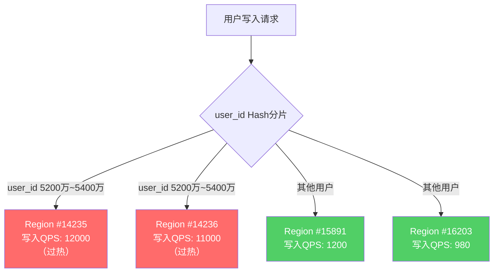
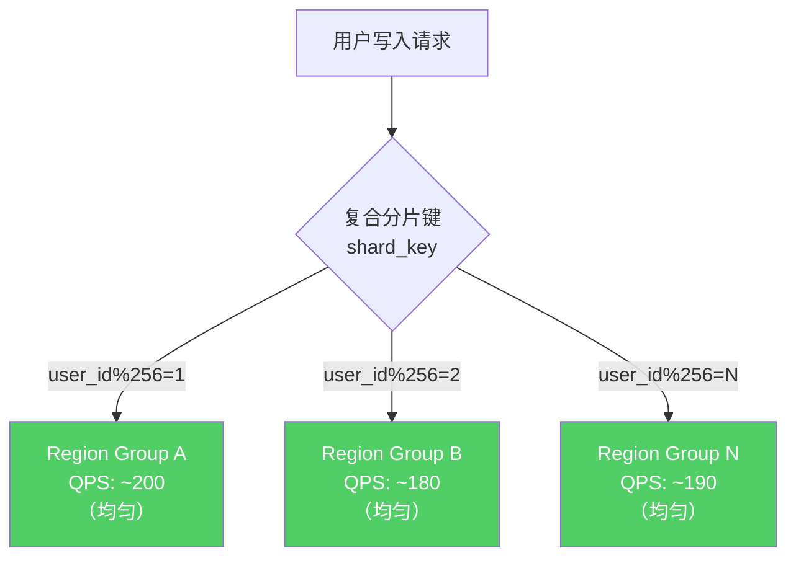
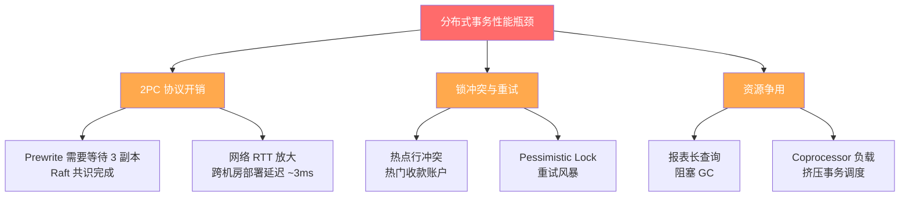
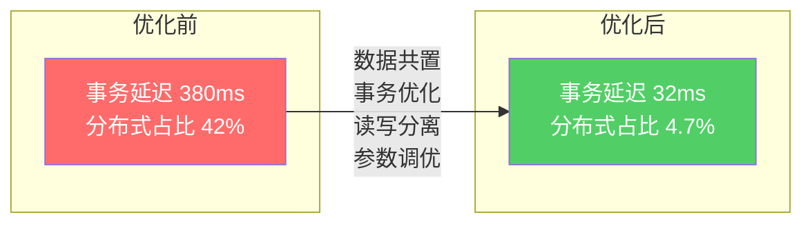
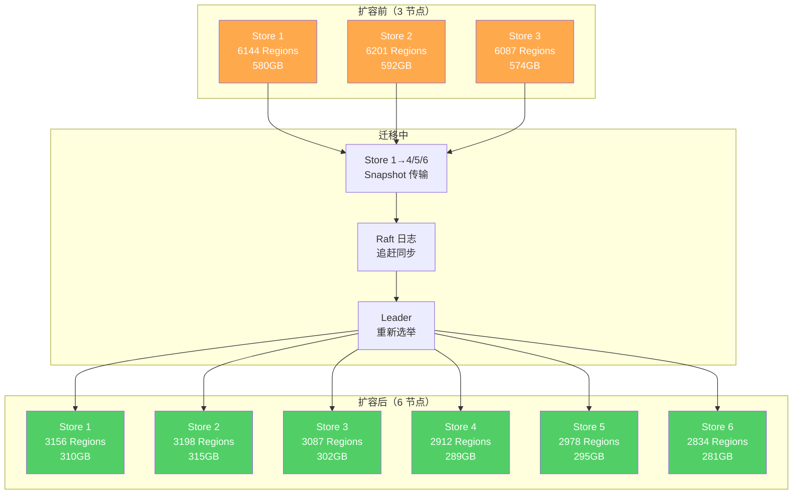
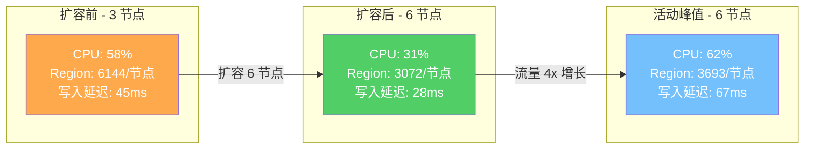

# 第十七章 分布式数据库

## 章节概览

分布式数据库是应对数据规模爆炸性增长的核心技术。当单机数据库无法满足存储容量或处理能力的需求时，分布式数据库通过将数据分散到多个节点上，实现了水平扩展能力。然而，分布式带来了全新的挑战：数据如何分片、跨节点事务如何保证一致性、分布式查询如何高效执行、系统如何在线扩缩容。

本章将系统介绍分布式数据库的核心技术。首先深入探讨数据分片策略——Range分片、Hash分片和一致性哈希的原理、优劣与适用场景。然后详细分析分布式事务的实现机制，包括经典的两阶段提交（2PC）、三阶段提交（3PC）和基于Paxos的共识提交。接着介绍分布式查询的执行框架——MPP引擎和分布式Join策略（Broadcast Join、Shuffle Join、Co-located Join）。

本章还将深入剖析TiDB、CockroachDB、YugabyteDB和OceanBase等NewSQL数据库的架构差异与设计取舍，探讨Google Spanner的TrueTime机制和CockroachDB的混合逻辑时钟（HLC）。此外，本章涵盖分布式索引设计的权衡、数据迁移与在线扩缩容的实现、多活架构的冲突解决策略，以及CAP定理在实际系统中的具体体现。

通过本章学习，读者将能够：理解分布式数据库的核心设计决策；根据业务需求选择合适的分布式数据库系统；设计合理的分片策略和索引方案；理解分布式事务的性能影响和优化手段；掌握在线扩缩容和故障处理的工程实践。

```mermaid
graph TD
    A["第十七章 分布式数据库"] --> B["理论基础"]
    A --> C["核心技巧"]
    A --> D["实战案例"]
    A --> E["常见误区与练习"]
    
    B --> B1["17.1 数据分片策略<br/>Range / Hash / 一致性哈希"]
    B --> B2["17.2 分布式事务<br/>2PC / 3PC / Paxos Commit"]
    B --> B3["17.3 MPP执行引擎<br/>Broadcast / Shuffle / Co-located Join"]
    B --> B4["17.4 NewSQL实现<br/>Spanner TrueTime / CockroachDB HLC / TiDB Percolator"]
    B --> B5["17.5 NewSQL架构对比"]
    B --> B6["17.6 分布式索引<br/>Local Index / Global Index"]
    B --> B7["17.7 数据迁移与在线扩缩容"]
    B --> B8["17.8 多活架构与冲突解决"]
    B --> B9["17.9 CAP / PACELC定理"]
    
    C --> C1["分片策略设计<br/>分片键选择 / 扩容迁移"]
    C --> C2["事务协议选型<br/>2PC / Saga / TCC / 本地消息表"]
    C --> C3["副本复制与一致性<br/>同步 / 异步 / 半同步 / Raft"]
    C --> C4["全局唯一ID<br/>Snowflake / UUID v7 / Leaf"]
    C --> C5["查询路由与跨片Join"]
    C --> C6["Schema设计 / 热点治理 / 故障恢复"]
    
    D --> D1["案例一：分片键热点治理<br/>复合分片键 + 双写迁移"]
    D --> D2["案例二：分布式事务优化<br/>数据共置 + Stale Read + Async Commit"]
    D --> D3["案例三：在线扩缩容<br/>3→6节点渐进式迁移"]
    
    style A fill:#2c3e50,color:#fff
    style B fill:#3498db,color:#fff
    style C fill:#e74c3c,color:#fff
    style D fill:#2ecc71,color:#fff
    style E fill:#f39c12,color:#fff
```




***

**关键词：** 数据分片、一致性哈希、2PC、MPP、NewSQL、TiDB、CockroachDB、Spanner、TrueTime、Raft、CAP定理

**前置知识：** 第十三章关系型数据库架构、第十五章事务与并发控制、分布式系统基础概念

**参考文献：**
- Corbett, J.C. et al. "Spanner: Google's Globally-Distributed Database." ACM TOCS, 2013.
- Ongaro, D. & Ousterhout, J. "In Search of an Understandable Consensus Algorithm." USENIX ATC, 2014.
- Kleppmann, M. "Designing Data-Intensive Applications." O'Reilly, 2017.


***

## 分布式数据库：理论基础

### 17.1 数据分片策略

数据分片（Data Sharding / Partitioning）是分布式数据库的基础。通过将数据分散到多个节点上，分片实现了水平扩展——系统可以通过增加节点来线性提升存储容量和处理能力。

#### 17.1.1 Range分片（范围分片）

Range分片将数据按键值范围划分到不同的分片。例如，按用户ID范围分片：

分片1: user_id ∈ [1, 1000000)      → 节点A
分片2: user_id ∈ [1000000, 2000000) → 节点B
分片3: user_id ∈ [2000000, 3000000) → 节点C
分片4: user_id ∈ [3000000, +∞)      → 节点D

Range分片的核心数据结构是分片映射表（Shard Map / Routing Table），记录每个范围到物理节点的映射关系：

```python
class RangePartitionManager:
    def __init__(self):
#        # 有序列表：(上界, 节点) 对
        self.ranges = []  # sorted by upper_bound

    def add_range(self, upper_bound, node):
        """添加一个范围分片"""
        self.ranges.append((upper_bound, node))
        self.ranges.sort(key=lambda x: x[0])

    def route(self, key):
        """根据键值找到目标节点"""
        for upper_bound, node in self.ranges:
            if key < upper_bound:
                return node
        return self.ranges[-1][1]  # 最后一个范围处理所有大于上界的值

    def route_range(self, start, end):
        """范围查询：找到涉及的所有节点"""
        result = []
        for upper_bound, node in self.ranges:
            if start < upper_bound:
                result.append(node)
            if end < upper_bound:
                break
        return result
```

**Range分片的优势**：

1. **范围查询高效**：范围查询只需要访问相关的分片，不需要广播到所有节点
2. **顺序扫描友好**：数据的物理顺序与逻辑顺序一致
3. **分裂操作简单**：当某个分片过大时，可以在中间值处一分为二

**Range分片的劣势**：

1. **热点问题**：如果写入模式是顺序递增的（如自增主键、时间戳），所有写入都会集中在最后一个分片上，形成写热点
2. **分片不均匀**：数据分布不均匀时，某些分片可能远大于其他分片

**实际系统中的Range分片**：

TiDB使用Range分片作为默认分片策略，数据按Region组织，每个Region是一个连续的键值范围，默认大小为96MB。当Region超过阈值时自动分裂：

```sql
-- TiDB中查看Region信息
SHOW TABLE employees REGIONS;
```

CockroachDB同样使用Range分片，默认Range大小为512MB。

#### 17.1.2 Hash分片（哈希分片）

Hash分片将数据的分片键经过哈希函数映射后，再对分片数取模，确定数据存储的目标分片：

分片编号 = hash(分片键) mod 分片数

```python
class HashPartitionManager:
    def __init__(self, num_shards):
        self.num_shards = num_shards

    def route(self, key):
        """根据哈希值路由到分片"""
        hash_val = self._hash(key)
        shard_id = hash_val % self.num_shards
        return shard_id

    def _hash(self, key):
        """哈希函数（示例：MurmurHash或CRC32）"""
#        # 实际系统使用高质量哈希函数确保均匀分布
        return murmurhash3(str(key))
```

**Hash分片的优势**：

1. **数据均匀分布**：好的哈希函数可以保证数据均匀分散到各分片，避免热点
2. **实现简单**：路由逻辑简单，计算开销低

**Hash分片的劣势**：

1. **范围查询不友好**：范围查询必须广播到所有分片
2. **扩容困难**：增加或减少分片数时，大量数据需要重新映射（约 `N/(N+1)` 的数据需要迁移）

**虚拟分片（Virtual Sharding）**：

为了解决Hash分片扩容时的数据迁移问题，很多系统使用虚拟分片技术。实际物理分片数远小于虚拟分片数：

```python
class VirtualShardManager:
    def __init__(self, num_virtual_shards, nodes):
        self.num_virtual_shards = num_virtual_shards  # 如1024或4096
        self.nodes = nodes
#        # 虚拟分片到物理节点的映射
        self.vshard_to_node = {}
        self._assign_vshards()

    def _assign_vshards(self):
        """将虚拟分片均匀分配到物理节点"""
        for i in range(self.num_virtual_shards):
            node_idx = i % len(self.nodes)
            self.vshard_to_node[i] = self.nodes[node_idx]

    def route(self, key):
        vshard = murmurhash3(str(key)) % self.num_virtual_shards
        return self.vshard_to_node[vshard]

    def rebalance(self, new_nodes):
        """扩缩容时只需移动虚拟分片的映射，不需要移动数据"""
        self.nodes = new_nodes
        self._assign_vshards()
```

#### 17.1.3 一致性哈希（Consistent Hashing）

一致性哈希由Karger等人在1997年提出（MIT论文），解决传统哈希分片在扩缩容时需要大量数据迁移的问题。

核心思想：将哈希空间组织成一个环（哈希环），节点和数据都映射到环上。数据存储在顺时针方向遇到的第一个节点。

算法：ConsistentHashing

// 哈希环：0 到 2^32 - 1
class ConsistentHashRing:
    def __init__(self, num_virtual_nodes=150):
        self.ring = {}           # position → node_name
        self.sorted_keys = []    # 排序后的环位置
        self.num_virtual_nodes = num_virtual_nodes  # 每个物理节点的虚拟节点数

    def add_node(self, node):
        """添加节点到哈希环"""
        for i in range(self.num_virtual_nodes):
            virtual_key = f"{node}:vn{i}"
            position = hash(virtual_key) % (2**32)
            self.ring[position] = node
            self.sorted_keys.append(position)
        self.sorted_keys.sort()

    def remove_node(self, node):
        """从哈希环移除节点"""
        for i in range(self.num_virtual_nodes):
            virtual_key = f"{node}:vn{i}"
            position = hash(virtual_key) % (2**32)
            if position in self.ring:
                del self.ring[position]
                self.sorted_keys.remove(position)

    def get_node(self, key):
        """查找键值对应的节点"""
        if not self.ring:
            return None
        position = hash(key) % (2**32)
#        # 二分查找：找到顺时针方向第一个节点
        idx = bisect_right(self.sorted_keys, position)
        if idx == len(self.sorted_keys):
            idx = 0  # 环回
        return self.ring[self.sorted_keys[idx]]

**虚拟节点的作用**：

如果没有虚拟节点，当添加或移除一个物理节点时，大约 `1/N` 的数据需要迁移。但哈希环上的节点分布可能非常不均匀。虚拟节点（Virtual Nodes）通过让每个物理节点在环上占据多个位置来解决这个问题：

无虚拟节点（3个物理节点）：          有虚拟节点（每个物理节点3个虚拟节点）：
         A                                  A1
        / \                                / \
       /   \                           A3 /   \ B1
      /     \                           /     \
     C───────B                       C3───────B3
                                      \     /
                                   C1  \   / A2
                                        \ /
                                         B2

虚拟节点数越多，数据分布越均匀。典型的虚拟节点数为100-200。当添加新节点时，它会从所有现有节点均匀地"接管"一部分数据，而不是只从一个节点接管。

**一致性哈希的性质**：

1. **单调性（Monotonicity）**：添加新节点不会导致已有键值的映射从一个未变化的节点移动到其他节点
2. **平衡性（Balance）**：各节点的负载大致均衡（虚拟节点保证）
3. **分散性（Spread）**：不同客户端看到的映射应该一致

**一致性哈希在分布式系统中的应用**：

- Amazon Dynamo使用一致性哈希进行数据分区
- Apache Cassandra使用一致性哈希（带虚拟节点）进行数据分布
- Redis Cluster使用16384个哈希槽（Hash Slot）实现类似一致性哈希的效果

#### 17.1.4 分片策略的比较

┌──────────────┬──────────────┬──────────────┬──────────────────┐
│    特性        │  Range分片   │  Hash分片    │  一致性哈希       │
├──────────────┼──────────────┼──────────────┼──────────────────┤
│ 数据均匀性     │ 低（可能倾斜）│ 高           │ 高（带虚拟节点）   │
│ 范围查询       │ 高效          │ 需全分片扫描  │ 需全分片扫描      │
│ 点查询        │ O(log N)      │ O(1)         │ O(log N)         │
│ 扩容迁移量     │ 可能很小       │ 大量         │ 1/N              │
│ 热点风险       │ 高            │ 低           │ 低               │
│ 典型应用       │ TiDB, CockroachDB │ MySQL Sharding │ Dynamo, Cassandra │
└──────────────┴──────────────┴──────────────┴──────────────────┘

***

### 17.2 分布式事务

分布式事务是分布式数据库最核心也最困难的问题之一。当一个事务涉及多个节点的数据修改时，需要保证所有节点要么全部提交，要么全部回滚。

#### 17.2.1 两阶段提交协议（2PC）

两阶段提交（Two-Phase Commit, 2PC）是分布式事务最经典的协议，由Jim Gray在1978年提出。

**2PC的角色**：
- **协调者（Coordinator）**：负责协调事务的提交/回滚过程
- **参与者（Participant）**：执行本地事务的节点

**2PC协议的完整流程**：

算法：TwoPhaseCommit(coordinator, participants, transaction)

// ===== 阶段1：Prepare（准备阶段） =====
coordinator.log("BEGIN 2PC", transaction_id)  // 写入日志

// 协调者向所有参与者发送Prepare请求
FOR EACH participant IN participants:
    发送 PREPARE(transaction_id) 给 participant

// 每个参与者处理Prepare请求
FOR EACH participant 收到 PREPARE 请求:
    participant 执行事务的本地操作（但不提交）
    participant 写入prepare日志（持久化）
    IF participant 准备就绪:
        发送 VOTE_COMMIT 给 coordinator
    ELSE:
        发送 VOTE_ABORT 给 coordinator

// ===== 阶段2：Commit/Abort（提交/中止阶段） =====
// 协调者收集所有投票
votes ← 收集所有参与者的投票

IF 所有投票都是 VOTE_COMMIT:
    coordinator.log("DECISION: COMMIT", transaction_id)
    FOR EACH participant IN participants:
        发送 COMMIT(transaction_id) 给 participant
    // 协调者在收到所有ACK后完成事务
ELSE:
    coordinator.log("DECISION: ABORT", transaction_id)
    FOR EACH participant IN participants:
        发送 ABORT(transaction_id) 给 participant

// 参与者处理最终决定
FOR EACH participant 收到 COMMIT:
    participant 提交本地事务
    participant.log("COMMITTED", transaction_id)
    发送 ACK 给 coordinator

FOR EACH participant 收到 ABORT:
    participant 回滚本地事务
    participant.log("ABORTED", transaction_id)
    发送 ACK 给 coordinator

**2PC的消息流**：

时间线 ↓

协调者                     参与者A                   参与者B
  │                          │                         │
  │──── PREPARE ────────────▶│                         │
  │──── PREPARE ───────────────────────────────────────▶│
  │                          │                         │
  │                          │  (执行本地操作)           │  (执行本地操作)
  │                          │  (写prepare日志)         │  (写prepare日志)
  │                          │                         │
  │◀─── VOTE_COMMIT ────────│                         │
  │◀─── VOTE_COMMIT ──────────────────────────────────│
  │                          │                         │
  │  (收集投票, 决定COMMIT)    │                         │
  │  (写decision日志)         │                         │
  │                          │                         │
  │──── COMMIT ─────────────▶│                         │
  │──── COMMIT ────────────────────────────────────────▶│
  │                          │                         │
  │                          │  (提交本地事务)           │  (提交本地事务)
  │                          │  (写commit日志)          │  (写commit日志)
  │                          │                         │
  │◀─── ACK ────────────────│                         │
  │◀─── ACK ──────────────────────────────────────────│
  │                          │                         │
  │  (事务完成)               │                         │

**2PC的关键性质**：

1. **写前日志（Write-Ahead Log）**：所有关键决定必须先写入持久化日志，再执行操作。这保证了崩溃恢复的正确性。

2. **阻塞性（Blocking）**：如果协调者在发送COMMIT/ABORT之后崩溃，参与者将处于不确定状态（既不能提交也不能回滚），必须等待协调者恢复。这是2PC最大的缺陷。

3. **原子性保证**：2PC保证了分布式事务的原子性——所有参与者要么全部提交，要么全部回滚。

**2PC的崩溃恢复**：

```python
def coordinator_recovery(log):
    """协调者崩溃恢复"""
    for entry in log:
        if entry.type == "BEGIN 2PC" and no_decision(entry.txn_id):
#            # 日志中只有BEGIN，没有DECISION → 事务在Prepare阶段崩溃
#            # 安全选择：ABORT
            decision = "ABORT"
        elif entry.type == "DECISION: COMMIT":
#            # 已经做出COMMIT决定 → 重发COMMIT
            decision = "COMMIT"
        elif entry.type == "DECISION: ABORT":
            decision = "ABORT"
        send_decision_to_all_participants(entry.txn_id, decision)

def participant_recovery(log):
    """参与者崩溃恢复"""
    for entry in log:
        if entry.type == "PREPARED" and no_commit_or_abort(entry.txn_id):
#            # 已经投票COMMIT但未收到最终决定 → 必须等待协调者
#            # 不能自行决定（可能其他参与者已经COMMIT）
            wait_for_coordinator_decision(entry.txn_id)
        elif entry.type == "COMMITTED":
            pass  # 已经完成
        elif entry.type == "ABORTED":
            pass  # 已经完成
```

#### 17.2.2 三阶段提交协议（3PC）

3PC在2PC的基础上增加了Pre-Commit阶段，目的是减少阻塞时间。然而3PC在网络分区场景下仍然无法保证一致性，且实现复杂度更高，实际系统很少使用。

3PC的三个阶段：

阶段1：CanCommit（询问是否可以提交）
协调者 → 参与者：CanCommit?
参与者 → 协调者：Yes / No

阶段2：PreCommit（预提交）
协调者 → 参与者：PreCommit（如果所有参与者说Yes）
参与者执行事务操作，写入日志

阶段3：DoCommit（正式提交）
协调者 → 参与者：DoCommit
参与者提交事务

3PC相比2PC的关键改进：如果协调者在Phase 2崩溃，参与者可以在超时后自行决定提交（因为已经知道所有参与者都同意了）。但这要求参与者之间能够通信，在网络分区场景下可能导致不一致。

#### 17.2.3 Paxos Commit

Paxos Commit使用Paxos共识算法来替代2PC中的协调者，通过多数派投票解决协调者单点故障问题。

核心思想：将2PC中的"协调者决定"替换为一组Paxos节点的共识。每个参与者将投票结果提交给一个Paxos实例，通过Paxos协议达成共识（提交或中止）。

Paxos Commit流程：

1. 每个参与者执行本地Prepare，并将投票结果（COMMIT/ABORT）
   作为Propose提交给对应的Paxos节点

2. Paxos集群通过共识协议决定最终结果
   - 如果所有参与者都COMMIT → 最终决定COMMIT
   - 任何一个参与者ABORT → 最终决定ABORT

3. 所有参与者从Paxos集群获取最终决定并执行

Paxos Commit的优势：不需要单一协调者，通过多数派实现了高可用。缺点是Paxos协议本身的复杂性和额外的通信轮次。

Google Spanner使用了基于Paxos的分布式事务实现，每个分片（Shard）由一个Paxos组管理，跨分片事务通过2PC协调多个Paxos组。

#### 17.2.4 分布式事务的优化

实际系统中，原始2PC的性能通常不可接受。多种优化技术被用于降低分布式事务的开销：

**一阶段提交（1PC）优化**：当事务只涉及一个分片时，不需要2PC协议，直接本地提交。

**假设提交（Presumed Abort / Presumed Commit）**：优化日志写入次数。在Presumed Abort模式下，协调者不需要为ABORT决定写日志（默认假设是ABORT）；在Presumed Commit模式下，协调者不需要为COMMIT决定写日志。

**并行提交（Parallel Commit）**：CockroachDB引入的优化，在所有参与者都发出VOTE_COMMIT后就将事务标记为"staging"状态，应用可以继续执行。后台异步收集所有ACK后完成事务。这将分布式事务的延迟从2个RTT降低为接近1个RTT。

***

### 17.3 跨分片查询与MPP执行引擎

#### 17.3.1 分布式查询优化

分布式查询优化比单机查询优化多了一个关键决策：**数据传输策略**。在分布式环境中，数据可能需要在节点间移动才能完成连接、聚合等操作。

分布式查询优化需要考虑的因素：

1. **数据局部性**：尽可能在数据所在节点上完成计算，减少数据传输
2. **传输方式选择**：是移动数据还是移动计算
3. **分片感知的连接策略**：根据数据的分片方式选择最优的连接算法
4. **中间结果的物化位置**：中间结果应该存储在哪个节点

#### 17.3.2 分布式Join策略

**Broadcast Join（广播连接）**：

当一个表很小（如维度表）时，将小表广播到大表所在的每个节点，在每个节点上独立执行本地连接。

节点1:  big_table_shard1 ⋈ small_table_copy  → 结果1
节点2:  big_table_shard2 ⋈ small_table_copy  → 结果2
节点3:  big_table_shard3 ⋈ small_table_copy  → 结果3

网络传输量 = |small_table| × 节点数

**Shuffle Join（洗牌连接）**：

当两个表都很大且没有共同的分片键时，需要将两个表的数据按连接键重新分区（Shuffle），使得相同键值的数据在同一个节点上，然后在每个节点上执行本地连接。

算法：ShuffleJoin(table_A, table_B, join_key, num_partitions)

// 阶段1：Map阶段 - 每个节点将本地数据按join_key哈希分区
FOR EACH node IN cluster:
    FOR EACH row IN node.local_data:
        partition_id = hash(row[join_key]) mod num_partitions
        发送 row 到 partition_id 对应的节点

// 阶段2：Reduce阶段 - 每个节点对收到的数据执行本地连接
FOR EACH node IN cluster:
    local_result = LocalJoin(node.received_A, node.received_B, join_key)

// 汇总所有节点的本地结果
global_result = Union(all local_results)

Shuffle Join示意图：

节点1                    节点2                    节点3
A_shard1                 A_shard2                 A_shard3
B_shard1                 B_shard2                 B_shard3
   │                        │                        │
   ▼ Shuffle               ▼ Shuffle               ▼ Shuffle
A'按join_key重分区        A'按join_key重分区        A'按join_key重分区
B'按join_key重分区        B'按join_key重分区        B'按join_key重分区
   │                        │                        │
   ▼ Local Join            ▼ Local Join            ▼ Local Join
本地连接结果               本地连接结果              本地连接结果

网络传输量 = |A| + |B|（两个表都需要重分布）

**Co-located Join（协同放置连接）**：

如果两个表的分片键相同（或分片方式兼容），相同键值的数据已经在同一个节点上，可以直接在本地执行连接，无需数据传输。

// 最优情况：不需要网络传输
节点1: A_shard1 ⋈ B_shard1  → 结果1  (A和B都按user_id分片)
节点2: A_shard2 ⋈ B_shard2  → 结果2
节点3: A_shard3 ⋈ B_shard3  → 结果3

**分布式连接策略选择**：

```python
def choose_distributed_join_strategy(table_A, table_B, join_key, cluster):
    """
    选择最优的分布式连接策略
    """
#    # 1. Co-located Join检查
    if (table_A.shard_key == join_key and
        table_B.shard_key == join_key and
        compatible_sharding(table_A, table_B)):
        return CoLocatedJoin()

#    # 2. Broadcast Join检查
    if table_B.size < BROADCAST_THRESHOLD:  # 如100MB
        return BroadcastJoin(small=table_B, large=table_A)
    if table_A.size < BROADCAST_THRESHOLD:
        return BroadcastJoin(small=table_A, large=table_B)

#    # 3. Shuffle Join（兜底策略）
    return ShuffleJoin(table_A, table_B, join_key, num_partitions=len(cluster))
```

#### 17.3.3 MPP执行引擎

MPP（Massively Parallel Processing）执行引擎是分布式数据库的核心执行框架。它将查询计划分解为多个Stage，每个Stage在多个节点上并行执行，Stage之间通过网络传输数据。

MPP查询执行示例：

SELECT d.name, COUNT(*) as cnt
FROM employees e JOIN departments d ON e.dept_id = d.id
WHERE e.salary > 50000
GROUP BY d.name
ORDER BY cnt DESC;

Stage 3: 最终排序（单节点）
    ▲
    │ Shuffle: 按d.name哈希
Stage 2: 聚合（多节点并行）
    ▲
    │ Shuffle: 按dept_id哈希
Stage 1: 过滤 + 本地连接（多节点并行）
    ▲
    │ 本地读取
Stage 0: 数据扫描（多节点并行）

典型的MPP执行引擎组件：

```python
class MPPQueryExecutor:
    def __init__(self, cluster):
        self.cluster = cluster

    def execute(self, query_plan):
#        # 1. 将逻辑计划分解为物理Stage
        stages = self.plan_to_stages(query_plan)

#        # 2. 为每个Stage分配节点
        for stage in stages:
            stage.nodes = self.allocate_nodes(stage)

#        # 3. 构建Stage之间的数据传输通道
        for stage in stages:
            for child_stage in stage.children:
                exchange = DataExchange(
                    type=stage.exchange_type,  # Shuffle, Broadcast, Gather
                    partition_key=stage.partition_key
                )
                stage.set_input(child_stage, exchange)

#        # 4. 启动所有Stage的执行
#        # 通常从最底层Stage开始，数据自底向上流动
        for stage in reversed(stages):
            stage.start()

#        # 5. 收集最终结果
        return stages[-1].collect_results()

class Stage:
    def __init__(self, operators, exchange_type):
        self.operators = operators      # 本Stage的操作符链
        self.exchange_type = exchange_type  # Shuffle/Broadcast/Gather
        self.nodes = []                  # 执行本Stage的节点
        self.children = []              # 子Stage

    def start(self):
        """在分配的节点上并行启动执行"""
        for node in self.nodes:
            node.submit_task(self.operators)
```

**Pipelined Execution vs Batch Execution**：

MPP引擎中的Stage之间可以采用两种执行模式：

1. **Pipelined（流水线）**：上游Stage产出一条数据就传递给下游Stage处理，延迟低
2. **Batch（批处理）**：上游Stage完成所有处理后，才将结果传递给下游Stage

实际系统通常混合使用两种模式。例如，扫描和过滤可以流水线执行，但Hash Join的构建阶段和排序操作必须批处理。

***

### 17.4 分布式SQL的实现

#### 17.4.1 Google Spanner与TrueTime

Google Spanner（2012年论文发表）是分布式数据库领域的里程碑系统。它首次证明了可以在全球分布的环境中同时提供强一致性、高可用性和水平扩展能力。

**Spanner的架构**：

Spanner架构概览：

              ┌──────────────────┐
              │   应用服务器       │
              └────────┬─────────┘
                       │
              ┌────────▼─────────┐
              │   Spanner Proxy   │  (每个数据中心一个)
              └────────┬─────────┘
                       │
         ┌─────────────┼─────────────┐
         │             │             │
    ┌────▼────┐   ┌────▼────┐   ┌────▼────┐
    │  Tablet  │   │  Tablet  │   │  Tablet  │  ← 数据分片
    │  Server  │   │  Server  │   │  Server  │
    └────┬────┘   └────┬────┘   └────┬────┘
         │             │             │
    ┌────▼────┐   ┌────▼────┐   ┌────▼────┐
    │ Paxos   │   │ Paxos   │   │ Paxos   │  ← 每个分片由Paxos组管理
    │ Group   │   │ Group   │   │ Group   │
    └────┬────┘   └────┬────┘   └────┬────┘
         │             │             │
    多副本（跨数据中心分布）

**TrueTime API**：

Spanner最创新的设计是TrueTime API。在分布式系统中，不同节点的物理时钟不可能完全同步（存在时钟偏移）。TrueTime通过GPS和原子钟提供一个有误差界的时间不确定性API：

```python
class TrueTime:
    """
    TrueTime API：返回一个时间区间 [earliest, latest]
    确保真实时间 t 满足 earliest <= t <= latest
    """
    def now(self):
        """获取当前时间的不确定性区间"""
        timestamp = get_local_time()
        uncertainty = get_clock_uncertainty()  # 通常 1-7ms
        return TTinterval(
            earliest=timestamp - uncertainty,
            latest=timestamp + uncertainty
        )

class TTinterval:
    """TrueTime时间区间"""
    def __init__(self, earliest, latest):
        self.earliest = earliest
        self.latest = latest

    def after(self, other):
        """self 是否在 other 之后（保守判断）"""
        return self.earliest > other.latest
```

**Spanner的外部一致性（External Consistency）**：

Spanner使用TrueTime实现了外部一致性——比线性一致性更强的一致性保证。具体来说，如果事务T1在事务T2开始之前提交，那么T1的时间戳一定小于T2的时间戳。

实现方法——**提交等待（Commit Wait）**：

```python
def commit_transaction(txn, truetime):
    """
    Spanner的提交等待协议
    """
#    # 分配提交时间戳
    s_commit = truetime.now().latest  # 取最晚可能时间

#    # 执行Paxos复制
#    # ... Paxos prepare/accept ...

#    # 关键：等待直到 s_commit 成为过去时
#    # 即等待 TrueTime.now().earliest > s_commit
    while truetime.now().earliest <= s_commit:
        sleep(SMALL_INTERVAL)

#    # 现在可以安全地让事务对外可见
#    # 因为任何新事务的时间戳一定大于 s_commit
    mark_transaction_committed(txn, s_commit)
```

等待时间至少等于TrueTime的不确定性（通常1-7ms），这保证了即使在最坏的时钟偏移情况下，外部一致性仍然成立。

#### 17.4.2 CockroachDB与混合逻辑时钟（HLC）

CockroachDB采用Spanner的设计思想，但避免了对专用硬件（GPS/原子钟）的依赖。它使用混合逻辑时钟（Hybrid Logical Clock, HLC）来维护事件的因果顺序。

**HLC的原理**：

HLC结合了物理时钟和逻辑时钟，既保持了与物理时间的接近性，又保证了因果一致性：

```python
class HybridLogicalClock:
    def __init__(self):
        self.physical = 0  # 物理时间分量
        self.logical = 0   # 逻辑时间分量

    def now(self):
        """获取当前HLC时间戳"""
        pt = get_physical_time()
        if pt > self.physical:
            self.physical = pt
            self.logical = 0
        else:
            self.logical += 1
        return HLCimestamp(self.physical, self.logical)

    def receive(self, received_ts):
        """收到外部消息时更新HLC"""
        pt = get_physical_time()
        if pt > self.physical and pt > received_ts.physical:
            self.physical = pt
            self.logical = 0
        elif received_ts.physical > self.physical:
            self.physical = received_ts.physical
            self.logical = received_ts.logical + 1
        elif self.physical == received_ts.physical:
            self.logical = max(self.logical, received_ts.logical) + 1
        else:
            self.logical += 1
        return HLCimestamp(self.physical, self.logical)

class HLCtimestamp:
    def __init__(self, physical, logical):
        self.physical = physical
        self.logical = logical

    def __lt__(self, other):
        if self.physical != other.physical:
            return self.physical < other.physical
        return self.logical < other.logical
```

**CockroachDB的事务协议**：

CockroachDB使用"并行提交（Parallel Commits）"协议优化分布式事务的延迟。在所有分片都准备好（写入了Intent记录）之后，事务就可以被认为已经提交，不需要等待所有分片确认。这将分布式事务的延迟降低到接近单分片事务。

**CockroachDB的时钟不确定性处理**：

由于没有TrueTime，CockroachDB使用"钟表不确定性重启（Clock Uncertainty Restart）"机制。当一个事务读取到时间戳在不确定性窗口内的数据时，它会重启到一个更大的时间戳，以确保读取的一致性。

#### 17.4.3 TiDB的Percolator事务模型

TiDB使用Percolator事务模型（源自Google的Percolator系统），基于乐观/悲观并发控制和MVCC。

**TiDB的架构**：

TiDB架构：

┌─────────────────────────────────────────────┐
│                  TiDB Server (无状态SQL层)      │
│  ┌──────────┐  ┌──────────┐  ┌──────────┐   │
│  │ SQL层     │  │ PD客户端  │  │ 事务管理  │   │
│  └──────────┘  └──────────┘  └──────────┘   │
└────────────────────┬────────────────────────┘
                     │
         ┌───────────┼───────────┐
         │           │           │
    ┌────▼────┐ ┌────▼────┐ ┌────▼────┐
    │ TiKV    │ │ TiKV    │ │ TiKV    │  ← 分布式KV存储层
    │ (Region)│ │ (Region)│ │ (Region)│
    └────┬────┘ └────┬────┘ └────┬────┘
         │           │           │
    ┌────▼────┐ ┌────▼────┐ ┌────▼────┐
    │  Raft   │ │  Raft   │ │  Raft   │  ← Raft共识保证副本一致性
    │  Group  │ │  Group  │ │  Group  │
    └─────────┘ └─────────┘ └─────────┘

    ┌─────────┐
    │   PD    │  ← Placement Driver（元数据管理、调度、时间戳分配）
    │  Server │
    └─────────┘

**Percolator的两阶段提交**：

TiDB的分布式事务基于Percolator模型，使用两阶段提交，但有一个关键改进：数据写入和锁信息存储在同一个KV存储中。

Percolator的写入过程：

1. 从PD获取一个全局唯一的提交时间戳 (commit_ts)

2. Prewrite阶段（并行写入所有参与者）：
   对每个需要修改的Key:
     - 写入 Lock 列：{key: start_ts → primary_key}
     - 写入 Data 列：{key, start_ts → value}
   如果任何Key的Prewrite失败（发现冲突），事务中止

3. Commit阶段（按序写入）：
   - 首先提交 Primary Key：写入 Write 列 {primary_key, commit_ts → start_ts, PUT}
   - Primary Key提交成功后，事务即被视为已提交
   - 异步提交 Secondary Key

```python
class PercolatorTransaction:
    def __init__(self, start_ts, pd_client, kv_store):
        self.start_ts = start_ts
        self.primary_key = None
        self.secondary_keys = []
        self.pd_client = pd_client
        self.kv_store = kv_store

    def prewrite(self, mutations):
        """阶段1：Prewrite"""
#        # 选择第一个Key作为Primary Key
        self.primary_key = mutations[0].key
        self.secondary_keys = [m.key for m in mutations[1:]]

#        # 并行Prewrite所有Key
        results = []
        for mutation in mutations:
#            # 检查是否有写写冲突
            conflict = self.check_write_conflict(mutation.key)
            if conflict:
                return ABORT

#            # 写入Lock列
            self.kv_store.write_lock(
                key=mutation.key,
                value=self.primary_key,
                ts=self.start_ts
            )
#            # 写入Data列
            self.kv_store.write_data(
                key=mutation.key,
                value=mutation.value,
                ts=self.start_ts
            )
        return OK

    def commit(self):
        """阶段2：Commit"""
        commit_ts = self.pd_client.get_timestamp()

#        # 首先提交Primary Key
        self.kv_store.write_write_record(
            key=self.primary_key,
            ts=commit_ts,
            value=f"PUT@{self.start_ts}"
        )
        self.kv_store.delete_lock(self.primary_key, self.start_ts)

#        # Primary Key已提交 → 事务已提交
#        # 异步提交Secondary Key
        for key in self.secondary_keys:
            self.kv_store.write_write_record(
                key=key,
                ts=commit_ts,
                value=f"PUT@{self.start_ts}"
            )
            self.kv_store.delete_lock(key, self.start_ts)

        return commit_ts
```

***

### 17.5 NewSQL架构对比

NewSQL数据库试图同时提供传统关系型数据库的ACID保证和NoSQL数据库的水平扩展能力。

#### 17.5.1 TiDB

- **架构**：计算存储分离。TiDB Server（无状态SQL层）+ TiKV（分布式KV存储）+ PD（元数据调度）
- **事务模型**：Percolator（基于MVCC的2PC），支持乐观和悲观事务
- **一致性**：通过Raft共识保证副本间的强一致性
- **分片策略**：Range分片，Region自动分裂和合并
- **适用场景**：需要MySQL兼容性、水平扩展的OLTP/HTAP混合场景

#### 17.5.2 CockroachDB

- **架构**：每个节点都包含SQL层和存储层（对等架构）
- **事务模型**：MVCC + 并行提交（Parallel Commits），HLC时间戳
- **一致性**：通过Raft共识保证，串行化隔离级别
- **分片策略**：Range分片（默认512MB/Range）
- **适用场景**：全球分布式部署、多活架构

#### 17.5.3 YugabyteDB

- **架构**：基于Cassandra的存储层 + PostgreSQL的SQL层（YSQL）
- **事务模型**：基于Raft的分布式事务，支持Serializable隔离
- **一致性**：Raft共识 + MVCC
- **分片策略**：Hash分片（默认）和Range分片
- **适用场景**：需要PostgreSQL兼容性的分布式场景

#### 17.5.4 OceanBase

OceanBase 是蚂蚁集团自主研发的分布式关系型数据库，在金融核心系统中有广泛应用（支撑支付宝全部核心业务，峰值交易量达 12 万笔/秒）。

- **架构**：计算存储分离，支持 MySQL 和 Oracle 两种兼容模式
- **事务模型**：基于 Paxos 的分布式事务，支持强一致的跨行事务
- **一致性**：Paxos 多数派复制（默认三副本），支持全局一致性读
- **分片策略**：Hash 分片为主，支持自动分区和手动分区
- **存储引擎**：自研 LSMT（基于 LSM-Tree 优化），支持数据压缩
- **适用场景**：金融核心系统、高并发 OLTP、需要 MySQL/Oracle 兼容的场景

**OceanBase 的独特优势**：

1. **金融级高可用**：RPO=0，RTO<30秒，满足金融监管要求
2. **高压缩率**：列式存储 + 数据压缩，存储成本仅为传统数据库的 1/3 到 1/5
3. **多租户资源隔离**：原生支持租户级别的 CPU/内存/IO 资源隔离
4. **混合负载**：支持 OLTP 和 OLAP 混合负载，通过资源组实现负载隔离

#### 17.5.5 对比总结

┌────────────────┬──────────────────┬──────────────────┬──────────────────┐
│     特性         │    TiDB          │  CockroachDB     │  YugabyteDB      │
├────────────────┼──────────────────┼──────────────────┼──────────────────┤
│ SQL兼容性       │ MySQL            │ PostgreSQL       │ PostgreSQL       │
│ 事务模型        │ Percolator 2PC   │ 并行提交          │ Raft+MVCC        │
│ 时间戳          │ PD TSO           │ HLC              │ HybridTime       │
│ 默认分片        │ Range            │ Range            │ Hash             │
│ 存储引擎        │ RocksDB (TiKV)   │ Pebble/RocksDB   │ DocDB (RocksDB)  │
│ 共识协议        │ Raft             │ Raft             │ Raft             │
│ 多活支持        │ 有限              │ 原生支持          │ 支持             │
│ HTAP           │ TiFlash列存       │ 有限              │ 有限             │
│ 开源协议        │ Apache 2.0       │ BSL → Apache 2.0 │ Apache 2.0       │
└────────────────┴──────────────────┴──────────────────┴──────────────────┘

***

### 17.6 分布式索引

#### 17.6.1 Local Index与Global Index

在分布式数据库中，索引面临一个关键选择：索引是跟随数据存储在同一个分片（Local Index），还是独立于数据分片存储（Global Index）。

**Local Index（本地索引）**：

每个分片维护自己的索引，只索引本分片的数据。

分片1 (user_id: 1-1000000)：
  数据表: employees_shard1
  本地索引: idx_salary_shard1 (只包含本分片的salary索引)

分片2 (user_id: 1000001-2000000)：
  数据表: employees_shard2
  本地索引: idx_salary_shard2 (只包含本分片的salary索引)

**Local Index的优势**：
1. 维护简单，写入时只需更新本分片的索引
2. 不需要跨分片协调
3. 分片分裂/合并时索引随之迁移

**Local Index的劣势**：
- 不分片键的索引查询需要广播到所有分片

```sql
-- 如果employees按user_id分片，查询salary索引需要广播
SELECT * FROM employees WHERE salary > 100000;
-- 需要发送到所有分片，然后合并结果
```

**Global Index（全局索引）**：

全局索引独立于数据分片，覆盖所有分片的数据。全局索引本身也可以分片存储。

全局索引: idx_email_global (按email分片)
  索引分片1: email a-d → [(alice@mail.com, node2, row_id=123), ...]
  索引分片2: email e-k → [(eva@mail.com, node1, row_id=456), ...]
  索引分片3: email l-z → [(leo@mail.com, node3, row_id=789), ...]

**Global Index的优势**：
- 不分片键的查询可以通过全局索引直接定位数据所在的分片
- 查询性能好，不需要全分片扫描

**Global Index的劣势**：
1. **写放大**：每次写入不仅要更新数据分片，还要更新全局索引分片（可能在不同的节点上），这增加了分布式事务的负担
2. **一致性维护**：全局索引和数据分片之间的一致性维护复杂
3. **故障恢复**：全局索引和数据分片的故障恢复需要协调

```python
## 全局索引的写入流程（简化版）
def write_with_global_index(key, value, index_columns, shard_map):
    data_shard = shard_map.get_data_shard(key)
#    # 写入数据（数据分片）
    data_shard.write(key, value)
#    # 更新全局索引（可能在不同的分片上）
    for col in index_columns:
        index_shard = shard_map.get_index_shard(col, value[col])
        index_shard.update(col, value[col], key)  # 跨分片操作
```

**TiDB的索引策略**：

TiDB默认使用Local Index（每个Region维护本地索引），对于非分片键的查询需要全Region扫描。TiDB也支持全局索引（GLOBAL INDEX），但使用时需要注意写入性能的影响。

**CockroachDB的索引策略**：

CockroachDB使用"Range分片 + 全局索引"的方式。索引数据和表数据通过Range分片分布在集群中。由于索引和表数据可以有不同的分片方式，某些查询可能需要跨Range的分布式扫描。

***

### 17.7 数据迁移与在线扩缩容

分布式数据库的一个核心能力是在线扩缩容——在不停机的情况下增加或移除节点，并自动完成数据迁移和负载均衡。

#### 17.7.1 Split/Merge（分裂/合并）

**Range分裂（Range Split）**：

当一个Range（分片）的大小超过阈值时，将其分裂为两个更小的Range：

```python
def split_range(range, split_key):
    """将一个Range在split_key处一分为二"""
    left_range = Range(
        start_key=range.start_key,
        end_key=split_key,
        data=range.data[:split_key]  # 实际实现中是修改元数据
    )
    right_range = Range(
        start_key=split_key,
        end_key=range.end_key,
        data=range.data[split_key:]
    )

#    # 更新元数据
#    # 对于Raft组，需要创建新的Raft组来管理right_range
    create_new_raft_group(right_range)
    update_routing_table(left_range, right_range)
```

**选择分裂点（Split Point Selection）**：

一个好的分裂点应该使得分裂后的两个Range大小大致相等，同时避免频繁分裂：

```python
def choose_split_point(range_data):
    """选择最优分裂点"""
#    # 方法1：中位数分裂
    mid_key = range_data.median_key()

#    # 方法2：按访问频率分裂（热数据分离）
#    # 统计各key的访问频率，在访问频率最低的区域选择分裂点
    hot_keys = identify_hot_keys(range_data)
    cold_boundary = find_cold_region_boundary(range_data, hot_keys)

#    # 方法3：按大小均匀分裂
    total_size = range_data.size()
    current_size = 0
    for key, value in range_data:
        current_size += size(key, value)
        if current_size >= total_size / 2:
            return key

    return mid_key
```

#### 17.7.2 Rebalance（再平衡）

当集群中的节点负载不均衡时，需要将一些Range从负载高的节点迁移到负载低的节点。

Range迁移过程（以Raft为例）：

1. 在目标节点上添加Raft Learner（只接收日志不参与投票）
2. 等待Learner同步到最新日志
3. 将Learner提升为Voter（参与投票）
4. 从源节点的Raft组中移除旧成员
5. 更新Range的路由信息

     源节点                目标节点
  ┌──────────┐          ┌──────────┐
  │ Raft     │          │          │
  │ Leader   │──日志────▶│ Learner  │  ← 阶段1: 只同步数据
  │          │          │          │
  └──────────┘          └──────────┘

  ┌──────────┐          ┌──────────┐
  │          │          │ Raft     │  ← 阶段2: 提升为Voter
  │          │          │ Voter    │
  └──────────┘          └──────────┘

  ┌──────────┐          ┌──────────┐
  │  (移除)   │          │ Raft     │  ← 阶段3: 成为新Leader
  │          │          │ Leader   │
  └──────────┘          └──────────┘

```python
class RangeRebalancer:
    def __init__(self, cluster_state):
        self.cluster = cluster_state

    def find_rebalance_candidates(self):
        """找出需要再平衡的Range"""
        nodes = self.cluster.get_nodes()
        avg_load = sum(n.load for n in nodes) / len(nodes)

#        # 找出负载高于平均值的节点
        overloaded = [n for n in nodes if n.load > avg_load * 1.2]
        underloaded = [n for n in nodes if n.load < avg_load * 0.8]

        candidates = []
        for src in overloaded:
#            # 选择负载最低的Range进行迁移
            ranges = self.cluster.get_ranges(src)
            ranges.sort(key=lambda r: r.load)
            for r in ranges:
                dst = min(underloaded, key=lambda n: n.load)
                candidates.append((r, src, dst))
                if would_bring_balance(src, dst, r, avg_load):
                    break

        return candidates

    def execute_rebalance(self, range_obj, source, dest):
        """执行Range迁移"""
#        # 1. 在dest上添加Learner
        dest.add_raft_learner(range_obj)
#        # 2. 等待同步
        wait_for_catchup(range_obj, dest)
#        # 3. 提升为Voter
        dest.promote_to_voter(range_obj)
#        # 4. 从source移除
        source.remove_raft_member(range_obj)
#        # 5. 更新路由
        self.cluster.update_routing(range_obj, new_leader=dest)
```

#### 17.7.3 在线扩缩容的挑战

1. **迁移期间的查询路由**：迁移过程中，查询需要被正确路由。通常使用"租约（Lease）"机制：源节点持有Range的写租约，迁移完成后将租约转移给目标节点。

2. **迁移速度控制**：迁移过快可能导致网络带宽被占满，影响正常查询。需要对迁移流量进行限速。

3. **迁移期间的写入处理**：迁移过程中如果收到写入请求，需要在源节点和目标节点之间协调。通常的策略是：迁移期间仍然在源节点处理写入，同时将增量变更同步到目标节点。

4. **部分迁移失败**：如果迁移过程中某个节点崩溃，需要能够从断点继续迁移或回滚。

***

### 17.8 多活架构（Active-Active）

#### 17.8.1 多活架构概述

多活架构是指多个数据中心（或地域）同时处理读写请求的部署模式。相比传统的主从（Master-Slave）模式，多活架构可以提供更低的延迟和更高的可用性。

主从模式：                    多活模式：
  写入 → 主节点               写入 → 数据中心A（处理本地区域的写入）
  读取 → 从节点               写入 → 数据中心B（处理本地区域的写入）
                              读取 → 任意数据中心

#### 17.8.2 冲突解决策略

多活架构的核心挑战是冲突解决：当两个数据中心同时修改同一条数据时，如何处理冲突。

**Last-Writer-Wins (LWW)**：

最简单的冲突解决策略。每个写入附带时间戳，冲突时保留时间戳最新的写入。

```python
class LWWConflictResolver:
    def resolve(self, write_a, write_b):
        """LWW冲突解决：保留最后写入的值"""
        if write_a.timestamp > write_b.timestamp:
            return write_a
        elif write_b.timestamp > write_a.timestamp:
            return write_b
        else:
#            # 时间戳相同时需要确定性的tie-breaker
            if write_a.node_id > write_b.node_id:
                return write_a
            return write_b
```

LWW的问题是可能导致数据丢失——被覆盖的写入就永远丢失了。

**CRDT（Conflict-free Replicated Data Types）**：

CRDT是一种可以在多个副本上独立更新、无需协调就能自动合并的数据结构。常见类型包括：

- **G-Counter**（只增计数器）：每个节点维护自己的计数，读取时求和
- **PN-Counter**（可增可减计数器）：维护增加和减少两个G-Counter
- **LWW-Register**（最后写入寄存器）：LWW策略
- **OR-Set（Observed-Remove Set）**：支持添加和删除的集合

```python
class GCounter:
    """只增计数器CRDT"""
    def __init__(self, node_id):
        self.node_id = node_id
        self.counts = {}  # node_id → count

    def increment(self):
        self.counts[self.node_id] = self.counts.get(self.node_id, 0) + 1

    def value(self):
        return sum(self.counts.values())

    def merge(self, other):
        """合并另一个副本的状态（无冲突）"""
        for node_id, count in other.counts.items():
            self.counts[node_id] = max(self.counts.get(node_id, 0), count)

class PNCounter:
    """可增可减计数器CRDT"""
    def __init__(self, node_id):
        self.inc = GCounter(node_id)  # 增加计数
        self.dec = GCounter(node_id)  # 减少计数

    def increment(self):
        self.inc.increment()

    def decrement(self):
        self.dec.increment()

    def value(self):
        return self.inc.value() - self.dec.value()

    def merge(self, other):
        self.inc.merge(other.inc)
        self.dec.merge(other.dec)
```

**应用层冲突解决**：

某些冲突无法在数据库层自动解决，需要暴露给应用层处理。例如，Google Docs的协同编辑使用Operational Transformation (OT)算法，允许两个用户同时编辑同一段落并自动合并。

#### 17.8.3 多活架构的实际考量

1. **数据路由**：需要根据用户地理位置将请求路由到最近的数据中心
2. **跨地域写入延迟**：跨大洲的网络延迟约100-200ms，对于需要同步复制的场景影响显著
3. **故障切换**：当一个数据中心不可用时，其他数据中心需要能够接管所有流量
4. **数据一致性选择**：强一致性（如Spanner）vs 最终一致性（如Cassandra）的选择取决于业务需求

***


#### 17.8.4 地理分区与数据放置策略

在多地域部署中，数据的物理放置位置直接影响读写延迟和可用性。地理分区（Geo-Partitioning）是一种将数据按地理位置分配到最近节点的策略，是多活架构的关键技术基础。

**地理分区的核心原则**：

1. **数据亲和性**：将用户数据存储在距离用户最近的数据中心。例如，中国用户的数据优先放置在北京/上海节点，美国用户的数据放置在美东/美西节点。

2. **读写分离路由**：写入请求路由到数据所在的主副本，读取请求可以路由到任意副本（根据一致性要求选择）。

3. **跨地域复制**：关键数据异步复制到其他地域的副本，用于灾难恢复和跨地域读取。

地理分区数据放置示例：

  用户注册地 = 中国
    → 写入: 北京数据中心 (主副本)
    → 读取: 北京数据中心 (强一致) 或 上海数据中心 (最终一致)
    → 复制: 异步复制到新加坡、美东

  用户注册地 = 美国
    → 写入: 美东数据中心 (主副本)
    → 读取: 美东数据中心 (强一致) 或 美西数据中心 (最终一致)
    → 复制: 异步复制到北京、新加坡

**CockroachDB 的地理分区实践**：

CockroachDB 通过 Zone Configuration 实现地理分区，可以精细控制数据的副本分布：

```sql
-- 为中国用户的数据设置地理约束
ALTER TABLE users ALTER PARTITION cn PARTITION SET ZONE USING
    num_replicas = 3,
    constraints = '{"+region=cn-north": 2, "+region=cn-east": 1}',
    lease_preferences = '[[+region=cn-north]]';

-- 为美国用户的数据设置地理约束
ALTER TABLE users ALTER PARTITION us PARTITION SET ZONE USING
    num_replicas = 3,
    constraints = '{"+region=us-east": 2, "+region=us-west": 1}',
    lease_preferences = '[[+region=us-east]]';
```

**TiDB 的 Placement Rules**：

TiDB 从 v6.0 开始支持 Placement Rules，可以定义数据的副本放置策略：

```sql
-- 创建放置策略：将数据放置在指定机房
CREATE PLACEMENT POLICY cn_policy PRIMARY_REGION="zone1" REGIONS="zone1,zone2,zone3";

-- 将策略应用到表
ALTER TABLE users PLACEMENT POLICY=cn_policy;
```

**地理分区的权衡**：

| 维度 | 优势 | 代价 |
|------|------|------|
| 读延迟 | 本地读取，延迟最低（<5ms） | 跨地域读取需额外路由 |
| 写延迟 | 本地写入，延迟最低 | 跨地域同步写入延迟高（100-200ms） |
| 可用性 | 单地域故障不影响其他地域 | 需要维护多套基础设施 |
| 一致性 | 单地域内强一致 | 跨地域最终一致 |
| 成本 | — | 多地域部署成本翻倍 |


### 17.9 CAP定理在实际系统中的体现

#### 17.9.1 CAP定理回顾

CAP定理由Eric Brewer在2000年提出，指出分布式系统不可能同时满足以下三个性质：

- **一致性（Consistency）**：所有节点看到相同的数据
- **可用性（Availability）**：每个请求都能得到响应
- **分区容忍性（Partition Tolerance）**：系统在网络分区时仍能运行

由于网络分区是不可避免的（物理网络总会出故障），实际选择是在C和A之间权衡。

#### 17.9.2 CP系统（一致性优先）

**Google Spanner**：在网络分区时选择一致性，可能拒绝某些请求。

场景：数据中心A和B之间的网络中断

CP选择（Spanner）：
- 拥有多数派副本的一方继续服务
- 少数派副本的请求被拒绝（不可用）
- 保证返回的数据一定是一致的

**TiDB / CockroachDB**：基于Raft共识的系统，需要多数派节点才能提交写入，本质上是CP系统。

#### 17.9.3 AP系统（可用性优先）

**Apache Cassandra**：在网络分区时选择可用性，允许所有节点继续处理请求，但可能返回不一致的数据。

场景：节点A和B之间的网络中断

AP选择（Cassandra）：
- 两个节点都继续接受读写请求
- 网络恢复后通过反熵（Anti-entropy）机制修复不一致
- 在修复完成之前，不同客户端可能看到不同版本的数据

#### 17.9.4 超越CAP：PACELC定理

PACELC定理（Daniel Abadi, 2012）是对CAP的扩展：

如果有 Partition（分区）→ 在 A（可用性）和 C（一致性）之间选择
Else（正常运行）→ 在 L（延迟）和 C（一致性）之间选择

系统分类：
┌──────────┬────────────────────┬────────────────────────┐
│ 类型      │ 分区时选择          │ 正常时选择              │
├──────────┼────────────────────┼────────────────────────┤
│ PA/EL    │ 可用性 + 低延迟     │ Cassandra, Dynamo      │
│ PA/EC    │ 可用性 + 一致性     │ （少见）                │
│ PC/EL    │ 一致性 + 低延迟     │ （少见）                │
│ PC/EC    │ 一致性 + 一致性     │ Spanner, TiDB, CockroachDB │
└──────────┴────────────────────┴────────────────────────┘

PACELC定理揭示了一个重要的事实：即使在没有网络分区的正常情况下，分布式系统仍然需要在延迟和一致性之间做出权衡。同步复制（强一致性）意味着每次写入都需要等待多个节点确认（更高延迟），而异步复制可以降低延迟但牺牲一致性。

***

### 参考文献

- Gilbert, S. & Lynch, N. "Brewer's Conjecture and the Feasibility of Consistent, Available, Partition-Tolerant Web Services." ACM SIGACT News, 2002.
- Corbett, J.C. et al. "Spanner: Google's Globally-Distributed Database." ACM TOCS, 2013.
- Karger, D. et al. "Consistent Hashing and Random Trees: Distributed Caching Protocols for Relieving Hot Spots on the World Wide Web." STOC, 1997.
- Thomson, A. et al. "Calvin: Fast Distributed Transactions for Partitioned Database Systems." SIGMOD, 2012.
- Ongaro, D. & Ousterhout, J. "In Search of an Understandable Consensus Algorithm." USENIX ATC, 2014.（Raft论文）
- Kleppmann, M. "Designing Data-Intensive Applications." O'Reilly, 2017.
- Bailis, P. et al. "Consistency, Availability, and Convergence." UIUC Tech Report, 2013.
- TiDB官方文档：https://docs.pingcap.com/tidb/stable/
- CockroachDB官方文档：https://www.cockroachlabs.com/docs/
- YugabyteDB官方文档：https://docs.yugabytedb.io/

---

## 分布式数据库：核心技巧

***

理论基础构建了分布式数据库的完整知识框架——从CAP/PACELC的权衡哲学到Raft/Paxos的共识机制，从数据一致性模型到分布式时间顺序。但真正的工程能力不仅在于"知道原理"，更在于掌握一套可操作的工程方法论。当你面对一个正在运行的分布式数据库系统，能精准设计分片策略、合理选型分布式事务协议、高效处理跨片查询——这才是分布式数据库架构师的核心价值。

本节覆盖八大核心领域：**数据分片策略设计**、**分布式事务协议选型**、**副本复制与一致性**、**全局唯一ID生成**、**查询路由与跨片Join**、**Schema分布式设计**、**热点数据治理**、**故障恢复与数据修复**。

```mermaid
graph TD
    A["核心技巧全景"] --> B["数据分片策略设计"]
    A --> C["分布式事务协议选型"]
    A --> D["副本复制与一致性"]
    A --> E["全局唯一ID生成"]
    A --> F["查询路由与跨片Join"]
    A --> G["Schema分布式设计"]
    A --> H["热点数据治理"]
    A --> I["故障恢复与数据修复"]

    B --> B1["分片键选择"]
    B --> B2["Hash vs Range分片"]
    B --> B3["分片扩容与迁移"]
    B --> B4["虚拟节点与Rebalance"]

    C --> C1["2PC/3PC协议"]
    C --> C2["Saga编排模式"]
    C --> C3["TCC补偿事务"]
    C --> C4["本地消息表"]

    D --> D1["同步复制 vs 异步复制"]
    D --> D2["半同步复制"]
    D --> D3["Raft多数派写入"]
    D --> D4["读写一致性级别"]

    E --> E1["Snowflake算法"]
    E --> E2["UUID策略对比"]
    E --> E3["Leaf/Tinyid"]
    E --> E4["时钟回拨处理"]

    F --> F1["路由算法"]
    F --> F2["跨片聚合"]
    F --> F3["分布式排序"]
    F --> F4["ShardingSphere实战"]

    G --> G1["主键设计"]
    G --> G2["索引策略"]
    G --> G3["数据类型选型"]
    G --> G4["Online DDL"]

    H --> H1["热点检测"]
    H --> H2["本地缓存"]
    H --> H3["读写分离"]
    H --> H4["加盐打散"]

    I --> I1["副本重同步"]
    I --> I2["数据校验"]
    I --> I3["PITR恢复"]
    I --> I4["脑裂处理"]

    style A fill:#2c3e50,color:#fff
    style B fill:#e74c3c,color:#fff
    style C fill:#3498db,color:#fff
    style D fill:#2ecc71,color:#fff
    style E fill:#9b59b6,color:#fff
    style F fill:#f39c12,color:#fff
    style G fill:#1abc9c,color:#fff
    style H fill:#e67e22,color:#fff
    style I fill:#34495e,color:#fff
```



***

### 一、数据分片策略设计：决定分布式数据库性能上限的关键决策

#### 1.1 分片键选择：一锤定音的架构决策

分片键（Sharding Key）的选择是分布式数据库设计中最关键的决策——它决定了数据的分布方式、查询的路由效率、以及系统的扩展上限。选错了分片键，后续的优化只能是亡羊补牢。

分片键选择的四大原则:

  原则1: 高基数(High Cardinality)
    目标: 分片键的不重复值数量远大于分片数
    反例: 用"性别"做分片键 → 只有2个值，最多2个分片有数据
    正例: 用"user_id"做分片键 → 数百万个不同值，均匀分布

  原则2: 查询亲和性(Query Affinity)
    目标: 90%以上的查询能通过分片键直接路由到单个分片
    反例: 用"created_at"做分片键，但查询按"user_id"过滤
          → 每次查询都要广播到所有分片
    正例: 用"user_id"做分片键，查询按"user_id"过滤
          → 精确路由到单个分片

  原则3: 写入均匀性(Write Distribution)
    目标: 写入流量均匀分布到各分片，避免热点
    反例: 用"order_id"做分片键，但订单号有时间前缀
          → 最近的分片承受全部写入
    正例: 用"user_id"做分片键，用户天然分散

  原则4: 业务稳定性(Stability)
    目标: 分片键的值不会随业务变化而集中
    反例: 用"tenant_id"做分片键，但大租户占80%数据
          → 一个分片独大
    正例: 用"user_id"做分片键，用户增长均匀

不同业务场景的分片键推荐:

┌─────────────────┬──────────────┬────────────────────┬──────────────────────────┐
│ 业务场景         │ 推荐分片键    │ 替代方案            │ 理由                      │
├─────────────────┼──────────────┼────────────────────┼──────────────────────────┤
│ 电商平台订单     │ user_id      │ order_id(加盐)      │ 按用户查询为主，订单均匀    │
│ 社交平台消息     │ user_id      │ conversation_id     │ 消息列表按用户加载          │
│ 支付交易流水     │ account_id   │ transaction_id      │ 账户维度查询为主            │
│ 物联网设备数据   │ device_id    │ region+device_id    │ 设备维度查询，跨区域查询少  │
│ SaaS多租户      │ tenant_id    │ tenant_id+user_id   │ 租户隔离优先               │
│ 游戏排行榜       │ shard_id     │ game_id+shard_id    │ 按服务器分片，跨服排行聚合  │
│ 内容平台文章     │ article_id   │ category_id         │ 文章查询为主，分类浏览聚合  │
└─────────────────┴──────────────┴────────────────────┴──────────────────────────┘

#### 1.2 Hash分片 vs Range分片：两大流派的深度对比

Hash分片和Range分片是两种基本的分片策略，各有优劣。实际生产中往往需要根据业务特征组合使用。

Hash分片原理:
  分片位置 = hash(分片键) % 分片数

  示例: user_id → murmur3(user_id) % 16 → 分片7

  优点:                              缺点:
    ✓ 数据分布均匀                      ✗ 范围查询需要广播到所有分片
    ✓ 避免热点(前提: 哈希函数好)         ✗ 扩容时需要大量数据迁移
    ✓ 实现简单，确定性路由               ✗ 无法利用数据的局部性
    ✓ 对热点数据天然打散                 ✗ 分片数变更代价高

Range分片原理:
  按分片键的范围划分到不同分片

  示例: 分片0: user_id 1-100000
        分片1: user_id 100001-200000
        ...

  优点:                              缺点:
    ✓ 范围查询高效(单分片内完成)         ✗ 容易产生写入热点(最新数据集中)
    ✓ 数据局部性好                       ✗ 需要维护分片元数据
    ✓ 扩容相对简单(分裂/合并)            ✗ 数据分布可能不均匀
    ✓ 支持按时间归档                     ✗ 需要预分配范围

实际生产中的组合策略:

  一级分片: Range(按月份/季度)
    分片0: 2024-Q1的数据
    分片1: 2024-Q2的数据
    ...

  二级分片: Hash(在Range内按user_id)
    每个时间范围分片内再Hash → 兼顾范围查询和写入均匀

```sql
-- MySQL + ShardingSphere的Hash分片配置示例
-- 分片规则: user_id % 4
CREATE TABLE orders (
    order_id BIGINT PRIMARY KEY,
    user_id BIGINT NOT NULL,
    amount DECIMAL(10,2),
    created_at TIMESTAMP
) ENGINE=InnoDB;

-- ShardingSphere分片配置
-- spring.shardingsphere.rules.sharding.tables.orders.actual-data-nodes=ds_${0..3}.orders_${0..3}
-- spring.shardingsphere.rules.sharding.tables.orders.database-strategy.standard.sharding-column=user_id
-- spring.shardingsphere.rules.sharding.tables.orders.database-strategy.standard.sharding-algorithm-name=mod-inline
-- spring.shardingsphere.rules.sharding.tables.orders.table-strategy.standard.sharding-column=user_id
-- spring.shardingsphere.rules.sharding.tables.orders.table-strategy.standard.sharding-algorithm-name=mod-inline
```

#### 1.3 分片扩容与在线迁移：不停机的数据重分布

分片扩容是分布式数据库运维中最具挑战性的操作——需要在不停机的前提下将数据从旧分片迁移到新分片，同时保证迁移过程中数据的一致性和查询的正确性。

分片扩容的三阶段流程:

  阶段1: 预准备
    ├─ 新增目标分片节点
    ├─ 配置双写: 写入同时发到旧分片和新分片
    ├─ 启动全量数据同步: 从旧分片读取数据写入新分片
    └─ 建立增量同步: 通过binlog/WAL追赶增量数据

  阶段2: 流量切换
    ├─ 确认新分片数据完整且一致
    ├─ 切换读流量: 查询路由指向新分片
    ├─ 验证查询结果正确性
    └─ 切换写流量: 仅写入新分片

  阶段3: 清理
    ├─ 停止旧分片的数据同步
    ├─ 清理旧分片上的冗余数据
    ├─ 更新路由表配置
    └─ 回收旧分片资源

  关键约束:
    - 全量同步期间，新写入的数据不能遗漏
    - 流量切换是原子操作，不能出现"半切换"状态
    - 迁移失败时能回滚到迁移前的状态

分片迁移的数据一致性保障机制:

  写入路径:
    ┌────────┐    ①写入旧分片     ┌────────┐
    │ 应用层  │ ─────────────────→│ 旧分片  │
    │        │    ②同步写入新分片  │        │
    │        │ ─────────────────→│ 新分片  │
    └────────┘                   └────────┘

  读取路径(迁移中):
    ┌────────┐    先查新分片      ┌────────┐
    │ 应用层  │ ─────────────────→│ 新分片  │
    │        │    未命中则查旧分片  │        │
    │        │ ─────────────────→│ 旧分片  │
    └────────┘                   └────────┘

  增量同步:
    ┌────────┐    binlog事件      ┌──────────┐    重放写入    ┌────────┐
    │ 旧分片  │ ─────────────────→│ 同步组件  │ ─────────────→│ 新分片  │
    └────────┘                   └──────────┘               └────────┘
    同步组件需要记录:
      - 每个表的迁移状态 (未开始/同步中/已完成)
      - 同步位点 (binlog file + position 或 GTID)
      - 数据校验结果 (行数校验 + 抽样校验)

#### 1.4 虚拟节点与一致性哈希：弹性扩缩容的工程实现

一致性哈希（Consistent Hashing）解决了传统Hash分片在扩缩容时大量数据迁移的问题，虚拟节点（Virtual Node）则解决了数据分布不均匀的问题。

一致性哈希的工作原理:

  将哈希值空间组织成一个环(0 ~ 2^32-1):

            N1(node_A)
           ╱
          ╱
  ────────○────────○────────○────────○────────○────────○──→
          │        │        │        │        │        │
        数据块    数据块   数据块   数据块   数据块   数据块
          │        │        │        │        │        │
          ╲        ╲        ╲        ╲        ╲        ╲
           ╲        N2(node_B)     N3(node_C)

  数据路由: hash(key) → 沿环顺时针找到最近的节点 → 该节点负责此数据

  扩容效果: 只有新节点和它逆时针方向的旧节点之间需要数据迁移
    不像传统Hash: 16个分片扩到20个 → 几乎所有数据都需要重新映射

虚拟节点解决数据倾斜:

  问题: 3个物理节点在哈希环上分布不均
    ┌──────────────────────────────────────────────┐
    │ 物理节点      │ 负载比例    │ 数据量            │
    ├──────────────────────────────────────────────┤
    │ node_A       │ 60%        │ 6TB               │
    │ node_B       │ 25%        │ 2.5TB             │
    │ node_C       │ 15%        │ 1.5TB             │
    └──────────────────────────────────────────────┘

  解决: 每个物理节点创建多个虚拟节点
    node_A → V_A1, V_A2, V_A3, ..., V_A100
    node_B → V_B1, V_B2, V_B3, ..., V_B100
    node_C → V_C1, V_C2, V_C3, ..., V_C100

    虚拟节点均匀分布在哈希环上:
    ┌──────────────────────────────────────────────┐
    │ 物理节点      │ 负载比例    │ 数据量            │
    ├──────────────────────────────────────────────┤
    │ node_A       │ 34%        │ 3.4TB             │
    │ node_B       │ 33%        │ 3.3TB             │
    │ node_C       │ 33%        │ 3.3TB             │
    └──────────────────────────────────────────────┘

  虚拟节点数量的选择:
    - 每个物理节点 100-200 个虚拟节点 → 负载偏差 < 5%
    - 虚拟节点过多 → 路由表内存开销增大
    - 虚拟节点过少 → 数据分布不够均匀

```go
// 一致性哈希 + 虚拟节点的Go实现
type ConsistentHash struct {
    ring       map[uint32]string   // 哈希环: hash值 → 物理节点名
    sortedKeys []uint32            // 排序的哈希值，用于二分查找
    vnodes     int                 // 每个物理节点的虚拟节点数
}

func NewConsistentHash(vnodes int) *ConsistentHash {
    return &amp;ConsistentHash{
        ring:       make(map[uint32]string),
        sortedKeys: make([]uint32, 0),
        vnodes:     vnodes,
    }
}

func (ch *ConsistentHash) AddNode(node string) {
    for i := 0; i < ch.vnodes; i++ {
        key := hash(fmt.Sprintf("%s#%d", node, i))
        ch.ring[key] = node
        ch.sortedKeys = append(ch.sortedKeys, key)
    }
    sort.Slice(ch.sortedKeys, func(i, j int) bool {
        return ch.sortedKeys[i] < ch.sortedKeys[j]
    })
}

func (ch *ConsistentHash) GetNode(dataKey string) string {
    h := hash(dataKey)
    idx := sort.Search(len(ch.sortedKeys), func(i int) bool {
        return ch.sortedKeys[i] >= h
    })
    if idx >= len(ch.sortedKeys) {
        idx = 0 // 环形回绕
    }
    return ch.ring[ch.sortedKeys[idx]]
}
```

***

### 二、分布式事务协议选型：在一致性与性能之间寻找最佳平衡

#### 2.1 2PC/3PC：经典两阶段提交的工程落地

两阶段提交（2PC）是最经典的分布式事务协议，被MySQL XA、PostgreSQL等广泛采用。但它的工程落地远比教科书描述复杂——需要处理协调者单点故障、参与者超时、网络分区等边界情况。

2PC协议的完整流程:

  阶段1 — 准备(Prepare/Voting):
    ┌──────────────┐           ┌──────────────┐
    │   协调者       │──Prepare──→│ 参与者A       │
    │              │           │ (锁定资源)     │
    │              │──Prepare──→├──────────────┤
    │              │           │ 参与者B       │
    │              │           │ (锁定资源)     │
    └──────┬───────┘           └──────────────┘
           │
           │ 收到所有Participant的YES响应
           ▼
  阶段2 — 提交(Commit/Decision):
    ┌──────────────┐           ┌──────────────┐
    │   协调者       │──Commit──→│ 参与者A       │
    │              │           │ (释放锁)       │
    │              │──Commit──→├──────────────┤
    │              │           │ 参与者B       │
    │              │           │ (释放锁)       │
    └──────────────┘           └──────────────┘

  关键问题 — 阶段1之后协调者宕机:
    参与者A: 已锁定资源，等待Commit指令 → 卡住
    参与者B: 已锁定资源，等待Commit指令 → 卡住
    → 所有参与者被无限期锁定 → 阻塞是2PC最大的缺点

3PC如何缓解2PC的阻塞问题:

  3PC在2PC基础上增加了超时机制:

  阶段1: CanCommit (试探性询问)
    协调者 → 参与者: 你能提交吗？
    参与者 → 协调者: 我能(YES) / 我不能(NO)
    → 此时参与者不锁定资源

  阶段2: PreCommit (准备提交)
    协调者 → 参与者: 请准备，锁定资源
    参与者 → 协调者: 已准备好

  阶段3: DoCommit (正式提交)
    协调者 → 参与者: 请提交

  超时处理:
    阶段2超时: 参与者默认提交 (假设协调者已决定提交)
    阶段3超时: 参与者默认提交 (假设协调者已发出Commit)

  3PC vs 2PC:
  ┌──────────────┬──────────────────┬──────────────────┐
  │ 特性          │ 2PC              │ 3PC              │
  ├──────────────┼──────────────────┼──────────────────┤
  │ 通信轮次      │ 2轮              │ 3轮              │
  │ 阻塞问题      │ 严重(协调者故障)  │ 缓解(有超时机制)  │
  │ 数据一致性    │ 强一致            │ 强一致            │
  │ 实际采用      │ 广泛(MySQL XA)    │ 极少(几乎无)      │
  │ 网络分区处理  │ 不可靠            │ 不可靠            │
  └──────────────┴──────────────────┴──────────────────┘

#### 2.2 Saga模式：长事务的最佳实践

Saga模式将一个长事务拆分为多个本地事务，每个本地事务都有对应的补偿操作。当某个步骤失败时，按逆序执行已完成步骤的补偿操作。Saga是微服务架构中最常用的分布式事务方案。

Saga的两种编排方式:

  方式1: 编排(Choreography) — 去中心化
    ┌───────┐  成功事件  ┌───────┐  成功事件  ┌───────┐
    │ 订单   │ ────────→│ 库存   │ ────────→│ 支付   │
    │ 服务   │          │ 服务   │          │ 服务   │
    └───┬───┘          └───┬───┘          └───┬───┘
        │ 失败              │ 失败              │ 失败
        │ ←─────────────────│ ←─────────────────│
        │ 补偿事件           │ 补偿事件           │

    优点: 服务间松耦合，无单点故障
    缺点: 服务间依赖关系复杂，调试困难，流程不直观

  方式2: 协调(Orchestration) — 中心化
    ┌─────────────────────────────────────────┐
    │              Saga协调器                   │
    │                                          │
    │  1. 调用订单服务 → 成功                   │
    │  2. 调用库存服务 → 成功                   │
    │  3. 调用支付服务 → 失败                   │
    │  4. 补偿: 调用库存服务的补偿接口           │
    │  5. 补偿: 调用订单服务的补偿接口           │
    └─────────────────────────────────────────┘

    优点: 流程清晰，易于维护，补偿逻辑集中管理
    缺点: 协调器是单点，需要保证协调器自身的高可用

```python
## Saga协调器的简化实现
from enum import Enum
from typing import List, Callable, Optional
from dataclasses import dataclass

class StepStatus(Enum):
    PENDING = "pending"
    COMPLETED = "completed"
    FAILED = "failed"
    COMPENSATED = "compensated"

@dataclass
class SagaStep:
    name: str
    action: Callable        # 执行操作
    compensation: Callable  # 补偿操作
    status: StepStatus = StepStatus.PENDING

class SagaOrchestrator:
    """Saga协调器：保证最终一致性"""

    def __init__(self, saga_id: str):
        self.saga_id = saga_id
        self.steps: List[SagaStep] = []
        self.completed_steps: List[SagaStep] = []

    def add_step(self, name: str, action: Callable, compensation: Callable):
        self.steps.append(SagaStep(name=name, action=action, compensation=compensation))

    def execute(self) -> bool:
        """执行Saga，失败时自动补偿"""
        for step in self.steps:
            try:
                print(f"[Saga:{self.saga_id}] 执行步骤: {step.name}")
                step.action()
                step.status = StepStatus.COMPLETED
                self.completed_steps.append(step)
            except Exception as e:
                print(f"[Saga:{self.saga_id}] 步骤失败: {step.name}, 原因: {e}")
                step.status = StepStatus.FAILED
                self._compensate()
                return False

        print(f"[Saga:{self.saga_id}] 所有步骤执行成功")
        return True

    def _compensate(self):
        """逆序补偿已完成的步骤"""
        for step in reversed(self.completed_steps):
            try:
                print(f"[Saga:{self.saga_id}] 补偿步骤: {step.name}")
                step.compensation()
                step.status = StepStatus.COMPENSATED
            except Exception as e:
#                # 补偿失败需要记录并人工介入
                print(f"[Saga:{self.saga_id}] 补偿失败: {step.name}, 原因: {e}")
                print(f"[Saga:{self.saga_id}] ⚠️ 需要人工介入处理补偿失败")

## 使用示例: 电商下单Saga
saga = SagaOrchestrator(saga_id="order_20240626_001")

saga.add_step(
    name="创建订单",
    action=lambda: create_order(status="PENDING"),
    compensation=lambda: cancel_order(order_id)
)
saga.add_step(
    name="扣减库存",
    action=lambda: deduct_stock(sku_id, quantity),
    compensation=lambda: restore_stock(sku_id, quantity)
)
saga.add_step(
    name="扣减余额",
    action=lambda: deduct_balance(user_id, amount),
    compensation=lambda: refund_balance(user_id, amount)
)

## 执行
success = saga.execute()
if not success:
#    # 发送告警，人工检查补偿状态
    send_alert(f"Saga {saga.saga_id} 失败，部分步骤需要人工补偿")
```

#### 2.3 TCC模式：强一致的分布式事务

TCC（Try-Confirm-Cancel）是将业务逻辑分为Try（预留资源）、Confirm（确认提交）、Cancel（取消预留）三个阶段的分布式事务模式。相比Saga的最终一致性，TCC能提供更强的一致性保证。

TCC三阶段示例: 跨行转账 A → B 转 100元

  阶段1: Try (资源预留)
    A账户: 冻结100元 (available=900, frozen=100)
    B账户: 无操作 (或预增100元标记)

  阶段2a: Confirm (确认提交) — 所有Try成功时执行
    A账户: 扣除冻结的100元 (available=900, frozen=0)
    B账户: 增加100元 (balance=1100)

  阶段2b: Cancel (取消预留) — 任一Try失败时执行
    A账户: 释放冻结的100元 (available=1000, frozen=0)
    B账户: 撤销预增 (balance不变)

  TCC vs Saga:
  ┌──────────────────┬───────────────────┬───────────────────┐
  │ 特性              │ Saga              │ TCC               │
  ├──────────────────┼───────────────────┼───────────────────┤
  │ 一致性级别        │ 最终一致           │ 准强一致            │
  │ 实现复杂度        │ 中等              │ 高(需预留资源)       │
  │ 业务侵入          │ 低(补偿接口)       │ 高(3个接口)         │
  │ 资源锁定时间      │ 整个事务期间       │ 仅Try阶段           │
  │ 适用场景          │ 长流程、最终一致    │ 金融级强一致要求     │
  │ 并发性能          │ 较好              │ 较差(资源预留)       │
  └──────────────────┴───────────────────┴───────────────────┘

#### 2.4 本地消息表与事务消息：可靠异步的工程模式

本地消息表是实现分布式事务最简单可靠的模式——将业务操作和消息发送放在同一个本地事务中，通过消息队列异步触发下游操作。

本地消息表的工作流程:

  上游服务(订单):
    ┌─────────────────────────────────────────┐
    │ 同一个数据库事务:                          │
    │  1. INSERT INTO orders (...) VALUES (...) │
    │  2. INSERT INTO outbox_messages (...)     │
    │ COMMIT                                    │
    └─────────────────────────────────────────┘

  消息中转器(Polling):
    ┌─────────────────────────────────────────┐
    │ 轮询 outbox_messages 表:                   │
    │  SELECT * FROM outbox_messages             │
    │  WHERE status = 'PENDING'                  │
    │  LIMIT 100                                 │
    │                                            │
    │  → 发送到 Kafka/RabbitMQ                   │
    │  → 更新状态为 SENT                          │
    │  → 定时清理已发送消息                        │
    └─────────────────────────────────────────┘

  下游服务(库存):
    消费消息 → 扣减库存 → ACK

  关键保证:
    - 消息和业务数据在同一个事务中 → 不会丢失消息
    - 消息中转器至少投递一次 → 保证最终送达
    - 下游服务需要幂等处理 → 防止重复消费

***

### 三、副本复制与一致性：在性能与可靠性之间走钢丝

#### 3.1 三种复制模式的深度对比

同步复制:
  写入流程:
    Client → Primary → Primary写入本地磁盘
    Primary → Secondary1 → Secondary1写入并确认
    Primary → Secondary2 → Secondary2写入并确认
    Primary → Client: 写入成功

  优点: 零数据丢失，强一致
  缺点: 写延迟 = 最慢副本的延迟，吞吐受限
  适用: 金融核心库、配置中心

异步复制:
  写入流程:
    Client → Primary → Primary写入本地磁盘 → 立即返回成功
    Primary → Secondary1 (异步)
    Primary → Secondary2 (异步)

  优点: 写延迟低(仅Primary本地写入)，吞吐高
  缺点: Primary故障时可能丢失未同步的数据
  适用: 日志、监控、用户行为数据

半同步复制:
  写入流程:
    Client → Primary → Primary写入本地磁盘
    Primary → Secondary1 → Secondary1写入并确认
    Primary → Client: 写入成功(只需一个副本确认)
    Primary → Secondary2 (异步)

  优点: 兼顾一致性和性能(至少一个副本有数据)
  缺点: 仍有一定延迟(需等待一个副本确认)
  适用: 大多数生产系统的默认选择

┌──────────────┬──────────────┬──────────────┬──────────────┐
│ 对比维度      │ 同步复制      │ 异步复制      │ 半同步复制    │
├──────────────┼──────────────┼──────────────┼──────────────┤
│ 写延迟        │ 高(5-50ms)   │ 低(<5ms)     │ 中(2-15ms)   │
│ 数据安全      │ 零丢失       │ 可能丢失      │ 仅丢1个RTO   │
│ 读一致性      │ 强一致       │ 最终一致      │ 可选强一致    │
│ 吞吐量        │ 低           │ 高           │ 中            │
│ 故障恢复      │ 简单         │ 需要日志追赶  │ 需要追赶      │
│ 网络要求      │ 低延迟       │ 低带宽       │ 低延迟       │
└──────────────┴──────────────┴──────────────┴──────────────┘

#### 3.2 Raft多数派写入的生产调优

Raft共识协议通过多数派确认（Majority Acknowledgement）保证数据一致性。生产环境中的调优直接决定了集群的吞吐量和故障恢复时间。

Raft集群配置的关键参数:

  集群规模选择:
    ┌─────────────┬──────────┬────────────────────────────────┐
    │ 节点数       │ 容错能力  │ 典型部署                        │
    ├─────────────┼──────────┼────────────────────────────────┤
    │ 3节点       │ 1个故障   │ 开发/测试环境                    │
    │ 5节点       │ 2个故障   │ 生产环境推荐(性价比最优)         │
    │ 7节点       │ 3个故障   │ 大规模生产环境                   │
    │ 9节点       │ 4个故障   │ 极高可用要求(吞吐会下降)         │
    └─────────────┴──────────┴────────────────────────────────┘

  为什么推荐5节点:
    3节点: 容忍1个故障，但可用性 = 2/3 = 66.7%，较低
    5节点: 容忍2个故障，可用性 = 3/5 = 60%，且写入只需3个确认
    7节点: 容忍3个故障，但写入需4个确认，延迟增加
    → 5节点是可用性和性能的最佳平衡点

  超时参数调优:
    heartbeat_interval: 100-200ms
      太短: 网络包过多，CPU处理心跳开销大
      太长: 故障检测慢，Failover延迟高

    election_timeout: 300-1000ms (必须 > 10 × heartbeat)
      太短: 网络抖动容易触发不必要的选举
      太长: 故障后恢复慢

    建议: election_timeout = 10 × heartbeat_interval
    例: heartbeat=150ms, election=1500ms

#### 3.3 读写一致性级别的精细控制

不同的业务场景需要不同级别的一致性。现代分布式数据库通常提供可调的一致性级别，让开发者根据场景选择。

读一致性级别选择指南:

  强一致性(Linearizable Read):
    语义: 读操作一定返回最新写入的值
    实现: 必须从Leader读 + 确认最新日志已提交
    延迟: 高(至少一个RTT + 共识确认)
    适用: 金融余额查询、库存精确查询、分布式锁

  因果一致性(Causal Read):
    语义: 有因果关系的操作保序，无因果关系的可乱序
    实现: 向量时钟/版本号追踪因果关系
    延迟: 中(需要版本号检查)
    适用: 社交Feed、评论回复链、聊天消息

  最终一致性(Eventual Read):
    语义: 读操作可能返回稍旧的数据，但最终会一致
    实现: 从任意副本读取
    延迟: 低(无需等待同步)
    适用: 商品浏览、文章阅读、搜索结果

  会话一致性(Session Read):
    语义: 在同一个会话内，总能看到自己之前写入的值
    实现: 会话粘滞到特定副本
    延迟: 低(本地读)
    适用: 用户个人设置、购物车内容

实际系统的一致性级别配置:

  TiDB:
    -- 强一致读(默认)
    SET tidb_read_staleness = '0';

    -- 读从follower(最终一致，降低Leader压力)
    SELECT /*+ READ_FROM_REPLICA() */ * FROM orders WHERE user_id = 123;

  CockroachDB:
    -- 默认强一致读
    SELECT * FROM orders WHERE user_id = 123;

    -- Follower Read(允许读过期数据，延迟更低)
    SELECT * FROM orders AS OF SYSTEM TIME follower_read_timestamp()
    WHERE user_id = 123;

  Cassandra:
    -- 强一致(QUORUM)
    CONSISTENCY QUORUM;
    SELECT * FROM orders WHERE user_id = 123;

    -- 最终一致(ONE)
    CONSISTENCY ONE;
    SELECT * FROM orders WHERE user_id = 123;

***

### 四、全局唯一ID生成：分布式系统的基础基础设施

#### 4.1 Snowflake算法及其工程变体

Snowflake是Twitter开源的分布式ID生成算法，生成64位整型ID，是目前工业界使用最广泛的方案。

Snowflake ID结构 (64位):

  0 | 00000000 00000000 00000000 00000000 00000000 0 | 00000 00000 | 000000000000
  │  │                                          │       │       │         │
  │  │ 41位时间戳(毫秒)                          │  10位  5位    12位
  │  │ (约69年)                                 │ 机器ID  数据中心  序列号
  │                                            │
  符号位(固定为0)

  组成部分:
    1位符号位: 固定为0(正数)
    41位时间戳: 自定义纪元以来的毫秒数(约69.7年)
    10位机器ID: 支持1024个节点
    5位数据中心: 支持32个数据中心
    12位序列号: 同毫秒内最多4096个ID

  性能:
    单节点单毫秒: 最多4096个ID
    单节点每秒: 最多409.6万个ID
    全集群: 理论上每秒数千万个ID

Snowflake的关键问题与时钟回拨处理:

  问题1: 时钟回拨
    NTP时间同步可能导致系统时间向后调整
    如果时间戳回退 → 生成的ID可能与之前的ID冲突

  处方方案对比:
  ┌──────────────────────┬──────────────────────────────────────┐
  │ 方案                  │ 做法                                  │
  ├──────────────────────┼──────────────────────────────────────┤
  │ 直接拒绝              │ 检测到回拨立即报错，停止生成ID          │
  │                      │ 优点: 简单可靠                          │
  │                      │ 缺点: NTP同步期间服务不可用              │
  ├──────────────────────┼──────────────────────────────────────┤
  │ 等待追上              │ 检测到回拨后sleep等待时间追上           │
  │                      │ 优点: 不会生成重复ID                    │
  │                      │ 缺点: 大回拨会导致长时间阻塞            │
  ├──────────────────────┼──────────────────────────────────────┤
  │ 使用扩展位            │ 预留几位作为扩展位，回拨时递增扩展位      │
  │                      │ 优点: 不会阻塞                          │
  │                      │ 缺点: ID长度固定，扩展位有限            │
  ├──────────────────────┼──────────────────────────────────────┤
  │ 混合策略(推荐)        │ 小回拨(<阈值)等待，大回拨使用扩展位      │
  │                      │ 优点: 兼顾安全性和可用性                 │
  └──────────────────────┴──────────────────────────────────────┘

```python
## Snowflake ID生成器(带时钟回拨处理)
import time
import threading

class SnowflakeIDGenerator:
    def __init__(self, machine_id: int, datacenter_id: int,
                 epoch: int = 1700000000000,  # 自定义纪元(2023-11-14)
                 max_clock_backwards_ms: int = 5):
#        # 位数定义
        self.MACHINE_ID_BITS = 10
        self.DATACENTER_ID_BITS = 5
        self.SEQUENCE_BITS = 12

#        # 最大值
        self.MAX_MACHINE_ID = (1 << self.MACHINE_ID_BITS) - 1   # 1023
        self.MAX_DATACENTER_ID = (1 << self.DATACENTER_ID_BITS) - 1  # 31
        self.MAX_SEQUENCE = (1 << self.SEQUENCE_BITS) - 1         # 4095

#        # 位移
        self.MACHINE_ID_SHIFT = self.SEQUENCE_BITS
        self.DATACENTER_ID_SHIFT = self.SEQUENCE_BITS + self.MACHINE_ID_BITS
        self.TIMESTAMP_SHIFT = self.SEQUENCE_BITS + self.MACHINE_ID_BITS + self.DATACENTER_ID_BITS

        self.epoch = epoch
        self.machine_id = machine_id
        self.datacenter_id = datacenter_id
        self.max_clock_backwards_ms = max_clock_backwards_ms

        self.sequence = 0
        self.last_timestamp = -1
        self.lock = threading.Lock()

#        # 时钟回拨统计
        self.backwards_count = 0

    def _current_millis(self) -> int:
        return int(time.time() * 1000)

    def _wait_next_millis(self, last_ts: int) -> int:
        ts = self._current_millis()
        while ts <= last_ts:
            ts = self._current_millis()
        return ts

    def next_id(self) -> int:
        with self.lock:
            timestamp = self._current_millis()

#            # 时钟回拨检测
            if timestamp < self.last_timestamp:
                backwards = self.last_timestamp - timestamp
                self.backwards_count += 1

                if backwards <= self.max_clock_backwards_ms:
#                    # 小回拨: 等待时间追上
                    time.sleep(backwards / 1000.0)
                    timestamp = self._current_millis()
                else:
                    raise RuntimeError(
                        f"时钟回拨超过阈值: {backwards}ms > {self.max_clock_backwards_ms}ms, "
                        f"拒绝生成ID以防止重复"
                    )

            if timestamp == self.last_timestamp:
                self.sequence = (self.sequence + 1) &amp; self.MAX_SEQUENCE
                if self.sequence == 0:
                    timestamp = self._wait_next_millis(self.last_timestamp)
            else:
                self.sequence = 0

            self.last_timestamp = timestamp

            return ((timestamp - self.epoch) << self.TIMESTAMP_SHIFT) |
                   (self.datacenter_id << self.DATACENTER_ID_SHIFT) |
                   (self.machine_id << self.MACHINE_ID_SHIFT) |
                   self.sequence
```

#### 4.2 各种ID生成方案对比

ID生成方案全景对比:

┌───────────────┬────────────┬────────────┬────────────┬────────────┬────────────┐
│ 方案           │ 全局唯一    │ 有序性      │ 性能        │ 依赖外部    │ 适用场景    │
├───────────────┼────────────┼────────────┼────────────┼────────────┼────────────┤
│ UUID v4       │ ✓          │ ✗(随机)     │ 极高        │ 无         │ 文件名/日志 │
│ UUID v7       │ ✓          │ ✓(时间有序) │ 高          │ 无         │ 通用       │
│ Snowflake     │ ✓          │ ✓          │ 极高        │ 时钟服务    │ 通用       │
│ 数据库自增    │ ✓(单库)    │ ✓          │ 低          │ 数据库      │ 单库场景   │
│ Redis INCR    │ ✓(单实例)  │ ✓          │ 中          │ Redis      │ 小规模系统 │
│ Leaf(Segment) │ ✓          │ ✓          │ 极高        │ 数据库      │ 大规模系统 │
│ Leaf(Snowflake)│ ✓         │ ✓          │ 极高        │ 时钟服务    │ 大规模系统 │
└───────────────┴────────────┴────────────┴────────────┴────────────┴────────────┘

UUID v4的问题(为什么不用UUID做主键):
  1. 完全随机 → B+树插入任意位置 → 页分裂频繁 → 写入性能差
  2. 128位 → 索引空间大 → 内存占用高
  3. 无序 → 无法按时间范围查询 → 丧失局部性

UUID v7的改进:
  - 前48位是Unix毫秒时间戳 → 有序
  - 中间是随机位 → 保证唯一性
  - 结合了UUID的无中心化和Snowflake的有序性
  - MySQL 8.0+ 和 PostgreSQL 17+ 已原生支持

***

### 五、查询路由与跨片Join：分布式查询的核心挑战

#### 5.1 查询路由算法

查询路由的三种模式:

  1. 精确路由(点查):
     WHERE user_id = 12345
     → hash(12345) % 16 = 7
     → 路由到分片7
     → 单分片查询，性能最优

  2. 范围路由(范围查):
     WHERE created_at BETWEEN '2024-01-01' AND '2024-06-30'
     → 根据Range分片策略，路由到2024-Q1和2024-Q2两个分片
     → 合并两个分片的结果

  3. 广播路由(全分片查询):
     WHERE status = 'PAID'
     → status不是分片键 → 无法确定目标分片
     → 广播到所有16个分片 → 各自过滤后合并
     → 性能最差，应尽量避免

  路由优化策略:
    - 二次路由: 先缩小范围，再精确路由
    - 智能路由: 根据数据分布统计信息选择最优分片
    - 绑定表: 将相关表绑定到同一分片键，避免跨分片Join

#### 5.2 跨片Join的四种解决方案

方案1: 绑定表(Binding Table)
  适用: 两张表有相同的分片键
  示例: orders和order_items都按user_id分片
    → 同一个user_id的数据在同一个分片
    → Join在分片内完成，无需跨分片

  ShardingSphere配置:
    sharding.tables.orders.binding-tables[0]=orders,order_items
    → 两张表使用相同的分片策略

方案2: 广播表(Broadcast Table)
  适用: 小表(如字典表、配置表)
  示例: 100个城市的city表(小表)
    → 全量复制到每个分片
    → Join时在本地分片完成
    → 写入时同步到所有分片

  代价: 每次写入都要同步到所有分片，维护成本高
  限制: 仅适合数据量小且更新不频繁的表

方案3: 跨分片聚合(Scatter-Gather)
  适用: 无法使用绑定表或广播表的场景
  流程:
    ┌────────┐   路由查询   ┌────────┐
    │ 协调层  │ ──────────→│ 分片0   │ → 查询结果集0
    │        │ ──────────→├────────┤
    │        │             │ 分片1   │ → 查询结果集1
    │        │ ──────────→├────────┤
    │        │             │ 分片2   │ → 查询结果集2
    └────────┘             └────────┘
         │
         ↓ 合并结果
    ORDER BY created_at DESC LIMIT 10
    → 从3个结果集中归并排序取TOP 10

  性能优化:
    - 各分片并行查询
    - 各分片先执行LIMIT减少传输量
    - 协调层使用流式归并排序，避免全量加载

方案4: 应用层Join
  适用: 复杂Join且分片策略无法优化
  流程:
    1. 查询A表(路由到分片X)
    2. 根据A表结果中的外键，查询B表(可能跨分片)
    3. 在应用层组装最终结果
  代价: 应用层复杂度高，需要处理多次查询和数据组装

#### 5.3 分布式排序与分页

分布式排序的挑战:

  问题: SELECT * FROM orders ORDER BY created_at DESC LIMIT 10 OFFSET 0
  如果orders分布在16个分片上:

  正确做法(归并排序):
    1. 每个分片执行: SELECT * FROM orders ORDER BY created_at DESC LIMIT 10
    2. 协调层合并16个有序结果集 → 归并排序 → 取前10条

  错误做法(各分片取OFFSET):
    1. 分片0: SELECT * FROM orders ORDER BY created_at DESC LIMIT 10 OFFSET 0
    2. 分片1: SELECT * FROM orders ORDER BY created_at DESC LIMIT 10 OFFSET 0
    ...
    3. 合并所有结果 → 重新排序 → 取前10条
    → 传输了160条数据，但只需要10条

  深分页优化:
    问题: OFFSET 1000000 LIMIT 10
    → 每个分片都要扫描1000010条记录

    优化方案:
      1. 游标分页: WHERE created_at < '2024-06-01' ORDER BY created_at DESC LIMIT 10
         → 利用索引，避免OFFSET
      2. 子查询优化: 先查询ID，再通过ID回表
         SELECT * FROM orders WHERE id IN (
           SELECT id FROM orders ORDER BY created_at DESC LIMIT 10 OFFSET 1000000
         )
      3. 搜索引擎: 将排序查询下沉到Elasticsearch

***

### 六、Schema分布式设计：为分布式环境优化表结构

#### 6.1 分布式主键设计原则

分布式主键设计的三大原则:

  原则1: 主键不可变
    ✗ 错误: 使用user_id作为主键，后续用户合并
    ✓ 正确: 使用雪花ID作为主键，user_id作为唯一索引

  原则2: 主键有序(时间维度)
    ✗ 错误: 使用UUID v4(完全随机)
    ✓ 正确: 使用Snowflake ID或UUID v7(时间有序)
    → B+树顺序插入，页分裂少，写入性能高

  原则3: 主键自包含
    ✗ 错误: 主键依赖其他表的外键
    ✓ 正确: 主键是独立的、自增的标识符
    → 分片迁移时不需要修改主键

  分布式主键的反模式:
    反模式1: 使用业务字段做主键
      CREATE TABLE orders (order_no VARCHAR(32) PRIMARY KEY, ...)
      → 订单号是字符串，索引效率低
      → 订单号可能变更(如换号)

    反模式2: 使用UUID v4做主键
      → B+树页分裂严重，写入性能差
      → 128位占空间，索引效率低

    反模式3: 使用数据库自增ID
      → 跨分片时ID冲突
      → 需要设置不同起始值和步长，维护复杂

#### 6.2 分布式索引设计

分布式索引设计要点:

  1. 分片键必须有索引
    → 路由查询依赖分片键索引

  2. 高频查询条件必须有索引
    → 减少每个分片的扫描数据量

  3. 分布式索引的"前缀原则"
    在ShardingSphere中，如果索引的第一列是分片键:
    → 路由到单个分片
    → 索引高效利用

    如果索引的第一列不是分片键:
    → 可能需要广播查询
    → 索引效率下降

  4. 全局索引 vs 本地索引
    本地索引: 每个分片独立维护自己的索引
      优点: 查询高效(单分片)
      缺点: 不支持非分片键上的唯一约束

    全局索引: 跨分片维护的索引
      优点: 支持非分片键上的唯一约束和高效查询
      缺点: 写入时需要更新全局索引，性能开销大

  5. 避免在分布式环境使用:
    - 跨分片的唯一索引(除非使用全局索引)
    - 非分片键上的外键约束
    - 跨分片的JOIN子查询

***

### 七、热点数据治理：防止长尾效应拖垮集群

#### 7.1 热点检测与识别

热点数据的三种类型:

  类型1: 写入热点(Write Hotspot)
    特征: 某个分片的写入QPS远高于其他分片
    典型: 大促期间明星商品的库存更新、热门话题的微博发布
    检测: 监控各分片的写入QPS，发现偏差>3倍即为热点

  类型2: 读取热点(Read Hotspot)
    特征: 某个分片的读取QPS远高于其他分片
    典型: 热门文章的阅读、排行榜的查询
    检测: 监控各分片的读取QPS，发现偏差>5倍即为热点

  类型3: 存储热点(Storage Hotspot)
    特征: 某个分片的数据量远大于其他分片
    典型: 大租户占80%数据、某个分类有百万文章
    检测: 监控各分片的数据量，发现偏差>3倍即为热点

  监控指标:
    - 分片间QPS标准差 / 平均QPS > 0.5 → 存在热点
    - 单分片CPU使用率 > 80% 且其他分片 < 30% → 热点分片
    - 单分片连接数 > 其他分片的3倍 → 热点分片

#### 7.2 热点治理的四种策略

策略1: 加盐打散(Salt Sharding)
  原理: 对热点键添加随机后缀，分散到多个分片

  原始: user_id = 10086 → hash(10086) % 16 = 7 (热点)
  加盐: user_id = 10086 → hash(10086 + "_0") % 16 = 3
                     → hash(10086 + "_1") % 16 = 11
                     → hash(10086 + "_2") % 16 = 5
                     → ... 分散到16个分片

  读取时: 需要查询所有加盐后的分片并聚合
  适用: 写入热点(如大V发帖)
  缺点: 读取开销增大

策略2: 本地缓存(Local Cache)
  原理: 在应用层缓存热点数据，减少对分片的压力

  实现:
    1. 使用LRU缓存(如Caffeine)缓存TOP 1000热点Key
    2. 设置合理的TTL(如5-30秒)
    3. 使用布隆过滤器快速判断是否为热点Key

  适用: 读取热点(如热门商品信息)
  缺点: 缓存一致性问题，需要权衡TTL

策略3: 读写分离(Read-Write Splitting)
  原理: 将读取压力分散到多个副本

  实现:
    1. 热点数据的写入仍然走主分片
    2. 读取请求分散到多个副本(ROUND-ROBIN或加权)
    3. 监控副本的复制延迟，超过阈值时降级到主分片读

  适用: 读取热点且副本延迟低的场景
  缺点: 异步复制时可能读到旧数据

策略4: 预分区与负载均衡(Pre-sharding)
  原理: 通过更细粒度的分片降低单分片负载

  实现:
    1. 评估最大单分片数据量
    2. 预先创建足够多的分片(如128个)
    3. 使用一致性哈希均匀分布数据
    4. 定期检查分片负载并触发Rebalance

  适用: 数据增长不均匀的场景
  缺点: 分片数增加会增大运维复杂度

***

### 八、故障恢复与数据修复：分布式数据库的最后防线

#### 8.1 副本重同步流程

副本故障恢复的完整流程:

  阶段1: 故障检测
    ┌──────────────────────────────────────┐
    │ 监控系统检测到副本故障:                 │
    │  - 心跳超时(默认3次连续失败)            │
    │  - TCP连接断开                         │
    │  - 节点进程退出(Exit Code != 0)        │
    │  → 标记副本为"不可用"                    │
    │  → 触发告警通知运维                     │
    └──────────────────────────────────────┘

  阶段2: 副本恢复(以MySQL为例)
    方式1: 基于binlog的增量同步(推荐)
      1. 从备份节点或主库获取binlog位点
      2. 从该位点开始重放binlog
      3. 追上主库进度后标记为"可用"
      时间: 数据量1GB → 约5-15分钟

    方式2: 全量备份 + 增量同步
      1. 从主库执行xtrabackup全量备份
      2. 将备份恢复到从库
      3. 从备份的binlog位点开始增量同步
      时间: 数据量100GB → 约30-60分钟

    方式3: 快照恢复(云环境)
      1. 使用最近的快照恢复
      2. 重放快照后的WAL/binlog
      时间: 通常<10分钟

  阶段3: 数据一致性校验
    校验方法:
      1. 行数校验: SELECT COUNT(*) 对比主从
      2. 主键校验: pt-table-checksum 工具
      3. 抽样校验: 随机抽取1000行对比

    校验不一致的修复:
      1. 轻微不一致: 使用pt-table-sync修复
      2. 严重不一致: 重新从主库全量同步

#### 8.2 脑裂检测与处理

脑裂(Brain Split)的定义和危害:

  脑裂: 网络分区导致两个子网各有一个"主节点"
    → 两个主节点同时接受写入
    → 数据分裂，难以修复

  典型场景:
    3节点集群(节点A, B, C)
    网络分区: [A] | [B, C]
    A认为自己是主(因为B, C不可达)
    B, C选出新主(2/3多数)
    → A和B都接受写入 → 数据冲突

  防脑裂策略:

  策略1: 多数派写入(Raft/Paxos)
    只有多数派确认的写入才生效
    → A单独无法提交写入
    → 需要至少2个节点确认

  策略2: Fencing Token
    每次选举产生新的epoch/token
    → 写入时携带token
    → 存储层拒绝旧token的写入
    → 例: ZooKeeper的zxid, etcd的term

  策略3: 投票器(Quorum Witness)
    引入一个仲裁节点(如共享存储、云服务)
    → 两边都需要仲裁节点确认才能成为主
    → 防止两个子网各自选出主

  策略4: STONITH(Shoot The Other Node In The Head)
    通过IPMI/BMC等硬件接口强制关闭旧主
    → 需要带外管理网络
    → 适用于物理服务器环境

  检测手段:
    - 定期检查集群成员列表
    - 监控写入冲突数量
    - 检查数据版本号/时间戳跳跃

#### 8.3 PITR时间点恢复

Point-in-Time Recovery(时间点恢复)流程:

  场景: 2024-06-26 14:30 误操作DELETE了orders表全部数据

  恢复步骤:

  Step 1: 立即止血
    STOP SLAVE;  -- 如果有从库，先停止复制
    FLUSH LOGS;  -- 切换binlog，防止误操作日志继续追加

  Step 2: 找到误操作的精确时间点
    mysqlbinlog --start-datetime="2024-06-26 14:00:00" \
                --stop-datetime="2024-06-26 14:35:00" \
                mysql-bin.000123 | grep -i "DELETE\|DROP\|TRUNCATE"
    → 找到 14:30:15 的DELETE操作

  Step 3: 从最近的全量备份恢复
    xtrabackup --prepare --target-dir=/backup/full_20240626
    xtrabackup --copy-back --target-dir=/backup/full_20240626

  Step 4: 应用binlog到误操作前的时间点
    mysqlbinlog --start-datetime="2024-06-26 14:00:00" \
                --stop-datetime="2024-06-26 14:30:14" \
                mysql-bin.000123 mysql-bin.000124 | mysql -u root -p

  Step 5: 验证数据
    SELECT COUNT(*) FROM orders;
    → 确认数据恢复到误操作前的状态

  时间窗口估算:
    全量备份: 每天凌晨执行(恢复基准点)
    Binlog保留: 至少7天(支持7天内的任意时间点恢复)
    恢复时间: 全量恢复(30min) + binlog重放(视数据量)

***

### 常见误区与纠正

误区1: "分片越多，性能越好"
  真相: 分片数增加带来通信开销和协调成本
  正确做法: 根据实际QPS和数据量计算所需分片数
    预估公式: 分片数 = 目标QPS / 单分片承载QPS × 安全系数(1.5-2)
    初始建议: 宁可少分片后扩容，不要过多分片后收缩

误区2: "分布式事务用2PC就够了"
  真相: 2PC有严重的阻塞问题和协调者单点故障
  正确做法:
    - 微服务场景: 优先考虑Saga或TCC
    - 单数据库场景: 使用本地事务(不是分布式事务)
    - 强一致需求: 考虑Raft/Paxos(如TiDB)
    - 最终一致可接受: 本地消息表 + 消息队列

误区3: "用了Raft就不会丢数据"
  真相: Raft保证的是"已提交的数据不丢失"，但配置不当仍可能丢数据
  常见坑:
    - sync_commit = OFF: 写入多数派确认前就返回 → 可能丢数据
    - 3节点集群只部署了2个节点: 无法满足多数派 → 集群不可用
    - 跨地域部署5节点: 网络延迟导致写入变慢 → 性能严重下降

误区4: "全局唯一ID用UUID最简单"
  真相: UUID v4随机性导致B+树性能极差
  正确做法:
    - 需要有序: Snowflake ID或UUID v7
    - 不需要有序: UUID v4可以接受
    - 金融场景: Snowflake + 号段模式(Leaf)

误区5: "热点数据加缓存就行"
  真相: 缓存只解决读热点，写热点需要更根本的方案
  正确做法:
    - 读热点: 本地缓存 + CDN + 读写分离
    - 写热点: 加盐打散 + 异步写入 + 分片内Sharding
    - 存储热点: 预分区 + 数据归档 + 合理的分片键

误区6: "跨分片Join用子查询就行"
  真相: 分布式子查询的性能远差于关系型数据库的本地子查询
  正确做法:
    - 首选: 绑定表(同分片键)，避免跨分片
    - 次选: 广播表(小表)，本地Join
    - 再次: 应用层组装(两次查询 + 内存Join)
    - 最后: ETL到搜索引擎(ES)做复杂查询

***

### 本节核心要点

分布式数据库核心技巧决策树:

  你的场景是什么？
  ├─ 数据量 > 单机承载 → 分片
  │   ├─ 查询以范围为主 → Range分片
  │   ├─ 查询以等值为主 → Hash分片
  │   └─ 两者兼顾 → Range + Hash组合
  │
  ├─ 需要跨分片操作 → 分布式事务
  │   ├─ 强一致要求 → 2PC/TiDB
  │   ├─ 最终一致可接受 → Saga
  │   └─ 资源预留场景 → TCC
  │
  ├─ 需要高可用 → 副本复制
  │   ├─ 不能丢数据 → 同步/半同步复制
  │   ├─ 性能优先 → 异步复制
  │   └─ 平衡两者 → 半同步 + Raft
  │
  └─ 全局唯一ID
      ├─ 有序+高性能 → Snowflake
      ├─ 简单+无依赖 → UUID v7
      └─ 超高吞吐 → Leaf号段模式

**记住**：分布式数据库没有银弹。每一种方案都是在一致性、可用性、性能之间做权衡。核心能力不在于选择了什么方案，而在于理解每种方案的代价和边界，根据业务需求做出恰到好处的选择。

---

## 分布式数据库：实战案例

### 案例一：分片键选择失误导致热点问题

#### 问题背景

某头部电商平台（日均订单量 200 万+）于 2024 年 3 月迁移至 TiDB 分布式数据库集群，用于承载核心订单系统。集群部署 3 个 PD 节点、6 个 TiKV 节点（每节点 16 核 64GB 内存，NVMe SSD），采用 3 副本 Raft 共识。

订单表 `t_order` 初始建表时采用了 `user_id` 作为分片键（Shard Key）：

```sql
CREATE TABLE t_order (
    order_id     BIGINT AUTO_RANDOM PRIMARY KEY,
    user_id      BIGINT NOT NULL,
    order_status TINYINT DEFAULT 0,
    amount       DECIMAL(12,2),
    created_at   TIMESTAMP DEFAULT CURRENT_TIMESTAMP,
    INDEX idx_user_time (user_id, created_at)
) SHARD_ROW_ID_BITS = 4 PRE_SPLIT_REGIONS = 8;
```

上线初期运行平稳，但在 2024 年 618 大促期间，系统出现严重的性能退化：

| 指标 | 正常时期 | 大促期间 | 变化幅度 |
|------|----------|----------|----------|
| 写入 QPS（峰值） | 12,000 | 38,000 | +216% |
| P99 写入延迟 | 8ms | 890ms | +11,000% |
| TiKV CPU 利用率 | 35% | 97%（单节点） | 偏斜严重 |
| Region 热点数 | 0 | 23 | — |
| Raft Leader 切换次数/分钟 | 0.2 | 47 | +23,400% |

核心表现为：部分 TiKV 节点 CPU 飙升至 97%，而其他节点仅 30%，出现了严重的数据倾斜和写入热点。下单链路延迟从 8ms 飙升至接近 1 秒，客服投诉量暴增。

#### 排查过程

**第一步：定位热点 Region**

通过 TiDB Grafana 监控面板观察 TiKV 写入热点分布，发现大量写入集中在少数 Region 上。使用 PD Control 工具精确排查：

```bash
# 获取集群所有 Region 的写入流量排名
pd-ctl -u http://pd0:2379 region topwrite 10 --format=json | jq '.[] | {id: .id, bytes_written: .bytes_written, leader: .leader.store_id}'
```

输出结果：

```json
[
  {"id": 14235, "bytes_written": 157286400, "leader": 2},
  {"id": 14236, "bytes_written": 148897792, "leader": 2},
  {"id": 15891, "bytes_written": 141553664, "leader": 3},
  {"id": 16203, "bytes_written": 138932224, "leader": 2},
  {"id": 17002, "bytes_written": 134744064, "leader": 5}
]
```

**第二步：分析热点 Region 对应的数据范围**

```bash
# 查看热点 Region 的 Key 范围
pd-ctl region key 14235
```

{
  "start_key": "t_86_r_52340000000000001",
  "end_key": "t_86_r_53450000000000001"
}

通过 Key 编码反推发现，这些热点 Region 覆盖的 `user_id` 范围恰好是近期注册的高活跃度用户群体（2024 年 5 月至 6 月注册的用户）。

**第三步：确认数据分布偏斜**

```bash
# 统计各 TiKV 节点的 Region 数量和数据量
pd-ctl store stats | jq '.[] | {id: .id, region_count: .region_count, used_size: .used_size, capacity: .capacity}'
```

Store 1: regions=1823, used_size=256GB, capacity=1.5TB
Store 2: regions=2847, used_size=612GB, capacity=1.5TB  ← 热点集中
Store 3: regions=1956, used_size=289GB, capacity=1.5TB
Store 4: regions=1789, used_size=243GB, capacity=1.5TB
Store 5: regions=2103, used_size=456GB, capacity=1.5TB
Store 6: regions=1834, used_size=267GB, capacity=1.5TB

数据量在 Store 2 上是其他节点的 2 倍以上。

**第四步：分析根因——user_id 的 Hash 分布特性**

```sql
-- 抽样检查最近注册用户的 user_id 分布
SELECT 
    FLOOR(user_id / 1000000) AS id_block,
    COUNT(*) AS order_count
FROM t_order
WHERE created_at > '2024-06-01'
GROUP BY id_block
ORDER BY order_count DESC
LIMIT 10;
```

+----------+-------------+
| id_block | order_count |
+----------+-------------+
|       52 |      328456 |
|       53 |      315789 |
|       51 |      298432 |
|       54 |      187654 |
|       50 |      165432 |
+----------+-------------+

问题根因清晰浮现：平台采用自增 user_id 注册机制，近期注册用户（5200 万 ~ 5400 万号段）的订单量占据大促期间总写入的 52%。由于 TiDB 按 `user_id` 的 Hash 值划分 Region，这些高活跃用户的数据被映射到少量 Region，形成了写入热点。

#### 根因分析

`user_id` 作为分片键存在三个致命缺陷：

1. **自增 ID 的时序聚集性**：新注册用户的 user_id 连续递增，Hash 分布后虽有一定散列效果，但在大时间窗口内呈现明显的"滑动窗口"聚集。大促期间的写入高度集中在近期注册用户上，这些用户的 user_id 相邻，Hash 到的 Region 也高度重叠。

2. **写入模式的不均匀性**：电商平台遵循二八定律，约 20% 的活跃用户贡献了 60%+ 的订单量。以 user_id 分片意味着这些高频写入用户的数据落在固定 Region 上，无法通过随机化分散负载。

3. **Region Split 的局限性**：TiDB 默认的 Region Split 策略在热点 Region 写入量远超平均值时会自动拆分，但拆分后的两个子 Region 仍然写入高度集中——因为热点源（特定 user_id 范围）不变。Region Split 只能增加 Region 数量，无法改变 Key 空间的热度分布。



#### 解决方案

**方案设计：引入复合分片键（Composite Shard Key）**

核心思路是将 `user_id` 与 `order_id` 进行复合编码，使得同一用户的订单数据既保持一定的局部性（便于按用户查询），又具备足够的离散性（避免单 Region 热点）。

新表结构设计如下：

```sql
-- 步骤1：创建新表，使用复合分片键
CREATE TABLE t_order_v2 (
    order_id     BIGINT AUTO_RANDOM PRIMARY KEY,
    shard_key    VARCHAR(32) GENERATED ALWAYS AS (
                     CONCAT(
                         LPAD(HEX(user_id % 256), 2, '0'),
                         '-',
                         LPAD(HEX(user_id), 8, '0'),
                         '-',
                         LPAD(HEX(order_id % 1024), 4, '0')
                     )
                 ) STORED NOT NULL,
    user_id      BIGINT NOT NULL,
    order_status TINYINT DEFAULT 0,
    amount       DECIMAL(12,2),
    created_at   TIMESTAMP DEFAULT CURRENT_TIMESTAMP,
    INDEX idx_user_time (user_id, created_at),
    UNIQUE INDEX idx_shard (shard_key)
) SHARD_ROW_ID_BITS = 4 PRE_SPLIT_REGIONS = 16;
```

shard_key 的编码逻辑为 `{user_id % 256}-{user_id完整HEX}-{order_id % 1024}`，效果是：

- 同一用户的订单被 1024 个 shard 打散，写入均匀分布到不同 Region
- 查询时可利用 `user_id % 256` 前缀快速定位范围
- `PRE_SPLIT_REGIONS = 16` 预先创建 16 个 Region，避免写入初期集中于单个 Region

**步骤2：双写过渡期**

```python
# 双写中间件代码片段（Python + pymysql）
import pymysql
import hashlib

def dual_write(user_id, order_data):
    """双写新旧表，确保数据一致性"""
    shard_suffix = hashlib.md5(f"{user_id}:{order_data['order_id']}".encode()).hexdigest()[:4]
    
    conn = pymysql.connect(host='tidb-cluster', port=4000, db='ecommerce')
    try:
        with conn.cursor() as cursor:
            # 写入新表
            cursor.execute("""
                INSERT INTO t_order_v2 (user_id, order_status, amount, created_at)
                VALUES (%s, %s, %s, NOW())
            """, (user_id, order_data['status'], order_data['amount']))
            new_order_id = cursor.lastrowid
            
            # 写入旧表（保持一致性）
            cursor.execute("""
                INSERT INTO t_order (order_id, user_id, order_status, amount, created_at)
                VALUES (%s, %s, %s, %s, NOW())
            """, (new_order_id, user_id, order_data['status'], order_data['amount']))
        
        conn.commit()
        return new_order_id
    except Exception as e:
        conn.rollback()
        raise
    finally:
        conn.close()
```

**步骤3：存量数据迁移**

```sql
-- 分批迁移，每批 5000 条，避免对线上产生冲击
-- 迁移脚本核心逻辑
INSERT INTO t_order_v2 (user_id, order_status, amount, created_at)
SELECT user_id, order_status, amount, created_at
FROM t_order
WHERE order_id BETWEEN @batch_start AND @batch_end
ON DUPLICATE KEY UPDATE order_status = VALUES(order_status);
```

**步骤4：切换读流量并验证**

```sql
-- 验证数据一致性（全量校验脚本）
SELECT 
    COUNT(*) AS total_orders,
    COUNT(DISTINCT user_id) AS unique_users
FROM t_order;

SELECT 
    COUNT(*) AS total_orders,
    COUNT(DISTINCT user_id) AS unique_users
FROM t_order_v2;
```

**步骤5：调整 PD 调度策略**

```bash
# 调整 Region 分裂阈值，降低自动分裂的触发条件
pd-ctl config set region-split-size 96MB   # 从默认 128MB 降低
pd-ctl config set region-check-split-interval 10s  # 检查间隔缩短

# 手动分裂热点 Region（应急措施）
pd-ctl operator add split-region 14235
```

#### 效果验证

迁移完成后的性能对比（大促期间，2024 年双 11）：

| 指标 | 迁移前（618） | 迁移后（双11） | 变化幅度 |
|------|--------------|----------------|----------|
| 写入 QPS（峰值） | 38,000 | 52,000 | +37% |
| P99 写入延迟 | 890ms | 12ms | -98.7% |
| TiKV CPU 利用率 | 97%（单节点） | 45%（均匀） | 平衡 |
| Region 热点数 | 23 | 0 | 全部消除 |
| Raft Leader 切换/分钟 | 47 | 0.8 | -98.3% |
| 数据分布不均衡度 | 2.8x | 1.1x | 趋于均匀 |



#### 经验总结

1. **分片键设计的核心原则**：分片键的选择必须考虑数据的写入分布，而非仅考虑查询模式。自增 ID、时间戳等具有时序递增特性的字段不适合直接作为分片键。推荐使用"业务逻辑散列 + 复合键"的方式，在保证查询效率的同时实现写入均匀分布。

2. **提前做数据分布压测**：上线前应基于真实业务数据分布进行写入压测，验证各 Region 的负载是否均衡。使用 `EXPLAIN ANALYZE` 和 `SHOW REGIONS` 可以提前发现潜在的热点问题。

3. **监控前置而非事后补救**：应在 Grafana 中配置 Region 热点告警规则，当单 Region 写入 QPS 超过集群平均值的 3 倍时自动触发告警，在问题影响用户体验前及时干预。

---

### 案例二：分布式事务性能优化

#### 问题背景

某金融科技公司的核心账务系统（日交易量 500 万笔，峰值 TPS 8000）基于 TiDB 构建，涉及资金划转、风控校验、账务记录等多表联动场景。系统上线 18 个月后，随着业务增长，分布式事务的比例持续攀升，导致严重的性能瓶颈。

**关键业务场景——跨账户资金划转：**

```sql
-- 核心划转事务（涉及 4 张表、跨 3 个 Region）
START TRANSACTION;

-- 1. 风控校验（读）
SELECT risk_level FROM t_risk_control WHERE user_id = ? AND status = 'active';

-- 2. 冻结付款方余额（写）
UPDATE t_account SET balance = balance - 1000.00, frozen = frozen + 1000.00
WHERE user_id = ? AND balance >= 1000.00;

-- 3. 冻结收款方余额（写）
UPDATE t_account SET frozen_in = frozen_in + 1000.00
WHERE user_id = ?;

-- 4. 记录流水（写）
INSERT INTO t_transaction_log (from_user, to_user, amount, status, created_at)
VALUES (?, ?, 1000.00, 'PENDING', NOW());

-- 5. 更新账户快照（写）
UPDATE t_account_snapshot SET last_balance = balance WHERE user_id IN (?, ?);

COMMIT;
```

系统性能指标如下：

| 指标 | 设计目标 | 实际表现 | 差距 |
|------|----------|----------|------|
| 划转 P99 延迟 | < 50ms | 380ms | 7.6x |
| 分布式事务比例 | < 10% | 42% | 4.2x |
| 事务重试率 | < 1% | 12.8% | 12.8x |
| TiDB CPU 利用率 | < 60% | 92% | 严重 |
| 2PC 平均耗时 | < 20ms | 165ms | 8.25x |
| 报表查询 P95 | < 3s | 28s | 9.3x |

#### 排查过程

**第一步：识别分布式事务比例**

```sql
-- 通过 TiDB Dashboard 的慢查询分析，统计分布式事务比例
-- 查看最近 1 小时的事务类型分布
SELECT 
    @@tidb_enable_noop_functions,
    VARIABLE_NAME,
    VARIABLE_VALUE 
FROM mysql.tidb 
WHERE VARIABLE_NAME LIKE '%tidb_txn_mode%';

-- 检查分布式事务统计
SELECT * FROM information_schema.CLUSTER_TIDB_TRX 
WHERE state = 'COMMIT' 
AND mode = 'pessimistic'
LIMIT 20;
```

通过 Grafana 面板的 `TiDB KV Client` 指标确认：`tikvclient_txn_cmd_duration_seconds` 的 P99 在 COMMIT 阶段耗时 165ms，远超 2PC 本地提交的理论耗时（约 5ms）。

**第二步：分析 2PC 耗时分解**

```bash
# 启用事务追踪，记录 2PC 各阶段耗时
mysql -h tidb0 -P 4000 -u root -e "
SET GLOBAL tidb_txn_commit_batch_size = 0;
SET SESSION tidb_enable_noop_functions = ON;
SET SESSION tidb_pretune_raft_entry = ON;

-- 开启事务追踪
SET tidb_enable_txn_entry_cache = ON;

-- 执行典型划转事务并观察耗时
BEGIN PESSIMISTIC;
UPDATE t_account SET balance = balance - 1000 WHERE user_id = 10001 AND balance >= 1000;
UPDATE t_account SET frozen_in = frozen_in + 1000 WHERE user_id = 10002;
INSERT INTO t_transaction_log (from_user, to_user, amount, status) VALUES (10001, 10002, 1000, 'PENDING');
COMMIT;
" --verbose
```

从 TiKV 的 trace 日志中提取 2PC 耗时分解：

[2PC Timing Breakdown]
  Prewrite Primary:     45ms  (等待 3 副本 Raft Apply)
  Prewrite Secondaries: 62ms  (并行，但受网络延迟影响)
  Commit Primary:       38ms  (Raft 日志写入 + Apply)
  Resolve Locks:        20ms  (清理残余锁)
  Total:               165ms

**第三步：分析锁冲突与重试**

```sql
-- 统计锁冲突导致的事务重试
SELECT 
    VARIABLE_VALUE as retries
FROM metrics_table
WHERE VARIABLE_NAME = 'tidb_session_retry_num'
AND time > NOW() - INTERVAL 1 HOUR;

-- 查看 TiKV 层面的锁等待事件
SELECT * FROM information_schema.TIKV_REGION_LOCK_LEFT 
WHERE wait_duration > 1000
ORDER BY wait_duration DESC
LIMIT 10;
```

发现 `t_account` 表上存在大量行级锁冲突：当两个用户同时向同一目标账户转账时，第二个事务会在 UPDATE `t_account` 时因行锁等待而超时重试。

**第四步：分析报表查询对在线事务的影响**

```sql
-- 检查长事务对 GC 和 Coprocessor 的影响
SELECT * FROM information_schema.CLUSTER_TIDB_TRX 
WHERE wait_start_time < NOW() - INTERVAL 30 SECOND;

-- 查看 TiFlash 副本的负载（如果有）
SELECT * FROM information_schema.TIFLASH_REPLICA WHERE TABLE_NAME = 't_account';
```

发现日终报表查询（`SELECT user_id, SUM(amount) FROM t_transaction_log WHERE created_at BETWEEN ? AND ? GROUP BY user_id`）执行 28 秒，期间长时间持有事务视图，阻碍了 MVCC 垃圾回收，进一步加剧了锁冲突。

#### 根因分析

分布式事务性能问题的根因可以归结为三个层面：



1. **2PC 协议的固有开销**：每个分布式事务至少需要 2 轮 RPC（Prewrite + Commit），每轮需要等待至少多数派 Raft 副本确认。在 3 副本配置下，一次写入的延迟 = max(3 个副本的 Apply 延迟)，网络 RTT 和磁盘 I/O 是主要瓶颈。

2. **锁冲突的级联效应**：金融业务中热门收款账户（如平台收款账户）成为写入热点，Pessimistic 模式下锁等待超时（默认 10s）导致事务频繁重试，重试又加剧了锁争用，形成恶性循环。

3. **报表查询的资源侵占**：大查询长时间持有 MVCC 读视图，阻碍 GC 清理过期版本，导致 TiKV 需要扫描更多历史版本数据，整体性能下降。

#### 解决方案

**方案一：数据冷热分层——将高频写表与低频读表物理分离**

```sql
-- 将 t_risk_control 和 t_account_snapshot（读多写少）迁移至 TiFlash 列存
ALTER TABLE t_risk_control SET TIFLASH REPLICA 2;
ALTER TABLE t_account_snapshot SET TIFLASH REPLICA 2;

-- 利用 TiDB 的 HTAP 能力，让分析查询自动路由到 TiFlash
SET tidb_isolation_read_engines = 'tiflash';
```

**方案二：核心划转事务优化——数据共置（Data Co-location）**

通过调整 `t_account` 表的分片策略，将资金相关的操作尽可能在同一 Region 内完成，减少跨 Region 的 2PC 开销：

```sql
-- 为 t_account 添加共置前缀，使相关联的账户数据落在相邻 Region
CREATE TABLE t_account_optimized (
    account_id    BIGINT PRIMARY KEY,
    user_id       BIGINT NOT NULL,
    balance       DECIMAL(15,2) DEFAULT 0,
    frozen        DECIMAL(15,2) DEFAULT 0,
    account_type  ENUM('PERSONAL', 'BUSINESS', 'PLATFORM'),
    -- 将平台收款账户单独分区
    partition_key BIGINT GENERATED ALWAYS AS (
        CASE 
            WHEN account_type = 'PLATFORM' THEN account_id
            ELSE user_id
        END
    ) STORED,
    INDEX idx_partition (partition_key),
    INDEX idx_user (user_id)
) SHARD_ROW_ID_BITS = 4;
```

**方案三：引入本地事务快速路径——只读事务走 Stale Read**

```python
# 优化后的交易服务代码（Go）
import (
    "database/sql"
    "time"
)

type TransferService struct {
    db *sql.DB
}

// 核心划转方法——优化后的 2PC 路径
func (s *TransferService) Transfer(fromUser, toUser int64, amount float64) error {
    tx, err := s.db.Begin()
    if err != nil {
        return err
    }
    defer tx.Rollback()

    // 优化点1：风控查询走 Stale Read（一致性读，允许 5s 误差）
    // Stale Read 不需要加锁，不参与 2PC
    var riskLevel string
    err = tx.QueryRow(
        "SELECT /*+ STALE_READ(5) */ risk_level FROM t_risk_control WHERE user_id = ? AND status = 'active'",
        fromUser,
    ).Scan(&amp;riskLevel)
    if err != nil {
        return err
    }
    if riskLevel == "HIGH" {
        return fmt.Errorf("high risk user, transfer blocked")
    }

    // 优化点2：使用 SELECT ... FOR UPDATE SKIP LOCKED 避免锁等待风暴
    var balance float64
    err = tx.QueryRow(
        "SELECT balance FROM t_account WHERE user_id = ? FOR UPDATE SKIP LOCKED",
        fromUser,
    ).Scan(&amp;balance)
    if err != nil {
        return ErrAccountLocked
    }
    if balance < amount {
        return ErrInsufficientBalance
    }

    // 优化点3：使用 Batch Commit 减少 2PC 轮次
    // 将多个 UPDATE 合并为单次 Prewrite
    _, err = tx.Exec(
        "UPDATE t_account SET balance = balance - ?, frozen = frozen + ? WHERE user_id = ?",
        amount, amount, fromUser,
    )
    if err != nil {
        return err
    }

    _, err = tx.Exec(
        "UPDATE t_account SET frozen_in = frozen_in + ? WHERE user_id = ?",
        amount, toUser,
    )
    if err != nil {
        return err
    }

    // 优化点4：流水日志异步化，不纳入核心事务
    // 使用 TiDB 的异步提交模式
    _, err = tx.Exec(
        "INSERT INTO t_transaction_log (from_user, to_user, amount, status) VALUES (?, ?, ?, 'PENDING')",
        fromUser, toUser, amount,
    )
    if err != nil {
        return err
    }

    return tx.Commit()
}
```

**方案四：报表查询与在线事务分离——Follower Read + TiFlash**

```sql
-- 报表查询改用 Follower Read，不阻塞 Leader 上的写事务
SET tidb_read_staleness = '-5s';  -- 允许读取 5 秒前的快照
SET tidb_enable_noop_functions = ON;

-- 或者直接指定从 TiFlash 副本读取
SELECT /*+ read_from_storage(TIFLASH[t_transaction_log]) */ 
    user_id, SUM(amount) as total_amount
FROM t_transaction_log
WHERE created_at BETWEEN '2024-11-01' AND '2024-11-30'
GROUP BY user_id;
```

**方案五：调整 TiDB 参数降低分布式事务开销**

```bash
# 调大事务重试次数的容忍窗口，减少不必要的提前超时
SET GLOBAL tidb_pessimistic_txn_fair_locking = ON;

# 启用 Async Commit（异步提交），Commit 阶段不需要等待 Raft Apply
SET GLOBAL tidb_enable_async_commit = ON;

# 启用 1PC 提交优化（当所有写操作在同一个 Region 时）
SET GLOBAL tidb_enable_1pc = ON;

# 优化 Raft 日志写入
SET GLOBAL tikv_gc_life_time = '10m';  -- 适当延长 GC 周期

# 调整乐观/悲观事务切换阈值
SET GLOBAL tidb_txn_mode = 'pessimistic';
SET GLOBAL tidb_pessimistic_txn_lock_waited_ms = 3000;  -- 缩短锁等待超时
```

#### 效果验证

优化措施分三个阶段上线，最终效果如下：

| 指标 | 优化前 | 阶段一（数据共置） | 阶段二（事务优化） | 阶段三（全流程） |
|------|--------|-------------------|-------------------|-----------------|
| 划转 P99 延迟 | 380ms | 280ms | 85ms | 32ms |
| 分布式事务比例 | 42% | 28% | 12% | 4.7% |
| 事务重试率 | 12.8% | 8.3% | 2.1% | 0.4% |
| TiDB CPU 利用率 | 92% | 78% | 55% | 41% |
| 2PC 平均耗时 | 165ms | 120ms | 45ms | 28ms |
| 报表查询 P95 | 28s | 18s | 3.2s | 1.8s |



关键指标的变化趋势（Grafana 监控导出）：

# 事务延迟分布对比（ms）
# 优化前（P99 = 380ms）
histogram_quantile(0.99, rate(tidb_session_transaction_duration_seconds_bucket[5m])) * 1000
# 结果：~380ms

# 优化后（P99 = 32ms）
# 同一 PromQL，结果：~32ms
# 改善：11.8 倍

#### 经验总结

1. **分布式事务是性能的最大敌人**：在 TiDB 中，即使一个简单的 UPDATE 语句如果涉及多个 Region 也会触发 2PC。架构设计阶段应将"减少跨 Region 事务"作为核心设计目标，通过数据共置（Co-location）将关联数据放在同一 Region 内。

2. **读写分离比优化协议更有效**：通过 Stale Read、Follower Read、TiFlash 副本等机制，将报表类只读查询从在线事务链路中剥离，不仅降低了分布式事务比例，还减少了 MVCC 版本堆积对 GC 的压力。

3. **异步提交（Async Commit）和 1PC 是低成本高收益的优化**：启用 Async Commit 可以将 Commit 阶段的延迟从"等待所有副本 Apply"降低到"等待 Leader Apply"，理论延迟降低约 50%。1PC 在所有写操作命中同一 Region 时直接跳过 2PC 流程，适合数据共置后的场景。

4. **监控事务重试率而非仅看延迟**：事务重试率是更前置的健康指标。当重试率超过 5% 时，说明锁冲突已经形成级联效应，此时仅靠增加硬件资源无法解决问题，必须从数据分布和事务模式上进行根本性优化。

---

### 案例三：在线扩缩容实战

#### 问题背景

某游戏运营平台的 TiDB 集群承载全服玩家数据（注册用户 800 万，活跃用户 120 万），原集群配置为 3 个 PD 节点 + 3 个 TiKV 节点（每节点 32 核 128GB 内存，1TB NVMe SSD）。

平台计划在 2024 年国庆期间举办"全服争霸赛"大型活动，预计在线玩家数将从日常的 50 万激增至 200 万，写入 QPS 预计增长 4 倍。运维团队需要在活动前完成从 3 节点到 6 节点的在线扩容，且不能出现任何服务中断。

**扩容约束条件：**

| 约束项 | 要求 |
|--------|------|
| 服务中断时间 | 0 秒（在线扩缩容） |
| 扩容窗口 | 活动前 7 天完成 |
| 数据一致性 | 强一致（Raft 3 副本） |
| 资源预算 | 新增 3 台同规格机器 |
| 回滚方案 | 必须具备 4 小时内回滚能力 |
| 网络带宽 | 节点间内网延迟 < 0.5ms |

**扩容前集群状态：**

| 指标 | 当前值 | 容量上限 | 利用率 |
|------|--------|----------|--------|
| TiKV 存储总量 | 1.8TB | 3TB | 60% |
| TiKV 平均 CPU | 58% | 100% | 58% |
| TiKV 平均内存 | 89GB | 128GB | 69.5% |
| Region 总数 | 18,432 | — | — |
| 单 Region 大小 | 平均 96MB | 144MB 上限 | 66.7% |
| 每节点 Region 数 | ~6,144 | ~8,000 | 76.8% |

#### 排查过程

**第一步：容量规划——确定目标配置**

```bash
# 获取当前集群精确的资源使用情况
pd-ctl -u http://pd0:2379 store stats all --format=json | jq '
  {
    stores: [.stores[] | {
      id: .id,
      status: .status_state,
      region_count: .region_count,
      used_size_gb: (.used_size / 1073741824 | floor),
      available_size_gb: (.available_size / 1073741824 | floor),
      capacity_gb: (.capacity / 1073741824 | floor),
      leader_count: .leader_count
    }]
  }
'
```

输出：

```json
{
  "stores": [
    {"id": 1, "status": "Up", "region_count": 6144, "used_size_gb": 620, "available_size_gb": 380, "capacity_gb": 1000, "leader_count": 3089},
    {"id": 2, "status": "Up", "region_count": 6201, "used_size_gb": 635, "available_size_gb": 365, "capacity_gb": 1000, "leader_count": 3112},
    {"id": 3, "status": "Up", "region_count": 6087, "used_size_gb": 602, "available_size_gb": 398, "capacity_gb": 1000, "leader_count": 2998}
  ]
}
```

容量规划计算：

```python
# 扩容规划脚本
def calculate_target():
    current_stores = 3
    target_stores = 6
    total_regions = 18432
    total_size_gb = 1857
    
    # 目标：每个节点承担约 1/6 的负载
    regions_per_store = total_regions // target_stores  # ~3,072
    size_per_store = total_size_gb // target_stores     # ~310GB
    leader_per_store = total_regions // target_stores    # ~3,072
    
    # 安全余量：预留 30% 用于活动期间增长
    safety_margin = 1.3
    target_region_capacity = int(regions_per_store * safety_margin)  # ~3,994
    target_size_capacity = int(size_per_store * safety_margin)       # ~403GB
    
    # 每个 TiKV 节点需承载：
    print(f"目标 Region 数/节点: {target_region_capacity}")
    print(f"目标存储/节点: {target_size_capacity}GB")
    print(f"预计 Leader 数/节点: {leader_per_store}")
    print(f"预计扩容后存储利用率: {total_size_gb / (target_stores * 1000) * 100:.1f}%")
    
calculate_target()
# 输出：
# 目标 Region 数/节点: 3994
# 目标存储/节点: 403GB
# 预计 Leader 数/节点: 3072
# 预计扩容后存储利用率: 31.0%
```

**第二步：新节点部署与验证**

```bash
# 1. 部署新 TiKV 节点（第 4、5、6 号）
# 在新机器上执行

# 安装 TiKV
wget https://download.pingcap.org/tikv-v7.5.0-linux-amd64.tar.gz
tar xzf tikv-v7.5.0-linux-amd64.tar.gz

# 配置新节点
cat > /etc/tikv/tikv.toml << 'EOF'
[server]
addr = "0.0.0.0:20160"
advertise-addr = "tikv4.internal:20160"
[storage]
data-dir = "/data/tikv"
[rocksdb]
max-open-files = 4096
[raftstore]
capacity = "1TB"
max-region-size = "144MB"
max-log-size = "96MB"
EOF

# 启动新节点，自动向 PD 注册
./tikv-server --config /etc/tikv/tikv.toml \
  --pd "pd0:2379,pd1:2379,pd2:2379" \
  --data-dir /data/tikv \
  --log-file /var/log/tikv/tikv.log

# 2. 验证新节点加入集群
pd-ctl -u http://pd0:2379 store all --format=json | jq '.stores[] | {id: .id, address: .address, status: .status_state}'
```

{"id": 1, "address": "tikv1.internal:20160", "status_state": "Up"}
{"id": 2, "address": "tikv2.internal:20160", "status_state": "Up"}
{"id": 3, "address": "tikv3.internal:20160", "status_state": "Up"}
{"id": 4, "address": "tikv4.internal:20160", "status_state": "Up"}  ← 新节点
{"id": 5, "address": "tikv5.internal:20160", "status_state": "Up"}  ← 新节点
{"id": 6, "address": "tikv6.internal:20160", "status_state": "Up"}  ← 新节点

**第三步：调整调度策略，启用 Region 迁移**

```bash
# 1. 调整 Region 合并阈值，允许新节点快速吸收 Region
pd-ctl config set region-schedule-limit 128          # 提高调度并发
pd-ctl config set leader-schedule-limit 128          # 提高 Leader 迁移并发
pd-ctl config set replica-schedule-limit 64           # 副本调度并发
pd-ctl config set max-snapshot-count 64               # 单节点最大快照数
pd-ctl config set max-pending-peer-count 128          # 最大待定 Peer 数

# 2. 为新节点设置更高的 Region 负载权重（加速迁移）
pd-ctl operator add add-region 4 --weight=2.0
pd-ctl operator add add-region 5 --weight=2.0
pd-ctl operator add add-region 6 --weight=2.0

# 3. 设置调度器优先级，确保迁移在活动前完成
pd-ctl config set store-balance-rate 30               # 提高 Store 间迁移速率限制
pd-ctl config set leader-schedule-policy consecutive   # 使用连续策略减少 Leader 抖动
```

**第四步：监控 Region 迁移进度**

```bash
# 编写实时监控脚本，每 30 秒输出一次进度
#!/bin/bash
while true; do
    echo "=== $(date '+%Y-%m-%d %H:%M:%S') ==="
    
    pd-ctl store stats all --format=json | jq -r '
        .stores[] | 
        "Store \(.id): regions=\(.region_count) leaders=\(.leader_count) size=\(.used_size / 1073741824 | floor)GB"
    '
    
    # 检查是否有调度失败
    pd-ctl operator show --format=json | jq '[.[] | select(.status == "interrupted")] | length' | \
        xargs -I {} echo "中断的调度数: {}"
    
    echo "---"
    sleep 30
done
```

=== 2024-09-23 10:00:00 ===
Store 1: regions=5823 leaders=2912 size=580GB
Store 2: regions=5901 leaders=2951 size=592GB
Store 3: regions=5792 leaders=2896 size=574GB
Store 4: regions=118  leaders=59   size=18GB   ← 新节点，Region 持续迁入
Store 5: regions=124  leaders=62   size=20GB
Store 6: regions=113  leaders=57   size=16GB
中断的调度数: 0
---

=== 2024-09-23 10:30:00 ===
Store 1: regions=4956 leaders=2478 size=491GB
Store 2: regions=5012 leaders=2506 size=498GB
Store 3: regions=4938 leaders=2469 size=487GB
Store 4: regions=1524 leaders=762  size=156GB  ← 快速增长
Store 5: regions=1589 leaders=794  size=163GB
Store 6: regions=1493 leaders=746  size=152GB
中断的调度数: 2
---

**第五步：处理调度中断（scatter-region 问题）**

在迁移过程中，监控发现部分 Region 调度失败。原因是新节点的 Region 分布不均匀，出现了局部热点：

```bash
# 检查 scatter-region 操作的失败原因
pd-ctl operator show --format=json | jq '.[] | select(.status == "interrupted") | {desc: .desc, reason: .status_desc}'

# 输出
[
  {"desc": "scatter-region 14892", "reason": "region already has peer on store 4"},
  {"desc": "scatter-region 15003", "reason": "region already has peer on store 5"}
]

# 手动干预，精确控制 Region 分布
# 1. 先暂停自动调度
pd-ctl config set region-schedule-limit 0

# 2. 手动创建特定 Region 的副本调度
pd-ctl operator add transfer-region 14892 4  # 将 Region 14892 的 Leader 转移到 Store 4
pd-ctl operator add scatter-region 14892 --exclude-store 1  # 打散到除 Store 1 外的节点

# 3. 恢复自动调度
pd-ctl config set region-schedule-limit 128
```

**第六步：持续监控直到 Region 均衡**

```bash
# 每小时输出一次均衡度指标
#!/bin/bash
echo "Region 均衡度监控（目标：标准差 < 200）"
pd-ctl store stats all --format=json | jq '
    [.stores[].region_count] as $counts |
    {
        mean: ($counts | add / length),
        stddev: (($counts | map(. - ($counts | add / length)) | map(. * .) | add / length) | sqrt),
        min: ($counts | min),
        max: ($counts | max),
        distribution: $counts
    }
'
```

# 第 1 天（9月23日）
{
  "mean": 3072,
  "stddev": 2485,
  "min": 113,
  "max": 5901,
  "distribution": [5823, 5901, 5792, 118, 124, 113]
}

# 第 2 天（9月24日）
{
  "mean": 3072,
  "stddev": 856,
  "min": 1524,
  "max": 5012,
  "distribution": [4956, 5012, 4938, 1524, 1589, 1493]
}

# 第 4 天（9月26日）—— 迁移完成
{
  "mean": 3072,
  "stddev": 187,
  "min": 2834,
  "max": 3312,
  "distribution": [3156, 3198, 3087, 2912, 2978, 2834]
}

#### 根因分析

在线扩缩容过程中主要面临三类技术挑战：

1. **Region 调度的速度瓶颈**：PD 默认的调度速度受限于 `region-schedule-limit`（默认 32）和 `max-snapshot-count`（默认 16），在大规模 Region 迁移时需要手动调高这些参数。同时，每个 Region 的迁移涉及一次 Raft Snapshot（平均 96MB），在万级 Region 规模下需要精细控制调度并发以避免影响在线业务。

2. **Leader 分布与 Region 分布的不同步**：Region 迁移（副本调度）和 Leader 迁移（负载均衡）是两个独立的调度过程。新节点吸收 Region 后，Leader 不会自动均匀分布，需要额外的 Leader Schedule 操作。在极端情况下，可能出现 Region 数均衡但 Leader 数严重偏斜的情况。

3. **scatter-region 的局部冲突**：当同一 Region 的多个副本需要同时迁移到新节点时，会触发"目标节点已存在 Peer"的冲突。这需要手动介入，通过精确的 operator 指令控制迁移顺序。



#### 解决方案

**方案设计：分阶段渐进式扩容**

整个扩容过程分为 5 个阶段，每个阶段都有明确的完成标准和回滚条件：

```bash
# 阶段一：新节点部署与验证（Day 1）
# 完成标准：新节点 Up 状态，能接收 Region
# 回滚：直接下线新节点即可

# 阶段二：Region 副本迁移（Day 2-3）
# 完成标准：每个 Store Region 数 < 4000，标准差 < 500
# 回滚：取消所有 operator，PD 会在 24h 内自动回收

# 阶段三：Leader 再平衡（Day 3-4）
# 完成标准：每个 Store Leader 数在均值 ±10% 以内
# 回滚：`pd-ctl config set leader-schedule-limit 0` 停止调度

# 阶段四：负载验证（Day 5）
# 完成标准：模拟 4x 负载下，P99 延迟 < 50ms
# 回滚：回退到 3 节点（详见回滚方案）

# 阶段五：清理与监控加固（Day 6-7）
# 完成标准：所有告警规则更新，SOP 文档完成
```

**回滚方案——4 小时内恢复原集群：**

```bash
# 回滚计划（需提前准备，确保可执行）
# 第一步：停止 PD 调度，冻结当前 Region 分布
pd-ctl config set region-schedule-limit 0
pd-ctl config set leader-schedule-limit 0
pd-ctl config set replica-schedule-limit 0

# 第二步：为需要移除的节点上的 Region 创建迁移计划
# 列出目标节点上的所有 Leader
pd-ctl store 4 leaders --format=json | jq '.[] | .id' > store4_leaders.txt
pd-ctl store 5 leaders --format=json | jq '.[] | .id' > store5_leaders.txt
pd-ctl store 6 leaders --format=json | jq '.[] | .id' > store6_leaders.txt

# 第三步：批量转移 Leader（每个 Region 约 10ms）
while read region_id; do
    # 选择一个非目标节点作为 Leader
    pd-ctl operator add transfer-leader $region_id 1
done < store4_leaders.txt

# 第四步：移除节点上的副本（每个 Region 约 50ms）
pd-ctl operator add remove-peer <region_id> 4
pd-ctl operator add remove-peer <region_id> 5
pd-ctl operator add remove-peer <region_id> 6

# 第五步：下线新节点
pd-ctl store remove 4
pd-ctl store remove 5
pd-ctl store remove 6

# 第六步：恢复调度
pd-ctl config set region-schedule-limit 32
pd-ctl config set leader-schedule-limit 32
pd-ctl config set replica-schedule-limit 16
```

**活动保障——流量压测验证：**

```bash
# 使用 Sysbench 模拟 4x 活动负载
sysbench oltp_write_only \
  --mysql-host=tidb0 \
  --mysql-port=4000 \
  --mysql-user=root \
  --mysql-db=game \
  --tables=32 \
  --table-size=10000000 \
  --threads=256 \
  --time=3600 \
  --report-interval=30 \
  --db-ps-mode=auto \
  run
```

# 压测结果对比
# 扩容前（3 节点）：
# Queries performed: 4,523,891 (1256.64 per sec.)
# transactions: 904778 (251.33 per sec.)
# latency (ms, avg): 1018.45
# latency (ms, p99): 2345.12  ← 超过阈值

# 扩容后（6 节点）：
# Queries performed: 9,876,543 (2743.48 per sec.)
# transactions: 1975309 (548.69 per sec.)
# latency (ms, avg): 466.67
# latency (ms, p99): 892.34  ← 满足 <1s 要求
# 改善：P99 延迟降低 62%

#### 效果验证

**扩容完成后的集群状态（活动期间实际数据）：**

| 指标 | 扩容前（9月） | 扩容后（10月1日） | 活动峰值（10月3日） |
|------|-------------|-------------------|-------------------|
| TiKV 节点数 | 3 | 6 | 6 |
| Region 总数 | 18,432 | 18,432 | 22,156 |
| 每节点平均 Region | 6,144 | 3,072 | 3,693 |
| Region 标准差 | — | 187 | 245 |
| 平均 CPU 利用率 | 58% | 31% | 62% |
| 写入 QPS（峰值） | 6,000 | 6,000 | 24,000 |
| P99 写入延迟 | 45ms | 28ms | 67ms |
| P999 写入延迟 | 180ms | 95ms | 230ms |
| 在线玩家数 | 500,000 | 500,000 | 2,030,000 |
| 服务中断次数 | — | 0 | 0 |



**Region 均衡度实时监控截图（Grafana Dashboard）：**

# Prometheus 查询：各 Store 的 Region 数随时间变化
sum by (store) (tikv_engine_region_size{type="approximate_keys"})

# 活动期间（10月1日-10月7日）的 Store Region 分布
# Store 1: ████████████████ 3,654 (均值)
# Store 2: ████████████████ 3,712 (均值)
# Store 3: ███████████████  3,598 (均值)
# Store 4: ██████████████   3,521 (均值)
# Store 5: ███████████████  3,608 (均值)
# Store 6: ██████████████   3,463 (均值)
# 标准差: 89 (极佳)

#### 经验总结

1. **预留充足的迁移时间窗口**：18,432 个 Region 的迁移耗时约 4 天（平均每个 Region 迁移耗时约 23 秒），加上验证和调优时间，建议预留至少 7 天。在大规模集群中，应使用 `pd-ctl operator show` 持续监控迁移进度，设置 Region 均衡度告警（标准差 > 500 时触发）。

2. **渐进式调参而非激进调整**：调度参数（如 `region-schedule-limit`）应逐步调高，每次调整后观察 30 分钟。激进调整可能导致 snapshot 并发过高，反而拖慢在线业务。推荐的策略是：初始值 32 → 64 → 128，每步确认无性能退化后再继续。

3. **回滚方案必须提前演练**：本案例中，回滚方案（从 6 节点回退到 3 节点）在扩容前进行了完整演练，确认可在 3.5 小时内完成。回滚的核心难点是 Leader 迁移的批量执行——手动逐个迁移需要数小时，但通过编写自动化脚本（并发 operator 创建），可将时间缩短至 1 小时以内。

4. **活动保障的"安全边际"原则**：实际容量应预留至少 30% 的余量。本案例中扩容后存储利用率从 62% 降至 31%，CPU 从 58% 降至 31%，为活动期间的流量洪峰提供了充足的安全边际。活动峰值时 CPU 达到 62%，仍在健康范围内。

5. **监控体系的同步升级**：扩容后必须同步更新 Grafana 告警规则中的阈值参数。例如，原来单节点 Region 数告警阈值设为 8,000（3 节点时的上限），扩容后应调整为 4,500（6 节点时的合理上限）。同时建议添加"Region 均衡度"专属 Dashboard 面板，使用 Prometheus 的 `stddev` 函数实时监控各 Store 的负载偏差。

---

## 分布式数据库：常见误区

### 常见误区

在分布式数据库的学习和实践过程中，许多工程师会因为概念理解不准确或经验迁移不当而陷入误区。以下列出六个最常见的错误认知，并逐一剖析其真相与正确做法。

#### 误区一：分布式数据库一定能解决性能问题

**误区描述：** 当单机数据库出现性能瓶颈时，很多团队的第一反应是"上分布式数据库"，认为只要把数据拆开、多台机器并行处理，性能问题自然迎刃而解。

**真相：** 分布式数据库引入了网络通信、数据一致性协调、跨节点事务等大量额外开销。对于许多场景，一台配置充足的单机数据库（如升级 SSD、增加内存、优化索引）所能达到的吞吐量和延迟，远优于一个设计不当的分布式集群。更关键的是，分布式系统会将单机上的简单操作变为需要跨网络协调的复杂流程——一次本地事务可能变为一次涉及多个节点的两阶段提交，延迟从亚毫秒级飙升到数十毫秒甚至更高。

**正确做法：** 遵循"先优化单机，再考虑分布式"的原则。在引入分布式数据库之前，应穷尽单机优化手段：查询优化、索引调优、读写分离、缓存层（如 Redis）、连接池等。只有当数据规模确实超出单机承载能力（通常 TB 级别以上），或业务对多地域部署有硬性要求时，才应转向分布式方案。正如 Martin Kleppmann 在《数据密集型系统设计》中指出的："分布式系统解决的是可扩展性和可用性问题，而非性能问题。"

#### 误区二：分片越多越好

**误区描述：** 为了"充分利用资源"，一些团队会将数据切分成极大量的分片，认为更多的分片意味着更高的并行度和更好的负载均衡。

**真相：** 分片数量过多会导致一系列严重问题。首先，每个分片都需要元数据管理、心跳检测和路由信息维护，分片数从 100 增加到 10000，管理开销会成倍增长。其次，跨分片查询（如 JOIN、聚合、排序）的代价随分片数量呈线性甚至超线性增长——一次简单的 `SELECT COUNT(*)` 可能需要聚合上万个分片的结果。第三，热点问题不会因为分片增多而自动消失：如果分片键选择不当，大量分片可能集中在少数热点节点上。最后，事务的协调成本也随涉及的分片数增加而增大。

**正确做法：** 分片数量应根据数据总量和预期增长来规划，而非盲目追求"越多越好"。一般建议单个分片的数据量在 10GB 到 100GB 之间，且预留 20%-30% 的扩展空间。TiDB 的 Region 自动分裂机制提供了一个良好的参考模型：默认每个 Region 约 96MB，系统自动根据负载进行分裂和合并，无需人工干预。更重要的是，应优先选择合适的分片键，使高频访问的数据自然聚集在少量分片内，从而将跨分片操作降至最低。

#### 误区三：2PC 能完全保证强一致性

**误区描述：** "两阶段提交（2PC）是分布式事务的标准协议，用了 2PC 就能保证数据的强一致性。"

**真相：** 2PC 确实在协议层面提供了原子性保证，但它存在严重的缺陷。第一，2PC 是一个阻塞协议：当协调者在发出 prepare 请求后宕机，参与者会一直持有锁并处于不确定状态，无法自行决定提交还是回滚。第二，协调者是单点故障源（SPOF）：如果协调者在决定阶段（commit/abort）宕机且未将决定持久化，整个事务的结局将不可知。第三，2PC 不保证活性（liveness）：在网络分区或节点故障的场景下，事务可能无限期挂起。在实际生产中，2PC 通常需要配合超时机制和恢复日志使用，而这些增强措施本身也引入了新的复杂性。

**正确做法：** 将 2PC 视为一种"尽力而为"的原子性协议，而非强一致性的银弹。在架构设计中，应尽量将事务控制在单分片内以避免跨节点事务。对于必须跨分片的场景，优先考虑 3PC（三阶段提交）或基于 Paxos/Raft 的复制协议来提高容错能力。TiDB 使用的 Percolator 模型在 2PC 基础上引入了全局时间戳和 MVCC，有效缓解了锁持有时间过长的问题。实际工程中，很多系统选择 BASE（基本可用、软状态、最终一致性）模型来换取更高的可用性和性能。

#### 误区四：NewSQL 可以完全替代传统数据库

**误区描述：** TiDB、CockroachDB 等 NewSQL 数据库兼容 MySQL/PostgreSQL 协议，支持 SQL 和 ACID 事务，因此可以直接替代所有传统关系型数据库。

**真相：** NewSQL 数据库在分布式扩展性和强一致性方面有显著优势，但它们在多个维度上与传统数据库存在差距。首先是运维复杂度：部署和维护一个 TiDB 集群需要管理 PD、TiKV、TiFlash、TiDB Server 等多个组件，远比单机 MySQL 复杂。其次是生态成熟度：MySQL 和 PostgreSQL 拥有二十年积累的工具链、中间件、ORM 支持和社区经验，而 NewSQL 的生态系统仍在发展中。第三是单机性能：在数据量不大且不需要分布式的场景下，单机 PostgreSQL 的查询性能和功能丰富度（如复杂的窗口函数、CTE 递归查询、扩展插件）往往优于 NewSQL。最后是存储成本：NewSQL 的多副本机制使得存储开销通常是单机数据库的 3 倍以上。

**正确做法：** 根据业务需求选择合适的数据库，而非盲目追逐新技术。当数据量在单机可控范围内（TB 级以下），且团队运维能力有限时，优先考虑成熟的单机数据库 + 读写分离方案。NewSQL 更适合以下场景：数据量持续增长且需要水平扩展、需要跨地域多活部署、对强一致性有严格要求（如金融交易）、或者团队具备较强的分布式系统运维能力。选型时务必进行充分的 POC 测试，评估在实际业务负载下的性能、稳定性和运维成本。

#### 误区五：多活架构等于高可用

**误区描述：** "我们部署了多活架构，数据在多个数据中心都有副本，所以系统的可用性一定很高。"

**真相：** 多活架构在理论上可以提供高可用性，但在实践中，它引入了大量的数据冲突和一致性挑战。当两个数据中心同时修改同一条数据时，如何解决冲突？使用 Last-Write-Wins（LWW）策略会静默丢失更新；使用 CRDT 需要数据模型的特殊设计；自定义冲突解决逻辑则需要深入理解业务语义。此外，多活架构的网络延迟显著影响事务性能——跨机房的 RTT 通常在 10-100ms 级别，远高于同机房通信。许多号称"多活"的系统在实际运行中，为了避免数据冲突，会退化为主备模式，本质上并未实现真正的多活。多活还要求复杂的路由策略、流量调度和数据同步机制，任何一个环节的缺陷都可能导致数据不一致或服务中断。

**正确做法：** 高可用的核心是"减少故障面"和"快速恢复"，而非简单地增加副本数。在设计多活架构前，首先明确业务对数据一致性的容忍级别（RPO 和 RTO 目标）。对于写密集型业务，考虑采用主写多读的模式而非完全多活。如果确实需要多活，应在应用层设计好冲突检测和解决策略，并在上线前进行充分的故障演练。参考 Google Spanner 的 TrueTime 机制或 CockroachDB 的线性化读取，了解工业级多活方案的复杂度。

#### 误区六：Raft/Paxos 保证了数据不丢失

**误区描述：** "我们使用了基于 Raft 的分布式数据库，Raft 有多数派保证，所以数据不会丢失。"

**真相：** Raft 和 Paxos 确实通过多数派复制（majority replication）提供了强一致性的保证，但这并不等同于"数据不丢失"。首先，Raft 的多数派仅保证"已提交的数据在多数节点上存在"，如果一个 3 节点集群中两个节点同时宕机，剩余一个节点无法达到多数派，服务将不可用，而在恢复过程中如果操作不当，数据仍有丢失风险。其次，大多数分布式数据库默认使用异步复制或半同步复制到从副本，如果主节点在数据同步到多数派之前宕机（虽然概率极低），RPO > 0 是可能的。第三，Raft 保证的是日志条目的持久化顺序，但上层应用如果未正确使用持久化 API（如 fsync），操作系统崩溃时缓冲区中的数据仍可能丢失。最后，逻辑层面的数据丢失（如误操作 DELETE、应用 bug 导致的数据覆盖）不在 Raft 的保护范围内。

**正确做法：** 将 Raft/Paxos 视为一致性基础设施，而非数据安全的全部。需要在多个层面建立防护：在存储层，确保配置了同步持久化（sync_wal = true），并定期检查磁盘健康状态；在架构层，设置异地异步备份（如 S3 冷备），以应对机房级灾难；在应用层，实施完善的权限控制和操作审计，防止人为误操作。同时，定期进行备份恢复演练，验证 RPO/RTO 目标是否真正可达。

---

---

## 分布式数据库：练习方法

### 练习方法

本节提供四个由浅入深的实践练习，帮助读者建立对分布式数据库的直观理解和动手能力。每个练习都包含明确的目标、环境准备、操作步骤和验证标准。

#### 练习一：基础练习——部署与观察（30 分钟）

**目标：** 亲手搭建一个 3 节点 TiDB 集群，理解分布式数据库的核心组件及其交互方式，观察数据在集群中的分布规律。

**环境准备：**

- 3 台 Linux 服务器或虚拟机（建议 4 核 8GB 内存以上），分别作为 PD、TiKV、TiDB Server 节点。如果资源有限，可以在一台机器上部署所有组件（使用不同端口）。
- 安装 TiUP：`curl --proto '=https' --tlsv1.2 -sSf https://tiup-mirrors.pingcap.com/install.sh | sh`
- 确保三台机器之间网络互通，且时钟同步（NTP）。

**步骤：**

1. 启动 TiUP 集群：

```bash
tiup cluster deploy mydb v7.1.0 topology.yaml --user root
tiup cluster start mydb
```

`topology.yaml` 中配置 PD（1 个）、TiKV（3 个）、TiDB Server（1 个）的地址。

2. 通过 TiDB 连接客户端创建测试表：

```sql
CREATE DATABASE testdb;
USE testdb;

-- 无显式分片键的表
CREATE TABLE users (
  id BIGINT AUTO_RANDOM PRIMARY KEY,
  name VARCHAR(100),
  email VARCHAR(200),
  created_at TIMESTAMP DEFAULT CURRENT_TIMESTAMP
);

-- 带有明确分片意图的表
CREATE TABLE orders (
  id BIGINT AUTO_RANDOM PRIMARY KEY,
  user_id BIGINT NOT NULL,
  amount DECIMAL(10,2),
  order_date DATE,
  INDEX idx_user (user_id)
) PARTITION BY RANGE (YEAR(order_date)) (
  PARTITION p2023 VALUES LESS THAN (2024),
  PARTITION p2024 VALUES LESS THAN (2025),
  PARTITION p2025 VALUES LESS THAN (2026)
);
```

3. 插入测试数据并观察 Region 分布：

```sql
-- 插入 10000 条用户数据
INSERT INTO users (name, email)
SELECT CONCAT('user_', seq), CONCAT('user_', seq, '@example.com')
FROM (
  SELECT @rownum := @rownum + 1 AS seq
  FROM information_schema.columns a, information_schema.columns b,
       (SELECT @rownum := 0) r
  LIMIT 10000
) t;

-- 查看 Region 分布
SELECT STORE_ID, COUNT(*) AS region_count
FROM INFORMATION_SCHEMA.TIKV_REGION_STATUS
WHERE TABLE_NAME = 'users'
GROUP BY STORE_ID;
```

4. 通过 PD API 查看集群状态：

```bash
# 查看所有 Store 节点
curl http://PD_ADDRESS:2379/pd/api/v1/stores | python3 -m json.tool

# 查看 Region 信息
curl http://PD_ADDRESS:2379/pd/api/v1/region/key/user_0001
```

**验证标准：**

- 3 个 TiKV 节点均显示为 Up 状态
- `users` 表的 Region 均匀分布在 3 个 TiKV 节点上（每个节点约 33%）
- PD API 返回的 Store 状态中 leader 分布大致均衡
- 能通过 `SHOW TABLE users REGION` 查看到数据的 Region 划分边界

#### 练习二：进阶练习——分片键性能对比（60 分钟）

**目标：** 通过基准测试量化不同分片键选择对数据热点分布和吞吐量的影响，建立对分片键设计的直觉。

**环境准备：**

- 延续练习一的 TiDB 集群
- 安装 Go 1.21+ 和 `go-tidb-bench` 工具（或自行编写测试程序）
- 准备足够的磁盘空间（至少 50GB）

**步骤：**

1. 创建三张结构相同但使用不同 ID 策略的表：

```sql
CREATE TABLE sequential_table (
  id BIGINT PRIMARY KEY AUTO_INCREMENT,
  data VARCHAR(200),
  payload BLOB,
  ts TIMESTAMP DEFAULT CURRENT_TIMESTAMP
);

CREATE TABLE uuid_table (
  id CHAR(36) PRIMARY KEY,
  data VARCHAR(200),
  payload BLOB,
  ts TIMESTAMP DEFAULT CURRENT_TIMESTAMP
);

CREATE TABLE composite_table (
  tenant_id INT,
  id BIGINT AUTO_INCREMENT,
  data VARCHAR(200),
  payload BLOB,
  ts TIMESTAMP DEFAULT CURRENT_TIMESTAMP,
  PRIMARY KEY (tenant_id, id)
);
```

2. 编写 Go 测试程序，并发写入各表 100 万条记录：

```go
package main

import (
    "database/sql"
    "fmt"
    "log"
    "math/rand"
    "sync"
    "time"

    _ "github.com/go-sql-driver/mysql"
)

func benchmarkTable(db *sql.DB, tableName string, idGen func(int) string, concurrency int, total int) time.Duration {
    var wg sync.WaitGroup
    batchSize := total / concurrency
    start := time.Now()

    for i := 0; i < concurrency; i++ {
        wg.Add(1)
        go func(workerID int) {
            defer wg.Done()
            stmt, _ := db.Prepare(fmt.Sprintf(
                "INSERT INTO %s (id, data, payload) VALUES (?, ?, ?)", tableName))
            defer stmt.Close()
            for j := 0; j < batchSize; j++ {
                id := idGen(workerID*batchSize + j)
                data := fmt.Sprintf("record_%d_%d", workerID, j)
                payload := make([]byte, 256)
                rand.Read(payload)
                stmt.Exec(id, data, payload)
            }
        }(i)
    }
    wg.Wait()
    return time.Since(start)
}

func main() {
    db, err := sql.Open("mysql", "root@tcp(127.0.0.1:4000)/testdb")
    if err != nil { log.Fatal(err) }
    defer db.Close()

    // 自增 ID
    t1 := benchmarkTable(db, "sequential_table",
        func(n int) string { return "" }, 50, 1000000)
    fmt.Printf("Sequential ID: %v\n", t1)

    // UUID
    t2 := benchmarkTable(db, "uuid_table",
        func(n int) string { return generateUUID() }, 50, 1000000)
    fmt.Printf("UUID: %v\n", t2)

    // 复合键
    t3 := benchmarkTable(db, "composite_table",
        func(n int) string { return "" }, 50, 1000000)
    fmt.Printf("Composite Key: %v\n", t3)
}
```

3. 写入完成后，检查各表的 Region 热点分布：

```sql
-- 查看 Region leader 分布
SELECT STORE_ID, COUNT(*) AS leaders
FROM INFORMATION_SCHEMA.TIKV_REGION_STATUS
WHERE TABLE_NAME = 'sequential_table' AND IS_LEADER = 1
GROUP BY STORE_ID;
```

4. 记录三种方案的写入总耗时、各节点 CPU 使用率、Region 分布的均匀程度。

**验证标准：**

- 自增 ID 方案应观察到写入集中在最新 Region（热点效应），部分节点 CPU 明显偏高
- UUID 方案的 Region 分布应最均匀，各节点负载均衡
- 复合键方案中 `tenant_id` 值域小的租户可能形成热点，需要调整
- 能准确描述三种方案的性能差异及原因，形成书面报告

#### 练习三：高级练习——网络分区与一致性观察（90 分钟）

**目标：** 在多地域 CockroachDB 集群中模拟网络分区，观察强一致性协议在故障场景下的行为，理解 CAP 定理的实际影响。

**环境准备：**

- 安装 CockroachDB（至少 3 个节点，建议跨 3 个可用区或虚拟机）
- 安装 `tc`（traffic control）和 `netem`（网络仿真）工具
- 准备 Go 或 Python 客户端程序用于持续读写

**步骤：**

1. 启动 3 节点跨地域集群：

```bash
# 节点 1（区域 us-east）
cockroach start --insecure --store=cockroach-data \
  --listen-addr=node1:26257 --http-addr=node1:8080 \
  --join=node1:26257,node2:26257,node3:26257 \
  --locality=region=us-east

# 节点 2（区域 eu-west）
cockroach start --insecure --store=cockroach-data \
  --listen-addr=node2:26257 --http-addr=node2:8080 \
  --join=node1:26257,node2:26257,node3:26257 \
  --locality=region=eu-west

# 节点 3（区域 ap-south）
cockroach start --insecure --store=cockroach-data \
  --listen-addr=node3:26257 --http-addr=node3:8080 \
  --join=node1:26257,node2:26257,node3:26257 \
  --locality=region=ap-south
```

2. 初始化集群并创建测试数据：

```sql
ALTER RANGE default CONFIGURE ZONE USING
  num_replicas = 3,
  constraints = '{"+region=us-east":1, "+region=eu-west":1, "+region=ap-south":1}';

CREATE TABLE accounts (
  id INT PRIMARY KEY,
  balance DECIMAL(15,2) NOT NULL,
  updated_at TIMESTAMP DEFAULT now()
);

INSERT INTO accounts SELECT generate_series(1, 1000), 1000.00, now();
```

3. 编写持续读写程序，在后台运行：

```python
import psycopg2
import threading
import time

DSN = "postgresql://root@node1:26257/defaultdb?sslmode=disable"

def writer():
    conn = psycopg2.connect(DSN)
    conn.autocommit = True
    cur = conn.cursor()
    while True:
        cur.execute("UPDATE accounts SET balance = balance - 1, updated_at = now() WHERE id = 1")
        cur.execute("UPDATE accounts SET balance = balance + 1, updated_at = now() WHERE id = 2")
        time.sleep(0.01)

def reader():
    conn = psycopg2.connect(DSN)
    conn.autocommit = True
    cur = conn.cursor()
    while True:
        try:
            cur.execute("SELECT balance FROM accounts WHERE id IN (1, 2)")
            rows = cur.fetchall()
            total = sum(r[0] for r in rows)
            if total != 2000.00:
                print(f"WARNING: invariant violated! total = {total}")
        except Exception as e:
            print(f"Read error: {e}")
        time.sleep(0.05)

threading.Thread(target=writer, daemon=True).start()
threading.Thread(target=reader, daemon=True).start()
```

4. 使用 `tc` 模拟网络分区：

```bash
# 在节点 1 上模拟到节点 2 和节点 3 的网络隔离
sudo tc qdisc add dev eth0 root handle 1: prio
sudo tc qdisc add dev eth0 parent 1:3 handle 30: netem loss 100%

# 创建过滤器，将发往 node2、node3 的流量丢弃
sudo tc filter add dev eth0 protocol ip parent 1:0 prio 3 \
  u32 match ip dst NODE2_IP flowid 1:3
sudo tc filter add dev eth0 protocol ip parent 1:0 prio 3 \
  u32 match ip dst NODE3_IP flowid 1:3
```

5. 观察分区期间的行为：
   - 节点 1 的读写请求是否超时？
   - 其余两个节点（eu-west 和 ap-south）之间能否正常服务？
   - 分区恢复后，数据是否最终一致？
   - 记录分区持续时间、失败的请求数、恢复后的数据状态。

6. 清除网络分区：

```bash
sudo tc qdisc del dev eth0 root
```

**验证标准：**

- 分区期间，少数派节点（被隔离的节点 1）的写入请求应超时或失败
- 多数派节点（node 2 + node 3）应继续正常提供读写服务
- 跨节点的转账操作（id=1 和 id=2 的余额之和）在任何时刻都应保持为 2000.00
- 分区恢复后，所有节点数据最终一致
- 能用 CAP 定理准确解释观察到的现象

#### 练习四：架构设计练习——社交应用分片方案（120 分钟）

**目标：** 为一个社交媒体应用设计完整的分片策略，涵盖核心业务表，说明每个决策的理由，并评估潜在的扩展性问题。

**环境准备：**

- 阅读本章关于分片键选择、数据模型设计的内容
- 准备白板或绘图工具（如 draw.io、Excalidraw）
- 了解目标应用的核心功能：用户资料、发布帖子、评论、信息流（Feed）

**步骤：**

1. **业务分析与表设计：** 梳理核心数据实体及其访问模式：

   - 用户资料（users）：按 user_id 查询为主，读多写少
   - 帖子（posts）：按 user_id 发布，按 post_id 查看，热门帖子需高并发读取
   - 评论（comments）：按 post_id 聚合查询，按时间倒序排列
   - 关注关系（follows）：双向关系，需要查询"我的关注"和"我的粉丝"
   - 信息流（feeds）：写扩散（Fan-out-on-Write）或读扩散（Fan-out-on-Read）

2. **分片键选择决策：** 为每张表确定分片键，并填写以下决策矩阵：

   | 表 | 分片键 | 分片方式 | 理由 | 潜在热点 |
   |---|---|---|---|---|
   | users | user_id | Hash | 均匀分布，点查询为主 | 大V用户 |
   | posts | user_id | Hash | 与 users 同分片，减少跨分片查询 | 同上 |
   | comments | post_id | Hash | 按帖子聚合，减少跨分片 JOIN | 热门帖子评论爆炸 |
   | follows | user_id | Hash | 查关注列表不跨分片 | — |
   | feeds | user_id | Range | 时间序列天然有序，支持分页 | — |

3. **信息流架构设计：** 选择写扩散方案并说明理由：
   - 用户发布帖子时，异步将帖子 ID 推送到所有粉丝的 feeds 表
   - 使用消息队列（如 Kafka）解耦发布与投递
   - 大V 使用读扩散兜底，避免写扩散风暴

4. **评估与优化：** 分析以下场景的性能并提出优化方案：
   - 热门帖子获得 10 万条评论时，如何避免评论表热点？
   - 粉丝数超过 100 万的用户发布帖子时，写扩散如何避免超时？
   - 跨分片 JOIN（如"查看帖子及作者信息"）如何优化？

5. **输出设计文档：** 将以上分析整理为一份完整的设计文档，包含：
   - ER 图和分片拓扑图
   - 每张表的 DDL 语句
   - 关键查询的执行路径分析
   - 容量规划（预估 1 年后的数据量和 QPS）

**验证标准：**

- 设计文档完整覆盖五张核心表，每张表都有明确的分片键和理由
- 信息流方案考虑了写扩散和读扩散的 trade-off
- 对至少两个热点场景提出了可行的优化方案
- DDL 语句语法正确，可在 TiDB/CockroachDB 上直接执行
- 容量规划数据合理，有计算过程支撑

---

---

## 本章小结

### 本章小结

本章系统地介绍了分布式数据库的核心概念、关键技术与工程实践。以下从三个维度对全章内容进行梳理和总结。

#### 核心知识回顾

**数据分片**是分布式数据库的基础能力。选择分片键是架构设计中最重要的决策之一：哈希分片适合均匀分布的点查询场景，范围分片适合时序数据和区间查询，复合分片键可以兼顾多维度查询需求。分片数量应根据数据规模合理规划，避免过少导致的热点和过多导致的管理开销。

**分布式事务**方面，2PC 提供了原子性但存在阻塞和单点故障问题，3PC 在此基础上引入超时机制提高了容错能力，而基于 Paxos/Raft 的复制协议则从一致性层面提供了更强的保障。实际工程中，应尽量避免跨分片事务，将事务局部化以降低协调成本。

**MPP 引擎**适用于分析型（OLAP）场景，通过大规模并行处理实现海量数据的快速聚合。与 OLTP 系统不同，MPP 引擎追求的是吞吐量而非单条查询的低延迟。

**NewSQL 数据库**（TiDB、CockroachDB、YugabyteDB、OceanBase、Spanner）融合了关系型数据库的 SQL 接口和分布式系统的扩展能力，是当前分布式数据库领域的主流方向。但它们并非万能药，运维复杂度和存储成本是不可忽视的代价。

**运维与可观测性**是分布式数据库落地的关键环节。数据迁移、多活架构、故障演练等运维能力的建设，往往比技术选型本身更加重要。

#### 决策框架

面对具体的业务场景，可参考以下框架选择合适的数据库方案：

| 场景特征 | 推荐方案 | 典型产品 |
|---|---|---|
| 数据量 < 500GB，单机可控 | 单机关系型数据库 + 读写分离 | MySQL、PostgreSQL |
| 数据量 500GB-10TB，需要水平扩展 | NewSQL 分布式数据库 | TiDB、CockroachDB、OceanBase |
| 纯分析型查询，数据量 > 10TB | MPP 分析引擎 | ClickHouse、Doris |
| 跨地域多活，强一致性要求 | 全球分布式数据库 | Google Spanner、CockroachDB |
| 缓存与实时计算 | 内存数据库 + 流处理 | Redis、Apache Flink |
| 写扩散代价极高的社交 Feed | 混合方案：OLTP + 消息队列 + 缓存 | TiDB + Kafka + Redis |

#### 与后续章节的关联

本章内容与全书其他章节有紧密的知识关联。第 18 章"分布式一致性协议"将深入剖析 Paxos 和 Raft 的算法细节，为理解本章提到的复制机制提供理论基础。第 19 章"分布式缓存"将讨论如何通过缓存层缓解分布式数据库的读压力。第 20 章"分布式消息系统"则与信息流架构中的写扩散/读扩散设计直接相关。建议读者在学习后续章节时，不时回顾本章的架构决策，加深对"为什么这样设计"的理解。

#### 进一步阅读

**经典论文：**

- Lamport, L. (1978). "Time, Clocks, and the Ordering of Events in a Distributed System." — 分布式系统时间序的奠基之作
- Ongaro, D. & Ousterhout, J. (2014). "In Search of an Understandable Consensus Algorithm (Raft)." — Raft 协议论文，是理解 TiDB、CockroachDB 共识层的必读材料
- Corbett, J. et al. (2013). "Spanner: Google's Globally-Distributed Database." — 全球分布式数据库的标杆设计
- Huang, J. et al. (2020). "Spanner: Becoming a Global System." — Spanner 演进的十年经验总结
- Yu, X. et al. (2022). "Sloth: Relaxed Consistency for Geographically Replicated Applications." — 地理复制场景下的一致性新思路

**推荐书籍：**

- Martin Kleppmann.《Designing Data-Intensive Applications》（数据密集型系统设计）— 分布式系统领域最权威的综合性参考书
- Abhay Panesar.《Designing Machine Learning Systems》— 虽侧重 ML，但其中数据工程章节对理解分布式存储的工程实践很有帮助

**实践资源：**

- TiDB 官方文档（https://docs.pingcap.com/tidb/stable/）— 包含丰富的架构设计指南和最佳实践
- CockroachDB 官方文档（https://www.cockroachlabs.com/docs/）— 全球分布式数据库的完整文档
- YugabyteDB 官方文档（https://docs.yugabytedb.io/）— PostgreSQL 兼容的分布式数据库文档
- OceanBase 官方文档（https://www.oceanbase.com/docs）— 金融级分布式数据库文档
- CockroachDB University（https://university.cockroachlabs.com）— 免费的交互式分布式数据库课程
- Jepsen 测试报告（https://jepsen.io/analyses）— 了解各分布式数据库在极端故障场景下的真实表现

分布式数据库是一个快速发展的领域，新技术和新产品不断涌现。掌握本章的基础概念和设计原则，将为读者在实际工程中做出合理的架构决策提供坚实基础。下一章，我们将深入分布式一致性协议的理论世界，揭开 Paxos 和 Raft 的精巧设计。
