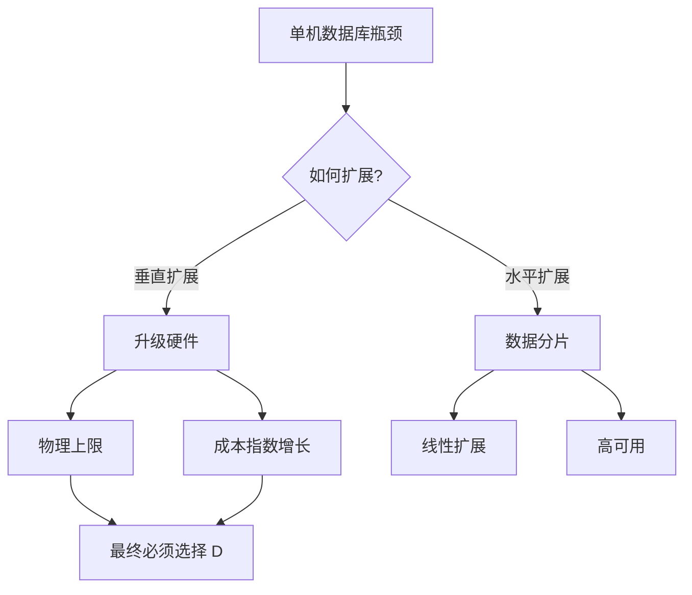
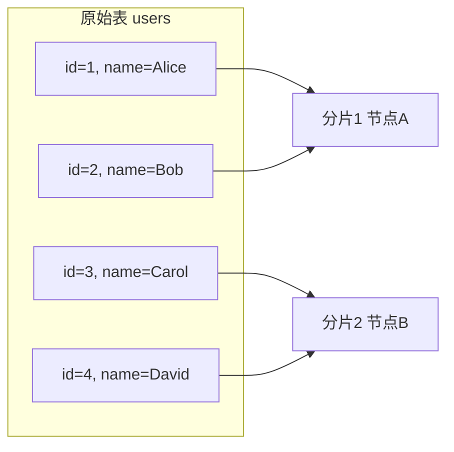
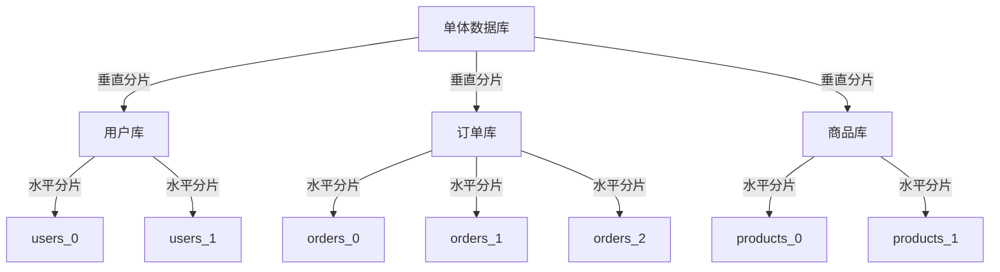
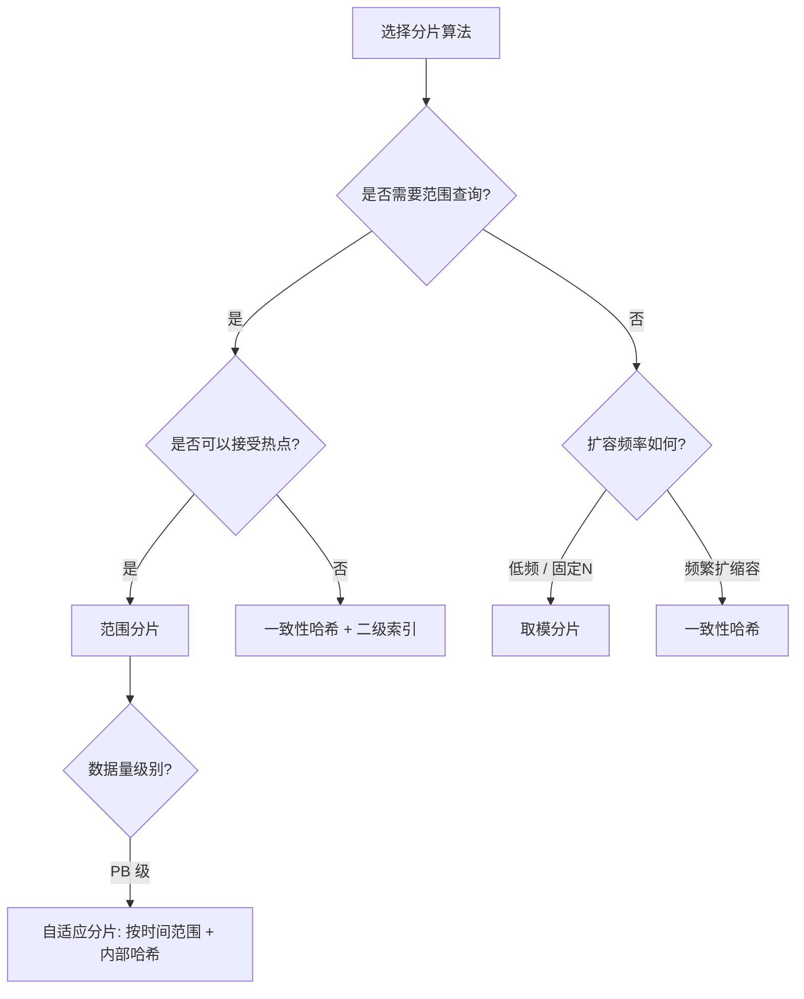
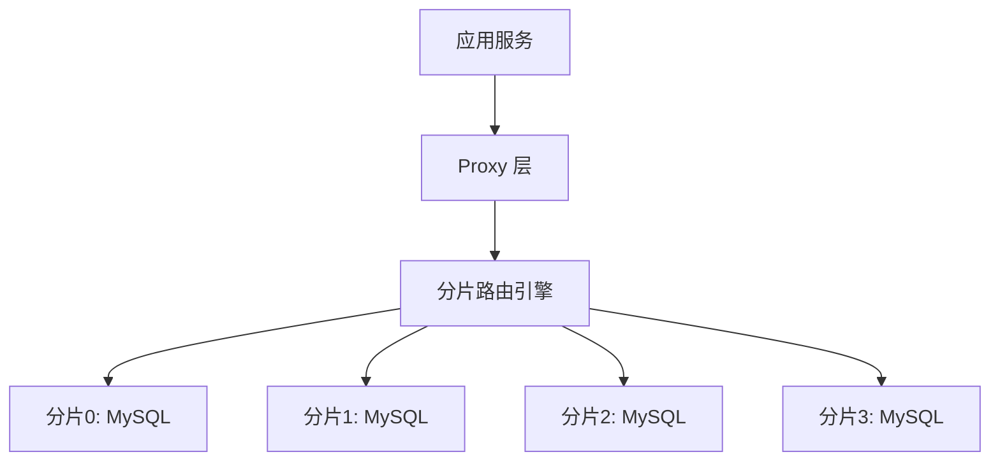
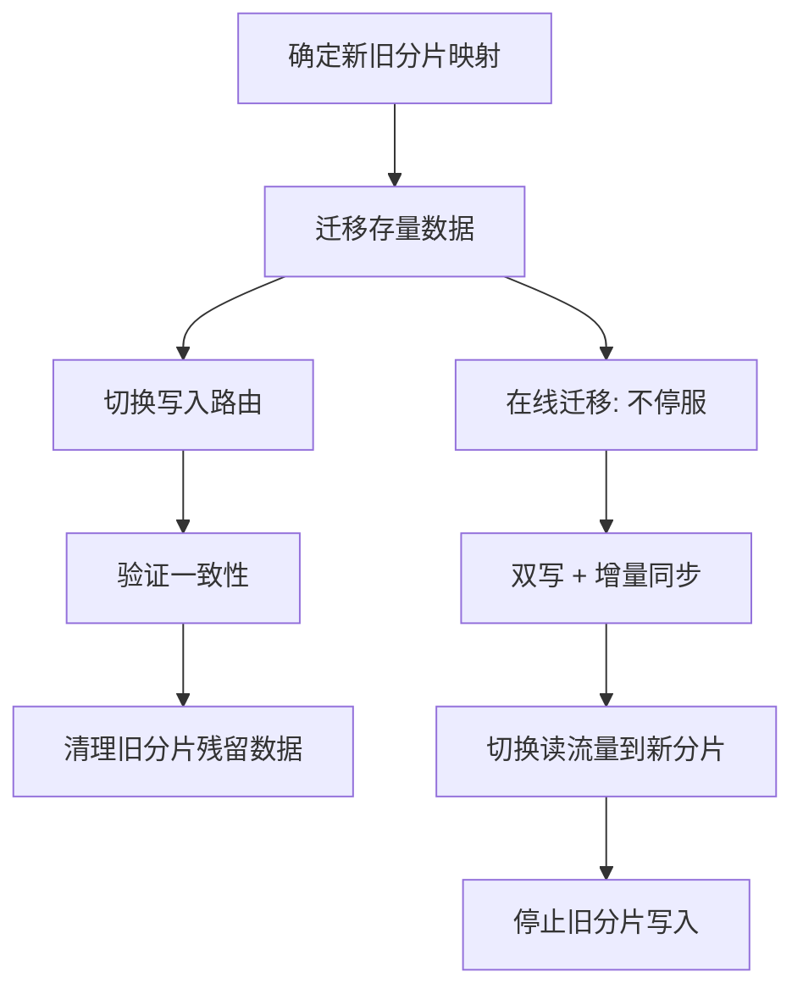

## 技巧1：数据分片（Data Sharding）

数据分片是分布式数据库最核心的基石技术——没有分片，就没有真正的水平扩展能力。本节从理论原理到工程实战，系统讲解数据分片的设计方法、实现策略与生产实践。

### 1.1 为什么需要数据分片

当单机数据库的数据量突破 TB 级别，或 QPS 突破万级时，单一实例的存储容量和计算能力都会成为瓶颈。垂直扩展（升级硬件）存在物理上限和边际成本递增问题，水平扩展（增加节点）才是大规模系统的必由之路。数据分片正是将一个逻辑数据库拆分到多个物理节点上的关键技术。



**分片解决的核心问题：**

| 问题 | 无分片时的表现 | 分片后的改善 |
|------|---------------|-------------|
| 存储瓶颈 | 单盘容量有限（2-8TB） | 多节点聚合 PB 级存储 |
| 计算瓶颈 | 单机 CPU 处理能力有限 | 查询并行化，吞吐量线性增长 |
| 写入瓶颈 | 单机 IOPS 上限（通常 < 50K） | 写入分散到多个节点，总 IOPS 线性扩展 |
| 故障影响面 | 故障影响全部数据 | 故障只影响部分分片，其余正常服务 |

### 1.2 分片的核心模型

#### 1.2.1 水平分片（Horizontal Sharding）

将同一张表的数据按行拆分到不同节点。每个节点存储不同的数据行，但表结构完全相同。这是最常见也是最实用的分片方式。



典型场景：用户表按 `user_id` 取模分片，订单表按 `order_id` 取模分片。

#### 1.2.2 垂直分片（Vertical Sharding）

将同一张表的不同列拆分到不同节点。通常用于将大字段（如 `TEXT`、`BLOB`）或低频访问列分离出去，减少主表的 I/O 负担。

原始表: users(id, name, email, bio, avatar_url)
         ↓
分片1: users_core(id, name, email)        -- 高频访问
分片2: users_profile(id, bio, avatar_url)  -- 低频访问

#### 1.2.3 垂直+水平混合分片

先按业务域垂直拆分（用户库、订单库、商品库），再对每个库内的大表水平分片。这是中大型系统最常见的实践路径。



### 1.3 分片键选择策略

分片键（Sharding Key）是分片设计中最关键的决策——它决定了数据的分布方式、查询的路由效率，以及后续扩容的复杂度。

#### 1.3.1 分片键选择原则

| 原则 | 说明 | 反例 |
|------|------|------|
| **高基数** | 取值范围足够大，能均匀分散数据 | 用 `gender`（仅男/女）做分片键 |
| **查询高频** | 大部分查询都携带该字段 | 用极少出现在 WHERE 中的字段 |
| **分布均匀** | 不会导致数据倾斜 | 用 `create_time` 做分片键（热点集中） |
| **不可变** | 业务上不会频繁修改该字段 | 用 `phone_number`（用户换号） |
| **非空** | 每条记录都必须有该字段 | 允许 NULL 的字段 |

#### 1.3.2 常见分片键场景对比

| 业务场景 | 推荐分片键 | 分片算法 | 理由 |
|---------|-----------|---------|------|
| 用户表 | `user_id` | 取模 / 一致性哈希 | 高基数，查询常带 user_id |
| 订单表 | `user_id` 或 `order_id` | 取模 | 按用户查询最频繁，order_id 作为辅助 |
| 消息表 | `conversation_id` | 一致性哈希 | 同一会话的消息在同一分片，减少跨片查询 |
| 日志表 | `timestamp` | 范围分片 | 按时间范围归档，冷热分离 |
| 商品表 | `category_id` | 取模 | 按类目查询集中，基数适中 |

#### 1.3.3 多分片键策略

当业务查询有多个高频维度时，可以建立多张路由表：

```python
# 路由表示例：同一条数据在不同查询维度下的分片
shard_routing = {
    "by_user":  {user_id: shard_id},    # 按用户查订单
    "by_order": {order_id: shard_id},   # 按订单号查详情
}
# 实际实现中通常用 ES/XiaoMiMiMo 等二级索引来辅助路由
```

### 1.4 四种核心分片算法

#### 1.4.1 取模分片（Hash Modulo）

最简单直接的算法：`shard_id = hash(key) % N`，其中 N 为分片数量。

```python
def hash_modulo_shard(key: str, num_shards: int) -> int:
    return hash(key) % num_shards

# 示例：4个分片
# hash("user_1001") % 4 = 2  → 分片2
# hash("user_1002") % 4 = 0  → 分片0
# hash("user_1003") % 4 = 1  → 分片1
```

| 优点 | 缺点 |
|------|------|
| 实现简单，路由快 | 扩容时几乎所有数据需要重新映射 |
| 数据分布均匀（哈希均匀时） | 需要全量数据迁移才能扩容 |
| 无额外存储开销 | 不支持范围查询（相邻 key 可能不在同一分片） |

#### 1.4.2 范围分片（Range Sharding）

按分片键的值范围划分：`[0, 10000) → 分片0，[10000, 20000) → 分片1`。

分片0: user_id [1, 10000)
分片1: user_id [10000, 20000)
分片2: user_id [20000, 30000)

| 优点 | 缺点 |
|------|------|
| 支持范围查询（如 `WHERE id BETWEEN 1000 AND 2000`） | 数据容易倾斜（热点集中在最新范围） |
| 扩容简单，只需新增空分片 | 新分片冷启动，旧分片持续累积 |
| 便于数据归档（按时间范围迁移冷数据） | 需要维护分片边界元数据 |

#### 1.4.3 一致性哈希（Consistent Hashing）

将 key 映射到一个环形空间（0 ~ 2^32-1），每个节点负责环上的一段区间。扩容/缩容时只影响相邻节点的数据，迁移量最小。这是生产环境中使用最广泛的分片算法之一。

> 一致性哈希在本章技巧2中详细讲解，此处仅做对比参考。

| 优点 | 缺点 |
|------|------|
| 扩容只迁移 1/N 的数据 | 实现复杂度高于取模 |
| 节点增减对数据分布影响最小 | 引入虚拟节点后需维护额外映射 |
| 天然支持分布式缓存场景 | 范围查询需要额外机制 |

#### 1.4.4 本地二级索引分片（Directory-Based）

维护一个全局的路由表（Directory），记录每条数据所在的分片位置。查询时先查路由表，再路由到目标分片。

```python
# 全局路由表（通常存储在独立的高可用服务中）
directory = {
    "order_1001": "shard_2",
    "order_1002": "shard_0",
    "order_1003": "shard_3",
}
```

| 优点 | 缺点 |
|------|------|
| 任意分片键均可使用 | 路由表本身是单点瓶颈 |
| 分片调整完全灵活 | 路由表的高可用和一致性维护成本高 |
| 支持跨分片迁移零感知 | 查询多一次路由表查找 |

#### 1.4.5 算法选型决策树



### 1.5 分片架构模式

#### 1.5.1 应用层分片（Client-Side Sharding）

分片逻辑实现在应用代码中，由应用直接连接目标分片数据库。

```python
# 应用层分片实现
class ShardRouter:
    def __init__(self, shards: dict):
        self.shards = shards  # {0: "host1:3306", 1: "host2:3306"}

    def get_shard(self, user_id: int) -> str:
        shard_id = user_id % len(self.shards)
        return self.shards[shard_id]

    def query(self, user_id: int, sql: str):
        target = self.get_shard(user_id)
        conn = self.connect(target)
        return conn.execute(sql)

# 使用
router = ShardRouter({0: "db1:3306", 1: "db2:3306", 2: "db3:3306"})
result = router.query(user_id=1001, sql="SELECT * FROM users WHERE id=1001")
```

| 优点 | 缺点 |
|------|------|
| 无中间层，延迟最低 | 分片逻辑耦合在每个微服务中 |
| 实现简单 | 扩容时需要全量应用发版 |
| 无额外基础设施成本 | 跨分片 JOIN 需要自行实现 |

#### 1.5.2 代理层分片（Proxy Sharding）

在应用和数据库之间部署代理层（如 ProxySQL、Vitess），代理负责 SQL 解析和路由。



| 优点 | 缺点 |
|------|------|
| 应用无感知，零改造 | 代理层引入额外延迟（通常 1-3ms） |
| 分片调整透明 | 代理层本身需要高可用保障 |
| 跨分片查询由代理层处理 | 不支持复杂 SQL 子集（如某些窗口函数） |

#### 1.5.3 原生分片（Native Sharding）

数据库自身内置分片能力（如 TiDB、CockroachDB、OceanBase），对应用完全透明。

```python
# TiDB 示例：自动分片，应用无感知
# 底层按 row_id range 自动分裂
CREATE TABLE orders (
    id BIGINT AUTO_RANDOM PRIMARY KEY,
    user_id BIGINT,
    amount DECIMAL(10,2)
) SHARD_ROW_ID_BITS = 4 PRE_SPLIT_REGIONS = 8;
```

| 优点 | 缺点 |
|------|------|
| 应用完全透明，零改造 | 需要迁移到特定数据库 |
| 自动分裂、均衡、迁移 | 生态兼容性可能受限（MySQL 协议兼容性等） |
| 运维由数据库管理 | 团队需要学习新技术栈 |

#### 1.5.4 三种模式对比总结

| 维度 | 应用层分片 | 代理层分片 | 原生分片 |
|------|-----------|-----------|---------|
| 实现复杂度 | 低 | 中 | 低（迁移成本高） |
| 额外延迟 | 无 | 1-3ms | 无 |
| 跨分片查询 | 需自行实现 | 代理层支持 | 数据库内置 |
| 运维复杂度 | 高（分散在应用中） | 中（集中管理代理） | 低 |
| 技术迁移成本 | 无 | 无 | 高 |
| 适用阶段 | 早期/小规模 | 中期/中规模 | 大规模/长期 |

### 1.6 跨分片查询处理

分片后最棘手的问题之一就是跨分片查询：当查询条件不携带分片键时，需要向所有分片发送请求并聚合结果。

#### 1.6.1 扇出查询（Scatter-Gather）

```python
# 扇出查询实现
def scatter_query(shards, sql_template, params):
    """向所有分片发送查询并聚合结果"""
    results = []
    for shard in shards:
        result = shard.execute(sql_template, params)
        results.extend(result)

    # 在应用层排序/聚合
    results.sort(key=lambda r: r.created_at, reverse=True)
    return results[:20]  # LIMIT 20
```

**扇出查询的性能问题：**

- 总延迟 = max(各分片延迟) + 聚合耗时
- 4个分片 × 50ms = 整体至少50ms（并行）或 200ms（串行）
- 如果某个分片慢（P99 延迟高），会拖慢整个查询

#### 1.6.2 二级索引方案

为非分片键字段建立全局二级索引。二级索引记录 `(索引字段 → 分片键 → 分片位置` 的映射关系。

# 用户名查找的二级索引
username_index = {
    "alice":  {"user_id": 1001, "shard": 2},
    "bob":    {"user_id": 1002, "shard": 0},
    "carol":  {"user_id": 1003, "shard": 1},
}
# 先查索引得到分片位置，再精确路由

二级索引实现方式对比：

| 方案 | 一致性 | 性能 | 复杂度 |
|------|--------|------|--------|
| 同步二级索引（写入时同步更新） | 强一致 | 读快写慢 | 中 |
| 异步二级索引（CDC 同步） | 最终一致（秒级延迟） | 读写均快 | 高 |
| 全文索引（ES/Solr） | 最终一致（秒级延迟） | 搜索能力强 | 高 |

#### 1.6.3 全局表方案

对于变更不频繁、数据量小的维度表（如配置表、地区表、商品类目表），在每个分片上冗余一份完整副本，避免跨分片 JOIN。

```sql
-- 在每个分片上创建完整的 dim_region 表
-- 写入时同步到所有分片，读取时本地 JOIN
SELECT o.*, r.name
FROM orders o JOIN dim_region r ON o.region_id = r.id
WHERE o.user_id = 1001;  -- 本地 JOIN，无跨分片
```

### 1.7 数据迁移与再均衡

#### 1.7.1 扩容迁移流程

当分片数量变化时（如从 4 扩到 8），需要将部分数据迁移到新分片。



#### 1.7.2 在线数据迁移关键步骤

```python
# 在线迁移伪代码
class OnlineMigration:
    def migrate(self, src_shard, dst_shard, shard_key_range):
        # 1. 记录迁移起始点位
        start_binlog = src_shard.get_binlog_position()

        # 2. 启动增量同步：将实时写入同步到新分片
        sync_thread = start_sync(src_shard, dst_shard, start_binlog)

        # 3. 迁移存量数据（批量读取 + 写入）
        batch_migrate(src_shard, dst_shard, shard_key_range)

        # 4. 等待增量追平
        wait_sync_caught_up(sync_thread)

        # 5. 切换路由（短暂锁表或双写保证一致性）
        switch_routing(shard_key_range, dst_shard)

        # 6. 清理源分片
        cleanup(src_shard, shard_key_range)
```

**迁移过程中的核心挑战：**

| 挑战 | 解决方案 |
|------|---------|
| 迁移期间的写入丢失 | 双写机制：同时写新旧分片 |
| 迁移期间的读取不一致 | 读扩散：先查新分片，miss 则查旧分片 |
| 迁移速度慢影响业务 | 限流 + 后台批量迁移 + binlog 增量追赶 |
| 迁移失败回滚 | 保留旧分片数据，回滚只需切换路由 |

### 1.8 生产环境常见误区

| 误区 | 正确做法 |
|------|---------|
| 分片键选 `created_at` | 会导致数据集中在最新分片，形成写热点 |
| 分片数一步到位设很大 | 初期按实际数据量设 2-4 个，后续再扩 |
| 忽略数据倾斜问题 | 上线前用模拟数据验证各分片数据量均衡度 |
| 所有查询都走扇出 | 高频查询强制带分片键，避免全分片扫描 |
| 跨分片 JOIN 硬抗 | 改为应用层组装、宽表、或全局冗余表 |
| 不做迁移演练 | 每次扩容前在 staging 环境完整演练迁移流程 |
| 分片后不做监控 | 必须监控各分片数据量、QPS、延迟均衡度 |

### 1.9 监控与运维

分片后的数据库需要关注以下核心指标：

```bash
# 各分片数据量对比（MySQL）
mysql -e "SELECT table_schema, table_name,
    ROUND(data_length/1024/1024, 2) AS data_mb,
    table_rows
FROM information_schema.tables
WHERE table_name = 'users'
ORDER BY table_schema;"

# 各分片 QPS 对比
mysql -e "SHOW GLOBAL STATUS LIKE 'Queries';"

# 系统资源监控
iostat -x 1          # 各分片磁盘 I/O 对比
ss -s                 # 连接数统计
```

**关键告警规则：**

| 指标 | 告警阈值 | 含义 |
|------|---------|------|
| 单分片数据量不均衡度 | > 1.5 倍均值 | 数据倾斜，需要再均衡 |
| 单分片 QPS 不均衡度 | > 2 倍均值 | 热点分片，需要优化路由 |
| 单分片磁盘使用率 | > 80% | 即将写满，需要扩容 |
| 扇出查询 P99 延迟 | > 500ms | 跨分片查询性能劣化 |
| 数据迁移速度 | < 预期的 50% | 迁移可能阻塞业务写入 |

### 1.10 实战案例：电商订单系统分片

**业务背景：** 日均订单量 5000 万，峰值 QPS 10 万+，数据保留 3 年（约 550 亿条订单）。

**分片方案设计：**

| 维度 | 决策 | 理由 |
|------|------|------|
| 分片策略 | 按 `user_id` 取模 | 90% 查询为"查我的订单"，按用户分片可精准路由 |
| 分片数量 | 初期 64 片，按需扩到 128/256 片 | 64 片每片约 8.6 亿条，可控 |
| 分片键 | `user_id` (BIGINT) | 高基数、不可变、非空、查询高频 |
| 跨分片查询 | 按时间全局查询 → 二级索引（ES） | 运营后台按日期查订单，走异步索引 |
| 架构模式 | 代理层分片（Vitess） | 微服务多，避免分片逻辑耦合 |

**核心路由逻辑：**

```python
def route_order(user_id: int) -> int:
    """计算订单所属分片"""
    return user_id % 64

def query_my_orders(user_id: int, page: int):
    """用户查询自己的订单 → 精准路由到单个分片"""
    shard = route_order(user_id)
    sql = "SELECT * FROM orders WHERE user_id = %s ORDER BY created_at DESC LIMIT 20 OFFSET %s"
    return execute_on_shard(shard, sql, (user_id, page * 20))

def query_by_date_range(start_date, end_date):
    """运营后台按日期查询 → 扇出到所有分片"""
    results = []
    for shard_id in range(64):
        results.extend(execute_on_shard(shard_id,
            "SELECT * FROM orders WHERE created_at BETWEEN %s AND %s",
            (start_date, end_date)))
    return sorted(results, key=lambda x: x['created_at'], reverse=True)
```

### 1.11 小结

数据分片是分布式数据库的第一课，也是最重要的一课。核心要点：

1. **分片键是灵魂**——选错了分片键，后续所有优化事倍功半
2. **取模分片起步快，一致性哈希扩得稳**——根据业务阶段选择算法
3. **原生分片 > 代理分片 > 应用层分片**——能用数据库原生能力就不要自己造轮子
4. **跨分片查询是痛点**——设计分片方案时就要规划好全局查询的解决方案
5. **迁移是必然的**——预留迁移演练和灰度切换能力，分片方案要支持渐进式扩容
6. **监控是生命线**——没有监控的分片等于盲人开车，必须实时掌握各分片均衡度
