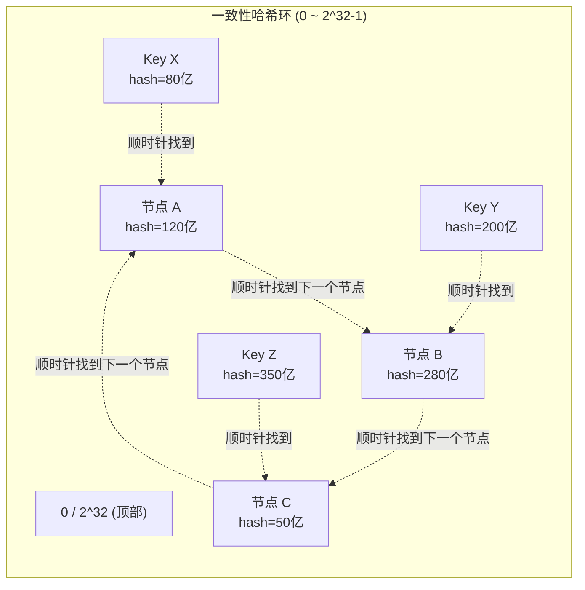
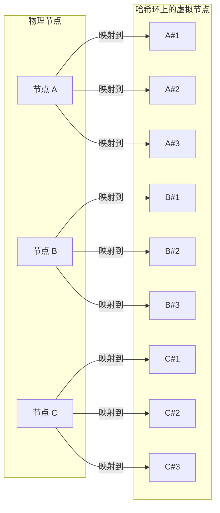

## 技巧2 一致性哈希：分布式系统的数据路由基石

一致性哈希（Consistent Hashing）是分布式系统中最核心的路由算法之一。它解决了一个看似简单却极其关键的问题：**当集群节点增减时，如何让数据迁移的代价最小化？** 在分布式数据库、缓存系统、负载均衡、分布式文件存储等场景中，一致性哈希无处不在。从 Amazon DynamoDB 到 Apache Cassandra，从 Redis Cluster 到 Memcached，一致性哈希都是底层数据路由的核心机制。

本节将从数学原理出发，深入讲解一致性哈希的实现机制、虚拟节点优化、工程实践中的常见陷阱，以及用 Python 从零实现一个生产级一致性哈希环。

---

### 1. 为什么需要一致性哈希？从哈希取模的缺陷说起

#### 1.1 传统哈希取模方案

最朴素的分布式数据路由方案是哈希取模：对 key 计算哈希值，然后对节点数 N 取模，决定数据归属哪个节点。

```python
def hash_mod(key: str, nodes: list) -> int:
    return hash(key) % len(nodes)
```

这个方案在节点数量固定时工作良好，但一旦节点数量发生变化，问题就暴露了：

```python
# 假设有3个节点：A(0), B(1), C(2)
# key "order_1001" -> hash("order_1001") % 3 = 0 -> 节点 A
# key "order_1002" -> hash("order_1002") % 3 = 1 -> 节点 B
# key "order_1003" -> hash("order_1003") % 3 = 2 -> 节点 C

# 现在增加节点 D，变成4个节点：
# key "order_1001" -> hash("order_1001") % 4 = 2 -> 节点 C (原来在 A!)
# key "order_1002" -> hash("order_1002") % 4 = 0 -> 节点 A (原来在 B!)
# key "order_1003" -> hash("order_1003") % 4 = 1 -> 节点 B (原来在 C!)
```

**灾难性的结果**：节点从 3 个变成 4 个，几乎所有 key 的映射都发生了变化。这意味着：

| 影响维度 | 量化后果 |
|---------|---------|
| 数据迁移量 | 约 (N-1)/N × 100% 的 key 需要重新映射（3→4节点时约75%） |
| 缓存失效 | 缓存命中率骤降，可能引发缓存雪崩 |
| 数据库压力 | 大量缓存miss直接打到数据库，可能造成数据库过载 |
| 服务延迟 | 迁移期间大量请求被重定向，延迟飙升 |

这就是所谓的**哈希重分布灾难**（Hash Redistribution Problem）。

#### 1.2 一致性哈希的核心目标

一致性哈希要解决的核心问题是：**在节点增减时，只需迁移最少量的数据**。理想情况下：

- 增加一个节点，只迁移该节点负责范围内的数据
- 减少一个节点，只将其数据迁移到相邻节点
- 影响的数据量与节点总数成反比，而非与数据总量成正比

---

### 2. 一致性哈希的数学原理

#### 2.1 基本思想：哈希环

一致性哈希将整个哈希空间组织成一个**环形结构**（Hash Ring）。哈希函数的输出空间被映射为 0 到 2^32 - 1 的环（使用无符号 32 位整数）。



**数据路由规则**：对 key 计算哈希值后，沿环顺时针方向行走，遇到的第一个节点就是该 key 的归属节点。这个过程的数学本质是：

node = first_node_where(hash(key) <= node_hash)
// 如果找不到，则绕环回到第一个节点（处理环的回绕）

#### 2.2 关键数学性质

| 性质 | 说明 | 量化指标 |
|-----|------|---------|
| 均匀性 | N 个节点在 2^32 空间中均匀分布 | 每个节点平均负责 1/N 的数据 |
| 局部性 | 增减节点只影响相邻节点的数据 | 迁移量约 1/(N+1) 或 1/N |
| 确定性 | 同一个 key 总是路由到同一个节点 | 哈希函数输出确定 |
| 无中心化 | 不需要中央协调节点 | 每个节点独立计算路由 |

#### 2.3 复杂度分析

| 操作 | 时间复杂度 | 说明 |
|-----|-----------|------|
| 路由查找 | O(log N) 或 O(N) | 取决于节点索引结构 |
| 节点插入 | O(log N) | 二分查找插入位置 |
| 节点删除 | O(log N) | 二分查找删除位置 |
| 节点迁移 | O(K/N) | K 为总 key 数，N 为节点数 |

---

### 3. 基本实现：从零构建一致性哈希环

#### 3.1 最简实现

```python
import hashlib
import bisect
from typing import Any, Optional


class ConsistentHash:
    """基本一致性哈希实现（无虚拟节点）"""
    
    def __init__(self, hash_func=None):
        self._ring: dict[int, Any] = {}  # hash_value -> node
        self._sorted_keys: list[int] = []  # 有序的哈希值列表
        self._hash_func = hash_func or self._default_hash
    
    @staticmethod
    def _default_hash(key: str) -> int:
        """使用 MD5 生成 32 位哈希值"""
        return int(hashlib.md5(key.encode()).hexdigest(), 16)
    
    def _get_node_for_hash(self, hash_val: int) -> Any:
        """根据哈希值沿环顺时针查找节点"""
        if not self._sorted_keys:
            raise RuntimeError("No nodes in the hash ring")
        # 二分查找第一个 >= hash_val 的位置
        idx = bisect.bisect_left(self._sorted_keys, hash_val)
        # 如果超出范围，绕回环的起点
        if idx == len(self._sorted_keys):
            idx = 0
        return self._ring[self._sorted_keys[idx]]
    
    def add_node(self, node: Any) -> None:
        """添加节点到哈希环"""
        key = self._hash_func(str(node))
        if key not in self._ring:
            self._ring[key] = node
            bisect.insort(self._sorted_keys, key)
    
    def remove_node(self, node: Any) -> None:
        """从哈希环移除节点"""
        key = self._hash_func(str(node))
        if key in self._ring:
            del self._ring[key]
            self._sorted_keys.remove(key)
    
    def get_node(self, key: str) -> Any:
        """获取 key 对应的节点"""
        hash_val = self._hash_func(key)
        return self._get_node_for_hash(hash_val)
    
    def get_distribution(self, sample_keys: list[str]) -> dict[Any, int]:
        """统计节点的数据分布"""
        dist: dict[Any, int] = {}
        for key in sample_keys:
            node = self.get_node(key)
            dist[node] = dist.get(node, 0) + 1
        return dist
```

#### 3.2 验证基本实现

```python
# 创建哈希环，添加3个节点
ch = ConsistentHash()
ch.add_node("db-node-1")
ch.add_node("db-node-2")
ch.add_node("db-node-3")

# 测试数据路由
keys = [f"user_{i}" for i in range(10000)]
dist_before = ch.get_distribution(keys)
print("添加节点前的分布：", dist_before)

# 添加第4个节点
ch.add_node("db-node-4")
dist_after = ch.get_distribution(keys)
print("添加节点后的分布：", dist_after)

# 计算数据迁移量
moved = sum(
    1 for key in keys 
    if ch.get_node(key) != dist_before[key]  # 实际需要记录旧节点
)
print(f"迁移比例: {moved/len(keys)*100:.1f}%")
```

预期输出中，迁移比例应接近 25%（1/N，N=4），而非哈希取模方案的 75%。

---

### 4. 虚拟节点：解决数据倾斜的关键技术

#### 4.1 数据倾斜问题

基本一致性哈希有一个严重问题：**数据分布不均匀**。当节点数量较少时，节点在哈希环上的位置是随机的，可能出现某些节点负责的范围远大于其他节点。

假设只有2个节点：
节点 A 的 hash = 100
节点 B 的 hash = 300

在 0~2^32-1 的空间中：
A 负责的范围: [300, 100) = 2^32 - 300 + 100 ≈ 99.99% 的空间
B 负责的范围: [100, 300) = 200 ≈ 0.000005% 的空间

结论：几乎所有数据都路由到节点 A，节点 B 几乎空闲

这就是**数据倾斜**（Data Skew）问题。节点数量越少，倾斜越严重。

#### 4.2 虚拟节点的解决方案

虚拟节点（Virtual Nodes / Vnodes）的核心思想是：**让每个物理节点在哈希环上拥有多个虚拟映射点**，从而让数据分布更均匀。



#### 4.3 完整的虚拟节点实现

```python
import hashlib
import bisect
import random
from collections import defaultdict
from typing import Any, Optional


class VirtualNodeConsistentHash:
    """带虚拟节点的一致性哈希实现"""
    
    def __init__(self, vnodes_per_node: int = 150, seed: int = 42):
        """
        Args:
            vnodes_per_node: 每个物理节点的虚拟节点数量
            seed: 随机种子，确保可重现
        """
        self._vnodes_per_node = vnodes_per_node
        self._seed = seed
        self._ring: dict[int, str] = {}           # hash -> physical_node
        self._sorted_keys: list[int] = []
        self._node_vnodes: dict[str, list[int]] = {}  # node -> [vnode_hashes]
        self._replication_factor = 3  # 默认副本因子
    
    @staticmethod
    def _hash(key: str) -> int:
        """生成一致性哈希值"""
        return int(hashlib.sha256(key.encode()).hexdigest(), 16)
    
    def _generate_vnodes(self, node: str) -> list[int]:
        """为一个物理节点生成虚拟节点哈希值"""
        vnodes = []
        for i in range(self._vnodes_per_node):
            vnode_key = f"{node}#vnode#{i}"
            vnodes.append(self._hash(vnode_key))
        return vnodes
    
    def add_node(self, node: str) -> int:
        """
        添加物理节点（及其所有虚拟节点）到哈希环
        
        Returns:
            迁移的 key 数量（需要外部处理）
        """
        if node in self._node_vnodes:
            return 0  # 节点已存在
        
        vnodes = self._generate_vnodes(node)
        self._node_vnodes[node] = vnodes
        
        for vnode_hash in vnodes:
            if vnode_hash not in self._ring:
                self._ring[vnode_hash] = node
                bisect.insort(self._sorted_keys, vnode_hash)
        
        return len(vnodes)
    
    def remove_node(self, node: str) -> int:
        """
        从哈希环移除物理节点及其所有虚拟节点
        
        Returns:
            需要迁移的 key 列表（由外部处理）
        """
        if node not in self._node_vnodes:
            return 0
        
        removed_count = 0
        for vnode_hash in self._node_vnodes.pop(node):
            if vnode_hash in self._ring:
                del self._ring[vnode_hash]
                self._sorted_keys.remove(vnode_hash)
                removed_count += 1
        
        return removed_count
    
    def get_node(self, key: str) -> Optional[str]:
        """获取 key 对应的物理节点"""
        if not self._sorted_keys:
            return None
        
        hash_val = self._hash(key)
        idx = bisect.bisect_left(self._sorted_keys, hash_val)
        if idx == len(self._sorted_keys):
            idx = 0
        return self._ring[self._sorted_keys[idx]]
    
    def get_replicas(self, key: str, count: int = None) -> list[str]:
        """
        获取 key 的多个副本节点（用于复制）
        
        策略：沿环顺时针遍历，跳过已选中的物理节点
        """
        count = count or self._replication_factor
        if not self._sorted_keys:
            return []
        
        hash_val = self._hash(key)
        idx = bisect.bisect_left(self._sorted_keys, hash_val)
        
        replicas = []
        seen_nodes = set()
        total = len(self._sorted_keys)
        
        for i in range(total):
            pos = (idx + i) % total
            node = self._ring[self._sorted_keys[pos]]
            if node not in seen_nodes:
                seen_nodes.add(node)
                replicas.append(node)
                if len(replicas) >= count:
                    break
        
        return replicas
    
    def get_distribution(self, sample_keys: list[str]) -> dict[str, float]:
        """统计节点的数据分布百分比"""
        counts: dict[str, int] = defaultdict(int)
        for key in sample_keys:
            node = self.get_node(key)
            if node:
                counts[node] += 1
        
        total = len(sample_keys)
        return {node: count / total * 100 for node, count in counts.items()}
    
    def get_balance_score(self, sample_keys: list[str]) -> float:
        """
        计算负载均衡度（0~1，越接近1越均匀）
        
        理想情况下每个节点应分到 100/N% 的数据
        """
        dist = self.get_distribution(sample_keys)
        n = len(dist)
        if n == 0:
            return 0.0
        
        ideal = 100.0 / n
        deviation = sum(abs(pct - ideal) for pct in dist.values()) / n
        # 最大可能偏差 = ideal * (n-1) (一个节点占100%)
        max_deviation = ideal * (n - 1)
        
        if max_deviation == 0:
            return 1.0
        return 1.0 - (deviation / max_deviation)
```

#### 4.4 虚拟节点数量的选择

虚拟节点数量是一个关键的调优参数。太少则分布不均，太多则占用内存和 CPU。

```python
def benchmark_vnodes():
    """不同虚拟节点数量下的分布均衡度测试"""
    keys = [f"key_{i}" for i in range(100000)]
    
    results = []
    for vnodes_per_node in [10, 50, 100, 150, 200, 500]:
        ch = VirtualNodeConsistentHash(vnodes_per_node=vnodes_per_node)
        for i in range(6):
            ch.add_node(f"node-{i}")
        
        dist = ch.get_distribution(keys)
        balance = ch.get_balance_score(keys)
        max_vnodes = max(dist.values())
        min_vnodes = min(dist.values())
        
        results.append({
            "vnodes": vnodes_per_node,
            "balance": balance,
            "max_pct": max_vnodes,
            "min_pct": min_vnodes,
            "std_dev": (max_vnodes - min_vnodes),
        })
        
        print(f"Vnodes={vnodes_per_node:4d} | "
              f"Balance={balance:.4f} | "
              f"Max={max_vnodes:.2f}% | "
              f"Min={min_vnodes:.2f}% | "
              f"Range={max_vnodes - min_vnodes:.2f}%")
    
    return results
```

**业界经验参考值：**

| 系统 | 默认虚拟节点数 | 说明 |
|-----|--------------|------|
| Amazon DynamoDB | 256 | 高均衡度，适合大规模集群 |
| Apache Cassandra | 256 (可配置) | 默认 256 个 vnodes |
| Redis Cluster | 16384 个 slot | 本质是固定数量的虚拟节点 |
| Memcached | 通常 100-200 | 根据集群规模调整 |
| Netflix EVCache | 400 | 平衡内存开销和均衡度 |

**推荐选择策略：**
- 节点数 < 10：150-200 个虚拟节点
- 节点数 10-50：100-150 个虚拟节点
- 节点数 50+：50-100 个虚拟节点（避免环过大）

---

### 5. 一致性哈希在分布式数据库中的典型应用

#### 5.1 数据分片（Sharding）

一致性哈希最直接的应用是数据分片：将数据均匀分布到多个数据库节点上。

```python
class DatabaseShardRouter:
    """基于一致性哈希的数据库分片路由器"""
    
    def __init__(self):
        self.ch = VirtualNodeConsistentHash(vnodes_per_node=150)
        self._connections: dict[str, Any] = {}
    
    def add_shard(self, shard_id: str, conn_info: dict) -> None:
        """添加数据库分片"""
        self.ch.add_node(shard_id)
        self._connections[shard_id] = self._create_connection(conn_info)
    
    def remove_shard(self, shard_id: str) -> list[str]:
        """
        移除分片，返回需要迁移的 key 列表
        注意：实际生产中需要配合数据迁移脚本
        """
        self.ch.remove_node(shard_id)
        self._connections.pop(shard_id, None)
        return []  # 实际需要扫描受影响的 key
    
    def route(self, key: str) -> tuple[str, Any]:
        """路由 key 到对应的数据库分片"""
        shard_id = self.ch.get_node(key)
        if not shard_id:
            raise RuntimeError("No shards available")
        return shard_id, self._connections[shard_id]
    
    def get_shard_for_write(self, key: str) -> tuple[str, list[str], Any]:
        """
        写入时获取主分片和副本分片
        写入主分片后异步同步到副本
        """
        replicas = self.ch.get_replicas(key)
        primary = replicas[0]
        return primary, replicas, self._connections[primary]
    
    def query(self, key: str, sql: str) -> Any:
        """执行查询（路由到正确的分片）"""
        shard_id, conn = self.route(key)
        # 实际实现中需要在 SQL 中替换表名为分片后的表名
        # 或者直接在目标分片上执行
        return conn.execute(sql, params={"key": key})
```

#### 5.2 缓存层设计

在数据库前加缓存层时，一致性哈希确保缓存节点与数据库节点的映射关系稳定。

```python
class CacheLayer:
    """数据库缓存层 —— 缓存与数据库使用独立的一致性哈希环"""
    
    def __init__(self, cache_nodes: list[str], db_shards: list[str]):
        # 缓存层和数据库层使用独立的哈希环
        self.cache_ring = VirtualNodeConsistentHash(vnodes_per_node=100)
        self.db_ring = VirtualNodeConsistentHash(vnodes_per_node=150)
        
        for node in cache_nodes:
            self.cache_ring.add_node(node)
        for shard in db_shards:
            self.db_ring.add_node(shard)
    
    def get_cache_node(self, key: str) -> str:
        """获取 key 对应的缓存节点"""
        return self.cache_ring.get_node(key)
    
    def get_db_shard(self, key: str) -> str:
        """获取 key 对应的数据库分片"""
        return self.db_ring.get_node(key)
    
    def read(self, key: str) -> Any:
        """读取：先查缓存，miss 再查数据库"""
        cache_node = self.get_cache_node(key)
        db_shard = self.get_db_shard(key)
        
        # 1. 查缓存
        cached = self._get_from_cache(cache_node, key)
        if cached is not None:
            return cached
        
        # 2. 查数据库
        result = self._query_db(db_shard, key)
        
        # 3. 回写缓存
        if result is not None:
            self._set_to_cache(cache_node, key, result)
        
        return result
```

**缓存节点增减的影响分析：**

场景：3个缓存节点 + 3个数据库节点

增加1个缓存节点时：
- 受影响的缓存 key: 约 1/4 (25%)
- 受影响的数据库 key: 0% (数据库节点未变)
- 后果：25% 的缓存 key 失效，需要回源查询

如果缓存层和数据库层使用同一个哈希环（共 6 个节点）：
- 增加1个缓存节点：影响 1/6 的 key → 所有 key 的路由都变了
- 这是错误的设计！缓存层必须独立于数据库层

#### 5.3 会话亲和性（Session Affinity）

在有状态服务中，一致性哈希可以将同一用户的请求路由到同一后端节点：

```python
class SessionRouter:
    """基于一致性哈希的会话亲和路由"""
    
    def __init__(self, backends: list[str]):
        self.ch = VirtualNodeConsistentHash(vnodes_per_node=200)
        self.backends = {b: {"active": True} for b in backends}
        for b in backends:
            self.ch.add_node(b)
    
    def route_request(self, user_id: str) -> str:
        """将用户请求路由到固定的后端节点"""
        # 跳过不健康的节点（需要 failover 逻辑）
        target = self.ch.get_node(user_id)
        
        if self.backends.get(target, {}).get("active", False):
            return target
        
        # 如果目标节点不健康，移除后重新路由
        self.ch.remove_node(target)
        new_target = self.ch.get_node(user_id)
        self.ch.add_node(target)  # 临时移除，后面恢复
        return new_target
    
    def on_backend_health_change(self, backend: str, healthy: bool):
        """后端健康状态变化时的处理"""
        self.backends[backend]["active"] = healthy
        if not healthy:
            # 标记不健康，路由时跳过
            # 注意：不直接 remove_node，因为恢复时需要重新添加
            pass
```

---

### 6. 工程实践中的关键问题与解决方案

#### 6.1 节点故障与自动故障转移

```python
class FaultTolerantConsistentHash:
    """带故障检测的一致性哈希"""
    
    def __init__(self):
        self.ch = VirtualNodeConsistentHash(vnodes_per_node=150)
        self._health: dict[str, bool] = {}
        self._last_heartbeat: dict[str, float] = {}
        self._heartbeat_timeout = 30  # 秒
    
    def mark_unhealthy(self, node: str) -> list[str]:
        """标记节点为不健康，返回受影响的 key 范围"""
        self._health[node] = False
        # 注意：这里不从环上移除节点
        # 而是在路由时跳过不健康的节点
        return self._get_affected_range(node)
    
    def mark_healthy(self, node: str):
        """标记节点恢复健康"""
        self._health[node] = True
    
    def get_healthy_node(self, key: str) -> Optional[str]:
        """路由 key 到健康的节点"""
        if not self.ch._sorted_keys:
            return None
        
        hash_val = self.ch._hash(key)
        idx = bisect.bisect_left(self.ch._sorted_keys, hash_val)
        total = len(self.ch._sorted_keys)
        
        for i in range(total):
            pos = (idx + i) % total
            node = self.ch._ring[self.ch._sorted_keys[pos]]
            if self._health.get(node, True):
                return node
        
        return None  # 所有节点都不健康
    
    def _get_affected_range(self, node: str) -> list[str]:
        """获取节点故障时受影响的 key 范围"""
        if node not in self.ch._node_vnodes:
            return []
        # 返回该节点所有虚拟节点的哈希值（作为受影响范围的标识）
        return [str(v) for v in self.ch._node_vnodes[node]]
```

#### 6.2 热点 Key 问题

热点 Key（Hot Key）是指被大量访问的单一 key，可能导致单个节点过载。一致性哈希本身无法解决这个问题，需要额外策略：

```python
class HotKeyHandler:
    """热点 Key 处理策略"""
    
    def __init__(self, consistent_hash):
        self.ch = consistent_hash
        self._hot_keys: dict[str, int] = {}  # key -> 访问计数
        self._threshold = 1000  # 超过此阈值视为热点
        self._hot_key_cache: dict[str, list[str]] = {}  # 热点key -> 副本节点列表
    
    def record_access(self, key: str) -> str:
        """记录访问并检测热点"""
        self._hot_keys[key] = self._hot_keys.get(key, 0) + 1
        
        if self._hot_keys[key] > self._threshold and key not in self._hot_key_cache:
            self._promote_hot_key(key)
        
        return self.ch.get_node(key)
    
    def _promote_hot_key(self, key: str):
        """将热点 Key 提升为多副本缓存"""
        # 获取多个节点作为副本
        replicas = self.ch.get_replicas(key, count=3)
        self._hot_key_cache[key] = replicas
    
    def get_hot_key_value(self, key: str) -> Optional[str]:
        """从热点 Key 副本中读取（负载均衡）"""
        if key not in self._hot_key_cache:
            return None
        
        replicas = self._hot_key_cache[key]
        # 轮询副本以分散读取压力
        idx = self._hot_keys.get(key, 0) % len(replicas)
        return replicas[idx]
```

#### 6.3 节点迁移的数据一致性

当节点增减时，需要确保迁移过程中数据的一致性。常用的策略是**双写 + 迁移**：

```python
class MigrationManager:
    """节点数据迁移管理器"""
    
    def __init__(self, consistent_hash):
        self.ch = consistent_hash
        self._migration_in_progress: dict[str, str] = {}  # key -> status
    
    def migrate_data(self, old_nodes: set, new_nodes: set, all_keys: list[str]):
        """
        迁移数据的完整流程：
        1. 双写阶段：新旧节点同时写入
        2. 迁移阶段：批量复制历史数据
        3. 切换阶段：读写切换到新节点
        4. 清理阶段：停止旧节点的写入
        """
        affected_keys = []
        for key in all_keys:
            new_node = self.ch.get_node(key)
            if new_node in new_nodes:
                affected_keys.append(key)
        
        print(f"受影响的 key 数量: {len(affected_keys)} / {len(all_keys)}")
        
        # 阶段1: 双写
        self._enable_dual_write(affected_keys, old_nodes, new_nodes)
        
        # 阶段2: 迁移历史数据
        migrated = 0
        for key in affected_keys:
            self._copy_data(key, old_nodes, new_nodes)
            migrated += 1
            if migrated % 1000 == 0:
                print(f"已迁移 {migrated}/{len(affected_keys)}")
        
        # 阶段3: 切换
        self._switch_reads(affected_keys, new_nodes)
        
        # 阶段4: 清理
        self._disable_dual_write(affected_keys, old_nodes)
    
    def _enable_dual_write(self, keys, old_nodes, new_nodes):
        """启用双写模式"""
        pass  # 实际实现需要协调写入路径
    
    def _copy_data(self, key, old_nodes, new_nodes):
        """复制单个 key 的数据"""
        pass  # 从旧节点读取，写入新节点
    
    def _switch_reads(self, keys, new_nodes):
        """切换读取路径到新节点"""
        pass
    
    def _disable_dual_write(self, keys, old_nodes):
        """关闭双写模式"""
        pass
```

#### 6.4 时钟漂移与哈希值一致性

在分布式环境中，不同机器的时间可能不一致（时钟漂移），但这不影响一致性哈希，因为一致性哈希不依赖时间戳。但需要注意的是：

- 不同机器上的哈希函数实现必须完全一致（哈希算法版本、编码方式）
- 序列化方式必须统一（Python 的 `str()` 和 Java 的 `toString()` 不同）
- 建议使用统一的哈希库或预计算的哈希值

```python
# 跨语言一致性哈希的兼容实现
# 所有语言使用相同的 SHA-256 哈希算法

# Python
import hashlib
hash_val = hashlib.sha256(b"node-1").hexdigest()

# Java (等价实现)
# String hashVal = MessageDigest.getInstance("SHA-256")
#     .digest("node-1".getBytes(StandardCharsets.UTF_8))

# Go (等价实现)
# h := sha256.New()
# h.Write([]byte("node-1"))
# hashVal := hex.EncodeToString(h.Sum(nil))

# 关键：确保所有语言使用相同的字节编码（UTF-8）
# 和相同的哈希算法（SHA-256 或 MD5）
```

---

### 7. 一致性哈希 vs 其他数据路由方案

#### 7.1 方案对比

| 维度 | 哈希取模 | 一致性哈希 | 范围分区 | 一致性哈希+虚拟节点 |
|-----|---------|-----------|---------|-------------------|
| 数据均匀性 | 理论均匀 | 有一定倾斜 | 取决于分区策略 | 接近均匀 |
| 节点增减影响 | 几乎全部重映射 | 仅相邻节点 | 取决于分区键 | 仅相邻节点 |
| 实现复杂度 | 最简单 | 中等 | 中等 | 较复杂 |
| 范围查询 | 不支持 | 不支持 | 原生支持 | 不支持 |
| 热点处理 | 无法处理 | 无法直接处理 | 需要热点分裂 | 无法直接处理 |
| 适用场景 | 小规模静态集群 | 动态伸缩集群 | 有序数据存储 | 大规模动态集群 |

#### 7.2 何时选择一致性哈希

**适合使用一致性哈希的场景：**
- 数据库分片需要动态伸缩
- 缓存层的节点管理
- 分布式键值存储（如 DynamoDB、Cassandra）
- CDN 节点选择
- 有状态服务的会话亲和

**不适合使用一致性哈希的场景：**
- 需要范围查询（Range Query）的场景 → 使用范围分区
- 数据量极小（< 1000 条记录）→ 直接哈希取模即可
- 数据有强顺序要求 → 使用有序分区
- 需要全局排序 → 使用全局索引

---

### 8. 生产环境的监控与调优

#### 8.1 关键监控指标

```python
import time
import json
from dataclasses import dataclass, field
from typing import Optional


@dataclass
class ConsistentHashMetrics:
    """一致性哈希监控指标"""
    
    # 分布指标
    distribution: dict[str, float] = field(default_factory=dict)
    balance_score: float = 0.0
    
    # 性能指标
    routing_latency_us: float = 0.0  # 路由查找延迟（微秒）
    migration_in_progress: bool = False
    migration_progress: float = 0.0  # 0~1
    
    # 健康指标
    unhealthy_nodes: list[str] = field(default_factory=list)
    hot_keys: list[str] = field(default_factory=list)
    
    def to_prometheus_format(self) -> str:
        """导出为 Prometheus 格式"""
        lines = []
        lines.append(f'ch_balance_score {self.balance_score:.4f}')
        for node, pct in self.distribution.items():
            lines.append(f'ch_node_distribution{{node="{node}"}} {pct:.2f}')
        lines.append(f'ch_routing_latency_us {self.routing_latency_us:.1f}')
        lines.append(f'ch_migration_in_progress {int(self.migration_in_progress)}')
        lines.append(f'ch_migration_progress {self.migration_progress:.2f}')
        lines.append(f'ch_unhealthy_nodes {len(self.unhealthy_nodes)}')
        return '\n'.join(lines)


class ConsistentHashMonitor:
    """一致性哈希实时监控"""
    
    def __init__(self, consistent_hash, sample_interval: int = 60):
        self.ch = consistent_hash
        self.sample_interval = sample_interval
        self._history: list[ConsistentHashMetrics] = []
    
    def collect_metrics(self, sample_keys: list[str]) -> ConsistentHashMetrics:
        """收集当前的监控指标"""
        metrics = ConsistentHashMetrics()
        
        # 计算分布
        dist = self.ch.get_distribution(sample_keys)
        metrics.distribution = dist
        metrics.balance_score = self.ch.get_balance_score(sample_keys)
        
        # 检测热点
        from collections import Counter
        node_counts = Counter(self.ch.get_node(k) for k in sample_keys)
        total = len(sample_keys)
        metrics.hot_keys = [
            node for node, count in node_counts.items()
            if count / total > 0.3  # 单节点占比超过30%
        ]
        
        self._history.append(metrics)
        return metrics
    
    def alert_on_degradation(self, metrics: ConsistentHashMetrics) -> list[str]:
        """检测异常并生成告警"""
        alerts = []
        
        if metrics.balance_score < 0.85:
            alerts.append(
                f"WARNING: Balance score degraded to {metrics.balance_score:.4f}. "
                f"Consider adjusting vnodes_per_node."
            )
        
        if metrics.hot_keys:
            alerts.append(
                f"ALERT: Hot nodes detected: {metrics.hot_keys}. "
                f"Consider adding more vnodes or implementing hot key caching."
            )
        
        if metrics.unhealthy_nodes:
            alerts.append(
                f"CRITICAL: Unhealthy nodes: {metrics.unhealthy_nodes}. "
                f"Automatic failover should be in effect."
            )
        
        return alerts
```

#### 8.2 常见问题排查清单

| 问题现象 | 可能原因 | 排查方法 | 解决方案 |
|---------|---------|---------|---------|
| 某节点数据量远超其他 | 虚拟节点数太少 | 统计各节点 key 数量 | 增加 vnodes_per_node |
| 节点增减后大量缓存 miss | 缓存层与 DB 层共用哈希环 | 检查哈希环配置 | 分离缓存和 DB 的哈希环 |
| 跨语言节点路由不一致 | 哈希算法或编码不统一 | 对比不同语言的哈希输出 | 统一使用 SHA-256 + UTF-8 |
| 迁移期间数据不一致 | 未实现双写机制 | 检查迁移日志 | 启用双写 + 对账机制 |
| 路由延迟突然升高 | 哈希环过大或锁竞争 | profiling 路由函数 | 减少 vnodes 或优化锁 |
| 热点节点 CPU 飙高 | 热点 Key 未处理 | 分析请求日志 | 实现热点 Key 多副本 |

---

### 9. 进阶：高级一致性哈希变体

#### 9.1 Jump Consistent Hash

Jump Consistent Hash 是 Google 提出的一种极简一致性哈希算法，时间复杂度 O(ln N)，空间复杂度 O(1)，特别适合大规模桶分配场景。

```python
def jump_consistent_hash(key: int, num_buckets: int) -> int:
    """
    Jump Consistent Hash (Google, 2014)
    
    优点：零内存开销，极快
    缺点：不支持节点删除（桶数只能增加），不适合动态集群
    
    适用场景：日志分桶、静态分配
    """
    b, j = -1, 0
    while j < num_buckets:
        b = j
        key = ((key * 2862933555777941757) + 1) &amp; 0xFFFFFFFFFFFFFFFF
        j = int((b + 1) * (1 << 31) / ((key >> 33) + 1))
    return b
```

#### 9.2 Maglev Consistent Hash

Google Maglev（用于 Google 的负载均衡器）使用查找表实现一致性哈希，路由时间 O(1)：

```python
class MaglevHash:
    """
    Maglev Consistent Hashing (Google, 2016)
    
    特点：
    - 路由时间 O(1)（查表）
    - 极好的均衡性
    - 节点增减时迁移量非常小
    - 适用于负载均衡器等高性能场景
    """
    
    def __init__(self, table_size: int = 65537):
        self.table_size = table_size
        self._lookup: list[Optional[str]] = [None] * table_size
        self._preferred: list[Optional[int]] = [None] * table_size
        self._next: list[int] = [0] * table_size
    
    def _hash(self, key: str, idx: int) -> int:
        """双哈希函数"""
        h1 = hash(key) &amp; 0xFFFFFFFF
        h2 = (hash(key) ^ (idx * 0x5bd1e995)) &amp; 0xFFFFFFFF
        return (h1 + h2 * idx) % self.table_size
    
    def generate_table(self, backends: list[str]) -> list[str]:
        """生成查找表"""
        n = len(backends)
        
        # 计算每个后端的首选位置
        self._preferred = [None] * n
        for i, backend in enumerate(backends):
            self._preferred[i] = self._hash(backend, 0)
        
        self._next = [0] * n
        table = [None] * self.table_size
        filled = 0
        j = 0
        
        while filled < self.table_size:
            for i in range(n):
                j = self._next[i]
                while table[(self._preferred[i] + j) % self.table_size] is not None:
                    j += 1
                    if j >= self.table_size:
                        break
                if j < self.table_size:
                    table[(self._preferred[i] + j) % self.table_size] = backends[i]
                    filled += 1
                self._next[i] = j + 1
                if filled >= self.table_size:
                    break
        
        self._lookup = table
        return table
    
    def lookup(self, key: str) -> str:
        """O(1) 路由查找"""
        idx = hash(key) % self.table_size
        return self._lookup[idx]
```

#### 9.3 一致性哈希与 Skip Graph

Skip Graph 是一种用于对等网络的数据结构，可以用于实现更灵活的一致性哈希变体，支持多维度路由和前缀搜索。

---

### 10. 实战案例：构建一个完整的分布式 KV 存储

将前面学到的知识整合，构建一个最小可用的分布式键值存储系统：

```python
import hashlib
import json
import threading
import time
from collections import defaultdict
from dataclasses import dataclass, field
from typing import Any, Optional


@dataclass
class KVEntry:
    key: str
    value: Any
    version: int = 1
    timestamp: float = field(default_factory=time.time)


class KVNode:
    """单个 KV 存储节点"""
    
    def __init__(self, node_id: str):
        self.node_id = node_id
        self._store: dict[str, KVEntry] = {}
        self._lock = threading.RLock()
    
    def get(self, key: str) -> Optional[KVEntry]:
        with self._lock:
            return self._store.get(key)
    
    def put(self, key: str, value: Any) -> KVEntry:
        with self._lock:
            if key in self._store:
                entry = self._store[key]
                entry.value = value
                entry.version += 1
                entry.timestamp = time.time()
            else:
                entry = KVEntry(key=key, value=value)
                self._store[key] = entry
            return entry
    
    def delete(self, key: str) -> bool:
        with self._lock:
            return self._store.pop(key, None) is not None
    
    def scan(self, prefix: str) -> list[KVEntry]:
        with self._lock:
            return [e for k, e in self._store.items() if k.startswith(prefix)]
    
    @property
    def size(self) -> int:
        return len(self._store)


class DistributedKVStore:
    """
    基于一致性哈希的分布式 KV 存储
    
    特性：
    - 一致性哈希路由
    - 虚拟节点负载均衡
    - 主从复制（可配置副本因子）
    - 故障转移
    """
    
    def __init__(self, replication_factor: int = 3, vnodes_per_node: int = 150):
        self.ch = VirtualNodeConsistentHash(vnodes_per_node=vnodes_per_node)
        self.replication_factor = replication_factor
        self._nodes: dict[str, KVNode] = {}
        self._health: dict[str, bool] = {}
        self._lock = threading.RLock()
    
    def add_node(self, node_id: str) -> None:
        """添加节点"""
        with self._lock:
            self._nodes[node_id] = KVNode(node_id)
            self._health[node_id] = True
            self.ch.add_node(node_id)
    
    def remove_node(self, node_id: str) -> dict[str, KVEntry]:
        """移除节点并返回需要迁移的数据"""
        with self._lock:
            self._health[node_id] = False
            node = self._nodes.pop(node_id, None)
            self.ch.remove_node(node_id)
            
            if node:
                # 导出该节点的所有数据（供迁移用）
                data = {}
                for key in list(node._store.keys()):
                    data[key] = node.get(key)
                return data
            return {}
    
    def _get_target_nodes(self, key: str) -> list[KVNode]:
        """获取 key 的所有目标节点（主 + 副本）"""
        replicas = self.ch.get_replicas(key, self.replication_factor)
        targets = []
        for node_id in replicas:
            if self._health.get(node_id, False) and node_id in self._nodes:
                targets.append(self._nodes[node_id])
        return targets
    
    def put(self, key: str, value: Any) -> Optional[KVEntry]:
        """写入：写入所有副本"""
        targets = self._get_target_nodes(key)
        if not targets:
            raise RuntimeError(f"No healthy nodes available for key: {key}")
        
        # 写入主节点
        entry = targets[0].put(key, value)
        
        # 异步写入副本（实际生产中应使用异步 IO）
        for replica in targets[1:]:
            replica.put(key, value)
        
        return entry
    
    def get(self, key: str) -> Optional[KVEntry]:
        """读取：从任一副本读取"""
        targets = self._get_target_nodes(key)
        if not targets:
            return None
        
        # 从主节点读取（也可以从任意副本读取以分散压力）
        for target in targets:
            entry = target.get(key)
            if entry is not None:
                return entry
        
        return None
    
    def delete(self, key: str) -> bool:
        """删除：从所有副本删除"""
        targets = self._get_target_nodes(key)
        return any(t.delete(key) for t in targets)
    
    def stats(self) -> dict:
        """统计集群状态"""
        stats = {
            "total_nodes": len(self._nodes),
            "healthy_nodes": sum(1 for h in self._health.values() if h),
            "total_keys": sum(n.size for n in self._nodes.values()),
            "per_node": {
                nid: node.size for nid, node in self._nodes.items()
            },
            "vnodes_per_node": self.ch._vnodes_per_node,
        }
        
        # 计算分布均衡度
        sample_keys = []
        for node in self._nodes.values():
            for entry in list(node._store.values())[:100]:
                sample_keys.append(entry.key)
        
        if sample_keys:
            stats["balance_score"] = self.ch.get_balance_score(sample_keys)
        
        return stats
```

**使用示例：**

```python
# 创建 3 节点集群
store = DistributedKVStore(replication_factor=3)
store.add_node("db-shard-1")
store.add_node("db-shard-2")
store.add_node("db-shard-3")

# 写入数据
for i in range(10000):
    store.put(f"user:{i}:name", f"User {i}")
    store.put(f"user:{i}:email", f"user{i}@example.com")

# 查看集群状态
print(json.dumps(store.stats(), indent=2, ensure_ascii=False))

# 动态扩容：添加新节点
store.add_node("db-shard-4")

# 验证新节点开始接收数据
new_keys = sum(
    1 for i in range(10000) 
    if "db-shard-4" in [
        n.node_id for n in store._get_target_nodes(f"user:{i}:name")
    ]
)
print(f"新节点承担的 key 比例: {new_keys/10000*100:.1f}%")
```

---

### 11. 常见误区与纠正

| 误区 | 正确理解 |
|-----|---------|
| "一致性哈希能保证数据完全均匀分布" | 不能。虚拟节点只能接近均匀，存在统计波动。100 个节点、100 个虚拟节点时，标准差约 3.16% |
| "一致性哈希不需要考虑数据迁移" | 必须考虑。节点增减时仍有数据需要迁移，只是量远小于哈希取模方案 |
| "虚拟节点越多越好" | 不是。虚拟节点过多会增加内存占用（每个节点存储 O(vnodes×N) 条记录）和路由查找的二分查找开销 |
| "一致性哈希可以解决热点 Key 问题" | 不能。热点 Key 的问题需要通过多副本缓存、读写分离等策略解决 |
| "所有系统都应该用一致性哈希" | 不是。小规模静态集群用哈希取模更简单；需要范围查询用范围分区 |
| "一致性哈希的环越大越好" | 不是。环的大小由虚拟节点数 × 物理节点数决定，过大会增加内存和查找开销 |

---

### 12. 本节小结

一致性哈希是分布式系统的基础设施级算法，掌握它对于理解分布式数据库的架构设计至关重要。核心要点：

1. **哈希环是基础**：将哈希空间组织为环形，数据沿环顺时针路由到最近节点
2. **虚拟节点是关键**：解决数据倾斜问题，让负载接近均匀分布
3. **故障处理是核心**：节点故障时需要 failover 机制，确保数据可用性
4. **迁移策略是保障**：双写 + 对账确保节点增减时数据一致性
5. **监控是长期工程**：持续监控分布均衡度、路由延迟、热点 Key 等指标

在下一节中，我们将深入讲解基于一致性哈希的分布式事务实现，以及如何在保证一致性的同时实现高可用。
