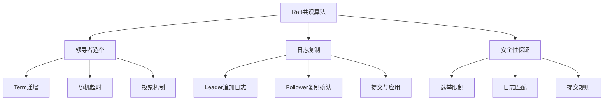
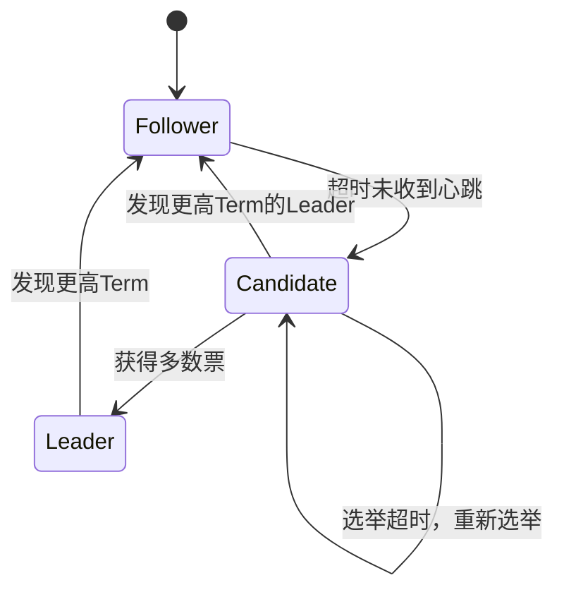

# 技巧3：Raft共识算法

## 概述与背景

Raft是一种分布式共识算法（Consensus Algorithm），用于在多个节点之间就某个值达成一致。它由Diego Ongaro和John Ousterhout于2014年在论文《In Search of an Understandable Consensus Algorithm》中提出，目标是提供与Paxos等价的强一致性保证，同时具备更好的可理解性。

共识算法解决的核心问题是：**在分布式系统中，如何让多个独立运行的节点对某个决策达成一致，即使部分节点发生故障也能正常工作。** 这是分布式数据库、分布式存储系统的基石——TiDB、CockroachDB、etcd等系统都依赖Raft实现数据复制和高可用。

### Raft与Paxos的关系

Paxos是1989年Lamport提出的经典共识算法，被Google在Chubby、Spanner等系统中广泛使用。但Paxos以难以理解和实现著称，工程实践中通常需要在其基础上做大量修改。Raft的核心贡献在于：

1. **将共识问题分解为三个子问题**：领导者选举（Leader Election）、日志复制（Log Replication）、安全性保证（Safety）
2. **强领导者模型**：所有请求都通过领导者处理，简化了日志复制逻辑
3. **随机化的选举超时**：避免了需要额外投票轮次的复杂机制

### Raft的应用场景

| 应用系统 | Raft的用途 | 关键特性 |
|----------|-----------|----------|
| TiKV（TiDB存储层） | Region副本复制 | Multi-Raft，每个Region独立Raft组 |
| etcd | 元数据一致性存储 | Kubernetes核心依赖，3/5节点集群 |
| CockroachDB | Range副本复制 | 嵌入式Raft，与分布式事务集成 |
| Consul | 服务发现元数据 | 健康检查状态的共识存储 |
| ClickHouse Keeper | 替代ZooKeeper | 集群协调与配置管理 |

---

## 核心概念：三个子问题

Raft将共识问题分解为三个相对独立的子问题，每个子问题都有清晰的输入、输出和状态机。



### 节点状态

每个Raft节点在任意时刻处于以下三种状态之一：



| 状态 | 职责 | 关键行为 |
|------|------|----------|
| **Follower（跟随者）** | 被动接收日志和心跳 | 响应Leader的RPC请求，不主动发起通信 |
| **Candidate（候选人）** | 竞选成为Leader | 向其他节点发送RequestVote请求，争取投票 |
| **Leader（领导者）** | 处理所有客户端请求 | 维护日志复制，发送心跳维持权威 |

### Term（任期）

Raft将时间划分为连续的任期（Term），每个Term至多有一个Leader。Term是Raft中的逻辑时钟，用于检测过期信息。

Term:    |    1    |    2    |    3    |    4    |    5    |
         |         |         |         |         |         |
Leader:  |  无     |  B      |  无     |  A      |  C      |
         |         |         |         |         |         |
事件:    |  超时   | B当选   | B崩溃   | A当选   | C当选   |
         |  无投票 |         | 超时    |         |         |

每个节点维护当前的Term编号，当发现更大的Term时立即更新。这保证了过期的Leader无法继续提交日志——如果一个节点收到旧Term的请求，它会拒绝并告知最新Term。

---

## 领导者选举

### 选举触发条件

Follower在一定时间内（**选举超时 Election Timeout**）没有收到Leader的心跳，就会转变为Candidate并发起选举。

选举超时机制：

Follower状态：
  收到Leader心跳 → 重置选举计时器
  计时器到期   → 转变为Candidate，发起选举

选举计时器的值：
  通常在 150ms ~ 300ms 之间随机选择
  随机化是关键：避免多个Follower同时发起选举导致瓜分选票

### RequestVote RPC

候选人向所有其他节点发送RequestVote RPC：

```python
class RequestVoteRequest:
    term: int            # 候选人的Term编号
    candidate_id: int    # 候选人的节点ID
    last_log_index: int  # 候选人最后一条日志的索引
    last_log_term: int   # 候选人最后一条日志的Term

class RequestVoteResponse:
    term: int            # 响应者的当前Term（用于更新候选人）
    vote_granted: bool   # 是否投票给该候选人
```

**投票规则**（每个Term每个节点只投一票）：

1. 如果 `request.term < currentTerm` → 拒绝投票，返回当前Term
2. 如果该节点在本Term已经投票给别人 → 拒绝投票
3. 如果候选人的日志至少和自己一样新（日志新旧比较规则） → 投票
4. 否则 → 拒绝投票

### 日志新旧比较规则

Raft通过比较最后一条日志的 `(Term, Index)` 来判断日志新旧：

比较规则：
  1. 先比较最后一条日志的Term
     - 如果 Term_A > Term_B → A更新
     - 如果 Term_A < Term_B → B更新
  2. Term相同时，比较Index
     - 如果 Index_A >= Index_B → A不比B旧

这个规则保证了：**拥有更新日志的节点才能成为Leader**，从而保证已提交的日志不会丢失。

### 选举流程示例

时间线 →

节点A(Term1, Leader)    节点B(Term1)    节点C(Term1)    节点D(Term1)
       |                    |               |               |
       |──── 心跳 ─────────▶|               |               |
       |──── 心跳 ─────────────────────────▶|               |
       |──── 心跳 ─────────────────────────────────────────▶|
       |                    |               |               |
  (A崩溃)                   |               |               |
       X                    |               |               |
                            |               |               |
  (选举超时)                 |               |               |
       |          B: 选举超时(200ms)         |               |
       |               |                    |               |
       |               |── RequestVote(T=2) ──▶             |
       |               |── RequestVote(T=2) ──────────────▶|
       |               |                    |               |
       |               |◀── VoteGranted(T=2) ──            |
       |               |◀── VoteGranted(T=2) ─────────────|
       |               |                    |               |
       |               |  B获得2票(含自己)，当选Leader(T=2) |
       |               |                    |               |
       |               |──── 心跳(T=2) ────▶|               |
       |               |──── 心跳(T=2) ──────────────────▶|
       |               |                    |               |
       (A恢复)          |                    |               |
       |               |                    |               |
       |◀── 心跳(T=2) ──  A发现T=2 > T=1   |               |
       |  A变为Follower  |                    |               |

### 选举安全性保证

**为什么随机超时能工作？**

假设有5个节点，选举超时范围是150-300ms：
- 节点A超时200ms，节点B超时180ms，节点C超时250ms...
- B最先超时，发起选举
- 在其他节点超时之前（150ms后），B已经收集到足够的选票
- 即使两个节点同时超时导致瓜分选票，下一轮随机超时后通常只有一个候选人

**典型集群配置**：

| 集群节点数 | 可容忍故障数 | 选举超时建议 | 心跳间隔建议 |
|-----------|-------------|-------------|-------------|
| 3节点 | 1个 | 150-300ms | 50-100ms |
| 5节点 | 2个 | 200-400ms | 100-200ms |
| 7节点 | 3个 | 250-500ms | 100-200ms |

---

## 日志复制

### 日志结构

Raft的日志由连续的日志条目（Log Entry）组成，每个条目包含：

日志条目结构：
┌─────────┬──────────┬─────────────────────┐
│  Term   │  Index   │     Command         │
│ (任期号) │ (日志索引)│  (客户端请求的命令)    │
├─────────┼──────────┼─────────────────────┤
│    1    │    1     │  SET x = 1          │
│    1    │    2     │  SET y = 2          │
│    2    │    3     │  SET x = 3          │  ← 新Term的首条日志
│    2    │    4     │  SET z = 4          │
│    2    │    5     │  DEL y              │
└─────────┴──────────┴─────────────────────┘
                    ↑
              最后一条日志 (last_log_index=5, last_log_term=2)

### 复制流程

客户端向Leader发送写请求后的完整流程：

客户端 → Leader → Follower复制 → 提交 → 应用到状态机 → 响应客户端

详细步骤：
1. Leader收到客户端请求 (SET x = 5)
2. Leader将命令追加到自己的日志 (Index=6, Term=current)
3. Leader通过AppendEntries RPC将日志发送给所有Follower
4. 多数节点确认后，Leader提交该日志
5. Leader将已提交的日志应用到状态机
6. Leader回复客户端操作成功

### AppendEntries RPC

```python
class AppendEntriesRequest:
    term: int              # Leader的Term编号
    leader_id: int         # Leader的节点ID
    prev_log_index: int    # 新日志条目之前的日志索引
    prev_log_term: int     # 新日志条目之前的日志Term
    entries: list          # 要追加的日志条目（空表示心跳）
    leader_commit: int     # Leader的提交索引

class AppendEntriesResponse:
    term: int              # Follower的当前Term（用于Leader更新自己）
    success: bool          # Follower是否成功匹配并追加了日志
    match_index: int       # Follower最后匹配的日志索引（可选优化）
```

### 日志匹配属性（Log Matching Property）

Raft保证以下两个日志匹配属性：

**属性1**：如果两个日志在某个索引处的Term相同，那么这两个日志在该索引及之前的所有条目都相同。

**属性2**：如果两个日志在某个索引处的条目相同，那么这两个日志在该索引及之前的所有条目都相同。

Leader通过 `prev_log_index` 和 `prev_log_term` 来维护这个属性：

Leader日志:  [T1:1] [T1:2] [T2:3] [T2:4] [T2:5] [T2:6]  ← 最新追加
                         ↑
                    prev_log_index=2, prev_log_term=1

Follower日志: [T1:1] [T1:2] [T2:3] [T2:4]
                              ↑ prev_log_index=2匹配 ✓ → 追加 [T2:5] [T2:6]

### 日志冲突与回退

当Follower的日志与Leader不一致时，Leader会递减 `prev_log_index` 重新发送，直到找到匹配点，然后删除冲突的日志并追加新条目。

场景：Follower日志落后或有冲突

Leader:    [T1:1] [T1:2] [T2:3] [T2:4] [T3:5] [T3:6]
Follower:  [T1:1] [T1:2] [T2:3] [T4:4] [T4:5]  ← Term4的条目是冲突的

第1次尝试: prev_log_index=6 → Follower索引不够长，拒绝
第2次尝试: prev_log_index=5 → Follower[5]的Term不匹配，拒绝
第3次尝试: prev_log_index=4 → Follower[4]的Term不匹配，拒绝
第4次尝试: prev_log_index=3 → Follower[3]匹配 ✓
  → Leader发送 [T2:4] [T3:5] [T3:6]
  → Follower删除 [T4:4] [T4:5]，追加新条目

最终结果（一致）:
  Leader:    [T1:1] [T1:2] [T2:3] [T2:4] [T3:5] [T3:6]
  Follower:  [T1:1] [T1:2] [T2:3] [T2:4] [T3:5] [T3:6]  ✓

### 提交规则

Leader只有在满足以下条件时才提交日志：

**规则**：Leader只能提交当前Term的日志条目。对于之前Term的日志条目，只能通过提交当前Term的条目来间接提交。

为什么不能直接提交之前Term的日志？

时间线：

场景（可能导致已提交日志丢失的错误）：
  T1: S1是Leader，复制了Index2(T1)到S2
  T1: S1崩溃，S5当选(T2)，收到新请求写入Index2(T2)
  T2: S5崩溃，S1恢复并当选(T3)
  T3: S1将Index2(T1)复制到S3、S4 → 多数确认
  如果S1直接提交Index2(T1) → S5的Index2(T2)被覆盖 → 安全
  但如果S1还没复制Index3(T3)就提交了Index2(T1) → 可能丢失

正确做法：
  S1必须将Index2(T1)作为自己新Term(T3)的一部分重新提交
  即先追加Index3(T3)并复制，再通过提交Index3间接提交Index2

---

## 安全性保证

Raft通过以下规则保证安全性：

### 1. 选举限制（Election Safety）

每个Term至多一个Leader。通过以下机制保证：

- 每个节点在每个Term最多投一票
- 获得多数票才能成为Leader
- 两票分散时无人当选，随机超时后重新选举

### 2. Leader完整性（Leader Completeness）

如果某个日志条目在某个Term被提交，那么所有更高Term的Leader的日志中都包含该条目。

这是通过选举时的日志比较实现的：只有日志足够新的节点才能赢得选举。

### 3. 状态机安全性（State Machine Safety）

如果一个节点在某个索引处应用了某条日志，那么其他节点在同一索引处不会应用不同的日志。

这是Leader完整性的直接推论——只有包含所有已提交日志的节点才能成为Leader。

### 4. Leader只追加（Leader Append-Only）

Leader永远不会删除或覆盖自己的日志，只追加新条目。

### 5. 不同索引不同日志（No Skipping）

如果两个日志在某个索引处的Term不同，那么它们在该索引之前的所有日志都不同。

---

## 成员变更（Configuration Change）

生产环境中，集群需要在不停机的情况下增减节点。Raft提供了两种成员变更方案。

### 联合共识（Joint Consensus）

分两步完成，保证新旧配置都有多数节点存活才能工作：

阶段1：旧配置生效
  Leader收到新节点配置 (如从3节点扩展到5节点)
  Leader创建联合配置日志 entry(C_old)
  C_old 生效期间，决策需要 C_old 和 C_new 各自的多数同意

阶段2：新配置生效
  当联合配置提交后，Leader创建新配置日志 entry(C_new)
  C_new 生效后，只需要 C_new 的多数同意

完整流程：
  [C_old: {A,B,C}]  →  [C_old+C_new: {A,B,C,D,E}]  →  [C_new: {A,B,C,D,E}]
       ↑                        ↑                            ↑
    只需C_old多数            需要C_old和C_new各自多数       只需C_new多数

### 单节点变更（Single Server Change）

更简单的方案：每次只增加或移除一个节点。

增加节点：
  [A,B,C] → [A,B,C,D]  (添加一个节点)
  新配置提交前，需要原配置的多数同意

移除节点：
  [A,B,C,D] → [A,B,C]  (移除一个节点)
  同样需要原配置的多数同意

**安全性分析**：单次只变更一个节点时，新旧配置的多数节点集合必然有交集，因此不会出现两个Leader。

### 成员变更的实际操作

**etcd集群扩缩容示例**：

```bash
# 查看当前集群成员
etcdctl member list

# 添加新节点
etcdctl member add node4 --peer-urls=https://192.168.1.4:2380

# 在新节点上启动etcd（使用新增的初始集群配置）
etcd --name node4 \
  --initial-cluster "node1=...,node2=...,node3=...,node4=..." \
  --initial-cluster-state existing

# 移除旧节点
etcdctl member remove <member_id>
```

**TiKV扩缩容**：通过PD（Placement Driver）自动管理，无需手动配置Raft成员变更：

```bash
# 添加TiKV节点
tikv-server --pd=PD_ADDRESS --data-dir=/data/tikv

# PD自动将Region的Leader和Follower调度到新节点
# 通过在线成员变更完成扩缩容，无需停机
```

---

## 日志压缩与快照

Raft日志会无限增长，必须通过快照（Snapshot）机制进行压缩。

### 快照机制

日志压缩前：
  日志: [T1:1] [T1:2] [T2:3] [T2:4] [T2:5] [T3:6] [T3:7] [T3:8]
  状态机: {x:5, y:3, z:8}

快照后：
  快照: [last_included_index=5, last_included_term=2, state={x:5, y:3, z:8}]
  日志: [T3:6] [T3:7] [T3:8]  ← 保留未提交的日志

快照包含：
  1. 快照包含的最后日志索引 (last_included_index)
  2. 快照包含的最后日志Term (last_included_term)
  3. 该索引处状态机的完整状态
  4. 集群配置（可选）

### InstallSnapshot RPC

当Follower的日志严重落后时，Leader直接发送快照：

```python
class InstallSnapshotRequest:
    term: int                    # Leader的Term
    leader_id: int               # Leader的ID
    last_included_index: int     # 快照包含的最后日志索引
    last_included_term: int      # 快照包含的最后日志Term
    data: bytes                  # 快照数据（状态机状态）
    done: bool                   # 是否是最后一个分片

class InstallSnapshotResponse:
    term: int                    # Follower的当前Term
```

### 快照触发策略

| 策略 | 触发条件 | 适用场景 |
|------|---------|---------|
| 日志条目数阈值 | 未压缩日志超过N条（如10万） | 通用场景 |
| 日志大小阈值 | 未压缩日志超过N字节（如64MB） | 大日志条目场景 |
| 时间间隔 | 定期触发（如每小时） | 状态机变化频繁的场景 |
| 手动触发 | 运维命令触发 | 维护窗口或紧急清理 |

### 增量快照

传统Raft快照需要传输整个状态机状态，对于大状态机（如数GB的数据库）开销很大。增量快照只传输自上次快照以来的变化：

全量快照：
  传输: 500MB（整个状态机状态）
  耗时: 30秒

增量快照：
  传输: 2MB（只传变化部分）
  耗时: 0.5秒

TiKV实现了增量快照（Inherited Snapshot），通过跳表（Skip List）实现高效的状态比较。

---

## 性能优化

### 1. 批量合并（Batching）

将多个客户端请求合并为一次AppendEntries RPC，减少网络往返：

未优化：
  客户端1 → Leader → Follower (RTT₁)
  客户端2 → Leader → Follower (RTT₂)
  客户端3 → Leader → Follower (RTT₃)
  总延迟 ≈ 3 × RTT

批量优化：
  客户端1 ┐
  客户端2 ├→ Leader → Follower (一次RTT)
  客户端3 ┘
  总延迟 ≈ 1 × RTT

### 2. 并行复制（Parallel Replication）

Leader同时向所有Follower发送日志，而非串行等待：

串行复制（慢）：
  Leader → Follower1 (等待) → Follower2 (等待) → Follower3
  总延迟 ≈ 3 × RTT

并行复制（快）：
  Leader → Follower1 ┐
  Leader → Follower2 ├→ 等待多数响应
  Leader → Follower3 ┘
  总延迟 ≈ max(RTT₁, RTT₂, RTT₃)

### 3. Leader Lease（领导者租约）

在租约期内，Leader可以跳过读请求的Raft日志复制，直接从本地状态机读取：

无Leader Lease：
  读请求 → Leader → 追加空日志 → 复制到多数 → 提交 → 读取状态机 → 响应
  延迟: 2 × RTT + 日志写入

有Leader Lease：
  读请求 → Leader检查租约 → 直接读取状态机 → 响应
  延迟: 0（本地操作）
  前提: 租约期内其他节点不会当选Leader

TiDB实现了基于Follower Read的优化：Follower在确认Leader存活后也可以处理读请求，分散Leader的读压力。

### 4. Pre-Vote（预投票）

解决网络分区恢复后的选举风暴问题。节点在正式发起选举前先进行预投票：

问题场景：
  网络分区 → Leader被隔离 → 其他节点不断发起选举 → Term急剧上升
  分区恢复 → 旧Leader发现更高Term → 退位 → 但刚退位就被选为新Leader
  → 日志不匹配 → 又被退位 → 循环往复

Pre-Vote解决方案：
  1. 节点先发送PreVote请求（不增加Term）
  2. 只有获得多数PreVote同意才正式发起选举
  3. 被分区的节点无法获得多数PreVote → 不会无谓地提升Term

### 5. Pipeline（流水线传输）

允许Leader在等待前一批AppendEntries响应之前就发送下一批：

非Pipeline:
  发送Batch1 → 等待响应 → 发送Batch2 → 等待响应
  总时间: 2 × RTT

Pipeline:
  发送Batch1 → 发送Batch2 → 收到响应1 → 收到响应2
  总时间: 1 × RTT（重叠传输）

---

## 典型部署架构

### 三节点最小集群

┌─────────────────────────────────────────────┐
│              应用层                           │
│  ┌──────────┐  ┌──────────┐  ┌──────────┐  │
│  │ App实例1  │  │ App实例2  │  │ App实例3  │  │
│  └─────┬────┘  └─────┬────┘  └─────┬────┘  │
└────────┼─────────────┼─────────────┼────────┘
         │             │             │
┌────────┼─────────────┼─────────────┼────────┐
│  etcd集群                                 │
│  ┌─────┴────┐  ┌─────┴────┐  ┌─────┴────┐  │
│  │ etcd-1   │  │ etcd-2   │  │ etcd-3   │  │
│  │ (Leader) │←→│ (Follower)│←→│ (Follower)│  │
│  │ 端口:2379│  │ 端口:2379 │  │ 端口:2379 │  │
│  │ 端口:2380│  │ 端口:2380 │  │ 端口:2380 │  │
│  └──────────┘  └──────────┘  └──────────┘  │
│    :2379 客户端API   :2380 集群通信端口       │
└─────────────────────────────────────────────┘

### TiKV Multi-Raft架构

TiKV将数据按Region划分（默认96MB），每个Region是一个独立的Raft组，实现细粒度的负载均衡：

┌─────────────────────────────────────────────────────┐
│  TiDB Server（SQL层）                                │
└────────────────────┬────────────────────────────────┘
                     │
┌────────────────────┴────────────────────────────────┐
│  PD（Placement Driver）— 全局调度中心                  │
│  管理Region元信息，调度Leader/Follower分布             │
└────────────────────┬────────────────────────────────┘
                     │
┌────────────────────┴────────────────────────────────┐
│  TiKV集群                                            │
│                                                       │
│  TiKV-1          TiKV-2          TiKV-3              │
│  ┌─────────┐    ┌─────────┐    ┌─────────┐          │
│  │Region A  │←→  │Region A  │←→  │Region A  │          │
│  │(Leader)  │    │(Follower)│    │(Follower)│          │
│  │          │    │          │    │          │          │
│  │Region B  │    │Region B  │←→  │Region B  │          │
│  │(Follower)│←→  │(Leader)  │    │(Follower)│          │
│  │          │    │          │    │          │          │
│  │Region C  │←→  │Region C  │←→  │Region C  │          │
│  │(Follower)│    │(Follower)│    │(Leader)  │          │
│  └─────────┘    └─────────┘    └─────────┘          │
└─────────────────────────────────────────────────────┘

每个Region独立运行Raft协议
PD根据负载情况自动调度Region的Leader分布
Region超过96MB自动分裂，合并空Region

---

## 主流Raft实现对比

| 特性 | etcd/raft (Go) | raft-rs (Rust, TiKV) | braft (C++) | jraft (Java) |
|------|---------------|----------------------|-------------|--------------|
| 维护者 | etcd社区 | TiKV社区 | 百度 | 蚂蚁金服 |
| 语言 | Go | Rust | C++ | Java |
| 状态机 | 用户实现 | 用户实现 | 用户实现 | 用户实现 |
| 日志存储 | 用户实现 | 用户实现 | 用户实现 | 用户实现 |
| 快照 | 用户实现 | 用户实现 | 内置 | 内置 |
| 成员变更 | 单节点变更 | 单节点变更 | 联合共识+单节点 | 联合共识+单节点 |
| Pre-Vote | 支持 | 支持 | 支持 | 支持 |
| Leader Transfer | 支持 | 支持 | 支持 | 支持 |
| 典型应用 | etcd, Kubernetes | TiKV | BOS | SOFARegistry |

### etcd/raft使用示例

```go
package main

import (
    "go.etcd.io/raft/v3"
    "go.etcd.io/raft/v3/raftpb"
)

// 1. 创建Raft存储
storage := raft.NewMemoryStorage()

// 2. 配置Raft节点
c := &amp;raft.Config{
    ID:              1,
    ElectionTick:    10,    // 选举超时 = 10 × 心跳间隔
    HeartbeatTick:   1,     // 心跳间隔
    Storage:         storage,
    MaxSizePerMsg:   1024 * 1024,
    MaxInflightMsgs: 256,
}

// 3. 创建传输层
transport := &amp;raft.Transport{}

// 4. 启动Raft节点
r, err := raft.NewRawNode(c, nil, transport, storage)
if err != nil {
    log.Fatal(err)
}

// 5. 主循环
for {
    r.Tick()  // 驱动定时器
    
    ready := r.Advance()
    // 处理Ready中的消息、日志等
    processReady(ready)
}
```

### raft-rs (Rust) 使用示例

```rust
use raft::prelude::*;
use raft::{Raft, Config, StateRole};
use raft::storage::MemStorage;

// 1. 创建配置
let config = Config {
    id: 1,
    election_tick: 10,
    heartbeat_tick: 1,
    max_size_per_msg: 1024 * 1024,
    ..Default::default()
};

// 2. 创建存储和传输
let storage = MemStorage::default();
let (sender, receiver) = channel::unbounded();
let transport = MetaTransport::new(sender);

// 3. 创建Raft实例
let mut raft = Raft::new(&amp;config, 1, storage, vec![])?;

// 4. 处理消息循环
loop {
    // 接收消息
    if let Ok(msg) = receiver.try_recv() {
        raft.step(msg)?;
    }
    
    // 驱动tick
    raft.tick();
    
    // 处理Ready
    let ready = raft.ready();
    // ... 处理日志追加、快照等
    raft.advance_apply();
}
```

---

## 常见误区与故障排查

### 误区1：Raft集群必须奇数个节点

**事实**：偶数个节点也能工作（如4节点、6节点），但存在浪费。4节点集群只能容忍1个故障（与3节点相同），但多消耗了一个节点的资源。

节点数与容错能力：
  3节点 → 可容忍1个故障
  4节点 → 可容忍1个故障（浪费1个节点）
  5节点 → 可容忍2个故障
  6节点 → 可容忍2个故障（浪费1个节点）
  7节点 → 可容忍3个故障

### 误区2：Raft保证强一致性就不会丢数据

**事实**：Raft保证的是**已提交数据**的持久化，但未提交的数据在Leader崩溃时可能丢失。

数据丢失窗口：
  客户端写入 → Leader追加日志 → 复制到多数节点 → 提交 → 响应客户端
                                   ↑                        ↑
                              复制前崩溃：数据丢失      提交后崩溃：数据安全
  
  客户端在收到成功响应前，数据可能已经丢失
  → 应用程序需要处理重试和幂等性

### 误区3：更多Follower = 更快的复制

**事实**：Raft的提交只需要多数确认，增加Follower只会增加复制开销而不会加速提交。

3节点集群：需要2个节点确认（1次网络往返）
5节点集群：需要3个节点确认（1次网络往返，但要等待更慢的节点）
  → 如果某Follower特别慢，反而拖慢整体延迟

### 误区4：选举超时设置越大越安全

**事实**：过大的选举超时会导致故障恢复时间过长。需要在安全性和可用性之间权衡。

选举超时权衡：
  太小（<100ms）：网络抖动频繁触发选举，产生大量无效Term
  合适（150-300ms）：兼顾安全性和快速恢复
  太大（>1s）：Leader故障后长时间不可用

### 故障排查清单

| 现象 | 可能原因 | 排查步骤 |
|------|---------|---------|
| 频繁选举 | 网络延迟高/丢包、选举超时太小 | 检查网络RTT、增大选举超时 |
| 日志追加慢 | Follower磁盘慢、网络带宽不足 | 检查磁盘IO、网络带宽 |
| 读请求延迟高 | Leader Lease失效、过多日志复制 | 检查Leader状态、优化读路径 |
| 成员变更失败 | 新节点初始配置错误 | 检查initial-cluster配置 |
| 快照传输慢 | 状态机太大、网络带宽不足 | 启用增量快照、压缩状态 |
| 脑裂 | 网络分区导致双Leader | 检查网络连通性、确认选举安全 |

### 监控指标

```bash
# etcd集群健康检查
etcdctl endpoint health --cluster
etcdctl endpoint status --cluster -w table

# 关键监控指标
etcd_server_has_leader           # 是否有Leader (1=有, 0=无)
etcd_server_leader_changes_seen_total  # Leader切换次数
etcd_server_proposals_failed_total     # 提案失败次数
etcd_disk_wal_fsync_duration_seconds   # WAL刷盘延迟
etcd_network_peer_round_trip_time_seconds  # 节点间RTT
etcd_debugging_mvcc_db_total_size_in_bytes  # 数据库大小

# TiKV Raft监控
raft_store_leader_tick_duration     # Leader tick耗时
raft_store_propose_wait_duration    # 提案等待时间
raft_store_append_log_duration      # 日志追加耗时
raft_store_apply_log_duration       # 日志应用耗时
```

---

## 实战：搭建3节点Raft集群

以下使用etcd演示一个完整的3节点Raft集群搭建过程。

### 环境准备

```bash
# 系统要求：Linux, 2GB+内存, 2核+CPU
sudo apt-get update
sudo apt-get install -y wget

# 下载etcd
ETCD_VERSION="v3.5.12"
wget https://github.com/etcd-io/etcd/releases/download/${ETCD_VERSION}/etcd-${ETCD_VERSION}-linux-amd64.tar.gz
tar xzf etcd-${ETCD_VERSION}-linux-amd64.tar.gz
sudo mv etcd-${ETCD_VERSION}-linux-amd64/etcd* /usr/local/bin/

# 验证安装
etcd --version
etcdctl version
```

### 启动3节点集群

```bash
# 节点1
etcd --name node1 \
  --initial-advertise-peer-urls http://127.0.0.1:2380 \
  --listen-peer-urls http://127.0.0.1:2380 \
  --listen-client-urls http://127.0.0.1:2379 \
  --advertise-client-urls http://127.0.0.1:2379 \
  --initial-cluster "node1=http://127.0.0.1:2380,node2=http://127.0.0.1:2382,node3=http://127.0.0.1:2384" \
  --initial-cluster-state new

# 节点2（另一个终端）
etcd --name node2 \
  --initial-advertise-peer-urls http://127.0.0.1:2382 \
  --listen-peer-urls http://127.0.0.1:2382 \
  --listen-client-urls http://127.0.0.1:2380 \
  --advertise-client-urls http://127.0.0.1:2380 \
  --initial-cluster "node1=http://127.0.0.1:2380,node2=http://127.0.0.1:2382,node3=http://127.0.0.1:2384" \
  --initial-cluster-state new

# 节点3（另一个终端）
etcd --name node3 \
  --initial-advertise-peer-urls http://127.0.0.1:2384 \
  --listen-peer-urls http://127.0.0.1:2384 \
  --listen-client-urls http://127.0.0.1:2382 \
  --advertise-client-urls http://127.0.0.1:2382 \
  --initial-cluster "node1=http://127.0.0.1:2380,node2=http://127.0.0.1:2382,node3=http://127.0.0.1:2384" \
  --initial-cluster-state new
```

### 验证集群

```bash
# 检查集群状态
etcdctl endpoint status --cluster -w table

# 输出示例：
# +-----------+------------------+---------+---------+-----------+
# |   ENDPOINT        |        ID        | VERSION | DB SIZE | IS LEADER | IS LEARNER |
# +-----------+------------------+---------+---------+-----------+
# | http://127.0.0.1:2379 | 8e9e05c52164694d |  3.5.12 |  25 kB |      true |      false |
# | http://127.0.0.1:2380 | 91bc3c398fb3c146 |  3.5.12 |  25 kB |     false |      false |
# | http://127.0.0.1:2382 | fd422379fda50e48 |  3.5.12 |  25 kB |     false |      false |
# +-----------+------------------+---------+---------+-----------+

# 写入测试
etcdctl put mykey "hello raft"

# 读取测试
etcdctl get mykey

# 模拟故障：停止节点3，验证集群仍可用
# kill node3进程后
etcdctl put mykey2 "still working"
etcdctl get mykey2

# 恢复节点3，验证数据同步
# 重启node3后
etcdctl get mykey2  # 应该能看到数据
```

### 性能基准测试

```bash
# 使用bench工具测试写性能
etcdctl check perf --load=type=lease --expect-per-second=50

# 或使用官方benchmark工具
benchmark \
  --endpoints=http://127.0.0.1:2379 \
  --conns=100 \
  --clients=1000 \
  --type=put \
  --key-size=8 \
  --value-size=256 \
  --total=100000
```

---

## 与其他共识算法的对比

| 特性 | Raft | Paxos | Zab (ZooKeeper) | PBFT |
|------|------|-------|-----------------|------|
| 可理解性 | 高 | 低 | 中 | 低 |
| 强领导者 | 是 | 否 | 是 | 否 |
| 日志连续性 | 是 | 否 | 是 | 否 |
| 成员变更 | 简单 | 复杂 | 简单 | 复杂 |
| 容错模型 | Crash Fault | Crash Fault | Crash Fault | Byzantine |
| 需要节点数 | 2f+1 | 2f+1 | 2f+1 | 3f+1 |
| 典型实现 | etcd, TiKV | Chubby, Spanner | ZooKeeper | Hyperledger |
| 消息复杂度 | O(N) | O(N²) | O(N) | O(N²) |

**如何选择**：

- **需要高可用的元数据存储** → Raft（etcd）或ZAB（ZooKeeper）
- **需要强一致的分布式数据库** → Raft（TiKV, CockroachDB）
- **需要拜占庭容错** → PBFT（区块链、联盟链）
- **已有Google基础设施** → Paxos（Spanner, Chubby）

---

## 进阶：Raft的扩展与变种

### Multi-Raft

单个Raft组只能使用集群中少数节点的资源。Multi-Raft将数据分为多个独立的Raft组，每个组管理一部分数据，实现资源的充分利用。

单Raft（3节点）：
  所有数据 → Raft组 → 只能用3个节点的资源

Multi-Raft（如TiKV）：
  Region A → Raft组1 → 节点1,2,3
  Region B → Raft组2 → 节点2,3,4
  Region C → Raft组3 → 节点1,3,4
  
  每个节点参与多个Raft组 → 充分利用所有节点资源

### Raft PreVote

在标准Raft中，网络分区恢复后可能导致大量无效选举（Term飙升）。PreVote要求候选人在发起正式选举前先进行预投票：

标准Raft的Term风暴：
  分区期间: Term 1 → 2 → 3 → 4 → 5 → 6 → 7 → 8 ...
  分区恢复: Leader(当前Term=8) → 被旧Leader(Term=8)抢 → 又竞选 → Term继续涨

PreVote防风暴：
  分区期间: PreVote请求被拒绝（无法获得多数）→ 不提升Term
  分区恢复: 只有日志最新的节点能获得PreVote多数 → 正常选举

### Flexible Raft

放松Raft的提交条件以提升性能。标准Raft要求Leader确认日志在自己的多数派中已复制才提交；Flexible Raft允许在更小的多数派中完成提交：

标准Raft: 5节点中需要3个确认
Flexible Raft: 可以配置不同的读写多数派（如写3读2）
  → 读操作更快，但写操作仍保证安全

### Raft与线性一致性读

Raft默认提供线性一致性（Linearizable Read），但实现方式影响性能：

| 实现方式 | 延迟 | 一致性保证 | 适用场景 |
|----------|------|-----------|---------|
| 日志复制读 | 高（2RTT） | 线性一致 | 对一致性要求极高的场景 |
| ReadIndex | 中（1RTT） | 线性一致 | 通用场景 |
| Leader Lease | 低（0RTT） | 近似线性一致 | 读多写少的场景 |

---

## 本节小结

Raft共识算法通过将共识问题分解为领导者选举、日志复制和安全性保证三个子问题，提供了一种可理解且工程友好的分布式一致性解决方案。掌握Raft需要理解：

1. **领导者选举**：随机超时 + 多数投票 + 日志比较 = 安全的Leader产生
2. **日志复制**：AppendEntries RPC + 日志匹配属性 = 一致的日志状态
3. **安全性**：选举限制 + 提交规则 = 不丢已提交数据
4. **成员变更**：联合共识或单节点变更 = 不停机扩缩容
5. **日志压缩**：快照机制 = 控制日志增长
6. **性能优化**：批量合并 + 并行复制 + Leader Lease = 高吞吐低延迟

在实际系统中，Raft不是孤立使用的——它与数据分片（Multi-Raft）、分布式事务（Paxos Commit/Raft + 2PC）、日志压缩（增量快照）等技术紧密配合，共同构成了现代分布式数据库的基石。
